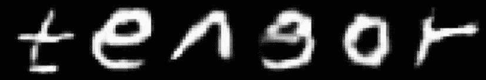

# 印刷体转手写体

你可以通过输入自己手写的 `a–z`、`A–Z` 以及数字 `0–9` 的图像来训练上述网络，使其模仿你的笔迹。利用这个训练好的模型，任何有权访问该模型的人都能将任意印刷文本转换成由你创作的个性化手写文本。我曾使用这样一个训练好的网络中的几个字符来个性化书写单词“tensor”，如图 13-12 所示。

**图 13-12** 通过组合图像创建的示例文本

接下来要创建更复杂的图像。

