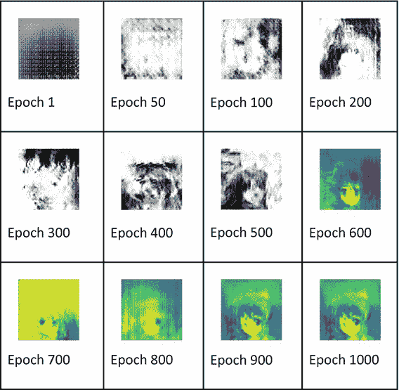

# 彩色卡通图像

到目前为止，你已经创建了手写数字和字母的图像。那么，如何创建像卡通图像这样复杂的彩色图像呢？你目前学到的技术同样可以应用于创建复杂的彩色图像。这正是我将在本项目中演示的内容。

## 下载数据

Kaggle 网站上有大量动漫角色数据集。我们已为本项目准备好了数据集，并将其放在本书的下载网站上供你使用。使用 `wget` 工具将数据下载到你的项目中。

```
! wget --no-check-certificate -r 'https://drive.google.com/uc?export=download&id=1z7rXRIFtRBFZHt-Mmti4HxrxHqUfG3Y8' -O tf-book.zip
```

解压下载文件的内容。

```
!unzip tf-book.zip
```

## 创建数据集

编写一个函数来创建数据集：

```
def load_dataset(batch_size, img_shape,
data_dir = None):
### 创建一个大小为 (30000,64,64,3) 的元组
sample_dim = (batch_size,) + img_shape
### 创建一个形状为 (30000,64,64,3) 的未初始化数组
sample = np.empty(sample_dim, dtype=np.float32)
### 从文件中提取所有图像
all_data_dirlist = list(glob.glob(data_dir))
### 从数据列表中随机选择一个图像文件
sample_imgs_paths = np.random.choice
(all_data_dirlist,batch_size)
for index,img_filename in enumerate
(sample_imgs_paths):
### 打开图像
image = Image.open(img_filename)
### 调整图像大小
image = image.resize(img_shape[:-1])
### 将输入转换为数组
image = np.asarray(image)
### 归一化数据
image = (image/127.5) -1
### 将预处理后的图像赋值给样本
sample[index,...] = image
print("数据已加载")
return sample
```

下载代码不言自明，并附有完整注释，便于你理解。现在调用此函数来创建数据集：

```
x_train=load_dataset(30000,(64,64,3),
"/content/tf-book/chapter13/anime/data/*.png")
BUFFER_SIZE = 30000
BATCH_SIZE = 256
train_dataset = tf.data.Dataset.from_tensor_slices
(x_train).shuffle(BUFFER_SIZE).batch
(BATCH_SIZE)
```

## 显示图像

你可以通过打印数据集中的几张图像来检查数据集是否正确加载。

```
n = 10
f = plt.figure(figsize=(15,15))
for i in range(n):
f.add_subplot(1, n, i + 1)
plt.subplot(1, n, i+1 ).axis("off")
plt.imshow(x_train[i])
plt.show()
```

输出如图 13-13 所示。


**图 13-13** 示例动漫图像

检查训练数据的形状。

```
x_train.shape
```

形状将打印如下：

```
(30000, 64, 64, 3)
```

共有 30,000 张 RGB 图像，每张大小为 64x64。至此，你已经准备好定义模型、训练模型并进行推理。接下来的代码与前两个项目完全相同，因此此处不再重复。你可以在项目下载中查看完整的源代码。我仅展示不同训练周期下的输出结果。

## 输出

不同训练周期生成的图像如表 13-3 所示。

**表 13-3** 不同训练周期生成的示例图像

 |

你可以看到，大约经过 1000 个训练周期，网络已经学到了相当多的内容，能够重现原始卡通图像。要训练模型生成逼真的图像，你需要运行代码 10,000 个周期或更多。每个周期在 GPU 上运行大约需要 16 秒。基本上，我想在这里展示的是，我们为创建简单手写数字而开发的 GAN 技术，可以直接应用于生成复杂的、大型的图像。

## 完整源代码

生成动漫图像的完整源代码见代码清单 13-5。


```python
import tensorflow as tf
import numpy as np
import sys
import os
import cv2
import glob
from PIL import Image
import matplotlib.pyplot as plt
import time
from tensorflow import keras
from tensorflow.keras import layers
from keras.layers import UpSampling2D, Conv2D
! wget --no-check-certificate -r 'https://drive.google.com/uc?export=download&id=1z7rXRIFtRBFZHt-Mmti4HxrxHqUfG3Y8' -O tf-book.zip
!unzip tf-book.zip
def load_dataset(batch_size, img_shape,
data_dir = None):
### 创建一个大小为(30000,64,64,3)的元组
sample_dim = (batch_size,) + img_shape
### 创建一个形状为(30000,64,64,3)的未初始化数组
sample = np.empty(sample_dim, dtype=np.float32)
### 从文件中提取所有图像
all_data_dirlist = list(glob.glob(data_dir))
### 从数据列表中随机选择一个图像文件
sample_imgs_paths = np.random.choice
(all_data_dirlist,batch_size)
for index,img_filename in enumerate
(sample_imgs_paths):
### 打开图像
image = Image.open(img_filename)
### 调整图像大小
image = image.resize(img_shape[:-1])
### 将输入转换为数组
image = np.asarray(image)
### 归一化数据
image = (image/127.5) -1
### 将预处理后的图像赋值给样本
sample[index,...] = image
print("数据加载完成")
return sample
x_train=load_dataset(30000,(64,64,3),
"/content/tf-book/chapter13/anime/data/*.png")
BUFFER_SIZE = 30000
BATCH_SIZE = 256
train_dataset = tf.data.Dataset.from_tensor_slices
(x_train).shuffle(BUFFER_SIZE).batch
(BATCH_SIZE)
n = 10
f = plt.figure(figsize=(15,15))
for i in range(n):
f.add_subplot(1, n, i + 1)
plt.subplot(1, n, i+1 ).axis("off")
plt.imshow(x_train[i])
plt.show()
x_train.shape
gen_model = tf.keras.Sequential()
### 种子图像大小为 4x4
gen_model.add(tf.keras.layers.Dense
(64*4*4,
use_bias=False,
input_shape=(100,)))
gen_model.add(tf.keras.layers.BatchNormalization())
gen_model.add(tf.keras.layers.LeakyReLU())
gen_model.add(tf.keras.layers.Reshape((4,4,64)))
### 输出图像大小仍为 4x4
gen_model.add(tf.keras.layers.Conv2DTranspose
(256, (5, 5),
strides=(1, 1),
padding='same',
use_bias=False))
gen_model.add(tf.keras.layers.BatchNormalization())
gen_model.add(tf.keras.layers.LeakyReLU())
### 输出图像大小为 8x8
gen_model.add(tf.keras.layers.Conv2DTranspose
(128, (5, 5),
strides=(2, 2),
padding='same',
use_bias=False))
gen_model.add(tf.keras.layers.BatchNormalization())
gen_model.add(tf.keras.layers.LeakyReLU())
### 输出图像大小为 16x16
gen_model.add(tf.keras.layers.Conv2DTranspose
(64, (5, 5),
strides=(2, 2),
padding='same',
use_bias=False))
gen_model.add(tf.keras.layers.BatchNormalization())
gen_model.add(tf.keras.layers.LeakyReLU())
### 输出图像大小为 32x32
gen_model.add(tf.keras.layers.Conv2DTranspose
(32, (5, 5),
strides=(2, 2),
padding='same',
use_bias=False))
gen_model.add(tf.keras.layers.BatchNormalization())
gen_model.add(tf.keras.layers.LeakyReLU())
### 输出图像大小为 64x64
gen_model.add(tf.keras.layers.Conv2DTranspose
(3, (5, 5),
strides=(2, 2),
padding='same',
use_bias=False,
activation='tanh'))
gen_model.summary()
noise = tf.random.normal([1, 100])
generated_image = gen_model(noise, training=False)
plt.imshow(generated_image[0, :, :, 0] )
discri_model = tf.keras.Sequential()
discri_model.add(tf.keras.layers.Conv2D
(128, (5, 5), strides=(2, 2),
padding='same',
input_shape=[64,64,3]))
discri_model.add(tf.keras.layers.LeakyReLU())
discri_model.add(tf.keras.layers.Dropout(0.3))
discri_model.add(tf.keras.layers.Conv2D(
256, (5, 5), strides=(2, 2),
padding='same'))
discri_model.add(tf.keras.layers.LeakyReLU())
discri_model.add(tf.keras.layers.Dropout(0.3))
discri_model.add(tf.keras.layers.Flatten())
discri_model.add(tf.keras.layers.Dense(1))
discri_model.summary()
tf.keras.utils.plot_model(discri_model)
decision = discri_model(generated_image)
#将生成的图像输入判别器，如果是假图像，判别器会输出负值；如果是真图像，则会输出正值。
print (decision)
cross_entropy = tf.keras.losses.BinaryCrossentropy
(from_logits=True)
def generator_loss(generated_output):
return cross_entropy(tf.ones_like(generated_output),
generated_output)
def discriminator_loss(real_output,
generated_output):
### 计算损失，假设图像为真实图像 [1,1,...,1]
real_loss = cross_entropy
(tf.ones_like(real_output),
real_output)
### 计算损失，假设图像为假图像 [0,0,...,0]
generated_loss = cross_entropy
(tf.zeros_like
(generated_output),
generated_output)
### 计算总损失
total_loss = real_loss + generated_loss
return total_loss
gen_optimizer = tf.optimizers.Adam(1e-4)
discri_optimizer = tf.optimizers.Adam(1e-4)
epoch_number = 0
EPOCHS = 10000
noise_dim = 100
seed = tf.random.normal([1, noise_dim])
checkpoint_dir =
'/content/drive/My Drive/GAN3/Checkpoint'
checkpoint_prefix = os.path.join
(checkpoint_dir, "ckpt")
checkpoint = tf.train.Checkpoint
(generator_optimizer=gen_optimizer,
discriminator_optimizer=discri_optimizer,
generator= gen_model,
discriminator = discri_model)
from google.colab import drive
drive.mount('/content/drive')
cd '/content/drive/My Drive/GAN3'
def gradient_tuning(images):
### 创建一个噪声向量。
noise = tf.random.normal([16, noise_dim])
### 使用梯度带进行自动微分
with tf.GradientTape()
as generator_tape, tf.GradientTape()
as discriminator_tape:
### 让生成器生成随机图像
generated_images = gen_model
(noise, training=True)
### 让判别器评估真实图像并生成输出
real_output = discri_model(images,
training=True)
### 让判别器评估生成的（假）图像
fake_output = discri_model(generated_images,
training=True)
### 计算生成器在假数据上的损失
gen_loss = generator_loss(fake_output)
### 按之前定义计算判别器损失
disc_loss = discriminator_loss(real_output,
fake_output)
### 计算生成器的梯度
gen_gradients = generator_tape.gradient
(gen_loss,
gen_model.trainable_variables)
### 计算判别器的梯度
discri_gradients = discriminator_tape.gradient
(disc_loss,
discri_model.trainable_variables)
### 使用优化器处理梯度并应用于变量
gen_optimizer.apply_gradients(zip(gen_gradients,
gen_model.trainable_variables))
### 对判别器执行相同操作
discri_optimizer.apply_gradients(
zip(discri_gradients,
discri_model.trainable_variables))
def generate_and_save_images(model, epoch,
test_input):
global epoch_number
epoch_number = epoch_number + 1
### 设置 training=False 以确保推理模式
predictions = model(test_input,
training=False)
### 显示并保存图像
fig = plt.figure(figsize=(4,4))
for i in range(predictions.shape[0]):
plt.imshow(predictions[i, :, :, 0]
* 127.5 + 127.5, cmap="gray")
plt.axis('off')
plt.savefig('image_at_epoch_
{:01d}.png'.format(epoch_number))
plt.show()
def train(dataset, epochs):
for epoch in range(epochs):
start = time.time()
for image_batch in dataset:
gradient_tuning(image_batch)
### 在训练过程中生成图像
generate_and_save_images(gen_model,
epoch + 1,
seed)
### 保存检查点数据
checkpoint.save(file_prefix = checkpoint_prefix)
print ('第 {} 轮耗时 {} 秒'.format
(epoch + 1,
time.time()-start))
train(train_dataset, EPOCHS)
#仅在运行时断开连接时运行此代码
try:
checkpoint.restore(tf.train.latest_checkpoint
(checkpoint_dir))
except Exception as error:
print("加载模型时出错：
{}".format(error))
train(train_dataset, EPOCHS)
清单 13-5
CS-Anime.ipynb
```


