# 1. 神经网络智能简介

在过去几年中，深度学习产业经历了巨大的爆发。深度学习方法在计算机视觉、自然语言处理、机器人技术、时间序列预测和最优控制理论等领域取得了卓越成果。然而，并没有一个“万能模型”可以解决所有问题。每个问题和数据集都需要特定的模型架构来实现合适的性能。机器学习模型，尤其是深度学习模型，拥有大量可调整的参数，这些参数可以极大地影响模型性能。这些包括模型设计、训练方法、模型配置超参数等。模型优化过程针对每个应用甚至每个数据集进行。数据科学家和机器学习专家通常花费大量时间进行手动模型优化。这项活动可能会令人沮丧，因为它耗时太多，通常基于专家的经验和准随机搜索。

然而，最近在自动机器学习和深度学习元优化方面的成果使得自动化特定任务的优化过程成为可能。从头开始创建全新的模型架构，而不需要任何解决过去类似问题的经验，也成为可能。神经网络智能（**NNI**）工具包提供了解决最具挑战性的自动深度学习问题的最新最先进技术。我们将从本章开始探索 NNI 的基本功能。

## 什么是自动深度学习？

在我们深入探讨 NNI 技术之前，让我们谈谈自动深度学习，考察其用例，以及为什么你需要它。现代机器学习模型在其设计中可能包含巨大的复杂性。架构可能包含数千个可调整的参数和不同神经网络层之间的连接。从计算上讲，测试每个架构超参数组合以选择最佳方案是不可能的。然而，现代图形处理单元已经可以显著加快机器和深度学习模型的训练速度，这意味着许多机器学习过程可以自动化。因此，机器学习中出现了一个新的领域，称为自动机器学习（**AutoML**）。AutoML 处理的任务是自动化最优机器学习模型的生产。AutoML 领域非常年轻，但发展迅速。机器学习可以分为浅层学习和深度学习。浅层学习包含经典方法：随机森林、支持向量机、k-最近邻等。相比之下，深度学习研究基于卷积层、线性层、池化、分割和连接等构建神经网络。浅层学习和深度学习包含类似的自动化机器学习技术，但它们的应用差异很大。因此，我们可以突出一个单独的 AutoML 领域，该领域仅处理深度学习——这个领域被称为自动深度学习（**AutoDL**）。自动深度学习有四个主要部分：

+   超参数优化（**HPO**）

+   神经架构搜索（**NAS**）

+   特征工程

+   模型压缩

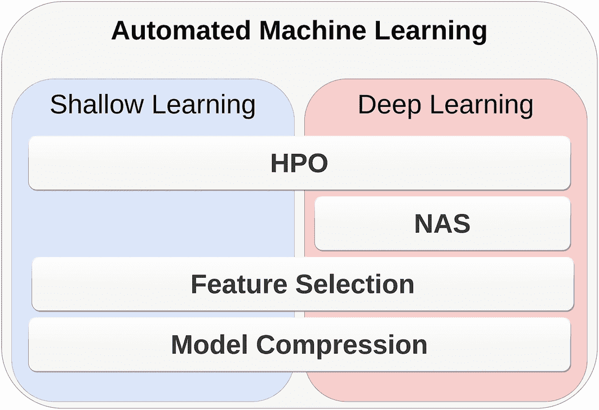

图 1-1

AutoDL 部分

让我们继续讨论我们究竟需要 AutoDL 做什么。

### 无免费午餐定理

我想从以下基本陈述开始，称为无免费午餐（**NFL**）定理。无免费午餐定理指出

> *任何两种优化算法都是等价的*
> 
> *当它们的性能在所有可能的问题上平均时.*
> 
> ——大卫·沃尔珀特

让我们详细阐述无免费午餐定理，用更功能性的语言来说。假设我们有一组数据集：***D***[***1***]，***D***[***2***]，***D***[***3***]，...，并且随机搜索算法 ***R*** 在每个数据集 ***D***[***i***] 上的估计性能等于 *r*：

E(***R***; ***D***[***i***]) = *r*，对于任何 *I*(1)

对于任何搜索算法 ***A*** 和任何数据集 ***D***[***i***]（估计为 *r + q*），都存在一个数据集 ***D***[***j***]（估计为 *r - q*）：

E(**A**; **D**[**i**]) = *r* + *q*，E(**A**; **D**[**j**]) = *r* – *q*(2)

声明 2 表示，如果算法 ***A*** 在数据集 ***D***[***i***] 上优于随机算法 ***R***，那么存在数据集 ***D***[***j***]，使得算法 ***A*** 将劣于随机算法 ***R***，并且 E(***A***; ***D***[***i***]*) +* E*(****A****;* ***D***[***j***]*) = E(****R****;* ***D***[***i***]*) + E(****R****;* ***D***[***j***]*)*. 这一事实使得如果我们从特定的数据集和任务中单独考虑所有算法，则所有算法都是等效的。例如，假设我们有一个算法 ***A***，用于通过表 1-1 中列出的规则预测下一个盒子的颜色。

表 1-1

盒子预测算法

| 规则 | 前一个盒子 | 当前盒子 | 预测 |
| --- | --- | --- | --- |
| 1 | 黑色 | 黑色 | 白色 |
| 2 | 黑色 | 白色 | 白色 |
| 3 | 白色 | 黑色 | 黑色 |
| 4 | 白色 | 白色 | 黑色 |

预测算法 **A** 在数据集 **D**[**1**] 上，其中两个黑色盒子紧随两个白色盒子，两个白色盒子紧随两个黑色盒子，如图 1-2 所示，以 100% 的准确率工作。

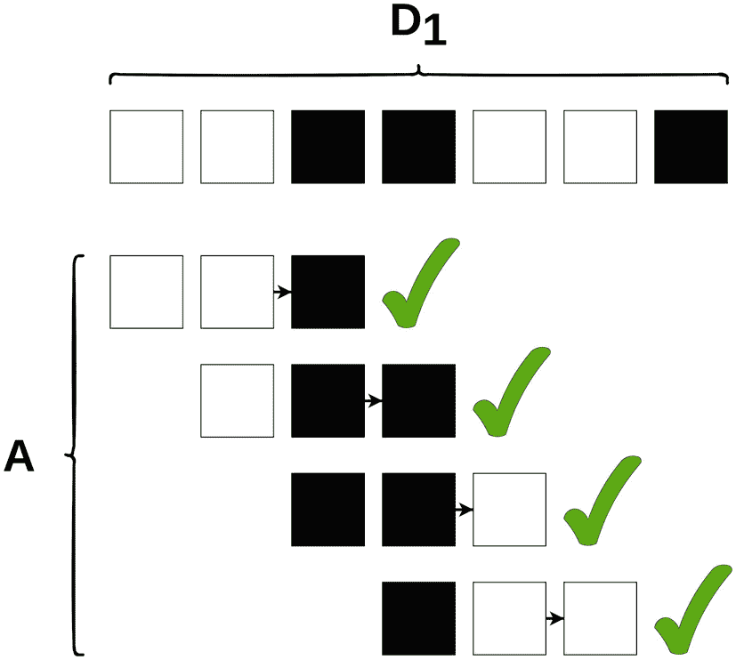

图 1-2

预测算法 **A** 在数据集 **D**[**1**] 上的性能：100% 准确率

但让我们来考察算法 **A** 在数据集 **D**[**2**] 上的工作方式，其中白盒子和黑盒子依次交替，如图 1-3 所示。

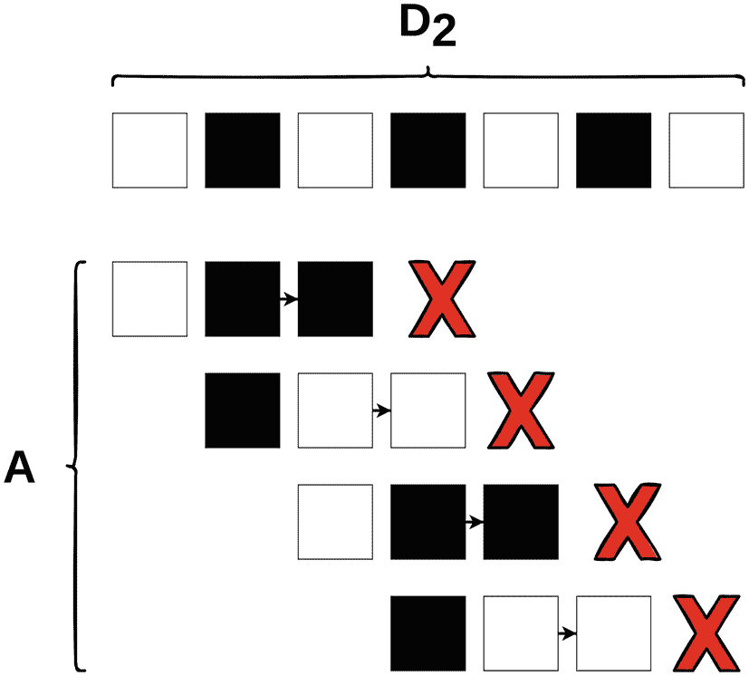

图 1-3

预测算法 **A** 在数据集 **D**[**2**] 上的性能：0% 准确率

图 1-3 表明算法 **A** 在数据集 **D**[**2**] 上的准确率为 0%。这个例子说明了“没有适用于所有数据集的最佳算法”和“没有适用于所有情况的最佳解决方案”。NFL 定理如何影响深度学习？每个深度学习模型和每个数据集都生成一个需要最小化的损失函数。如果我们有两个深度学习模型，**M**[**1**] 和 **M**[**2**]，那么这意味着它们只对某些类型的问题和某些类型的数据集表现出良好的结果。你不能期望同一个深度学习模型在不同的数据集上表现出相似的性能，更不用说不同的类型的问题了。所以，如果你将模型 **M**[**1**] 和模型 **M**[**2**] 应用于数据集 **D**[**1**] 上的问题 **P**[**1**]，你可以预期模型 **M**[**1**] 在这种情况下将表现出良好的性能，而模型 **M**[**2**] 将表现出较差的性能。图 1-4 阐述了这一点。

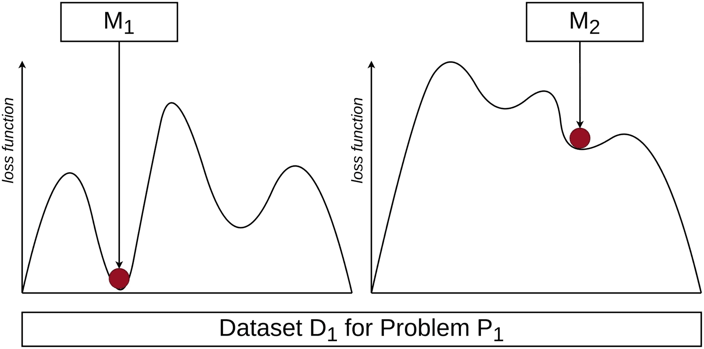

图 1-4

模型 M[1] 和 M[2] 在数据集 D[1] 上对问题 P[1] 的性能

但如果将模型应用于不同的问题和不同的数据集，如图 1-5 所示，我们可能会得到相反的结果。

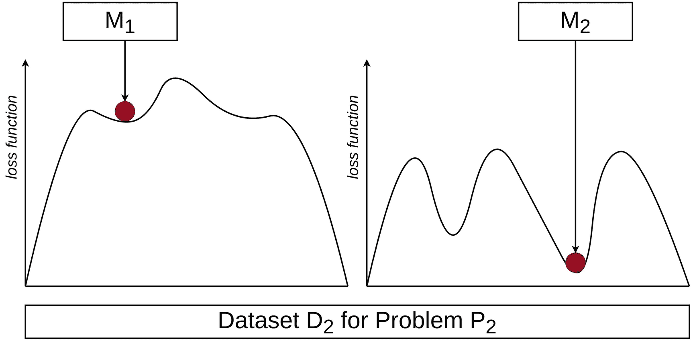

图 1-5

模型 M[1] 和 M[2] 在数据集 D[2] 上对问题 P[2] 的性能

因此，NFL 定理告诉我们，我们不能期望一个模型在不同情况下表现相同。问题陈述的微小修改或数据集的变化都需要对模型进行额外的优化以进行更新。这一事实使得 AutoDL 在准备有效的生产级解决方案中不可或缺。还值得一提的是，现实数据集的集合远小于所有可能数据集的集合，这使得确定解决特定问题最适合的算法类别成为可能。尽管如此，NFL 定理仍然成立，因为为所有类型的问题选择最佳算法是不可能的。

### 将新的深度学习技术注入现有模型

假设我们有一个表现良好且结果令人满意的深度学习模型。后来，出现了一种新的深度学习技术，可以显著提高我们模型的表现。这可能是一个特殊的深度学习层、块、单元或新的激活函数。但我们不知道如何将这项技术精确地注入模型架构中。这可以通过 AutoDL 实现，它将在当前的深度学习模型设计中最大限度地利用新技术。图 1-6 说明了这种方法。

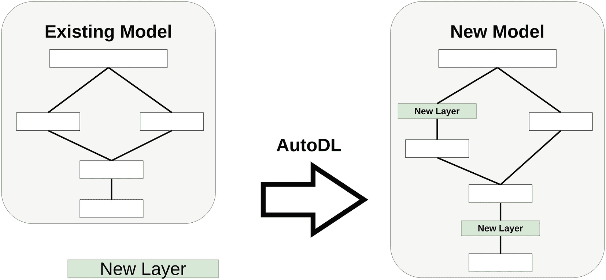

图 1-6

注入新的深度学习技术

这种方法将有助于更新模型，使其能够利用深度学习的最新进展，从而提高模型性能。

### 将模型调整到新数据集

假设我们有一个模型，该模型解决了纽约能源消耗预测的问题。该模型已在历史数据集上训练，并且表现良好。我们决定将该模型移植到柏林的能源消耗预测中。我们预计该模型在柏林的表现将与在纽约的表现一样好。但是，另一个国家的人们可能会有一些不同的习惯和行为，这可能会影响原始模型正确捕捉模式的能力。因此，为新的柏林历史数据集定制原始模型会很好。图 1-7 展示了现有模型如何适应新数据集，更新其一些超参数，如卷积层滤波器、线性层特征等。

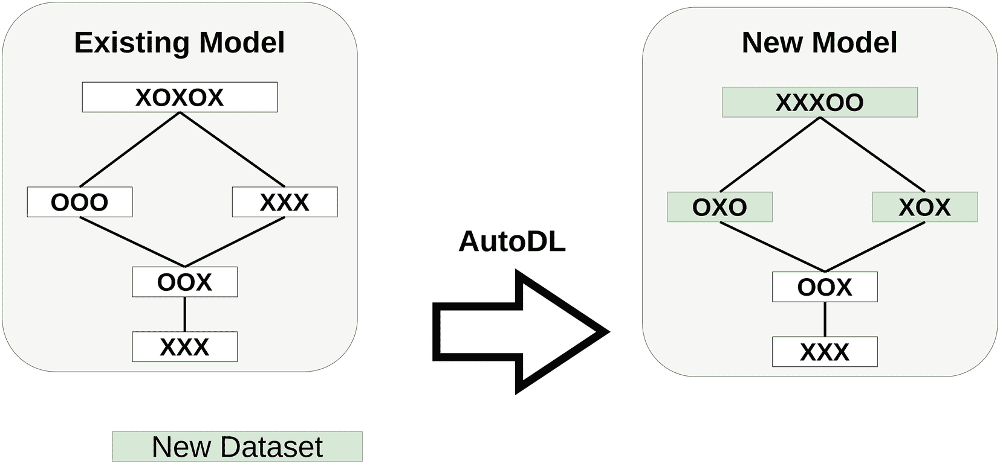

图 1-7

将模型适应新的数据集

使用 AutoDL 技术，您可以适应其他数据集。

### 从零开始创建新模型

这是最激动人心的部分。假设我们有一个任务，对于能够处理这个任务的神经网络架构没有任何想法。我们可以从其他任务中借鉴一些想法，进行手动调查，研究数据集的统计特性，等等。但截至目前，存在神经架构搜索（**NAS**）方法，允许您从头开始构建一个可用于生产的神经网络，如图 1-8 所示。

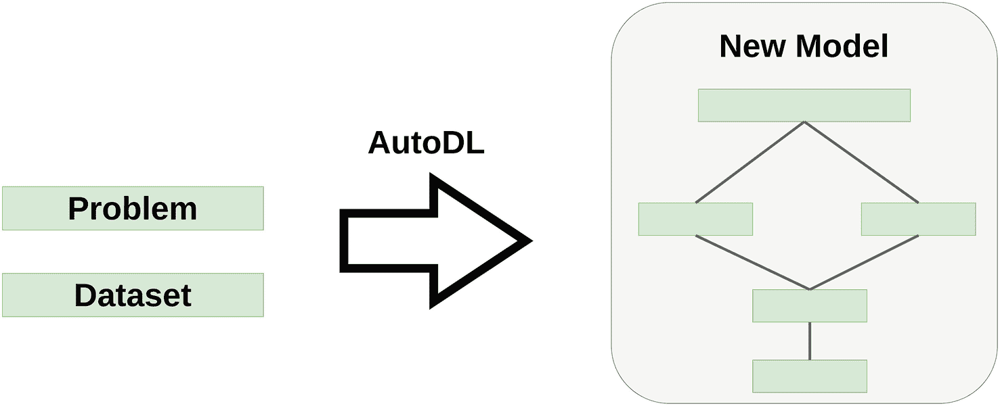

图 1-8

神经架构搜索

我发现这将是进一步研究和实际应用的绝佳方向。人类已经开发了基于误差反向传播的深度学习模型及其训练。特定架构的神经网络可以揭示最复杂的依赖关系和模式。那么，为什么不进一步发展神经网络设计算法，为特定任务创建最优的神经网络架构呢。

### 重新发明轮子

许多机器学习专家花费大量时间开发现有方法来解决前面描述的问题。自动化机器学习技术可以节省数周甚至数月的时间。当然，自动化深度学习不能替代深度学习工程师，而人类经验和直觉是当今所有发明的主要驱动力。但无论如何，AutoDL 可以显著减少所需的自定义工作量。自动化深度学习应该成为解决可以节省大量时间的实际问题的必备工具。

## 与源代码一起工作

本书展示了许多实际示例，并附有可以从以下 GitHub 存储库下载的源代码。本书包含许多实际示例和代码列表。本书每一章的源代码列表都附在每一章后面。您可以从以下 GitHub 存储库下载源代码：[`github.com/Apress/automated-deep-learning-using-neural-network-intelligence`](https://github.com/Apress/automated-deep-learning-using-neural-network-intelligence)。本书中的大部分列表都是以源代码形式呈现的。本书中的所有命令都是在源代码文件夹的根目录下运行的。

## 神经网络智能安装

神经网络智能（**NNI**）是一个强大的工具包，帮助用户解决自动化机器学习（AutoML）问题。NNI 管理搜索过程，可视化结果，并将 AutoML 任务分发到不同的机器学习平台。

### 安装

NNI 的最小系统要求是：Ubuntu 18.04；macOS 11；Windows 10 21H2 和 Python 3.7。

NNI 可以按照以下步骤简单安装：

```py
pip install nni
```

本书将使用版本 2.7，因此我强烈建议安装版本 2.7 以避免版本差异：

```py
pip install nni==2.7
```

让我们通过执行“*Hello World*”场景来测试安装。运行以下命令（`ch1/install/hello_world/config.yml`文件包含在源代码中）：

```py
nnictl create --config ch1/install/hello_world/config.yml
```

如果安装成功，您应该看到以下输出：

```py
INFO:  Starting restful server...
INFO:  Successfully started Restful server!
INFO:  Starting experiment...
INFO:  Successfully started experiment!
The experiment id is 
The Web UI urls are: http://127.0.0.1:8080
```

您可以在浏览器中跟随链接[`127.0.0.1:8080`](http://127.0.0.1:8080)。图 1-9 展示了我们将在下一节中介绍的 NNI 网络用户界面。

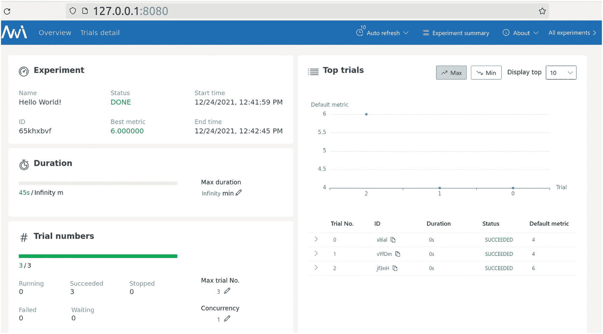

图 1-9

NNI WebUI

如果一切正常，您可以通过在命令行中执行以下操作来停止 NNI：

```py
nnictl stop
```

### Docker

如果您在安装过程中遇到任何问题，可以使用为本书准备的 Docker 镜像。列表 1-1 中的 `Dockerfile` 基于官方 NNI Docker 镜像 `msranni/nni:v2.7`，该镜像来自官方 Docker 仓库：[`https://hub.docker.com/r/msranni/nni/tags`](https://hub.docker.com/r/msranni/nni/tags)。

```py
FROM msranni/nni:v2.7
RUN mkdir /book
ADD . /book
EXPOSE 8080
ENTRYPOINT ["tail", "-f", "/dev/null"]
Listing 1-1
NNI Dockerfile for the book.
```

您可以构建一个镜像

```py
docker build -t autodl_nni_book .
```

Docker `autodl_nni_book` 镜像包含运行本书中所有实验所需的所有库和依赖项。

让我们使用 Docker 运行我们在上一节中检查的“*Hello World*”场景。我们启动 Docker 容器：

```py
docker run -t -d -p 8080:8080 autodl_nni_book
```

然后，我们在 Docker 容器中运行 NNI：

```py
docker exec  bash -c "nnictl create --config /book/ch1/install/hello_world/config.yml"
```

然后，您可以通过浏览器访问 NNI WebUI，网址为 `http://127.0.0.1:8080`。本书的代码仓库位于 Docker 镜像的 `/book` 目录中。因此，在 `autodl_nni_book` Docker 镜像中，您可以执行所有涉及 NNI 的命令，如下所示：

```py
docker exec  bash -c "nnictl "
```

但无论如何，Docker 的功能是有限的。为了灵活调试并与 NNI 更好地交互，我强烈建议如果可能的话，您在不使用 Docker 的情况下与 NNI 一起工作。

### 搜索空间、调优器和试验

让我们快速了解一下 NNI 的一个核心概念。当我们优化一个模型时，我们选择一组特定的参数来决定我们模型的操作。**搜索空间**定义了这组参数。搜索空间是自动机器学习中的一个关键概念。搜索空间包含所有可能且理论上可接受的优化模型的参数和架构。

虽然搜索空间包含有限数量的参数，但无论如何，在大多数情况下，测试搜索空间中的所有参数实际上是不可能的。搜索空间太大。因此，在选择最合适和最有希望的参数进行测试时，应用了一个称为 **调优器** 的特殊组件。调优器估计结果并选择新的参数来检查它们对模型优化的适用性。

调优器在搜索空间中选择一个参数并将其传递给 **试验**。试验是一个 Python 脚本，它使用调优器传递的参数测试模型，并返回一个估计模型性能的指标。

这个搜索过程可以如图 1-10 所示。

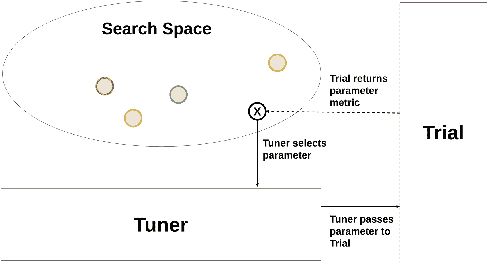

图 1-10

搜索空间、调优器和试验

经过一定数量的试验后，我们获得了足够多的结果来估计每个参数对优化模型的适用性。

### 黑盒函数优化

让我们通过优化一个黑盒函数来考察 NNI 的工作原理。黑盒函数是一个接收输入参数并返回值的函数，但我们对其内部运作一无所知。有时，我们知道黑盒函数的行为，在某些情况下，甚至知道其公式。但这个函数的性质如此复杂，以至于分析研究过于具有挑战性。

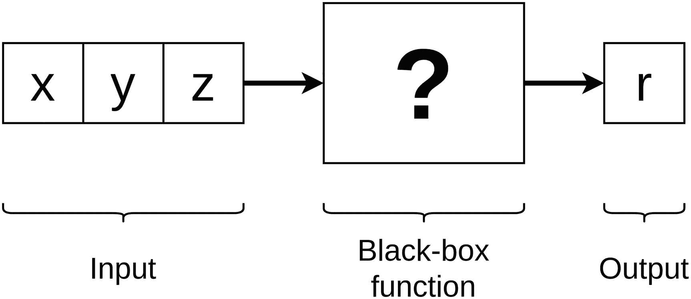

图 1-11

黑盒函数

当我们说我们需要优化黑盒函数时，这意味着我们需要找到使黑盒函数输出最高值的输入参数。假设我们有一个黑盒函数，该函数由列表 1-2 中的代码定义。

```py
from math import sin, cos
def black_box_function(x, y, z):
"""
x in [1, 100] integer
y in [1, 10] integer
z in [1, 10000] real
"""
if y % 2 == 0:
if x > 50:
r = (pow(x, sin(z)) - x) * x / 2
else:
r = (pow(x, cos(z)) + x) * x
else:
r = pow(y, 2 - sin(x) * cos(z))
return round(r / 100, 2)
Listing 1-2
Black-box function. ch1/bbf/black_box_function.py
```

当然，列表 1-2 中函数的优化问题可以通过分析解决，但让我们假装我们不知道函数在黑盒内部是如何工作的。我们所知道的是，黑盒函数返回实值并接收以下输入参数：

+   `x` 是从 1 到 100 的正整数

+   `y` 是从 1 到 10 的正整数

+   `z` 是从 1 到 10 000 的浮点数

让我们从定义搜索空间开始解决问题。搜索空间使用特殊指令以 JSON 格式定义。我们将使用以下 JSON 文件定义搜索空间。

```py
{
"x": {"_type": "quniform", "_value": [1, 100, 1]},
"y": {"_type": "quniform", "_value": [1, 10, 1]},
"z": {"_type": "quniform", "_value": [1, 10000, 0.01]}
}
Listing 1-3
Search space. ch1/bbf/search_space.json
```

`quniform` 指令从 `a` 到 `b` 以步长 `s` 创建一个值列表。因此，列表 1-3 中定义的搜索空间可以以下述方式表示：

+   `x` 在 [1, 2, 3, …, 99, 100] 范围内

+   `y` 在 [1, 2, 3, …, 9, 10] 范围内

+   `z` 在 [1, 1.01, 1.02, …, 9 999.99, 10 000] 范围内

注意

我们将在下一章更详细地探讨如何定义搜索空间。

现在，让我们继续到 trial 定义。

```py
import os
import sys
import nni
# For NNI use relative import for user-defined modules
SCRIPT_DIR = os.path.dirname(os.path.abspath(__file__)) + '/../..'
sys.path.append(SCRIPT_DIR)
from ch1.bbf.black_box_function import black_box_function
if __name__ == '__main__':
# parameter from the search space selected by tuner
p = nni.get_next_parameter()
x, y, z = p['x'], p['y'], p['z']
r = black_box_function(x, y, z)
# returning result to NNI
nni.report_final_result(r)
Listing 1-4
Trial. ch1/bbf/trial.py
```

Trial 从 NNI 使用 `nni.get_next_parameter` 函数接收参数，并使用 `nni.report_final_result` 返回指标。Trial 接收 NNI 参数，将它们传递给黑盒函数，并返回结果。列表 1-4 必须由 NNI 服务器运行，因此如果你尝试运行它，将会出错。

注意

我们将在下一章更详细地探讨如何定义 trial。

最后，我们还需要定义我们的实验配置，该配置将寻找黑盒函数的最佳输入参数。

```py
trialConcurrency: 4
maxTrialNumber: 1000
searchSpaceFile: search_space.json
trialCodeDirectory: .
trialCommand: python3 trial.py
tuner:
name: Evolution
classArgs:
optimize_mode: maximize
trainingService:
platform: local
Listing 1-5
Experiment configuration. ch1/bbf/config.yml
```

我们在列表 1-5 中定义的实验具有以下属性：

+   试验执行使用四线程池。

+   试验的最大数量为 1000。

+   搜索空间在 `search_space.json` 中定义。

+   Trial 通过运行 `python3 trial.py` 来执行。

+   NNI 将使用基于遗传算法的 Tuner。

注意

我们将在下一章更详细地探讨如何定义实验配置。

现在一切准备就绪，我们可以找到最大化黑盒函数的输入参数。让我们运行 NNI：

```py
nnictl create --config ch1/bbf/config.yml
```

你可以在网页面板中监控实验过程：[`http://127.0.0.1:8080`](http://127.0.0.1:8080)。

注意

通常，测试深度学习模型架构需要几分钟的时间，而 NNI 优化的是更长的试验。因此，NNI 不适合高速测试，执行黑盒函数的值可能比预期的花费更多时间。这是由于主 NNI 进程与其子进程之间的数据交换机制。如果你想缩短实验执行时间，请在 ch1/bbf/config.yml 中将`maxTrialNumber`参数更改为`100`。

实验完成后，你可以在 NNI 概览页面观察到返回最佳指标的参数：[`http://127.0.0.1:8080/oview`](http://127.0.0.1:8080/oview)。

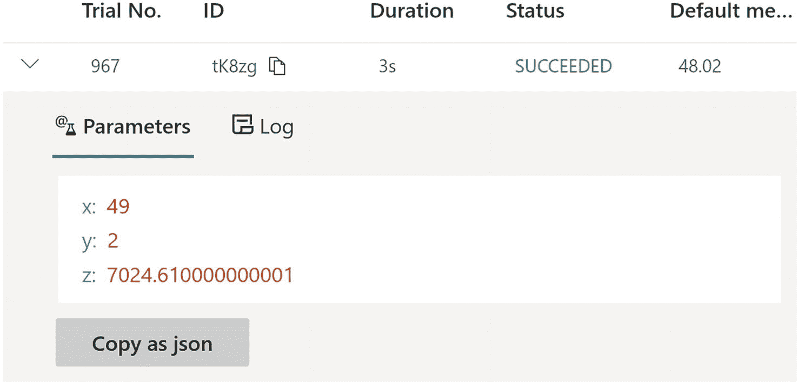

图 1-12

黑盒函数优化的 NNI 最佳试验

我们看到参数（`x=49, y=2, z=7024.61`）是实验的最佳结果。这个参数对应的函数返回`48.02`，是所有试验中的最大值。当然，我们可能以更简单的方式获得相同的结果，但现在我们正在介绍 NNI 的基本功能。在下一章中，我们将看到这个工具的全部威力。

## Web 用户界面

尽管 NNI 允许你保存试验结果并在以后分析它们，NNI 提供了一个方便的 Web 用户界面来监控实验和分析其结果。让我们来探索这个 Web 面板的主要功能。

### 概览页面

概览页面 [`http://127.0.0.1:8080/oview`](http://127.0.0.1:8080/oview) 包含了关于正在运行的实验的摘要信息。

上左面板包含有关实验状态的信息（图 1-13）。

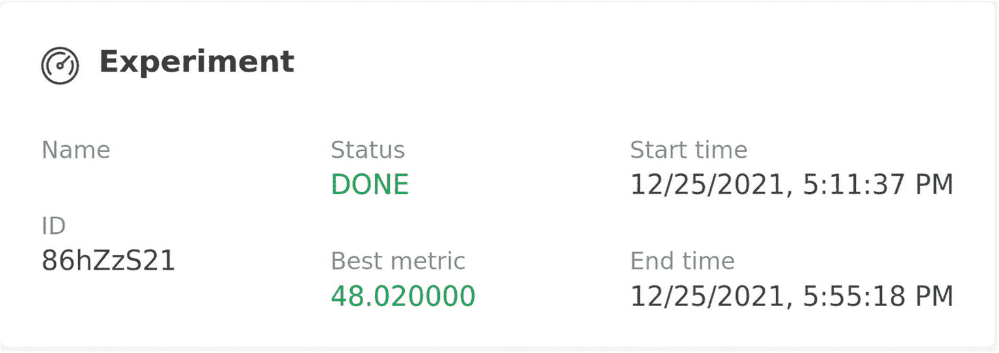

图 1-13

实验状态面板

左下面板显示了执行的试验次数和运行时间。最大试验次数和最大时间可以即时编辑（图 1-14）。

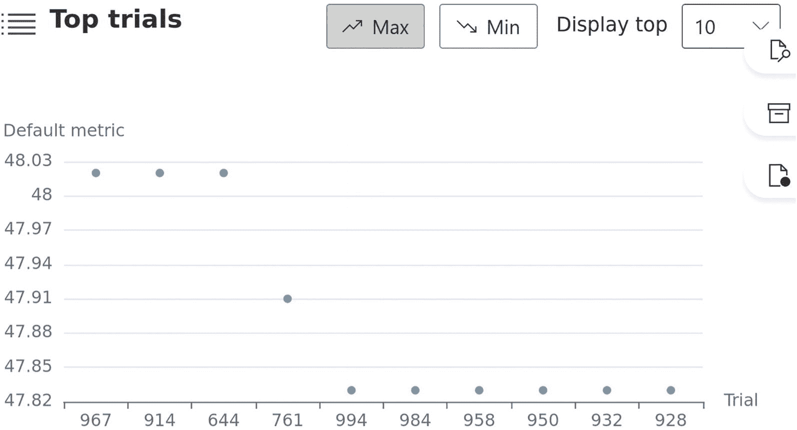

图 1-14

试验编号面板

概览页面右侧面板包含了对顶级试验的总结（图 1-15）。

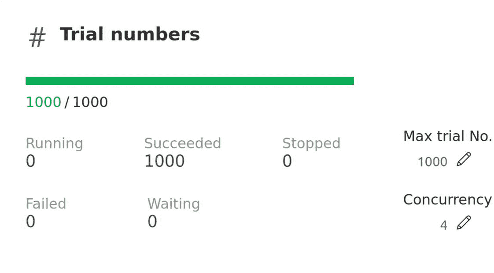

图 1-15

顶级试验面板

如果你只想运行一个实验并获取最佳测试结果，那么你只能处理概览页面。但要对实验执行进行更详细的分析，你需要试验详情页面。

### 试验详情页面

试验详情页面 [`http://127.0.0.1:8080/detail`](http://127.0.0.1:8080/detail) 包含了试验执行的便捷可视化。指标面板包含试验及其指标的历史记录。如果你切换优化曲线，这个面板就变得非常有用。然后你可以观察调优器的搜索进度（图 1-16）。

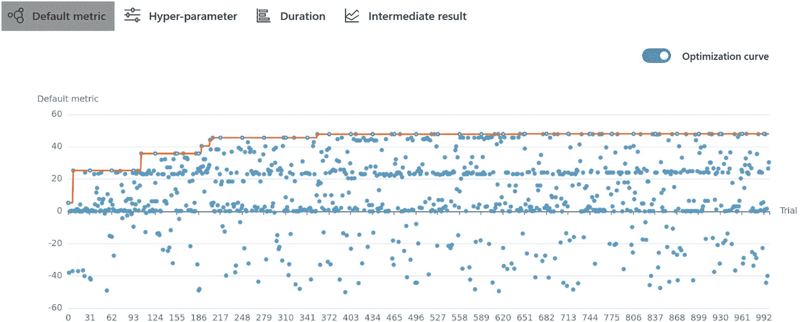

图 1-16

指标面板

超参数面板包含最有价值的可视化之一。它显示了输入参数与测试指标之间的关系（图 1-17）。

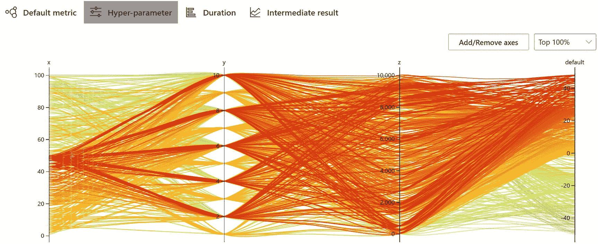

图 1-17

超参数面板

此面板允许超参数数据挖掘，帮助你更好地理解所研究的黑盒函数的本质。我们将在此停留一会儿。选择超参数面板（图 1-18）上的前 5% 试验。

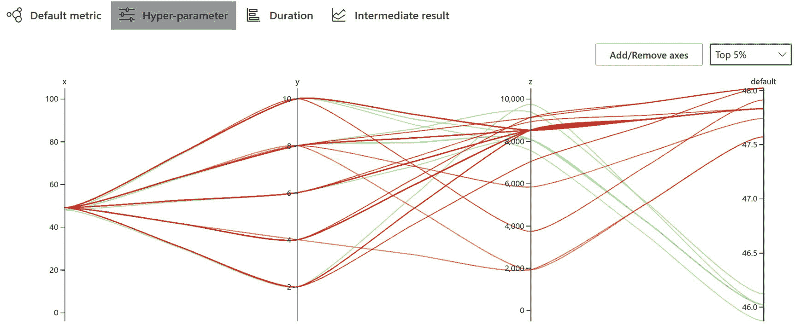

图 1-18

超参数面板。前 5%

我们可以从图 1-18 中获得很多见解。对于所有前 5% 的试验，以下都是正确的：

+   `x` 是一个小于 `51` 的整数，即 `50, 49, 48`。

+   `y` 是偶数。

+   `z` 可能不会显著影响黑盒函数的返回值，或者可能需要进一步的研究。

根据我们在这里获得的信息，我们可以执行自己的简化搜索，找到接近 NNI 实验中找到的 `48.02` 的最佳参数。让我们检查列表 1-6。

```py
import random
from ch1.bbf.black_box_function import black_box_function
seed = 0
random.seed(0)
max_ = -100
best_trial = None
for _ in range(100):
x = random.choice([50, 49, 48])
y = random.choice([2, 4, 6, 8, 10])
z = round(random.uniform(1, 10_000), 2)
r = black_box_function(x, y, z)
if r > max_:
max_ = r
best_trial = f'(x={x}, y={y}, z={z}) -> {r}'
print(best_trial)
Listing 1-6
Black-box function optimization. ch1/bbf/custom_search.py
```

列表 1-6 返回 `(x = 50, y = 2, z = 4756.58) -> 47.96`，这非常接近我们在 NNI 实验中找到的最佳值 `48.02`。接下来的章节将演示检查超参数面板如何帮助你理解有效深度学习模型的关键概念。

页面底部是试验列表面板，列出了所有试验。你可以观察每个试验的参数、日志和指标，如图 1-19 所示。

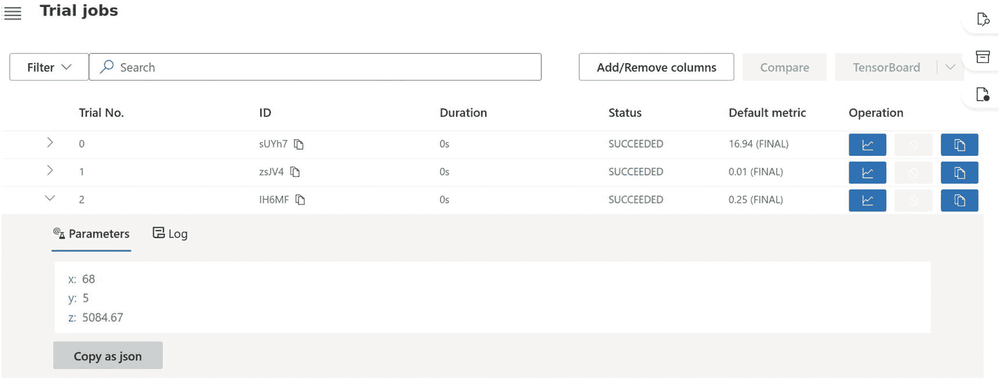

图 1-19

试验列表面板

一个实验通常是一个相当漫长的过程，可能需要几天甚至几周。有时，可能会有一些有趣的假设需要测试。例如，可能需要手动运行具有特定参数的试验。如果你不想等到实验结束，那么你可以通过点击挑战列表中的“复制”按钮将自定义试验添加到队列中。你可以在弹出窗口中输入你的试验参数并提交试验。图 1-20 展示了如何提交自定义试验。

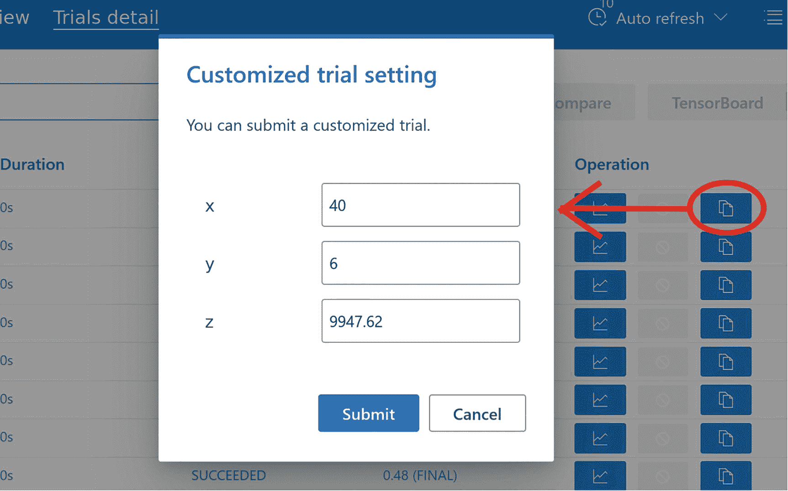

图 1-20

自定义试验

NNI 为实验提供了一个简化管理和监控任务的网页面板。我们将在接下来的章节中多次回到它。

### NNI 命令行

除了网页面板外，你还可以使用命令行界面来管理 NNI 并监控其实验。NNI 的工作目录是 `~/nni-experiments`，其中存储了所有关于实验的数据。

`nnictl create --config <path_to_config>`：启动实验并返回 `<experiment_id>`。在执行过程中，所有关于正在运行的实验的信息都保存在 `~/nni-experiments/<experiment_id>`。

`nnictl stop`：停止正在运行的实验。

`nnictl experiment list --all`：返回所有创建的实验列表。

`nnictl resume <experiment_id>`：恢复已停止的实验。此命令在您想要分析已完成的实验结果时也很有用。

`nnictl view <experiment_id>`：输出有关实验的信息。

`nnictl top`：输出最佳试验。

有关 NNI 命令行工具的更多信息，请参阅

`nnictl --help`

### NNI 实验配置

如我们之前所见，实验的执行是通过一个 YAML 文件（`ch1/bbf/config.yml`）配置的。NNI 允许您灵活地配置实验执行。表 1-2 列出了主要配置参数。

表 1-2

NNI 实验配置设置

| 字段 | 类型 | 描述 |
| --- | --- | --- |
| `experimentName` | `str`可选 | 实验名称 |
| `searchSpaceFile` | `str`可选 | 包含搜索空间定义的 JSON 文件的路径 |
| `searchSpace` | `YAML`可选 | 用于内联搜索空间定义的字段例如，在`ch1/bbf/search_space.json`中定义的搜索空间可以设置在`searchSpace`字段中：`searchSpace:```x:```_type: quniform``_value: [1, 100, 1]``y:```_type: quniform``_value: [1, 10, 1]``z:```_type: quniform``_value: [1, 10000, 0.01]` |
| `trialCommand` | `str`必需 | 执行试验的命令。在 Linux 和 macOS 上使用`python3`，在 Windows 上使用`python` |
| `trialCodeDirectory` | `str`可选默认值：`"."` | 试验目录的路径 |
| `trialConcurrency` | `int` | 并行运行的试验数量 |
| `maxExperimentDuration` | `str`可选 | 限制实验持续时间。默认情况下，实验持续时间不受限制。格式：`数字 + s | m | h | d`例如：`maxExperimentDuration: 5h` |
| `maxTrialNumber` | `int`可选 | 限制试验次数。默认情况下，试验次数不受限制 |
| `maxTrialDuration` | `str`可选 | 限制试验持续时间。默认情况下，试验持续时间不受限制。格式：`数字 + s | m | h | d`例如：`maxTrialDuration: 30m` |
| `debug` | `bool`可选默认值：`False` | 启用调试模式 |
| `tuner` | `YAML`可选 | 指定超参数调整器。详细信息请参阅*第三章* *3* |
| `assessor` | `YAML`可选 | 指定评估者。详细信息请参阅*第三章* *3* |
| `advisor` | `YAML`可选 | 指定顾问。详细信息请参阅*第三章* *3* |
| `trainingService` | `YAML`可选 | 指定训练服务。详细信息请参阅*第七章* *7* |
| `sharedStorage` | `YAML`可选 | 指定共享存储。详细信息请参阅*第七章* *7* |

更多详细信息，请参阅官方文档：[`https://nni.readthedocs.io/en/v2.7/reference/experiment_config.html`](https://nni.readthedocs.io/en/v2.7/reference/experiment_config.html)。

### 内嵌 NNI

尽管 NNI 服务器的功能相当广泛，但 NNI 可以在嵌入式模式下运行。在某些情况下，在 Python 嵌入式模式下运行 NNI 更为方便。这种需求可能出现在需要动态创建实验并更多地控制实验执行时。我们将在下一章的一些示例中使用 NNI 的嵌入式模式。

列表 1-7 展示了在嵌入式模式下执行实验以优化我们之前检查的黑色盒函数的示例。

```py
# Loading Packages
from pathlib import Path
from nni.experiment import Experiment
# Defining Search Space
search_space = {
"x": {"_type": "quniform", "_value": [1, 100, 1]},
"y": {"_type": "quniform", "_value": [1, 10, 1]},
"z": {"_type": "quniform", "_value": [1, 10000, 0.01]}
}
# Experiment Configuration
experiment = Experiment('local')
experiment.config.experiment_name = 'Black Box Function Optimization'
experiment.config.trial_concurrency = 4
experiment.config.max_trial_number = 1000
experiment.config.search_space = search_space
experiment.config.trial_command = 'python3 trial.py'
experiment.config.trial_code_directory = Path(__file__).parent
experiment.config.tuner.name = 'Evolution'
experiment.config.tuner.class_args['optimize_mode'] = 'maximize'
# Starting NNI
http_port = 8080
experiment.start(http_port)
# Event Loop
while True:
if experiment.get_status() == 'DONE':
search_data = experiment.export_data()
search_metrics = experiment.get_job_metrics()
input("Experiment is finished. Press any key to exit...")
break
Listing 1-7
Embedded NNI. ch1/bbf/embedded_nni.py
```

列表 1-7 包含一个事件循环，允许您自动跟踪实验进度。因此，您可以编程设计实验并获得问题的最佳解决方案。

### 故障排除

如果您在启动和使用 NNI 时遇到任何问题或错误，您可以遵循这份迷你指南来确定问题。

**NNI 无法启动**。在这种情况下，您将在运行 `nnictl start` 命令后看到错误输出消息，此错误消息可以帮助您解决问题。

**NNI 正在启动，但在概览网页面板中您会看到一个错误徽章**，如图 1-21 所示。

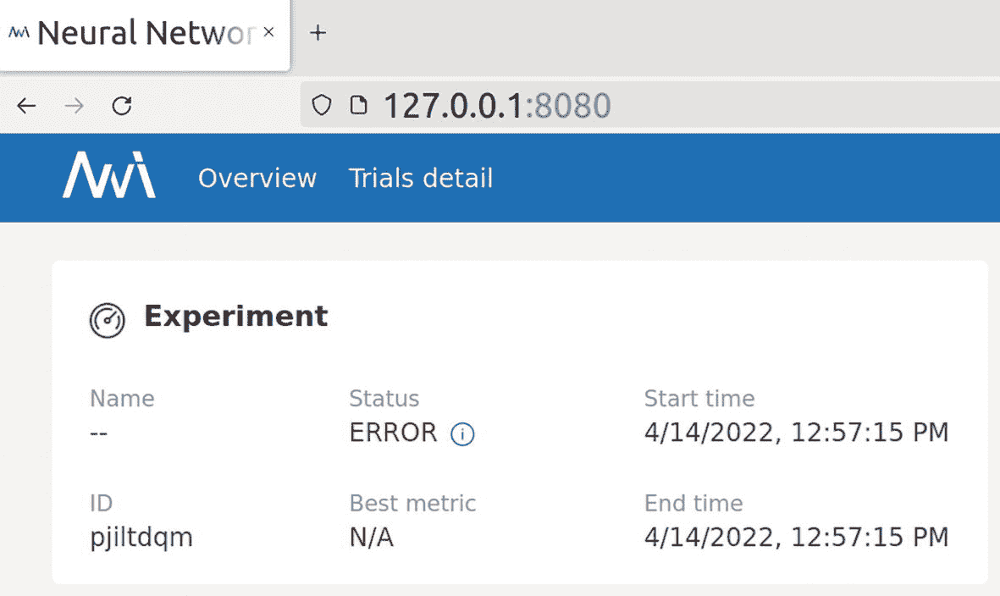

图 1-21

NNI. 错误徽章

在这种情况下，请检查 ~/nni-experiments/<experiment_id>/log/nnictl_stderr.log 中的错误日志文件。

**NNI 正在启动。实验正在运行，但试验状态为失败**，如图 1-22 所示。

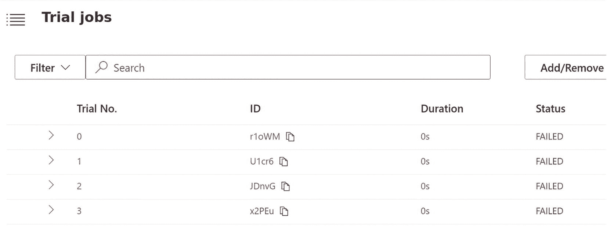

图 1-22

NNI. 失败的试验

在这种情况下，请检查试验作业面板中的试验日志，如图 1-23 所示。

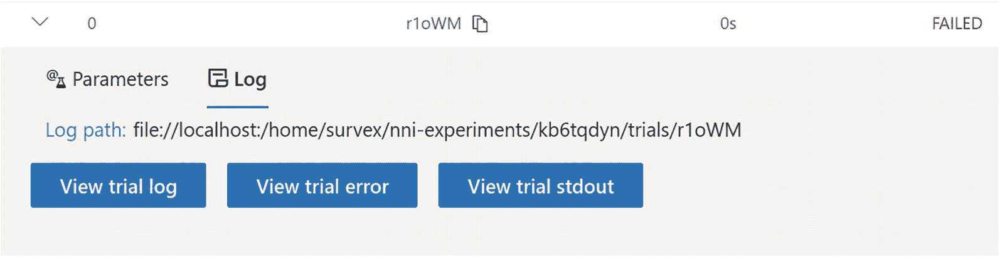

图 1-23

NNI. 试验日志

这份迷你指南可能会使您更容易找到并修复 NNI 问题。

### TensorFlow 和 PyTorch

本书将应用 AutoDL 技术到使用 **TensorFlow** 或 **PyTorch** 实现的模型。本书假设读者对其中之一有经验。每一章都将提供将 NNI 应用于 TensorFlow 或 PyTorch 实现的模型的示例。PyTorch 或 TensorFlow 上实现的示例不会相互重复，但会彼此接近。因此，如果您只是 PyTorch 用户，如果您不深入研究 TensorFlow 模型的示例，您也不会错过任何内容。

本书将使用以下框架版本：

+   **TensorFlow**: 2.7.0

+   **PyTorch**: 1.9.0

+   **PyTorch Lightning**: 1.4.2

+   **Scikit-learn**: 0.24.1

在任何情况下，我建议您通过所有示例，因为它们的概念可以轻松地移植到您喜欢的深度学习框架中。

### 摘要

在本章中，我们探讨了 NNI 的基本功能。NNI 是解决各种 AutoML 任务的一个非常强大的工具集。在本章的开头，我们分别研究了在实践应用中采用 AutoML 技术的需求。在下一章中，我们将开始探索经典超参数优化（**HPO**）方法的应用。我们将研究 HPO 技术如何优化现有架构并创建新的模型设计。
