# 2. 超参数优化

几乎每个深度学习模型都有大量的超参数。选择合适的超参数是 AutoML 中最常见的问题之一。模型的一个超参数的微小变化可能会显著改变其性能。超参数优化（HPO）是深度学习模型调整的第一步，也是最有效的一步。由于其普遍性，超参数优化有时被视为与 AutoML 同义词。

NNI 提供了一组广泛且灵活的超参数优化（HPO）工具。本章将探讨各种神经网络设计以及如何将 NNI 应用于针对特定问题优化它们的超参数。

## 什么是超参数？

让我们通过定义什么是模型 *超参数* 来开始本章。深度学习模型有三种类型的参数：

+   **权重和偏差（或模型参数）**：神经网络架构中线性（或张量）函数的参数，在训练过程中进行调整。

+   **超参数**：手动设置的初始全局变量，影响函数的行为、训练算法和神经网络的架构。

+   **任务参数**：任务为您设置的参数。这些参数位于问题要求中，需要满足且不能更改。例如，假设我们通过分析它们的图片来解决“猫或狗？”的二分类问题。在这种情况下，我们有一个任务参数：**2**，表示输出类别的数量。或者，例如，我们有预测未来三天空气温度的问题。那么参数 3 是一个任务参数，它位于任务要求中，不能以任何方式更改。

让我们来看一个包含三个线性（或密集）层、激活函数、五值输入向量和标量输出的全连接神经网络（或密集网络）的例子，这在 TensorFlow 框架中可以表示如下：

我们导入必要的包：

```py
import tensorflow as tf
from tensorflow.keras.layers import Dense
Listing 2-1
Fully Connected Neural Network. ch2/hpo_definition/fcnn_model.py
```

接下来，我们设置任务参数，即任务要求。我们的全连接神经网络必须接收五值输入向量并输出一个标量值：

```py
# Task Parameters
inp_dim = 5
out_dim = 1
```

由于我们有三个线性（或密集）层，我们可以为其中两个指定 `output_dimension` 值。第三层的 `output_dimension` 值为 1，因为这是一个任务要求。这些值是超参数：

```py
# Hyperparameters
l1_dim = 8
l2_dim = 4
```

我们初始化 FCNN 模型：

```py
# Model
model = tf.keras.Sequential(
[
Dense(l1_dim, name = 'l1',
activation = 'sigmoid', input_dim = inp_dim),
Dense(l2_dim, name = 'l2',
activation = 'relu'),
Dense(out_dim, name = 'l3'),
]
)
model.build()
```

这里我们有 FCNN 模型参数：

```py
# Weights and Biases
print(model.summary())
```

这些在表 2-1 中展示。

表 2-1

FCNN 模型权重和偏差

| 层 | 输出形状 | 参数数量 | 解释 |
| --- | --- | --- | --- |
| `l1` | `(None, 8)` | `48` | 5×8 权重矩阵 + 8 偏置向量 = 48 |
| `l2` | `(None, 4)` | `36` | 8×4 权重矩阵 + 4 偏置向量 = 36 |
| `l3` | `(None, 1)` | `5` | 4×1 权重矩阵 + 1 偏置向量 = 5 |

`总参数数：89`

列表 2-1 中显示的模型有 2 个超参数和 89 个模型参数。超参数通常直接影响模型参数的数量。实际上，在列表 2-1 中，`l1_dim`和`l2_dim`超参数设置了权重矩阵和偏置向量的维度。图 2-1 说明了超参数对 FCNN 模型架构及其参数的影响。

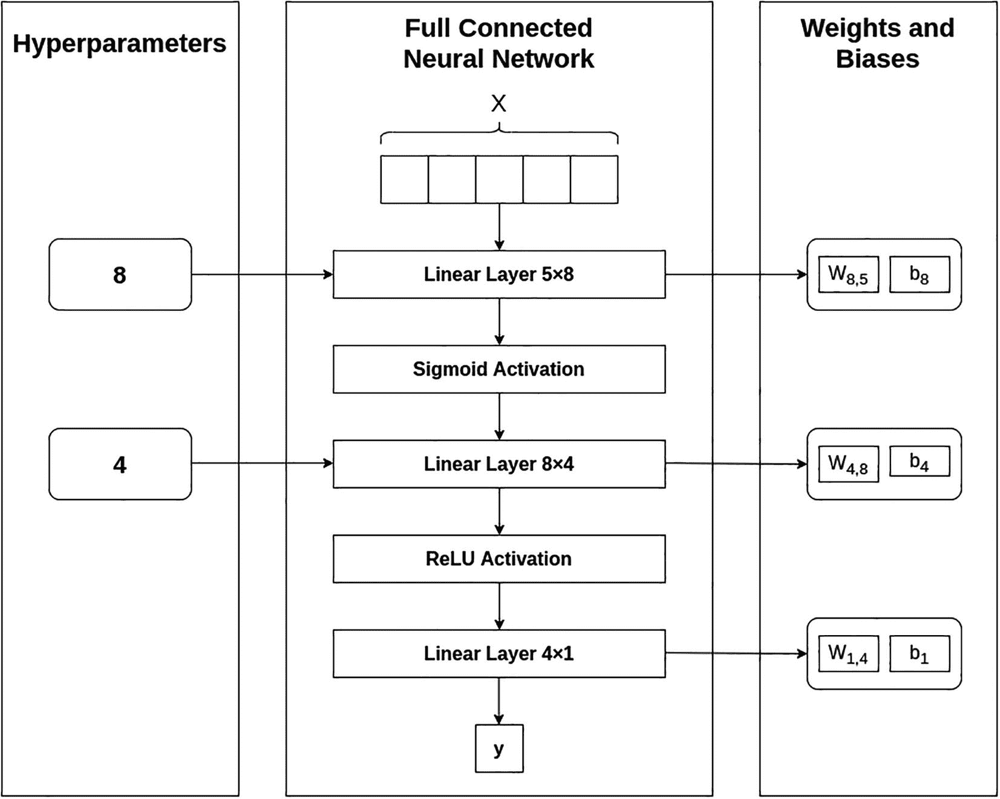

图 2-1

超参数影响

我们可以区分四种类型的超参数：

+   **层**超参数

+   **训练**超参数

+   **特征**超参数

+   **设计**超参数

让我们检查这些超参数类型中的每一个。

### 层超参数

几乎所有深度学习模型的层都隐含了初始参数的存在。例如：

+   **Dropout 层**：假设*p*（0 < *p* < 1）参数，它定义了 dropout 概率

+   **最大池化 2D 层**：假设`pool_size`参数，它定义了池化维度

+   **卷积 2D 层**：假设`kernel_size`参数

我们可以将这些超参数称为*层超参数*。

### 训练超参数

训练过程是模型架构的一个组成部分。每个模型生成一个多维损失函数表面。模型训练过程试图在损失函数表面上找到最佳局部最小值。训练过程参数可以极大地影响训练模型的性能。

最常见的例子是*学习率*调整。大多数训练算法使用梯度下降作为模型训练背后的主要思想。梯度下降的概念意味着为损失函数表面的每个点计算一个过渡向量。但这个向量的长度是由*学习率*参数决定的。过高的*学习率*参数可能导致梯度下降爆炸，完全无法在损失函数表面上找到可接受的局部最小值。同时，过低的*学习率*会在表面上停止训练过程，并且不允许模型参数达到更低点。图 2-2 展示了学习率问题。

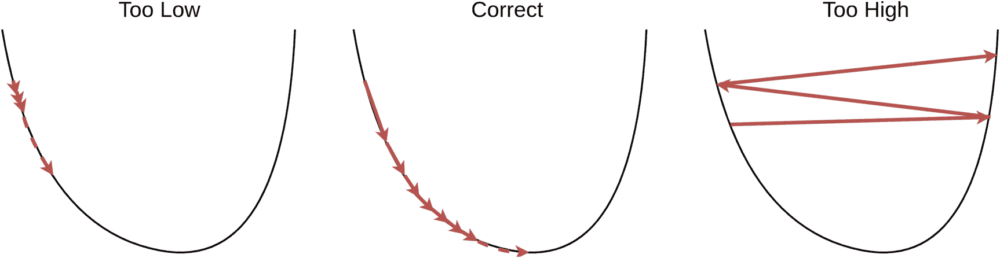

图 2-2

学习率问题

最常见的训练超参数包括

+   *训练轮数*

+   *学习率*

+   *批量大小*

层超参数和训练超参数优化是调整模型最常见的方式，因为这种方法实现起来比较容易。

### 特征超参数

特征超参数影响数据集预处理方法。输入数据集中的数据结构可以显著提高模型性能，尤其是在自然语言处理（NLP）问题中。但输入数据集的转换并不总是提高模型性能，因此你经常不得不“玩”各种特征预处理技术以达到最佳结果。

让我们考察一个包含电影评论数据的数据集。这个数据集包括以下特征：

+   **特征** ***A***：电影预算（例如：10 亿美元*）

+   **特征** ***B***：评论日期（例如：2021-05-03*）

+   **特征** ***C***：评论文本（例如：我喜欢好电影，但不幸的是，这部不是其中之一。）

我们正在解决经典的二元分类问题，即我们必须确定评论是负面还是正面。然后我们可以应用以下预处理，如图 2-3 所示。

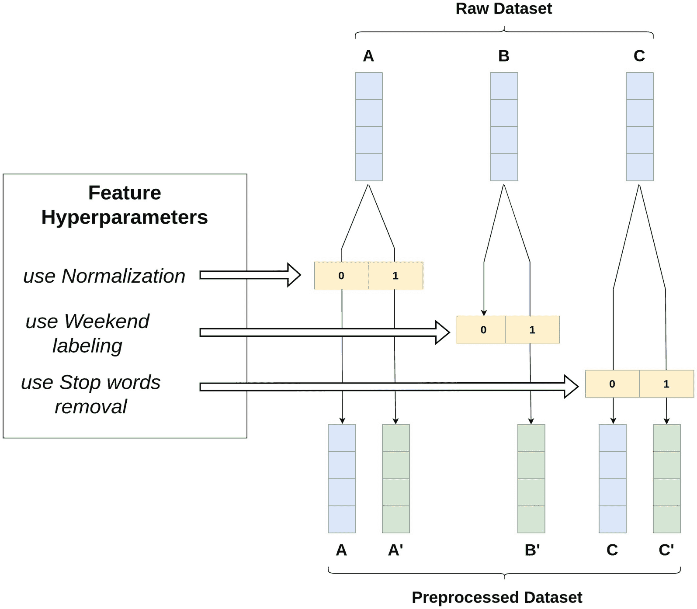

图 2-3

由特征超参数驱动的数据集预处理

图 2-3 中所示的数据集预处理具有以下特征超参数：*使用归一化*，*使用周末标签*和*使用停用词去除*。让我们描述它们的含义：

+   ***使用归一化：***

    归一化是将数值数据转换为 0 到 1 范围的常见技术。*使用归一化*超参数管理对特征 A（预算）应用归一化：

    +   **0**：对特征 A 不应用归一化。

    +   **1**：对特征 A 应用归一化，生成 A`特征。

+   ***使用周末标签：***

    日期对神经网络不携带任何信息。但额外的日期时间标签可能有所帮助。例如，节假日留下的评论更可能是积极的，因为人们心情好。然后我们可以使用周末标签方法，该方法将为每个日期标记是否为节假日或周末。日期序列随后可以转换为 *2021-11-05*，*2021-11-06*，*2021-11-07*，…，到 0，1，1，…。

    +   **0**：不应用周末标签，并将特征 B 从数据集中移除。

    +   **1**：应用周末标签，并将特征 B 转换为特征 B’。

+   ***使用停用词去除：***

    从文本中去除停用词是一种常见的做法，它可以清除文本中的噪声。停用词去除通常有助于加快训练速度并提高 NLP 模型的质量。

    +   **0**：对特征 C 不应用停用词去除。

    +   **1**：对特征 C 应用停用词去除，生成特征 C’。

例如，这个特征超参数的组合（**使用归一化**：0，**使用周末标签**：1，**使用停用词去除**：1）将原始数据集 [A, B, C] 转换为 [A, B’，C’]。

### 设计超参数

设计超参数对神经网络架构的选择有直接影响。它们的值控制着神经网络层的选择以及它们之间的连接。

图 2-4 显示设计超参数。

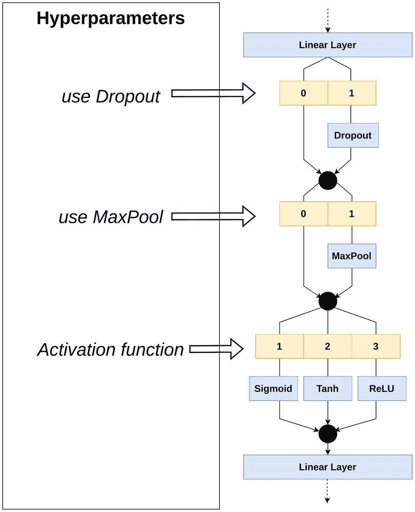

图 2-4

设计超参数

图 2-4 中所示的设计超参数搜索具有以下设计超参数：*使用 Dropout*，*使用 MaxPool*和*激活函数*。它们以下述方式影响模型设计：

+   ***使用 Dropout*****：**

    +   **0**：跳过 *Dropout 层*。

    +   **1**：连接了*Dropout 层*。

+   **使用 MaxPool**：

    +   **0**：跳过了*MaxPool 层*。

    +   **1**：连接了*Max Poll 层*。

+   **激活函数**：

    +   **1**：连接了*Sigmoid 激活*函数。

    +   **2**：连接了*双曲正切激活*函数。

    +   **3**：连接了*修正线性激活*函数。

例如，这个设计超参数的组合（*使用 Dropout*：1，*使用 MaxPool*：0，*激活函数*：3）将在神经网络架构中生成以下层序列：

+   线性层

+   Dropout 层

+   ReLU 激活

+   线性层

设计超参数优化使用得较少，因为它比层超参数或训练超参数优化更难实现。但设计超参数调整可以产生很好的结果。它为特定问题选择了最佳层组合及其之间的连接。设计超参数优化可以被视为超参数优化和神经架构搜索之间的中间方法。

### 搜索空间

假设我们已经确定了模型的超参数，这些参数需要被优化。接下来，我们必须为每个超参数定义一个搜索空间。确定搜索空间需要一些经验和直觉。你必须理解，搜索空间越大，实验所需的时间就越长。而且找到合适的解决方案也更困难。因此，在搜索空间中指定大量值是没有意义的。例如，如果`l1`是一个指定线性层维度（`tensorflow.keras.layers.Dense(l1)`或`torch.nn.Linear(out_features = l1)`）的超参数，那么你不需要将超参数的搜索空间设置为`[1, 2, 3,..., 999, 1000]`。对于超参数`l1`，表示 2 的幂（2^n）的值更合适：`[4, 8, 16, ..., 256]`，因为线性层的表示大小只与比例相关，而不是与加法相关（如果`l1 = 256`表现不佳，那么，`l1 = 256 + 8`很可能会有相同的结果）。合理选择超参数可以显著减少实验时间，而不会降低其质量。在指定搜索空间之前，你可以进行手动探索，以确定哪些超参数值对模型性能影响最大。

HPO 问题的搜索空间是通过定义每个超参数的可能值集来定义的。NNI 允许以下采样策略来定义超参数搜索空间：`choice`、`randint`、`uniform`、`quniform`、`loguniform`、`qloguniform`、`normal`、`qnormal`、`lognormal`和`qlognormal`。

### 选择

```py
{"_type": "choice", "_value": options}
```

选择采样策略允许你手动指定一个超参数可以取的值的列表。它可以是一个数字和字符串的列表。例如：

```py
"hp": {"_type": "choice", "_value": [128, 512, 1024]}
```

选择采样也支持嵌套搜索空间。嵌套选择在处理设计超参数时特别有用。以下是嵌套选择采样的例子：

```py
"layer1":{
"_type": "choice",
"_value": [{"_name": "Empty"},
{
"_name": "Conv", "kernel_size":
{"_type": "choice", "_value": [1, 2, 3, 5]}
},
{
"_name": "Max_pool", "pooling_size":
{"_type": "choice", "_value": [2, 3, 5]}
},
{
"_name": "Avg_pool", "pooling_size":
{"_type": "choice", "_value": [2, 3, 5]}
}
]
}
```

### randomint

```py
{"_type": "randint", "_value": [lower, upper]}
```

从下限（包含）到上限（不包含）选择随机整数。

### uniform

```py
{"_type": "uniform", "_value": [low, high]}
```

根据区间 `[low, high]` 上的均匀分布选择随机值。

### quniform

```py
{"_type": "quniform", "_value": [low, high, q]}
```

类似于 uniform 样本，但具有 `q` 离散化，可以表示为 `clip(round(uniform(low, high) / q) * q, low, high)`。例如，对于 `_value` 指定为 `[1, 11, 2.5]`，可能的值是 `[1, 2.5, 5, 7.5, 10, 11]`。

### loguniform

```py
{"_type": "loguniform", "_value": [low, high]}
```

根据区间 `[low, high]` 上的对数均匀分布选择随机值，可以表示为 `np.exp(uniform(np.log(low), np.log(high)))`。

### qloguniform

```py
{"_type": "qloguniform", "_value": [low, high, q]}
```

类似于 loguniform 样本，但具有 `q` 离散化，可以表示为 `clip(round(loguniform(low, high) / q) * q, low, high)`。

### normal

```py
{"_type": "normal", "_value": [mu, sigma]}
```

根据μ = `mu` 和 σ = `sigma` 的正态分布选择随机值。

### qnormal

```py
{"_type": "qnormal", "_value": [mu, sigma, q]}
```

类似于 normal 样本，但具有 `q` 离散化，可以表示为 `round(normal(mu, sigma) / q) * q`。

### lognormal

```py
{"_type": "lognormal", "_value": [mu, sigma]}
```

根据μ = `mu` 和 σ = `sigma` 的对数正态分布选择随机值，可以表示为 `np.exp(normal(mu, sigma))`。

### qlognormal

```py
{"_type": "qlognormal", "_value": [mu, sigma, q]}
```

类似于 lognormal 样本，但具有 `q` 离散化，可以表示为 `round(exp(normal(mu, sigma)) / q) * q`。

样本策略的实现位于 `nni.parameter expressions` 中。您可以手动探索搜索空间采样策略，如列表 2-2 所示。

```py
import nni
from numpy.random.mtrand import RandomState
import matplotlib.pyplot as plt
Listing 2-2
quniform sampling strategy. ch2/search_space/quniform.py
```

我们使用 quniform 策略生成 20 个样本：`

```py
space = [
nni.quniform(0, 100, 5, RandomState(seed))
for seed in range(20)
]
```

可视化生成的样本：`

```py
plt.figure(figsize = (5, 1))
plt.title('quniform')
plt.plot(space, len(space) * [0], "x")
plt.yticks([])
plt.show()
```

之后，您可以使用 `quniform` 方法在图 2-5 中观察生成的样本。

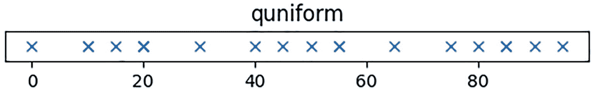

图 2-5

quniform 样本

让我们检查一个 JSON 搜索空间定义的例子。

```py
{
"dropout_rate":
{ "_type": "uniform", "_value": [0.1, 0.5]},
"conv_size":
{"_type": "choice", "_value": [2, 3, 5, 7]},
"layer1_hidden_size":
{"_type": "choice", "_value": [128, 512, 1024]},
"layer2_hidden_size":
{"_type": "choice", "_value": [16, 32, 64]},
"activation_function":
{"_type": "choice", "_value": ["tanh", "sigmoid", "relu"]},
"training_batch_size":
{"_type": "choice", "_value": [100, 250, 500]},
"training_learning_rate":
{"_type": "uniform", "_value": [0.0001, 0.1]}
}
Listing 2-3
Search space. ch2/search_space/search_space.json
```

列表 2-3 展示了深度学习模型的典型搜索空间：

+   `dropout_rate`：定义 dropout 层中 *p* 参数的层超参数。`dropout_rate` 可以取 0.1 到 0.5 之间的任何值。

+   `conv_size`：定义卷积层核大小的层超参数。`conv_size` 可以取列表中的任何值：2、3、5、7。

+   `layer1_hidden_size`：定义第一层线性层输出维度的层超参数。`layer1_hidden_size` 可以取列表中的任何值：128、512、1024。

+   `layer2_hidden_size`：定义第二层线性层输出维度的层超参数。`layer2_hidden_size` 可以取列表中的任何值：16、32、64。

+   `activation_function`：定义输出激活函数的设计超参数。`activation_function` 可以取列表中的任何值：tanh、sigmoid、relu。

+   `training_batch_size`：定义训练期间将使用的批量大小的训练超参数。`training_batch_size` 可以取列表中的任何值：100、250、500。

+   `training_learning_rate``:` 定义学习率的训练超参数。`training_learning_rate` 可以取从 0.0001 到 0.1 的任何值。

### 调优器

在定义搜索空间之后，我们需要定义一个调优器，该调优器将探索搜索空间并根据现有结果选择试验超参数组合。

调优器在配置文件中的设置如下：

```py
tuner:
name: 
classArgs:
optimize_mode: minimize
arg1: val1
arg2: val2
```

每个调优器都有自己的参数集。所有调优器唯一的共同参数是 `optimize_mode`，它标记了表征模型性能的指标优化方向：`minimize`（最小化）、`maximize`（最大化）。

表 2-2 提供了 NNI v2.7 中可用的调优器列表。

表 2-2

搜索调优器

| 配置 ID | 名称 |
| --- | --- |
| --- | --- |
| `SMAC` | 基于序列模型的优化 |
| `TPE` | 树结构帕累托估计器 |
| `Random` | 随机搜索 |
| `Anneal` | 退火搜索算法 |
| `Evolution` | 遗传算法搜索 |
| `BatchTuner` | 批量调优器 |
| `GridSearch` | 网格搜索 |
| `NetworkMorphism` | 网络形态 |
| `MetisTuner` | Metis 调优器 |
| `GPTuner` | 高斯过程 (GP) 调优器 |
| `PBTTuner` | 基于群体的训练调优器 |

我们将在第三章节中详细研究调优算法。在本章中，我们将仅考虑 **随机搜索调优器** 和 **网格搜索调优器**。

### 随机搜索调优器

随机搜索调优器是选择超参数组合的最直接方法。正如其名所示，超参数的组合是绝对随机选择的。尽管这种方法很简单，但它有时可以给出非常好的结果。

随机搜索调优器设置为

```py
tuner:
name: Random
```

图 2-6 展示了随机搜索调优器的工作情况。

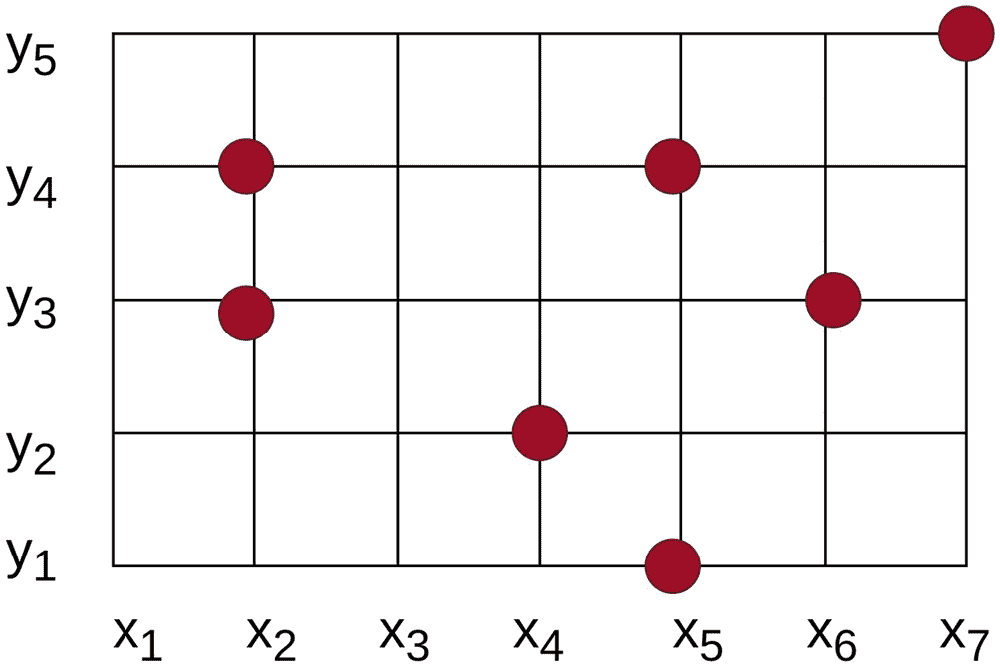

图 2-6

随机搜索调优器

在某些情况下，随机搜索调优器非常适合在需要提取关于超参数对模型性能影响的信息时探索搜索空间。在随机搜索空间探索之后，你可以重新定义超参数搜索空间并选择另一个调优器。

### 网格搜索调优器

网格搜索调优器执行穷举搜索，即网格搜索调优器将搜索搜索空间中所有可能的组合。网格搜索调优器非常适合小搜索空间。

网格搜索调优器设置为

```py
tuner:
name: GridSearch
```

图 2-7 展示了网格搜索调优器的工作情况。

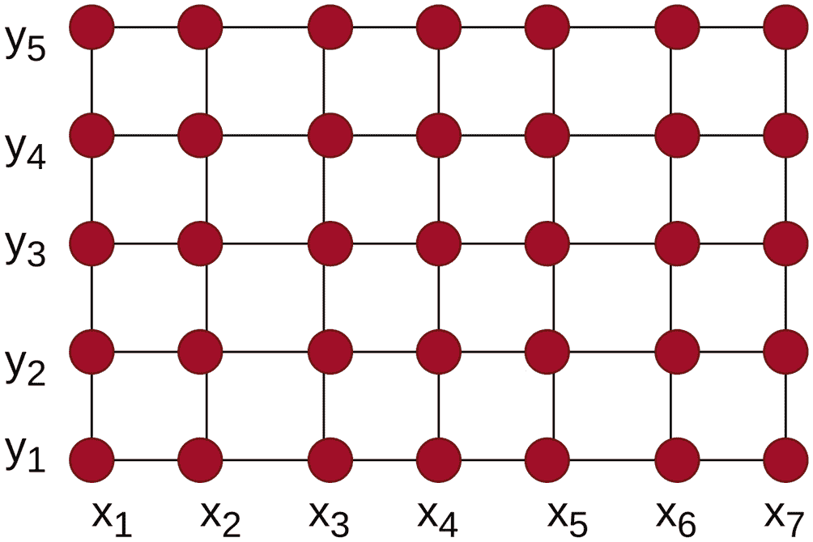

图 2-7

网格搜索调优器

网格搜索调优器只接受使用 `choice`、`quniform` 和 `randint` 函数生成的搜索空间变量。

### 组织实验

因此，我们已经准备好开始我们的第一次探索。让我们看看本书中将使用的文件组织模式。我也建议你遵循相同的方法。

这些简单的规则将帮助你在进行实验时避免不必要的错误：

+   为每个实验使用单独的目录。

+   在实验配置中将当前目录指定为试验代码目录。

+   将模型类和训练/测试方法保存在单独的文件中。

+   在试验文件中将根代码文件夹添加到系统路径。

+   不要混合模型和试验文件。

让我们看看一个遵循这些规则 ch2/experiment_pattern 的虚拟实验。列表 2-4 提供了实验配置文件。

配置文件将当前目录标记为工作目录：`trialCodeDirectory: .`

```py
trialConcurrency: 1
searchSpaceFile: search_space.json
trialCodeDirectory: .
trialCommand: python3 trial.py
tuner:
name: GridSearch
trainingService:
platform: local
Listing 2-4
Experiment configuration. ch2/experiment_pattern/config.yml
```

模型类和训练/测试方法在单独的文件中，如列表 2-5 所示。

```py
from random import random
class DummyModel:
def __init__(self, x, y) -> None:
super().__init__()
self.x = x
self.y = y
def train(self):
# Training here
...
def test(self):
# Test results
return round(self.x + self.y + random() / 10, 2)
Listing 2-5
DummyModel class. ch2/experiment_pattern/model.py
```

表 2-3

NNI API

| 方法 | 描述 |
| --- | --- |
| `nni.get_next_parameter()` | 必须方法，从 NNI 调优器接收试验参数作为 `Dict` 对象 |
| `nni.report_intermediate_result(m)` | 可选方法，将中间结果发送给 NNI 调优器 |
| `nni.report_final_result(m)` | 必须方法，用于发送表示模型性能的最终指标 |

试验脚本从 NNI 调优器接收参数，初始化模型，训练它，并测试其性能。试验脚本使用以下 API 方法与 NNI 交互，如表 2-3 所示。

让我们看看列表 2-6 中的试验脚本模式。

我们导入必要的模块：

```py
import os
import sys
import nni
Listing 2-6
Trial script pattern. ch2/experiment_pattern/trial.py
```

在这里，我们将代码的根目录添加到系统路径中。这样做是因为 NNI 对我们代码的结构和模块的位置一无所知。

```py
# For NNI use relative import for user-defined modules
SCRIPT_DIR = os.path.dirname(os.path.abspath(__file__)) + '/../..'
sys.path.append(SCRIPT_DIR)
```

现在，我们可以从我们的代码结构中导入所需的类：

```py
from ch2.experiment_pattern.model import DummyModel
```

试验初始化模型，训练它，测量其性能，并将结果返回给 NNI 调优器：

```py
def trial(hparams):
"""
Trial Script:
- Initiate Model
- Train
- Test
- Report
"""
model = DummyModel(**hparams)
model.train()
accuracy = model.test()
# send final accuracy to NNI
nni.report_final_result(accuracy)
```

这里是试验脚本的入口点：

```py
if __name__ == '__main__':
# Manual HyperParameters
hparams = {
'x': 1,
'y': 1,
}
# NNI HyperParameters
# Run safely without NNI Experiment Context
nni_hparams = nni.get_next_parameter()
hparams.update(nni_hparams)
trial(hparams)
```

你可以以独立模式运行 trial 脚本 ch2/experiment_pattern/trial.py。这意味着你可以运行此脚本而不会出现任何错误。`nni.get_next_parameter()` 方法将返回一个空的 `dict`，你可以将其与你的试验参数合并。如果你想要测试试验执行，这很方便。

实验文件结构模式可以如图 2-8 所示。

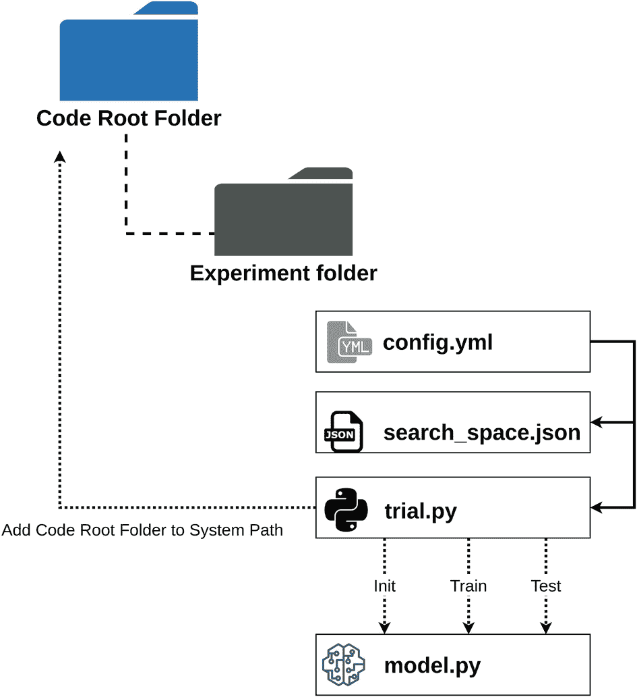

图 2-8

实验文件结构

好的！我们已经定义了不同的超参数类型，检查了如何定义搜索空间，研究了简单的调优器，并代表了一个创建实验的模式。我们现在可以继续进行实际的研究。接下来的几节将检查 HPO 方法如何针对特定问题优化模型，并帮助开发新的模型设计。

### 优化 LeNet 以解决 MNIST 问题

库：TensorFlow (Keras API)，PyTorch

MNIST 分类器问题是一个常见的测试各种机器学习方法的难题。卷积神经网络在图像识别方面取得了突破，因此我们也使用 MNIST 数据集来深入研究 HPO 领域。MNIST 数据库包含手写数字的图像。它分为两个集合：一个包含 60,000 个样本的训练集和一个包含 10,000 个示例的测试集。图 2-9 显示了 MNIST 数据集的几个样本。

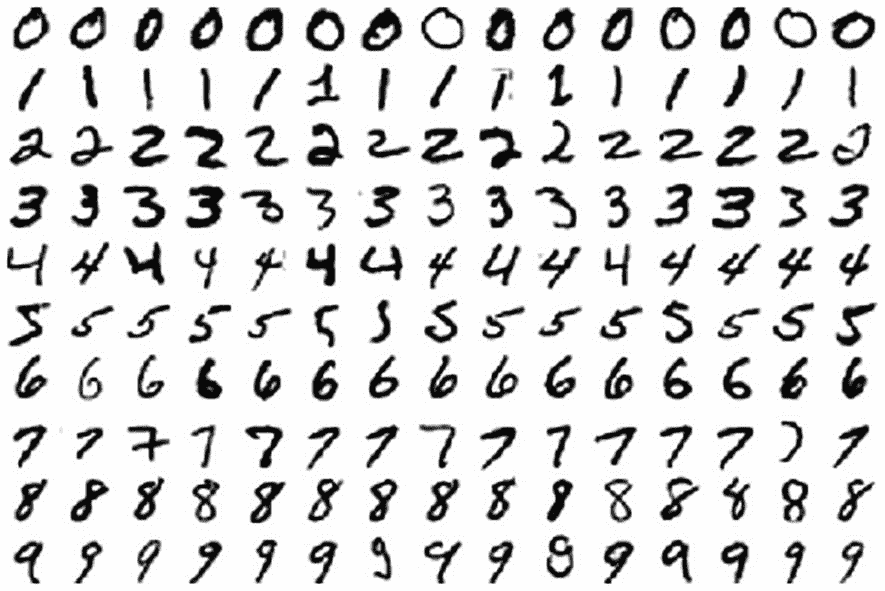

图 2-9

MNIST 数据库

MNIST 数据集是一组 28×28 的灰度图像。因此，每个数据集对象是一个 (28, 28, 1) 张量。让我们检查这个数据集的几个样本。

```py
import tensorflow_datasets as tfds
ds, info = tfds.load('mnist', split = 'train', with_info = True)
fig = tfds.show_examples(ds, info)
fig.show()
Listing 2-7
MNIST dataset samples. ch2/lenet_hpo/mnist_dataset.py
```

列表 2-7 显示了图 2-10 中的图像。

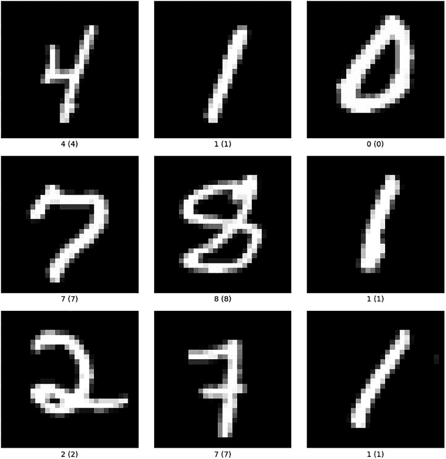

图 2-10

MNIST 样本

这可能看起来是一个非常简单的任务，但实际上并非如此。回想一下，你有多少次无法理解别人手写的数字。手写数字识别是模式识别的第一个基本问题之一。LeNet-5 是最早用于识别手写和机器打印字符的神经网络之一。这个模型之所以受欢迎，主要原因是其直接的架构。它是一个用于图像分类的多层卷积神经网络。LeNet 模型的抽象设计如图 2-11 所示。

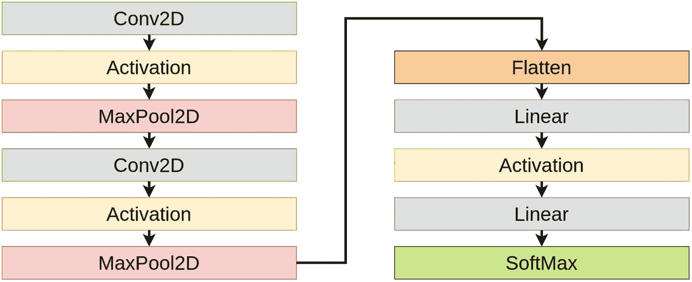

图 2-11

LeNet 架构

我们的目标是将 LeNet 模型优化到手写数字识别问题。最简单的事情就是从层超参数优化开始。让我们先计算 LeNet 模型中的层超参数数量：

+   **Conv2D 层**：五个基本超参数 (`out_channels`, `kernel_size`, `stride`, `padding`, `dilation`)

+   **MaxPool2D 层**：两个基本超参数 (`kernel_size`, `stride`)

+   **线性层**：两个基本超参数 (`out_features`, `use_bias`)

LeNet 包含两个 Conv2D 层，两个 MaxPool2D 层和两个线性层。因此，LeNet 模型中有 2×5 + 2×2 + 2×2 = 14 个层超参数。假设对于每个超参数，我们将有一个只包含两个元素的可能的值集合，尽管，当然，许多超参数需要更多的值以增加实验的灵活性。但即使这个二进制搜索空间也包含 2¹⁴ = 16,384 个元素。而且这些只是最简单的深度学习模型中的一种最原始的层超参数。随着模型复杂性的增加，其中的可能超参数数量呈指数增长。即使是最先进的调优器也需要很长时间来探索这个搜索空间。因此，我们需要一些经验和直觉，这将使我们能够为每个模型选择关键的超参数范围，而不会过多地增加搜索空间。

让我们仅考虑以下层超参数：

+   **卷积 2D 层 1**：`filter_size_1`，`kernel_size_1`

+   **卷积 2D 层 2**：`filter_size_2`，`kernel_size_2`

+   **线性层**：`out_features`

为了减少搜索空间的大小，我们设置

+   `filter_size_2 = 2 * filter_size_1`

+   `kernel_size_1 = kernel_size_2`

然后，我们将专注于 LeNet 模型的三个超参数：

+   `filter_size`

+   `kernel_size`

+   `out_features`

通常，卷积层的`filter_size`最佳值表示为 2 的 n 次方。因此，我们将选择以下搜索空间中的参数：8、16、32。`kernel_size`的值通常选择在 2n + 1 的集合中。图像越大，应选择更大的`kernel_size`值。MNIST 数据集的样本是 28×28 的图像。这些图像相当小，所以我们不应该选择大的`kernel_size`值：2、3、5。`l1_size`的最佳值是 2 的幂，就像`filter_size`一样。线性层应用于展平层之后的张量，这意味着我们必须考虑前一层将产生的张量维度。在 MNIST 问题的情况下，我们将关注以下`l1_size`值：32、64、128。对于 MaxPool2D 层，我们将设置`pool_size`的最小可能值，即 2，并将`sigmoid`作为激活函数。是的！这就是长期以来作为大多数模式识别问题激活函数所使用的函数。我们将在下一节回到选择激活函数的问题。

我们将使用经典的批量神经网络训练和`Adam`优化器。现在让我们看看训练超参数。我建议从选择最简单的超参数开始：`batch_size`和`learning rate`。`batch_size`的最佳参数表示为 2 的 n 次方，`learning rate`表示为 10 的-n 次方。对于这个案例，我们将选择以下参数：`batch_size`为 256、512、1024，`learning rate`为 0.01、0.001、0.0001。

现在，让我们将我们之前做出的超参数约束转换为 NNI 搜索空间。列表 2-8 定义了 LeNet 超参数优化搜索空间的搜索空间。

```py
{
"filter_size": {
"_type": "choice", "_value": [8, 16, 32]},
"kernel_size": {
"_type": "choice", "_value": [2, 3, 5]},
"l1_size": {
"_type": "choice", "_value": [32, 64, 128]},
"batch_size": {
"_type": "choice", "_value": [256, 512, 1024]},
"learning_rate": {
"_type": "choice", "_value": [0.01, 0.001, 0.0001]}
}
Listing 2-8
LeNet HPO search space. ch2/lenet_hpo/search_space.json
```

好的！在下一步中，我们将创建考虑 HPO 问题的 LeNet 模型的 TensorFlow 和 PyTorch 实现。

### TensorFlow LeNet 实现

在本节中，我们将研究使用 TensorFlow（Keras API）实现的 LeNet 模型。列表 2-9 展示了用于超参数优化的 TensorFlow LeNet 模型的实现。

我们导入必要的模块：

```py
from tensorflow.keras import Model
from tensorflow.keras.layers import Conv2D, Dense, Flatten, MaxPool2D
from tensorflow.keras.optimizers import Adam
from ch2.utils.datasets import mnist_dataset
from ch2.utils.tf_utils import TfNniIntermediateResult
Listing 2-9
LeNet. TensorFlow implementation. ch2/lenet_hpo/tf_lenet_model.py
```

接下来，我们定义 LeNet 模型，并设置三个层超参数：

```py
class TfLeNetModel(Model):
def __init__(self, filter_size, kernel_size, l1_size):
super().__init__()
```

首个卷积层堆叠：

```py
self.conv1 = Conv2D(
filters = filter_size,
kernel_size = kernel_size,
activation = 'sigmoid'
)
self.pool1 = MaxPool2D(pool_size = 2)
```

第二个卷积层堆叠：

```py
self.conv2 = Conv2D(
filters = filter_size * 2,
kernel_size = kernel_size,
activation = 'sigmoid'
)
self.pool2 = MaxPool2D(pool_size = 2)
```

密集堆叠：

```py
self.flatten = Flatten()
self.fc1 = Dense(
units = l1_size,
activation = 'sigmoid'
)
self.fc2 = Dense(
units = 10,
activation = 'softmax'
)
```

LeNet 是一个简单的模型，它将计算结果从一层传递到另一层：

```py
def call(self, x, **kwargs):
x = self.conv1(x)
x = self.pool1(x)
x = self.conv2(x)
x = self.pool2(x)
x = self.flatten(x)
x = self.fc1(x)
return self.fc2(x)
```

训练方法使用两个训练超参数：`batch_size`和`learning rate`。我们使用`Adam`优化器和分类交叉熵损失函数：

```py
def train(self, learning_rate, batch_size):
self.compile(
optimizer = Adam(learning_rate = learning_rate),
loss = 'sparse_categorical_crossentropy',
metrics = ['accuracy']
)
(x_train, y_train), _ = mnist_dataset()
```

接下来，我们初始化一个回调，将中间结果发送到 NNI：

```py
intermediate_cb = TfNniIntermediateResult('accuracy')
```

执行具有十个 epoch 的经典批量训练`:``

```py
self.fit(
x_train,
y_train,
batch_size = batch_size,
epochs = 10,
verbose = 0,
callbacks = [intermediate_cb]
)
```

我们需要定义的最后一种方法是模型测试。我们加载测试 MNIST 数据集并通过测量其准确率来进行分类：

```py
def test(self):
"""Testing Trained Model Performance"""
(_, _), (x_test, y_test) = mnist_dataset()
loss, accuracy = self.evaluate(x_test, y_test, verbose = 0)
return accuracy
```

好吧，由于 TensorFlow LeNet 模型的实现已经就绪，我们可以使用列表 2-10 来实现 NNI 试验脚本。

我们导入必要的模块并将代码根目录传递到系统路径：

```py
import os
import sys
import nni
# For NNI use relative import for user-defined modules
SCRIPT_DIR = os.path.dirname(os.path.abspath(__file__)) + '/../..'
sys.path.append(SCRIPT_DIR)
from ch2.lenet_hpo.tf_lenet_model import TfLeNetModel
Listing 2-10
NNI trial script with TensorFlow LeNet implementation. ch2/lenet_hpo/tf_trial.py
```

`trial`方法初始化模型，训练它，测试它，并返回 NNI 指标：

```py
def trial(hparams):
model = TfLeNetModel(
filter_size = hparams['filter_size'],
kernel_size = hparams['kernel_size'],
l1_size = hparams['l1_size']
)
model.train(
batch_size = hparams['batch_size'],
learning_rate = hparams['learning_rate']
)
accuracy = model.test()
# send final accuracy to NNI
nni.report_final_result(accuracy)
```

最后，我们定义试验的主入口点：

```py
if __name__ == '__main__':
# Manual HyperParameters
hparams = {
'filter_size':   32,
'kernel_size':   3,
'l1_size':       64,
'batch_size':    512,
'learning_rate': 1e-3,
}
# NNI HyperParameters
# Run safely without NNI Experiment Context
nni_hparams = nni.get_next_parameter()
hparams.update(nni_hparams)
trial(hparams)
```

记住，试验脚本可以在独立模式下执行，因此你可以运行`ch2/lenet_hpo/tf_trial.py`来测试其使用自定义参数的执行情况。

### PyTorch LeNet 实现

在本节中，我们将研究使用 PyTorch 实现 LeNet 模型。列表 2-11 展示了用于超参数优化的 PyTorch LeNet 模型的实现。

我们导入必要的模块：

```py
import numpy as np
import nni
import torch
import torch.nn as nn
import torch.nn.functional as F
import torch.optim as optim
from sklearn.metrics import accuracy_score
from ch2.utils.datasets import mnist_dataset
Listing 2-11
LeNet. PyTorch implementation. ch2/lenet_hpo/pt_lenet_model.py
```

接下来，我们定义具有三个层超参数的 LeNet 模型：

```py
class PtLeNetModel(nn.Module):
def __init__(self, filter_size, kernel_size, l1_size):
super(PtLeNetModel, self).__init__()
```

此实现将使用懒加载层初始化，因此我们明确保存`l1_size`超参数：

```py
# Saving l1_size HyperParameter
self.l1_size = l1_size
```

之后，我们初始化卷积层：

```py
self.conv1 = nn.Conv2d(
in_channels = 1,
out_channels = filter_size,
kernel_size = kernel_size
)
self.conv2 = nn.Conv2d(
in_channels = filter_size,
out_channels = filter_size * 2,
kernel_size = kernel_size
)
```

我们不初始化第一层线性层，但使用懒加载初始化。要初始化一个线性层，我们必须指定一个`in_features`值。但这并不简单。我们需要知道前一层将产生的张量的维度。为此，有时你必须进行复杂的计算。在第一次调用时计算这个张量的维度并在此刻初始化线性层会更简单。

```py
# Lazy fc1 Layer Initialization
self.fc1__in_features = 0
self._fc1 = None
self.fc2 = nn.Linear(l1_size, 10)
```

懒加载层初始化：

```py
@property
def fc1(self):
if self._fc1 is None:
self._fc1 = nn.Linear(
self.fc1__in_features,
self.l1_size
)
return self._fc1
```

LeNet 是一个简单的模型，它将计算结果从一层传递到另一层：

```py
def forward(self, x):
x = torch.sigmoid(self.conv1(x))
x = F.max_pool2d(x, 2, 2)
x = torch.sigmoid(self.conv2(x))
x = F.max_pool2d(x, 2, 2)
# Flatting all dimensions but batch-dimension
if not self.fc1__in_features:
self.fc1__in_features = np.prod(x.shape[1:])
x = x.view(-1, self.fc1__in_features)
# FC1 initializes lazy
x = torch.sigmoid(self.fc1(x))
x = self.fc2(x)
return F.log_softmax(x, dim = 1)
```

训练方法使用两个训练超参数：`batch_size`和`learning rate`：

```py
def train_model(self, learning_rate, batch_size):
```

我们准备训练数据集：

```py
(x, y), _ = mnist_dataset()
x = torch.from_numpy(x).float()
y = torch.from_numpy(y).long()
# Permute dimensions for PyTorch Convolutions
x = torch.permute(x, (0, 3, 1, 2))
dataset_size = x.shape[0]
```

初始化`Adam`优化器：

```py
optimizer = optim.Adam(
self.parameters(),
lr = learning_rate
)
```

Vanilla PyTorch 没有内置的批量训练。因此，我们手动将数据集分成批次并执行 epoch 循环和批次循环：

```py
self.train()
for epoch in range(1, 10 + 1):
# Random permutations for batch training
permutation = torch.randperm(dataset_size)
for bi in range(1, dataset_size, batch_size):
# Creating New Batch
indices = permutation[bi:bi + batch_size]
batch_x, batch_y = x[indices], y[indices]
```

使用交叉熵损失函数进行模型参数优化：

```py
optimizer.zero_grad()
output = self(batch_x)
loss = F.cross_entropy(output, batch_y)
loss.backward()
optimizer.step()
```

在每个 epoch 结束时，我们计算模型准确率并将其作为中间结果返回给 NNI：

```py
output = self(x)
predict = output.argmax(dim = 1, keepdim = True)
accuracy = round(accuracy_score(predict, y), 4)
print(F'Epoch: {epoch}| Accuracy: {accuracy}')
# report intermediate result
nni.report_intermediate_result(accuracy)
```

我们需要定义的最后一种方法是模型测试。我们加载测试 MNIST 数据集并通过测量其准确率来进行分类：

```py
def test_model(self):
self.eval()
# Preparing Test Dataset
_, (x, y) = mnist_dataset()
x = torch.from_numpy(x).float()
y = torch.from_numpy(y).long()
x = torch.permute(x, (0, 3, 1, 2))
with torch.no_grad():
output = self(x)
predict = output.argmax(dim = 1, keepdim = True)
accuracy = round(accuracy_score(predict, y), 4)
return accuracy
```

好吧，由于 PyTorch LeNet 模型的实现已经就绪，我们可以使用列表 2-12 来实现 NNI 试验脚本。

我们导入必要的模块并将代码根目录传递到系统路径：

```py
import os
import sys
import nni
# For NNI use relative import for user-defined modules
SCRIPT_DIR = os.path.dirname(os.path.abspath(__file__)) + '/../..'
sys.path.append(SCRIPT_DIR)
from ch2.lenet_hpo.pt_lenet_model import PtLeNetModel
Listing 2-12
NNI trial script with TensorFlow LeNet implementation. ch2/lenet_hpo/pt_trial.py
```

`trial`方法初始化模型，训练它，测试它，并返回 NNI 指标：

```py
def trial(hparams):
model = PtLeNetModel(
filter_size = hparams['filter_size'],
kernel_size = hparams['kernel_size'],
l1_size = hparams['l1_size']
)
model.train_model(
batch_size = hparams['batch_size'],
learning_rate = hparams['learning_rate']
)
accuracy = model.test_model()
nni.report_final_result(accuracy)
```

最后，我们定义试验的主入口点：

```py
if __name__ == '__main__':
# Manual HyperParameters
hparams = {
'filter_size':   32,
'kernel_size':   3,  #5,
'l1_size':       64,  #1024,
'batch_size':    512,  #32,
'learning_rate': 1e-2,  #1e-4,
}
# NNI HyperParameters
# Run safely without NNI Experiment Context
nni_hparams = nni.get_next_parameter()
hparams.update(nni_hparams)
trial(hparams)
```

记住，试验脚本可以在独立模式下执行，因此你可以运行`ch2/lenet_hpo/pt_trial.py`来测试其使用自定义参数的执行情况。

### 执行 LeNet HPO 实验

因此，我们现在已经为我们的第一次 HPO 研究做好了准备。任何真实世界的实验可能需要几小时到几周的时间，这是自然的，因为每个试验都会创建一个独特的模型和训练方法。训练过程可能需要相当长的时间，这取决于模型设计和数据集。本书中的一些实验花费了相当长的时间。因此，您可以跳过完整的实验运行或使用`maxTrialNumber`设置限制试验次数。请记住，如果您运行有限的实验，您的结果可能与书中展示的结果有显著差异。对于每个实验，我将给出在特定机器上完成它所需的时间。我们需要配置 NNI 实验并运行它。 列表 2-13 包含 LeNet HPO 实验的配置。

```py
trialConcurrency: 4
searchSpaceFile: search_space.json
trialCodeDirectory: .
Listing 2-13
LeNet HPO Experiment configuration. ch2/lenet_hpo/config.yml
```

取消 PyTorch 试验行的注释以使用 PyTorch 实现运行实验：

```py
trialCommand: python3 tf_trial.py
#trialCommand: python3 pt_trial.py
```

搜索空间包含 3⁵ = 243 个元素。这是一个较小的搜索空间，我们可以在这里使用网格搜索调优器：

```py
tuner:
name: GridSearch
trainingService:
platform: local
```

实验可以按以下方式运行：

```py
nnictl create --config ch2/lenet_hpo/config.yml
```

注意

在 Intel Core i7 带有 CUDA（GeForce GTX 1050）的机器上运行时间为约 2 小时

实验返回了以下最佳试验超参数：

+   `learning_rate`: 0.001

+   `batch_size`: 256

+   `l1_size`: 64

+   `kernel_size`: 5

+   `filter_size`: 32

最佳试验结果显示了**0.9885**的结果。这是一个可接受的结果。我们可以假设由最佳超参数提供的 LeNet 在测试数据集上以 98.85%的准确率识别手写数字。

在图 2-12 中，我们可以观察到超参数面板中最佳试验的前 1%。

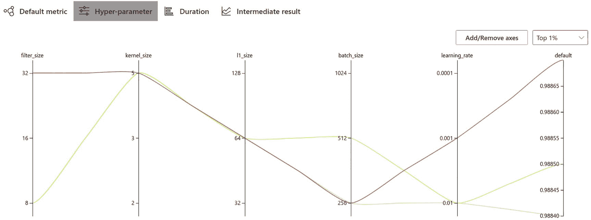

图 2-12

LeNet HPO 最佳 1%试验的超参数面板

图 2-12 表明，所有最佳结果都具有`kernel_size` = 5。否则，最佳结果在其超参数之间没有依赖关系。

完成研究后，我喜欢可视化结果。我们已经有了准确率指标。但仍然很有趣地浏览 LeNet 模型无法正确分类的图像。也许达到的 98.85%的准确率是最佳可能的准确率？也许测试数据集包含无法正确分类的样本？列表 2-14 显示了前九次失败的预测。

我们导入必要的模块：

```py
from math import floor
import numpy as np
from ch2.lenet_hpo.tf_lenet_model import TfLeNetModel
import matplotlib.pyplot as plt
import tensorflow as tf
from ch2.utils.datasets import mnist_dataset
Listing 2-14
LeNet failed predictions. ch2/lenet_hpo/display_mnist_failed_predictions.py
```

LeNet 模型使用最佳层超参数进行初始化：

```py
# Best Hyperparameters
hparams = {
"learning_rate": 0.001,
"batch_size":    256,
"l1_size":       64,
"kernel_size":   5,
"filter_size":   32
}
# Making this script Reproducible
tf.random.set_seed(1)
# Initializing LeNet Model
model = TfLeNetModel(
filter_size = hparams['filter_size'],
kernel_size = hparams['kernel_size'],
l1_size = hparams['l1_size']
)
```

之后，我们使用最佳训练超参数训练模型：

```py
# Model Training
model.train(
batch_size = hparams['batch_size'],
learning_rate = hparams['learning_rate']
)
```

训练模型在测试 MNIST 数据集上进行预测：

```py
# MNIST Dataset
(_, _), (x_test, y_test) = mnist_dataset()
# Predictions
output = model(x_test)
y_pred = tf.argmax(output, 1)
```

收集前九次失败的预测：

```py
number_of_fails_left = 9
fails = []
for i in range(len(x_test)):
if number_of_fails_left == 0:
break
if y_pred[i] != y_test[i]:
fails.append((x_test[i], (y_pred[i], y_test[i])))
number_of_fails_left -= 1
```

显示失败的预测：

```py
fig, axs = plt.subplots(3, 3)
for i in range(len(fails)):
sample, (pred, actual) = fails[i]
img = np.array(sample, dtype = 'float')
img = img * 255
pixels = img.reshape((28, 28))
ax = axs[floor(i / 3), i % 3]
ax.set_title(f'#{i+1}: {actual} ({pred})')
ax.set_xticks([])
ax.set_yticks([])
ax.imshow(pixels, cmap = 'gray')
plt.show()
```

图 2-13 显示了 LeNet 的失败预测。说实话，样本#1、#3、#4、#5、#6 和#8 确实很难分类。我认为读者可能无法识别样本#4 中的数字 2。因此，我们不需要对我们的模型要求 100%的准确率。但仍然，我认为还有改进的空间。

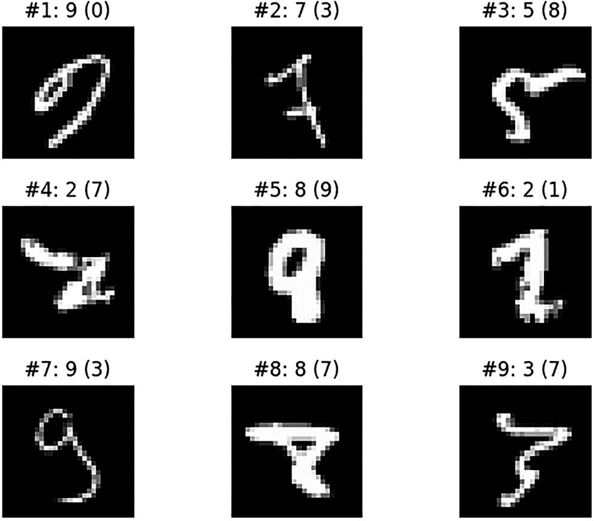

图 2-13

LeNet 预测失败

恭喜！我们已经完成了我们的第一个真实世界研究。我们定义了问题，选择了模型框架（LeNet），表达了搜索空间，实现了模型，并找到了该问题的最佳超参数。但这只是开始。让我们继续研究，看看我们还能取得哪些令人兴奋的结果。

### 使用 ReLU 和 Dropout 升级 LeNet

库：TensorFlow (Keras API), PyTorch

经验丰富的数据科学家可能会提出这样的问题：嘿？！为什么在前一节我们没有使用 dropout 层和 ReLU 作为 LeNet 模型的激活函数呢？因为原始的 LeNet 模型并没有使用 ReLU 激活函数。而 dropout 技术首次是在 2012 年提出的，距离 LeNet 架构的创建已有 22 年。LeNet 概念的主要问题之一是它使用了 sigmoid 作为激活函数。sigmoid 激活函数导致了训练速度变慢和梯度消失问题。dropout 技术也是最受欢迎的正则化方法之一。如今，我们无法想象一个不使用 ReLU 和 dropout 层的成功模式识别模型。让我们假设我们从未听说过 ReLU 和 dropout，有人建议我们将这些技术注入 LeNet 模型以提升其性能。我们可以通过 HPO 进行研究，这将帮助我们找到最佳架构。

让我们引入一个负责选择激活函数的`激活`设计超参数。为了简化问题，我们将使用一种“一刀切”的政策。这意味着如果`激活`超参数的值为`sigmoid`，那么 LeNet 模型将使用 sigmoid 函数作为所有激活函数。如果`激活`的值为`relu`，情况也是如此。图 2-14 展示了`激活`超参数。

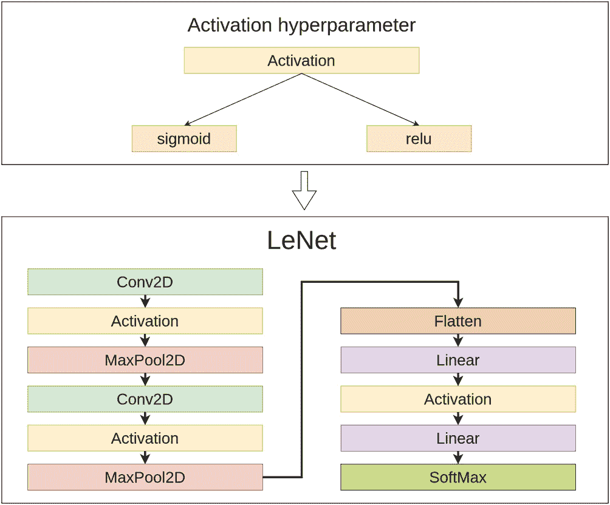

图 2-14

激活设计超参数

通常，dropout 层会被插入到线性层之间。但我们最初并不知道这项技术是否有效，因此我们必须制作两种可能的 LeNet 架构变体：带有 dropout 层和不带有 dropout 层。为此，我们使用`use_dropout`设计超参数。如果`use_dropout`为`0`，则 LeNet 模型不使用 dropout 层；如果`use_dropout`为`1`，则 LeNet 模型使用 dropout 层。同时，dropout 层将使用三种不同的*p*（dropout 率）值进行测试：0.3、0.5 和 0.7。图 2-15 展示了`use_dropout`设计超参数。

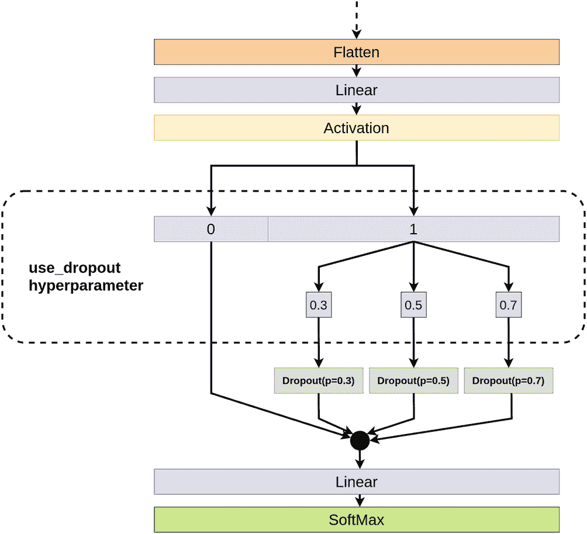

图 2-15

Dropout 设计超参数

每个模型设计都与特定的层超参数相匹配。因此，我们还需要将层超参数包含在搜索空间中。在这个实验中，我们将使用与上一节相同的超参数。但我们将选择稍微不同的值：

+   `滤波器大小:       16, 32`

+   `内核大小:       5, 7`

+   `l1 大小:        64, 128, 256`

+   `批量大小:        512, 1024`

+   `学习率:     0.001, 0.0001`

列表 2-15 展示了我们之前作为 NNI 搜索空间设置的参数约束。

```py
{
"activation": {
"_type": "choice", "_value": ["sigmoid", "relu"]},
Listing 2-15
LeNet Upgrade HPO search space. ch2/lenet_upgrade/search_space.json
```

这里，我们使用嵌套选择方法来实现`use_dropout`超参数：

```py
"use_dropout": {
"_type": "choice",
"_value": [
{"_name": 0},
{
"_name": 1, "rate":
{"_type": "choice", "_value": [0.3, 0.5, 0.7]}
}
]
},
"filter_size": {
"_type": "choice", "_value": [16, 32]},
"kernel_size": {
"_type": "choice", "_value": [5, 7]},
"l1_size": {
"_type": "choice", "_value": [64, 128, 256]},
"batch_size": {
"_type": "choice", "_value": [512, 1024]},
"learning_rate": {
"_type": "choice", "_value": [0.001, 0.0001]}
}
```

就像在上一节中一样，下一步是制作 LeNet 升级模型的 TensorFlow 和 PyTorch 实现。

### TensorFlow LeNet 升级实现

在本节中，我们将检查使用 TensorFlow（Keras API）实现的 LeNet 升级模型。

我们将仅在`TfLeNetUpgradeModel`中检查`__init__`和`call`方法。其他方法与`TfLeNetModel`（`ch2/lenet_hpo/tf_lenet_model.py`）中的方法相同。列表 2-16 展示了具有六个超参数的 LeNet 升级模型。

```py
class TfLeNetUpgradeModel(Model):
def __init__(
self,
filter_size,
kernel_size,
l1_size,
activation,
use_dropout,
dropout_rate = None
):
super().__init__()
Listing 2-16
LeNet Upgrade. TensorFlow implementation. ch2/lenet_upgrade/tf_lenet_upgrade_model.py
```

带有`activation`变量的第一层堆叠：

```py
self.conv1 = Conv2D(
filters = filter_size,
kernel_size = kernel_size,
activation = activation
)
self.pool1 = MaxPool2D(pool_size = 2)
self.conv2 = Conv2D(
filters = filter_size * 2,
kernel_size = kernel_size,
activation = activation
)
self.pool2 = MaxPool2D(pool_size = 2)
self.flatten = Flatten()
self.fc1 = Dense(
units = l1_size,
activation = activation
)
```

如果`use_dropout`，则添加 dropout 层，否则添加恒等层：

```py
if use_dropout:
self.drop = Dropout(rate = dropout_rate)
else:
self.drop = tf.identity
```

最终线性层堆叠：

```py
self.fc2 = Dense(
units = 10,
activation = 'softmax'
)
```

LeNet 升级模型按顺序调用每个层：

```py
def call(self, x, **kwargs):
x = self.conv1(x)
x = self.pool1(x)
x = self.conv2(x)
x = self.pool2(x)
x = self.flatten(x)
x = self.fc1(x)
x = self.drop(x)
return self.fc2(x)
```

在实现`LeNetUpgradeModel`之后，我们可以使用列表 2-17 来实现 NNI 试验脚本。

我们导入必要的模块并将代码根目录传递到系统路径：

```py
import os
import sys
import nni
# We use relative import for user-defined modules
SCRIPT_DIR = os.path.dirname(os.path.abspath(__file__)) + '/../..'
sys.path.append(SCRIPT_DIR)
from ch2.lenet_upgrade.tf_lenet_upgrade_model import TfLeNetUpgradeModel
Listing 2-17
NNI trial script with TensorFlow LeNetUpgrade implementation. ch2/lenet_upgrade/tf_trial.py
```

`trial`方法初始化模型，训练它，测试它，并返回 NNI 指标：

```py
def trial(hparams):
use_dropout = bool(hparams['use_dropout']['_name'])
model_params = {
"filter_size": hparams['filter_size'],
"kernel_size":   hparams['kernel_size'],
"l1_size":     hparams['l1_size'],
"activation":  hparams['activation'],
"use_dropout": use_dropout
}
if use_dropout:
model_params['dropout_rate'] = hparams['use_dropout']['rate']
model = TfLeNetUpgradeModel(**model_params)
model.train(
batch_size = hparams['batch_size'],
learning_rate = hparams['learning_rate']
)
accuracy = model.test()
# send final accuracy to NNI
nni.report_final_result(accuracy)
```

接下来，我们定义试验的主要入口点：

```py
if __name__ == '__main__':
# Manual HyperParameters
hparams = {
'use_dropout':   {'_name': 1, 'rate': 0.5},
'activation':    'relu',
'filter_size':   32,
'kernel_size':   3,
'l1_size':       64,
'batch_size':    512,
'learning_rate': 1e-3,
}
# NNI HyperParameters
# Run safely without NNI Experiment Context
nni_hparams = nni.get_next_parameter()
hparams.update(nni_hparams)
trial(hparams)
```

记住，试验脚本可以在独立模式下执行，因此你可以运行`ch2/lenet_upgrade/tf_trial.py`来测试其使用自定义参数的执行情况。

### PyTorch LeNet 升级实现

在本节中，我们将检查使用 PyTorch 实现的 LeNet 升级模型。

我们将仅在`PtLeNetUpgradeModel`中检查`__init__`和`forward`方法。其他方法与`PtLeNetModel`（`ch2/lenet_hpo/pt_lenet_model.py`）中的方法相同。列表 2-18 展示了具有六个超参数的 LeNet 升级模型：

```py
class PtLeNetUpgradeModel(nn.Module):
def __init__(
self,
filter_size,
kernel_size,
l1_size,
activation,
use_dropout,
dropout_rate = None
):
super(PtLeNetUpgradeModel, self).__init__()
Listing 2-18
LeNet Upgrade. PyTorch implementation. ch2/lenet_upgrade/pt_lenet_upgrade_model.py
```

我们通过`activation`变量设置`self.act`层：

```py
# Activation Function
if activation == 'relu':
self.act = torch.relu
elif activation == 'sigmoid':
self.act = torch.sigmoid
else:
raise Exception(f'Unknown activation: {activation}')
```

如果`use_dropout`，则添加 dropout 层，否则添加恒等层：

```py
if use_dropout:
self.drop = nn.Dropout(p = dropout_rate)
else:
self.drop = nn.Identity()
```

接下来，我们设置其他 LeNet 层：

```py
# Saving l1_size HyperParameter
self.l1_size = l1_size
self.conv1 = nn.Conv2d(
1,
filter_size,
kernel_size = kernel_size
)
self.conv2 = nn.Conv2d(
filter_size,
filter_size * 2,
kernel_size = kernel_size
)
# Lazy fc1 Layer Initialization
self.fc1__in_features = 0
self._fc1 = None
self.fc2 = nn.Linear(l1_size, 10)
```

LeNet 升级模型按顺序调用每个层：

```py
def forward(self, x):
x = self.act(self.conv1(x))
x = F.max_pool2d(x, 2, 2)
x = self.act(self.conv2(x))
x = F.max_pool2d(x, 2, 2)
# Flatting all dimensions but batch-dimension
self.fc1__in_features = np.prod(x.shape[1:])
x = x.view(-1, self.fc1__in_features)
x = self.act(self.fc1(x))
x = self.drop(x)
x = self.fc2(x)
return F.log_softmax(x, dim = 1)
```

在实现`LeNetUpgradeModel`之后，我们可以使用列表 2-19 来实现 NNI 试验脚本。

我们导入必要的模块并将代码根目录传递到系统路径：

```py
import os
import sys
import nni
# We use relative import for user-defined modules
SCRIPT_DIR = os.path.dirname(os.path.abspath(__file__)) + '/../..'
sys.path.append(SCRIPT_DIR)
from ch2.lenet_upgrade.pt_lenet_upgrade_model import PtLeNetUpgradeModel
Listing 2-19
NNI trial script with PyTorch LeNetUpgrade implementation. ch2/lenet_upgrade/pt_trial.py
```

`trial`方法初始化模型，训练它，测试它，并返回 NNI 指标：

```py
def trial(hparams):
use_dropout = bool(hparams['dropout']['_name'])
model_params = {
"filter_size": hparams['filter_size'],
"kernel_size": hparams['kernel_size'],
"l1_size":     hparams['l1_size'],
"activation":  hparams['activation'],
"use_dropout": use_dropout
}
if use_dropout:
model_params['dropout_rate'] = hparams['dropout']['rate']
model = PtLeNetUpgradeModel(**model_params)
model.train_model(
batch_size = hparams['batch_size'],
learning_rate = hparams['learning_rate']
)
accuracy = model.test_model()
nni.report_final_result(accuracy)
```

接下来，我们定义试验的主要入口点：

```py
if __name__ == '__main__':
# Manual HyperParameters
hparams = {
'dropout':       {'_name': 1, 'rate': 0.5},
'activation':    'relu',
'filter_size':   32,
'kernel_size':   3,
'l1_size':       64,
'batch_size':    512,
'learning_rate': 1e-3,
}
# NNI HyperParameters
# Run safely without NNI Experiment Context
nni_hparams = nni.get_next_parameter()
hparams.update(nni_hparams)
trial(hparams)
```

记住，试验脚本可以在独立模式下执行，因此你可以运行`ch2/lenet_upgrade/pt_trial.py`来测试其使用自定义参数的执行情况。

### 执行 LeNet 升级 HPO 实验

我们现在可以运行我们的第二个实验了。我们可以将这个实验视为 Vanilla LeNet 模型与通过 ReLU 和 dropout 增强的 LeNet 之间的战斗。请注意，这项研究的结果将特定于 MNIST 问题。在数据集上启动的实验可能会导致完全不同的结果。列表 2-20 定义了 LeNet 升级实验的配置。

```py
trialConcurrency: 2
Listing 2-20
LeNet Upgrade HPO Experiment configuration. ch2/lenet_upgrade/config.yml
```

我们将限制试验次数：

```py
maxTrialNumber: 300
searchSpaceFile: search_space.json
trialCodeDirectory: .
```

取消注释 PyTorch 试验行以使用 PyTorch 实现运行实验：

```py
trialCommand: python3 tf_trial.py
#trialCommand: python3 pt_trial.py
```

GridSearch Tuner 不能用于使用嵌套选择的搜索空间，所以我们选择 Random Search Tuner：

```py
tuner:
name: Random
trainingService:
platform: local
```

实验可以按以下方式进行：

```py
nnictl create --config ch2/lenet_upgrade/config.yml
```

注意

在 Intel Core i7 和 CUDA（GeForce GTX 1050）上运行时间为约 3 小时

实验返回了以下最佳试验超参数：

+   `activation`: relu

+   `use_dropout`: 1

    +   `rate`: 0.5

+   `filter_size`: 32

+   `kernel_size`: 5

+   `l1_size`: 256

+   `batch_size`: 512

+   `learning_rate`: 0.001

最佳试验展示了**0.9923**的结果，这比我们在上一节中获得的 0.9885 有显著改进。我们看到最佳超参数组合使用了 ReLU 激活和 dropout（p=0.5）层。这难道意味着通过 ReLU 和 dropout 增强的 LeNet 赢得了这场战斗？让我们看看超参数面板（图 2-16）中排名前 1%的试验，以回答这个问题。

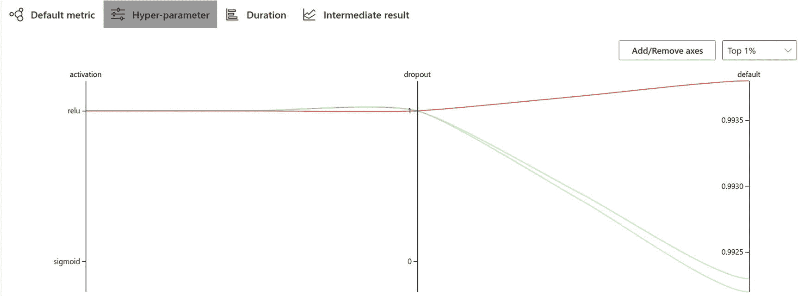

图 2-16

LeNet 升级 HPO 前 1%试验的超参数面板

图 2-16 表明，所有三个最佳超参数组合都具有以下超参数值：

+   `activation`: relu

+   `use_dropout`: 1

这可以被视为使用 ReLU 和 dropout 技术的有力证据。当然，这个结果可能看起来有些明显，但这仅仅是因为你已经知道了使用 ReLU 和 dropout 层的益处。最初，这个事实并不那么明显，需要实际证据，这正是我们刚刚展示的。

最后，让我们看看升级版 LeNet 模型未能分类的 MNIST 数据库样本。这些样本在图 2-17 中展示。

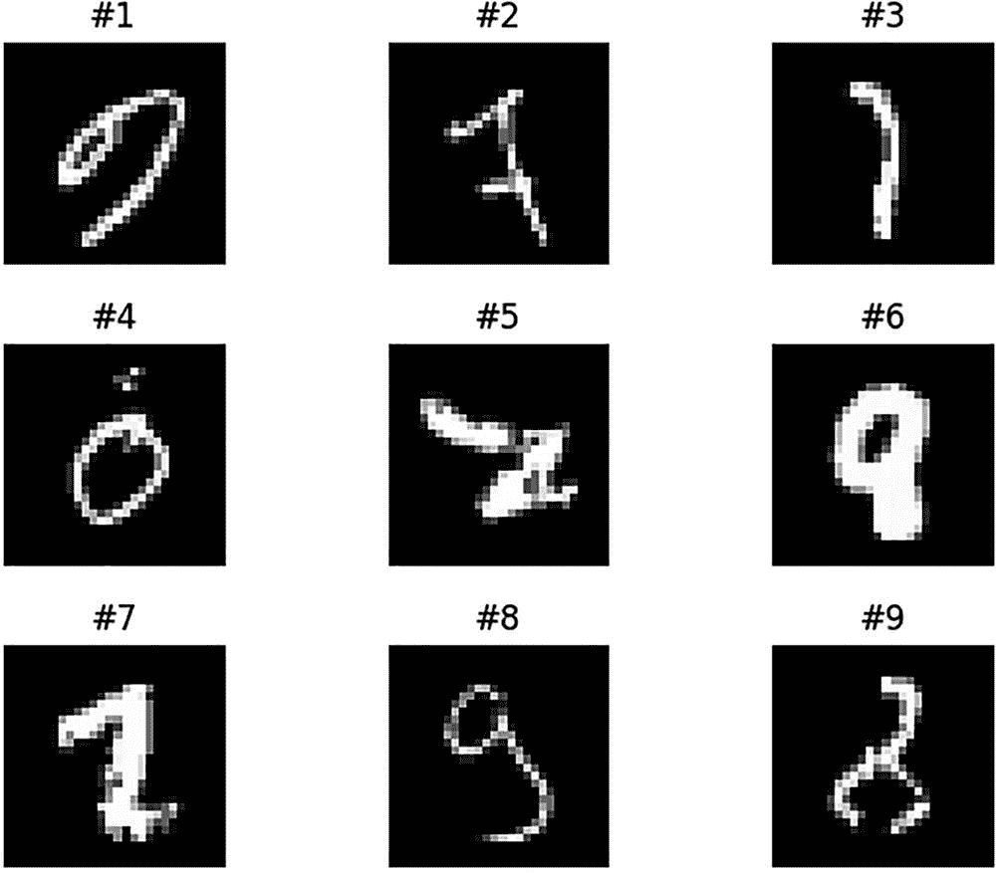

图 2-17

升级版 LeNet 模型失败

我故意没有在图 2-17 中打印出正确的结果。花一分钟，为每个样本写下你的答案，并与以下正确答案进行比较：

*答案。 #1: 9。 #2: 7。 #3: 7。 #4: 0。 #5: 2。 #6: 8。 #7: 2。 #8: 9。 #9: 8*。

如果你一个错误都没有犯，那么我真的很佩服你！我猜对了四个数字。如果人类在识别一些手写字符时都有困难，那么神经网络已经接近其性能阈值。我们开发的升级版 LeNet 模型的当前结果已经接近最佳。

本节展示了如何将新的深度学习技术注入现有架构。我们定义了一个搜索空间来选择最佳的设计组合。HPO 选择了一个升级的模型设计，显著提高了原始模型的表现。这是一个非常简单且有用的技术，将允许你使用机器学习的最新进展来优化你的模型。

### 从 LeNet 到 AlexNet

库：TensorFlow（Keras API）、PyTorch（PyTorch Lightning）

嗯，手写识别是一个相当重要的任务，但似乎是我们应该转向更复杂的问题的时候了。让我们尝试对更复杂的对象进行分类。开发一个能够对人类和马进行分类的模型怎么样？图 2-18 显示了“人类或马”数据集的样本。这个数据集包含 300×300 彩色图像，即（300，300，3）张量。显然，人类或马的图像比手写数字的 28×28 灰度图像更复杂。也许，我们需要进化之前考虑的 LeNet 模型。我们将称之为*LeNet 进化*模型。

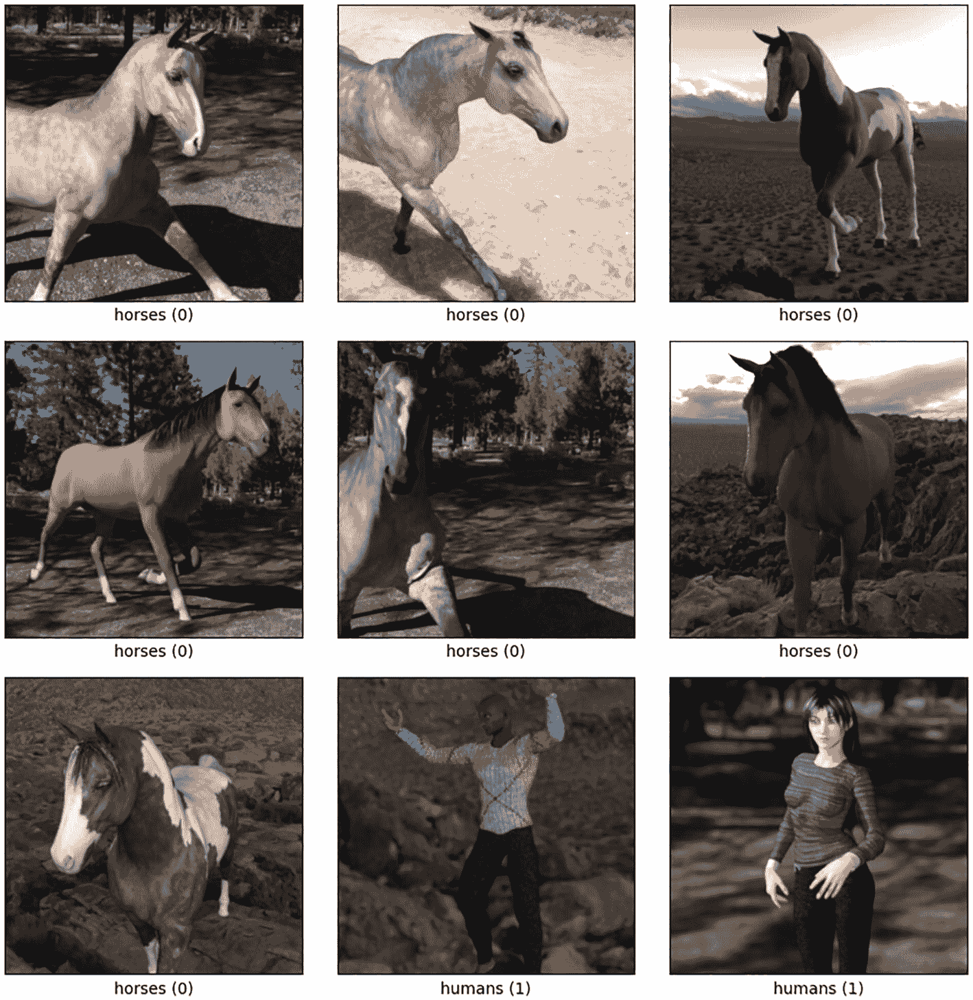

图 2-18

人马数据集

让我们再次看看 LeNet 模型的架构。LeNet 模型的设计可以分为两个部分：*特征提取*和*决策制定*。实际上，卷积层堆叠（*Conv2D → Activation → MaxPool2D → Conv2D → Activation → MaxPool2D → Flatten*）负责提取图像模式，即特征提取。同时，全连接层堆叠（*Linear → Activation → Linear → SoftMax*）负责选择特定的模式以对输入对象进行分类。图 2-19 显示了每个组件的责任区域。

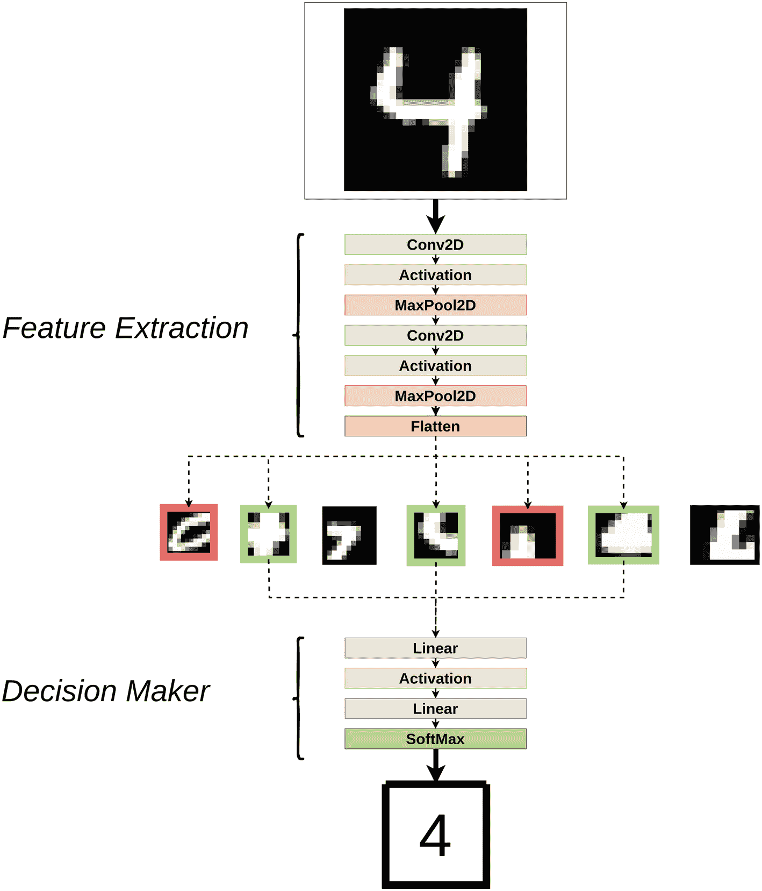

图 2-19

特征提取和决策制定组件

由于人类和马的图像更复杂，我们需要使特征提取组件更加复杂。通常有两种类型的层序列负责提取图像模式：*Conv2D → Activation → MaxPool2D*和*Conv2D → Activation*。我们可以构建一个实验，将不同的特征提取序列注入其中，以找到解决“人类和马”分类问题的最佳模型设计。以下，我们定义了三种类型的特征提取层序列，添加`none`作为空序列：

+   `simple`: *Conv2D → Activation*

+   `with_pool`: *Conv2D → Activation → MaxPool2D*

+   `none`: 标识层

每个特征提取序列将具有额外的层超参数：`filters`、`kernel`、`pool_size`。

让 LeNet 进化模型有三个模式提取槽位。每个槽位都可以填充以下特征提取序列之一：`simple`、`with_pool`、`none`。例如，一个 LeNet 进化模型可以有如下层序列填充的三个特征提取槽位：

+   `with_pool`: *Conv2D(*`kernel_size`*=5,* `filters`*=16) → 激活 → MaxPool2D(*`pool_size`*=3)*

+   `none`: 标识符

+   `simple`: *Conv2D(*`kernel_size`*=3,* `filters`*=8)→ 激活*

最后，LeNet 进化特征提取组件将呈现如下形式：*Conv2D(*`kernel_size`*=5,* `filters`*=16) → 激活 → MaxPool2D(*`pool_size`*=3) → Conv2D(*`kernel_size`*=3,* `filters`*=8) → 激活*。

我们可以将特征提取序列视为 LeNet 进化模型的构建块，如图 2-20 所示。

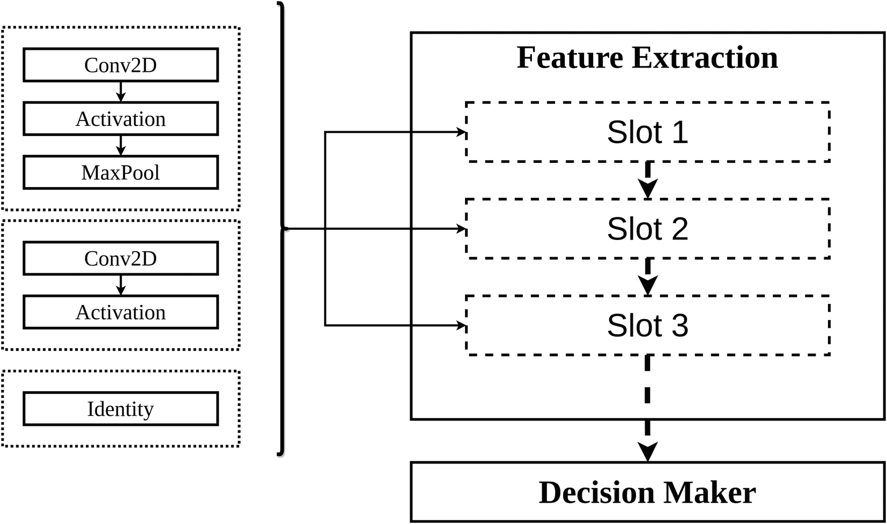

图 2-20

LeNet 进化特征提取组件

因此，我们可以定义 LeNet 进化模型的三个设计超参数。表 2-4 提供了 LeNet 进化模型设计超参数。

表 2-4

LeNet 进化特征提取超参数

| 名称 | 描述 | 值 |
| --- | --- | --- |
| `fe_slot_1` | 特征提取序列 1 | • `none`• `simple`  • `filters`: 8, 16, 32  • `kernel`: 5, 7, 9, 11• `with_pool:`  • `filters`: 8, 16, 32  • `kernel`: 5, 7, 9, 11  • `pool_size:` 3, 5, 7 |
| `fe_slot_2` | 特征提取序列 2 | • `none`• `simple`  • `filters`: 8, 16, 32  • `kernel:` 5, 7, 9, 11  • `with_pool:`  • `filters`: 8, 16, 32  • `kernel`: 5, 7, 9, 11  • `pool_size:` 3, 5, 7 |
| `fe_slot_3` | 特征提取序列 3 | • `none`• `simple`  • `filters`: 8, 16, 32  • `kernel`: 5, 7, 9, 11• `with_pool:`  • `filters`: 8, 16, 32  • `kernel`: 5, 7, 9, 11  • `pool_size:` 3, 5, 7 |

由于 LeNet 进化模型的特征提取组件返回的特征比 MNIST 问题中多，因此我们应让实验创建一个更高级的决策组件。可以通过添加一个额外的线性层来改进决策组件。这是增强决策组件最简单、最有效的方法。由于我们在上一节中证明了 dropout 层和 ReLU 激活的可持续性，它们也将用于决策组件。图 2-21 展示了决策组件的两个变体。

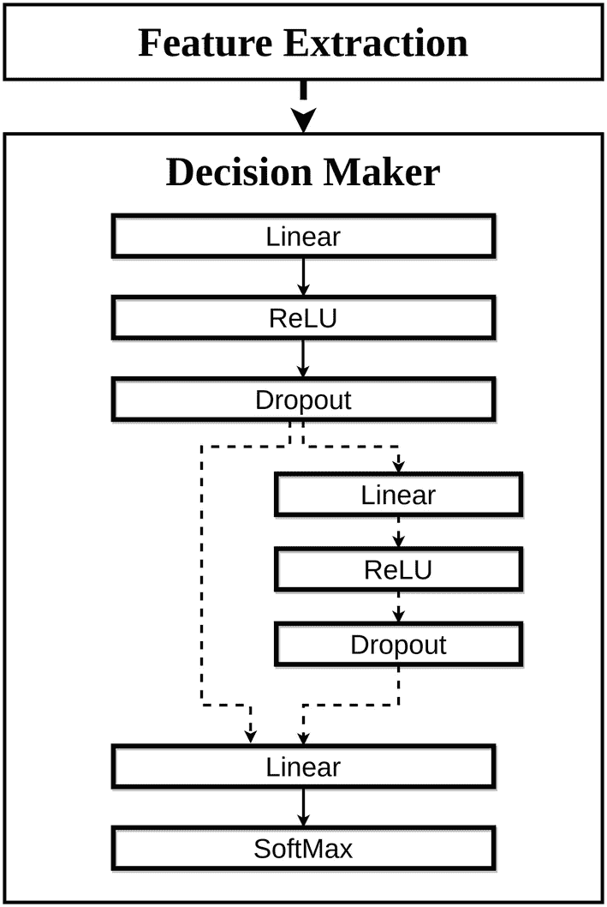

图 2-21

LeNet 进化决策组件

决策组件的设计将由以下超参数决定，这些超参数在表 2-5 中展示。

表 2-5

LeNet 进化决策组件超参数

| 名称 | 描述 | 值 |
| --- | --- | --- |
| `l1_size` | 第一个线性层的输出大小 | 512, 1024, 2048 |
| `l2_size` | 第二个线性层的输出大小 | 0, 512, 1024If 0 value is chosen, then the second linear layer is skipped |
| `dropout_rate` | Dropout 层的丢弃概率 | 0.3, 0.5, 0.7 |

此外，我们还将使用 `learning_rate` 作为训练超参数，以下为可选项：0.001, 0.0001。

在这个实验中，我们不仅寻找最佳超参数，而且试图根据原始 LeNet 模型的原则创建一个新的深度学习模型架构。在这里，我们不仅尝试调整现有模型，还尝试创建一个新模型。设计超参数列表负责独特的深度学习模型设计。

列表 2-21 定义了 LeNet Evolution 模型的 NNI 搜索空间。

第一个特征槽`fe_slot_1`可以填充以下这些特征提取序列之一：

+   *Conv2D*(`kernel_size, filters`) *→ 激活 → MaxPool2D*(`pool_size`)

+   *Conv2D*`(kernel_size, filters`) *→ 激活*

+   *None*

```py
{
"fe_slot_1": {
"_type": "choice",
"_value": [
{"_name": "none"},
{
"_name": "simple",
"filters": {"_type": "choice", "_value": [8, 16, 32]},
"kernel": {"_type": "choice", "_value": [5, 7, 9, 11]}
},
{
"_name": "with_pool",
"filters": {"_type": "choice", "_value": [8, 16, 32]},
"kernel": {"_type": "choice", "_value": [5, 7, 9, 11]},
"pool_size": {"_type": "choice", "_value": [3, 5, 7]}
}
]
},
Listing 2-21
LeNet Evolution HPO search space. ch2/lenet_to_alexnet/search_space.json
```

第二个和第三个特征提取槽(`fe_slot_2, fe_slot_3`)的值设置为与`fe_slot_1`相同：

```py
"fe_slot_2": {
"_type": "choice",
"_value": [
{"_name": "none"},
{
"_name": "simple",
"filters": {"_type": "choice", "_value": [8, 16, 32]},
"kernel": {"_type": "choice", "_value": [5, 7, 9, 11]}
},
{
"_name": "with_pool",
"filters": {"_type": "choice", "_value": [8, 16, 32]},
"kernel": {"_type": "choice", "_value": [5, 7, 9, 11]},
"pool_size": {"_type": "choice", "_value": [3, 5, 7]}
}
]
},
"fe_slot_3": {
"_type": "choice",
"_value": [
{"_name": "none"},
{
"_name": "simple",
"filters": {"_type": "choice", "_value": [8, 16, 32]},
"kernel": {"_type": "choice", "_value": [5, 7, 9, 11]}
},
{
"_name": "with_pool",
"filters": {"_type": "choice", "_value": [8, 16, 32]},
"kernel": {"_type": "choice", "_value": [5, 7, 9, 11]},
"pool_size": {"_type": "choice", "_value": [3, 5, 7]}
}
]
},
```

接下来，我们定义决策者超参数：

```py
"l1_size": {
"_type": "choice", "_value": [512, 1024, 2048]},
"l2_size": {
"_type": "choice", "_value": [0, 512, 1024]},
"dropout_rate": {
"_type": "choice", "_value": [0.3, 0.5, 0.7]},
```

并且`learning_rate`超参数完成了搜索空间：

```py
"learning_rate": {
"_type": "choice", "_value": [0.001, 0.0001]}
}
```

我们刚刚定义了一个相当非平凡的搜索空间。让我们希望实验的结果将符合我们的预期，并且最终架构将完美解决人类和马匹分类的问题。下一步是制作 LeNet Evolution 模型的 TensorFlow 和 PyTorch 实现。

### TensorFlow LeNet Evolution 实现

列表 2-22 展示了使用 TensorFlow 实现的**LeNet Evolution**模型的实现。

我们导入必要的模块：

```py
import tensorflow as tf
from tensorflow.keras import Model
from tensorflow.keras.layers import (
Conv2D, Dense,
Dropout, Flatten, MaxPool2D, ReLU,
)
from tensorflow.keras.optimizers import Adam
from ch2.utils.datasets import hoh_dataset
from ch2.utils.tf_utils import TfNniIntermediateResult
Listing 2-22
LeNet Upgrade. TensorFlow implementation. ch2/lenet_to_alexnet/tf_lenet_evolution.py
```

LeNet Evolution 模型使用四个超参数进行初始化：

```py
class TfLeNetEvolution(Model):
def __init__(
self,
feat_ext_sequences,
l1_size,
l2_size,
dropout_rate
):
super().__init__()
```

模型的层堆叠根据超参数动态填充：

```py
layer_stack = []
```

首先，我们定义特征提取序列：

```py
for fe_seq in feat_ext_sequences:
if fe_seq['type'] in ['simple', 'with_pool']:
# Constructing Feature Extraction Sequence
layer_stack.append(
Conv2D(
filters = fe_seq['filters'],
kernel_size = fe_seq['kernel']
)
)
if fe_seq['type'] == 'with_pool':
layer_stack.append(
MaxPool2D(
pool_size = fe_seq['pool_size']
)
)
layer_stack.append(ReLU())
layer_stack.append(Flatten())
```

接下来，我们构建决策者组件：

```py
layer_stack.append(
Dense(
units = l1_size,
activation = 'relu'
)
)
layer_stack.append(
Dropout(rate = dropout_rate)
)
```

如果`l2_size`大于零，则添加额外的线性层：

```py
# Optional Linear Layer
if l2_size > 0:
layer_stack.append(
Dense(
units = l2_size,
activation = 'relu'
)
)
layer_stack.append(
Dropout(rate = dropout_rate)
)
```

最终分类层：

```py
layer_stack.append(
Dense(
units = 2,
activation = 'softmax'
)
)
```

并且在这里，我们将层序列设置为模型：

```py
self.seq = tf.keras.Sequential(layer_stack)
```

模型执行方法是简单的序列层调用：

```py
def call(self, x, **kwargs):
y = self.seq(x)
return y
```

如前所述，我们使用`Adam`优化器，以交叉熵作为损失函数：

```py
def train(self, learning_rate, batch_size, epochs):
self.compile(
optimizer = Adam(learning_rate = learning_rate),
loss = 'sparse_categorical_crossentropy',
metrics = ['accuracy']
)
(x_train, y_train), _ = hoh_dataset()
intermediate_cb = TfNniIntermediateResult('accuracy')
self.fit(
x_train,
y_train,
batch_size = batch_size,
epochs = epochs,
verbose = 0,
callbacks = [intermediate_cb]
)
```

模型测试：

```py
def test(self):
(_, _), (x_test, y_test) = hoh_dataset()
loss, accuracy = self.evaluate(x_test, y_test, verbose = 0)
return accuracy
```

由于`LeNetEvolutionModel`已完成，我们可以使用列表 2-23 实现 NNI 试验脚本。

我们导入必要的模块并将代码根目录传递给系统路径：

```py
import os
import sys
import nni
# We use relative import for user-defined modules
# For NNI use relative import for user-defined modules
SCRIPT_DIR = os.path.dirname(os.path.abspath(__file__)) + '/../..'
sys.path.append(SCRIPT_DIR)
from ch2.lenet_to_alexnet.tf_lenet_evolution import TfLeNetEvolution
Listing 2-23
NNI trial script with TensorFlow LeNetEvolution implementation. ch2/lenet_to_alexnet/tf_trial.py
```

`trial`方法初始化模型，训练它，测试它，并返回 NNI 指标：

```py
def trial(hparams):
```

特征提取超参数被转换为通用形式：

```py
feat_ext_sequences = []
for k, v in hparams.items():
if k.startswith('fe_slot_'):
v['type'] = v['_name']
feat_ext_sequences.append(v)
```

模型初始化：

```py
model = TfLeNetEvolution(
feat_ext_sequences = feat_ext_sequences,
l1_size = hparams['l1_size'],
l2_size = hparams['l2_size'],
dropout_rate = hparams['dropout_rate']
)
```

在这里，我们以 50 个周期和固定的`batch_size` = 16 训练模型：

```py
model.train(
batch_size = 16,
learning_rate = 0.001,
epochs = 50
)
```

测试模型：

```py
accuracy = model.test()
```

然后，我们将`accuracy`指标返回给 NNI 调优器：

```py
# send final accuracy to NNI
nni.report_final_result(accuracy)
```

接下来，我们定义试验的主要入口点：

```py
if __name__ == '__main__':
# Manual HyperParameters
hparams = {
'fe_slot_1':    {
'_name':   'simple',
'filters': 16,
'kernel':  7
},
'fe_slot_2':    {
'_name':     'with_pool',
'filters':   8,
'kernel':    5,
'pool_size': 5
},
'fe_slot_3':    {
'_name':     'with_pool',
'filters':   8,
'kernel':    5,
'pool_size': 3
},
'l1_size':      1024,
'l2_size':      512,
'dropout_rate': .3,
'learning_rate': 0.001
}
# NNI HyperParameters
# Run safely without NNI Experiment Context
nni_hparams = nni.get_next_parameter()
hparams.update(nni_hparams)
trial(hparams)
```

记住，试验脚本可以以独立模式执行，因此您可以运行 ch2/lenet_to_alexnet/tf_trial.py 来测试其使用自定义参数的执行。

### PyTorch LeNet Evolution 实现

在本节中，我们将检查使用 PyTorch Lightning 实现的**LeNet Evolution**模型。PyTorch Lightning 是一个无缝的 PyTorch 包装器，有助于消除 PyTorch 代码的样板。它更简洁，更适合此类任务。列表 2-24 展示了基于 PyTorch Lightning 的 LeNet Evolution 模型。

我们导入必要的模块：

```py
import nni
import torch
import torch.nn.functional as F
import pytorch_lightning as pl
from sklearn.metrics import accuracy_score
from torch import nn
import numpy as np
from torch.utils.data import DataLoader
from ch2.utils.datasets import hoh_dataset
from ch2.utils.pt_utils import SimpleDataset
Listing 2-24
LeNet Evolution. PyTorch Lightning implementation. ch2/lenet_to_alexnet/pt_lenet_evolution.py
```

LeNet Evolution 模型使用所有五个超参数初始化。PyTorch Lightning 模型将初始化和训练逻辑封装在同一个类中，因此我们一次性传递所有超参数：

```py
class PtLeNetEvolution(pl.LightningModule):
def __init__(
self,
feat_ext_sequences,
l1_size,
l2_size,
dropout_rate,
learning_rate
) -> None:
super().__init__()
```

`learning_rate`和`dropout_rate`超参数被显式存储：

```py
self.lr = learning_rate
self.dropout_rate = dropout_rate
self.save_hyperparameters()
```

第一步是为特征提取组件动态创建层序列：

```py
fe_stack = []
# Input size of next conv layer is out_channels of previous one
in_dim = 3
for fe_seq in feat_ext_sequences:
if fe_seq['type'] in ['simple', 'with_pool']:
fe_stack.append(
nn.Conv2d(
in_dim,
out_channels = fe_seq['filters'],
kernel_size = fe_seq['kernel'],
bias = False
)
)
if fe_seq['type'] == 'with_pool':
fe_stack.append(
nn.MaxPool2d(
kernel_size = fe_seq['pool_size']
)
)
fe_stack.append(nn.ReLU())
in_dim = fe_seq['filters']
self.fe_stack = nn.Sequential(*fe_stack)
```

下一步是为决策者组件创建层序列：

```py
# Lazy fc1 Layer Initialization
self.fc1__in_features = 0
self._fc1 = None
```

如果`l2_size`大于零，则添加额外的线性层：

```py
if l2_size > 0:
self.fc2 = nn.Sequential(
nn.Linear(l1_size, l2_size),
nn.ReLU(),
nn.Dropout(dropout_rate)
)
self.fc3 = nn.Linear(l2_size, 2)
else:
self.fc2 = nn.Identity()
self.fc3 = nn.Linear(l1_size, 2)
```

这里，我们再次利用熟悉的懒加载层初始化模式：

```py
@property
def fc1(self):
if self._fc1 is None:
self._fc1 = nn.Sequential(
nn.Linear(
self.fc1__in_features,
self.hparams['l1_size']
),
nn.ReLU(),
nn.Dropout(self.dropout_rate)
)
return self._fc1
```

模型执行方法：

```py
def forward(self, x):
# calling feature extraction layer sequence
x = self.fe_stack(x)
# Flatting all dimensions but batch-dimension
self.fc1__in_features = np.prod(x.shape[1:])
x = x.view(-1, self.fc1__in_features)
x = self.fc1(x)
x = self.fc2(x)
x = self.fc3(x)
return F.log_softmax(x, dim = 1)
```

我们使用带有`learning_rate`超参数的`Adam`优化器：

```py
def configure_optimizers(self):
return torch.optim.Adam(
self.parameters(),
lr = self.lr
)
```

训练和测试方法使用交叉熵损失函数：

```py
def training_step(self, batch, batch_idx):
x, y = batch
p = self(x)
loss = F.cross_entropy(p, y)
self.log("train_loss", loss, prog_bar = True)
nni.report_intermediate_result(loss.item())
return loss
def test_step(self, batch, batch_idx):
x, y = batch
p = self(x)
loss = F.cross_entropy(p, y)
self.log('test_loss', loss, prog_bar = True)
return loss
```

以下方法在训练数据集上执行训练过程，并在测试数据集上测试训练好的模型：

```py
def train_and_test_model(self, batch_size, epochs):
```

准备训练和测试数据集：

```py
(x_train, y_train), (x_test, y_test) = hoh_dataset()
x_train = torch.from_numpy(x_train).float()
y_train = torch.from_numpy(y_train).long()
x_test = torch.from_numpy(x_test).float()
y_test = torch.from_numpy(y_test).long()
x_train = torch.permute(x_train, (0, 3, 1, 2))
x_test = torch.permute(x_test, (0, 3, 1, 2))
# Dataset to DataLoader
train_ds = SimpleDataset(x_train, y_train)
test_ds = SimpleDataset(x_test, y_test)
train_loader = DataLoader(train_ds, batch_size)
test_loader = DataLoader(test_ds, batch_size)
```

PyTorch Lightning 训练器：

```py
trainer = pl.Trainer(
max_epochs = epochs,
checkpoint_callback = False
)
```

模型训练：

```py
trainer.fit(self, train_loader)
```

最后，我们测试训练好的模型`：

```py
test_loss = trainer.test(self, test_loader)
output = self(x_test)
predict = output.argmax(dim = 1, keepdim = True)
accuracy = round(accuracy_score(predict, y_test), 4)
return accuracy
```

由于`LeNetEvolutionModel`已完成，我们可以使用列表 2-15 实现 NNI 试验脚本。

我们导入必要的模块并将代码根目录传递给系统路径：

```py
import os
import sys
import nni
# We use relative import for user-defined modules
# For NNI use relative import for user-defined modules
SCRIPT_DIR = os.path.dirname(os.path.abspath(__file__)) + '/../..'
sys.path.append(SCRIPT_DIR)
from ch2.lenet_to_alexnet.pt_lenet_evolution import PtLeNetEvolution
Listing 2-25
NNI trial script with PyTorch Lightning LeNetEvolution implementation. ch2/lenet_to_alexnet/pt_trial.py
```

`trial`方法初始化模型，训练它，测试它，并返回 NNI 指标：

```py
def trial(hparams):
```

将特征提取超参数转换为通用形式：

```py
feat_ext_sequences = []
for k, v in hparams.items():
if k.startswith('fe_slot_'):
v['type'] = v['_name']
feat_ext_sequences.append(v)
```

模型初始化：

```py
model = PtLeNetEvolution(
feat_ext_sequences = feat_ext_sequences,
l1_size = hparams['l1_size'],
l2_size = hparams['l2_size'],
dropout_rate = hparams['dropout_rate'],
learning_rate = hparams['learning_rate']
)
```

接下来，我们在 50 个 epoch 期间训练模型，并固定`batch_size` = 16，以相同的方法进行测试：

```py
accuracy = model.train_and_test_model(
batch_size = 16,
epochs = 50
)
```

然后，我们将`accuracy`指标返回给 NNI 调优器：

```py
# send final accuracy to NNI
nni.report_final_result(accuracy)
```

接下来，我们定义试验的主要入口点：

```py
if __name__ == '__main__':
# Manual HyperParameters
hparams = {
'fe_slot_1':    {
'_name':   'simple',
'filters': 16,
'kernel':  7
},
'fe_slot_2':    {
'_name':     'with_pool',
'filters':   8,
'kernel':    5,
'pool_size': 5
},
'fe_slot_3':    {
'_name':     'with_pool',
'filters':   8,
'kernel':    5,
'pool_size': 3
},
'l1_size':      1024,
'l2_size':      512,
'dropout_rate': .3,
'learning_rate': 0.001
}
# NNI HyperParameters
# Run safely without NNI Experiment Context
nni_hparams = nni.get_next_parameter()
hparams.update(nni_hparams)
trial(hparams)
```

记住，试验脚本可以以独立模式执行，因此你可以运行 ch2/lenet_to_alexnet/pt_trial.py 来测试其使用自定义参数的执行。

### 执行 LeNet Evolution HPO 实验

因此，我们来到了本节的高潮。我们可以将这个实验视为一个完整的科学研究，它将为特定数据集上的分类问题创建一个独特的深度学习模型。它将采用 LeNet 模型中最佳的图案识别原则。LeNet Evolution 模型试图从 LeNet 模型过渡到一个更复杂的模型。让我们定义实验配置并最终运行它。列表 2-26 包含了 LeNet Evolution HPO 实验的配置。

```py
trialConcurrency: 1
Listing 2-26
LeNet Evolution HPO Experiment configuration. ch2/lenet_to_alexnet/config.yml
```

我们将限制试验次数：

```py
maxTrialNumber: 400
searchSpaceFile: search_space.json
trialCodeDirectory: .
```

取消注释 PyTorch trial 行以使用 PyTorch 实现运行实验：

```py
trialCommand: python3 tf_trial.py
#trialCommand: python3 pt_trial.py
```

GridSearch Tuner 不能用于使用嵌套选择的搜索空间，因此我们选择 Random Search Tuner：

```py
tuner:
name: Random
trainingService:
platform: local
```

实验可以按以下方式运行：

```py
nnictl create --config ch2/lenet_to_alexnet/config.yml
```

注意

在配备 CUDA（GeForce GTX 1050）的 Intel Core i7 上运行，持续时间为约 18 小时：

实验返回的最佳试验超参数列在表 2-6 中。

表 2-6

LeNet Evolution 最佳超参数

| 名称 | 值 |
| --- | --- |
| `fe_slot_1` | • `with_pool`:  • `filters`: 32  • `kernel`: 7  • `pool_size`: 5 |
| `fe_slot_2` | • `with_pool`:  • `filters`: 8  • `kernel`: 11  • `pool_size`: 5 |
| `fe_slot_3` | • `simple`:  • `filters`: 8  • `kernel`: 7 |
| `l1_size` | 1024 |
| `l2_size` | 512 |
| `dropout_rate` | 0.3 |
| `learning_rate` | 0.0001 |

最佳试验在测试数据集上达到了 **0.9941** 的准确率，这是一个出色的结果。我们确实成功构建了一个能够以非常高的准确度区分复杂彩色对象的模型。这是一个良好的进展！读者可能会想知道：*为什么这一节被称为从 LeNet 到 AlexNet*？好吧，是时候回答这个问题了。AlexNet 是一个卷积神经网络架构的名称，它在 2012 年图像识别竞赛中获胜。AlexNet 将图像分类为 1000 个不同的类别。当时，它是一个相当先进的深度学习模型。现在，让我们比较三个模型：LeNet 模型、本节使用 HPO 技术构建的模型（LeNet 进化）和 AlexNet 模型。

图 2-22 显示，本节中我们为人类和马匹分类构建的模型位于原始 LeNet 模型和 AlexNet 模型之间。我们的模型在测试中表现出 **99.41%** 的显著准确率。但更重要的是，它是完全自动构建的，得益于 HPO 技术和 NNI 工具！我们没有进行任何复杂的计算或分析。我们仅仅构建了一个灵活的 LeNet 进化模型，其架构依赖于传递的超参数。结果，我们得到了一个完全适应解决特定任务的独特模型。这些结果证实了 HPO 方法解决深度学习问题的承诺。

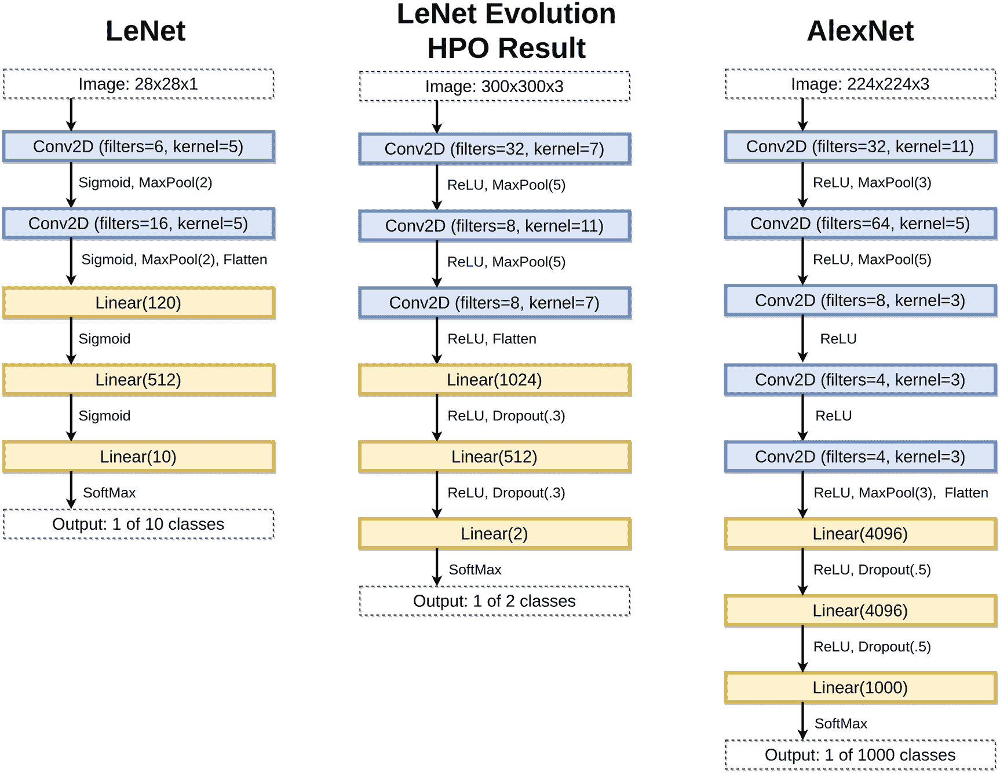

图 2-22

LeNet, LeNet 进化，AlexNet

### 摘要

在本章中，我们开始了 HPO 研究。我们研究了如何创建 NNI 实验，并解决实际问题。我们成功优化了原始 LeNet 模型以进行手写数字识别，使用 ReLU 和 dropout 技术升级 LeNet 模型，并基于现有 LeNet 模型构建了一个新的复杂彩色图案识别模型。我们获得的结果展示了 AutoDL 的潜力。在下一章，我们将继续研究 HPO，并深入探讨在超参数优化问题中的更高级 NNI 应用。
