# 3. 在 Shell 下进行超参数优化

在上一章中，我们看到了简单的 HPO 技术可以产生非常令人印象深刻的结果。超参数优化不仅优化了数据集的特定模型，甚至可以构建新的架构。但事实是，到目前为止，我们一直使用的是一组基本的工具进行 HPO 任务。确实，到目前为止，我们只使用了原始的随机搜索调谐器和网格搜索调谐器。我们从上一章了解到，搜索空间可能包含数百万甚至数十亿个参数。如果我们有无限的时间，我们总是可以使用网格搜索调谐器。但不幸的是，这种方法在现实中并不适用。我们需要在寻找最佳超参数的速度和质量之间取得良好平衡的调谐器。另一种有用的技术是早期停止算法。早期停止算法基于中间结果分析模型训练过程，并决定是否继续训练或停止以节省时间。

本章将研究各种 HPO 调谐器，并介绍它们的基本特性。我们将探讨使用早期停止算法来加速具有无望训练过程的实验停止试验。此外，考虑为特定任务创建自定义 HPO 调谐器。本章将极大地增强超参数优化方法的实际应用。

## 调谐器

我们从考察各种超参数优化（HPO）调谐器开始本章。正如你记得的那样，调谐器在评估特定搜索空间参数后从试验中接收指标。基于所有已完成试验的现有结果历史，调谐器决定下一个要测试的超参数配置。调谐器的主要任务是尽可能快地找到最佳超参数。选择合适的调谐器可以显著提高实验结果。让我们更详细地看看随机搜索调谐器和网格搜索调谐器是如何工作的。

考虑一个用列表 3-1 表达的两个变量黑盒函数。

```py
from ch3.bbf.utils import discrete, noise, scatter_plot
def black_box_f1(x, y):
z = - 10 * (pow(x, 5) / (3 * pow(x * x * x / 4 + 1, 2) + pow(y, 4) + 10) + pow(x * y / 2, 2) / 1000)
d = discrete(z, .8)
r = d + noise(x, y, scale = 8)
d = discrete(r, .2)
return r
Listing 3-1
Black-box function. ch3/bbf/f1.py
```

我故意没有给出这个函数的解析公式。`black_box_f1` 只是一个黑盒函数，我们对它的内部逻辑一无所知。在现实生活中，黑盒函数具有以下特性：

+   它们不是连续的

+   它们有随机噪声

本章我们将考察的所有黑盒函数都将满足这些特性。但无论如何，我们可以稍微作弊一下，绘制这个函数：

```py
if __name__ == '__main__':
scatter_plot(black_box_f1, [-10, 10], [-10, 10])
```

图 3-1 显示了红色区域是黑盒函数 `black_box_f1` 达到最大值的地方。

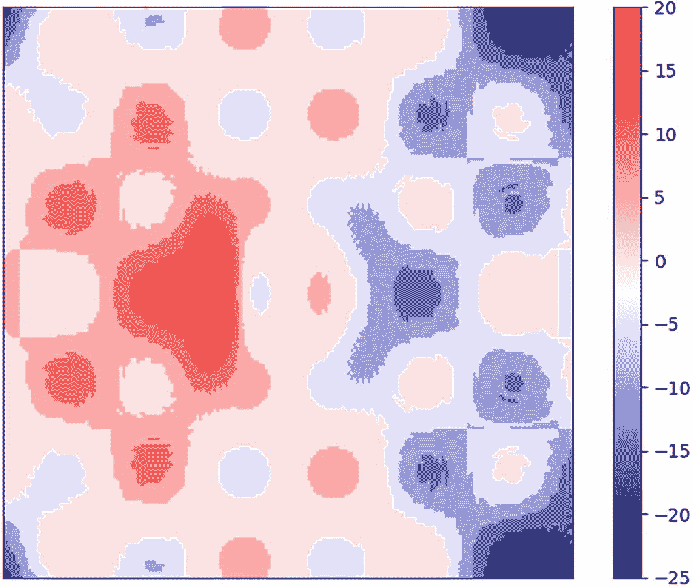

图 3-1

黑盒函数绘图

注意

在本章中，我们将仅考察寻找黑盒函数 ***f*** 的最大值的问题。寻找函数 f 的最大值问题等价于寻找函数 -***f*** 的最小值问题。

当然，在研究之前能够可视化黑盒函数将是非常好的，但这里有两个主要问题：

+   大多数黑盒函数都有大量的变量。

+   使用特定参数计算一个函数值可能需要几分钟甚至几小时。

因此，当然，选择调优器非常重要。让我们看看随机搜索调优器是如何探索`black_box_f1`函数的。我们正在实施一个嵌入式实验，以可视化在列表 3-2 中实验期间调优器选择的试验参数。

我们导入必要的模块：

```py
from pathlib import Path
from nni.experiment import Experiment
from ch3.bbf.f1 import black_box_f1
from ch3.bbf.utils import scatter_plot
Listing 3-2
Random Search Tuner. ch3/tuners/random_tuner/run_experiment.py
```

`black_box_f1`的搜索空间包含[-10, 10] × [-10, 10]中的所有整数对。搜索空间中有 441 个元素。

```py
search_space = {
"x": {"_type": "quniform", "_value": [-10, 10, 1]},
"y": {"_type": "quniform", "_value": [-10, 10, 1]}
}
```

实验将有 100 次试验：

```py
experiment = Experiment('local')
experiment.config.experiment_name = 'Random Tuner'
experiment.config.trial_concurrency = 4
experiment.config.max_trial_number = 100
experiment.config.search_space = search_space
experiment.config.trial_command = 'python3 trial.py'
experiment.config.trial_code_directory = Path(__file__).parent
```

我们选择随机搜索调优器

```py
experiment.config.tuner.name = 'Random'
```

并开始实验：

```py
http_port = 8080
experiment.start(http_port)
```

接下来，我们定义主要事件循环：

```py
while True:
if experiment.get_status() == 'DONE':
```

当实验完成后，我们显示实验期间创建的所有试验：

```py
search_data = experiment.export_data()
trial_params = [trial.parameter for trial in search_data]
# Visualizing Trial Parameters
scatter_plot(
black_box_f1, [-10, 10], [-10, 10],
trial_params, title = 'Random Search'
)
search_metrics = experiment.get_job_metrics()
input("Experiment is finished. Press any key to exit...")
break
```

让我们检查在列表 3-2 中实验期间随机搜索调优器生成的所有试验。

图 3-2 显示了随机搜索调优器生成的试验是简单的随机点散布。在某些情况下，点（试验）可能成功地落入最大值区域，但在许多情况下，最大值区域仍未得到适当的探索。

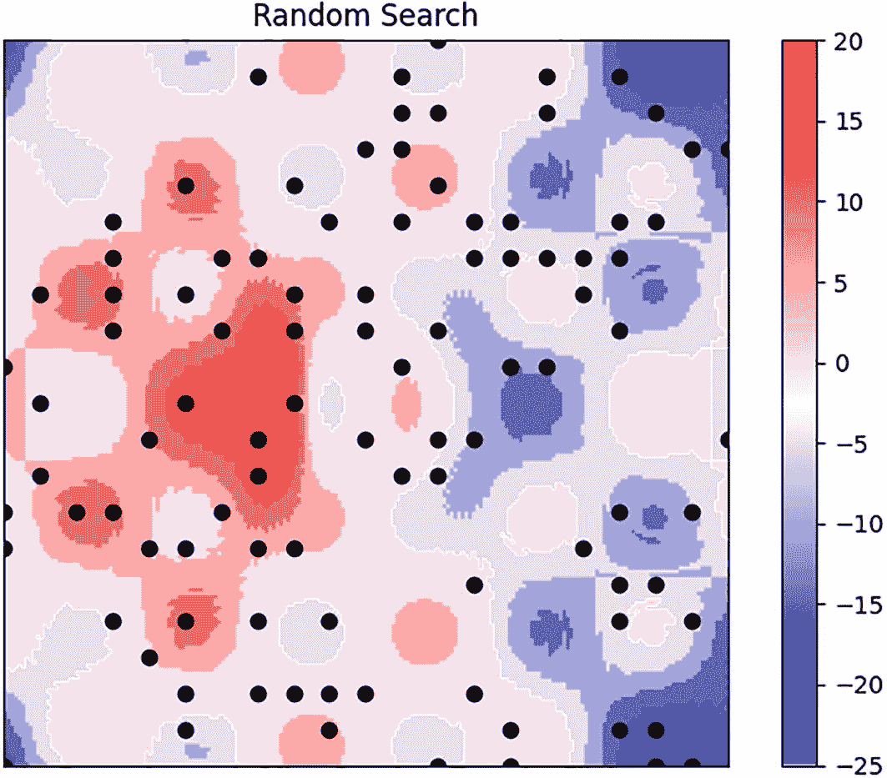

图 3-2

随机搜索调优器试验

现在我们来看看网格搜索调优器通过探索列表 3-3 中的`black_box_f1`函数生成的试验。

```py
experiment.config.tuner.name = 'GridSearch'
Listing 3-3
Grid Search Tuner. ch3/tuners/grid_tuner/run_experiment.py
```

网格搜索实验在列表 3-2 中看起来与随机搜索实验非常相似。这里我们只使用网格搜索调优器：

图 3-3 展示了网格搜索调优器生成的试验。

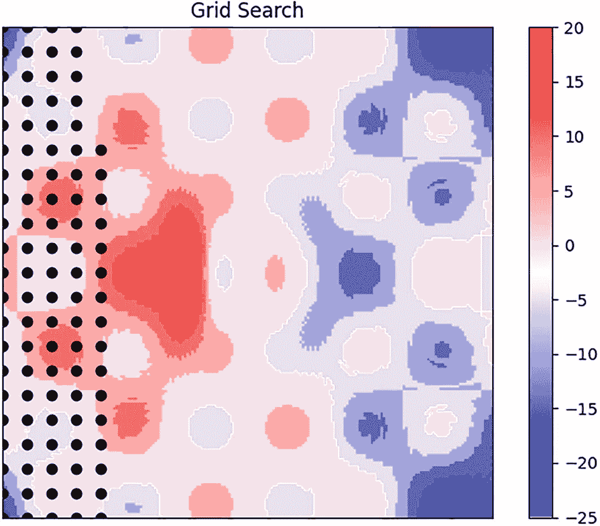

图 3-3

网格搜索调优器试验

我们看到网格搜索调优器只是以特定顺序遍历搜索空间中的所有值。当可能遍历搜索空间中的所有值时，这种方法对于处理小搜索空间是有帮助的。否则，网格搜索调优器生成的试验可能甚至无法接近黑盒函数的最大值区域。

随机和网格调优器的主要问题在于它们以任何方式都不与它们的试验结果交互。它们没有任何“记忆”，这会允许它们突出搜索空间中的有希望的区域，并将搜索集中在这些区域上。我们现在将开始研究具有“记忆”并能更有效地探索搜索空间的调优器。

## 进化调优器

进化调谐器的搜索基于自然进化的原理。它实现了进化的两个基本原理：选择和变异。进化调谐器初始化一个特定大小的种群。每个种群个体代表搜索空间中特定的一组参数。每个个体都有一个表示试验结果的适应度属性。我们说个体 `A` 比个体 `B` 更好：

+   当调谐器在最大化模式下运行时，如果 `A.fitness` > `B.fitness`

+   当调谐器在最小化模式下运行时，如果 `A.fitness` < `B.fitness`

进化调谐器从随机配对的个体中选取最佳个体，并通过随机替换其参数值来对其进行随机变异。之后，变异个体替换原始个体，然后重复此过程。图 3-4 展示了这一搜索原理。

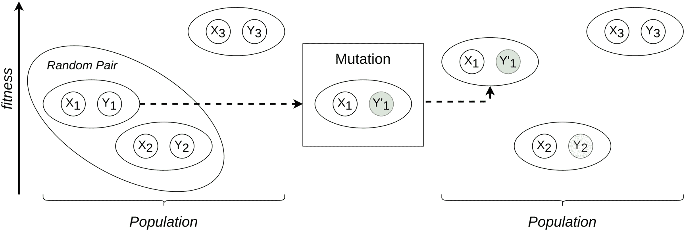

图 3-4

进化调谐器

进化调谐器的一个大问题在于变异并不总是能提高个体的适应度。变异操作仅执行参数值的随机变化，通常变异会降低个体的性能。

注意

经验丰富的读者可能会注意到，基于自然选择原理的进化算法还有一个关键方法——*交叉*。但许多研究表明，大多数进化问题可以在没有 *交叉* 操作的情况下解决。这个进化调谐器的实现不包含 *交叉* 操作。

这里是进化调谐器配置的一个示例：

```py
# config.yml
tuner:
name: Evolution
classArgs:
optimize_mode: maximize
population_size: 100
```

进化调谐器支持所有搜索空间类型：`choice`、`choice(nested)`、`randint`、`uniform`、`quniform`、`loguniform`、`qloguniform`、`normal`、`qnormal`、`lognormal` 和 `qlognormal`。

让我们看看进化调谐器在实际中优化列表 3-4 中的 `black_box_f1` 函数的情况。

（完整代码在相应的文件中提供：*ch3/tuners/evolution_tuner/run_experiment.py*。）

设置种群大小：

```py
population_size = 8
Listing 3-4
Evolution Tuner
```

选择实验中的进化调谐器：

```py
experiment.config.tuner.name = 'Evolution'
experiment.config.tuner.class_args['optimize_mode'] = 'maximize'
experiment.config.tuner.class_args['population_size'] = population_size
```

与网格搜索调谐器和随机搜索调谐器不同，进化调谐器有“记忆”。这就是为什么它更有吸引力，可以分析搜索过程进度。我们将通过代数展示搜索空间中试验参数分配的历史：

+   **第 1 代**：从第 1 次试验到第 25 次试验

+   **第 2 代**：从第 26 次试验到第 50 次试验

+   **第 3 代**：从第 51 次试验到第 75 次试验

+   **第 4 代**：从第 76 次试验到第 100 次试验

这种方法将使我们能够观察搜索进度：

```py
# Event Loop
while True:
if experiment.get_status() == 'DONE':
search_data = experiment.export_data()
```

试验历史：

```py
trial_params = [trial.parameter for trial in search_data]
```

按代数分割试验历史：

```py
trial_params_chunks = [
trial_params[i:i + 25]
for i in range(0, len(trial_params), 25)
]
```

可视化每一代：

```py
for i, population in dict(enumerate(trial_params_chunks)).items():
scatter_plot(
black_box_f1, [-10, 10], [-10, 10],
population, title = f'Evolution Generation: {i+1}'
)
```

让我们分析个体在进化搜索过程中的位置是如何变化的。

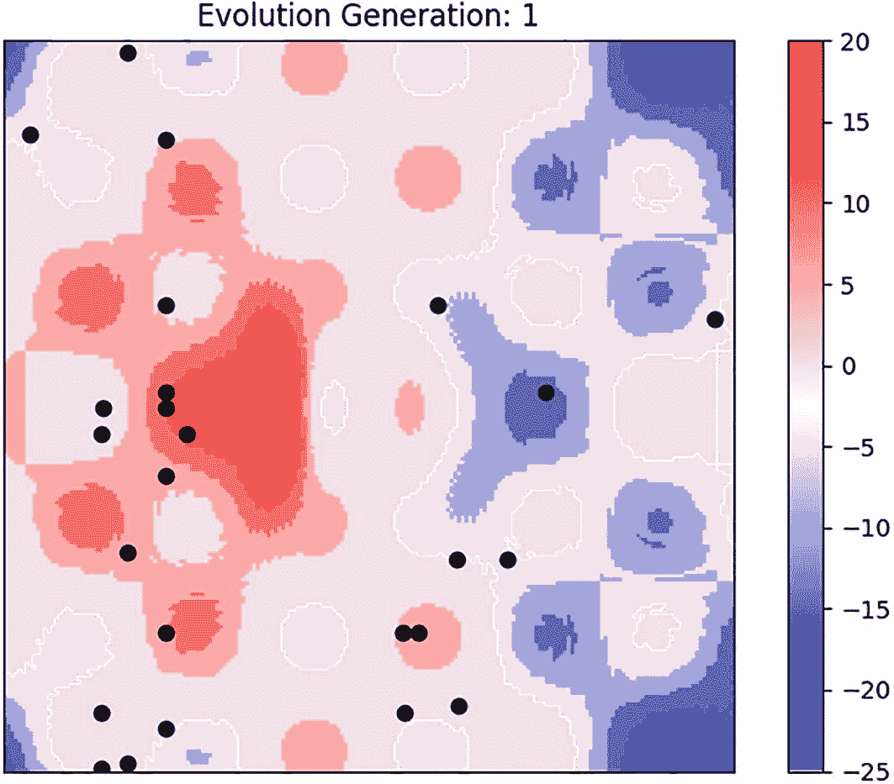

图 3-5

进化调谐器。代数：1

图 3-5 显示试验参数的分配接近随机分布。

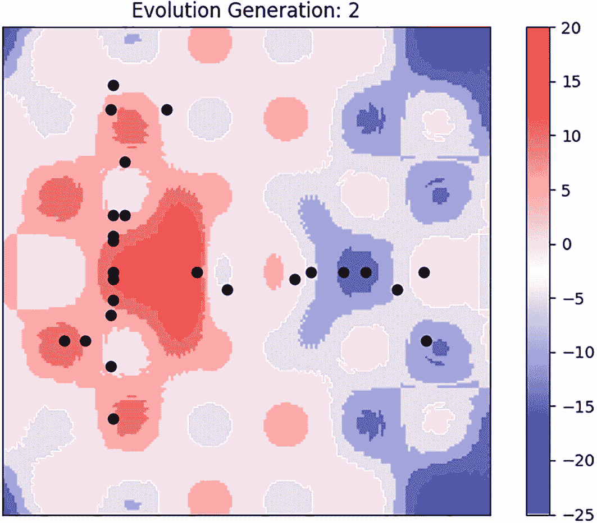

图 3-6

进化调谐器。代数：2

在图 3-6 中，我们看到大多数个体已经处于红色区域，这意味着种群正在平稳地向函数的最高值移动。图 3-7 中显示的最后一代至少有一个个体位于红色区域的顶部。

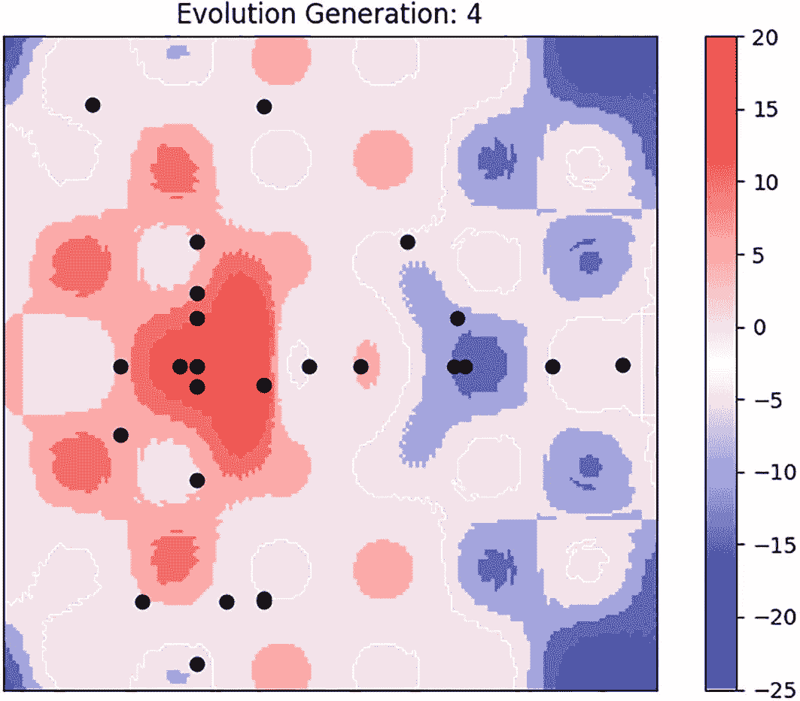

图 3-7

进化调谐器。代数：4

注意

并非所有内置的 NNI 调谐器都支持随机种子设置。因此，实验不可重复。因此，您在本地机器上获得的结果可能与本章中显示的结果不同。然而，所有机器上调谐器的一般行为保持不变，因此相同调谐器在相同搜索空间中的结果相似。

我们可以将进化调谐器视为一个有向随机搜索。它比随机搜索略好，但由于该算法过于随机的本质，仍然存在许多问题。进化调谐器通常需要多次试验，但由于其简单性通常被选中。

## 热处理调谐器

热处理调谐器基于模拟退火算法。模拟退火是一种解决优化问题的方法。该算法模拟了加热材料并缓慢降低温度以减少缺陷的物理过程，从而最小化系统能量。热处理调谐器像进化调谐器一样将随机性作为搜索过程的一部分。

热处理算法包括以下步骤：

1. 热处理算法在搜索空间中随机选择一个元素 X，并计算 f(X) 的值。

2. 算法对搜索空间中的元素 X 进行随机变异，产生 X’ 元素。

如果 X 是实数，则 X’ 可以计算为 X’ = X + ΔX，其中 ΔX 是一个随机变量。接下来，我们比较 f(X’）和 f(X)。

3a. 如果 f(X’）< f(X)，则认为变异是负的。

3b. 如果 f(X’）≥ f(X)，则认为变异是正的，并通过 X’ 更新 X 的值。

4. 如果变异是负的，则算法计算以下值：

+   *r*: 在 (0, 1) 上的均匀随机值。

+   Δ: f(X) - f(X’）。

+   *σ* 是搜索过程中所有探索值的标准差：f(X[1])，…，f(X[n]) 乘以退化率 *c*^(*i*)，其中 *c* 是小于 1 的正数，*i* 是迭代次数，σ = *c*^(*i*) *std*([f(X[1])，…，f(X[n])])。

接下来，我们比较 *r* 和 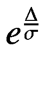，其中 *e* 是指数。

5a. 如果 *r* < ，则算法从 X 退化到 X’：X ← X’。这是希望在下一次迭代中能够达到一个新的峰值，而向 X’ 的转换只是一个中间步骤。我们可以将其视为一个探索步骤，该步骤在搜索空间中探索 X 附近的区域。

5b. 如果 *r* > ，则算法不更新 X。

f(X) 越接近 f(X’)，探索步骤被采取的可能性就越大。

从 2 到 5 的步骤重复 *n* 次。图 3-8 展示了退火算法流程。

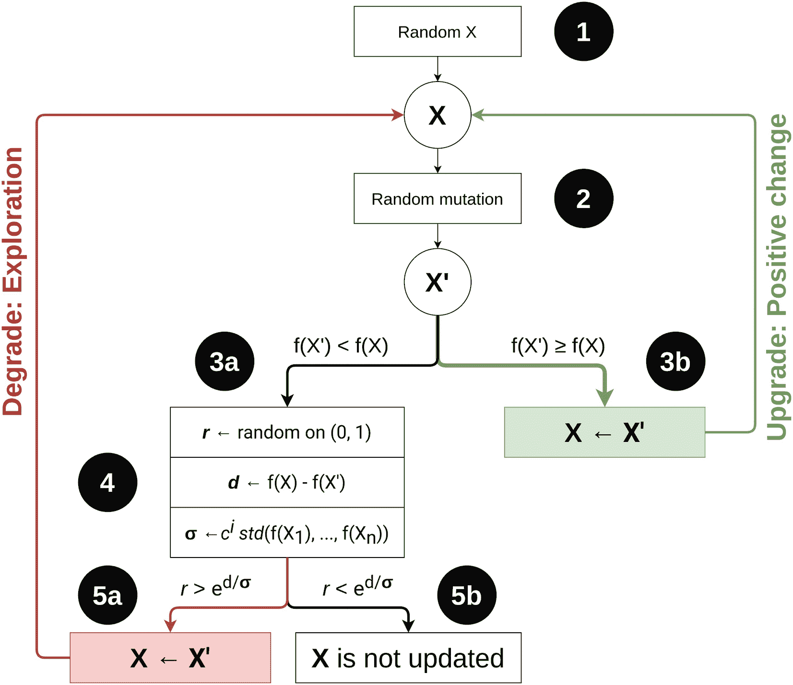

图 3-8

退火算法流程

退火算法的本质是到达黑盒函数 *f* 的表面“山丘”并研究这个“山丘”的区域。在某些情况下，算法可能会从“山丘”下降，希望爬到更高的一个。这个算法的缺点是它不能覆盖函数 f 表面不同“山丘”之间的大距离。图 3-9 展示了退火算法的实际操作。

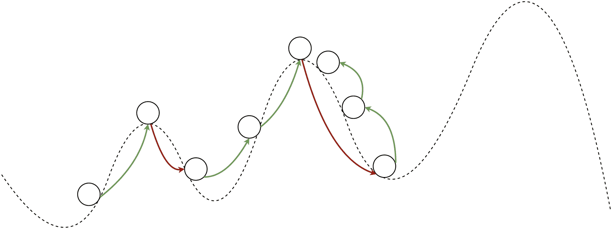

图 3-9

退火算法实际操作

这里是 Anneal Tuner 配置的一个示例：

```py
# config.yml
tuner:
name: Anneal
classArgs:
population_size: 100
```

Anneal Tuner 支持所有搜索空间类型：`choice`，`choice(nested)`，`randint`，`uniform`，`quniform`，`loguniform`，`qloguniform`，`normal`，`qnormal`，`lognormal` 和 `qlognormal`。

列表 3-5 展示了基于 Holder 函数的另一个黑盒函数 `holder_function`，我们将用它来测试 Anneal Tuner 的性能。

```py
from numpy import exp, sqrt, cos, sin, pi
def holder_function(x, y):
"""
Holder's function
"""
z = abs(sin(x) * cos(y) * exp(abs(1 - (sqrt(x**2 + y**2) / pi))))
d = discrete(z, .8)
r = d + noise(x, y, scale = 8)
d = discrete(r, .2)
return r
Listing 3-5
Holder’s black-box function. ch3/bbf/holder.py
```

`holder_function` 可以以下方式绘制：

```py
from ch3.bbf.utils import scatter_plot, discrete, noise
if __name__ == '__main__':
scatter_plot(holder_function, [-10, 10], [-10, 10])
```

图 3-10 显示了 `holder_function` 函数的表面。这个表面更具挑战性，表面上有许多均匀分布的“山丘”。最高的峰值在左角。

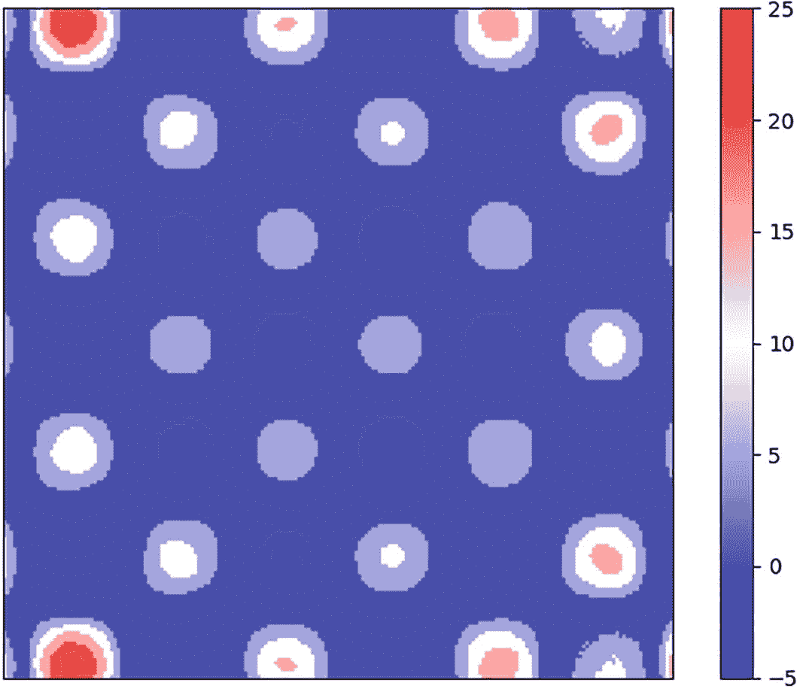

图 3-10

Holder 函数

让我们检查 Anneal Tuner 在列表 3-6 中如何优化 `holder_function`。

（完整代码在相应的文件中提供：*ch3/tuners/anneal_tuner/run_experiment.py*。）

选择实验的 Anneal Tuner：

```py
experiment.config.tuner.name = 'Anneal'
experiment.config.tuner.class_args['optimize_mode'] = 'maximize'
Listing 3-6
Anneal Tuner
```

实验完成后，我们可以分析 Anneal Tuner 的搜索进度。

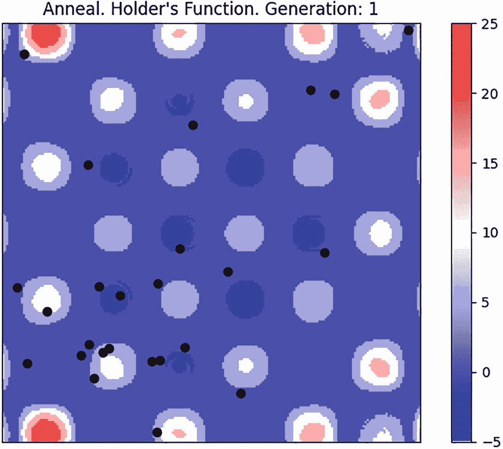

图 3-11

Anneal Tuner. 生成：1

在图 3-11 中，我们可以看到 Anneal Tuner 正在开始研究左下角的“山丘”。

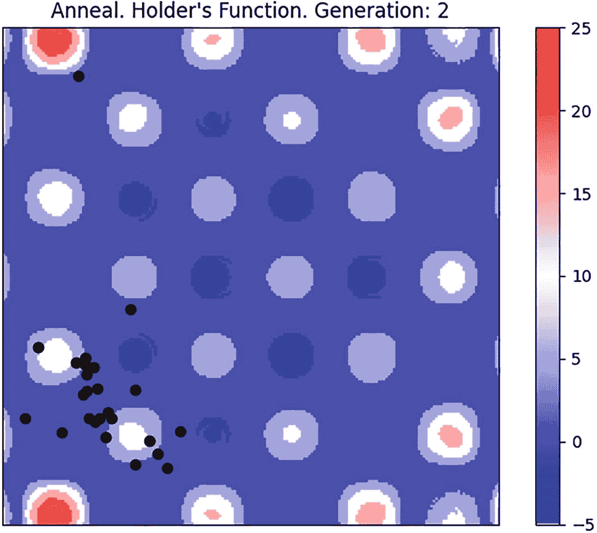

图 3-12

Anneal Tuner. 生成：2

图 3-12 展示了第二代试验完全集中在左下角的两个“山丘”上。

如我们在图 3-13 中所见，热处理调谐器完全专注于探索仅一个“山丘”。热处理调谐器找到了局部最大值，但无法在左下角底部找到全局最大值，接近热处理调谐器找到的解。

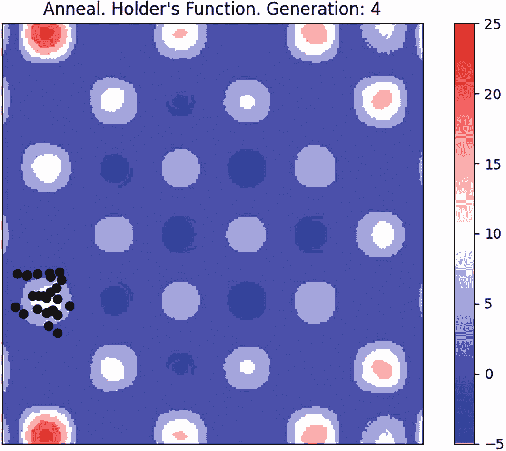

图 3-13

热处理调谐器。生成：4

热处理调谐器和进化调谐器是定向随机搜索的变体。它们直观且简单，但它们可能并不总是有效地探索搜索空间。让我们研究更多基于贝叶斯优化方法的先进调谐器。

## 序列模型优化调谐器

在本节中，我们将考察基于序列模型优化（SMBO）的调谐器。SMBO 是贝叶斯优化方法的一种表述。SMBO 实现了以下技术：构建黑盒函数 *f* 的概率模型 p(y|x)，并使用它来挑选搜索空间中最有希望的元素以评估黑盒函数 *f*。

检查 SMBO 方法在实际操作中的表现。假设我们有一些获得的试验结果：(x[1], f(x[1])), (x[2], f(x[2])), (x[3], f(x[3])), 如图 3-14 所示。

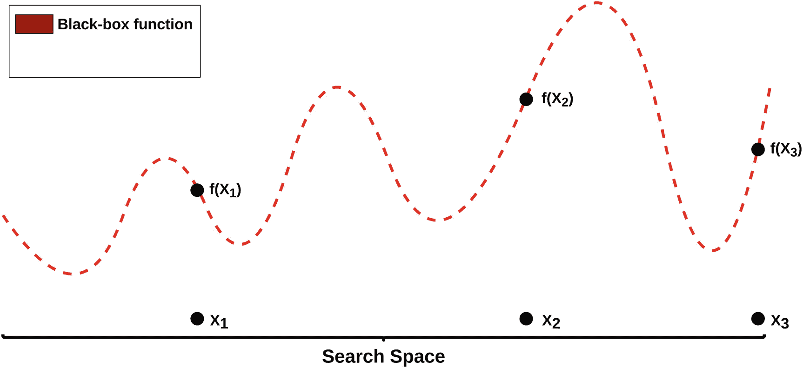

图 3-14

试验结果

下一步是根据数据创建一个概率函数 p(y|x)：(x[1], f(x[1])), (x[2], f(x[2])), (x[3], f(x[3])). p(y|x) 被称为目标（或黑盒）函数的“代理”。代理函数确定了目标（或黑盒）函数在搜索空间中任何元素 x[i] 的概率分布。这意味着对于任何 x[*i*]，我们可以说以 *p* 的概率，值 f(x[*i*]) = y[*i*] 落在 (a, b) 区间内。这一概念在图 3-15 中得到了演示。

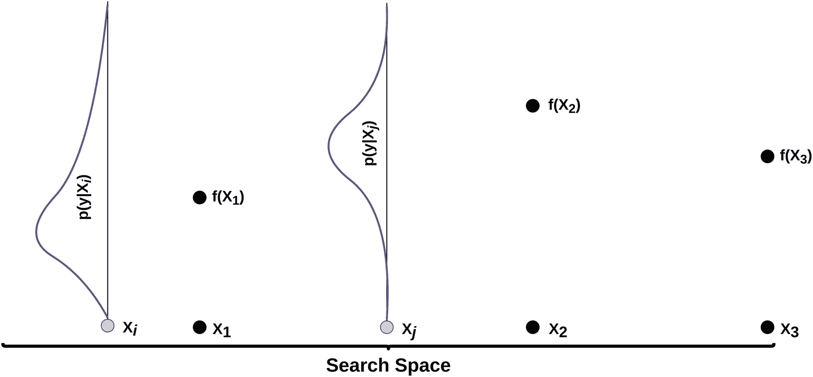

图 3-15

x[i] 和 x[j] 的概率分布

拥有代理函数 p(x|y)，我们可以在整个搜索空间上外推它。图 3-16 给出了代理模型的视觉描述：

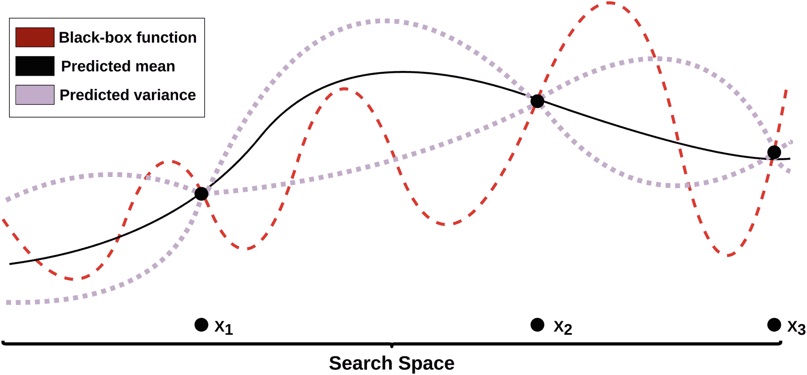

图 3-16

三次试验的代理模型：(x[1], f(x[1])), (x[2], f(x[2])), (x[3], f(x[3]))

+   红色虚线表示实际的黑盒函数。

+   黑色实线表示代理函数 p(y|x) 的期望均值。

+   紫色虚线表示代理函数 p(y|x) 的方差。

基于构建的代理模型，SMBO 算法对其黑盒函数的潜在最大值做出预测。算法的下一个目标是找到比当前最大值 f(x[2]) 更高的黑盒函数值。以下试验参数是使用期望改进函数确定的：

EIy* = 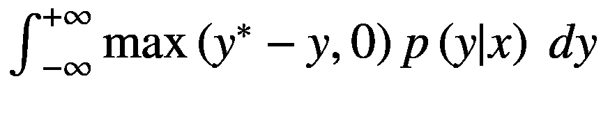

如果我们假设 f(x[*2*]) = y[2]，那么 SMBO 将选择 x[4] 作为下一个试验参数，如果 EIy2 在 x[4] 时达到最大值。图 3-17 说明了 SMBO 算法选择的下一个试验。

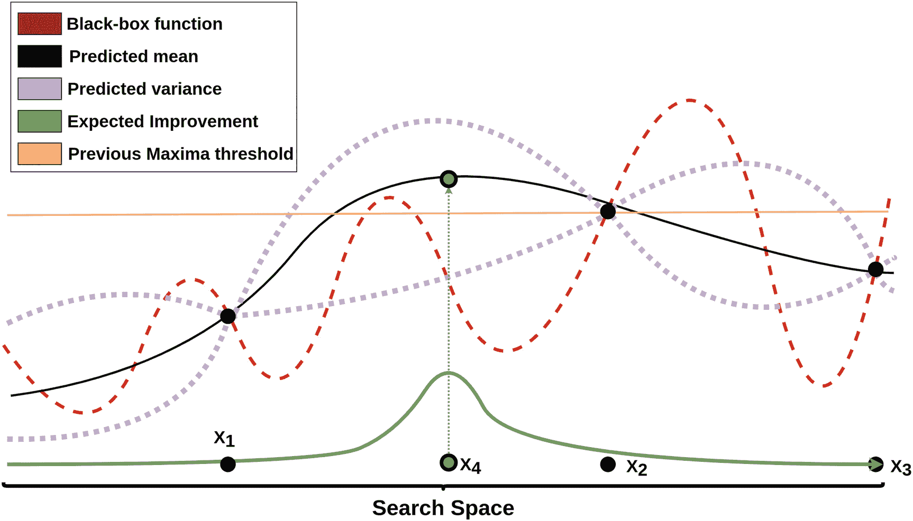

图 3-17

预期改进

在选择 x[*4*] 作为下一个试验值后，我们评估 f(x[*4*]) 并根据新的数据重建代理模型：*(x*[*1*]*, f(x*[*1*]*)), (x*[*2*]*, f(x*[*2*]*)), (x*[*3*]*, f(x*[*3*]*)), (x*[*4*]*, f(x*[*4*]*)))*，如图 3-18 所示。

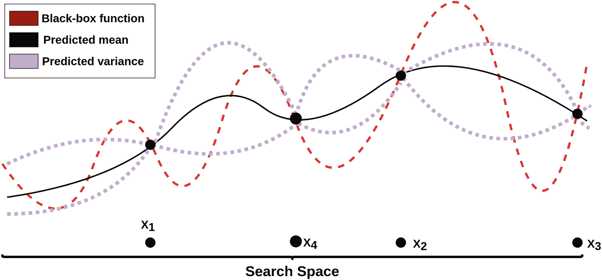

图 3-18

四个试验的代理模型：(x[1], f(x[1])), (x[2], f(x[2])), (x[3], f(x[3])), (x[4], f(x[4]))

SMBO 旨在通过更多数据使代理模型收敛到目标函数，这些方法通过在每次目标函数评估后不断更新代理概率模型来实现。SMBO 调谐器效率高，因为它们以信息化的方式选择下一个参数。

SMBO 调谐器在一个周期内执行以下步骤，直到达到试验的最大数量：

+   基于代理概率 p(y|x) 构建代理模型。

+   使用估计改进函数确定下一个试验参数 x。

+   评估黑盒函数 f(x)。

+   将 *(x, f(x))* 对添加到历史数据集中。

这是所有 SMBO 调谐器的框架。它们之间的唯一区别是 p(y|x) 函数的定义。不同的 SMBO 调谐器根据历史数据集采用不同的方法来估计概率函数 p(y|x)。本章将介绍以下 SMBO 调谐器：树结构帕累托估计器调谐器和高斯过程调谐器。

## 树结构帕累托估计器调谐器

树结构帕累托估计器调谐器 (TPE) 的描述可能需要一或几个独立的章节。在本节中，我们将描述使用此调谐器背后的主要思想：

1.  在探索搜索空间的过程中，TPE 调谐器最初进行 *N* 次随机试验。

1.  接下来，调谐器根据某些分位数 - γ 对执行试验进行排序，并将它们分为“良好”组和“不良”组。第一个组，“良好”组，包含给出最佳结果的试验，而“不良”组包含所有其他试验。

图 3-19 描述了经过前两个步骤后的 TPE 模型。

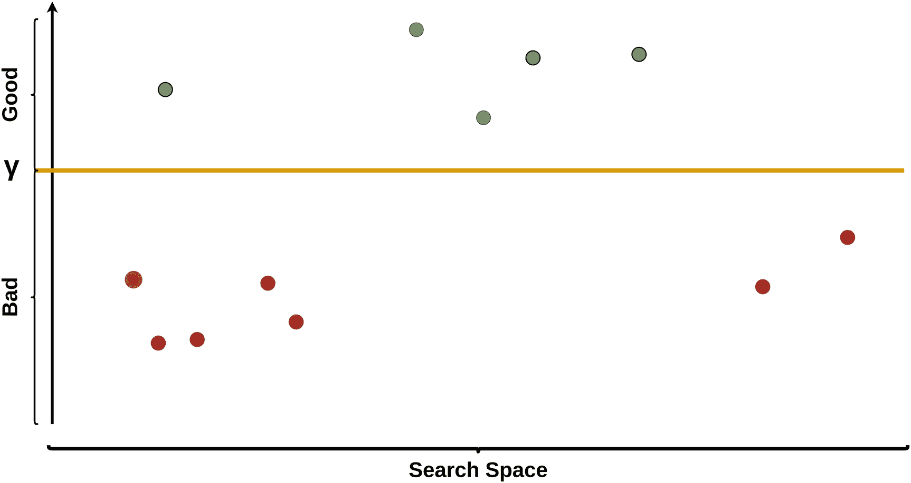

图 3-19

TPE 调谐器。“良好”和“不良”分离

1.  使用帕累托估计器（也称为核密度估计器）分别计算“不良”和“良好”组的密度 *l*(x) 和 *g*(x)。帕累托估计器是现有数据点中心核的平均值。

1.  之后，TPE 调优器根据*g*(x)密度函数生成*n*个随机候选者。这些候选者根据*g*(x)/*l*(x)比率排序，第一个被选为下一个试验。这意味着 TPE 调优器允许在“好”试验更常见的区域选择随机候选者。同时，所有候选者都根据*g*(x)/*l*(x)排序，这意味着具有高密度“好”试验和低密度“坏”试验的候选者将被选中。这种方法在探索和利用之间取得了良好的平衡。

图 3-20 说明了选择下一个试验参数的算法。

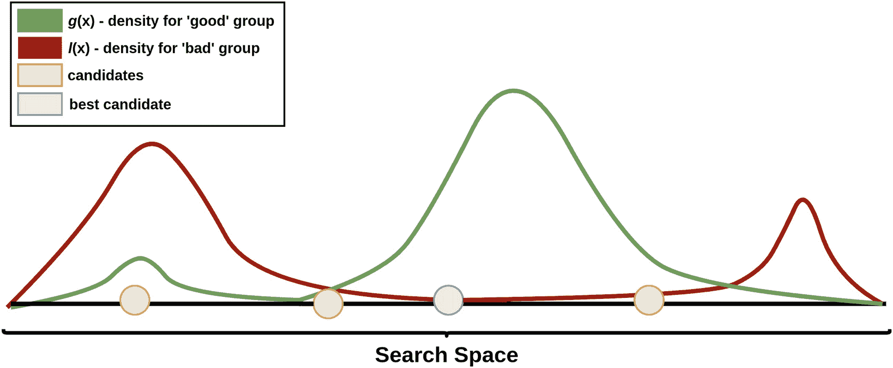

图 3-20

TPE 调优器。下一个候选选择

1.  重复步骤 2-5，直到达到最大试验次数。

这里是 TPE 调优器配置的一个示例：

```py
# config.yml
tuner:
name: TPE
classArgs:
optimize_mode: maximize
seed: 12345
tpe_args:
constant_liar_type: 'mean'
n_startup_jobs: 10
n_ei_candidates: 20
linear_forgetting: 100
prior_weight: 0
gamma: 0.5
```

以下为 TPE 调优器的参数描述：

+   `tpe_args.constant_liar_type`:

**类型**：`'best' | 'worst' | 'mean' | null`

**默认值**：`'best'`

TPE 算法本身不支持并行调优。此参数指定如何优化`trial_concurrency` > 1。一般来说，对于试验数量少的情况适用`best`，对于试验数量多的情况适用`worst`。

+   `tpe_args.n_startup_jobs`:

**类型**：`int`

**默认值**：`20`

第一步生成前*N*个随机试验用于预热。如果搜索空间很大，这个值应该增加。

+   `tpe_args.n_ei_candidates`:

**类型**：`int`

**默认值**：`24`

第 4 步生成的*n*个随机候选者。

+   `tpe_args.linear_forgetting`:

**类型**：`int`

**默认值**：`25`

TPE 降低旧试验的权重。此参数控制试验开始衰减所需的迭代次数。

+   `tpe_args.prior_weight`:

**类型**：`float`

**默认值**：`1.0`

确定历史试验配置中试验配置的权重。

+   `tpe_args.gamma`:

**类型**：`float`

**默认值**：`0.25`

控制多少个试验被认为是“好”的。代表步骤 2 中的γ参数。

注意

上述 TPE 调优器配置参数仅适用于 NNI 版本 2.6。它们在之前的版本中不会工作。

TPE 调优器支持所有搜索空间类型：`choice`，`choice(nested)`，`randint`，`uniform`，`quniform`，`loguniform`，`qloguniform`，`normal`，`qnormal`，`lognormal`，和`qlognormal`。

我们可以从列表 3-7 中看到 TPE 调优器是如何优化`holder_function`的。

（完整代码在相应的文件中提供：*ch3/tuners/tpe_tuner/run_experiment.py*。）

为实验设置 TPE 调优器：

```py
experiment.config.tuner.name = 'TPE'
experiment.config.tuner.class_args['optimize_mode'] = 'maximize'
experiment.config.tuner.class_args['seed'] = 0
experiment.config.tuner.class_args['tpe_args'] = {
'n_startup_jobs': 20,
'gamma':          0.5
}
Listing 3-7
TPE Tuner
```

实验完成后，我们可以分析 TPE 调优器的搜索进度。

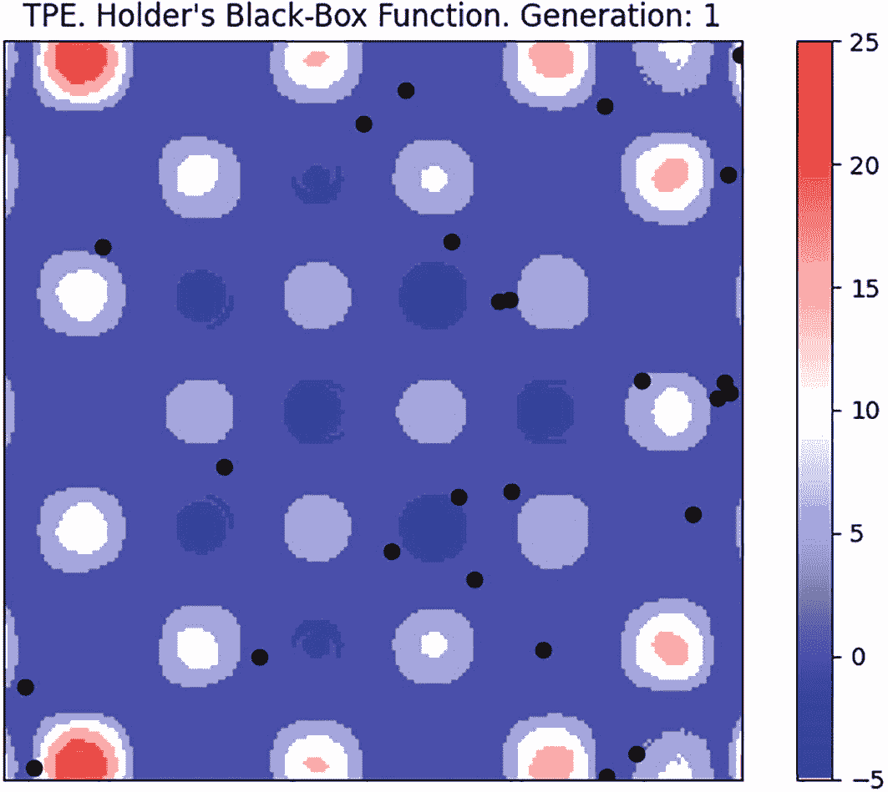

图 3-21

TPE 调优器。生成：1

图 3-21 显示，点的分布更像是随机散布，这在调谐器设置中是有意义的，因为我们指定了 `'n_startup_jobs': 20`，这意味着前 20 次试验将是完全随机的。

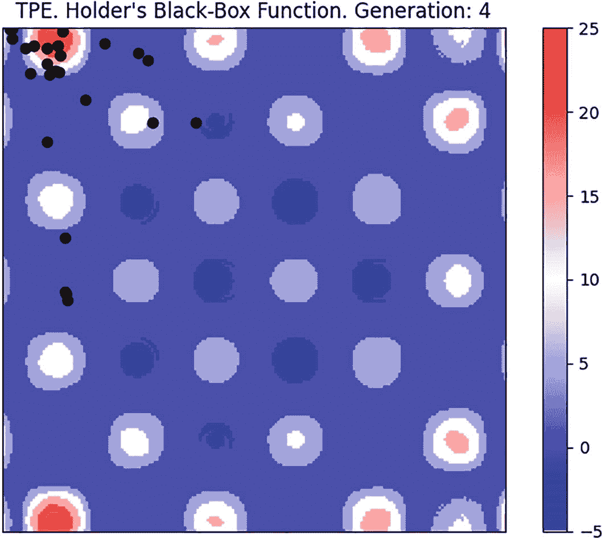

图 3-22

TPE Tuner. 上一个生成

但正如我们在图 3-22 中看到的那样，TPE Tuner 由于概率探索模型，找到了 `holder_function` 的全局最大值。

TPE Tuner 直观易懂，基于坚实的概率基础，并且在探索和利用策略之间取得了良好的平衡。另一个优点是它支持 `choice(nested)` 搜索类型，这在某些研究中可能至关重要。

## 高斯过程 Tuner

高斯过程 (GP) Tuner 是基于多元正态分布的另一种 SMBO Tuner。此 Tuner 与 TPE Tuner 类似，但使用高斯分布来构建 p(y|x) 代理。此方法的完整描述超出了本书的范围，但读者可以在此处了解此方法的工作原理：

+   “使用高斯过程优化昂贵函数”：[`https://citeseerx.ist.psu.edu/viewdoc/download?doi=10.1.1.139.9315&rep=rep1&type=pdf`](https://citeseerx.ist.psu.edu/viewdoc/download%253Fdoi%253D10.1.1.139.9315%2526rep%253Drep1%2526type%253Dpdf)

+   “高斯过程与贝叶斯优化”：[`www.cs.cornell.edu/courses/cs4787/2019sp/notes/lecture16.pdf`](http://www.cs.cornell.edu/courses/cs4787/2019sp/notes/lecture16.pdf)

这里是 GP Tuner 配置的示例：

```py
# config.yml
tuner:
name: GPTuner
classArgs:
optimize_mode: maximize
utility: 'ei'
kappa: 5.0
xi: 0.0
nu: 2.5
alpha: 1e-6
cold_start_num: 10
selection_num_warm_up: 100000
selection_num_starting_points: 250
```

以下是对 GP Tuner 参数的描述：

+   `utility`:

**类型**: `'ei' | 'ucb' | 'poi'`

**默认值**: `'ei'`

效用函数 `ei`、`ucb` 和 `poi` 分别对应期望改进、上置信界和改进概率。

+   `kappa`:

**类型**: `float`

**默认值**: `5`

由 `ucb` 效用函数使用。`kappa` 越大，Tuner 的探索性越强。

+   `xi`:

**类型**: `float`

**默认值**: `0`

由 `ei` 和 `poi` 效用函数使用。`xi` 越大，Tuner 的探索性越强。

+   `nu`:

**类型**: `float`

**默认值**: `2.5`

设置 Matern 内核。nu 越小，近似函数越不光滑。

+   `alpha`:

**类型**: `float`

**默认值**: `1e-6`

设置高斯过程回归器。较大的值对应于观察中的增加噪声水平。

+   `cold_start_num`:

**类型**: `int`

**默认值**: `10`

在高斯过程之前执行的随机探索次数。

+   `selection_num_warm_up`:

**类型**: `int`

**默认值**: `1e5`

获取最大化获取函数的点时评估的随机点数。

+   `selection_num_starting_points`:

**类型**: `int`

**默认值**: `250`

在预热之后从随机起点运行 L-BFGS-B 的次数。

GP Tuner 支持以下搜索空间类型：`choice`、`randint`、`uniform`、`quniform`、`loguniform` 和 `qloguniform`。

GP Tuner 在并行化问题上遭受了很多困扰。如果你以并发模式（即`trial_concurrency` > 1）运行实验，多个进程会同时根据相同的历史数据决定它们的下一个试验候选者。因此，不同的进程会在同一时间测试相同的参数。这是所有 SMBO 调谐器的一个大问题。但是，TPE Tuner 可以通过常数谎言技术绕过这个问题，而对于 GP Tuner，这个问题仍然非常严重。在图 3-23 中，我们可以看到`trial_concurrency = 8`时的 GP Tuner 的试验指标面板。它显示 GP Tuner 包含相同试验的块，这并不能以任何方式加快探索搜索空间的过程。

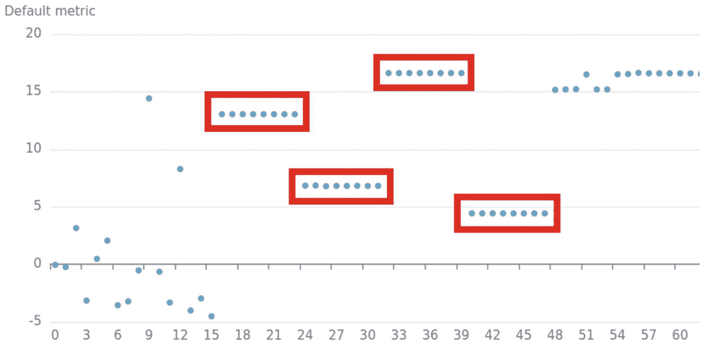

图 3-23

GP Tuner. 并发问题

列表 3-8 实现了`holder_function`优化任务的 GP Tuner。

（完整的代码在相应的文件中提供：*ch3/tuners/gp_tuner/run_experiment.py*。）

禁用并发：

```py
experiment.config.trial_concurrency = 1
Listing 3-8
GP Tuner
```

设置实验的 GP Tuner：

```py
experiment.config.tuner.name = 'GPTuner'
experiment.config.tuner.class_args['optimize_mode'] = 'maximize'
```

GP Tuner 表现出色。图 3-24 显示了实验期间所有试验的坐标。GP Tuner 找到了全局最大值，并且均匀地探索了整个搜索空间。

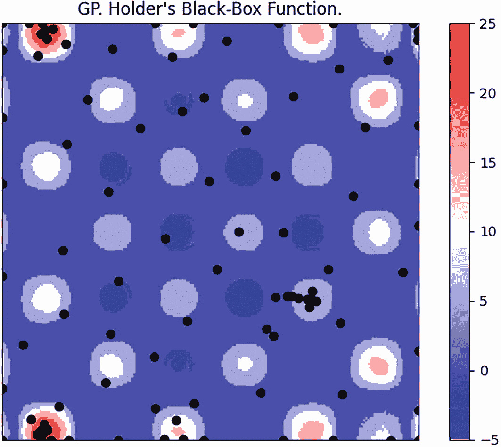

图 3-24

GP Tuner. Holder 的黑色盒函数优化

GP Tuner 建议通过搜索空间元素在少量黑盒函数评估中找到合适的解决方案。GP Tuner 关注的是代理模型而不是黑盒函数本身，使用共轭梯度法找到最高期望改进的候选者。GP Tuner 在测试当前代理模型下看似有希望的领域时表现出良好的探索行为。

## 选择哪个调谐器？

在本节中，我们投入了大量精力来了解不同的调谐器，一个公平的问题可能是：*嘿，所以我应该选择哪个调谐器呢？* 对于这个问题，答案是令人失望的：根据**无免费午餐定理**，我们在第一章中已经考虑过，***没有搜索算法（调谐器）会在任意搜索空间上比其他调谐器有优势***。确实，对于任意搜索空间，TPE Tuner 的期望值并不超过随机调谐器的期望值。那么，如果所有调谐器在任意搜索空间上都与随机调谐器相等，我们为什么还需要任何调谐器呢？！

答案如下：搜索空间具有特定的结构和依赖关系，这使得某些调谐器在许多类型的问题上优于其他调谐器。因此，如果我们知道我们正在为图像分类问题优化模型，这可以让我们对搜索空间结构有所了解。因此，我们可以选择一个更有可能比其他调谐器显示出好结果的调谐器。

在一个独立的研究领域，科学家们通过安排搜索算法的较量来确定特定问题类别的最佳算法。科学家们使用基准来估计搜索算法的特性。基准算法会对不同搜索空间进行多次搜索算法评估。例如，基准伪代码可能看起来像这样：

```py
# search_algos: List of competing Search Algorithms
# problems: List of similar problems
# results: Map (Dict) of results
for algo in search_algos:
for p in problems:
metrics = algo(p)
results[algo].append(metrics)
# Sort algorithms by results
```

在表 3-1 中，我提供了使用 NNI 获得的样本基准结果，请参阅[`nni.readthedocs.io/en/v2.7/hpo/hpo_benchmark_stats.html`](https://nni.readthedocs.io/en/v2.7/hpo/hpo_benchmark_stats.html)。

表 3-1

分类任务的平均排名

| Tuner 名称 | 平均排名 |
| --- | --- |
| GP Tuner | 4.00 |
| 进化 | 4.22 |
| 退火 | 4.39 |
| TPE | 4.67 |
| 随机 | 5.33 |

一些基准可能需要持续几天甚至几周。因此，总是更方便地借用研究后获得并发布的结果。在许多情况下，你可以执行一个迷你研究，这将有助于确定搜索空间结构的特点。在任何情况下，理解深度学习模型优化问题和搜索调优器的原理，对于选择解决 HPO 问题的正确策略非常有帮助。

## 自定义 Tuner

内置的 tuner 适用于大多数任务。但有时你需要添加一些自定义逻辑来提高 HPO 实验的质量。实际上，有时我们可能知道搜索空间的具体属性，而内置的 tuner 没有考虑到。此外，开发者可以实施他们自己的原始想法，并在实际问题上进行测试。对于这种情况，NNI 允许你实现自定义 Tuner。自定义 Tuner 可以在实验中使用，并与其他开发者共享。

## Tuner 内部

每个 Tuner 类都应该继承 `nni.tuner.Tuner` 并实现以下方法：`__init__`, `update_search_space`, `generate_parameters`, `receive_trial_result`。任何 Tuner 都可以基于示例列表 3-9 中的自描述样本实现。 

```py
from nni.tuner import Tuner
class CustomTunerSample(Tuner):
def __init__(self, some_arg) -> None:
# YOUR CODE HERE #
...
def update_search_space(self, search_space):
"""
Tuners are advised to support updating search
space at run-time. If a tuner can only set
search space once before generating first
hyper-parameters, it should explicitly document
this behaviour. 'update_search_space' is called
at the startup and when the search space is updated.
"""
# YOUR CODE HERE #
...
def generate_parameters(self, parameter_id, **kwargs):
"""
This method will get called when the framework
is about to launch a new trial. Each parameter_id
should be linked to hyper-parameters returned by
the Tuner. Returns hyper-parameters, a dict
in most cases.
"""
# YOUR CODE HERE #
# Example: return {"dropout": 0.5, "act": "relu"}
return {}
def receive_trial_result(self, parameter_id, parameters, value, **kwargs):
"""
This method is invoked when a trial reports
its final result. Should be implemented
if Tuner assumes 'memory', i.e.,
Tuner is tracking previous Trials
"""
# YOUR CODE HERE #
Listing 3-9
Custom Tuner. ch3/tuners/custom_tuner/custom_tuner_sample.py
```

Tuner 与 Experiment 的交互方式如下：

1.  实验在启动时调用 `update_search_space`。

1.  实验请求通过调用 `generate_parameters` 来搜索空间参数。

1.  实验将 Trial 结果返回给调用 `recieve_trial_result` 的 Tuner。

（步骤 2 和 3 会重复进行，直到达到 `max_trial_number` 或实验停止。）

图 3-25 展示了 Tuner–Experiment 交互作为序列图。

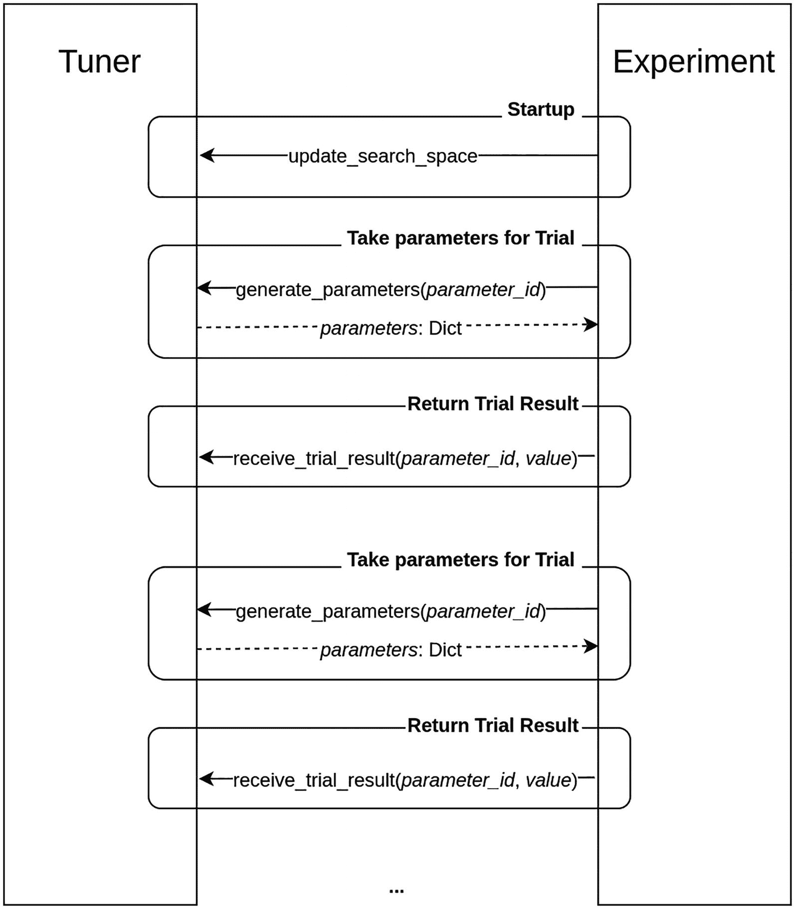

图 3-25

Tuner–Experiment 序列图

自定义 Tuner 通过以下配置集成到实验中：

```py
tuner:
codeDirectory: 
className: .
```

或者它可以集成到 Python 嵌入式实验中，如下所示：

```py
from nni.experiment import CustomAlgorithmConfig
experiment.config.tuner = CustomAlgorithmConfig()
experiment.config.tuner.code_directory = 'path_to_tuner_dir'
experiment.config.tuner.class_name = 'tuner_file_name.class_name'
experiment.config.tuner.class_args = {'arg': 'value'}
```

## 新的进化自定义 Tuner

让我们尝试开发我们的自定义调谐器。这个调谐器将基于我们在探索进化调谐器时考察的进化概念。我们将称之为 `NewEvolutionTuner`。`NewEvolutionTuner` 将初始化种群并按照以下算法操作：

+   取出最佳个体：X[best]

+   以随机方式突变最佳个体：*mutate*(X[best]) → Y

+   将种群中最差的个体 X[worst] 替换为最佳个体的突变体 Y：X[worst] ← Y

图 3-26 展示了 `NewEvolutionTuner` 的搜索方法：

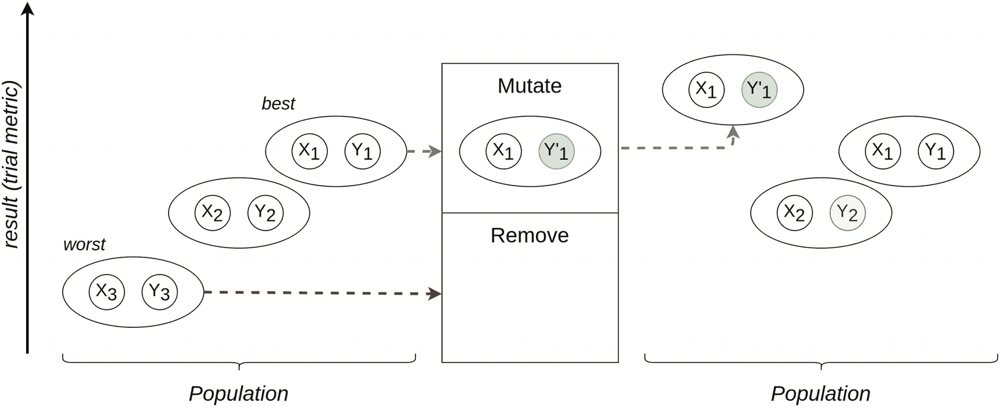

图 3-26

新进化调谐器

`NewEvolutionTuner` 实现了一种贪婪的“爬山”方法。调谐器取最佳个体（最高的一个）并对其进行突变（希望新的个体会爬得更高）。列表 3-10 使用 `NewEvolutionTuner` 寻找 Ackley 函数的最大值。

```py
from numpy import exp, sqrt, cos, pi, e
from ch3.bbf.utils import noise
def ackley_function(x, y):
"""
Ackley’s function
"""
z = 20.0 * exp(-0.2 * sqrt(0.5 * (x**2 + y**2))) -\
exp(0.5 * (cos(2 * pi * x) + cos(2 * pi * y))) + e + 20
r = z + noise(x, y, scale = 4)
return r
Listing 3-10
Ackley’s function. ch3/bbf/ackley.py
```

这里是 Ackley 函数的可视化：

```py
from ch3.bbf.utils import scatter_plot
if __name__ == '__main__':
scatter_plot(ackley_function, [-10, 10], [-10, 10])
```

我们可以在图 3-27 中看到 Ackley 函数的表面。它有一个最高的山丘和附近几个较小的山丘。

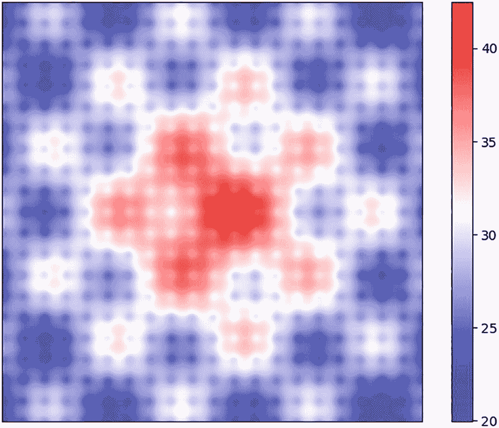

图 3-27

Ackley 函数

在我们检查 `NewEvolutionTuner` 如何解决寻找 Ackley 函数最大值的问题之前，我们需要在列表 3-11 中实现它。

导入必要的模块：

```py
import random
import numpy as np
from nni.tuner import Tuner
from nni.utils import (
OptimizeMode, extract_scalar_reward,
json2space, json2parameter,
)
Listing 3-11
NewEvolutionTuner. ch3/tuners/custom_tuner/evolution_tuner.py
```

种群由个体组成。每个个体都有代表搜索空间参数的 DNA。此外，个体还有一个包含试验结果的字段。新进化个体具有以下属性：

+   `x`: 搜索空间 *x* 坐标

+   `y`: 搜索空间 *y* 坐标

+   `param_id`: 试验编号

+   `result`: 试验结果

```py
class Individual:
def __init__(self, x, y, param_id = None) -> None:
self.param_id = param_id
self.x = x
self.y = y
self.result = None
def to_dict(self):
return {'x': self.x, 'y': self.y}
```

种群类是一个包装器，它将所有个体作为一个整体进行操作：

```py
class Population:
```

所有个体都存储在 `individuals` 属性中：

```py
def __init__(self) -> None:
self.individuals = []
def add(self, ind):
self.individuals.append(ind)
```

然后，我们需要添加一个方法，通过 `param_id` 返回一个个体：

```py
def get_by_param_id(self, param_id):
for ind in self.individuals:
if ind.param_id == param_id:
return ind
return None
```

在实验开始时，Tuner 将创建 *N* 个个体，这些个体将没有试验编号。我们将这些个体称为处女。`get_first_virgin` 方法返回种群中找到的第一个处女：

```py
def get_first_virgin(self):
for ind in self.individuals:
if ind.param_id is None:
return ind
return None
```

以下方法 `get_population_with_result` 返回所有已经收到试验结果的个体：

```py
def get_population_with_result(self):
population_with_result = [ind for ind in self.individuals if ind.result is not None]
return population_with_result
```

下一个方法返回整个种群中最好的个体，即具有最高 `result` 的个体：

```py
def get_best_individual(self):
sorted_population = sorted(self.get_population_with_result(), key = lambda ind: ind.result)
return sorted_population[-1]
```

然后，我们来到我们的主要进化方法 `replace_worst`，它将发展种群：

+   我们从种群中取出最好的个体。

+   突变最佳个体。

+   将最佳个体的突变体添加到种群中，而不是最差的个体。

```py
def replace_worst(self, param_id):
population_with_result = self.get_population_with_result()
sorted_population = sorted(population_with_result, key = lambda ind: ind.result)
worst = sorted_population[0]
self.individuals.remove(worst)
best = self.get_best_individual()
x = round(best.x + random.gauss(0, 1), 2)
y = round(best.y + random.gauss(0, 1), 2)
mutant = Individual(x, y, param_id)
self.individuals.append(mutant)
return mutant
```

在定义了 `Individual` 和 `Population` 类之后，我们可以开始实现调谐器：

```py
class NewEvolutionTuner(Tuner):
```

调谐器有两个参数，`optimize_mode` 和 `population size`：

```py
def __init__(self, optimize_mode = "maximize", population_size = 16) -> None:
self.optimize_mode = OptimizeMode(optimize_mode)
self.population_size = population_size
```

接下来，Tuner 初始化与它正在处理的搜索空间相关的属性：

```py
self.search_space_json = None
self.random_state = None
self.population = Population()
self.space = None
```

当调谐器启动时，会调用 `update_search_space` 方法。它生成随机个体的种群：

```py
def update_search_space(self, search_space):
self.search_space_json = search_space
self.space = json2space(self.search_space_json)
self.random_state = np.random.RandomState()
# Population of Random Individuals is generated
is_rand = dict()
for item in self.space:
is_rand[item] = True
for _ in range(self.population_size):
params = json2parameter(self.search_space_json, is_rand, self.random_state)
ind = Individual(params['x'], params['y'])
self.population.add(ind)
```

实验调用 `generate_parameters` 方法为后续的试验获取新的参数。最初，我们在启动时生成了一组个体，并且没有传递给调谐器（virgins）。我们逐个将 virgins 传递给调谐器。当没有 virgins 时，我们开始生成新的个体。

```py
def generate_parameters(self, parameter_id, **kwargs):
virgin = self.population.get_first_virgin()
if virgin:
virgin.param_id = parameter_id
return virgin.to_dict()
else:
mutant = self.population.replace_worst(parameter_id)
return mutant.to_dict()
```

当实验返回试验结果时，我们将其保存到单个对象中：

```py
def receive_trial_result(self, parameter_id, parameters, value, **kwargs):
reward = extract_scalar_reward(value)
ind = self.population.get_by_param_id(parameter_id)
ind.result = reward
```

好吧，我们的 `NewEvolutionTuner` 已经准备就绪！我们可以使用以下配置文件启动实验，该文件在列表 3-12 中显示。

```py
searchSpace:
x:
_type: "quniform"
_value: [-10, 10, 0.01]
y:
_type: "quniform"
_value: [-10, 10, 0.01]
trialConcurrency: 4
trialCodeDirectory: .
trialCommand: python3 trial.py
tuner:
codeDirectory: .
className: evolution_tuner.NewEvolutionTuner
trainingService:
platform: local
Listing 3-12
NewEvolutionTuner Experiment configuration. ch3/tuners/custom_tuner/config.yml
```

使用自定义 `NewEvolutionTuner` 的实验也可以在 Python 嵌入模式下运行，因为它在列表 3-13 中实现。

（完整代码在相应的文件中提供：*ch3/tuners/custom_tuner/run_experiment.py*。）

```py
experiment.config.tuner = CustomAlgorithmConfig()
experiment.config.tuner.code_directory = Path(__file__).parent
experiment.config.tuner.class_name = 'evolution_tuner.NewEvolutionTuner'
experiment.config.tuner.class_args = {'population_size': 8}
Listing 3-13
Python embedded experiment
```

让我们启动实验并分析其结果：

```py
$ python3 ch3/tuners/custom_tuner/run_experiment.py
```

图 3-28 展示了 `NewEvolutionTuner` 种群访问过的位置。我们看到种群已经找到了全局函数的最大值并开始探索它。

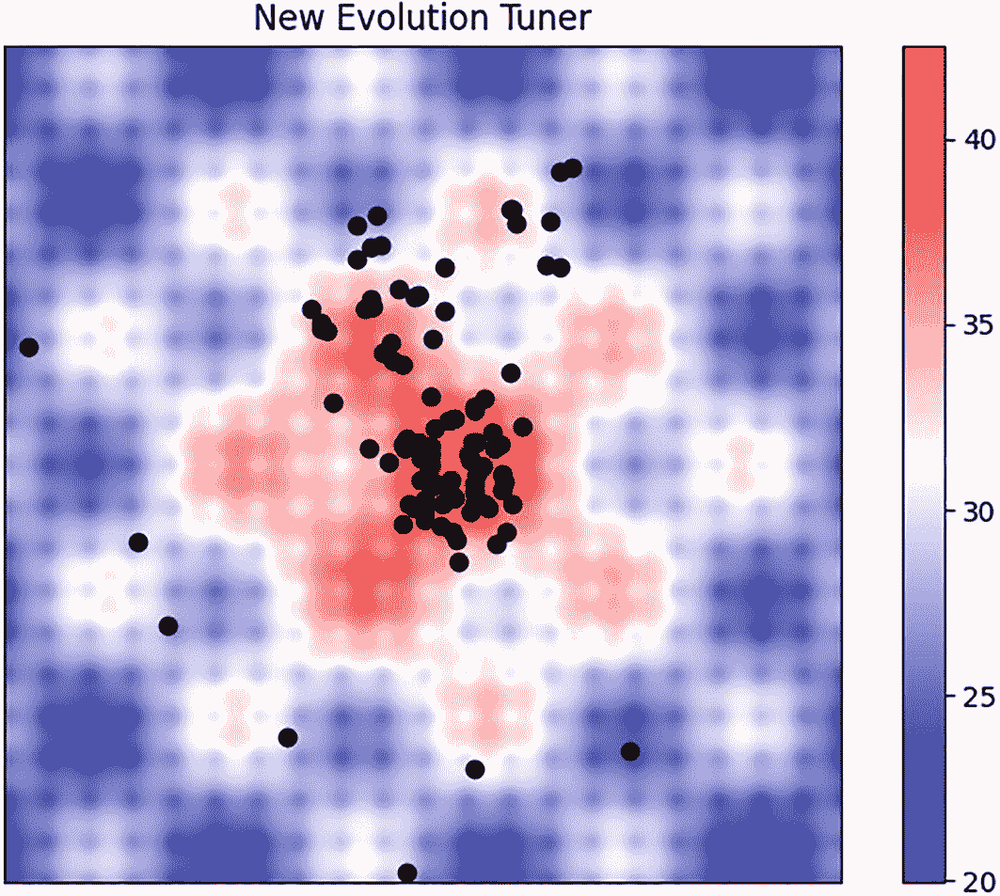

图 3-28

NewEvolutionTuner 种群访问过的位置

图 3-29 中的“Trial Metric”面板展示了“爬山法”的实际应用。这种方法的主要问题是它很快就能找到一个局部最大值并停止探索其他搜索空间区域。

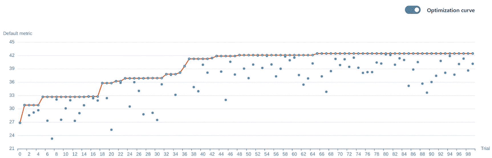

图 3-29

试验指标面板

当然，开发自定义调谐器并不总是容易的任务。然而，能够实现你的搜索算法并将其集成到 HPO 过程中可以极大地提高实验结果。在本节中，我们提供了一个示例，说明你可以如何做到这一点。如果需要，你可以根据本节中给出的说明实现你的想法。

### 提前终止

搜索空间中的一些参数会产生非常低的试验结果。这是正常的，因为调谐器可能并不总是事先知道应该探索搜索空间的哪些区域以及哪些不应该探索。调谐器经常尝试那些给出非常低结果的参数。试验本身是昂贵的，因为它花费了大量的时间。例如，在大型数据集上用复杂架构训练神经网络可能需要数小时。因此，对于执行结果不佳的试验，不花费大量时间是很有帮助的。NNI 使用提前终止算法来解决这个问题。提前终止算法分析中间试验结果，并将它们与其他试验的中间结果进行比较。如果算法决定当前试验的中间结果太低，那么它将停止试验，以避免在该试验上浪费时间。

图 3-30 解释了早停方法。试验 3 在步骤 N 时提前停止，因为该试验在步骤 N 的中间结果显著劣于其他试验在步骤 N 的中间结果。

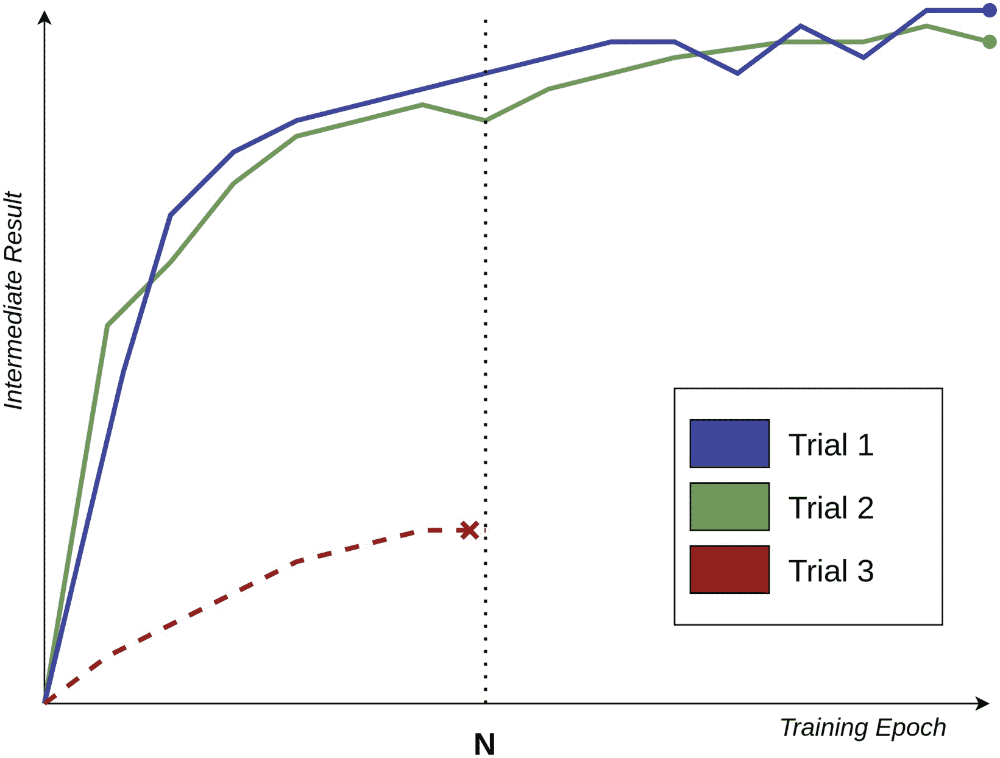

图 3-30

HPO 早停

深度学习训练算法也有早停策略。训练早停策略在模型开始恶化或长时间没有改进时停止模型训练。不要将训练早停与 HPO 早停混淆。它们在本质上没有任何关联。实际上，看看图 3-31。训练进度良好，没有停止训练的理由。但如果我们将训练过程与其他试验进行比较，很明显它要差得多，HPO 早停算法可以停止这个试验。

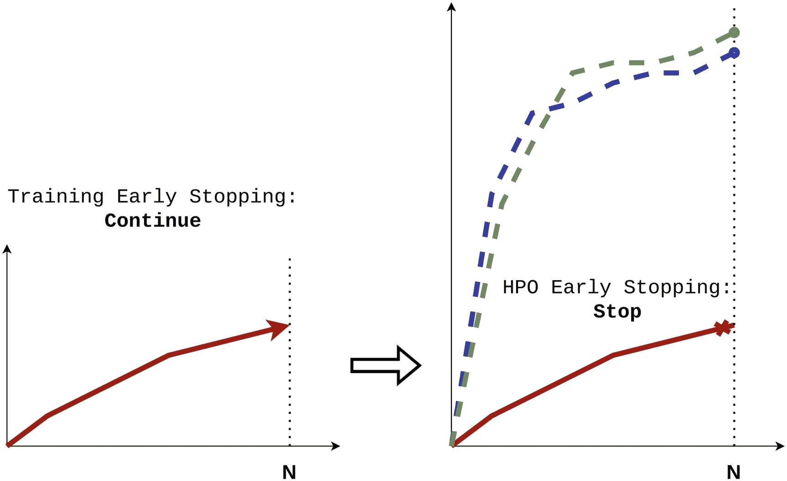

图 3-31

HPO 早停与训练早停对比

而图 3-32 展示了相反的情况。训练过程开始恶化，训练早停算法终止了训练过程。相比之下，HPO 早停算法可能会认为当前的试验非常有希望，因为其中间结果与其他试验相比显著优越。

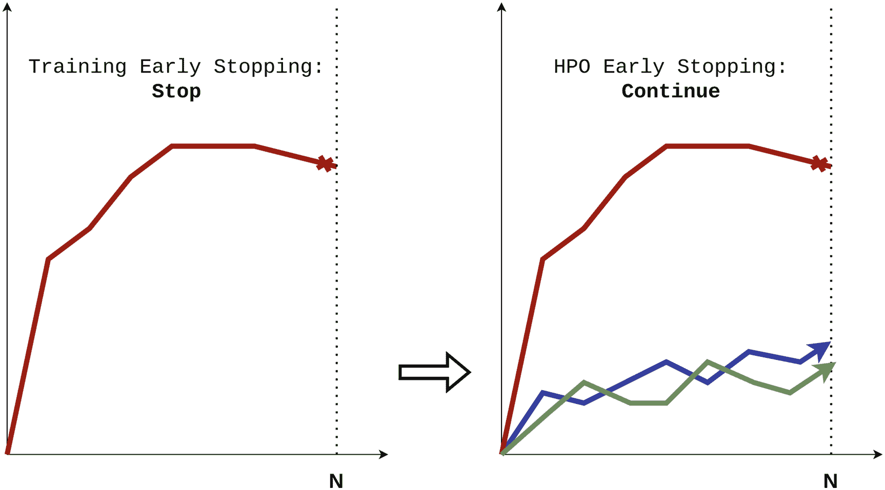

图 3-32

HPO 早停与训练早停对比

请记住，在设计深度学习模型和 HPO 实验时，训练早停和 HPO 早停是不相关的。

### 中值停止

中值停止是一种简单直接的早停规则，如果在步骤 N 时试验的最佳目标值严格劣于截至步骤 N 的所有已完成试验目标值的运行平均值的中位数，则停止步骤 N 后的待定试验。

中值停止算法可以通过以下实验配置在实验中实现：

```py
assessor:
name: Medianstop
classArgs:
# number of warm up steps
start_step: 10
```

让我们通过一个合成问题来看一下中值停止算法的实际应用。比如说，我们有一个以下恒等函数，f: x → x，训练进度包含 100 个时期（步骤），以下规则表示：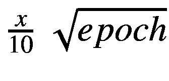 + *r*，其中 *r* 是 (-1, 1) 上的随机变量.* 我们可以将函数 f 描述为具有抛物线训练进度的恒等函数。列表 3-14 包含了函数 f 的实现。

```py
import random
def identity_with_parabolic_training(x):
history = [
max(round(x / 10, 2) * pow(h, .5) + random.uniform(-3, 3), 0)
for h in range(1, 101)
]
return x, history
Listing 3-14
Identity function with parabolic training progress. ch3/early_stop/medianstop/model.py
```

让我们可视化以下函数集的训练过程：f(0)，f(10)，f(20)，...，f(100)。

```py
if __name__ == '__main__':
import matplotlib.pyplot as plt
for x in range(0, 101, 10):
final, history = identity_with_parabolic_training(x)
plt.plot(history, label = str(x))
plt.ylabel('Intermediate Result')
plt.xlabel('Epochs')
plt.legend()
plt.show()
```

图 3-33 展示了各种训练曲线。此图说明，较低的训练曲线前景不佳。根据早停算法，可以提前停止前景不佳的训练。

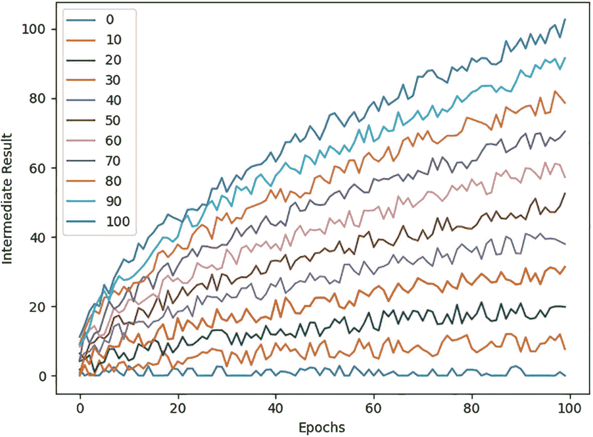

图 3-33

抛物线训练

让我们启动一个将使用中值停止算法的实验。试验脚本定义在列表 3-15 中。

带有导入模块的试验标题：

```py
import os
import sys
from time import sleep
import nni
# For NNI use relative import for user-defined modules
SCRIPT_DIR = os.path.dirname(os.path.abspath(__file__)) + '/../../..'
sys.path.append(SCRIPT_DIR)
Listing 3-15
Median Stop Trial. ch3/early_stop/medianstop/trial.py
```

执行试验：

```py
from ch3.early_stop.medianstop.model import identity_with_parabolic_training
if __name__ == '__main__':
params = nni.get_next_parameter()
x = params['x']
final, history = identity_with_parabolic_training(x)
for h in history:
sleep(.1)
nni.report_intermediate_result(h)
nni.report_final_result(final)
```

列表 3-16 定义了使用中值停止算法的实验。

```py
searchSpace:
x:
_type: quniform
_value: [1, 100, 0.1]
maxTrialNumber: 100
trialConcurrency: 8
trialCodeDirectory: .
trialCommand: python3 trial.py
tuner:
name: Random
assessor:
name: Medianstop
classArgs:
# number of warm up steps
start_step: 10
trainingService:
platform: local
Listing 3-16
Experiment with Median Stop Algorithm. ch3/early_stop/medianstop/config.yml
```

现在我们准备运行实验：

```py
nnictl create --config ch3/early_stop/medianstop/config.yml
```

实验完成后，我们可以在图 3-34 中观察到许多试验具有 `EARLY_STOPPED` 状态，正如预期的那样。

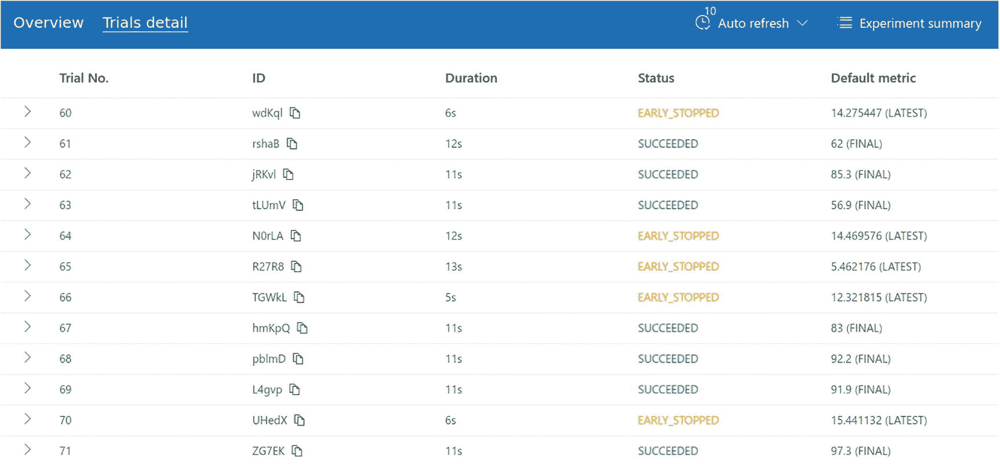

图 3-34

试验详情面板

### 曲线拟合

曲线拟合评估器是一个 LPA（学习、预测、评估）算法，如果最终 epoch 的性能预测比试验历史中最佳最终性能差，则会在步骤 *N* 停止挂起的试验。曲线拟合评估器对试验训练的最终结果进行预测，并将其与已完成的结果进行比较。此算法将早期停止任务视为时间序列预测问题。如果训练预测悲观，则算法停止试验。图 3-35 解释了曲线拟合早期停止方法。

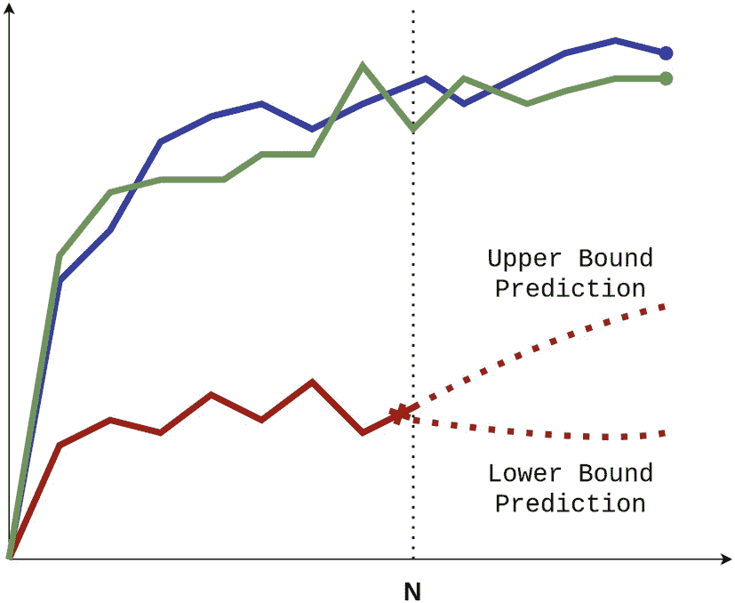

图 3-35

曲线拟合预测

曲线拟合算法可以通过以下实验配置在实验中实现：

```py
assessor:
name: Curvefitting
classArgs:
epoch_num: 20
start_step: 6
threshold: 0.95
gap: 1
```

本书不会研究曲线拟合早期停止算法的原理。您可以参考官方文档([`https://nni.readthedocs.io/en/v2.7/reference/hpo.html#nni.algorithms.hpo.curvefitting_assessor.CurvefittingAssessor`](https://nni.readthedocs.io/en/v2.7/reference/hpo.html%2523nni.algorithms.hpo.curvefitting_assessor.CurvefittingAssessor))或回顾一篇关于“通过学习曲线外推加速深度神经网络自动超参数优化”的论文([`https://ml.informatik.uni-freiburg.de/wp-content/uploads/papers/15-IJCAI-Extrapolation_of_Learning_Curves.pdf`](https://ml.informatik.uni-freiburg.de/wp-content/uploads/papers/15-IJCAI-Extrapolation_of_Learning_Curves.pdf))。

### 停止良好试验的风险

早期停止算法可以显著加快实验的完成速度并节省计算资源。但总是存在过早停止良好试验的风险，这可能会意味着在搜索空间中拒绝非常好的参数。看看图 3-36，早期停止的试验可能会表现出良好的性能。

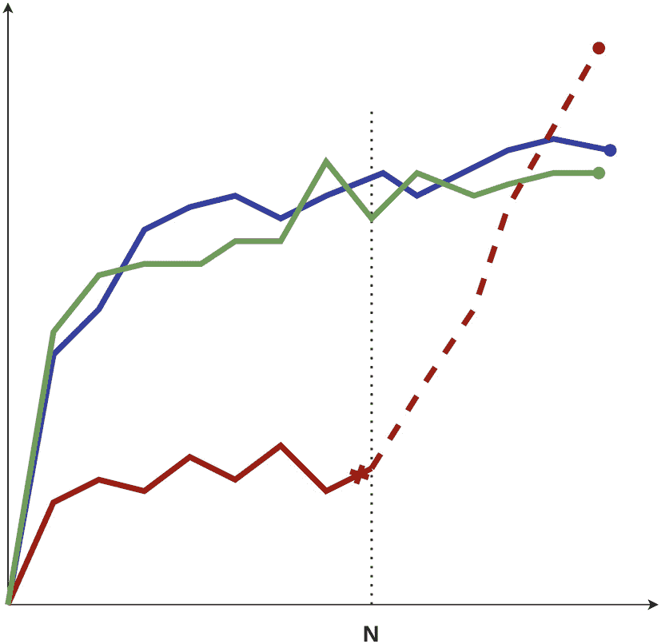

图 3-36

早期停止的良好试验

然而，有极小的机会在试验结果良好之前过早地停止试验。通常，深度学习模型的训练曲线表现相似，所以如果试验的中间结果明显比其他试验差，你可能不应该期望有任何好的结果，但应该完成试验并继续下一个试验。

### 搜索最优功能管道和经典 AutoML

库：Scikit-learn

让我们回到第二章的“从 LeNet 到 AlexNet”部分中我们研究的问题。在这个任务中，我们构建了一个功能管道，以最优地解决图像分类问题。确实，深度学习的每一层都是一个特定的功能算子，我们试图使用 HPO 方法找到这些算子的最佳管道。图 3-37 展示了作为功能管道的神经网络架构。

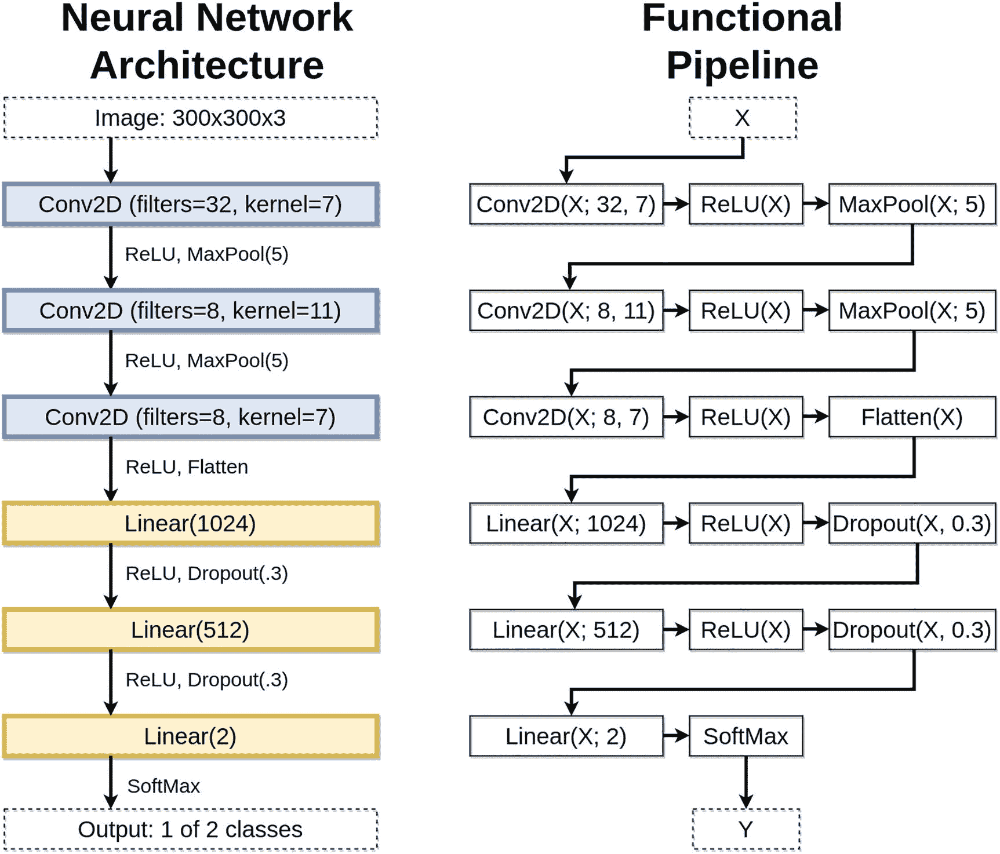

图 3-37

作为功能管道的神经网络架构

让我们将问题转化为更严格的数学语言。我们需要找到一个模型 *M*，它由函数 *F*[*i*] ∈ {*F*} 的组合构成，并最大化值 *L*(*M*, *D*)，其中 *L* 评估模型 *M* 在数据集 *D* 上的性能。*图* *3-38* *定义了最优功能管道问题：*

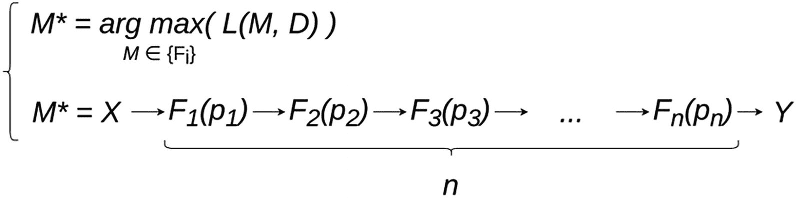

图 3-38

最优功能管道问题

让我们研究如何使用 NNI 解决这个问题。作为一个例子，我想使用经典的 AutoML 任务，它搜索解决监督学习问题的经典浅层机器学习方法的最佳管道。在本节中，我想向经典机器学习致敬，它越来越多地让位于深度学习。这种方法可以应用于任何搜索最优功能管道的问题。

### 问题

让我们考察使用伽马望远镜数据集（[`https://archive.ics.uci.edu/ml/datasets/magic+gamma+telescope`](https://archive.ics.uci.edu/ml/datasets/magic%252Bgamma%252Btelescope)）的二元分类问题。此数据集包含望远镜接收到的信号数据。任务是区分由初级 **伽马**（信号）引起的信号与由宇宙射线在上层大气中引发的 **强子** 淋漓（背景）图像。此数据集包含 19020 个实例和以下列：

1.  `fLength`: 类型：实数。椭圆的主轴（毫米）

1.  `fWidth`: 类型：实数。椭圆的副轴（毫米）

1.  `fSize`: 类型：实数。所有像素（光子）内容总和的 10 对数

1.  `fConc`: 类型：实数。两个最高像素总和与`fSize`的比值（比率）

1.  `fConc1`: 类型：实数。最高像素与`fSize`的比值（比率）

1.  `fAsym`: 类型：实数。最高像素到中心的距离，投影到主轴上（毫米）

1.  `fM3Long`: 类型：实数。沿主轴第三矩的立方根（毫米）

1.  `fM3Trans`: 类型：实数。沿副轴第三矩的立方根（毫米）

1.  `fAlpha`: 类型：实数。主轴与原点向量的角度（度）

1.  `fDist`: 类型：实数。原点到椭圆中心的距离（毫米）

1.  `class`: 值：`'g'`，`'h'`。伽马（信号），强子（背景）。g = 伽马（信号）：12332。h = 强子（背景）：6688

或许读者在这些物理数据中理解了某些东西，但我对它们一无所知。但这正是我们需要机器学习的原因——在 ourselves 无法看到它们的地方找到模式和依赖关系。

数据集位于 ch3/ml_pipeline/data/magic04.data，并在列表 3-17 中将其转换为监督学习问题。

导入模块：

```py
import os
from sklearn.model_selection import train_test_split
import pandas as pd
import numpy as np
def telescope_dataset():
Listing 3-17
Gamma Telescope Dataset. ch3/ml_pipeline/utils.py
```

从文件中加载数据集：

```py
cd = os.path.dirname(os.path.abspath(__file__))
telescope_df = pd.read_csv(f'{cd}/data/magic04.data')
```

删除`na`值：

```py
telescope_df.dropna(inplace = True)
```

设置列名：

```py
telescope_df.columns = [
'fLength', 'fWidth', 'fSize', 'fConc', 'fConcl',
'fAsym', 'fM3Long', 'fM3Trans', 'fAlpha', 'fDist', 'class']
```

打乱数据集：

```py
telescope_df = telescope_df.iloc[np.random.permutation(len(telescope_df))]
telescope_df.reset_index(drop = True, inplace = True)
```

类标签：

```py
telescope_df['class'] = telescope_df['class'].map({'g': 0, 'h': 1})
y = telescope_df['class'].values
```

将数据集分割为训练集和测试集：

```py
train_ind, test_ind = train_test_split(
telescope_df.index,
stratify = y,
train_size = 0.8,
test_size = 0.2
)
X_train = telescope_df.drop('class', axis = 1).loc[train_ind].values
X_test = telescope_df.drop('class', axis = 1).loc[test_ind].values
y_train = telescope_df.loc[train_ind, 'class'].values
y_test = telescope_df.loc[test_ind, 'class'].values
return X_train, y_train, X_test, y_test
```

由于我们已经确定了问题和准备了数据集，我们可以开始确定我们的模型将包含的机器学习方法。

### 操作符

现在，让我们定义将构成功能管道的函数。在机器学习环境中，我们将它们称为操作符。对于分类问题，机器学习操作符可以分为三种类型：

+   **选择器**：从数据集中选择最显著的特征（列），移除相关特征。通常可以减少输入大小。选定的特征保持不变。

+   **转换器**：根据某些数学函数转换输入，而不改变输入大小。

+   **分类器**：解决分类问题本身。

图 3-39 显示了机器学习管道：选择器、转换器和分类器。

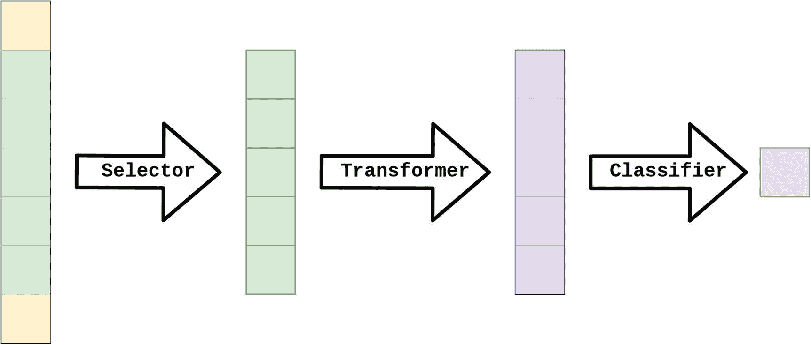

图 3-39

机器学习操作符：选择器、转换器和分类器

每个操作符都有自己的参数，例如`DecisionTreeClassifier`中的`max_depth`。列表 3-18 创建了一个操作符空间，该空间将被用于 AutoML 管道。

（完整代码在相应的文件中提供：*ch3/ml_pipeline/operator.py*。）

每个操作符都是一个具有名称、实现和参数的对象：

```py
class Operator:
def __init__(self, name, clz, params = None):
if params is None:
params = {}
self.name = name
self.clz = clz
self.params = params
Listing 3-18
Operator space
```

接下来，我们定义操作符空间：

```py
class OperatorSpace:
```

选择器列表：

```py
selectors = [
Operator('SelectFwe', SelectFwe, {
'alpha': arange(0, 0.05, 0.001).tolist()
}),
Operator('SelectPercentile', SelectPercentile, {
'percentile': list(range(1, 100))
}),
```

（完整选择器列表，请参阅源代码。）

转换器列表：

```py
transformers = [
Operator('Binarizer', Binarizer, {
'threshold': arange(0.0, 1.01, 0.05).tolist()
}),
Operator('FastICA', FastICA, {
'tol': arange(0.0, 1.01, 0.05).tolist()
}),
```

（完整转换器列表，请参阅源代码。）

分类器列表：

```py
classifiers = [
Operator('GaussianNB', GaussianNB),
Operator('BernoulliNB', BernoulliNB, {
'alpha': [0.01, 0.1, 1, 10]
}),
```

（完整分类器列表，请参阅源代码。）

最后，我们添加了一个额外的辅助方法`get_operator_by_name`，它通过名称返回操作符：

```py
@classmethod
def get_operator_by_name(cls, name):
operators = cls.selectors + cls.transformers + cls.classifiers
for o in operators:
if o.name == name:
return o
return None
```

### 搜索空间

让我们为分类器定义搜索空间。我们假设分类器的操作符管道将具有

+   **选择器**：从 0 到 1（建议使用选择器，但不是必需的）

+   **转换器**：从 0 到 3（建议使用选择器，但不是必需的）

+   **分类器**：1（必需）

因此，管道可以有一个到五个操作符。请参阅图 3-40。

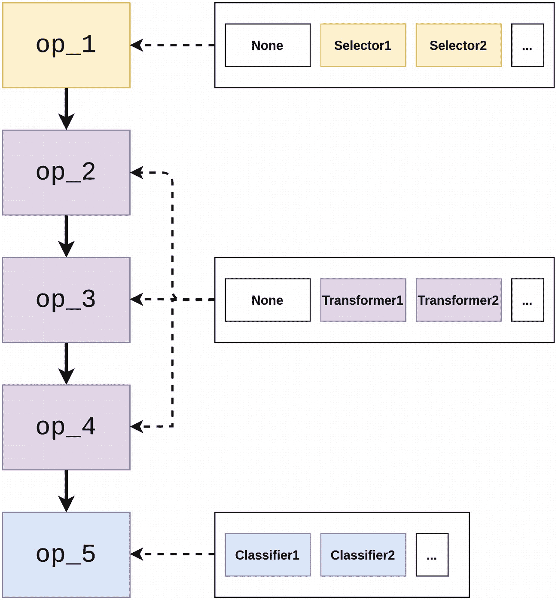

图 3-40

管道单元格

管道有五个单元格。每个单元格可以填充对应算子空间中的某个值。如果选择`none`值，单元格可以是空的。例如，以下管道可能被选中：`Selector3` → `none` → `Transformer1` → `none` → `Classifier2`，这等于`Selector3` → `Transformer1` → `Classifier2`。这个搜索空间定义非常庞大且难以手动构建，因此我们将在列表 3-19 中添加一个特殊类，该类将根据 NNI 规范创建算子搜索空间定义。

```py
from ch3.ml_pipeline.operator import OperatorSpace
class SearchSpace:
Listing 3-19
Search space. ch3/ml_pipeline/search_space.py
```

每个单元格都有一个可以由`selector`、`transformer`和`classifier`填充的算子类型。`operator_search_space`方法为每个单元格类型创建一个搜索空间。

```py
@classmethod
def operator_search_space(cls, operator_type):
"""
Search space for operator by `operator_type`
"""
ss = []
operators = []
if operator_type == 'selector':
# Selectors are not required in Pipeline
ss.append({'_name': 'none'})
operators = OperatorSpace.selectors
elif operator_type == 'transformer':
# Transformers are not required in Pipeline
ss.append({'_name': 'none'})
operators = OperatorSpace.transformers
elif operator_type == 'classifier':
operators = OperatorSpace.classifiers
for o in operators:
row = {'_name': o.name}
for p_name, values in o.params.items():
row[p_name] = {"_type": "choice", "_value": values}
ss.append(row)
return ss
```

接下来，我们定义一个`build`方法，该方法根据 NNI 规范构建所有单元格的搜索空间：

```py
@classmethod
def build(cls):
return {
"op_1": {
"_type":  "choice",
"_value": cls.operator_search_space('selector')
},
"op_2": {
"_type":  "choice",
"_value": cls.operator_search_space('transformer')
},
"op_3": {
"_type":  "choice",
"_value": cls.operator_search_space('transformer')
},
"op_4": {
"_type":  "choice",
"_value": cls.operator_search_space('transformer')
},
"op_5": {
"_type":  "choice",
"_value": cls.operator_search_space('classifier')
}
}
```

尽管搜索空间定义相当大，但我们仍然可以将其打印出来：

```py
if __name__ == '__main__':
search_space = SearchSpace.build()
print(search_space)
```

我们将使用动态搜索空间构建来在嵌入式模式下启动实验，尽管这项技术也可以用于构建静态 JSON 文件。

### 模型

那么，到目前为止我们有什么呢？我们有一个算子空间和一个搜索空间。现在让我们实现一个将管道配置转换为实际机器学习分类器的模型。列表 3-20 介绍了`MlPipelineClassifier`。

导入模块：

```py
from sklearn.pipeline import Pipeline
from ch3.ml_pipeline.operator import OperatorSpace
from ch3.ml_pipeline.utils import telescope_dataset
class MlPipelineClassifier:
Listing 3-20
MlPipelineClassifier. ch3/ml_pipeline/model.py
```

模型接收管道配置并将其转换为实际的 Scikit-learn 管道：

```py
def __init__(self, pipe_config):
ops = []
for _, params in pipe_config.items():
# operator name
op_name = params.pop('_name')
# skips 'none' operator
if op_name == 'none':
continue
op = OperatorSpace.get_operator_by_name(op_name)
ops.append((op.name, op.clz(**params)))
self.pipe = Pipeline(ops)
```

模型训练方法：

```py
def train(self, X, y):
self.pipe.fit(X, y)
```

计算准确率：

```py
def score(self, X, y):
return self.pipe.score(X, y)
```

由于模型已经准备好了，让我们尝试使用样本管道参数来初始化它，并将其应用于分类问题：

```py
if __name__ == '__main__':
pipe_config = {
'op_1': {
'_name':      'SelectPercentile',
'percentile': 2
},
'op_2': {
'_name': 'none'
},
'op_3': {
'_name': 'Normalizer',
'norm':  'l1'
},
'op_4': {
'_name':          'PCA',
'svd_solver':     'randomized',
'iterated_power': 3
},
'op_5': {
'_name':     'DecisionTreeClassifier',
'criterion': "entropy",
'max_depth': 8
}
}
model = MlPipelineClassifier(pipe_config)
X_train, y_train, X_test, y_test = telescope_dataset()
model.train(X_train, y_train)
score = model.score(X_test, y_test)
print(score)
```

模型展示了**64%**的准确率。这绝对不是我们预期的结果，因此让我们使用 HPO 技术构建一个性能更好的模型。

### 调优器

现在一切准备就绪，可以开始实验了。但我希望关注我们使用的搜索空间。试验参数是一系列算子，可能包含空算子，即`S3(p3)` → `none` → `T1(p1)` → `none` → `C2(p2)`。但与此同时，还存在以下参数：`S3(p3)` → `none` → `none` → `T1(p1)` → `C2(p2)`。它们是搜索空间中的不同参数，但生成相同的分类器模型：

+   `S3(p3)` → `none` → `T1(p1)` → `none` → `C2(p2)`

+   `S3(p3)` → `none` → `none` → `T1(p1)` → `C2(p2)`

+   `S3(p3)` → `T1(p1)` → `C2(p2)`。

请记住，具有不同参数的两个相同操作符并不相等，即`SelectFwe(alpha=0)`不等于`SelectFwe(alpha=0.05)`。让我们通过禁止它创建与已尝试的参数相关的等效模型来定制 Tuner，即如果我们已经尝试了参数`P`[`1`] = `SelectPercentile(percentile = 2)` → `none` → `Normalizer(norm='l1')` → `none` → `DecisionTreeClassifier(max_depth=8)`，那么参数`P`[`2`] = `SelectPercentile(percentile = 2)` → `none` → `none` → `Normalizer(norm='l1')` → `DecisionTreeClassifier(max_depth=8)`将不会被传递到实验中，因为`P`[`2`]生成的模型等于`P`[`1`]生成的模型。让我们创建`EvolutionShrinkTuner`，它继承自`EvolutionTuner`并跟踪所有已执行的管道，禁止传递相等的管道到实验中。我们可以在列表 3-21 中看到`EvolutionShrinkTuner`的实现。

```py
import json
from nni.algorithms.hpo.evolution_tuner import EvolutionTuner
class EvolutionShrinkTuner(EvolutionTuner):
def __init__(self, optimize_mode = "maximize", population_size = 32):
super().__init__(optimize_mode, population_size)
Listing 3-21
EvolutionShrinkTuner. ch3/ml_pipeline/evolution_shrink_tuner.py
```

我们定义了一个注册属性，它将跟踪所有创建的管道：

```py
self.registry = []
```

如果父`EvolutionTuner`对象的`super().generate_parameters`方法返回一个已经尝试过的参数，那么将再次调用`super().generate_parameters`方法，直到生成一个唯一的参数。因为`EvolutionTuner`具有随机行为，所以`super().generate_parameters`在后续调用中可以期望返回不同的参数。

```py
def generate_parameters(self, *args, **kwargs):
params = super().generate_parameters(*args, **kwargs)
# If not `params` are not valid generate new ones
while not self.is_valid(params):
params = super().generate_parameters(*args, **kwargs)
return params
```

以下`is_valid`方法通过删除`none`操作符将参数转换为规范形式，并检查它是否已经被尝试：如果是，则返回`False`；如果不是，则保存它并返回`True`。

```py
def is_valid(self, params):
# All step names
step_names = [v['_name'] for _, v in params.items() if v['_name'] != 'none']
# No duplicates allowed
if len(step_names) != len(set(step_names)):
return False
# `params` to canonical string
canonical_form = 'X'
for _, step_config in params.items():
if step_config['_name'] == 'none':
continue
canonical_form += '--->' + json.dumps(step_config)
# If `canonical_form` already tested
if canonical_form in self.registry:
return False
self.registry.append(canonical_form)
return True
```

这种简单技术引入了搜索空间元素之间的等价概念，并且可以显著缩小搜索空间。

### 实验

现在，我们终于准备好启动一个实验来寻找解决 AutoML 问题的最佳功能管道。列表 3-22 中的试验脚本初始化模型，准备数据集，训练模型，测试它，并将模型准确率返回给 NNI 实验。

（完整的代码在相应的文件中提供：*ch3/ml_pipeline/trial.py*。）

```py
def trial(hparams):
#Initializing model
model = MlPipelineClassifier(hparams)
# Preparing dataset
X_train, y_train, X_test, y_test = telescope_dataset()
model.train(X_train, y_train)
# Calculating `score` on test dataset
score = model.score(X_test, y_test)
# Send final score to NNI
nni.report_final_result(score)
Listing 3-22
Trial
```

列出 3-23 将所有内容组合在一起并运行实验。

导入模块：

```py
from pathlib import Path
from nni.experiment import Experiment, CustomAlgorithmConfig
from ch3.ml_pipeline.search_space import SearchSpace
Listing 3-23
Optimal functional pipeline experiment. ch3/ml_pipeline/run_experiment.py
```

公共实验配置：

```py
experiment = Experiment('local')
experiment.config.experiment_name = 'AutoML Pipeline'
experiment.config.trial_concurrency = 4
experiment.config.max_trial_number = 500
```

生成搜索空间：

```py
experiment.config.search_space = SearchSpace.build()
```

试验配置：

```py
experiment.config.trial_command = 'python3 trial.py'
experiment.config.trial_code_directory = Path(__file__).parent
```

设置自定义的`EvolutionShrinkTuner`：

```py
experiment.config.tuner = CustomAlgorithmConfig()
experiment.config.tuner.code_directory = Path(__file__).parent
experiment.config.tuner.class_name = 'evolution_shrink_tuner.EvolutionShrinkTuner'
experiment.config.tuner.class_args = {
'optimize_mode':   'maximize',
'population_size': 64
}
```

启动实验：

```py
http_port = 8080
experiment.start(http_port)
# Event Loop
while True:
if experiment.get_status() == 'DONE':
search_data = experiment.export_data()
search_metrics = experiment.get_job_metrics()
input("Experiment is finished. Press any key to exit...")
break
```

图 3-41 显示了 AutoML 实验的前瞻试验。

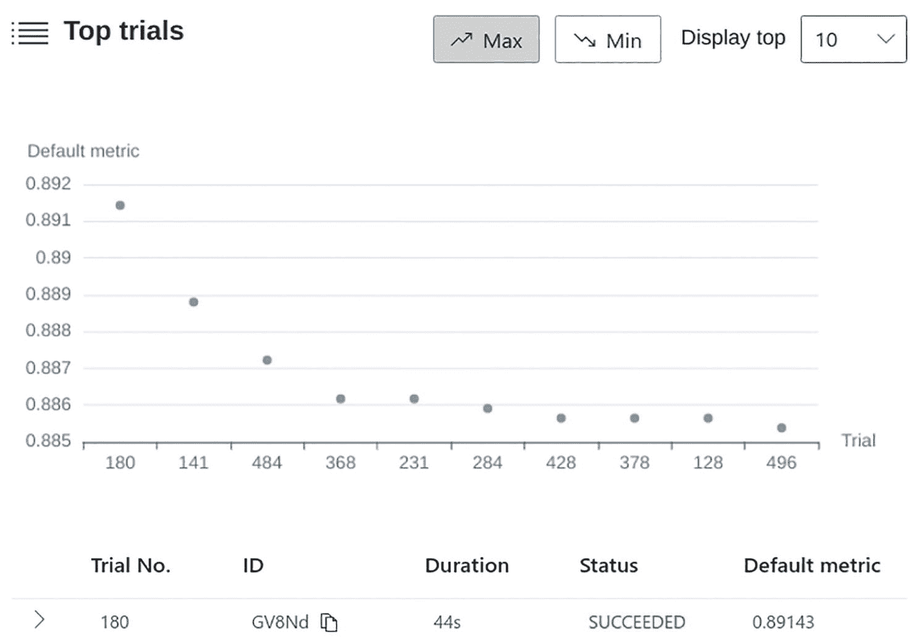

图 3-41

AutoML 实验最佳试验

最佳试验展示了**0.89143**的准确率，并具有以下参数：

```py
{
"op_1": {
"_name": "SelectFwe",
"alpha": 0.049
},
"op_2": {
"_name": "MinMaxScaler"
},
"op_3": {
"_name": "RobustScaler"
},
"op_4": {
"_name": "none"
},
"op_5": {
"_name": "MLPClassifier",
"alpha": 0.01,
"learning_rate_init": 0.01
}
}
```

最佳试验可以转换为功能管道：

```py
X → Select(alpha=0.049) → MinMaxScaler → RobustScaler → MLPClassifier(alpha=0.01, learning_rate_init=0.01) → Y
```

事实上，我们构建的分类器显示出非常好的结果，接近最优。对于这个模型的最佳分类器具有以下准确度：`0.898`（《用于成像大气切伦科夫望远镜数据分析的多任务架构与注意力机制》，[www.scitepress.org/Papers/2021/102974/102974.pdf](http://www.scitepress.org/Papers/2021/102974/102974.pdf))。我们刚刚基于 NNI 构建了定制的 AutoML 工具包。这种方法也可以应用于任何功能管道优化。同样，你可以自动设计具有顺序层布局的深度学习模型。确实，操作空间可以由深度学习层组成，模型可以是一个基于层序列管道的神经网络。当然，我们可以更深入地探讨将这种方法应用于神经网络架构搜索，但它有显著的缺点，我们将在下一节讨论。

### 将 HPO 应用于神经网络架构搜索的局限性

本节中描述的方法可以成功应用于神经网络架构的搜索，但有一个显著的局限性。使用本节中描述的 HPO 技术，我们只能得到一个具有顺序层堆叠的架构，即每个层按顺序连接到另一个层的架构。这是一个显著的局限性，因为许多现代神经网络架构在其层之间使用多个连接，如图 3-42 所示。

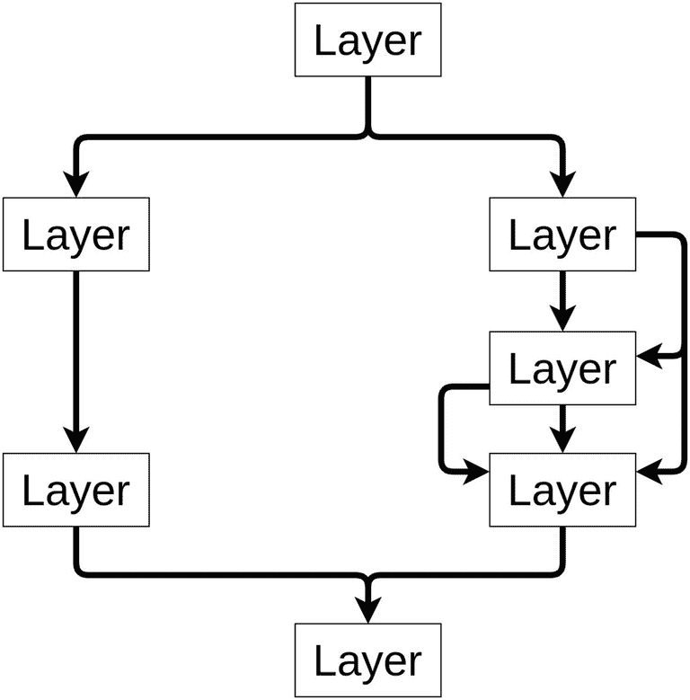

图 3-42

多连接神经网络

我们需要一些不同且特殊的技巧来搜索高效的神经网络架构。我们将在下一章开始探索它们。

### 超参数优化中的超参数

当我们谈论自动深度学习时，我们提到 AutoDL 解决了寻找最佳架构和超参数的问题。但每个 AutoDL 技术本身都有许多参数！例如，我们需要定义搜索空间、最大尝试次数、找到一个合适的 Tuner、定义 Tuner 参数等。结果发现，解决超参数选择问题的本身甚至有更多的超参数！那么使用 HPO 方法和其他 AutoDL 方法的意义在哪里呢？这是一个合理的问题。答案是，即使配置不佳的 HPO 实验也能产生比配置不佳的架构或超参数的模型显著更好的模型。我们永远无法提前确定 AutoDL 方法的最佳设置。然而，我们可以确信，AutoDL 方法肯定会产生一个接近最优的模型，并且比我们手动构建的模型要好得多。

### 摘要

本章深入探讨了调谐器内部结构和各种黑盒函数优化算法。理解调谐器行为的原则及其实际应用可以显著提升 NNI 实验设计和 HPO 结果的设计。在下一章中，我们将继续探讨我们书籍中最激动人心和有趣的部分：神经架构搜索。我们将研究寻找特定任务中神经网络最优设计的最新技术。
