# 4. 多次尝试神经架构搜索

现在我们来到了这本书最激动人心的部分。正如我们在上一章结尾所提到的，HPO 方法在自动化搜索最优深度学习模型方面相当有限，但**神经架构搜索**（**NAS**）消除了这些限制。本章重点介绍 NAS，这是自动深度学习中最有前景的领域之一。自动神经架构搜索在寻找合适的深度学习模型方面越来越重要。最近的研究已经证明了 NAS 的有效性，并发现了一些可以击败人工调整的模型。NAS 是机器学习中的一个相对较新的学科。它于 2018 年形成为一个独立的学科。从那时起，它在自动化解决特定问题的神经网络架构构建方面取得了重大突破。最手动设计的神经网络架构很快就可以被自动架构搜索所取代，因此这个领域对于所有数据科学家来说都非常有前景。NAS 产生了许多顶级计算机视觉架构。像 NASNet、EfficientNet 和 MobileNet 这样的架构是自动神经架构搜索的结果。

NAS 有两种类型：***多次尝试***和***一次性***。在多次尝试 NAS 中，模型评估器评估每个采样模型的性能，探索策略从定义的模型空间中采样模型，而一次性 NAS 试图找到从模型空间派生出的超网络的最佳神经网络架构训练和探索。本章专门介绍多次尝试 NAS。

本章分为两部分：***使用 Retiarii（PyTorch）进行神经架构搜索***和***经典神经架构搜索（TensorFlow）***。***Retiarii***是由 NNI 专家开发的神经网络模型空间上的探索性训练的深度学习框架。Retiarii 是一种有利的途径，它允许对 NAS 进行结构和规划。不幸的是，NNI `2.7`版本（本书中使用）仅实现了 Retiarii 方法用于 PyTorch 框架。在本章中不关注 TensorFlow 框架是不公平的，因此考虑了*经典神经架构搜索（TensorFlow）*部分中的 NAS 的经典方法。无论如何，NNI 支持 TensorFlow 进行一次性 NAS，我们将在下一章中探讨。因此，TensorFlow 用户将能够充分利用 NAS 方法。

## 神经架构作为数据流图

我们将本章从定义 NAS 如何感知神经网络架构开始。神经网络架构被视为数据流图（DFG）。DFG 是一组节点及其之间的连接。DFG 显示了从节点到节点的数据传输。每个节点都有其自己的类型和参数。图 4-1 演示了 DFG 的一个示例。

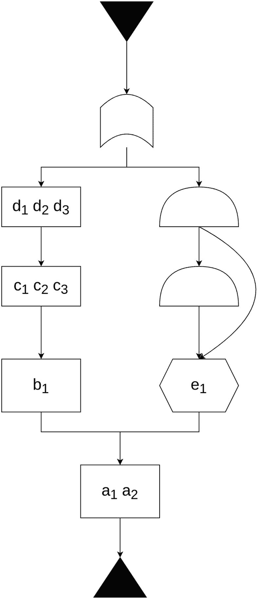

图 4-1

数据流图

在图 4-1 中，我们看到包含不同类型节点及其参数的 DFG。每个神经网络的架构可以用数据流图表示。实际上，在图 4-1 中，我们可以用一个具有参数的卷积层替换矩形节点：`padding`、`stride`、`filter_size` 等。神经架构搜索探索者对 DFG 中每个节点的本质一无所知。主要任务是构建一个 DFG，由各种深度学习层组成，形成神经网络架构，并以最佳方式解决特定问题。

## 使用 Retiarii 进行神经架构搜索（PyTorch）

Retiarii 是由 NNI 专家开发的框架，它是第一个支持深度学习探索性训练的框架。探索性训练意味着不同的深度神经网络（DNN）训练结果会被共享。这种方法比较不同模型的训练，执行优化，并停止那些中间结果较差的模型。此外，Retiarii 提供了一个新的接口来指定用于探索的深度学习模型空间，以及一个接口来描述探索策略，该策略决定了实例化和训练模型的顺序，优先级排序模型训练，并停止某些模型的训练。Retiarii 识别实例化模型之间的相关性，并开发了一套跨模型优化，以提高整体探索性训练过程。您可以在以下文章中了解更多关于 Retiarii 框架的信息：[`www.usenix.org/system/files/osdi20-zhang_quanlu.pdf`](http://www.usenix.org/system/files/osdi20-zhang_quanlu.pdf)。

NNI 版本 `2.7` 对 Retiarii 框架提供了仅使用 PyTorch 的实现。在接下来的 NNI 版本中，应该会增加 TensorFlow 的实现。请参考官方文档以检查实际状态：[`https://nni.readthedocs.io/en/v2.7/nas/overview.html`](https://nni.readthedocs.io/en/v2.7/nas/overview.html)。

### 使用 Retiarii 介绍 NAS

使用 Retiarii 深入研究神经架构搜索（NAS）的最佳方式是检查一个寻找特定任务最优数据流图（DFG）的简单示例。我们不会深入探讨神经网络的设计，而是将重点放在一个简单的算术问题上。假设我们有一些操作符链 *F*，它执行以下操作：

```py
x = 1
x ← x × 2
x ← x × 4
return x
```

我们可以用以下语句丰富链 *F*：

```py
x = 1
x ← sigmoid(x) or x ← tanh(x) or x ← relu(x)
x ← x × 2
x ← x + 0 or x ← x + 1 or x ← x + 2
x ← x × 4
x ← sigmoid(x) or x ← tanh(x) or x ← relu(x)
return x
```

该问题的模型空间可以如图 4-2 所示。我们需要找到一个 DFG，以最大化输出。

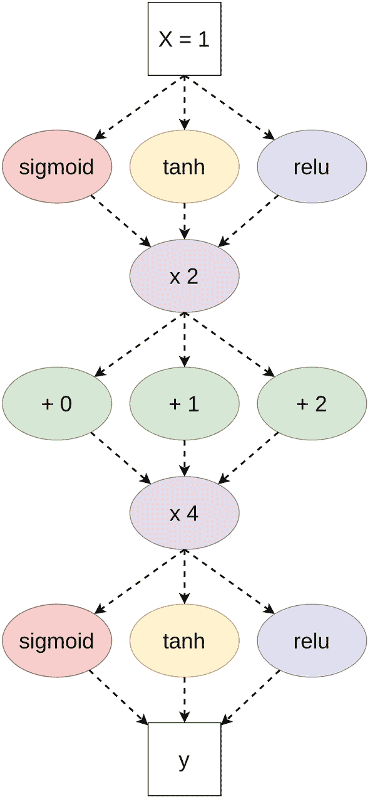

图 4-2

数据流图模型空间

当然，这是一个简单的任务，但它非常适合作为在 NNI 中使用 Retiarii 框架的入门示例。让我们继续解决这个问题。列表 4-1 定义了模型空间。

我们导入常用模块：

```py
import os
import torch
import nni
Listing 4-1
Model Space. ch4/retiarii/intro/dummy_model.py
```

Retiarii 使用 `import nni.retiarii.nn.pytorch as nn` 来导入 PyTorch。使用此包中实现 NAS 的层非常重要。

```py
import nni.retiarii.nn.pytorch as nn
```

首先，我们需要定义探索的模型空间。在 NAS 的上下文中，模型空间可以被视为 HPO 上下文中的搜索空间。模型空间由一个包含所有可能架构的类表示。每个这样的类都必须使用 `@model_wrapper` 进行注释。

```py
from nni.retiarii import model_wrapper
@model_wrapper
class DummyModel(nn.Module):
def __init__(self):
super().__init__()
```

神经网络架构的不同变体由称为 *Mutators* 的特殊方法确定。Mutators 定义了模型不同变异或突变的规则。`LayerChoice` 突变器定义了不同的层选择。在下面的例子中，`LayerChoice` 从三个层中选择一个：`Tanh`、`Sigmoid` 和 `ReLU`：

```py
# operator 1
self.op1 = nn.LayerChoice([
nn.Tanh(),
nn.Sigmoid(),
nn.ReLU()
])
```

另一种突变类型是 `ValueChoice`。此突变器从列表中选择一个值：

```py
# addition
self.add = nn.ValueChoice([0, 1, 2])
```

接下来，我们再次定义 `LayerChoice` 突变器：

```py
# operator 2
self.op2 = nn.LayerChoice([
nn.Tanh(),
nn.Sigmoid(),
nn.ReLU()
])
```

最后，我们将所有操作符链接在一起，如图 4-2 所示：

```py
def forward(self, x):
x = self.op1(x)
x = x * 2
x += self.add
x = x * 4
x = self.op2(x)
return x
```

然后，我们定义 `evaluate` 方法，该方法返回模型结果：

```py
def evaluate(model_cls):
```

评估模型：

```py
model = model_cls()
x = torch.Tensor([1])
y = model(x)
```

此代码用于模型架构可视化。我们将在稍后回到这项技术。

```py
onnx_dir = os.path.abspath(os.environ.get('NNI_OUTPUT_DIR', '.'))
os.makedirs(onnx_dir, exist_ok = True)
torch.onnx.export(model, x, onnx_dir + '/model.onnx')
```

返回结果：

```py
nni.report_final_result(y.item())
```

一旦我们定义了模型空间及其实例评估，我们就可以使用代码启动实验，如清单 4-2 所示。

导入必要的模块：

```py
from time import sleep
from nni.retiarii.evaluator import FunctionalEvaluator
from nni.retiarii.experiment.pytorch import RetiariiExperiment, RetiariiExeConfig
import nni.retiarii.strategy as strategy
from ch4.retiarii.intro.dummy_model import DummyModel, evaluate
Listing 4-2
Retiarii Experiment. ch4/retiarii/intro/run_experiment.py
```

启动 Retiarii 实验的七个主要步骤：

1.  我们设置模型空间：

1.  我们定义评估器，它评估模型实例：

```py
model_space = DummyModel()
```

1.  接下来，我们选择一个探索模型空间的搜索策略：

```py
evaluator = FunctionalEvaluator(evaluate)
```

1.  我们使用定义的模型空间、评估器和搜索策略初始化 Retiarii 实验：

```py
search_strategy = strategy.Random(dedup = True)
```

1.  设置实验配置：

```py
exp = RetiariiExperiment(model_space, evaluator, [], search_strategy)
```

1.  启动实验：

```py
exp_config = RetiariiExeConfig('local')
exp_config.experiment_name = 'dummy_search'
exp_config.trial_concurrency = 1
exp_config.max_trial_number = 100
exp_config.training_service.use_active_gpu = False
export_formatter = 'dict'
```

1.  返回最佳结果。在退出之前，我们可以在 WebUI 中分析实验的结果：

```py
exp.run(exp_config, 8080)
```

```py
while True:
sleep(1)
input("Experiment is finished. Press any key to exit...")
print('Final model:')
for model_code in exp.export_top_models(formatter = export_formatter):
print(model_code)
break
```

实验完成后，我们可以通过检查最佳结果来分析“Trial jobs”面板。

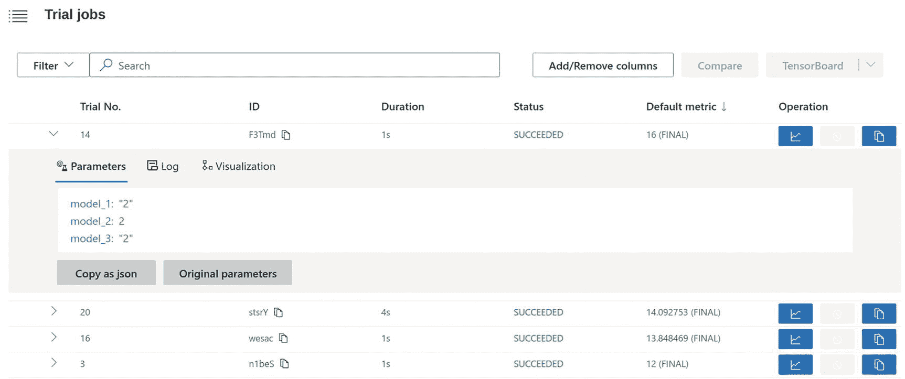

图 4-3

Trial jobs 面板

如图 4-3 所示，最佳模型返回 16。它具有以下参数集：

```py
{
"model_1": "2",
"model_2": 2,
"model_3": "2"
}
```

前面的参数没有自我描述，因此我们可以使用可视化函数来渲染 DFG，如图 4-4 所示。

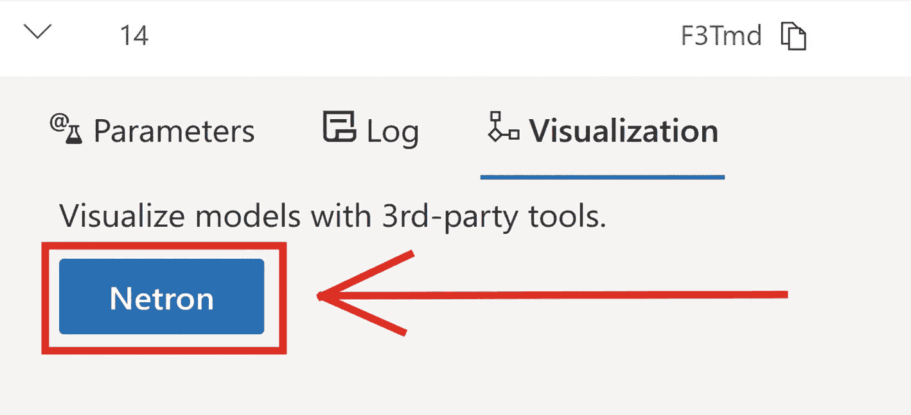

图 4-4

可视化面板

NNI 使用 Netron 来可视化试验模型。Netron 是一个用于神经网络、深度学习和机器学习模型的微型查看器。点击 `Netron` 按钮，你会看到如图 4-5 所示的屏幕。

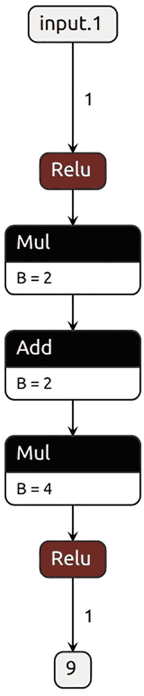

图 4-5

Netron 模型可视化

现在，我们可以声明我们已经找到了一个解决方案，即找到最大化操作符链 *F* 值的模型。该模型的 Data Flow Graph 如图 4-6 所示。

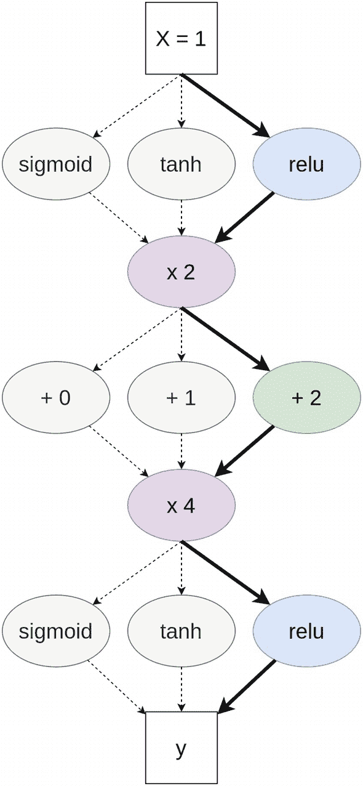

图 4-6

模型空间中的最佳数据流图

本例的目的是证明 NAS 方法的主要目标是找到一个最大化（或最小化）黑盒函数的数据流图 (DFG)。同样，HPO 方法也在寻找最大化（或最小化）黑盒函数的参数。在介绍基本 NAS 技术之后，我们可以深入了解更多细节。

### Retiarii 框架

Retiarii 框架旨在分离神经架构搜索的主要逻辑实体。这使得 NAS 流程清晰且优雅。使用 Retiarii 框架，研究人员可以只关注调查的特定方面。Retiarii 框架的主要组件包括

+   基础模型

+   变异器

+   模型空间

+   评估器

+   探索策略

*基础模型* 是神经网络的主要骨架。基础模型实际上是一个简单的深度学习模型，用于解决某些问题。通常，基础模型的表现并不出色。但它具有一些基本的神经网络架构和训练算法。

*变异器* 是基模型可能遭受的可能变化。变异器定义了将基模型架构转换为另一个架构的转换。通常，许多变异器都应用于基模型。

*模型空间* 是所有可能的基模型变异的集合。每个变异器生成几种神经网络架构的变体。将所有变异器应用于基模型定义了模型空间。

*评估器* 测量模型空间中样本的性能。这是一个典型的训练和测试神经网络的算法。

*探索策略* 定义了模型空间的探索算法。探索策略的主要目标是找到在最少尝试次数中最佳模型。

在学习超参数优化之后，所有这些概念对我们来说都非常熟悉。表 4-1 包含了 NAS 和 HPO 的主要逻辑实体。如您所见，它们几乎意味着相同的东西。

表 4-1

NAS 和 HPO 逻辑实体

| 神经架构搜索 (NAS) | 超参数优化 (HPO) |
| --- | --- |
| 基础模型 + 变异器 | 搜索空间类型 |
| 模型空间 | 搜索空间 |
| 评估器 | 尝试 |
| 探索策略 | 调优器 |

图 4-7 展示了 Retiarii 框架中各种组件之间的关系。

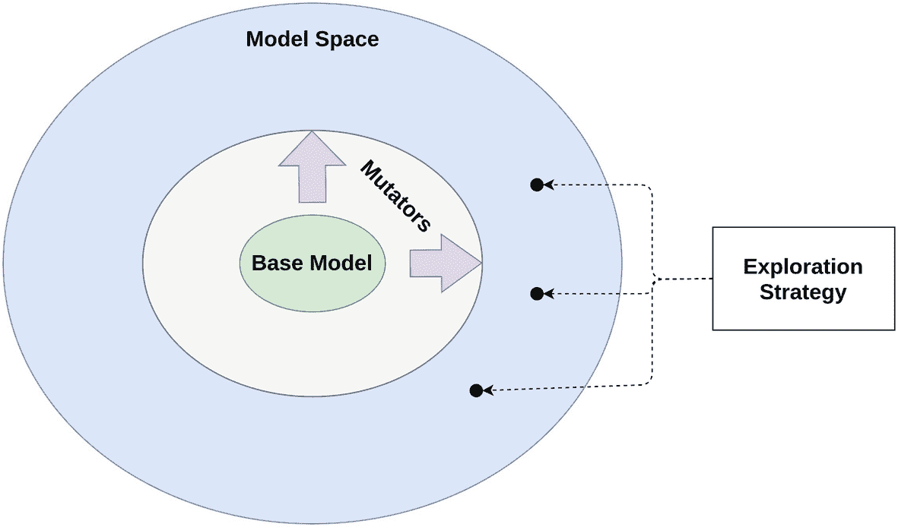

图 4-7

Retiarii 框架

让我们逐一详细查看这些组件。

### 基础模型

基础模型是从中做出所有可能的架构修改的起点。例如，MNIST 问题 NAS 的基模型可以表示为如列表 4-3 所示。

导入 PyTorch 模块：

```py
import torch
import torch.nn.functional as F
Listing 4-3
Base Model. ch4/retiarii/common/base_model.py
```

您必须使用 `nni.retiarii.nn.pytorch as nn` 模块来声明深度学习模型中的层：

```py
import nni.retiarii.nn.pytorch as nn
```

基础模型必须使用 `nni.retiarii.model_wrapper()` 进行注释：

```py
from nni.retiarii import model_wrapper
@model_wrapper
class Net(nn.Module):
```

接下来，我们有用于数字识别问题的经典 LeNet 模型设计：

```py
def __init__(self):
super().__init__()
self.conv1 = nn.Conv2d(1, 32, 3, 1)
self.conv2 = nn.Conv2d(32, 64, 3, 1)
self.dropout1 = nn.Dropout(0.25)
self.dropout2 = nn.Dropout(0.5)
self.fc1 = nn.Linear(9216, 128)
self.fc2 = nn.Linear(128, 10)
def forward(self, x):
x = F.relu(self.conv1(x))
x = F.max_pool2d(self.conv2(x), 2)
x = torch.flatten(self.dropout1(x), 1)
x = self.fc2(self.dropout2(F.relu(self.fc1(x))))
output = F.log_softmax(x, dim = 1)
return output
```

基础模型设计中常见的错误包括：

+   基础模型缺少 `@model_wrapper` 注释

+   使用`import torch.nn as nn`而不是`nni.retiarii.nn.pytorch as nn`声明层

### 变异器

基础模型是一个单一模型。为了创建模型空间，我们必须向基础模型添加变异器。每个变异器提供了一种改变基础模型的方法。所有应用于基础模型的可能变异构成了模型空间。NNI 提供了以下变异操作：`LayerChoice`、`ValueChoice`、`InputChoice`和`Repeat`。

#### 层选择

`LayerChoice`变异器为层占位符形成候选层。在探索过程中尝试这些层之一。`LayerChoice`变异器按以下方式应用于基础模型：

```py
# import part
import nni.retiarii.nn.pytorch as nn
# model design
self.activation = nn.LayerChoice([
nn.ReLU(),
nn.Sigmoid(),
nn.Identity
])
# forward
x = self.activation(x)
```

`LayerChoice`将层变化添加到基础模型，如图 4-8 所示。

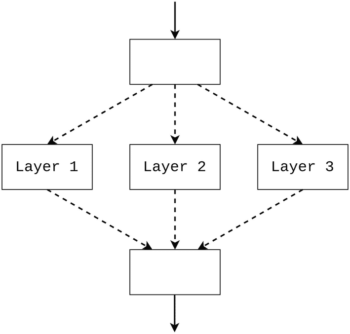

图 4-8

层选择变异器

`LayerChoice`是变异基础模型最直接的方式。

#### ValueChoice

`ValueChoice`形成要尝试的单个值的列表，作为层超参数。`ValueChoice`只能用作层超参数。它不能用作评估过程中的任意超参数，如`batch_size`或`learning_rate`。`ValueChoice`变异器按以下方式应用于基础模型：

```py
# import part
import nni.retiarii.nn.pytorch as nn
# model design
self.drop = nn.Dropout(nn.ValueChoice([0.25, 0.5, 0.75]))
# forward
x = self.drop(x)
```

在 HPO 背景下，`ValueChoice`可以被视为层超参数。

#### InputChoice

`InputChoice`尝试不同的连接。它从几个张量中选择`n_chosen`个张量。`InputChoice`变异器按以下方式应用于基础模型：

```py
# import part
import nni.retiarii.nn.pytorch as nn
# model design
self.switch = nn.InputChoice(n_candidates = 2, n_chosen = 1)
# forward
# branch one
a = self.op_a1(x)
a = self.op_a2(a)
# branch two
b = self.op_b1(x)
b = self.op_b2(b)
# choosing connection
x = self.switch([a, b])
```

`InputChoice`旨在寻找神经网络架构中最佳的数据流分支。图 4-9 说明了这一概念。

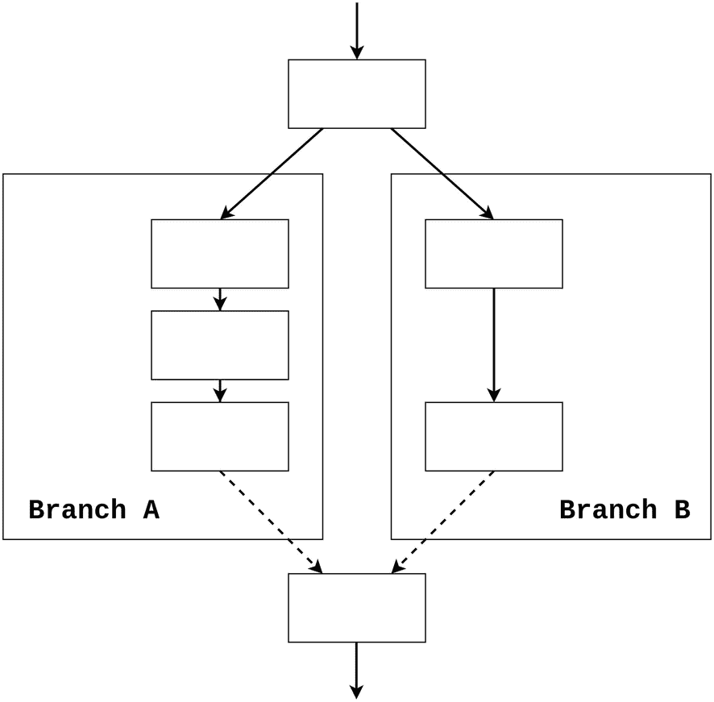

图 4-9

InputChoice 变异器

如果`InputChoice`选择了多个候选张量（即`n_chosen` > 1），则应用缩减策略：`sum`、`mean`、`concat`。这是一种非常有用的技术，允许同时提取和合并多个连接。具有缩减的多候选`InputChoice`可以按以下方式应用：

```py
# import part
import nni.retiarii.nn.pytorch as nn
# model design
self.mix = nn.InputChoice(n_candidates = 3, n_chosen = 2, reduction = 'sum')
# forward
# branch one
a = self.op_a1(x)
a = self.op_a2(a)
# branch two
b = self.op_b1(x)
b = self.op_b2(b)
# branch three
c = self.op_b1(x)
c = self.op_b2(c)
# choosing connection
x = self.mix([a, b, c])
```

上述代码生成了图 4-10 中显示的搜索空间。

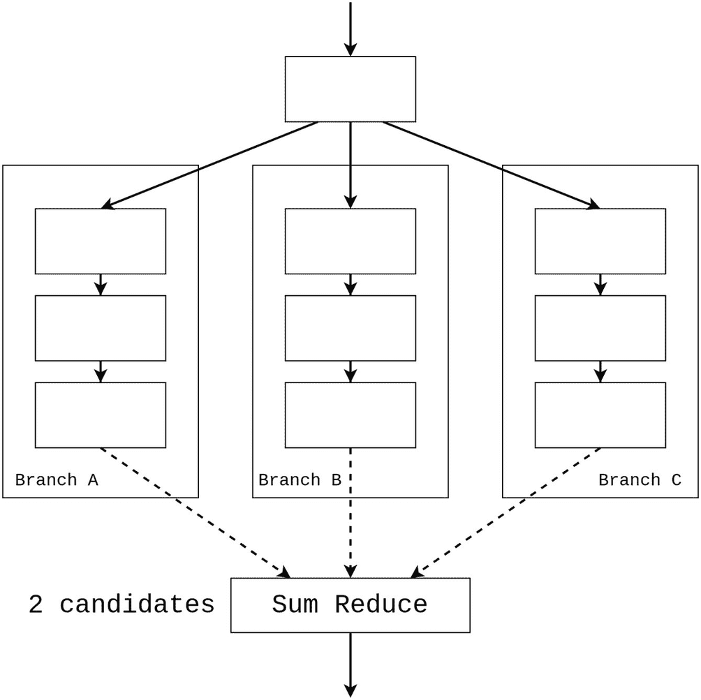

图 4-10

多候选`InputChoice`变异器

多候选`InputChoice`变异器可以选择相同的张量多次。这种情况发生在其他连接不会对神经网络性能带来任何有用的信息时。

此外，`InputChoice`允许将跳过连接技术添加到神经网络架构中。跳过连接是现代神经网络设计中的一种核心技术。它首次在 2015 年的“用于图像识别的深度残差学习”中提出（[`https://arxiv.org/pdf/1512.03385.pdf`](https://arxiv.org/pdf/1512.03385.pdf)）。跳过连接可以使用以下模式实现：

```py
# import part
import nni.retiarii.nn.pytorch as nn
# model design
self.skip_connect = nn.InputChoice(n_candidates = 2, n_chosen = 1)
# forward
x0 = x.clone()
# connection
x1 = self.op(x)
x0 = self.skip_connect([x0, None])
if x0 is not None:
# skipping connection
x1 += x0
```

在第一种情况下，模型将使用跳过连接技术，但在第二种情况下则不会。图 4-11 展示了跳过连接突变。

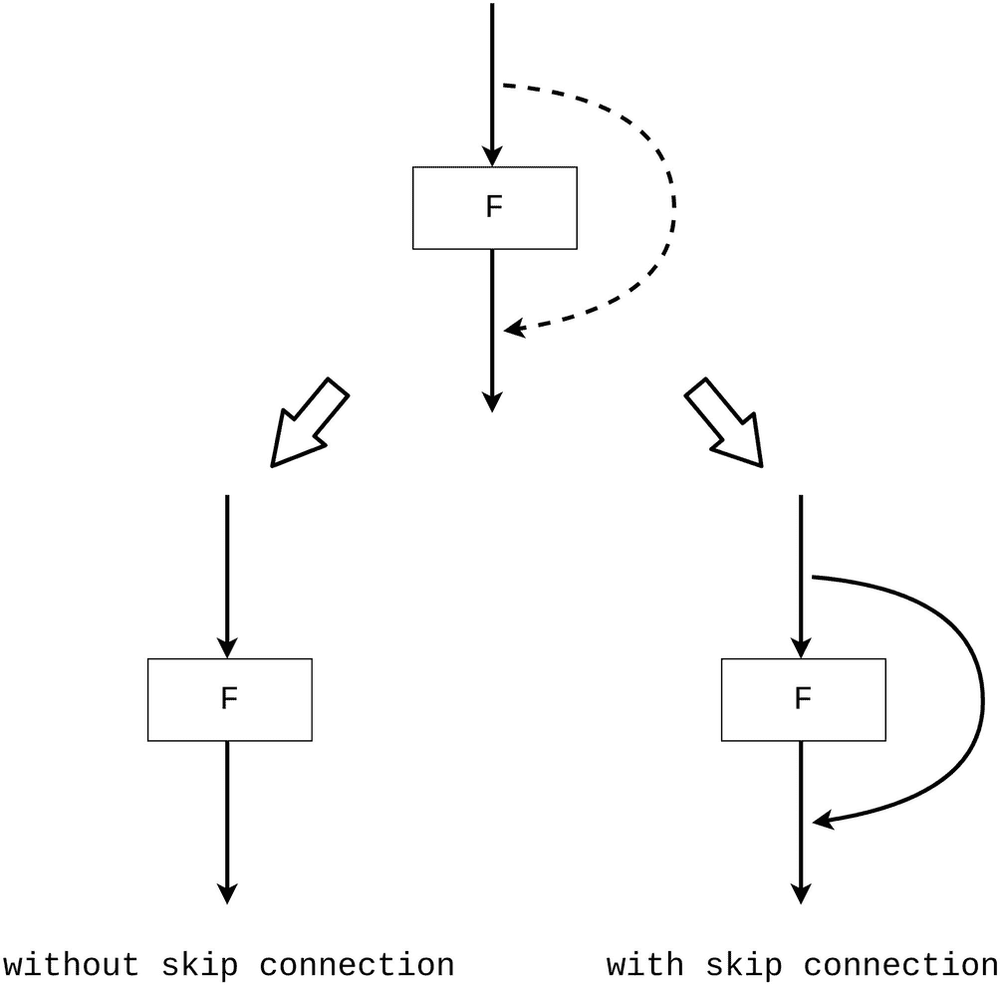

图 4-11

输入选择. 跳过连接突变

让我们通过一个算术 DFG 例子来检查 `InputChoice` 突变器的应用。假设我们有 *x* = 1 和三个由乘法运算符组成的操作管道：

```py
1: x → (x × 2)
2: x → (x × 2) → (x × 3)
3: x → (x × 2) → (x × 3) → (x × 4)
```

您需要选择两个管道，其总和最大。您可以多次选择相同的管道。这是一个相当简单的任务。直观上很清楚，最后一个管道的总和将给出最大值。让我们运行第三条管道：1 → 1 × 2 → 2 × 3 → 6 × 4 → 24；因此，我们可以获得的最大值是 `48`。

现在，让我们使用 NNI 和 `InputChoice` 突变器通过列表 4-4 来获得相同的结果。

导入常用模块：

```py
import os
import torch
Listing 4-4
InputChoice Model Space. ch4/retiarii/common/input_choice/model_space.py
```

导入 `nni` 模块：

```py
import nni
import nni.retiarii.nn.pytorch as nn
from nni.retiarii import model_wrapper
```

`ProdBlock` 作为乘数运算符。它简单地通过某个值乘以张量：

```py
class ProdBlock(nn.Module):
def __init__(self, multiplier = 0):
super().__init__()
self.multiplier = multiplier
def forward(self, x):
x = x * self.multiplier
return x
```

接下来，我们定义模型空间：

```py
@model_wrapper
class InputChoiceModelSpace(nn.Module):
def __init__(self):
super().__init__()
```

我们声明乘数运算符

```py
self.x2 = ProdBlock(2)
self.x3 = ProdBlock(3)
self.x4 = ProdBlock(4)
```

以及 `InputChoice` 突变器，它将选择最佳管道对：

```py
self.mix = nn.InputChoice(
n_candidates = 3,
n_chosen = 2,
reduction = 'sum'
)
```

`forward` 动作执行三个不同的管道，而 `InputChoice` 突变器只尝试其中的两个：

```py
def forward(self, x):
```

第一条管道：`x` → `(x × 2)`

```py
# Branch A
a = self.x2(x)
```

第二条管道：2: `x` → `(x × 2)` → `(x × 3)`

```py
# Branch B
b = self.x2(x)
b = self.x3(b)
```

第三条管道：`x` → `(x × 2)` → `(x × 3)` → `(x × 4)`

```py
# Branch C
c = self.x2(x)
c = self.x3(c)
c = self.x4(c)
return self.mix([a, b, c])
```

这里是评估函数：

```py
def evaluate(model_cls):
model = model_cls()
x = 1
out = model(x)
# visualizing
onnx_dir = os.path.abspath(os.environ.get('NNI_OUTPUT_DIR', '.'))
os.makedirs(onnx_dir, exist_ok = True)
torch.onnx.export(model, x, onnx_dir + '/model.onnx')
nni.report_final_result(out)
```

现在，我们可以使用此脚本运行实验：

```py
$ python3 ch4/retiarii/common/input_choice/run_experiment.py
```

您可以在 WebUI 详细页面上分析结果：[`http://127.0.0.1:8080/detail`](http://127.0.0.1:8080/detail)。

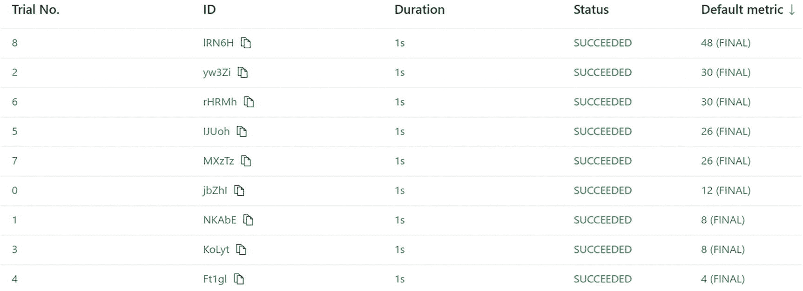

图 4-12

输入选择实验结果

在图 4-12 中，我们看到 3² = 9 个试验。最佳试验显示 48，并具有以下参数：`{ "model_1_0": 2, "model_1_1": 2 }`，这意味着最佳结果是通过最后一个管道获得的。

```py
return self.mix(
[
a, # <- 0
b, # <- 1
c  # <- 2
])
```

这样的简单例子有助于更好地理解突变器在真实 NAS 之前是如何工作的。

#### 重复

`Repeat` 突变器重复执行某些操作一定次数。在 NAS 的上下文中，`Repeat` 突变器试图确定迭代相同神经网络块的频率。例如，ResNet 神经网络架构暗示了一个残差块的堆叠。但最优的残差块数量可能取决于具体任务。图 4-13 显示了 ResNet 架构的一部分。

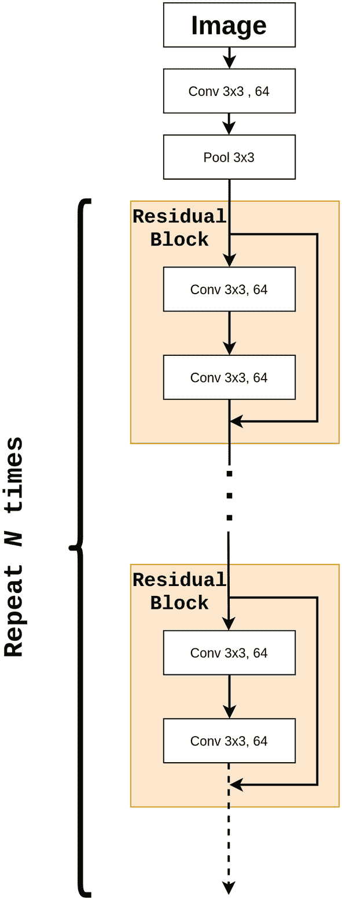

图 4-13

ResNet 架构

`Repeat` 突变器接受一个函数，通过其序列号生成一个块。以下是 `Repeat` 突变器可以应用的模式：

```py
import nni.retiarii.nn.pytorch as nn
from nni.retiarii import model_wrapper
```

我们定义一个自定义模型块：

```py
class SomeBlock(nn.Module):
...
```

设置一个构建函数，根据其在堆叠中的序号生成一个块：

```py
def create_some_block(block_num):
# some logic here that depends on 'block_num'
return SomeBlock(block_num)
@model_wrapper
class RepeatModelSpace(nn.Module):
def __init__(self):
super().__init__()
...
```

定义 `Repeat` 突变器：

```py
self.repeat_block = nn.Repeat(
create_some_block,
depth = (1, 5)  # repeat from 1 to 5 times
)
...
def forward(self, x):
...
```

评估 `Repeat` 突变器：

```py
x = self.repeat_block(x)
...
```

因此，拥有一个可以迭代构建不同长度块堆叠的工具将非常方便。这正是 `Repeat` 突变器所做的事情。让我们检查 `Repeat` 突变器在合成算术任务中的实现，就像我们之前为 `InputChoice` 突变器所做的那样。假设我们有一个将值添加到张量中的块序列。我们需要找到这个序列的最佳长度。列表 4-5 描述了此问题的模型空间。

`AddBlock` 作为加法运算符。它只是将一些值添加到输入张量中。

```py
class AddBlock(nn.Module):
def __init__(self, add = 0):
super().__init__()
self.add = add
def forward(self, x):
x = x + self.add
return x
Listing 4-5
Repeat Mutator Model Space. ch4/retiarii/common/repeat/model_space.py
```

创建 `AddBlock` 的构建函数，通过其序号：

```py
@classmethod
def create(cls, block_num):
return AddBlock(block_num)
```

接下来，我们定义模型空间：

```py
@model_wrapper
class RepeatModelSpace(nn.Module):
def __init__(self):
super().__init__()
```

`Repeat` 突变器生成不同长度的块序列（从 1 到 5）：

```py
self.repeat = nn.Repeat(
AddBlock.create,
depth = (1, 5)
)
def forward(self, x):
return self.repeat(x)
```

您可以通过运行以下命令来检查实验：

```py
$ python3 ch4/retiarii/common/repeat/run_experiment.py
```

事实上，原始突变器 `LayerChoice`、`ValueChoice`、`InputChoice` 和 `Repeat` 允许您构建任何复杂性的空间。这些突变器可以与编程语言指令相提并论：

+   *集合*: `LayerChoice, ValueChoice`

+   *if*: `InputChoice`

+   *循环*: `Repeat`

在本章的后面部分，我们将使用这些突变器检查一个真实 NAS 任务的模型空间构建。

#### 标记

所有突变器 API 都有一个可选参数 `label`。具有相同 `label` 的突变器将共享相同的值。一个典型的例子是

```py
self.net = nn.Sequential(
nn.Linear(10, nn.ValueChoice([32, 64, 128], label='hidden_dim'),
nn.Linear(nn.ValueChoice([32, 64, 128], label='hidden_dim'), 3)
)
```

这与

```py
hidden_dim = nn.ValueChoice([32, 64, 128], label='hidden_dim')
self.net = nn.Sequential(
nn.Linear(10, hidden_dim,
nn.Linear(hidden_dim, 3)
)
```

#### 示例

列表 4-6 展示了将模型空间应用于图像分类网络的简单示例。

```py
@model_wrapper
class Net(nn.Module):
def __init__(self):
super().__init__()
self.conv1 = nn.Conv2d(1, 32, 3, 1)
Listing 4-6
Model Space. ch4/retiarii/common/model_space.py
```

应用 `LayerChoice` 突变器：

```py
self.conv2 = nn.LayerChoice([
nn.Conv2d(32, 64, 3, 1),
nn.Identity
], label = 'conv_layer')
```

将 `ValueChoice` 突变器作为 `Dropout` 层超参数值应用：

```py
self.dropout1 = nn.Dropout(
nn.ValueChoice([0.25, 0.5, 0.75]),
label = 'dropout'
)
self.dropout2 = nn.Dropout(0.5)
```

将 `ValueChoice` 突变器作为 `Linear` 层超参数值应用：

```py
feature = nn.ValueChoice(
[64, 128, 256],
label = 'hidden_size'
)
self.fc1 = nn.Linear(9216, feature)
self.fc2 = nn.Linear(feature, 10)
def forward(self, x):
x = F.relu(self.conv1(x))
x = F.max_pool2d(self.conv2(x), 2)
x = torch.flatten(self.dropout1(x), 1)
x = self.fc2(self.dropout2(F.relu(self.fc1(x))))
output = F.log_softmax(x, dim = 1)
return output
```

### 评估器

Retiarii 评估器是一个接受模型类、初始化模型、训练它、测试它并将结果返回给实验的函数。评估器可以使用以下模式实现：

```py
def evaluate(model_cls):
# Initiate model
model = model_cls()
# Saving model graph for Visualization
onnx_dir = os.path.abspath(os.environ.get('NNI_OUTPUT_DIR', '.'))
os.makedirs(onnx_dir, exist_ok = True)
torch.onnx.export(model, input_x, onnx_dir + '/model.onnx')
# Model Training
# ... passing intermediate results
# ... nni.report_intermediate_result()
# Model Testing
# nni.report_final_result(out)
```

Retiarii 评估器与我们在前几章中使用的 HPO 尝试方法非常相似。

### 探索策略

NNI 为多轮 NAS 提供以下探索策略：*随机策略*、*网格搜索*、*正则化进化*、*TPE 策略*和*RL 策略*。我们已经熟悉其中的一些，因为它们实现了与相应的 HPO 调优器相同的方法。但无论如何，让我们简要研究每个策略。

#### 随机策略

随机策略 (`nni.retiarii.strategy.Random`) 从模型空间中随机采样新的模型。这是一种简单但仍然有效的探索模型空间的技术。随机搜索是一个很好的初次探索策略，当您对所处理的数据集和合适的架构设计一无所知时，它可以为您提供很好的线索。通常，随机搜索首先使用，然后在模型空间细化后，应用更智能的探索策略。

#### 网格搜索

网格搜索策略 (`nni.retiarii.strategy.GridSearch`) 使用网格搜索算法从模型空间中采样新的模型。

#### 正则化进化

正则化进化策略 (`nni.retiarii.strategy.RegularizedEvolution`) 通过使用竞赛选择方法实现带有突变操作符的遗传算法搜索。正则化进化策略与我们在第三章节中研究的进化调谐器相似。以下提供了描述正则化进化算法的伪代码。

正则化进化策略有三个全局超参数：

+   `POPULATION_SIZE`: 尝试参与进化搜索的种群大小

+   `CANDIDATES_N`: 竞赛选择方法将从种群中选择的候选人数

+   `GENERATION_N`: 总周期数

```py
# HYPERPARAMETERS
POPULATION_SIZE
CANDIDATES_N
GENERATIONS_N
```

种群使用随机个体（即随机神经网络架构）初始化：

```py
population = []
for _ in range(POPULATION_SIZE):
individual = generate_random_architecture()
evaluate(individual)
population.append(individual)
for _ in range(GENERATIONS):
```

算法从种群中随机选择 `CANDIDATES_N` 个个体：

```py
candidates = random_choice(population, CANDIDATES_N)
```

从这些候选人中，选择最佳者（即具有最佳指标的个体）：

```py
best_candidate = get_best_from(candidates)
```

在最佳候选者（即算法在原始模型中运行多个突变体）上执行随机突变：

```py
mutant = mutate(best_candidate)
```

正在评估的突变体个体：

```py
evaluate(mutant)
```

突变体替换种群中最差的个体：

```py
replace_worst(population, mutant)
```

图 4-14 展示了正则化进化策略的算法。

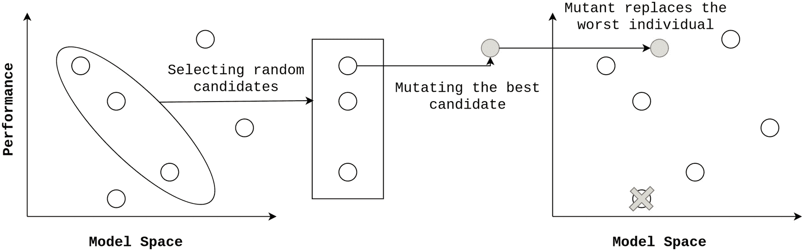

图 4-14

正则化进化策略

正则化进化策略的实现具有以下参数：

+   `optimize_mode:`

**类型**: `string`

**默认值**: `最大化`

**值**: ’`最大化`’ | ’`最小化`’

设置进化方向。

+   `population_size:`

**类型**: `int`

**默认值**: `100`

种群中的个体数量。

+   `cycles:`

**类型**: `int`

**默认值**: `20000`

算法的代数。

+   `sample_size:`

**类型**: `int`

**默认值**: `25`

应该参与每个竞赛选择的个体数量。

+   `mutation_prob:` 

**类型**: `float`

**默认值**: `0.05`

模型空间中每个突变体发生突变的概率。

更多细节，请参阅描述正则化进化方法的原始论文：[`https://arxiv.org/abs/1802.01548`](https://arxiv.org/abs/1802.01548)。

#### TPE 策略

TPE 策略 (`nni.retiarii.strategy.TPEStrategy`) 是基于树结构帕累托估计器的序列模型优化方法。它与我们第三章节中研究的 TPE 调谐器作用相同。

更多细节，请参阅描述 TPE 方法的原始论文：[`https://papers.nips.cc/paper/2011/file/86e8f7ab32cfd12577bc2619bc635690-Paper.pdf`](https://papers.nips.cc/paper/2011/file/86e8f7ab32cfd12577bc2619bc635690-Paper.pdf)。

#### RL 策略

RL 策略 (`nni.retiarii.strategy.PolicyBasedRL`) 实现了基于策略梯度的方法（近端策略优化或 PPO）的强化学习方法。RL 策略实现了一个特殊的循环神经网络，称为控制器。控制器从模型空间生成各种模型架构。控制器作为一个随机策略；因此，它为模型空间中的每个突变体返回突变概率。每次试验后，控制器根据近端优化策略方法更新其 RNN 的权重。这种方法通过为每个突变体构建概率分布来探索模型空间。

图 4-15 展示了 RL 策略的实际应用。

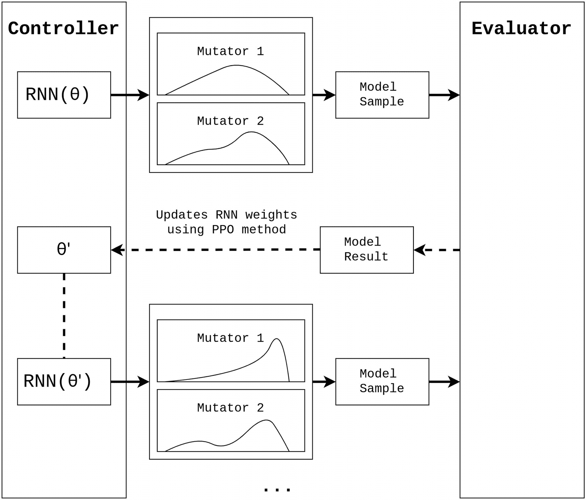

图 4-15

强化学习（近端策略优化）策略

RL 策略需要安装 `tianshou` 包。Tianshou 是一个基于纯 PyTorch 的强化学习平台。

```py
pip install tianshou
```

RL 策略的实现有以下参数：

+   `max_collect`:

**类型**：`int`

**默认值**：`100`

探索策略执行多少个 epoch。

+   `Trial_per_collect`:

**类型**：`int`

**默认值**：`20`

每次收集器收集多少次试验（轨迹）。在每个完成的轨迹之后，训练器将从重放缓冲区中采样批次并更新控制器。

更多细节，请参阅描述基于强化学习的神经架构搜索的原论文：[《https://arxiv.org/pdf/1611.01578.pdf》](https://arxiv.org/pdf/1611.01578.pdf)。

### 实验

最后剩下的是实验。Retiarii 实验以独立（嵌入式）模式启动，包含七个步骤：

+   声明模型空间

+   声明模型评估器

+   声明探索策略

+   初始化 Retiarii 实验

+   配置 Retiarii 实验

+   启动实验

+   返回结果

可以使用以下模式创建 Retiarii 实验：

```py
import nni.retiarii.strategy as strategy
from nni.retiarii import model_wrapper
from nni.retiarii.evaluator import FunctionalEvaluator
from nni.retiarii.experiment.pytorch import RetiariiExeConfig, RetiariiExperiment,
# Declare Model Space
base_model = Net()
# Declare Model Evaluator
search_strategy = strategy.Random()
# Declare Exploration Strategy
model_evaluator = FunctionalEvaluator(evaluate_model)
# Initialize Retiarii Experiment
exp = RetiariiExperiment(base_model, model_evaluator, [], search_strategy)
# Configure Retiarii Experiment
exp_config = RetiariiExeConfig('local')
exp_config.experiment_name = 'mnist_search'
exp_config.trial_concurrency = 2
exp_config.max_trial_number = 20
exp_config.training_service.use_active_gpu = False
export_formatter = 'dict'
# uncomment this for graph-based execution engine
# exp_config.execution_engine = 'base'
# export_formatter = 'code'
# Launch Experiment
exp.run(exp_config, 8081 + random.randint(0, 100))
# Returning results
print('Final model:')
for model_code in exp.export_top_models(formatter=export_formatter):
print(model_code)
```

您可以在运行实验后使用 WebUI，就像我们之前启动 HPO 实验时一样。

### CIFAR-10 LeNet NAS

让我们研究多试验 NAS 在 CIFAR-10 问题中的应用。CIFAR-10 是一个常见的图像分类问题数据集。它包含来自 10 个不同类别（飞机、汽车、鸟、猫、鹿、狗、青蛙、马、船和卡车）的 60,000 个彩色图像（32×32 像素）。

请运行以下命令将 CIFAR-10 数据集下载到您的机器上：

```py
$ python3 ch4/utils/datasets.py
```

图 4-16 展示了 CIFAR10 数据集的几个样本。

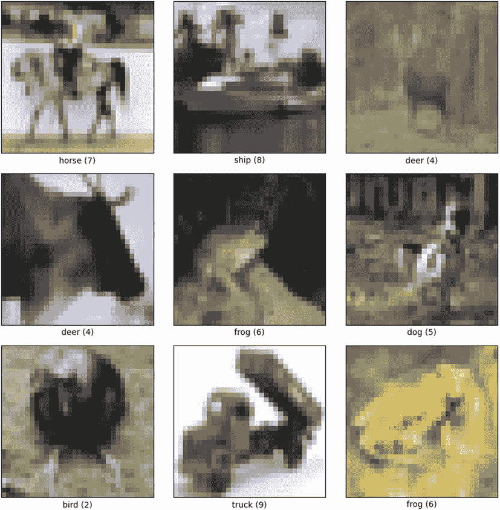

图 4-16

CIFAR-10 样本

让我们尝试找到一个基于 LeNet 方法解决 CIFAR-10 分类问题的合适深度学习模型。正如我们已知的，LeNet 图像识别架构可以分为两个部分：*特征提取组件*和*决策者组件*。*特征提取组件*由一系列带有卷积层的特征提取块组成。*决策者组件*由带有线性层的完全连接组件组成。

特征提取块的设计可以如下所示：

+   `Conv` → `Activation`

+   `Conv` → `Pool` → `Activation`

图 4-17 展示了特征提取块或特征提取块空间的可能架构选项。

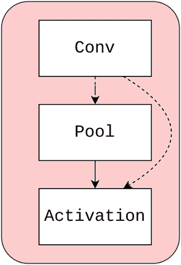

图 4-17

特征提取块空间

同样地，我们可以确定完全连接块的可能设计：

+   `Linear` → `Activation`

+   `Linear` → `Dropout` → `Activation`

图 4-18 说明完全连接块空间。

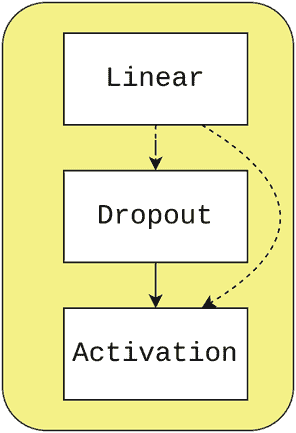

图 4-18

完全连接块空间

注

实际上，`Linear` → `Dropout(p=1)` → `Activation` 等于 `Linear` → `Activation`，并且可以设计出与图 4-18 相同的块空间而不使用两个连接。我们可以通过简单的层超参数优化实现相同的块空间：`Linear` → `Dropout(p=[.3, .5, .8, 1])` → `Activation`。但在这里我们故意使用两个连接，因为我们想展示多试验 NAS 如何选择最佳连接。

我们所寻找的神经网络架构由特征提取和完全连接块序列组成。这些块中的每一个都可能具有图 4-17 和 4-18 中所示的架构。LeNet NAS 算法必须找到最优的特征提取和完全连接块序列长度，以及它们的架构。LeNet NAS 的模型空间可以如图 4-19 所示绘制。

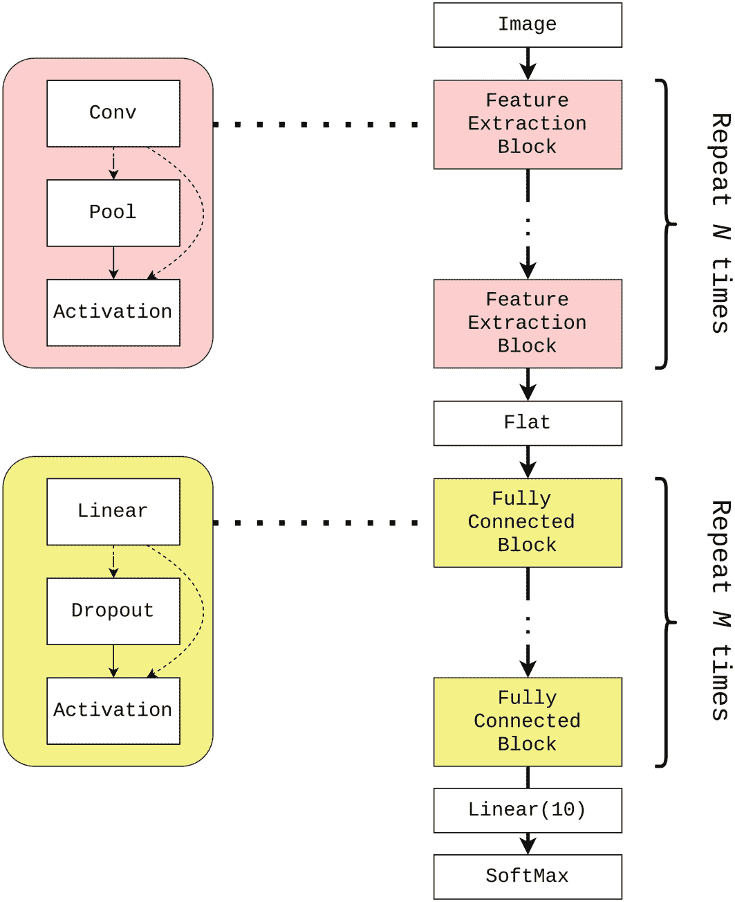

图 4-19

LeNet NAS 模型空间

我们将通过定义列表 4-7 中的特征提取块来开始实现 CIFAR-10 LeNet NAS。

```py
from typing import Tuple
import nni.retiarii.nn.pytorch as nn
Listing 4-7
Feature Extraction block. ch4/retiarii/cifar_10_lenet/feature_extraction.py
```

`FeatureExtractionBlock` 接受以下参数：

+   `dim:` 输入-输出通道

+   `kernel_size:` 卷积层的核大小

+   `activation:` 激活函数

+   `block_num`: 特征提取序列中块的序号

```py
class FeatureExtractionBlock(nn.Module):
def __init__(
self,
dim: Tuple[int, int],
kernel_size,
activation,
block_num = 0
) -> None:
super().__init__()
```

初始化核心卷积层：

```py
self.input_dim = dim[0]
self.output_dim = dim[1]
self.conv = nn.Conv2d(
in_channels = self.input_dim,
out_channels = self.output_dim,
kernel_size = kernel_size
)
```

声明池化和激活层：

```py
self.max_pool = nn.MaxPool2d(2, 2)
self.activation = activation
```

对两个不同分支的选择：

+   `Conv` → `Pool` → `Activation`

+   `Conv` → `Activation`

```py
self.switch = nn.InputChoice(
n_candidates = 2,
n_chosen = 1,
label = f'fe_switch_{block_num}'
)
```

定义 `forward` 方法：

```py
def forward(self, x):
x = self.conv(x)
# Branch A
a = self.max_pool(x)
a = self.activation(a)
# Branch B
b = self.activation(x)
return self.switch([a, b])
```

以下方法在 `Repeat` 变异体中使用。它通过特征提取序列中的序号返回适当的 `FeatureExtractionBlock`。

```py
@classmethod
def create(cls, activation, in_dimension):
def create_block(i):
params = {
'kernel_size': nn.ValueChoice(
[3, 5],
label = f'fe_kernel_size_{i}'
)
}
# Feature Block Dimensions
if i == 0:
dim = (in_dimension, 8)
elif i == 1:
dim = (8, 16)
else:
dim = (16, 16)
params['dim'] = dim
params['activation'] = activation
return FeatureExtractionBlock(**params)
return create_block
```

完全连接块的实现类似于特征提取块，并在列表 4-8 中提供。

```py
from typing import Tuple, Iterator
from torch.nn import Parameter
import nni.retiarii.nn.pytorch as nn
Listing 4-8
Fully Connected block. ch4/retiarii/cifar_10_lenet/fully_connected.py
```

`FullyConnectedBlock` 接受以下参数：

+   `dim:` 线性层的输入-输出特征

+   `dropout_rate:` Dropout 层的层超参数

+   `activation:` 激活函数

+   `block_num`: 全连接序列中块的序号

```py
class FullyConnectedBlock(nn.Module):
def __init__(
self,
dim: Tuple[int, int],
dropout_rate,
activation,
block_num
) -> None:
super().__init__()
```

初始化线性层：

```py
self.input_dim = dim[0]
self.output_dim = dim[1]
self._linear = None
```

声明 dropout 和激活层：

```py
self.dropout = nn.Dropout(p = dropout_rate)
self.activation = activation
```

两个不同分支的切换选择：

+   `Linear` → `Dropout` → `Activation`

+   `Linear` → `Activation`

```py
self.switch = nn.InputChoice(
n_candidates = 2,
n_chosen = 1,
label = f'fc_switch_{block_num}'
)
```

定义 `forward` 方法：

```py
def forward(self, x):
if not self.input_dim:
self.input_dim = x.shape[1]
# Branch A
a = self.linear(x)
a = self.dropout(a)
a = self.activation(a)
# Branch B
b = self.linear(x)
b = self.activation(b)
return self.switch([a, b])
```

在 `Repeat` 修改器中使用以下方法。它通过其在全连接序列中的序号返回适当的 `FullyConnectedBlock`。

```py
@classmethod
def create(cls, activation, units, dropout_rate):
def create_block(i):
return FullyConnectedBlock(
dim = (units[i], units[i + 1]),
dropout_rate = dropout_rate,
activation = activation,
block_num = i
)
return create_block
```

现在我们已经准备好构建 LeNet Model Space。

导入模块：

```py
from typing import Iterator
from torch.nn import Parameter
import nni.retiarii.nn.pytorch as nn
from nni.retiarii import model_wrapper
from ch4.retiarii.cifar_10_lenet.feature_extraction import FeatureExtractionBlock
from ch4.retiarii.cifar_10_lenet.fully_connected import FullyConnectedBlock
Listing 4-9
LeNet Model Space. ch4/retiarii/cifar_10_lenet/lenet_model_space.py
```

不要忘记将 `@model_wrapper` 添加到 Model Space 类中：

```py
@model_wrapper
class Cifar10LeNetModelSpace(nn.Module):
def __init__(self):
super().__init__()
# number of classes for CIFAR-10 dataset
self.class_num = 10
# RGB input channels
self.input_channels = 3
```

首先，我们定义特征提取序列的空间。所有特征提取块将共享相同的激活函数：

```py
fe_activation = nn.LayerChoice(
[nn.Sigmoid(), nn.ReLU()],
label = f'fe_activation'
)
```

`Repeat` 修改器将创建一行中的两个或三个特征提取块：

```py
self.fe = nn.Repeat(
FeatureExtractionBlock.create(fe_activation, self.input_channels),
depth = (2, 3), label = 'fe_repeat'
)
```

第二，我们定义一个全连接序列：

```py
self.flat = nn.Flatten()
```

所有全连接块将共享相同的激活函数：

```py
dm_activation = nn.LayerChoice(
[nn.Sigmoid(), nn.ReLU()],
label = f'fc_activation'
)
```

全连接块的层超参数：

```py
l1_size = nn.ValueChoice([256, 128], label = 'l1_size')
l2_size = nn.ValueChoice([128, 64], label = 'l2_size')
l3_size = nn.ValueChoice([64, 32], label = 'l3_size')
dropout_rate = nn.ValueChoice([.3, .5], label = 'fc_dropout_rate')
```

`Repeat` 修改器将创建一行中的一个到三个全连接块：

```py
self.dm = nn.Repeat(
FullyConnectedBlock.create(
dm_activation,
[None, l1_size, l2_size, l3_size],
dropout_rate
),
depth = (1, 3), label = 'fc_repeat'
)
```

最终的成对分类层（`linear_final` 层延迟初始化）：

```py
self.linear_final_input_dim = None
self._linear_final = None
self.log_max = nn.LogSoftmax(dim = 1)
```

执行 `forward` 方法：

```py
def forward(self, x):
x = self.fe(x)
x = self.flat(x)
x = self.dm(x)
if not self.linear_final_input_dim:
self.linear_final_input_dim = x.shape[1]
x = self.linear_final(x)
return self.log_max(x)
```

模型评估器是一个经典的神经网络训练-测试算法。您可以在以下位置查看其代码：ch4/retiarii/cifar_10_lenet/eval.py。

好的！由于 LeNet Model Space 已经准备好，我们可以使用列表 4-10 中的代码开始研究。

导入模块：

```py
from nni.retiarii.evaluator import FunctionalEvaluator
from nni.retiarii.experiment.pytorch import RetiariiExperiment, RetiariiExeConfig
import nni.retiarii.strategy as strategy
from ch4.retiarii.cifar_10_lenet.eval import evaluate
from ch4.retiarii.cifar_10_lenet.lenet_model_space import Cifar10LeNetModelSpace
Listing 4-10
LeNet NAS Experiment. ch4/retiarii/cifar_10_lenet/run_cifar10_lenet_experiment.py
```

声明 Model Space：

```py
model_space = Cifar10LeNetModelSpace()
```

定义模型评估器：

```py
evaluator = FunctionalEvaluator(evaluate)
```

我们将为此实验使用 RL 搜索策略：

```py
search_strategy = strategy.PolicyBasedRL(
trial_per_collect = 10,
max_collect = 200
)
```

初始化 Retiarii 实验：

```py
exp = RetiariiExperiment(model_space, evaluator, [], search_strategy)
```

实验配置：

```py
exp_config = RetiariiExeConfig('local')
exp_config.experiment_name = 'CIFAR10_LeNet_NAS'
exp_config.trial_concurrency = 1
exp_config.max_trial_number = 500
exp_config.training_service.use_active_gpu = False
export_formatter = 'dict'
```

启动实验：

```py
exp.run(exp_config, 8080)
```

返回结果：

```py
print('Final model:')
for model_code in exp.export_top_models(formatter = export_formatter):
print(model_code)
```

实验可以按以下方式运行：

```py
$ python3 ch4/retiarii/cifar_10_lenet/run_cifar10_lenet_experiment.py
```

注意

在 Intel Core i7 配备 CUDA (GeForce GTX 1050) 的系统上运行时间约为 20 小时

最佳模型在测试数据集上显示 **0.84** 的准确率。这不是一个坏的结果，但似乎仍有改进的空间。最佳模型具有以下参数：

```py
{
"fe_repeat": 2,
"fe_kernel_size_0": 3,
"fe_activation": "1",
"fe_switch_0": 0,
"fe_kernel_size_1": 5,
"fe_kernel_size_2": 3,
"fc_repeat": 2,
"l1_size": 128,
"fc_dropout_rate": 0.3,
"fc_switch_0": 0,
"l2_size": 64,
"fc_switch_1": 0,
"l3_size": 64,
"fc_switch_2": 0
}
```

上述参数可以这样解释：

`"fe_repeat": 2` – 表示 `Repeat` 修改器生成两个块的特征提取序列：

```py
self.fe = nn.Sequential(
[
FeatureExtractionBlock.create(fe_activation, self.input_channels)(0),
FeatureExtractionBlock.create(fe_activation, self.input_channels)(1),
]
)
```

`"fe_kernel_size_0": 3` – 表示在 `ValueChoice` 修改器中选择 `3`：

```py
'kernel_size': nn.ValueChoice(
[3, # <- this value
5],
label = f'fe_kernel_size_{i}'
)
```

`"fe_switch_0": 0` – 表示在 `InputChoice` 修改器中使用第一个连接：

```py
self.switch([a, b]) <- returns a
```

此外，使用 Trial 详细面板中的 Netron 可方便地可视化架构。图 4-20 展示了最佳模型的架构。

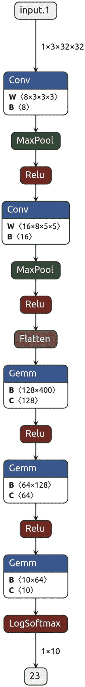

图 4-20

LeNet NAS 最佳模型架构

我们在本节中进行的这项研究可以作为您自己的 NAS 解决方案的良好起点。它包含了在多试验 NAS 中使用的基本技术。在这里，我们使用了 LeNet 模型作为基础模型，但您可以选择任何模型和任何更适合具体问题的修改器。但我们没有在 LeNet NAS 中取得很好的结果。在下一节中，我们将尝试使用更复杂的方法进行另一种 NAS。

### CIFAR-10 ResNet NAS

让我们尝试找到另一种解决 CIFAR-10 问题的架构搜索方法。2015 年，发表了文章“用于图像识别的深度残差学习”([`https://arxiv.org/pdf/1512.03385.pdf`](https://arxiv.org/pdf/1512.03385.pdf))。这篇文章对深度学习产生了巨大影响。它引入了残差项的概念，可以降低神经网络块的性能，从而提高其性能。

ResNet 模型的基本构建块是瓶颈块。原始瓶颈块内部跳过连接。但我们将将其作为可选功能添加。NAS 算法将定义是否适合为瓶颈块使用跳转连接技术。因此，在 ResNet NAS 中有两种瓶颈块变体：带有和没有跳转连接技术的。瓶颈块空间的结构可以在图 4-21 中展示。

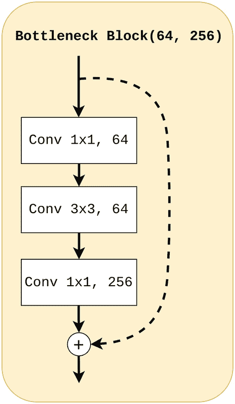

图 4-21

瓶颈块空间

ResNet 的另一个组件是残差单元。残差单元由一系列瓶颈块组成。残差单元中瓶颈序列的最优长度取决于具体的数据集。图 4-22 展示了残差单元的空间。

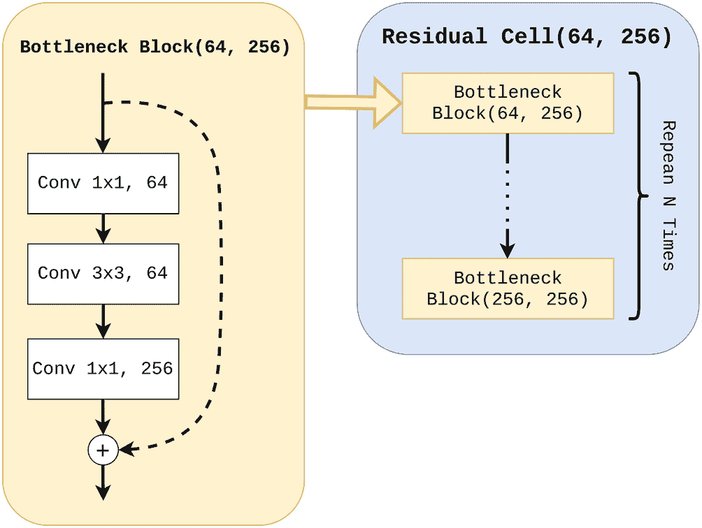

图 4-22

残差单元空间

最后，我们可以构建 ResNet 模型。ResNet 具有以下架构：

+   初始卷积层

+   残差单元序列

+   几个全连接层

残差单元序列的最优长度取决于数据集。我们将在 ResNet NAS 中尝试找到它。图 4-23 展示了 ResNet NAS 的完整模型空间。

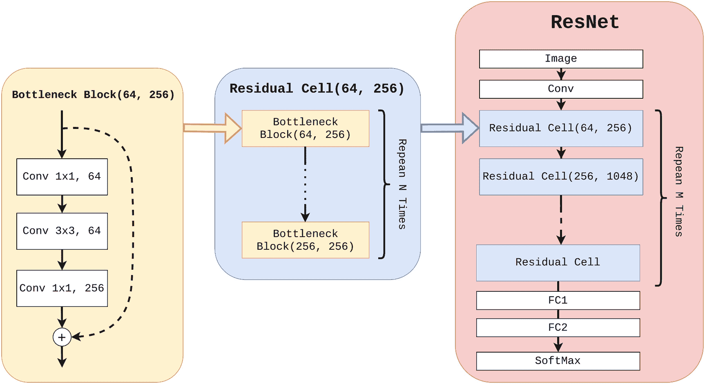

图 4-23

ResNet NAS 空间

列表 4-11 定义了 ResNet 模型空间中的瓶颈块。

```py
import nni.retiarii.nn.pytorch as nn
class Bottleneck(nn.Module):
Listing 4-11
ResNet NAS Bottleneck block. ch4/retiarii/cifar_10_resnet/bottle_neck.py
```

瓶颈扩展比：

```py
expansion = 4
```

瓶颈块产生的输出通道数：

```py
@classmethod
def result_channels_num(cls, channels):
return channels * cls.expansion
```

瓶颈块接受以下参数：

+   `cell_num`：此块所属的残差单元的序号

+   `in_channels`：第一个卷积层的输入通道

+   `out_channels`：块中所有卷积层的输出通道

+   `i_downsample`：标识下采样块

```py
def __init__(
self,
cell_num,
in_channels,
out_channels,
i_downsample = None,
stride = 1
):
super(Bottleneck, self).__init__()
```

定义三个带有批量归一化的卷积层：

```py
self.conv1 = nn.Conv2d(
in_channels, out_channels,
kernel_size = 1, stride = 1, padding = 0
)
self.batch_norm1 = nn.BatchNorm2d(out_channels)
self.conv2 = nn.Conv2d(
out_channels, out_channels,
kernel_size = 3, stride = stride, padding = 1
)
self.batch_norm2 = nn.BatchNorm2d(out_channels)
self.conv3 = nn.Conv2d(
out_channels, self.result_channels_num(out_channels),
kernel_size = 1, stride = 1, padding = 0
)
self.batch_norm3 = nn.BatchNorm2d(self.result_channels_num(out_channels))
```

跳转连接在残差单元的所有块中作用相同，因为所有 `InputChoice` 修改器在残差单元中共享相同的标签：

```py
self.skip_connection = nn.InputChoice(
n_candidates = 2,
n_chosen = 1,
label = f'bottle_neck_{cell_num}_skip_connection'
)
```

标识下采样块：

```py
self.i_downsample = i_downsample
self.stride = stride
self.relu = nn.ReLU()
```

定义前向方法：

```py
def forward(self, x):
# x0
identity = x.clone()
x = self.relu(self.batch_norm1(self.conv1(x)))
x = self.relu(self.batch_norm2(self.conv2(x)))
x = self.conv3(x)
x = self.batch_norm3(x)
identity = self.skip_connection([identity, None])
```

如果`self.skip_connection`返回`not None`，则跳过连接：

```py
if identity is not None:
#downsample if needed
if self.i_downsample is not None:
identity = self.i_downsample(identity)
# adding identity
x += identity
x = self.relu(x)
return x
```

由于我们已经定义了瓶颈块，我们可以转向 ResNet 模型空间定义，如清单 4-12 所示。

（省略了一些不重要的代码段。完整的代码在相应的文件中提供：*ch4/retiarii/cifar_10_resnet/res_net_model_space.py*。）

导入模块：

```py
from typing import Iterator
import nni.retiarii.nn.pytorch as nn
from nni.retiarii import model_wrapper
from torch.nn import Parameter
from ch4.retiarii.cifar_10_resnet.bottle_neck import Bottleneck
Listing 4-12
ResNet NAS Model Space
```

不要忘记用`@model_wrapper`注释模型空间：

```py
@model_wrapper
class ResNetModelSpace(nn.Module):
```

全局模型常量：

```py
# classification classes
num_classes = 10
# input channels for RGB image
in_channels = 3
# ResNet Channel constant
channels = 64
def __init__(self):
super().__init__()
```

选择`ReLU`作为全局激活函数：

```py
self.relu = nn.ReLU()
```

带批量归一化的入口卷积层：

```py
self.conv1 = nn.Conv2d(
in_channels = self.in_channels,
out_channels = self.channels,
kernel_size = 7,
stride = 2,
padding = 3,
bias = False
)
self.batch_norm1 = nn.BatchNorm2d(64)
```

带有如下超参数列表`[2, 3]`的 MaxPool 层：

```py
pool_size = nn.ValueChoice([2, 3], label = 'pool_size')
self.max_pool = nn.MaxPool2d(kernel_size = pool_size, stride = 2, padding = 1)
```

使用`Repeat`突变体（从两个到五个细胞）构建残差单元序列：

```py
self.res_cells = nn.Repeat(
ResNetModelSpace.residual_cell_builder(),
depth = (2, 5), label = 'res_cells_repeat'
)
```

使用两个线性层构建全连接序列：

```py
self.avg_pool = nn.AdaptiveAvgPool2d((1, 1))
self.fc1_input_dim = None
self.fc1_output_dim = nn.ValueChoice(
[256, 512],
label = 'fc1_output_dim'
)
self._fc1 = None
self.fc2 = nn.Linear(
in_features = self.fc1_output_dim,
out_features = self.num_classes
)
```

定义`forward`方法：

```py
def forward(self, x):
x = self.relu(self.batch_norm1(self.conv1(x)))
x = self.max_pool(x)
x = self.res_cells(x)
x = self.avg_pool(x)
x = x.reshape(x.shape[0], -1)
if not self.fc1_input_dim:
self.fc1_input_dim = x.shape[1]
x = self.relu(self.fc1(x))
x = self.fc2(x)
return x
```

以下方法用于为`Repeat`突变体构建残差单元：

```py
@classmethod
def residual_cell_builder(cls):
def create_cell(cell_num):
```

定义残差单元参数：

```py
# planes sequence: 64, 128, 256, 512,...
planes = 64 * pow(2, cell_num)
# stride sequence: 1, 2, 2, 2,...
stride = max(1 + cell_num, 2)
```

残差单元中的瓶颈块数量：

```py
# block sequence: 3, 4, 5, 5,...
blocks = max(3 + cell_num, 5)
downsample = None
```

瓶颈块的占位符：

```py
layers = []
```

如有必要，构建下采样身份块：

```py
if stride != 1 or cls.channels != Bottleneck.result_channels_num(planes):
downsample = nn.Sequential(
nn.Conv2d(
in_channels = cls.channels,
out_channels = Bottleneck.result_channels_num(planes),
kernel_size = 1,
stride = stride
),
nn.BatchNorm2d(
num_features = Bottleneck.result_channels_num(planes)
)
)
layers.append(
Bottleneck(
cell_num = cell_num,
in_channels = cls.channels,
out_channels = planes,
i_downsample = downsample,
stride = stride
)
)
cls.channels = Bottleneck.result_channels_num(planes)
```

生成瓶颈块的序列：

```py
for i in range(blocks - 1):
layers.append(
Bottleneck(
cell_num = cell_num,
in_channels = cls.channels,
out_channels = planes
)
)
return nn.Sequential(*layers)
return create_cell
```

哇，如果你对 ResNet 还不熟悉，那么要理解 ResNet 模型空间定义并不容易。无论如何，别忘了 NAS 将神经网络视为数据流图，并试图在我们构建的模型空间中找到节点和连接的最优组合。即使你对一些深度学习概念还不熟悉，也试着将 NAS 视为在超图空间中寻找最优子图的过程。

ResNet 模型评估器是一个经典的神经网络训练-测试算法。你可以在这里查看其代码：ch4/retiarii/cifar_10_resnet/eval.py。ResNet NAS 实验脚本与 LeNet NAS 没有太大区别，我在书中没有提供其代码。请参阅脚本文件：ch4/retiarii/cifar_10_resnet/run_cifar10_resnet_experiment.py。

实验可以按以下方式进行：

```py
$ python3 ch4/retiarii/cifar_10_resnet/run_cifar10_resnet_experiment.py
```

注意

在 Intel Core i7 和 CUDA（GeForce GTX 1050）上运行需要约 60 小时：

最佳模型在测试数据集上显示**0.957**的准确率。这并不完美，但比 LeNet NAS 产生的**0.84**要好得多。最佳神经网络架构具有以下参数：

```py
{
"pool_size": 2,
"res_cells_repeat": 5,
"bottle_neck_0_skip_connection": 1,
"bottle_neck_1_skip_connection": 0,
"bottle_neck_2_skip_connection": 0,
"bottle_neck_3_skip_connection": 0,
"bottle_neck_4_skip_connection": 0,
"fc1_output_dim": 512
}
```

这些参数意味着最佳模型具有五个残差单元的序列：第一个单元不使用跳过连接技术，而其他单元使用它。这是一个可预测的结果，因为通常跳过连接技术可以提高神经网络性能。

在本节中，我们取得了很大的成果！CIFAR-10 是一个高度复杂的计算机视觉问题，即使是大型、复杂的神经网络也无法使用这个数据集达到高准确率。表 4-2 比较了我们在此节中构建的架构与其他常见架构。

表 4-2

对 CIFAR-10 最佳架构进行评分

| 排名 | 架构 | 准确率 |
| --- | --- | --- |
| 79 | AutoDropout | 96.8 |
| 96 | Wide ResNet | 96.11 |
| **-** | **多试验 NAS ResNet 结果** | **95.7** |
| 104 | SimpleNetv1 | 95.51 |
| 108 | MomentumNet | 95.18 |
| 116 | VGG-19 with GradInit | 94.71 |
| 128 | Tree+Max-Avg pooling | 94 |

关于 CIFAR-10 问题架构性能的更详细信息，请参阅[`https://paperswithcode.com/sota/image-classification-on-cifar-10`](https://paperswithcode.com/sota/image-classification-on-cifar-10)。

## 经典神经架构搜索（TensorFlow）

经典 NAS 实现了多试验 NAS 方法。评估器从模型空间中取一个模型并单独评估它。关于经典 NAS 的最后有效文档可以在以下位置找到：[`https://nni.readthedocs.io/en/v2.2/nas.html`](https://nni.readthedocs.io/en/v2.2/nas.html)。NNI 目前支持经典 NAS，但正在弃用它以支持 Retiarii 框架。经典 NAS 算法的流程与超参数调整类似。用户使用 `nnictl` 启动实验，每个模型作为一个试验运行。不同之处在于，搜索空间文件是通过运行 `nnictl ss_gen` 从模型空间自动生成的。

经典神经架构搜索（NAS）的主要逻辑实体包括 *基础模型*、*突变器*、*搜索空间*、*试验* 和 *搜索策略*。让我们通过将 NAS 算法应用于经典的 MNIST 问题来逐一研究它们。

### 基础模型

每个神经架构搜索都从定义一个基础模型开始。基础模型是一个神经网络，它作为新架构的起点。基础模型可以是非常简单或非常复杂的。研究人员选择最适合作为基线的模型。

让我们检查列表 4-13 中的经典 LeNet 模型，用于 MNIST 问题。

```py
class LeNetModel(Model):
Listing 4-13
Base Model. ch4/classic/base_model.py
```

基础模型层：

```py
def __init__(self):
super().__init__()
self.conv1 = Conv2D(6, 3, padding = 'same', activation = 'relu')
self.pool = MaxPool2D(2)
self.conv2 = Conv2D(16, 3, padding = 'same', activation = 'relu')
self.bn = BatchNormalization()
self.gap = AveragePooling2D(2)
self.fc1 = Dense(120, activation = 'relu')
self.fc2 = Dense(84, activation = 'relu')
self.fc3 = Dense(10)
```

前馈：

```py
def call(self, x):
batch_size = x.shape[0]
x = self.conv1(x)
x = self.pool(x)
x = self.conv2(x)
x = self.pool(self.bn(x))
x = self.gap(x)
x = tf.reshape(x, [batch_size, -1])
x = self.fc1(x)
x = self.fc2(x)
x = self.fc3(x)
return x
```

列表 4-13 中描述的模型将作为新架构的粘土。

### 突变器

突变器将基础模型转换成一个新的模型。一组突变器允许定义 NAS 的搜索空间。经典 NNI NAS 提供了两个突变器：`LayerChoice` 和 `InputChoice`。`LayerChoice` 突变器为层占位符形成候选层。探索过程中尝试其中一个候选者。`InputChoice` 尝试不同的连接。它从几个张量中选择 `n_chosen` 个张量。

你可以在“神经架构搜索使用 Retiarii（PyTorch）”部分的“突变器”子部分中了解更多关于 `LayerChoice` 和 `InputChoice` 突变器的信息。我们可以以下这种方式将 `LayerChoice` 和 `InputChoice` 突变器应用于基础模型。

```py
class LeNetModelSpace(Model):
def __init__(self):
super().__init__()
Listing 4-14
LeNet Model Space. ch4/classic/model.py
```

我们尝试为 `conv1` 占位符使用三种不同的卷积层：

```py
self.conv1 = LayerChoice([
Conv2D(6, 3, padding = 'same', activation = 'relu'),
Conv2D(6, 5, padding = 'same', activation = 'relu'),
Conv2D(6, 7, padding = 'same', activation = 'relu'),
], key = 'conv1')
```

我们尝试为 `pool` 占位符使用两种不同的池化层：

```py
self.pool = LayerChoice([
MaxPool2D(2),
MaxPool2D(3)],
key = 'pool'
)
```

我们尝试为 `conv2` 占位符使用三种不同的卷积层：

```py
self.conv2 = LayerChoice([
Conv2D(16, 3, padding = 'same', activation = 'relu'),
Conv2D(16, 5, padding = 'same', activation = 'relu'),
Conv2D(16, 7, padding = 'same', activation = 'relu'),
], key = 'conv2')
self.conv3 = Conv2D(16, 1)
```

我们添加了跳过连接技术：

```py
self.skip_connect = InputChoice(
n_candidates = 2,
n_chosen = 1,
key = 'skip_connect'
)
self.bn = BatchNormalization()
self.gap = AveragePooling2D(2)
self.fc1 = Dense(120, activation = 'relu')
```

我们为 `fc1` 占位符添加两个候选者：

```py
self.fc2 = LayerChoice([
Dense(84, activation = 'relu'),
Layer()
], key = 'fc2')
self.fc3 = Dense(10)
```

图 4-24 展示了由列表 4-14 描述的所有可能的架构集合。

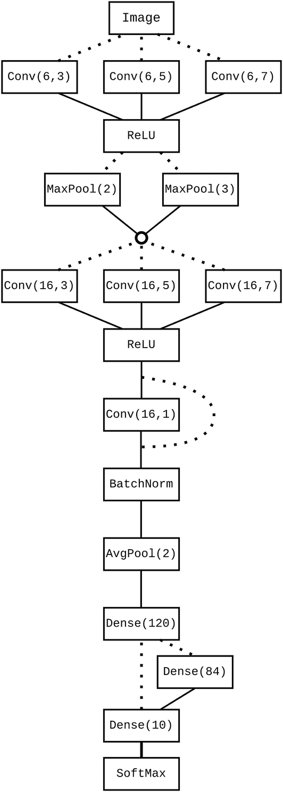

图 4-24

所有可能的架构集合

我们可以看到每个变异器都向基础模型添加了方差。

### Trial

NAS Trial 与 HPO 环境中的 Trial 含义相同。它初始化模型，训练它，测试它，并返回模型准确率。只有一个新特性：您必须使用`nn.algorithms.nas.tensorflow.classic_nas`包中的`get_and_apply_next_architecture`方法来初始化模型。列表 4-15 提供了 NAS Trial。

（完整代码在相应的文件中提供：*ch4/classic/trial.py*。）

```py
net = LeNetModelSpace()
get_and_apply_next_architecture(net)
train_model(net, dataset_train, optimizer, epochs)
acc = test_model(net, dataset_test)
nni.report_final_result(acc.numpy())
Listing 4-15
NAS Trial.
```

### 搜索空间

在定义了 Trial 脚本之后，您应该使用以下命令手动生成搜索空间 JSON 文件：

```py
$ nnictl ss_gen --trial_command="python3 trial.py" --trial_dir=ch4/classic --file=ch4/classic/search_space.json
```

上一条命令生成了如列表 4-16 所示的文件。

```py
{
"conv1": {
"_type": "layer_choice",
"_value": ["0", "1", "2"]
},
"conv2": {
"_type": "layer_choice",
"_value": ["0", "1", "2"]
},
"fc2": {
"_type": "layer_choice",
"_value": ["0", "1"]
},
"pool": {
"_type": "layer_choice",
"_value": ["0", "1"]
},
"skip_connect": {
"_type": "input_choice",
"_value": {
"candidates": ["",""],
"n_chosen": 1
}
}
}
Listing 4-16
NAS search space
```

如您所见，NNI Classic NAS 实现与 HPO 实现非常接近。搜索空间文件是所有可能的神经网络架构选择的列表。

### 搜索策略

经典 NAS 支持以下搜索策略：

+   `随机搜索`

+   `PPO Tuner`：基于近端策略优化算法的强化学习调优器

关于这些调优器的更多信息，您可以参考“使用 Retiarii 进行神经架构搜索”部分下的“探索策略”子部分。

### 实验

剩下的最后一件事是定义实验配置。实验配置在列表 4-17 中定义。

```py
experimentName: example_mnist
trialConcurrency: 1
maxTrialNum: 100
trainingServicePlatform: local
searchSpacePath: search_space.json
tuner:
builtinTunerName: PPOTuner
classArgs:
optimize_mode: maximize
trial:
command: python3 trial.py
Listing 4-17
NAS configuration file
```

现在，我们可以使用以下命令开始实验：

```py
$ nnictl create --config=ch4/classic/config.yml
```

注意

在 Intel Core i7 和 CUDA（GeForce GTX 1050）上持续约 2 小时

实验在测试数据集上返回了最佳准确率 **0.9923**，以下参数设置：

```py
conv1: 2
pool: 0
conv2: 0
fc2: 0
skip_connect: 0
```

上述参数可以解释为以下神经网络架构：

```py
self.conv1 = LayerChoice([
Conv2D(6, 3, ...),
Conv2D(6, 5, ...),
Conv2D(6, 7, ...), # <- 2
], key = 'conv1')
self.pool = LayerChoice([
MaxPool2D(2), # <- 0
MaxPool2D(3)],
key = 'pool'
)
self.conv2 = LayerChoice([
Conv2D(16, 3, ...), # <- 0
Conv2D(16, 5, ...),
Conv2D(16, 7, ...),
], key = 'conv2')
self.fc2 = LayerChoice([
Dense(84, activation = 'relu'), # <- 0
Layer()
], key = 'fc2')
x0 = self.skip_connect([
x0, # <- 0
None]
)
```

最佳神经网络架构如图 4-25 所示。

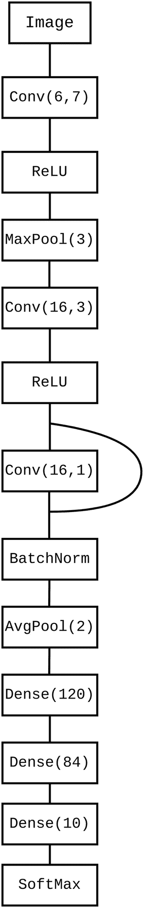

图 4-25

最佳神经网络架构

经典 NAS 与 HPO 方法没有太大区别。实际上，我们可以用层和设计超参数搜索构建相同的实验。我们在第二章的“从 LeNet 到 AlexNet”部分中做了一些类似的技巧。神经架构搜索最近取得了巨大进展，而经典 NAS 无法支持新的研究想法。无论如何，您仍然可以使用经典 NAS 并通过搜索新解决方案获得有意义的结果。

### 摘要

使用 Retiarii 和经典方法的多次试验神经架构搜索提供了搜索鲁棒神经架构的清晰和优雅的解决方案。使用多次试验神经架构搜索可以取得许多有意义的成果。但这种方法有一个非常严重的缺点，那就是它花费的时间太多。确实，复杂的模型和大量的数据集需要太多的时间来训练，而模型空间可能包含数百万个模型样本。即使是最高级的探索策略，也可能需要太多时间才能收敛到某些次优的神经架构。但时间问题有一个解决方案，称为一次性神经架构搜索（One-shot NAS），我们将在下一章中探讨这种方法。
