# 5. 一次性神经架构搜索

在上一章中，我们探讨了多试验神经架构搜索，这是一种非常有前途的方法。读者可能会想知道为什么多试验 NAS 被称为这个名字。是否有其他非多试验 NAS 方法，以及是否真的有可能以某种方式在不尝试的情况下搜索最优的神经网络架构？看起来很明显，找到最优解的唯一方法是在搜索空间的不同元素中尝试。实际上，事实并非如此。有一种方法可以通过训练一些超网络（Supernet）来找到最佳架构，这种方法被称为**一次性神经架构搜索**。正如其名称“一次性”所暗示的，这种方法只涉及一次尝试或射击。当然，这次“射击”比单个神经网络的训练要长得多，但无论如何，它节省了很多时间。

在本章中，我们将研究一次性神经架构搜索（One-shot NAS）是什么以及如何为这种方法设计架构。我们将探讨两种流行的一次性算法：**通过参数共享的效率神经架构搜索（ENAS**）和**可微架构搜索（DARTS**）。当然，我们将应用这些算法来解决实际问题。

`NNI 2.7`版本（本书中使用）为 TensorFlow 框架实现了 ENAS 算法，但没有为 DARTS 算法实现。无论如何，ENAS 算法是最受欢迎和最有效的单次 NAS 实现之一，所以 TensorFlow 用户不应该太过沮丧。

## 一次性神经架构搜索实践

自动化神经网络架构设计的兴趣正在增长，但经典的多次试验 NAS 方法计算成本太高，需要从头开始训练成千上万的不同架构。遗憾的是，这一事实使得多次试验 NAS 在实践上不可行。实际上，一些多次试验实验在最现代的计算资源上可能需要数周或数月。为了解决多次试验架构搜索的这种弱点，已经提出了一种新的一次性 NAS 方法。

介绍一次性 NAS 的最佳方式是提供一个例子。假设我们正在寻找 MNIST 问题的最优架构。我们拥有图 5-1 所示的模型空间。

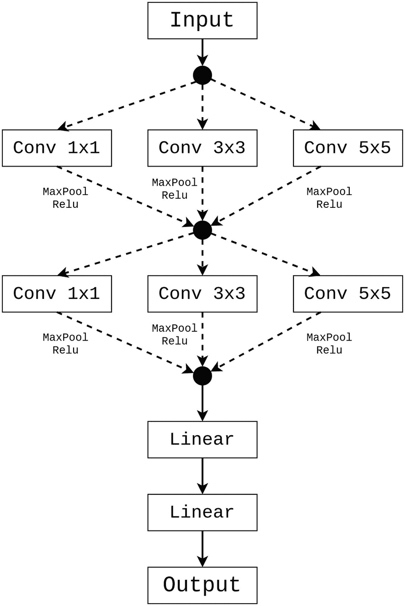

图 5-1

MNIST 问题的模型空间

图 5-1 显示了具有两个可变层的模型空间。每个可变层有以下选择：`Conv 1×1`、`Conv 3×3`和`Conv 5×5`。在经典的多次射击场景中，我们会为每个参数组合执行 3×3=9 次试验，并选择最佳的一个。而一次性 NAS 方法遵循另一种技术，我们创建一个*超网络*，该网络合并或减少每个可变层的输出，并仅训练得到的神经网络一次。图 5-2 展示了这个超网络。

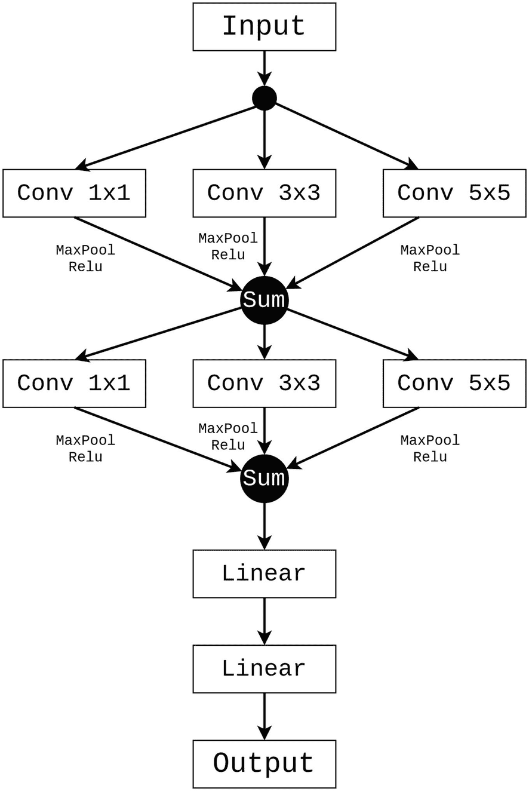

图 5-2

MNIST 问题的 Supernet

在训练完 Supernet 之后，我们通过激活每一组层并清零其他层来评估它。图 5-3 说明了这个概念。

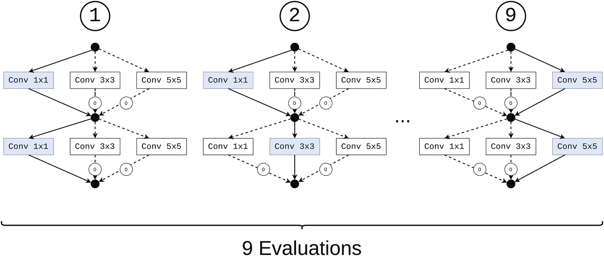

图 5-3

MNIST 问题的 Supernet

最后，我们选择了表现出最佳性能的组合。这个组合代表了 One-shot NAS 算法的结果。例如，如果一个组合（`Conv 5×5`, `Conv 5×5`）显示了最佳的准确率，那么我们的目标网络设计就是`Conv 5×5` → `Conv 5×5` → `Linear` → `Linear`。

让我们总结一下在 One-shot NAS 算法中我们确切地做了什么：

+   我们从模型空间创建了一个单一的*Supernet*。

+   我们*训练*了它。

+   我们*评估*了它九次，依次激活不同的层。

+   我们为这个问题选择了*最佳*的神经网络设计。

我们在这里的主要好处是，我们只训练了一次 Supernet，而不是训练九个候选网络中的每一个！这大大加快了整个神经架构搜索过程，因为网络训练是 NAS 过程中最耗时的部分。

读者可能会有一个合理的问题：“等等！我们训练了一个单个的 Supernet 网络。所有候选层都学会了协同工作！但后来我们决定将其拆分成不同的部分，保留相同的权重。这是胡说八道！”我同意。这是一个非常反直觉的概念。确实，所有层都是一起训练的，并且它们学会了相互补充和帮助对方解决问题。当然，你不能只是从神经网络中扔掉一些层来寻找最佳架构。但 One-shot NAS 最神奇的地方在于你可以这样做！对于这种方法，还没有足够的数学基础，但在实践中它是有效的。让我们通过我们之前考虑的例子来在实践中实现这种方法。在本节中，我们将不使用 NNI 工具包。在这里，我们的目标是获得对 One-shot NAS 方法的直观理解。

首先，我们将创建一个普通的 Multi-trial NAS。脚本 5-1（TensorFlow 实现）和脚本 5-2（PyTorch 实现）实现了图 5-1 中显示的模型。

我们导入必要的模块：

```py
from tensorflow.keras import Model
from tensorflow.keras.layers import Dense, Flatten, MaxPool2D
from ch5.naive_one_shot_nas.tf.tf_ops import create_conv
Listing 5-1
TensorFlow implementation. Model Space. ch5/naive_one_shot_nas/tf/tf_lenet_multi_model.py
```

以下模型接受两个参数，`kernel1`和`kernel2`，它们定义了`conv1`和`conv2`层：

```py
class TfLeNetMultiTrialModel(Model):
def __init__(self, kernel1, kernel2):
super().__init__()
self.conv1 = create_conv(kernel1, filter = 16)
self.pool1 = MaxPool2D(pool_size = 2)
self.conv2 = create_conv(kernel2, filter = 32)
self.pool2 = MaxPool2D(pool_size = 2)
self.flatten = Flatten()
self.fc1 = Dense(128, 'relu')
self.fc2 = Dense(10, 'softmax')
def call(self, x, **kwargs):
x = self.conv1(x)
x = self.pool1(x)
x = self.conv2(x)
x = self.pool2(x)
x = self.flatten(x)
x = self.fc1(x)
return self.fc2(x)
```

我们导入必要的模块：

```py
import torch
import torch.nn as nn
import torch.nn.functional as F
from ch5.naive_one_shot_nas.pt.pt_ops import create_conv
Listing 5-2
PyTorch implementation. Model Space. ch5/naive_one_shot_nas/pt/pt_lenet_multi_model.py
```

以下模型接受两个参数，`kernel1`和`kernel2`，它们定义了`conv1`和`conv2`层：

```py
class PtLeNetMultiTrialModel(nn.Module):
def __init__(self, kernel1, kernel2):
super(PtLeNetMultiTrialModel, self).__init__()
self.conv1 = create_conv(kernel1, in_channels = 1, out_channels = 16)
self.conv2 = create_conv(kernel2, in_channels = 16, out_channels = 32)
self.flat = nn.Flatten()
self.fc1 = nn.Linear(1568, 128)
self.fc2 = nn.Linear(128, 10)
def forward(self, x):
x = torch.relu(self.conv1(x))
x = F.max_pool2d(x, 2, 2)
x = torch.relu(self.conv2(x))
x = F.max_pool2d(x, 2, 2)
x = self.flat(x)
x = torch.relu(self.fc1(x))
x = self.fc2(x)
return F.log_softmax(x, dim = 1)
```

现在，让我们执行多试验 NAS，通过脚本 5-3（TensorFlow 实现）和脚本 5-4（PyTorch 实现）迭代各种`kernel_size`参数（`kernel1: [1, 3, 5], kernel2: [1, 3, 5]`）。

我们导入必要的模块：

```py
from ch5.naive_one_shot_nas.tf.tf_lenet_multi_model import TfLeNetMultiTrialModel
from ch5.naive_one_shot_nas.tf.tf_train import train, test
Listing 5-3
TensorFlow implementation. Multi-trial NAS. ch5/naive_one_shot_nas/tf/ms_search.py
```

定义搜索空间：

```py
kernel1_choices = [1, 3, 5]
kernel2_choices = [1, 3, 5]
results = {}
```

执行多试验搜索：

```py
for k1 in kernel1_choices:
for k2 in kernel2_choices:
# Trial
model = TfLeNetMultiTrialModel(k1, k2)
train(model)
accuracy = test(model)
results[(k1, k2)] = accuracy
```

显示结果：

```py
print('=======')
print('Results:')
for k, v in results.items():
print(f'Conv1 {k[0]}x{k[0]}, Conv2: {k[1]}x{k[1]} : {v}')
```

我们导入必要的模块：

```py
from ch5.naive_one_shot_nas.pt.pt_lenet_multi_model import PtLeNetMultiTrialModel
from ch5.naive_one_shot_nas.pt.pt_train import train_model, test_model
Listing 5-4
PyTorch implementation. Multi-trial NAS. ch5/naive_one_shot_nas/pt/ms_search.py
```

定义搜索空间：

```py
kernel1_choices = [1, 3, 5]
kernel2_choices = [1, 3, 5]
results = {}
```

执行多试验搜索：

```py
for k1 in kernel1_choices:
for k2 in kernel2_choices:
# Trial
model = PtLeNetMultiTrialModel(k1, k2)
train_model(model)
accuracy = test_model(model)
results[(k1, k2)] = accuracy
```

定义搜索空间：

```py
print('=======')
print('Results:')
for k, v in results.items():
print(f'Conv1 {k[0]}x{k[0]}, Conv2: {k[1]}x{k[1]} : {v}')
```

我们执行的多次试验 NAS 的结果列在表 5-1 中。

表 5-1

多次试验 NAS 结果

| Trial | Conv1 | Conv2 | Accuracy |
| --- | --- | --- | --- |
| `1` | `Conv1×1` | `Conv1×1` | `0.9446` |
| `2` | `Conv1×1` | `Conv3×3` | `0.9849` |
| `3` | `Conv1×1` | `Conv5×5` | `0.9864` |
| `4` | `Conv3×3` | `Conv3×3` | `0.9851` |
| `5` | `Conv3×3` | `Conv3×3` | `0.9881` |
| `6` | `Conv3×3` | `Conv5×5` | `0.9909` |
| `7` | `Conv5×5` | `Conv1×1` | `0.9872` |
| `8` | `Conv5×5` | `Conv3×3` | `0.9901` |
| `9` | `Conv5×5` | `Conv5×5` | `0.9917` |

根据 5-1 表，最佳候选是 (`Conv5×5, Conv5×5`)。嗯，我们尝试了每个神经网络设计候选，并找到了最适合 MNIST 问题的那个。当然，我们之前实现的多次试验 NAS 很简单，但这就是所有多次试验方法的一般行为。

但现在，让我们尝试使用 One-shot NAS 方法得到相同的结果！首先，我们创建图 5-2 中描述的 Supernet 模型（在列表 5-5 [TensorFlow 实现] 和列表 5-6 [PyTorch 实现] 中）。

我们导入必要的模块：

```py
from tensorflow.keras import Model
from tensorflow.keras.layers import Dense, Flatten, MaxPool2D
from ch5.naive_one_shot_nas.tf.tf_ops import create_conv
Listing 5-5
TensorFlow implementation. Supernet. ch5/naive_one_shot_nas/tf/tf_lenet_supernet.py
```

`TfLeNetNaiveSupernet` 实现了图 5-2 中所示的 Supernet：

```py
class TfLeNetNaiveSupernet(Model):
def __init__(self):
super().__init__()
```

我们为 `conv1` 和 `conv2` 层定义每个候选：

```py
self.conv1_1 = create_conv(1, 16)
self.conv1_3 = create_conv(3, 16)
self.conv1_5 = create_conv(5, 16)
self.conv2_1 = create_conv(1, 32)
self.conv2_3 = create_conv(3, 32)
self.conv2_5 = create_conv(5, 32)
```

接下来是其他 Supernet 层：

```py
self.pool1 = MaxPool2D(pool_size = 2)
self.pool2 = MaxPool2D(pool_size = 2)
self.flatten = Flatten()
self.fc1 = Dense(128, 'relu')
self.fc2 = Dense(10, 'softmax')
```

`call` 方法接受 `mask` 参数，该参数在 `sum` 合并操作中激活候选层。`mask` 参数在训练模式下未传递，所有候选层都被相加：

```py
x = 1×conv1_1(x) + 1×conv1_3(x) + 1×conv1_5(x)
x = 1×conv2_1(x) + 1×conv2_3(x) + 1×conv2_5(x).
```

但在评估模式下，我们传递 `mask` 参数并仅激活特定层：

```py
x = 0×conv1_1(x) + 1×conv1_3(x) + 0×conv1_5(x)
x = 0×conv2_1(x) + 0×conv2_3(x) + 1×conv2_5(x):
def call(self, x, mask = None):
# Sum all in training mode
if mask is None:
mask = [[1, 1, 1], [1, 1, 1]]
x = mask[0][0] * self.conv1_1(x) +\
mask[0][1] * self.conv1_3(x) +\
mask[0][2] * self.conv1_5(x)
x = self.pool1(x)
x = mask[1][0] * self.conv2_1(x) +\
mask[1][1] * self.conv2_3(x) +\
mask[1][2] * self.conv2_5(x)
x = self.pool2(x)
x = self.flatten(x)
x = self.fc1(x)
return self.fc2(x)
```

我们导入必要的模块：

```py
import torch
import torch.nn as nn
import torch.nn.functional as F
from ch5.naive_one_shot_nas.pt.pt_ops import create_conv
Listing 5-6
PyTorch implementation. Supernet. ch5/naive_one_shot_nas/pt/pt_lenet_supernet.py
```

`PtLeNetNaiveSupernet` 实现了图 5-2 中所示的 Supernet：

```py
class PtLeNetNaiveSupernet (nn.Module):
def __init__(self):
super(PtLeNetNaiveSupernet, self).__init__()
```

我们为 `conv1` 和 `conv2` 层定义每个候选：

```py
self.conv1_1 = create_conv(1, 1, 16)
self.conv1_3 = create_conv(3, 1, 16)
self.conv1_5 = create_conv(5, 1, 16)
self.conv2_1 = create_conv(1, 16, 32)
self.conv2_3 = create_conv(3, 16, 32)
self.conv2_5 = create_conv(5, 16, 32)
```

接下来是其他 Supernet 层：

```py
self.flat = nn.Flatten()
self.fc1 = nn.Linear(1568, 128)
self.fc2 = nn.Linear(128, 10)
```

`forward` 方法接受 `mask` 参数，该参数在 `sum` 合并操作中激活候选层。`mask` 参数在训练模式下未传递，所有候选层都被相加：

```py
x = 1×conv1_1(x) + 1×conv1_3(x) + 1×conv1_5(x)
x = 1×conv2_1(x) + 1×conv2_3(x) + 1×conv2_5(x).
```

但在评估模式下，我们传递 `mask` 参数并仅激活特定层：

```py
x = 0×conv1_1(x) + 1×conv1_3(x) + 0×conv1_5(x)
x = 0×conv2_1(x) + 0×conv2_3(x) + 1×conv2_5(x):
def forward(self, x, mask = None):
# Sum all in training mode
if mask is None:
mask = [[1, 1, 1], [1, 1, 1]]
x = mask[0][0] * self.conv1_1(x) +\
mask[0][1] * self.conv1_3(x) +\
mask[0][2] * self.conv1_5(x)
x = torch.relu(x)
x = F.max_pool2d(x, 2, 2)
x = mask[1][0] * self.conv2_1(x) +\
mask[1][1] * self.conv2_3(x) +\
mask[1][2] * self.conv2_5(x)
x = torch.relu(x)
x = F.max_pool2d(x, 2, 2)
x = self.flat(x)
x = torch.relu(self.fc1(x))
x = self.fc2(x)
return F.log_softmax(x, dim = 1)
```

接下来，我们训练 Supernet 并评估列表 5-7（TensorFlow 实现）和列表 5-8（PyTorch 实现）中不同的候选层组合。

我们导入必要的模块：

```py
import tensorflow as tf
from sklearn.metrics import accuracy_score
from ch5.datasets import mnist_dataset
from ch5.naive_one_shot_nas.tf.tf_lenet_supernet import TfLeNetNaiveSupernet
from ch5.naive_one_shot_nas.tf.tf_train import train
Listing 5-7
TensorFlow implementation. One-shot NAS. ch5/naive_one_shot_nas/tf/os_search.py
```

初始化 Supernet：

```py
model = TfLeNetNaiveSupernet()
```

训练 Supernet：

```py
train(model)
```

加载测试数据集：

```py
_, (x, y) = mnist_dataset()
```

评估激活每个候选的 Supernet：

```py
kernel1_choices = [1, 3, 5]
kernel2_choices = [1, 3, 5]
results = {}
for m1 in range(0, len(kernel1_choices)):
for m2 in range(0, len(kernel2_choices)):
# activation mask
mask = [[0, 0, 0], [0, 0, 0]]
# activating conv1 and conv2 layers
mask[0][m1] = 1
mask[1][m2] = 1
# calculating accuracy
output = model(x, mask = mask)
predict = tf.argmax(output, axis = 1)
accuracy = round(accuracy_score(predict, y), 4)
results[(kernel1_choices[m1], kernel2_choices[m2])] = accuracy
```

显示结果：

```py
print('=======')
print('Results:')
for k, v in results.items():
print(f'Conv1 {k[0]}x{k[0]}, Conv2: {k[1]}x{k[1]} : {v}')
```

我们导入必要的模块：

```py
import torch
from sklearn.metrics import accuracy_score
from ch5.datasets import mnist_dataset
from ch5.naive_one_shot_nas.pt.pt_lenet_supernet import PtLeNetNaiveSupernet
from ch5.naive_one_shot_nas.pt.pt_train import train_model
Listing 5-8
PyTorch implementation. One-shot NAS. ch5/naive_one_shot_nas/pt/os_search.py
```

初始化 Supernet：

```py
model = PtLeNetNaiveSupernet()
```

训练 Supernet：

```py
train_model(model)
```

加载测试数据集：

```py
_, (x, y) = mnist_dataset()
x = torch.from_numpy(x).float()
y = torch.from_numpy(y).long()
x = torch.permute(x, (0, 3, 1, 2))
```

评估激活每个候选的 Supernet：

```py
model.eval()
kernel1_choices = [1, 3, 5]
kernel2_choices = [1, 3, 5]
results = {}
for m1 in range(0, len(kernel1_choices)):
for m2 in range(0, len(kernel2_choices)):
# activation mask
mask = [[0, 0, 0], [0, 0, 0]]
# activating conv1 and conv2 layers
mask[0][m1] = 1
mask[1][m2] = 1
# calculating accuracy
output = model(x, mask)
predict = output.argmax(dim = 1, keepdim = True)
accuracy = round(accuracy_score(predict, y), 4)
results[(kernel1_choices[m1], kernel2_choices[m2])] = accuracy
```

显示结果：

```py
print('=======')
print('Results:')
for k, v in results.items():
print(f'Conv1 {k[0]}x{k[0]}, Conv2: {k[1]}x{k[1]} : {v}')
```

One-shot NAS 的结果列在表 5-2 中。

表 5-2

One-shot NAS 结果

| Trial | Conv1 | Conv2 | Accuracy |
| --- | --- | --- | --- |
| `1` | `Conv1×1` | `Conv1×1` | `0.2343` |
| `2` | `Conv1×1` | `Conv3×3` | `0.1789` |
| `3` | `Conv1×1` | `Conv5×5` | `0.2127` |
| `4` | `Conv3×3` | `Conv3×3` | `0.2755` |
| `5` | `Conv3×3` | `Conv3×3` | `0.8515` |
| `6` | `Conv3×3` | `Conv5×5` | `0.8786` |
| `7` | `Conv5×5` | `Conv1×1` | `0.3486` |
| `8` | `Conv5×5` | `Conv3×3` | `0.8882` |
| `9` | `Conv5×5` | `Conv5×5` | `0.9001` |

One-shot NAS 找到的最佳神经网络架构是 (`Conv 5×5, Conv 5×5`)，这与 Multi-trial NAS 的结果完全相同。令人难以置信，不是吗？我们在更短的时间内找到了相同的结果！

注

表 5-2 中呈现的结果仅用于对各种架构组合进行排序，以选择最佳方案。这些结果并不表征相应组合的准确性。One-shot 模型通常仅用于对模型空间中的架构进行排序。搜索完成后，最佳性能的架构将从头开始重新训练。

直观地说，One-shot NAS 方法可以描述如下：*在 Supernet 训练过程中，表现最佳的候选层在 Supernet 神经网络的 Data Flow 图中扮演着更加重要的角色*。这一事实使得在评估过程中通过禁用其他层来找到这些候选层成为可能。图 5-4 展示了这一概念。

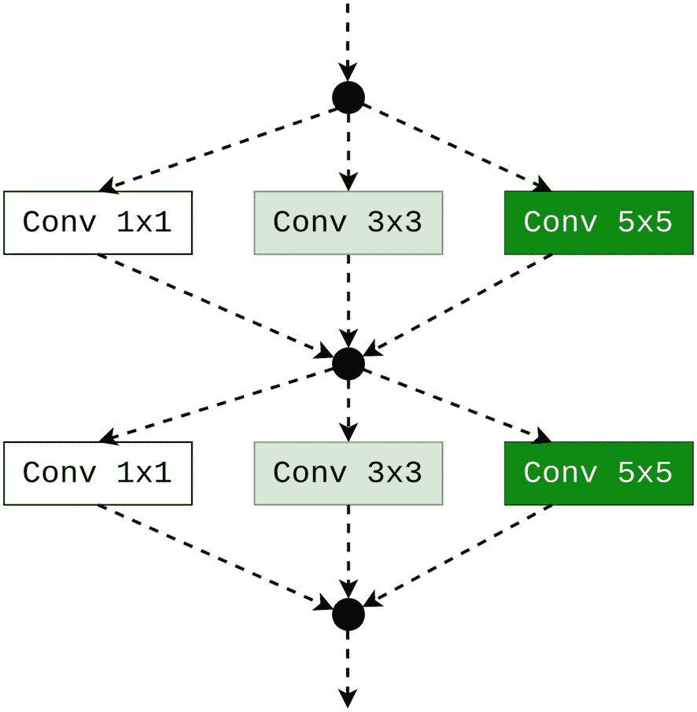

图 5-4

Supernet 中的不同层重要性

由于我们对 One-shot NAS 方法有了直观的了解，我们可以开始使用 NNI 框架来实现它。

## Supernet 架构

如前节所述，One-shot NAS 中的一个主要概念是**Supernet**。Supernet 是一个包含定义的模型空间中所有各种神经网络架构的单个神经网络。Supernet 根据 One-shot NAS 技术进行一次训练，然后选择最优子网。在 Multi-trial NAS 中，每个数据流图都是单独尝试的。但 One-shot NAS 基于模型空间中所有可能的数据流图创建单个 Supernet。

NNI 使用 `LayerChoice` 和 `InputChoice` 操作为 One-shot NAS 创建模型空间。`LayerChoice` 候选者形成一个特殊的块在 Supernet 中。每个 `LayerChoice` 候选者转换输入张量，然后根据特定的 One-shot NAS 算法对其输出张量进行降维。降维操作可以是 `sum`、`mean` 或任何其他合并张量的操作。`InputChoice` 候选者张量在 Supernet 中的降维方式与 `LayerChoice` 候选者相同。图 5-5 展示了使用 `LayerChoice` 和 `InputChoice` 操作构建的模型空间。

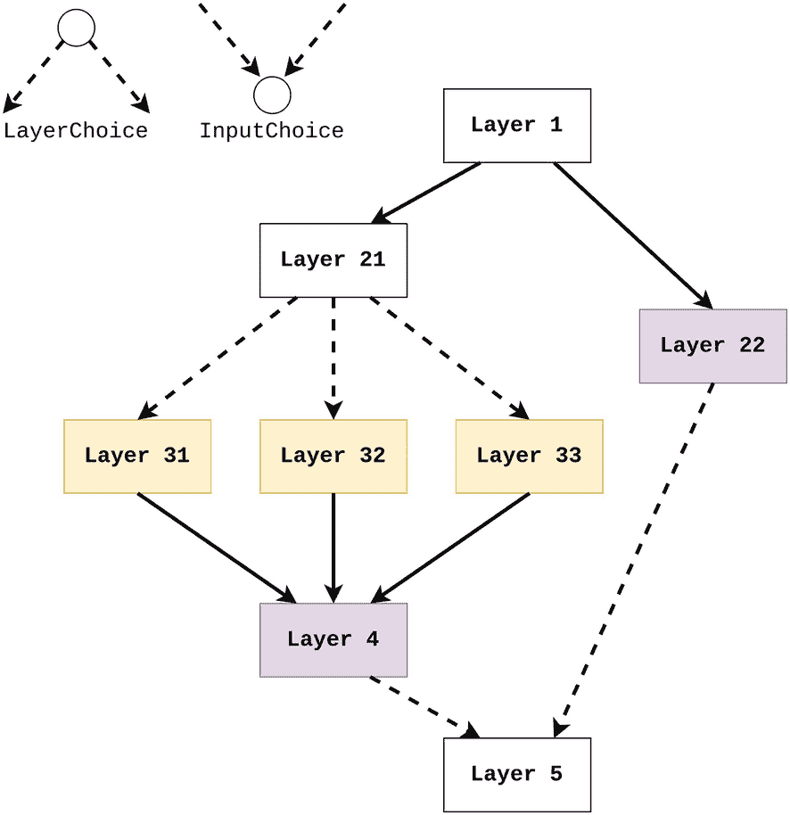

图 5-5

模型空间

图 5-5 中展示的模型空间生成具有降维操作的 Supernet。图 5-6 展示了以 `sum` 作为降维操作的 Supernet。

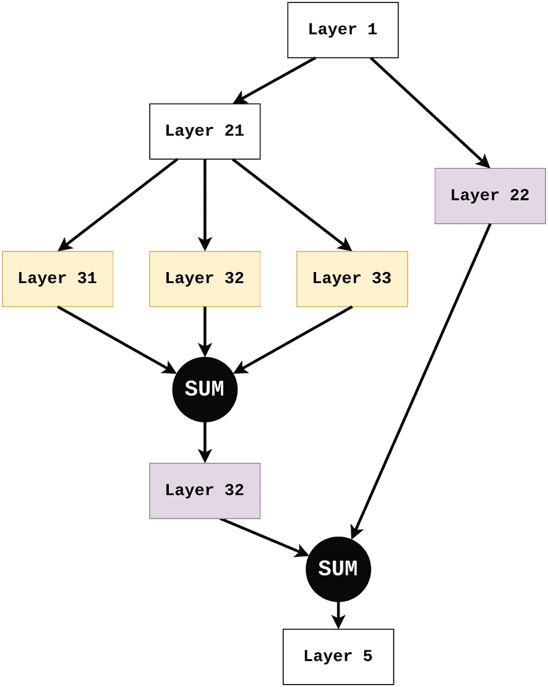

图 5-6

One-shot NAS Supernet

根据特定的 One-shot NAS 算法训练超网。训练完成后，每个子网将被评估，准确率最高的子网将形成目标神经网络架构。图 5-7 展示了特定子网的评估。

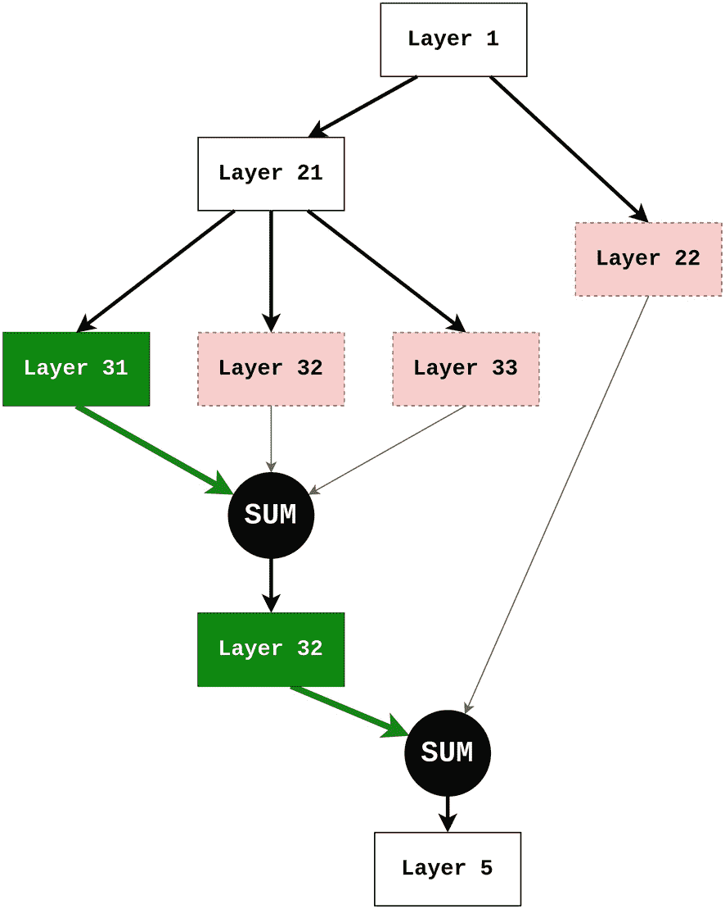

图 5-7

子网评估

One-shot NAS 对 `LayerChoice` 和 `InputChoice` 候选者设定了严格的限制。每个候选者都必须返回相同大小的张量。否则，将无法实现归约操作。在上一节中，`conv1` 层的候选者返回了 16×28×28 的张量，而 `conv2` 层的候选者返回了 32×14×14 的张量。图 5-8 展示了这一事实。

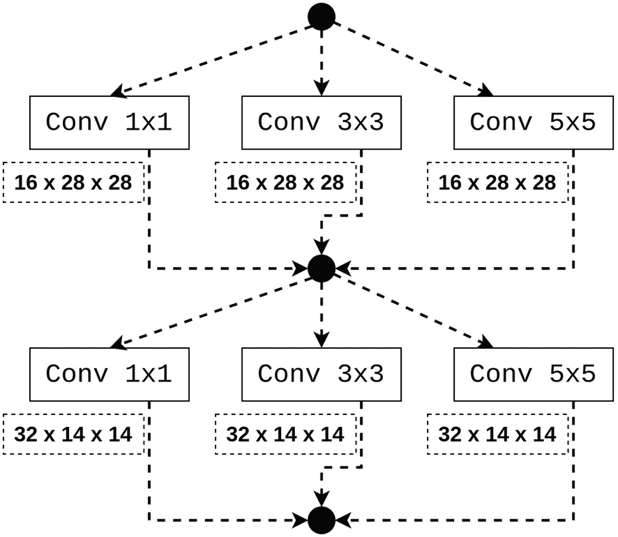

图 5-8

相同大小的张量输出

在多试验 NAS 中，由于 TensorFlow 和 PyTorch 框架允许层参数根据输入张量进行计算，因此不存在这种限制；因此，`LayerChoice` 候选者可以返回各种大小的张量。在 One-shot NAS 的情况下，我们必须确保候选者返回相同大小的张量。否则，NAS 算法将因错误而失败。

让我们为 One-shot NAS 创建第一个模型空间。它将是一个“*Hello World*”模型，我们将用它来测试下一节中的 One-shot NAS 算法。我们将使用图 5-9 中展示的 LeNet 架构变体来定义 One-shot 搜索的模型空间。

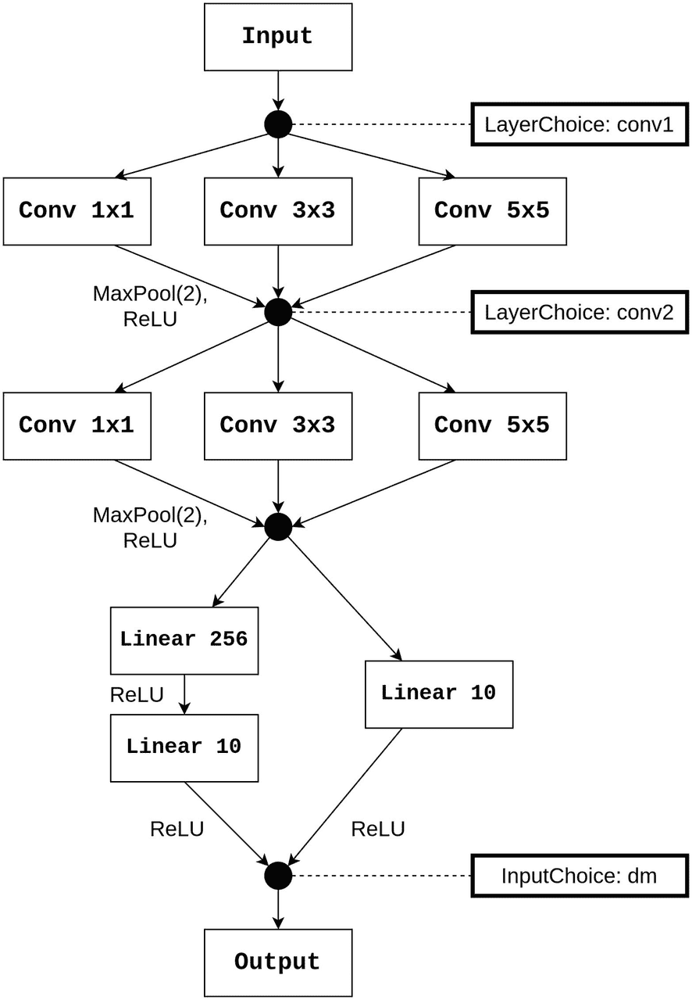

图 5-9

LeNet One-shot 模型空间

图 5-9 中描述的模型空间的 TensorFlow NNI �现在列表 5-9 中提供：

LayerChoice 和 InputChoice 方法实现在 nni.nas.tensorflow.mutables 包中：

```py
from nni.nas.tensorflow.mutables import InputChoice, LayerChoice
Listing 5-9
TensorFlow implementation. One-shot LeNet NAS. ch5/model/lenet/tf_lenet.py
```

导入 `tensorflow.keras` 模块：

```py
from tensorflow.keras import Model
from tensorflow.keras.layers import Conv2D, Dense, Flatten, MaxPool2D
```

定义创建卷积层的辅助函数：

```py
def create_conv(kernel, filters):
return Conv2D(
filters = filters,
kernel_size = kernel,
activation = 'relu',
padding = 'same'
)
class TfLeNetSupernet(Model):
def __init__(self):
super().__init__()
```

为 `conv1` 和 `conv2` 层设置 `LayerChoices`：

```py
self.conv1 = LayerChoice([
create_conv(kernel = 1, filters = 16),  # 0
create_conv(kernel = 3, filters = 16),  # 1
create_conv(kernel = 5, filters = 16)  # 2
], key = 'conv1')
self.conv2 = LayerChoice([
create_conv(kernel = 1, filters = 32),  # 0
create_conv(kernel = 3, filters = 32),  # 1
create_conv(kernel = 5, filters = 32)  # 2
], key = 'conv2')
self.pool = MaxPool2D(2)
self.flat = Flatten()
```

为线性层设置 `InputChoice`：

```py
self.dm = InputChoice(n_candidates = 2, n_chosen = 1, key = 'dm')
self.fc11 = Dense(256, activation = 'relu')
self.fc12 = Dense(10, activation = 'softmax')
self.fc2 = Dense(10, activation = 'softmax')
```

定义 `call` 方法：

```py
def call(self, x):
x = self.conv1(x)
x = self.pool(x)
x = self.conv2(x)
x = self.pool(x)
x = self.flat(x)
# branch 1
x1 = self.fc12(self.fc11(x))
# branch 2
x2 = self.fc2(x)
# Choosing one of the branches
x = self.dm([
x1,  # 0
x2  # 1
])
return x
```

图 5-9 中描述的模型空间的 PyTorch NNI 实现在列表 5-10 中提供：

LayerChoice 和 InputChoice 方法实现在 nni.retiarii.nn.pytorch 包中：

```py
from nni.retiarii.nn.pytorch import LayerChoice, InputChoice
Listing 5-10
PyTorch implementation. One-shot LeNet NAS. ch5/model/lenet/pt_lenet.py
```

导入其他模块：

```py
from typing import OrderedDict
import torch.nn as nn
import torch.nn.functional as F
```

定义创建卷积层的辅助函数：

```py
def create_conv(kernel, in_ch, out_ch):
return nn.Conv2d(
in_channels = in_ch,
out_channels = out_ch,
kernel_size = kernel,
padding = int((kernel - 1) / 2)
)
class PtLeNetSupernet(nn.Module):
def __init__(self, input_ts = 32):
super(PtLeNetSupernet, self).__init__()
```

为 `conv1` 和 `conv2` 层设置 `LayerChoices`：

```py
self.conv1 = LayerChoice(OrderedDict(
[
('conv1x1->16', create_conv(1, 1, 16)),  # 0
('conv3x3->16', create_conv(3, 1, 16)),  # 1
('conv5x5->16', create_conv(5, 1, 16)),  # 2
]
), label = 'conv1')
self.conv2 = LayerChoice(OrderedDict(
[
('conv1x1->32', create_conv(1, 16, 32)),  # 0
('conv3x3->32', create_conv(3, 16, 32)),  # 1
('conv5x5->32', create_conv(5, 16, 32)),  # 2
]
), label = 'conv2')
self.act = nn.ReLU()
self.flat = nn.Flatten()
```

为线性层设置 `InputChoice`：

```py
self.dm = InputChoice(n_candidates = 2, n_chosen = 1, label = 'dm')
self.fc11 = nn.Linear(input_ts * 8 * 8, 256)
self.fc12 = nn.Linear(256, 10)
self.fc2 = nn.Linear(input_ts * 8 * 8, 10)
```

定义 `forward` 方法：

```py
def forward(self, x):
x = self.act(self.conv1(x))
x = F.max_pool2d(x, 2, 2)
# x.shape = (16, 16, 16)
x = self.act(self.conv2(x))
x = F.max_pool2d(x, 2, 2)
# x.shape = (32, 8, 8)
x = self.flat(x)
# branch 1
x1 = self.act(self.fc11(x))
x1 = self.act(self.fc12(x1))
# branch 2
x2 = self.act(self.fc2(x))
# Choosing one of the branches
x = self.dm([
x1,  # 0
x2  # 1
])
return F.log_softmax(x, dim = 1)
```

由于我们使用 NNI 定义了 One-shot 模型空间，我们可以继续实现高级的 One-shot 算法。

## One-Shot 算法

目前，One-shot NAS 是一个新兴领域，发展迅速。目前正在发明许多实现 One-shot 概念的算法。本节将研究两种最受欢迎的 One-shot 算法：高效神经网络架构搜索 (ENAS) 和可微架构搜索 (DARTS)。

## 高效神经网络架构搜索 (ENAS)

高效神经架构搜索（ENAS）是一种快速且经济的自动模型设计方法。在 ENAS 中，控制器通过在大型超网络中搜索最佳子网络来发现神经网络架构。控制器使用策略梯度进行训练，以选择一个子网络，该子网络在验证集上最大化预期奖励。同时，对应于所选子网络的模型被训练以最小化损失函数。在子模型之间共享参数使得 ENAS 能够提供强大的经验性能。它使用的 GPU 小时数比经典的多试验 NAS 方法少得多。

原始论文“通过参数共享进行高效的神经架构搜索”（[`https://arxiv.org/pdf/1802.03268.pdf`](https://arxiv.org/pdf/1802.03268.pdf)）有很多公式，可能过于复杂。让我们以更实际的方式研究这种方法的思想。

ENAS 中的一个关键概念是强化学习控制器或 RL 控制器或简称控制器。RL 控制器包含一个神经网络 *θ*，该神经网络学习如何从超网络中提取最有效的子网络。RL 控制器的主要任务是找到超网络中的最佳子网络，并且它根据强化学习算法进行训练。控制器通过定义一个二进制掩码来创建子网络，其中 1 激活层，0 禁用它。图 5-10 展示了 RL 控制器如何使用二进制掩码从超网络中选择子网络。

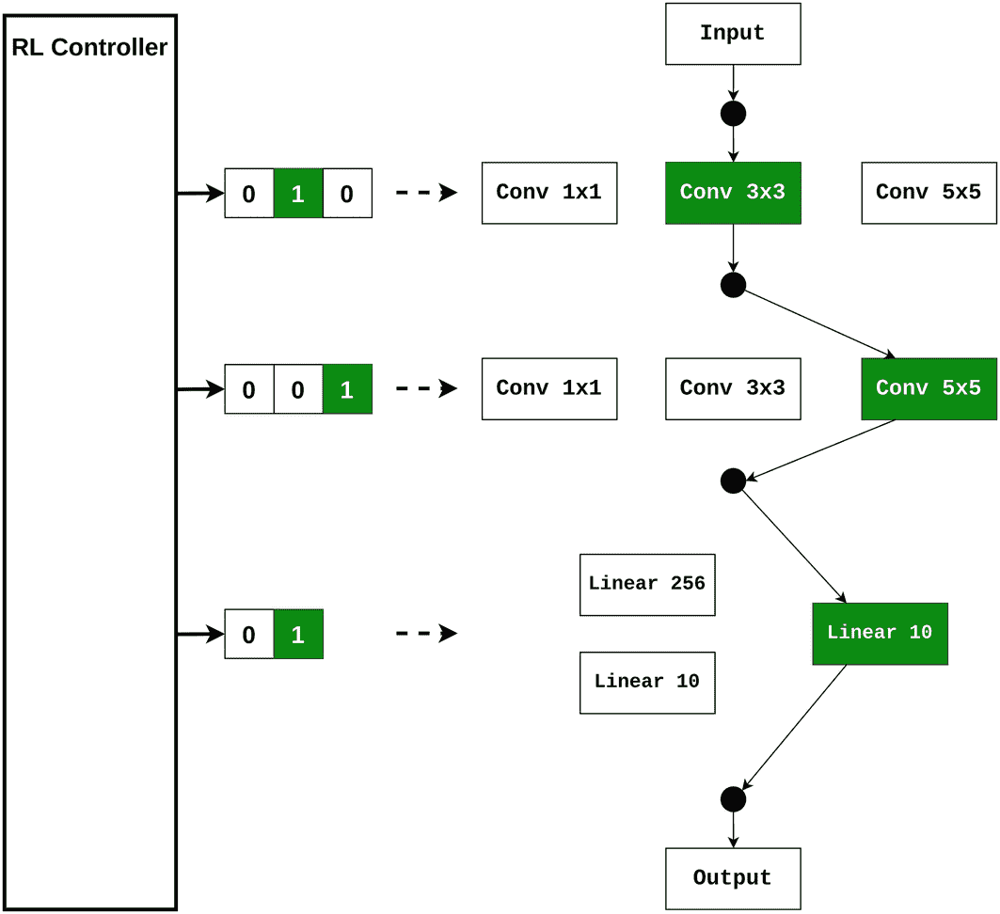

图 5-10

RL 控制器子网络选择

RL 控制器选择一个子网络并运行一个或多个训练周期。ENAS 方法的核心是权重共享技术。不同子网络中的相同层共享相同的权重。当控制器选择子网络时，它不是从头开始训练；层共享已经训练过的权重。权重共享概念在图 5-11 中得到演示。

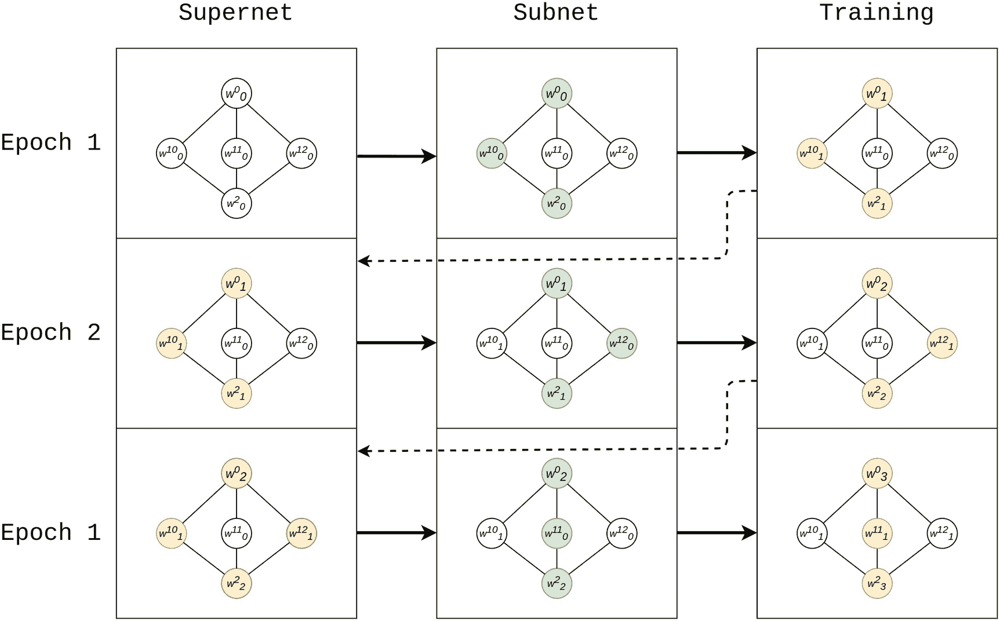

图 5-11

权重共享

权重共享方法允许控制器通过少量迭代找到最佳架构，而无需每次从头开始重新训练新的子网络。可以使用以下伪代码演示 ENAS 算法：

我们初始化一个超网络：`S`

并加载训练和验证数据集：`train_ds, val_ds`

接下来，算法初始化 ENAS 控制器（Controller(S, θ))，其中 *θ* 表示控制器权重，这些权重有助于从 `S` 超网络中选择最佳子网络：

```py
Ctrl = Controller(S, θ)
```

主要训练循环：

1.  超网络训练循环：

```py
for epoch in epochs:
```

1.  控制器实现随机策略，这意味着它以概率进行操作。最有希望的子网络有最高的被选中的概率：

```py
for batch in batches(train_ds):
```

1.  子网络网络使用权重共享技术在一个训练批次上训练一次（即，只有一个训练周期）（图 5-11）：

```py
s ← Ctrl.sample() #picks pseudo-random subnet
```

1.  控制器训练循环。在这个循环中，控制器学习如何找到一个子网络，使其获得最高的奖励，即验证数据集上的准确率：

```py
train_once(subnet, batch)
```

1.  控制器选择子网络并在验证数据集批次上计算其准确率：

```py
for batch in batches(val_ds):
```

1.  控制器收集关于子网络性能的经验：

```py
subnet ← Ctrl.sample() #picks pseudo random subnet
reward = test(subnet, batch)
```

1.  控制器根据新的经验更新其权重 *θ*：

```py
Ctrl.add_experience(reward)
```

```py
Ctrl.self_update_with_new_experience()
# end of main training loop
```

训练完成后，控制器返回最佳的子网络：

```py
Ctrl.best()
```

在前面描述的算法中，控制器在训练数据集上训练各种子网络，然后在验证数据集上测试它们。通过重复这个过程多次，控制器了解哪些架构显示出最佳的准确率，并逐渐将探索过程减少到有限数量的架构。在训练过程结束时，控制器收敛到一个或几个最佳架构。

让我们看看 ENAS 在实际中的应用：

1.  初始时，控制器对子网络没有假设，它使用如图 5-11 所示的权重共享技术随机选择子网络进行单次训练（子网络仅训练一个训练周期）。

1.  然后，控制器根据 *θ* 权重生成子网络，并在验证数据集上收集准确率。

1.  基于第 2 步中获得的经验，控制器更新 *θ* 值。

图 5-12 展示了我们之前描述的步骤 1–3。

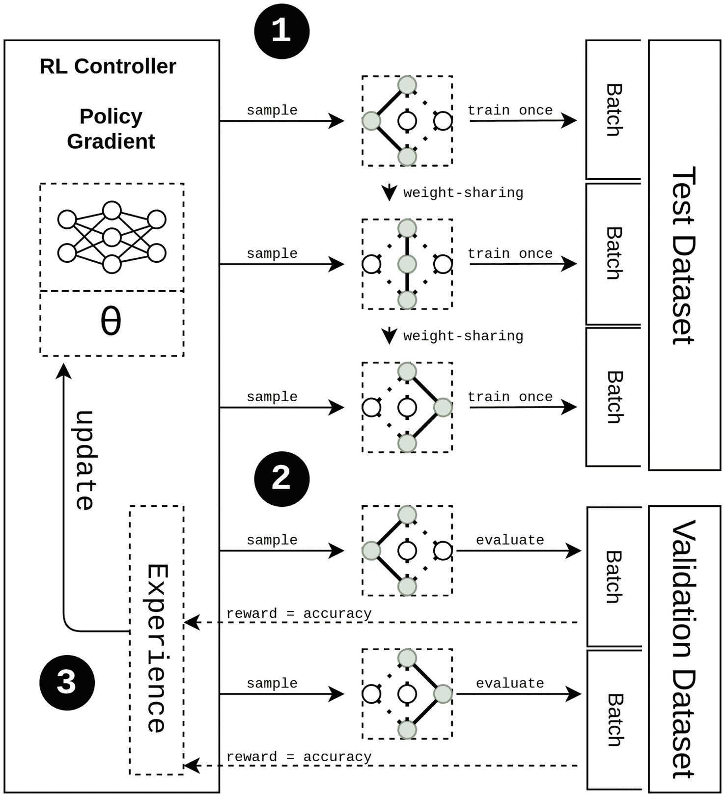

图 5-12

ENAS 在行动中。初始周期

接下来，控制器使用权重共享技术选择最有希望的子网络进行训练，并在验证数据集上测试它们的准确率，如图 5-13 所示。

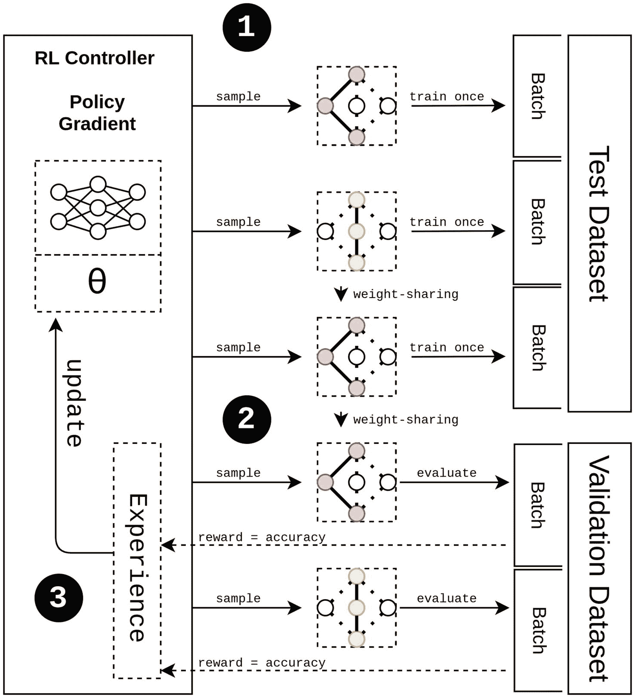

图 5-13

ENAS 在行动中。中间训练

在分别训练 Supernet 层并更新 *θ* 经验后，控制器收敛到一些它认为最佳的子网络。图 5-14 说明了这一点。

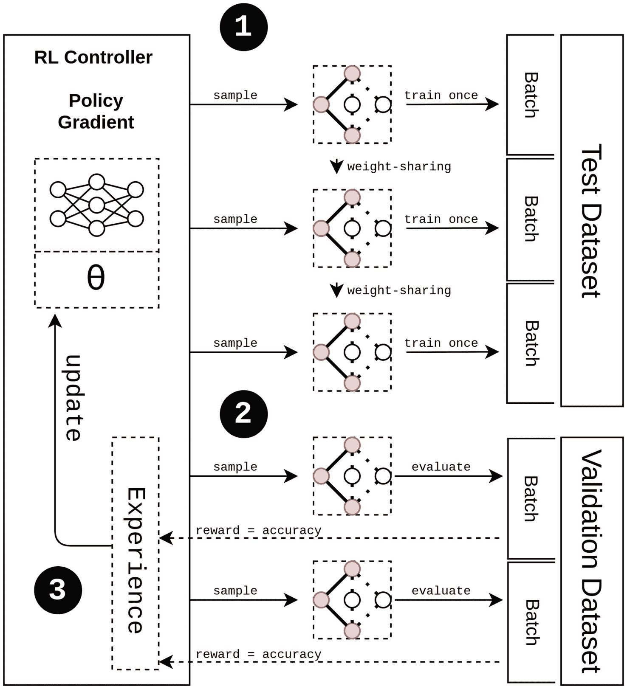

图 5-14

ENAS 在行动中。结束训练

单次 ENAS 算法接近多试验 NAS 的 RL 策略，但有一个显著的区别。ENAS 不进行完整的子网络训练周期，而是使用权重共享和增量一步训练。这种差异显著加快了寻找最佳架构的过程。

NNI 使用以下类实现 ENAS：

+   **PyTorch**: `nni.retiarii.oneshot.pytorch.enas.EnasTrainer`

+   **TensorFlow**: `nni.algorithms.nas.tensorflow.enas.EnasTrainer`

表 5-3 显示了 `EnasTrainer` 参数。

表 5-3

EnasTrainer 参数

| 参数 | 描述 |
| --- | --- |
| `model` | 要训练的 PyTorch 或 TensorFlow 模型 |
| `loss` | `类型：可调用`损失函数 |
| `metrics` | `类型：可调用`衡量模型准确率 |
| `reward_function` | `类型：可调用`由 ENAS 控制器用于计算奖励。通常，`reward_function` 返回模型准确率 |
| `optimizer` | `类型：优化器` 模型训练的优化器 |
| `num_epochs` | `类型：整数` 计划用于训练的周期数 |
| `dataset` | `类型：数据集` 训练数据集 |
| `batch_size` | `类型：整数，默认：64` 训练批大小 |
| `workers` | `类型：整数，默认：4` 数据加载的工作者 |
| `log_frequency` | `类型：整数，默认：None` 记录步骤计数 |
| `grad_clip` | `类型：浮点数，默认：5.0` 梯度裁剪。设置为 0 以禁用 |
| `entropy_weight` | `类型：浮点数，默认：0.0001` 样本熵损失权重 |
| `skip_weight` | `类型：浮点数，默认：0.8` 跳过惩罚损失权重 |
| `baseline_decay` | `类型：浮点数，默认：0.999` 基线衰减率。新基线计算为 `baseline_decay * baseline_old + reward * (1 - baseline_decay)` |
| `ctrl_lr` | `类型：浮点数，默认：0.00035` 控制器学习率 |
| `ctrl_steps_aggregate` | `类型：整数，默认：20` 将聚合到单个 mini-batch 的控制器步骤数 |

现在，让我们继续研究在上一节中定义的 LeNet 模型空间中 ENAS 算法的实际应用。

## TensorFlow ENAS 实现

列出 5-11 展示了使用 TensorFlow LeNet 模型空间应用 ENAS。

导入模块：

```py
from tensorflow.keras.losses import Reduction, SparseCategoricalCrossentropy
from tensorflow.keras.optimizers import Adam
import ch5.datasets as datasets
from nni.algorithms.nas.tensorflow import enas
from ch5.model.lenet.tf_lenet import TfLeNetSupernet
from ch5.tf_utils import accuracy, reward_accuracy, get_best_model
Listing 5-11
ENAS TensorFlow. ch5/enas/enas_tf_search.py
```

初始化 LeNetSupernet：

```py
model = TfLeNetSupernet()
```

加载数据集：

```py
dataset_train, dataset_valid = datasets.mnist_dataset()
```

定义损失函数：

```py
loss = SparseCategoricalCrossentropy(
from_logits = True,
reduction = Reduction.NONE
)
```

定义优化器：

```py
optimizer = Adam()
```

ENAS 训练参数：

```py
num_epochs = 10
batch_size = 256
```

初始化 `EnasTrainer`：

```py
trainer = enas.EnasTrainer(
model,
loss = loss,
metrics = accuracy,
reward_function = reward_accuracy,
optimizer = optimizer,
batch_size = batch_size,
num_epochs = num_epochs,
dataset_train = dataset_train,
dataset_valid = dataset_valid,
log_frequency = 10,
child_steps = 10,
mutator_steps = 30
)
```

启动 One-shot 搜索：

```py
trainer.train()
```

返回最佳子网络：

```py
best = get_best_model(trainer.mutator)
print(best)
```

列出 5-11 返回以下最佳模型作为 ENAS 算法的结果：

+   `conv1: 1 (Conv3×3)`

+   `conv2: 2 (Conv5×5)`

+   `dm: 0 (Linear256`→`Linear10)`

## PyTorch ENAS 实现

列出 5-12 展示了使用 PyTorch LeNet 模型空间应用 ENAS。

导入模块：

```py
import torch.nn as nn
from nni.retiarii.oneshot.pytorch.enas import EnasTrainer
from torch.optim.sgd import SGD
import ch5.datasets as datasets
from ch5.model.lenet.pt_lenet import PtLeNetSupernet
from ch5.pt_utils import accuracy, reward_accuracy
Listing 5-12
ENAS PyTorch. ch5/enas/enas_pt_search.py
```

初始化 LeNetSupernet：

```py
model = PtLeNetSupernet()
```

加载数据集：

```py
dataset_train, dataset_valid = datasets.get_dataset("mnist")
```

定义损失函数：

```py
criterion = nn.CrossEntropyLoss()
```

定义优化器：

```py
optimizer = SGD(
model.parameters(), 0.05,
momentum = 0.9, weight_decay = 1.0E-4
)
```

ENAS 训练参数：

```py
batch_size = 256
log_frequency = 50
num_epochs = 10
ctrl_kwargs = {"tanh_constant": 1.1}
```

初始化 `EnasTrainer`：

```py
trainer = EnasTrainer(
model,
loss = criterion,
metrics = accuracy,
reward_function = reward_accuracy,
optimizer = optimizer,
batch_size = batch_size,
num_epochs = num_epochs,
dataset = dataset_train,
log_frequency = log_frequency,
ctrl_kwargs = ctrl_kwargs,
ctrl_steps_aggregate = 20
)
```

启动 One-shot 搜索：

```py
trainer.fit()
```

返回最佳子网络：

```py
best_model = trainer.export()
print(best_model)
```

列出 5-12 返回以下最佳模型作为 ENAS 算法的结果：

+   `conv1: 1 (Conv3×3)`

+   `conv2: 1 (Conv3×3)`

+   `dm: 0 (Linear256`→`Linear10)`

ENAS 是首批 One-shot NAS 算法之一，它使社区重新思考了整个神经架构搜索的方法。但由于复杂的内部算法和非平凡的调整，ENAS 对于没有经验的读者来说可能看起来很复杂。在下一节中，我们将研究一种更优雅的 One-shot NAS 技术。

## 可微分架构搜索 (DARTS)

从微积分我们知道，找到连续可微曲面的最大值最有效的方法之一是使用导数和基于梯度的方法。神经网络使用基于计算导数的梯度下降原理。将 NAS 简化为微分问题也非常方便，DARTS 算法就是这样做的。DARTS 算法在原始论文“DARTS：可微分架构搜索”中提出（[`https://arxiv.org/abs/1806.09055`](https://arxiv.org/abs/1806.09055)）。

使用二进制掩码，ENAS 算法从超网络中选择子网络，但这种方法是离散的。ENAS 控制器从一个子网络跳到另一个子网络，试图发现最佳选择。DARTS 算法使搜索空间连续；它将特定操作的分类选择放宽为所有可能操作的 softmax：

*o*^′(*x*) = 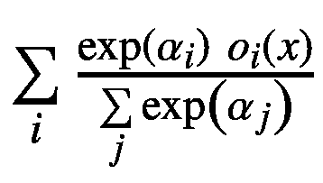

这意味着 DARTS 算法创建了一个由模型空间派生的超网络，并且每个选择操作后跟随一个 *α*[*i*] 参数，该参数指定了操作权重。这使得 {*α*} 参数集可训练，作为超网络权重。在超网络训练结束时，选择具有最高 *α* 值的选项作为最佳子网络操作。图 5-15 阐述了这一概念。

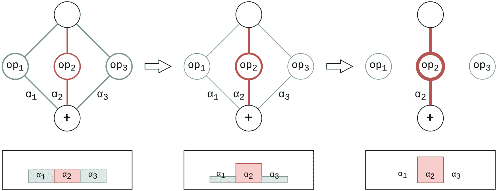

图 5-15

DARTS 操作放宽

在使用 DARTS 算法进行超网络训练期间，不合理的选项往往会归零，搜索收敛到单个架构，这就是搜索结果。图 5-16 展示了将 DARTS 算法应用于 LeNetSupermodel 的过程。它逐渐放宽不合理的层，显示出最佳的架构。

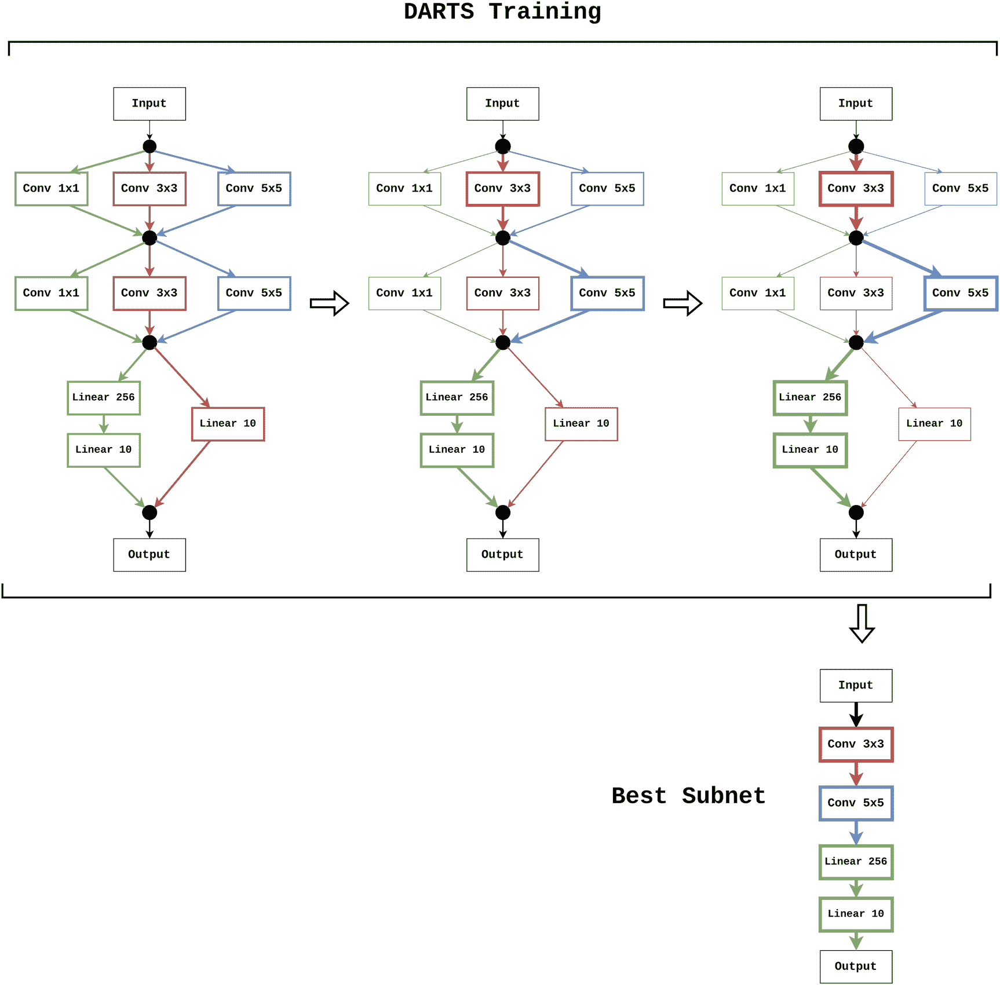

图 5-16

DARTS 在行动中

NNI 2.7 仅在 PyTorch 框架中实现 DARTS，使用以下类：`nni.retiarii.oneshot.pytorch.DartsTrainer.`

表 5-4 显示了 `DartsTrainer` 参数。

表 5-4

DartsTrainer 参数

| 参数 | 描述 |
| --- | --- |
| `model` | 待训练的 PyTorch 模型 |
| `loss` | `类型：callable` 损失函数 |
| `metrics` | `类型：callable` 测量模型准确度 |
| `optimizer` | `类型：Optimizer` 模型训练的优化器 |
| `num_epochs` | `类型：int` 计划用于训练的周期数 |
| `dataset` | `类型：Dataset` 训练数据集 |
| `batch_size` | `类型：int，默认：64` 训练批次大小 |
| `workers` | `类型：int，默认：4` 数据加载的工作者 |
| `log_frequency` | `类型：int，默认：None` 日志步骤计数 |
| `grad_clip` | `类型：float，默认：5.0` 梯度裁剪。设置为 0 以禁用 |
| `arc_learning_rate` | `类型：float，默认：0.0001` 架构参数的学习率 |

列出 5-13 使用 NNI 实现了 DARTS 算法。

导入模块：

```py
import torch
import torch.nn as nn
import ch5.datasets as datasets
from nni.retiarii.oneshot.pytorch import DartsTrainer
from ch5.model.lenet.pt_lenet import PtLeNetSupernet
from ch5.pt_utils import accuracy
Listing 5-13
DARTS PyTorch. ch5/darts/darts_pt_search.py
```

初始化 LeNetSupernet：

```py
model = PtLeNetSupernet()
```

加载数据集：

```py
dataset_train, dataset_valid = datasets.get_dataset("mnist")
```

定义损失函数：

```py
criterion = nn.CrossEntropyLoss()
```

定义优化器：

```py
optim = torch.optim.SGD(
model.parameters(), 0.025,
momentum = 0.9, weight_decay = 3.0E-4
)
```

ENAS 训练参数：

```py
num_epochs = 10
batch_size = 256
metrics = accuracy
```

初始化 `DartsTrainer`：

```py
trainer = DartsTrainer(
model = model,
loss = criterion,
metrics = metrics,
optimizer = optim,
num_epochs = num_epochs,
dataset = dataset_train,
batch_size = batch_size,
log_frequency = 10,
unrolled = False
)
```

启动一次性搜索：

```py
trainer.fit()
```

返回最佳子网络：

```py
best_architecture = trainer.export()
print('Best architecture:', best_architecture)
```

列出 5-13 返回 DARTS 算法的结果如下最佳模型：

+   `conv1: conv5x5->16`

+   `conv2: conv5x5->32`

+   `dm: 1 (线性 10)`

DARTS 是一个清晰且直接的一次性算法。它具有直观的逻辑，易于调整。但与 ENAS 相比，DARTS 需要更多的内存，因为 DARTS 训练整个超网络，而 ENAS 只训练各种子网络。无论如何，DARTS 是实现神经架构搜索的一个好选择。

## GeneralSupernet 解决 CIFAR-10

我们考虑了在解决简单 MNIST 问题的 LeNet 模型空间上应用一次性算法。这些示例作为入门点是很好的，但它们并没有展示一次性 NAS 方法的威力。在本节中，我们将检查一个更复杂的模型空间来解决 CIFAR-10 问题。

通常，一次性 NAS 处理的是由单元格设计的超网络。正如其名所示，一个由单元格设计的超网络由各种单元格组成。每个**单元格**接受不同数量的输入，并使用内部深度学习块操作创建一个计算图。每个**块操作**是深度学习层的`LayerChoice`。让我们构建一个名为**GeneralSupernet**的单元格设计超网络来解决 CIFAR-10 问题。

在 GeneralSupernet 中，我们将块操作定义为来自

+   `SepConvBranch(3)`

+   `NonSepConvBranch(3)`

+   `SepConvBranch(5)`

+   `NonSepConvBranch(3)`

+   `AvgPoolBranch`

+   `MaxPoolBranch`

这些层的实现在此处未提供，但读者可以在以下源代码文件中获取详细信息：

+   **TensorFlow**: ch5/model/general/tf_ops.py

+   **PyTorch**: ch5/model/general/pt_ops.py

图 5-17 描述了块操作空间。

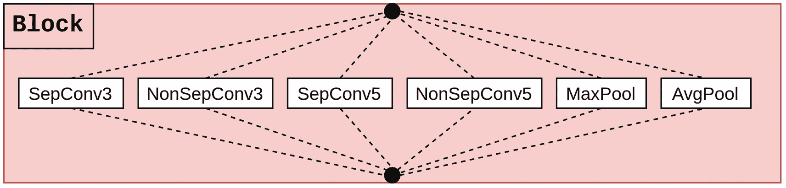

图 5-17

GeneralSupernet 块操作

第 *n* 个单元格接受一个必需的输入，该输入通过块操作转换，并接受 *n* 个额外的输入。额外的输入不是必需的，可以在不同的子网络中置零。块操作输出和额外输入的归一化总和形成单元格输出。图 5-18 展示了单元格空间的示例。

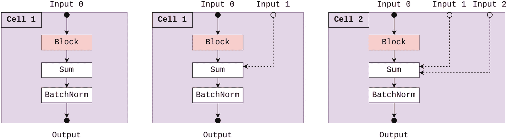

图 5-18

GeneralSupernet 单元格

单元格的序列构成了 GeneralSupernet，每个单元格的输出可以是后续单元格的输入。每三个单元格之后，插入一个`FactorizedReduced`层。在本节中，我们将使用具有六个单元格的 GeneralSupernet。图 5-19 描述了 GeneralSupernet 架构。

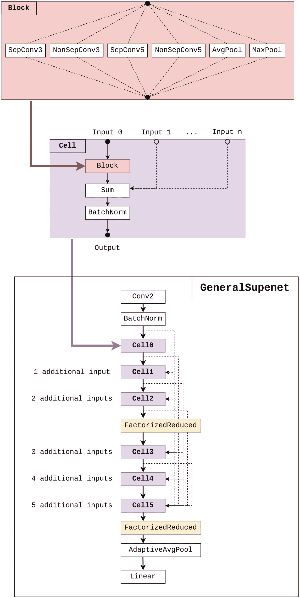

图 5-19

GeneralSupernet

让我们计算 GeneralSupernet 有多少个子网络：(6) × (6×2) × (6×2²) × (6×2³) × (6×2⁴) × (6×2⁵) = 6⁶ × 2^(1+2+3+4+5) ~ 1,500,000,000。当然，使用多试验 NAS 方法来有效地探索这个模型空间是不可能的。也可以使用具有 9、12 或 24 个单元格的 GeneralSupernet。在这种情况下，子网络的数量将变得极其庞大。

有许多预定义的 One-shot NAS Supernets，旨在解决特定类别的问题。我们之前定义的 GeneralSupernet 是其中最简单的一个。让我们实现 GeneralSupernet 并在 CIFAR-10 数据集上运行 One-shot NAS。

## 使用 TensorFlow 和 ENAS 训练 GeneralSupernet

让我们实现 GeneralSupernet 并使用 ENAS 算法找到最佳架构。列表 5-14 使用 TensorFlow 定义了 GeneralSupernet。

导入模块：

```py
from tensorflow.keras import Model, Sequential
from tensorflow.keras.layers import BatchNormalization, Conv2D, Dense, GlobalAveragePooling2D
from nni.nas.tensorflow.mutables import InputChoice, LayerChoice, MutableScope
from ch5.model.general.tf_ops import build_conv, build_separable_conv, build_avg_pool, build_max_pool, FactorizedReduce
Listing 5-14
GeneralSupernet. TensorFlow. ch5/model/general/tf_general.py
```

定义图 5-18 中所示的 `Cell`：

```py
class Cell(MutableScope):
def __init__(self, cell_ord, input_num, filters):
super().__init__(f'cell_{cell_ord}')
```

为图 5-17 中所示的块操作设置 `LayerChoice`：

```py
self.block_op = LayerChoice([
build_conv(filters, 3, 'conv3'),
build_separable_conv(filters, 3, 'sepconv3'),
build_conv(filters, 5, 'conv5'),
build_separable_conv(filters, 5, 'sepconv5'),
build_avg_pool(filters, 'avgpool'),
build_max_pool(filters, 'maxpool'),
], key = f'op_{cell_ord}')
```

为额外的 `Cell` 输入设置 `InputChoice`：

```py
if input_num > 0:
self.connections = InputChoice(
n_candidates = input_num,
n_chosen = None,
key = f'con_{cell_ord}'
)
else:
self.connections = None
```

最后一个细胞层 – `BatchNormalization`：

```py
self.batch_norm = BatchNormalization(trainable = False)
```

定义 `call` 方法：

```py
def call(self, inputs):
```

主要输入由 `block_op` 处理：

```py
out = self.block_op(inputs[-1])
```

通过 `self.connections` 选择额外的输入并求和：

```py
if self.connections is not None:
connection = self.connections(inputs[:-1])
if connection is not None:
out += connection
return self.batch_norm(out)
```

定义图 5-19 中所示的 GeneralSupernet：

```py
class GeneralSupernet(Model):
def __init__(
self,
num_cells = 6,
filters = 24,
num_classes = 10
):
super().__init__()
self.num_cells = num_cells
self.stem = Sequential([
Conv2D(filters, kernel_size = 3, padding = 'same', use_bias = False),
BatchNormalization()
])
```

设置池化层（`FactorizedReduce`）的位置：

```py
# num_cells = 6 -> pool_layers_idx = [3, 6]
self.pool_layers_idx = [
cell_id
for cell_id in range(1, num_cells + 1) if cell_id % 3 == 0
]
```

初始化 `cells` 和 `pool_layers` 列表：

```py
self.cells = []
self.pool_layers = []
for cell_ord in range(num_cells):
if cell_ord in self.pool_layers_idx:
pool_layer = FactorizedReduce(filters)
self.pool_layers.append(pool_layer)
cell = Cell(cell_ord, cell_ord, filters)
self.cells.append(cell)
```

定义最终层：

```py
self.gap = GlobalAveragePooling2D()
self.dense = Dense(num_classes)
```

接下来，我们定义 `call` 方法：

```py
def call(self, x):
cur = self.stem(x)
prev_outputs = [cur]
for cell_id, cell in enumerate(self.cells):
```

将 `Cell` 输出通过 `FactorizedReduce` 池化层传递：

```py
if cell_id in self.pool_layers_idx:
# Number of Pool Layer
# 0, 1, 2, ....
pool_ord = self.pool_layers_idx.index(cell_id)
pool = self.pool_layers[pool_ord]
prev_outputs = [pool(tensor) for tensor in prev_outputs]
cur = prev_outputs[-1]
cur = cell(prev_outputs)
prev_outputs.append(cur)
cur = self.gap(cur)
logits = self.dense(cur)
return logits
```

由于我们已经定义了 GeneralSupernet，我们可以使用以下脚本启动 ENAS。

导入模块：

```py
from tensorflow.keras.losses import Reduction, SparseCategoricalCrossentropy
from tensorflow.keras.optimizers import SGD
import ch5.datasets as datasets
from nni.algorithms.nas.tensorflow import enas
from ch5.model.general.tf_general import GeneralSupernet
from ch5.tf_utils import accuracy, reward_accuracy, get_best_model
Listing 5-15
GeneralSupernet ENAS. TensorFlow. ch5/cifar10/enas_tf.py
```

初始化 GeneralSupernet：

```py
model = GeneralSupernet()
```

加载数据集：

```py
dataset_train, dataset_valid = datasets.cifar10_dataset()
```

声明损失函数：

```py
loss = SparseCategoricalCrossentropy(
from_logits = True,
reduction = Reduction.NONE
)
```

声明优化器：

```py
optimizer = SGD(learning_rate = 0.05, momentum = 0.9)
```

设置 ENAS 训练器参数：

```py
metrics = accuracy
reward_function = reward_accuracy
batch_size = 256
num_epochs = 100
```

初始化 `EnasTrainer`：

```py
trainer = enas.EnasTrainer(
model,
loss = loss,
metrics = metrics,
reward_function = reward_function,
optimizer = optimizer,
batch_size = batch_size,
num_epochs = num_epochs,
dataset_train = dataset_train,
dataset_valid = dataset_valid
)
```

启动训练：

```py
trainer.train()
```

显示结果：

```py
best = get_best_model(trainer.mutator)
print(best)
```

注意

在配备 Intel Core i7 和 CUDA（GeForce GTX 1050）的机器上，训练时长约为 6 小时

搜索完成后，返回以下报告：

+   `op_layer_0: 3 SepConvBranch(5)`

+   `op_layer_1: 3 SepConvBranch(5)`

+   `op_layer_2: 1 SepConvBranch(3)`

+   `op_layer_3: 4 NonSepConvBranch(3)`

+   `op_layer_4: 1 SepConvBranch(3)`

+   `op_layer_5: 1 SepConvBranch(3)`

+   `con_layer_1: 0 来自 Cell0 的额外输入`

+   `con_layer_2: 0 来自 Cell0 的额外输入`

+   `con_layer_3: None 无额外输入`

+   `con_layer_4: [0, 2, 3] 来自：Cell0, Cell2, Cell3 的额外输入`

+   `con_layer_5: 3 来自 Cell3 的额外输入`

图 5-20 可视化了 ENAS 返回的结果。

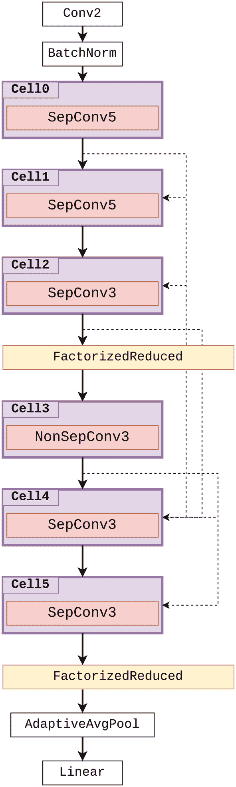

图 5-20

ENAS GeneralSupernet 最佳架构

如图 5-20 所示，最佳架构没有使用池化操作，`AvgPoolBranch` 和 `MaxPoolBranch`，这很有道理，因为 GeneralSupernet 内置了 `FactorizedReduced` 层。

## 使用 PyTorch 和 DARTS 训练 GeneralSupernet

让我们实现 GeneralSupernet 并使用 DARTS 算法找到最佳架构。首先，我们需要使用 PyTorch 定义 GeneralSupernet。

导入模块：

```py
from typing import OrderedDict
import torch.nn as nn
from nni.retiarii.nn.pytorch import LayerChoice, InputChoice
from ch5.model.general.pt_ops import ConvBranch, PoolBranch, FactorizedReduce
Listing 5-16
GeneralSupernet. PyTorch. ch5/model/general/pt_general.py
```

定义图 5-18 中所示的 `Cell`：

```py
class Cell(nn.Module):
def __init__(self, cell_ord, input_num, in_f, out_f):
super().__init__()
```

为图 5-17 中所示的块操作设置 `LayerChoice`：

```py
self.block_op = LayerChoice(OrderedDict([
('SepConvBranch(3)', ConvBranch(in_f, out_f, 3, 1, 1, False)),
('NonSepConvBranch(3)', ConvBranch(in_f, out_f, 3, 1, 1, True)),
('SepConvBranch(5)', ConvBranch(in_f, out_f, 5, 1, 2, False)),
('NonSepConvBranch(3)', ConvBranch(in_f, out_f, 5, 1, 2, True)),
('AvgPoolBranch', PoolBranch('avg', in_f, out_f, 3, 1, 1)),
('MaxPoolBranch', PoolBranch('max', in_f, out_f, 3, 1, 1))
]), label = f'op_{cell_ord}')
```

为额外的 `Cell` 输入设置 `InputChoice`：

```py
if input_num > 0:
self.connections = InputChoice(
n_candidates = input_num, n_chosen = None,
label = f'con_{cell_ord}'
)
else:
self.connections = None
```

最后一个细胞层 – `BatchNormalization`：

```py
self.batch_norm = nn.BatchNorm2d(out_f, affine = False)
```

定义 `forward` 方法：

```py
def forward(self, inputs):
```

主要输入由 `block_op` 处理：

```py
out = self.block_op(inputs[-1])
```

通过 `self.connections` 选择额外的输入并求和：

```py
if self.connections is not None:
connection = self.connections(inputs[:-1])
if connection is not None:
out = out + connection
return self.batch_norm(out)
```

定义图 5-19 中所示的 GeneralSupernet：

```py
class GeneralSupernet(nn.Module):
def __init__(
self,
num_cells = 6,
out_f = 24,
in_channels = 3,
num_classes = 10
):
super().__init__()
self.num_cells = num_cells
# Stem layer
self.stem = nn.Sequential(
nn.Conv2d(in_channels, out_f, 3, 1, 1, bias = False),
nn.BatchNorm2d(out_f)
)
```

设置池化层的位置 (`FactorizedReduce`)：

```py
self.pool_layers_idx = [
cell_id
for cell_id in range(1, num_cells + 1) if cell_id % 3 == 0
]
```

初始化 `cells` 和 `pool_layers` 列表：

```py
self.cells = nn.ModuleList()
self.pool_layers = nn.ModuleList()
# Initializing Cells and Pool Layers
for cell_ord in range(num_cells):
if cell_ord in self.pool_layers_idx:
pool_layer = FactorizedReduce(out_f, out_f)
self.pool_layers.append(pool_layer)
cell = Cell(cell_ord, cell_ord, out_f, out_f)
self.cells.append(cell)
```

定义最终层：

```py
self.gap = nn.AdaptiveAvgPool2d(1)
self.dense = nn.Linear(out_f, num_classes)
```

接下来，我们定义 `forward` 方法：

```py
def forward(self, x):
bs = x.size(0)
cur = self.stem(x)
# Constructing Calculation Graph
cells = [cur]
for cell_id in range(self.num_cells):
cur = self.cellscell_id
cells.append(cur)
```

将 `Cell` 输出通过 `FactorizedReduce` 池化层传递：

```py
# If pool layer is added
if cell_id in self.pool_layers_idx:
# Number of Pool Layer
# 0, 1, 2, ...
pool_ord = self.pool_layers_idx.index(cell_id)
# Adding Pool Layer to all input cells
for i, cell in enumerate(cells):
cells[i] = self.pool_layerspool_ord
cur = cells[-1]
cur = self.gap(cur).view(bs, -1)
logits = self.dense(cur)
return logits
```

由于我们定义了 GeneralSupernet，我们可以使用列表 5-17 启动 DARTS。

导入模块：

```py
import torch
import torch.nn as nn
import ch5.datasets as datasets
from nni.retiarii.oneshot.pytorch import DartsTrainer
from ch5.model.general.pt_general import GeneralSupernet
from ch5.pt_utils import accuracy
Listing 5-17
GeneralSupernet DARTS. PyTorch. ch5/cifar10/darts_pt.py
```

初始化 GeneralSupernet：

```py
model = GeneralSupernet()
```

加载数据集：

```py
dataset_train, dataset_valid = datasets.get_dataset("cifar10")
```

声明损失函数：

```py
criterion = nn.CrossEntropyLoss()
```

声明优化器：

```py
optim = torch.optim.SGD(
model.parameters(), 0.025,
momentum = 0.9, weight_decay = 3.0E-4
)
```

设置 DARTS 训练器参数：

```py
num_epochs = 100
batch_size = 128
accuracy_metrics = accuracy
```

初始化 `DartsTrainer`：

```py
trainer = DartsTrainer(
model = model,
loss = criterion,
metrics = accuracy_metrics,
optimizer = optim,
num_epochs = num_epochs,
dataset = dataset_train,
batch_size = batch_size,
log_frequency = 10,
unrolled = False
)
```

启动训练：

```py
trainer.fit()
```

显示结果：

```py
best_architecture = trainer.export()
print('Best architecture:', best_architecture)
```

注

在配备 CUDA (GeForce GTX 1050) 的 Intel Core i7 上运行时间为 ~ 4 小时

搜索完成后，返回以下报告：

+   `op_layer_0: SepConvBranch(3)`

+   `op_layer_1: SepConvBranch(5)`

+   `op_layer_2: SepConvBranch(5)`

+   `op_layer_3: SepConvBranch(5)`

+   `op_layer_4: SepConvBranch(5)`

+   `op_layer_5: MaxPoolBranch`

+   `con_layer_1: 0 Additional input from Cell0`

+   `con_layer_2: 0 Additional input from Cell0`

+   `con_layer_3: 0 Additional input from Cell0`

+   `con_layer_4: 2 Additional input from Cell2`

+   `con_layer_5: 4 Additional input from Cell4`

图 5-21 展示了 DARTS 返回的结果。

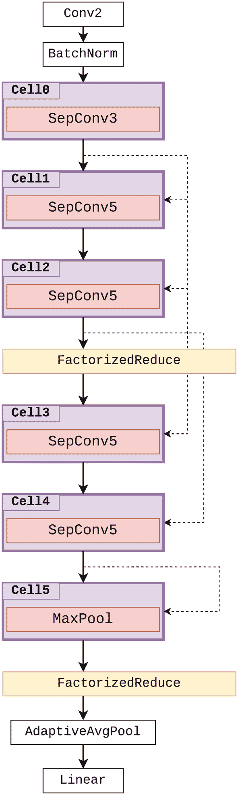

图 5-21

DARTS GeneralSupernet 最佳架构

使用 ENAS (图 5-20) 和 DARTS (图-21) 获得的架构相似。它们倾向于使用 `SepConvBranch(5)` 操作并共享 `Cell0` 输出。ENAS 最佳架构和 DARTS 最佳架构分别达到 91.2% 和 92.8% 的准确率。但如果我们增加 GeneralSupernet 中的细胞数量 (`num_cells`)，可以进一步提高准确率。这将使搜索时间更长，但将导致更精确的目标架构。美妙的是，我们可以使用相同的 GeneralSupernet 和 One-shot 算法来解决任何模式识别问题。这为我们解决典型的深度学习问题提供了一个通用方法。绝对的一步 NAS 是自动深度学习最显著的成就之一。

## HPO 与多试验 NAS 与 One-Shot NAS

因此，目前我们有三种不同的方法来优化和构建深度学习模型：HPO、多试验 NAS 和 One-shot NAS。一个公平的问题可能随之而来：哪种方法更好？但这个问题没有明确的答案。每种方法更适合特定的任务。

+   **HPO** 处理黑盒优化，适用于选择优化算法、训练批量大小以及调整预设计的模型。HPO 的结果可以可视化并易于分析。HPO 可以是深入一个全新的问题或当进行最终调整时的一个良好的终点。

+   **多试验 NAS** 只关注寻找最佳架构。尽管其耐用性，但多试验 NAS 的准确率高于 One-shot NAS。多试验 NAS 的结果更容易解释，因为这种方法为每个尝试的架构提供了指标。

+   **一次性 NAS**非常适合寻找非常困难任务的复杂架构。一次性 NAS 擅长在包含数百万和数十亿元素的模型空间中找到最优子网。它速度快，但难以解释，因为你只得到最佳子网，而不知道任何关于其他可能解决方案的额外信息。

表 5-5 展示了不同方法的比较，其中

表 5-5

AutoDL 方法比较

|   | HPO | 多次试验 NAS | 一次性 NAS |
| --- | --- | --- | --- |
| 设置的简便性 | ✓✓✓ | ✓✓ | ✓ |
| 搜索灵活性 | ✓✓✓ | ✓✓ | ✓ |
| 结果的可解释性 | ✓✓✓ | ✓✓ | ✓ |
| 设计神经网络搜索空间 | ✓ | ✓✓✓ | ✓✓ |
| 为简单任务搜索小型神经网络 | ✓ | ✓✓✓ | ✓ |
| 为具有挑战性的任务搜索复杂架构 | ✓ | ✓✓ | ✓✓✓ |
| 针对特定数据集优化预设计架构 | ✓✓✓ | ✓✓ | ✓ |

+   ✓✓✓: 非常适合

+   ✓✓: 适合

+   ✓: 不太适合

而在这里，我们再次面临没有解决任何情况唯一方法的问题，并且无免费午餐定理也适用于此处。但了解每个算法如何行动将有助于你为解决特定问题做出正确的选择。

## 摘要

一次性 NAS 是一个非常有前景的研究领域。它允许你在合理的时间内找到神经网络解决方案。目前，一次性算法可以发现完全新的架构关键点来解决最复杂的问题。这个领域正在快速发展，并将成为任何研究人员工具箱中的便捷工具。在本章中，我们介绍了一次性 NAS 的基本概念，并掌握了其两种算法：ENAS 和 DARTS。这可以是一个将一次性 NAS 付诸实践的良好起点。在下一章中，我们将考虑模型压缩这个重要问题，这允许你在不损失其准确性的情况下消除不必要的神经网络元素。
