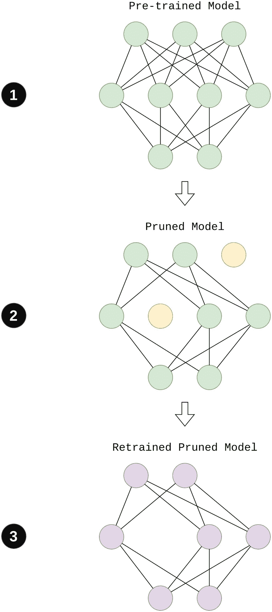
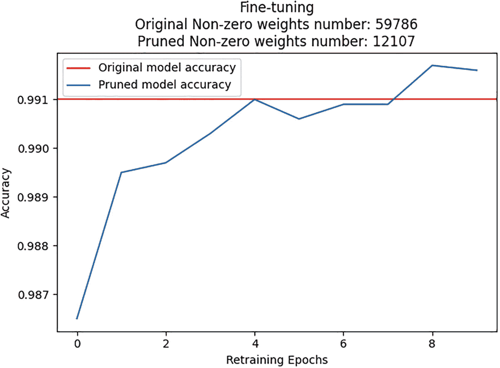
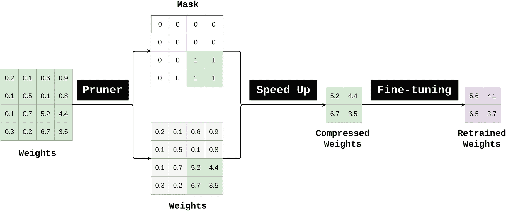
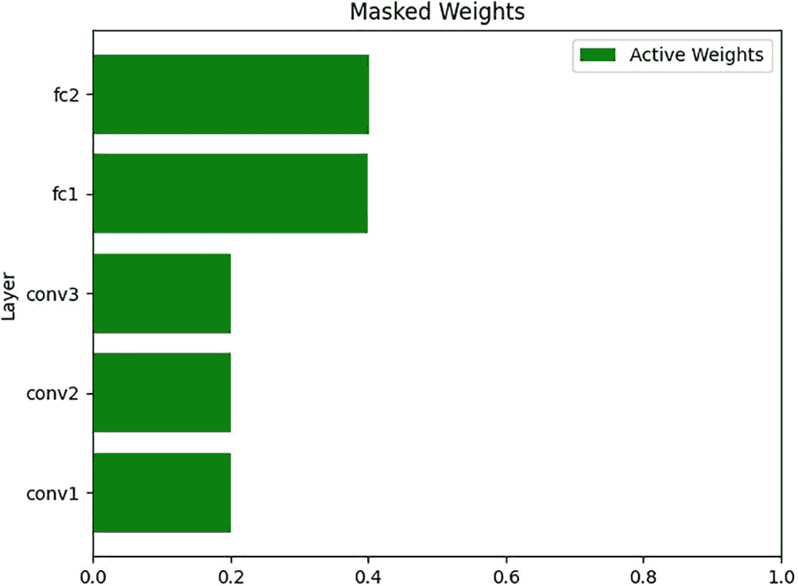
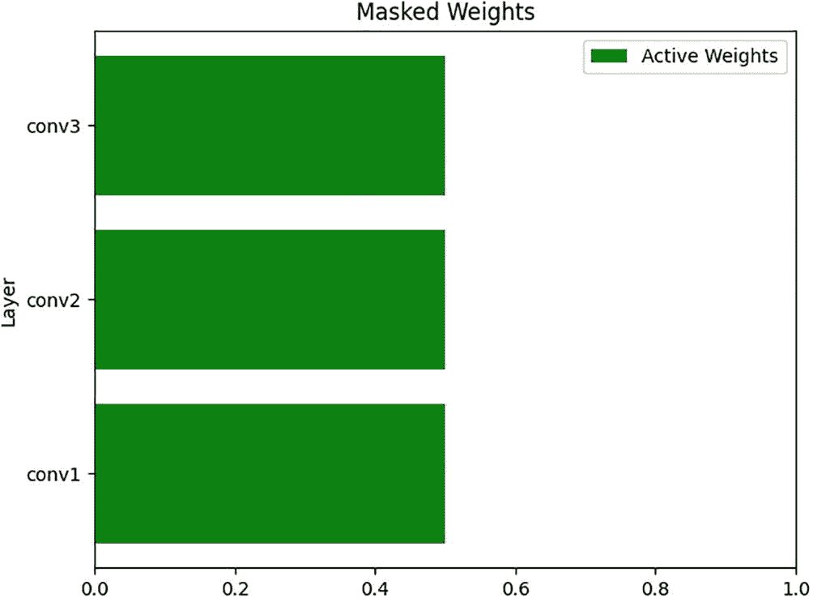
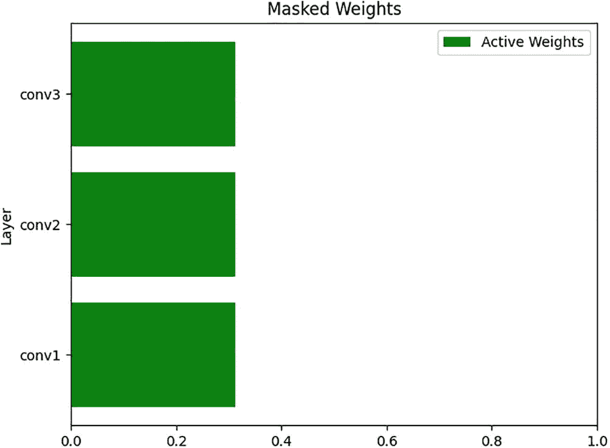
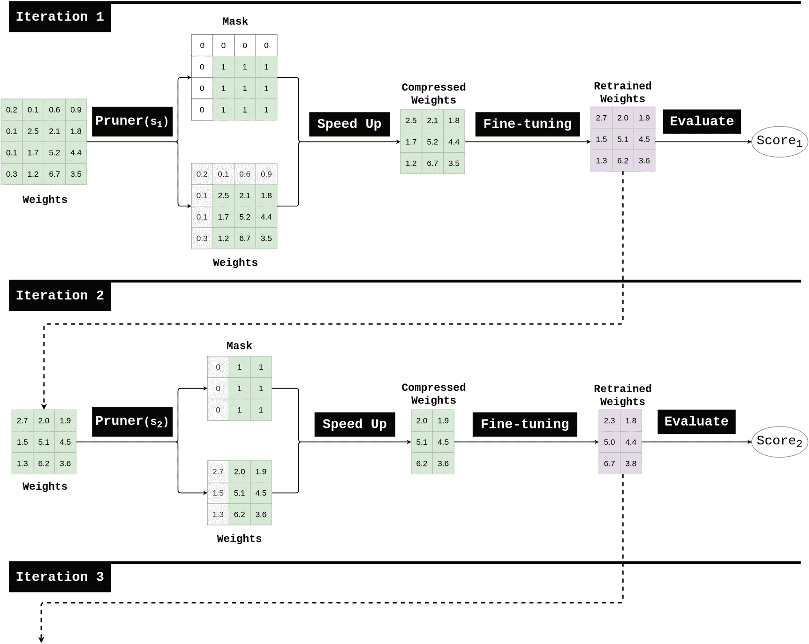
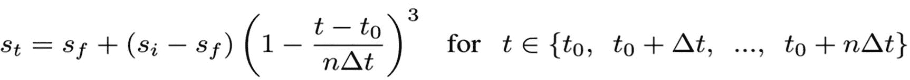
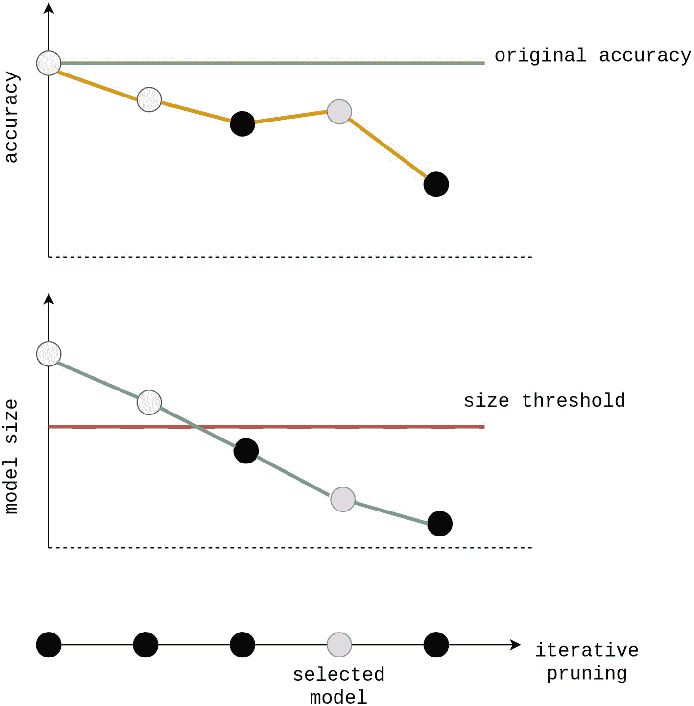
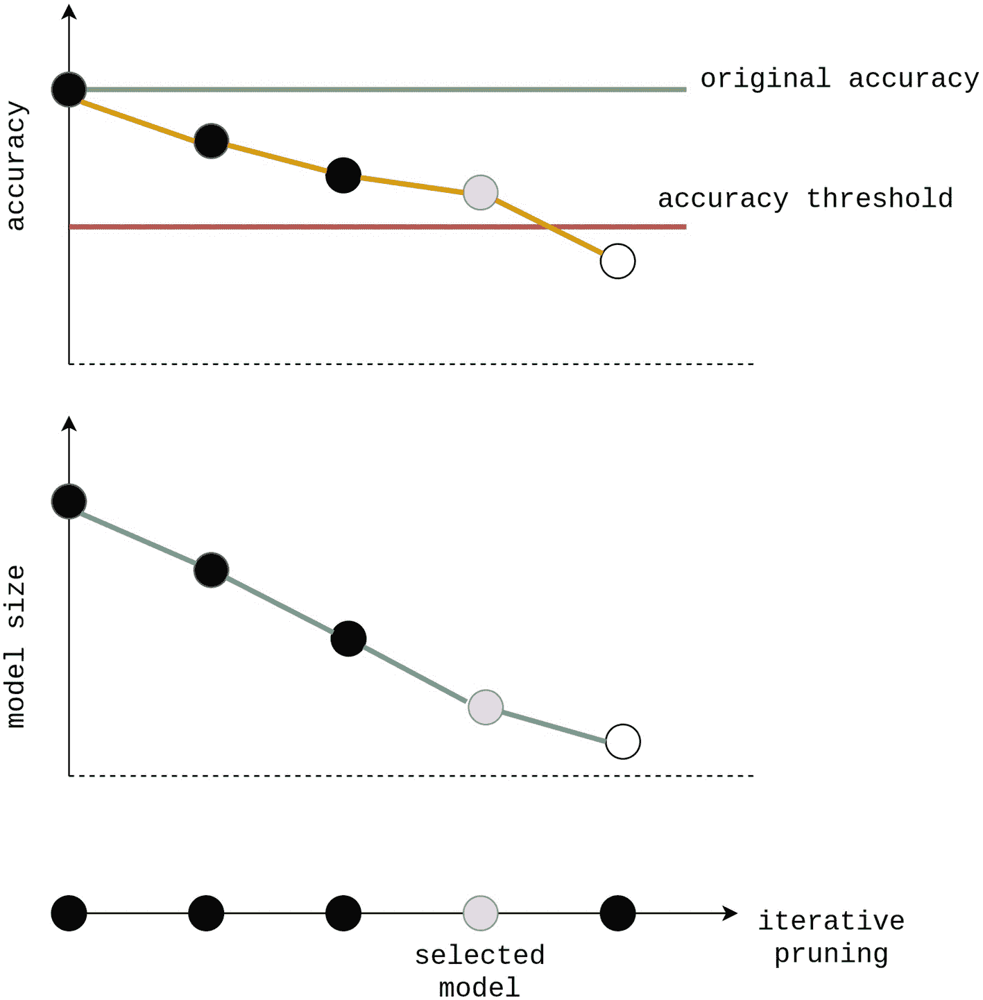

# 6. 模型剪枝

深度学习模型在许多现实生活中的问题中取得了显著的成功。许多设备使用神经网络来执行日常任务。然而，复杂的神经网络计算成本很高。并非所有设备都有 GPU 处理器来运行深度学习模型。因此，执行模型压缩方法以减小模型大小并加速模型性能，同时不显著降低精度，将非常有帮助。主要的模型压缩技术之一是模型剪枝。剪枝通过消除一些模型权重来优化模型。它可以消除大量模型权重，而对模型性能的损害可以忽略不计。剪枝模型更轻、更快。剪枝是一种简单的方法，可以给出很好的模型加速结果。

NNI 提供了一个工具包，帮助用户执行模型剪枝算法。`NNI 2.7` 版本（本书中使用）仅支持 PyTorch 框架的剪枝。本章将研究几种剪枝算法，并学习如何在实践中应用它们。

## 什么是模型剪枝？

复杂的神经网络有很多层和许多权重。ResNet、DenseNet 和 VGGNet 占用数十兆字节来存储它们的权重。开发者经常使用这些架构来解决许多实际问题。但所选架构通常对于要解决的问题来说过于冗余，它包含很多额外的权重，甚至还有额外的层。在实践中，你可以从模型中移除多余的权重，这将显著加快神经网络中的计算速度。有时，深度学习模型完美地适应问题，它们没有明显的冗余。然而，它们计算量太大，无法部署到它们需要执行的特殊设备上。在这种情况下，开发者可能为了加速而牺牲模型精度。

让我们描述一下剪枝算法是如何工作的：

1.  我们选择一个预训练的深度学习模型，该模型是我们想要剪枝的。

1.  剪枝算法消除了（剪枝）神经网络中的几个权重。通过消除，我们指的是算法将这些权重置零。置零权重可以显著加快计算速度，因为乘以 0 总是等于 0，而且不需要进行复杂的计算。通常，候选消除的权重已经接近零，因此它们的置零不应该严重影响模型性能。

1.  剪枝模型在原始模型相同的数据集上重新训练（微调），但零值的权重不再改变其值，始终保持为零。在重新训练过程中，活跃的权重试图接管被移除神经元的函数，以继续成功解决问题。

图 6-1 展示了剪枝算法。



图 6-1

剪枝算法应用

剪枝是一种很好的技术，但有时它会导致模型性能下降。在复杂的神经网络中，有时不可能在不影响模型准确率的情况下移除权重。然而，模型准确率下降可以非常小，我们将会看到，通过几乎不降低准确率，可以将模型压缩 80%。

注意

术语 **微调** 指的是一种重新训练技术，它从最终训练值重新训练未剪枝的权重。在本章中，我们将交替使用术语 **微调** 和 **重新训练**。

## LeNet 模型剪枝

理解模型剪枝概念的最佳方式是将它付诸实践。让我们回到众所周知的 LeNet 模型和经典的 MNIST 问题。LeNet 模型的设计在列表 6-1 中展示。

（完整代码在相应的文件中提供：ch6/model/pt_lenet.py。）

`PtLeNetModel` 提供了熟悉的模型设计：

```py
class PtLeNetModel(nn.Module):
def __init__(self, fs = 16, ks = 5):
super(PtLeNetModel, self).__init__()
self.conv1 = nn.Conv2d(1, fs, ks)
self.conv2 = nn.Conv2d(fs, fs * 2, ks)
self.conv3 = nn.Conv2d(fs * 2, fs * 2, ks)
self.fc1 = nn.Linear(288, 64)
self.fc2 = nn.Linear(64, 32)
self.fc3 = nn.Linear(32, 10)
def forward(self, x):
x = F.relu(self.conv1(x))
x = F.relu(self.conv2(x))
x = F.max_pool2d(x, 2, 2)
x = F.relu(self.conv3(x))
x = F.max_pool2d(x, 2, 2)
x = torch.flatten(x, start_dim = 1)
x = torch.relu(self.fc1(x))
x = torch.relu(self.fc2(x))
x = torch.relu(self.fc3(x))
return F.log_softmax(x, dim = 1)
Listing 6-1
LeNet model
```

接下来，我们添加两个未来需要用到的辅助方法：`count_total_weights` 和 `count_total_weights`。`count_nonzero_weights` 是一个辅助方法，用于计算神经网络权重中的零的数量，而 `count_total_weights` 用于计算神经网络权重的总数。

```py
def count_nonzero_weights(self):
counter = 0
for params in list(self.parameters()):
counter += torch.count_nonzero(params).item()
return counter
def count_total_weights(self):
counter = 0
for params in list(self.parameters()):
counter += torch.numel(params)
return counter
```

训练好的 `PtLeNetModel` 保存于以下文件：ch6/data/lenet.pth。它在测试 MNIST 数据集上达到了 `0.991` 的准确率。列表 6-2 展示了原始预训练的 `PtLeNetModel` 如何进行剪枝。

我们导入必要的模块：

```py
import os
import random
import matplotlib.pyplot as plt
import torch
from nni.algorithms.compression.v2.pytorch.pruning import LevelPruner
from ch6.datasets import mnist_dataset
from ch6.model.pt_lenet import PtLeNetModel
CUR_DIR = os.path.dirname(os.path.abspath(__file__))
Listing 6-2
LeNet model pruning. ch6/prune/prune.py
```

使脚本可重复：

```py
# Making script reproducible
random.seed(1)
torch.manual_seed(1)
```

加载预训练的 `PtLeNetModel`：

```py
model = PtLeNetModel()
path = f'{CUR_DIR}/../data/lenet.pth'
model.load_state_dict(torch.load(path))
```

加载 MNIST 数据集：

```py
train_ds, test_ds = mnist_dataset()
```

存储 `accuracy` 的原始模型：

```py
original_acc = model.test_model(test_ds)
```

存储原始模型的非零权重：

```py
original_nzw = model.count_nonzero_weights()
```

接下来，我们使用单次 `LevelPruner`（剪枝算法的内部原理将在下一节中解释）剪枝原始模型：

```py
# Pruning Config
prune_config = [{
'sparsity': .8,
'op_types': ['default'],
}]
# LevelPruner
pruner = LevelPruner(model, prune_config)
```

压缩原始模型：

```py
model_pruned, _ = pruner.compress()
```

微调（重新训练压缩模型）：

```py
epochs = 10
acc_list = []
for epoch in range(1, epochs + 1):
model_pruned.train_model(epochs = 1, train_dataset = train_ds)
acc = model_pruned.test_model(test_dataset = test_ds)
acc_list.append(acc)
print(f'Pruned: Epoch {epoch}. Accuracy: {acc}.')
```

由于压缩模型已经进行了微调，让我们可视化重新训练的进度：

```py
pruned_nzw = model_pruned.count_nonzero_weights()
plt.title(
'Fine-tuning\n'
f'Original Non-zero weights number: {original_nzw}\n'
f'Pruned Non-zero weights number: {pruned_nzw}')
plt.axhline(y = original_acc, c = "red",
label = 'Original model accuracy')
plt.plot(acc_list, label = 'Pruned model accuracy')
plt.xlabel('Retraining Epochs')
plt.ylabel('Accuracy')
plt.legend()
plt.show()
```

可视化结果如图 6-2 所示。



图 6-2

LeNet 重新训练进度

图 6-2 展示了压缩模型的微调过程。原始训练的 LeNet 模型有 59,786 个非零权重，而压缩的 LeNetModel 只有 12,107 个非零权重。在重新训练的开始阶段，压缩模型的准确率低于原始模型。但在 10 个训练周期后，压缩模型达到了与原始模型相同的准确率，其中只有 12,107 个权重是活跃的，而总共有 59,780 个权重。显然，原始的 LeNet 模型是冗余的，可以被剪枝后的模型所替代。

最后，让我们保存剪枝模型以供将来使用：

```py
model_path = f'{CUR_DIR}/../data/lenet_pruned.pth'
mask_path = f'{CUR_DIR}/../data/mask.pth'
pruner.export_model(
model_path = model_path,
mask_path = mask_path
)
```

NNI 提供了一个特殊的包装器，允许加载剪枝模型 `nni.compression.pytorch.ModelSpeedup` 并在之后使用。在列表 6-3 中，我们加载剪枝的 LeNet 模型并分析其特征。

（请安装以下包以运行此脚本：`torchsummary`。）

导入模块：

```py
import os
import torch
from nni.compression.pytorch import ModelSpeedup
from torchsummary import summary
from ch6.model.pt_lenet import PtLeNetModel
CUR_DIR = os.path.dirname(os.path.abspath(__file__))
Listing 6-3
Pruned LeNet model usage. ch6/prune/analyze_pruned.py
```

使用 `ModelSpeedup` 包装器加载剪枝模型：

```py
dummy_input = torch.randn((500, 1, 28, 28))
model_path = f'{CUR_DIR}/../data/lenet_pruned.pth'
mask_path = f'{CUR_DIR}/../data/mask.pth'
model_pruned = PtLeNetModel()
model_pruned.load_state_dict(torch.load(model_path))
speedup = ModelSpeedup(model_pruned, dummy_input, mask_path)
speedup.speedup_model()
model_pruned.eval()
```

让我们检查剪枝模型的准确率：

```py
acc = model_pruned.test_model()
print(acc)
```

剪枝后的模型返回 `0.9916` 的准确率，与原始未剪枝模型相同。实际上，剪枝后的模型通过删除不必要的权重来缩小其层。剪枝后的模型小于原始模型，让我们来检查它们之间的差异：

```py
# Loading Original Model
model_original = PtLeNetModel()
model_path = f'{CUR_DIR}/../data/lenet.pth'
model_original.load_state_dict(torch.load(model_path))
# Displaying summary of Original and Pruned models
print('==== ORIGINAL MODEL =====')
summary(model_original, (1, 28, 28))
print('=========================')
print('====  PRUNED MODEL  =====')
summary(model_pruned, (1, 28, 28))
print('=========================')
```

表 6-1 比较了原始模型和剪枝后的模型。

表 6-1

原始和剪枝模型比较

| 层 | 原始输出形状 | 原始大小 | 剪枝输出形状 | 剪枝大小 |
| --- | --- | --- | --- | --- |
| `Conv2d-1` | `[16,24,24]` | `416` | `[14,24,24]` | `364` |
| `Conv2d-2` | `[32,20,20]` | `12,832` | `[32,20,20]` | `11,232` |
| `Conv2d-3` | `[32,6,6]` | `25,632` | `[30,6,6]` | `24,030` |
| `Linear-4` | `[64]` | `18,496` | `[61]` | `16,531` |
| `Linear-5` | `[32]` | `2,080` | `[25]` | `1,550` |
| `Linear-6` | `[10]` | `330` | `[10]` | `260` |

如表 6-1 所示，剪枝模型缩小了 `Conv2d-1`、`Conv2d-3`、`Linear-4` 和 `Linear-5` 层。这是剪枝算法的主要目标，即从神经网络中消除冗余。早期示例说明了我们如何使用 NNI 剪枝预训练模型。让我们继续深入研究剪枝算法。

## 一次性剪枝器

一次性剪枝算法基于特定指标仅剪枝一次权重。通常，剪枝后的权重接近于零，剪枝器建议移除它们不会影响模型的准确率。一次性剪枝器按以下方式操作：

+   剪枝器接受一个模型并选择活动权重和要剪枝的权重。因此，剪枝器返回一个模型和一个二进制掩码，其中 1 表示活动权重，0 表示要剪枝的权重。

+   通过剪枝冗余权重，原始模型被加速，从而得到一个压缩模型。

+   微调算法重新训练压缩模型以调整其权重。

此剪枝流程算法如图 6-3 所示。



图 6-3

一次性剪枝

我们可以使用以下方式定义使用 NNI 实现一次性剪枝算法的主要步骤：

1.  加载预训练模型

1.  初始化剪枝器

1.  压缩原始模型

1.  重新训练压缩模型

1.  保存压缩模型

1.  加载并加速压缩模型

**步骤 1**. 模型加载是 PyTorch 的原生操作：

```py
model = SomeModel()
model.load_state_dict(torch.load(model_path))
```

**步骤 2**. 为了初始化剪枝器，我们必须指定剪枝器配置（我们将在下一节研究剪枝器配置）。以下是一个剪枝器初始化的示例：

```py
prune_config = [{
'sparsity': .8,
'op_types': ['default'],
}]
pruner = LevelPruner(model, prune_config)
```

**步骤 3**. 剪枝器通过应用其逻辑压缩原始模型以减少模型权重：

```py
model_pruned, mask = pruner.compress()
```

**步骤 4**. 根据与原始模型相同的训练算法重新训练压缩模型：

```py
for epoch in range(1, epochs + 1):
pruner.update_epoch(epoch)
train(model, dataset, optimizer, criterion)
```

**步骤 5**. 使用 `pruner.export_model` 方法存储压缩模型：

```py
pruner.export_model(model_path = model_path, mask_path = mask_path)
```

**步骤 6**. 使用 `nni.compression.pytorch.ModelSpeedup` 类加载存储的模型：

```py
# dummy input tensor
dummy_input = torch.randn((500, 1, 28, 28))
model_pruned = SomeModel()
model_pruned.load_state_dict(torch.load(model_path))
speedup = ModelSpeedup(model_pruned, dummy_input, mask_path)
speedup.speedup_model()
```

就这样。压缩模型已准备好使用！让我们创建一个辅助脚本，该脚本将应用我们之前定义的步骤 2–6。清单 6-4 应用剪枝算法并返回一个压缩模型。

导入模块：

```py
import copy
import os
import torch
from nni.compression.pytorch import ModelSpeedup
from torchsummary import summary
CUR_DIR = os.path.dirname(os.path.abspath(__file__))
Listing 6-4
Pruning implementation. ch6/algos/utils.py
```

`oneshot_prune` 方法接受以下参数：

+   `model_original:` 预训练原始模型

+   `pruner_cls:` 剪枝器类

+   `pruner_config:` 剪枝器配置

+   `train_ds:` 训练数据集

+   `epochs:` 训练轮数

+   `model_input_shape:` 模型输入形状

```py
def oneshot_prune(
model_original,
pruner_cls,
pruner_config,
train_ds,
epochs = 10,
model_input_shape = (1, 1, 28, 28)
):
pruner_name = pruner_cls.__name__
model = copy.deepcopy(model_original)
```

**步骤 2**. 初始化剪枝器：

```py
pruner = pruner_cls(model, pruner_config)
```

**步骤 3**. 压缩原始模型：

```py
model_pruned, mask = pruner.compress()
```

**步骤 4**. 重新训练压缩模型：

```py
for epoch in range(1, epochs + 1):
model_pruned.train_model(
epochs = 1,
train_dataset = train_ds
)
```

**步骤 5**. 保存压缩模型：

```py
model_path = f'{CUR_DIR}/../data/{pruner_name}_pruned.pth'
mask_path = f'{CUR_DIR}/../data/{pruner_name}_mask.pth'
pruner.export_model(
model_path = model_path,
mask_path = mask_path
)
```

**步骤 6**. 加载并加速压缩模型：

```py
dummy_input = torch.randn(model_input_shape)
model_pruned = model_original.__class__()
model_pruned.load_state_dict(torch.load(model_path))
speedup = ModelSpeedup(model_pruned, dummy_input, mask_path)
speedup.speedup_model()
model_pruned.eval()
return model_pruned
```

好的。既然我们知道如何应用单次剪枝算法，那么让我们进一步研究一些算法。

## 剪枝器配置

每个剪枝器接受配置，该配置指定其内部逻辑。剪枝器配置是一个 `List` 的 `Dict` 条目列表，每个条目指定应用于指定层集的剪枝策略。表 6-2 描述了剪枝器配置参数。

表 6-2

剪枝器配置

| 键 | 描述 |
| --- | --- |
| `sparsity` | 指定要压缩的配置条目中每个层的稀疏度。如果 `sparsity = 0.8`，则 80% 的层权重将被剪枝，20% 将保持活跃 |
| `op_types` | 指定要压缩的操作类型。`'default'` 表示遵循算法的默认设置。PyTorch 支持的所有模块类型在包文件 `nni/compression/pytorch/default_layers.py` 中定义：`'Conv1d', 'Conv2d', 'Conv3d', 'ConvTranspose1d', 'ConvTranspose2d', 'ConvTranspose3d', 'Linear', 'Bilinear',   'PReLU', 'Embedding', 'EmbeddingBag'` |
| `op_names` | 指定要压缩的操作名称。如果此字段被省略，则操作将不会通过它进行过滤 |
| `op_partial_names` | 要压缩的操作部分名称。如果 `op_partial_names = 'fc_'`，则所有具有以下掩码 `'fc_*'` 的层都将被剪枝 |
| `exclude` | 默认为 False。如果此字段为 True，则表示具有指定类型和名称的操作将被排除在压缩之外 |

这里是一个将单次剪枝器应用于 LeNet 模型的剪枝配置示例：

```py
prune_config = [
{
'sparsity': .8,
'op_types': ['Conv2d'],
},
{
'sparsity': .6,
'op_types': ['Linear'],
},
{
'op_names': ['fc3'],
'exclude':  True
}
]
```

如果您不想为每个层类型指定特殊的剪枝策略，则可以使用以下配置：

```py
prune_config = [
{
'sparsity': .8,
'op_types': ['default']
}
]
```

## 级别剪枝器

级别剪枝器是一个简单的单次剪枝器。稀疏度级别表示剪枝比率，即 `sparsity=0.7` 表示将剪枝 70% 的模型权重参数。级别剪枝器按绝对值对指定层的权重进行排序。然后，将最小幅度权重掩码为零，直到达到所需的稀疏度级别。

级别剪枝器是这样应用的：

```py
from nni.algorithms.compression.v2.pytorch.pruning import LevelPruner
prune_config = [{
'sparsity': .8,
'op_types': ['default'],
}]
pruner = LevelPruner(model, prune_config)
model_pruned, mask = pruner.compress()
```

让我们应用 `LevelPruner` 剪枝 LeNet 模型，如清单 6-5 所示。

导入模块：

```py
from nni.algorithms.compression.v2.pytorch.pruning import LevelPruner
from ch6.algos.utils import model_comparison, oneshot_prune, visualize_mask
from ch6.datasets import mnist_dataset
from ch6.model.pt_lenet import PtLeNetModel
Listing 6-5
LevelPruner. ch6/algos/one_shot/level_pruner.py
```

加载预训练模型和 MNIST 数据集：

```py
original = PtLeNetModel.load_model()
train_ds, test_ds = mnist_dataset()
```

我们将对 `Conv2d` 层进行 `0.8` 的稀疏度剪枝，对 `Linear` 层进行 `0.6` 的稀疏度剪枝。此外，我们将排除最终的分类器线性层 `fc3` 进行剪枝。

```py
prune_config = [
{
'sparsity': .8,
'op_types': ['Conv2d'],
},
{
'sparsity': .6,
'op_types': ['Linear'],
},
{
'op_names': ['fc3'],
'exclude':  True
}
]
```

定义剪枝器：

```py
pruner_cls = LevelPruner
```

使用 `LevelPruner` 压缩原始模型：

```py
compressed, mask = oneshot_prune(
original,
pruner_cls,
prune_config,
train_ds,
epochs = 10
)
```

可视化剪枝掩码：

```py
visualize_mask(mask)
```

图 6-4 展示了剪枝模型的掩码。我们看到掩码为线性层保留了 40% 的激活权重，为卷积层保留了 20% 的激活权重。



图 6-4

LevelPruner 激活权重

比较原始模型和压缩模型：

```py
model_comparison(original, compressed, test_ds, (1, 28, 28))
```

原始模型的准确率为 `0.991`，压缩模型的准确率也是 `0.991`。表 6-3 比较了原始模型和压缩模型的架构。

表 6-3

原始模型和级别剪枝模型比较

| 层 | 原始输出形状 | 原始大小 | 剪枝输出形状 | 剪枝大小 |
| --- | --- | --- | --- | --- |
| `Conv2d-1` | `[16,24,24]` | `416` | `[14,24,24]` | `364` |
| `Conv2d-2` | `[32,20,20]` | `12,832` | `[32,20,20]` | `11,232` |
| `Conv2d-3` | `[32,6,6]` | `25,632` | `[30,6,6]` | `24,030` |
| `Linear-4` | `[64]` | `18,496` | `[64]` | `17,344` |
| `Linear-5` | `[32]` | `2,080` | `[32]` | `2,080` |
| `Linear-6` | `[10]` | `330` | `[10]` | `330` |
| `Total` |   | `59,786` |   | `55,380` |

级别剪枝器在不降低准确率的情况下压缩了原始的 LeNet 模型。

## FPGM 剪枝器

FPGM（通过几何中值进行滤波器剪枝）剪枝器是一种一次性剪枝器，它通过最小的几何中值剪枝滤波器。更多详情请参阅原始论文“通过几何中值进行滤波器剪枝以加速深度卷积神经网络”([`https://arxiv.org/pdf/1811.00250.pdf`](https://arxiv.org/pdf/1811.00250.pdf))。

FPGM 剪枝器支持 `Conv2d`、`Linear` 作为剪枝操作的层。FPGM 剪枝器的应用方式如下：

```py
from nni.algorithms.compression.v2.pytorch.pruning import FPGMPruner
prune_config = [{
'sparsity': .8,
'op_types': ['Conv2d'],
}]
pruner = FPGMPruner(model, prune_config)
model_pruned, mask = pruner.compress()
```

这里是 `FPGMPruner` 应用示例。

导入模块：

```py
from nni.algorithms.compression.v2.pytorch.pruning import FPGMPruner
from ch6.algos.utils import oneshot_prune, model_comparison, visualize_mask
from ch6.datasets import mnist_dataset
from ch6.model.pt_lenet import PtLeNetModel
Listing 6-6
FPGMPruner. ch6/algos/one_shot/fpgm_pruner.py
```

加载预训练模型和 MNIST 数据集：

```py
original = PtLeNetModel.load_model()
train_ds, test_ds = mnist_dataset()
```

使用 `FPGMPruner` 和 `0.5` 的稀疏度剪枝原始模型的卷积层：

```py
compressed, mask = oneshot_prune(
original,
FPGMPruner,
[{
'sparsity': .5,
'op_types': ['Conv2d'],
}],
train_ds
)
```

可视化剪枝掩码：

```py
visualize_mask(mask)
```

图 6-5 展示了压缩模型的掩码。我们看到掩码为 `Conv2d` 层保留了 50% 的激活权重。



图 6-5

FPGMPruner 激活权重

比较原始模型和压缩模型：

```py
model_comparison(original, compressed, test_ds, (1, 28, 28))
```

原始模型的准确率为 `0.991`，而压缩模型的准确率接近 `0.9894`。表 6-4 比较了原始模型和压缩模型的架构。

表 6-4

原始模型和 FPGM 剪枝模型比较

| 层 | 原始输出形状 | 原始大小 | 剪枝输出形状 | 剪枝大小 |
| --- | --- | --- | --- | --- |
| `Conv2d-1` | `[16,24,24]` | `416` | `[8,24,24]` | `208` |
| `Conv2d-2` | `[32,20,20]` | `12,832` | `[16,20,20]` | `3,216` |
| `Conv2d-3` | `[32,6,6]` | `25,632` | `[16,6,6]` | `6,416` |
| `Linear-4` | `[64]` | `18,496` | `[64]` | `9,280` |
| `Linear-5` | `[32]` | `2,080` | `[32]` | `2,080` |
| `Linear-6` | `[10]` | `330` | `[10]` | `330` |
| `Total` |   | `59,786` |   | `21,530` |

表 6-4 显示 `FPGMPruner` 以几乎无损失准确度的方式非常严重地压缩了原始模型。

## L1Norm 和 L2Norm 剪枝器

L1Norm 剪枝器和 L2Norm 剪枝器是单次剪枝器，分别根据 *L*[*1*]*-范数和 *L*[*2*]*-范数剪枝层。更多详情请参阅原始论文“用于高效卷积神经网络的剪枝滤波器”([`https://arxiv.org/pdf/1608.08710.pdf`](https://arxiv.org/pdf/1608.08710.pdf))。

L1Norm 和 L2Norm 剪枝器支持 `Conv2d`、`Linear` 作为剪枝操作的层。`L1NormPruner` 和 `L2NormPruner` 的应用方式如下：

```py
from nni.algorithms.compression.v2.pytorch.pruning import L1NormPruner, L2NormPruner
prune_config = [{
'sparsity': .8,
'op_types': ['Conv2d'],
}]
pruner = L1NormPruner(model, prune_config)
# pruner = L2NormPruner(model, prune_config)
model_pruned, mask = pruner.compress()
```

这里是 `L2NormPruner` 应用示例。

导入模块：

```py
from nni.algorithms.compression.v2.pytorch.pruning import L2NormPruner
from ch6.algos.utils import oneshot_prune, model_comparison, visualize_mask
from ch6.datasets import mnist_dataset
from ch6.model.pt_lenet import PtLeNetModel
Listing 6-7
L2NormPruner. ch6/algos/one_shot/l2norm_pruner.py
```

加载预训练模型和 MNIST 数据集：

```py
original = PtLeNetModel.load_model()
train_ds, test_ds = mnist_dataset()
```

使用 `L2NormPruner` 和 `0.7` 稀疏度剪枝原始模型的卷积层：

```py
compressed, masks = oneshot_prune(
original,
L2NormPruner,
[{
'sparsity': .7,
'op_types': ['Conv2d'],
}],
train_ds
)
```

可视化剪枝掩码：

```py
visualize_mask(masks)
```

图 6-6 可视化了压缩模型的掩码。我们看到掩码为 `Conv2d` 层留下了 30% 的活跃权重。



图 6-6

L2NormPruner 活跃权重

现在让我们比较原始模型和压缩模型的架构：

```py
model_comparison(original, compressed, test_ds, (1, 28, 28))
```

原始模型的准确度为 `0.991`，而压缩模型的准确度降至 `0.98`。表 6-5 比较了原始模型和压缩模型的架构。

表 6-5

原始和 L2Norm 剪枝模型比较

| 层 | 原始输出形状 | 原始大小 | 剪枝输出形状 | 剪枝大小 |
| --- | --- | --- | --- | --- |
| `Conv2d-1` | `[16,24,24]` | `416` | `[5,24,24]` | `130` |
| `Conv2d-2` | `[32,20,20]` | `12,832` | `[10,20,20]` | `1,260` |
| `Conv2d-3` | `[32,6,6]` | `25,632` | `[10,6,6]` | `2,510` |
| `Linear-4` | `[64]` | `18,496` | `[64]` | `5,824` |
| `Linear-5` | `[32]` | `2,080` | `[32]` | `2,080` |
| `Linear-6` | `[10]` | `330` | `[10]` | `330` |
| `Total` |   | `59,786` |   | `12,134` |

表 6-5 显示 L2Norm 剪枝器将原始模型压缩了近五倍，准确度从 `0.991` 降至 `0.98`。

## 迭代剪枝器

单次剪枝器易于使用，但有一个主要缺点。我们必须提前猜测最优稀疏值。我们通常希望在不显著降低准确性的情况下最大化模型压缩。自然的解决方案是迭代几个稀疏值以找到最优值。这正是迭代剪枝器设计的目的。剪枝算法在优化过程中迭代剪枝权重，控制剪枝计划，包括一些自动剪枝算法。迭代剪枝算法完成所有迭代后，根据指定的分数（它不是一个必要的准确度分数）选择最佳剪枝模型。图 6-7 展示了迭代剪枝的实际操作。



图 6-7

迭代剪枝

本节将探讨两种流行的迭代调优器：线性剪枝和 AGP 剪枝。

## 线性剪枝

线性剪枝是一种迭代剪枝。它将在每次迭代中从零开始均匀增加稀疏度。例如，最终稀疏度设置为 0.5，迭代次数为 5，那么每次迭代中使用的稀疏度为 `0.1, 0.2, 0.3, 0.4, 0.5`。

`LinearPruner` 的应用如下：

```py
from nni.algorithms.compression.v2.pytorch.pruning import LinearPruner
config_list = [{ 'sparsity': 0.8, 'op_types': ['Conv2d'] }]
pruner = LinearPruner(
model = original,
config_list = config_list,
pruning_algorithm = 'l1',
total_iteration = 4,
finetuner = finetuner,
evaluator = finetuner,
speedup = True,
dummy_input = dummy_input_tensor
)
pruner.compress()
_, compressed, masks, best_acc, best_sparsity = pruner.get_best_result()
```

我们将在“迭代剪枝配置”部分详细说明迭代调优器的配置参数。

## AGP 剪枝器

AGP 是一种迭代剪枝器，其中稀疏度从初始稀疏度值 *s*[*i*] = 0 增加到最终稀疏度值 *s*[*f*]，跨越 *n* 剪枝迭代，从训练步骤 *t*[*0*] 开始，剪枝频率为 Δ*t*：



更多详情，请参阅原始论文“探索剪枝在模型压缩中的有效性”（[`https://arxiv.org/pdf/1710.01878.pdf`](https://arxiv.org/pdf/1710.01878.pdf)）。

`AGPPruner` 的应用如下：

```py
from nni.algorithms.compression.v2.pytorch.pruning import AGPPruner
config_list = [{ 'sparsity': 0.8, 'op_types': ['Conv2d'] }]
pruner = AGPPruner(
model = original,
config_list = config_list,
pruning_algorithm = 'l1',
total_iteration = 4,
finetuner = finetuner,
evaluator = finetuner,
speedup = True,
dummy_input = dummy_input_tensor
)
pruner.compress()
_, compressed, masks, best_acc, best_sparsity = pruner.get_best_result()
```

我们将在“迭代剪枝配置”部分详细说明迭代调优器的配置参数。

## 迭代剪枝配置

线性剪枝和 AGP 剪枝配置如表 6-6 所示。

表 6-6

迭代剪枝配置

| 关键 | 描述 |
| --- | --- |
| `model` | 原始 PyTorch 模型 |
| `config_list` | 剪枝配置 |
| `pruning_algorithm` | `(str)` 指定剪枝算法。支持的选项：`level, l1, l2, fpgm, slim, apoz, mean_activation, taylorfo, admm` |
| `total_iteration` | `(int)` 总迭代次数 |
| `log_dir` | `(str)` 指定日志目录以保存结果。您可以在该文件夹中找到最佳模型 `pth` 文件 |
| `keep_intermediate_result` | `(bool)` 如果保留中间结果，包括每次迭代中的中间模型和掩码 |
| `finetuner` | `(Optional[Callable[[Module], None]])` 在每次剪枝迭代后重新训练模型的微调函数 |
| `speedup` | `(bool)` 如果设置为 True，则在每次迭代结束时加速模型，以使剪枝模型紧凑 |
| `dummy_input` | `(Optional[torch.Tensor])` 如果 `speedup` 为 True，则需要 `dummy_input` 以在加速时跟踪模型 |
| `evaluator` | `(Optional[Callable[[Module], float]])` 评估剪枝模型并给出分数。如果评估器为 None，则最佳结果指的是最新结果 |
| `pruning_params` | `(Dict)` `pruning_algorithm` 实现的额外参数 |

## 迭代剪枝场景

本节将研究迭代剪枝的两种常见用例。

## 在尺寸阈值下的最佳精度场景

一个常见问题是当我们需要压缩模型，使其不超过指定的尺寸阈值时。在这种情况下，有必要选择最佳模型，该模型将小于指定的尺寸阈值。图 6-8 展示了如何使用迭代剪枝来实现这一点。



图 6-8

在大小阈值下的最佳精度

让我们处理此场景，以找到适合 30,000 模型大小（原始大小为 59,786）的最佳压缩 LeNet 模型，使用迭代 `LinearPruner`。

导入模块：

```py
import os
import torch
from nni.algorithms.compression.v2.pytorch.pruning import LinearPruner
from ch6.algos.utils import model_comparison
from ch6.datasets import mnist_dataset
from ch6.model.pt_lenet import PtLeNetModel
CUR_DIR = os.path.dirname(os.path.abspath(__file__))
Listing 6-8
Best accuracy under size threshold scenario. ch6/algos/iter/linear_pruner_best_acc_scr.py
```

加载原始模型：

```py
original = PtLeNetModel.load_model()
```

为 `Conv2d` 和 `Linear` 层指定最大稀疏度：

```py
config_list = [
{'sparsity': 0.85, 'op_types': ['Conv2d']},
{'sparsity': 0.4, 'op_types': ['Linear']},
{'op_names': ['fc3'], 'exclude': True}  # excluding final layer
]
```

现在我们需要定义一个计算模型分数的方法。所有大小超过 30,000 的模型都将得到 0 分，因为我们不接受超过指定大小的模型。

```py
def evaluator(m: PtLeNetModel):
if m.count_total_weights() > 30_000:
return 0
return m.test_model()
```

定义 `LinearPruner`，迭代次数为 `10`，剪枝算法为 `L1Norm`：

```py
pruner = LinearPruner(
model = original,
config_list = config_list,
pruning_algorithm = 'l1',
total_iteration = 10,
finetuner = lambda m: m.train_model(epochs = 1),
evaluator = evaluator,
speedup = True,
dummy_input = torch.rand(10, 1, 28, 28),
log_dir = CUR_DIR  # logging results (model.pth and mask.pth is there)
)
```

运行迭代压缩周期：

```py
pruner.compress()
```

接收结果：

```py
_, compressed, masks, best_score, best_sparsity =\
pruner.get_best_result()
```

最佳剪枝模型已保存在 ch6/algos/iter：

```py
# Best model saved in CUR_DIR/<date/best_result
print(f'Best Model is saved in: {CUR_DIR}')
```

现在，让我们分析 `LinearPruner` 返回的结果。首先，让我们显示最佳剪枝模型中每一层的稀疏度：

```py
print('===========')
print(f'Best accuracy: {best_score}')
print('Best Sparsity:')
for layer in best_sparsity:
print(f'{layer}')
```

表 6-7 显示了最佳压缩模型的稀疏度。

表 6-7

在大小阈值下的最佳精度下最佳剪枝模型的稀疏度

| 层 | 稀疏度 |
| --- | --- |
| `conv1 (卷积 2d)` | `0.19` |
| `conv2 (卷积 2d)` | `0.003` |
| `conv3 (卷积 2d)` | `0.16` |
| `fc1 (线性)` | `0` |
| `fc2 (线性)` | `0.085` |

最后，让我们比较原始模型和最佳剪枝模型：

```py
# Displaying comparison
train_ds, test_ds = mnist_dataset()
model_comparison(original, compressed, test_ds, (1, 28, 28))
```

原始模型精度为 `0.991`，而适合 30,000 大小的最佳压缩模型精度为 `0.9913`。表 6-8 比较了原始和压缩模型的架构。

表 6-8

原始模型与通过线性剪枝迭代剪枝的模型比较

| 层 | 原始输出形状 | 原始大小 | 压缩后输出形状 | 压缩后大小 |
| --- | --- | --- | --- | --- |
| `Conv2d-1` | `[16,24,24]` | `416` | `[7,24,24]` | `182` |
| `Conv2d-2` | `[32,20,20]` | `12,832` | `[26,20,20]` | `4,576` |
| `Conv2d-3` | `[32,6,6]` | `25,632` | `[16,6,6]` | `10,416` |
| `Linear-4` | `[64]` | `18,496` | `[62]` | `8,990` |
| `Linear-5` | `[32]` | `2,080` | `[24]` | `1,512` |
| `Linear-6` | `[10]` | `330` | `[10]` | `250` |
| `总计` |   | `59,786` |   | `25,926` |

太棒了！我们在不损失精度的前提下，将原始 LeNet 模型压缩了超过两倍。

## 指定精度阈值以上的最小尺寸场景

另一个案例是在保持高于指定精度阈值的同时尽可能压缩模型。图 6-9 展示了如何使用迭代剪枝来实现这一点。



图 6-9

指定精度阈值以上的最小尺寸场景

列表 6-9 处理此场景以找到提供 > `0.98` 精度的最小压缩 LeNet 模型（原始精度为 `0.991`），使用迭代 `AGPPruner`。

导入模块：

```py
import os
from math import inf
import torch
from nni.algorithms.compression.v2.pytorch.pruning import AGPPruner
from ch6.algos.utils import model_comparison
from ch6.datasets import mnist_dataset
from ch6.model.pt_lenet import PtLeNetModel
CUR_DIR = os.path.dirname(os.path.abspath(__file__))
Listing 6-9
Minimal size above specified accuracy threshold scenario. ch6/algos/iter/agp_pruner_min_size_scr.py
```

加载原始模型：

```py
original = PtLeNetModel.load_model()
```

为 `Conv2d` 和 `Linear` 层指定最大稀疏度：

```py
config_list = [
{'sparsity': 0.85, 'op_types': ['Conv2d']},
{'sparsity': 0.4, 'op_types': ['Linear']},
{'op_names': ['fc3'], 'exclude': True}  # excluding final layer
]
```

现在我们需要定义一个计算模型得分的算法。所有准确率低于`0.98`的模型都将得到`-inf`的分数，因为我们不接受如此差的模型。如果模型的性能优于`0.98`，那么它的分数是`(-count_total_weights)`：

```py
def evaluator(m: PtLeNetModel):
acc = m.test_model()
if acc < 0.98:
return -inf
return - m.count_total_weights()
```

使用`20`次迭代和`L2Norm`剪枝算法定义`AGPPruner`：

```py
pruner = AGPPruner(
model = original,
config_list = config_list,
pruning_algorithm = 'l2',
total_iteration = 20,
finetuner = lambda m: m.train_model(epochs = 1),
evaluator = evaluator,
speedup = True,
dummy_input = torch.rand(10, 1, 28, 28),
log_dir = CUR_DIR  # logging results (model.pth and mask.pth is there)
)
```

运行迭代压缩周期：

```py
pruner.compress()
```

接收结果：

```py
_, compressed, masks, best_score, best_sparsity =\
pruner.get_best_result()
```

最佳剪枝模型已保存到 ch6/algos/iter：

```py
# Best model saved in CUR_DIR/<date/best_result
print(f'Best Model is saved in: {CUR_DIR}')
```

现在我们来分析`AGPPruner`返回的结果。首先，让我们显示最佳剪枝模型每一层的稀疏度：

```py
print('===========')
print(f'Best accuracy: {best_score}')
print('Best Sparsity:')
for layer in best_sparsity:
print(f'{layer}')
```

表 6-9 显示了最佳剪枝模型的稀疏度。

表 6-9

最小尺寸以上准确率阈值场景下最佳剪枝模型的稀疏度

| 层 | 稀疏度 |
| --- | --- |
| `conv1 (Conv2d)` | `0.13` |
| `conv2 (Conv2d)` | `0` |
| `conv3 (Conv2d)` | `0.13` |
| `fc1 (Linear)` | `0` |
| `fc2 (Linear)` | `0.03` |

最后，让我们比较原始模型和最佳剪枝模型：

```py
# Displaying comparison
train_ds, test_ds = mnist_dataset()
model_comparison(original, compressed, test_ds, (1, 28, 28))
```

原始模型的准确率为`0.991`，大小为 59,786，而超过`0.98`准确率的最小模型具有`0.9883`的准确率和 11,535 的大小。表 6-10 比较了原始模型和压缩模型的架构。

表 6-10

原始模型和通过 AGPPruner 迭代剪枝的模型比较

| 层 | 原始输出形状 | 原始大小 | 剪枝输出形状 | 剪枝大小 |
| --- | --- | --- | --- | --- |
| `Conv2d-1` | `[16,24,24]` | `416` | `[3,24,24]` | `78` |
| `Conv2d-2` | `[32,20,20]` | `12,832` | `[24,20,20]` | `1,824` |
| `Conv2d-3` | `[32,6,6]` | `25,632` | `[7,6,6]` | `4,207` |
| `Linear-4` | `[64]` | `18,496` | `[61]` | `3,904` |
| `Linear-5` | `[32]` | `2,080` | `[21]` | `1,302` |
| `Linear-6` | `[10]` | `330` | `[10]` | `220` |
| `Total` |   | `59,786` |   | `11,535` |

是的，原始模型的准确率从 0.991 下降到 0.9883，但我们压缩了原始模型超过五次！我们使我们的模型轻量化，现在它对经济使用更具吸引力。

在本节中，我们展示了迭代剪枝器在实际案例中的实际应用。我们看到迭代剪枝显著地促进了实际深度学习部署问题。

NNI 提供了一套丰富的剪枝算法：

+   瘦剪枝器

+   激活 APoZ 排名剪枝器

+   激活均值排名剪枝器

+   泰勒 FO 权重剪枝器

+   ADMM 剪枝器

+   移动剪枝器

+   彩票剪枝器

+   模拟退火剪枝器

+   自动压缩剪枝器

+   AMC 剪枝器

请参阅官方文档以获取更多详细信息：[`https://nni.readthedocs.io`](https://nni.readthedocs.io).

## 摘要

修剪是自动化深度学习的一个关键部分。它表示神经网络复杂性问题。除了我们需要一个精确的神经网络之外，我们还需要一个轻量级的神经网络。如果它们具有相同的准确性，我们总是会偏好拥有 100 万个参数的神经网络而不是拥有 1000 万个参数的神经网络。在本章中，我们介绍了使用 NNI 进行模型修剪的基本原理。模型修剪是神经网络优化的重要方向，它允许将机器学习模型集成到简单的设备中。
