# 7. NNI 配方

在前面的章节中，我们研究了 NNI 的各种功能和应用。NNI 是一个非常高效的自动深度学习工具，可以解决复杂的深度学习问题。我们已经看到，许多 NNI 实验可以持续几天甚至几周。因此，正确组织实验至关重要。否则，大量的宝贵信息和努力可能会丢失。另一方面，NNI 使用复杂的数学搜索算法在庞大的搜索空间中找到最优解，以最短的时间。时间是宝贵的资源。因此，加快 NNI 执行也是至关重要的，这将有助于最大化效率。了解 NNI 实现的算法的数学核心是很好的，但了解如何有效地使用 NNI 也同样重要。

本章将探讨可以帮助使 NNI 交互更加有效的模式和配方。这些配方应该有助于加快、稳定化，并使研究和实验更加适合开发者。

## 加快试验

在 HPO 和 Multi-trial NAS 中加快试验执行是至关重要的。搜索算法的完成依赖于试验的持续时间，因此试验速度优化是开发者应该首先着手的事情。在这里，我们将提到读者应该遵循的基本规则来构建一个快速的试验。

**使用 GPU**。加快神经网络计算的最常见方法之一是使用 GPU。正确配置模型以供 GPU 使用是开发者的责任。如果您的机器有 GPU，请确保在 NNI 试验执行期间使用它们。

**不要两次下载数据集**。一个常见的错误是在磁盘上没有缓存的情况下下载大型数据集。请确保已将下载的数据集缓存到磁盘上，并且试验在每次运行新试验时都不尝试从互联网下载十吉字节的数据。

**使用持续时间面板**确定运行时间最长的试验。这有助于找到异常长的试验。图 7-1 显示了 NNI 持续时间面板。

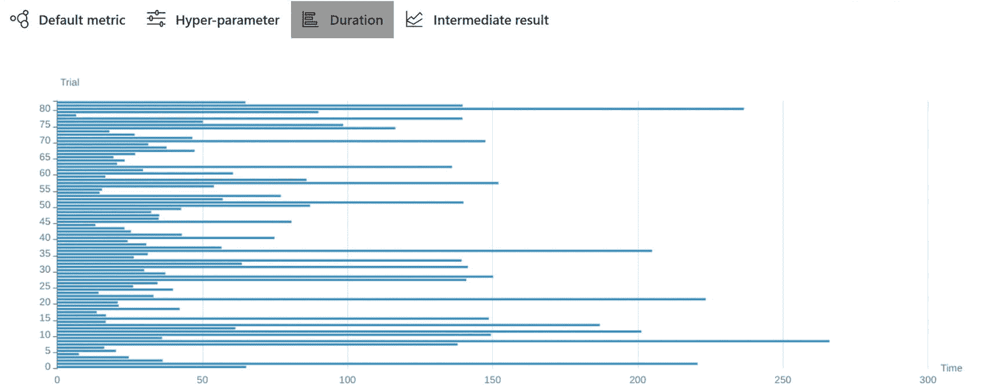

图 7-1

持续时间面板

**使用干燥的试验运行**来调试试验。每个试验都可以作为一个 Python 脚本手动运行，这有助于找到性能问题和瓶颈。在启动实验之前，尝试多次运行试验以检查其性能。

## 开始-停止-恢复

请记住，每个实验都可以在之后手动停止和恢复。所有实验信息都存储在 NNI 输出文件夹中（路径由`NNI_OUTPUT_DIR`环境变量定义，默认为`~/nni-experiments`）。因此，您可以使用以下命令在任何时候停止实验：

```py
nnictl stop 
```

and resume it with

```py
nnictl resume 
```

您可以使用以下脚本恢复嵌入式实验：

```py
from time import sleep
from nni.experiment import Experiment
experiment = Experiment('local')
experiment.resume('experiment_id', port)
while True:
sleep(1)
if experiment.get_status() == 'DONE':
break
```

这在需要重新启动执行机器或实验因某些原因崩溃时可能很有用。还可能恢复完成的实验以重新分析其结果。

## 继续完成的实验

假设实验已经停止满足终止条件（`maxTrialNumber` 或 `maxExperimentDuration`），但你并不满意结果，想要继续实验。在这种情况下，你可以通过在 WebUI 中更改终止条件来恢复已完成的实验。例如，图 7-2 展示了 `maxTrialNumber` 的更新。

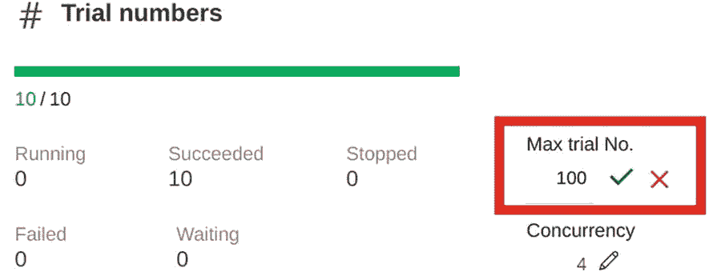

图 7-2

更新 maxTrialNumber

你也可以使用 WebUI 更新实验配置和搜索空间。

## NNI 和 TensorBoard

NNI 可以与 TensorBoard 集成。如果你想要可视化额外的 Trial 指标，这非常实用。让我们看看如何将 NNI 与 TensorBoard 集成的示例。请确保你的环境中已安装 tensorboard。列表 7-1 展示了一个使用 TensorBoard 格式写入指标的虚拟 Trial 实现。

```py
import os
from random import random
import nni
Listing 7-1
NNI and TensorBoard. ch7/tb/trial.py
```

最简单的方法是使用 `torch.utils.tensorboard.SummaryWriter` 类将指标导出到 tensorboard 日志：

```py
from torch.utils.tensorboard import SummaryWriter
```

初始化 `SummaryWriter`：

```py
log_dir = os.path.join(os.environ["NNI_OUTPUT_DIR"], 'tensorboard')
writer = SummaryWriter(log_dir)
```

Trial 入口点：

```py
if __name__ == '__main__':
p = nni.get_next_parameter()
for i in range(100):
```

计算虚拟指标：

```py
acc = min((i + random() * 10) / 100, 1)
loss = max((100 - i + random() * 10) / 100, 0)
```

将指标写入 tensorboard 日志：

```py
writer.add_scalar('Accuracy', acc, i)
writer.add_scalar('Loss', loss, i)
nni.report_intermediate_result(acc)
nni.report_final_result(acc)
```

你可以使用以下命令运行使用列表 7-1 中的 Trial 的虚拟实验：

```py
nnictl create --config=ch7/tb/config.yml
```

一旦实验开始，你可以转到 Trials 详细页面上的 Trial 作业面板，选择你想要分析的 Trials，然后点击 TensorBoard 按钮，如图 7-3 所示。

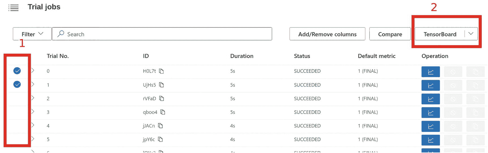

图 7-3

启动 TensorBoard

点击 TensorBoard 按钮后，NNI 会启动 TensorBoard 进程，将 Trial 日志目录作为输入，并将浏览器重定向到其网页。图 7-4 显示了 TensorBoard 面板，其中包含我们在列表 7-1 中定义的虚拟试验期间收集的指标。

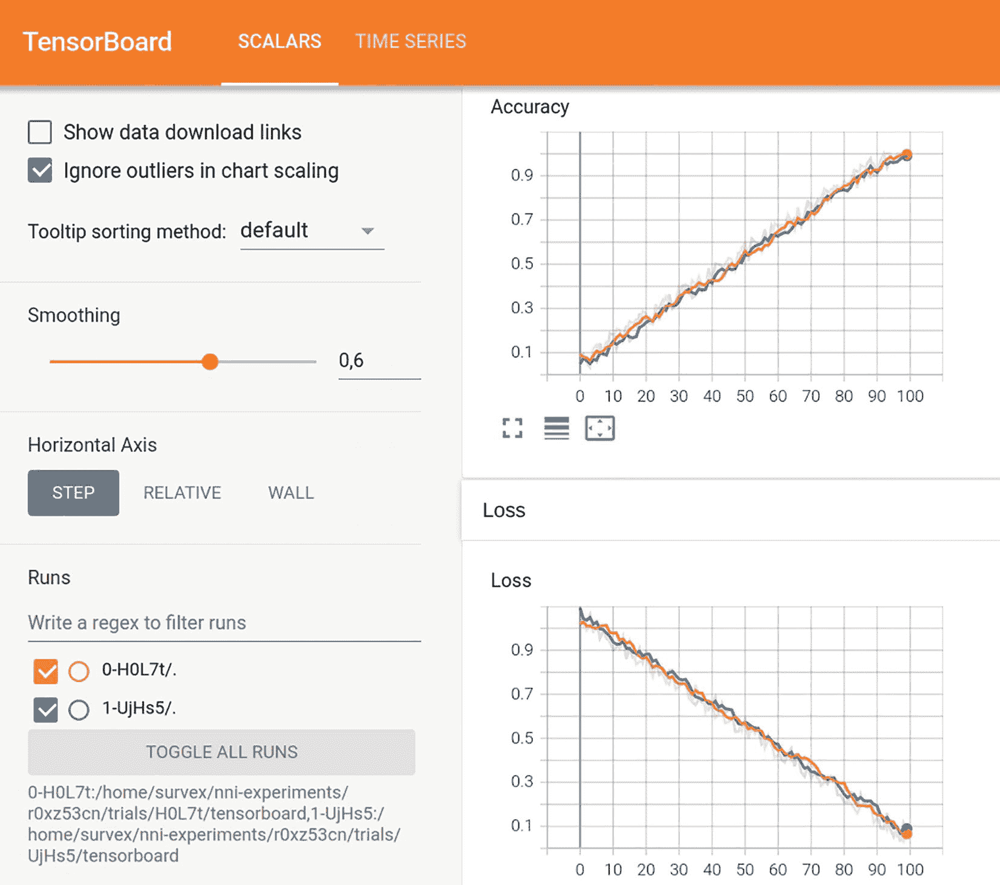

图 7-4

TensorBoard 显示 Trial 指标

NNI 运行实际的 TensorBoard 进程，所以当你完成时可以停止它，如图 7-5 所示。

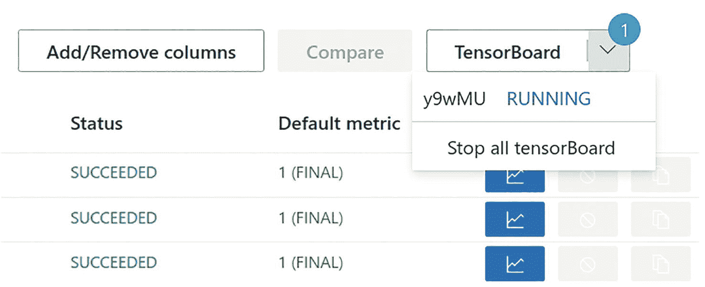

图 7-5

停止 TensorBoard 进程

在你的 NNI 实验中集成 TensorBoard 可以帮助你分析 Trial 结果和整个实验进度。

## 将实验移至另一服务器

所有关于实验的信息都存储在 `NNI_OUTPUT_DIR/<experiment_id>` 文件夹中（默认为 `~/nni-experiments/<experiment_id>`），因此你可以轻松地将实验数据移至另一服务器以在那里恢复。你只需要停止实验，将文件夹移至另一服务器，然后恢复实验。图 7-6 展示了这种方法。

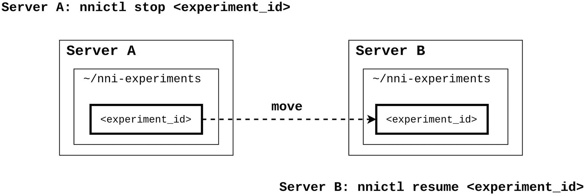

图 7-6

将实验移至另一服务器

如果你想要将实验移至更强大的服务器，或者想要分享实验结果，可以使用这个技巧。

## 扩展实验

缩放是加快实验执行的最自然方法。您可以使用多个服务器来分配试验作业。NNI 实现了训练服务概念。训练服务是一个执行试验作业的环境。在这本书中，我们只使用了本地训练服务，这意味着所有计算都在本地机器上完成。但您可以使用各种远程训练服务来组织实验。NNI 2.7 支持以下环境作为训练服务：

+   **本地**：在本地机器上运行试验作业

+   **远程**：使用 ssh 在远程机器上运行试验作业

+   **OpenPAI**：在 Microsoft Open Platform for AI 服务器上运行试验作业

+   **AML**：在 Azure 机器学习服务器上运行试验作业

+   **混合**：允许设置多个不同的训练服务

许多搜索算法允许并发试验执行，因此您可以横向扩展实验，显著提高其速度。图 7-7 说明了这个概念。

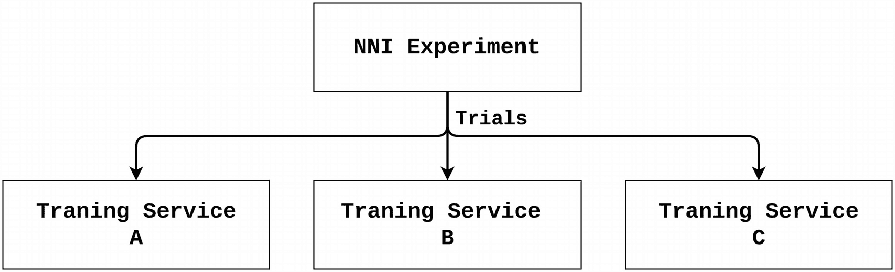


横向扩展

让我们看看一个使用远程训练服务的示例配置。

常见配置部分：

```py
trialConcurrency: 4
maxTrialNumber: 100
searchSpace:
x:
_type: quniform
_value: [1, 100, 0.1]
trialCodeDirectory: .
trialCommand: python3 trial.py
tuner:
name: Random
```

远程训练服务设置。`nniManagerIp`用作主机实验地址，以从运行在远程机器上的试验作业发送指标：

```py
nniManagerIp:  # example: 10.10.120.20
trainingService:
platform: remote
```

使用 ssh 访问列出远程机器：

```py
machineList:
- host:  # example: 10.10.120.21
user:  # example: nni_user
password:  # example: nni_user_pass
pythonPath:  # example: /opt/python3/bin
- host:  # example: 10.10.120.22
user:  # example: nni_user
password:  # example: nni_user_pass
pythonPath:  # example: /opt/python3/bin
```

您可以在嵌入式（独立）NNI 模式下应用远程训练服务，如下所示：

```py
# Loading Packages
from nni.experiment import Experiment, RemoteConfig, RemoteMachineConfig
from pathlib import Path
```

远程训练服务参数：

```py
nni_host_ip = '10.10.120.20'
remote_ip = '10.10.120.21'
remote_ssh_user = 'nni_user'
remote_ssh_pass = 'nni_pass'
remote_python_path = '/opt/python3/bin'
```

常见实验配置：

```py
# Defining Search Space
search_space = {
"x": {"_type": "quniform", "_value": [1, 100, .1]}
}
# Experiment Configuration
experiment = Experiment('remote')
experiment.config.experiment_name = 'Remote Experiment'
experiment.config.trial_concurrency = 4
experiment.config.trial_command = 'python3 trial.py'
experiment.config.trial_code_directory = Path(__file__).parent
experiment.config.max_trial_number = 1000
experiment.config.search_space = search_space
experiment.config.tuner.name = 'Random'
```

远程训练服务配置：

```py
experiment.config.nni_manager_ip = nni_host_ip
remote_service = RemoteConfig()
remote_machine = RemoteMachineConfig()
remote_machine.host = remote_ip
remote_machine.user = remote_ssh_user
remote_machine.password = remote_ssh_pass
remote_machine.python_path = remote_python_path
remote_service.machine_list = [remote_machine]
experiment.config.training_service = remote_service
```

启动 NNI：

```py
http_port = 8080
experiment.start(http_port)
```

处理事件循环：

```py
while True:
if experiment.get_status() == 'DONE':
break
```

远程服务器必须安装与实验主机服务器相同的 Python 环境。NNI 将实验信息复制到远程服务器，并在实验期间执行试验作业。以下是在远程服务器上执行的试验过程示例：

```py
python3 -m nni.tools.trial_tool.trial_runner --job_pid_file /tmp/nni-experiments/5jixfy3o/envs/XfJ9j/pid
```

NNI 提供了关于训练服务的丰富解释。请参阅官方文档以获取更多详细信息：[`https://nni.readthedocs.io/`](https://nni.readthedocs.io/)。

## 共享存储

在上一节中我们考虑的 NNI 缩放有一个严重的缺点。训练服务只向实验主机服务器返回试验指标（`nni.report_intermediate_result`和`nni.report_final_result`）。所有试验日志都存储在它们执行的机器上，如图 7-8 所示。

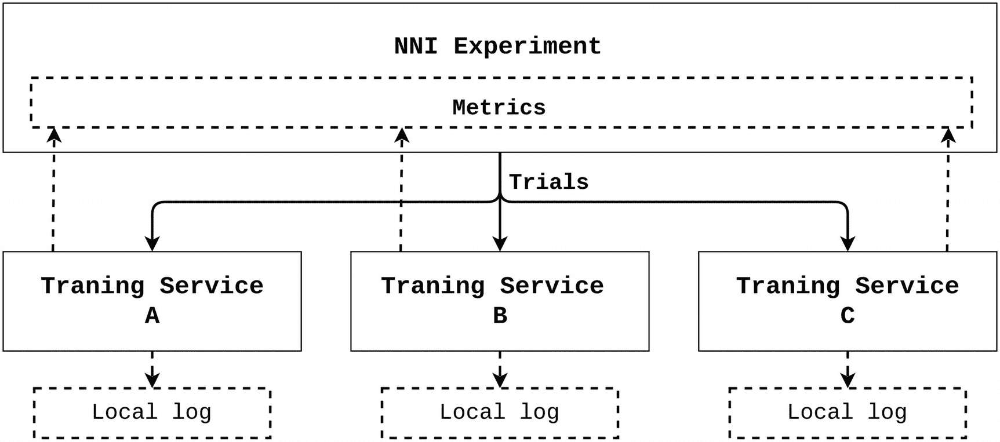


本地日志

这并不方便，因为日志位于不同的位置。

为了解决这个问题，NNI 提供了一个共享存储实现，允许您将所有试验日志存储在一个地方，NNI 实验可以访问。图 7-9 描绘了具有共享存储的 NNI 实验架构。

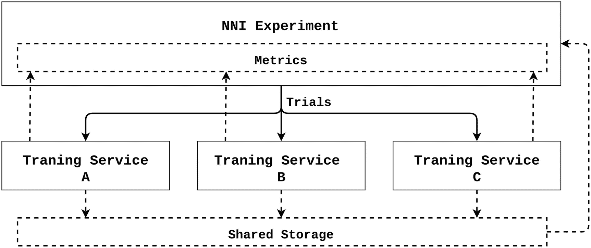

图 7-9

共享存储

在实验中实现共享存储有两种方式：NFS 和 Azure Blob。以下是 NFS 共享存储的示例配置：

```py
# Experiment Configuration
...
# Training Service Configuration
...
# Shared Storage Configuration
sharedStorage:
storageType: NFS
localMountPoint: ${your/local/mount/point}
remoteMountPoint: ${your/remote/mount/point}
nfsServer: ${nfs-server-ip}
exportedDirectory: ${nfs/exported/directory}
localMounted: nnimount
# Values for localMounted:
# usermount: means you have already mount this storage on localMountPoint
# nnimount: means nni will try to mount this storage on localMountPoint
# nomount: means storage will not mount in local machine, will support partial storages in the future
```

请参阅官方文档以获取有关共享存储实现的更多详细信息：[`https://nni.readthedocs.io/`](https://nni.readthedocs.io/)。

## 带有检查点和 TensorBoard 的 One-Shot NAS

本章中我们研究过的所有模式都适用于 HPO 和 Multi-trial NAS，但它们对 One-shot NAS 无用。实际上，One-shot NAS 是一个特例，它有以下限制：

+   无法停止和恢复

+   没有训练过程的可视化

+   发生错误后无法恢复

+   无法转移到另一个服务器

这些限制相当严重，使得使用这种方法的工作变得更为困难。让我们以 PyTorch LeNet Supernet（ch7/one_shot_nas/pt_lenet.py）和 `DartsTrainer` 实现为例，尝试消除所有这些限制。

`DartsTrainer` 接受用户定义的方法，该方法在训练过程中计算 Supernet 准确率。为了可视化训练过程，我们可以使用 `SummaryWriter` 进行 tensorboard 日志记录，它会记录每次训练迭代的准确率。列表 7-2 展示了如何可视化训练进度。

（完整代码在相应的文件中提供：ch7/one_shot_nas/pt_utils.py。）

```py
from torch.utils.tensorboard import SummaryWriter
Listing 7-2
Injecting TensorBoard logging in accuracy method
```

初始化 `SummaryWriter`：

```py
cd = os.path.dirname(os.path.abspath(__file__))
dt = datetime.now().strftime("%Y-%m-%d_%H-%M-%S")
tb_summary = SummaryWriter(f'{cd}/runs/{dt}')
iter_counter = 0
```

为 `DartsTrainer` 计算 `Supernet` 准确率的方法：

```py
def accuracy(output, target, topk = (1,)):
global iter_counter
...
```

计算 `results`：

```py
res = dict()
for k in topk:
correct_k = correct[:k].reshape(-1).float().sum(0)
accuracy = correct_k.mul_(1.0 / batch_size).item()
```

将准确率传递到 TensorBoard 日志中：

```py
tb_summary.add_scalar('darts_lenet', accuracy, iter_counter)
iter_counter += 1
res["acc{}".format(k)] = accuracy
return res
```

在准确率方法中注入 TensorBoard 日志记录允许可视化 Supernet 训练进度。但主要问题是 One-shot NAS 过程非常脆弱。如果服务器崩溃或发生 `OutOfMemory` 错误，One-shot NAS 过程将停止，且无法恢复。这是一个非常严重的风险，可能导致丢失宝贵的结果和时间。让我们尝试解决这个问题。我们需要指出，One-shot NAS 训练使用类似于大多数神经网络的训练循环。One-shot NAS 算法在每次训练周期中采取特定操作以收敛到最优子网。当我们运行 `fit` 训练器方法时，我们运行训练循环。但这个训练循环可以运行多次，每次都会从 `DartsTrainer` 中重新训练 Supernet 模型。因此，我们可以将 `num_epochs` = 50 的一个 `fit` 方法分成五个 `num_epochs` = 10 的 `fit` 方法。图 7-10 阐述了这一概念。

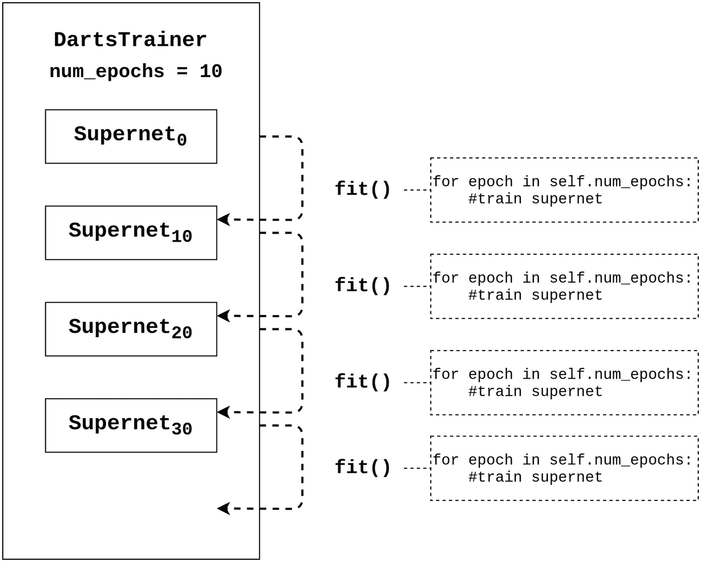

图 7-10

共享存储

我们可以做的就是在训练子周期之间导出 `DartsTrainer` 的二进制图像，创建检查点，如图 7-11 所示。

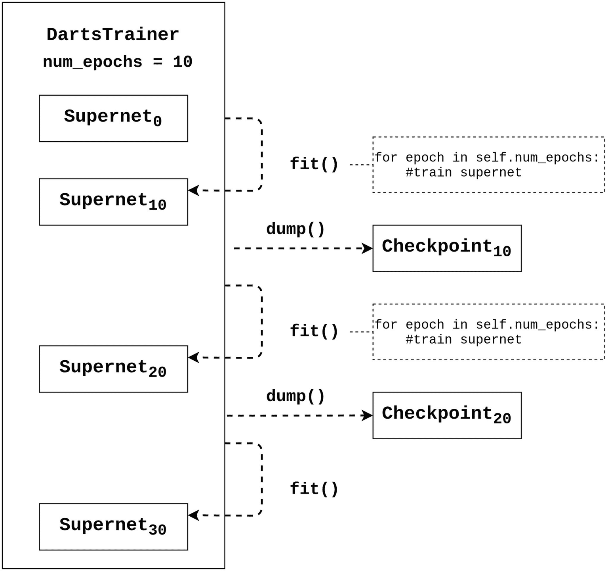

图 7-11

带有检查点的 One-shot NAS

这个技巧使我们能够解决与 One-shot NAS 过程相关的所有主要问题：

+   如果机器崩溃，进程可以恢复。

+   进程可以手动停止并在之后恢复。

+   检查点可以移动到另一台机器并在那里恢复。

列表 7-3 演示了如何实现带有检查点导出的单次 NAS 过程。

我们使用`pickle`来导出训练器二进制图像（如果需要，请安装此包）：

```py
import pickle
Listing 7-3
One-shot NAS with checkpoints. ch7/one_shot_nas/darts_train_with_checkpoint.py
```

导入其他模块：

```py
import os
from os.path import exists
import torch
import torch.nn as nn
import ch7.datasets as datasets
from nni.retiarii.oneshot.pytorch import DartsTrainer
from ch7.one_shot_nas.pt_lenet import PtLeNetSupernet
from ch7.one_shot_nas.pt_utils import accuracy
```

指定训练器检查点路径：

```py
cd = os.path.dirname(os.path.abspath(__file__))
trainer_checkpoint_path = f'{cd}/darts_trainer_checkpoint.bin'
```

以下方法为 LeNet Supernet 创建了`DartsTrainer`：

```py
def get_darts_trainer():
# Supernet
model = PtLeNetSupernet()
# Dataset
dataset_train, dataset_valid = datasets.get_dataset("mnist")
# Loss Function
criterion = nn.CrossEntropyLoss()
# Optimizer
optim = torch.optim.SGD(
model.parameters(), 0.025,
momentum = 0.9, weight_decay = 3.0E-4
)
# Trainer params
num_epochs = 0
batch_size = 256
metrics = accuracy
# DARTS Trainer
darts_trainer = DartsTrainer(
model = model,
loss = criterion,
metrics = metrics,
optimizer = optim,
num_epochs = num_epochs,
dataset = dataset_train,
batch_size = batch_size,
log_frequency = 10,
unrolled = False
)
return darts_trainer
```

以下方法训练 Supernet 指定数量的 epoch，并导出训练器：

```py
def train_and_dump(darts_trainer, epochs):
"""
Trains Supernet according to DARTS algorithm
"""
darts_trainer.num_epochs = epochs
darts_trainer.fit()
with open(trainer_checkpoint_path, 'wb') as f:
pickle.dump(darts_trainer, f)
return darts_trainer
```

以下是主脚本，它根据需要从二进制检查点加载训练器，并将整个训练循环拆分为多个子循环：

```py
if __name__ == '__main__':
if exists(trainer_checkpoint_path):
with open(trainer_checkpoint_path, 'rb') as f:
trainer = pickle.load(f)
else:
trainer = get_darts_trainer()
for _ in range(10):
trainer = train_and_dump(trainer, epochs = 5)
print(f'Best model: {trainer.export()}')
```

现在，让我们运行我们之前在列表 7-3 中检查的脚本（ch7/one_shot_nas/darts_train_with_checkpoint.py）。我们可以使用 TensorBoard 可视化 One-shot NAS 过程：

```py
tensorboard --logdir=ch7/one_shot_nas/runs/
```

现在，我们可以使用以下链接监控 Supernet 训练进度：`http://localhost:6006/#scalars`。图 7-12 展示了 TensorBoard 网页。

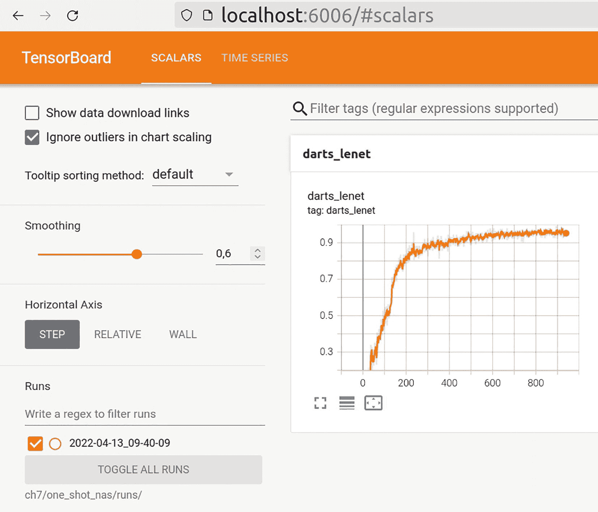

图 7-12

Supernet 训练进度

但最重要的是，您可以停止执行 ch7/one_shot_nas/darts_train_with_checkpoint.py 脚本，然后再次运行它。DartsTrainer 将从二进制检查点文件 ch7/one_shot_nas/darts_trainer_checkpoint.bin 中恢复，并继续 Supernet 训练。图 7-13 显示`DartsTrainer`从检查点继续训练，而不是从头开始。

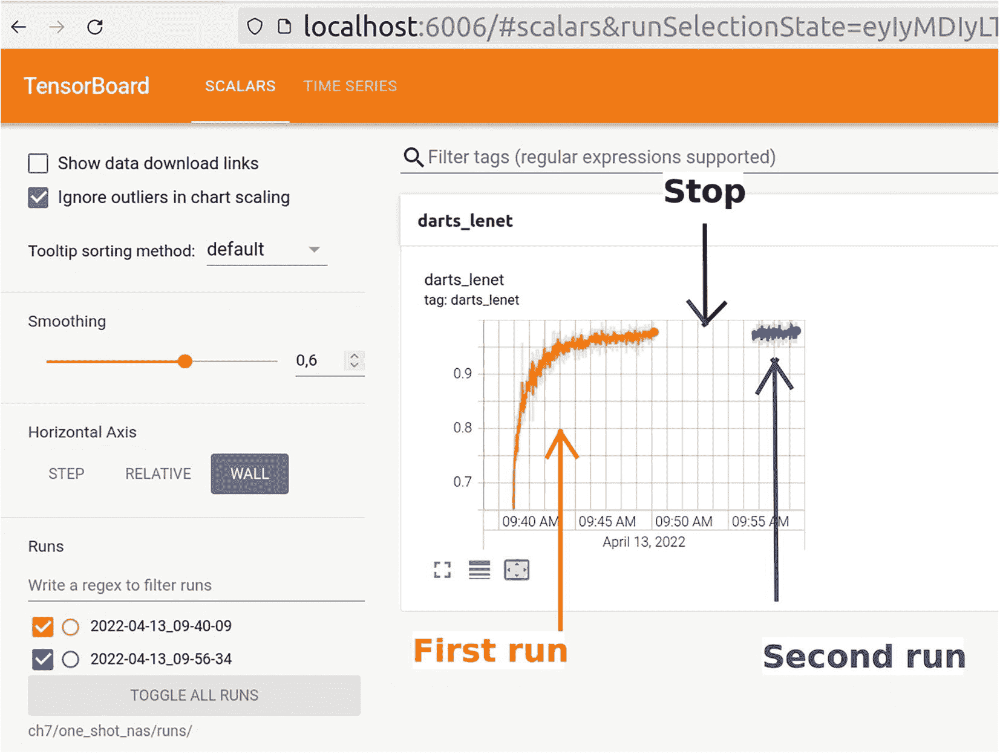

图 7-13

单次 NAS 训练恢复

这种技术允许实现真正长期的单次 NAS 实验，无需担心实验或服务器崩溃。您还可以在任何方便的时间停止和恢复实验。

## 摘要

本章探讨了几个可以简化您用户体验的技巧和模式。NNI 是一个开源的开发者友好框架，因此您可以在您的研究和实验中实现自己的想法和方法。在本章中，我们完成了本书。希望您现在能够欣赏使用 NNI 框架的有效性，并且它可以成为您日常研究活动不可或缺的工具。
