# 第一部分：Google Cloud Platform 入门

# 1. 云计算是什么？

云计算是一种实践，其中计算服务（如存储选项、处理单元和网络能力）通过互联网（云）向用户开放以供消费。这些服务从免费到按使用付费不等。

云计算背后的核心思想是使聚合的计算能力可供大规模消费。通过这样做，规模经济原理开始发挥作用，随着运营规模的增加，单位输出成本最小化。

在云计算环境中，企业和个人可以利用聚合的高性能计算服务的相同速度和力量，并且只需为他们使用的部分付费，在他们不再需要时释放这些计算资源。

云计算的概念早在现代计算机的早期就已经存在，那时从不同用户提交的任务被安排在主机上执行，这就是所谓的分时系统。随着个人电脑的出现，分时机器的想法逐渐消失。现在，随着由谷歌、微软、亚马逊、IBM 和甲骨文等大型 IT 公司管理的企业数据中心的出现，云计算的概念再次出现，并增加了多租户的概念，而不是分时。这种计算模式将颠覆我们工作和利用软件系统及服务的方式。

除了存储、网络和处理服务之外，云计算还提供其他产品解决方案，例如数据库、人工智能和数据分析能力以及无服务器基础设施。

## 云解决方案的分类

云是一个术语，描述的是由称为数据中心的一组计算机组成的庞大集合。这些集群化的机器可以通过仪表板、命令行界面、REST API 和客户端库进行交互。数据中心通常分布在多个地理位置。数据中心的大小超过 10 万平方英尺（而且那些还是较小的尺寸！）。云计算解决方案可以广泛分为三类，即公共云、私有云和混合云。让我们简要讨论一下：

+   公共云：公共云是传统的云计算模式，云服务提供商将他们的计算基础设施和产品提供给其他企业和个人（见图 1-1）使用。在公共云中，云服务提供商负责管理硬件配置和提供服务。

    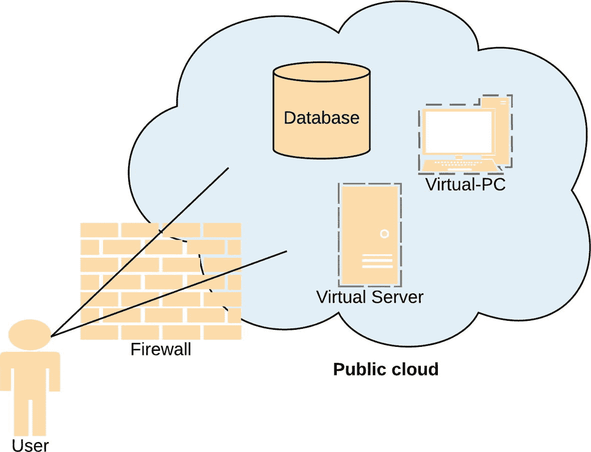

    图 1-1

    公共云

+   私有云：在私有云中，组织完全负责其计算基础设施的管理和服务。私有云中的机器可以位于本地，或者可以由云服务提供商托管，但通过私有网络进行路由。

+   混合云：混合云是公共云的成本和效率与私有云的数据主权和内部安全保证之间的折中方案。许多公司和机构通过使用技术解决方案来促进本地和基于云的基础设施之间数据的轻松迁移和共享，选择混合云和多云。

## 云计算模型

云计算也被分为三种服务交付模型。它们如图 1-2 所示，其中随着我们接近金字塔的顶端，基础设施抽象的层级逐渐增加：

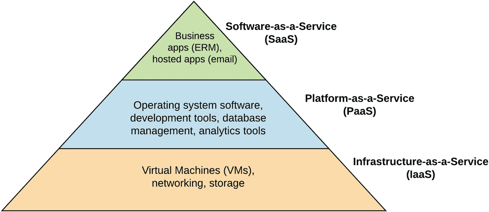

图 1-2

云计算模型

+   基础设施即服务（IaaS）：此模型最适合那些想要管理其数据和应用程序所承载的硬件基础设施的企业或个人。这种细粒度管理级别需要必要的系统管理技能。

+   平台即服务（PaaS）：在 PaaS 模型中，硬件配置由云服务提供商管理，以及其他系统和开发工具。这使用户能够专注于业务逻辑，以便快速轻松地部署应用程序和数据库解决方案。与 PaaS 一起出现的另一个概念是**无服务器**，其中云服务提供商管理一个可扩展的基础设施，根据需求利用和释放资源。

+   软件即服务（SaaS）：SaaS 模型对公众来说最为熟悉，因为许多用户在与 SaaS 应用程序交互时并不知道。SaaS 应用程序的典型例子包括企业电子邮件套件，如 Gmail、Outlook 和 Yahoo! Mail。其他还包括存储平台如 Google Drive 和 Dropbox，照片软件如 Google Photos，以及 CRM 电子套件如 Salesforce 和 Oracle E-business Suite。

在本章中，我们通过解释不同的云解决方案类别和云服务交付的模型，总结了云计算的实践。

第一部分接下来的章节将介绍谷歌云平台基础设施和服务，并介绍用于原型设计机器学习模型以及进行数据科学和分析任务的 JupyterLab 实例。

# 2. 谷歌云平台服务概述

Google Cloud Platform 提供了一系列服务，用于保护、存储、提供和分析数据。这些云服务形成了一个安全的数据云边界，可以在不离开云生态系统的情况下对数据进行不同的操作和转换。

Google Cloud 提供的计算服务包括计算、存储、大数据/分析、人工智能（AI）以及其他网络、开发和管理服务。让我们简要回顾一下 Google Cloud 生态系统的某些功能。

## 云计算

Google Compute 提供了一系列产品，如图 2-1 所示，以满足广泛的计算需求。计算产品包括计算引擎（用于自定义处理的虚拟计算实例）、App Engine（用于开发网页、移动和物联网应用的云管理平台）、Kubernetes Engine（基于 Kubernetes 的自定义 docker 容器的编排管理器）、容器注册库（私有容器存储）、无服务器云函数（连接或扩展云服务的基于云的函数）和 Cloud Run（自动扩展您的无状态容器的托管计算平台）。

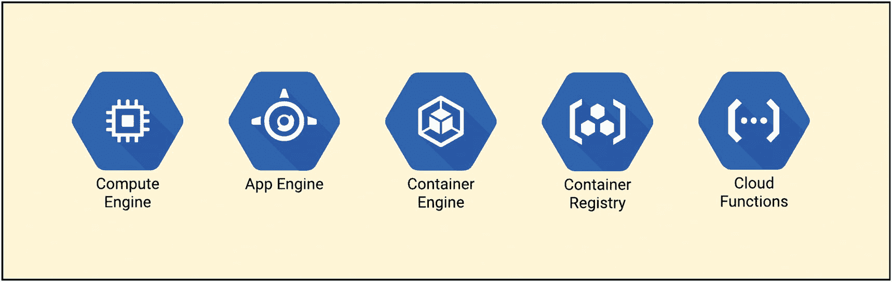

图 2-1

云计算服务

对于我们的机器学习建模目的，我们将关注云计算引擎。正如在第六章节中看到的，JupyterLab 将提供所有相关的工具、包和框架，用于数据分析和建模机器学习和深度学习解决方案。

## 云存储

Google Cloud Storage 选项提供云边界内实时存储访问，可扩展的存储访问用于实时和存档数据。以云存储为例，其设置是为了满足任何可想象到的存储需求。存储在云存储上的数据随时可用，并且可以从全球任何地点访问。更重要的是，这种巨大的存储能力几乎可以忽略不计的成本，考虑到存储数据的大小和经济效益。此外，考虑到云存储提供的可访问性、安全性和一致性，这种成本是物有所值的。

图 2-2 中所示的云存储产品包括云存储（通用存储平台）、云 SQL（云管理的 MySQL 和 PostgreSQL）、云 Bigtable（NoSQL 宇节存储）、云 Spanner（可扩展/高可用事务存储）、云 Datastore（事务型 NoSQL 数据库）和持久磁盘（虚拟机的块存储）。

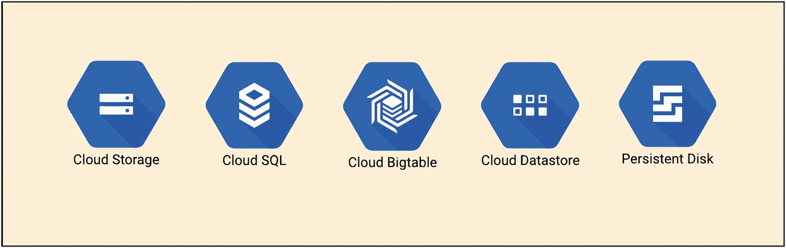

图 2-2

云存储产品

## 大数据和数据分析

Google Cloud Platform 提供了一系列无服务器大数据和数据分析解决方案，用于数据仓库、流和批量分析、云管理的 Hadoop 生态系统、基于云的消息系统以及数据探索。这些服务提供了从大数据中挖掘/生成实时智能的多个视角。

图 2-3 中显示的大数据服务示例包括 Cloud BigQuery（无服务器分析/数据仓库平台）、Cloud Dataproc（完全管理的 Hadoop/Apache Spark 基础设施）、Cloud Dataflow（批量/流数据转换/处理）、Cloud Dataprep（用于分析清洗非结构化/结构化数据的无服务器基础设施）、Cloud Datastudio（数据可视化/报告仪表板）、Cloud Datalab（用于机器学习/数据分析的托管 Jupyter 笔记本）和 Cloud Pub/Sub（无服务器消息基础设施）。

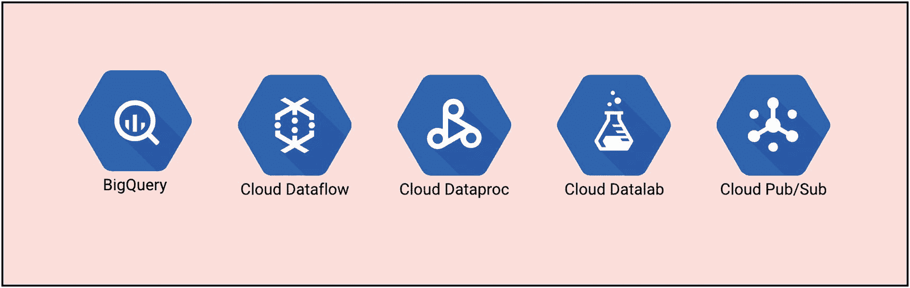

图 2-3

大数据/分析无服务器平台

## 云人工智能 (AI)

Google Cloud AI 为企业和个人提供云服务，通过使用 REST API 利用预训练模型来执行定制人工智能任务。它还公开了用于开发针对特定用例的定制模型的服务，例如用于图像分类和对象检测任务的 AutoML Vision 以及用于在结构化数据上部署 AI 模型的 AutoML tables。

图 2-4 中的 Google Cloud AI 服务包括 Cloud AutoML（利用迁移学习训练定制机器学习模型）、Cloud Machine Learning Engine（用于大规模分布式训练和部署机器学习模型）、Cloud TPU（快速训练大规模模型）、视频智能（训练定制视频模型）、Cloud Natural Language API（从文档中提取/分析文本）、Cloud Speech API（将音频转录为文本）、Cloud Vision API（图像分类/分割）、Cloud Translate API（从一种语言翻译到另一种语言）和 Cloud Video Intelligence API（从视频文件中提取元数据）。

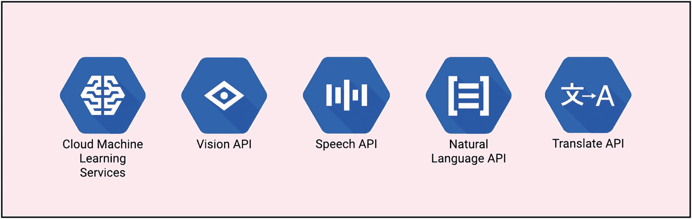

图 2-4

云 AI 服务

本章提供了对 Google Cloud Platform 上提供的产品和服务的概述。

下一章将介绍 Google Cloud 软件开发工具包 (SDK)，用于在本地机器的命令行上与云资源交互，以及 GCP 上的云命令行界面 (CLI)，通过云控制台界面执行相同的操作。

# 3. Google Cloud SDK 和 Web CLI

GCP 提供了命令行界面 (CLI) 用于与云产品和服务交互。GCP 资源可以通过 GCP 上的基于 Web 的 CLI 或者在本地机器上安装 Google Cloud 软件开发工具包 (SDK) 来访问，以通过本地命令行终端与 GCP 交互。

GCP 包含了广泛的 GCP 产品（如 Compute Engine、Cloud Storage、Cloud ML Engine、BigQuery 和 Datalab 等）的 shell 命令，仅举几例。Cloud SDK 的主要工具包括

+   gcloud 工具：负责 GCP 上的云认证、配置和其他交互

+   gsutil 工具：负责与 Google Cloud Storage 存储桶和对象交互

+   bq 工具：用于通过命令行与 Google BigQuery 交互和管理

+   kubectl 工具：用于在 GCP 上管理 Kubernetes 容器集群

Google Cloud SDK 还为开发者安装了客户端库，以便通过 API 以编程方式与 GCP 产品和服务交互。1 截至撰写本文时，Go、Java、Node.js、Python、Ruby、PHP 和 C# 语言已覆盖。预计还将添加更多语言。

本章将介绍如何在 GCP 上设置账户、安装 Google Cloud SDK，然后使用 CLI 探索 GCP 命令。

## 在 Google Cloud Platform 上设置账户

本节展示了如何在 Google Cloud Platform 上设置账户。GCP 账户可以访问平台上的所有产品和服务。对于新账户，将获得 300 美元的信用额度，在 12 个月内使用。这个优惠非常不错，因为它提供了充足的时间来探索 Google 云服务提供的不同功能和服务。

注意，注册账户时需要一张有效的信用卡以验证其为真实用户，而非机器人。然而，试用结束后，除非 Google 授权，否则信用卡不会被扣费：

1.  前往[`https://cloud.google.com/`](https://cloud.google.com/) 打开账户（见图 3-1）。

    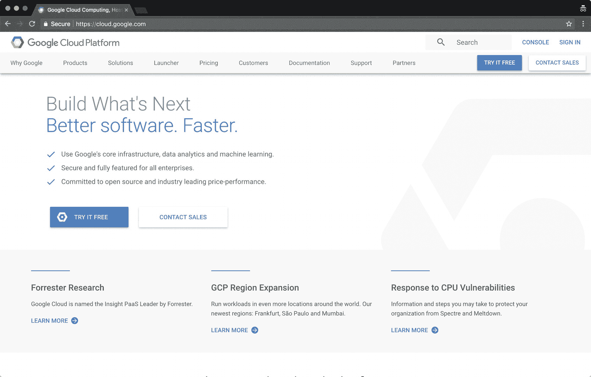

    图 3-1

    Google Cloud Platform 登录页面

1.  填写必要的身份信息、地址和信用卡详情。

1.  在平台上创建账户时，请稍等片刻（见图 3-2）。

    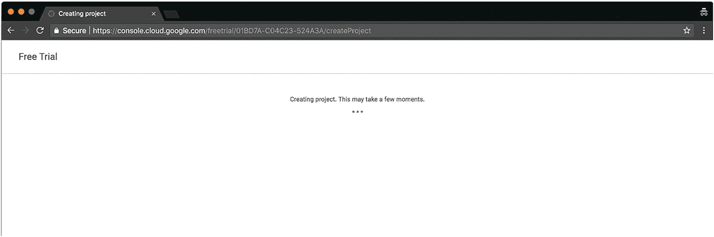

    图 3-2

    创建账户

1.  账户创建后，我们将看到“欢迎来到 GCP”页面（见图 3-3）。

    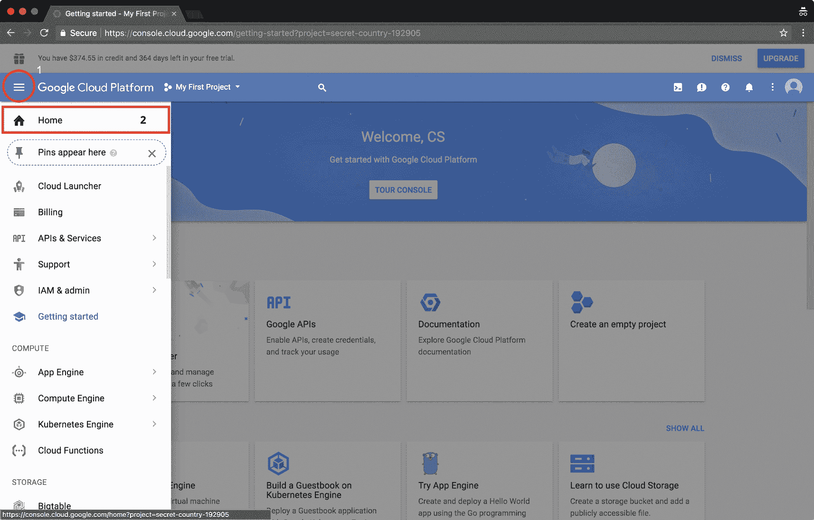

    图 3-3

    欢迎来到 GCP

1.  点击页面左上角的三个横杠图标（如图 3-3 中所示，用圆圈标记），然后点击“主页”（如图 3-3 中所示，用矩形标记）以打开 Google Cloud Platform 控制台（如图 3-4）。

    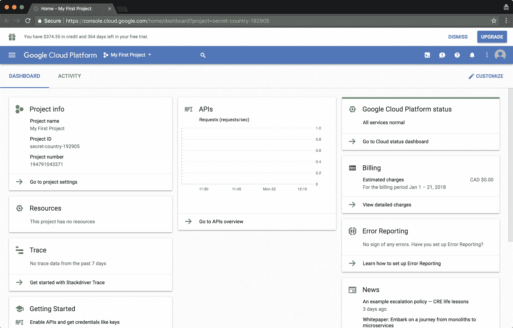

    图 3-4

    GCP 控制台

云控制台提供了项目的鸟瞰概览，例如当前的计费速率和其他资源使用统计信息。右侧的活动选项卡提供了在账户上执行的资源操作的细分。此功能在构建事件审计跟踪时非常有用。

## GCP 资源：项目

Google Cloud Platform 的所有服务和功能统称为资源。这些资源按层次结构排列，顶级是项目。项目就像一个容器，包含了所有 GCP 资源。账户的计费与项目相关联。可以为账户创建多个项目。在处理 GCP 之前必须创建项目。

要查看图 3-5 中的账户项目，点击云控制台中的**作用域选择器**（如图 3-6 中所示，用椭圆形标记）。

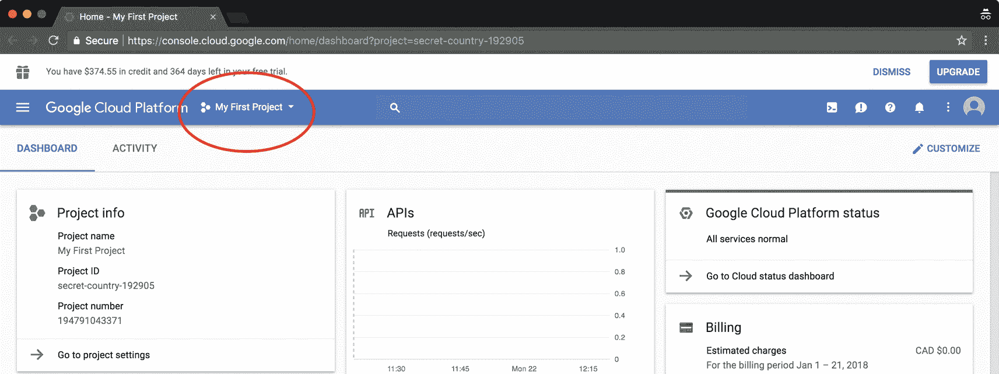

图 3-6

选择项目的范围选择器

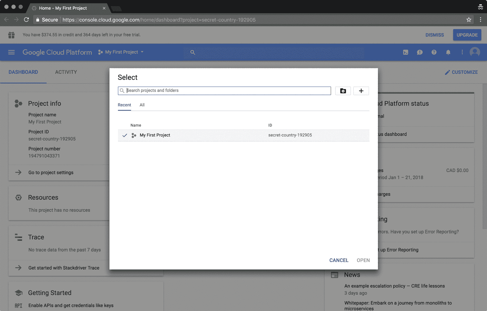

图 3-5

选择项目

## 访问云平台服务

要访问云平台上的资源，点击窗口右上角的三个短横线。分组的服务提供用于组织资源。例如，在图 3-7 中，我们可以看到 **STORAGE** 下的产品：Bigtable、Datastore、Storage、SQL 和 Spanner。

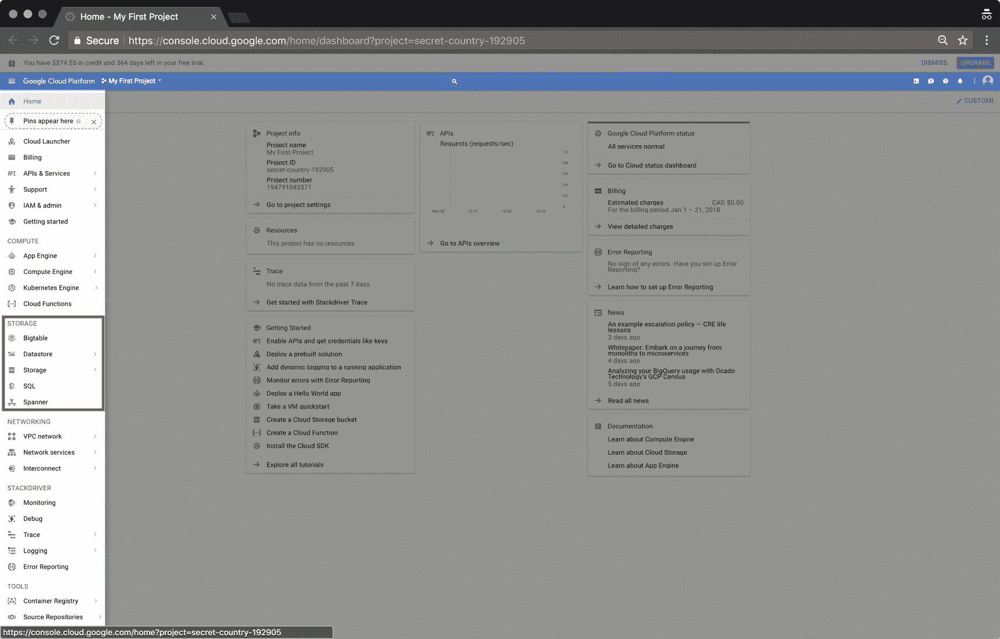

图 3-7

Google Cloud Platform 服务

## 账户用户和权限

GCP 允许您为特定项目中的每个资源定义安全角色和权限。当项目扩展到多个用户时，此功能特别有用。通过 IAM & 管理标签（见图 3-8 和 3-9）为用户创建新的角色和权限。

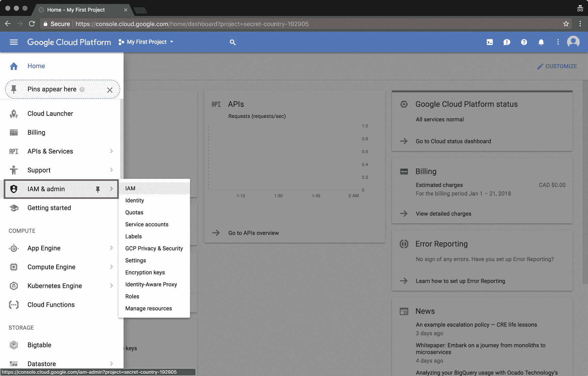

图 3-8

打开 IAM & 管理员

## Cloud Shell

Cloud Shell 是处理 GCP 资源的重要组件。Cloud Shell 配置了一个临时虚拟机，安装了用于与 GCP 资源交互的命令行工具。它为用户提供基于云的命令行访问，可以直接从 GCP 周围操作资源，而无需在本地机器上安装 Google Cloud SDK。

通过点击窗口左上角的**提示图标**可以访问 Cloud Shell。见图 3-9，3-10 和 3-11。

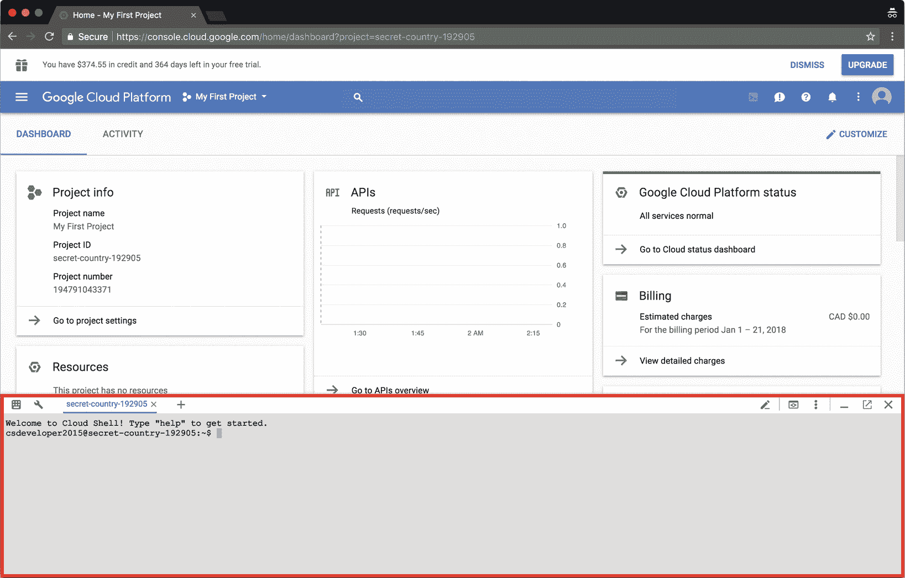

图 3-11

云 Shell 接口

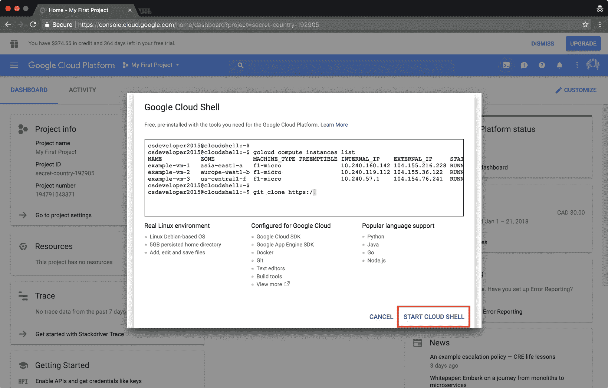

图 3-10

启动 Cloud Shell


图 3-9

激活 Cloud Shell

## Google Cloud SDK

Google Cloud SDK 在本地机器的终端上安装用于与云资源交互的命令行工具：

1.  前往[`https://cloud.google.com/sdk/`](https://cloud.google.com/sdk/)下载并安装适用于您的机器类型的适当 Cloud SDK（参见图 3-12）。

    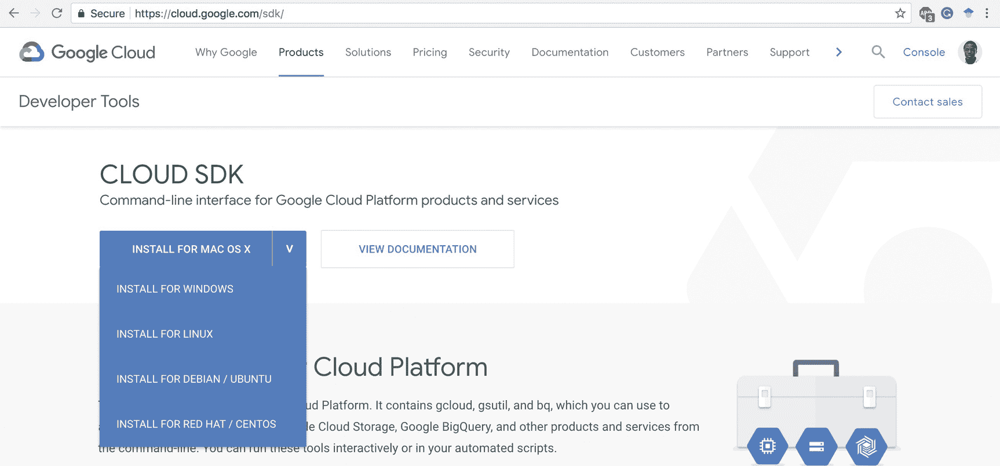

    图 3-12

    下载 Google Cloud SDK

1.  按照操作系统 (OS) 类型的说明安装 Google Cloud SDK。安装将安装默认的 Cloud SDK 组件。

1.  打开您的操作系统终端应用程序并运行命令‘gcloud init’以开始授权和配置 Cloud SDK。

    ```py
    gcloud init
    Welcome! This command will take you through the configuration of gcloud.
    Pick configuration to use:
    [1] Create a new configuration
    Please enter your numeric choice:  1
    ```

1.  选择配置的名称。在此，它被设置为名称‘your-email-id’。

    ```py
    Enter configuration name. Names start with a lower case letter and
    contain only lower case letters a-z, digits 0-9, and hyphens '-': your-email-id
    Your current configuration has been set to: [your-email-id]
    ```

1.  选择用于配置的 Google 账户。浏览器将打开以登录所选账户（参见图 3-13、3-14 和 3-15）。然而，如果希望进行纯终端初始化，用户可以运行‘gcloud init --console-only’。

    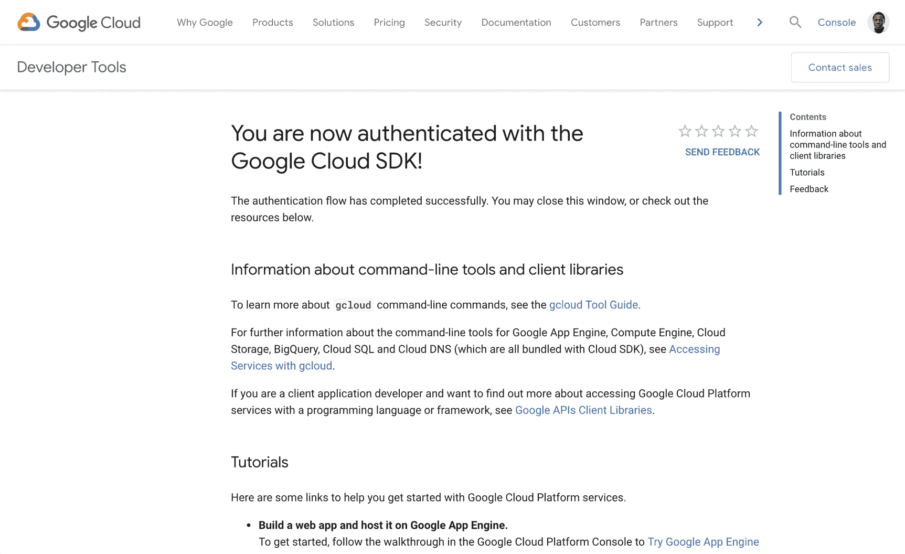

    图 3-15

    Cloud SDK 认证确认页面

    

    图 3-14

    认证 Cloud SDK 以访问 Google 账户

    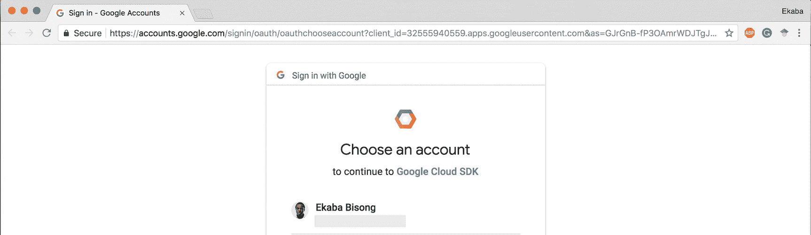

    图 3-13

    选择授权 Cloud SDK 配置的 Google 账户

    ```py
    Choose the account you would like to use to perform operations for
    this configuration:
    [1] Log in with a new account
    Please enter your numeric choice:  1
    Your browser has been opened to visit:
    https://accounts.google.com/o/oauth2/auth?redirect_uri=......=offline
    ```

1.  在 Google 账户的基于浏览器的身份验证后，选择要使用的云项目。

    ```py
    You are logged in as: [your-email-id@gmail.com].
    Pick cloud project to use:
    [1] secret-country-192905
    [2] Create a new project
    Please enter numeric choice or text value (must exactly match list
    item): 1
    Your current project has been set to: [secret-country-192905].
    Your Google Cloud SDK is configured and ready to use!
    * Commands that require authentication will use your-email-id@gmail.com by default
    * Commands will reference project `secret-country-192905` by default
    Run `gcloud help config` to learn how to change individual settings
    This gcloud configuration is called [your-configuration-name]. You can create additional configurations if you work with multiple accounts and/or projects.
    Run `gcloud topic configurations` to learn more.
    Some things to try next:
    * Run `gcloud --help` to see the Cloud Platform services you can interact with. And run `gcloud help COMMAND` to get help on any gcloud command.
    * Run `gcloud topic -h` to learn about advanced features of the SDK like arg files and output formatting
    ```

Google Cloud SDK 现已配置完毕，准备使用。以下是一些用于管理 'gcloud' 配置的终端命令：

+   ‘gcloud auth list’：显示具有 GCP 凭证的账户，并指示当前哪个账户配置是活动的。

    ```py
    gcloud auth list
    Credentialed Accounts
    ACTIVE  ACCOUNT
    *       your-email-id@gmail.com
    To set the active account, run:
    $ gcloud config set account `ACCOUNT`
    ```

+   ‘gcloud config configurations list’：列出现有的 Cloud SDK 配置。

    ```py
    gcloud config configurations list
    NAME  IS_ACTIVE  ACCOUNT  PROJECT  DEFAULT_ZONE  DEFAULT_REGION
    your-email-id  True  your-email-id@gmail.com     secret-country-192905
    ```

+   ‘gcloud config configurations activate [CONFIGURATION_NAME]’：使用此命令激活配置。

    ```py
    gcloud config configurations activate your-email-id
    Activated [your-email-id].
    ```

+   ‘gcloud config configurations create [CONFIGURATION_NAME]’：使用此命令创建新的配置。

本章介绍了如何设置命令行访问以与 GCP 资源交互。这包括使用基于 Web 的 Cloud Shell 和安装 Cloud SDK 以通过本地机器的终端访问 GCP 资源。

在下一章中，我们将介绍 Google Cloud Storage (GCS) 用于在 GCP 上存储普遍的数据资产。

# 4. Google Cloud Storage (GCS)

Google Cloud Storage 是一个用于存储各种不同数据对象的产品。云存储可以用于存储实时和归档数据。它保证了可扩展性（可以存储越来越大的数据对象）、一致性（请求时提供最新版本）、持久性（数据在多个地理区域冗余放置以消除损失）和高度可用性（数据始终可用和可访问）。

让我们简要地浏览一下创建和删除存储桶，以及从云存储桶上传和删除文件的过程。

## 创建存储桶

如同其名，存储桶是用于在 GCP 上存储数据对象的容器。存储桶是云存储中的基本组织结构。它类似于文件系统中最顶层的目录。存储桶可以包含具有数据资产的子文件夹层次结构。

要创建存储桶，

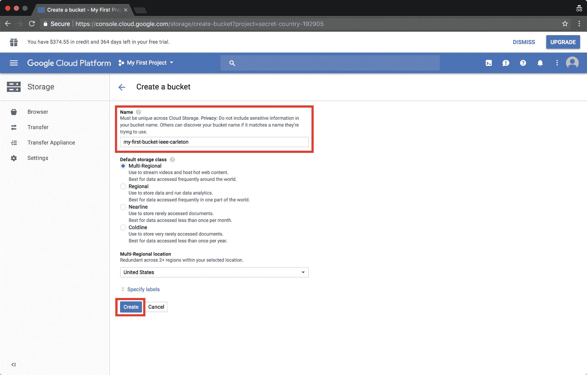

图 4-2

创建存储桶

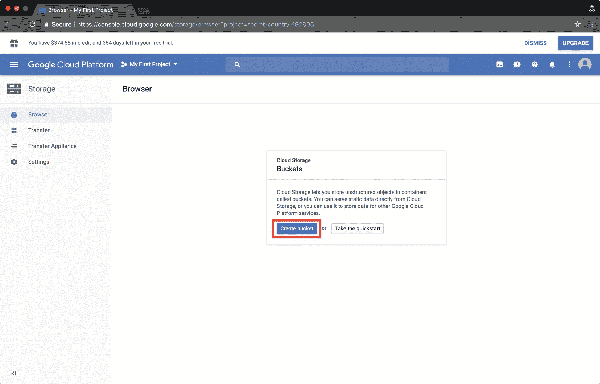

图 4-1

云存储控制台

1.  如图 4-1 所示，在云存储仪表板上点击“创建存储桶”。

1.  给存储桶起一个独特的名称（见图 4-2）。GCP 中的存储桶必须有一个全局唯一的名称。也就是说，Google Cloud 上的两个存储桶不能有相同的名称。存储桶的常见命名约定是以组织的域名作为前缀。

1.  选择存储类别。多区域存储类别适用于全球各地频繁访问的存储桶，而冷线存储则更多用于存储备份文件。目前，默认选择是合适的。

1.  点击“创建”以在 Google Cloud Storage 上设置存储桶。

## 向存储桶上传数据

单个文件或文件夹可以上传到 GCS 的存储桶中。例如，让我们从本地机器上传一个文件。

要将文件上传到 GCP 上的云存储桶，

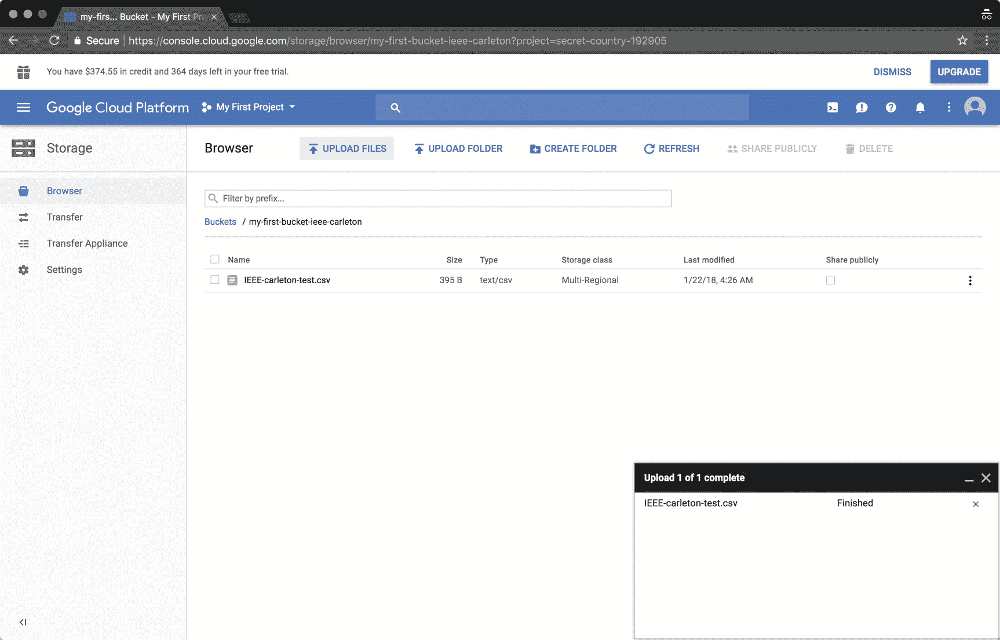

图 4-5

上传成功

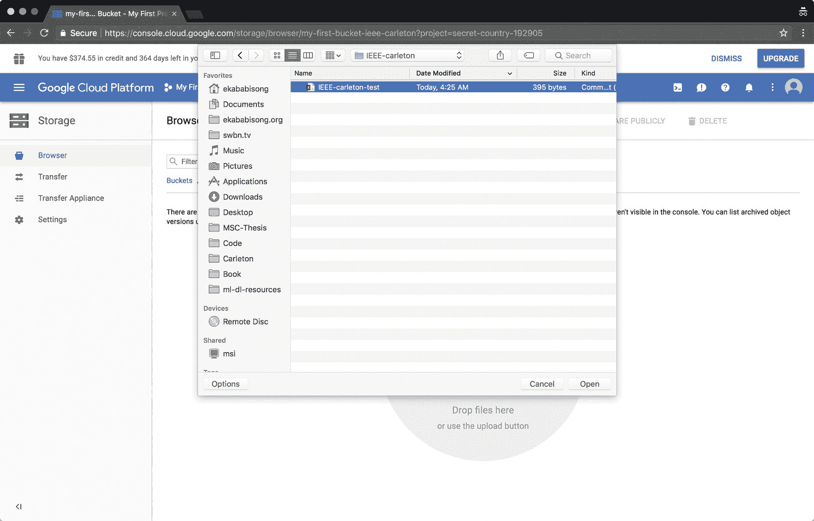

图 4-4

上传对象

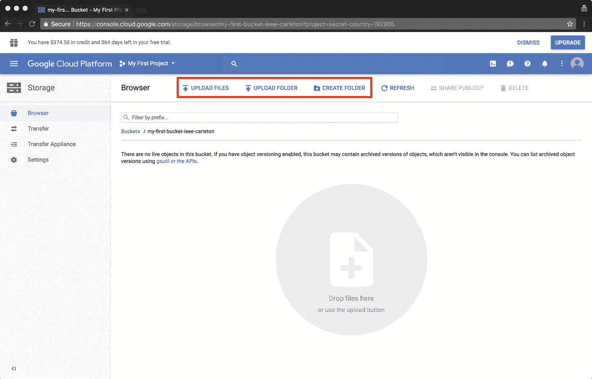

图 4-3

一个空的存储桶

1.  在图 4-3 中的红色高亮处点击“上传文件”。

1.  从文件上传窗口中选择文件，如图 4-4 所示，点击“打开”。

1.  上传完成后，文件作为 GCS 存储桶中的对象上传（见图 4-5）。

## 从存储桶中删除对象

如图 4-6 所示，点击文件旁边的复选框，然后点击“删除”来从存储桶中删除一个对象。

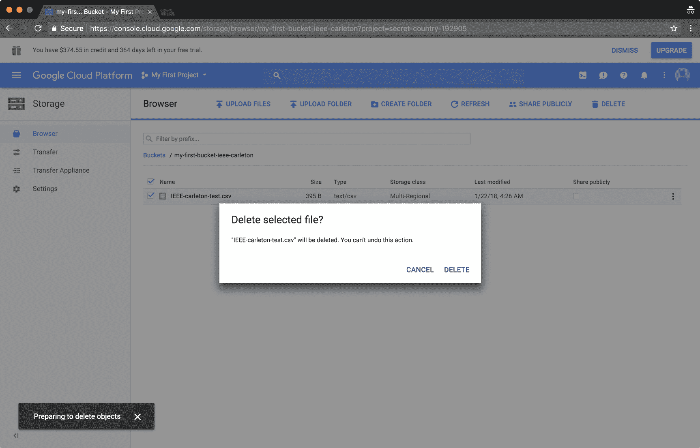

图 4-6

删除文件

## 释放存储资源

要删除存储桶或释放存储资源以防止对未使用的资源进行计费，请点击相关存储桶旁边的复选框，然后点击“删除”以移除存储桶及其内容。此操作不可恢复。请参阅图 4-7 和 4-8。

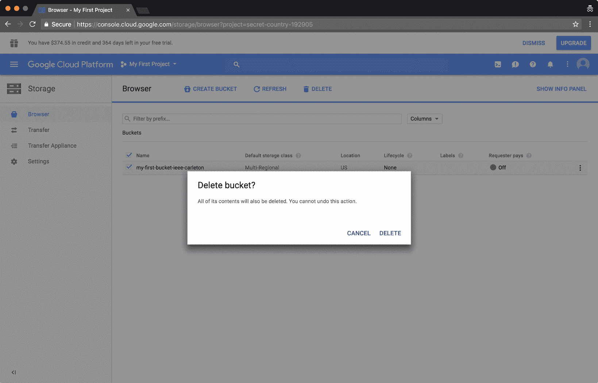

图 4-8

删除存储桶

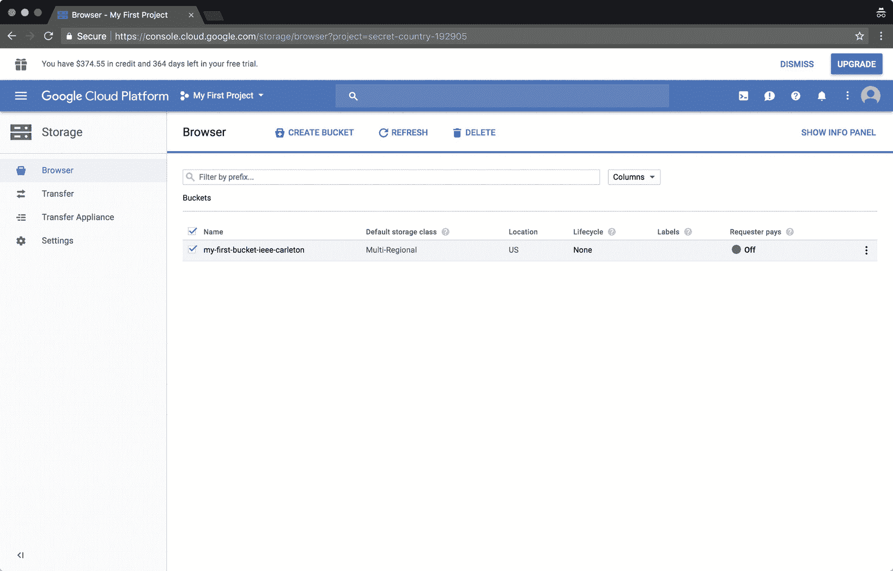

图 4-7

选择要删除的存储桶

## 在命令行中使用 GCS

在本节中，我们将从命令行界面执行创建和删除 GCS 上的存储桶和对象的类似命令。

+   创建存储桶：要创建存储桶，请执行以下命令

    ```py
    gsutil mb gs://[BUCKET_NAME]
    ```

    例如，我们将创建一个名为“hwosa_09_docs”的存储桶。

    ```py
    gsutil mb gs://hwosa_09_docs
    Creating gs://hwosa_09_docs/...
    ```

    列出 GCP 项目上的存储桶。

    ```py
    gsutil ls
    gs://hwosa_09_docs/
    gs://my-first-bucket-ieee-carleton/
    ```

+   将对象上传到云存储桶：要将对象从本地目录传输到云存储桶，请执行以下命令

    ```py
    gsutil cp -r [LOCAL_DIR] gs://[DESTINATION BUCKET]
    ```

    将图像文件从桌面复制到 GCP 上的存储桶。

    ```py
    gsutil cp -r /Users/ekababisong/Desktop/Howad.jpeg gs://hwosa_09_docs/
    Copying file:///Users/ekababisong/Desktop/Howad.jpeg [Content-Type=image/jpeg]...
    - [1 files][ 49.8 KiB/ 49.8 KiB]
    Operation completed over 1 objects/49.8 KiB.
    ```

    列出存储桶中的对象。

    ```py
    gsutil ls gs://hwosa_09_docs
    gs://hwosa_09_docs/Howad.jpeg
    ```

+   从云存储桶中删除对象：要从存储桶中删除特定文件，请执行

    ```py
    gsutil rm -r gs://[SOURCE_BUCKET]/[FILE_NAME]
    ```

    要从存储桶中删除所有文件，请执行

    ```py
    gsutil rm -a gs://[SOURCE_BUCKET]/**
    ```

    例如，让我们删除存储桶“gs://hwosa_09_docs”中的图像文件。

    ```py
    gsutil rm -r gs://hwosa_09_docs/Howad.jpeg
    Removing gs://hwosa_09_docs/Howad.jpeg#1537539161893501...
    / [1 objects]
    Operation completed over 1 objects.
    ```

+   删除存储桶：当删除存储桶时，该存储桶中的所有文件也将被删除。此操作不可逆。要删除存储桶，请执行以下命令

    ```py
    gsutil rm -r gs://[SOURCE_BUCKET]/
    ```

    删除存储桶“gs://hwosa_09_docs”

    ```py
    gsutil rm -r gs://hwosa_09_docs/
    Removing gs://hwosa_09_docs/...
    ```

本章通过使用 Cloud GUI 控制台和命令行工具上传和删除 Google Cloud Storage 中的数据来操作。

在下一章中，我们将介绍 Google Compute Engine，这些是在 Google 分布式数据中心运行的虚拟机，并通过最先进的光纤网络连接。这些机器被配置以降低成本并加快计算工作负载的处理速度。

# 5. Google Compute Engine (GCE)

Google Compute Engine (GCE) 向用户提供运行在全球 Google 数据中心的虚拟机 (VM)。这些机器利用 Google 最先进的光纤网络能力，提供快速且高性能的机器，可以根据使用情况进行扩展，并自动处理负载均衡问题。

GCE 提供多种预定义的机器类型，可直接使用；它还具有创建定制机器的选项，这些机器针对用户的特定需求进行定制。GCE 的另一个主要功能是能够使用在 Google 基础设施上当前空闲的计算资源一段时间，以增强或加快批量作业或容错工作负载的处理能力。这些机器被称为可抢占虚拟机，对用户来说具有巨大的成本效益，因为它们比普通机器便宜约 80%。

GCE 的一个主要好处之一是用户只需为机器实际运行的时间付费。此外，当机器长时间不间断使用时，价格会获得折扣。

在本章中，我们将通过一个简单的示例来介绍在云上配置和拆除 Linux 机器的过程。示例将涵盖使用 Google Cloud 网络界面和命令行界面在 GCP 上创建虚拟机。

## 配置虚拟机实例

要部署虚拟机实例，请点击网页左上角的三条横线以拉出 GCP 资源抽屉。在名为“COMPUTE”的组中，点击“Compute Engine”旁边的箭头，并选择“虚拟机实例”，如图 5-1 所示。

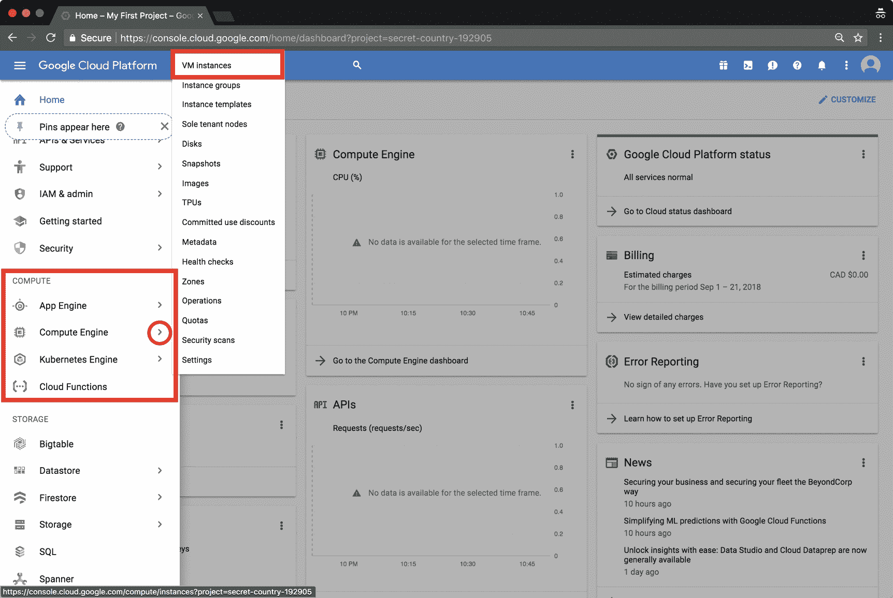

图 5-1

选择虚拟机实例

点击“创建”以开始部署虚拟机实例的过程（见图 5-2）。

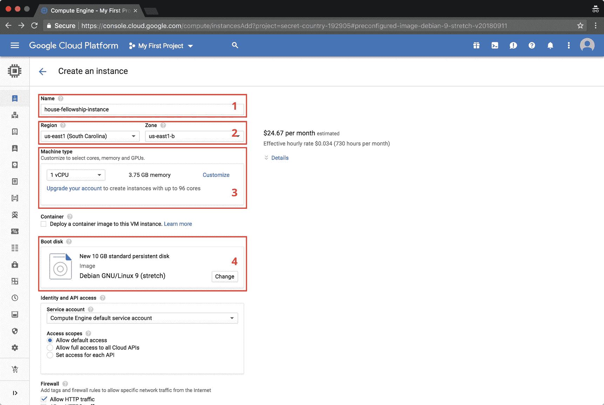

图 5-3

创建实例的选项

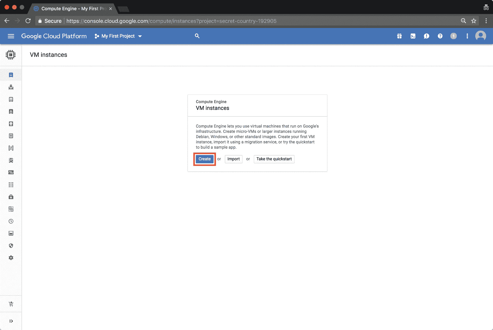

图 5-2

开始部署虚拟机实例的过程

图 5-3 中的标记数字在此处解释：

1.  选择实例名称。此名称必须以小写字母开头，可以包含数字或连字符，但不能以连字符结尾。

1.  选择实例区域和区域。这是您的计算实例所在的地理区域，而区域是区域内的一个位置。

1.  选择机器类型。这允许对虚拟机的核心、内存和 GPU 进行定制（见图 5-4）。

    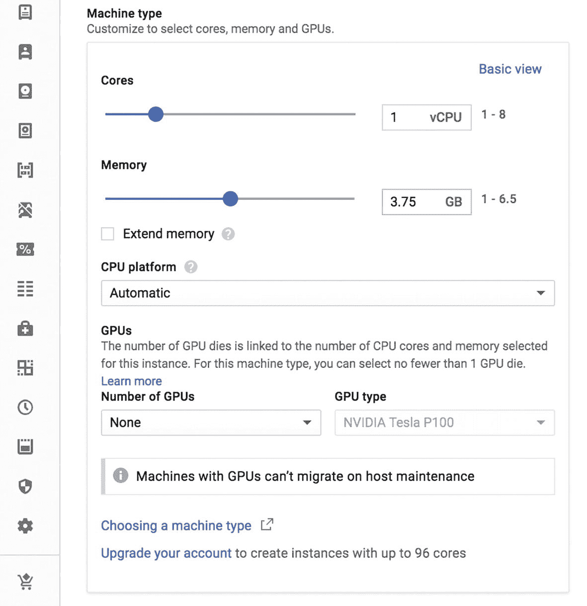

    图 5-4

    选择机器类型

1.  选择引导磁盘。此选项选择用于引导的磁盘。此磁盘可以是来自操作系统镜像、应用程序镜像、自定义镜像或镜像快照创建的（见图 5-5）。

    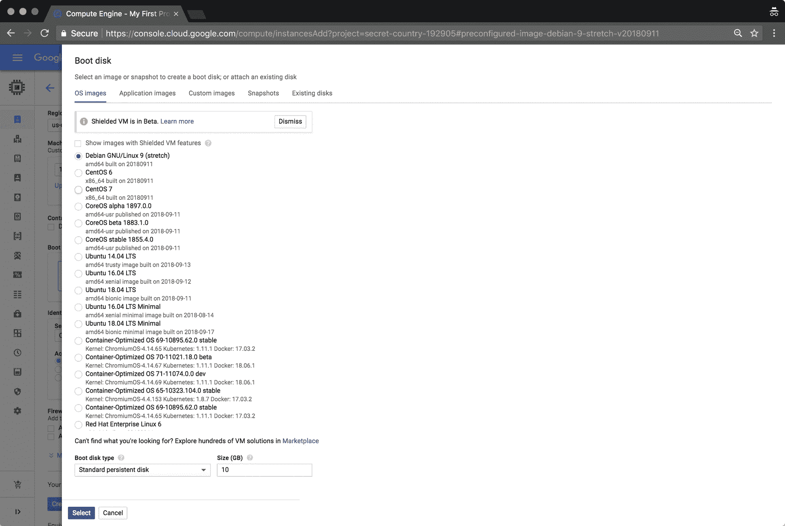

    图 5-5

    选择引导磁盘

1.  选择“允许 HTTP 流量”以允许来自互联网的网络流量，如图 5-6 所示。

    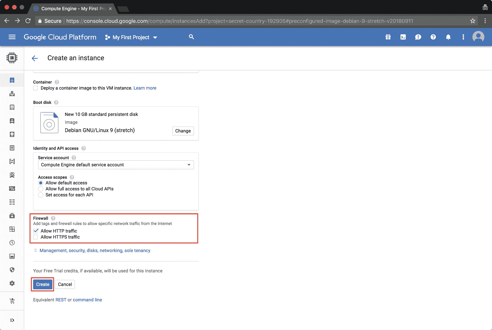

    图 5-6

    允许虚拟机网络流量

1.  在图 5-6 中点击“创建”以部署虚拟机实例。

## 连接到虚拟机实例

在列出已创建虚拟机的“虚拟机实例”页面，点击创建实例旁边的“SSH”，如图 5-7 所示。这将启动一个新窗口，提供对创建的虚拟机的终端访问，如图 5-8 和 5-9 所示。

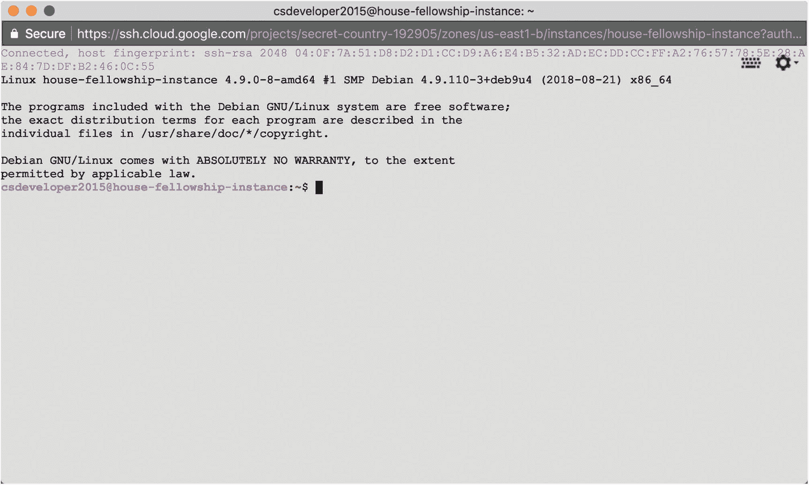

图 5-9

实例的终端窗口访问

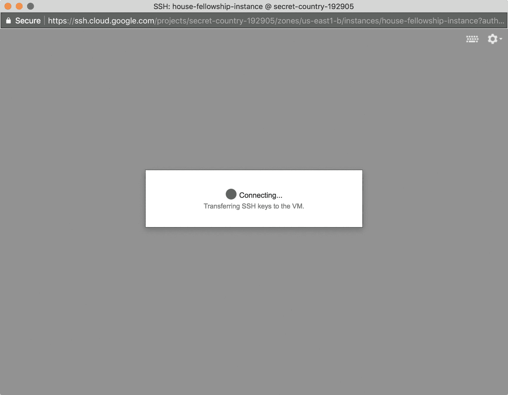

图 5-8

通过 SSH 连接虚拟机实例

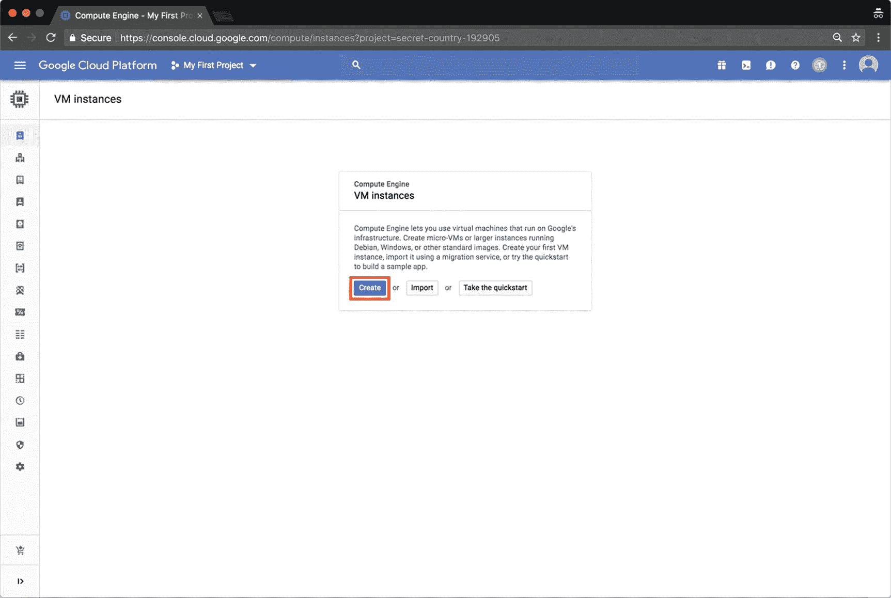

图 5-7

SSH 进入虚拟机实例

## 断开实例

删除不再使用的计算实例是一种良好的实践，以节省利用 GCP 资源成本。要删除计算实例，在“虚拟机实例”页面，选择要删除的实例，然后点击“删除”（红色），如图 5-10 所示。

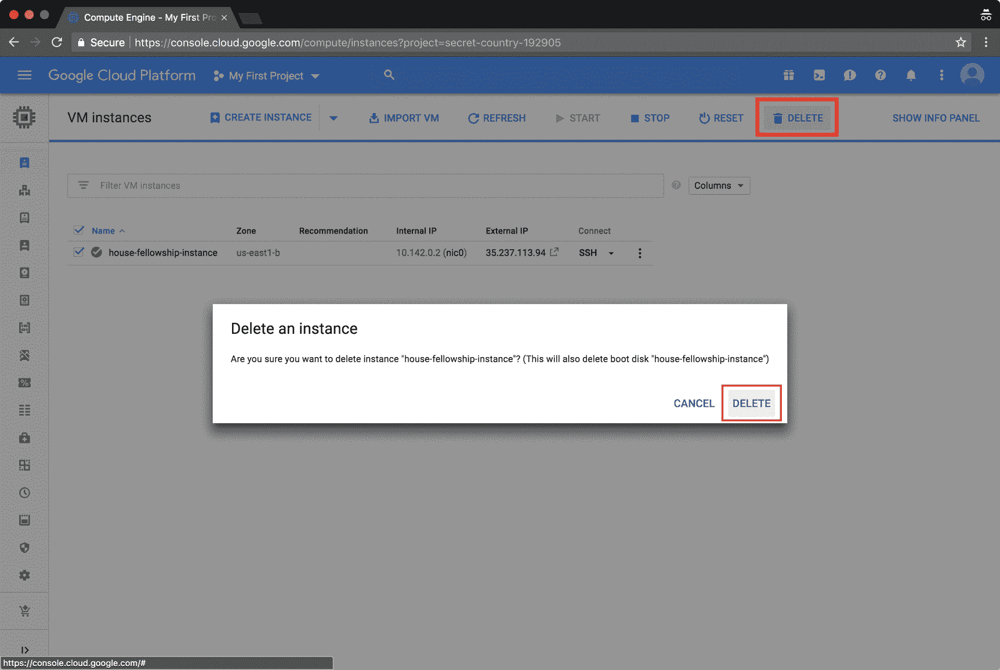

图 5-10

删除虚拟机实例

## 从命令行使用 GCE

在本节中，我们将演示使用命令行界面创建和删除 GCP 上的计算实例的命令示例。要使用命令行界面通过“gcloud”创建计算实例，可以在命令中添加各种选项以适应不同的机器规格。要了解更多关于某个命令的信息，请在命令后附加“help”：

+   部署虚拟机实例：要创建虚拟机实例，使用以下代码语法

    ```py
    gcloud compute instances create [INSTANCE_NAME]
    ```

    例如，让我们创建一个名为“ebisong-howad-instance”的实例

    ```py
    gcloud compute instances create ebisong-howad-instance
    Created [https://www.googleapis.com/compute/v1/projects/secret-country-192905/zones/us-east1-b/instances/ebisong-howad-instance].
    NAME                       ZONE        MACHINE_TYPE   PREEMPTIBLE  INTERNAL_IP  EXTERNAL_IP   STATUS
    ebisong-howad-instance  us-east1-b  n1-standard-1               10.142.0.2   35.196.17.39  RUNNING
    ```

    要了解“gcloud instance create”命令可以包含的选项，请运行

    ```py
    gcloud compute instances create –help
    NAME
    gcloud compute instances create - create Google Compute Engine virtual
    machine instances
    SYNOPSIS
    gcloud compute instances create INSTANCE_NAMES [INSTANCE_NAMES ...]
    [--accelerator=[count=COUNT],[type=TYPE]] [--async]
    [--no-boot-disk-auto-delete]
    [--boot-disk-device-name=BOOT_DISK_DEVICE_NAME]
    [--boot-disk-size=BOOT_DISK_SIZE] [--boot-disk-type=BOOT_DISK_TYPE]
    [--can-ip-forward] [--create-disk=[PROPERTY=VALUE,...]]
    [--csek-key-file=FILE] [--deletion-protection]
    [--description=DESCRIPTION]
    [--disk=[auto-delete=AUTO-DELETE],
    [boot=BOOT],[device-name=DEVICE-NAME],[mode=MODE],[name=NAME]]
    [--labels=[KEY=VALUE,...]]
    [--local-ssd=[device-name=DEVICE-NAME],[interface=INTERFACE]]
    [--machine-type=MACHINE_TYPE] [--maintenance-policy=MAINTENANCE_POLICY]
    [--metadata=KEY=VALUE,[KEY=VALUE,...]]
    [--metadata-from-file=KEY=LOCAL_FILE_PATH,[...]]
    [--min-cpu-platform=PLATFORM] [--network=NETWORK]
    [--network-interface=[PROPERTY=VALUE,...]]
    [--network-tier=NETWORK_TIER] [--preemptible]
    [--private-network-ip=PRIVATE_NETWORK_IP]
    :
    ```

    要退出帮助页面，请输入“q”然后按键盘上的“Enter”键。

    要列出创建的实例，请运行

    ```py
    gcloud compute instances list
    NAME                       ZONE        MACHINE_TYPE   PREEMPTIBLE  INTERNAL_IP  EXTERNAL_IP   STATUS
    ebisong-howad-instance  us-east1-b  n1-standard-1               10.142.0.2   35.196.17.39  RUNNING
    ```

+   连接到实例：要使用 SSH 连接到已创建的虚拟机实例，请运行以下命令

    ```py
    gcloud compute ssh [INSTANCE_NAME]
    ```

    例如，要连接到“ebisong-howad-instance”虚拟机，请运行以下命令

    ```py
    gcloud compute ssh ebisong-howad-instance
    Warning: Permanently added 'compute.8493256679990250176' (ECDSA) to the list of known hosts.
    Linux ebisong-howad-instance 4.9.0-8-amd64 #1 SMP Debian 4.9.110-3+deb9u4 (2018-08-21) x86_64
    The programs included with the Debian GNU/Linux system are free software;
    the exact distribution terms for each program are described in the
    individual files in /usr/share/doc/*/copyright.
    Debian GNU/Linux comes with ABSOLUTELY NO WARRANTY, to the extent
    permitted by applicable law.
    ekababisong@ebisong-howad-instance:~$
    ```

+   要从终端离开实例，请输入“exit”然后按键盘上的“Enter”键。

    ```py
    Debian GNU/Linux comes with ABSOLUTELY NO WARRANTY, to the extent
    permitted by applicable law.
    ekababisong@ebisong-howad-instance:~$ exit
    logout
    Connection to 35.196.17.39 closed.
    ```

+   断开实例：要删除实例，运行以下命令

    ```py
    gcloud compute instances delete [INSTANCE_NAME]
    ```

    使用我们的示例，要删除“ebisong-howad-instance”虚拟机，请运行以下命令

    ```py
    gcloud compute instances delete ebisong-howad-instance
    The following instances will be deleted. Any attached disks configured to be auto-deleted will be deleted unless they are attached to any other instances or the `--keep-disks` flag is given and specifies them for keeping. Deleting a disk is irreversible and any data on the disk will be lost.
    - [ebisong-howad-instance] in [us-east1-b]
    Do you want to continue (Y/n)?  Y
    Deleted [https://www.googleapis.com/compute/v1/projects/secret-country-192905/zones/us-east1-b/instances/ebisong-howad-instance].
    ```

本章介绍了在 GCP 上启动计算机器实例的步骤。它涵盖了使用基于 Web 的云控制台以及通过 shell 终端使用命令。

在下一章中，我们将讨论如何在 GCP 上启动名为 JupyterLab 的 Jupyter 笔记本实例。笔记本提供了一个用于分析、数据科学和原型设计机器学习模型的交互式环境。

# 6. JupyterLab 笔记本

Google 深度学习虚拟机（VM）是 GCP AI 平台的一部分。它配置了一个预装了相关软件包以执行分析和建模任务的 Compute Engine 实例。它还通过一键操作提供高性能计算 TPU 和 GPU 处理能力。这些 VM 提供了用于分析数据和设计机器学习模型的 JupyterLab 笔记本环境。

在本章中，我们将使用基于 Web 的控制台和命令行启动 JupyterLab 笔记本实例。

## 配置笔记本实例

以下步骤提供了在深度学习虚拟机（VM）上部署笔记本实例的指南：

1.  在 GCP 资源抽屉中名为“人工智能”的组中，点击“AI 平台”旁边的箭头，并选择“笔记本”，如图 6-1 所示。

    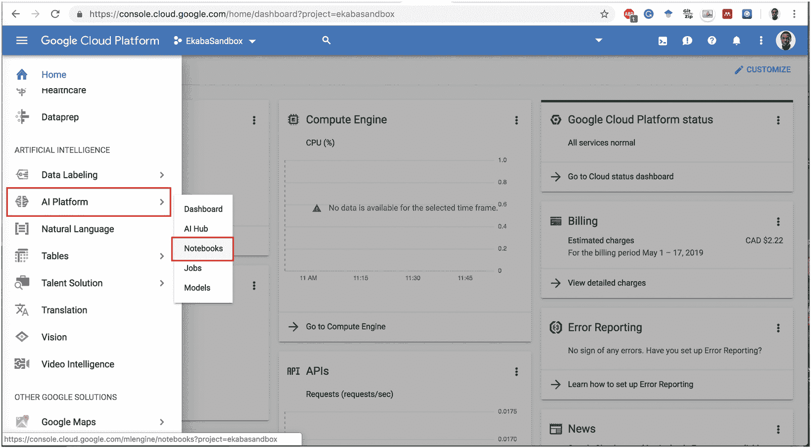

    图 6-1

    在 GCP AI 平台上打开笔记本

1.  点击“新建实例”以启动笔记本实例，如图 6-2 所示；您可以选择自定义实例或使用预配置的实例，这些实例已安装 TensorFlow、PyTorch 或 RAPIDS XGBoost。

    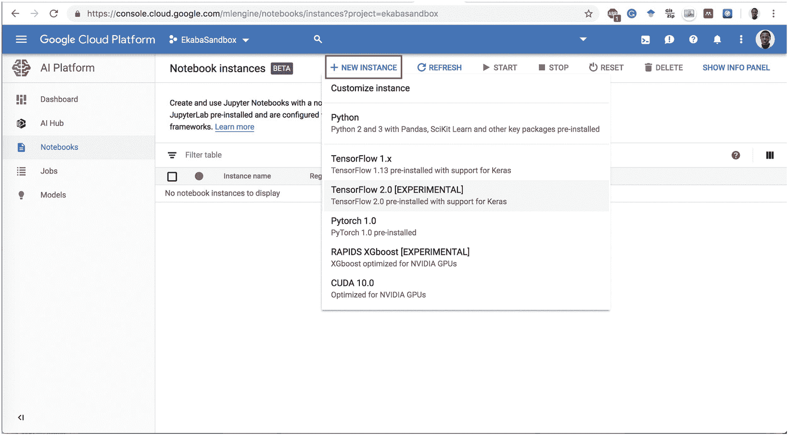

    图 6-2

    启动新的笔记本实例

1.  对于本例，我们将创建一个预配置了 TensorFlow 2.0 的笔记本实例（见图 6-3）。

    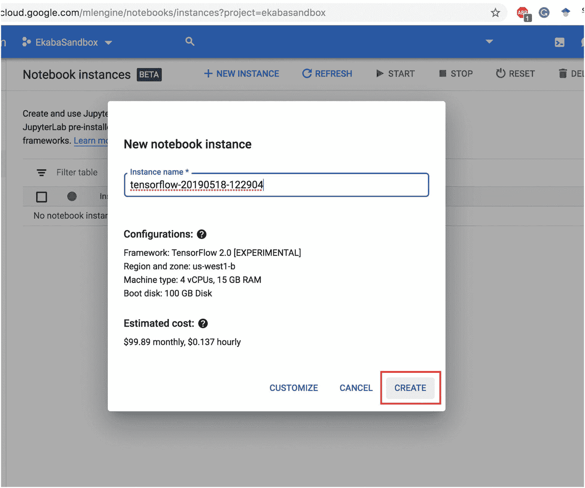

    图 6-3

    启动新的笔记本实例

1.  点击“打开 JupyterLab”以在新窗口中启动 JupyterLab 笔记本实例（见图 6-4）。

    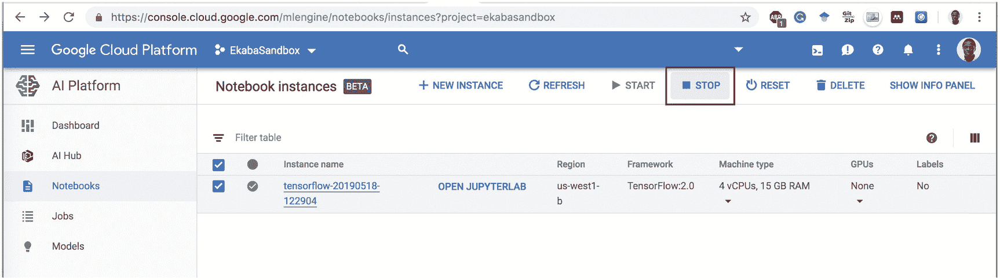

    图 6-4

    打开 JupyterLab

1.  从图 6-5 中的 JupyterLab 启动器，可以选择打开 Python 笔记本、Python 交互式 shell、bash 终端、文本文件或 Tensorboard 仪表板（关于 Tensorboard 的更多信息请见第六部分）。

    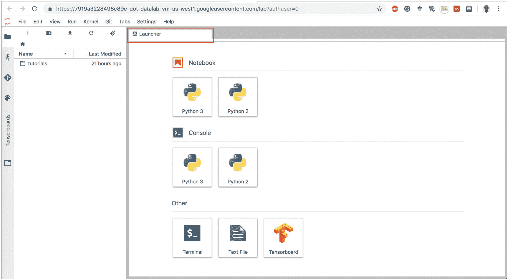

    图 6-5

    JupyterLab 启动器

1.  打开 Python 3 笔记本（见图 6-6）。我们将在后续章节中使用 Python 笔记本来执行数据科学任务。

    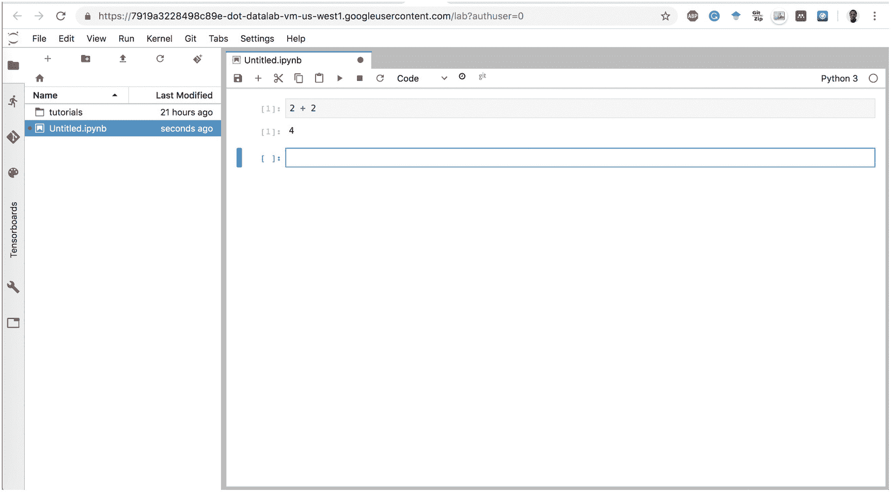

    图 6-6

    Python 3 笔记本

## 关闭/删除笔记本实例

以下步骤提供了关闭和删除笔记本实例的指南：

1.  在“笔记本实例”仪表板上，当不再使用时点击“停止”以关闭实例，从而在 GCP 上节省计算成本（见图 6-7）。

    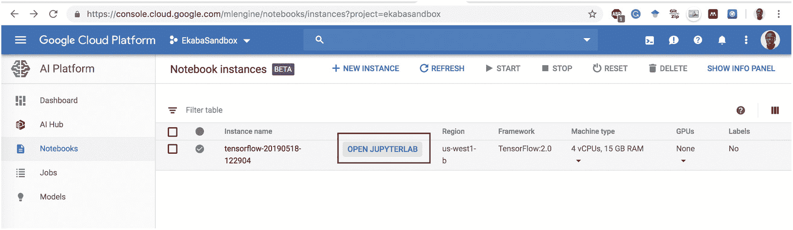

    图 6-7

    停止笔记本实例

1.  当实例不再需要时，点击“删除”以永久删除实例。请注意，此选项不可恢复（见图 6-8）。

    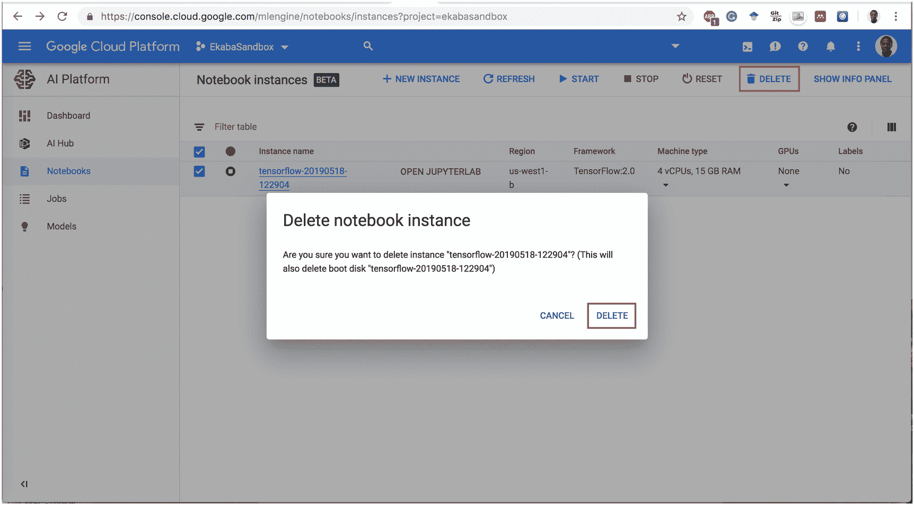

    图 6-8

    删除笔记本实例

## 从命令行启动笔记本实例

在本节中，我们将探讨如何使用命令行启动和关闭集成了 JupyterLab 的预配置深度学习 VM。

创建 Datalab 实例：要创建笔记本实例，执行以下代码

```py
export IMAGE_FAMILY="tf-latest-cpu-experimental"
export ZONE="us-west1-b"
export INSTANCE_NAME="my-instance"
gcloud compute instances create $INSTANCE_NAME \
--zone=$ZONE \
--image-family=$IMAGE_FAMILY \
--image-project=deeplearning-platform-release
```

其中

+   --image-family 可以是 Google Deep Learning VM 支持的任何可用镜像；`"tf-latest-cpu-experimental"` 会启动一个预配置了 TensorFlow 2.0 的镜像。

+   --image-project 必须设置为 `deeplearning-platform-release`

这是实例创建时的输出：

```py
Created [https://www.googleapis.com/compute/v1/projects/ekabasandbox/zones/us-west1-b/instances/my-instance].
NAME         ZONE        MACHINE_TYPE   PREEMPTIBLE  INTERNAL_IP  EXTERNAL_IP   STATUS
my-instance  us-west1-b  n1-standard-1               10.138.0.6   34.83.90.154  RUNNING
```

连接到实例：要连接到实例上运行的 JupyterLab，运行以下命令

```py
export INSTANCE_NAME="my-instance"
gcloud compute ssh $INSTANCE_NAME -- -L 8080:localhost:8080
```

然后在您的本地计算机上，在浏览器中访问 `http://localhost:8080`（见图 6-9）。

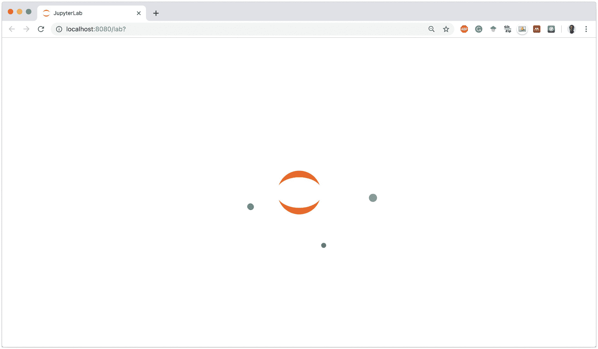

图 6-9

从终端启动的 JupyterLab 实例

停止实例：要停止实例，请在您的本地终端（而不是实例上）运行以下命令

```py
gcloud compute instances stop $INSTANCE_NAME
Stopping instance(s) my-instance...done.
Updated [https://www.googleapis.com/compute/v1/projects/ekabasandbox/zones/us-west1-b/instances/my-instance].
```

删除实例：笔记本实例基本上是一个 Google Compute Engine。因此，实例的删除方式与删除 Compute Engine VM 相同。

```py
gcloud compute instances delete $INSTANCE_NAME
The following instances will be deleted. Any attached disks configured
to be auto-deleted will be deleted unless they are attached to any
other instances or the `--keep-disks` flag is given and specifies them
for keeping. Deleting a disk is irreversible and any data on the disk
will be lost.
- [my-instance] in [us-west1-b]
Do you want to continue (Y/n)?  Y
Deleted [https://www.googleapis.com/compute/v1/projects/ekabasandbox/zones/us-west1-b/instances/my-instance].
```

本章介绍了在 Google Deep Learning VM 上运行的 Jupyter 笔记本，用于数据科学任务的交互式编程以及深度学习和机器学习模型的原型设计。

在下一章中，我们将介绍另一个用于编程和学习模型快速原型设计的工具，名为 Google Colaboratory。

# 7. Google Colaboratory

Google Colaboratory 通常简称为“Google Colab”或简单地称为“Colab”，是一个在强大的硬件选项（如 GPU 和 TPU）上原型设计机器学习模型的研究项目。它提供了一个无服务器的 Jupyter 笔记本环境，用于交互式开发。Google Colab 与其他 G Suite 产品一样，免费使用。

## 从 Colab 开始

以下步骤提供了在 Google Colab 上启动笔记本的指南：

1.  前往 [`colab.research.google.com/`](https://colab.research.google.com/) 并使用您现有的 Google 账户登录以访问 Colab 主页（见图 7-1）。

    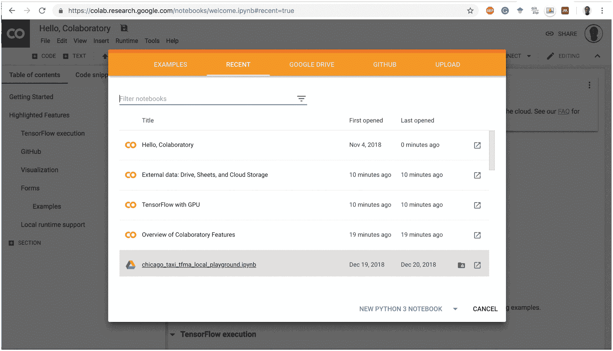

    图 7-1

    Google Colab 主页

1.  打开一个 Python 3 笔记本（见图 7-2）。

    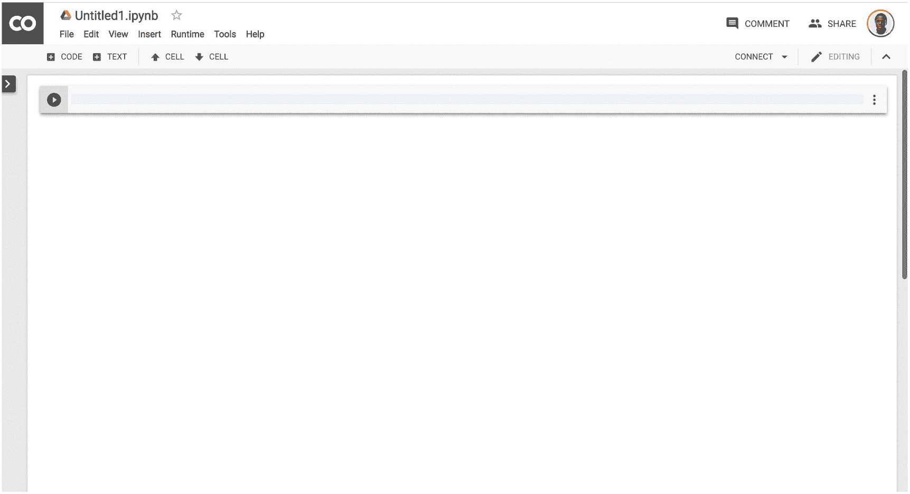

    图 7-2

    Python 3 Notebook

## 更改运行时设置

以下步骤提供了更改笔记本运行时设置的指南：

1.  前往运行时 ➤ 更改运行时类型（见图 7-3）。

    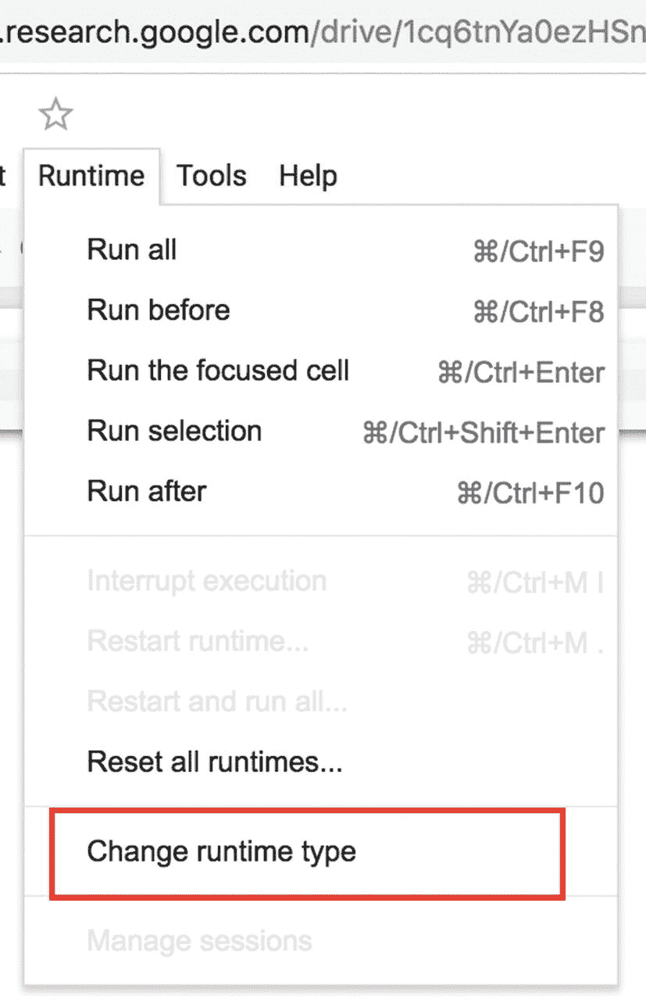

    图 7-3

    Python 3 Notebook

1.  在这里，可以选择将 Python 运行时和硬件加速器更改为 GPU 或 TPU（见图 7-4）。

    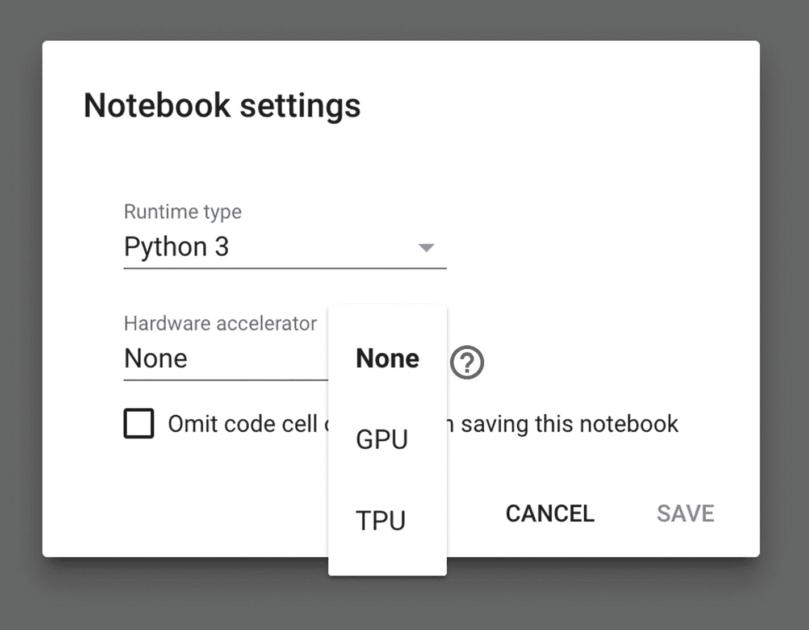

    图 7-4

    更改运行时

## 存储笔记本

在 Colab 上的笔记本存储在 Google Drive 上。它们也可以保存到 GitHub 或作为 GitHub Gist 发布。它们也可以下载到本地机器。

图 7-5 突出了存储在 Google Colab 上运行的 Jupyter 笔记本的可选方案。

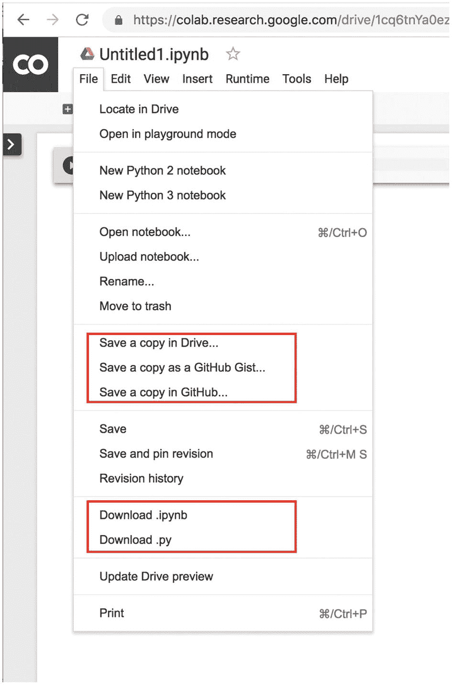

图 7-5

存储笔记本

## 上传笔记本

笔记本可以从 Google Drive、GitHub 或本地机器上传（见图 7-6）。

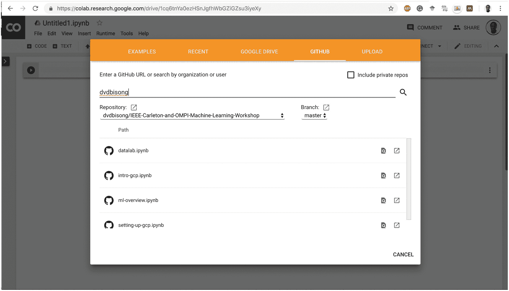

图 7-6

打开笔记本

本章介绍了 Google Colaboratory 作为快速搭建高性能计算基础设施的平台，该平台运行 Jupyter 笔记本，用于快速进行数据科学和数据建模任务。

这是“Google Cloud Platform 入门”第一部分的最后一章。在第二部分中，包含第 8–12 章，我们将介绍“数据科学编程”的基础知识。随后的章节中的代码示例可以使用在 Google Deep Learning VM 上运行的 Jupyter 笔记本或 Google Colab 上运行来执行。

与 Google Colab 合作的优势在于，您无需登录 Google Cloud 控制台，并且使用它是免费的。当安全和隐私不是首要考虑因素时，Google Colab 是建模的好选择，因为它在数据科学和机器学习原型设计方面可以节省计算成本。
