# 第二部分：数据科学编程基础

# 8. 什么是数据科学？

数据科学包括从数据中提取信息所需的工具和技术。数据科学技术广泛借鉴了数学、统计学和计算领域的知识。然而，数据科学现在被封装到软件包和库中，因此使得软件开发和工程社区可以轻松访问和消费。这是智能能力提升成为各种领域软件产品主要组成部分的主要因素。

本章将广泛讨论数据科学和大数据分析集成作为企业和机构转型组合的机会，并概述数据科学过程作为满足数据科学项目的可重复模板。

## 大数据挑战

由于 21 世纪初数据的扩张，以所谓的“大数据 3V”为标志，即数据量、速度和多样性。数据量指的是数据的增加规模，速度是数据获取的速度，多样性是可用的数据类型多样性。对其他人来说，这变成了 5V，包括价值和真实性，分别表示数据的有用性和数据的真实性。我们已经观察到数据量从兆字节（MB）到太字节（TB）的规模，现在正爆炸式增长超过拍字节（PB）。我们必须找到新的和改进的方法来存储和处理这个不断增长的数据集。最初，存储和数据处理挑战是通过 Hadoop 生态系统和其他支持框架解决的，但即使是这些也变得难以管理和扩展，这就是为什么转向云管理的弹性、安全和高可用性数据存储和处理能力。

另一方面，由于在特定时刻产生的和可用的数据量巨大，大多数应用和商业用例都需要对数据进行实时分析。以前，从数据中获得洞察力和释放价值是通过使用 Excel、Minitab 或 SPSS 等统计工具对批量数据工作负载进行传统分析来实现的。但在大数据时代，这种情况正在改变，因为越来越多的企业和机构希望以实时或最坏情况下的近实时速度了解他们数据中的信息。

大数据难题的另一个垂直方向是多样性。以前，必须对数据进行预定义的结构化，以便轻松存储以及便于数据分析。然而，现在收集和存储了广泛多样的数据集，例如空间地图、图像数据、视频数据、音频数据、来自电子邮件和其他文档的文本数据以及传感器数据。事实上，野外的大量数据集都是非结构化的。这导致了非结构化或半结构化数据库的发展，如 Elasticsearch、Solr、HBase、Cassandra 和 MongoDB，仅举几个例子。

## 数据科学机遇

在数据不可避免且不可逆转地成为新金的时代，组织最大的需求是数据治理和数据分析所需的技能，以从数据中解锁智能和价值，以及开发和生产化企业数据产品的专业知识。这导致了数据科学领域内新的角色，例如

+   专注于使用统计技术和计算工具从数据中挖掘智能，并理解业务用例的数据分析师/科学家

+   专注于通过确保数据平台具有冗余性、可扩展性、安全性和高度可用性来构建和管理高效大数据管道的数据工程师/架构师

+   专注于设计和开发机器学习算法，并将它们集成到生产系统中以提供在线或批量预测服务的高级机器学习工程师

## 数据科学流程

数据科学流程包括数据摄取和数据模型服务组件。然而，我们将简要讨论执行数据分析的步骤，而不是数据预测建模。

这些步骤包括

1.  数据摘要：数据集变量或特征的必要统计摘要。这包括变量数量、数据类型、观测数量以及缺失数据的计数/百分比等信息。

1.  `数据可视化`：这涉及使用单变量和多变量数据可视化方法来更好地了解数据变量的属性及其相互关系。这包括直方图、箱线图和相关性图等指标。

1.  `数据清洗/预处理:` 这个过程涉及净化数据，使其适合建模。数据很少干净利落，每一行代表一个观察结果，每一列代表一个实体。在这个数据科学工作的阶段，涉及的任务可能包括删除重复条目、选择处理缺失数据的方法，以及将数据特征转换为编码类别的数值数据类型。这个阶段还可能包括对数据特征执行统计转换，以归一化和/或标准化数据元素。不同尺度的数据特征可能导致模型结果不佳，因为它们使学习算法更难收敛到全局最小值。

1.  `特征工程:` 这种实践涉及系统地修剪数据特征空间，仅选择建模问题相关的特征作为模型任务的一部分。良好的特征工程通常是普通模型和高性能模型之间的区别。

1.  `数据建模和评估:` 这个阶段涉及通过学习算法传递数据以构建预测模型。这个过程通常是一个迭代过程，涉及不断的细化，以便构建一个在保留验证集和测试集上的成本函数最小化的模型。

在本章中，我们简要概述了数据科学的概念、大数据的挑战以及从数据中解锁价值的目标。下一章将介绍使用 Python 的编程。

# 9. Python

Python 是工业界数据科学首选的语言之一，主要是因为其简单的语法和大量的可重用机器学习/深度学习包。这些包使得开发数据科学产品变得容易，无需陷入特定算法或方法的内部细节。它们由该领域的最佳专家编写、调试和测试，同时还有一大群开发者社区贡献他们的时间和专业知识来维护和改进它们。

在本节中，我们将介绍使用 Python 3 的编程基础。本节为使用 NumPy、Pandas、Matplotlib、TensorFlow 和 Keras 等高级包提供了一个框架。在本章中我们将涵盖的编程范式可以轻松地适应或应用于类似的语言，例如 R，它也在数据科学行业中广泛使用。

完成本章以及本部分后续章节的最佳方式是通过在 Google Colab 或 GCP 深度学习 VM 上执行代码来工作。

## 数据和操作

基本上，编程涉及存储数据和操作这些数据以生成信息。数据结构领域研究的是高效数据存储的技术，而操作数据的技术则作为算法进行研究。

数据存储在计算机上的内存块中。将内存块想象成一个容器，它包含数据（见图 9-1）。当对数据进行操作时，新处理的数据也会存储在内存中。数据通过使用算术和布尔表达式及函数进行操作。

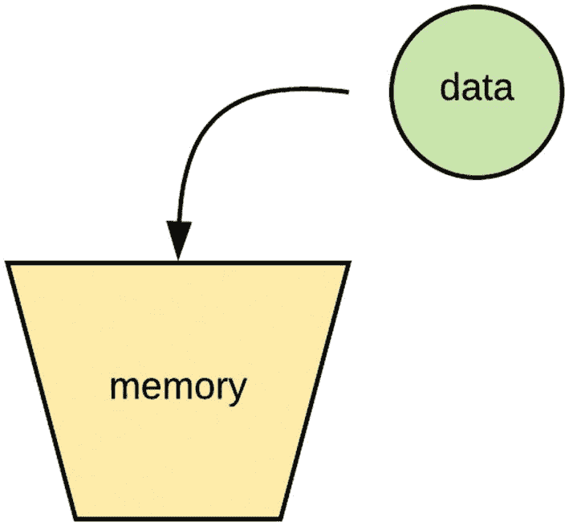

图 9-1

一个内存单元存储数据的示意图

在编程中，内存位置被称为变量。**变量**是存储分配给它的数据的容器。程序员通常会给变量赋予一个独特的名称来表示特定的内存单元。在 Python 中，变量名由程序员定义，但必须遵循仅包含字母数字小写字符且单词由下划线分隔的有效命名条件。此外，变量名应该具有与存储在该变量中的数据相关的语义意义。这有助于提高未来代码的可读性。

将数据放置到变量中的行为称为**赋值**。

```py
# assigning data to a variable
x = 1
user_name = 'Emmanuel Okoi'
```

## 数据类型

Python 除了其他支持的特殊数据类型外，还有数字和字符串数据类型。例如，数字数据类型可以是 int 或 float。在 Python 中，字符串被引号包围。

```py
# data types
type(3)
'Output': int
type(3.0)
'Output': float
type('Jesam Ujong')
'Output': str
```

Python 中的其他基本数据类型包括列表、元组和字典。这些数据类型按顺序将一组项组合在一起。Python 中的序列从 0 开始索引。

**元组**是不可变的有序项序列。不可变意味着数据在分配后不能被更改。元组可以包含不同类型的元素。元组被括号 `(…)` 包围。

```py
my_tuple = (5, 4, 3, 2, 1, 'hello')
type(my_tuple)
'Output': tuple
my_tuple[5]           # return the sixth element (indexed from 0)
'Output': 'hello'
my_tuple[5] = 'hi'    # we cannot alter an immutable data type
Traceback (most recent call last):
File "", line 1, in 
my_tuple[5] = 'hi'
TypeError: 'tuple' object does not support item assignment
```

**列表**与元组非常相似，只是它们是可变的。这意味着列表元素在分配后可以被更改。列表被方括号 `[…]` 包围。

```py
my_list = [4, 8, 16, 32, 64]
print(my_list)    # print list items to console
'Output': [4, 8, 16, 32, 64]
my_list[3]        # return the fourth list element (indexed from 0)
'Output': 32
my_list[4] = 256
print(my_list)
'Output': [4, 8, 16, 32, 256]
```

字典包含从键到值的映射。键/值对是字典中的一个项。字典中的项通过它们的键进行索引。字典中的键可以是任何可哈希的数据类型（哈希将字符字符串转换为键以加快搜索速度）。值可以是任何数据类型。在其他语言中，字典类似于哈希表或映射。字典被一对大括号 `{…}` 包围。字典是无序的。

```py
my_dict = {'name':'Rijami', 'age':42, 'height':72}
my_dict               # dictionary items are un-ordered
'Output': {'age': 42, 'height': 72, 'name': 'Rijami'}
my_dict['age']        # get dictionary value by indexing on keys
'Output': 42
my_dict['age'] = 35   # change the value of a dictionary item
my_dict['age']
'Output': 35
```

### 关于列表的更多内容

如前所述，由于列表项是可变的，因此它们可以被更改、删除和切片以生成新的列表。

```py
my_list = [4, 8, 16, 32, 64]
my_list
'Output': [4, 8, 16, 32, 64]
my_list[1:3]      # slice the 2nd to 4th element (indexed from 0)
'Output': [8, 16]
my_list[2:]       # slice from the 3rd element (indexed from 0)
'Output': [16, 32, 64]
my_list[:4]       # slice till the 5th element (indexed from 0)
'Output': [4, 8, 16, 32]
my_list[-1]       # get the last element in the list
'Output': 64
min(my_list)      # get the minimum element in the list
'Output': 4
max(my_list)      # get the maximum element in the list
'Output': 64
sum(my_list)      # get the sum of elements in the list
'Output': 124
my_list.index(16) # index(k) - return the index of the first occurrence of item k in the list
'Output': 2
```

当修改列表中元素的一个切片时，右侧的长度可以取决于左侧的大小不是单个索引。

```py
# modifying a list: extended index example
my_list[1:4] = [43, 59, 78, 21]
my_list
'Output': [4, 43, 59, 78, 21, 64]
my_list = [4, 8, 16, 32, 64]  # re-initialize list elements
my_list[1:4] = [43]
my_list
'Output': [4, 43, 64]
# modifying a list: single index example
my_list[0] = [1, 2, 3]      # this will give a list-on-list
my_list
'Output': [[1, 2, 3], 43, 64]
my_list[0:1] = [1, 2, 3]    # again - this is the proper way to extend lists
my_list
'Output': [1, 2, 3, 43, 64]
```

一些有用的列表方法包括

```py
my_list = [4, 8, 16, 32, 64]
len(my_list)          # get the length of the list
'Output': 5
my_list.insert(0,2)   # insert(i,k) - insert the element k at index i
my_list
'Output': [2, 4, 8, 16, 32, 64]
my_list.remove(8) # remove(k) - remove the first occurrence of element k in the list
my_list
'Output': [2, 4, 16, 32, 64]
my_list.pop(3)    # pop(i) - return the value of the list at index i
'Output': 32
my_list.reverse() # reverse in-place the elements in the list
my_list
'Output': [64, 16, 4, 2]
my_list.sort()    # sort in-place the elements in the list
my_list
'Output': [2, 4, 16, 64]
my_list.clear()   # clear all elements from the list
my_list
'Output': []
```

`append()` 方法将一个项（可以是列表、字符串或数字）添加到列表的末尾。如果项是列表，整个列表将被添加到当前列表的末尾。

```py
my_list = [4, 8, 16, 32, 64]  # initial list
my_list.append(2)             # append a number to the end of list
my_list.append('wonder')      # append a string to the end of list
my_list.append([256, 512])    # append a list to the end of list
my_list
'Output': [4, 8, 16, 32, 64, 2, 'wonder', [256, 512]]
```

extend()方法通过添加可迭代对象中的项目来扩展列表。Python 中的可迭代对象是具有特殊方法的对象，这些方法使您能够按顺序访问该对象中的元素。列表和字符串是可迭代对象。因此，extend()将可迭代对象的所有元素追加到列表的末尾。

```py
my_list = [4, 8, 16, 32, 64]
my_list.extend(2)             # a number is not an iterable
Traceback (most recent call last):
File "", line 1, in 
my_list.extend(2)
TypeError: 'int' object is not iterable
my_list.extend('wonder')      # append a string to the end of list
my_list.extend([256, 512])    # append a list to the end of list
my_list
'Output': [4, 8, 16, 32, 64, 'w', 'o', 'n', 'd', 'e', 'r', 256, 512]
```

我们可以通过重载运算符 + 将一个列表与另一个列表组合。

```py
my_list = [4, 8, 16, 32, 64]
my_list + [256, 512]
'Output': [4, 8, 16, 32, 64, 256, 512]
```

### 字符串

Python 中的字符串由一对单引号（‘ … ’）包围。字符串是不可变的。这意味着它们在赋值或创建字符串变量时不能被更改。字符串可以像列表一样进行索引，也可以进行切片以创建新的列表。

```py
my_string = 'Schatz'
my_string[0]      # get first index of string
'Output': 'S'
my_string[1:4]    # slice the string from the 2nd to the 5th element (indexed from 0)
'Output': 'cha'
len(my_string)    # get the length of the string
'Output': 6
my_string[-1]     # get last element of the string
'Output': 'z'
```

我们可以使用布尔运算符操作字符串值。

```py
't' in my_string
'Output': True
't' not in my_string
'Output': False
't' is my_string
'Output': False
't' is not my_string
'Output': True
't' == my_string
'Output': False
't' != my_string
'Output': True
```

我们可以使用重载的运算符 + 来连接两个字符串以创建一个新的字符串。

```py
a = 'I'
b = 'Love'
c = 'You'
a + b + c
'Output': 'ILoveYou'
# let's add some space
a + ' ' + b +  ' ' + c
```

## 算术和布尔运算

本节介绍了用于编程算术和逻辑结构的运算符。

### 算术运算

在 Python 中，我们可以使用熟悉的代数运算，如加法 +、减法 -、乘法 `*`、除法 / 和指数 `**` 来操作数据。

```py
2 + 2     # addition
'Output': 4
5 - 3     # subtraction
'Output': 2
4 * 4     # multiplication
'Output': 16
10 / 2    # division
'Output': 5.0
2**4 / (5 + 3)    # use brackets to enforce precedence
'Output': 2.0
```

### 布尔运算

布尔运算的结果为 True 或 False。布尔运算符包括比较和逻辑运算符。比较运算符包括小于等于 <=、小于 <、大于等于 >=、大于 >、不等于 != 和等于 ==。

```py
2  5
'Output': False
2 >= 5
'Output': False
2 != 5
'Output': True
2 == 5
'Output': False
```

逻辑运算符包括布尔非（not）、布尔与（and）和布尔或（or）。我们还可以使用 in、not in（成员资格）进行身份和成员资格测试。

+   is, is not（身份）

+   in, not in（成员资格）

```py
a = [1, 2, 3]
2 in a
'Output': True
2 not in a
'Output': False
2 is a
'Output': False
2 is not a
'Output': True
```

## print()语句

print()语句是一种简单的方法，可以将数据值的输出显示到控制台。变量可以使用逗号连接。逗号之后隐式地添加了空格。

```py
a = 'I'
b = 'Love'
c = 'You'
print(a, b, c)
'Output': I Love You
```

### 使用格式化器

格式化器通过使用花括号 {} 添加一个占位符，将数据值输入到字符串输出中。str 类的 format 方法被调用以接收值作为参数。format 方法中的参数数量应与字符串表示中的占位符数量相匹配。其他格式说明符可以通过占位符花括号添加。

```py
print("{} {} {}".format(a, b, c))
'Output': I Love You
# re-ordering the output
print("{2} {1} {0}".format(a, b, c))
'Output': You Love I
```

## 控制结构

程序需要做出决策，这会导致执行特定的指令集或特定的代码块重复执行。通过控制结构，我们将能够编写能够做出逻辑决策并在终止条件发生之前执行指令集的程序。

### if/elif（else-if）语句

if/elif（else-if）语句在测试条件评估为真时执行一组指令。else 语句指定如果前面的条件中没有评估为真时应执行的代码。它可以由图 9-2 中的流程图来表示。

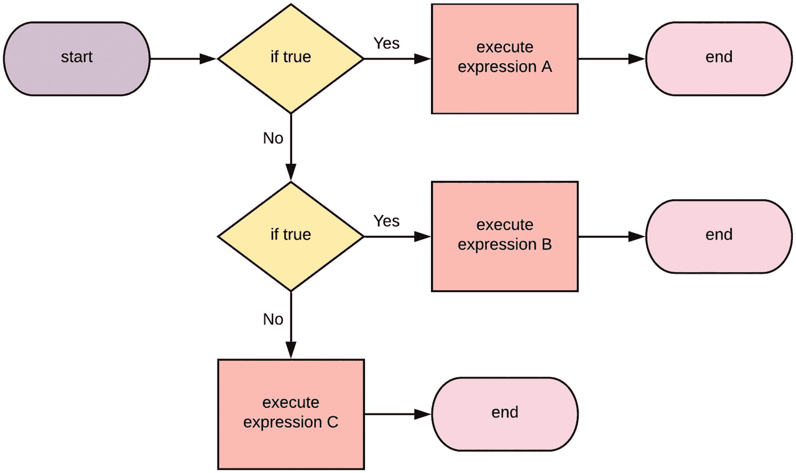

图 9-2

if 语句的流程图

if/elif 语句的语法如下所示：

```py
if expressionA:
statementA
elif expressionB:
statementB
...
...
else :
statementC
```

这里有一个程序示例：

```py
a = 8
if type(a) is int:
print('Number is an integer')
elif a > 0:
print('Number is positive')
else :
print('The number is negative and not an integer')
'Output': Number is an integer
```

### while 循环

while 循环评估一个条件，如果为真，则重复执行 while 块内的指令集。它这样做，直到条件评估为假。while 语句通过图 9-3 中的流程图来表示。

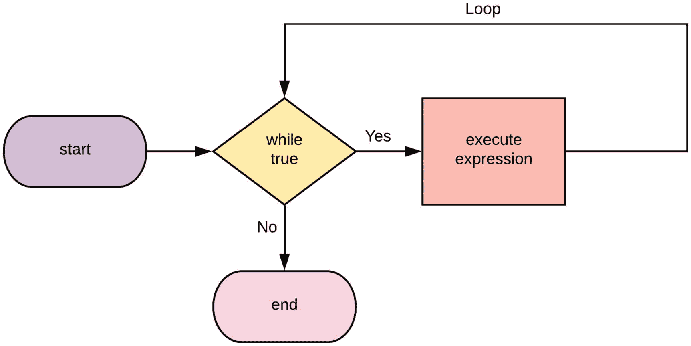

图 9-3

while 循环的流程图

这里有一个程序示例：

```py
a = 8
while a > 0:
print('Number is', a)
# decrement a
a -= 1
'Output': Number is 8
Number is 7
Number is 6
Number is 5
Number is 4
Number is 3
Number is 2
Number is 1
```

### for 循环

for 循环重复其代码块内的语句，直到达到终止条件。它与 while 循环不同，因为它确切地知道迭代应该发生多少次。for 循环由一个可迭代表达式（即，可以按顺序访问元素的表达式）控制。for 语句通过图 9-4 中的流程图来表示。

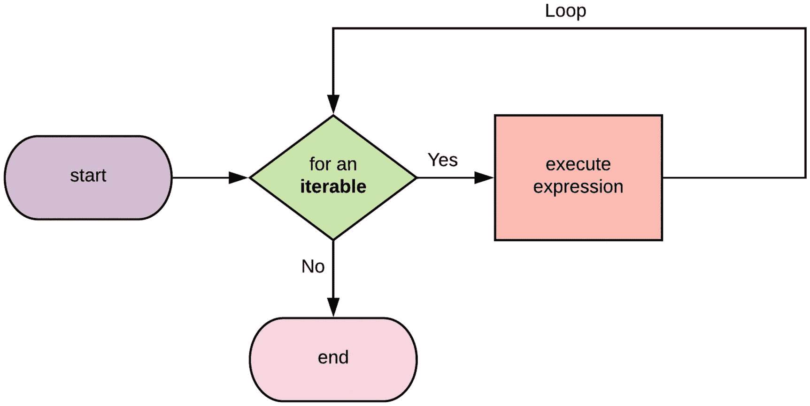

图 9-4

for 循环的流程图

for 循环的语法如下所示：

```py
for item in iterable:
statement
```

注意，在 for 循环的语法与之前讨论的成员资格逻辑运算符不同。

这里有一个程序示例：

```py
a = [2, 4, 6, 8, 10]
for elem in a:
print(elem**2)
'Output': 4
16
36
64
100
```

要循环特定次数，请使用 range()函数。

```py
for idx in range(5):
print('The index is', idx)
'Output': The index is 0
The index is 1
The index is 2
The index is 3
The index is 4
```

### 列表推导

使用列表推导，我们可以简洁地重写一个使用优雅的语法迭代构建新列表的 for 循环。假设我们想使用 for 循环构建一个新列表，我们将它写成

```py
new_list = []
for item in iterable:
new_list.append(expression)
```

我们可以将其重写为

```py
[expression for item in iterable]
```

让我们看看一些程序示例。

```py
squares = []
for elem in range(0,5):
squares.append((elem+1)**2)
squares
'Output': [1, 4, 9, 16, 25]
```

上述代码可以简洁地写成

```py
[(elem+1)**2 for elem in range(0,5)]
'Output': [1, 4, 9, 16, 25]
```

在嵌套控制结构存在的情况下，这甚至更加优雅。

```py
evens = []
for elem in range(0,20):
if elem % 2 == 0 and elem != 0:
evens.append(elem)
evens
'Output': [2, 4, 6, 8, 10, 12, 14, 16, 18]
```

使用列表推导，我们可以这样编写代码

```py
[elem for elem in range(0,20) if elem % 2 == 0 and elem != 0]
'Output': [2, 4, 6, 8, 10, 12, 14, 16, 18]
```

### break 和 continue 语句

break 语句终止它出现的最近封装循环（for、while 循环）的执行。

```py
for val in range(0,10):
print("The variable val is:", val)
if val > 5:
print("Break out of for loop")
break
'Output': The variable val is: 0
The variable val is: 1
The variable val is: 2
The variable val is: 3
The variable val is: 4
The variable val is: 5
The variable val is: 6
Break out of for loop
```

continue 语句跳过它所属的循环的下一个迭代，忽略其后的任何代码。

```py
a = 6
while a > 0:
if a != 3:
print("The variable a is:", a)
# decrement a
a = a - 1
if a == 3:
print("Skip the iteration when a is", a)
continue
'Output': The variable a is: 6
The variable a is: 5
The variable a is: 4
Skip the iteration when a is 3
The variable a is: 2
The variable a is: 1
```

## 函数

函数是一个执行特定操作的代码块（见图 9-5）。当程序员需要时，通过进行**函数调用**来调用函数。Python 预装了大量的有用函数，以简化编程。程序员也可以编写自定义函数。

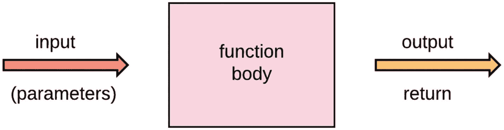

图 9-5

函数

函数在函数调用期间接收数据到其参数列表。输入的数据用于完成函数执行。在其执行结束时，函数总是返回一个结果——这个结果可以是‘None’或特定的数据值。

在 Python 中，函数被视为一等对象。这意味着一个函数可以作为数据传递给另一个函数，函数执行的输出也可以是一个函数，函数还可以作为变量存储。

函数被可视化为一个黑盒，它接收一组对象作为输入，执行一些代码，并返回另一组对象作为输出。

### 用户自定义函数

函数使用 def 关键字定义。创建函数的语法如下：

```py
def function-name(parameters):
statement(s)
```

让我们创建一个简单的函数：

```py
def squares(number):
return number**2
squares(2)
'Output': 4
```

这里是另一个函数示例：

```py
def _mean_(*number):
avg = sum(number)/len(number)
return avg
_mean_(1,2,3,4,5,6,7,8,9)
'Output': 5.0
```

参数号前的`*`表示变量可以接收任意数量的值，这些值隐式地绑定到一个元组中。

### Lambda 表达式

Lambda 表达式提供了一种简洁的方法来编写只包含单行代码的简单函数。Lambda 表达式有时非常有用，但通常使用**def**可能更易读。Lambda 的语法如下：

```py
lambda parameters: expression
```

让我们看看一个例子：

```py
square = lambda x: x**2
square(2)
'Output': 4
```

## 包和模块

模块只是一个 Python 源文件，而包是一组模块。可以通过使用**import**和**from**语句将其他程序员编写的模块合并到您的源代码中。

### import 语句

**import**语句允许您将任何 Python 模块加载到源文件中。它具有以下语法：

```py
import module_name [as user_defined_name][,...]
```

其中以下内容是可选的：

```py
[as user_defined_name]
```

让我们通过导入一个非常重要的包**numpy**来举例，它在 Python 中进行数值处理，对于机器学习非常关键。

```py
import numpy as np
np.abs(-10)   # the absolute value of -10
'Output': 10
```

### from 语句

**from**语句允许您将模块中的特定功能导入到源文件中。其语法如下：

```py
from module_name import module_feature [as user_defined_name][,...]
```

让我们看看一个例子：

```py
from numpy import mean
mean([2,4,6,8])
'Output': 5.0
```

本章提供了使用 Python 编程的基础知识。编程是一项非常活跃的活动，能力是通过经验和重复获得的。本章所提供的内容仅足以让人感到危险。

在下一章中，我们将介绍 NumPy，这是一个用于数值计算的 Python 包。

# 10. NumPy

NumPy 是一个针对数值计算优化的 Python 库。它与 MATLAB 非常相似，当与其他包（如用于各种科学功能的 SciPy、用于可视化的 Matplotlib 和用于数据分析的 Pandas）结合使用时，同样强大。NumPy 代表数值 Python。

NumPy 的核心优势在于其创建和操作 n 维数组的能力。这对于构建机器学习和深度学习模型尤其关键。数据通常以行和列组成的矩阵状网格表示，其中每一行代表一个观察值，每一列代表一个变量或特征。因此，NumPy 的二维数组非常适合存储和操作数据集。

本教程将涵盖 NumPy 的基础知识，让您非常熟悉使用该包，并欣赏 NumPy 工作背后的思考方式。这种理解构成了一个基础，从它可以扩展并从 NumPy 参考文档中寻求解决方案，当需要特定功能时。

要开始使用 NumPy，我们首先导入 NumPy 模块：

```py
import numpy as np
```

## NumPy 一维数组

让我们创建一个简单的 1 维 NumPy 数组：

```py
my_array = np.array([2,4,6,8,10])
my_array
'Output': array([ 2,  4,  6,  8, 10])
# the data-type of a NumPy array is the ndarray
type(my_array)
'Output': numpy.ndarray
# a NumPy 1-D array can also be seen a vector with 1 dimension
my_array.ndim
'Output': 1
# check the shape to get the number of rows and columns in the array \
# read as (rows, columns)
my_array.shape
'Output': (5,)
```

我们也可以从 Python 列表创建数组。

```py
my_list = [9, 5, 2, 7]
type(my_list)
'Output': list
# convert a list to a numpy array
list_to_array = np.array(my_list) # or np.asarray(my_list)
type(list_to_array)
'Output': numpy.ndarray
```

让我们探索其他常用于创建数组的实用方法。

```py
# create an array from a range of numbers
np.arange(10)
'Output': [0 1 2 3 4 5 6 7 8 9]
# create an array from start to end (exclusive) via a step size - (start, stop, step)
np.arange(2, 10, 2)
'Output': [2 4 6 8]
# create a range of points between two numbers
np.linspace(2, 10, 5)
'Output': array([  2.,   4.,   6.,   8.,  10.])
# create an array of ones
np.ones(5)
'Output': array([ 1.,  1.,  1.,  1.,  1.])
# create an array of zeros
np.zeros(5)
'Output': array([ 0.,  0.,  0.,  0.,  0.])
```

## NumPy 数据类型

与纯 Python 相比，NumPy 拥有更广泛的数值数据类型。这种扩展的数据类型支持对于处理不同类型的有符号和无符号整数、浮点数以及用于科学计算的布尔和复数非常有用。NumPy 数据类型包括 **bool_**、**int**(8,16,32,64)、**uint**(8,16,32,64)、**float**(16,32,64)、**complex**(64,128) 以及 **int_**、**float_** 和 **complex_**，仅举几例。

后缀带有 **_** 的数据类型是将基础 Python 数据类型转换为 NumPy 数据类型。参数 **dtype** 用于将数据类型分配给 NumPy 函数。NumPy 的默认类型是 **float_**。此外，NumPy 还可以推断出相同类型的连续数组。

让我们用 NumPy 数据类型探索一下：

```py
# ints
my_ints = np.array([3, 7, 9, 11])
my_ints.dtype
'Output': dtype('int64')
# floats
my_floats = np.array([3., 7., 9., 11.])
my_floats.dtype
'Output': dtype('float64')
# non-contiguous types - default: float
my_array = np.array([3., 7., 9, 11])
my_array.dtype
'Output': dtype('float64')
# manually assigning datatypes
my_array = np.array([3, 7, 9, 11], dtype="float64")
my_array.dtype
'Output': dtype('float64')
```

## 索引 + 精美索引（1-D）

我们可以像索引 Python 列表一样索引 NumPy 1-D 数组中的单个元素。

```py
# create a random numpy 1-D array
my_array = np.random.rand(10)
my_array
'Output': array([ 0.7736445 ,  0.28671796,  0.61980802,  0.42110553,  0.86091567,  0.93953255,  0.300224  ,  0.56579416,  0.58890282,   0.97219289])
# index the first element
my_array[0]
'Output': 0.77364449999999996
# index the last element
my_array[-1]
'Output': 0.97219288999999998
```

NumPy 中的精美索引是一种基于整数或布尔的高级索引数组元素的方法。这种技术也称为 *掩码*。

### 布尔掩码

让我们使用布尔掩码索引数组中的所有偶数整数。

```py
# create 10 random integers between 1 and 20
my_array = np.random.randint(1, 20, 10)
my_array
'Output': array([14,  9,  3, 19, 16,  1, 16,  5, 13,  3])
# index all even integers in the array using a boolean mask
my_array[my_array % 2 == 0]
'Output': array([14, 16, 16])
```

观察到代码 my_array % 2 == 0 输出的是一个布尔数组。

```py
my_array % 2 == 0
'Output': array([ True, False, False, False,  True, False,  True, False, False, False], dtype=bool)
```

### 整数掩码

让我们选择数组中所有偶数索引的元素。

```py
# create 10 random integers between 1 and 20
my_array = np.random.randint(1, 20, 10)
my_array
'Output': array([ 1, 18,  8, 12, 10,  2, 17,  4, 17, 17])
my_array[np.arange(1,10,2)]
'Output': array([18, 12,  2,  4, 17])
```

记住，数组索引从 0 开始。因此，第二个元素，18，位于索引 1。

```py
np.arange(1,10,2)
'Output': array([1, 3, 5, 7, 9])
```

### 切片 1-D 数组

切片 NumPy 数组与切片 Python 列表类似。

```py
my_array = np.array([14,  9,  3, 19, 16,  1, 16,  5, 13,  3])
my_array
'Output': array([14,  9,  3, 19, 16,  1, 16,  5, 13,  3])
# slice the first 2 elements
my_array[:2]
'Output': array([14,  9])
# slice the last 3 elements
my_array[-3:]
'Output': array([ 5, 13,  3])
```

## 数组上的基本数学运算：通用函数

NumPy 的核心优势在于其高度优化的向量化函数，适用于各种数学、算术和字符串操作。在 NumPy 中，这些函数被称为通用函数。我们将探讨使用 NumPy 1-D 数组进行的基本算术运算。

```py
# create an array of even numbers between 2 and 10
my_array = np.arange(2,11,2)
'Output': array([ 2,  4,  6,  8, 10])
# sum of array elements
np.sum(my_array) # or my_array.sum()
'Output': 30
# square root
np.sqrt(my_array)
'Output': array([ 1.41421356,  2\.        ,  2.44948974,  2.82842712,  3.16227766])
# log
np.log(my_array)
'Output': array([ 0.69314718,  1.38629436,  1.79175947,  2.07944154,  2.30258509])
# exponent
np.exp(my_array)
'Output': array([  7.38905610e+00,   5.45981500e+01,   4.03428793e+02,
2.98095799e+03,   2.20264658e+04])
```

## 高维数组

如我们之前所见，NumPy 的优势在于其构建和操作 n 维数组的能力，这些操作高度优化（即向量化）。之前，我们介绍了 NumPy 中 1-D 数组（或向量）的创建，以了解 NumPy 的工作原理。

本节将考虑如何处理 2-D 和 3-D 数组。2-D 数组非常适合存储用于分析的数据。结构化数据通常以行和列的网格形式表示。即使数据不一定以这种格式表示，在进行任何数据分析或机器学习之前，也经常将其转换为表格形式。每一列代表一个特征或属性，每一行代表一个观测值。

此外，其他数据形式，如图像，也可以使用 3-D 数组充分表示。彩色图像由 *n* × *n* 像素强度值组成，具有红色、绿色和蓝色（RGB）颜色配置文件的三种颜色深度。

### 创建 2-D 数组（矩阵）

让我们构建一个简单的 2-D 数组。

```py
# construct a 2-D array
my_2D = np.array([[2,4,6],
[8,10,12]])
my_2D
'Output':
array([[ 2,  4,  6],
[ 8, 10, 12]])
# check the number of dimensions
my_2D.ndim
'Output': 2
# get the shape of the 2-D array - this example has 2 rows and 3 columns: (r, c)
my_2D.shape
'Output': (2, 3)
```

让我们探索在实践中创建 2 维 NumPy 数组的一些常用方法，**这些方法也是矩阵**。

```py
# create a 3x3 array of ones
np.ones([3,3])
'Output':
array([[ 1.,  1.,  1.],
[ 1.,  1.,  1.],
[ 1.,  1.,  1.]])
# create a 3x3 array of zeros
np.zeros([3,3])
'Output':
array([[ 0.,  0.,  0.],
[ 0.,  0.,  0.],
[ 0.,  0.,  0.]])
# create a 3x3 array of a particular scalar - full(shape, fill_value)
np.full([3,3], 2)
'Output':
array([[2, 2, 2],
[2, 2, 2],
[2, 2, 2]])
# create a 3x3, empty uninitialized array
np.empty([3,3])
'Output':
array([[ -2.00000000e+000,  -2.00000000e+000,   2.47032823e-323],
[  0.00000000e+000,   0.00000000e+000,   0.00000000e+000],
[ -2.00000000e+000,  -1.73060571e-077,  -2.00000000e+000]])
# create a 4x4 identity matrix - i.e., a matrix with 1's on its diagonal
np.eye(4) # or np.identity(4)
'Output':
array([[ 1.,  0.,  0.,  0.],
[ 0.,  1.,  0.,  0.],
[ 0.,  0.,  1.,  0.],
[ 0.,  0.,  0.,  1.]])
```

### `创建 3 维数组`

让我们构建一个基本的 3 维数组。

```py
# construct a 3-D array
my_3D = np.array([[
[2,4,6],
[8,10,12]
],[
[1,2,3],
[7,9,11]
]])
my_3D
'Output':
array([[[ 2,  4,  6],
[ 8, 10, 12]],
[[ 1,  2,  3],
[ 7,  9, 11]]])
# check the number of dimensions
my_3D.ndim
'Output': 3
# get the shape of the 3-D array - this example has 2 pages, 2 rows and 3 columns: (p, r, c)
my_3D.shape
'Output': (2, 2, 3)
```

我们也可以通过传递[页码，行，列]的配置到方法的**shape**参数，使用**ones**、**zeros**、**full**和**empty**等方法创建 3 维数组。例如：

```py
# create a 2-page, 3x3 array of ones
np.ones([2,3,3])
'Output':
array([[[ 1.,  1.,  1.],
[ 1.,  1.,  1.],
[ 1.,  1.,  1.]],
[[ 1.,  1.,  1.],
[ 1.,  1.,  1.],
[ 1.,  1.,  1.]]])
# create a 2-page, 3x3 array of zeros
np.zeros([2,3,3])
'Output':
array([[[ 0.,  0.,  0.],
[ 0.,  0.,  0.],
[ 0.,  0.,  0.]],
[[ 0.,  0.,  0.],
[ 0.,  0.,  0.],
[ 0.,  0.,  0.]]])
```

### 矩阵的索引/切片

让我们看看一些 2 维数组的索引和切片的例子。这个概念很好地扩展到了对 1 维数组做同样的操作。

```py
# create a 3x3 array contain random normal numbers
my_3D = np.random.randn(3,3)
'Output':
array([[ 0.99709882, -0.41960273,  0.12544161],
[-0.21474247,  0.99555079,  0.62395035],
[-0.32453132,  0.3119651 , -0.35781825]])
# select a particular cell (or element) from a 2-D array.
my_3D[1,1]    # In this case, the cell at the 2nd row and column
'Output': 0.99555079000000002
# slice the last 3 columns
my_3D[:,1:3]
'Output':
array([[-0.41960273,  0.12544161],
[ 0.99555079,  0.62395035],
[ 0.3119651 , -0.35781825]])
# slice the first 2 rows and columns
my_3D[0:2, 0:2]
'Output':
array([[ 0.99709882, -0.41960273],
[-0.21474247,  0.99555079]])
```

## 矩阵运算：线性代数

线性代数是一个方便且强大的系统，用于操作一组数据特征，并且是 NumPy 的强项之一。线性代数是机器学习和深度学习研究及其学习算法实现的关键组成部分。NumPy 为各种矩阵运算提供了向量化例程。让我们来看几个例子。

### 矩阵乘法（点积）

首先，让我们使用方法**np.random.randint(low, high=None, size=None,**)来创建随机整数，该方法返回从低（包含）到高（不包含）的随机整数。

```py
# create a 3x3 matrix of random integers in the range of 1 to 50
A = np.random.randint(1, 50, size=[3,3])
B = np.random.randint(1, 50, size=[3,3])
# print the arrays
A
'Output':
array([[15, 29, 24],
[ 5, 23, 26],
[30, 14, 44]])
B
'Output':
array([[38, 32, 22],
[32, 30, 46],
[33, 47, 24]])
```

我们可以使用以下例程进行矩阵乘法，**np.matmul(a,b)**或**a @ b**（如果使用 Python 3.6）。建议使用**a @ b**。记住，当乘法矩阵时，内部矩阵维度必须一致。例如，如果 A 是一个*m* × *n*矩阵，B 是一个*n* × *p*矩阵，矩阵的乘积将是一个*m* × *p*矩阵，其内部维度与相应矩阵的*n*一致（见图 10-1）。

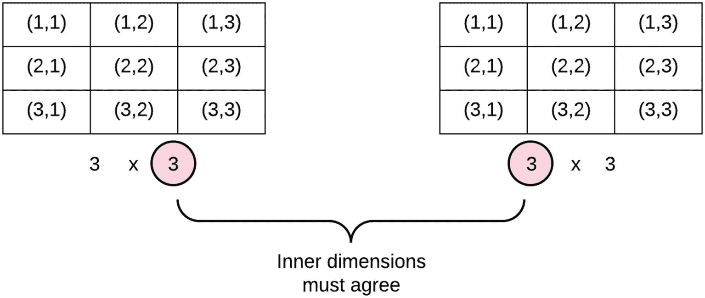

图 10-1

矩阵乘法

```py
# multiply the two matrices A and B (dot product)
A @ B    # or np.matmul(A,B)
'Output':
array([[2290, 2478, 2240],
[1784, 2072, 1792],
[3040, 3448, 2360]])
```

### `元素级运算`

元素级矩阵运算涉及矩阵以元素级方式对自己进行操作。操作可以是加法、减法、除法或乘法（通常称为 Hadamard 积）。矩阵必须具有相同的形状。**请注意**，虽然矩阵的形状是*n* × *n*，但向量是*n* × 1。这些概念也容易应用到向量上。见图 10-2。

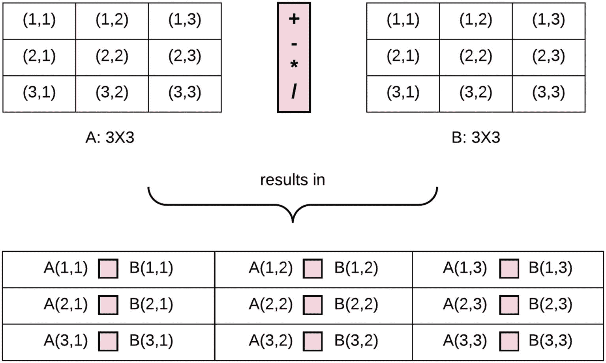

图 10-2

元素级矩阵运算

让我们来看一些例子。

```py
# Hadamard multiplication of A and B
A * B
'Output':
array([[ 570,  928,  528],
[ 160,  690, 1196],
[ 990,  658, 1056]])
# add A and B
A + B
'Output':
array([[53, 61, 46],
[37, 53, 72],
[63, 61, 68]])
# subtract A from B
B - A
'Output':
array([[ 23,   3,  -2],
[ 27,   7,  20],
[  3,  33, -20]])
# divide A with B
A / B
'Output':
array([[ 0.39473684,  0.90625   ,  1.09090909],
[ 0.15625   ,  0.76666667,  0.56521739],
[ 0.90909091,  0.29787234,  1.83333333]])
```

### `标量运算`

一个矩阵可以像元素级一样被一个标量（即单个数值实体）作用。这次标量作用于矩阵或向量的每个元素。见图 10-3。

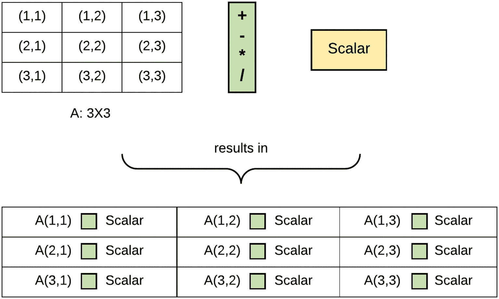

图 10-3

标量运算

让我们来看一些例子。

```py
# Hadamard multiplication of A and a scalar, 0.5
A * 0.5
'Output':
array([[  7.5,  14.5,  12\. ],
[  2.5,  11.5,  13\. ],
[ 15\. ,   7\. ,  22\. ]])
# add A and a scalar, 0.5
A + 0.5
'Output':
array([[ 15.5,  29.5,  24.5],
[  5.5,  23.5,  26.5],
[ 30.5,  14.5,  44.5]])
# subtract a scalar 0.5 from B
B - 0.5
'Output':
array([[ 37.5,  31.5,  21.5],
[ 31.5,  29.5,  45.5],
[ 32.5,  46.5,  23.5]])
# divide A and a scalar, 0.5
A / 0.5
'Output':
array([[ 30.,  58.,  48.],
[ 10.,  46.,  52.],
[ 60.,  28.,  88.]])
```

### 矩阵转置

转置是矩阵运算中的一个重要操作，通过翻转行和列的索引来反转矩阵的行和列。矩阵的转置表示为 *A*^(*T*)。观察到底对角线元素保持不变。见图 10-4。

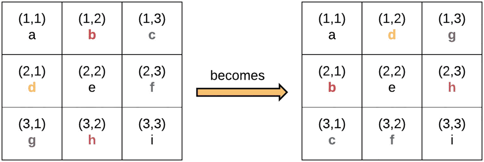

图 10-4

矩阵转置

让我们看一个例子。

```py
A = np.array([[15, 29, 24],
[ 5, 23, 26],
[30, 14, 44]])
# transpose A
A.T   # or A.transpose()
'Output':
array([[15,  5, 30],
[29, 23, 14],
[24, 26, 44]])
```

### `矩阵的逆`

一个 *m* × *m* 矩阵 *A*（也称为方阵）如果 *A* 乘以另一个矩阵 *B* 结果是形状为 *m* × *m* 的单位矩阵 *I*，则 *A* 有一个逆。这个矩阵 *B* 被称为 *A* 的逆，表示为 *A*^(−1)。这个关系形式上写为

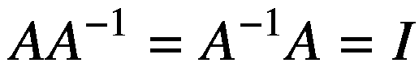

然而，并非所有矩阵都有逆。有逆的矩阵称为 *非奇异* 或 *可逆* 矩阵，而没有逆的矩阵称为 *奇异* 或 *退化*。

### 注意

一个方阵是一个行数和列数相同的矩阵。

让我们使用 NumPy 来获取矩阵的逆。一些线性代数模块可以在 NumPy 的一个子模块 **linalg** 中找到。

```py
A = np.array([[15, 29, 24],
[ 5, 23, 26],
[30, 14, 44]])
# find the inverse of A
np.linalg.inv(A)
'Output':
array([[ 0.05848375, -0.08483755,  0.01823105],
[ 0.05054152, -0.00541516, -0.02436823],
[-0.05595668,  0.05956679,  0.01805054]])
```

NumPy 还实现了 *Moore-Penrose 伪逆*，为退化矩阵提供了逆的推导。在这里，我们使用 **pinv** 方法来找到可逆矩阵的逆。

```py
# using pinv()
np.linalg.pinv(A)
'Output':
array([[ 0.05848375, -0.08483755,  0.01823105],
[ 0.05054152, -0.00541516, -0.02436823],
[-0.05595668,  0.05956679,  0.01805054]])
```

## 重塑

NumPy 数组可以被重新结构化为不同的形状。让我们将一个 1-D 数组转换为 *m* × *n* 矩阵。

```py
# make 20 elements evenly spaced between 0 and 5
a = np.linspace(0,5,20)
a
'Output':
array([ 0\.        ,  0.26315789,  0.52631579,  0.78947368,  1.05263158,
1.31578947,  1.57894737,  1.84210526,  2.10526316,  2.36842105,
2.63157895,  2.89473684,  3.15789474,  3.42105263,  3.68421053,
3.94736842,  4.21052632,  4.47368421,  4.73684211,  5\.        ])
# observe that a is a 1-D array
a.shape
'Output': (20,)
# reshape into a 5 x 4 matrix
A = a.reshape(5, 4)
A
'Output':
array([[ 0\.        ,  0.26315789,  0.52631579,  0.78947368],
[ 1.05263158,  1.31578947,  1.57894737,  1.84210526],
[ 2.10526316,  2.36842105,  2.63157895,  2.89473684],
[ 3.15789474,  3.42105263,  3.68421053,  3.94736842],
[ 4.21052632,  4.47368421,  4.73684211,  5\.        ]])
# The vector a has been reshaped into a 5 by 4 matrix A
A.shape
'Output': (5, 4)
```

### 重塑与调整大小方法

NumPy 有 **np.reshape** 和 **np.resize** 方法。reshape 方法返回一个形状修改后的 ndarray，而不改变原始数组，而 resize 方法则改变原始数组。让我们看一个例子。

```py
# generate 9 elements evenly spaced between 0 and 5
a = np.linspace(0,5,9)
a
'Output':  array([ 0\.   ,  0.625,  1.25 ,  1.875,  2.5  ,  3.125,  3.75 ,  4.375,  5\.   ])
# the original shape
a.shape
'Output':  (9,)
# call the reshape method
a.reshape(3,3)
'Output':
array([[ 0\.   ,  0.625,  1.25 ],
[ 1.875,  2.5  ,  3.125],
[ 3.75 ,  4.375,  5\.   ]])
# the original array maintained its shape
a.shape
'Output':  (9,)
# call the resize method - resize does not return an array
a.resize(3,3)
# the resize method has changed the shape of the original array
a.shape
'Output':  (3, 3)
```

### 堆叠数组

NumPy 有用于连接数组的函数，也称为堆叠。hstack 和 vstack 方法分别用于沿水平和垂直轴堆叠多个数组。

```py
# create a 2x2 matrix of random integers in the range of 1 to 20
A = np.random.randint(1, 50, size=[3,3])
B = np.random.randint(1, 50, size=[3,3])
# print out the arrays
A
'Output':
array([[19, 40, 31],
[ 5, 16, 38],
[22, 49,  9]])
B
'Output':
array([[15, 22, 16],
[49, 26,  9],
[42, 13, 39]])
```

使用 **hstack** 水平堆叠 **A** 和 **B**。要使用 **hstack**，数组必须具有相同数量的行。此外，要堆叠的数组作为元组传递给 **hstack** 方法。

```py
# arrays are passed as tuple to hstack
np.hstack((A,B))
'Output':
array([[19, 40, 31, 15, 22, 16],
[ 5, 16, 38, 49, 26,  9],
[22, 49,  9, 42, 13, 39]])
```

要使用 **vstack** 垂直堆叠 **A** 和 **B**，数组必须具有相同数量的列。要堆叠的数组也作为元组传递给 **vstack** 方法。

```py
# arrays are passed as tuple to hstack
np.vstack((A,B))
'Output':
array([[19, 40, 31],
[ 5, 16, 38],
[22, 49,  9],
[15, 22, 16],
[49, 26,  9],
[42, 13, 39]])
```

## 广播

NumPy 为不同维度或形状的数组提供了优雅的算术运算机制。例如，当将一个标量加到一个向量（或 1-D 数组）上时，标量值在概念上被广播或拉伸到数组的行上，并逐元素相加。见图 10-5。

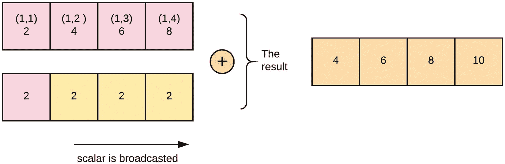

图 10-5

将标量加到向量（或 1-D 数组）上的广播示例

形状不同的矩阵可以通过拉伸较小数组的维度来进行广播，以执行算术运算。广播是另一种用于加速矩阵处理的向量化操作。然而，并非所有形状不同的数组都可以进行广播。为了进行广播，数组的尾随轴必须具有相同的大小或为 1。

在下面的示例中，矩阵**A**和**B**具有相同的行数，但矩阵**B**的列数为 1。因此，可以通过广播和逐元素添加单元格来对它们执行算术运算。

```py
A      (2d array):  4 x 3       + 
B      (2d array):  4 x 1
Result (2d array):  4 x 3
```

请参阅图 10-6 以获取更多说明。

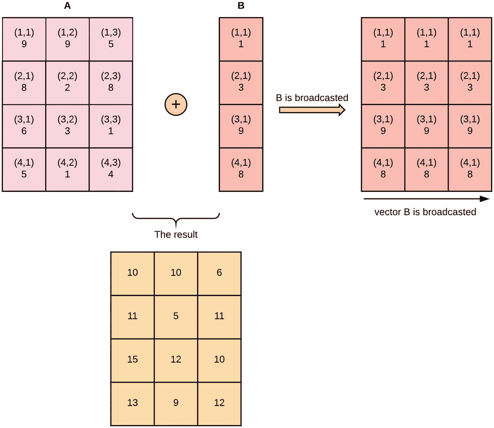

图 10-6

矩阵广播示例

让我们看看代码示例：

```py
# create a 4 X 3 matrix of random integers between 1 and 10
A = np.random.randint(1, 10, [4, 3])
A
'Output':
array([[9, 9, 5],
[8, 2, 8],
[6, 3, 1],
[5, 1, 4]])
# create a 4 X 1 matrix of random integers between 1 and 10
B = np.random.randint(1, 10, [4, 1])
B
'Output':
array([[1],
[3],
[9],
[8]])
# add A and B
A + B
'Output':
array([[10, 10,  6],
[11,  5, 11],
[15, 12, 10],
[13,  9, 12]])
```

下面的示例无法进行广播，并将导致*ValueError: operands could not be broadcasted together with shapes (4,3) (4,2)*错误，因为矩阵**A**和**B**的列不同，并且不符合上述广播规则，即数组的尾随轴必须具有相同的大小或为 1。

```py
A      (2d array):  4 x 3
B      (2d array):  4 x 2
The dimensions do not match - they must be either the same or 1
```

当我们尝试在 Python 中添加前面的示例时，我们会得到一个错误。

```py
A = np.random.randint(1, 10, [4, 3])
B = np.random.randint(1, 10, [4, 2])
A + B
'Output':
Traceback (most recent call last):
File "", line 1, in 
A + B
ValueError: operands could not be broadcast together with shapes (4,3) (4,2)
```

## 加载数据

加载数据是数据分析/机器学习流程中的一个重要过程。数据通常以**.csv**格式存在。可以通过使用**loadtxt**方法将**csv**文件加载到 Python 中。参数**skiprows**跳过了数据集的第一行——通常是数据的标题行。

```py
np.loadtxt(open("the_file_name.csv", "rb"), delimiter=",", skiprows=1)
```

Pandas 是 Python 中加载数据的首选包。

我们将在下一章中学习更多关于 Pandas 数据操作的知识。

# 11. Pandas

Pandas 是一个专门用于数据分析的 Python 库，尤其是在处理庞大的数据集时。它提供了易于使用的功能，用于读取和写入数据、处理缺失数据、重塑数据集，并通过切片、索引、插入和删除数据变量和记录来调整数据。Pandas 还拥有一个重要的**groupBy**功能，用于根据定义的条件聚合数据——这对于绘图和计算用于探索的数据摘要非常有用。

Pandas 的另一个关键优势在于对时间序列数据进行重新排序和清洗，以便进行时间序列分析。简而言之，Pandas 是数据清洗和数据探索的首选工具。

要使用 Pandas，首先导入 Pandas 模块：

```py
import pandas as pd
```

## Pandas 数据结构

就像 NumPy 一样，Pandas 可以存储和操作多维数组数据。为了处理这些数据，Pandas 提供了**Series**和**DataFrame**数据结构。

### Series

**Series**数据结构用于存储数据元素的一维数组（或向量）。Series 数据结构还提供了以**索引**形式的数据项标签。用户可以通过**Series**函数中的**index**参数指定此标签，但如果**index**参数未指定，则将分配一个默认标签，从 0 到数据元素大小减 1。

让我们考虑一个创建 **Series** 数据结构的例子。

```py
# create a Series object
my_series = pd.Series([2,4,6,8], index=['e1','e2','e3','e4'])
# print out data in Series data structure
my_series
'Output':
e1    2
e2    4
e3    6
e4    8
dtype: int64
# check the data type of the variable
type(my_series)
'Output': pandas.core.series.Series
# return the elements of the Series data structure
my_series.values
'Output': array([2, 4, 6, 8])
# retrieve elements from Series data structure based on their assigned indices
my_series['e1']
'Output': 2
# return all indices of the Series data structure
my_series.index
'Output': Index(['e1', 'e2', 'e3', 'e4'], dtype="object")
```

Series 数据结构中的元素可以分配相同的索引。

```py
# create a Series object with elements sharing indices
my_series = pd.Series([2,4,6,8], index=['e1','e2','e1','e2'])
# note the same index assigned to various elements
my_series
'Output':
e1    2
e2    4
e1    6
e2    8
dtype: int64
# get elements using their index
my_series['e1']
'Output':
e1    2
e1    6
dtype: int64
```

### DataFrame

DataFrame 是 Pandas 用于存储和操作二维数组的数结构。二维数组是一种类似于 Excel 工作表或关系数据库表的表格结构。DataFrame 是存储结构化数据集的一种非常自然的形式。

DataFrame 由行和列组成，用于存储跨异构变量（列）的信息记录（行）。

让我们看看使用 DataFrame 的一些示例。

```py
# create a data frame
my_DF = pd.DataFrame({'age': [15,17,21,29,25], \
'state_of_origin':['Lagos', 'Cross River', 'Kano', 'Abia', 'Benue']})
my_DF
'Output':
age state_of_origin
0   15           Lagos
1   17     Cross River
2   21            Kano
3   29            Abia
4   25           Benue
```

从前面的例子中，我们将观察到 DataFrame 是由记录的字典构成的，其中每个值都是一个 **Series** 数据结构。此外，请注意，每一行都有一个 **索引**，可以在创建 DataFrame 时分配，否则将使用从 0 到 DataFrame 中记录数减一的默认索引。手动创建索引通常不可行，除非处理小型虚拟数据集。

NumPy 经常与 Pandas 一起使用。让我们导入 NumPy 库并使用其一些函数来演示创建快速 DataFrame 的其他方法。

```py
import numpy as np
# create a 3x3 dataframe of numbers from the normal distribution
my_DF = pd.DataFrame(np.random.randn(3,3),\
columns=['First','Second','Third'])
my_DF
'Output':
First    Second     Third
0 -0.211218 -0.499870 -0.609792
1 -0.295363  0.388722  0.316661
2  1.397300 -0.894861  1.127306
# check the dimensions
my_DF.shape
'Output': (3, 3)
```

让我们来看看 DataFrame 的其他一些操作。

```py
# create a python dictionary
my_dict = {'State':['Adamawa', 'Akwa-Ibom', 'Yobe', 'Rivers', 'Taraba'], \
'Capital':['Yola','Uyo','Damaturu','Port-Harcourt','Jalingo'], \
'Population':[3178950, 5450758, 2321339, 5198716, 2294800]}
my_dict
'Output':
{'Capital': ['Yola', 'Uyo', 'Damaturu', 'Port-Harcourt', 'Jalingo'],
'Population': [3178950, 5450758, 2321339, 5198716, 2294800],
'State': ['Adamawa', 'Akwa-Ibom', 'Yobe', 'Rivers', 'Taraba']}
# confirm dictionary type
type(my_dict)
'Output': dict
# create DataFrame from dictionary
my_DF = pd.DataFrame(my_dict)
my_DF
'Output':
Capital  Population      State
0           Yola     3178950    Adamawa
1            Uyo     5450758  Akwa-Ibom
2       Damaturu     2321339       Yobe
3  Port-Harcourt     5198716     Rivers
4        Jalingo     2294800     Taraba
# check DataFrame type
type(my_DF)
'Output': pandas.core.frame.DataFrame
# retrieve column names of the DataFrame
my_DF.columns
'Output': Index(['Capital', 'Population', 'State'], dtype="object")
# the data type of `DF.columns` method is an Index
type(my_DF.columns)
'Output': pandas.core.indexes.base.Index
# retrieve the DataFrame values as a NumPy ndarray
my_DF.values
'Output':
array([['Yola', 3178950, 'Adamawa'],
['Uyo', 5450758, 'Akwa-Ibom'],
['Damaturu', 2321339, 'Yobe'],
['Port-Harcourt', 5198716, 'Rivers'],
['Jalingo', 2294800, 'Taraba']], dtype=object)
# the data type of  `DF.values` method is an numpy ndarray
type(my_DF.values)
'Output': numpy.ndarray
```

总结来说，DataFrame 是一种表格结构，用于存储结构化数据集，其中每一列包含一个记录的 **Series** 数据结构。这里有一个说明（图 11-1）。

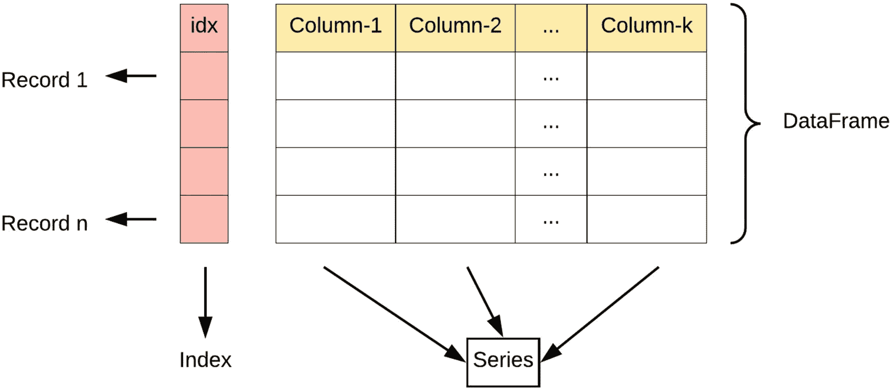

图 11-1

Pandas 数据结构

让我们检查 DataFrame 中每一列的数据类型。

```py
my_DF.dtypes
'Output':
Capital       object
Population     int64
State         object
dtype: object
```

Pandas 中的 **object** 数据类型表示 **字符串**。

## 数据索引（选择/子集）

与 NumPy 类似，Pandas 对象可以索引或子集数据集以检索较大数据集的特定子记录。请注意，如果检索到二维或一维数组，数据索引返回一个新的 **DataFrame** 或 **Series**。然而，它们不会更改原始数据集。让我们通过一些 Pandas DataFrame 索引的例子来了解。

首先，让我们创建一个 DataFrame。观察默认的整数索引分配。

```py
# create the dataframe
my_DF = pd.DataFrame({'age': [15,17,21,29,25], \
'state_of_origin':['Lagos', 'Cross River', 'Kano', 'Abia', 'Benue']})
my_DF
'Output':
age state_of_origin
0   15           Lagos
1   17     Cross River
2   21            Kano
3   29            Abia
4   25           Benue
```

### 从 DataFrame 中选择列

记住，DataFrame 列的数据类型是 **Series**，因为它是一个向量或一维数组。

```py
my_DF['age']
'Output':
0    15
1    17
2    21
3    29
4    25
Name: age, dtype: int64
# check data type
type(my_DF['age'])
'Output':  pandas.core.series.Series
```

要选择多个列，将列名用双中括号 **[[ ]]** 包围作为 **字符串**。以下代码是一个示例：

```py
my_DF[['age','state_of_origin']]
'Output':
age state_of_origin
0   15           Lagos
1   17     Cross River
2   21            Kano
3   29            Abia
4   25           Benue
```

### 从 DataFrame 中选择行

Pandas 使用两个独特的包装属性来从 **DataFrame** 或 **Series** 数据结构中索引行或单元格。这些属性是 **iloc** 和 **loc** ——它们也被称为索引器。**iloc** 属性允许您使用内置的 Python 索引格式选择或切片 DataFrame 的行，而 **loc** 属性使用分配给 DataFrame 的显式索引。如果没有找到显式索引，**loc** 返回与 **iloc** 相同的值。

记住，DataFrame 行的数据类型是**Series**，因为它是一个向量或一维数组。

让我们从 DataFrame 中选择第一行。

```py
# using explicit indexing
my_DF.loc[0]
'Output':
age                   15
state_of_origin    Lagos
Name: 0, dtype: object
# using implicit indexing
my_DF.iloc[0]
'Output':
age                   15
state_of_origin    Lagos
Name: 0, dtype: object
# let's see the data type
type(my_DF.loc[0])
'Output':  pandas.core.series.Series
```

现在，让我们创建一个具有显式索引的 DataFrame，并测试**iloc**和**loc**方法。如果使用**iloc**进行显式索引或使用**loc**进行隐式 Python 索引，Pandas 将返回一个错误。

```py
my_DF = pd.DataFrame({'age': [15,17,21,29,25], \
'state_of_origin':['Lagos', 'Cross River', 'Kano', 'Abia', 'Benue']},\
index=['a','a','b','b','c'])
# observe the string indices
my_DF
'Output':
age state_of_origin
a   15           Lagos
a   17     Cross River
b   21            Kano
b   29            Abia
c   25           Benue
# select using explicit indexing
my_DF.loc['a']
Out[196]:
age state_of_origin
a   15           Lagos
a   17     Cross River
# let's try to use loc for implicit indexing
my_DF.loc[0]
'Output':
Traceback (most recent call last):
TypeError: cannot do label indexing on 
with these indexers [0] of 
```

### 从 DataFrame 中选择多行和多列

让我们使用**loc**方法从 Pandas DataFrame 中选择多行和多列。

```py
# select rows with age greater than 20
my_DF.loc[my_DF.age > 20]
'Output':
age state_of_origin
2   21            Kano
3   29            Abia
4   25           Benue
# find states of origin with age greater than or equal to 25
my_DF.loc[my_DF.age >= 25, 'state_of_origin']
'Output':
Out[29]:
3     Abia
4    Benue
```

### 从 DataFrame 中按行和列切片单元格

首先，让我们创建一个 DataFrame。记住，当我们没有明确指定索引或行标签时，我们使用**iloc**。

```py
my_DF = pd.DataFrame({'age': [15,17,21,29,25], \
'state_of_origin':['Lagos', 'Cross River', 'Kano', 'Abia', 'Benue']})
my_DF
'Output':
age state_of_origin
0   15           Lagos
1   17     Cross River
2   21            Kano
3   29            Abia
4   25           Benue
# select the third row and second column
my_DF.iloc[2,1]
'Output': 'Kano'
# slice the first 2 rows - indexed from zero, excluding the final index
my_DF.iloc[:2,]
'Output':
age state_of_origin
0   15           Lagos
1   17     Cross River
# slice the last three rows from the last column
my_DF.iloc[-3:,-1]
'Output':
2     Kano
3     Abia
4    Benue
Name: state_of_origin, dtype: object
```

## DataFrame 操作

让我们来看一下操作 DataFrame 的一些常见任务。

### 删除行/列

在数据清洗过程中，在许多情况下，可能需要删除不需要的行或数据变量（即列）。我们通常使用**drop**函数来完成这项操作。**drop**函数有一个参数**axis**，其默认值为 0。如果**axis**设置为 1，它将删除数据集中的列，但如果保持默认值，则从数据集中删除行。

注意，当删除列或行时，会返回一个新的**DataFrame**或**Series**，而不会改变原始数据结构。然而，当将**inplace**属性设置为**True**时，原始 DataFrame 或 Series 将被修改。让我们看看一些例子。

```py
# the data frame
my_DF = pd.DataFrame({'age': [15,17,21,29,25], \
'state_of_origin':['Lagos', 'Cross River', 'Kano', 'Abia', 'Benue']})
my_DF
'Output':
age state_of_origin
0   15           Lagos
1   17     Cross River
2   21            Kano
3   29            Abia
4   25           Benue
# drop the 3rd and 4th column
my_DF.drop([2,4])
'Output':
age state_of_origin
0   15           Lagos
1   17     Cross River
3   29            Abia
# drop the `age` column
my_DF.drop('age', axis=1)
'Output':
state_of_origin
0           Lagos
1     Cross River
2            Kano
3            Abia
4           Benue
# original DataFrame is unchanged
my_DF
'Output':
age state_of_origin
0   15           Lagos
1   17     Cross River
2   21            Kano
3   29            Abia
4   25           Benue
# drop using 'inplace' - to modify the original DataFrame
my_DF.drop('age', axis=1, inplace=True)
# original DataFrame altered
my_DF
'Output':
state_of_origin
0           Lagos
1     Cross River
2            Kano
3            Abia
4           Benue
```

让我们看看根据条件删除行的示例。

```py
my_DF = pd.DataFrame({'age': [15,17,21,29,25], \
'state_of_origin':['Lagos', 'Cross River', 'Kano', 'Abia', 'Benue']})
my_DF
'Output':
age state_of_origin
0   15           Lagos
1   17     Cross River
2   21            Kano
3   29            Abia
4   25           Benue
# drop all rows less than 20
my_DF.drop(my_DF[my_DF['age'] < 20].index, inplace=True)
my_DF
'Output':
age state_of_origin
2   21            Kano
3   29            Abia
4   25           Benue
```

### 添加行/列

我们可以通过使用**assign**方法向 Pandas DataFrame 中添加新列。

```py
# show dataframe
my_DF = pd.DataFrame({'age': [15,17,21,29,25], \
'state_of_origin':['Lagos', 'Cross River', 'Kano', 'Abia', 'Benue']})
my_DF
'Output':
age state_of_origin
0   15           Lagos
1   17     Cross River
2   21            Kano
3   29            Abia
4   25           Benue
# add column to data frame
my_DF = my_DF.assign(capital_city = pd.Series(['Ikeja', 'Calabar', \
'Kano', 'Umuahia', 'Makurdi']))
my_DF
'Output':
age state_of_origin capital_city
0   15           Lagos        Ikeja
1   17     Cross River      Calabar
2   21            Kano         Kano
3   29            Abia      Umuahia
4   25           Benue      Makurdi
```

我们还可以通过在另一列上计算某个函数来向 DataFrame 中添加新列。让我们通过添加一个计算年龄与平均年龄绝对差的列来举例。

```py
mean_of_age = my_DF['age'].mean()
my_DF['diff_age'] = my_DF['age'].map( lambda x: abs(x-mean_of_age))
my_DF
'Output':
age state_of_origin  diff_age
0   15           Lagos       6.4
1   17     Cross River       4.4
2   21            Kano       0.4
3   29            Abia       7.6
4   25           Benue       3.6
```

通常在实际操作中，一个完整的数据集会被转换为 Pandas 进行清洗和分析，这通常不涉及向数据集中添加新的观测值。但如果有此需求，我们可以使用**append()**方法来实现。然而，这可能不是一个计算效率高的操作。让我们看看一个例子。

```py
# show dataframe
my_DF = pd.DataFrame({'age': [15,17,21,29,25], \
'state_of_origin':['Lagos', 'Cross River', 'Kano', 'Abia', 'Benue']})
my_DF
'Output':
age state_of_origin
0   15           Lagos
1   17     Cross River
2   21            Kano
3   29            Abia
4   25           Benue
# add a row to data frame
my_DF = my_DF.append(pd.Series([30 , 'Osun'], index=my_DF.columns), \
ignore_index=True)
my_DF
'Output':
age state_of_origin
0   15           Lagos
1   17     Cross River
2   21            Kano
3   29            Abia
4   25           Benue
5   30            Osun
```

我们观察到添加新行涉及到传递给**append**方法一个**Series**对象，其**index**属性设置为主 DataFrame 的列。由于通常在给定的数据集中，索引不过是分配的默认值，因此我们将**ignore_index**属性设置为创建一组新的默认索引值，以包含新行。

### 数据对齐

Pandas 在执行 DataFrame 上的某些二元算术操作时，利用数据对齐来对齐索引。如果参与算术操作的 DataFrame 中有两个或多个 DataFrame 没有共享的公共索引，则会引入一个**NaN**，表示缺失数据。让我们看看这个的示例。

```py
# create a 3x3 dataframe - remember randint(low, high, size)
df_A = pd.DataFrame(np.random.randint(1,10,[3,3]),\
columns=['First','Second','Third'])
df_A
'Output':
First  Second  Third
0      2       3      9
1      8       7      7
2      8       6      4
# create a 4x3 dataframe
df_B = pd.DataFrame(np.random.randint(1,10,[4,3]),\
columns=['First','Second','Third'])
df_B
'Output':
First  Second  Third
0      3       6      3
1      2       2      1
2      9       3      8
3      2       9      2
# add df_A and df_B together
df_A + df_B
'Output':
First  Second  Third
0    5.0     9.0   12.0
1   10.0     9.0    8.0
2   17.0     9.0   12.0
3    NaN     NaN    NaN
# divide both dataframes
df_A / df_B
'Output':
First  Second  Third
0  0.666667     0.5    3.0
1  4.000000     3.5    7.0
2  0.888889     2.0    0.5
3       NaN     NaN    NaN
```

如果我们不希望用 **NaN** 表示的缺失值被填充，我们可以使用 **fill_value** 属性用默认值替换。然而，为了利用 **fill_value** 属性，我们必须使用 Pandas 的算术方法：**add()**、**sub()**、**mul()**、**div()**、**floordiv()**、**mod()** 和 **pow()**，分别用于加法、减法、乘法、整数除法、数值除法、余数除法和指数运算。让我们看看示例。

```py
df_A.add(df_B, fill_value=10)
'Output':
First  Second  Third
0    5.0     9.0   12.0
1   10.0     9.0    8.0
2   17.0     9.0   12.0
3   12.0    19.0   12.0
```

### 合并数据集

我们可能需要将两个或多个数据集合并在一起；Pandas 提供了这样的操作方法。我们将考虑使用 **concat** 方法合并具有共享列名的数据框的简单情况。

```py
# combine two dataframes column-wise
pd.concat([df_A, df_B])
'Output':
First  Second  Third
0      2       3      9
1      8       7      7
2      8       6      4
0      3       6      3
1      2       2      1
2      9       3      8
3      2       9      2
```

注意到 **concat** 方法默认保留索引。我们也可以通过设置 **axis** 参数为 1 来按行（或水平）连接或合并两个数据框。

```py
# combine two dataframes horizontally
pd.concat([df_A, df_B], axis=1)
'Output':
Out[246]:
First  Second  Third  First  Second  Third
0    2.0     3.0    9.0      3       6      3
1    8.0     7.0    7.0      2       2      1
2    8.0     6.0    4.0      9       3      8
3    NaN     NaN    NaN      2       9      2
```

## 处理缺失数据

处理缺失数据是数据清洗/数据分析过程的一个基本部分。此外，一些机器学习算法在存在缺失数据的情况下将无法工作。让我们看看一些简单的 Pandas 方法，用于识别和删除缺失数据，以及将值填充到缺失数据中。

### 识别缺失数据

在本节中，我们将使用 **isnull()** 方法检查 DataFrame 中是否存在缺失单元格。

```py
# let's create a data frame with missing data
my_DF = pd.DataFrame({'age': [15,17,np.nan,29,25], \
'state_of_origin':['Lagos', 'Cross River', 'Kano', 'Abia', np.nan]})
my_DF
'Output':
age state_of_origin
0  15.0           Lagos
1  17.0     Cross River
2   NaN            Kano
3  29.0            Abia
4  25.0             NaN
```

让我们检查这个数据框中的缺失数据。**isnull()** 方法将在存在缺失数据的地方返回 **True**，而 **notnull()** 函数返回 **False**。

```py
my_DF.isnull()
'Output':
age  state_of_origin
0  False            False
1  False            False
2   True            False
3  False            False
4  False             True
```

然而，如果我们想要一个单一的答案（即，要么是 **True** 要么是 **False**）来报告数据框中是否存在缺失数据，我们首先将 DataFrame 转换为 NumPy 数组，并使用函数 **any()**。

**any** 函数在数据集的元素中至少有一个为 **True** 时返回 **True**。在这种情况下，**isnull()** 返回一个布尔 DataFrame，其中 **True** 表示有缺失值的单元格。

让我们看看它是如何工作的。

```py
my_DF.isnull().values.any()
'Output':  True
```

### 删除缺失数据

Pandas 有一个名为 **dropna()** 的函数，用于从 DataFrame 中过滤或删除缺失数据。**dropna()** 返回一个不包含缺失数据的新 DataFrame。让我们看看这个函数是如何工作的示例。

```py
# let's see our dataframe with missing data
my_DF = pd.DataFrame({'age': [15,17,np.nan,29,25], \
'state_of_origin':['Lagos', 'Cross River', 'Kano', 'Abia', np.nan]})
my_DF
'Output':
age state_of_origin
0  15.0           Lagos
1  17.0     Cross River
2   NaN            Kano
3  29.0            Abia
4  25.0             NaN
# let's run dropna() to remove all rows with missing values
my_DF.dropna()
'Output':
age state_of_origin
0  15.0           Lagos
1  17.0     Cross River
3  29.0            Abia
```

如我们从前面的代码块中观察到的，**dropna()** 会删除包含缺失值的所有行。但也许我们并不希望这样做。例如，我们可能更希望删除包含缺失数据的列或删除所有观测值都缺失的行，或者更理想的是根据特定行中存在的观测值数量来删除。

让我们看看这个选项的示例。首先让我们扩展我们的示例数据集。

```py
my_DF = pd.DataFrame({'Capital': ['Yola', np.nan, np.nan, 'Port-Harcourt', 'Jalingo'],
'Population': [3178950, np.nan, 2321339, np.nan, 2294800],
'State': ['Adamawa', np.nan, 'Yobe', np.nan, 'Taraba'],
'LGAs': [22, np.nan, 17, 23, 16]})
my_DF
'Output':
Capital  LGAs  Population    State
0           Yola  22.0   3178950.0  Adamawa
1            NaN   NaN         NaN      NaN
2            NaN  17.0   2321339.0     Yobe
3  Port-Harcourt  23.0         NaN      NaN
4        Jalingo  16.0   2294800.0   Taraba
```

删除包含 **NaN** 的列。这个选项在实践中不常用。

```py
my_DF.dropna(axis=1)
'Output':
Empty DataFrame
Columns: []
Index: [0, 1, 2, 3, 4]
```

删除所有观测值都缺失的行。

```py
my_DF.dropna(how='all')
'Output':
Capital  LGAs  Population    State
0           Yola  22.0   3178950.0  Adamawa
2            NaN  17.0   2321339.0     Yobe
3  Port-Harcourt  23.0         NaN      NaN
4        Jalingo  16.0   2294800.0   Taraba
```

根据观测阈值删除行。通过调整 **thresh** 属性，我们可以删除行中观测值数量小于 **thresh** 值的行。

```py
# drop rows where number of NaN is less than 3
my_DF.dropna(thresh=3)
'Output':
Capital  LGAs  Population    State
0     Yola  22.0   3178950.0  Adamawa
2      NaN  17.0   2321339.0     Yobe
4  Jalingo  16.0   2294800.0   Taraba
```

### 填充缺失数据中的值

用替代值填充缺失数据是准备数据用于机器学习时的标准做法。Pandas 提供了一个名为 **fillna()** 的函数用于此目的。一种简单的方法是将 **NaNs** 填充为零。

```py
my_DF.fillna(0) # we can also run my_DF.replace(np.nan, 0)
'Output':
Capital  LGAs  Population    State
0           Yola  22.0   3178950.0  Adamawa
1              0   0.0         0.0        0
2              0  17.0   2321339.0     Yobe
3  Port-Harcourt  23.0         0.0        0
4        Jalingo  16.0   2294800.0   Taraba
```

另一种策略是用列值的平均值填充缺失值。

```py
my_DF.fillna(my_DF.mean())
'Output':
Capital  LGAs  Population    State
0           Yola  22.0   3178950.0  Adamawa
1            NaN  19.5   2598363.0      NaN
2            NaN  17.0   2321339.0     Yobe
3  Port-Harcourt  23.0   2598363.0      NaN
4        Jalingo  16.0   2294800.0   Taraba
```

## 数据聚合（分组）

我们将简要介绍数据科学中的一个常见做法，即对一组数据属性进行分组，无论是为了检索某些组统计信息还是应用特定的一组函数。分组通常用于数据探索和绘制图表以更好地了解数据集。在分组操作中，缺失数据会自动排除。

让我们看看这个是如何工作的例子。

```py
# create a data frame
my_DF = pd.DataFrame({'Sex': ['M', 'F', 'M', 'F','M', 'F','M', 'F'],
'Age': np.random.randint(15,60,8),
'Salary': np.random.rand(8)*10000})
my_DF
'Output':
Age       Salary Sex
0   54  6092.596170   M
1   57  3148.886141   F
2   37  5960.916038   M
3   23  6713.133849   F
4   34  5208.240349   M
5   25  2469.118934   F
6   50  1277.511182   M
7   54  3529.201109   F
```

让我们找到我们数据集中按 **性别** 分组的观察值的平均年龄和薪水。

```py
my_DF.groupby('Sex').mean()
'Output':
Age       Salary
Sex
F    39.75  3965.085008
M    43.75  4634.815935
```

我们可以按多个变量进行分组。在这种情况下，对于每个 **性别** 组，也按年龄分组，并找到其他数值变量的平均值。

```py
my_DF.groupby([my_DF['Sex'], my_DF['Age']]).mean()
'Output':
Salary
Sex Age
F   23   6713.133849
25   2469.118934
54   3529.201109
57   3148.886141
M   34   5208.240349
37   5960.916038
50   1277.511182
54   6092.596170
```

此外，我们还可以使用一个变量作为分组键，对另一个变量或变量集运行分组函数。

```py
my_DF['Age'].groupby(my_DF['Salary']).mean()
'Output':
Salary
1277.511182    50
2469.118934    25
3148.886141    57
3529.201109    54
5208.240349    34
5960.916038    37
6092.596170    54
6713.133849    23
Name: Age, dtype: int64
```

## 统计摘要

描述性统计是数据科学流程的一个基本组成部分。通过研究数据集的性质，我们可以更好地理解数据以及变量之间的关系。这些信息对于决定执行的数据转换类型或要检查的学习算法类型非常有用。让我们看看 Pandas 中简单统计函数的一些例子。

首先，我们将创建一个 Pandas 数据框。

```py
my_DF = pd.DataFrame(np.random.randint(10,80,[7,4]),\
columns=['First','Second','Third', 'Fourth'])
'Output':
First  Second  Third  Fourth
0     47      32     66      52
1     37      66     16      22
2     24      16     63      36
3     70      47     62      12
4     74      61     44      18
5     65      73     21      37
6     44      47     23      13
```

使用 **describe** 函数来获取数据集的摘要统计信息。显示八个统计指标。它们是计数、平均值、标准差、最小值、25 百分位数、50 百分位数或中位数、75 百分位数和最大值。

```py
my_DF.describe()
'Output':
First     Second      Third     Fourth
count   7.000000   7.000000   7.000000   7.000000
mean   51.571429  48.857143  42.142857  27.142857
std    18.590832  19.978560  21.980511  14.904458
min    24.000000  16.000000  16.000000  12.000000
25%    40.500000  39.500000  22.000000  15.500000
50%    47.000000  47.000000  44.000000  22.000000
75%    67.500000  63.500000  62.500000  36.500000
max    74.000000  73.000000  66.000000  52.000000
```

### 相关性

相关性展示了两个变量之间存在多少关系。当变量高度相关时，参数化机器学习方法，如逻辑回归和线性回归，可能会受到影响。相关值范围从 –1 到 1，其中 0 表示完全没有相关性。–1 表示变量之间存在强烈的负相关性，而 1 表示变量之间存在强烈的正相关性。在实践中，当变量的相关值大于 –0.7 或 0.7 时，可以安全地消除这些变量。常用的相关估计方法是皮尔逊相关系数。

```py
my_DF.corr(method='pearson')
'Output':
First    Second     Third    Fourth
First   1.000000  0.587645 -0.014100 -0.317333
Second  0.587645  1.000000 -0.768495 -0.345265
Third  -0.014100 -0.768495  1.000000  0.334169
Fourth -0.317333 -0.345265  0.334169  1.000000
```

### 偏度

另一个重要的统计指标是数据集的偏度。偏度是指当钟形或正态分布向右或向左偏移时。Pandas 提供了一个方便的函数称为 **skew()** 来检查每个变量的偏度。接近 0 的值分布更接近正态，偏度更小。

```py
my_DF.skew()
'Output':
First    -0.167782
Second   -0.566914
Third    -0.084490
Fourth    0.691332
dtype: float64
```

## 导入数据

再次强调，将数据导入编程环境进行分析是任何数据分析或机器学习任务的基本且第一步。在实践中，数据通常以逗号分隔值，**csv** 格式存在。

```py
my_DF = pd.read_csv('link_to_file/csv_file', sep=',', header = None)
```

将 DataFrame 导出为 **csv**

```py
my_DF.to_csv('file_name.csv')
```

在下一个例子中，数据集 'states.csv' 位于本书代码仓库的章节文件夹中。

```py
my_DF = pd.read_csv('states.csv', sep=',', header = 0)
# read the top 5 rows
my_DF.head()
# save DataFrame to csv
my_DF.to_csv('save_states.csv')
```

## 使用 Pandas 处理时间序列

Pandas 的核心优势之一是其强大的时间序列数据集操作函数集。本材料中涵盖了其中的一些函数。

### 导入具有日期时间列的数据集

当导入包含日期时间条目的数据集时，Pandas 在 **read_csv** 方法中有一个名为 **parse_dates** 的属性，该属性将日期时间列从字符串转换为 Pandas **date** 数据类型。属性 **index_col** 使用日期时间列作为 DataFrame 的索引。

方法 **head()** 打印 DataFrame 的前五行，而方法 **tail()** 打印 DataFrame 的最后五行。这个函数在不需要承担打印整个 DataFrame 的计算成本的情况下查看大型 DataFrame 非常有用。

```py
# load the data
data = pd.read_csv('crypto-markets.csv', parse_dates=['date'], index_col="date")
data.head()
'Output':
slug date  symbol name  ranknow     open    high     low   close   volume   market    close_ratio  spread
2013-04-28  bitcoin BTC Bitcoin 1   135.30  135.98  132.10  134.21       0   1500520000     0.5438    3.88
2013-04-29  bitcoin BTC Bitcoin 1   134.44  147.49  134.00  144.54       0   1491160000     0.7813   13.49
2013-04-30  bitcoin BTC Bitcoin 1   144.00  146.93  134.05  139.00       0   1597780000     0.3843   12.88
2013-05-01  bitcoin BTC Bitcoin 1   139.00  139.89  107.72  116.99       0   1542820000     0.2882   32.17
2013-05-02  bitcoin BTC Bitcoin 1   116.38  125.60  92.28   105.21       0   1292190000     0.3881   33.32
```

让我们检查导入数据的索引。注意，它们是日期时间条目。

```py
# get the row indices
data.index
'Output':
DatetimeIndex(['2013-04-28', '2013-04-29', '2013-04-30', '2013-05-01',
'2013-05-02', '2013-05-03', '2013-05-04', '2013-05-05',
'2013-05-06', '2013-05-07',
...
'2018-01-01', '2018-01-02', '2018-01-03', '2018-01-04',
'2018-01-05', '2018-01-06', '2018-01-07', '2018-01-08',
'2018-01-09', '2018-01-10'],
dtype='datetime64[ns]', name="date", length=659373, freq=None)
```

### 使用 DatetimeIndex 进行选择

**DatetimeIndex** 可以以各种有趣的方式选择数据集的观测值。例如，我们可以选择确切的日期的观测值，或者属于特定月份或年份的观测值。所选的观测值可以通过列进行子集化，并通过分组来提供更多关于理解数据集的洞察。

让我们看看一些例子。

#### 选择一个特定的日期

让我们从 DataFrame 中选择一个特定的日期。

```py
# select a particular date
data['2018-01-05'].head()
'Output':
slug  symbol         name  ranknow      open   high  \
date
2018-01-05       bitcoin    BTC       Bitcoin        1  15477.20  17705.20
2018-01-05      ethereum    ETH      Ethereum        2    975.75   1075.39
2018-01-05        ripple    XRP        Ripple        3      3.30      3.56
2018-01-05  bitcoin-cash    BCH  Bitcoin Cash        4   2400.74   2648.32
2018-01-05       cardano    ADA       Cardano        5      1.17      1.25
low         close       volume     market  \
date
2018-01-05  15202.800000  17429.500000  23840900000  259748000000
2018-01-05    956.330000    997.720000   6683150000   94423900000
2018-01-05      2.830000      3.050000   6288500000  127870000000
2018-01-05   2370.590000   2584.480000   2115710000   40557600000
2018-01-05      0.903503      0.999559    508100000   30364400000
close_ratio   spread
date
2018-01-05       0.8898  2502.40
2018-01-05       0.3476   119.06
2018-01-05       0.3014     0.73
2018-01-05       0.7701   277.73
2018-01-05       0.2772     0.35
# select a range of dates
data['2018-01-05':'2018-01-06'].head()
'Output':
slug symbol     name  ranknow      open      high    low  \
date
2018-01-05  bitcoin    BTC   Bitcoin        1  15477.20  17705.20  15202.80
2018-01-06  bitcoin    BTC   Bitcoin        1  17462.10  17712.40  16764.60
2018-01-05  ethereum   ETH  Ethereum        2    975.75   1075.39    956.33
2018-01-06  ethereum   ETH  Ethereum        2    995.15   1060.71    994.62
2018-01-05  ripple     XRP    Ripple        3      3.30      3.56      2.83
close       volume        market  close_ratio   spread
date
2018-01-05  17429.50  23840900000  259748000000       0.8898  2502.40
2018-01-06  17527.00  18314600000  293091000000       0.8044   947.80
2018-01-05    997.72   6683150000   94423900000       0.3476   119.06
2018-01-06   1041.68   4662220000   96326500000       0.7121    66.09
2018-01-05      3.05   6288500000  127870000000       0.3014     0.73
```

#### 选择一个月份

让我们从 DataFrame 中选择一个特定的月份。

```py
# select a particular month
data['2018-01'].head()
'Output':
slug    symbol     name  ranknow     open     high     low \
date
2018-01-01  bitcoin      BTC   Bitcoin        1  14112.2  14112.2   13154.7
2018-01-02  bitcoin      BTC   Bitcoin        1  13625.0  15444.6   13163.6
2018-01-03  bitcoin      BTC   Bitcoin        1  14978.2  15572.8   14844.5
2018-01-04  bitcoin      BTC   Bitcoin        1  15270.7  15739.7   14522.2
2018-01-05  bitcoin      BTC   Bitcoin        1  15477.2  17705.2   15202.8
close       volume        market  close_ratio  spread
date
2018-01-01  13657.2  10291200000  236725000000       0.5248   957.5
2018-01-02  14982.1  16846600000  228579000000       0.7972  2281.0
2018-01-03  15201.0  16871900000  251312000000       0.4895   728.3
2018-01-04  15599.2  21783200000  256250000000       0.8846  1217.5
2018-01-05  17429.5  23840900000  259748000000       0.8898  2502.4
```

#### 选择一个年份

让我们从 DataFrame 中选择一个特定的年份。

```py
# select a particular year
data['2018'].head()
'Output':
slug symbol     name  ranknow     open     high  low  \
date
2018-01-01  bitcoin    BTC  Bitcoin        1  14112.2  14112.2  13154.7
2018-01-02  bitcoin    BTC  Bitcoin        1  13625.0  15444.6  13163.6
2018-01-03  bitcoin    BTC  Bitcoin        1  14978.2  15572.8  14844.5
2018-01-04  bitcoin    BTC  Bitcoin        1  15270.7  15739.7  14522.2
2018-01-05  bitcoin    BTC  Bitcoin        1  15477.2  17705.2  15202.8
close       volume        market  close_ratio  spread
date
2018-01-01  13657.2  10291200000  236725000000       0.5248   957.5
2018-01-02  14982.1  16846600000  228579000000       0.7972  2281.0
2018-01-03  15201.0  16871900000  251312000000       0.4895   728.3
2018-01-04  15599.2  21783200000  256250000000       0.8846  1217.5
2018-01-05  17429.5  23840900000  259748000000       0.8898  2502.4
```

### 子集数据列并查找摘要

获取一月份比特币股票的收盘价。

```py
data.loc[data.slug == 'bitcoin', 'close']['2018-01']
'Output':
date
2018-01-01    13657.2
2018-01-02    14982.1
2018-01-03    15201.0
2018-01-04    15599.2
2018-01-05    17429.5
2018-01-06    17527.0
2018-01-07    16477.6
2018-01-08    15170.1
2018-01-09    14595.4
2018-01-10    14973.3
```

查找一月份以太坊的平均市值。

```py
data.loc[data.slug == 'ethereum', 'market']['2018-01'].mean()
'Output':
96739480000.0
```

### 重采样日期时间对象

Pandas DataFrame 的索引为 **DatetimeIndex**、**PeriodIndex** 或 **TimedeltaIndex** 时，可以重采样到从秒到分钟，再到月份的任何日期时间频率。让我们看看一些例子。

让我们获取 Litecoin 的平均月收盘价。

```py
data.loc[data.slug == 'bitcoin', 'close'].resample('M').mean().head()
'Output':
date
2013-04-30    139.250000
2013-05-31    119.993226
2013-06-30    107.761333
2013-07-31     90.512258
2013-08-31    113.905161
Freq: M, Name: close, dtype: float64
```

获取比特币现金的平均每周市值。

```py
data.loc[data.symbol == 'BCH', 'market'].resample('W').mean().head()
'Output':
date
2017-07-23    0.000000e+00
2017-07-30    0.000000e+00
2017-08-06    3.852961e+09
2017-08-13    4.982661e+09
2017-08-20    7.355117e+09
Freq: W-SUN, Name: market, dtype: float64
```

### 使用 'to_datetime' 转换为日期时间数据类型

Pandas 使用 **to_datetime** 方法将字符串转换为 Pandas 日期时间数据类型。**to_datetime** 方法足够智能，可以从传递的不同格式的日期字符串中推断出 **datetime** 表示形式。**to_datetime** 的默认输出格式按以下顺序排列：**年，月，日，分，秒，毫秒，微秒，纳秒**。

**to_datetime** 的输入被识别为 **月、日、年**。尽管如此，可以通过设置属性 **dayfirst** 或 **yearfirst** 为 **True** 来轻松修改。

例如，如果 **dayfirst** 设置为 **True**，则输入被识别为 **日、月、年**。

让我们看看这个例子。

```py
# create list of dates
my_dates = ['Friday, May 11, 2018', '11/5/2018', '11-5-2018', '5/11/2018', '2018.5.11']
pd.to_datetime(my_dates)
'Output':
DatetimeIndex(['2018-05-11', '2018-11-05', '2018-11-05', '2018-05-11',
'2018-05-11'],
dtype='datetime64[ns]', freq=None)
```

让我们将 dayfirst 设置为 True。观察输出中的第一个输入被处理为日期。

```py
# set dayfirst to True
pd.to_datetime('5-11-2018', dayfirst = True)
'Output':
Timestamp('2018-11-05 00:00:00')
```

### shift() 方法

时间序列用例中的典型步骤是将时间序列数据集转换为监督学习框架，以预测给定时间点的结果。**shift()** 方法用于通过向前或向后移动观察值来调整 Pandas DataFrame 列。如果观察值被向后拉（或滞后），则列的尾部将附加 **NaNs**。但如果值被向前推，则列的头部将包含 **NaNs**。这一步骤对于调整数据集的 **目标** 变量以预测未来 *n* 天或步骤或实例的结果至关重要。让我们看看一些例子。

为与比特币现金相关的观察值选择子列。

```py
# subset a few columns
data_subset_BCH = data.loc[data.symbol == 'BCH', ['open','high','low','close']]
data_subset_BCH.head()
'Output':
open    high     low   close
date
2017-07-23  555.89  578.97  411.78  413.06
2017-07-24  412.58  578.89  409.21  440.70
2017-07-25  441.35  541.66  338.09  406.90
2017-07-26  407.08  486.16  321.79  365.82
2017-07-27  417.10  460.97  367.78  385.48
```

现在，让我们创建一个包含未来 3 天收盘率的目标变量。

```py
data_subset_BCH['close_4_ahead'] = data_subset_BCH['close'].shift(-4)
data_subset_BCH.head()
'Output':
open    high     low   close  close_4_ahead
date
2017-07-23  555.89  578.97  411.78  413.06         385.48
2017-07-24  412.58  578.89  409.21  440.70         406.05
2017-07-25  441.35  541.66  338.09  406.90         384.77
2017-07-26  407.08  486.16  321.79  365.82         345.66
2017-07-27  417.10  460.97  367.78  385.48         294.46
```

观察到列 **close_4_head** 的尾部包含 **NaNs**。

```py
data_subset_BCH.tail()
'Output':
open     high      low    close  close_4_ahead
date
2018-01-06  2583.71  2829.69  2481.36  2786.65        2895.38
2018-01-07  2784.68  3071.16  2730.31  2786.88            NaN
2018-01-08  2786.60  2810.32  2275.07  2421.47            NaN
2018-01-09  2412.36  2502.87  2346.68  2391.56            NaN
2018-01-10  2390.02  2961.20  2332.48  2895.38            NaN
```

### 滚动窗口

Pandas 提供了一个名为 **rolling()** 的函数，用于在指定窗口内查找列中值的滚动或移动统计量。窗口是“用于计算统计量的观察数量”。因此，我们可以找到变量的滚动总和或滚动平均值。这些统计量在处理时间序列数据集时至关重要。让我们看看一些例子。

让我们找到一个 30 天窗口内收盘变量的滚动平均值。

```py
# find the rolling means for Bitcoin cash
rolling_means = data_subset_BCH['close'].rolling(window=30).mean()
```

**rolling_means** 变量的前几个值包含 **NaNs**，因为该方法从数据集中的最早时间到最晚时间计算滚动统计量。让我们使用 **head** 方法打印出前五个值。

```py
rolling_means.head()
Out[75]:
date
2017-07-23   NaN
2017-07-24   NaN
2017-07-25   NaN
2017-07-26   NaN
2017-07-27   NaN
```

现在，让我们使用 **tail** 方法观察最后五个值。

```py
rolling_means.tail()
'Output':
date
2018-01-06    2403.932000
2018-01-07    2448.023667
2018-01-08    2481.737333
2018-01-09    2517.353667
2018-01-10    2566.420333
Name: close, dtype: float64
```

让我们使用 Pandas 绘图函数快速绘制滚动平均值。该图的输出显示在图 11-2 中。

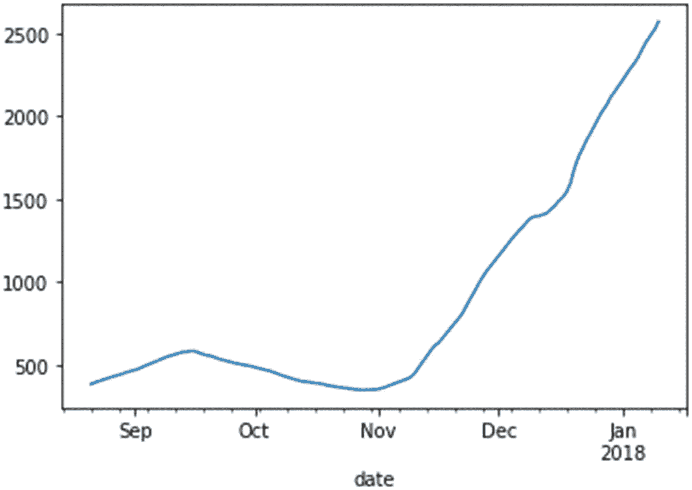

图 11-2

比特币现金 30 天滚动平均收盘价

```py
# plot the rolling means for Bitcoin cash
data_subset_BCH['close'].rolling(window=30).mean().plot(label='Rolling Average over 30 days')
```

在下一章中将有更多关于绘图的内容。

# 12. Matplotlib 和 Seaborn

在将数据集提交给某些机器学习算法之前，能够绘制数据集的观察值和变量至关重要。数据可视化对于理解数据以及洞察数据集的潜在结构至关重要。这些洞察帮助科学家决定使用哪种统计分析或哪种学习算法更适合给定的数据集。此外，科学家还可以获得关于对数据集应用适当转换的想法。

通常，数据科学中的可视化可以方便地分为**单变量**和**多变量**数据可视化。单变量数据可视化涉及绘制单个变量以了解其分布和结构，而多变量图则揭示了两个或更多变量之间的关系和结构。

## Matplotlib 和 Seaborn

Matplotlib 是 Python 中用于数据可视化的图形包。Matplotlib 已成为 Python 数据科学堆栈的关键组件，并与 NumPy 和 Pandas 良好集成。**pyplot**模块与 MATLAB 绘图命令紧密对应。因此，MATLAB 用户可以轻松过渡到使用 Python 进行绘图。

另一方面，seaborn 通过使用更简单的方法集扩展了 Matplotlib 库，以便使用 Python 创建美观的图形。seaborn 与 Pandas DataFrames 的集成度更高。我们将通过 Matplotlib 和 seaborn 创建简单的基本图表。

## Pandas 绘图方法

Pandas 还提供了一套强大的绘图函数，我们也将使用这些函数来可视化我们的数据集。读者将观察到我们如何轻松地将数据集从 NumPy 转换为 Pandas，反之亦然，以利用某一功能或另一功能。Pandas 的绘图功能位于**plotting**模块中。

在使用**matplotlib**、**seaborn**和**pandas.plotting**函数进行数据可视化时，有许多选项和属性，但正如本材料的主题，目标是保持简单，给读者提供足够的知识以供使用。深入的专业能力来自于经验和持续的使用。这些实际上是无法教授的。

首先，我们将通过从 matplotlib 包导入**pyplot**模块和**seaborn**包来加载 Matplotlib。

```py
import matplotlib.pyplot as plt
import seaborn as sns
```

我们还将导入**numpy**和**pandas**包来创建我们的数据集。

```py
import pandas as pd
import numpy as np
```

## 单变量图

一些常见和基本的单变量图包括线形图、条形图、直方图和密度图，以及箱线图，仅举几例。

### 线形图

让我们绘制一个从负到正**指数**范围的 100 个点的正弦图。**plot**方法允许我们在图中绘制线条或标记。正弦和余弦线图的输出分别如图 12-1 和图 12-2 所示。

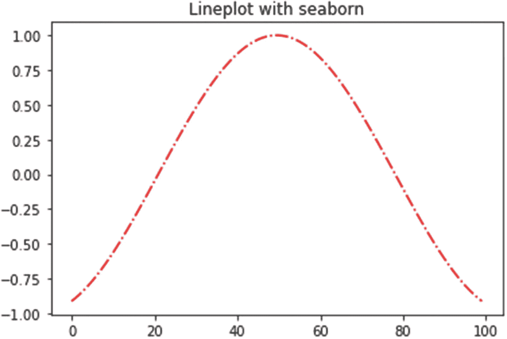

图 12-2

使用 seaborn 的线形图

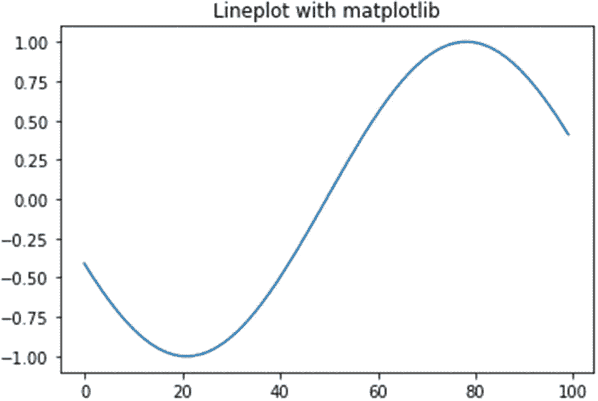

图 12-1

使用 Matplotlib 的线形图

```py
data = np.linspace(-np.e, np.e, 100, endpoint=True)
# plot a line plot of the sine wave
plt.plot(np.sin(data))
plt.show()
# plot a red cosine wave with dash and dot markers
plt.plot(np.cos(data), 'r-.')
plt.show()
```

### 条形图

让我们使用条形图方法创建一个简单的条形图。使用 matplotlib 的输出如图 12-3 所示，使用 seaborn 的输出如图 12-4 所示。

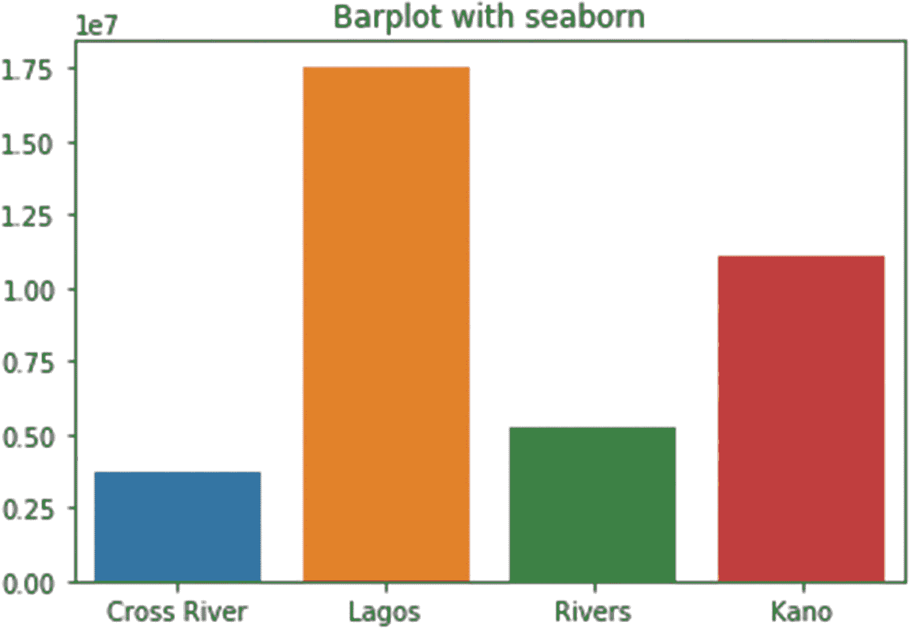

图 12-4

使用 seaborn 的条形图

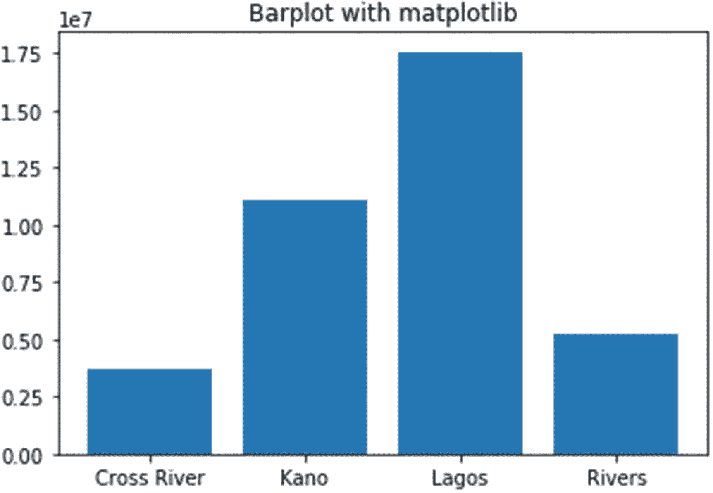

图 12-3

使用 Matplotlib 的条形图

```py
states = ["Cross River", "Lagos", "Rivers", "Kano"]
population = [3737517, 17552940, 5198716, 11058300]
# create barplot using matplotlib
plt.bar(states, population)
plt.show()
# create barplot using seaborn
sns.barplot(x=states, y=population)
plt.show()
```

### 直方图/密度图

直方图和密度图对于检查变量的统计分布至关重要。对于简单的直方图，我们将从正态分布中创建一组 100,000 个点。使用 matplotlib 和 seaborn 的输出分别显示在图 12-5 和图 12-6 中。

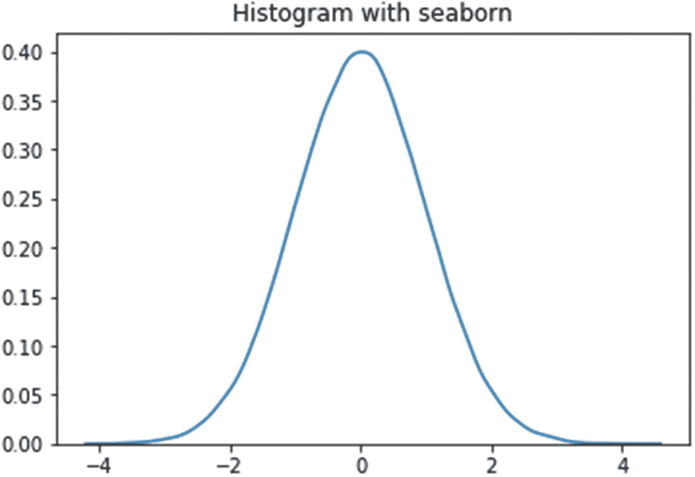

图 12-6

使用 seaborn 的直方图

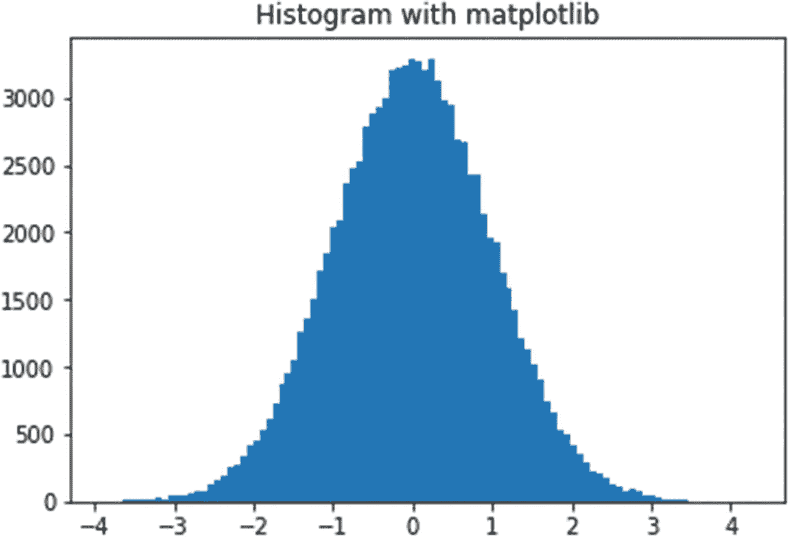

图 12-5

使用 Matplotlib 的直方图

```py
# create 100000 data points from the normal distributions
data = np.random.randn(100000)
# create a histogram plot
plt.hist(data)
plt.show()
# crate a density plot using seaborn
my_fig = sns.distplot(data, hist=False)
plt.show()
```

### 箱线和胡须图

箱线图，也常被称为箱线图，是另一种有用的可视化技术，可以帮助我们深入了解数据分布的底层情况。箱线图绘制一个箱子，上边线代表 75 分位数，下边线代表 25 分位数。在箱子的中心画一条线，表示 50 分位数或中位数。箱子两端的胡须给出了数据值范围或方差的估计。胡须尾部的点代表可能的异常值。使用 matplotlib 和 seaborn 的输出分别显示在图 12-7 和图 12-8 中。

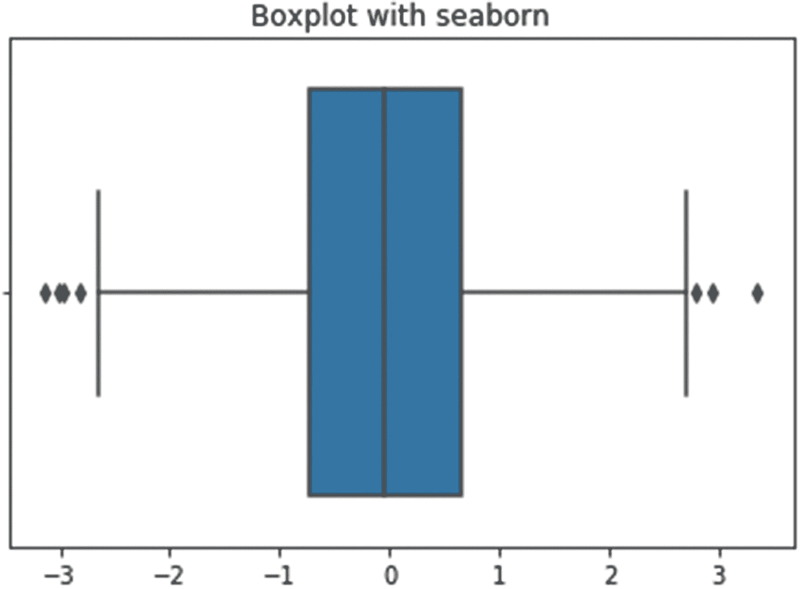

图 12-8

使用 seaborn 的箱线图

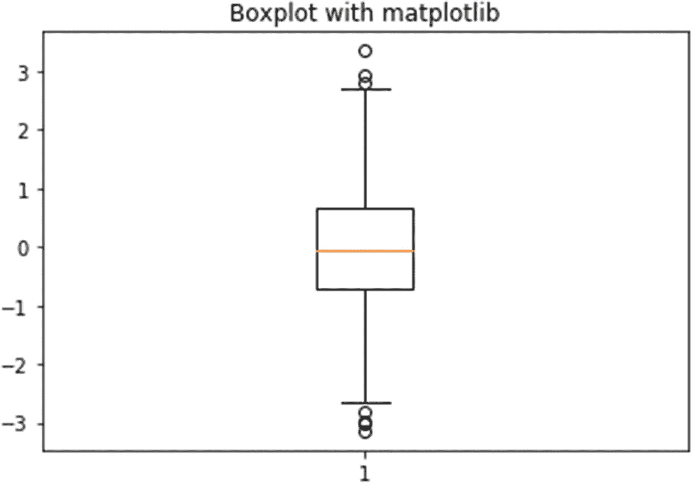

图 12-7

使用 Matplotlib 的箱线图

```py
# create data points
data = np.random.randn(1000)
## box plot with matplotlib
plt.boxplot(data)
plt.show()
## box plot with seaborn
sns.boxplot(data)
plt.show()
```

## 多变量图表

常见的多变量可视化包括散点图及其扩展的配对图、平行坐标图和协方差矩阵图。

### 散点图

散点图揭示了数据集中两个变量之间的关系。使用 matplotlib 和 seaborn 的输出分别显示在图 12-9 和图 12-10 中。

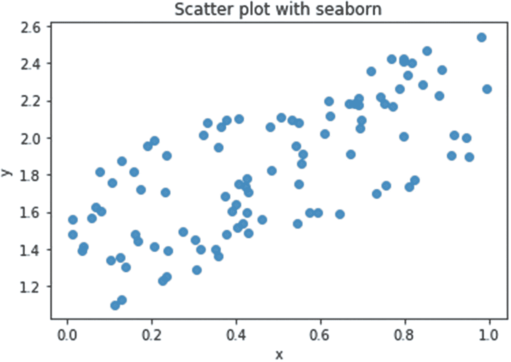

图 12-10

使用 seaborn 的散点图

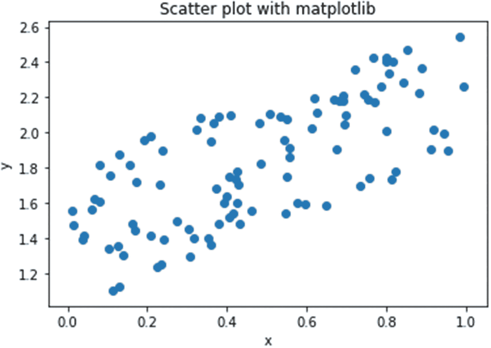

图 12-9

使用 Matplotlib 的散点图

```py
# create the dataset
x = np.random.sample(100)
y = 0.9 * np.asarray(x) + 1 + np.random.uniform(0,0.8, size=(100,))
# scatter plot with matplotlib
plt.scatter(x,y)
plt.xlabel("x")
plt.ylabel("y")
plt.show()
# scatter plot with seaborn
sns.regplot(x=x, y=y, fit_reg=False)
plt.xlabel("x")
plt.ylabel("y")
plt.show()
```

### 配对散点图

配对散点图是可视化同一图表中多个变量之间关系的有效窗口。然而，对于高维数据集，图表可能会变得拥挤，因此请谨慎使用。让我们通过 Matplotlib 和 seaborn 来看一个例子。

在这里，我们将使用**scatter_matrix**方法，这是 Pandas 中的一种绘图函数，用于绘制成对散点图矩阵。使用 matplotlib 和 seaborn 的输出分别显示在图 12-11 和图 12-12 中。

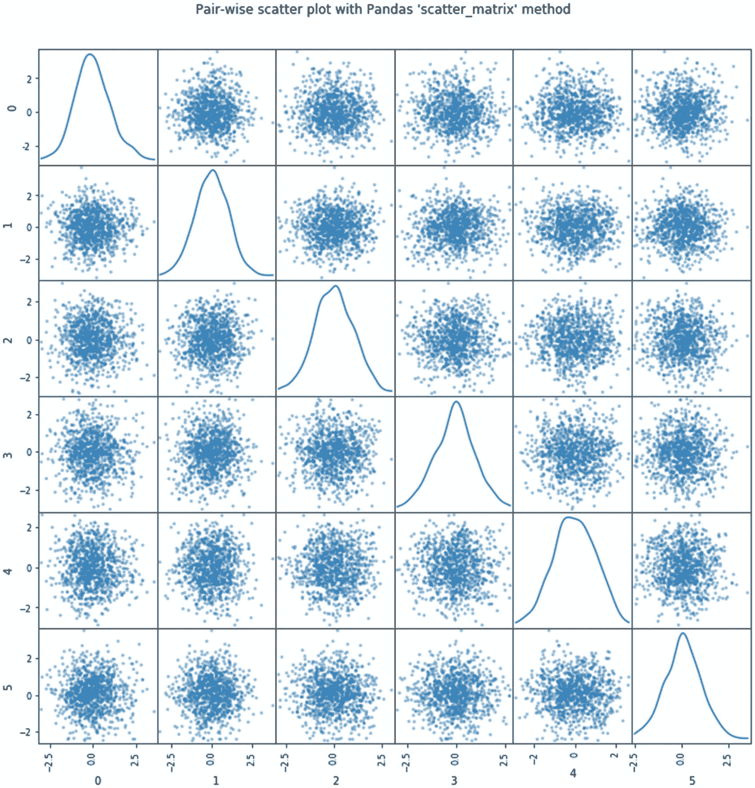

图 12-11

使用 Pandas 的成对散点图

```py
# create the dataset
data = np.random.randn(1000,6)
# using Pandas scatter_matrix
pd.plotting.scatter_matrix(pd.DataFrame(data), alpha=0.5, figsize=(12, 12), diagonal="kde")
plt.show()
```

```py
# pairwise scatter with seaborn
sns.pairplot(pd.DataFrame(data))
plt.show()
```

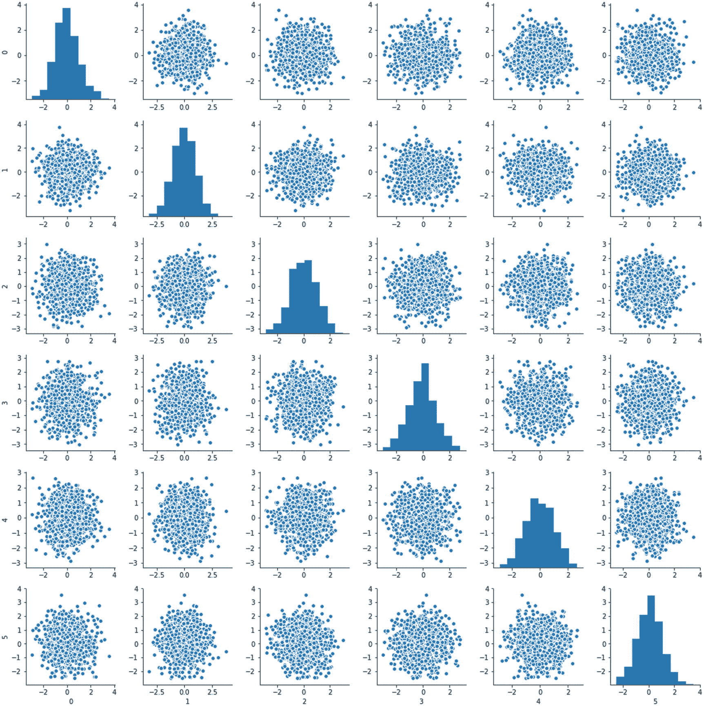

图 12-12

使用 seaborn 的成对散点图

### 相关性矩阵图

再次，相关性显示了两个变量之间存在多少关系。通过绘制相关性矩阵，我们可以得到一个直观的表示，即数据集中哪些变量高度相关。记住，当变量高度相关时，参数化机器学习方法（如逻辑回归和线性回归）可能会受到影响。此外，在实践中，大于-0.7 或 0.7 的相关值大部分是高度相关的。使用 matplotlib 和 seaborn 的输出分别显示在图 12-13 和图 12-14 中。

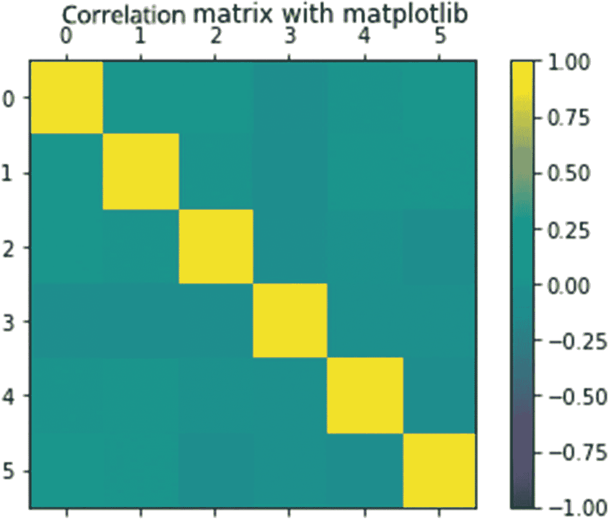

图 12-13

使用 Matplotlib 的相关矩阵图

```py
# create the dataset
data = np.random.random([1000,6])
# plot covariance matrix using the Matplotlib matshow function
fig = plt.figure()
ax = fig.add_subplot(111)
my_plot = ax.matshow(pd.DataFrame(data).corr(), vmin=-1, vmax=1)
fig.colorbar(my_plot)
plt.show()
```

```py
# plot covariance matrix with seaborn heatmap function
sns.heatmap(pd.DataFrame(data).corr(), vmin=-1, vmax=1)
plt.show()
```

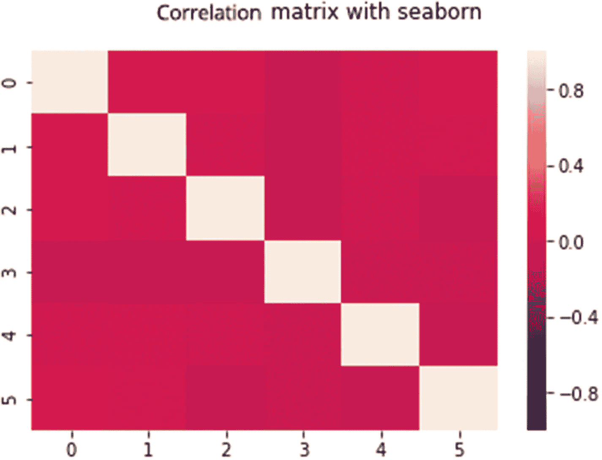

图 12-14

使用 seaborn 的相关矩阵图

## 图像

Matplotlib 也用于可视化图像。这个过程在可视化图像像素数据集时被利用。你会观察到图像数据在计算机中以像素强度值数组的形式存储，这些值在三个波段（对于彩色图像）中从 0 到 255。

```py
img = plt.imread('nigeria-coat-of-arms.png')
# check image dimension
img.shape
'Output': (232, 240, 3)
```

注意，该图像包含 232 行和 240 列的像素值，跨越三个通道（即红色、绿色和蓝色）。

让我们打印图像数据第一个通道中列的第一行。记住，每个像素都是一个从 0 到 255 的强度值。接近 0 的值是黑色，而接近 255 的值是白色。输出显示在图 12-15 中。

```py
img[0,:,0]
'Output':
array([0., 0., 0., ..., 0., 0., 0.], dtype=float32
)
```

现在让我们绘制图像。

```py
# plot image
plt.imshow(img)
plt.show()
```


图 12-15

尼日利亚国徽

本章完成了本书的第二部分，这部分提供了使用 Python 数据科学堆栈进行数据科学编程的基础。在下一部分，即第三部分，包含第十三章至 17 章，我们将介绍机器学习领域。
