# 第三部分：介绍机器学习

# 13. 什么是机器学习？

机器学习作为一个领域，源于让计算机解决难以编程为一系列指令的问题的需求。以我们希望计算机执行的任务为例，识别图像中的面部。人们会意识到，如果没有明确编程，要开发一个能够满意地执行此任务的精确指令集是极其复杂，甚至是不可能的。然而，通过观察人类如何从过去的经验中改进执行复杂功能，我们可以尝试开发算法和方法，使计算机能够根据先前的经验建立解决复杂任务的系统，而不需要明确编程。用于发现数据中模式的方法和算法集合就是所谓的机器学习。

机器学习的两个经典定义分别来自 1956 年的亚瑟·塞缪尔，他将机器学习描述为“计算机在没有明确编程的情况下学习的能力”，以及 1997 年的汤姆·米切尔，他将机器学习定义为“通过经验改进计算机执行特定任务的表现度来教授计算机的过程。”

机器学习是一个跨学科的研究领域，它汇集了来自计算机科学、统计学、数学以及认知科学（包括生物学、心理学和语言学等）的技术，仅举几个例子。虽然从数据中学习这一理念在学术界已经存在了几十年，但其进入主流科技行业始于 2000 年代初。这一增长与互联网爆炸导致海量数据的兴起相吻合，因为人们开始在网上共享数据。

## 数据的作用

数据是机器学习的核心。它是该领域当前演变和进一步发展的关键。正如对人类一样，对机器也是如此。没有数据，学习是不可能的。

人类通过从环境中收集信息来学习如何执行任务。这些信息是大脑用来构建模式和了解环境的数据。对于人类来说，数据是通过感官器官捕捉的。例如，眼睛捕捉视觉数据，耳朵捕捉听觉数据，皮肤接收触觉数据，而鼻子和舌头分别检测嗅觉和味觉数据。

与人类一样，机器也是通过从数据中学习来复制这一过程。以识别垃圾邮件的任务为例。在这个例子中，计算机被提供了电子邮件示例作为数据。然后它使用算法来学习区分垃圾邮件和常规邮件。

## 数据的成本

数据收集成本高昂，而高质量的数据由于存储和清理数据的相关成本更高，因此成本更高。多年来，数据的稀缺限制了机器学习方法的性能。然而，在 20 世纪 90 年代初，互联网诞生了，到世纪之交，它已成为数据分布的超级高速公路。因此，大量且多样化的数据变得易于获取，可用于各个领域的机器学习产品的研发。

在本章中，我们介绍了机器学习的定义、历史和数据的重要性。接下来，我们将在第十四章中进一步讨论机器学习的原则。

# 14. 学习原则

机器学习大部分是根据学习问题的方法划分为三个部分。学习的三个主要类别是监督学习、无监督学习和强化学习方案。在本章中，我们将详细讨论监督学习方案，并简要提及无监督学习和强化学习方案。

专注于监督学习有多种原因。首先，它们是工业界构建机器学习产品的主要技术；其次，正如你很快就会学到的那样，它们易于确定真实情况并评估其性能，在作为大规模生产流程的一部分部署之前。让我们逐一检查这三种方案。

## 监督学习

为了轻松理解监督学习的概念，让我们回顾一下从一组电子邮件中识别垃圾邮件的问题。我们将使用这个例子来理解监督学习问题定义和框架中的关键概念，它们包括

+   特征

+   样本

+   目标

对于这个虚构的例子，让我们假设我们有一个包含电子邮件集中前四个单词的字典，并记录每个电子邮件样本的出现频率。这些信息以表格格式表示，其中每个特征是一列，行是电子邮件样本。这种表格表示称为数据集。图 14-1 展示了这种表示。

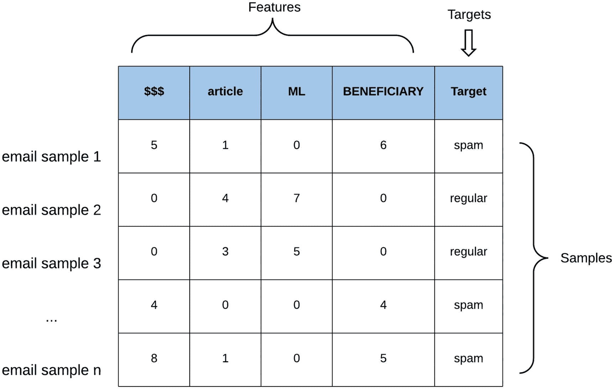

图 14-1

数据集表示

监督机器学习的核心概念是每个样本都与一个目标变量相关联，目标是教会计算机从数据集特征中学习模式，从而得到预测结果作为目标变量。在机器学习中，数据集的列被称为特征；你可能还会遇到常用的其他名称，如数据集的**变量**或**属性**，但在这本书中，我们将使用“特征”一词来描述数据样本的测量单位。此外，数据集的样本也被称为行、数据点或观察值，但在这本书中我们将使用“样本”一词。

因此，在监督学习中，使用一组特征构建一个学习模型，该模型将预测目标变量的结果，如图 14-1 所示。

接下来，我们将讨论构建监督学习模型时的重要建模考虑因素。

### 回归与分类

在监督学习中，我们通常有两种建模任务，它们是**回归**和**分类**。

#### 回归

当目标变量的值为实数时，监督学习问题是一个回归任务。

以一个例子来说明，假设我们得到了一个住房数据集，并被要求构建一个可以预测房价的模型。例如，这个数据集包含的特征有房价、卧室数量、浴室数量和总面积。让我们通过图 14-2 中的虚构例子来展示这个数据集的形态。

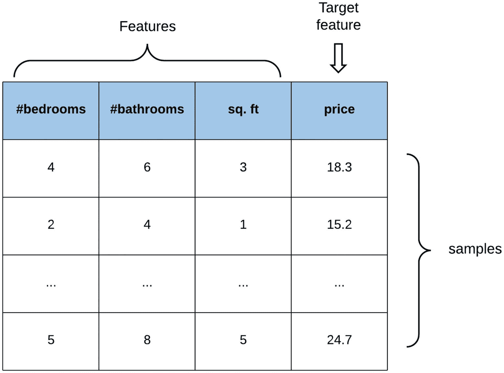

图 14-2

回归问题：住房数据集

从学习问题来看，数据集的特征包括卧室数量、浴室数量和地板面积，而目标特征是房价。图 14-3 中展示的使用案例被定义为**回归任务**，因为目标特征是**实数值**。

#### 分类

在分类任务中，目标特征是一个表示某种类别成员的标签。这些标签也被称为分类变量，因为它们代表属于两个或更多类别的标签。此外，类别或标签之间不存在自然顺序。

例如，假设我们得到了一个包含患者心脏病诊断的数据集，并被要求构建一个模型来预测患者是否有心脏病。与前面的例子类似，假设数据集包含的特征有血压、胆固醇水平、心率以及心脏病诊断。图 14-3 展示了这个例子的虚构说明。

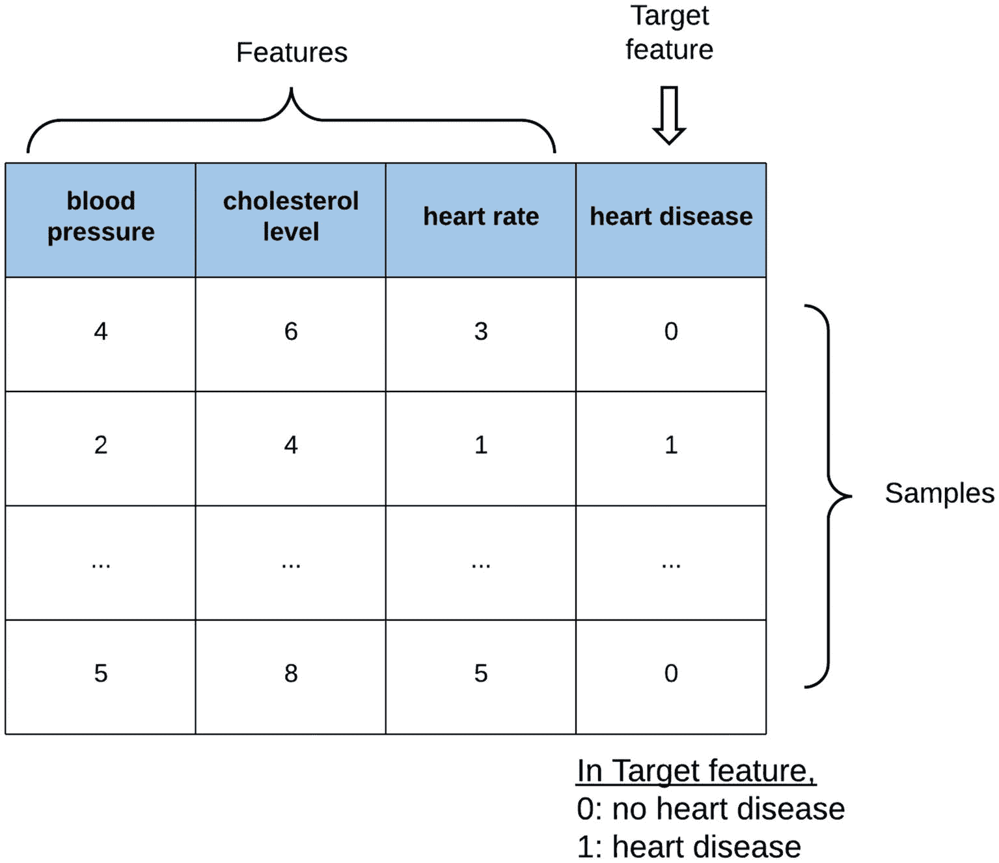

图 14-3

分类任务：心脏病数据集

从图 14-3 中的表格可以看出，**目标变量表示心脏病或无心脏病的心脏病类别**；因此，目标是分类的，可以称为**分类问题**。

### 我们如何知道学习已经发生？

这个问题对于确定学习算法是否能够在输入特征和目标之间学习到一个有用的模式至关重要。让我们创建一个场景，这将使我们更好地了解评估何时发生学习的疑问。

假设一位教师为 3 个月的物理课程授课，并在每个课程结束时进行测试，以确定学生是否学到了什么。

让我们考虑教师可能用于评估学生的两种不同场景：

1.  教师使用与教学时用作样本问题的完全相同的逐字逐句的问题来评估学生。

1.  教师使用一套完全不同但相似的样本问题来评估学生，这些问题基于课堂上教授的原则。

在这些子图中，教师能在哪个子图中确定学生已经学到了知识？为了弄清楚这一点，我们必须考虑学习的两个标准：

1.  记忆：在第一个子图中，教师不能以学生已经看到并很可能在课堂会话中记住了例子为基础来形成学习的基础。记忆是指将样本的精确快照存储起来以供将来回忆。因此，使用训练中使用的样本进行学习评估是不准确的。在机器学习中，这被称为*数据窥探*。

1.  泛化：在第二个子图中，教师可以确信评估作为准确测试来评估学生是否从课程中学到了知识。将学到的原则应用于解决以前未见过的样本的能力被称为*泛化*。

因此，我们可以得出结论，学习是将知识泛化到以前未见过的样本的能力。

### 训练集、测试集和验证集

监督机器学习的目标是能够正确预测或分类未见过的例子上的目标。如果我们用之前解释过的与训练模型相同的样本来评估模型性能，我们可能会误判学习模型的表现。

为了正确评估学习算法的性能，我们需要留出一部分数据用于测试目的。这部分保留的数据被称为**测试集**。

另一种情况是，我们在一个数据集上训练了模型，现在我们需要通过调整学习算法的一些参数来提高模型的性能。

我们不能使用测试集进行模型调整，因为如果我们这样做，模型的参数将使用测试数据集进行训练，使其无法作为未见过的保留样本用于模型评估。因此，通常将整个数据集划分为

+   训练集（用于训练模型）

+   验证集（用于调整模型）

+   测试集（用于评估模型的有效性）

一种常见且直接的战略是将数据集的 60% 分配给训练，20% 用于验证，最后的 20% 用于测试。这种策略广为人知为 60/20/20 规则。我们将在本章后面讨论更复杂的重采样（即使用可用数据的子集）方法。见图 14-4。

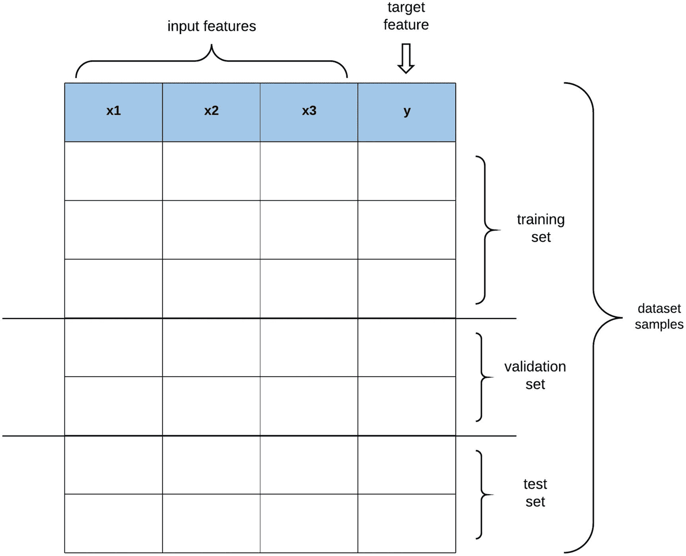

图 14-4

训练集、测试集和验证集

### 偏差与方差权衡

偏差与方差的概念是机器学习的核心，对于理解模型的性能以及建议改进模型的方向至关重要。

当模型过度简化学习问题或当模型未能准确捕捉数据集输入特征之间存在的复杂关系时，我们说模型具有高**偏差**。高偏差使得模型无法泛化到新的例子。

**高方差**，另一方面，是指模型学习得太接近数据集输入特征的复杂模式，在这个过程中，它*学习到了数据集样本的不可减少噪声*。当学习算法非常接近地学习训练样本的模式，包括噪声时，当遇到之前未见过的数据时，它将无法泛化。

因此，我们观察到需要在偏差和方差之间找到正确的平衡，这通常取决于模型构建者的技能来发现这个中间地带。然而，存在一些实用的经验法则来找到偏差和方差之间的正确权衡。

#### 我们如何识别结果中偏差或方差的存在？

当模型在训练数据上表现不佳时，会出现高偏差。当然，它也会在具有高预测错误的测试数据上表现不佳（甚至更差）。当出现高偏差时，可以说模型欠拟合了数据。当训练模型很好地学习了训练数据但在未见过的（测试）数据上表现不佳时，会出现高方差。在出现高方差的情况下，可以说模型过度拟合了数据集。

图 14-5 中的图表说明了偏差和方差对机器学习模型质量/性能的影响。在图 14-6 中，读者将观察到中间某个地方有一个最佳点，模型在训练和测试数据集上都有良好的表现。

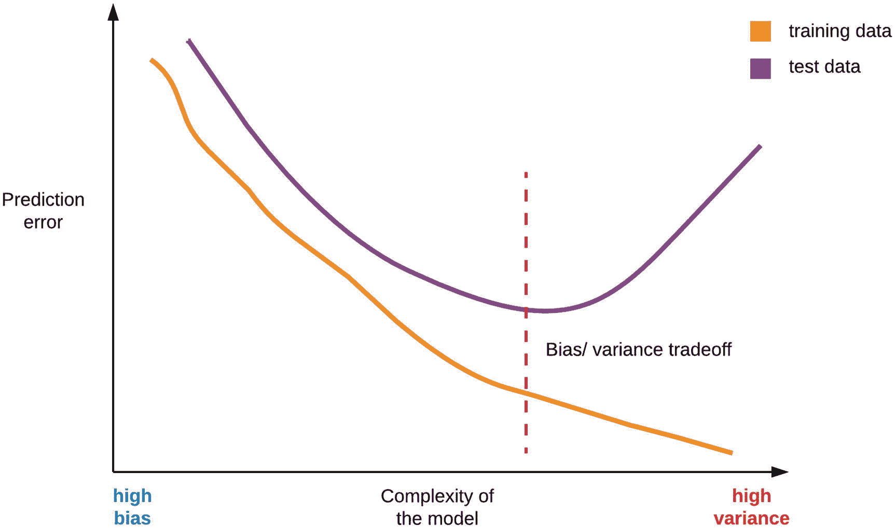

图 14-5

偏差和方差

回顾一下，我们的目标是拥有一个在高度偏差和高度方差之间取得平衡的模型。图 14-6 进一步说明了高度偏差和方差模型对数据集的影响。如图 14-6 左侧的图像所示，我们希望有一个能够推广到先前未见过的示例的模型，这样的模型应该有良好的预测准确率。

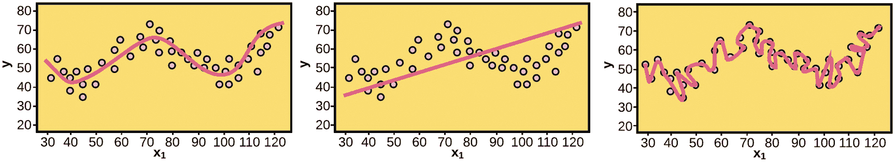

图 14-6

***左侧：*** 良好的拟合。***中间：***欠拟合（高偏差）。***右侧：*** 过拟合（高方差）

### 评估模型质量

评估指标为我们提供了一种定量评估模型性能的方法。模型的训练数据性能被评估以获得训练集准确率，而其测试数据性能被评估以获得测试数据准确率，当模型预测先前未见过的示例的目标时。对测试数据的评估有助于我们了解模型的真正性能指标。

学习问题决定了要使用的评估指标类型。例如，对于回归预测问题，通常使用均方根误差（RMSE）来评估模型所犯错误的幅度。对于分类问题，一个常见的评估指标是使用混淆矩阵来了解有多少样本被正确分类或错误分类。从混淆矩阵中，可以推导出其他用于评估分类问题的有用指标，如准确率、精确率和召回率。

以下是我们将在本文中考虑的机器学习评估指标：

**分类**

+   混淆矩阵

+   ROC 曲线下面积（AUC-ROC）

**回归**

+   均方根误差（RMSE）

+   R 平方（*R*²）

让我们逐一来看。

#### 分类评估指标

在本节中，我们将简要解释分类机器学习任务的性能指标。

##### 混淆矩阵

混淆矩阵是用于深入了解分类监督机器学习模型性能的流行评估指标。它表示为一个具有网格状单元格的表格。在二分类问题的情况下，网格的列是目标特征的实际情况的正负类值，而行是预测的正负类值。这如图 14-7 所示。

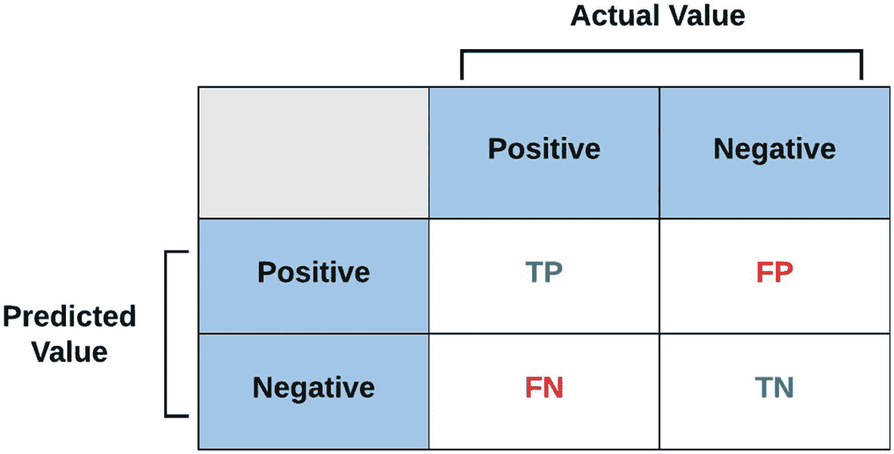

图 14-7

混淆矩阵

可以直接从混淆矩阵中获取四个主要值，它们是 ***真正例***、***假正例***、***真负例*** 和 ***假负例*** 的值。让我们简要地检查每个值：

+   真正例：真正例是在实际类别为正的情况下预测为正（或真）的样本数量。

+   假正例：假正例是在实际类别为负的情况下预测为正（或真）的样本数量。

+   真负例：真负例是预测为负（或假）且实际类别为负的样本数量。

+   假负例：假负例是在实际类别为正的情况下预测为负（或假）的样本数量。

从四个基本值中，我们还有三个其他指标，它们提供了更多关于我们模型性能的信息。这些是准确度、阳性预测值（或精确度）和灵敏度（或召回率）。让我们简要解释一下：

+   准确度：准确度是学习算法做出的正确预测的比例。它表示为真正例（*TP*）和真负例（*TN*）之和与总人口之比。

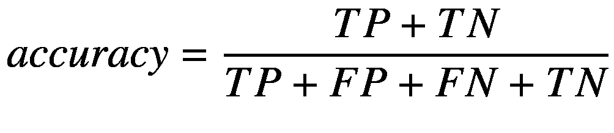

+   精确度或阳性预测值：精确度是真正例（*TP*）与真正例（*TP*）和假正例（*FP*）之和的比率。换句话说，精确度衡量的是算法预测为正的所有结果中，正确预测为正的结果所占的比例。*TP* + *FP*的总和也被称为预测正条件。

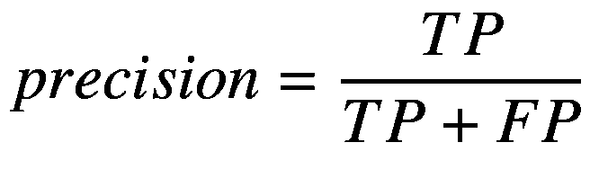

+   召回率或灵敏度：召回率是真正例（*TP*）与真正例（*TP*）和假负例（*FN*）之和的比率。换句话说，召回率检索的是正确预测为正的结果所占的比例，这些结果在所有正的结果中。*TP* + *FN*的总和也被称为条件正。

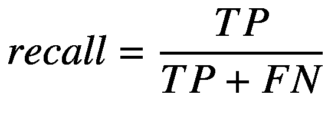

为了将这个概念结合起来，让我们回顾一下心脏疾病数据集的例子。假设我们要预测一个患者是否会被诊断为心脏病，假设数据集中有 50 个样本，其中 20 个被诊断为心脏病，其余 30 个没有。在 30 个没有疾病诊断的样本中，学习算法正确地识别出 25 个，而在 20 个有疾病诊断的样本中，学习算法正确地识别出 15 个。

让我们将这些信息表示在混淆矩阵中（见图 14-8），并计算必要的统计指标来评估算法性能。

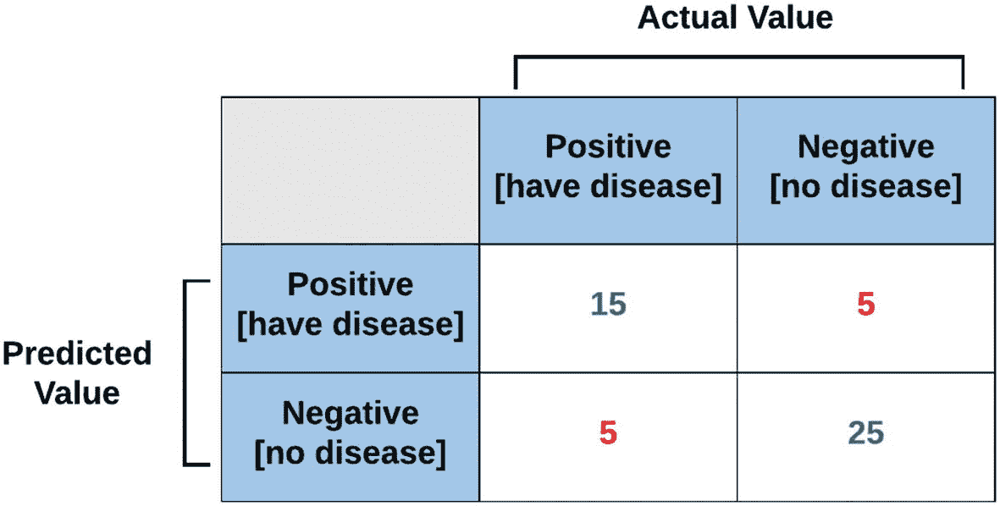

图 14-8

混淆矩阵示例

从图 14-8 中的数据，我们可以计算出***准确度***、***精确度***和***召回率***。

+   准确度 =

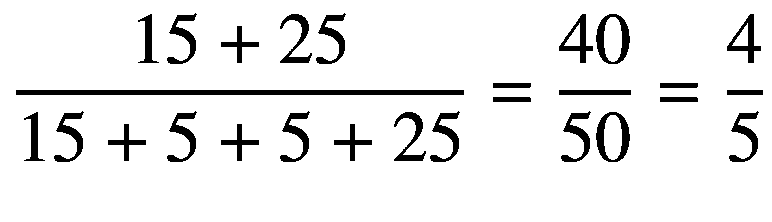

+   Precision =

+   Recall =

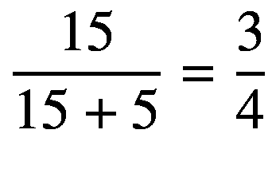

因此，我们的算法准确率为 80%，精确率和召回率均为 75%。

##### 接收者操作曲线下面积 (AUC-ROC)

接收者操作特征 (ROC) 曲线下面积，简称 AUC-ROC，是评估分类机器学习问题的一个广泛使用的指标。AUC-ROC 指标的一个重要特征是它可以作为一个好的指标来评估不平衡类别的数据集。

不平衡类别是指其中一个结果目标比另一个目标有远更多的样本。一个典型的例子可以在欺诈识别数据集中看到，其中无欺诈的样本将远远多于欺诈样本。

为了更好地理解 AUC-ROC，让我们从我们的混淆矩阵中推导出两个（2）相关公式，它们是 ***真正负率 (TNR)***（也称为 ***特异性***) 和 ***假正率***（也称为 ***漏报***）。

特异性是指所有结果中正确预测为负的比率，占所有负结果的比例，而漏报是指所有结果中错误预测为正的比率，占所有负结果的比例。漏报也用 (1 – 特异性) 表示。

这在图 14-9 中进一步说明。

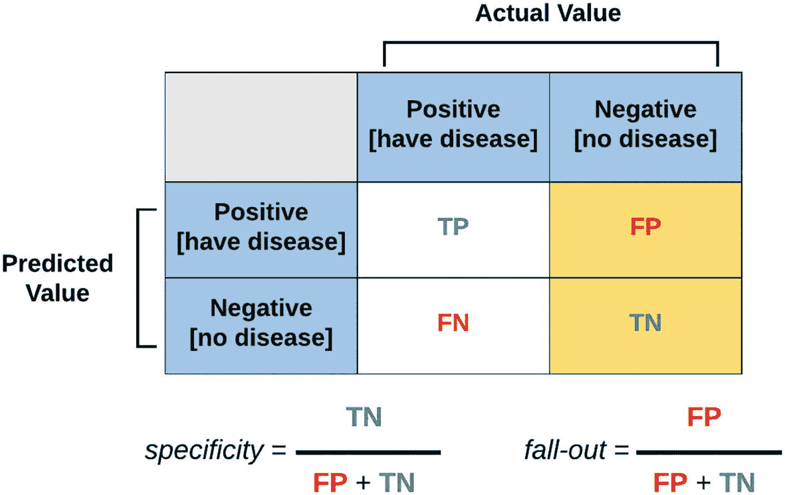

图 14-9

特异性和漏报

###### ROC 空间

ROC 或接收者操作特征空间是一个二维图，***绘制***了敏感性（即正确预测的概率分布）的累积概率分布在 y 轴上，以及漏报（即误报的概率分布）的累积概率分布在 *x* 轴上。

关于 ROC 空间的一些显著细节是：

+   正方形空间的面积是 1，因为 *x* 和 *y* 轴的范围分别是 0 到 1。

+   从点 (*x* = 0, *y* = 0) 到 (*x* = 1, *y* = 1) 画出的对角线代表纯粹的机会或随机猜测。它也被称为无区分线。

这些表达式在图 14-10 中进一步说明。

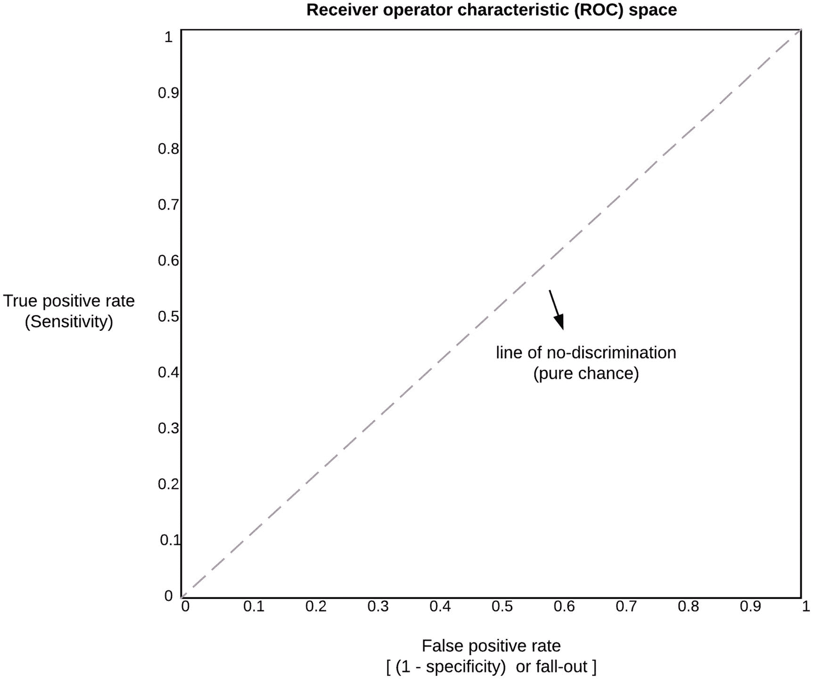

图 14-10

接收者操作特征 (ROC) 空间

###### AUC-ROC 空间

如图 14-10 所示的 ROC 图看起来像一条曲线。因此，曲线下的面积，也称为 AUC，是 ROC 曲线下的面积。AUC 提供了一个单一的浮点数，描述了模型的表现，其解释如下：

+   AUC 值低于 0.5 表示模型的预测比随机猜测目标要差。

+   AUC 值接近 1 表示模型在测试数据集上对新示例进行泛化时表现非常好。

ROC 曲线越接近 ROC 空间的左上部分（即越接近值 1），表明模型具有很好的分类精度。

AUC-ROC 曲线如图 14-11 所示。

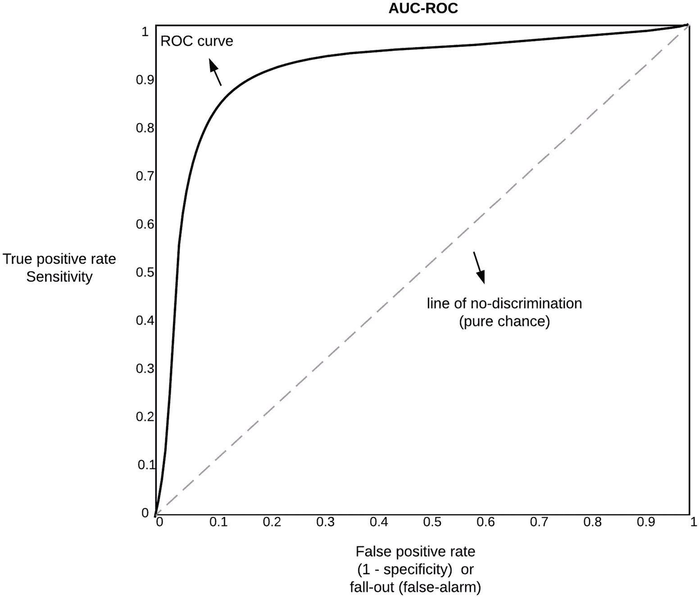

图 14-11

AUC-ROC 曲线

#### 回归评估指标

在本节中，我们将介绍一些用于评估回归机器学习任务的指标。

##### 均方根误差 (RMSE)

均方根误差（RMSE）是监督机器学习中回归问题的重要评估指标。RMSE 计算目标特征原始值与学习算法预测值之间的误差差异。RMSE 正式表示如下公式：

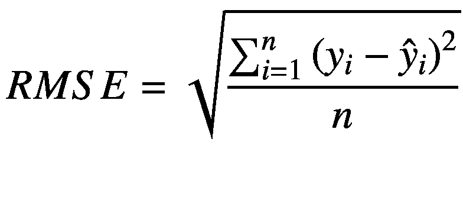

其中

+   *n*是数据集中的样本数量

+   *y*[*i*]是目标特征的实际值

+   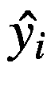是学习算法预测的目标值

RMSE 的进一步说明：

+   将实际值和预测值之间的差异平方(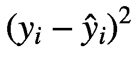)给出两个数之间的正偏差（即幅度）。

+   除以*n*给出总和的幅度平均值。平方根***将结果返回到与目标特征相同的测量单位***。

###### 使用 RMSE 进行评估的示例

假设我们想要预测房屋的价格（以尼拉尔千为单位^(1))，并且我们有以下数据集（见图 14-12)。

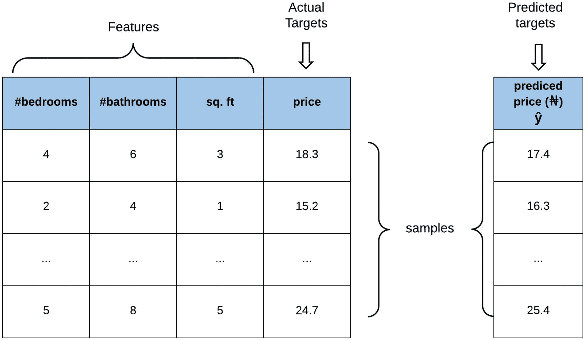

图 14-12

RMSE 说明

从给出的公式中，我们计算 RMSE 如下：

RMSE 越接近 0，模型的性能就越好。同样，我们最感兴趣的是知道测试数据上的 RMSE，因为这为我们提供了模型性能的准确图景。在这个例子中，我们学习模型制作的房屋实际价格与预测价格之间的误差大约为 NGN 910（即，0.91 ∗ 1000）。

因此，我们可以计算误差百分比

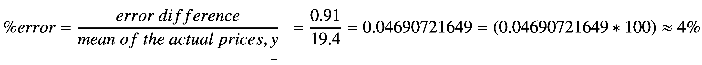

##### R-squared (***R***^(**2**))

R-squared，写作 *R*²，是另一个回归误差指标，它为我们提供了对学习模型性能的不同视角。*R*² 也被称为 ***确定系数***。*R*² 的目标是告诉我们目标特征 *y* 的方差或变异性中有多少被模型解释或捕获。

记住，当模型学习到数据集中目标的基本结构时，它具有高方差。***当然，我们主要关注的是*** *R*² ***指标在测试数据上的表现***。我们通常希望测试数据上的 *R*² 值很高。这表明我们的模型很好地泛化到新的例子中。

###### ***R***^(**2**) 的解释

*R*² 输出一个介于 0 和 1 之间的值。接近 0 的值表明响应中的变异性没有被模型正确捕获，而接近 1 的值表明模型解释了观察值中的变异性。*R*² 使用以下方程计算

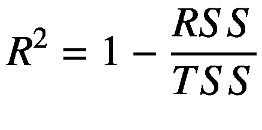

其中

+   *RSS*（即，残差平方和）捕捉实际值与学习算法预测的值之间的误差差异（或变异性）。公式是

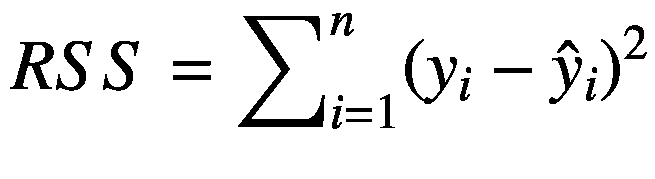

+   *TSS*（即，总平方和），另一方面，计算响应变量 *y* 的变异性。因此，对于数据集中的每个观测值，我们找到与所有观测值平均值的平方差，。公式是

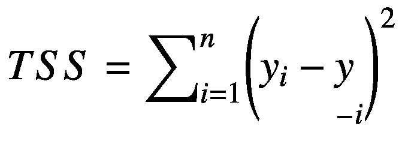

+   因此，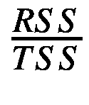给出了响应变量*y*的变异性中有多少***没有被模型解释***的比率。

因此，当我们说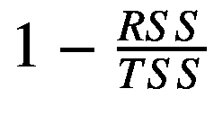时，我们反转了定义，以告诉我们模型解释的响应变量变异性比率。

###### 使用 R²评估模型性能的示例

使用图 14-12 中所示的数据集和前面给出的公式，我们将如下计算 R²：

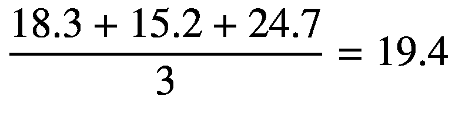

而对于*TSS*，响应变量价格的平均值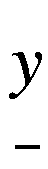是

最后，

结果表明，模型在捕捉目标特征的变异性方面做得很好。***当然，我们希望测试数据集上有这样的良好表现***。

### 重采样技术

本节描述了评估监督学习方法性能的另一个重要概念。重采样方法是一组涉及从可用数据集中选择子集、在该数据子集上训练，然后使用剩余数据来评估训练模型的技术的集合。

此过程涉及将可用数据创建为训练集和验证集的子集。训练集用于训练模型，而验证集将评估学习模型在未见数据上的性能。通常，此过程将反复进行，以获得训练和测试错误的近似度量。

我们将检查三种数据重采样技术，并给出何时使用特定技术的示例。我们将检查的技术是

+   验证集技术（或训练-测试分割）

+   留一法交叉验证（LOOCV）技术

+   *k* 折交叉验证技术

#### 验证集

验证集是数据重采样的最简单方法，它涉及将数据集随机划分为两部分；这些是训练集和验证集。如果数据集足够大，可以划分为两个相等的部分，或者可以是 60/40 或 70/30 的划分。

在分割后，模型在训练集上训练，并在验证集上评估其性能。这个过程在列表中总结如下：

1.  随机划分数据集

    +   训练集

    +   验证集

1.  在训练集上训练模型。

1.  使用适当的误差指标在验证集上评估模型的性能。

1.  第 1 至第 3 点可以重复。

1.  报告误差指标以获取集成训练和验证集误差分布。

一个示例验证集如图 14-13 所示。

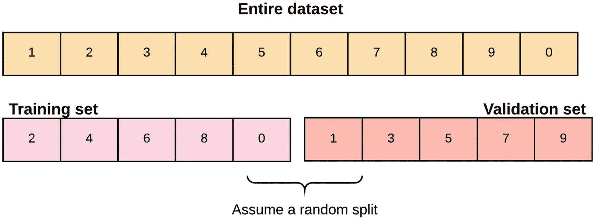

图 14-13

验证集

#### 留一法交叉验证 (LOOCV)

留一法交叉验证方法（通常称为 LOOCV）涉及将数据集划分为训练集和测试集。但与验证方法不同，LOOCV 只将一个示例分配给测试集，并在数据集的其余部分上训练模型。这个过程会重复进行，直到数据集中的所有示例都用于评估模型。

假设我们有一个数据集包含十个示例（用 *n* 表示数据集的大小）来构建一个学习模型。我们将使用 *n* - 1 个示例来训练模型，并在仅剩的一个示例上评估模型，因此得名留一法。这个过程会针对数据集中的所有示例重复 *n* 次。在 *n* 次迭代结束时，我们将报告平均误差估计。

一个示例留一法交叉验证如图 14-14 所示。

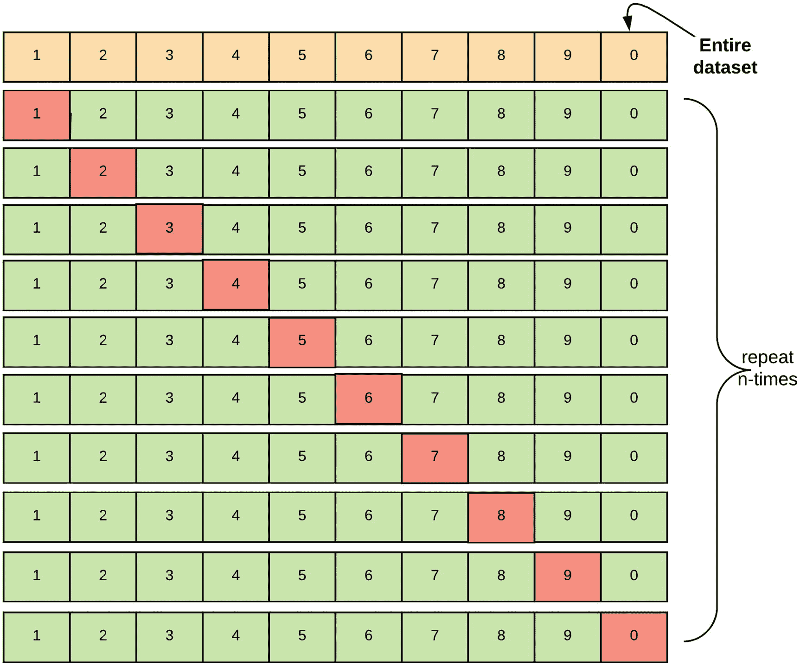

图 14-14

LOOCV

使用 LOOCV 的主要缺点是它 *计算成本高*。*计算成本高* 这个词是指一个过程需要大量的计算时间和内存来完成其执行。

#### ***k***-Fold Cross-Validation

*k* 折交叉验证在降低 LOOCV 的计算成本的同时，保持了其在给出对学习模型在验证数据上评估的性能的无偏估计方面的优势。

让我们使用以下配方来解释 *k* 折 CV 的理念：

+   将数据集划分为 *k* 个部分或折。假设我们有一个包含 20 条记录的数据集；我们将数据集划分为四个部分。见图 14-15。

    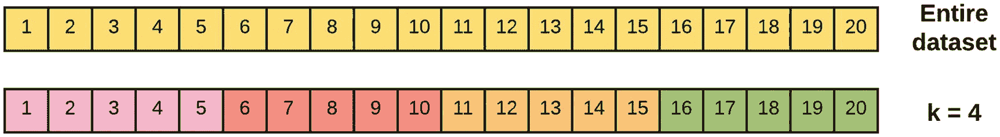

    图 14-15

    将您的数据集划分为 *k* 个部分或折

+   将四个分割中的一个作为测试集，并在剩余的分割上训练模型。重复此过程，直到所有分割都用于测试。见图 14-16。

    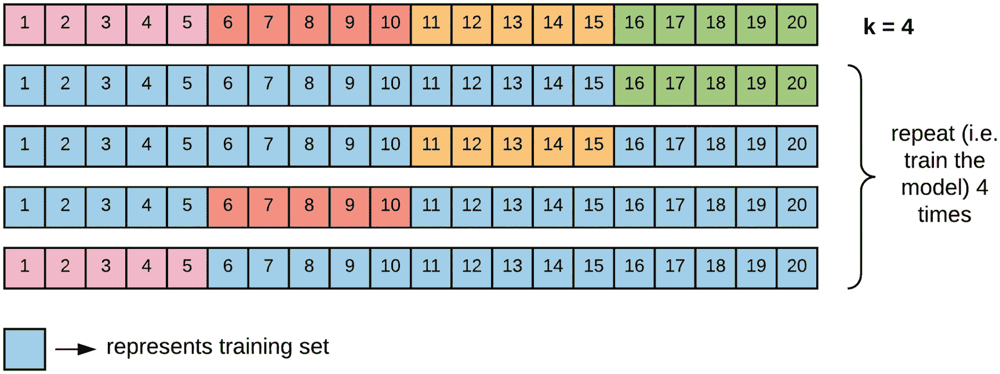

    图 14-16

    使用*k* - 1 个示例集或分割来训练模型

+   报告集成误差指标。

### 注意

从这个解释中，我们可以看出 LOOCV 是*k* = *n*的特殊情况。

### 提高模型性能

为了提高模型的性能，可以考虑的一些技术有

1.  系统性特征工程

1.  使用集成学习方法（我们将在下一章中进一步讨论）

1.  算法超参数调整

#### 特征工程

在模型构建中，大部分时间都花在了特征工程上。特征工程是系统地检查数据集中的每个特征，并研究其与目标的相关性的实践。

通过特征工程，我们可以通过组合一个或多个现有特征来巧妙地引入新特征，这可能会影响模型的预测精度。有时，特征工程可能是良好学习模型和获奖模型之间的区别。

#### 集成方法

集成方法通过结合较弱模型的输出以产生性能更好的模型。集成学习算法的两大主要类别是

+   Boosting

+   Bagging

在实践中，如随机森林等集成方法在各种机器学习问题中表现良好，并且是机器学习竞赛的首选算法。

#### 超参数调整

在使用学习算法建模时，我们可以调整算法的某些配置。这些配置被称为超参数。超参数被调整以获得最佳设置，从而优化模型的性能。一种策略是在微调模型时使用网格搜索来调整超参数。

## 无监督学习

在无监督学习中，目标是构建一个模型，该模型能够捕捉数据集的潜在分布。数据集没有为输入特征提供目标（见图 14-17）。因此，不可能学习一个函数，该函数将输入特征与目标之间的关系映射出来，就像我们在监督学习中做的那样。

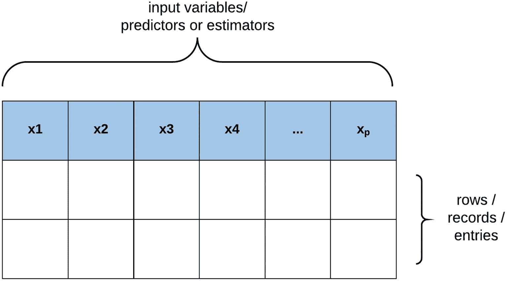

图 14-17

无监督数据集

相反，无监督学习算法试图通过将相似样本分组来确定数据集的未知结构。

假设我们有一个包含心脏病患者数据集；使用无监督机器学习算法，我们可以找到一些隐藏的患者子群，以帮助了解疾病模式。这被称为*聚类*。

此外，我们还可以使用像 *主成分分析* (*PCA*) 这样的算法将大量特征压缩到主成分中（总结了所有其他特征），以便于可视化。我们将在后面的章节中更多地讨论聚类和主成分分析。

## 强化学习

强化学习提出了一种与我们在监督学习和无监督学习技术中看到的方法截然不同的学习方法。在强化学习中，一个智能体与环境在一个反馈配置中交互，并根据从环境中获得的响应更新其选择动作的策略。这种场景的示意图如图 14-18 所示。

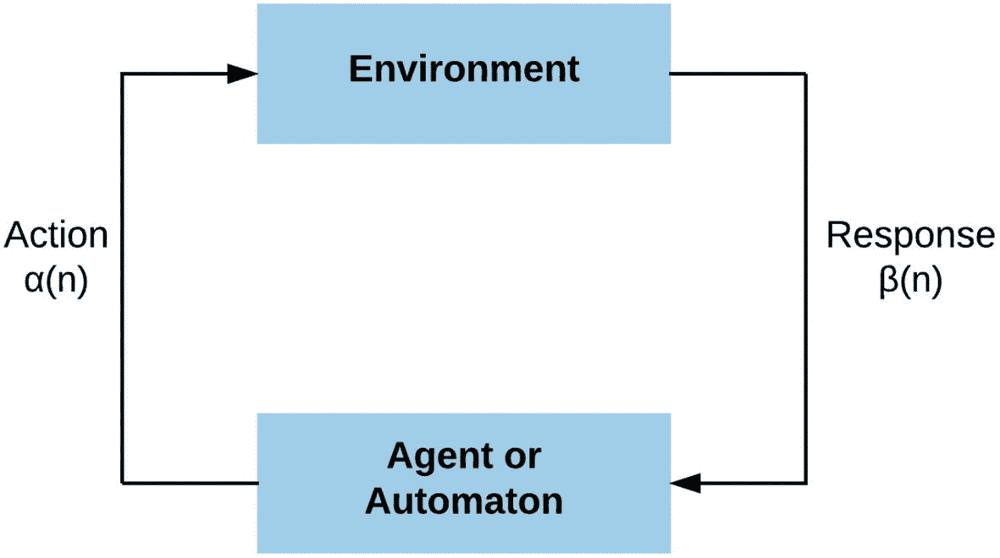

图 14-18

强化学习模型

本书不会涵盖强化学习技术，因为它提出了一种从随机环境中学习的问题解决方案，这种方法与监督学习和无监督学习问题中使用的解决方案不同。

在本章中，我们介绍了机器学习的三个主要组成部分，即监督学习、无监督学习和强化学习。本章主要关注执行监督机器学习的原则，例如将问题框架化为回归或分类任务；将数据集分为训练集、测试集和验证集；理解偏差/方差权衡以及随之而来的过拟合和欠拟合问题；以及评估学习模型性能的指标。

在下一章中，我们将简要探讨批量和在线学习的区别。

# 15. 批量与在线学习

数据是构建学习模型的一个关键组成部分。在建模管道中，数据的使用有两种设计选择。第一种是在静止数据上构建你的学习模型（批量学习），另一种是当数据流进入学习算法时（在线学习）。这种流动可以是数据集中的单个样本点，也可以是小型批量大小。让我们简要讨论这些概念。

## 批量学习

在批处理学习中，机器学习模型使用在某个时间点可用的整个数据集进行训练。一旦我们有一个在测试集上表现良好的模型，该模型就会被部署到生产环境中，因此学习过程结束。这个过程也被称为 *离线学习*。如果在过程中，新的数据变得可用，并且需要根据新数据更新模型，那么模型将从头开始使用以前的数据样本和新数据样本重新训练。

这个流程在图 15-1 中进一步说明。

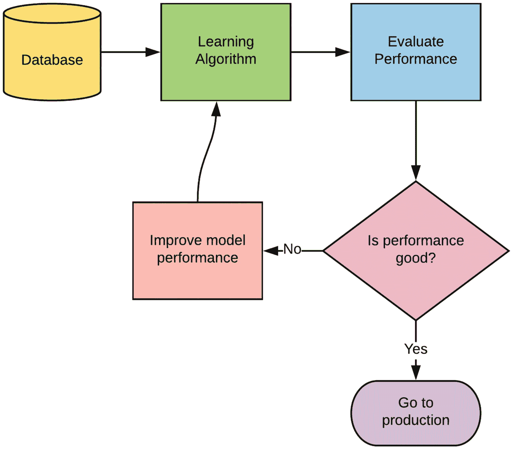

图 15-1

批量学习

在需要使用从源生成的大量连续数据训练模型的情况下，批量学习不适用于处理这种情况。在这种情况下，我们希望能够在获取新的数据样本的同时更新我们的学习模型。

## 在线学习

在在线学习中，数据*流*（单独或以小批量形式）进入学习算法并更新模型。在线学习在数据连续生成且需要使用实时数据样本构建预测模型的情况下是理想的。这种情况的一个典型例子是股市预测。

在线学习如图 15-2 所示。

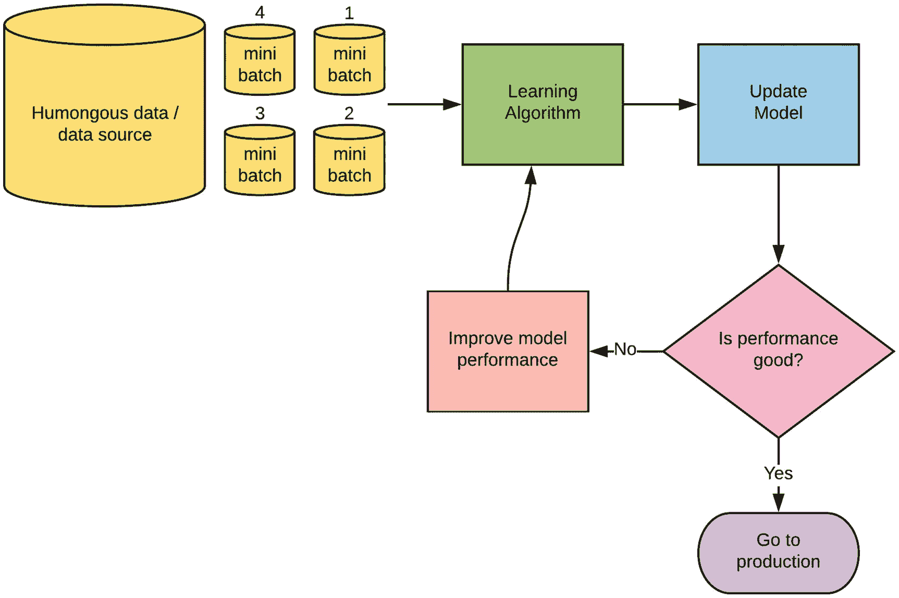

图 15-2

在线学习

这简要的章节解释了批量学习和在线学习之间的对比。在下一章中，我们将关注机器学习中的一个重要优化算法——梯度下降。

# 16. 机器学习的优化：梯度下降

梯度下降是一种优化算法，用于最小化机器学习算法的成本函数。梯度下降被称为迭代优化算法，因为它以逐步循环的方式尝试通过基于当前步骤来找到近似解，直到达到结束循环的终止条件。

以图 16-1 中的以下凸函数作为梯度下降在函数空间中寻找最小点的可视化。

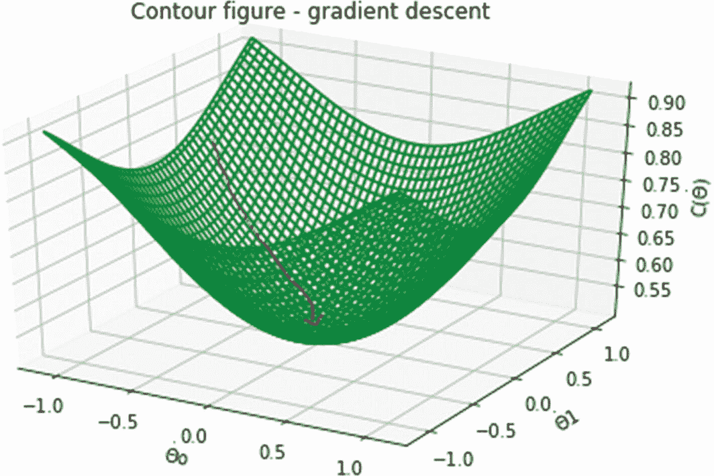

图 16-1

等高线图——梯度下降

图 16-1 中的图像是一个函数空间的示例。这类函数被称为**凸函数或碗形函数**。梯度下降在函数空间中的作用是找到函数参数的值集，以最小化函数的成本并将其带到全局最小值。全局最小值是函数空间的最低点。

例如，线性回归的均方误差成本函数是很好的凸函数，因此梯度下降几乎可以保证找到全局最小值。然而，对于其他类型的非凸函数空间，情况并不总是如此。记住，梯度下降是任何函数空间的全球优化器。

一些函数可能具有多个最小区域；这些区域被称为局部最小值。函数空间中的最低区域称为全局最小值。

## 梯度下降算法的学习率

学习率是一个超参数，它控制梯度下降算法在函数空间中追踪最速下降方向时步长的大小。

如果学习率太大，算法在下降过程中会迈出大步。这样做的话，梯度下降会更快，但很容易错过全局最小值。过小的学习率会使算法收敛缓慢（即达到全局最小值），但它更有可能稳步收敛到全局最小值。经验上，好的学习率值在 0.001、0.01 和 0.1 的范围内。在图 16-2 中，使用好的学习率，成本函数*C*(*θ*)应该在每次迭代后减少。

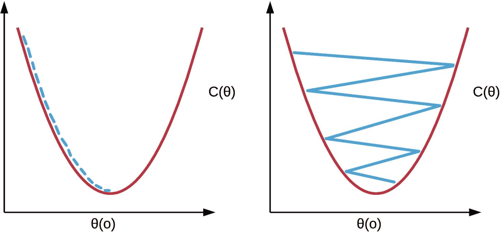

图 16-2

学习率。**左侧：好的学习率。右侧：差的学习率**。

## 梯度下降算法类别

三种梯度下降算法是

+   批量梯度下降

+   小批量梯度下降

+   随机梯度下降

**批量梯度下降**算法在计算梯度下降方向上的每一步时，使用整个训练数据。批量梯度下降最有可能收敛到全局最小值。然而，这种方法的不利之处在于，对于大规模数据集，优化过程可能会延长。

在**随机梯度下降（SGD）**中，算法在每个时间步使用训练集的单个示例快速学习函数的最陡下降方向。虽然这种方法有快速的优势，但它可能永远不会收敛到全局最小值。然而，它足够接近全局最小值。在实践中，随着算法的收敛，SGD 通过逐渐减少学习率来增强。这样做，我们可以利用大的步长快速下降，然后减慢速度，以免错过全局最小值。由于它在处理大量数据集时的速度，SGD 通常比批量梯度下降更受欢迎。

另一方面，**小批量梯度下降**将数据集随机分成可管理的块，称为小批量。它在每个时间步上对一个小批量进行操作，以学习函数的最陡下降方向。这种方法是随机和批量梯度下降之间的折中。就像 SGD 一样，小批量梯度下降不会收敛到全局最小值。然而，它更稳健，可以避免局部最小值。小批量梯度下降相对于随机梯度下降的优势在于，它通过利用底层的矩阵向量化来提高计算效率，从而更有效地计算算法更新。

## 通过特征缩放优化梯度下降

此过程涉及确保数据集中的特征都在相同的尺度上。通常，数据集中的所有实值特征应位于 -1 ≤ *x*[*i*] ≤ 1 或该区域附近的范围内。任何范围过大或任意过小都可能生成过于狭窄的轮廓图，因此梯度下降将需要更长的时间才能收敛到最优解。图 16-3 中的图表称为轮廓图。轮廓图用于在二维平面上表示三维表面。较小的圆圈代表凸函数的最低点（或全局最优）。

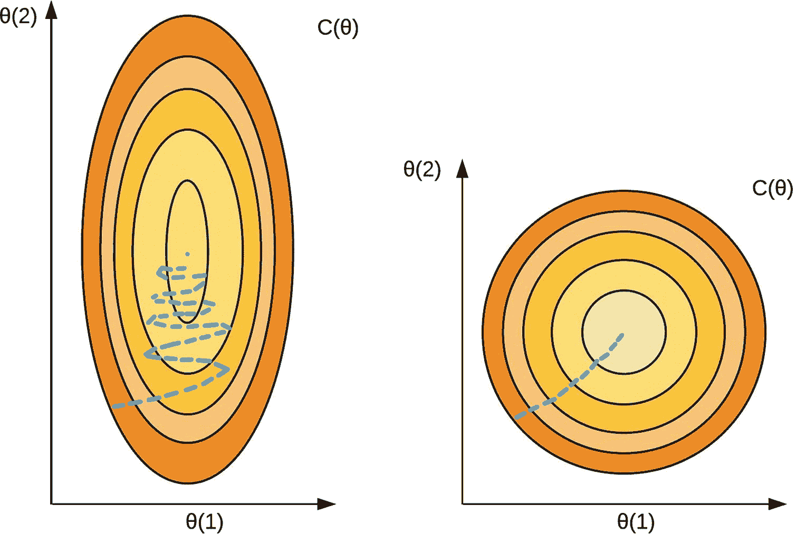

图 16-3

特征缩放 - 轮廓图。**左侧：**无特征缩放。**右侧：**有特征缩放

一种流行的特征缩放技术称为均值归一化。在均值归一化中，对于每个特征，从每个记录中减去该特征的均值，并除以特征的取值范围（即特征中最大元素和最小元素之间的差）。或者，它也可以除以特征的方差。特征缩放形式上表示为

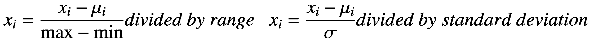

图 16-4 是一个具有特征缩放的示例数据集。

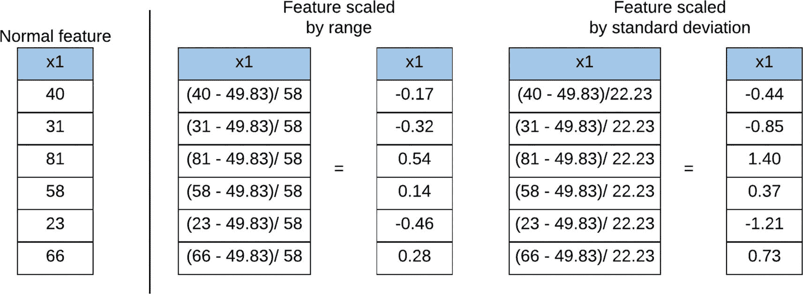

图 16-4

特征缩放示例

在本章中，我们讨论了梯度下降，这是优化机器学习模型的重要算法。在下一章中，我们将介绍一系列监督和无监督机器学习算法。

# 17. 学习算法

在本节中，我们介绍各种监督和无监督机器学习算法。这里提出的算法为理解其他机器学习方法（例如线性回归和逻辑回归）提供了基础，而像随机森林和极端随机梯度提升（XGBoost）这样的算法在应用机器学习中得到了广泛应用。

我们将从概念层面概述各种学习算法。一般来说，讨论将涵盖

+   一个特定算法是什么以及它是如何工作的。

+   如何解释学习算法的结果。

+   它可以通过各种方式优化以改善特定情况下的性能。

## 监督算法类别

监督机器学习算法被广泛分为

+   线性

+   非线性

+   集成方法

让我们简要地了解一下：

+   **线性方法**也被称为**参数方法**或算法。线性方法假设数据的基本结构是线性的，换句话说，数据集的特征之间存在线性交互。线性算法的例子包括

    +   线性回归

    +   逻辑回归

    +   支持向量机

+   **非线性方法**（也称为**非参数方法**）不假设数据集的任何参数或结构形式。相反，它们试图学习数据集特征之间的内部关系或表示。非线性算法的例子包括

    +   K 最近邻

    +   分类和回归树（它们是集成方法如 Boosting 和 Bagging 的基础）

    +   支持向量机

    +   神经网络

+   **集成方法**将多个算法的输出组合起来，构建一个更好的模型估计器，该估计器可以推广到未见过的例子。集成方法的两大类是

    +   Boosting（随机梯度提升）

    +   Bagging（随机森林）

从前面的列表中我们可以看出，一些算法可以作为线性和非线性模型。一个例子是支持向量机（SVM），它应用所谓的核技巧将其用作非线性分类算法（关于这一点稍后还会讨论）。

监督机器学习算法也可以分为回归算法或分类算法。正如我们在第十四章中关于回归与分类的讨论中看到的，回归是指目标变量是实数值，而分类是指目标变量是类别标签。

## 无监督算法

无监督学习的例子包括

+   聚类

+   主成分分析

在后面的章节中，我们将调查前面提到的无监督学习算法，用于从非标记数据集中学习。聚类是一种将同质样本分组到称为聚类的分区中的算法。主成分分析是一种寻找尽可能从数据集原始更高维特征中捕获信息的多维特征子空间的方法。

本章概述了我们将讨论的机器学习算法，以及本书第四部分中的代码示例。
