# 第四部分实践中的机器学习

# 18. Scikit-learn 简介

Scikit-learn 是一个 Python 库，它为实施机器学习算法提供了一个标准接口。它包括其他辅助函数，这些函数对于机器学习流程至关重要，例如数据预处理步骤、数据重采样技术、评估参数以及用于调整/优化算法性能的搜索接口。

本节将介绍使用 Scikit-learn 实现典型机器学习流程的函数。由于 Scikit-learn 有多种根据用例调用的包和模块，因此，如果需要，我们将使用 **from** 关键字直接从包中导入模块。再次强调，本材料的目的是提供基础，以便能够浏览 Scikit-learn 库的详尽内容，并能够使用正确的工具或函数来完成工作。

## 从 Scikit-learn 加载样本数据集

Scikit-learn 提供了一组小型标准数据集，用于快速测试和原型设计机器学习模型。这些数据集在学习机器学习或尝试新模型的性能时非常适合。它们节省了从野外识别、下载和清理数据集所需的时间。然而，这些数据集规模较小且经过精心整理，它们并不代表现实世界的情况。

五个流行的样本数据集包括

+   波士顿房价数据集

+   糖尿病数据集

+   爱丽丝数据集

+   威斯康星州乳腺癌数据集

+   葡萄酒数据集

表 18-1 总结了这些数据集的特性。

表 18-1

Scikit-learn 样本数据集特性

| 数据集名称 | 观测值 | 维度 | 特征 | 目标 |
| --- | --- | --- | --- | --- |
| 波士顿房价数据集（回归） | 506 | 13 | 真实，正数 | 真实 5.0–50.0 |
| 糖尿病数据集（回归） | 442 | 10 | 真实，-0.2 < x < 0.2 | 整数 25–346 |
| 爱丽丝数据集（分类） | 150 | 4 | 真实，正数 | 3 个类别 |
| 威斯康星州乳腺癌数据集（分类） | 569 | 30 | 真实，正数 | 2 个类别 |
| 葡萄酒数据集（分类） | 178 | 13 | 真实，正数 | 3 个类别 |

要加载样本数据集，我们将运行

```py
# load library
from sklearn import datasets
import numpy as np
```

加载爱丽丝数据集

```py
# load iris
iris = datasets.load_iris()
iris.data.shape
'Output': (150, 4)
iris.feature_names
'Output':
['sepal length (cm)',
'sepal width (cm)',
'petal length (cm)',
'petal width (cm)']
```

加载其他数据集的方法：

+   波士顿房价数据集 – **datasets.load_boston()**

+   糖尿病数据集 – **datasets.load_diabetes()**

+   威斯康星州乳腺癌数据集 – **datasets.load_breast_cancer()**

+   葡萄酒数据集 – **datasets.load_wine()**

## 将数据集分割为训练集和测试集

机器学习中的一个核心实践是将数据集分成不同的部分用于训练和测试。Scikit-learn 提供了一个方便的方法来协助这个过程，称为**train_test_split(X, y, test_size=0.25)**，其中**X**是设计矩阵或预测数据集，**y**是目标变量。通过使用属性**test_size**来控制分割大小。默认情况下，test_size 设置为数据集大小的 25%。在分割之前通过设置属性**shuffle=True**来打乱数据集是标准做法。

```py
# import module
from sklearn.model_selection import train_test_split
# split in train and test sets
X_train, X_test, y_train, y_test = train_test_split(iris.data, iris.target, shuffle=True)
X_train.shape
'Output': (112, 4)
X_test.shape
'Output': (38, 4)
y_train.shape
'Output': (112,)
y_test.shape
'Output': (38,)
```

## 为模型拟合预处理数据

在使用机器学习模型训练或拟合数据集之前，它必然要经历一些重要的转换。这些转换对学习模型的性能有巨大影响。Scikit-learn 中的转换具有**fit()**和**transform()**方法，或者**fit_transform()**方法。

根据用例，可以使用**fit()**方法来学习数据集的参数，而**transform()**方法则根据学习到的参数将数据转换应用于相同的数据集，并在建模之前应用于测试或验证数据集。此外，还可以使用**fit_transform()**方法一次性学习并将转换应用于相同的数据集。数据转换包可以在**sklearn.preprocessing**包中找到。

本节将介绍一些对数值和分类变量至关重要的转换。它们包括

+   数据缩放

+   标准化

+   归一化

+   二值化

+   编码分类变量

+   输入缺失数据

+   生成高阶多项式特征

### 数据缩放

通常情况下，数据集的特征包含不同尺度的数据。换句话说，列 A 中的数据可能在 1–5 的范围内，而列 B 中的数据可能在 1000–9000 的范围内。同一数据集中观测单位的不同尺度可能会对某些机器学习模型产生不利影响，尤其是在最小化算法的成本函数时，因为它缩小了函数空间，使得优化算法如梯度下降难以找到全局最小值。

在执行数据缩放时，通常属性会缩放到 0 和 1 的范围内。数据缩放在 Scikit-learn 中使用**MinMaxScaler**模块实现。让我们看一个例子。

```py
# import packages
from sklearn import datasets
from sklearn.preprocessing import MinMaxScaler
# load dataset
data = datasets.load_iris()
# separate features and target
X = data.data
y = data.target
# print first 5 rows of X before rescaling
X[0:5,:]
'Output':
array([[5.1, 3.5, 1.4, 0.2],
[4.9, 3\. , 1.4, 0.2],
[4.7, 3.2, 1.3, 0.2],
[4.6, 3.1, 1.5, 0.2],
[5\. , 3.6, 1.4, 0.2]])
# rescale X
scaler = MinMaxScaler(feature_range=(0, 1))
rescaled_X = scaler.fit_transform(X)
# print first 5 rows of X after rescaling
rescaled_X[0:5,:]
'Output':
array([[0.22222222, 0.625     , 0.06779661, 0.04166667],
[0.16666667, 0.41666667, 0.06779661, 0.04166667],
[0.11111111, 0.5       , 0.05084746, 0.04166667],
[0.08333333, 0.45833333, 0.08474576, 0.04166667],
[0.19444444, 0.66666667, 0.06779661, 0.04166667]])
```

### 标准化

线性机器学习算法，如线性回归和逻辑回归，假设数据集的观测值呈正态分布，均值为 0，标准差为 1。然而，在现实世界的数据集中，特征往往具有不同的均值和标准差，因此这种情况很少见。

将标准化技术应用于数据集将特征转换为具有均值为 0 和标准差为 1 的标准高斯（或正态）分布。Scikit-learn 在**StandardScaler**模块中实现了数据标准化。让我们看看一个例子。

```py
# import packages
from sklearn import datasets
from sklearn.preprocessing import StandardScaler
# load dataset
data = datasets.load_iris()
# separate features and target
X = data.data
y = data.target
# print first 5 rows of X before standardization
X[0:5,:]
'Output':
array([[5.1, 3.5, 1.4, 0.2],
[4.9, 3\. , 1.4, 0.2],
[4.7, 3.2, 1.3, 0.2],
[4.6, 3.1, 1.5, 0.2],
[5\. , 3.6, 1.4, 0.2]])
# standardize X
scaler = StandardScaler().fit(X)
standardize_X = scaler.transform(X)
# print first 5 rows of X after standardization
standardize_X[0:5,:]
'Output':
array([[-0.90068117,  1.03205722, -1.3412724 , -1.31297673],
[-1.14301691, -0.1249576 , -1.3412724 , -1.31297673],
[-1.38535265,  0.33784833, -1.39813811, -1.31297673],
[-1.50652052,  0.10644536, -1.2844067 , -1.31297673],
[-1.02184904,  1.26346019, -1.3412724 , -1.31297673]])
```

### 归一化

数据归一化涉及将数据集中的观测值转换为单位范数或具有大小或长度为 1。向量的长度是向量元素平方和的平方根。通过将向量除以其长度，可以得到一个单位向量（或单位范数）。在 Scikit-learn 中，归一化是通过**Normalizer**模块实现的。

```py
# import packages
from sklearn import datasets
from sklearn.preprocessing import Normalizer
# load dataset
data = datasets.load_iris()
# separate features and target
X = data.data
y = data.target
# print first 5 rows of X before normalization
X[0:5,:]
'Output':
array([[5.1, 3.5, 1.4, 0.2],
[4.9, 3\. , 1.4, 0.2],
[4.7, 3.2, 1.3, 0.2],
[4.6, 3.1, 1.5, 0.2],
[5\. , 3.6, 1.4, 0.2]])
# normalize X
scaler = Normalizer().fit(X)
normalize_X = scaler.transform(X)
# print first 5 rows of X after normalization
normalize_X[0:5,:]
'Output':
array([[0.80377277, 0.55160877, 0.22064351, 0.0315205 ],
[0.82813287, 0.50702013, 0.23660939, 0.03380134],
[0.80533308, 0.54831188, 0.2227517 , 0.03426949],
[0.80003025, 0.53915082, 0.26087943, 0.03478392],
[0.790965  , 0.5694948 , 0.2214702 , 0.0316386 ]])
```

### 二值化

二值化是将数据集转换为二进制值的一种转换技术，通过设置一个截止值或阈值。所有高于阈值的值被设置为 1，而低于阈值的值被设置为 0。这种技术在将概率数据集转换为整数值或转换特征以反映某些分类时非常有用。Scikit-learn 使用**Binarizer**模块实现二值化。

```py
# import packages
from sklearn import datasets
from sklearn.preprocessing import Binarizer
# load dataset
data = datasets.load_iris()
# separate features and target
X = data.data
y = data.target
# print first 5 rows of X before binarization
X[0:5,:]
'Output':
array([[5.1, 3.5, 1.4, 0.2],
[4.9, 3\. , 1.4, 0.2],
[4.7, 3.2, 1.3, 0.2],
[4.6, 3.1, 1.5, 0.2],
[5\. , 3.6, 1.4, 0.2]])
# binarize X
scaler = Binarizer(threshold = 1.5).fit(X)
binarize_X = scaler.transform(X)
# print first 5 rows of X after binarization
binarize_X[0:5,:]
'Output':
array([[1., 1., 0., 0.],
[1., 1., 0., 0.],
[1., 1., 0., 0.],
[1., 1., 0., 0.],
[1., 1., 0., 0.]])
```

### 编码分类变量

大多数机器学习算法不使用非数值或分类变量进行计算。因此，将分类变量编码成技术是将带有标签的非数值特征转换为数值表示，以便在机器学习建模中使用。Scikit-learn 提供了用于编码分类变量的模块，包括将标签编码为整数的**LabelEncoder**，将分类特征转换为整数矩阵的**OneHotEncoder**，以及创建目标标签的一热编码的**LabelBinarizer**。

**LabelEncoder**通常用于目标变量，通过将可哈希的类别（或标签）向量编码为介于 0 和类别数量减 1 之间的值，将其转换为整数表示。这进一步在图 18-1 中进行了说明。

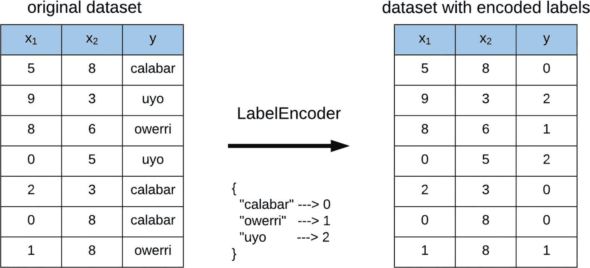

图 18-1

LabelEncoder

让我们看看**LabelEncoder**的一个例子。

```py
# import packages
from sklearn.preprocessing import LabelEncoder
# create dataset
data = np.array([[5,8,"calabar"],[9,3,"uyo"],[8,6,"owerri"],
[0,5,"uyo"],[2,3,"calabar"],[0,8,"calabar"],
[1,8,"owerri"]])
data
'Output':
array([['5', '8', 'calabar'],
['9', '3', 'uyo'],
['8', '6', 'owerri'],
['0', '5', 'uyo'],
['2', '3', 'calabar'],
['0', '8', 'calabar'],
['1', '8', 'owerri']], dtype='<U21')
# separate features and target
X = data[:,:2]
y = data[:,-1]
# encode y
encoder = LabelEncoder()
encode_y = encoder.fit_transform(y)
# adjust dataset with encoded targets
data[:,-1] = encode_y
data
'Output':
array([['5', '8', '0'],
['9', '3', '2'],
['8', '6', '1'],
['0', '5', '2'],
['2', '3', '0'],
['0', '8', '0'],
['1', '8', '1']], dtype='<U21')
```

**OneHotEncoder**用于将分类特征变量转换为整数矩阵。这个矩阵是一个稀疏矩阵，每一列对应于一个类别的可能值。这进一步在图 18-2 中进行了说明。

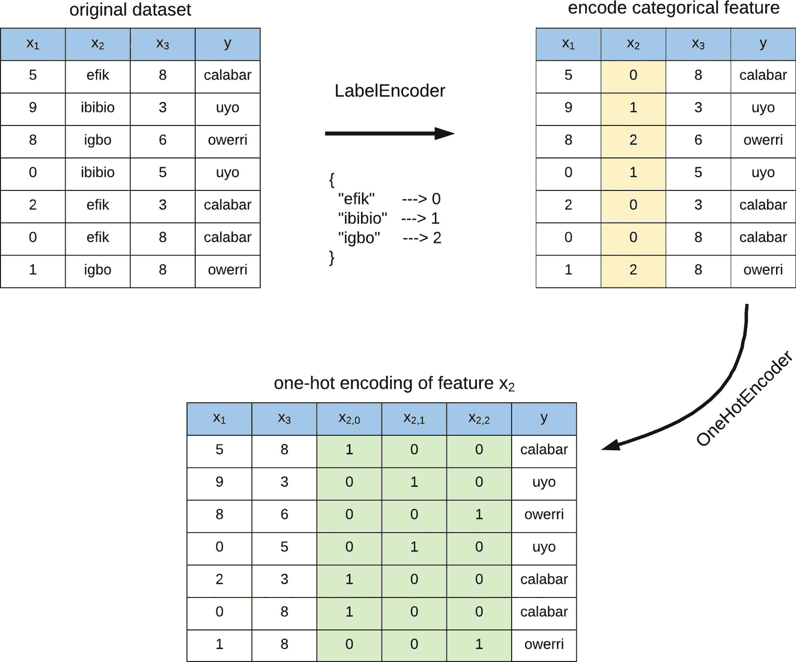

图 18-2

OneHotEncoder

让我们看看**OneHotEncoder**的一个例子。

```py
# import packages
from sklearn.preprocessing import OneHotEncoder
# create dataset
data = np.array([[5,"efik", 8,"calabar"],[9,"ibibio",3,"uyo"],[8,"igbo",6,"owerri"],[0,"ibibio",5,"uyo"],[2,"efik",3,"calabar"],[0,"efik",8,"calabar"],[1,"igbo",8,"owerri"]])
# separate features and target
X = data[:,:3]
y = data[:,-1]
# print the feature or design matrix X
X
'Output':
array([['5', 'efik', '8'],
['9', 'ibibio', '3'],
['8', 'igbo', '6'],
['0', 'ibibio', '5'],
['2', 'efik', '3'],
['0', 'efik', '8'],
['1', 'igbo', '8']], dtype='<U21')
# one_hot_encode X
one_hot_encoder = OneHotEncoder(handle_unknown='ignore')
encode_categorical = X[:,1].reshape(len(X[:,1]), 1)
one_hot_encode_X = one_hot_encoder.fit_transform(encode_categorical)
# print one_hot encoded matrix - use todense() to print sparse matrix
# or convert to array with toarray()
one_hot_encode_X.todense()
'Output':
matrix([[1., 0., 0.],
[0., 1., 0.],
[0., 0., 1.],
[0., 1., 0.],
[1., 0., 0.],
[1., 0., 0.],
[0., 0., 1.]])
# remove categorical label
X = np.delete(X, 1, axis=1)
# append encoded matrix
X = np.append(X, one_hot_encode_X.toarray(), axis=1)
X
'Output':
array([['5', '8', '1.0', '0.0', '0.0'],
['9', '3', '0.0', '1.0', '0.0'],
['8', '6', '0.0', '0.0', '1.0'],
['0', '5', '0.0', '1.0', '0.0'],
['2', '3', '1.0', '0.0', '0.0'],
['0', '8', '1.0', '0.0', '0.0'],
['1', '8', '0.0', '0.0', '1.0']], dtype='<U32')
```

### 输入缺失数据

通常情况下，数据集中包含多个缺失观测值。Scikit-learn 实现了**Imputer**模块来填充缺失值。

```py
# import packages
from sklearn. impute import SimpleImputer
# create dataset
data = np.array([[5,np.nan,8],[9,3,5],[8,6,4],
[np.nan,5,2],[2,3,9],[np.nan,8,7],
[1,np.nan,5]])
data
'Output':
array([[ 5., nan,  8.],
[ 9.,  3.,  5.],
[ 8.,  6.,  4.],
[nan,  5.,  2.],
[ 2.,  3.,  9.],
[nan,  8.,  7.],
[ 1., nan,  5.]])
# impute missing values - axis=0: impute along columns
imputer = SimpleImputer(missing_values=np.nan, strategy="mean")
imputer.fit_transform(data)
'Output':
array([[5., 5., 8.],
[9., 3., 5.],
[8., 6., 4.],
[5., 5., 2.],
[2., 3., 9.],
[5., 8., 7.],
[1., 5., 5.]])
```

### 生成高阶多项式特征

Scikit-learn 有一个名为 PolynomialFeatures 的模块，用于生成一个新的数据集，该数据集包含基于原始数据集中特征的高阶多项式和交互特征。例如，如果原始数据集有两个维度[a, b]，则特征的第二阶多项式变换将产生[1, a, b, *a*², ab, *b*²]。

```py
# import packages
from sklearn.preprocessing import PolynomialFeatures
# create dataset
data = np.array([[5,8],[9,3],[8,6],
[5,2],[3,9],[8,7],
[1,5]])
data
'Output':
array([[5, 8],
[9, 3],
[8, 6],
[5, 2],
[3, 9],
[8, 7],
[1, 5]])
# create polynomial features
polynomial_features = PolynomialFeatures(2)
data = polynomial_features.fit_transform(data)
data
'Output':
array([[ 1.,  5.,  8., 25., 40., 64.],
[ 1.,  9.,  3., 81., 27.,  9.],
[ 1.,  8.,  6., 64., 48., 36.],
[ 1.,  5.,  2., 25., 10.,  4.],
[ 1.,  3.,  9.,  9., 27., 81.],
[ 1.,  8.,  7., 64., 56., 49.],
[ 1.,  1.,  5.,  1.,  5., 25.]]
```

## 机器学习算法

本章介绍了使用 Scikit-learn 库实现机器学习算法的入门。

在接下来的章节中，我们将使用 Scikit-learn 实现监督学习和无监督机器学习模型。Scikit-learn 提供了一套一致的方法，其中**fit()**方法用于将模型拟合到训练数据集，而**predict()**方法用于使用拟合的参数在测试数据集上进行预测。示例旨在解释如何使用 Scikit-learn；因此，我们并不那么关注模型的性能。

# 19. 线性回归

线性回归算法背后的基本思想是它假设数据集的特征之间存在线性关系。由于模型参数上施加的预定义结构，它也被称为参数化学习算法。线性回归用于预测包含实数值的目标。正如我们将在第二十章关于逻辑回归中看到的，线性回归模型不足以处理目标为分类的学习问题。

## 回归模型

在线性回归中，普遍的假设是目标变量（即我们想要预测的单位）可以建模为特征的线性组合。

线性组合仅仅是若干个向量的加和，这些向量被某个任意常数缩放（或调整）。向量是表示一组数字的数学结构。

例如，让我们假设一个由两个特征和一个目标变量组成的随机生成数据集。该数据集有 50 个观测值（见图 19-1）。

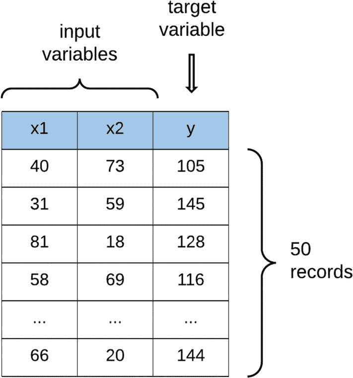

图 19-1

样本数据集

该数据集的向量是

![$$ x1=\left[40\ 31\ 81\ 57\dots 66\ \right],\kern1em x2=\left[73\ 59\ 18\ 69\dots 20\ \right],\kern1em y=\left[105\ 145\ 128\ 116\dots 144\ \right] $$](img/463852_1_En_19_Chapter/463852_1_En_19_Chapter_TeX_Equa.png)

在线性回归模型中，每个特征都有一个分配的“权重”。我们可以这样说，权重参数化数据集中的每个特征。数据集中的权重被调整以获得值，这些值能够捕捉特征之间的基本关系，并最佳地近似目标变量。线性回归模型形式上表示为


其中

+   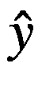 (发音为 y-hat) 是我们想要预测的输出 *y* 的近似值。

+   *θ*[*i*]，其中 *i* = {1, 2, …*n*}，是分配给数据集中每个特征的权重。符号 *n* 是数据集特征的大小。

+   *θ*[0] 代表“偏差”项。

### 线性回归的视觉表示

为了提供更多的直观理解，让我们绘制一个二维图，展示数据集的第一个特征 *x*[1] 和目标变量 *y* 的所有 50 条记录。在这个示例中，我们只使用一个特征，因为用二维散点图可视化更容易（见图 19-2）。

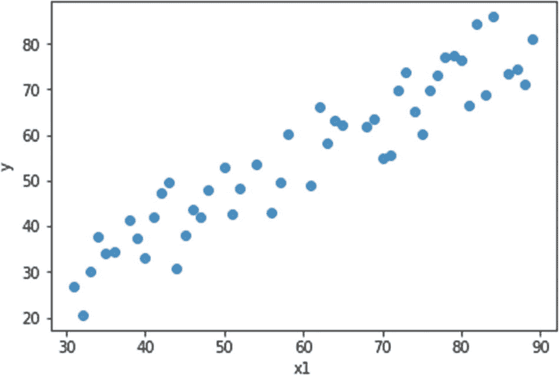

图 19-2

*x* 的散点图 [1] *(位于 x 轴上) 和 y (位于 y 轴上)*

线性模型的目标是找到一个线，它给出数据点的最佳近似或最佳拟合。当找到时，这条线将类似于图 19-3 中的某物。最佳拟合线被称为回归线。

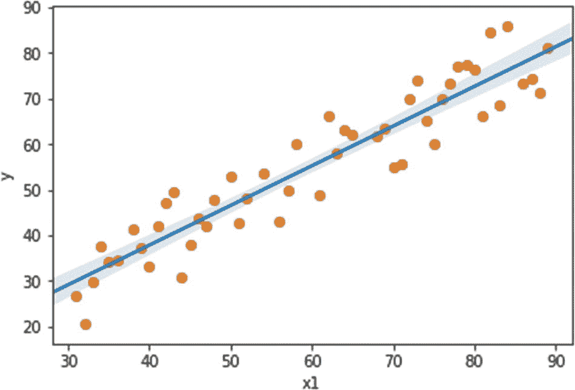

图 19-3

*x* 的散点图 [1] *(位于 x 轴上) 和 y (位于 y 轴上) 的回归线*

### 寻找回归线 – 我们如何优化线性模型的参数？

为了找到回归线，我们需要定义成本函数，这也可以称为损失函数。记住，在机器学习中，成本是学习算法最小化的误差度量。我们也可以将成本定义为模型输出错误预测时的惩罚。

在线性回归模型的情况下，成本函数定义为预测值和实际值之间平方差的和的一半。线性回归成本函数被称为 ***平方误差成本函数***，其表示为

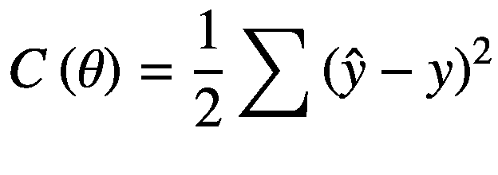

更简单地说，目标变量的近似值  越接近实际变量 *y*，我们的成本就越低，我们的模型就越好。

定义了成本函数后，可以使用梯度下降等优化算法通过更新线性回归模型的权重来最小化成本 *C*(*θ*)。

## 我们如何解释线性回归模型？

在机器学习中，线性回归的关注点与传统统计学略有不同。在统计学中，回归模型的目标是通过解释 p 值来理解特征与目标之间的关系，而在机器学习中，线性回归模型的目标是根据新的样本预测目标。

图 19-4 显示了一个回归模型，其最佳拟合线优化了数据特征与目标之间的平方差。这个差异也称为残差（在图 19-4 中以紫色垂直线表示）。在线性回归模型中，我们关注的是最小化预测标签与数据集中实际标签之间的误差。

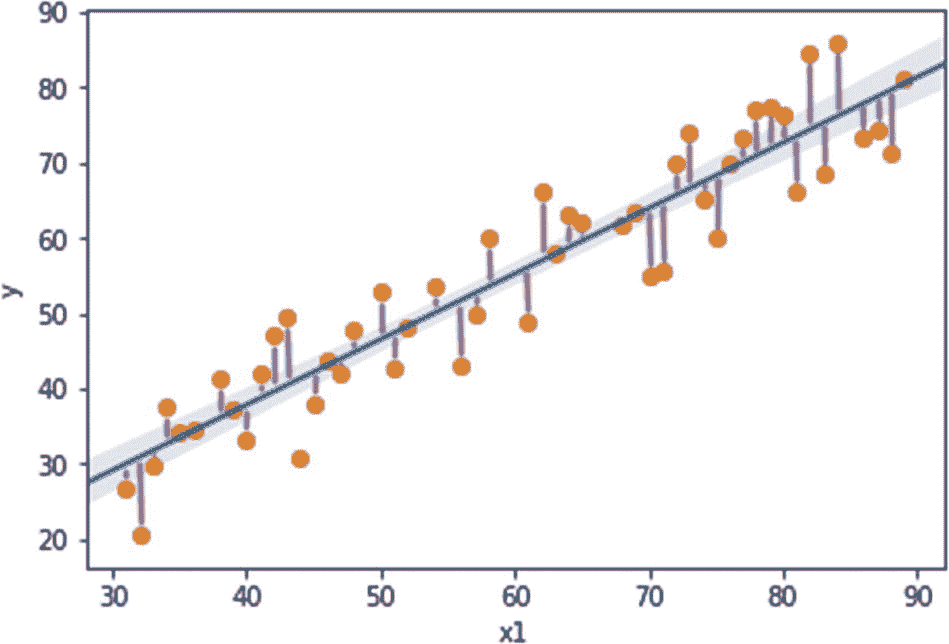

图 19-4

展示残差的线性回归模型

如果图 19-4 中的所有点完全落在预测的回归线上，则误差将为 0。在解释回归模型时，我们希望误差度量尽可能低。

然而，我们的重点是当我们在测试数据集上评估我们的模型时，获得一个低误差度量。回想一下，学习的测试是在模型可以推广到训练期间未接触到的示例时。

## 使用 Scikit-learn 进行线性回归

在这个例子中，我们将使用 Scikit-learn 实现一个线性回归模型。该模型将根据波士顿房价数据集预测房价。该数据集包含 506 个观测值和 13 个特征。

我们首先导入以下包：

```py
sklearn.linear_model.LinearRegression: function that implements the LinearRegression model.
sklearn.datasets: function to load sample datasets integrated with scikit-learn for experimental and learning purposes.
sklearn.model_selection.train_test_split: function that partitions the dataset into train and test splits.
sklearn.metrics.mean_squared_error: function to load the evaluation metric for checking the performance of the model.
math.sqrt: imports the square-root math function. It is used later to calculate the RMSE when evaluating the model.
# import packages
from sklearn.linear_model import LinearRegression
from sklearn import datasets
from sklearn.model_selection import train_test_split
from sklearn.metrics import mean_squared_error
from math import sqrt
# load dataset
data = datasets.load_boston()
# separate features and target
X = data.data
y = data.target
# split in train and test sets
X_train, X_test, y_train, y_test = train_test_split(X, y, shuffle=True)
# create the model
# setting normalize to true normalizes the dataset before fitting the model
linear_reg = LinearRegression(normalize = True)
# fit the model on the training set
linear_reg.fit(X_train, y_train)
'Output': LinearRegression(copy_X=True, fit_intercept=True, n_jobs=1, normalize=True)
# make predictions on the test set
predictions = linear_reg.predict(X_test)
# evaluate the model performance using the root mean square error metric
print("Root mean squared error (RMSE): %.2f" % sqrt(mean_squared_error(y_test, predictions)))
'Output':
Root mean squared error (RMSE): 4.33
```

在前面的代码中，使用`train_test_split()`函数将数据集分为训练集和测试集。将线性回归算法应用于训练数据集以找到参数化模型权重的最优值。通过在测试集上调用`.predict()`函数来评估模型。

模型的误差使用 RMSE 误差度量（在第十四章中讨论）进行评估。

## 适应非线性

虽然线性回归的前提是数据集特征的潜在结构是线性的，但对于大多数数据集来说，情况并非如此。尽管如此，仍然可以将线性回归适应于拟合或为非线性数据集建立模型。将非线性添加到线性模型中的这个过程称为**多项式回归**。

多项式回归通过在数据集中添加现有数据特征的更高阶多项式项作为新特征来拟合数据中的非线性关系。更多内容在图 19-5 中展示。

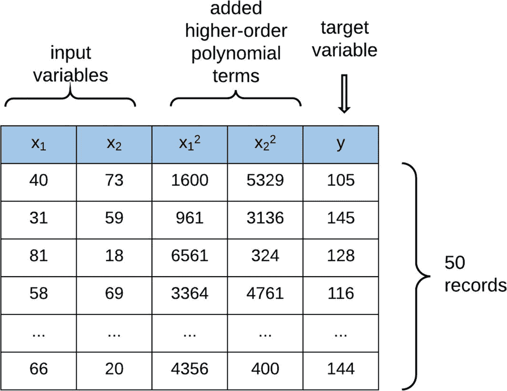

图 19-5

向数据集中添加多项式特征

重要的是要注意，从统计学的角度来看，在逼近最小化模型的最优权重值时，参数交互的基本假设是线性的。非线性回归模型可能会过度拟合数据，但可以通过向模型添加正则化来缓解这一点。以下是一个多项式回归模型的正式示例。

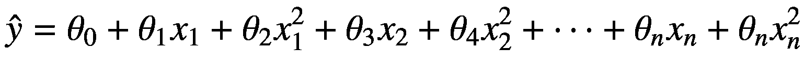

多项式回归的示意图如图 19-6 所示。

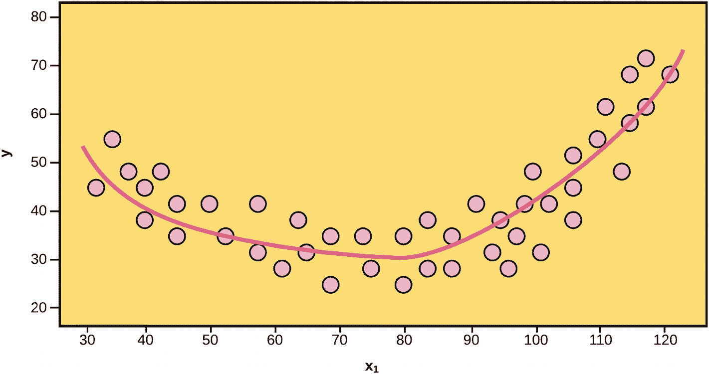

图 19-6

使用多项式回归拟合非线性模型

## 使用 Scikit-learn 进行高阶线性回归

在这个例子中，我们将从数据集特征中创建高阶多项式，希望拟合一个更灵活的模型，可能更好地捕捉数据集中的方差。如第十八章所述，我们将使用 PolynomialFeatures 方法来创建这些高阶多项式和交互特征。以下代码示例与之前的代码示例类似，除了它通过添加高阶特征扩展了特征矩阵。

```py
# import packages
from sklearn.linear_model import LinearRegression
from sklearn import datasets
from sklearn.model_selection import train_test_split
from sklearn.metrics import mean_squared_error
from math import sqrt
from sklearn.preprocessing import PolynomialFeatures
# load dataset
data = datasets.load_boston()
# separate features and target
X = data.data
y = data.target
# create polynomial features
polynomial_features = PolynomialFeatures(2)
X_higher_order = polynomial_features.fit_transform(X)
# split in train and test sets
X_train, X_test, y_train, y_test = train_test_split(X_higher_order, y, shuffle=True)
# create the model
# setting normalize to true normalizes the dataset before fitting the model
linear_reg = LinearRegression(normalize = True)
# fit the model on the training set
linear_reg.fit(X_train, y_train)
'Output': LinearRegression(copy_X=True, fit_intercept=True, n_jobs=None, normalize=True)
# make predictions on the test set
predictions = linear_reg.predict(X_test)
# evaluate the model performance using the root mean square error metric
print("Root mean squared error (RMSE): %.2f" % sqrt(mean_squared_error(y_test, predictions)))
'Output':
Root mean squared error (RMSE): 3.01
```

从示例中，我们可以观察到添加了高阶特征后模型误差分数的轻微改善。这个结果与实践中可能观察到的结果相似。在现实世界中，很难找到特征具有完美线性结构的真实事件数据集。因此，添加高阶项最有可能提高模型性能。但我们必须注意避免过度拟合模型。

## 提高线性回归模型的表现

以下是一些可以探索的选项，以提高线性回归模型的表现。

**在偏差的情况下（即训练数据上的 MSE 较差**）

+   执行特征选择以减少参数空间。特征选择是消除对学习预测模型没有贡献的变量的过程。对于线性回归，有各种自动特征选择方法。其中一些是向后选择、前向传播和逐步回归。特征也可以通过系统地遍历数据集中的每个特征并确定其与学习问题的相关性来手动剪枝。

+   移除具有高相关性的特征。当两个预测特征强烈依赖于彼此时，就会发生相关性。经验上，数据集中的高度相关特征可能会损害模型精度。

+   使用高阶特征。更灵活的拟合可能更好地捕捉数据集中的方差。

+   在训练之前重新缩放你的数据。未缩放的特征会负面影响回归模型的预测质量。由于多维空间中特征的不同尺度，模型难以找到捕获学习问题的最佳权重。如第十六章所述，梯度下降在特征缩放时表现更好。

+   在罕见的情况下，我们可能需要收集更多的数据。然而，这可能是成本高昂的。

**在方差的情况下（即，当在训练数据上评估时均方误差（MSE）很好，但在测试数据上很差）**

+   在这种情况下，一个标准的做法是对回归模型应用正则化（关于这一点将在第二十一章中详细介绍）。这可以很好地防止过拟合。

本章概述了用于学习实值目标的线性回归机器学习算法。此外，本章还提供了使用 Scikit-learn 实现线性回归模型的实际步骤。在下一章中，我们将检查逻辑回归以学习分类问题。

# 20. 逻辑回归

逻辑回归是一种用于学习分类问题的监督机器学习算法。当目标变量是分类变量时，就出现了分类学习问题。逻辑回归的目标是从数据集的特征映射到一个函数，以预测新示例属于目标类中的一个的概率。图 20-1 是一个具有分类目标的数据集的示例。

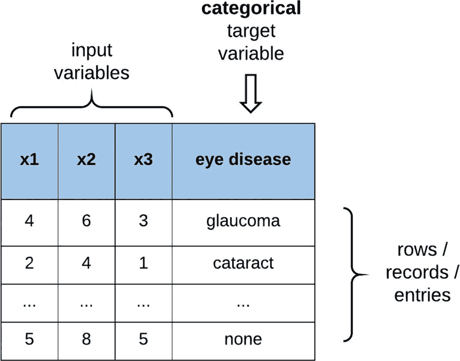

图 20-1

以定性变量作为输出的数据集

## 为什么选择逻辑回归？

为了让我们更好地理解使用逻辑回归进行分类以及为什么线性回归不适合学习分类输出，让我们考虑一个二元或双类分类问题。图 20-2 中所示的数据集的输出 *y*（即，眼部疾病）= {疾病，无疾病} 是具有二元目标的数据集的示例。

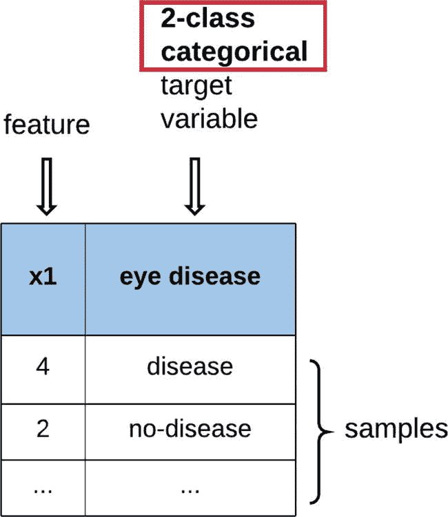

图 20-2

双类分类问题

从图 20-3 的插图可以看出，线性回归算法容易受到不准确的决策边界的影响，尤其是在存在异常值的情况下（如图 20-3 图的右侧所示）。此外，线性回归模型将试图学习一个实值输出，而分类学习问题则是使用概率估计来预测观察值的类别成员。

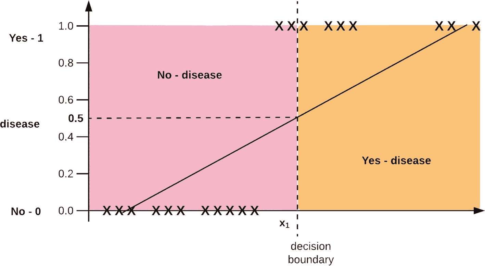

图 20-3

在分类数据集上的线性回归

## 介绍对数或 S 型模型

对数逻辑函数，也称为逻辑函数或 S 型函数，负责约束损失函数的输出，使其成为介于 0 和 1 之间的概率输出。S 型函数的正式表示为

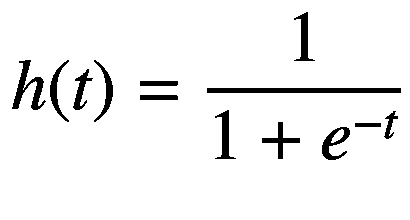

逻辑回归模型在形式上与线性回归模型相似，不同之处在于它受到 S 型模型的作用。以下是其正式表示：

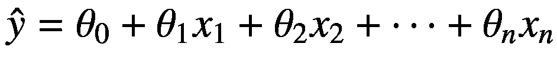

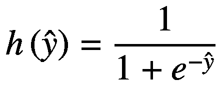

其中 0 ≤ *h*(*t*) ≤ 1。S 型函数在图 20-4 中进行了图形表示。

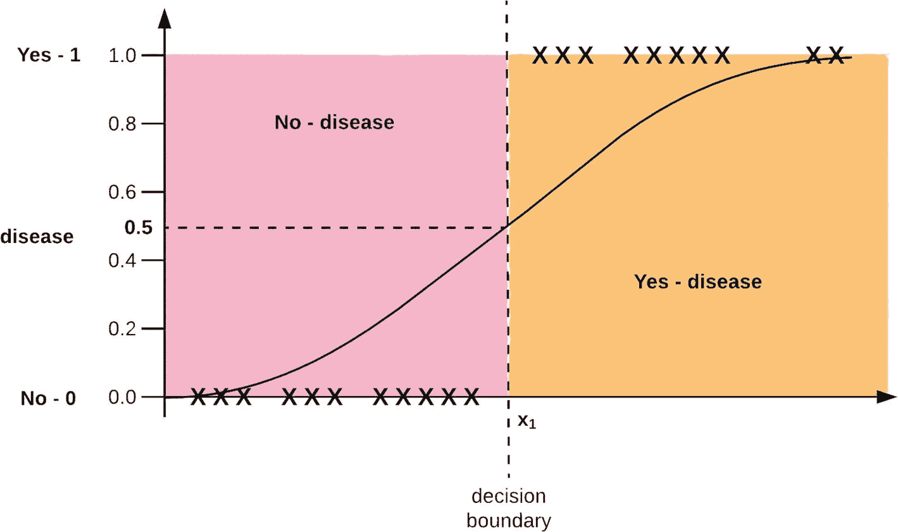

图 20-4

逻辑函数

S 型函数，看起来像 S 曲线，从 0 开始上升并在 1 处平稳。从图 20-4 中显示的 S 型函数来看，当增加到正无穷大时，S 型输出接近 1，而当*t*减小到负无穷大时，S 型函数输出 0。

## 训练逻辑回归模型

逻辑回归损失函数的正式表示为

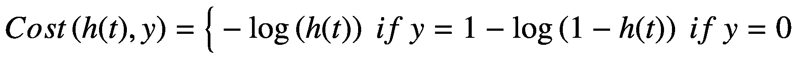

损失函数也称为***log-loss***，以这种形式设置，以输出模型预测错误类别时算法的惩罚。为了提供更多的直观理解，以图 20-5 中*y* = 1 时- *log* (*h*(*t*))的图像为例。

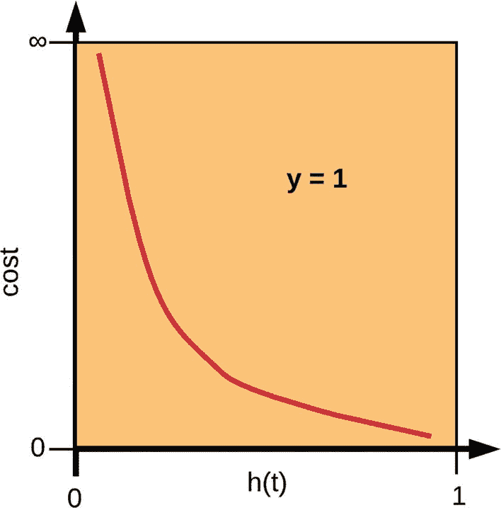

图 20-5

*h*(*t*)当*y* = 1 时的图像

在图 20-5 中，如果算法正确预测目标为 1，则损失趋向于 0。然而，如果算法*h*(*t*)错误地将目标预测为 0，则模型上的损失呈指数级增长。相反，当 y = 0 时，- *log* (1 - *h*(*t*))的图像也是如此。

逻辑模型使用梯度下降法进行优化，以找到参数*θ*的最优值，从而最小化损失函数以预测具有最高概率估计的类别。

## 多类分类/多项式逻辑回归

在多类别或多项式逻辑回归中，数据集的标签包含超过 2 个类别。多项式逻辑回归设置（即成本函数和优化过程）在结构上与逻辑回归相似；唯一的区别是逻辑回归的输出是 2 个类别，而多项式有超过 2 个类别（见图 20-6）。

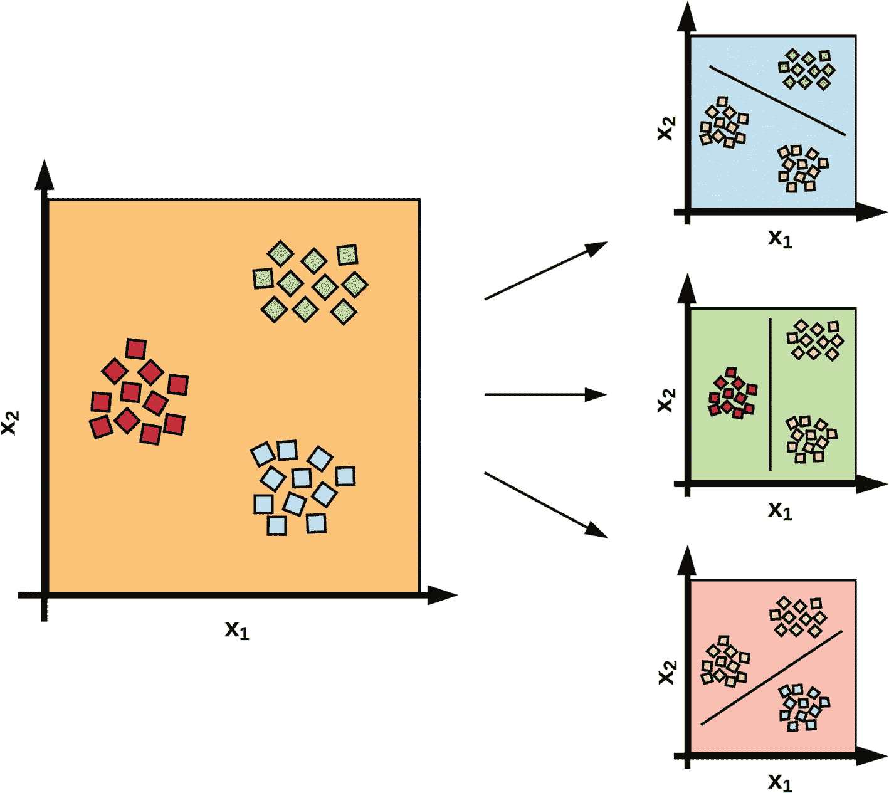

图 20-6

多项式回归的示意图

在图 20-6 中，多类别逻辑回归构建一个一对一分类器来构建不同类别成员的决策边界。

在这一点上，我们介绍机器学习中的一个关键函数，称为 softmax 函数。当 *K* > 2 时，softmax 函数用于计算一个实例属于 *K* 个类别之一的概率。当我们讨论 (人工) 神经网络时，我们还将看到 softmax 函数再次出现。

为了构建一个具有 *k* 个类别的分类模型，多项式逻辑模型正式定义为

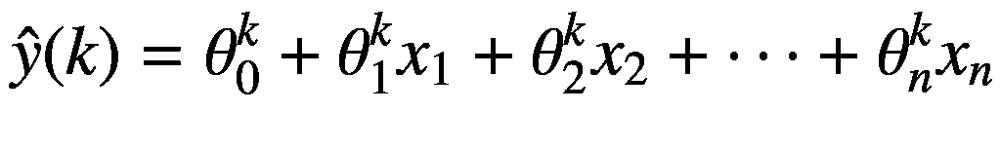

前面的模型考虑了 k 个不同类别的参数。

软最大化函数正式表示为

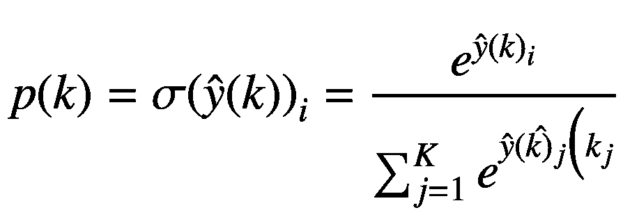

其中

+   *i* = {1, …, *K*} 类。

+   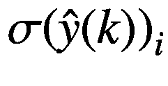 输出训练数据集中一个示例属于 *K* 个类别之一的概率估计。

在多项式逻辑回归模型中学习类别标签的成本函数称为 ***交叉熵*** 成本函数。使用梯度下降法找到参数 *θ* 的最优值，以最小化成本函数并 ***准确预测具有最高概率估计的类别***。

## 使用 Scikit-learn 的逻辑回归

在本例中，我们将使用 Scikit-learn 实现一个多类别逻辑回归模型。该模型将预测来自 Iris 数据集的三种花卉种类。该数据集包含 150 个观测值和 4 个特征。对于此示例，我们使用准确率指标和混淆矩阵来评估模型性能。

```py
# import packages
from sklearn.linear_model import LogisticRegression
from sklearn import datasets
from sklearn.model_selection import train_test_split
from sklearn.metrics import accuracy_score
from sklearn.metrics import multilabel_confusion_matrix
# load dataset
data = datasets.load_iris()
# separate features and target
X = data.data
y = data.target
# split in train and test sets
X_train, X_test, y_train, y_test = train_test_split(X, y, shuffle=True)
# create the model
logistic_reg = LogisticRegression(solver='lbfgs', multi_class="ovr")
# fit the model on the training set
logistic_reg.fit(X_train, y_train)
# make predictions on the test set
predictions = logistic_reg.predict(X_test)
# evaluate the model performance using accuracy metric
print("Accuracy: %.2f" % accuracy_score(y_test, predictions))
'Output':
Accuracy: 0.97
# print the confusion matrix
multilabel_confusion_matrix(y_test, predictions)
'Output':
array([[[26,  0],
[ 0, 12]],
[[25,  0],
[ 1, 12]],
[[24,  1],
[ 0, 13]]])
```

注意以下代码块中的以下内容：

+   通过调用 LogisticRegression(solver=‘lbfgs’, multi_class=‘ovr’). 方法初始化逻辑回归模型。将属性 ‘multi_class’ 设置为 ‘ovr’ 以创建一个一对一分类器。

+   多类学习问题的混淆矩阵使用`multilabel_confusion_matrix`来计算按类别划分的混淆矩阵，其中标签以一对一的方式分组。例如，第一个矩阵表示实际目标和预测目标之间对于类别 1 与其他类别的差异。

## 优化逻辑回归模型

本节概述了一些优化/改进逻辑回归模型性能的技术。

**在偏差的情况下（即，当训练数据的准确性较差时**）

+   移除高度相关的特征。当数据集中存在高度相关的特征时，逻辑回归容易降低性能。

+   通过应用特征缩放标准化预测变量，逻辑回归将受益。

+   良好的特征工程，如去除冗余特征或根据直觉将特征重组到学习问题中，可以提高分类模型。

+   应用对数变换以归一化数据集可以提高逻辑回归分类的准确性。

**在方差的情况下（即，当训练数据的准确性较好，但测试数据较差时**）

应用正则化（更多内容请见第二十一章）是防止过拟合的好方法。

本章简要概述了逻辑回归，用于构建分类模型。本章包括使用 Scikit-learn 实现逻辑回归分类器的实际步骤。在下一章中，我们将探讨将正则化应用于线性模型以减轻过拟合问题的概念。

# 21. 线性模型的正则化

正则化是一种向学习算法的损失函数添加参数*λ*的技术，通过减少过拟合来提高其对新示例泛化的能力。额外正则化参数的作用是缩小或最小化模型中其他特征（或参数）的权重度量。

正则化应用于线性模型，如多项式线性回归和逻辑回归，当将高阶多项式特征添加到特征集时，这些模型容易过拟合。

## 正则化是如何工作的

在模型构建过程中，正则化参数*λ*被校准以确定在训练模型时其他特征的幅度调整程度。正则化的值越高，特征权重的幅度减少就越多。

如果正则化参数设置得太接近零，它会减少模型特征权重上的正则化效果。在零时，正则化项施加的惩罚几乎不存在，模型就像正则化项从未存在过一样。

## 正则化对偏差与方差的影响

*λ*的值（即正则化参数）越高，成本函数的系数（或权重）受到的限制就越大。因此，如果*λ*的值很高，模型可能导致学习偏差（即它对数据集欠拟合）。

然而，如果*λ*的值接近零，正则化参数对模型的影响可以忽略不计，从而导致模型过拟合。正则化是一项重要的技术，当将多项式特征注入线性或逻辑回归分类器以学习非线性关系时应该使用它。

## 使用 Scikit-learn 对模型应用正则化

向模型参数值添加惩罚以限制其值的技术也称为岭回归或 Tikhonov 正则化。在本节中，我们将构建一个带有正则化的线性回归和逻辑回归模型。

### 带正则化的线性回归

此代码块与第十九章中的多项式线性回归示例类似。该模型将从波士顿房价数据集中预测房价。然而，此模型包括正则化。

```py
# import packages
from sklearn.linear_model import Ridge
from sklearn import datasets
from sklearn.model_selection import train_test_split
from sklearn.metrics import mean_squared_error
from math import sqrt
from sklearn.preprocessing import PolynomialFeatures
# load dataset
data = datasets.load_boston()
# separate features and target
X = data.data
y = data.target
# create polynomial features
polynomial_features = PolynomialFeatures(2)
X_higher_order = polynomial_features.fit_transform(X)
# split in train and test sets
X_train, X_test, y_train, y_test = train_test_split(X_higher_order, y, shuffle=True)
# create the model. The parameter alpha represents the regularization magnitude
linear_reg = Ridge(alpha=1.0)
# fit the model on the training set
linear_reg.fit(X_train, y_train)
# make predictions on the test set
predictions = linear_reg.predict(X_test)
# evaluate the model performance using the root mean square error metric
print("Root mean squared error (RMSE): %.2f" % sqrt(mean_squared_error(y_test, predictions)))
'Output':
Root mean squared error (RMSE): 3.74
```

注意以下内容：

+   方法 Ridge(alpha=1.0)初始化了一个带有正则化的线性回归模型，其中属性‘alpha’控制正则化参数的大小。

### 带正则化的逻辑回归

此代码块与第二十章中关于逻辑回归的示例类似。该模型将从 Iris 数据集中预测三种花卉。此代码段增加的部分是将正则化项包含到逻辑模型中，使用的是‘RidgeClassifier’包。

```py
# import packages
from sklearn.linear_model import RidgeClassifier
from sklearn import datasets
from sklearn.model_selection import train_test_split
from sklearn.metrics import accuracy_score
# load dataset
data = datasets.load_iris()
# separate features and target
X = data.data
y = data.target
# split in train and test sets
X_train, X_test, y_train, y_test = train_test_split(X, y, shuffle=True)
# create the logistic regression model
logistic_reg = RidgeClassifier()
# fit the model on the training set
logistic_reg.fit(X_train, y_train)
# make predictions on the test set
predictions = logistic_reg.predict(X_test)
# evaluate the model performance using accuracy metric
print("Accuracy: %.2f" % accuracy_score(y_test, predictions))
'Output':
Accuracy: 0.76
```

在前面的代码块中，通过‘RidgeClassifier()’方法实现了带正则化的逻辑回归。当正则化应用于逻辑回归时，在此示例中观察到的精度降低是因为算法正在限制模型参数的值，以防止在数据集上产生高方差。该数据集相对简单，且在未进行正则化的测试样本上已经具有较高的精度。

本章讨论了正则化在线性模型（如线性回归和逻辑回归）中的作用。对于其他模型类型，如神经网络中的提前停止（将在第三十四章中讨论），也存在其他形式的正则化。设计机器学习模型时，正则化是一项重要的技术。下一章将讨论并实现另一个重要的机器学习算法，即支持向量机。

# 22. 支持向量机

支持向量机（SVM）是一种用于学习分类和回归模型的机器学习算法。为了建立直观理解，我们将考虑使用 SVM 学习分类模型的情况。给定一个包含两个线性可分的目标类别的数据集，实际上存在无限多条线可以区分这两个类别（参见图 22-1）。SVM 的目标是找到最佳的分隔线。在更高维度的空间中，这条线被称为超平面。

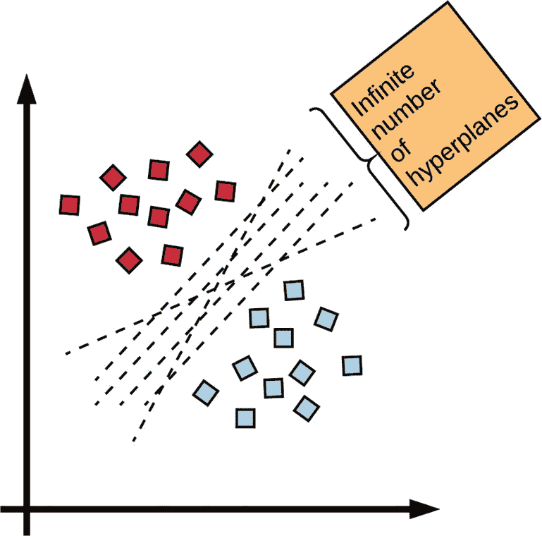

图 22-1

无穷多的判别线

## 什么是超平面？

超平面是在 n 维空间中分隔两个类别的线或更技术性地称为判别线。当在二维空间中绘制超平面时，它被称为线。在三维空间中，它被称为平面，在维度大于 3 的情况下，判别线被称为超平面（参见图 22-2）。对于任何 n 维世界，我们都有 n-1 个超平面。

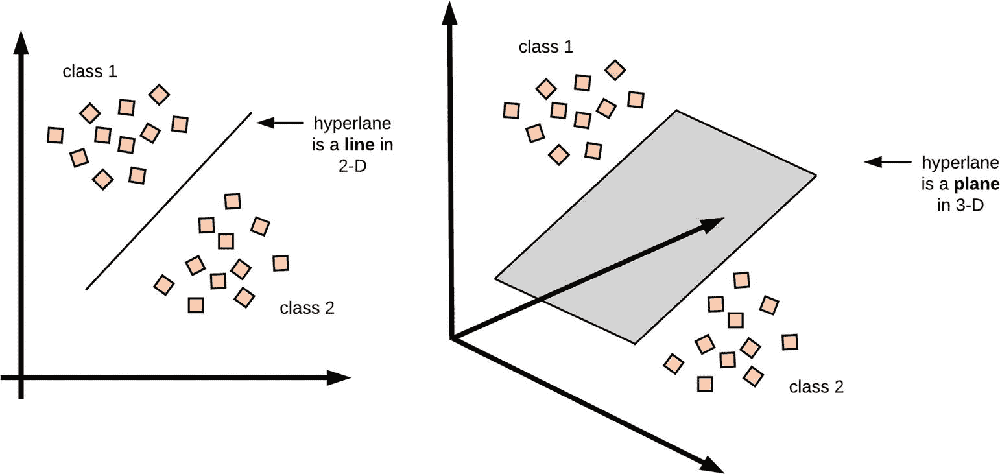

图 22-2

左：二维空间中的超平面是一条线。右：三维空间中的超平面是一个平面。对于维度大于 3 的情况，可视化变得困难。

### 寻找最优超平面

线性分隔两个类别的最佳超平面被识别为位于两个类别边界最近向量最大间隔处的线。

在图 22-3 中，我们可以观察到最佳超平面是位于两个类别正中心的线，并构成了两个类别之间最大的间隔。因此，这个最优超平面也被称为最大间隔分类器。

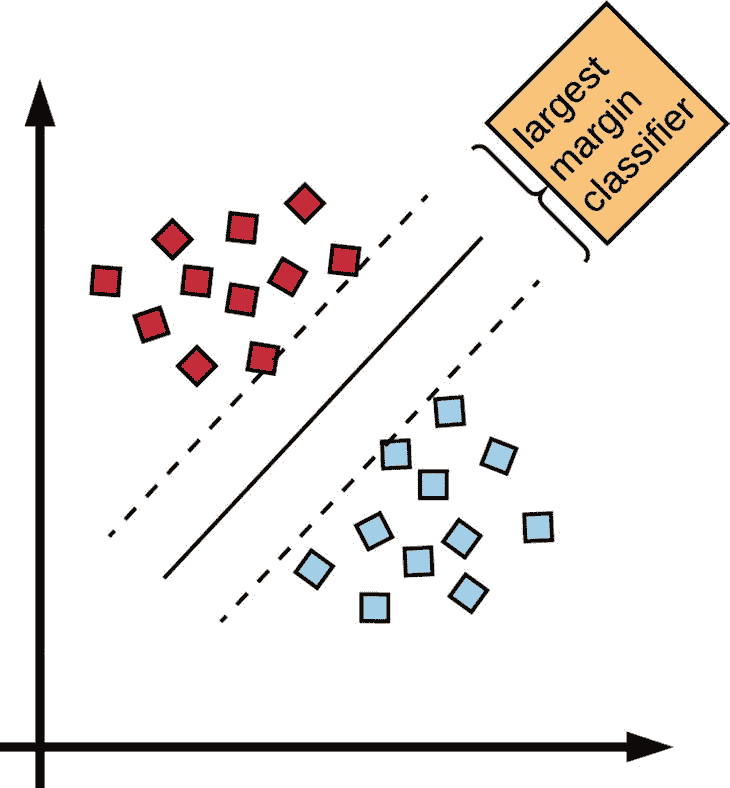

图 22-3

最大间隔分类器

各个类别的边界点，也称为支持向量，对于找到最优超平面至关重要。支持向量在图 22-4 中展示。边界点被称为支持向量，因为它们被用来确定它们所属的类别与分离类别的判别函数之间的最大距离。

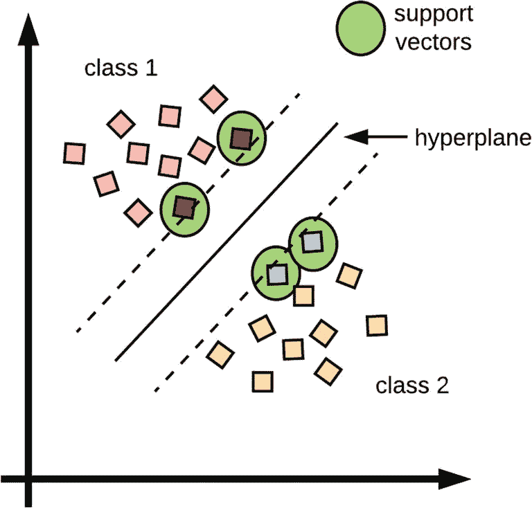

图 22-4

支持向量

寻找间隔和随之而来的最大化间隔的超平面的数学公式超出了本书的范围，但可以简单地说，这种技术涉及拉格朗日乘数。

## 支持向量分类器

在现实世界中，很难找到精确线性可分的数据点，并且存在一个大的边界超平面。在图 22-5 的左侧图像中，表示了数据集中两个类别的数据点。观察可以发现，这两个类别之间已经存在一个明显的线性分离器。现在，假设我们有一个来自类别 1 的额外点，调整得使其与类别 2 非常接近，我们看到这个点扰乱了图 22-5 右侧图像中超平面的位置。这揭示了超平面对额外数据点的敏感性，可能导致非常狭窄的边界。

这种对数据样本的敏感性有显著的缺点，首先是支持向量与超平面之间的距离反映了分类精度的置信度。此外，由于一个额外的点而导致超平面位置的剧烈变化表明，分类器容易受到高变异性影响，并且可能过度拟合训练数据。

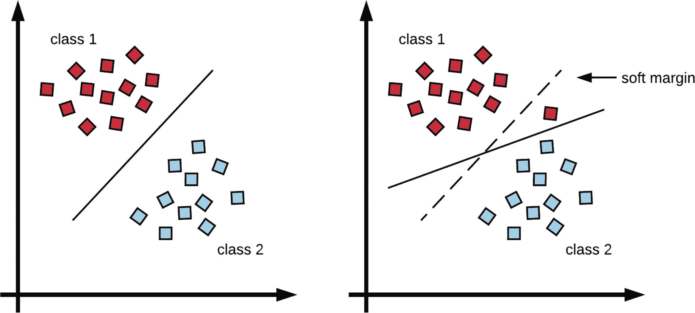

图 22-5

左：具有大边界的线性可分数据分布。右：数据点分布使得找到线性分离两个类别的具有大边界的分类器更加困难

支持向量机的目标是找到一个几乎可以区分两个类别的超平面。这种技术也被称为软边界。软边界在寻找分离超平面时会忽略一定程度的误差。软边界的这个概念是我们将支持向量机推广到寻找在数据集中不易线性分离的超平面的方法。边界被称为软边界，因为一些示例被故意错误分类。

在这种情况下，如图 22-5 所示，软边界分类器更受欢迎，因为它对单个数据点不太敏感，并且总体上更有可能推广到新的示例。尽管如此，在训练过程中可能会错误分类几个示例，但这总体上对分类器的质量是有益的，因为它可以推广到新的样本。

再次，边界被称为软边界，因为允许一些示例违反边界，甚至被超平面错误分类，以保持整体的可推广性。这如图 22-6 所示。

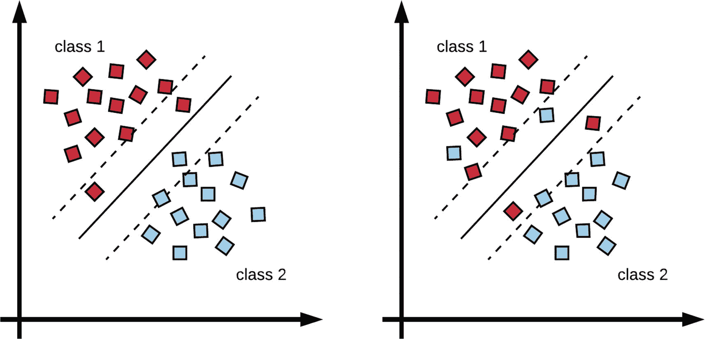

图 22-6

左：允许点违反边界的软边界示例。右：一些点故意被错误分类的示例。

### C 参数

C 参数是负责控制对边界违规程度或支持向量分类器允许的故意误分类点数的超参数。C 超参数是一个非负实数。当这个 C 参数设置为 0 时，分类器变为大边界分类器。

在软边界分类器中，通过调整 C 参数的值来调整其容忍度。C 值越大，分类器的边界越宽，对违规和误分类的容忍度越高。然而，C 值越小，边界越窄，对违规和误分类点的容忍度越低。

注意到 C 超参数对于调节支持向量分类器的偏差/方差权衡至关重要。C 的值越高，我们的分类器对数据点的变化越敏感，可能导致学习问题过于简化。此外，如果 C 设置得更接近零，会导致边界非常窄，这可能导致分类器过拟合，导致高方差——这可能导致无法推广到新的示例（见图 22-7）。

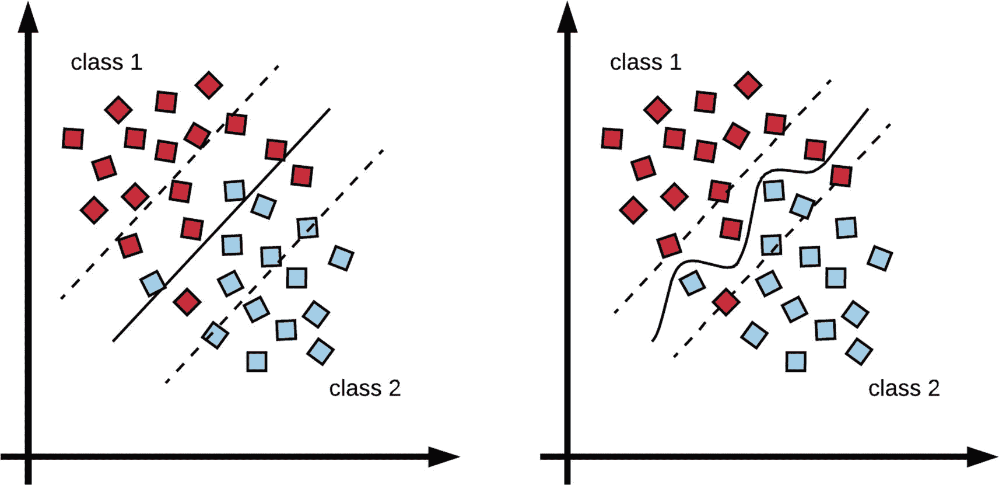

图 22-7

左：C 值越高，边界越宽，容忍度越高。右：C 值越低，边界越窄，容忍度越低

## 多类分类

之前，我们使用 SVC 为二进制类别构建了判别分类器。当数据集中有超过两个类别的输出时，这种情况在实践中很常见，会发生什么？SVM 可以扩展到对数据集中的 k 个类别进行分类，其中 k > 2。然而，这种扩展对于 SVM 来说并不简单。存在两种标准方法来解决这个问题。第一种是一对一（OVO）多类分类，而另一种是一对全（OVA）或一对剩余（OVR）多类分类技术。

### 一对一（OVO）

在一对一方法中，当类别数 k 大于 2 时，算法构建“k 组合 2”，即$$ \left(\frac{k}{2}\right) $$分类器，其中每个分类器对应一对类别。因此，如果我们数据集中有 10 个类别，总共将构建或训练 45 个分类器，用于每对类别的分类。这如图 22-8 所示。

训练后，通过将测试集中的示例与每个$$ \left(\frac{k}{2}\right) $$分类器进行比较来评估分类器。然后通过选择示例被分配到特定类别的最高次数来确定预测类别。

一对多（One-vs.-one）多类技术可能会导致大量构建的分类器，从而可能导致处理时间变慢。相反，当训练每个分类器时，分类器对类别不平衡更加鲁棒。

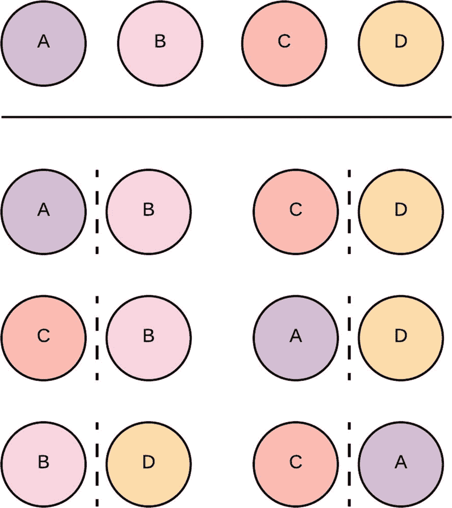

图 22-8

假设我们在数据集中有四个类别，标记为 A 到 D，这将导致六个不同的分类器

### 一对全（One-vs.-All，OVA）

将 SVM 拟合到多分类问题（其中类别数 k 大于 2）的一对全方法包括将每个 k 类与剩余的 k-1 类进行拟合。假设我们有十个类别，每个类别都将与剩余的九个类别进行分类。这个例子在图 22-9 中用四个类别进行了说明。

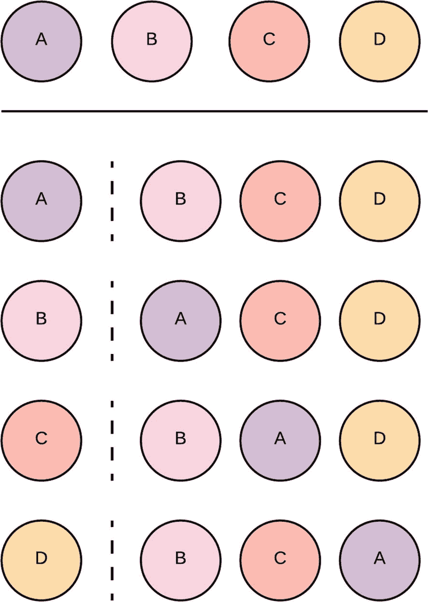

图 22-9

给定一个数据集中的四个类别，我们构建四个分类器，每个类别都与剩余的类别进行拟合

通过将测试示例与每个拟合的分类器进行比较来评估分类器。选择具有最大超平面边缘的分类器作为预测分类目标，因为分类器边缘的大小可以指示类别成员的高置信度。

## 核技巧：拟合非线性决策边界

在现实世界场景中，非线性数据集比比皆是。

从技术上讲，支持向量机这个名字是在使用支持向量分类器并带有非线性核来学习非线性决策边界时使用的。

SVM 使用一种扩展数据集特征空间以构建非线性分类器的关键技术。这种技术被称为核，通常被称为核技巧。图 22-10 展示了在特征空间中添加一个额外维度时核技巧的示例。

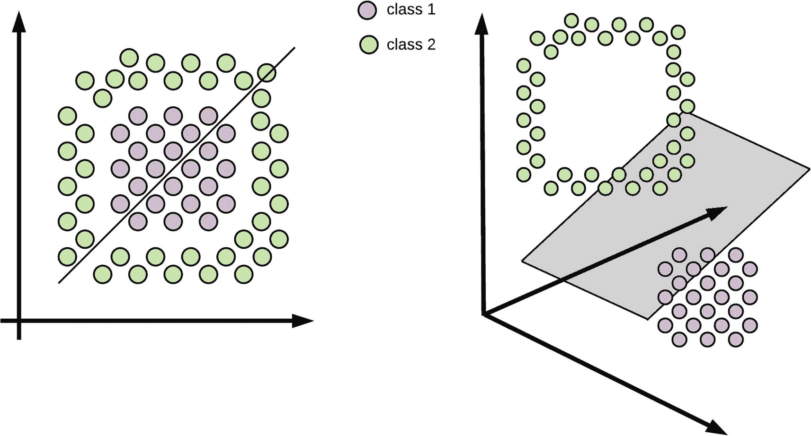

图 22-10

左：线性判别到非线性数据。右：通过使用核技巧，我们可以通过向特征空间添加一个额外维度来线性地分离非线性数据集。

### 添加多项式特征

数据集的特征空间可以通过添加高阶多项式项或交互项来扩展。例如，我们不是用线性特征来训练分类器，而是可以添加多项式特征或向我们的模型中添加交互项。

根据数据集的维度，扩展特征空间的组合可能会迅速变得难以管理，这可能导致模型过度拟合测试集，并且使用更大的特征空间进行计算也会变得昂贵。

### 核

核是扩展数据集特征空间的一种数学过程，用于学习不同类别之间的非线性决策边界。核的数学细节超出了本文的范围。简单来说，核可以被视为一个数学函数，它捕捉数据样本之间的相似性。

#### 线性核

支持向量分类器与线性核相同。它也被称为线性核，因为支持向量分类器的特征空间是线性的。

#### 多项式核

核也可以表示为多项式。通过这种方式，支持向量分类器在更高维度的多项式特征上训练，而无需手动向数据集添加指数级数量的多项式特征。将多项式核添加到支持向量分类器中，使分类器能够学习非线性决策边界。

#### 径向基函数或径向核

径向基函数或径向核是另一种非线性核，它使支持向量分类器能够学习非线性决策边界。径向核类似于向空间添加多个相似性特征。对于径向基函数，一个称为 gamma 的超参数，*γ*，用于控制非线性决策边界的灵活性。gamma 值越小，非线性判别函数越简单（或灵活），但 gamma 值较大则导致更灵活和复杂的决策边界，这可以紧密地拟合数据中的非线性，但可能导致过度拟合。这如图 22-11 所示。RBF 是实践中常用的核选项。

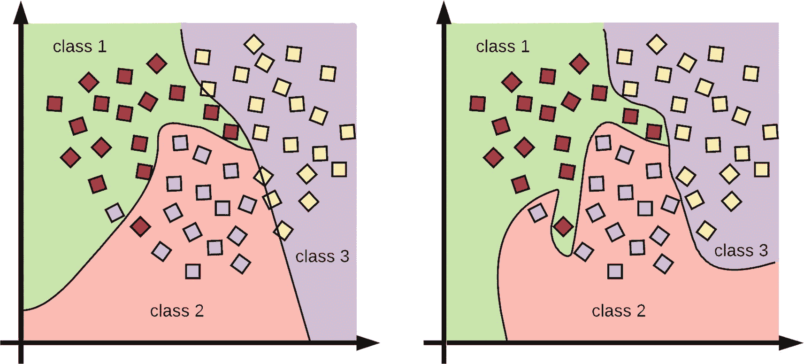

图 22-11

调整径向基函数*γ*参数以及支持向量分类器的 C 参数以拟合非线性决策边界的示意图。左：C = 1 和*γ* = 10^(-3)的 RBF 核。右：C = 1 和*γ* = 10^(-5)的 RBF 核。

当使用支持向量分类器的径向核时，C 和 gamma 的值是超参数，这些参数被调整以找到适当的模型灵活性水平，以便在部署时推广到新的示例。

在实践中，线性核或支持向量分类器有时出人意料地表现良好，当用于将函数映射到非线性数据时。这一观察遵循奥卡姆剃刀原则，该原则建议在存在更复杂选项的情况下，选择最简单的假设来解决问题是具有优势的。

此外，关于选择最佳 C 和γ（*γ*）的集合以避免过拟合，使用网格搜索来探索超参数的值范围，并找出在测试数据上表现最佳的组合。网格搜索与交叉验证方法结合使用。然而，网格搜索过程可能具有潜在的计算成本。

支持向量机在高维数据上表现良好。然而，它们更适合小型或中型数据集。对于庞大的数据集，SVM 在计算上变得不可行。另一个限制是，SVM 的性能已知在某个点上趋于平稳，即使存在大量的训练样本。这是深度神经网络的一个动机和优势。

#### 使用 Scikit-learn 的支持向量机

在 Scikit-learn 中，**SVC**是用于分类的支持向量机包，而**SVR**是用于回归的支持向量机包。SVC 和 SVR 方法中的‘gamma’属性控制决策边界的灵活性，默认核是径向基函数（rbf）。

##### 支持向量机分类

在本代码示例中，我们将构建一个 SVM 分类模型，用于从 Iris 数据集预测三种花卉物种。

```py
# import packages
from sklearn.svm import SVC
from sklearn import datasets
from sklearn.model_selection import train_test_split
from sklearn.metrics import accuracy_score
from math import sqrt
# load dataset
data = datasets.load_iris()
# separate features and target
X = data.data
y = data.target
# split in train and test sets
X_train, X_test, y_train, y_test = train_test_split(X, y, shuffle=True)
# create the model
svc_model = SVC(gamma='scale')
# fit the model on the training set
svc_model.fit(X_train, y_train)
# make predictions on the test set
predictions = svc_model.predict(X_test)
# evaluate the model performance using accuracy metric
print("Accuracy: %.2f" % accuracy_score(y_test, predictions))
'Output':
Accuracy: 0.95
```

##### 支持向量机回归

在本代码示例中，我们将构建一个 SVM 回归模型，用于从波士顿房价数据集预测房价。

```py
# import packages
from sklearn.svm import SVR
from sklearn import datasets
from sklearn.model_selection import train_test_split
from sklearn.metrics import mean_squared_error
# load dataset
data = datasets.load_boston()
# separate features and target
X = data.data
y = data.target
# split in train and test sets
X_train, X_test, y_train, y_test = train_test_split(X, y, shuffle=True)
# create the model
svr_model = SVR(gamma='scale')
# fit the model on the training set
svr_model.fit(X_train, y_train)
# make predictions on the test set
predictions = svr_model.predict(X_test)
# evaluate the model performance using the root mean squared error metric
print("Mean squared error: %.2f" % sqrt(mean_squared_error(y_test, predictions)))
'Output':
Root mean squared error: 7.58
```

在本章中，我们概述了支持向量机算法及其使用 Scikit-learn 的实现。在下一章中，我们将讨论集成方法，这些方法结合了多个分类器或弱学习器的输出，以构建更好的预测模型。

# 23. 集成方法

集成学习是一种技术，它结合了多个分类器（也称为弱学习器）的输出，以构建一个更鲁棒的预测模型。集成方法通过结合一组分类器（或模型）来提高预测准确度。集成背后的想法是，一组分类器的平均性能将优于每个分类器单独的性能。因此，每个分类器被称为“弱”学习器。

集成学习器通常是用于分类和回归任务的高性能算法，并且大多是竞赛获胜的算法。集成学习算法的例子包括随机森林（RF）和随机梯度提升（SGB）。我们将通过首先讨论决策树来激发我们对集成方法的讨论，因为 RF 和 SGB 等集成分类器是通过结合多个决策树分类器构建的。

## 决策树

决策树，更通俗地称为分类和回归树（CART），可以可视化为决策的图形或流程图。图中的分支连接节点，图中的最后一个节点称为终端节点，最顶部的节点称为根节点。如图 23-1 所示，在构建决策树时，根节点位于顶部，而分支连接较低层的节点，直到终端节点。

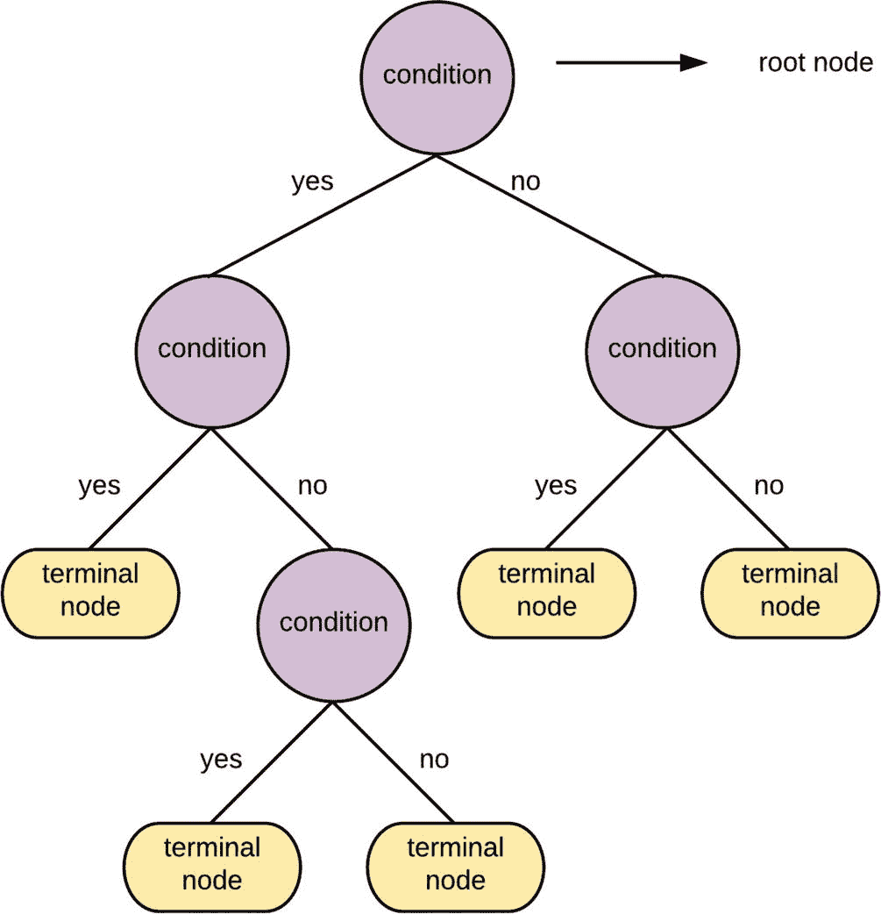

图 23-1

决策树的示意图

### 关于使用 CART 进行回归和分类

分类或回归树是通过将给定数据集的属性集随机分割成不同的区域来构建的。落在特定区域内的数据点用于形成预测器，在回归情况下使用目标值的平均值，在分类设置中使用最常出现的类别。

因此，如果一个未见过的观测值或测试数据落在某个区域，则使用均值或模态类别来预测回归和分类问题的输出。在回归树中，输出变量是连续的，而在分类树中，输出变量是分类的。回归树的终端节点取该区域样本的平均值，而分类树的终端节点是该区域最常出现的类别。

将数据集的特征分割成区域的过程是通过一种称为递归二分分割的贪婪算法来实现的。这种策略通过不断地将特征空间分割成两个新的分支或区域，直到达到停止标准。

### 回归树的生成

在回归树中，使用递归二分分割技术将数据集中的特定特征分割成两个区域。分割是通过选择一个使回归误差度量最小的特征值来进行的。这一步骤通过对所有预测器找到减少最终树平方误差的值来完成。这个过程会持续对每个子树或子区域重复进行，直到达到停止标准。例如，我们可以当没有区域包含少于十个观测值时停止算法。一个将特征空间分割成六个区域的树的例子如图 23-2 所示。

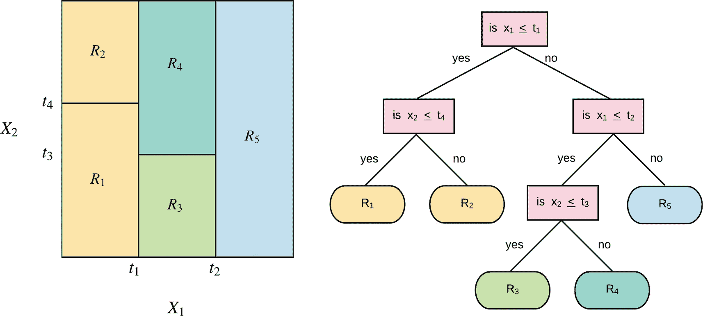

图 23-2

左：使用递归二分分割技术将二维数据集分割成子树/区域的示例。右：左侧分区后的结果树。

### 分类树的生成

构建分类树与图 23-2 中描述的回归树设置非常相似。这里的区别在于要最小化的误差度量不再是平方误差，而是误分类误差。这是因为分类树是用来预测定性响应的，其中数据点根据该区域的众数值或该区域中最常出现的类别被分配到特定区域。

在分类设置中，用于选择用于分割特征空间的值的两种算法是基尼指数和熵；对这些内容的进一步讨论超出了本章的范围。

### 树剪枝

树剪枝是一种处理在生长树时模型过拟合的技术。完全成型的树在应用于未见过的样本时，往往具有高方差和过拟合的高倾向。

剪枝涉及先生长一棵大树，然后对其进行修剪或剪裁以创建子树。通过这样做，我们可以全面了解树的表现，然后选择一个在测试数据集上导致最小化误差测量的子树。选择最佳子树的技术称为成本复杂度剪枝或最弱连接剪枝。

### CART 的优缺点

CART 模型的一个显著优点是它们在线性和非线性数据集上表现良好。此外，CART 模型隐式地处理特征选择，并且与高维数据集配合良好。

相反，CART 模型很容易过拟合数据集，并且无法推广到新的例子。这种缺点通过在随机森林和提升集成算法等技术中聚合大量决策树来减轻。

### 使用 Scikit-learn 的 CART

在本节中，我们将使用 Scikit-learn 实现一个分类和回归决策树分类器。

#### 使用 Scikit-learn 的分类树

在本代码示例中，我们将构建一个分类决策树分类器，用于从 Iris 数据集预测花的种类。

```py
# import packages
from sklearn.tree import DecisionTreeClassifier
from sklearn import datasets
from sklearn.model_selection import train_test_split
from sklearn.metrics import accuracy_score
# load dataset
data = datasets.load_iris()
# separate features and target
X = data.data
y = data.target
# split in train and test sets
X_train, X_test, y_train, y_test = train_test_split(X, y, shuffle=True)
# create the model
tree_classifier = DecisionTreeClassifier()
# fit the model on the training set
tree_classifier.fit(X_train, y_train)
# make predictions on the test set
predictions = tree_classifier.predict(X_test)
# evaluate the model performance using accuracy metric
print("Accuracy: %.2f" % accuracy_score(y_test, predictions))
'Output":
Accuracy: 0.97
```

#### 使用 Scikit-learn 的回归树

在本代码示例中，我们将构建一个回归决策树分类器，用于从波士顿房价数据集预测房价。

```py
# import packages
from sklearn.tree import DecisionTreeRegressor
from sklearn import datasets
from sklearn.model_selection import train_test_split
from sklearn.metrics import mean_squared_error
from math import sqrt
# load dataset
data = datasets.load_boston()
# separate features and target
X = data.data
y = data.target
# split in train and test sets
X_train, X_test, y_train, y_test = train_test_split(X, y, shuffle=True)
# create the model
tree_reg = DecisionTreeRegressor()
# fit the model on the training set
tree_reg.fit(X_train, y_train)
# make predictions on the test set
predictions = tree_reg.predict(X_test)
# evaluate the model performance using the root mean square error metric
print("Root mean squared error: %.2f" % sqrt(mean_squared_error(y_test, predictions)))
'Output':
Root mean squared error: 4.93
```

## 随机森林

随机森林是一种稳健的机器学习算法，并且通常是许多分类和回归问题的首选算法。它是机器学习竞赛中的一种流行算法。

随机森林通过组合多个决策树分类器构建一个集成分类器。这出色地减少了单个决策树分类器中可能存在的方差。

随机森林是对袋装集成算法（也称为自助聚集）的改进，该算法通过反复从训练数据集（也称为自助聚集）中选择随机样本来创建大量完全成型的决策树。然后对这些树的结果进行平均以平滑方差。

随机森林通过在每个树分裂时仅使用训练数据集的特征或属性的一个子集来改进这种袋装过程。通过这样做，随机森林创建了平均更稳健且方差较低的树。

观察到袋装和随机森林之间的主要区别在于分割特征空间或构建树时选择特征的选择。袋装使用数据集中的所有特征，而随机森林对特征数量施加约束，并在每个树分裂时仅使用特征的一个子集来减少每个子树的关联性。经验上，使用随机森林进行每个树分裂的特征大小是原始预测因子数量的平方根。

### 使用随机森林进行预测

为了使用随机森林进行预测，测试示例将通过每个训练好的决策树。对于回归情况，通过取不同树的输出的平均值来对新示例进行预测。在分类问题的情况下，预测是森林中所有其他树投票最多的类别。这最好在图 23-3 中说明。

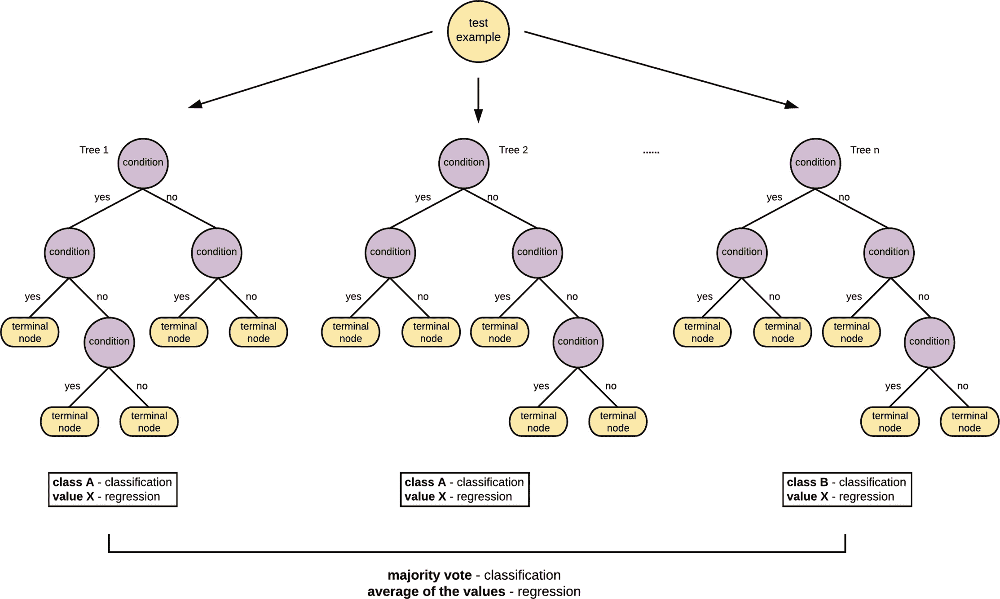

图 23-3

在分类情况下，通过多数投票来确定最终类别，在回归情况下，通过确定每个树中的值的平均值来确定预测值。

### 使用 Scikit-learn 的随机森林

本节将使用 Scikit-learn 实现随机森林，用于回归和分类用例。

#### 用于分类的随机森林

在本代码示例中，我们将构建一个随机森林分类模型，用于从 Iris 数据集中预测花的种类。

```py
# import packages
from sklearn.ensemble import RandomForestClassifier
from sklearn import datasets
from sklearn.model_selection import train_test_split
from sklearn.metrics import accuracy_score
# load dataset
data = datasets.load_iris()
# separate features and target
X = data.data
y = data.target
# split in train and test sets
X_train, X_test, y_train, y_test = train_test_split(X, y, shuffle=True)
# create the model
rf_classifier = RandomForestClassifier()
# fit the model on the training set
rf_classifier.fit(X_train, y_train)
# make predictions on the test set
predictions = rf_classifier.predict(X_test)
# evaluate the model performance using accuracy metric
print("Accuracy: %.2f" % accuracy_score(y_test, predictions))
'Output":
Accuracy: 1.00
```

#### 用于回归的随机森林

在本代码示例中，我们将构建一个随机森林回归模型，用于从波士顿房价数据集中预测房价。

```py
# import packages
from sklearn.ensemble import RandomForestRegressor
from sklearn import datasets
from sklearn.model_selection import train_test_split
from sklearn.metrics import mean_squared_error
from math import sqrt
# load dataset
data = datasets.load_boston()
# separate features and target
X = data.data
y = data.target
# split in train and test sets
X_train, X_test, y_train, y_test = train_test_split(X, y, shuffle=True)
# create the model
rf_reg = RandomForestRegressor()
# fit the model on the training set
rf_reg.fit(X_train, y_train)
# make predictions on the test set
predictions = rf_reg.predict(X_test)
# evaluate the model performance using the root mean square error metric
print("Root mean squared error: %.2f" % sqrt(mean_squared_error(y_test, predictions)))
'Output':
Root mean squared error: 2.96
```

## 随机梯度提升（SGB）

提升涉及使用先前生长的树的残差知识连续生长树。在这种情况下，每个后续树都致力于通过提升先前树未表现良好的区域来改进先前树的模型，而不影响表现良好的区域。通过这样做，我们迭代创建一个模型，该模型在推广到测试示例时减少了残差方差。提升在图 23-4 中说明。

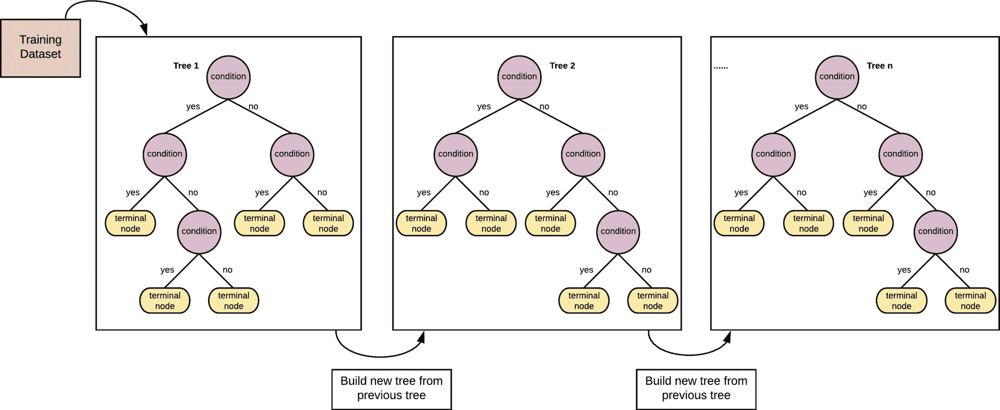

图 23-4

提升的示意图

梯度提升评估每个树的残差差异，然后使用该信息来确定如何在前一个树中分割特征空间。

梯度提升在计算残差时使用伪梯度。这个梯度是损失函数最快改进的方向。随着梯度向最陡下降方向移动，残差方差最小化。这种移动与第十六章中讨论的随机梯度下降算法相同。

### 树深度/树的数量

通过选择树深度作为模型的超参数来控制梯度提升。在实践中，树深度为 1 表现良好，因为每棵树只包含一个分割。此外，树的数量也会影响模型精度，因为梯度提升如果连续树的数量很大，可能会导致过拟合。

### 收敛

收敛超参数*λ*控制梯度提升模型的 学习率。任意小的*λ*值可能需要更多的树来获得良好的模型性能。然而，在小的收敛大小和树深度*d* = 1 的情况下，通过创建更多样化的树来改善模型表现最差的区域，残差会逐渐改善。经验法则：收敛大小为 0.01 或 0.001。

### Scikit-learn 中的随机梯度提升

本节将使用 Scikit-learn 实现 SGB，用于回归和分类用例。

#### SGB 分类

在本代码示例中，我们将构建一个 SGB 分类模型，用于从鸢尾花数据集中预测花的种类。

```py
# import packages
from sklearn.ensemble import GradientBoostingClassifier
from sklearn import datasets
from sklearn.model_selection import train_test_split
from sklearn.metrics import accuracy_score
# load dataset
data = datasets.load_iris()
# separate features and target
X = data.data
y = data.target
# split in train and test sets
X_train, X_test, y_train, y_test = train_test_split(X, y, shuffle=True)
# create the model
sgb_classifier = GradientBoostingClassifier()
# fit the model on the training set
sgb_classifier.fit(X_train, y_train)
# make predictions on the test set
predictions = sgb_classifier.predict(X_test)
# evaluate the model performance using accuracy metric
print("Accuracy: %.2f" % accuracy_score(y_test, predictions))
'Output":
Accuracy: 0.92
```

#### SGB 回归

在本代码示例中，我们将构建一个 SGB 回归模型，用于从波士顿房价数据集中预测房价。

```py
# import packages
from sklearn.ensemble import GradientBoostingRegressor
from sklearn import datasets
from sklearn.model_selection import train_test_split
from sklearn.metrics import mean_squared_error
from math import sqrt
# load dataset
data = datasets.load_boston()
# separate features and target
X = data.data
y = data.target
# split in train and test sets
X_train, X_test, y_train, y_test = train_test_split(X, y, shuffle=True)
# create the model
sgb_reg = GradientBoostingRegressor ()
# fit the model on the training set
sgb_reg.fit(X_train, y_train)
# make predictions on the test set
predictions = sgb_reg.predict(X_test)
# evaluate the model performance using the root mean square error metric
print("Root mean squared error: %.2f" % sqrt(mean_squared_error(y_test, predictions)))
'Output':
Root mean squared error: 2.86
```

## XGBoost（极端梯度提升）

XGBoost，即极端梯度提升，对随机梯度提升算法进行了一些计算和算法上的修改。这种增强算法在机器学习实践中非常受欢迎，因其速度而著称，并且在许多机器学习竞赛中都是获胜算法。让我们来看看 XGBoost 算法所做的修改。

1.  并行训练：XGBoost 支持在多个核心上并行训练。这使得 XGBoost 与其他机器学习算法相比速度极快。

1.  核外计算：XGBoost 便于从未加载到内存中的数据训练。当你处理可能无法适应计算机 RAM 的大型数据集时，这个特性是一个巨大的优势。

1.  稀疏数据优化：XGBoost 经过优化，可以处理和加速稀疏矩阵的计算。稀疏矩阵在其单元格中包含大量零。

### XGBoost 与 Scikit-learn

本节将使用 Scikit-learn 实现 XGBoost，用于回归和分类用例。

#### XGBoost 分类

在本代码示例中，我们将构建一个 XGBoost 分类模型，用于从鸢尾花数据集中预测花的种类。

```py
# import packages
from xgboost import XGBClassifier
from sklearn import datasets
from sklearn.model_selection import train_test_split
from sklearn.metrics import accuracy_score
# load dataset
data = datasets.load_iris()
# separate features and target
X = data.data
y = data.target
# split in train and test sets
X_train, X_test, y_train, y_test = train_test_split(X, y, shuffle=True)
# create the model
xgboost_classifier = XGBClassifier()
# fit the model on the training set
xgboost_classifier.fit(X_train, y_train)
# make predictions on the test set
predictions = xgboost_classifier.predict(X_test)
# evaluate the model performance using accuracy metric
print("Accuracy: %.2f" % accuracy_score(y_test, predictions))
'Output":
Accuracy: 0.95
```

#### XGBoost 回归

在本代码示例中，我们将构建一个 XGBoost 回归模型，用于从波士顿房价数据集中预测房价。

```py
# import packages
from xgboost import XGBRegressor
from sklearn import datasets
from sklearn.model_selection import train_test_split
from sklearn.metrics import mean_squared_error
from math import sqrt
# load dataset
data = datasets.load_boston()
# separate features and target
X = data.data
y = data.target
# split in train and test sets
X_train, X_test, y_train, y_test = train_test_split(X, y, shuffle=True)
# create the model
xgboost_reg = XGBRegressor()
# fit the model on the training set
xgboost_reg.fit(X_train, y_train)
# make predictions on the test set
predictions = xgboost_reg.predict(X_test)
# evaluate the model performance using the root mean square error metric
print("Root mean squared error: %.2f" % sqrt(mean_squared_error(y_test, predictions)))
'Output':
Root mean squared error: 3.69
```

在本章中，我们调查并实现了结合弱决策树学习器以创建用于学习回归和分类问题的强大分类器的集成机器学习算法。在下一章中，我们将讨论更多使用 Scikit-learn 实现监督机器学习模型的技巧。

# 24. 使用 Scikit-learn 的更多监督机器学习技术

本章将涵盖使用 Scikit-learn 通过以下技术实现机器学习模型：

+   特征工程

+   重采样方法

+   模型评估方法

+   流程化机器学习工作流程的管道

+   模型调优技术

## 特征工程

特征工程是系统地选择数据集中对学习问题有用且相关的特征集的过程。通常情况下，无关特征会负面影响模型的性能。本节将回顾 Scikit-learn 中实现的选择数据集中相关特征的一些技术。调查的技术包括

+   使用**SelectKBest**模块选择最佳*k*特征的统计测试

+   递归特征消除（RFE）从数据集中递归地移除无关特征

+   主成分分析以选择解释数据集变化的成分

+   使用集成或树分类器的特征重要性

### 使用 SelectKBest 模块选择最佳***k***特征的统计测试

以下列表是使用**SelectKBest**的统计测试的选择。选择取决于数据集的目标变量是数值还是分类：

+   ANOVA F 值，**f_classif**（分类）

+   非负特征的卡方统计量，**chi2**（分类）

+   F 值，**f_regression**（回归）

+   对于连续目标，互信息**mutual_info_regression**（回归）

让我们通过使用卡方测试来选择最佳变量看看一个例子。

```py
# import packages
from sklearn import datasets
from sklearn.feature_selection import SelectKBest
from sklearn.feature_selection import chi2
# load dataset
data = datasets.load_iris()
# separate features and target
X = data.data
y = data.target
# display first 5 rows
X[0:5,:]
# feature engineering. Let's see the best 3 features by setting k = 3
kBest_chi = SelectKBest(score_func=chi2, k=3)
fit_test = kBest_chi.fit(X, y)
# print test scores
fit_test.scores_
'Output': array([ 10.81782088,   3.59449902, 116.16984746,  67.24482759])
```

从测试分数中，数据集中排名前 3 的重要特征从特征 3 到 4 到 1，再到 2。数据科学家可以选择删除第二列，并观察对模型性能的影响。

我们可以将数据集转换为仅包含重要特征的子集。

```py
adjusted_features = fit_test.transform(X)
adjusted_features[0:5,:]
'Output':
array([[5.1, 1.4, 0.2],
[4.9, 1.4, 0.2],
[4.7, 1.3, 0.2],
[4.6, 1.5, 0.2],
[5\. , 1.4, 0.2]])
```

结果删除了数据集的第二列。

### 递归特征消除（RFE）

RFE 与学习模型一起使用，以递归地选择所需数量的表现最佳特征。

让我们使用**LinearRegression**与 RFE 结合。

```py
# import packages
from sklearn.feature_selection import RFE
from sklearn.linear_model import LinearRegression
from sklearn import datasets
# load dataset
data = datasets.load_boston()
# separate features and target
X = data.data
y = data.target
# feature engineering
linear_reg = LinearRegression()
rfe = RFE(estimator=linear_reg, n_features_to_select=6)
rfe_fit = rfe.fit(X, y)
# print the feature ranking
rfe_fit.ranking_
'Output': array([3, 5, 4, 1, 1, 1, 8, 1, 2, 6, 1, 7, 1])
```

从结果来看，波士顿数据集中的第 4、5、6、8、11 和 13 个特征是前 6 个最佳特征。

### 特征重要性

Scikit-learn 中的基于树或集成方法具有**feature_importances_**属性，可以用于通过包含在**sklearn.feature_selection**包中的**SelectFromModel**模块来从数据集中删除无关特征。

让我们在这个例子中使用集成方法**AdaBoostClassifier**。

```py
# import packages
from sklearn.ensemble import AdaBoostClassifier
from sklearn.feature_selection import SelectFromModel
from sklearn import datasets
# load dataset
data = datasets.load_iris()
# separate features and target
X = data.data
y = data.target
# original data shape
X.shape
# feature engineering
ada_boost_classifier = AdaBoostClassifier()
ada_boost_classifier.fit(X, y)
'Output':
AdaBoostClassifier(algorithm='SAMME.R', base_estimator=None,
learning_rate=1.0, n_estimators=50, random_state=None)
# print the feature importances
ada_boost_classifier.feature_importances_
'Output': array([0\.  , 0\.  , 0.58, 0.42])
# create a subset of data based on the relevant features
model = SelectFromModel(ada_boost_classifier, prefit=True)
new_data = model.transform(X)
# the irrelevant features have been removed
new_data.shape
'Output': (150, 2)
```

## 重采样方法

重采样方法是一组涉及选择可用数据集的子集、在该数据子集上训练，并使用数据剩余部分来评估训练模型的技术的集合。让我们回顾使用 Scikit-learn 进行重采样技术的技巧。本节涵盖

+   k 折交叉验证

+   留一法交叉验证

### k 折交叉验证

在 k 折交叉验证中，数据集被分成 k 部分或折。模型使用 k-1 折进行训练，并在剩余的第 k 折上进行评估。这个过程重复 k 次，以便每个折都可以作为测试集。在过程结束时，k 折平均结果并报告一个平均分数和标准差。Scikit-learn 在**KFold**模块中实现了 K 折 CV。**cross_val_score**模块用于使用分割策略评估交叉验证分数，在这种情况下是**KFold**。

让我们通过 k 近邻（kNN）分类算法的例子来看看这个。当初始化**KFold**时，在分割之前对数据进行洗牌是标准做法。

```py
from sklearn.model_selection import KFold
from sklearn.model_selection import cross_val_score
from sklearn.neighbors import KNeighborsClassifier
# load dataset
data = datasets.load_iris()
# separate features and target
X = data.data
y = data.target
# initialize KFold - with shuffle = True, shuffle the data before splitting
kfold = KFold(n_splits=3, shuffle=True)
# create the model
knn_clf = KNeighborsClassifier(n_neighbors=3)
# fit the model using cross validation
cv_result = cross_val_score(knn_clf, X, y, cv=kfold)
# evaluate the model performance using accuracy metric
print("Accuracy: %.3f%% (%.3f%%)" % (cv_result.mean()*100.0, cv_result.std()*100.0))
'Output':
Accuracy: 93.333% (2.494%)
```

### 留一法交叉验证（LOOCV）

在 LOOCV 中，仅将一个示例分配给测试集，并在数据集的其余部分上训练模型。这个过程对数据集中的所有示例重复进行。这个过程一直重复，直到数据集中的所有示例都用于评估模型。

```py
from sklearn.model_selection import LeaveOneOut
from sklearn.model_selection import cross_val_score
from sklearn.neighbors import KNeighborsClassifier
# load dataset
data = datasets.load_iris()
# separate features and target
X = data.data
y = data.target
# initialize LOOCV
loocv = LeaveOneOut()
# create the model
knn_clf = KNeighborsClassifier(n_neighbors=3)
# fit the model using cross validation
cv_result = cross_val_score(knn_clf, X, y, cv=loocv)
# evaluate the model performance using accuracy metric
print("Accuracy: %.3f%% (%.3f%%)" % (cv_result.mean()*100.0, cv_result.std()*100.0))
'Output':
Accuracy: 96.000% (19.596%)
```

## 模型评估

本章已经使用了一些评估指标来评估拟合模型的质量。在本节中，我们调查了其他一些用于回归和分类用例的指标以及如何使用 Scikit-learn 实现它们。对于每个指标，我们展示了如何将它们作为独立实现使用，以及与使用**cross_val_score**方法的交叉验证一起使用。

我们在这里将涵盖的内容包括

回归评估指标

+   均方误差（MSE）：预测标签ŷ与真实标签 y 之间平方差的平均值。得分为 0 表示没有错误的无误预测。

+   均方绝对误差（MAE）：预测标签ŷ与真实标签 y 之间的平均绝对差。得分为 0 表示没有错误的无误预测。

+   R²：模型解释的数据集中的方差或变异性。得分为 1 表示模型完美地捕捉了数据集中的变异性。

分类评估指标

+   准确率：是正确预测与总预测数的比率。准确率越大，模型越好。

+   对数损失（也称为逻辑损失或交叉熵损失）：是观察值被正确分配到类别标签的概率。通过最小化对数损失，相反，可以最大化准确率。因此，在这个指标中，接近零的值是好的。

+   ROC 曲线下的面积（AUC-ROC）：用于二元分类情况。未提供实现，但风格与其它类似。

+   混淆矩阵：在二元分类情况下更直观。未提供实现，但风格与其它类似。

+   分类报告：返回主要分类指标的文本报告。

### 回归评估指标

以下代码是一个独立实现的回归评估指标的示例。

```py
# import packages
from sklearn.linear_model import LinearRegression
from sklearn import datasets
from sklearn.model_selection import train_test_split
from sklearn.metrics import mean_squared_error
from sklearn.metrics import mean_absolute_error
from sklearn.metrics import r2_score
# load dataset
data = datasets.load_boston()
# separate features and target
X = data.data
y = data.target
# split in train and test sets
X_train, X_test, y_train, y_test = train_test_split(X, y, shuffle=True)
# create the model
# setting normalize to true normalizes the dataset before fitting the model
linear_reg = LinearRegression(normalize = True)
# fit the model on the training set
linear_reg.fit(X_train, y_train)
'Output': LinearRegression(copy_X=True, fit_intercept=True, n_jobs=1, normalize=True)
# make predictions on the test set
predictions = linear_reg.predict(X_test)
# evaluate the model performance using mean square error metric
print("Mean squared error: %.2f" % mean_squared_error(y_test, predictions))
'Output':
Mean squared error: 14.46
# evaluate the model performance using mean absolute error metric
print("Mean absolute error: %.2f" % mean_absolute_error(y_test, predictions))
'Output':
Mean absolute error: 3.63
# evaluate the model performance using r-squared error metric
print("R-squared score: %.2f" % r2_score(y_test, predictions))
'Output':
R-squared score: 0.69
```

以下代码是一个使用交叉验证实现的回归评估指标的示例。交叉验证中的 MSE 和 MAE 指标实现了符号反转。简单来说，就是越接近零，模型越好。

```py
from sklearn.linear_model import LinearRegression
from sklearn.model_selection import KFold
from sklearn.model_selection import cross_val_score
# load dataset
data = datasets.load_boston()
# separate features and target
X = data.data
y = data.target
# initialize KFold - with shuffle = True, shuffle the data before splitting
kfold = KFold(n_splits=3, shuffle=True)
# create the model
linear_reg = LinearRegression(normalize = True)
# fit the model using cross validation - score with Mean square error (MSE)
mse_cv_result = cross_val_score(linear_reg, X, y, cv=kfold, scoring="neg_mean_squared_error")
# print mse cross validation output
print("Negative Mean squared error: %.3f%% (%.3f%%)" % (mse_cv_result.mean(), mse_cv_result.std()))
'Output':
Negtive Mean squared error: -24.275% (4.093%)
# fit the model using cross validation - score with Mean absolute error (MAE)
mae_cv_result = cross_val_score(linear_reg, X, y, cv=kfold, scoring="neg_mean_absolute_error")
# print mse cross validation output
print("Negtive Mean absolute error: %.3f%% (%.3f%%)" % (mae_cv_result.mean(), mae_cv_result.std()))
'Output':
Negtive Mean absolute error: -3.442% (4.093%)
# fit the model using cross validation - score with R-squared
r2_cv_result = cross_val_score(linear_reg, X, y, cv=kfold, scoring="r2")
# print mse cross validation output
print("R-squared score: %.3f%% (%.3f%%)" % (r2_cv_result.mean(), r2_cv_result.std()))
'Output':
R-squared score: 0.707% (0.030%)
```

### 分类评估指标

以下代码是一个独立实现的分类评估指标的示例。

```py
# import packages
from sklearn.linear_model import LogisticRegression
from sklearn import datasets
from sklearn.model_selection import train_test_split
from sklearn.metrics import accuracy_score
from sklearn.metrics import log_loss
from sklearn.metrics import classification_report
# load dataset
data = datasets.load_iris()
# separate features and target
X = data.data
y = data.target
# split in train and test sets
X_train, X_test, y_train, y_test = train_test_split(X, y, shuffle=True)
# create the model
logistic_reg = LogisticRegression()
# fit the model on the training set
logistic_reg.fit(X_train, y_train)
'Output':
LogisticRegression(C=1.0, class_weight=None, dual=False, fit_intercept=True,
intercept_scaling=1, max_iter=100, multi_class="ovr", n_jobs=1,
penalty='l2', random_state=None, solver="liblinear", tol=0.0001,
verbose=0, warm_start=False)
# make predictions on the test set
predictions = logistic_reg.predict(X_test)
# evaluate the model performance using accuracy
print("Accuracy score: %.2f" % accuracy_score(y_test, predictions))
'Output':
Accuracy score: 0.89
# evaluate the model performance using log loss
### output the probabilities of assigning an observation to a class
predictions_probabilities = logistic_reg.predict_proba(X_test)
print("Log-Loss likelihood: %.2f" % log_loss(y_test, predictions_probabilities))
'Output':
Log-Loss likelihood: 0.39
# evaluate the model performance using classification report
print("Classification report: \n", classification_report(y_test, predictions, target_names=data.target_names))
'Output':
Classification report:
precision    recall  f1-score   support
setosa       1.00      1.00      1.00        12
versicolor       0.85      0.85      0.85        13
virginica       0.85      0.85      0.85        13
avg / total       0.89      0.89      0.89        38
```

让我们看看一个使用交叉验证实现的分类评估指标的示例。使用交叉验证实现的 log-loss 评估指标也实现了符号反转。简单来说，就是越接近零，模型越好。

```py
from sklearn.linear_model import LogisticRegression
from sklearn.model_selection import KFold
from sklearn.model_selection import cross_val_score
# load dataset
data = datasets.load_iris()
# separate features and target
X = data.data
y = data.target
# initialize KFold - with shuffle = True, shuffle the data before splitting
kfold = KFold(n_splits=3, shuffle=True)
# create the model
logistic_reg = LogisticRegression()
# fit the model using cross validation - score with accuracy
accuracy_cv_result = cross_val_score(logistic_reg, X, y, cv=kfold, scoring="accuracy")
# print accuracy cross validation output
print("Accuracy: %.3f%% (%.3f%%)" % (accuracy_cv_result.mean(), accuracy_cv_result.std()))
'Output':
Accuracy: 0.953% (0.025%)
# fit the model using cross validation - score with Log-Loss
logloss_cv_result = cross_val_score(logistic_reg, X, y, cv=kfold, scoring="neg_log_loss")
# print mse cross validation output
print("Log-Loss likelihood: %.3f%% (%.3f%%)" % (logloss_cv_result.mean(), logloss_cv_result.std()))
'Output':
Log-Loss likelihood: -0.348% (0.027%)
```

## 管道：简化机器学习工作流程

Scikit-learn 中的管道概念是将一系列操作链接在一起以形成整洁的数据转换流程的强大工具。构成管道的操作可以是 Scikit-learn 的任何转换器（即具有**fit**和**transform**方法或**fit_transform**方法的模块）或分类器（即具有**fit**和**predict**方法或**fit_predict**方法的模块）。分类器也称为预测器。

对于典型的机器学习工作流程，所采取的步骤可能包括数据清理、特征工程、缩放数据集，然后拟合模型。在这种情况下，可以使用管道将这些操作链接成一个连贯的工作流程。它们的优势在于提供了一个方便且一致的接口，可以一次性调用一系列操作。

这些转换器或预测器在 Scikit-learn 术语中统称为估计器。在最后两段中，我们称它们为操作。

管道的另一个优点是它可以防止意外地将转换应用于整个数据集，从而在训练过程中将受测试数据影响的统计信息泄露到机器学习模型中。例如，如果标准化器在整个数据集上拟合，则测试集将受到影响，因为测试观测值在估计用于缩放训练集的均值和标准差时已经做出了贡献。

最后，管道的最后一步只能是一个分类器或预测器。除了最后一步，管道的所有阶段都必须包含一个**transform**方法，最后一步可以是转换器或分类器。

要开始使用 Scikit-learn 管道，首先导入

```py
from sklearn.pipeline import Pipeline
```

让我们看看 Scikit-learn 中使用 Pipeline 的几个示例。在下面的示例中，我们将应用缩放转换来标准化我们的数据集，然后使用支持向量机分类器来训练模型。

```py
# import packages
from sklearn.svm import SVC
from sklearn import datasets
from sklearn.model_selection import KFold
from sklearn.model_selection import cross_val_score
from sklearn.preprocessing import StandardScaler
from sklearn.pipeline import Pipeline
# load dataset
data = datasets.load_iris()
# separate features and target
X = data.data
y = data.target
# create the pipeline
estimators = [
('standardize' , StandardScaler()),
('svc', SVC())
]
# build the pipeline model
pipe = Pipeline(estimators)
# run the pipeline
kfold = KFold(n_splits=3, shuffle=True)
cv_result = cross_val_score(pipe, X, y, cv=kfold)
# evaluate the model performance
print("Accuracy: %.3f%% (%.3f%%)" % (cv_result.mean()*100.0, cv_result.std()*100.0))
'Output':
Accuracy: 94.667% (0.943%)
```

### 使用 make_pipeline 的 Pipeline

构建机器学习 Pipeline 的另一种方法是使用 **make_pipeline** 方法。在下一个示例中，我们使用 PCA 来选择最佳六个特征并降低数据集的维度，然后我们将使用随机森林进行回归来拟合模型。

```py
from sklearn.pipeline import make_pipeline
from sklearn.svm import SVR
from sklearn import datasets
from sklearn.model_selection import KFold
from sklearn.model_selection import cross_val_score
from sklearn.decomposition import PCA
from sklearn.pipeline import Pipeline
from sklearn.ensemble import RandomForestRegressor
# load dataset
data = datasets.load_boston()
# separate features and target
X = data.data
y = data.target
# build the pipeline model
pipe = make_pipeline(
PCA(n_components=9),
RandomForestRegressor()
)
# run the pipeline
kfold = KFold(n_splits=4, shuffle=True)
cv_result = cross_val_score(pipe, X, y, cv=kfold)
# evaluate the model performance
print("Accuracy: %.3f%% (%.3f%%)" % (cv_result.mean()*100.0, cv_result.std()*100.0))
'Output':
Accuracy: 73.750% (2.489%)
```

### 使用 FeatureUnion 的 Pipeline

Scikit-learn 提供了一个名为 **feature_union** 的模块，用于合并多个转换器的输出。它通过独立地将每个转换器拟合到数据集，然后将各自的输出组合起来形成一个用于训练模型的转换数据集来实现这一点。

FeatureUnion 的工作方式与 Pipeline 相同，在许多方面可以将其视为在 Pipeline 内构建复杂 Pipeline 的手段。

让我们通过使用 FeatureUnion 的示例来查看。在这里，我们将结合递归特征消除 (RFE) 和 PCA 的输出进行特征工程，然后我们将应用随机梯度提升 (SGB) 集成模型进行回归以训练模型。

```py
from sklearn.ensemble import GradientBoostingRegressor
from sklearn.ensemble import RandomForestRegressor
from sklearn import datasets
from sklearn.model_selection import KFold
from sklearn.model_selection import cross_val_score
from sklearn.feature_selection import RFE
from sklearn.decomposition import PCA
from sklearn.pipeline import Pipeline
from sklearn.pipeline import make_pipeline
from sklearn.pipeline import make_union
# load dataset
data = datasets.load_boston()
# separate features and target
X = data.data
y = data.target
# construct pipeline for feature engineering - make_union similar to make_pipeline
feature_engr = make_union(
RFE(estimator=RandomForestRegressor(n_estimators=100), n_features_to_select=6),
PCA(n_components=9)
)
# build the pipeline model
pipe = make_pipeline(
feature_engr,
GradientBoostingRegressor(n_estimators=100)
)
# run the pipeline
kfold = KFold(n_splits=4, shuffle=True)
cv_result = cross_val_score(pipe, X, y, cv=kfold)
# evaluate the model performance
print("Accuracy: %.3f%% (%.3f%%)" % (cv_result.mean()*100.0, cv_result.std()*100.0))
'Output':
Accuracy: 88.956% (1.493%)
```

## 模型调优

每个机器学习模型都有一组选项或配置，可以在拟合数据时调整以优化模型。这些配置被称为 **超参数**。因此，对于每个超参数，都存在一个可以选择的值范围。考虑到算法拥有的超参数数量，整个空间可以呈指数级增长，探索所有这些值变得不可行。Scikit-learn 提供了两个方便的模块，用于搜索算法的超参数空间，以找到每个超参数的最佳值，从而优化模型。

这些模块是

+   网格搜索

+   随机搜索

### 网格搜索

网格搜索全面探索了估计器指定的所有超参数值。它使用 **GridSearchCV** 模块实现。让我们通过使用随机森林进行回归的示例来查看。我们将搜索以下超参数：

+   森林中的树的数量，**n_estimators**

+   树的最大深度，**max_depth**

+   分裂内部节点所需的最小样本数，**min_samples_leaf**

```py
from sklearn.model_selection import GridSearchCV
from sklearn.ensemble import RandomForestRegressor
from sklearn import datasets
# load dataset
data = datasets.load_boston()
# separate features and target
X = data.data
y = data.target
# construct grid search parameters in a dictionary
parameters = {
'n_estimators': [2, 4, 6, 8, 10, 12, 14, 16],
'max_depth': [2, 4, 6, 8],
'min_samples_leaf': [1,2,3,4,5]
}
# create the model
rf_model = RandomForestRegressor()
# run the grid search
grid_search = GridSearchCV(estimator=rf_model, param_grid=parameters)
# fit the model
grid_search.fit(X,y)
'Output':
GridSearchCV(cv=None, error_score="raise",
estimator=RandomForestRegressor(bootstrap=True, criterion="mse", max_depth=None,
max_features='auto', max_leaf_nodes=None,
min_impurity_decrease=0.0, min_impurity_split=None,
min_samples_leaf=1, min_samples_split=2,
min_weight_fraction_leaf=0.0, n_estimators=10, n_jobs=1,
oob_score=False, random_state=None, verbose=0, warm_start=False),
fit_params=None, iid=True, n_jobs=1,
param_grid={'n_estimators': [2, 4, 6, 8, 10, 12, 14, 16], 'max_depth': [2, 4, 6, 8], 'min_samples_leaf': [1, 2, 3, 4, 5]},
pre_dispatch='2*n_jobs', refit=True, return_train_score="warn",
scoring=None, verbose=0)
# evaluate the model performance
print("Best Accuracy: %.3f%%" %  (grid_search.best_score_*100.0))
'Output':
Best Accuracy: 57.917%
# best set of hyper-parameter values
print("Best n_estimators: %d \nBest max_depth: %d \nBest min_samples_leaf: %d " %  \
(grid_search.best_estimator_.n_estimators, \
grid_search.best_estimator_.max_depth, \
grid_search.best_estimator_.min_samples_leaf))
'Output':
Best n_estimators: 14
Best max_depth: 8
Best min_samples_leaf: 1
```

### 随机搜索

与网格搜索不同，并非所有提供的超参数值都会被评估，而是从随机均匀分布中采样确定数量的超参数值。可以评估的超参数值的数量由 **RandomizedSearchCV** 模块的 **n_iter** 属性确定。

在这个示例中，我们将使用与网格搜索案例相同的场景。

```py
from sklearn.model_selection import RandomizedSearchCV
from sklearn.ensemble import RandomForestRegressor
from sklearn import datasets
# load dataset
data = datasets.load_boston()
# separate features and target
X = data.data
y = data.target
# construct grid search parameters in a dictionary
parameters = {
'n_estimators': [2, 4, 6, 8, 10, 12, 14, 16],
'max_depth': [2, 4, 6, 8],
'min_samples_leaf': [1,2,3,4,5]
}
# create the model
rf_model = RandomForestRegressor()
# run the grid search
randomized_search = RandomizedSearchCV(estimator=rf_model, param_distributions=parameters, n_iter=10)
# fit the model
randomized_search.fit(X,y)
'Output':
RandomizedSearchCV(cv=None, error_score="raise",
estimator=RandomForestRegressor(bootstrap=True, criterion="mse", max_depth=None,
max_features='auto', max_leaf_nodes=None,
min_impurity_decrease=0.0, min_impurity_split=None,
min_samples_leaf=1, min_samples_split=2,
min_weight_fraction_leaf=0.0, n_estimators=10, n_jobs=1,
oob_score=False, random_state=None, verbose=0, warm_start=False),
fit_params=None, iid=True, n_iter=10, n_jobs=1,
param_distributions={'n_estimators': [2, 4, 6, 8, 10, 12, 14, 16], 'max_depth': [2, 4, 6, 8], 'min_samples_leaf': [1, 2, 3, 4, 5]},
pre_dispatch='2*n_jobs', random_state=None, refit=True,
return_train_score='warn', scoring=None, verbose=0)
# evaluate the model performance
print("Best Accuracy: %.3f%%" %  (randomized_search.best_score_*100.0))
'Output':
Best Accuracy: 57.856%
# best set of hyper-parameter values
print("Best n_estimators: %d \nBest max_depth: %d \nBest min_samples_leaf: %d " %  \
(randomized_search.best_estimator_.n_estimators, \
randomized_search.best_estimator_.max_depth, \
randomized_search.best_estimator_.min_samples_leaf))
'Output':
Best n_estimators: 12
Best max_depth: 6
Best min_samples_leaf: 5
```

本章进一步探讨了使用 Scikit-learn 集成其他机器学习技术，如特征选择和重采样方法，以开发更稳健的机器学习方法。在下一章中，我们将检查我们的第一个无监督机器学习方法，聚类，以及使用 Scikit-learn 的实现。

# 25. 聚类

聚类是一种无监督的机器学习技术，用于将同质数据点分组到称为聚类的分区中。如图 25-1 所示的示例数据集中，假设我们有一组 *n* 个点和 2 个特征。可以将聚类算法应用于确定数据样本中不同子类或组之间的数量。

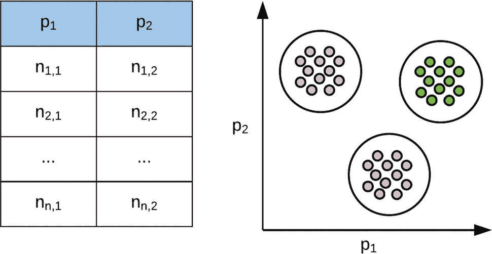

图 25-1

2 维空间中聚类的示意图

如图 25-1 所示，对二维数据集进行聚类相对简单。真正的挑战出现在我们需要在更高维度的空间中进行聚类时。现在的问题是，我们如何确定或找出点集是否相似，或者点集是否应该属于同一组？在本节中，我们将介绍两种基本的聚类算法，即 k-means 聚类和层次聚类。

当预先知道预期的不同类别或子组的数量时，使用 *K*-means 聚类。在层次聚类中，确切的聚类数量是未知的，算法的任务是在数据集中找到最佳数量的异质子组。

## *K*-Means 聚类

k-Means 聚类是实践中最著名且最广泛使用的聚类算法之一。它通过使用距离度量（最常见的是欧几里得距离）来迭代地将超空间中的数据点分配到一组非重叠的聚类中。

在 *K*-means 中，预期的聚类数量 *K* 在一开始就被选定。聚类通过任意选择数据点中的一个作为每个 *K* 的初始聚类来初始化。算法现在通过迭代地将空间中的每个点分配到最近的聚类质心，使用距离度量来完成工作。

在所有点都被分配到它们最近的聚类点之后，聚类质心被调整以在聚类中的点之间找到新的中心。这个过程会重复进行，直到算法收敛，即聚类质心稳定，点在每次重新分配后不会轻易交换聚类。这些步骤在图 25-2 中进行了说明。

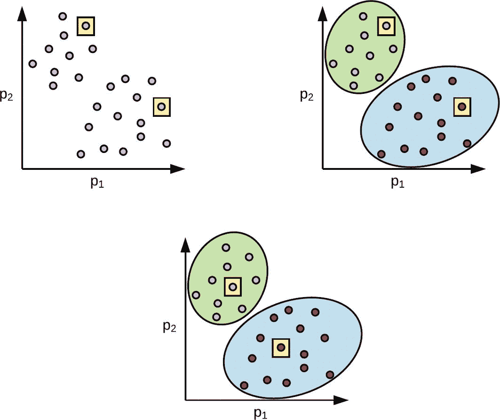

图 25-2

当 *k* = 2 时的 k-means 聚类示例。左上角：随机为每个 *k* 选择一个点。右上角：迭代地将每个点分配到最近的聚类质心。底部：更新每个 *k* 聚类的聚类质心。通常，我们重复迭代分配所有点并更新聚类质心，直到算法在稳定的聚类中收敛。

### 选择 *K* 的注意事项

真的没有方法可以从一开始就确定数据集中聚类的数量。选择 *k* 的最佳方法是通过尝试不同的 *K* 值，看看哪个值在创建不同的聚类中效果最好。

另一种在实践中广泛应用的策略是计算所有聚类中点到聚类质心的平均距离。随着我们逐渐增加 *K* 的值，这个估计值被绘制在图表上。我们观察到，随着 *K* 的增加，点与其聚类质心的距离逐渐减小，生成的曲线类似于手臂的肘部。从实践中，我们在肘部之后选择 *K* 的值作为该数据集的最佳 *K* 值。这种方法被称为选择 *K* 的肘部方法，如图 25-3 所示。

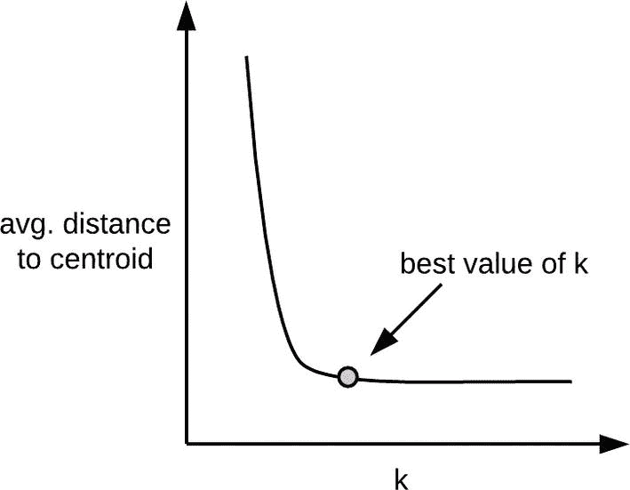

图 25-3

选择最佳 k 值的肘部方法

### 分配初始 *K* 点的注意事项

确定初始 *K* 值的点对于找到一组好的聚类非常重要。通过随机选择 *K* 的点，两个或多个点可能位于同一个聚类中，这不可避免地会导致结果不佳。为了减轻这种情况，我们可以采用更复杂的方法来选择 *K* 的值。一种常见的策略是随机选择第一个 *K* 点，然后选择下一个点作为与第一个选定点距离最远的点。重复此策略，直到所有 *K* 点都被选中。另一种方法是运行数据集子样本的层次聚类（这是因为层次聚类是一个计算成本较高的算法），并使用截断树状图后的聚类数量作为 *K* 的值。

## 使用 Scikit-learn 的 K-Means 聚类

此示例实现了使用 Scikit-learn 的 K-means 聚类。由于这是一个无监督学习用例，我们仅使用 Iris 数据集的特征来将观测值聚类到标签中。

```py
# import packages
import matplotlib.pyplot as plt
from sklearn.cluster import KMeans
from sklearn import datasets
from sklearn.model_selection import train_test_split
# load dataset
data = datasets.load_iris()
# get the dataset features
X = data.data
# create the model. Since we know that the Iris dataset has 3 classes, we set n_clusters = 3
kmeans = KMeans(n_clusters=3, random_state=0)
# fit the model on the training set
kmeans.fit(X)
'Output':
KMeans(algorithm='auto', copy_x=True, init='k-means++', max_iter=300,
n_clusters=3, n_init=10, n_jobs=1, precompute_distances="auto",
random_state=0, tol=0.0001, verbose=0)
# predict the closest cluster each sample in X belongs to.
y_kmeans = kmeans.predict(X)
# plot clustered labels
plt.scatter(X[:, 0], X[:, 1], c=y_kmeans, cmap="viridis")
# plot cluster centers
centers = kmeans.cluster_centers_
plt.scatter(centers[:, 0], centers[:, 1], c="black", s=200, alpha=0.7);
plt.show()
```

绘制聚类标签和聚类中心的代码应在同一笔记本中执行。K-means 算法制作的聚类图如图 25-4 所示。

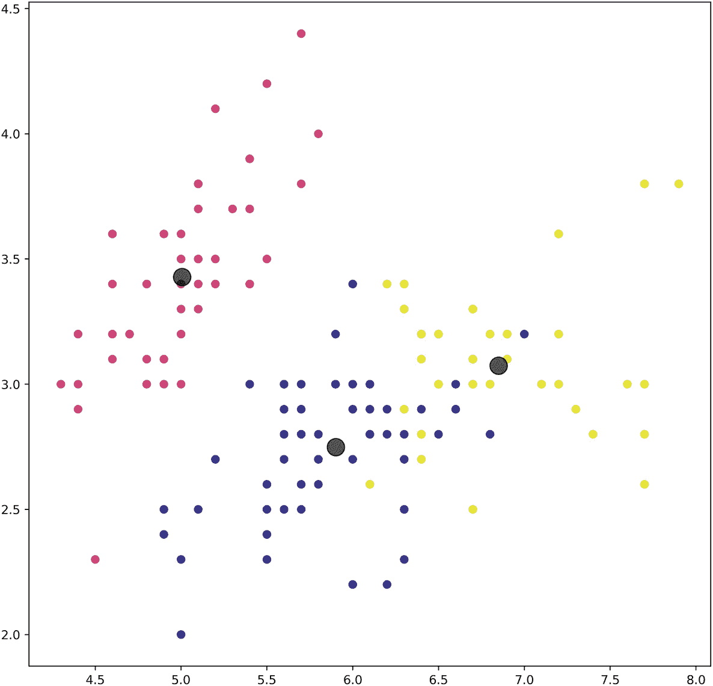

图 25-4

K-means 聚类及其聚类中心的图示

## 层次聚类

层次聚类是另一种聚类算法，用于在数据集中找到同质子组或类别。然而，与 *k*-均值不同，我们在运行算法之前不需要对数据集中簇的数量做出先验假设。

执行层次聚类的两种主要技术是

+   自底向上或聚合

+   自顶向下或分裂

在自底向上或聚合方法中，每个数据点最初被指定为一个簇。簇根据某些距离度量的同质性迭代合并。另一方面，自顶向下或分裂方法从簇开始，然后分裂成同质的小组。

层次聚类创建了一个树状结构来表示分区，称为树状图。树状图绘制得类似于二叉树，根在上，叶在下。树状图上的叶代表一个数据样本。树状图是通过迭代地将叶根据同质性合并来形成簇，簇向上移动树。层次聚类的示意图见图 25-5。

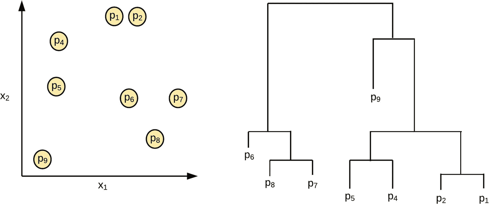

图 25-5

在二维特征空间中数据点的层次聚类示意图。左：二维空间中点的空间表示。右：由树状图表示的点层次簇。

### 簇是如何形成的

簇是通过计算每对数据点之间的接近度来形成的。接近度的概念最常用欧几里得距离度来计算。从树状图的叶开始，我们迭代地将多维向量空间中彼此更接近的数据点合并，直到所有同质点都被放入一个单独的组或簇中。

欧几里得距离用于计算 *n* 个数据点之间的接近度。在每对数据点合并形成一个簇之后，新的簇对随后被拉入树中的组，树分支或树状图的高度反映了簇之间的相似度。

相似度计算每个数据簇彼此之间的差异程度。两个簇或组之间的相似度概念用 *连接* 来描述。在层次聚类中，有四种类型的连接用于分组簇。它们是质心、完全、平均和单点。

质心连接法通过计算两个簇的几何质心来衡量它们之间的相似度。完全连接法使用两个簇之间最远的两个数据点来计算相似度（见图 25-6）。

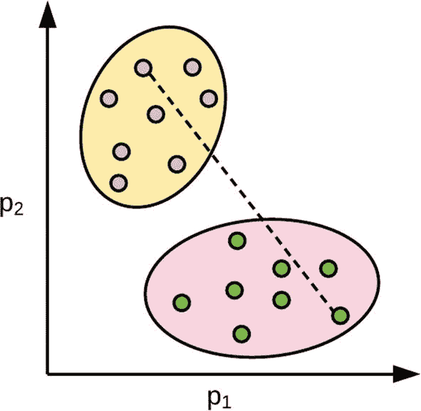

图 25-6

完全连接

平均链接法找到簇对内点的平均值，并使用这个新的人造点来计算相似度（见图 25-7）。

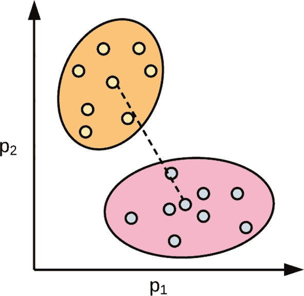

图 25-7

平均链接

单链接法使用簇对之间的最近数据点来计算相似度度量（见图 25-8）。

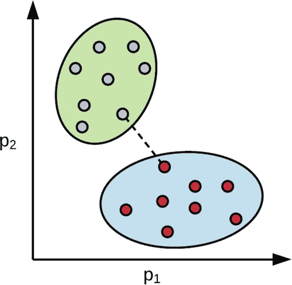

图 25-8

单链接

实际上，在实践中更倾向于使用完全链接和平均链接，因为它们产生的树状图更加平衡。存在其他相似度度量方法用于评估数据点的接近程度或同质性。其中之一是曼哈顿距离，另一种基于距离的度量，或基于相关性的距离，它将具有高度相关特征的样本对分组。在多维度空间中，基于相关性的相似度度量可能在数据点的同质性方面不如其特征在空间中的相关性作为一个度量指标有用。在数据集中，如果多维度空间中的接近性不如特征的相关性有用，基于相关性的相似度度量可能更有用。计算相似度的选择对确保树状图有重大影响。

运行算法后，在特定的树状图高度处进行切割，切割后形成的不同线条或分支的数量被界定为数据集中的簇数。切割树状图的示意图显示在图 25-9 中。

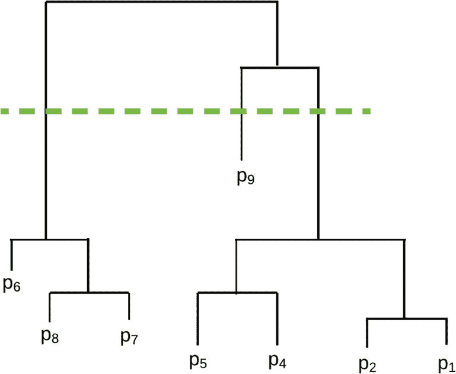

图 25-9

系统树状图切割

## 使用 SciPy 包进行层次聚类

此示例实现了使用 SciPy 的层次聚类或聚合聚类。`scipy.cluster.hierarchy`包提供了执行层次聚类和绘制树状图的方法。此示例使用的是“完全”链接方法。树状图的绘制图示显示在图 25-10 中。

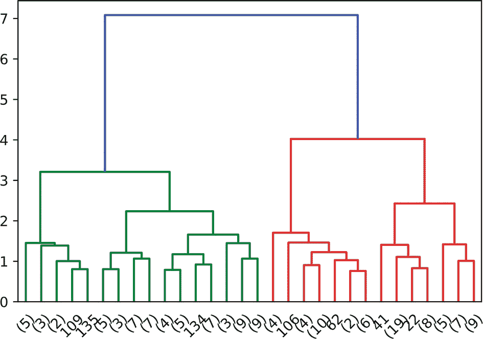

图 25-10

层次聚类产生的树状图

```py
# import packages
import matplotlib.pyplot as plt
from scipy.cluster.hierarchy import dendrogram
from scipy.cluster import hierarchy
Z = hierarchy.linkage(X, method="complete")
plt.figure()
dn = hierarchy.dendrogram(Z, truncate_mode="lastp")
```

本章回顾了 K-均值和层次聚类的优缺点。层次聚类和 K-均值都对数据集的扰动敏感，如果删除或添加少量数据点，可能会给出非常不同的结果。此外，在执行聚类之前，对数据集的特征进行标准化（即从特征中减去每个元素的平均值并除以其标准差或范围）至关重要。这确保了特征在相似的数值范围内，并且在特征空间中有调节或测量的距离。

这些聚类算法的结果也取决于广泛的考虑因素，例如选择 *K* 用于 *K*-means，对于层次聚类，选择相似性度量、链接类型以及在哪里切割树状图都会影响最终聚类结果。因此，为了从聚类中获得最佳效果，最好执行网格搜索并尝试所有这些不同的配置，以便在将结果应用于学习管道或用作解释数据集的模型之前，对结果的鲁棒性有一个量化的看法。

在下一章中，我们将讨论主成分分析 (PCA) 作为一种无监督机器学习算法，用于寻找能够捕捉数据集可变性的低维特征子空间。

# 26. 主成分分析 (PCA)

主成分分析 (PCA) 是机器学习中的一个基本算法。它是一种评估数据集主成分的数学方法。主成分是在高维空间中的一组向量，它们捕捉特征空间的方差（即，分散）或可变性。

计算主成分的目标是找到一个低维特征子空间，尽可能多地从数据集的原始高维特征中提取信息。

PCA 特别适用于通过将数据集的维度降低到较低子空间来简化高维特征的数据可视化。例如，由于我们可以使用散点图轻松地在二维平面上可视化关系，因此将 n 维空间压缩到两个维度将是有用的，这两个维度在 n 维数据集中尽可能保留信息。这种技术通常被称为降维。

## 如何计算主成分

计算主成分的数学细节有些复杂。本节将提供关于此过程的概念性但坚实的概述。

第一步是找到数据集的协方差矩阵。协方差矩阵捕捉数据集中变量或特征之间的线性关系。在协方差矩阵中，越来越大的正数表示关系越来越强，而相反的情况则由越来越大的负数表示。围绕零的数字表示变量之间的非线性关系。协方差矩阵是一个方阵（这意味着它有相同的行和列）。因此，给定一个有 *m* 行和 *p* 列的数据集，协方差矩阵将是一个 *m* × *p* 矩阵。

下一步是找到协方差矩阵数据集的特征向量。在线性代数理论中，特征向量是仅通过标量因子拉伸而不改变方向的非零向量，当受到线性变换的作用时不会改变方向。我们使用称为奇异值分解（SVD）的线性代数技术来找到特征向量（参见图 26-1）。这个高级数学概念超出了本书的范围。

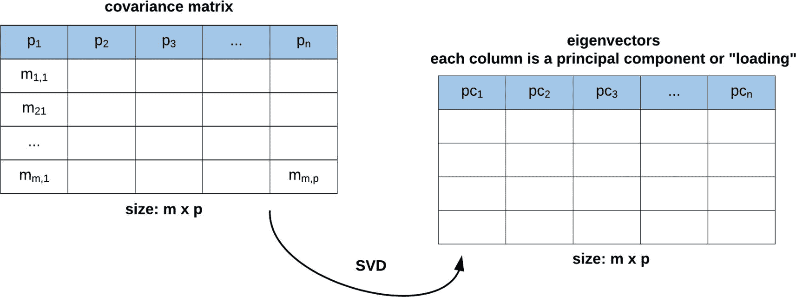

图 26-1

使用奇异值分解（SVD）分解协方差矩阵以获取特征向量矩阵

在这个节点需要注意的关键点是，奇异值分解（SVD）同样输出一个方阵（*p* × *p*），并且矩阵的每一列都是原始数据集的特征向量。这种输出在不同软件包中计算特征向量时是相同的，因为协方差矩阵满足对称和正半定（非数学倾向的人可以方便地忽略这一点）。我们拥有的特征向量数量与数据集中的属性或特征数量相同。

不深入数学理论，我们可以得出结论，特征向量是特征空间的特征成分或负载量。再次记住，主成分通过将数据投影到称为第一主成分的向量上来捕获数据集中的最大方差。其他主成分相互垂直，并捕获第一主成分未解释的方差。主成分按照重要性顺序排列在特征向量矩阵中，第一主成分位于第一列，第二主成分位于第二列，依此类推。

## 使用 PCA 进行降维

要使用 PCA 降低原始数据集的维度，我们将特征向量矩阵 *A* 中所需的成分或负载量与设计矩阵 *X* 相乘。假设设计矩阵（或原始数据集）有 *m* 行（或观测值）和 *p* 列（或特征），如果我们想将原始数据集的维度降低到二维，我们将原始数据集 *X* 与特征向量矩阵 *A*[*reduced*] 的前两列相乘。结果将是一个具有 *m* 行和 2 列的降维矩阵。

如果 *X* 是一个 *m* × *p* 矩阵，而 *A*[*reduced*] 是一个 *p* × 2 矩阵，

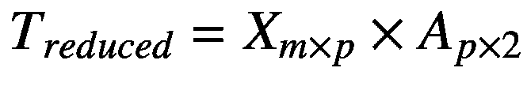

注意到结果 *T*[*reduced*] 是一个 *m* × 2 矩阵。因此，*T* 是原始数据集 *X* 的二维表示，如图 26-2 所示。

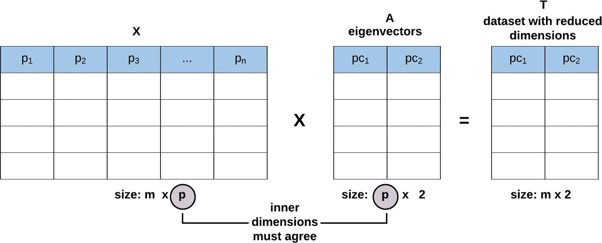

图 26-2

降低原始数据集的维度

在绘制降维后的数据集时，主成分按照重要性顺序排列，第一个主成分比第二个更突出，依此类推。图 26-3 展示了前两个主成分的绘图。

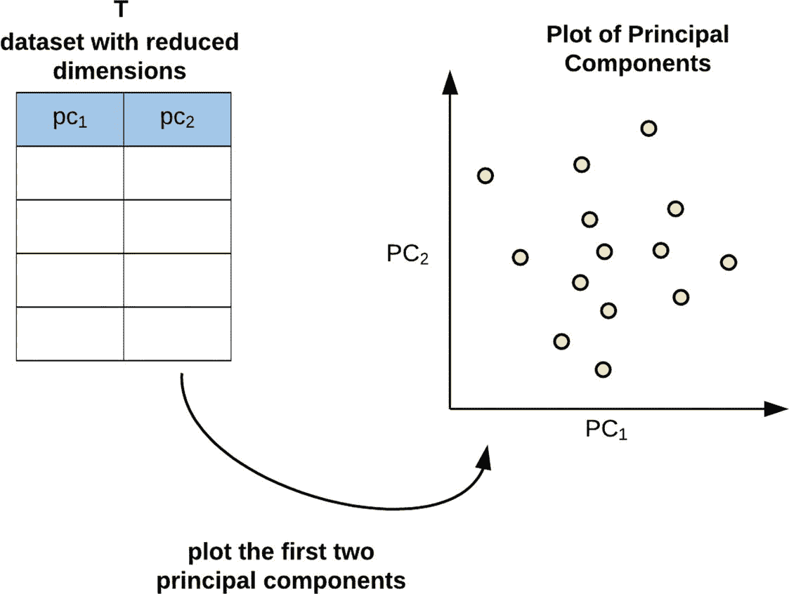

图 26-3

可视化主成分

## 执行 PCA 的关键注意事项

在实施 PCA 之前，对原始数据集的特征变量进行均值归一化和特征缩放至关重要。这是因为未经缩放的特征可能导致 n 维空间中的距离拉伸和狭窄，这在寻找解释数据集方差的特征主成分时会产生巨大影响（见图 26-4）。

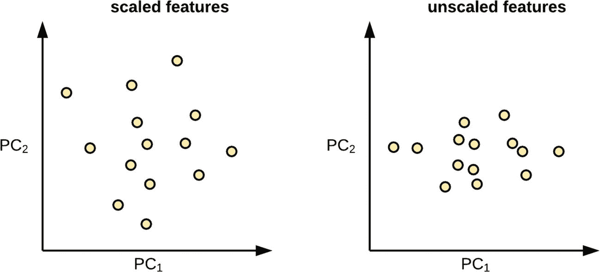

图 26-4

右：缩放特征 PCA 的示意图。左：未缩放特征 PCA 的示意图。

再次，均值归一化确保数据集的每个属性或特征都具有零均值，而特征缩放确保所有特征都在相同的数值范围内。

最后，PCA 容易受到数据集轻微扰动或变化的影响而剧烈变化。

## 使用 Scikit-learn 进行 PCA

在本节中，使用 Scikit-learn 实现 PCA。

```py
# import packages
from sklearn.decomposition import PCA
from sklearn import datasets
```

from sklearn.preprocessing import Normalizer

```py
# load dataset
data = datasets.load_iris()
# separate features and target
X = data.data
# normalize the dataset
scaler = Normalizer().fit(X)
normalize_X = scaler.transform(X)
# create the model.
pca = PCA(n_components=3)
# fit the model on the training set
pca.fit(normalize_X)
# examine the principal components percentage of variance explained
pca.explained_variance_ratio_
# print the principal components
pca_dataset = pca.components_
pca_dataset
'Output':
array([[ 0.18359702,  0.49546167, -0.76887947, -0.36004754],
[ 0.60210709, -0.64966313, -0.05931229, -0.46031175],
[-0.2436305,  0.28528504,  0.49319469, -0.78486663]])
```

在本章中，我们解释了 PCA，给出了其工作原理的高级概述，即如何找到一个数据集的低维子空间。更重要的是，我们展示了如何使用 Scikit-learn 实现 PCA。本章总结了第四部分。在下一部分，我们将介绍另一种称为深度学习的学习方法，它建立在机器学习神经网络算法之上，用于学习复杂表示。 
