# 第七部分：实践中的深度学习

# 30. TensorFlow 2.0 和 Keras

TensorFlow (TF) 是一个专门用于深度学习的数值计算库。它是众多深度学习研究人员和行业从业者开发深度学习模型和架构以及将学习模型部署到生产服务器和软件产品中的首选工具。本章专注于 TensorFlow 2.0。

## 探索 TensorFlow API

理解 TF API 层次结构的不同级别对于有效地使用 TF 至关重要。构建 TF 深度学习模型的任务可以通过不同的 TF API 级别来解决。了解 API 层次结构可以提供使用 TF 实现神经网络模型以及导航 TF 生态系统的清晰度。TF API 层次结构主要由三个 API 级别组成：高级 API、提供构建神经网络模型组件的中级 API 和低级 API。这种结构的图示在图 30-1 中展示。

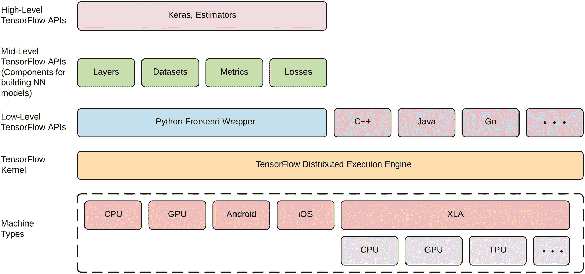

图 30-1

TensorFlow API 层次结构

### 低级 TensorFlow API

低级 API 提供了从底层使用数学运算构建网络图的工具。此 API 级别提供了最大的灵活性来调整和调整模型，以满足需求。此外，高级 API 在底层实现了低级操作。

### 中级 TensorFlow API

TensorFlow 提供了一系列可重用的包，用于简化创建神经网络模型的过程。这些函数的例子包括层 **(tf.keras.layers**)、数据集 **(tf.data**)、度量 **(tf.keras.metrics**)、损失 **(tf.keras.losses**) 和特征列 **(tf.feature_column**) 包。

#### 层

层包 **(tf.keras.layers**) 提供了一套方便的函数，用于简化神经网络架构中层的构建。例如，考虑图 30-2 中的卷积网络架构以及层 API 如何简化网络层的创建。

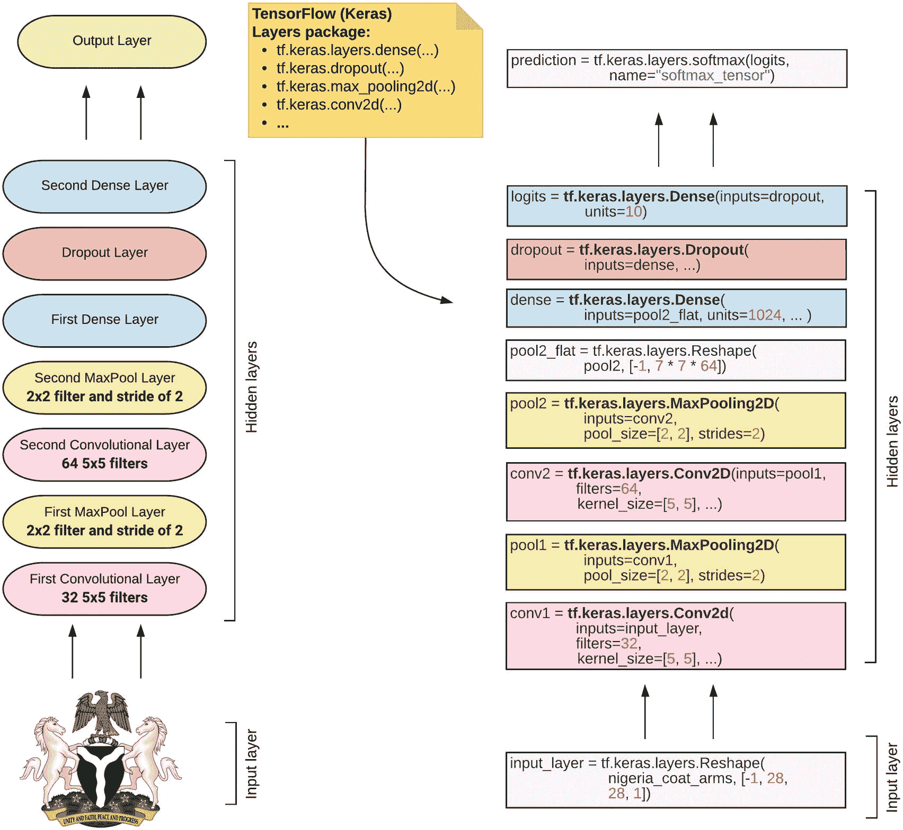

图 30-2

使用层 API 简化创建神经网络层

#### 数据集

数据集包 **(tf.data**) 提供了一套方便的高级函数，用于创建复杂的数据集输入管道。数据集包的目标是提供一个快速、灵活且易于使用的接口，用于从各种数据源获取数据，在将它们作为学习模型的输入之前对它们进行数据转换操作。数据集 API 提供了一种更有效的方法来从数据集中检索记录。数据集 API 的主要类在图 30-3 中展示。

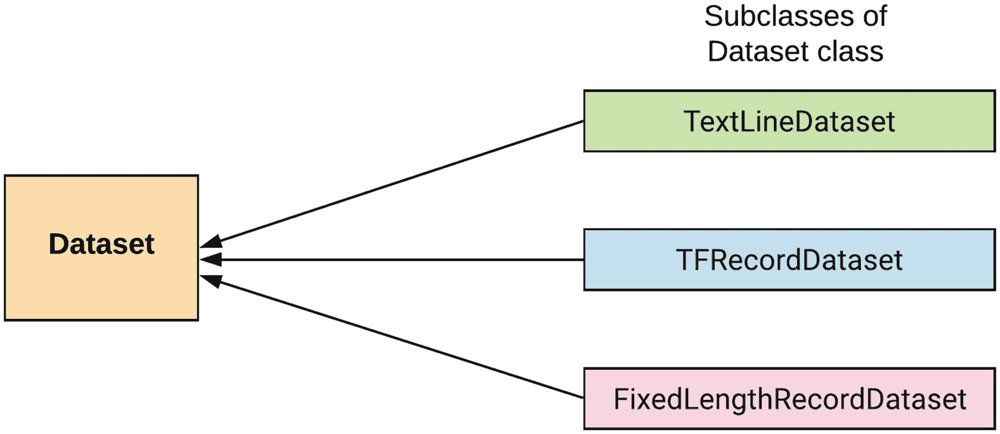

图 30-3

数据集 API 类层次结构

从图 30-3 的说明中，子类执行以下功能：

+   TextLineDataset：此类用于从文本文件中读取行。

+   TFRecordDataset：此类负责从 TFRecord 文件中读取记录。TFRecord 文件是 TensorFlow 的二进制存储格式。与原始数据文件相比，处理存储为 TFRecord 文件的数据更快、更简单。使用 TFRecord 还使得数据输入管道更容易对齐，以便应用重要的转换，如洗牌和分批返回数据。

+   FixedLengthRecordDataset：此类负责从二进制文件中读取固定大小的记录。

#### FeatureColumns

FeatureColumns **tf.feature_column** 是 TensorFlow 用于描述将要输入到高级 Keras 或 Estimator 模型进行训练和验证的数据集特征的函数。FeatureColumns 通过执行诸如将数据集的分类特征转换为独热编码向量等任务，使得准备数据以进行建模变得容易。

**feature_column** API 广泛分为两大类；它们是分类列和密集列。类别及其后续函数在图 30-4 中进行了说明。

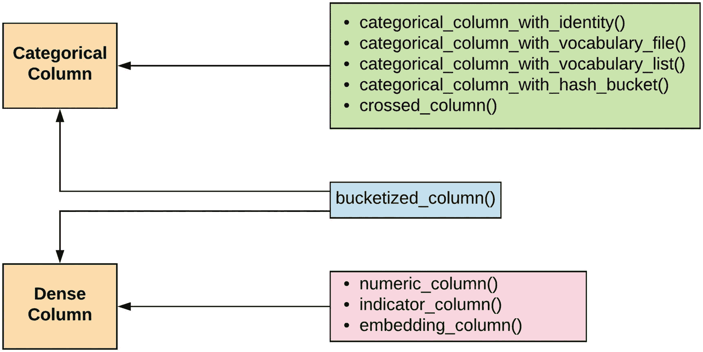

图 30-4

Feature Column API 的函数调用

让我们简要地通过表 30-1 介绍每个 API 函数。

表 30-1

***tf.feature_column*** API 函数

| 函数名称 | 描述 |
| --- | --- |
| 数值列 – **tf.feature_column.numeric_column()** | 这是一个对数据集中的数值特征的高级包装。 |
| 指示列 – **tf.feature_column.indicator_column()** | 指示列将一个分类列作为输入，并将其转换为独热编码向量。 |
| 嵌入列 – **tf.feature_column.embedding_column()** | 嵌入列函数将具有多个级别或类别的分类列转换为低维数值表示，以捕捉类别之间的关系。使用嵌入可以缓解通过独热编码为具有许多不同类别的数据集特征创建的大稀疏向量（大部分为零的数组）的问题。 |
| 具有身份的分类列 – **tf.feature_column.categorical_column_with_identity()** | 此函数创建一个包含身份的分类列的独热编码输出，例如，[‘0’，‘1’，‘2’，‘3’]。 |
| 带词汇表的分类列 – **tf.feature_column.categorical_column_with_vocabulary_list()** | 此函数创建一个分类列的 one-hot 编码输出，其中字符串被映射到整数，基于词汇表。然而，如果词汇表很长，最好创建一个包含词汇表的文件，并使用函数 **tf.feature_column.categorical_column_with_vocabulary_file().** |
| 带哈希桶的分类列 – **tf.feature_column.categorical_column_with_hash_buckets()** | 此函数通过使用输入的哈希值来指定类别数量。当由于内存考虑无法为类别数量创建词汇表时使用。 |
| 交叉列 – **tf.feature_columns.crossed_column()** | 该函数提供了将多个输入特征组合成单个输入特征的能力。 |
| 分桶列 – **tf.feature_column.bucketized_column()** | 该函数将数值输入列分割成桶，根据指定的数值范围形成新的类别。 |

### 高级 TensorFlow API

高级 API 提供了简化的 API 调用，封装了创建深度学习 TensorFlow 模型时通常涉及的大量细节。这些高级抽象使得用更少的代码快速开发强大的深度学习模型变得更容易。

#### 估算器 API

估算器 API 是 TensorFlow 的高级功能，旨在通过公开抽象常见模型和过程的 API 来降低构建机器学习模型所涉及复杂性。与估算器一起工作的有两种方式，包括

+   **使用预制的估算器**：预制的估算器是由 TensorFlow 团队提供的黑盒模型，用于构建常见的机器学习/深度学习架构，如线性回归/分类、随机森林回归/分类以及用于回归和分类的深度神经网络。预制的估算器作为估算器类的子类的示例如图 30-5 所示。

    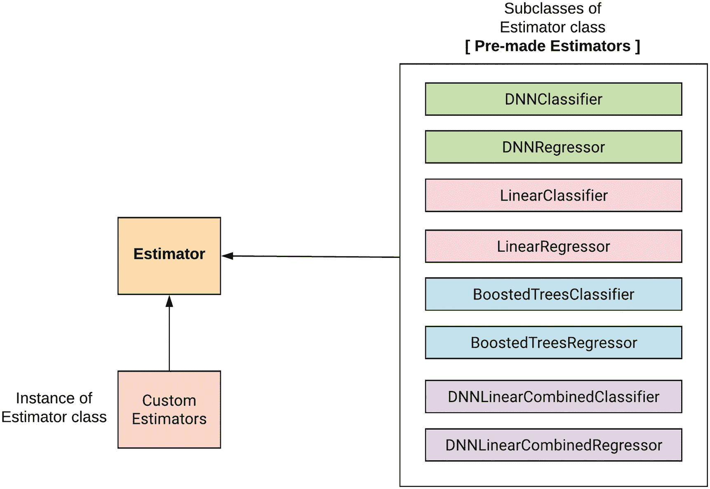

    图 30-5

    估算器类 API 层次结构

+   **创建自定义估算器**：还可以使用低级 TensorFlow 方法创建一个自定义的黑盒模型，以便于重用。为此，您必须将代码放入名为 **model_fn** 的方法中。模型函数将包括定义操作，如标签或预测、损失函数、训练操作以及评估操作。

Estimator 类公开了四个主要方法，即**fit()**、**evaluate()**、**predict()**和**export_savedmodel()**方法。**fit()**方法用于通过运行训练操作的循环来训练数据。**evaluate()**方法用于通过循环一组评估操作来评估模型性能。**predict()**方法使用训练好的模型进行预测，而**export_savedmodel()**方法用于将训练好的模型导出到指定的目录。对于预制的和自定义的 Estimator，我们必须编写一个方法将数据输入管道构建到模型中。这个管道是为训练和评估数据输入构建的。这进一步在图 30-6 中得到了说明。

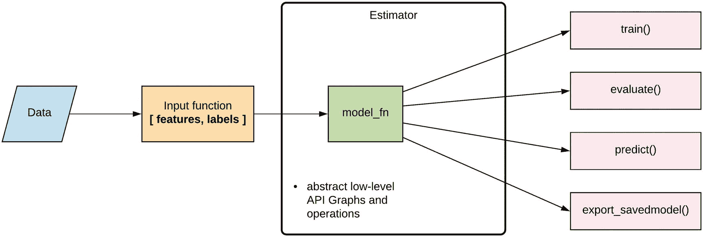

图 30-6

Estimator 数据输入管道

#### Keras API

Keras 为开发深度神经网络模型提供了一个高级规范。Keras API 最初是独立于 TensorFlow 的，并且仅提供了一个用于使用 TensorFlow 作为后端之一进行模型构建的接口。然而，在 TensorFlow 2.0 中，Keras 成为了 TensorFlow 代码库的组成部分，作为首选的高级 API。

TensorFlow 内部的 Keras API 版本可以从‘tf.keras’包中获取，而与特定后端无关的更广泛的 Keras API 蓝图将仍然可以从‘keras’包中获取。总之，当使用‘keras’包时，后端可以运行在 TensorFlow、Microsoft CNTK 或 Theano 上。另一方面，使用‘tf.keras’提供的是仅适用于 TensorFlow 的版本，它与核心 TensorFlow 库的所有功能紧密集成和兼容。

在本书中，我们将重点关注**‘tf.Keras’**作为 TensorFlow 的高级 API。

## Keras 程序的结构

Keras **‘Model’**构成了 Keras 程序的核心。首先构建一个‘Model’，然后对其进行编译。接下来，使用各自的训练和评估数据集对编译好的模型进行训练和评估。在成功使用相关指标进行评估后，该模型用于对之前未见过的数据样本进行预测。图 30-7 显示了使用 Keras 进行建模的程序流程。

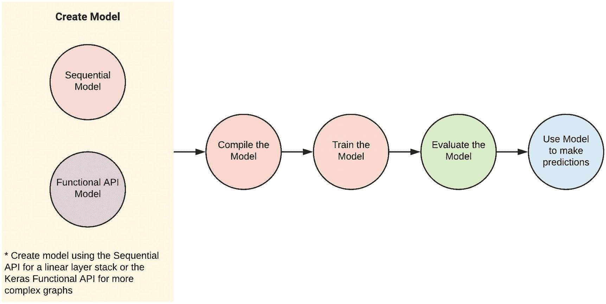

图 30-7

Keras 程序的结构

如图 30-7 所示，Keras 的‘Model’可以使用 Sequential API 的‘tf.keras.Sequential’或 Keras Functional API 构建，后者定义了一个模型实例‘tf.keras.Model’。Sequential 模型是创建线性堆叠神经网络层的最简单方法。当需要更复杂的图时，使用 Functional 模型。Keras 是使用 TensorFlow 构建神经网络架构的事实上的 API。

从现在起，本书中的代码示例将使用 Keras 的 Sequential API、Functional API 和模型子类化方法来构建神经网络架构。通过这种方式，读者可以尝试各种示例作为样本，以了解它们的工作方式。

## TensorBoard

TensorBoard 是 TensorFlow 内置的一个交互式可视化工具。TensorBoard 的目标是帮助我们通过可视化了解计算图是如何构建和执行的。这些信息有助于我们更好地理解、优化和调试深度学习模型。

TensorBoard 提供了多种可视化仪表板，例如

+   标量仪表板：此仪表板捕获随时间变化的度量，例如模型的损失或其他模型评估指标，如准确率、精确度、召回率、f1 等等。

+   直方图仪表板：此仪表板显示了 Tensor 随时间变化的直方图分布。

+   分布仪表板：此仪表板与直方图仪表板类似。然而，它以分布的形式显示直方图。

+   图形探索器：此仪表板提供了 TensorFlow 计算图的图形概述以及信息如何从一个节点流向另一个节点。此仪表板为网络架构提供了宝贵的见解。

+   图像仪表板：此仪表板显示了使用 **tf.summary.image** 方法保存的图像。

+   音频仪表板：此仪表板提供了使用 **tf.summary.audio** 方法保存的音频片段。

+   嵌入投影仪：该仪表板使得在数据集使用 **Embeddings** 转换后轻松可视化高维数据集变得容易。可视化使用主成分分析（PCA）和另一种称为 t 分布随机邻域嵌入（t-SNE）的技术。嵌入是一种通过将数据单位转换为捕获其关系的实数来捕获高维数据集中潜在变量的技术。这种方法在广义上类似于 PCA 如何降低数据维度。嵌入对于将稀疏矩阵（主要由零组成的矩阵）转换为密集表示也非常有用。

+   文本仪表板：此仪表板用于显示文本信息。

    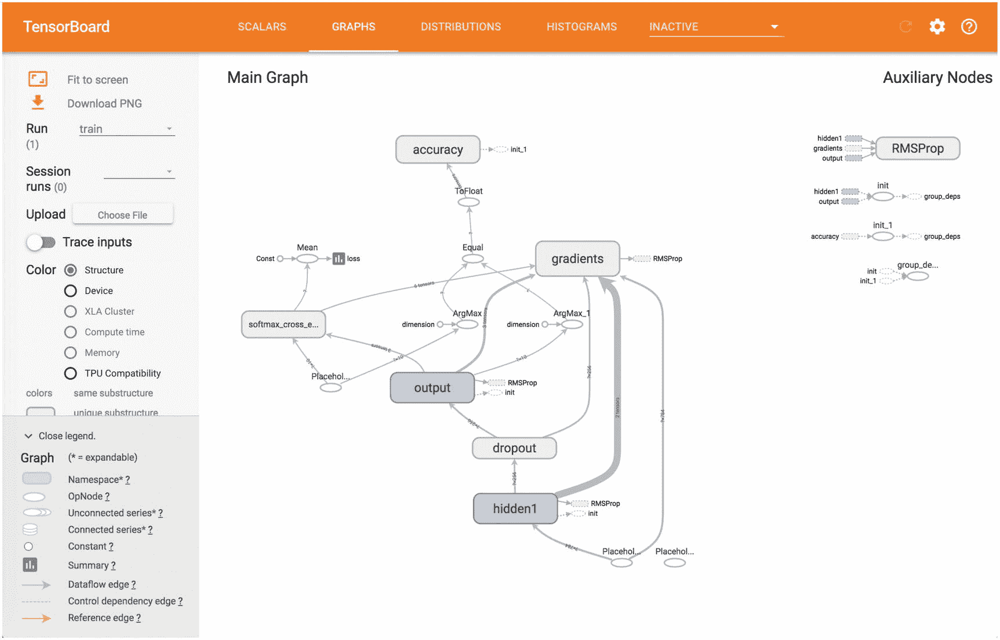

    图 30-8

    TensorBoard

## TensorFlow 2.0 的特性

TensorFlow 2.0 为构建机器学习模型带来了新特性。其中一些新特性包括

+   以立即执行作为默认执行模式，模型设计和调试具有更 Pythonic 的感觉。

+   立即执行使 TensorFlow 操作的即时评估成为可能。这与 TensorFlow 的早期版本相反，在早期版本中，我们首先构建一个计算图，然后在会话中执行它。

+   使用 `tf.function` 将 Python 方法转换为高性能的 TensorFlow 图。

+   将 Keras 作为模型设计的核心高级 API。

+   使用特征列将数据解析为 Keras 模型的输入。

+   在分布式架构和设备上训练的简便性。

要在 Google Colab 上安装和使用 TensorFlow 2.0，请运行

```py
!pip install -q tensorflow==2.0.0-beta0
```

GCP 深度学习 VM 具有预配置了 TensorFlow 2.0 的镜像。

## 一个简单的 TensorFlow 程序

让我们从构建一个简单的 TF 程序开始。在这里，我们将构建一个图来找到二次表达式 *x*² + 3*x* - 4 = 0 的根。

```py
# import tensorflow
import tensorflow as tf
# Quadratic expression: x**2 + 3x - 4 = 0.
a = tf.constant(1.0)
b = tf.constant(3.0)
c = tf.constant(-4.0)
print(a)
print(b)
print(c)
'Output':
tf.Tensor(1.0, shape=(), dtype=float32)
tf.Tensor(3.0, shape=(), dtype=float32)
tf.Tensor(-4.0, shape=(), dtype=float32)
```

**tf.constant()** 是用于存储常量类型的张量。现在让我们计算表达式的根。

```py
x1 = (-b + tf.math.sqrt(b**2 - (4*a*c))) / 2**a
x2 = (-b - tf.math.sqrt(b**2 - (4*a*c))) / 2**a
roots = (x1, x2)
print(roots)
'Output':
(, )
```

TensorFlow 2.0 以 eager-first 为特点；这意味着操作在定义后立即执行，就像常规 Python 代码一样。

## 使用 Dataset API 构建高效输入管道

数据集 API **‘tf.data’** 提供了一种高效机制，用于构建健壮的输入管道，以便将数据传递到 TensorFlow 程序中。本节使用波士顿房价数据集来说明在 TensorFlow 中使用数据集 API 方法构建数据输入管道的工作方式。

```py
# import packages
import tensorflow as tf
from tensorflow.keras.datasets import boston_housing
# load dataset and split in train and test sets
(X_train, y_train), (X_test, y_test) = boston_housing.load_data()
# construct data input pipelines
dataset = tf.data.Dataset.from_tensor_slices((X_train, y_train))
dataset = dataset.shuffle(buffer_size=1000)
dataset = dataset.batch(5)
# retrieve first data batch from dataset
for features, labels in dataset:
print('Features:', features)
print('Shape of Features:', features.shape)
print('Labels:', labels)
print('Shape of Labels:', labels.shape)
break
'Output':
Features: tf.Tensor(
[[8.19900e-02 0.00000e+00 1.39200e+01 0.00000e+00 4.37000e-01 6.00900e+00
4.23000e+01 5.50270e+00 4.00000e+00 2.89000e+02 1.60000e+01 3.96900e+02
1.04000e+01]
[8.82900e-02 1.25000e+01 7.87000e+00 0.00000e+00 5.24000e-01 6.01200e+00
6.66000e+01 5.56050e+00 5.00000e+00 3.11000e+02 1.52000e+01 3.95600e+02
1.24300e+01]
[2.90900e-01 0.00000e+00 2.18900e+01 0.00000e+00 6.24000e-01 6.17400e+00
9.36000e+01 1.61190e+00 4.00000e+00 4.37000e+02 2.12000e+01 3.88080e+02
2.41600e+01]
[5.87205e+00 0.00000e+00 1.81000e+01 0.00000e+00 6.93000e-01 6.40500e+00
9.60000e+01 1.67680e+00 2.40000e+01 6.66000e+02 2.02000e+01 3.96900e+02
1.93700e+01]
[1.71710e-01 2.50000e+01 5.13000e+00 0.00000e+00 4.53000e-01 5.96600e+00
9.34000e+01 6.81850e+00 8.00000e+00 2.84000e+02 1.97000e+01 3.78080e+02
1.44400e+01]], shape=(5, 13), dtype=float64)
Shape of Features: (5, 13)
Labels: tf.Tensor([21.7 22.9 14\.  12.5 16\. ], shape=(5,), dtype=float64)
Shape of Labels: (5,)
```

从先前的代码列表中，请注意以下内容：

+   使用 **‘tf.data.Dataset.from_tensor_slices()’** 方法创建一个元素为张量切片的数据集。

+   数据集方法 **‘shuffle()’** 在每个 epoch 中对数据集进行洗牌。

+   数据集方法 **‘batch()’** 用于设置数据集每个小批次的尺寸。在先前的示例中，每个数据集批次包含五个观测值。

## 使用 TensorFlow 进行线性回归

在本节中，我们使用 TensorFlow 实现线性回归机器学习模型。在以下示例中，我们使用来自 **Keras 数据集包** 的波士顿房价数据集，使用 TensorFlow 2.0 构建线性回归模型。

```py
# import packages
import numpy as np
import tensorflow as tf
from tensorflow.keras.datasets import boston_housing
from tensorflow.keras import Model
from sklearn.preprocessing import StandardScaler
# load dataset and split in train and test sets
(X_train, y_train), (X_test, y_test) = boston_housing.load_data()
# standardize the dataset
scaler_X_train = StandardScaler().fit(X_train)
scaler_X_test = StandardScaler().fit(X_test)
X_train = scaler_X_train.transform(X_train)
X_test = scaler_X_test.transform(X_test)
# reshape y-data to become column vector
y_train = np.reshape(y_train, [-1, 1])
y_test = np.reshape(y_test, [-1, 1])
# build the linear model
class LinearRegressionModel(Model):
def __init__(self):
super(LinearRegressionModel, self).__init__()
# initialize weight and bias variables
self.weight = tf.Variable(
initial_value = tf. random.normal(
[13, 1], dtype=tf.float64),
trainable=True)
self.bias = tf.Variable(initial_value = tf.constant(
1.0, shape=[], dtype=tf.float64), trainable=True)
def call(self, inputs):
return tf.add(tf.matmul(inputs, self.weight), self.bias)
model = LinearRegressionModel()
# parameters
batch_size = 32
learning_rate = 0.01
# use tf.data to batch and shuffle the dataset
train_ds = tf.data.Dataset.from_tensor_slices(
(X_train, y_train)).shuffle(len(X_train)).batch(batch_size)
test_ds = tf.data.Dataset.from_tensor_slices((X_test, y_test)).batch(batch_size)
loss_object = tf.keras.losses.MeanSquaredError()
optimizer = tf.keras.optimizers.SGD(learning_rate=0.01)
train_loss = tf.keras.metrics.Mean(name='train_loss')
train_rmse = tf.keras.metrics.RootMeanSquaredError(name='train_rmse')
test_loss = tf.keras.metrics.Mean(name='test_loss')
test_rmse = tf.keras.metrics.RootMeanSquaredError(name='test_rmse')
# use tf.GradientTape to train the model
@tf.function
def train_step(inputs, labels):
with tf.GradientTape() as tape:
predictions = model(inputs)
loss = loss_object(labels, predictions)
gradients = tape.gradient(loss, model.trainable_variables)
optimizer.apply_gradients(zip(gradients, model.trainable_variables))
train_loss(loss)
train_rmse(labels, predictions)
@tf.function
def test_step(inputs, labels):
predictions = model(inputs)
t_loss = loss_object(labels, predictions)
test_loss(t_loss)
test_rmse(labels, predictions)
num_epochs = 1000
for epoch in range(num_epochs):
for train_inputs, train_labels in train_ds:
train_step(train_inputs, train_labels)
for test_inputs, test_labels in test_ds:
test_step(test_inputs, test_labels)
template = 'Epoch {}, Loss: {}, RMSE: {}, Test Loss: {}, Test RMSE: {}'
if ((epoch+1) % 100 == 0):
print (template.format(epoch+1,
train_loss.result(),
train_rmse.result(),
test_loss.result(),
test_rmse.result()))
'Output':
Epoch 100, Loss: 23.531124114990234, RMSE: 4.862841606140137, Test Loss: 21.077274322509766, Test RMSE: 4.591667175292969
Epoch 200, Loss: 23.51316261291504, RMSE: 4.860987663269043, Test Loss: 21.067768096923828, Test RMSE: 4.590633869171143
Epoch 300, Loss: 23.496540069580078, RMSE: 4.859271049499512, Test Loss: 21.058971405029297, Test RMSE: 4.589677333831787
Epoch 400, Loss: 23.481115341186523, RMSE: 4.857677459716797, Test Loss: 21.050806045532227, Test RMSE: 4.588788986206055
Epoch 500, Loss: 23.466760635375977, RMSE: 4.856194019317627, Test Loss: 21.043209075927734, Test RMSE: 4.587962627410889
Epoch 600, Loss: 23.453369140625, RMSE: 4.8548102378845215, Test Loss: 21.036123275756836, Test RMSE: 4.587191581726074
Epoch 700, Loss: 23.440847396850586, RMSE: 4.853515625, Test Loss: 21.029495239257812, Test RMSE: 4.586470603942871
Epoch 800, Loss: 23.429113388061523, RMSE: 4.852302074432373, Test Loss: 21.02336311340332, Test RMSE: 4.585799694061279
Epoch 900, Loss: 23.4180965423584, RMSE: 4.851161956787109, Test Loss: 21.017648696899414, Test RMSE: 4.585177898406982
Epoch 1000, Loss: 23.407730102539062, RMSE: 4.8500895500183105, Test Loss: 21.012271881103516, Test RMSE: 4.584592819213867
```

在先前的代码列表中，对于使用 TensorFlow 进行线性回归，以下是一些需要注意的要点和方法：

+   注意，在将数据分为训练集和测试集之后，执行标准化特征数据集的转换。这样做是为了防止训练数据的信息污染测试数据，测试数据必须保持对模型不可见。

+   命名为 **‘LinearRegressionModel’** 的类通过继承 **‘tf.keras.Model’** 类来构建 Keras 模型。线性回归模型在 **‘__init__’** 方法中作为神经网络的一层创建，并在 **‘call’** 方法中定义为前向传递。在第三十一章中，我们将看到如何使用 Keras 功能 API 进行更简单的操作。

+   **‘tf.data.Dataset.from_tensor_slices’** 方法使用 **‘.minimize()’** 方法更新损失函数。

+   使用 **‘tf.keras.losses.MeanSquaredError()’** 定义了平方误差损失函数。

+   使用 **‘tf.keras.optimizers.SGD()’** 定义梯度下降优化算法，并将学习率设置为方法的参数。

+   使用 **‘tf.keras.metrics.Mean(name=‘train_loss’)’** 和 **‘tf.keras.metrics.RootMeanSquaredError()’** 函数分别定义了捕获损失和均方根误差估计的方法。

+   @tf.function 是一个 Python 装饰器，用于将方法转换为高性能的 TensorFlow 图。

+   方法 **‘train_step’** 使用 **‘tf.GradientTape()’** 方法记录用于自动微分的操作。这些梯度随后通过调用优化算法的 **‘apply_gradients()’** 方法来最小化成本函数。

+   方法 **‘test_step’** 使用训练好的模型对测试数据进行预测。

## 使用 TensorFlow 进行分类

在本例中，我们将使用 Iris 花数据集，利用 TensorFlow 2.0 构建一个多变量逻辑回归机器学习分类器。数据集来自 Scikit-learn 数据集包。

```py
# import packages
import numpy as np
import tensorflow as tf
from sklearn import datasets
from tensorflow.keras import Model
from sklearn.model_selection import train_test_split
from sklearn.preprocessing import OneHotEncoder
# load dataset
data = datasets.load_iris()
# separate features and target
X = data.data
y = data.target
# apply one-hot encoding to targets
one_hot_encoder = OneHotEncoder(categories='auto')
encode_categorical = y.reshape(len(y), 1)
y = one_hot_encoder.fit_transform(encode_categorical).toarray()
# split in train and test sets
X_train, X_test, y_train, y_test = train_test_split(X, y, shuffle=True)
# build the linear model
class LogisticRegressionModel(Model):
def __init__(self):
super(LogisticRegressionModel, self).__init__()
# initialize weight and bias variables
self.weight = tf.Variable(
initial_value = tf.random.normal(
[4, 3], dtype=tf.float64),
trainable=True)
self.bias = tf.Variable(initial_value = tf.random.normal(
[3], dtype=tf.float64), trainable=True)
def call(self, inputs):
return tf.add(tf.matmul(inputs, self.weight), self.bias)
model = LogisticRegressionModel()
# parameters
batch_size = 32
learning_rate = 0.1
# use tf.data to batch and shuffle the dataset
train_ds = tf.data.Dataset.from_tensor_slices(
(X_train, y_train)).shuffle(len(X_train)).batch(batch_size)
test_ds = tf.data.Dataset.from_tensor_slices((X_test, y_test)).batch(batch_size)
optimizer = tf.keras.optimizers.SGD(learning_rate=learning_rate)
train_loss = tf.keras.metrics.Mean(name='train_loss')
train_accuracy = tf.keras.metrics.Accuracy(name='train_accuracy')
test_loss = tf.keras.metrics.Mean(name='test_loss')
test_accuracy = tf.keras.metrics.Accuracy(name='test_accuracy')
# use tf.GradientTape to train the model
@tf.function
def train_step(inputs, labels):
with tf.GradientTape() as tape:
predictions = model(inputs)
loss = tf.reduce_mean(tf.nn.softmax_cross_entropy_with_logits(labels, predictions))
gradients = tape.gradient(loss, model.trainable_variables)
optimizer.apply_gradients(zip(gradients, model.trainable_variables))
train_loss(loss)
train_accuracy(tf.argmax(labels,1), tf.argmax(predictions,1))
@tf.function
def test_step(inputs, labels):
predictions = model(inputs)
t_loss = tf.reduce_mean(tf.nn.softmax_cross_entropy_with_logits(labels, predictions))
test_loss(t_loss)
test_accuracy(tf.argmax(labels,1), tf.argmax(predictions,1))
num_epochs = 1000
for epoch in range(num_epochs):
for train_inputs, train_labels in train_ds:
train_step(train_inputs, train_labels)
for test_inputs, test_labels in test_ds:
test_step(test_inputs, test_labels)
template = 'Epoch {}, Loss: {}, Accuracy: {}, Test Loss: {}, Test Accuracy: {}'
if ((epoch+1) % 100 == 0):
print (template.format(epoch+1,
train_loss.result(),
train_accuracy.result()*100,
test_loss.result(),
test_accuracy.result()*100))
'Output':
Epoch 100, Loss: 0.3510790765285492, Accuracy: 89.63029479980469, Test Loss: 0.44924452900886536, Test Accuracy: 84.37885284423828
Epoch 200, Loss: 0.3282322287559509, Accuracy: 91.29582214355469, Test Loss: 0.43276602029800415, Test Accuracy: 85.73675537109375
Epoch 300, Loss: 0.3093726634979248, Accuracy: 92.46343231201172, Test Loss: 0.41915151476860046, Test Accuracy: 86.6886978149414
Epoch 400, Loss: 0.29340484738349915, Accuracy: 93.3273696899414, Test Loss: 0.40762627124786377, Test Accuracy: 87.43070220947266
Epoch 500, Loss: 0.2796294391155243, Accuracy: 93.99247741699219, Test Loss: 0.3976936936378479, Test Accuracy: 88.27145385742188
Epoch 600, Loss: 0.2675718069076538, Accuracy: 94.52030944824219, Test Loss: 0.38901543617248535, Test Accuracy: 88.93867492675781
Epoch 700, Loss: 0.25689396262168884, Accuracy: 94.94937896728516, Test Loss: 0.38134896755218506, Test Accuracy: 89.48106384277344
Epoch 800, Loss: 0.24734711647033691, Accuracy: 95.3050537109375, Test Loss: 0.3745149075984955, Test Accuracy: 89.9306640625
Epoch 900, Loss: 0.23874221742153168, Accuracy: 95.60466766357422, Test Loss: 0.3683767020702362, Test Accuracy: 90.30940246582031
Epoch 1000, Loss: 0.23093272745609283, Accuracy: 95.86051177978516, Test Loss: 0.3628271818161011, Test Accuracy: 90.63280487060547
```

从前面的代码列表中，与 TensorFlow 2.0 中的线性回归示例类似。然而，请注意以下步骤：

+   目标变量 **‘y’** 通过使用 Scikit-learn 的 **‘OneHotEncoder’** 函数转换为独热编码矩阵。存在一个名为 **‘tf.one_hot’** 的 TensorFlow 方法，用于执行相同的功能，而且更加简单！鼓励读者进行实验。

+   观察如何使用 **‘tf.reduce_mean’** 和 **‘tf.nn.softmax_cross_entropy_with_logits’** 方法实现逻辑模型的损失以进行优化。

+   使用 **‘tf.keras.optimizers.SGD()’** 优化的随机梯度下降算法用于训练逻辑模型。

+   观察如何在 **‘train_step’** 方法中使用 **‘tf.GradientTape()’** 来捕获和计算可训练模型变量的导数，从而更新 **‘weight’** 和 **‘bias’** 变量。

+   **‘tf.keras.metrics.Accuracy’** 方法用于评估模型的准确度。

## 使用 TensorBoard 进行可视化

在本节中，我们将通过 TensorBoard 来可视化 TensorFlow 图和统计信息。以下代码在之前代码的基础上进行了改进，通过添加用于在 TensorBoard 中可视化图和其他变量统计信息的方法来构建线性回归模型，使用的是 **‘tf.summary’** 方法调用。TensorBoard 输出（如图 30-9 所示）在笔记本中显示。

```py
# import packages
import datetime
import numpy as np
import tensorflow as tf
from tensorflow.keras.datasets import boston_housing
from tensorflow.keras import Model
from sklearn.preprocessing import StandardScaler
# load the TensorBoard notebook extension
%load_ext tensorboard
# load dataset and split in train and test sets
(X_train, y_train), (X_test, y_test) = boston_housing.load_data()
# standardize the dataset
scaler_X_train = StandardScaler().fit(X_train)
scaler_X_test = StandardScaler().fit(X_test)
X_train = scaler_X_train.transform(X_train)
X_test = scaler_X_test.transform(X_test)
# reshape y-data to become column vector
y_train = np.reshape(y_train, [-1, 1])
y_test = np.reshape(y_test, [-1, 1])
# build the linear model
class LinearRegressionModel(Model):
def __init__(self):
super(LinearRegressionModel, self).__init__()
# initialize weight and bias variables
self.weight = tf.Variable(
initial_value = tf. random.normal(
[13, 1], dtype=tf.float64),
trainable=True)
self.bias = tf.Variable(initial_value = tf.constant(
1.0, shape=[], dtype=tf.float64), trainable=True)
def call(self, inputs):
return tf.add(tf.matmul(inputs, self.weight), self.bias)
model = LinearRegressionModel()
# parameters
batch_size = 32
learning_rate = 0.01
# use tf.data to batch and shuffle the dataset
train_ds = tf.data.Dataset.from_tensor_slices(
(X_train, y_train)).shuffle(len(X_train)).batch(batch_size)
test_ds = tf.data.Dataset.from_tensor_slices((X_test, y_test)).batch(batch_size)
loss_object = tf.keras.losses.MeanSquaredError()
optimizer = tf.keras.optimizers.SGD(learning_rate=0.01)
train_loss = tf.keras.metrics.Mean(name='train_loss')
train_rmse = tf.keras.metrics.RootMeanSquaredError(name='train_rmse')
test_loss = tf.keras.metrics.Mean(name='test_loss')
test_rmse = tf.keras.metrics.RootMeanSquaredError(name='test_rmse')
# use tf.GradientTape to train the model
@tf.function
def train_step(inputs, labels):
with tf.GradientTape() as tape:
predictions = model(inputs)
loss = loss_object(labels, predictions)
gradients = tape.gradient(loss, model.trainable_variables)
optimizer.apply_gradients(zip(gradients, model.trainable_variables))
train_loss(loss)
train_rmse(labels, predictions)
@tf.function
def test_step(inputs, labels):
predictions = model(inputs)
t_loss = loss_object(labels, predictions)
test_loss(t_loss)
test_rmse(labels, predictions)
# Clear any logs from previous runs
!rm -rf ./logs/
# set up summary writers to write the summaries to disk in a different logs directory
current_time = datetime.datetime.now().strftime("%Y%m%d-%H%M%S")
train_log_dir = 'logs/gradient_tape/' + current_time + '/train'
test_log_dir = 'logs/gradient_tape/' + current_time + '/test'
train_summary_writer = tf.summary.create_file_writer(train_log_dir)
test_summary_writer = tf.summary.create_file_writer(test_log_dir)
num_epochs = 1000
for epoch in range(num_epochs):
for train_inputs, train_labels in train_ds:
train_step(train_inputs, train_labels)
with train_summary_writer.as_default():
tf.summary.scalar('loss', train_loss.result(), step=epoch)
tf.summary.scalar('rmse', train_rmse.result(), step=epoch)
for test_inputs, test_labels in test_ds:
test_step(test_inputs, test_labels)
with test_summary_writer.as_default():
tf.summary.scalar('loss', test_loss.result(), step=epoch)
tf.summary.scalar('rmse', test_rmse.result(), step=epoch)
template = 'Epoch {}, Loss: {}, RMSE: {}, Test Loss: {}, Test RMSE: {}'
if ((epoch+1) % 100 == 0):
print (template.format(epoch+1,
train_loss.result(),
train_rmse.result(),
test_loss.result(),
test_rmse.result()))
# Reset metrics every epoch
train_loss.reset_states()
test_loss.reset_states()
train_rmse.reset_states()
test_rmse.reset_states()
'Output':
Epoch 100, Loss: 22.03757667541504, RMSE: 4.726028919219971, Test Loss: 29.092111587524414, Test RMSE: 4.577760696411133
Epoch 200, Loss: 21.973844528198242, RMSE: 4.719051837921143, Test Loss: 29.113895416259766, Test RMSE: 4.585252285003662
Epoch 300, Loss: 21.970674514770508, RMSE: 4.7187066078186035, Test Loss: 29.13644790649414, Test RMSE: 4.587917327880859
Epoch 400, Loss: 21.970500946044922, RMSE: 4.718687534332275, Test Loss: 29.1422119140625, Test RMSE: 4.588583469390869
Epoch 500, Loss: 21.970489501953125, RMSE: 4.718685626983643, Test Loss: 29.14352035522461, Test RMSE: 4.588735103607178
Epoch 600, Loss: 21.970487594604492, RMSE: 4.718685626983643, Test Loss: 29.143817901611328, Test RMSE: 4.58876895904541
Epoch 700, Loss: 21.970487594604492, RMSE: 4.718685626983643, Test Loss: 29.143882751464844, Test RMSE: 4.588776111602783
Epoch 800, Loss: 21.970487594604492, RMSE: 4.718685626983643, Test Loss: 29.14389419555664, Test RMSE: 4.588778018951416
Epoch 900, Loss: 21.970487594604492, RMSE: 4.718685626983643, Test Loss: 29.143898010253906, Test RMSE: 4.588778495788574
Epoch 1000, Loss: 21.970487594604492, RMSE: 4.718685626983643, Test Loss: 29.143898010253906, Test RMSE: 4.588778495788574
# launch tensorboard
%tensorboard --logdir logs/gradient_tape
```

从前面的代码列表中，请注意以下步骤：

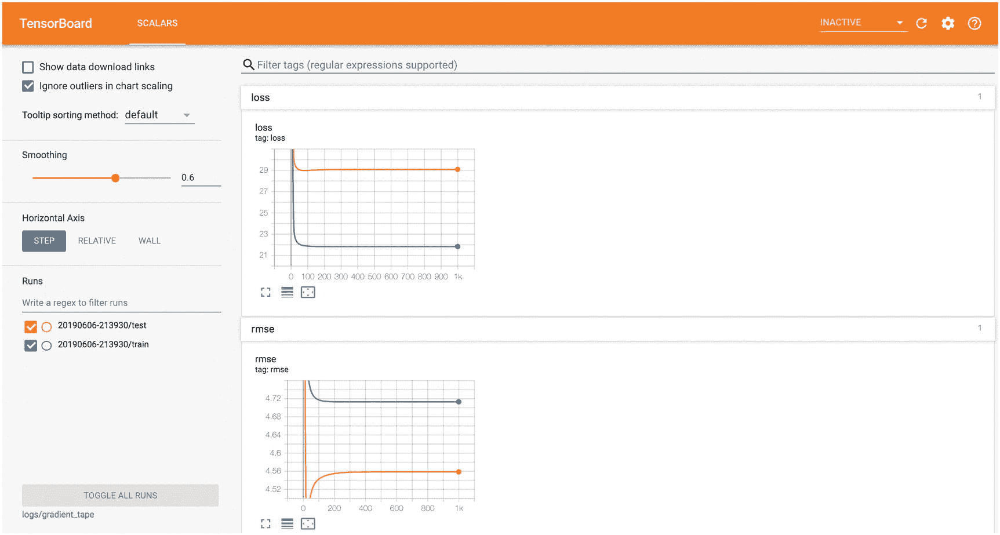

图 30-9

线性回归指标的 TensorBoard 可视化仪表板

+   **‘tf.summary.create_file_writer’** 方法创建用于将摘要写入磁盘的摘要写入器。

+   **‘tf.summary.scalar’** 方法用于捕获 TensorBoard 的标量指标。

+   使用魔法命令 ‘%tensorboard’ 通过指向适当的日志目录来启动 TensorBoard。

## 在 GPU 上运行 TensorFlow

GPU 是图形处理单元的缩写。它是一种专为在大型内存块上执行复杂计算而设计的专用处理器。GPU 为构建深度学习模型提供了更高效的处理能力。

TensorFlow 可以利用多 GPU 的处理能力来加速计算，尤其是在训练复杂的网络架构时。为了利用并行处理，网络架构的副本位于每个 GPU 机器上，并训练数据的一个子集。然而，对于同步更新，每个塔（或 GPU 机器）的模型参数存储和更新在 CPU 上。结果证明，CPU 通常擅长均值或平均处理。该操作的示意图如图 30-10 所示。

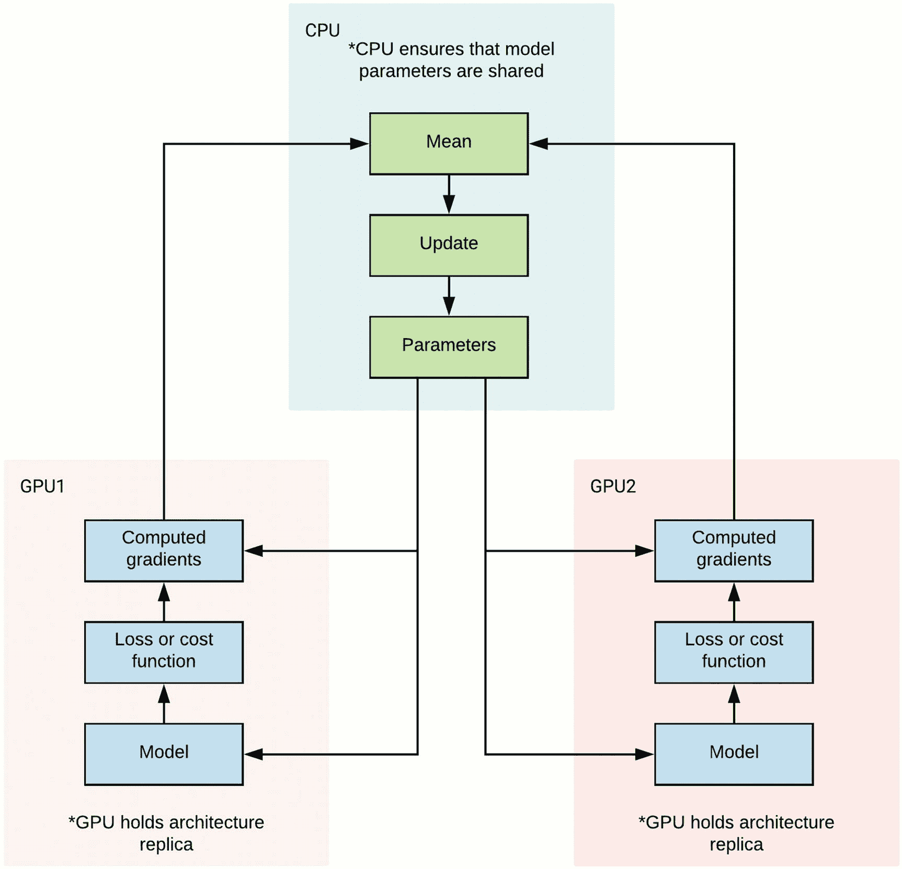

图 30-10

多 GPU 训练框架

TensorFlow 2.0 使用 **‘tf.distribute.Strategy’** API 在多台机器（即 CPU、GPU 或 TPUs）上执行分布式训练。要在 Google Colab 上使用 GPU，首先将运行时类型更改为 GPU，并在笔记本单元中运行以下代码来安装具有 GPU 库的 TensorFlow：

```py
!pip install -q tf-nightly-gpu-2.0-preview
```

以下代码块使用 GPU 进行模型训练。在这个例子中，我们使用波士顿房价数据集训练一个简单的回归模型。方法 **‘tf.distribute.MirroredStrategy()’** 实现了一个名为 MirroredStrategy 的分布式策略。这个策略支持在单台机器上使用多个 GPU 进行分布式训练。代码与 TensorFlow 2.0 中用于线性回归的先前代码类似。然而，为了使变量、层、模型、优化器、指标、摘要和检查点等组件策略感知，添加了一些最小更改，使用 strategy scope() 函数。

```py
# import TensorFlow 2.0 with GPU
!pip install -q tf-nightly-gpu-2.0-preview
# confirm tensorflow can see GPU
import tensorflow as tf
device_name = tf.test.gpu_device_name()
if device_name != '/device:GPU:0':
raise SystemError('GPU device not found')
print('Found GPU at: {}'.format(device_name))
# import other packages
import numpy as np
from tensorflow.keras.datasets import boston_housing
from tensorflow.keras import Model
from sklearn.preprocessing import StandardScaler
# load dataset and split in train and test sets
(X_train, y_train), (X_test, y_test) = boston_housing.load_data()
# standardize the dataset
scaler_X_train = StandardScaler().fit(X_train)
scaler_X_test = StandardScaler().fit(X_test)
X_train = scaler_X_train.transform(X_train)
X_test = scaler_X_test.transform(X_test)
# reshape y-data to become column vector
y_train = np.reshape(y_train, [-1, 1])
y_test = np.reshape(y_test, [-1, 1])
# build the linear model
class LinearRegressionModel(Model):
def __init__(self):
super(LinearRegressionModel, self).__init__()
# initialize weight and bias variables
self.weight = tf.Variable(
initial_value = tf. random.normal(
[13, 1], dtype=tf.float64),
trainable=True)
self.bias = tf.Variable(initial_value = tf.constant(
1.0, shape=[], dtype=tf.float64), trainable=True)
def call(self, inputs):
return tf.add(tf.matmul(inputs, self.weight), self.bias)
# create a strategy to distribute the variables and the graph
strategy = tf.distribute.MirroredStrategy()
# print number of machines with GPUs
print ('Number of devices: {}'.format(strategy.num_replicas_in_sync))
# parameters
batch_size_per_replica = 32
global_batch_size = batch_size_per_replica * strategy.num_replicas_in_sync
learning_rate = 0.01
# create the distributed datasets inside a strategy.scope:
with strategy.scope():
train_ds = tf.data.Dataset.from_tensor_slices(
(X_train, y_train)).shuffle(len(X_train)).batch(global_batch_size)
train_dist_ds = strategy.experimental_distribute_dataset(train_ds)
test_ds = tf.data.Dataset.from_tensor_slices((X_test, y_test)).batch(global_batch_size)
test_dist_ds = strategy.experimental_distribute_dataset(test_ds)
# define the loss function
with strategy.scope():
# Set reduction to `none` so we can do the reduction afterwards and divide by
# global batch size.
loss_object = tf.keras.losses.MeanSquaredError(
reduction=tf.keras.losses.Reduction.NONE)
def compute_loss(labels, predictions):
per_example_loss = loss_object(labels, predictions)
return tf.reduce_sum(per_example_loss) * (1\. / global_batch_size)
# define metrics to track loss and rmse
with strategy.scope():
test_loss = tf.keras.metrics.Mean(name='test_loss')
train_rmse = tf.keras.metrics.RootMeanSquaredError(
name='train_rmse')
test_rmse = tf.keras.metrics.RootMeanSquaredError(
name='test_rmse')
# model and optimizer must be created under `strategy.scope`.
with strategy.scope():
model = LinearRegressionModel()
optimizer = tf.keras.optimizers.SGD(learning_rate=0.01)
with strategy.scope():
def train_step(inputs, labels):
with tf.GradientTape() as tape:
predictions = model(inputs)
loss = compute_loss(labels, predictions)
gradients = tape.gradient(loss, model.trainable_variables)
optimizer.apply_gradients(zip(gradients, model.trainable_variables))
train_rmse.update_state(labels, predictions)
return loss
def test_step(inputs, labels):
predictions = model(inputs)
t_loss = loss_object(labels, predictions)
test_loss.update_state(t_loss)
test_rmse.update_state(labels, predictions)
num_epochs = 1000
with strategy.scope():
# `experimental_run_v2` replicates the provided computation and runs it
# with the distributed input.
@tf.function
def distributed_train_step(inputs, labels):
per_replica_losses = strategy.experimental_run_v2(train_step,
args=(inputs, labels))
return strategy.reduce(tf.distribute.ReduceOp.SUM, per_replica_losses,
axis=None)
@tf.function
def distributed_test_step(inputs, labels):
return strategy.experimental_run_v2(test_step, args=(inputs, labels))
for epoch in range(num_epochs):
# Train loop
total_loss = 0.0
num_batches = 0
for train_inputs, train_labels in train_dist_ds:
total_loss += distributed_train_step(train_inputs, train_labels)
num_batches += 1
train_loss = total_loss / num_batches
# Test loop
for test_inputs, test_labels in test_dist_ds:
distributed_test_step(test_inputs, test_labels)
if (epoch+1) % 100 == 0:
template = ("Epoch {}, Loss: {}, RMSE: {}, Test Loss: {}, "
"Test RMSE: {}")
print (template.format(epoch+1, train_loss,
train_rmse.result(), test_loss.result(),
test_rmse.result()))
test_loss.reset_states()
train_rmse.reset_states()
test_rmse.reset_states()
'Output:'
Epoch 100, Loss: 21.673020569627965, RMSE: 4.724063396453857, Test Loss: 20.915191650390625, Test RMSE: 4.573312759399414
Epoch 200, Loss: 21.594741116702117, RMSE: 4.715524196624756, Test Loss: 20.994861602783203, Test RMSE: 4.582014560699463
Epoch 300, Loss: 21.590902259189097, RMSE: 4.7151055335998535, Test Loss: 21.02731704711914, Test RMSE: 4.585555076599121
Epoch 400, Loss: 21.59074064145569, RMSE: 4.715087413787842, Test Loss: 21.03565216064453, Test RMSE: 4.5864644050598145
Epoch 500, Loss: 21.590740279510765, RMSE: 4.715087413787842, Test Loss: 21.037595748901367, Test RMSE: 4.586676120758057
Epoch 600, Loss: 21.590742194311133, RMSE: 4.715087890625, Test Loss: 21.03803825378418, Test RMSE: 4.586724281311035
Epoch 700, Loss: 21.59074262401866, RMSE: 4.715087890625, Test Loss: 21.03813934326172, Test RMSE: 4.586735248565674
Epoch 800, Loss: 21.59074272223048, RMSE: 4.715087413787842, Test Loss: 21.038162231445312, Test RMSE: 4.586737632751465
Epoch 900, Loss: 21.59074286927267, RMSE: 4.715087413787842, Test Loss: 21.03816795349121, Test RMSE: 4.586737632751465
Epoch 1000, Loss: 21.590742907190307, RMSE: 4.715087413787842, Test Loss: 21.03816795349121, Test RMSE: 4.586738109588623
```

请注意以下来自先前代码块的内容：

+   当编写自定义训练循环时，计算每个示例的损失总和，然后除以全局批量大小。在代码中为 tf.reduce_sum(per_example_loss) * (1. / global_batch_size)。这是因为在每个副本的计算之后，通过求和将梯度同步到各个副本。当使用 tf.keras.losses 类时，需要显式指定损失减少为 NONE 或 SUM 之一。

## TensorFlow 高级 API：使用 Estimators

在本节中，我们将使用高级 TensorFlow Estimator API 和预制的 Estimators 进行建模。Estimators 提供了另一个高级 API，用于构建 TensorFlow 模型，以便在 CPU、GPU 或 TPUs 上执行，而无需进行大量代码修改。

当使用预制的 Estimators 时，通常遵循以下步骤：

1.  编写 **‘input_fn’** 以处理数据管道。

1.  使用特征列 **‘tf.feature_column’** 将数据属性的类型定义为模型。

1.  通过传递特征列和其他相关属性来实例化一个预制的 Estimator。

1.  使用 **‘train()’**、**‘evaluate()’** 和 **‘predict()’** 方法在评估数据集上训练和评估模型，并使用模型进行预测/推理。

让我们再次通过使用波士顿房价数据集来查看一个使用 TensorFlow 预制 Estimator 的工作示例。

### 注意

在运行以下单元格之前重置会话，并将运行时类型更改为 None。

```py
# import packages
import datetime
import numpy as np
import pandas as pd
import tensorflow as tf
from tensorflow.keras.datasets import boston_housing
from tensorflow.keras import Model
from sklearn.preprocessing import StandardScaler
# load dataset and split in train and test sets
(X_train, y_train), (X_test, y_test) = boston_housing.load_data()
# standardize the dataset
scaler_X_train = StandardScaler().fit(X_train)
scaler_X_test = StandardScaler().fit(X_test)
X_train = scaler_X_train.transform(X_train)
X_test = scaler_X_test.transform(X_test)
# reshape y-data to become column vector
y_train = np.reshape(y_train, [-1, 1])
y_test = np.reshape(y_test, [-1, 1])
# parameters
batch_size = 32
learning_rate = 0.01
# create an input_fn
def input_fn(features, labels, batch_size=30, training=True):
dataset = tf.data.Dataset.from_tensor_slices((features, labels))
if training:
dataset = dataset.shuffle(buffer_size=1000)
dataset = dataset.repeat()
return dataset.batch(batch_size)
# use feature columns to define the attributes to the model
feature_columns = []
columns_names = []
for i in range(X_train.shape[1]):
feature_columns.append(tf.feature_column.numeric_column(key=str(i)))
columns_names.append(str(i))
# instantiate a LinearRegressor Estimator
estimator = tf.estimator.DNNRegressor(
feature_columns=feature_columns,
hidden_units=[20]
)
# convert feature datasets to dictionary
X_train_pd = pd.DataFrame(X_train)
X_train_pd.columns = columns_names
X_test_pd = pd.DataFrame(X_test)
X_test_pd.columns = columns_names
# train model
estimator.train(input_fn=lambda:input_fn(dict(X_train_pd), y_train), steps=2000)
# evaluate model
metrics = estimator.evaluate(input_fn=lambda:input_fn(dict(X_test_pd), y_test, training=False))
# print model metrics
metrics
```

## 使用 Keras 的神经网络

在本节中，我们将使用 Sequential 和 Functional Keras API 构建一个简单的神经网络模型。Sequential API 是通过堆叠一层又一层的层来构建深度神经网络模型的最常用方法。Functional API 提供了更多的灵活性来构建更复杂的神经网络架构。这两种 API 方法在 Keras 中相对容易构建，正如我们将在示例中看到的那样。

如前例所示，通过子类化模型提供了构建和检查复杂模型更多的灵活性。然而，代码更冗长，可能更容易出错。这种技术应根据问题的使用场景来决定是否使用。我们之前使用它们作为示例。

以下示例将使用 Iris 数据集构建一个包含一个隐藏层的神经网络，如图 30-11 所示。

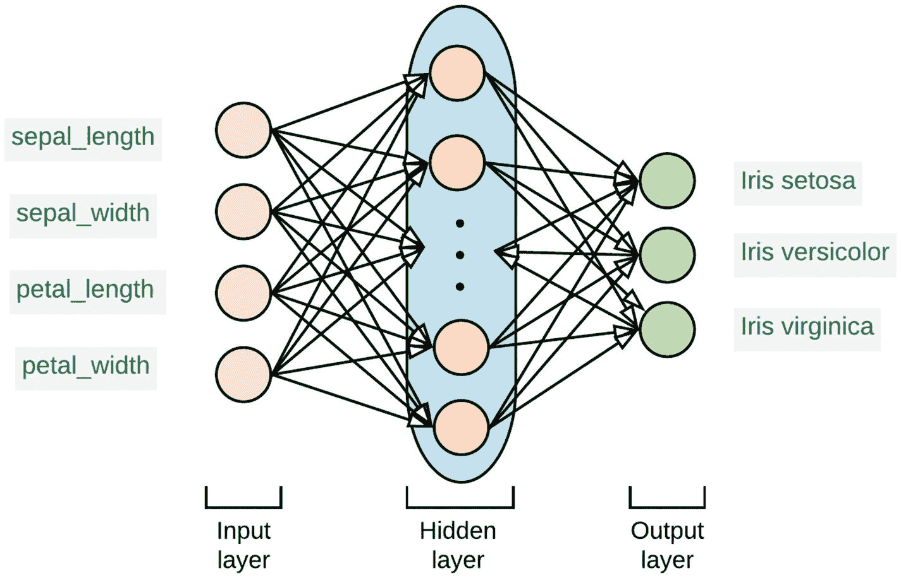

图 30-11

Iris 数据集 - 神经网络架构

## 使用 Keras 顺序 API

此代码段将使用 **‘tf.keras.Sequential()’** 方法构建一个神经网络模型，通过堆叠层来创建一个包含 32 个神经元的隐藏层和一个包含 3 个输出单元的输出层，因为 Iris 目标包含 3 个类别。

```py
!pip install -q tensorflow==2.0.0-beta0
# import packages
import tensorflow as tf
import pandas as pd
from sklearn.preprocessing import OneHotEncoder
# dataset url
train_data_url = "https://storage.googleapis.com/download.tensorflow.org/data/iris_training.csv"
test_data_url = "https://storage.googleapis.com/download.tensorflow.org/data/iris_test.csv"
# define column names
columns = ['sepal_length', 'sepal_width', 'petal_length', 'petal_width', 'species']
# download and load the csv files
train_data = pd.read_csv(tf.keras.utils.get_file('iris_train.csv', train_data_url),
skiprows=1, header=None, names=columns)
test_data = pd.read_csv(tf.keras.utils.get_file('iris_test.csv', test_data_url),
skiprows=1, header=None, names=columns)
# separate the features and targets
(X_train, y_train) = (train_data.iloc[:,0:-1], train_data.iloc[:,-1])
(X_test, y_test) = (test_data.iloc[:,0:-1], test_data.iloc[:,-1])
# apply one-hot encoding to targets
y_train=tf.keras.utils.to_categorical(y_train)
y_test=tf.keras.utils.to_categorical(y_test)
# create the sequential model
def model_fn():
model = tf.keras.Sequential()
# Add a densely-connected layer with 32 units to the model:
model.add(tf.keras.layers.Dense(32, activation="sigmoid", input_dim=4))
# Add a softmax layer with 3 output units:
model.add(tf.keras.layers.Dense(3, activation="softmax"))
# compile the model
model.compile(optimizer=tf.keras.optimizers.SGD(),
loss='categorical_crossentropy',
metrics=['accuracy'])
return model
# parameters
batch_size=50
# use tf.data to batch and shuffle the dataset
train_ds = tf.data.Dataset.from_tensor_slices(
(X_train.values, y_train)).shuffle(len(X_train)).repeat().batch(batch_size)
test_ds = tf.data.Dataset.from_tensor_slices((X_test.values, y_test)).batch(batch_size)
# build train model
model = model_fn()
# print train model summary
model.summary()
# train the model
history = model.fit(train_ds,steps_per_epoch=5000)
# evaluate the model
score = model.evaluate(test_ds)
print('Test loss: {:.2f} \nTest accuracy: {:.2f}%'.format(score[0], score[1]*100))
'Output':
Test loss: 0.22
Test accuracy: 96.67%
```

## 使用 Keras 功能 API

功能 API 的一般代码模式在结构上与顺序版本相同。这里唯一的区别在于网络模型的构建方式。我们还在这个例子中展示了 Keras 打印模型图的特性。输出如图 30-12 所示。

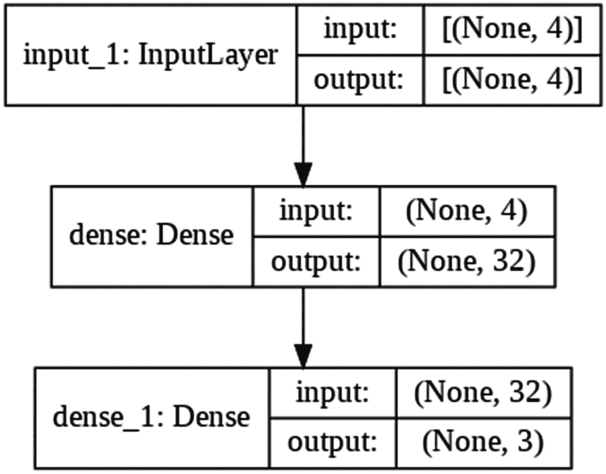

图 30-12

模型的图 - 使用 Keras 生成

```py
!pip install -q tensorflow==2.0.0-beta0
# import packages
import tensorflow as tf
import pandas as pd
from sklearn.preprocessing import OneHotEncoder
# dataset url
train_data_url = "https://storage.googleapis.com/download.tensorflow.org/data/iris_training.csv"
test_data_url = "https://storage.googleapis.com/download.tensorflow.org/data/iris_test.csv"
# define column names
columns = ['sepal_length', 'sepal_width', 'petal_length', 'petal_width', 'species']
# download and load the csv files
train_data = pd.read_csv(tf.keras.utils.get_file('iris_train.csv', train_data_url),
skiprows=1, header=None, names=columns)
test_data = pd.read_csv(tf.keras.utils.get_file('iris_test.csv', test_data_url),
skiprows=1, header=None, names=columns)
# separate the features and targets
(X_train, y_train) = (train_data.iloc[:,0:-1], train_data.iloc[:,-1])
(X_test, y_test) = (test_data.iloc[:,0:-1], test_data.iloc[:,-1])
# apply one-hot encoding to targets
y_train=tf.keras.utils.to_categorical(y_train)
y_test=tf.keras.utils.to_categorical(y_test)
# create the functional model
def model_fn():
# Model input
model_input = tf.keras.layers.Input(shape=(4,))
# Adds a densely-connected layer with 32 units to the model:
x = tf.keras.layers.Dense(32, activation="relu")(model_input)
# Add a softmax layer with 3 output units:
predictions = tf.keras.layers.Dense(3, activation="softmax")(x)
# the model
model = tf.keras.Model(inputs=model_input,
outputs=predictions,
name='iris_model')
# compile the model
model.compile(optimizer='sgd',
loss='categorical_crossentropy',
metrics=['accuracy'])
return model
# parameters
batch_size=50
# use tf.data to batch and shuffle the dataset
train_ds = tf.data.Dataset.from_tensor_slices(
(X_train.values, y_train)).shuffle(len(X_train)).repeat().batch(batch_size)
test_ds = tf.data.Dataset.from_tensor_slices((X_test.values, y_test)).batch(batch_size)
# build train model
model = model_fn()
# print train model summary
model.summary()
# plot the model as a graph
tf.keras.utils.plot_model(model, 'keras_iris_model.png', show_shapes=True)
# train the model
history = model.fit(train_ds, steps_per_epoch=5000)
# evaluate the model
score = model.evaluate(test_ds)
print('Test loss: {:.2f} \nTest accuracy: {:.2f}%'.format(score[0], score[1]*100))
'Output':
Test loss: 0.07
Test accuracy: 96.67%
```

## 使用 Keras 进行模型可视化

使用 Keras，绘制模型的度量指标非常简单直接，可以更好地从图形上了解模型在每个训练 epoch 的表现。这种视图对于处理模型的偏差或方差问题也很有用。

‘model.fit()’ 方法的回调函数返回每个 epoch 的损失和评估分数。这些信息存储在一个变量中并进行了绘图。

在这个例子中，我们使用相同的 Iris 数据集模型来展示使用 Keras 的可视化。模型在每个时期的损失和准确度图分别显示在图 30-13 和图 30-14 中。

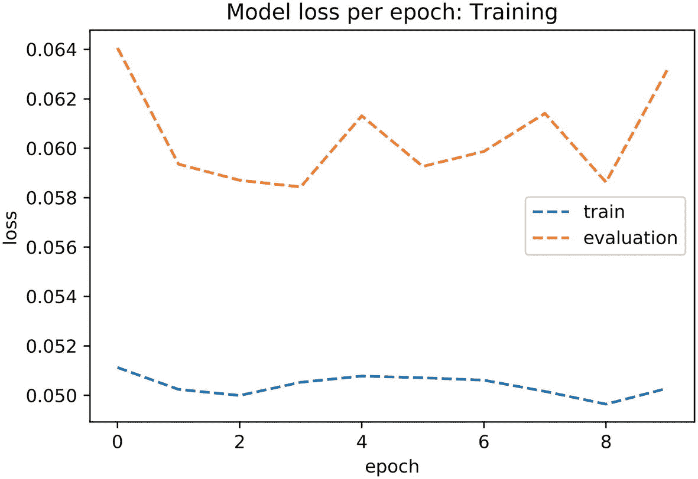

图 30-13

每个时期的模型损失

```py
!pip install -q tensorflow==2.0.0-beta0
# import packages
import tensorflow as tf
import pandas as pd
import matplotlib.pyplot as plt
from sklearn.preprocessing import OneHotEncoder
# dataset url
train_data_url = "https://storage.googleapis.com/download.tensorflow.org/data/iris_training.csv"
test_data_url = "https://storage.googleapis.com/download.tensorflow.org/data/iris_test.csv"
# define column names
columns = ['sepal_length', 'sepal_width', 'petal_length', 'petal_width', 'species']
# download and load the csv files
train_data = pd.read_csv(tf.keras.utils.get_file('iris_train.csv', train_data_url),
skiprows=1, header=None, names=columns)
test_data = pd.read_csv(tf.keras.utils.get_file('iris_test.csv', test_data_url),
skiprows=1, header=None, names=columns)
# separate the features and targets
(X_train, y_train) = (train_data.iloc[:,0:-1], train_data.iloc[:,-1])
(X_test, y_test) = (test_data.iloc[:,0:-1], test_data.iloc[:,-1])
# apply one-hot encoding to targets
y_train=tf.keras.utils.to_categorical(y_train)
y_test=tf.keras.utils.to_categorical(y_test)
# create the functional model
def model_fn():
# Model input
model_input = tf.keras.layers.Input(shape=(4,))
# Adds a densely-connected layer with 32 units to the model:
x = tf.keras.layers.Dense(32, activation="relu")(model_input)
# Add a softmax layer with 3 output units:
predictions = tf.keras.layers.Dense(3, activation="softmax")(x)
# the model
model = tf.keras.Model(inputs=model_input,
outputs=predictions,
name='iris_model')
# compile the model
model.compile(optimizer='sgd',
loss='categorical_crossentropy',
metrics=['accuracy'])
return model
# parameters
batch_size=50
# use tf.data to batch and shuffle the dataset
train_ds = tf.data.Dataset.from_tensor_slices(
(X_train.values, y_train)).shuffle(len(X_train)).repeat().batch(batch_size)
test_ds = tf.data.Dataset.from_tensor_slices((X_test.values, y_test)).batch(batch_size)
# build train model
model = model_fn()
# print train model summary
model.summary()
# train the model
history = model.fit(train_ds, epochs=10,
steps_per_epoch=100,
validation_data=test_ds)
# list metrics returned from callback function
history.history.keys()
# plot loss metric
plt.figure(1)
plt.plot(history.history['loss'], '--')
plt.plot(history.history['val_loss'], '--')
plt.title('Model loss per epoch: Training')
plt.ylabel('loss')
plt.xlabel('epoch')
plt.legend(['train', 'evaluation'])
plt.show()
```

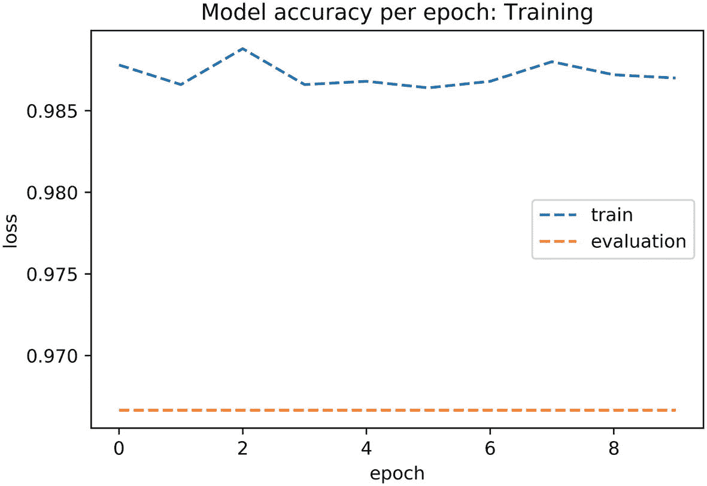

图 30-14

每个时期的模型准确度

```py
# plot accuracy metric
plt.figure(2)
plt.plot(history.history['accuracy'], '--')
plt.plot(history.history['val_accuracy'], '--')
plt.title('Model accuracy per epoch: Training')
plt.ylabel('loss')
plt.xlabel('epoch')
plt.legend(['train', 'evaluation'])
plt.show()
```

## TensorBoard 与 Keras

要使用 TensorBoard 可视化模型，在训练模型之前，将 TensorBoard 回调 **‘tf.keras.callbacks.TensorBoard()’**附加到 **‘model.fit()’** 方法上。模型图、标量、直方图和其他指标作为事件文件存储在日志目录中。

对于这个例子，我们将 Iris 模型修改为使用 TensorBoard。TensorBoard 的输出显示在图 30-15 中。

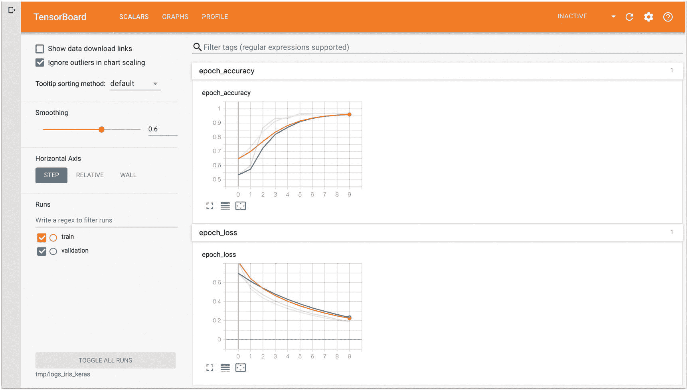

图 30-15

Iris 模型的 TensorBoard 输出

```py
!pip install -q tensorflow==2.0.0-beta0
# import packages
import tensorflow as tf
import pandas as pd
from sklearn.preprocessing import OneHotEncoder
# load the TensorBoard notebook extension
%load_ext tensorboard
# dataset url
train_data_url = "https://storage.googleapis.com/download.tensorflow.org/data/iris_training.csv"
test_data_url = "https://storage.googleapis.com/download.tensorflow.org/data/iris_test.csv"
# define column names
columns = ['sepal_length', 'sepal_width', 'petal_length', 'petal_width', 'species']
# download and load the csv files
train_data = pd.read_csv(tf.keras.utils.get_file('iris_train.csv', train_data_url),
skiprows=1, header=None, names=columns)
test_data = pd.read_csv(tf.keras.utils.get_file('iris_test.csv', test_data_url),
skiprows=1, header=None, names=columns)
# separate the features and targets
(X_train, y_train) = (train_data.iloc[:,0:-1], train_data.iloc[:,-1])
(X_test, y_test) = (test_data.iloc[:,0:-1], test_data.iloc[:,-1])
# apply one-hot encoding to targets
y_train=tf.keras.utils.to_categorical(y_train)
y_test=tf.keras.utils.to_categorical(y_test)
# create the functional model
def model_fn():
# Model input
model_input = tf.keras.layers.Input(shape=(4,))
# Adds a densely-connected layer with 32 units to the model:
x = tf.keras.layers.Dense(32, activation="relu")(model_input)
# Add a softmax layer with 3 output units:
predictions = tf.keras.layers.Dense(3, activation="softmax")(x)
# the model
model = tf.keras.Model(inputs=model_input,
outputs=predictions,
name='iris_model')
# compile the model
model.compile(optimizer='sgd',
loss='categorical_crossentropy',
metrics=['accuracy'])
return model
# parameters
batch_size=50
# use tf.data to batch and shuffle the dataset
train_ds = tf.data.Dataset.from_tensor_slices(
(X_train.values, y_train)).shuffle(len(X_train)).repeat().batch(batch_size)
test_ds = tf.data.Dataset.from_tensor_slices((X_test.values, y_test)).batch(batch_size)
# build train model
model = model_fn()
# print train model summary
model.summary()
# tensorboard
tensorboard = tf.keras.callbacks.TensorBoard(log_dir='./tmp/logs_iris_keras',
histogram_freq=0, write_graph=True,
write_images=True)
# assign callback
callbacks = [tensorboard]
# train the model
history = model.fit(train_ds, epochs=10,
steps_per_epoch=100,
validation_data=test_ds,
callbacks=callbacks)
# evaluate the model
score = model.evaluate(test_ds)
print('Test loss: {:.2f} \nTest accuracy: {:.2f}%'.format(score[0], score[1]*100))
# execute the command to run TensorBoard
%tensorboard --logdir tmp/logs_iris_keras
```

## 检查点以选择最佳模型

检查点（Checkpointing）使得在验证准确度指标增加时保存神经网络模型的权重成为可能。在 Keras 中，这是通过使用 **‘tf.keras.callbacks.ModelCheckpoint()’** 实现的。保存的权重可以随后被加载回模型中，并用于进行预测。使用 Iris 数据集，我们将构建一个模型，仅在验证集性能有所改进时才将权重保存到文件中。为了完整性，就像我们在前面的部分所做的那样，我们将在完整的代码列表中展示这个例子。

```py
!pip install -q tensorflow==2.0.0-beta0
# import packages
import tensorflow as tf
import pandas as pd
from sklearn.preprocessing import OneHotEncoder
# dataset url
train_data_url = "https://storage.googleapis.com/download.tensorflow.org/data/iris_training.csv"
test_data_url = "https://storage.googleapis.com/download.tensorflow.org/data/iris_test.csv"
# define column names
columns = ['sepal_length', 'sepal_width', 'petal_length', 'petal_width', 'species']
# download and load the csv files
train_data = pd.read_csv(tf.keras.utils.get_file('iris_train.csv', train_data_url),
skiprows=1, header=None, names=columns)
test_data = pd.read_csv(tf.keras.utils.get_file('iris_test.csv', test_data_url),
skiprows=1, header=None, names=columns)
# separate the features and targets
(X_train, y_train) = (train_data.iloc[:,0:-1], train_data.iloc[:,-1])
(X_test, y_test) = (test_data.iloc[:,0:-1], test_data.iloc[:,-1])
# apply one-hot encoding to targets
y_train=tf.keras.utils.to_categorical(y_train)
y_test=tf.keras.utils.to_categorical(y_test)
# create the functional model
def model_fn():
# Model input
model_input = tf.keras.layers.Input(shape=(4,))
# Adds a densely-connected layer with 32 units to the model:
x = tf.keras.layers.Dense(32, activation="relu")(model_input)
# Add a softmax layer with 3 output units:
predictions = tf.keras.layers.Dense(3, activation="softmax")(x)
# the model
model = tf.keras.Model(inputs=model_input,
outputs=predictions,
name='iris_model')
# compile the model
model.compile(optimizer='sgd',
loss='categorical_crossentropy',
metrics=['accuracy'])
return model
# parameters
batch_size=50
# use tf.data to batch and shuffle the dataset
train_ds = tf.data.Dataset.from_tensor_slices(
(X_train.values, y_train)).shuffle(len(X_train)).repeat().batch(batch_size)
test_ds = tf.data.Dataset.from_tensor_slices((X_test.values, y_test)).batch(batch_size)
# build train model
model = model_fn()
# print train model summary
model.summary()
# checkpointing
checkpoint = tf.keras.callbacks.ModelCheckpoint(
'./tmp/iris_weights.h5',
monitor='val_accuracy',
verbose=1,
save_best_only=True,
mode='max')
# assign callback
callbacks = [checkpoint]
# train the model
history = model.fit(train_ds, epochs=10,
steps_per_epoch=100,
validation_data=test_ds,
callbacks=callbacks)
# build evaluation model and upload saved weights
eval_model = model_fn()
eval_model.load_weights('./tmp/iris_weights.h5')
# evaluate the model
score = eval_model.evaluate(test_ds)
print('Test loss: {:.2f} \nTest accuracy: {:.2f}%'.format(score[0], score[1]*100))
```

本章介绍了 TensorFlow 2.0 的工作基础及其在开发机器学习模型方面的激动人心的新特性。这些新特性包括模型设计和调试的更 Pythonic 感觉，使用 tf.function 将 Python 方法转换为高性能 TensorFlow 图，使用 Keras 作为模型设计的核心高级 API，使用 FeatureColumns 将数据解析为 Keras 模型的输入，以及在分布式架构和设备上训练的便利性。本章还介绍了使用高级 Estimator API 构建模型的原则。

在接下来的章节中，我们将更深入地探讨深度神经网络以及它们如何在 TensorFlow 的 Keras 中实现。在 TensorFlow 2.0 中，Keras 是开发神经网络的默认方法。

# 31. 多层感知器（MLP）

多层感知器（MLP）是深度神经网络的基本示例。MLP 的架构由多个隐藏层组成，以捕捉训练数据集中存在的更复杂的关系。MLP 的另一个名称是深度前馈神经网络（DFN）。MLP 的示意图显示在图 31-1 中。

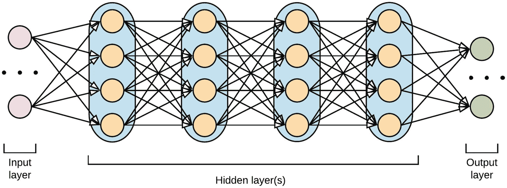

图 31-1

深度前馈神经网络

## 层次的概念

神经网络中隐藏层的数量越多，网络就越深。深度网络能够学习更复杂的输入表示。层次表示的概念是，每一层学习一组描述输入的特征，并将这些信息层次化地传递到隐藏层。最初，靠近输入层的隐藏层学习一组简单的特征，随着信息流向网络的深层，这些特征变得越来越复杂，以捕捉输入和目标之间的映射。见图 31-2。

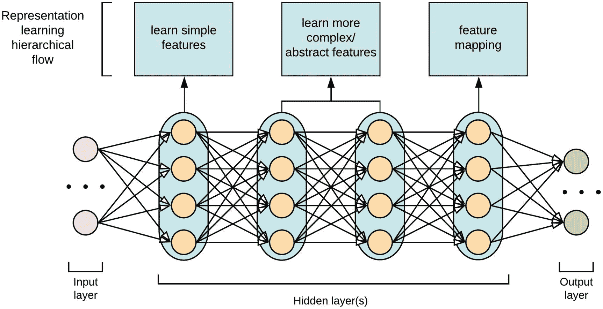

图 31-2

层次学习

## 选择隐藏层数量：偏差/方差权衡

从经验来看，增加隐藏层的数量可能会提高网络的表示质量；然而，任意增加网络设计中的隐藏层数量可能会对网络的总体性能产生不利影响，尤其是在泛化到未见过的观察结果方面。这是因为神经网络将更紧密地学习训练数据集中固有的不可减少的错误，并且无法泛化到新的例子。

在选择隐藏层数量时，应采取适当的谨慎措施，以避免过拟合。对于神经网络的正则化技术，如 Tikhonov 正则化、Dropout 或提前停止，是减轻过拟合的不同方法。神经网络的正则化将在后面的章节中更详细地介绍。

经验上，一个隐藏层对于简单的学习问题会产生良好的结果，但如果输出类别的数量增加或数据特征之间存在高度的非线性，则建议在确保模型在测试数据上表现良好的同时添加更多层。选择隐藏层中的神经元数量和隐藏层的数量通常是一个试错启发式方法，并且是应用超参数调优以改进网络性能的案例。使用网格搜索进行超参数调优是近似一个在测试数据上表现良好的最优神经网络架构的好方法。

## 基于 Keras 的多层感知器（MLP）

在本节中，我们将通过使用 Keras 构建 MLP 模型来考察一个激励性的例子。这样做时，我们将进行以下步骤：

+   导入并转换数据集。

+   构建和编译模型。

+   使用**‘Model.fit()’**训练数据。

+   使用**‘Model.evaluate()’**评估模型。

+   使用**‘Model.predict()’**对未见数据做出预测。

本例中使用的数据库是时尚 MNIST 数据库，包含 60,000 个 28 x 28 像素的灰度图像，代表十种服装项目（目标类别）。此数据集是从**‘tf.keras.datasets’**包中下载的。以下代码示例将构建一个简单的 MLP 神经网络，用于计算机将服装图像分类到适当的类别。该网络架构具有以下层：

+   一个包含 250 个神经元的密集隐藏层

+   一个包含 64 个神经元的第二隐藏层

+   一个包含 32 个神经元的第三隐藏层

+   具有十个输出类别的输出层

```py
# install tensorflow 2.0
!pip install -q tensorflow==2.0.0-beta0
# import packages
import tensorflow as tf
import numpy as np
# import dataset
(x_train, y_train), (x_test, y_test) = tf.keras.datasets.fashion_mnist.load_data()
# flatten the 28*28 pixel images into one long 784 pixel vector
x_train = np.reshape(x_train, (-1, 784)).astype('float32')
x_test = np.reshape(x_test, (-1, 784)).astype('float32')
# scale dataset from 0 -> 255 to 0 -> 1
x_train /= 255
x_test /= 255
# one-hot encode targets
y_train = tf.keras.utils.to_categorical(y_train)
y_test = tf.keras.utils.to_categorical(y_test)
# create the model
def model_fn():
model = tf.keras.Sequential()
# Adds a densely-connected layer with 256 units to the model:
model.add(tf.keras.layers.Dense(256, activation="relu", input_dim=784))
# Add Dense layer with 64 units
model.add(tf.keras.layers.Dense(64, activation="relu"))
# Add another densely-connected layer with 32 units:
model.add(tf.keras.layers.Dense(32, activation="relu"))
# Add a softmax layer with 10 output units:
model.add(tf.keras.layers.Dense(10, activation="softmax"))
# compile the model
model.compile(optimizer=tf.keras.optimizers.SGD(0.01),
loss='categorical_crossentropy',
metrics=['accuracy'])
return model
# build model
model = model_fn()
# use tf.data to batch and shuffle the dataset
train_ds = tf.data.Dataset.from_tensor_slices(
(x_train, y_train)).shuffle(len(x_train)).repeat().batch(32)
test_ds = tf.data.Dataset.from_tensor_slices((x_test, y_test)).batch(32)
# train the model
model.fit(train_ds, epochs=10,
steps_per_epoch=2000)
# evaluate the model
score = model.evaluate(test_ds)
print('Test loss: {:.2f} \nTest accuracy: {:.2f}%'.format(score[0], score[1]*100))
'Ouput:'
Test loss: 0.35
Test accuracy: 87.36%
```

从前面的代码中观察以下内容：

+   通过调用**‘tf.keras.Sequential()’**方法构建 Keras 顺序模型，然后向模型中添加层。

+   构建模型层之后，通过调用方法‘.compile()’来编译模型。

+   通过调用**‘.fit()’**方法来训练模型，该方法从**‘tf.data.Dataset’**管道接收训练特征和目标。

+   使用**‘.evaluate()’**方法来获取训练后模型的最终指标估计和损失分数。

在本章中，我们介绍了多层感知器网络及其如何通过堆叠神经元层形成深度表示层次结构，从而在复杂学习问题上实现良好的性能。通过这样做，网络学习哪些特征是相关的，同时也学习网络中哪些权重将最佳地逼近目标函数。

在下一章中，我们将讨论训练深度神经网络的其他考虑因素。

# 32. 训练网络的其他考虑因素

在本章中，我们将介绍在训练深度神经网络时需要考虑的一些其他重要技术。

## 权重初始化

权重初始化是在训练前为神经网络（参数）的权重分配初始值的技术（见图 32-1）。适当的权重初始化可以减轻网络训练时梯度消失和爆炸的影响。它还可能加快训练过程。两种常用的权重初始化方法是 Xavier 和 He 技术。我们不会深入解释这些初始化策略的技术细节。然而，它们在标准的深度学习框架库（如 TensorFlow 和 Keras）中得到了实现。在 TensorFlow 2.0 中，**‘tf.keras.layers.Dense()’**中的密集层默认使用 Glorot 均匀初始化器，也称为 Xavier 均匀初始化器。

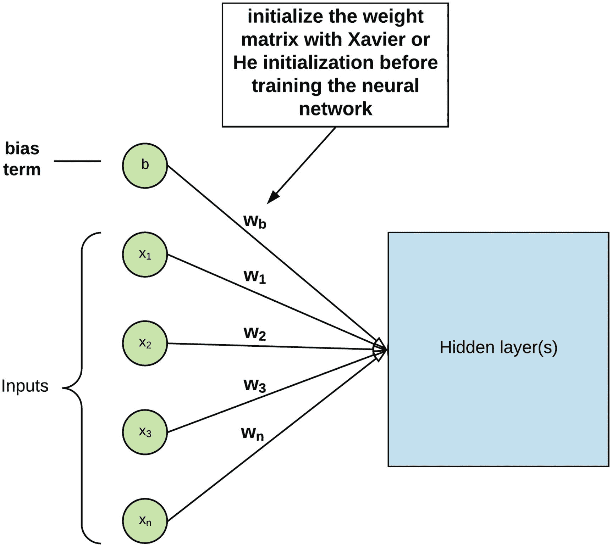

图 32-1

权重初始化

## 批标准化

批标准化技术涉及在训练阶段对数据进行标准化（使其具有零均值和单位方差），以及在每个神经网络的每一层中对数据批次进行缩放和偏移。批标准化发生在输入矩阵及其权重进行仿射变换之后，但在将变换传递到激活函数之前（见图 32-2）。

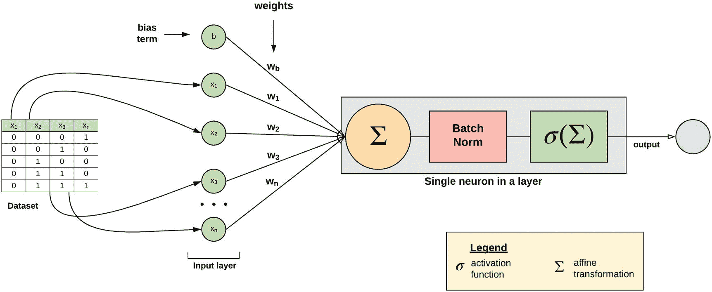

图 32-2

批标准化，也称为批归一化

神经网络在训练过程中学习每个层上数据缩放和偏移的参数。在训练阶段，还维护数据的运行均值和标准差得分，以便在评估之前用于标准化测试数据。

批标准化无论权重初始化如何，都可以减轻梯度爆炸和消失的问题。然而，由于在每个层中增加了计算步骤，网络可能稍微慢一些。通过调用方法 **‘tf.keras.layers. BatchNormalization()’** 将批标准化层添加到 TensorFlow 2.0 网络模型中，如下面的代码示例所示。

```py
# create the model
def model_fn():
model = tf.keras.Sequential()
# Adds a densely-connected layer with 256 units to the model:
model.add(tf.keras.layers.Dense(256, activation="relu", input_dim=784))
# Add Dense layer with 64 units
model.add(tf.keras.layers.Dense(64, activation="relu"))
# Add a Batch Normalization layer
model.add(tf.keras.layers.BatchNormalization())
# Add another densely-connected layer with 32 units:
model.add(tf.keras.layers.Dense(32, activation="relu"))
# Add a softmax layer with 10 output units:
model.add(tf.keras.layers.Dense(10, activation="softmax"))
# compile the model
model.compile(optimizer=tf.keras.optimizers.SGD(0.01),
loss='categorical_crossentropy',
metrics=['accuracy'])
return model
```

## 梯度裁剪

梯度裁剪是解决由于在大量深度循环层之间通过反向传播进行训练而在循环网络中常见梯度消失和爆炸问题的另一种技术。梯度裁剪涉及修剪计算出的梯度，使它们保持在特定范围内；这样做可以防止梯度在网络跨越多个深度层训练时饱和。

在 TensorFlow 2.0 中，梯度裁剪是通过调整从 **‘tf.keras.optimizers’** 包中选择的优化器的 **‘clipnorm’** 或 **‘clipvalue’** 参数来实现的。**‘clipnorm’** 通过梯度范数进行裁剪，而 **‘clipvalue’** 通过梯度值进行裁剪。

本章介绍了用于通过进一步减轻梯度消失和爆炸问题来提高神经网络性能的一些重要技术。在下一章中，我们将看到更多用于训练深度神经网络模型的优化技术。

# 33. 更多关于优化技术

在本章中，我们将介绍一些其他优化技术，以提高神经网络在数据集中学习复杂模式的能力。

## 动量

动量是一种提高随机梯度下降（SGD）优化收敛速度的技术。记住，随机梯度通过在每个时间步评估一个训练示例来学习最陡下降的方向，以优化网络的权重。动量通过计算一个称为指数平滑平均的先前梯度的平均值来改进这一点。然后，它使用这个计算出的平均值继续沿最陡下降方向移动。通过这样做，它加快了学习过程。在计算这个指数衰减的平均值时，引入了一个动量超参数来控制权重参数的更新。图 33-1 展示了在函数空间中收敛时带有和没有动量的随机梯度下降的例子。在 TensorFlow 2.0 中，通过调整**‘momentum’**参数将动量添加到**‘tf.keras.optimizers.SGD(momentum=[float >=0])’**的 SGD 方法中。动量值必须是一个大于或等于 0 的浮点数，它会在相关方向上加速 SGD 并减少振荡。

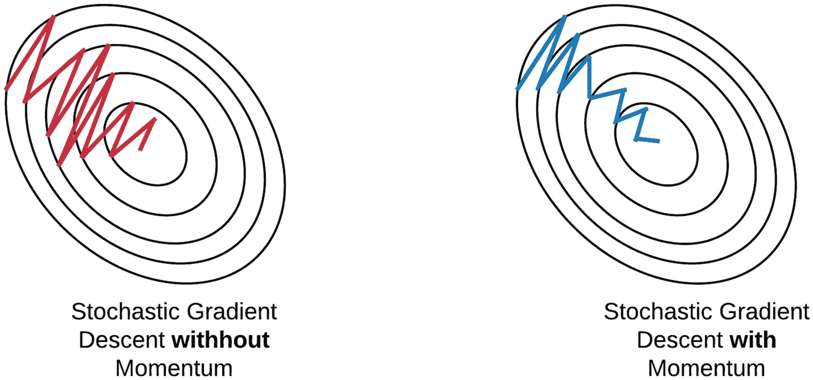

图 33-1

带有和没有动量的 SGD

## 变量学习率

记住，学习率控制梯度下降算法在沿最陡下降方向移动时迈出多大的步长。如果学习率较大，算法会在最陡梯度的方向上迈出更大的步子，这会更快。然而，算法可能会超过全局最小值，无法收敛。但如果学习率设置为一个接近零的小数，算法收敛会慢一些，但更有保证能够收敛。

变量学习率是一组在训练过程中调整梯度下降算法在每个时间实例的学习率的技巧。这些方法也被称为学习率调度。变量学习率的例子包括

+   步长衰减：这种方法在经过一定次数的迭代后通过一个常数因子减少学习率。

+   指数衰减：指数衰减根据指数分布调整学习率。

+   衰减比例：这种方法通过时间实例的 1/t 比例减少学习率。可以通过修改比例常数来调整学习率衰减。

在 TensorFlow 2.0 中，从**‘tf.keras.optimizers’**模块选择的优化器的**‘decay’**参数允许学习率的时间逆衰减。

## 自适应学习率

相反，自适应学习率会根据训练数据重新调整学习率。它基本上为每个参数使用不同的学习率，并在训练过程中进行自适应调整。这些技术基于观察，每个参数会导致不同类型的梯度。以下列表概述了 TensorFlow 2.0 中使用的自适应学习率类型及其方法调用：

+   AdaGrad：**tf.keras.optimizers.Adagrad()**

+   AdaDelta：**tf.keras.optimizers.Adadelta()**

+   RMSProp：**tf.keras.optimizers.RMSprop()**

+   自适应矩，(Adam)：**tf.keras.optimizers.Adam()**

然而，由于 AdaGrad 的学习率是单调的，可能会过于激进，因此在训练深度学习模型时表现不佳，学习过程可能会在训练早期停止。到目前为止，还没有证明有最好的优化技术，因此优化技术的选择取决于模型设计者的偏好。

本章概述了一些优化深度神经网络权重的其他技术。这些技术在深度学习库（如 Tensorflow 和 Keras）中有实现，可以在设计特定学习用例的神经网络解决方案时作为超参数进行探索。

在下一章中，我们将讨论将正则化应用于深度神经网络以防止过拟合的技术。

# 34. 深度学习的正则化

正则化是一种减少验证集方差的技术，从而防止模型在训练过程中过拟合。这样做，模型可以更好地泛化到新的例子。在训练深度神经网络时，存在几种策略可以作为正则化器使用。

## Dropout

Dropout 是一种正则化技术，通过在训练过程中随机丢弃每一层的部分神经元来防止深度神经网络过拟合。这样做，神经网络不会过度依赖于任何单一特征，因为它在训练过程中只使用每一层的子集神经元。因此，Dropout 类似于一个神经网络集成，因为每个层都训练了一个相似但不同的神经网络。Dropout 通过指定一个概率来决定一个神经元是否会在某一层中被丢弃。这个概率值被称为 Dropout 率。图 34-1 展示了带有和不带有 Dropout 的网络示例。

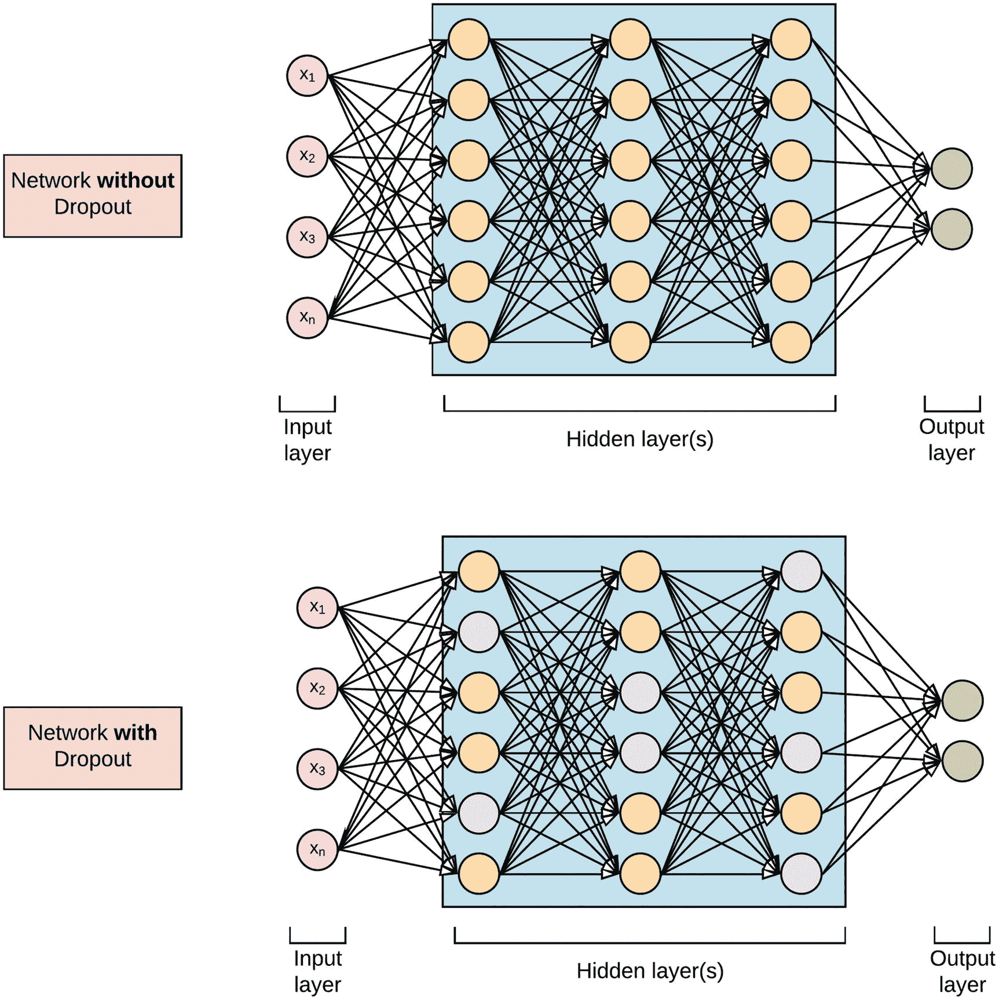

图 34-1

Dropout. 顶部：没有 Dropout 的神经网络。底部：带有 Dropout 的神经网络。

在 TensorFlow 2.0 中，可以通过方法**‘tf.keras.layers.Dropout()’**将 Dropout 添加到模型中。该方法的**‘rate’**参数控制要丢弃的输入单元的比例。它被分配一个介于 0 和 1 之间的浮点值。以下代码示例展示了应用了 Dropout 的 MLP Keras 模型。

```py
# create the model
def model_fn():
model = tf.keras.Sequential()
# Adds a densely-connected layer with 256 units to the model:
model.add(tf.keras.layers.Dense(256, activation="relu", input_dim=784))
# Add Dropout layer
model.add(tf.keras.layers.Dropout(rate=0.2))
# Add another densely-connected layer with 64 units:
model.add(tf.keras.layers.Dense(64, activation="relu"))
# Add a softmax layer with 10 output units:
model.add(tf.keras.layers.Dense(10, activation="softmax"))
# compile the model
model.compile(optimizer=tf.train.AdamOptimizer(0.001),
loss='categorical_crossentropy',
metrics=['accuracy'])
return model
```

## 数据增强

数据增强是一种人工生成更多训练数据点的技术。这种技术基于观察，对于越来越大的训练数据集可以缓解过拟合的问题。对于某些问题，可能很容易人工生成假数据，而对于其他问题则可能不那么容易。一个我们可以使用数据增强的经典例子是在图像分类的情况下。在这里，可以通过旋转或缩放原始图像来轻松创建人工图像，从而为特定图像类别创建更多数据集的变体。

## 噪声注入

噪声注入正则化方法在训练期间向网络输入添加一些高斯噪声。此外，还可以将高斯噪声添加到隐藏单元中，以减轻过拟合。将高斯噪声添加到网络权重中也是向网络注入噪声的另一种形式。噪声注入可以被视为一种数据增强。添加的噪声量是一个可配置的超参数。噪声过少没有效果，而噪声过多则使得映射函数难以学习。

在 TensorFlow 2.0 中，可以通过使用方法**‘tf.keras.layers.GaussianNoise()’**将噪声注入作为数据增强的一种形式添加到模型中。该方法的**‘stddev’**参数控制噪声分布的标准差。下面的代码示例展示了应用高斯噪声的 MLP Keras 模型。

```py
# create the model
def model_fn():
model = tf.keras.Sequential()
# Adds a densely-connected layer with 256 units to the model:
model.add(tf.keras.layers.Dense(256, activation="relu", input_dim=784))
# Add Gaussian Noise
model.add(tf.keras.layers.GaussianNoise(stddev=1.0))
# Add another densely-connected layer with 64 units:
model.add(tf.keras.layers.Dense(64, activation="relu"))
# Add a softmax layer with 10 output units:
model.add(tf.keras.layers.Dense(10, activation="softmax"))
# compile the model
model.compile(optimizer=tf.keras.optimizers.RMSprop(),
loss='categorical_crossentropy',
metrics=['accuracy'])
return model
```

## 提前停止

提前停止涉及在验证数据集上的损失（或误差）估计每次有改进时存储模型参数。在训练阶段结束时，使用存储的模型参数而不是终止前的最后一个已知参数。

提前停止的技术基于观察，对于一个足够复杂的分类器，随着训练阶段的进行，训练数据上的误差估计持续下降，而验证数据将看到模型误差测量的增加。这如图 34-2 所示。

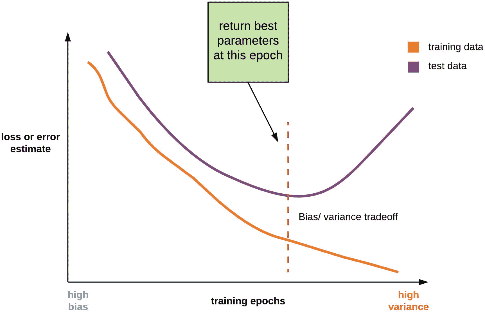

图 34-2

提前停止

在 TensorFlow 2.0 中，可以通过在训练模型时应用**‘tf.keras.callbacks.EarlyStopping()’**方法作为回调来应用提前停止，以停止训练，当验证准确率或损失没有改进时。为了完整性，我们将提供一个完整的代码示例，其中包含对 MLP Fashion-MNIST 模型应用提前停止。

```py
# install tensorflow 2.0
!pip install -q tensorflow==2.0.0-beta0
# import packages
import tensorflow as tf
import numpy as np
# import dataset
(x_train, y_train), (x_test, y_test) = tf.keras.datasets.fashion_mnist.load_data()
# flatten the 28*28 pixel images into one long 784 pixel vector
x_train = np.reshape(x_train, (-1, 784)).astype('float32')
x_test = np.reshape(x_test, (-1, 784)).astype('float32')
# scale dataset from 0 -> 255 to 0 -> 1
x_train /= 255
x_test /= 255
# one-hot encode targets
y_train = tf.keras.utils.to_categorical(y_train)
y_test = tf.keras.utils.to_categorical(y_test)
# create the model
def model_fn():
model = tf.keras.Sequential()
# Adds a densely-connected layer with 256 units to the model:
model.add(tf.keras.layers.Dense(256, activation="relu", input_dim=784))
# Add another densely-connected layer with 128 units:
model.add(tf.keras.layers.Dense(128, activation="relu"))
# Add another densely-connected layer with 64 units:
model.add(tf.keras.layers.Dense(64, activation="relu"))
# Add another densely-connected layer with 32 units:
model.add(tf.keras.layers.Dense(32, activation="relu"))
# Add a softmax layer with 10 output units:
model.add(tf.keras.layers.Dense(10, activation="softmax"))
# compile the model
model.compile(optimizer=tf.keras.optimizers.RMSprop(),
loss='categorical_crossentropy',
metrics=['accuracy'])
return model
# use tf.data to batch and shuffle the dataset
train_ds = tf.data.Dataset.from_tensor_slices(
(x_train, y_train)).shuffle(len(x_train)).repeat().batch(32)
test_ds = tf.data.Dataset.from_tensor_slices((x_test, y_test)).batch(32)
# build model
model = model_fn()
# early stopping
checkpoint = tf.keras.callbacks.EarlyStopping(
monitor='val_loss',
mode='auto',
patience=5)
# assign callback
callbacks = [checkpoint]
# train the model
history = model.fit(train_ds, epochs=10,
steps_per_epoch=100,
validation_data=test_ds,
callbacks=callbacks)
# evaluate the model
score = model.evaluate(test_ds)
print('Test loss: {:.2f} \nTest accuracy: {:.2f}%'.format(score[0], score[1]*100))
```

应用提前停止到前面的代码后，一旦验证数据集上的损失没有改进，训练将停止。EarlyStopping 方法中的**‘patience’**参数表示没有改进的 epoch 数，之后训练将停止。

本章概述了一些解决使用深度神经网络训练时过拟合问题的技术。在下一章中，我们将讨论用于构建计算机视觉用例预测模型的卷积神经网络，例如使用 TensorFlow 2.0 进行图像识别。

# 35. 卷积神经网络（CNN）

卷积神经网络（CNN）是一种特别适合于计算机视觉问题（如图像识别）的特定类型的神经网络系统。在这些任务中，数据集被表示为一个像素的二维网格。见图 35-1。


图 35-1

图像的二维表示

在计算机中，图像被表示为一个像素强度值的矩阵，范围从 0 到 255。灰度（或黑白）图像由一个单通道组成，其中 0 代表黑色区域，255 代表白色区域，中间的值代表各种灰度级别。

例如，图 35-2 中的图像是一个 10 x 10 的灰度图像，其矩阵表示。

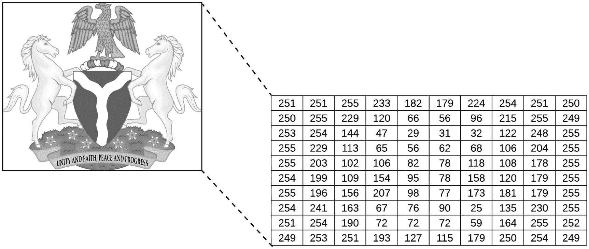

图 35-2

灰度图像的矩阵表示

另一方面，彩色图像由三个通道组成，分别是红色、绿色和蓝色，每个通道也包含从 0 到 255 的像素强度值。彩色图像具有 [高度 x 宽度 x 通道] 的矩阵形状。在图 35-3 中，我们有一个形状为 [10 x 10 x 3] 的图像，表示一个 10 x 10 的矩阵，有三个通道。


图 35-3

彩色图像的矩阵表示

## 视觉皮层的局部感受野

卷积神经网络的核心概念建立在理解视觉皮层神经元中发现的局部感受野之上——这是大脑中处理视觉信息的部分。

局部感受野是神经元上的一个区域，它可以激发或激活该神经元，向其他神经元传递信息。在观察图像时，由于存在小的局部感受野，视觉皮层中的神经元对整体图像的较小或有限区域做出反应。

因此，视觉皮层中的神经元不是同时感知整个图像，而是通过其局部感受野观察图像的局部区域来激活。

在图 35-4 中，局部感受野重叠，从而对整个图像提供了一个整体视角。视觉皮层中的每个神经元对不同的视觉信息（例如，不同方向的线条）做出反应。


图 35-4

局部感受野

其他神经元具有较大的感受野，能够对更复杂的视觉模式（如边缘、区域等）做出反应。从这里我们可以得到这样的想法：具有较大感受野的神经元从具有较小感受野的神经元那里接收信息，随着它们逐步学习图像的视觉信息。

## CNN 相较于 MLP 的优势

假设我们有一个 28 x 28 像素的图像数据集，前馈神经网络或多层感知器将需要 784 个输入权重加上一个偏置。通过将图像展平，就像在 MLP 中做的那样，我们会失去图像中像素的空间关系。

另一方面，CNN 可以通过保留图像像素之间的空间关系来学习复杂的图像特征。它是通过堆叠卷积层来实现的，其中具有较大感受野的高层神经元从具有较小感受野的低层神经元接收信息。随着数据流经网络，CNN 从输入数据中学习到越来越复杂的特征层次。

在 CNN 中，卷积层的神经元（或滤波器）并不像在密集的多层感知器中那样与输入图像的像素全部连接。因此，CNN 也被称为稀疏神经网络。

CNN 相较于 MLP 的一个显著优势是训练网络所需的权重数量减少。

卷积神经网络由三种基本类型的层组成：

+   卷积层

+   池化层

+   全连接层

### 卷积层

卷积层由滤波器和特征图组成。滤波器通过输入图像像素进行传递，以捕获特定的一组特征，这个过程称为卷积（见图 35-5）。滤波器的输出称为特征图。

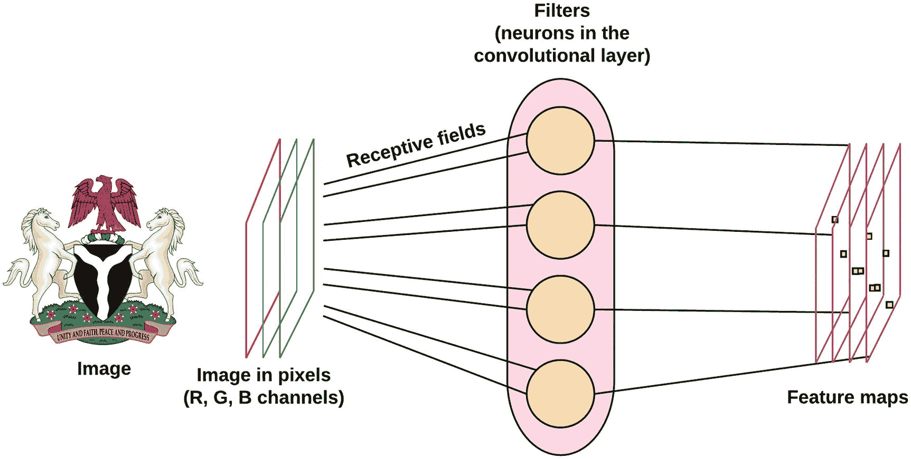

图 35-5

卷积过程

#### 卷积

卷积是将一个函数应用于矩阵以从矩阵中提取特定信息的过程。该函数通过矩阵中的滑动窗口实现，更通俗地称为卷积滤波器或核。这两个术语在文献中可以互换使用。图 35-6 展示了滤波器在矩阵中滑动以提取信息的过程。

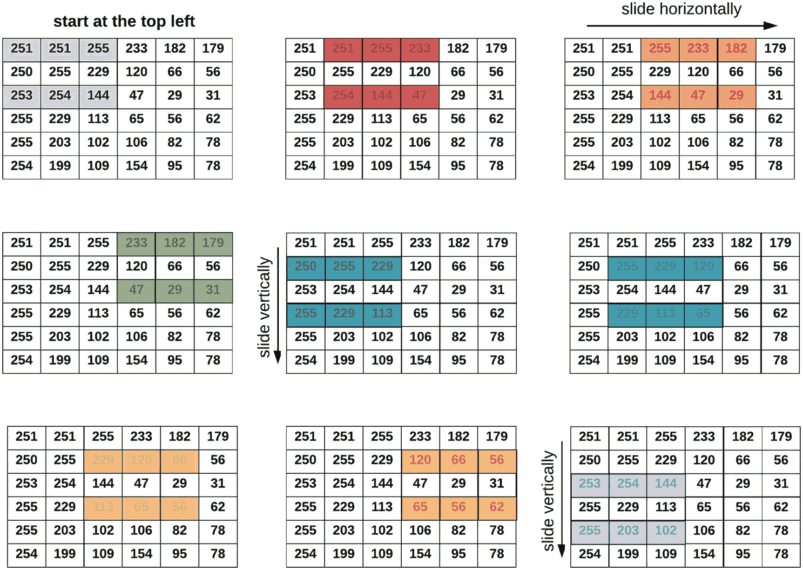

图 35-6

滤波器在矩阵中的滑动窗口

滤波器是卷积层中的神经元。它们被分配权重，并以滑动窗口的形式应用于矩阵。滤波器的输出是一个特征图。这些基本上是神经元的滤波器也具有非线性激活函数。

如果滤波器位于输入层，则滤波器的输入可以是图像像素的矩阵；如果滤波器应用于网络中的深层，则可以是前一个卷积层的特征图。

滤波器为其输入大小分配一个固定的正方形块。这个输入大小也可以看作是滤波器的局部感受野。滤波器的一个常见输入大小是图 35-7 中所示的一个 3x3 的正方形块；其他标准大小包括用于从图像中提取特征的 5x5 或 7x7 滤波器。在网络的深层使用更多滤波器，在输入层使用较少滤波器也是一个最佳实践。

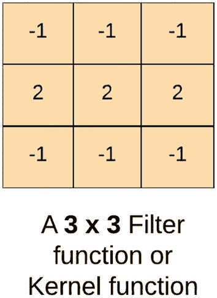

图 35-7

3x3 滤波器核的示例

观察到滤波器中的每个单元格都关联着一个权重或值。这些值用于乘以其关联的像素强度，然后将它们的总和填充到卷积结果的适当单元格中。这个过程在图 35-8 中得到了说明。

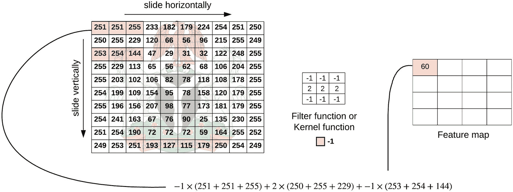

图 35-8

在图像矩阵上滑动卷积滤波器以提取特征

滤波器上的权重决定了滤波器的操作，从而决定了从滤波器输入中提取的特征类型。不同的滤波器负责边缘检测、线条检测等。见图 35-9。

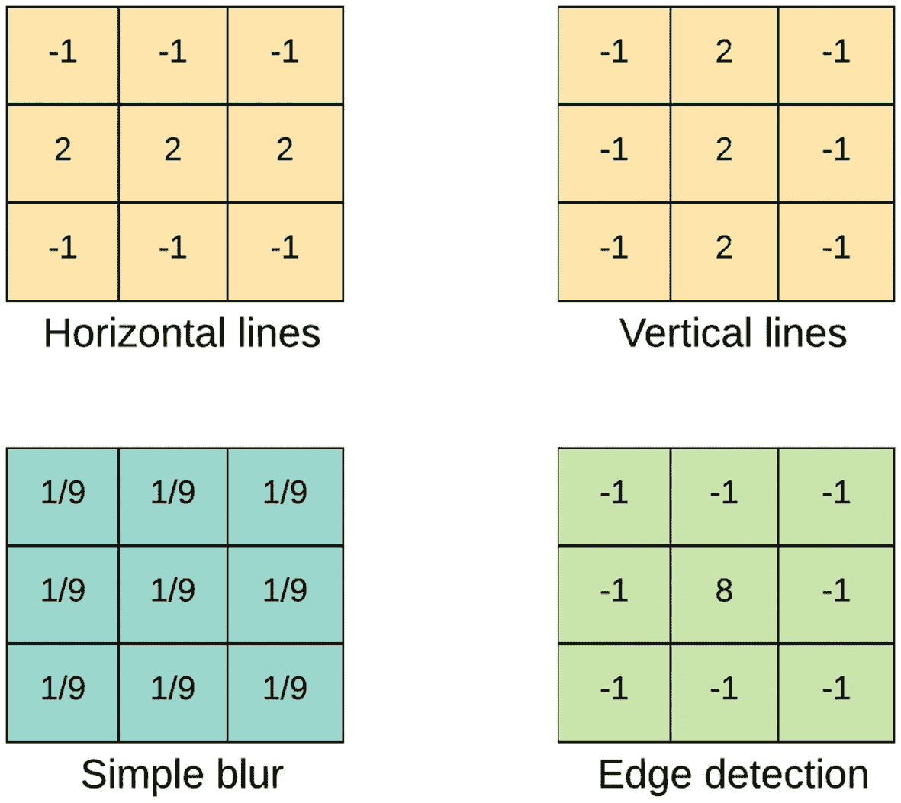

图 35-9

滤波器类型

设计卷积层时需要考虑的关键因素

+   滤波器的大小

+   滤波器的步长

+   层输入的填充

滤波器的 *步长* 决定了滤波器在从一个图像激活移动到另一个图像激活时移动的像素步数。通常使用步长为 1，尽管对于大图像可以增加步长。见图 35-10。

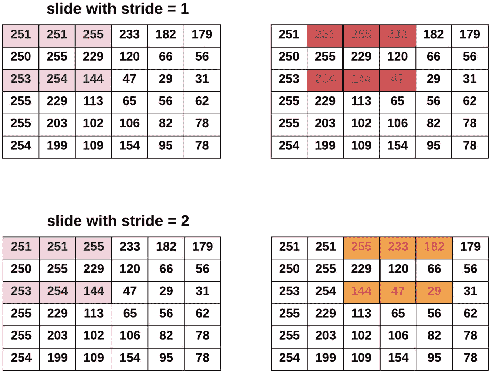

图 35-10

步长宽度的示例

有时，我们选择的滤波器大小和选定的步长可能不能均匀地分割滤波器输入的大小。为了避免由于我们没有滑过图像边缘而丢失像素信息，采用了一种称为 *零填充* 的技术，用定义好的零层填充图像像素的边缘。这允许滤波器通过包括零在卷积中，均匀地跨越图像中的所有像素。见图 35-11。

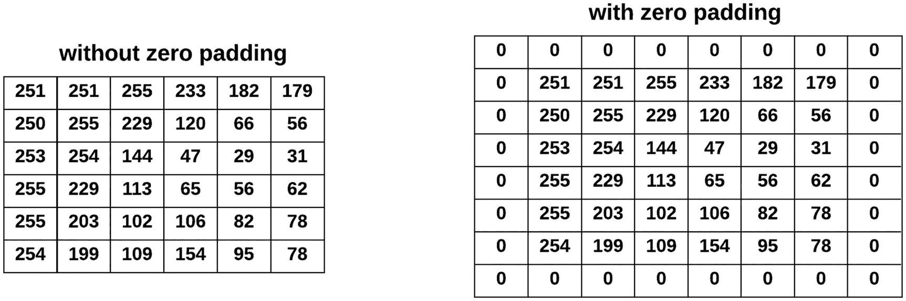

图 35-11

零填充的示例

#### 特征图

特征图是卷积层中滤波器的输出。特征图将输入图像的某些模式（如水平线、垂直线、边缘等）凸显出来。这些不同神经元堆叠的特征图共同构成了卷积神经层，并使该层能够学习图像的复杂模式和特征。

在卷积神经网络中向更深层次移动，更深层的卷积层的输入是前一层特征图。见图 35-12。

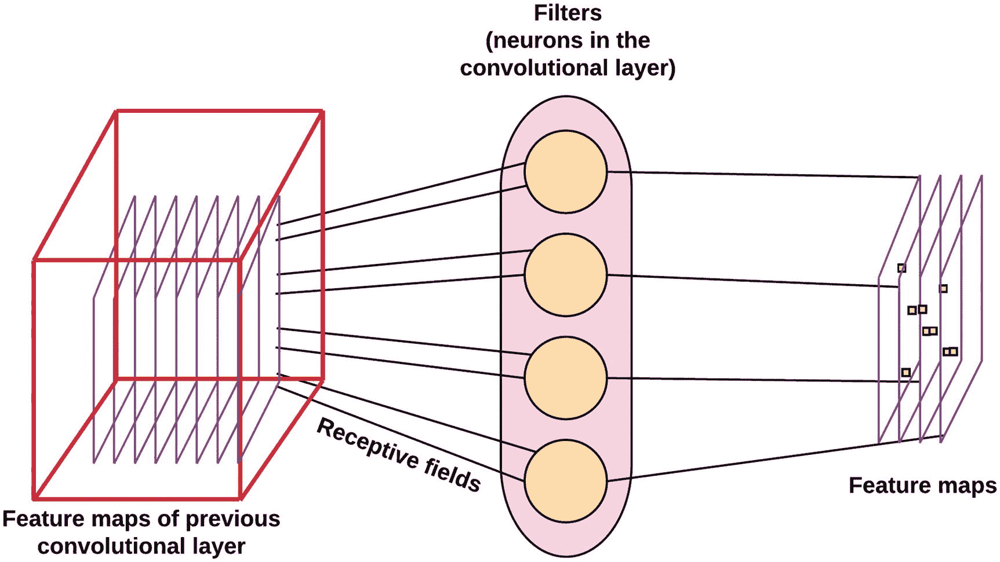

图 35-12

特征图作为卷积层的输入

### 池化层

池化层通常跟随着一个或多个卷积层。池化层的目标是减少或下采样卷积层的特征图。池化层总结了之前网络层中学习的图像特征。通过这样做，它也有助于防止网络过拟合。此外，输入尺寸的减少在训练网络时对处理和内存成本也有利。

池化层可以看作是一个聚合函数，它巩固了学习到的特征并从之前的层中提取了基本特征。它不像卷积层那样对输入特征图进行任何乘法变换。

池化层执行的聚合函数包括最大值、求和和平均值。实践中最常用的聚合函数是最大值，通常称为 MaxPool。

池化层的聚合函数作为层的滤波器。就像卷积层的滤波器一样，它们有一个感受野（虽然比卷积层的小）和步长宽度。然而，池化层的滤波器（即神经元）没有权重或偏差。典型的池化滤波器大小是一个 2 x 2 的矩阵，如图 35-13 所示。

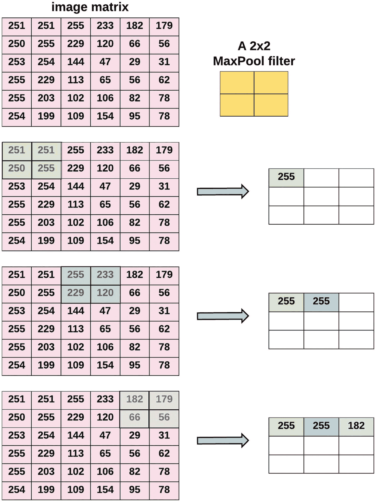

图 35-13

MaxPooling 的池化示例

池化层的基本优势在于其将位置不变性注入网络的能力。位置不变性意味着无论特征在图像的哪个位置，网络都可以检测到这些特征。

池化层将其聚合函数应用于输入图像的所有通道。例如，在一个 R、G、B 图像（即具有三个通道，红色、绿色和蓝色）中，MaxPool 将独立应用于所有三个通道。同样，对于具有特定深度的特征图，池化聚合将分别应用于每个特征图。见图 35-14 作为将池化应用于其输入通道深度的示例。

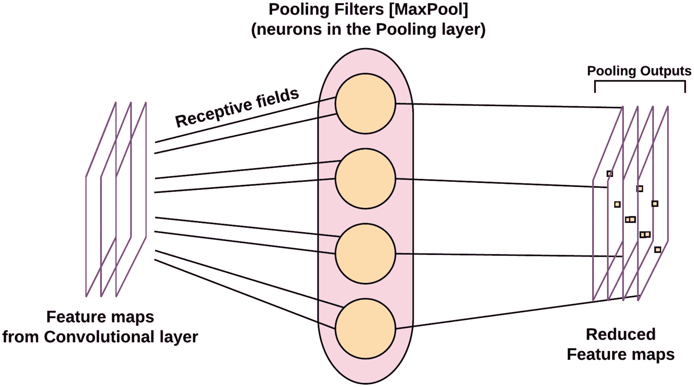

图 35-14

应用池化到具有深度的输入的示例。请注意，池化层中的滤波器没有权重或偏置

### 完全连接网络层

完全连接网络（FCN）层是我们常规的前馈神经网络或多层感知器。这些层通常具有非线性激活函数。无论如何，FCN 是卷积神经网络的最后一层。在这种情况下，使用 softmax 激活函数来输出输入属于特定类别的概率。

在将输入传递到 FCN 之前，图像矩阵必须被展平。例如，一个 28 x 28 x 3 的图像矩阵将变成 2352 个输入权重加上一个偏置 1，传递到完全连接网络。

在我们的卷积网络中，卷积层或池化层的特征图在传递到 FCN 之前会被展平，以使用 softmax 函数计算最终网络概率。

## 一个 CNN 架构示例

我们已经讨论了卷积神经网络系统的构建块。如您所见，CNN 系统主要由卷积层、池化层和完全连接层组成。然而，这些层的排列方式和数量取决于 CNN 在解决特定用例时的偏好启发式方法。

这里展示了 CNN 建模流程的示例：

1.  在图像输入层的下一层必须是卷积层，用于提取图像特征。根据输入图像的大小，通常使用 3 x 3 的图像滤波器。

1.  池化层通常跟随一组一个或多个卷积层。通常，池化层使用 2 x 2 的滤波器大小。

1.  完全连接层必须是 CNN 的最后一层。它也被称为密集层。它包含 softmax 激活函数，以给出类成员的概率。

1.  CNN 可能包含一个或多个 Dropout 层以防止网络过拟合。

图 35-15 是 CNN 架构的一个示例。

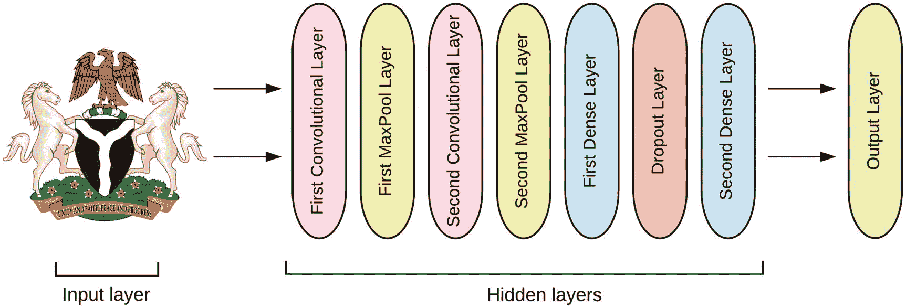

图 35-15

CNN 架构

## 使用 TensorFlow 2.0 进行图像识别的 CNN

在这个例子中，我们将构建一个卷积神经网络（CNN）来对 CIFAR-10 数据集中的图像进行分类。CIFAR-10 是另一个标准图像分类数据集，用于将 32 x 32 像素的彩色图像数据分类到十个图像类别中，即飞机、汽车、鸟、猫、鹿、狗、青蛙、马、船和卡车。本节的重点是专门使用 TensorFlow 2.0 方法构建 CNN 图像分类器。

实现的 CNN 模型架构大致反映了 Krizhevsky 的架构，也称为 AlexNet。网络架构具有以下层：

+   卷积层：kernel_size = [5 x 5]

+   卷积层：kernel_size = [5 x 5]

+   批标准化层

+   卷积层：kernel_size = [5 x 5]

+   最大池化：pool size = [2 x 2]

+   卷积层：kernel_size = [5 x 5]

+   卷积层：kernel_size = [5 x 5]

+   批标准化层

+   最大池化：pool size = [2 x 2]

+   卷积层：kernel_size = [5 x 5]

+   卷积层：kernel_size = [5 x 5]

+   卷积层：kernel_size = [5 x 5]

+   最大池化：pool size = [2 x 2]

+   Dropout 层

+   密集层：units = [512]

+   密集层：units = [256]

+   Dropout 层

+   密集层：units = [10]

从运行**‘** **model.summary()** **’**时的模型摘要中可以看出，这个 CNN 模型有接近一百万个可训练变量。在 CPU 上训练将花费不寻常的时间（大约 1 小时 30 分钟）。对于这个代码示例，我们将在一个 GPU 实例上训练。如果在 Google Colab 上运行代码，请将运行时类型更改为 GPU，并安装带有 GPU 包的 TensorFlow 2.0。模型在 Tensorboard 中的图如图 35-16 所示。

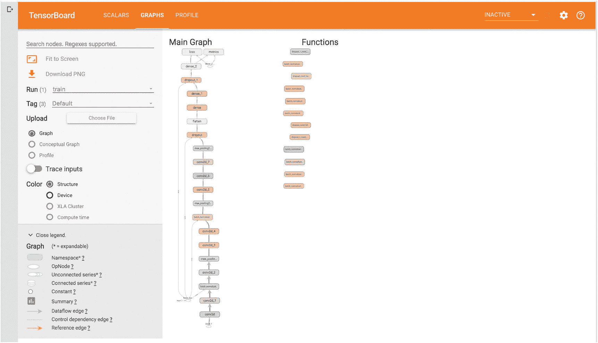

图 35-16

CIFAR-10 模型图的 Tensorboard 输出

```py
# import TensorFlow 2.0 with GPU
!pip install -q tf-nightly-gpu-2.0-preview
# import packages
import tensorflow as tf
# confirm tensorflow can see GPU
device_name = tf.test.gpu_device_name()
if device_name != '/device:GPU:0':
raise SystemError('GPU device not found')
print('Found GPU at: {}'.format(device_name))
# load the TensorBoard notebook extension
%load_ext tensorboard
# import dataset
(x_train, y_train), (x_test, y_test) = tf.keras.datasets.cifar10.load_data()
# change datatype to float
x_train = x_train.astype('float32')
x_test = x_test.astype('float32')
# scale the dataset from 0 -> 255 to 0 -> 1
x_train /= 255
x_test /= 255
# one-hot encode targets
y_train = tf.keras.utils.to_categorical(y_train)
y_test = tf.keras.utils.to_categorical(y_test)
# parameters
batch_size = 100
# create dataset pipeline
train_ds = tf.data.Dataset.from_tensor_slices(
(x_train, y_train)).shuffle(len(x_train)).repeat().batch(batch_size)
test_ds = tf.data.Dataset.from_tensor_slices((x_test, y_test)).batch(batch_size)
# create the model
def model_fn():
model_input = tf.keras.layers.Input(shape=(32, 32, 3))
x = tf.keras.layers.Conv2D(64, (5, 5), padding="same", activation="relu")(model_input)
x = tf.keras.layers.Conv2D(64, (5, 5), padding="same", activation="relu")(x)
x = tf.keras.layers.BatchNormalization()(x)
x = tf.keras.layers.Conv2D(64, (5, 5), padding="same", activation="relu")(x)
x = tf.keras.layers.MaxPooling2D(pool_size=(2, 2), strides=2, padding="same")(x)
x = tf.keras.layers.Conv2D(64, (5, 5), padding="same", activation="relu")(x)
x = tf.keras.layers.Conv2D(64, (5, 5), padding="same", activation="relu")(x)
x = tf.keras.layers.BatchNormalization()(x)
x = tf.keras.layers.MaxPooling2D(pool_size=(2, 2), strides=2, padding="same")(x)
x = tf.keras.layers.Conv2D(32, (3, 3), padding="same", activation="relu")(x)
x = tf.keras.layers.Conv2D(32, (3, 3), padding="same", activation="relu")(x)
x = tf.keras.layers.Conv2D(32, (3, 3), padding="same", activation="relu")(x)
x = tf.keras.layers.MaxPooling2D(pool_size=(2, 2), strides=2, padding="same")(x)
x = tf.keras.layers.Dropout(0.3)(x)
x = tf.keras.layers.Flatten()(x)
x = tf.keras.layers.Dense(512, activation="relu")(x)
x = tf.keras.layers.Dense(256, activation="relu")(x)
x = tf.keras.layers.Dropout(0.5)(x)
output = tf.keras.layers.Dense(10, activation="softmax")(x)
# the model
model = tf.keras.Model(inputs=model_input, outputs=output)
# compile the model
model.compile(optimizer=tf.keras.optimizers.Nadam(),
loss='categorical_crossentropy',
metrics=['accuracy'])
return model
# build the model
model = model_fn()
# print model summary
model.summary()
# tensorboard
tensorboard = tf.keras.callbacks.TensorBoard(log_dir='./tmp/logs_cifar10_keras',
histogram_freq=0, write_graph=True,
write_images=True)
# assign callback
callbacks = [tensorboard]
# train the model
history = model.fit(train_ds, epochs=10,
steps_per_epoch=500,
callbacks=callbacks)
# evaluate the model
score = model.evaluate(test_ds)
print('Test loss: {:.2f} \nTest accuracy: {:.2f}%'.format(score[0], score[1]∗100))
'Output:'
Test loss: 0.74
Test accuracy: 80.05%
# execute the command to run TensorBoard
%tensorboard --logdir tmp/logs_cifar10_keras
```

在本章中，我们以卷积神经网络（CNN）为例讨论了深度神经网络。我们探讨了 CNN 的设计细节，并使用 TensorFlow 2.0 实现了 CNN 模型。在下一章中，我们将考察另一种称为循环神经网络（RNN）的深度神经网络。

# 36. 循环神经网络（RNNs）

循环神经网络（RNNs）是神经网络架构的另一种专用方案。RNNs 是为了解决那些过去信息（即过去的瞬间/事件）与未来预测直接相关联的学习问题而开发的。这种顺序示例在许多现实世界任务中经常出现，例如语言模型，其中句子中的前一个词用于确定下一个词将是什么。在股票市场预测中，过去一小时/一天/一周的股票价格定义了未来的股票走势。RNNs 特别适用于时间序列或顺序任务。

在顺序问题中，存在一个循环或反馈框架，它将一个序列的输出与下一个序列的输入连接起来。RNNs 非常适合处理 1-D 顺序数据，与卷积神经网络中网格状的 2-D 图像数据不同。

这种反馈框架使得网络在做出预测时能够结合来自过去序列或时间依赖数据集的信息。在本节中，我们将介绍循环神经网络的概念概述，特别是长短期记忆 RNN 变体（LSTM），它是图像标题、股票市场预测、机器翻译和文本分类等各种顺序问题的最先进技术。

## 循环神经元

RNN 的第一个构建块是循环神经元（见图 36-1）。循环网络的神经元与其他神经网络架构中的神经元完全不同。这里的关键区别在于循环神经元维护了从过去计算中的记忆或状态。它是通过将前一个时间瞬间*y*[*t* − 1]的输出以及特定时间瞬间*x*[*t*]的当前输入作为输入来实现的。

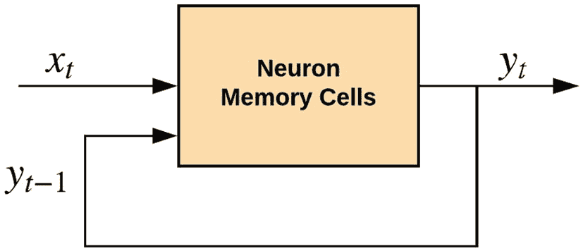

图 36-1

循环神经元

在图 36-1 中，循环神经元与 MLP 和 CNN 架构中的神经元形成对比，因为循环神经元不是将信息层次从网络中的一个神经元传递到另一个神经元，而是在每个新的时间瞬间将数据循环回同一个神经元。时间瞬间也可以指一个新的序列。

因此，循环神经元有两个输入权重，分别是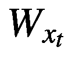和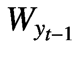，用于在时间*x*[*t*]的输入和*y*[*t* − 1]时间瞬间的输入。见图 36-2。

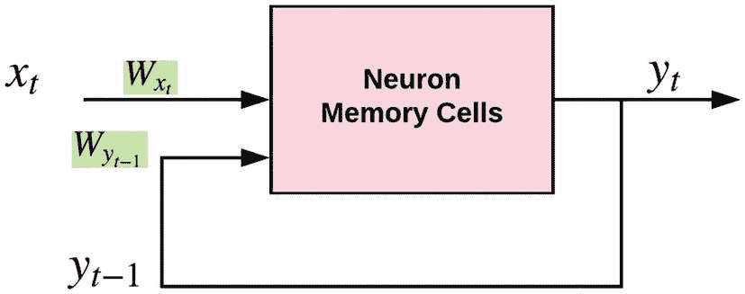

图 36-2

带有输入权重的循环神经元

与其他神经元类似，循环神经元也通过通过非线性激活函数传递其加权和或仿射变换来向网络注入非线性。

## 展开循环计算图

循环神经网络被形式化为展开的计算图。展开的计算图显示了在序列中的每个时间瞬间通过循环层的信流。假设我们有一个五个时间步长的序列，我们将循环神经元在五个时间瞬间中展开五次。序列的数量构成了循环神经网络架构的层数。见图 36-3。

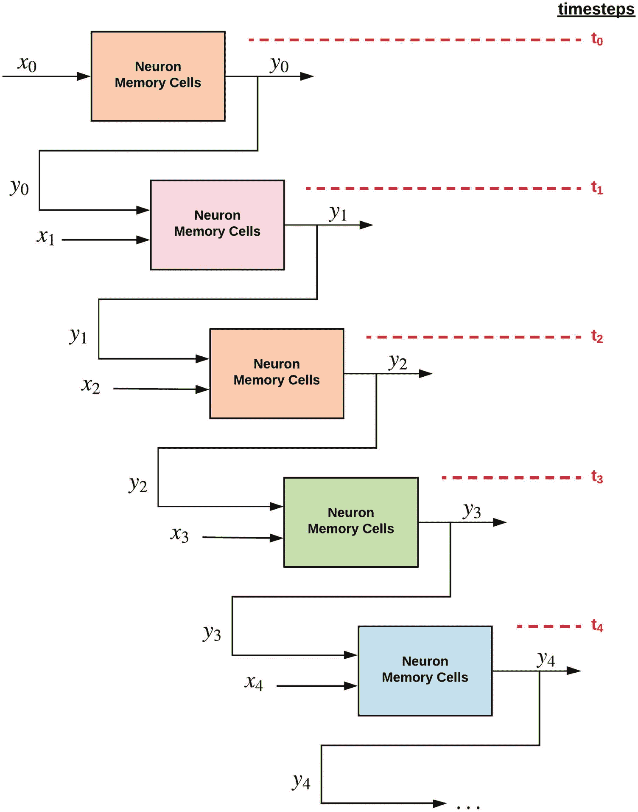

图 36-3

将循环神经元展开成循环神经网络

从循环神经网络的展开图中，我们可以观察到循环层的输入除了包含当前时间步*t*的输入外，还包括前一个时间步*t* − 1 的输出。这种循环神经元的架构对于循环神经网络如何从过去事件或过去序列中学习至关重要。

到目前为止，我们已经看到循环神经元通过在它的记忆细胞中存储记忆或状态来捕获过去的信息。循环神经元可以拥有比迄今为止图中所示的基本 RNN 细胞更复杂的记忆细胞（如 GRU 或 LSTM 细胞），其中在时间点 *t* − 1 的输出保持记忆。

## 基本循环神经网络

之前我们提到，当循环神经网络展开时，我们可以看到信息是如何从一个循环层流向另一个循环层的。此外，我们还指出数据集的序列长度决定了循环层的数量。让我们简要地通过图 36-4 来说明这一点。假设我们有一个包含十个层的时序数据集，对于数据集中的每一行序列，我们将在循环神经网络系统中拥有十个层。

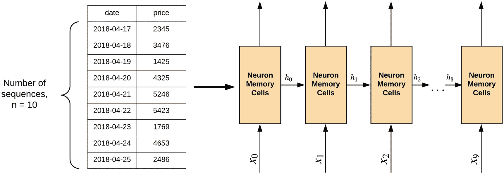

图 36-4

数据集到层

在这一点上，我们必须坚决指出，循环层不仅仅包含一个神经元细胞，而是一组神经元或神经元细胞，如图 36-5 所示。循环层中神经元数量的选择是在构建网络架构时的一个设计决策。

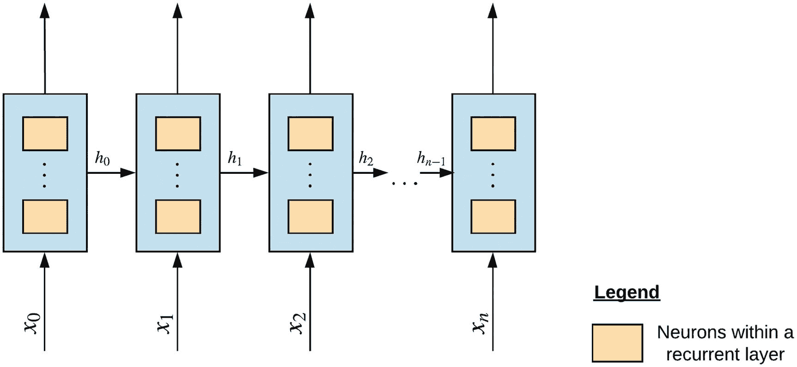

图 36-5

循环层中的神经元

循环层中的每个神经元都接收前一层的输出和当前输入作为输入。因此，每个神经元都有两个权重向量。同样，就像其他神经元一样，它们对输入执行仿射变换，并通过非线性激活函数（通常是双曲正切，tanh）传递。然而，在循环层内，神经元的输出被移动到一个具有 softmax 激活函数的密集或全连接层，以输出类概率。这一操作在图 36-6 中进行了说明。

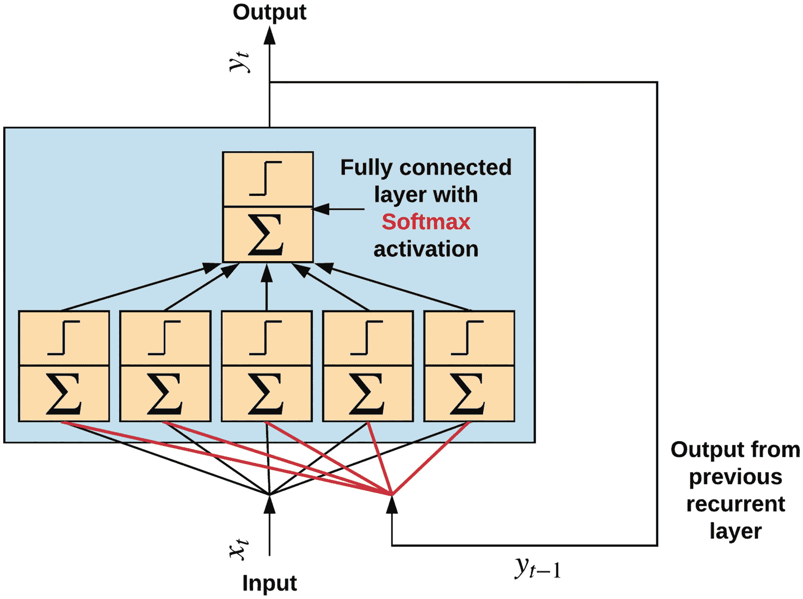

图 36-6

循环层内的计算

## 循环连接方案

从一个循环层到另一个循环层形成循环连接有两种主要方案。第一种是在隐藏单元之间有循环连接，另一种是在隐藏单元和前一层的输出之间有循环连接。不同的方案在图 36-7 中进行了视觉说明。

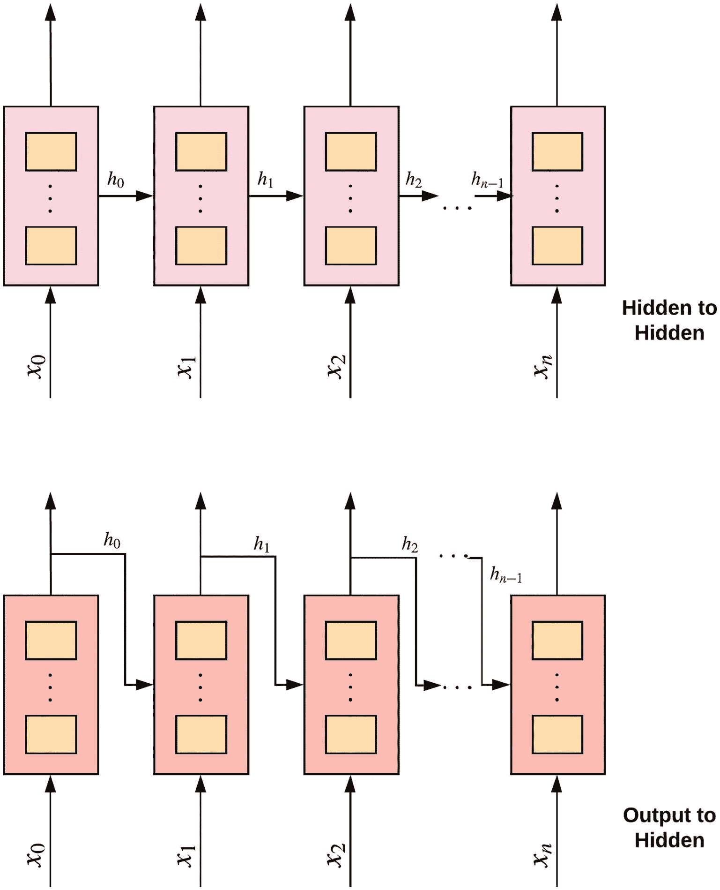

图 36-7

循环连接方案

隐藏到隐藏的循环配置被发现优于输出到隐藏的形式，因为它更好地捕捉了关于过去的维特征信息。无论如何，输出到隐藏的循环形式在训练时计算成本更低，并且更容易并行化。

## 序列映射

循环神经网络可以用多种方式表示序列问题。RNN 映射的灵活性在于它作为序列操作网络的输入和输出，从而使得网络摆脱了其他神经网络架构（如 MLP 和 CNN）中发现的固定大小输入输出约束。

这里有一些使用 RNN 解决的序列问题的例子：

1.  输入到序列输出。这种配置用于图像字幕问题，当图像作为输入传递给网络时，输出是一系列单词。见图 36-8。

    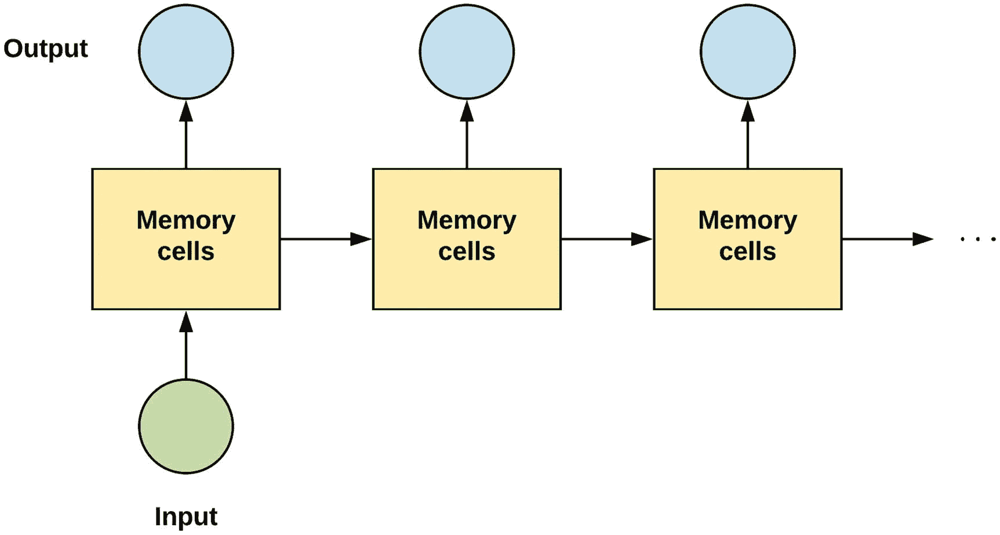

    图 36-8

    输入到序列输出

1.  输出到序列。例如，在情感分析中，我们需要将一系列单词作为输入传递给网络，输出是一个表示正面或负面评论或情感的类别。见图 36-9。

    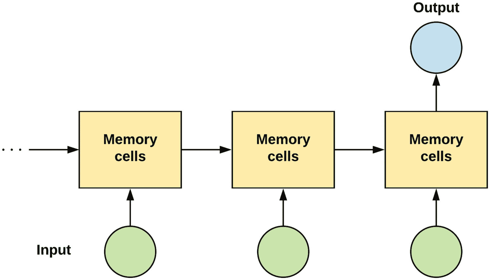

    图 36-9

    输出到序列

1.  序列输入到序列输出。这种映射操作适用于机器翻译和语音识别等应用领域。它更普遍地被称为编码器-解码器或序列到序列架构。在这种情况下，我们可能有特定语言的单词序列作为输入，并希望以另一种语言的单词序列作为输出。见图 36-10。

    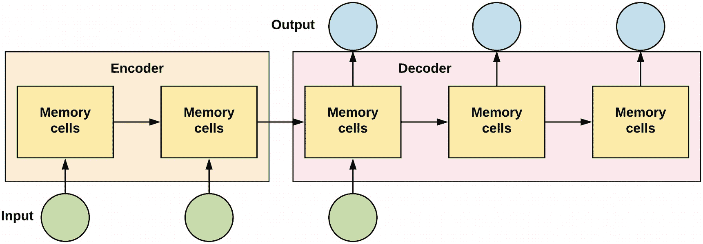

    图 36-10

    序列输入到序列输出

1.  同步序列输入到输出。这种框架在需要为每个视频帧标记时，非常适合视频分类。见图 36-11。

    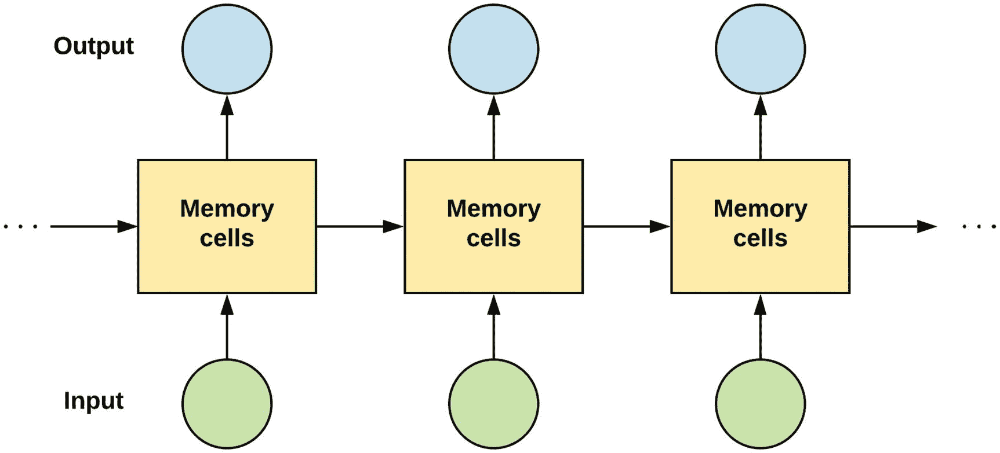

    图 36-11

    同步序列输入到输出

在本小节中说明的方案中，信息从时间实例 *t* − 1 的循环层的隐藏单元（或记忆单元）流向时间实例 *t* 的隐藏单元。如前所述，这是因为传递的信息更丰富，包含更多来自过去的信息。

## 循环网络的训练：时间反向传播

循环神经网络与其他传统神经网络一样，通过使用反向传播算法进行训练。然而，反向传播算法被修改成了称为时间反向传播（BPTT）的形式。

由于循环网络的结构循环或循环结构，普通的反向传播无法工作。使用反向传播训练网络涉及计算误差梯度，从输出层向后移动通过网络的隐藏层，并调整网络权重。然而，这种操作在循环神经元中无法进行，因为我们只有一个具有自我循环连接的单个神经元。

因此，为了使用反向传播训练循环网络，我们需要在时间点展开循环神经元，并在每个时间层对展开的神经元应用反向传播，就像在传统的前馈神经网络中所做的那样。这一操作在图 36-12 中进一步说明。

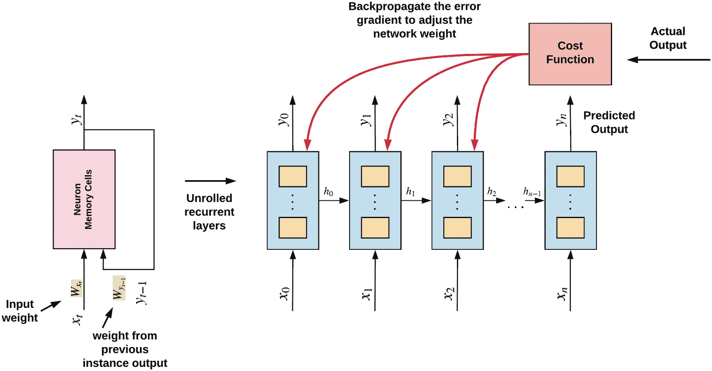

图 36-12

时间反向传播

训练循环神经网络的一个显著挑战是梯度消失和梯度爆炸问题。当对一个多层的深度循环网络进行训练时，计算神经元的权重梯度可能会变得非常不稳定。当这种情况发生时，梯度的值可能会变得非常大，趋向于无穷大，或者变得非常小，直至为零。当这种情况发生时，神经元会变得“死亡”，无法再训练或学习任何新的信息。这种现象被称为梯度爆炸和消失问题。

梯度爆炸和消失问题在循环神经网络中最普遍，这是由于展开的循环神经元的长期依赖或时间点。为了减轻循环网络中这个问题（除了其他讨论过的方法，如梯度裁剪、批量归一化和使用非饱和激活函数如 ReLu 等），提出了一种替代技术，即丢弃早期时间点或遥远过去的时间点。这种技术被称为截断时间反向传播（truncated BPTT）。

然而，截断 BPTT 存在一个显著的缺点，那就是某些问题严重依赖于长期依赖来进行预测。一个典型的例子是在语言模型中，过去长期序列中的单词对于预测序列中的下一个单词至关重要。

截断 BPTT 的不足以及处理梯度爆炸和消失问题的需要，导致了长短期记忆（LSTM）或简称 LSTM 的内存单元的发明，它可以在循环网络的内存单元中存储问题的长期信息。

## 长短期记忆（LSTM）网络

长短期记忆（LSTM）属于一类称为门控循环单元的 RNN。它们被称为“门控”，因为与基本循环单元不同，它们包含额外的称为门的组件，这些门控制循环单元内的信息流。这包括选择存储在单元中的信息以及要丢弃或遗忘的信息。

LSTM 在捕捉大量时间瞬间之间的长期依赖关系方面非常高效。它是通过比基本循环单元稍微复杂一点的单元来实现的。LSTM 的组件包括

+   存储单元

+   输入门

+   忘记门

+   输出门

这些额外的组件使 RNN 能够记住并存储来自遥远过去的重大事件。LSTM 以先前的单元状态*c*[*t* − 1]、先前的隐藏状态*h*[*t* − 1]和当前输入*x*[*t*]作为输入。为了保持本书的简洁性，我们提供了一个高级的 LSTM 单元示意图，展示了单元的额外组件是如何结合在一起的。在 TensorFlow 2.0 中，LSTM 层是通过方法**‘tf.keras.layers.LSTM()’**实现的。

图 36-13 中的插图是 LSTM 存储单元。LSTM 单元的组件在保留序列数据中的长期依赖关系方面具有不同的功能。让我们逐一了解它们：

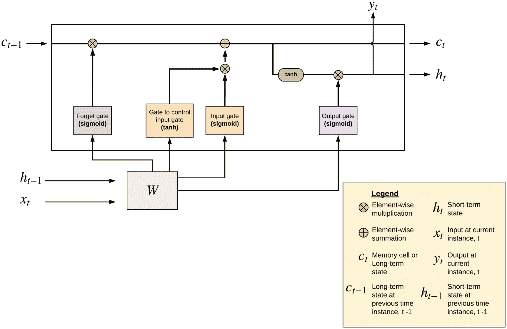

图 36-13

LSTM 单元

+   输入门：这个门负责控制哪些信息被存储在长期状态或存储单元*c*中。它与输入门协同工作，另一个门则调节流入输入门的信息。这个门分析 LSTM 单元*c*[*t*]的当前输入和先前的短期状态*h*[*t* − 1]。

+   忘记门：这个门的作用是调节长期状态中的信息在时间瞬间之间持续的程度。

+   输出门：这个门控制特定时间瞬间从单元中输出的信息量。这个门控制*h*[*t*]（短期状态）和*y*[*t*]（时间*t*的输出）的值。

重要的是要注意，LSTM 单元的组件都是全连接神经网络。存在其他具有存储单元的循环网络变体，其中两种是窥视孔连接和门控循环单元。

## 窥视孔连接

窥视孔连接通过使用来自存储单元或先前时间瞬间*c*[*t* − 1]的长期状态信息作为 LSTM 门的输入来扩展 LSTM 网络。窥视孔的目的是通过窥视存储的长期记忆来向 LSTM 单元提供额外信息。这进一步在图 36-14 中得到说明。在 TensorFlow 2.0 中，将窥视孔连接到 LSTM 层的实现由方法**‘tf.keras.experimental.PeepholeLSTMCell()’**提供。

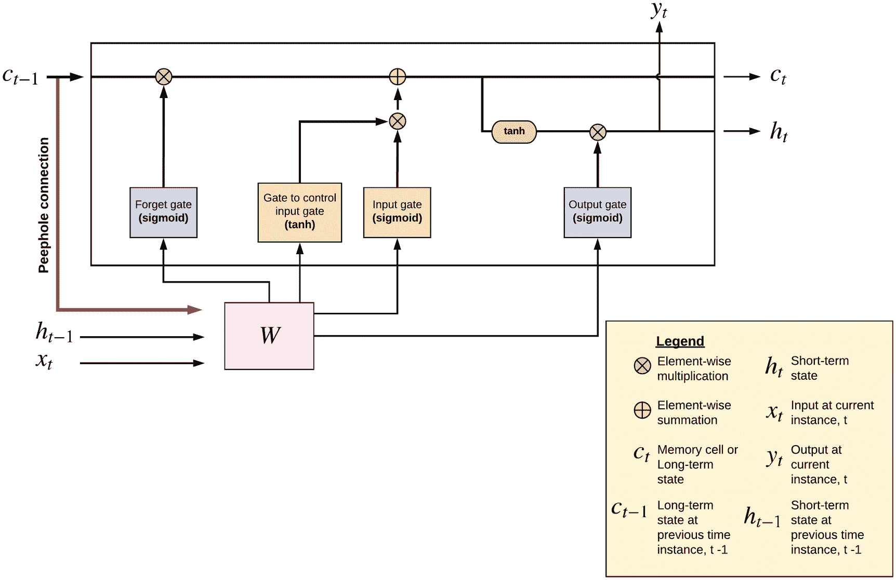

图 36-14

窥视连接

## 门控循环单元（GRU）

门控循环单元（GRU）是比 LSTM 更近期的循环神经网络架构，并且在单元内组件数量及其操作方面也相对简单易实现。尽管相对简单，GRUs 是高性能的循环架构，在大多数情况下，在序列建模问题中甚至比 LSTM 表现更好。

GRUs 将遗忘门和输入门结合以决定哪些信息应该被提交到长期记忆或记忆单元，以及哪些信息应该被排除在外。此外，GRU 将细胞（即长期状态）和短期状态合并为一个单一的状态向量 *h*[*t*]。这进一步在图 36-15 中得到了说明。在 TensorFlow 2.0 中，GRU 层是通过方法 **‘tf.keras.layers.GRU()’** 实现的。

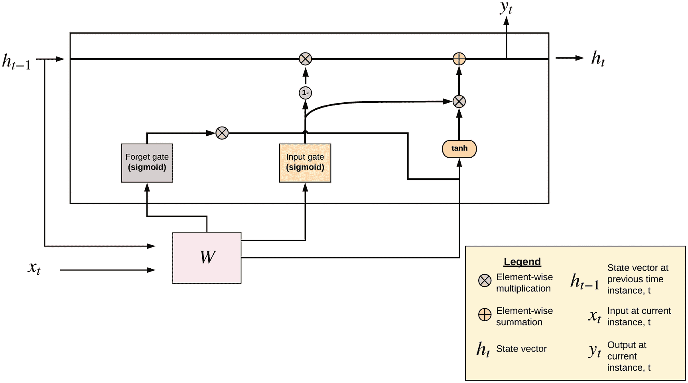

图 36-15

门控循环单元

## 应用于序列问题的循环神经网络

循环神经网络在序列任务中应用广泛，使用 LSTM 模型进行序列任务。这个领域的一些问题包括情感分析、机器翻译、图像字幕、视频字幕和语音识别。如前所述，这些问题可以建模为一对一模型、多对一模型或多对多模型。本节将概述一些用于解决/建模序列问题的 LSTM 架构：

+   长期循环卷积神经网络，也称为 CNN LSTM

+   编码器-解码器 LSTM

+   双向循环神经网络

### 长期循环卷积网络（LRCN）

长期循环卷积网络（LRCN）是一种独特的神经网络架构，用于生成图像和视频的描述（被视为一系列图像）。这些问题可以称为视觉时间序列建模。LRCN 架构结合了卷积神经网络（CNN）提取图像特征的能力以及循环网络学习序列或长期依赖的能力。LRCN 将视觉输入传递到 CNN 以检索图像特征作为输出。然后，这些输出被传递到循环 LSTM 网络层以生成自然语言描述。循环层可以包含堆叠的 LSTM。

LRCN 在建模序列视觉问题（如图像字幕和视频字幕）方面的一个核心优势是网络不受输入和输出固定长度的限制。因此，它可以用于建模不同长度的序列数据，如文本数据和视频。

以下插图展示了 LRCN 如何应用于各种序列问题：

1.  图片标题：图片标题可以被视为一个一对一的序列问题。输入是一个图像，因此是一个静态输入，输出是一系列描述图像中对象的文本；这是一个序列输出。图 36-16 展示了使用 LRCN 进行图片标题的示例。

    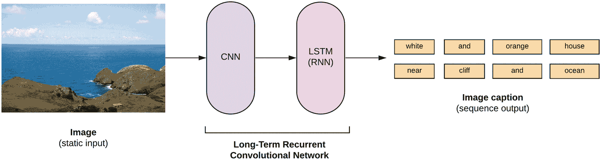

    图 36-16

    图片标题（照片由 Daniel Llorente 在 Unsplash 提供）

1.  视频标题：视频可以被视为一系列图像。因此，在视频标题问题中，一系列图像作为输入传递给 LRCN 模型，该模型随后返回一系列输出，作为每个视频帧的文本描述。因此，视频标题可以被视为一个多对多的序列问题。这种方法是编码器-解码器 LSTM 的一个例子，其中 CNN 用作图像编码器，最初用于图像分类的训练。最终的隐藏层，也称为瓶颈，然后作为输入传递给 RNN 解码。通常使用在大规模图像识别任务上已经预训练的 CNN。存在许多此类模型。我们将在稍后更详细地调查编码器-解码器 LSTM。视频标题在图 36-17 中展示。

    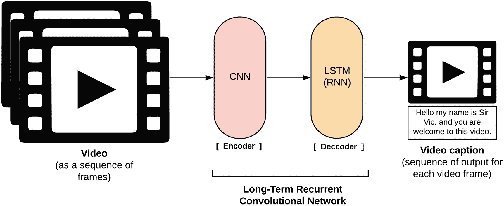

    图 36-17

    视频标题

### 编码器-解码器 LSTM

编码器-解码器 LSTM 架构处理一类特定的序列问题，它接受多个时间步长的输入，并返回多个时间步长的输出。这类问题的主要挑战是输入和输出序列的长度可能不同。

架构的第一部分，即编码器，负责接收和编码输入序列；架构的第二部分，即解码器，接收来自编码器的输出，然后预测输出序列。

这种架构是为自然语言处理问题设计的，其中输出是一系列单词。它通常用于机器翻译、视频标题和语音识别。图 36-10 已经提供了这种架构的示例。

### 双向循环神经网络

双向循环神经网络是另一种特殊的循环神经网络架构，它涉及将循环层并排放置，其中一层用于从过去学习长期依赖；这一层被称为正向 LSTM。对于另一层，输入被反转并输入到网络中，因此网络从未来学习长期依赖。这一层被称为反向 LSTM。双向 RNN 在图 36-18 中展示。

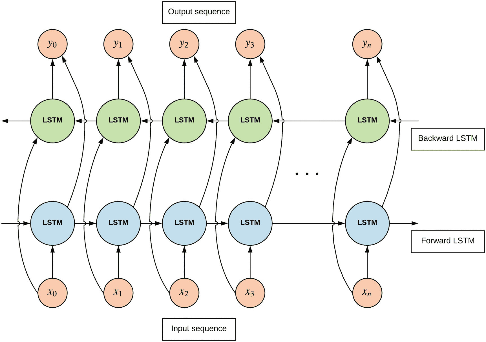

图 36-18

双向 LSTM

当这些并排网络的输出被组合时，由于它们处理了过去和未来的信息，因此更容易预测具有整个信息范围的序列的下一个时间步，这使得预测更加容易。尽管这种架构最初是为语音识别任务设计的，但它已经在各种其他序列预测任务中表现出色。它旨在改进传统的单向 LSTM，后者只知道过去的信息。

该网络建立在这样的理解之上：某些学习问题只有在存在一致的信息集时才有意义。例如，如果一个人工翻译者从一种语言翻译到另一种语言，他首先会听到一种语言中连贯的信息集，然后再将其翻译成另一种语言。这是因为整个连贯句子的上下文为正确的解释提供了正确的基础。

## 使用 TensorFlow 2.0 的 RNN：单变量时间序列

本节使用尼日利亚电力消耗数据集，通过 LSTM 循环神经网络实现单变量时间序列模型。本例中的数据集是 Hipel 和 McLeod（1994 年）提供的尼日利亚 1 月 1 日至 3 月 11 日的电力消耗数据，从 DataMarket 检索而来。

该数据集通过使用方法**‘convert_to_sequences’**将数据输入和输出转换为序列，以进行 RNN 的时间序列建模。此方法使用**1**个窗口将数据集分割成由 20 行（或时间步）组成的滚动序列。在图 36-19 中，示例单变量数据集被转换为五个时间步的序列，其中输出序列比输入序列提前一步。每个序列包含五行（由**time_steps**变量确定）和在这个单变量情况下，1 列。

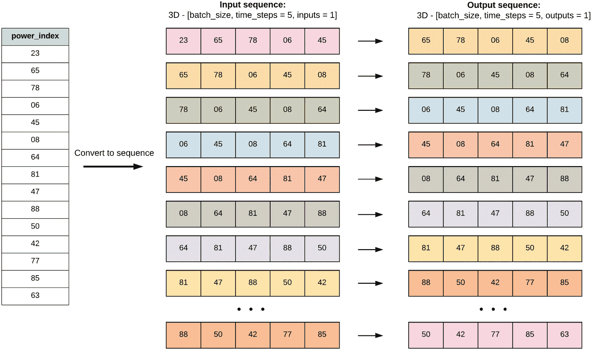

图 36-19

将单变量序列转换为 RNNs 进行预测。左侧：样本单变量数据集。中间：输入序列。右侧：输出序列

当使用循环神经网络（RNNs）建模时，将数据集缩放到相同的范围内是很重要的。图 36-20 中的图表显示了模型的预测结果，包括原始目标值和滞后训练实例。图 36-21 和图 36-22 中的后续图表显示了原始序列和 RNN 生成的序列，在缩放和正常值下。

为了提高训练速度，模型将在 GPU 上训练。如果在 Google Colab 上运行代码，请将运行类型更改为 GPU，并安装带有 GPU 包的 TensorFlow 2.0。

```py
# import TensorFlow 2.0 with GPU
!pip install -q tf-nightly-gpu-2.0-preview
# import packages
import tensorflow as tf
import pandas as pd
import numpy as np
import matplotlib.pyplot as plt
from sklearn.model_selection import train_test_split
from sklearn.preprocessing import MinMaxScaler
# confirm tensorflow can see GPU
device_name = tf.test.gpu_device_name()
if device_name != '/device:GPU:0':
raise SystemError('GPU device not found')
print('Found GPU at: {}'.format(device_name))
# data file path
file_path = "nigeria-power-consumption.csv"
# load data
parse_date = lambda dates: pd.datetime.strptime(dates, '%d-%m')
data = pd.read_csv(file_path, parse_dates=['Month'], index_col="Month",
date_parser=parse_date,
engine='python', skipfooter=2)
# print column name
data.columns
# change column names
data.rename(columns={'Nigeria power consumption': 'power-consumption'},
inplace=True)
# split in training and evaluation set
data_train, data_eval = train_test_split(data, test_size=0.2, shuffle=False)
# MinMaxScaler - center and scale the dataset
scaler = MinMaxScaler(feature_range=(0, 1))
data_train = scaler.fit_transform(data_train)
data_eval = scaler.fit_transform(data_eval)
# adjust univariate data for timeseries prediction
def convert_to_sequences(data, sequence, is_target=False):
temp_df = []
for i in range(len(data) - sequence):
if is_target:
temp_df.append(data[(i+1): (i+1) + sequence])
else:
temp_df.append(data[i: i + sequence])
return np.array(temp_df)
# parameters
time_steps = 20
batch_size = 50
# create training and testing data
train_x = convert_to_sequences(data_train, time_steps, is_target=False)
train_y = convert_to_sequences(data_train, time_steps, is_target=True)
eval_x = convert_to_sequences(data_eval, time_steps, is_target=False)
eval_y = convert_to_sequences(data_eval, time_steps, is_target=True)
# build model
model = tf.keras.Sequential()
model.add(tf.keras.layers.LSTM(128, input_shape=train_x.shape[1:],
return_sequences=True))
model.add(tf.keras.layers.Dense(1))
# compile the model
model.compile(loss='mean_squared_error',
optimizer='adam',
metrics=['mse'])
# print model summary
model.summary()
# create dataset pipeline
train_ds = tf.data.Dataset.from_tensor_slices(
(train_x, train_y)).shuffle(len(train_x)).repeat().batch(batch_size)
test_ds = tf.data.Dataset.from_tensor_slices((eval_x, eval_y)).batch(batch_size)
# train the model
history = model.fit(train_ds, epochs=10,
steps_per_epoch=500)
# evaluate the model
loss, mse = model.evaluate(test_ds)
print('Test loss: {:.4f}'.format(loss))
print('Test mse: {:.4f}'.format(mse))
# predict
y_pred = model.predict(eval_x)
# plot predicted sequence
plt.title("Model Testing", fontsize=12)
plt.plot(eval_x[0,:,0], "b--", markersize=10, label="training instance")
plt.plot(eval_y[0,:,0], "g--", markersize=10, label="targets")
plt.plot(y_pred[0,:,0], "r--", markersize=10, label="model prediction")
plt.legend(loc="upper left")
plt.xlabel("Time")
plt.show()
```

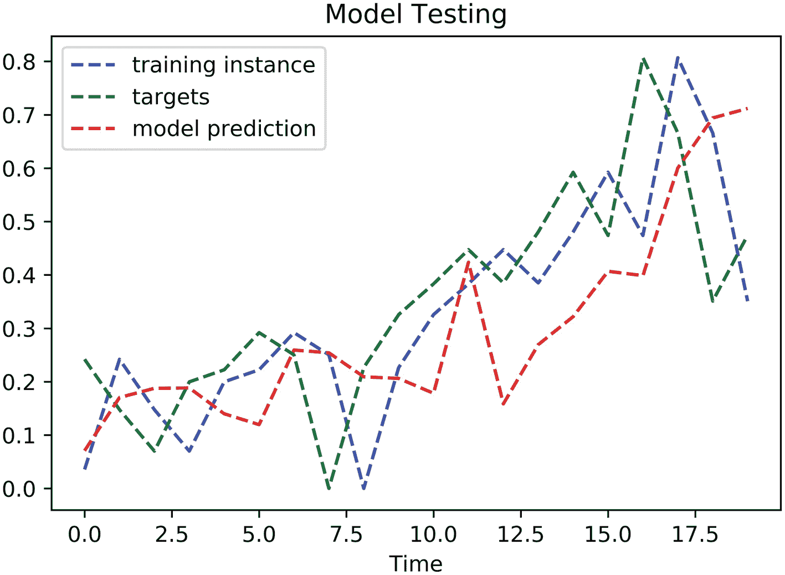

图 36-20

Keras LSTM 模型测试

```py
# use model to predict sequences using training data as seed
rnn_data = list(data_train[:20])
for i in range(len(data_train) - time_steps):
batch = np.array(rnn_data[-time_steps:]).reshape(1, time_steps, 1)
y_pred = model.predict(batch)
rnn_data.append(y_pred[0, -1, 0])
plt.title("RNN vs. Original series", fontsize=12)
plt.plot(data_train, "b--", markersize=10, label="Original series")
plt.plot(rnn_data, "g--", markersize=10, label="RNN generated series")
plt.legend(loc="upper left")
plt.xlabel("Time")
plt.show()
```

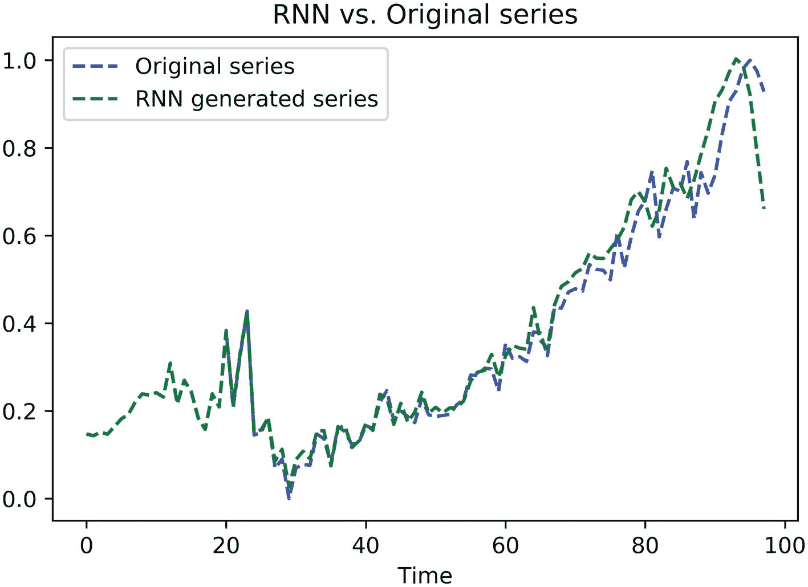

图 36-21

原始序列与 RNN 生成的序列对比 – 缩放数据值

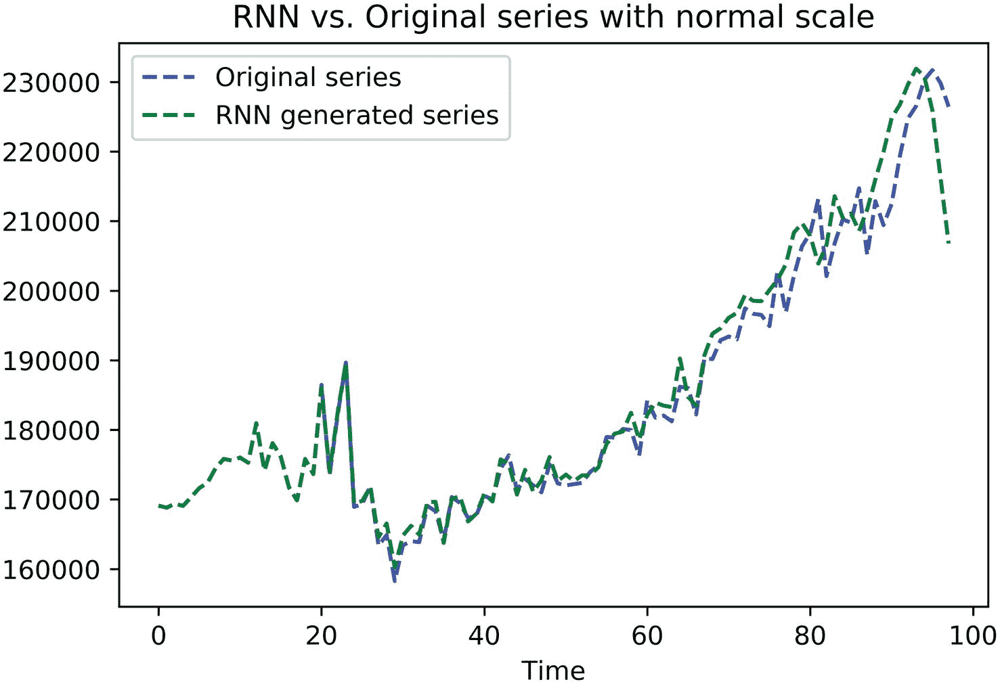

图 36-22

原始序列与 RNN 生成的序列对比 – 正常数据值

```py
# inverse to normal scale and plot
data_train_inverse = scaler.inverse_transform(data_train.reshape(-1, 1))
rnn_data_inverse = scaler.inverse_transform(np.array(rnn_data).reshape(-1, 1))
plt.title("RNN vs. Original series with normal scale", fontsize=12)
plt.plot(data_train_inverse, "b--", markersize=10, label="Original series")
plt.plot(rnn_data_inverse, "g--", markersize=10, label="RNN generated series")
plt.legend(loc="upper left")
plt.xlabel("Time")
plt.show()
```

从 Keras LSTM 代码示例中，使用**tf.keras.layers.LSTM()**方法实现 LSTM 循环层。将属性**return_sequences**设置为**True**以返回输出序列中的最后一个输出，或整个序列。

## TensorFlow 2.0 的多变量时间序列 RNN

本例中的数据集来自著名的 UCI 机器学习仓库的道琼斯指数数据集。在这个股票数据集中，每一行包含一周的股票价格记录，包括该股票在下一周内的回报百分比**percent_change_next_weeks_price()**。在本例中，使用上周的记录来预测美国银行（BAC）股票价格在接下来两周的百分比变化。

命名为**clean_dataset()**的方法对数据集进行了一些基本的清理，使其适合建模。对特定数据集采取的措施包括从某些数据列中删除美元符号，删除缺失值，并重新排列数据列，使目标属性**percent_change_next_weeks_price**成为最后一列。

命名为**data_transform()**的方法选择属于“美国银行”的股票记录，并调整目标属性，以便使用上周的记录来预测接下来两周的价格百分比变化。此外，数据集被分为训练集和测试集。名为**normalize_and_scale()**的方法删除非数值列并缩放数据集属性。

再次强调，模型将在 GPU 实例上训练。该模型将是一个堆叠的 GRU，包含多个 GRU 层。这种带有记忆单元的 RNN 层堆叠使得网络更具表达性，可以学习更复杂的长期序列。如果在 Google Colab 上运行代码，请将运行类型更改为 GPU，并安装带有 GPU 包的 TensorFlow 2.0。图 36-23 中的输出图显示了模型的预测结果，包括目标和滞后训练实例。

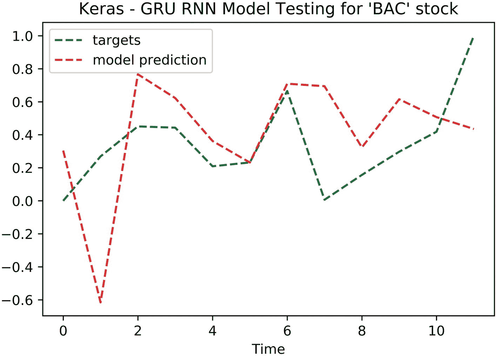

图 36-23

美国银行股票的 GRU RNN 模型测试

```py
# import TensorFlow 2.0 with GPU
!pip install -q tf-nightly-gpu-2.0-preview
# import packages
import tensorflow as tf
import pandas as pd
import numpy as np
import matplotlib.pyplot as plt
from sklearn.model_selection import train_test_split
from sklearn.preprocessing import MinMaxScaler
# confirm tensorflow can see GPU
device_name = tf.test.gpu_device_name()
if device_name != '/device:GPU:0':
raise SystemError('GPU device not found')
print('Found GPU at: {}'.format(device_name))
# data file path
file_path = "dow_jones_index.data"
# load data
data = pd.read_csv(file_path, parse_dates=['date'], index_col="date")
# print column name
data.columns
# print column datatypes
data.dtypes
# parameters
outputs = 1
stock ='BAC'  # Bank of America
def clean_dataset(data):
# strip dollar sign from `object` type columns
col = ['open', 'high', 'low', 'close', 'next_weeks_open', 'next_weeks_close']
data[col] = data[col].replace({'\$': "}, regex=True)
# drop NaN
data.dropna(inplace=True)
# rearrange columns
columns = ['quarter', 'stock', 'open', 'high', 'low', 'close', 'volume',
'percent_change_price', 'percent_change_volume_over_last_wk',
'previous_weeks_volume', 'next_weeks_open', 'next_weeks_close',
'days_to_next_dividend', 'percent_return_next_dividend',
'percent_change_next_weeks_price']
data = data[columns]
return data
def data_transform(data):
# select stock data belonging to Bank of America
data = data[data.stock == stock]
# adjust target(t) to depend on input (t-1)
data.percent_change_next_weeks_price = data.percent_change_next_weeks_price.shift(-1)
# remove nans as a result of the shifted values
data = data.iloc[:-1,:]
# split quarter 1 as training data and quarter 2 as testing data
train_df = data[data.quarter == 1]
test_df = data[data.quarter == 2]
return (np.array(train_df), np.array(test_df))
def normalize_and_scale(train_df, test_df):
# remove string columns and convert to float
train_df = train_df[:,2:].astype(float,copy=False)
test_df = test_df[:,2:].astype(float,copy=False)
# MinMaxScaler - center and scale the dataset
scaler = MinMaxScaler(feature_range=(0, 1))
train_df_scale = scaler.fit_transform(train_df[:,2:])
test_df_scale = scaler.fit_transform(test_df[:,2:])
return (scaler, train_df_scale, test_df_scale)
# clean the dataset
data = clean_dataset(data)
# select Dow Jones stock and split into training and test sets
train_df, test_df = data_transform(data)
# scale the data
scaler, train_df_scaled, test_df_scaled = normalize_and_scale(train_df, test_df)
# split train/ test
train_X, train_y = train_df_scaled[:, :-1], train_df_scaled[:, -1]
test_X, test_y = test_df_scaled[:, :-1], test_df_scaled[:, -1]
# reshape inputs to 3D array
train_X = train_X[:,None,:]
test_X = test_X[:,None,:]
# reshape outputs
train_y = np.reshape(train_y, (-1,outputs))
test_y = np.reshape(test_y, (-1,outputs))
# model parameters
batch_size = int(train_X.shape[0]/5)
length = train_X.shape[0]
# build model
model = tf.keras.Sequential()
model.add(tf.keras.layers.GRU(128, input_shape=train_X.shape[1:],
return_sequences=True))
model.add(tf.keras.layers.GRU(100, return_sequences=True))
model.add(tf.keras.layers.GRU(64))
model.add(tf.keras.layers.Dense(1))
# compile the model
model.compile(loss='mean_squared_error',
optimizer='adam',
metrics=['mse'])
# print model summary
model.summary()
# create dataset pipeline
train_ds = tf.data.Dataset.from_tensor_slices(
(train_X, train_y)).shuffle(len(train_X)).repeat().batch(batch_size)
test_ds = tf.data.Dataset.from_tensor_slices((test_X, test_y)).batch(batch_size)
# train the model
history = model.fit(train_ds, epochs=10,
steps_per_epoch=500)
# evaluate the model
loss, mse = model.evaluate(test_ds)
print('Test loss: {:.4f}'.format(loss))
print('Test mse: {:.4f}'.format(mse))
# predict
y_pred = model.predict(test_X)
# plot
plt.figure(1)
plt.title("Keras - GRU RNN Model Testing for '{}' stock".format(stock), fontsize=12)
plt.plot(test_y, "g--", markersize=10, label="targets")
plt.plot(y_pred, "r--", markersize=10, label="model prediction")
plt.legend()
plt.xlabel("Time")
plt.show()
# plt.savefig('gru-bac-model.png', dpi=800)
```

本章概述了循环神经网络（RNN）及其在不同类型序列问题中学习循环模型的应用。下一章将讨论我们如何使用神经网络通过自动编码器以某种形式的无监督学习来重建输入。 

# 37. 自动编码器

自动编码器是一种无监督学习算法，它使用神经网络来重建数据集的特征。就像我们在机器学习章节中之前讨论的无监督算法一样，自动编码器可以用来降低数据集的维度并提取相关特征。更重要的是，自动编码器特有的能力是在学习一个内部表示（也称为编码）之后，该表示可以重建神经网络输入的特征，从而生成数据集的更多示例。

自动编码器接收数据集的特征作为输入。这些特征通过一系列编码器传递，这些编码器是神经网络中的隐藏层，以创建一个称为编码的内部表示。然后，使用学习到的编码通过一系列解码器重建输出，这些解码器也是隐藏的神经网络层。自动编码器不能仅仅进行简单的输入记忆，因为通过减少输入维度对编码器施加了约束，迫使网络学习一个有效的表示集，解码器使用这个集来重建输入。

具有受限编码器和解码器的自动编码器被称为**欠完备**。使用重建误差项来评估自动编码器的性能，通过测试输出与输入对应得有多好。当然，就像其他神经网络一样，编码器和解码器的神经元具有非线性激活函数以学习复杂模式。一个简单的自动编码器网络架构示例如图 37-1 所示。

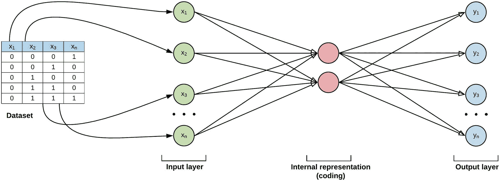

图 37-1

简单的自动编码器架构

## 堆叠自动编码器

堆叠自动编码器是指如图 37-1 所示的简单自动编码器架构通过多个隐藏层进行增强。就像其他具有隐藏层的深度神经网络架构一样，自动编码器的隐藏层使网络能够学习输入数据集的更复杂模式。

堆叠或深度自动编码器的隐藏层在网络编码器和解码器部分对称地添加，如图 22-2 所示。隐藏层的神经元被限制为少于输入层。这种公式对网络施加了限制，因此它不仅仅是记忆输入。更重要的是，必须注意不要创建太多的深层层，这样自动编码器就不会过拟合输入数据，并且无法泛化到样本外的例子。为了优化深度自动编码器的训练，对称神经层的权重通过称为*绑定*的技术共享。

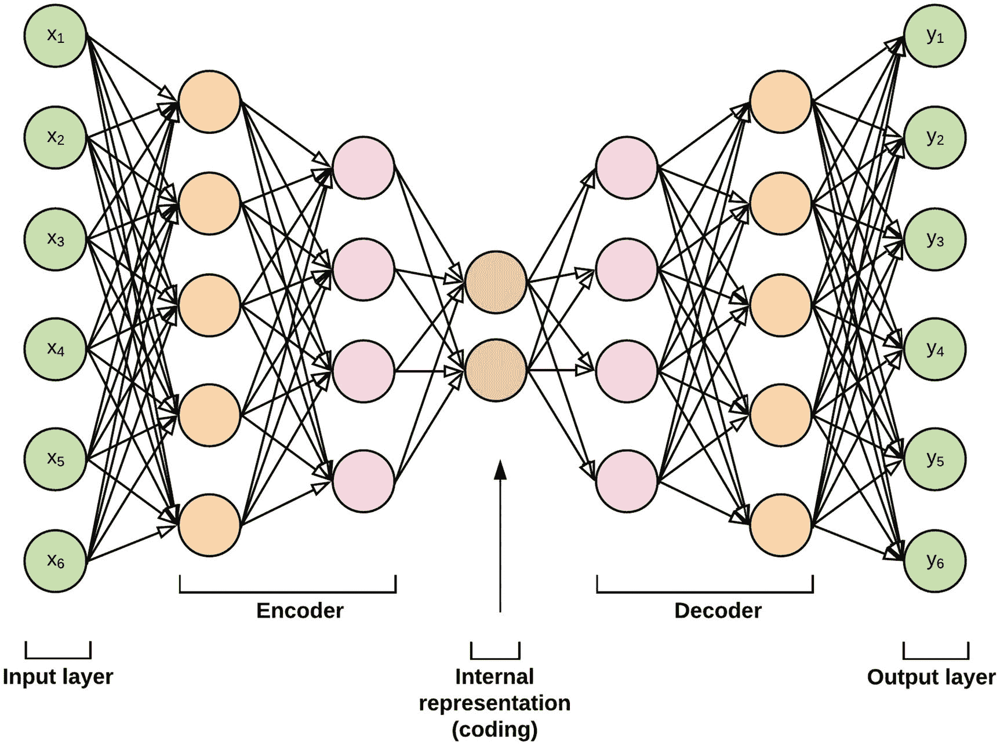

图 37-2

堆叠或深度自动编码器。在编码器和解码器两侧对称地添加隐藏层

## 使用 TensorFlow 2.0 的堆叠自动编码器

本节中的代码示例展示了如何使用 TensorFlow 2.0 实现自动编码器网络。为了简单起见，使用 MNIST 手写数据集来创建原始图像的重建。在这个例子中，实现了一个堆叠自动编码器，原始图像和重建图像如图 37-3 所示。代码列表如下，随后将展示相应的代码注释。

```py
# import TensorFlow 2.0 with GPU
!pip install -q tf-nightly-gpu-2.0-preview
# import packages
import tensorflow as tf
import numpy as np
import matplotlib.pyplot as plt
# import dataset
(x_train, _), (x_test, _) = tf.keras.datasets.mnist.load_data()
# change datatype to float
x_train = x_train.astype('float32')
x_test = x_test.astype('float32')
# scale the dataset from 0 -> 255 to 0 -> 1
x_train /= 255
x_test /= 255
# flatten the 28x28 images into vectors of size 784
x_train = x_train.reshape((len(x_train), np.prod(x_train.shape[1:])))
x_test = x_test.reshape((len(x_test), np.prod(x_test.shape[1:])))
# create the autoencoder model
def model_fn():
model_input = tf.keras.layers.Input(shape=(784,))
encoded = tf.keras.layers.Dense(units=512, activation="relu")(model_input)
encoded = tf.keras.layers.Dense(units=128, activation="relu")(encoded)
encoded = tf.keras.layers.Dense(units=64, activation="relu")(encoded)
coding_layer = tf.keras.layers.Dense(units=32)(encoded)
decoded = tf.keras.layers.Dense(units=64, activation="relu")(coding_layer)
decoded = tf.keras.layers.Dense(units=128, activation="relu")(decoded)
decoded = tf.keras.layers.Dense(units=512, activation="relu")(decoded)
decoded_output = tf.keras.layers.Dense(units=784)(decoded)
# the autoencoder model
autoencoder_model = tf.keras.Model(inputs=model_input, outputs=decoded_output)
# compile the model
autoencoder_model.compile(optimizer='adam',
loss='binary_crossentropy',
metrics=['accuracy'])
return autoencoder_model
# build the model
autoencoder_model = model_fn()
# print autoencoder model summary
autoencoder_model.summary()
# train the model
autoencoder_model.fit(x_train, x_train, epochs=1000, batch_size=256,
shuffle=True, validation_data=(x_test, x_test))
# visualize reconstruction
sample_size = 6
test_image = x_test[:sample_size]
# reconstruct test samples
test_reconstruction = autoencoder_model.predict(test_image)
plt.figure(figsize = (8,25))
plt.suptitle('Stacked Autoencoder Reconstruction', fontsize=16)
for i in range(sample_size):
plt.subplot(sample_size, 2, i*2+1)
plt.title('Original image')
plt.imshow(test_image[i].reshape((28, 28)), cmap="Greys", interpolation="nearest", aspect="auto")
plt.subplot(sample_size, 2, i*2+2)
plt.title('Reconstructed image')
plt.imshow(test_reconstruction[i].reshape((28, 28)), cmap="Greys", interpolation="nearest", aspect="auto")
plt.show()
```

从前面的代码列表中，请注意以下内容：

+   观察堆叠自动编码器的编码器层和解码器层的排列。特别是注意编码器和解码器的对应层排列具有相同数量的神经元。

+   损失误差衡量自动编码器网络输入与解码器输出之间的平方差。

图 37-3 中的图像对比了自动编码器网络重建的图像与数据集中的原始图像。

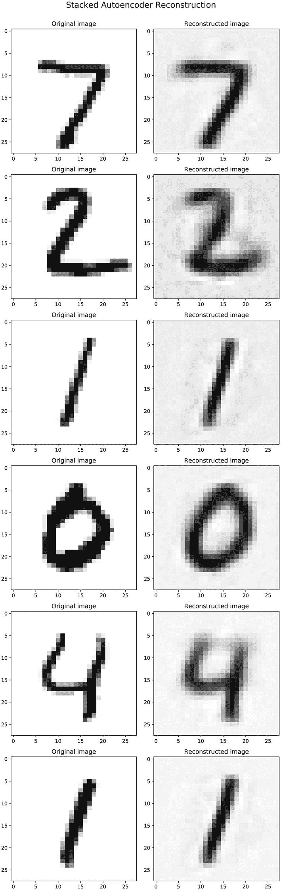

Figure 37-3

堆叠自动编码器重建。左：原始图像。右：重建图像。

## 去噪自动编码器

去噪自动编码器通过在输入中注入一些高斯噪声向网络添加不同类型的约束。这种噪声注入迫使自动编码器学习输入特征的未损坏形式；通过这样做，自动编码器学习数据集的内部表示，而不需要记住输入。

去噪自动编码器通过以类似 Dropout 技术的方式停用一些输入神经元来约束输入的另一种方式。去噪自动编码器使用一个过完备的网络架构。这意味着隐藏的编码器和解码器层的维度不受限制；因此，它们是过完备的。去噪自动编码器架构的示意图如图 37-4 所示。

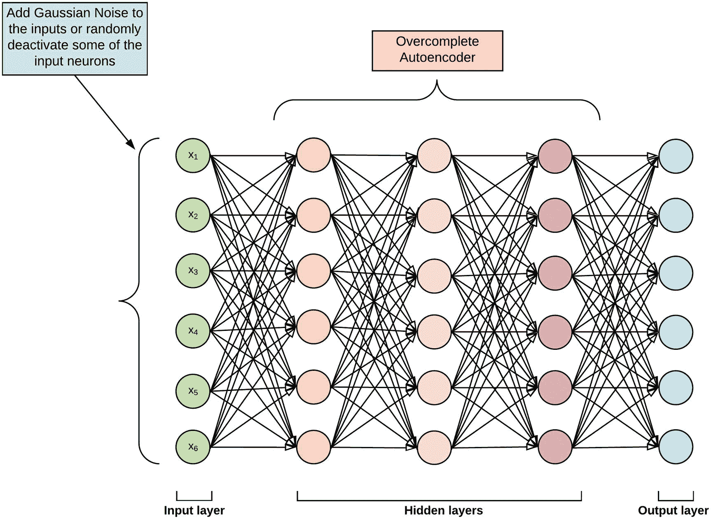

Figure 37-4

去噪自动编码器。通过添加高斯噪声或关闭一些随机选择的输入神经元来应用约束。

本章讨论了如何以无监督的方式使用深度神经网络来重建网络的输入作为网络的输出。这是第六部分的最后一章，提供了深度神经网络的一般理论背景以及如何在 TensorFlow 2.0 中实现。在第七部分中，我们将讨论在 Google Cloud Platform 上进行高级分析和机器学习。
