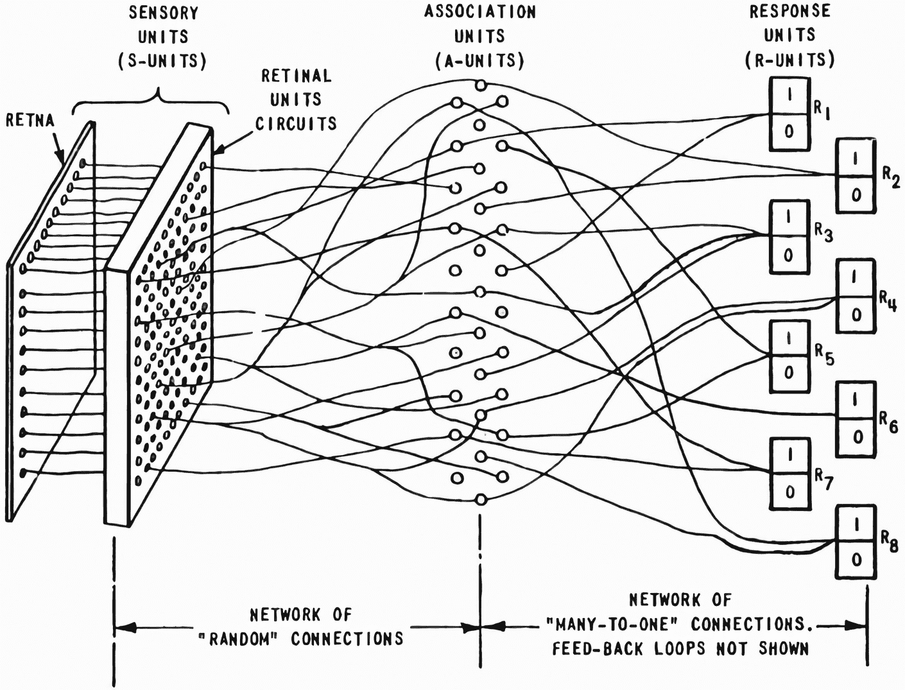
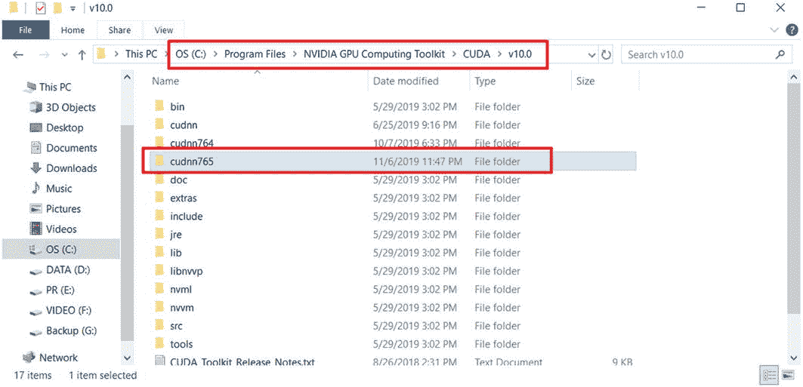

# 一、人工智能导论

> 我们想要的是一台能从经验中学习的机器。
> 
> —艾伦·图灵

## 1.1 人工智能在行动

信息技术是人类历史上的第三次工业革命。计算机、互联网和智能家居技术的普及极大地方便了人们的日常生活。通过编程，人类可以将事先设计好的交互逻辑交给机器反复快速执行，从而将人类从简单繁琐的重复性劳动中解放出来。然而，对于需要高智能水平的任务，如人脸识别、聊天机器人和自动驾驶，很难设计出清晰的逻辑规则。因此，传统的编程方法对这类任务无能为力，而人工智能作为解决这类问题的关键技术，是非常有前途的。

随着深度学习算法的兴起，AI 在一些任务上已经实现甚至超过了类似人类的智能。比如 AlphaGo 程序已经击败了人类围棋最强选手之一的柯洁，OpenAI Five 在 Dota 2 的比赛上击败了冠军战队 OG。在此期间，人脸识别、智能语音、机器翻译等实用技术进入了人们的日常生活。现在我们的生活其实已经被 AI 包围了。虽然目前所能达到的智能水平距离人工通用智能(AGI)还有一段距离，但我们仍然坚信 AI 的时代已经到来。

接下来，我们将介绍 AI、机器学习和深度学习的概念，以及它们之间的联系和区别。

### 1.1.1 人工智能解释

AI 是一种允许机器像人类一样获得智能和推理机制的技术。这个概念最早出现在 1956 年的达特茅斯会议上。这是一项非常具有挑战性的任务。人类目前还不能对人脑的工作机制有全面科学的认识。制造能达到人脑水平的智能机器，无疑难度更大。也就是说，在某些方面类似甚至超过人类智力的机器已经被证明是可行的。

如何实现 AI 是一个非常宽泛的问题。人工智能的发展主要经历了三个阶段，每个阶段都代表了人类试图从不同角度实现人工智能的探索足迹。在早期，人们试图通过总结和概括一些逻辑规则，并以计算机程序的形式实现它们来开发智能系统。但是这种显式规则往往过于简单，难以用来表达复杂抽象的概念和规则。这个阶段被称为推理期。

20 世纪 70 年代，科学家试图通过知识库和推理来实现 AI。他们建立了一个大型复杂的专家系统来模拟人类专家的智力水平。这些明确指定的规则的最大困难之一是，许多复杂、抽象的概念无法在具体的代码中实现。比如人类对图片的识别和对语言的理解过程，根本无法用既定的规则来模拟。为了解决这样的问题，一个允许机器从数据中自动学习规则的研究学科诞生了，称为机器学习。20 世纪 80 年代，机器学习成为人工智能领域的一个热门话题。这是第二阶段。

在机器学习中，有一个方向是通过神经网络学习复杂、抽象的逻辑。神经网络方向的研究经历了两次大起大落。自 2012 年以来，深度神经网络技术的应用在计算机视觉、自然语言处理(NLP)和机器人等领域取得了重大突破。有些任务甚至已经超过了人类的智力水平。这是人工智能的第三次复兴。深度神经网络最终有了一个新名字——深度学习。总的来说，神经网络和深度学习的本质区别并不大。深度学习是指基于深度神经网络的模型或算法。人工智能、机器学习、神经网络、深度学习之间的关系如图 1-1 所示。


图 1-1

人工智能、机器学习、神经网络和深度学习的关系

### 1.1.2 机器学习

机器学习可以分为有监督学习、无监督学习、强化学习，如图 1-2 。


图 1-2

机器学习的类别

**监督学习**。监督学习数据集包含样本 *x* 和样本标签 *y* 。算法需要学习映射关系*f*<sub>*θ*</sub>:*x*→*y*，其中 *f* <sub>*θ*</sub> 代表模型函数， *θ* 是模型的参数。在训练过程中，通过最小化模型预测与真实值 *y* 之间的误差来优化模型参数 *θ* ，使模型能够有更准确的预测。常见的监督学习模型包括线性回归、逻辑回归、支持向量机(SVMs)和随机森林。

**无监督学习**。收集带标签的数据通常更昂贵。对于只有样本的数据集，算法需要发现数据本身的模态。这种算法被称为无监督学习。无监督学习中的一类算法是将自身作为监督信号，即*f*<sub>θ</sub>:*x*→*x*，这就是所谓的自监督学习。在训练过程中，通过最小化模型预测值*f*<sub>*θ*</sub>(*x*)与其自身 *x* 之间的误差来优化参数。常见的无监督学习算法包括自编码器和生成对抗网络(GANs)。

**强化学习**。这是一种通过与环境交互来学习解决问题的策略的算法。与有监督和无监督学习不同，强化学习问题没有明确的“正确的”动作监督信号。该算法需要与环境进行交互，以从环境反馈中获得滞后的奖励信号。因此，不可能计算模型**强化学习**预测和“正确值”之间的误差来直接优化网络。常见的强化学习算法是深度 Q 网络(DQNs)和近似策略优化(PPO)。

### 1.1.3 神经网络和深度学习

神经网络算法是一类基于神经网络从数据中学习的算法。它们仍然属于机器学习的范畴。由于计算能力和数据量的限制，早期的神经网络很浅，通常有一到四层左右。因此，网络表达能力有限。随着计算能力的提升和大数据时代的到来，高度并行化的图形处理单元(GPU)和海量数据使得大规模神经网络的训练成为可能。

2006 年，Geoffrey Hinton 首次提出了深度学习的概念。2012 年，八层深度神经网络 AlexNet 发布，在图像识别比赛中取得了巨大的性能提升。此后，相继开发出几十层、几百层、甚至上千层的神经网络模型，显示出很强的学习能力。使用深度神经网络实现的算法通常被称为深度学习模型。本质上，神经网络和深度学习可以被认为是一样的。

我们简单对比一下深度学习和其他算法。如图 1-3 所示，基于规则的系统通常会编写显式逻辑，这种逻辑一般是为特定任务设计的，不适合其他任务。传统机器学习算法人为设计具有一定通用性的特征检测方法，如 SIFT、HOG 特征等。这些特性适用于某一类任务，具有一定的通用性。但是性能很大程度上取决于如何设计这些特性。神经网络的出现使得计算机可以通过神经网络自动设计那些功能，而无需人工干预。浅层神经网络通常具有有限的特征提取能力，而深层神经网络能够提取高级抽象特征，并且具有更好的性能。


图 1-3

深度学习与其他算法的比较

## 1.2 神经网络的历史

我们把神经网络的发展分为浅层神经网络阶段和深度学习阶段，以 2006 年为分界点。2006 年之前，深度学习以神经网络的名义发展，经历了两起两落。2006 年，Geoffrey Hinton 首次将深度神经网络命名为深度学习，开始了它的第三次复兴。

### 1.2.1 浅层神经网络

1943 年，心理学家沃伦·麦卡洛克和逻辑学家沃尔特·皮茨根据生物神经元的结构提出了最早的神经元数学模型，以他们的姓氏首字母命名为 MP 神经元模型。型号*f*(*x*)=*h*(*g*(*x*))，其中*g*(*x*)=∑<sub>*I*</sub>*x*<sub>*I*</sub>，*x*<sub>*I*如果 *g* ( *x* ) ≥ 0，输出为 1；如果 *g* ( *x* ) <为 0，输出为 0。MP 神经元模型没有学习能力，只能完成固定的逻辑判断。**</sub>


图 1-4

MP 神经元模型

1958 年，美国心理学家弗兰克·罗森布拉特(Frank Rosenblatt)提出了第一个可以自动学习权重的神经元模型，称为感知器(perceptron)。如图 1-5 所示，利用输出值 *o* 与真值 *y* 之间的误差来调整神经元的权重{ *w* <sub>1</sub> ， *w* <sub>2</sub> ，…，*w*<sub>*n*</sub>}。Frank Rosenblatt 随后实现了基于“Mark 1 感知器”硬件的感知器模型。如图 1-6 和 1-7 所示，输入为 400 像素的图像传感器，输出有 8 个节点。它可以成功地识别一些英文字母。一般认为，1943–1969 年是人工智能发展的第一个繁荣期。



图 1-7

马克 1 感知器网络架构 <sup>2</sup>


图 1-6

弗兰克·罗森布拉特和马克 1 号感知器 <sup>1 号</sup>


图 1-5

感知器模型

1969 年，美国科学家马文·明斯基等人在《感知器一书中指出了感知器等线性模型的主要缺陷。他们发现，感知器不能处理简单的线性不可分问题，如异或。这直接导致了对神经网络感知机相关研究的低谷期。一般认为 1969–1982 年是人工智能的第一个冬天。

虽然处于 AI 的低谷期，但还是有很多意义重大的研究陆续发表。其中最重要的是反向传播(BP)算法，它仍然是现代深度学习算法的核心基础。事实上，BP 算法的数学思想早在 20 世纪 60 年代就已经衍生出来，但当时还没有应用到神经网络中。1974 年，美国科学家 Paul Werbos 在其博士论文中首次提出 BP 算法可以应用于神经网络。遗憾的是，这个结果没有得到足够的重视。1986 年，David Rumelhart 等人在 *Nature* 发表了一篇使用 BP 算法进行特征学习的论文。此后，BP 算法开始得到广泛关注。

1982 年，随着约翰·霍普菲尔德(John Hopfield)的循环连接霍普菲尔德网络(cyclical connected Hopfield network)的提出，从 1982 年到 1995 年开始了人工智能复兴的第二次浪潮。在此期间，卷积神经网络、循环神经网络和反向传播算法相继被开发出来。1986 年，David Rumelhart、Geoffrey Hinton 等人将 BP 算法应用于多层感知器。1989 年，Yann LeCun 等人将 BP 算法应用于手写数字图像识别，取得了巨大的成功，被称为 LeNet。LeNet 系统在邮政编码识别、银行支票识别和许多其他系统中成功商业化。1997 年，Jürgen Schmidhuber 提出了最广泛使用的循环神经网络变体之一，长短期记忆(LSTM)。同年，还提出了双向循环神经网络。

遗憾的是，随着以支持向量机(SVM)为代表的传统机器学习算法的兴起，神经网络的研究逐渐进入低谷，被称为人工智能的第二个冬天。支持向量机具有严谨的理论基础，需要的训练样本数量少，还具有良好的泛化能力。相比之下，神经网络缺乏理论基础，难以解释。深网难练，表现正常。图 1-8 显示了 1943 年到 2006 年间 AI 发展的重要时期。


图 1-8

浅层神经网络开发时间表

### 1.2.2 深度学习

2006 年，Geoffrey Hinton 等人发现多层神经网络可以通过逐层预训练得到更好的训练，并在 MNIST 手写数字图片数据集上取得了比 SVM 更好的错误率，开启了第三次人工智能复兴。在那篇论文中，Geoffrey Hinton 首次提出了深度学习的概念。2011 年，Xavier Glorot 提出了一种校正线性单位(ReLU)激活函数，这是目前应用最广泛的激活函数之一。2012 年，Alex Krizhevsky 提出了一个八层深度神经网络 AlexNet，它使用了 ReLU 激活函数和 Dropout 技术来防止过拟合。同时摒弃了逐层预训练的方式，直接在两个 NVIDIA GTX580 GPUs 上训练网络。AlexNet 在 ILSVRC-2012 图片识别比赛中获得第一名，显示前 5 名的错误率比第二名惊人地降低了 10.9%。

自 AlexNet 模型开发以来，各种模型相继问世，包括 VGG 系列、GoogleNet 系列、ResNet 系列和 DenseNet 系列。ResNet 系列型号将网络的层数增加到数百甚至数千层，同时保持相同甚至更好的性能。其算法简单通用，性能显著，是深度学习最具代表性的模型。

除了在监督学习方面取得惊人的成果，在无监督学习和强化学习方面也取得了巨大的成就。2014 年，Ian Goodfellow 提出了生成对抗网络(GANs)，它通过对抗训练来学习样本的真实分布，以生成近似度更高的样本。此后，人们提出了大量的 GAN 模型。最新的图像生成模型可以生成达到肉眼难以辨别的保真度的图像。2016 年，DeepMind 将深度神经网络应用于强化学习领域，提出了 DQN 算法，在雅达利游戏平台的 49 款游戏中，达到了与人类相当甚至更高的水平。在围棋领域，来自 DeepMind 的 AlphaGo 和 AlphaGo Zero 智能程序先后战胜了人类顶级围棋选手李世石、柯洁等。在多智能体协作 Dota 2 游戏平台中，OpenAI 开发的 OpenAI 五大智能程序在受限游戏环境下击败 TI8 冠军战队 OG，展现了大量专业的高水平智能操作。图 1-9 列出了 2006 年到 2019 年 AI 发展的主要时间点。


图 1-9

深度学习发展的时间表

## 1.3 深度学习的特点

与传统的机器学习算法和浅层神经网络相比，现代深度学习算法通常具有以下特点。

### 数据量

早期的机器学习算法训练起来相对简单快速，所需数据集的规模也相对较小，比如英国统计学家罗纳德·费雪在 1936 年收集的鸢尾花数据集，只包含三类花，每类有 50 个样本。随着计算机技术的发展，设计的算法越来越复杂，对数据量的需求也越来越大。Yann LeCun 在 1998 年收集的 MNIST 手写数字图片数据集包含从 0 到 9 的总共 10 类数字，每类多达 7000 张图片。随着神经网络尤其是深度学习网络的兴起，网络层数普遍较大，模型参数数量可达百万、千万，甚至十亿。为了防止过拟合，训练数据集的大小通常很大。现代社交媒体的普及也使得收集海量数据成为可能。例如，2010 年发布的 ImageNet 数据集总共包括 14，197，122 张图片，整个数据集的压缩文件大小为 154GB。图 1-10 和 1-11 列出了一段时间内的样本数量和数据集大小。

虽然深度学习对大数据集的需求很高，但是收集数据，尤其是收集有标签的数据，往往是非常昂贵的。一个数据集的形成通常需要人工采集、爬取原始数据并清除无效样本，然后用人类的智能对数据样本进行标注，因此不可避免地会引入主观偏差和随机误差。因此，数据量要求小的算法是非常热门的话题。


图 1-11

数据集大小随时间变化


图 1-10

数据集样本大小随时间变化

### 1.3.2 计算能力

计算能力的提升是第三次人工智能复兴的重要因素。事实上，现代深度学习的基础理论早在 20 世纪 80 年代就已经提出，但直到 2012 年基于两个 GTX580 GPUs 上的训练的 AlexNet 发布，深度学习的真正潜力才得以实现。传统的机器学习算法不像深度学习那样对数据量和计算能力有苛刻的要求。通常情况下，在 CPU 上进行串行训练可以获得满意的效果。但是深度学习非常依赖并行加速计算设备。目前大多数神经网络使用并行加速芯片，如英伟达 GPU 和谷歌 TPU 来训练模型参数。比如 AlphaGo Zero 程序，需要从零开始在 64 个 GPU 上训练 40 天，才能超越所有 AlphaGo 历史版本。自动网络结构搜索算法使用 800 个 GPU 来优化更好的网络结构。

目前普通消费者可以使用的深度学习加速硬件设备主要来自 NVIDIA GPU 显卡。图 1-12 图解了 2008-2017 年 NVIDIA GPU 和 x86 CPU 的每秒十亿次浮点运算(GFLOPS)的变化。可以看到，x86 CPU 的曲线变化相对较慢，NVIDIA GPU 的浮点计算能力呈指数级增长，这主要是游戏和深度学习计算的业务不断增加推动的。


图 1-12

英伟达 GPU FLOPS 变化(数据来源:英伟达)

### 1.3.3 网络规模

早期的感知器模型和多层神经网络只有一层或两层到四层，网络参数也在几万左右。随着深度学习的发展和计算能力的提升，相继提出了 AlexNet (8 层)、VGG16 (16 层)、GoogleNet (22 层)、ResNet50 (50 层)、DenseNet121 (121 层)等模型，同时输入图片的大小也从 28×28 到 224×224 逐渐增大到 299×299 甚至更大。这些变化使得网络的参数总数达到千万级，如图 1-13 所示。

网络规模的增加相应地增强了神经网络的能力，使得网络可以学习更复杂的数据形态，并且模型性能可以相应地提高。另一方面，网络规模的增大也意味着我们需要更多的训练数据和计算能力来避免过拟合。


图 1-13

网络层的变化

### 一般情报

过去，为了提高算法在某项任务上的性能，往往需要利用先验知识，人工设计相应的特征来帮助算法更好地收敛到最优解。这种类型的特征提取方法通常与特定任务密切相关。一旦场景发生变化，这些人为设计的特征和先验设置就无法适应新的场景，人们往往需要重新设计算法。

设计一种能够像人脑一样自动学习、自我调整的通用智能机构，一直是人类共同的愿景。深度学习是最接近一般智能的算法之一。在计算机视觉领域，以前需要为特定任务设计特征并添加先验假设的方法已经被深度学习算法所抛弃。目前，几乎所有的图像识别、目标检测和语义分割算法都是基于端到端的深度学习模型，表现出良好的性能和较强的适应性。在 Atari 游戏平台上，DeepMind 设计的 DQN 算法在相同的算法、模型结构、超参数设置下，可以在 49 场游戏中达到人类同等水平，表现出一定程度的通用智能。图 1-14 是 DQN 算法的网络结构。它不是为某个游戏设计的，但可以控制 Atari 游戏平台上的 49 个游戏。


图 1-14

DQN 网络结构[1]

## 1.4 深度学习应用

深度学习算法已经广泛应用于我们的日常生活中，比如手机中的语音助手、汽车中的智能辅助驾驶、刷脸支付等。我们将从计算机视觉、自然语言处理和强化学习开始，介绍深度学习的一些主流应用。

### 计算机视觉

**图像分类**是一个常见的分类问题。神经网络的输入是图片，输出值是当前样本属于每个类别的概率。通常，选择概率最高的类别作为样本的预测类别。图像识别是深度学习最早的成功应用之一。经典的神经网络模型包括 VGG 系列、Inception 系列和 ResNet 系列。

**物体检测**是指通过算法自动检测出图片中常见物体的大概位置。通常用一个包围盒来表示，对包围盒中对象的类别信息进行分类，如图 1-15 所示。常见的对象检测算法有 RCNN、快速 RCNN、更快 RCNN、掩模 RCNN、SSD 和 YOLO 系列。

**语义分割**是对图片中的内容进行自动分割和识别的算法。我们可以把语义分割理解为对每个像素的分类，分析每个像素的类别信息，如图 1-16 。常见的语义分割模型有 FCN、U-net、SegNet、DeepLab 系列等。


图 1-16

语义分割示例


图 1-15

对象检测示例

**视频了解**。随着深度学习在 2D 图片相关任务上取得更好的效果，具有时间维度信息(第三维是帧序列)的 3D 视频理解任务受到越来越多的关注。常见的视频理解任务包括视频分类、行为检测和视频主题提取。常见的机型有 C3D、TSN、DOVF、TS_LSTM。

**图像生成**从学习到的分布中学习真实图片和样本的分布，获得高度逼真的生成图片。目前常见的图像生成模型有系列和 GAN 系列。其中，GAN 系列算法近年来取得了长足的进步。最新的 GAN 模型产生的画面效果已经到了肉眼难以辨别真伪的程度，如图 1-17 。

除了前面的应用，深度学习在其他领域也取得了显著的成果，例如艺术风格转移(图 1-18 )、超分辨率、图片去噪/模糊、灰度图片着色等等。


图 1-18

艺术风格转移图像


图 1-17

模型生成的图像

### 1.4.2 自然语言处理

**机器翻译**。在过去，机器翻译算法通常基于统计机器翻译模型，这也是谷歌翻译系统在 2016 年之前使用的技术。2016 年 11 月，谷歌推出了基于 Seq2Seq 模型的谷歌神经机器翻译(GNMT)系统。首次实现了从源语言到目标语言的直接翻译技术，在多项任务上提高了 50–90%。常用的机器翻译模型有 Seq2Seq、BERT、GPT 和 GPT-2。其中，OpenAI 提出的 GPT-2 模型约有 15 亿个参数。起初，OpenAI 出于技术安全原因拒绝开源 GPT-2 模型。

**聊天机器人**也是自然语言处理的一个主流任务。机器自动学习与人类对话，对简单的人类需求提供满意的自动响应，提高客户服务效率和服务质量。聊天机器人通常用于咨询系统、娱乐系统和智能家居。

### 强化学习

**虚拟游戏**。与真实环境相比，虚拟游戏平台既可以训练和测试强化学习算法，又可以避免无关因素的干扰，同时还可以最小化实验成本。目前，常用的虚拟游戏平台包括 OpenAI Gym、OpenAI Universe、OpenAI Roboschool、DeepMind OpenSpiel 和 MuJoCo，常用的强化学习算法包括 DQN、A3C、A2C 和 PPO。在围棋领域，DeepMind AlphaGo 程序已经超越了人类围棋专家。在 Dota 2 和星际争霸游戏中，OpenAI 和 DeepMind 开发的智能程序也曾在限制规则下击败过职业队伍。

**机器人**。在现实环境中，对机器人的控制也取得了一些进展。例如，加州大学伯克利分校实验室在机器人领域的模仿学习、元学习、少射学习等领域取得了很多进展。波士顿动力公司在机器人应用方面取得了可喜的成绩。它制造的机器人在复杂地形行走和多智能体协作等任务上表现出色(图 1-19 )。

**自动驾驶**被认为是短期内强化学习的一个应用方向。许多公司在自动驾驶方面投入了大量资源，如百度、优步和谷歌。来自百度的 Apollo 已经开始在北京、雄安、武汉等地试运营。图 1-20 显示的是百度的自动驾驶汽车 Apollo。


图 1-20

百度的自动驾驶汽车阿波罗 <sup>4</sup>


图 1-19

来自波士顿动力公司的机器人 <sup>3</sup>

## 1.5 深度学习框架

工欲善其事，必先利其器。了解了深度学习的基础知识之后，我们来挑选一下用来实现深度学习算法的工具。

### 主要框架

*   Theano 是最早的深度学习框架之一。它是由 Yoshua Bengio 和 Ian Goodfellow 开发的。它是一个基于 Python 的计算库，用于定位底层操作。Theano 同时支持 GPU 和 CPU 操作。由于 Theano 开发效率低，模型编译时间长，开发者改用 TensorFlow，目前 Theano 已经停止维护。

*   Scikit-learn 是一个完整的机器学习算法计算库。它内置了对常见的传统机器学习算法的支持，并且拥有丰富的文档和示例。然而，scikit-learn 并不是专门为神经网络设计的。不支持 GPU 加速，神经网络相关层的实现也有欠缺。

*   咖啡由贾于 2013 年创立。它主要用于使用卷积神经网络的应用，不适用于其他类型的神经网络。Caffe 的主要开发语言是 C ++，同时也为 Python 等其他语言提供接口。它还支持 GPU 和 CPU。由于发展时间较早，在业内知名度较高，2017 年脸书推出了 Caffe 的升级版——Caffe 2。Caffe2 现在已经集成到 PyTorch 库中。

*   Torch 是一个非常好的科学计算库，基于不太流行的编程语言 Lua 开发。Torch 灵活性很高，很容易实现自定义网络层，这也是 PyTorch 继承的优秀基因。但由于 Lua 语言用户较少，Torch 一直无法获得主流应用。

*   MXNet 由陈天琦和李牧开发，是亚马逊官方深度学习框架。它采用命令式编程和符号式编程的混合方法，灵活性高，运行速度快，文档和实例丰富。

*   PyTorch 是脸书推出的深度学习框架，基于原始的 Torch 框架，使用 Python 作为主要开发语言。PyTorch 借鉴了 Chainer 的设计风格，采用命令式编程，使得网络的搭建和调试非常方便。虽然 PyTorch 在 2017 年才发布，但由于其精致小巧的界面设计，PyTorch 在学术界获得了广泛好评。1.0 版本后，原有的 PyTorch 和 Caffe2 合并，弥补 PyTorch 在工业部署上的不足。总体来说，PyTorch 是一个优秀的深度学习框架。

*   Keras 是基于 Theano 和 TensorFlow 等框架提供的底层操作实现的高层框架。它为快速训练和测试提供了大量的高级接口。对于常见的应用程序，用 Keras 开发是非常高效的。但因为没有底层实现，需要抽象底层框架，所以运行效率不高，灵活性一般。

*   TensorFlow 是 Google 在 2015 年发布的深度学习框架。最初的版本只支持符号编程。由于其较早的发布和谷歌在深度学习领域的影响力，TensorFlow 迅速成为最受欢迎的深度学习框架。但由于界面设计变化频繁、功能设计冗余、符号编程开发调试困难等原因，TensorFlow 1.x 一度被业界诟病。2019 年，Google 推出了 TensorFlow 2 正式版，运行于动态图优先模式，可以避免 TensorFlow 1.x 版本的诸多缺陷。TensorFlow 2 得到了业界的广泛认可。

目前，TensorFlow 和 PyTorch 是业界应用最广泛的两个深度学习框架。TensorFlow 在行业内拥有完整的解决方案和用户基础。得益于其精简灵活的接口设计，PyTorch 可以快速构建和调试网络，在学术界好评如潮。TensorFlow 2 发布后，让用户更容易学习 TensorFlow，将模型无缝部署到生产中。这本书使用 TensorFlow 2 作为主要框架来实现深度学习算法。

下面是 TensorFlow 和 Keras 的联系和区别。Keras 可以理解为一套高级别的 API 设计规范。Keras 本身有规范的官方实现。TensorFlow 中也实现了相同的规范，称为 tf.keras 模块，tf.keras 将作为唯一的高层接口，避免接口冗余。除非特别说明，本书中的 Keras 均指 tf.keras。

### 1.5.2 TensorFlow 2 和 1.x

TensorFlow 2 在用户体验上和 TensorFlow 1.x 是完全不同的框架。TensorFlow 2 与 TensorFlow 1.x 代码不兼容。同时在编程风格和功能界面设计上也大相径庭。TensorFlow 1.x 代码需要依靠人工迁移，自动化迁移方式不太靠谱。Google 即将停止更新 TensorFlow 1.x，不建议现在学习 TensorFlow 1.x。

TensorFlow 2 支持动态图形优先级模式。在计算过程中，您可以获得计算图形和数值结果。您可以调试代码并实时打印数据。网络像积木一样搭建，一层一层堆叠，符合软件开发思维。

以简单加法 2.0 + 4.0 为例，在 TensorFlow 1.x 中，我们需要先创建一个计算图，如下:

```py
import tensorflow as tf
# 1\. Create computation graph with tf 1.x
# Create 2 input variables with fixed name and type
a_ph = tf.placeholder(tf.float32, name='variable_a')
b_ph = tf.placeholder(tf.float32, name='variable_b')
# Create output operation and name
c_op = tf.add(a_ph, b_ph, name='variable_c')

```

创建计算图的过程类似于通过符号建立公式 *c* = *a* + *b* 的过程。它只记录公式的计算步骤，并不实际计算数值结果。数值结果只能通过运行输出 c 并赋值 *a* = 2.0 *和 b* = 4.0 来获得，如下所示:

```py
# 2.Run computational graph with tf 1.x
# Create running environment
sess = tf.InteractiveSession()
# Initialization
init = tf.global_variables_initializer()
sess.run(init) # Run the initialization
# Run the computation graph and return value to c_numpy
c_numpy = sess.run(c_op, feed_dict={a_ph: 2., b_ph: 4.})
# print out the output
print('a+b=',c_numpy)

```

可见在 TensorFlow 1 中进行简单的加法运算都是如此繁琐，更不用说创建复杂的神经网络算法了。这种创建计算图并在以后运行它的编程方法被称为符号编程。

接下来，我们使用 TensorFlow 2 完成相同的操作，如下所示:

```py
import tensorflow as tf
# Use TensorFlow 2 to run
# 1.Create and initialize variable
a = tf.constant(2.)
b = tf.constant(4.)
# 2.Run and get result directly
print('a+b=',a+b)

```

可以看到，计算过程非常简单，没有额外的计算步骤。

同时获得计算图形和数值结果的方法称为命令式编程，也称为动态图形模式。TensorFlow 2 和 PyTorch 都是使用动态图优先模式开发的，很容易调试。一般来说，动态图模式对于开发来说效率很高，但是对于运行来说可能没有静态图模式效率高。TensorFlow 2 还支持通过 tf.function 将动态图模式转换为静态图模式，实现开发和运营效率的双赢。在本书的剩余部分，我们使用 TensorFlow 来表示一般的 TensorFlow 2。

### 演示

深度学习的核心是算法的设计思想，深度学习框架只是我们实现算法的工具。在下文中，我们将演示 TensorFlow 深度学习框架的三个核心功能，以帮助我们理解框架在算法设计中的作用。

1.  **加速计算**

神经网络本质上是由大量的矩阵乘法和加法等基本数学运算组成的。TensorFlow 的一个重要功能就是利用 GPU 方便地实现并行计算加速功能。为了演示 GPU 的加速效果，我们可以比较 CPU 和 GPU 上多个矩阵乘法的平均运行时间，如下所示。

我们分别创建形状为[1，n]和[n，1]的两个矩阵 A 和 B。可以使用参数 n 调整矩阵的大小，代码如下:

```py
    # Create two matrices running on CPU
    with tf.device('/cpu:0'):
        cpu_a = tf.random.normal([1, n])
        cpu_b = tf.random.normal([n, 1])
        print(cpu_a.device, cpu_b.device)
    # Create two matrices running on GPU
    with tf.device('/gpu:0'):
        gpu_a = tf.random.normal([1, n])
        gpu_b = tf.random.normal([n, 1])
        print(gpu_a.device, gpu_b.device)

```

让我们实现 CPU 和 GPU 操作的函数，并通过 timeit.timeit()函数测量这两个函数的计算时间。需要注意的是，第一次计算一般需要额外的环境初始化工作，所以这个时间不能算。我们通过预热阶段去除此时间，然后测量计算时间，如下所示:

```py
    def cpu_run(): # CPU function
        with tf.device('/cpu:0'):
            c = tf.matmul(cpu_a, cpu_b)
        return c

    def gpu_run():# GPU function
        with tf.device('/gpu:0'):
            c = tf.matmul(gpu_a, gpu_b)
        return c
    # First calculation needs warm-up
    cpu_time = timeit.timeit(cpu_run, number=10)
    gpu_time = timeit.timeit(gpu_run, number=10)
    print('warmup:', cpu_time, gpu_time)
    # Calculate and print mean running time
    cpu_time = timeit.timeit(cpu_run, number=10)
    gpu_time = timeit.timeit(gpu_run, number=10)
    print('run time:', cpu_time, gpu_time)

```

我们绘制了不同矩阵大小的 CPU 和 GPU 环境下的计算时间，如图 1-21 所示。可以看出，当矩阵规模较小时，CPU 和 GPU 时间相差无几，体现不出 GPU 并行计算的优势。当矩阵规模较大时，CPU 计算时间显著增加，GPU 充分利用并行计算，而计算时间几乎没有任何变化。


图 1-21

CPU/GPU 矩阵乘法时间

1.  **自动梯度计算**

在使用 TensorFlow 构建正演计算过程时，TensorFlow 除了能够获得数值结果外，还会自动构建计算图。TensorFlow 提供自动微分功能，无需手动求导即可计算网络参数输出的导数。考虑以下函数的表达式:


输出 *y* 对变量 *w* 的导数关系为


考虑在( *a* 、 *b* 、 *c* 、 *w* ) = (1，2，3，4)处的导数。我们可以得到

使用 TensorFlow，我们可以直接计算给定函数表达式的导数，而无需手动推导导数的表达式。TensorFlow 可以自动导出。代码实现如下:

```py
import tensorflow as tf
# Create 4 tensors
a = tf.constant(1.)
b = tf.constant(2.)
c = tf.constant(3.)
w = tf.constant(4.)

with tf.GradientTape() as tape:# Track derivative
    tape.watch([w]) # Add w to derivative watch list
    # Design the function
    y = a * w**2 + b * w + c
# Auto derivative calculation
[dy_dw] = tape.gradient(y, [w])
print(dy_dw) # print the derivative

```

程序的结果是

```py
tf.Tensor(10.0, shape=(), dtype=float32)

```

可以看出 TensorFlow 自动微分的结果与手工计算的结果是一致的。

1.  **通用神经网络接口**

除了矩阵乘法、加法等底层数学功能，TensorFlow 还具有常用神经网络运算功能、常用网络层、网络训练、模型保存、加载、部署等一系列深度学习系统的便捷功能。使用 TensorFlow，可以轻松使用这些函数完成常见的生产流程，高效稳定。

## 1.6 开发环境安装

在了解了深度学习框架带来的便利后，我们现在准备在本地桌面安装最新版本的 TensorFlow。TensorFlow 支持多种常用操作系统，如 Windows 10、Ubuntu 18.04、Mac OS 等。它支持在 NVIDIA GPU 上运行的 GPU 版本和仅使用 CPU 进行计算的 CPU 版本。我们以最常见的操作系统 Windows 10、NVIDIA GPU、Python 为例，介绍如何安装 TensorFlow 框架等开发软件。

一般来说，开发环境安装分为四个主要步骤:Python 解释器 Anaconda、CUDA 加速库、TensorFlow 框架和常用编辑器。

### 1.6.1 Anaconda 安装

Python 解释器是让用 Python 写的代码被 CPU 执行的桥梁，是 Python 语言的核心软件。用户可以从 [`www.python.org/`](http://www.python.org/) 下载合适版本(此处使用 Python 3.7)的解释器。安装完成后，可以调用 python.exe 程序来执行用 Python(.py 文件)。

这里我们选择安装 Anaconda 软件，该软件集成了 Python 解释器、包管理、虚拟环境等一系列辅助功能。我们可以从 [`www.anaconda.com/distribution/#download-section`](http://www.anaconda.com/distribution/%2523download-section) 下载 Anaconda，选择最新版本的 Python 下载安装。如图 1-22 所示，勾选“将 Anaconda 添加到我的 PATH 环境变量”选项，这样就可以通过命令行调用 Anaconda 程序了。如图 1-23 所示，安装人员询问是否一起安装 VS 代码软件。选择跳过。整个安装过程大约 5 分钟，具体时间视电脑性能而定。


图 1-23

蟒蛇装置 2


图 1-22

蟒蛇装置 1

安装完成后，我们如何验证 Anaconda 是否安装成功？按键盘上的 Windows+R 组合键，可以调出正在运行的程序对话框，输入“cmd”，按 enter 键打开 Windows 自带的命令行程序“cmd.exe”。或者点击开始菜单，输入“cmd”找到“cmd.exe”程序，打开。输入“conda list”命令查看 Python 环境中已安装的库。如果是新安装的 Python 环境，列出的库都是 Anaconda 自带的库，如图 1-24 所示。如果“conda list”能正常弹出一系列库列表信息，则 Anaconda 软件安装成功。否则，安装失败，您需要重新安装。


图 1-24

Anaconda 安装测试

### CUDA 安装

目前的深度学习框架大多基于英伟达的 GPU 显卡进行加速计算，所以你需要安装英伟达提供的 GPU 加速库 CUDA。在安装 CUDA 之前，请确保您的计算机具有支持 CUDA 程序的 NVIDIA 图形设备。如果你的电脑没有 NVIDIA 显卡——比如有些电脑显卡厂商是 AMD 或者 Intel——CUDA 程序就不行，你可以跳过这一步直接安装 TensorFlow CPU 版本。

CUDA 的安装分为三步:CUDA 软件安装、cuDNN 深度神经网络加速库安装、环境变量配置。安装过程有点繁琐。我们将以 Windows 10 系统为例，一步一步地介绍它们。

**CUDA 软件安装**打开 CUDA 程序官方下载网站: [`https://developer.nvidia.com/cuda-10.0-download-archive`](https://developer.nvidia.com/cuda-10.0-download-archive) 。这里我们用的是 CUDA 10.0 版本:选择 Windows 平台，x86_64 架构，10 系统，exe(本地)安装包，然后选择“下载”，下载 CUDA 安装软件。下载完成后，打开软件。如图 1-25 所示，选择“自定义”选项，点击“下一步”按钮，进入如图 1-26 所示的安装程序选择列表。在这里，您可以选择需要安装的组件，取消选择不需要安装的组件。在“CUDA”类别下，取消选择“Visual Studio 集成”项。在“驱动程序组件”类别下，在“显示驱动程序”行比较“当前版本”和“新版本”的版本号。如果“当前版本”大于“新版本”，您需要取消选中“显示驱动程序”如果“当前版本”小于或等于“新版本”，则勾选“显示驱动程序”，如图 1-27 所示。安装完成后，您可以单击“下一步”并按照说明进行安装。


图 1-26

CUDA 安装 2


图 1-25

CUDA 安装 1

安装完成后，我们来测试一下 CUDA 软件是否安装成功。打开“cmd”终端，输入“nvcc -V”打印当前 CUDA 版本信息，如图 1-28 所示。如果无法识别该命令，则安装失败。我们可以从 CUDA 安装路径“C:\ Program Files \ NVIDIA GPU Computing Toolkit \ CUDA \ v 10.0 \ bin”中找到“nvcc.exe”程序，如图 1-29 所示。


图 1-29

CUDA 安装测试 2


图 1-28

CUDA 安装测试 1


图 1-27

CUDA 安装 3

**cuDNN 神经网络加速库安装**。CUDA 不是专门针对神经网络的 GPU 加速库；它是为各种需要并行计算的应用而设计的。如果你想为神经网络应用加速，你需要安装一个额外的 cuDNN 库。需要注意的是，cuDNN 库不是一个可执行程序。您只需要下载并解压缩 cuDNN 文件，并配置 Path 环境变量。

打开 [`https://developer.nvidia.com/cudnn`](https://developer.nvidia.com/cudnn) 网站，选择“下载 cuDNN”由于 NVIDIA 的规定，用户需要登录或创建一个新用户才能继续下载。登录后进入 cuDNN 下载界面，勾选“我同意 cuDNN 软件许可协议的条款”，会弹出 cuDNN 版本下载选项。选择与 CUDA 10.0 匹配的 cuDNN 版本，点击“cuDNN Library for Windows 10”链接下载 cuDNN 文件，如图 1-30 。需要注意的是，cuDNN 本身是有版本号的，同样需要匹配 CUDA 版本号。


图 1-30

cuDNN 版本选择界面

下载完 cuDNN 文件后，将其解压缩，并将文件夹“cuda”重命名为“cudnn765”。然后将“cudnn765”文件夹复制到 CUDA 安装路径“C:\ Program Files \ NVIDIA GPU Computing Toolkit \ CUDA \ v 10.0”(图 1-31 )。这里可能会弹出一个需要管理员权限的对话框。选择继续粘贴。



图 1-31

cuDNN 安装路径

**环境变量配置**。我们已经完成了 cuDNN 的安装，但是为了让系统知道 cuDNN 文件的位置，我们需要如下配置 Path 环境变量。打开文件浏览器，右键“我的电脑”，选择“属性”，选择“高级系统设置”，选择“环境变量”，如图 1-32 所示。在“系统变量”栏中选择“Path”环境变量，选择“编辑”，如图 1-33 所示。选择“新建”，输入 cuDNN 安装路径“C:\ Program Files \ NVIDIA GPU Computing Toolkit \ CUDA \ v 10.0 \ cud nn 765 \ bin”，使用“上移”按钮将此项移动到顶部。


图 1-33

环境变量配置 2


图 1-32

环境变量配置 1

CUDA 安装完成后，环境变量应该包括“C:\ Program Files \ NVIDIA GPU Computing Toolkit \ CUDA \ v 10.0 \ bin”、“C:\ Program Files \ NVIDIA GPU Computing Toolkit \ CUDA \ v 10.0 \ libnvvp”、“C:\ Program Files \ NVIDIA GPU Computing Toolkit \ CUDA \ v 10.0 \ cud nn 765 \ bin”。根据实际路径，前面的路径可能略有不同，如图 1-34 所示。确认后，单击“确定”关闭所有对话框。


图 1-34

与 CUDA 相关的环境变量

### 1 . 6 . 3 tensorflow 安装

TensorFlow 和其他 Python 库一样，可以使用 Python 包管理工具“pip install”命令进行安装。在安装 TensorFlow 时，你需要根据你的电脑是否有 NVIDIA GPU 显卡来确定是安装更强大的 GPU 版本还是一般性能的 CPU 版本。

```py
# Install numpy
pip install numpy

```

使用前面的命令，您应该能够自动下载并安装 numpy 库。现在让我们安装 TensorFlow 的最新 GPU 版本。该命令如下所示:

```py
# Install TensorFlow GPU version
pip install -U tensorflow

```

前面的命令应该会自动下载并安装 TensorFlow GPU 版本，该版本目前是 TensorFlow 2.x 的正式版本。“-U”参数指定如果安装了此软件包，则执行升级命令。

现在来测试一下 TensorFlow 的 GPU 版本是否安装成功。在“cmd”命令行输入“ipython”进入 ipython 交互终端，然后输入“import tensorflow as tf”命令。如果没有出现错误，继续输入“tf.test.is_gpu_available()”测试 gpu 是否可用。该命令将打印一系列信息。以“I”(信息)开头的信息包含了可用的 GPU 图形设备的信息，最后会返回“真”或“假”，表示 GPU 设备是否可用，如图 1-35 所示。如果为真，则 TensorFlow GPU 版本安装成功；如果为 False，安装将失败。您可能需要再次检查 CUDA、cuDNN 和环境变量配置的步骤，或者复制错误并向搜索引擎寻求帮助。


图 1-35

tensorflow gpu 安装测试

如果没有 GPU，可以安装 CPU 版本。CPU 版本无法使用 GPU 加速计算，计算速度相对较慢。但是，因为本书中作为学习目的介绍的模型一般计算量不大，所以也可以使用 CPU 版本。将来对深度学习有了更好的理解后，也可以添加 NVIDIA GPU 设备。如果 TensorFlow GPU 版本安装失败，我们也可以直接使用 CPU 版本。安装 CPU 版本的命令是

```py
# Install TensorFlow CPU version
pip install -U tensorflow-cpu

```

安装完成后，在 ipython 终端输入“import tensorflow as tf”命令，验证 CPU 版本安装成功。TensorFlow 安装完成后，可以通过“tf。__ 版本 __"。图 1-36 给出了一个例子。注意，即使是代码也适用于所有 TensorFlow 2.x 版本。


图 1-36

tensorflow 版本测试

前面手动安装 CUDA 和 cuDNN、配置 Path 环境变量以及安装 TensorFlow 的过程是标准的安装方法。虽然步骤繁琐，但对理解每个库的功能作用有很大帮助。事实上，对于新手来说，您可以通过如下两个命令来完成前面的步骤:

```py
# Create virtual environment tf2 with tensorflow-gpu setup required
# to automatically install CUDA,cuDNN,and TensorFlow GPU
conda create -n tf2 tensorflow-gpu
# Activate tf2 environment
conda activate tf2

```

这种快速安装方法称为最小安装方法。这也是使用 Anaconda 发行版的便利之处。通过极简版安装的 TensorFlow 在使用前需要激活相应的虚拟环境，需要与标准版区分开来。标准版本安装在 Anaconda 的默认环境基础中，通常不需要手动激活基础环境。

默认情况下也可以安装常见的 Python 库。该命令如下所示:

```py
# Install common python libraries
pip install -U ipython numpy matplotlib pillow pandas

```

TensorFlow 在运行的时候，会默认消耗所有的 GPU 资源，这在计算上是非常不友好的，尤其是当计算机有多个用户或者程序同时使用 GPU 资源的时候。占用所有的 GPU 资源会让其他程序无法运行。所以一般建议将 TensorFlow 的 GPU 内存使用设置为增长模式，即根据实际模型大小申请 GPU 内存资源。代码实现如下:

```py
# Set GPU resource usage method
# Get GPU device list
gpus = tf.config.experimental.list_physical_devices('GPU')
if gpus:
  try:
    # Set GPU usage to growth mode
    for gpu in gpus:
      tf.config.experimental.set_memory_growth(gpu, True)
  except RuntimeError as e:
    # print error
    print(e)

```

### 通用编辑器安装

用 Python 写程序有很多种方法。你可以使用 IPython 或者 Jupyter Notebook 来交互式地编写代码。还可以使用 Sublime Text、PyCharm 和 VS 代码来开发大中型项目。本书推荐使用 PyCharm 编写和调试代码，使用 VS 代码进行交互式项目开发。他们两个都是免费的。用户可以自行下载安装。

接下来，让我们开始深度学习之旅吧！

## 1.7 摘要

## 1.8 参考

1.  动词 （verb 的缩写）Mnih、K. Kavukcuoglu、D. Silver、A. A .鲁苏、J. Veness、M. G. Bellemare、A. Graves、M. Riedmiller、A. K. Fidjeland、G. Ostrovski、S. Petersen、C. Beattie、A. Sadik、I. Antonoglou、H. King、D. Kumaran、D. Wierstra、S. Legg 和 D. Hassabis，“通过深度强化学习实现人类水平的控制”，*《自然》，*511

<aside aria-label="Footnotes" class="FootnoteSection" epub:type="footnotes">Footnotes 1

图片来源:[`https://slideplayer.com/slide/12771753/`](https://slideplayer.com/slide/12771753/)

  2

图片来源:[`www.glass-bead.org/article/machines-that-morph-logic/?lang=enview`](http://www.glass-bead.org/article/machines-that-morph-logic/%253Flang%253Denview)

  3

图片来源:[`www.bostondynamics.com/`](http://www.bostondynamics.com/)

  4

图片来源:[`https://venturebeat.com/2019/01/08/baidu-announces-apollo-3-5-and-apollo-enterprise-says-it-has-over-130-partners/`](https://venturebeat.com/2019/01/08/baidu-announces-apollo-3-5-and-apollo-enterprise-says-it-has-over-130-partners/)

 </aside>