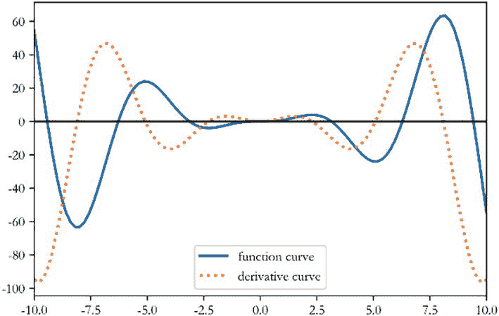

# 2.回归

> 有些人担心人工智能会让我们感到自卑，但话说回来，任何一个头脑正常的人每次看到一朵花都会有一种自卑感。
> 
> —艾伦·凯

## 2.1 神经元模型

一个成年人的大脑包含大约 1000 亿个神经元。每个神经元通过树突获得输入信号，通过轴突传递输出信号。神经元相互连接形成了一个巨大的神经网络，从而形成了人类的大脑，感知和意识的基础。图 [2-1](#Fig1) 是典型的生物神经元结构。1943 年，心理学家沃伦·麦卡洛克和数学逻辑学家沃尔特·皮茨提出了人工神经网络的数学模型来模拟生物神经元的机制[1]。这项研究由美国神经学家 Frank Rosenblatt 进一步发展为感知器模型[2]，这也是现代深度学习的基石。


图 2-1

典型的生物神经元结构 <sup>[1](#Fn1)</sup>

从生物神经元的结构出发，重温科学先驱的探索，逐步揭开自动学习机的神秘面纱。

首先，我们可以将神经元模型抽象成如图 [2-2](#Fig2) (a)所示的数学结构。神经元输入向量***x***=[*x*<sub>1</sub>， *x* <sub>2</sub> ， *x* <sub>3</sub> ，…，*x*<sub>*n*</sub><sup>T</sup>通过函数 *f* **映射到 *y* 考虑一个简化的情况，比如线性变换:*f*(***x***)=***w***<sup>T</sup>***x**+*b*。扩展的形式是***


前面的计算逻辑可以直观的如图 [2-2](#Fig2) (b)所示。


图 2-2

数学神经元模型

参数 *θ* = { *w* <sub>1</sub> 、 *w* 、T8】 2 、 *w* 、T12】 3 、…、 *w* 、T16*n*、T19*b*}决定了神经元的状态，通过固定这些参数可以确定该神经元的处理逻辑。当输入节点数 *n* = 1(单输入)时，神经元模型可进一步简化为


然后我们可以将 *y* 的变化绘制成 *x* 的函数，如图 [2-3](#Fig3) 所示。随着输入信号 *x* 增加，输出 *y* 也线性增加。这里参数 *w* 可以理解为直线的斜率，b 为直线的偏置。


图 2-3

单输入线性神经元模型

对于某个神经元来说， *x* 和 *y* 之间的映射关系*f*<sub>T3】w， *b*</sub> 未知但固定。两点可以确定一条直线。为了估计 *w* 和 *b* 的值，我们只需要从图【t3t】中的直线上采样任意两个数据点(*x*T18】(1)， *y* <sup>(1)</sup> ， *x* <sup>(2)</sup> ， *y* <sup>(2)</sup> )


如果( *x* <sup>(1)</sup> ，*y*<sup>(1)</sup>)≦(*x*<sup>(2)</sup>， *y* <sup>(2)</sup> )，我们就可以求解前面的方程组得到 *w* 和 *b* 的值。我们来考虑一个具体的例子:*x*T22】(1)= 1， *y* <sup>(1)</sup> = 1.567， *x* <sup>(2)</sup> = 2， *y* <sup>(2)</sup> = 3.043。代入前面公式中的数字，得到


这是我们初高中学过的二元线性方程组。利用消元法可以很容易地计算出解析解，即 *w* = 1.477， *b* = 0.089。

你可以看到，我们只需要两个不同的数据点就可以完美地求解一个单输入线性神经元模型的参数。对于输入为 *N* 的线性神经元模型，我们只需要采样 *N* + 1 个不同的数据点。似乎线性神经元模型可以被完美地解析。那么前面的方法有什么问题呢？考虑到任何采样点都可能存在观测误差，我们假设观测误差变量 *ϵ* 服从正态分布，均值为 *μ* ，方差为 *σ* <sup>2</sup> 。然后示例如下:


一旦引入观测误差，即使是简单的线性模型，如果只采样两个数据点，也可能带来较大的估计偏差。如图 [2-4](#Fig4) 所示，数据点都存在观测误差。如果估计基于两个蓝色矩形数据点，则估计的蓝色虚线将与真正的橙色直线有较大偏差。为了减少观测误差引入的估计偏差，我们可以对多个数据点进行采样，然后寻找一条“最佳”的直线，使其最小化所有采样点与该直线之间的误差之和。


图 2-4

有观测误差的模型

由于观测误差的存在，可能不存在完美通过所有采样点的直线。因此，我们希望找到一条接近所有采样点的“好”直线。如何衡量「好」与「坏」？一个自然的想法是用所有采样点的预测值*wx*T3(*I*)+*b*与真实值*y*<sup>(*I*)</sup>之间的均方误差(MSE)作为总误差，即


然后搜索一组参数*w*<sup>∫</sup>和*b*<sup>∫</sup>使总误差最小总误差最小对应的直线就是我们要找的最优直线，也就是


这里 *n* 表示采样点数。

## 2.2 优化方法

现在我们来总结一下前面的解法:我们需要找到最优参数*w*<sup>∫</sup>和*b*<sup>∫</sup>，使输入输出满足一个线性关系*y*<sup>(*I*)</sup>=*wx*<sup>(*I*)</sup>+*b*，*但是，由于观测误差 *ϵ* 的存在，需要对一个由足够数量的数据样本组成的数据集进行采样，以找到一组最优的参数*w*<sup>∑</sup>和*b*<sup>∑</sup>，使均方误差最小。*

对于单输入神经元模型，通过消去法只需要两个样本就可以得到方程的精确解。这种由严格公式导出的精确解称为解析解。然而，在多个数据点( *n* ≫ 2)的情况下，很可能没有解析解。我们只能用数值优化的方法来获得一个近似的数值解。为什么叫优化？这是因为计算机的计算速度非常快。我们可以利用强大的计算能力进行多次“搜索”和“尝试”，从而逐步减少错误。最简单的优化方法就是蛮力搜索或者随机实验。比如为了找到最合适的*w*T5】∫和*b*<sup>∫</sup>，我们可以从实数空间中随机抽取任意一个 *w* 和 *b* ，计算出对应模型的误差值。从所有实验中挑出误差最小的，其对应的*w*<sup>∑</sup>和*b*<sup>∑</sup>就是我们要找的最优参数。

这种强力算法简单明了，但对于大规模、高维优化问题效率极低。梯度下降是神经网络训练中最常用的优化算法。凭借强大的图形处理单元(GPU)芯片的并行加速能力，非常适合优化具有海量数据的神经网络模型。自然，它也适用于优化我们简单的线性神经元模型。由于梯度下降算法是深度学习的核心算法，我们将首先应用梯度下降算法来解决简单的神经元模型，然后在第 [7](07.html) 章中详细介绍其在神经网络中的应用。

有了导数的概念，如果要求解一个函数的最大值和最小值，可以简单地将导函数设为 0，找到对应的自变量数值，也就是驻点，然后检查驻点类型。以函数*f*(*x*)=*x*T6】2*sin*(*x*)为例，我们可以在区间*x*∈【10，10】内绘制函数及其导数，其中蓝色实线为 *f* ( *x* )，黄色虚线为，如图所示可以看出，导数(虚线)为 0 的点就是驻点， *f* ( *x* )的最大值和最小值都出现在驻点。



图 2-5

函数***f***(***x***)=***x***<sup>**2**</sup>∙***罪*** ( ***x*** )及其衍生

函数的梯度被定义为函数对每个独立变量的偏导数的向量。考虑一个三维函数 *z* = *f* ( *x* ， *y* )，函数对自变量 *x* 的偏导数为，函数对自变量 *y* 的偏导数记为，梯度∇ *f* 为向量。我们来看一个具体的函数 *f* ( *x* ，*y*)=(cos<sup>2</sup>*x*+cos<sup>2</sup>*y*)<sup>2</sup>。如图 [2-6](#Fig6) 所示，平面中红色箭头的长度代表梯度向量的模，箭头的方向代表梯度向量的方向。可以看出，箭头的方向始终指向函数值增加的方向。函数曲面越陡，箭头的长度越长，梯度的模数越大。


图 2-6

一个函数及其梯度<sup>[2](#Fn2)T3】</sup>

通过前面的例子，我们可以直观的感受到，函数的梯度方向总是指向函数值增加的方向。那么梯度的反方向应该指向函数值减小的方向。


(2.1)

为了利用这个特性，我们只需要按照前面的等式迭代更新***x***<sup>’</sup>。然后我们可以得到越来越小的函数值。 *η* 用于缩放梯度向量，称为学习率，一般设置为较小的值，如 0.01 或 0.001。特别地，对于一维函数，前面的向量形式可以写成标量形式:


通过前面的公式多次迭代更新*x*<sup>’</sup>，则*x*T10’处的函数值*y*T6’总是比 *x* 处的函数值小的可能性更大。

用公式( [2.1](#Equ1) )优化参数的方法称为梯度下降算法。它计算函数 *f* 的梯度∇ *f* 并迭代更新参数 *θ* 以获得当函数 *f* 达到其最小值时参数 *θ* 的最优数值解。需要注意的是，深度学习中的模型输入一般表示为 ***x*** ，需要优化的参数一般表示为 *θ* 、 *w* 、 *b* 。

现在，我们将在本次会议开始时应用梯度下降算法来计算最佳参数*w*<sup>∑</sup>和*b*<sup>∑</sup>。这里，均方误差函数被最小化:


需要优化的模型参数是 *w* 和 *b* ，因此我们使用以下等式迭代更新它们:


## 2.3 运行中的线性模型

让我们使用梯度下降算法实际训练一个单输入线性神经元模型。首先，我们需要对多个数据点进行采样。对于具有已知模型的玩具示例，我们直接从指定的真实模型中取样:


1.  **采样数据**

为了模拟观测误差，我们在模型中增加了一个独立的误差变量 *ϵ* ，其中 *ϵ* 服从高斯分布，平均值为 0，标准差为 0.01(即方差为 0.01 <sup>2</sup> ):


通过随机采样 *n* = 100 次，我们使用以下代码获得一个训练数据集:

```py
data = [] # A list to save data samples
for i in range(100): # repeat 100 times
    # Randomly sample x from a uniform distribution
    x = np.random.uniform(-10., 10.)
    # Randomly sample from Gaussian distribution
    eps = np.random.normal(0., 0.01)
    # Calculate model output with random errors
    y = 1.477 * x + 0.089 + eps
    data.append([x, y]) # save to data list
data = np.array(data) # convert to 2D Numpy array

```

在前面的代码中，我们在一个循环中执行 100 个样本，每次我们从均匀分布*u*(10，10)中随机采样一个数据点 *x* ，然后从高斯分布中随机采样噪声 *ϵ* 。最后，我们使用真实模型和随机噪声 *ϵ* 生成数据，并将其保存为 Numpy 数组。

1.  **计算均方误差**

现在，让我们通过平均每个数据点的预测值和真实值之间的平方差来计算训练集的均方误差。我们可以使用以下函数来实现这一点:

1.  **计算坡度**

```py
def mse(b, w, points):
    # Calculate MSE based on current w and b
    totalError = 0
    # Loop through all points
    for i in range(0, len(points)):
        x = points[i, 0] # Get ith input
        y = points[i, 1] # Get ith output
        # Calculate the total squared error
        totalError += (y - (w * x + b)) ** 2
    # Calculate the mean of the total squared error

    return totalError / float(len(points))

```

根据梯度下降算法，我们需要计算每个数据点的梯度。首先，考虑扩展均方误差函数:


因为


我们有


(2.2)

如果很难理解前面的推导，可以复习数学中与梯度相关的课程。详细内容也会在本书第 [7](07.html) 章介绍。我们可以暂时记住的最终表情。同样的，我们可以推导出偏导数的表达式:


(2.3)

根据表达式( [2.2](#Equ2) )和( [2.3](#Equ3) )，我们只需要计算出(*wx*<sup>(*I*)</sup>+*b*—*y*<sup>(*I*)</sup>)*x*<sup>(*I*)</sup>的平均值实现如下:

1.  **渐变更新**

```py
def step_gradient(b_current, w_current, points, lr):
    # Calculate gradient and update w and b.
    b_gradient = 0
    w_gradient = 0
    M = float(len(points)) # total number of samples
    for i in range(0, len(points)):
        x = points[i, 0]
        y = points[i, 1]
        # dL/db:grad_b = 2(wx+b-y) from equation (2.3)
        b_gradient += (2/M) * ((w_current * x + b_current) - y)
        # dL/dw:grad_w = 2(wx+b-y)*x from equation (2.2)
        w_gradient += (2/M) * x * ((w_current * x + b_current) - y)
    # Update w',b' according to gradient descent algorithm
    # lr is learning rate
    new_b = b_current - (lr * b_gradient)
    new_w = w_current - (lr * w_gradient)
    return [new_b, new_w]

```

在计算出误差函数在 *w* 和 *b* 的梯度后，我们可以根据方程( [2.1](#Equ1) )更新 *w* 和 *b* 的值。训练数据集的所有样本一次被称为一个时期。我们可以使用之前定义的函数迭代多个时期。实现如下:

```py
def gradient_descent(points, starting_b, starting_w, lr, num_iterations):
    # Update w, b multiple times
    b = starting_b # initial value for b
    w = starting_w # initial value for w
    # Iterate num_iterations time
for step in range(num_iterations):
        # Update w, b once
        b, w = step_gradient(b, w, np.array(points), lr)
        # Calculate current loss
   loss = mse(b, w, points)
        if step%50 == 0: # print loss and w, b
            print(f"iteration:{step}, loss:{loss}, w:{w}, b:{b}")
     return [b, w] # return the final value of w and b

```

主要培训功能定义如下:

```py
def main():
    # Load training dataset
    data = []
    for i in range(100):
         x = np.random.uniform(3., 12.)
         # mean=0, std=0.1
         eps = np.random.normal(0., 0.1)
         y = 1.477 * x + 0.089 + eps
         data.append([x, y])
    data = np.array(data)
    lr = 0.01      # learning rate
    initial_b = 0 # initialize b
    initial_w = 0 # initialize w
    num_iterations = 1000
    # Train 1000 times and return optimal w*,b* and corresponding loss
    [b, w]= gradient_descent(data, initial_b, initial_w, lr, num_iterations)
    loss = mse(b, w, data) # Calculate MSE
    print(f'Final loss:{loss}, w:{w}, b:{b}')

```

经过 1000 次迭代更新，最终的 *w* 和 *b* 就是我们要找的“最优”解。结果如下:

```py
iteration:0, loss:11.437586448749, w:0.88955725981925, b:0.02661765516748428
iteration:50, loss:0.111323083882350, w:1.48132089048970, b:0.58389075913875
iteration:100, loss:0.02436449474995, w:1.479296279074, b:0.78524532356388
...
iteration:950, loss:0.01097700897880, w:1.478131231919, b:0.901113267769968

Final loss:0.010977008978805611, w:1.4781312318924746, b:0.901113270434582

```

可以看出，在第 100 次迭代时， *w* 和 *b* 的值已经接近真实模型值。经过 1000 次更新后得到的 *w* 和 *b* 非常接近真实模型。训练过程的均方误差如图 [2-7](#Fig7) 所示。


图 2-7

训练过程中的 MSE 变化

前面的示例显示了梯度下降算法在求解模型参数方面的强大功能。需要注意的是，对于复杂的非线性模型，梯度下降算法求解的参数可能是局部最小解而不是全局最小解，这是由函数非凸性决定的。然而，我们在实践中发现，通过梯度下降算法获得的数值解的性能通常可以被很好地优化，并且相应的解可以直接用于逼近最优解。

## 2.4 总结

简单回顾一下我们的探索:我们先假设输入为 *n* 的神经元模型是线性模型，然后通过 *n* + 1 个样本可以计算出 ***w*** 和 ***b*** 的精确解。引入观测误差后，可以对多组数据点进行采样，通过梯度下降算法进行优化，得到 ***w*** 和 ***b*** 的数值解。

如果从另一个角度来看这个问题，其实可以理解为一组连续值(向量)预测问题。给定一个数据集，我们需要从数据集学习一个模型，以便预测一个未知样本的输出值。在假设模型的类型之后，学习过程变成了搜索模型参数的问题。比如我们假设神经元是线性模型，那么训练过程就是搜索线性模型参数 *** w *** 和 *** b *** 的过程。训练之后，我们可以使用模型输出值作为任何新输入的真实值的近似值。从这个角度来说，是一个连续值预测问题。

在现实生活中，连续值预测问题非常常见，比如股票价格趋势的预测、天气预报中的温湿度预测、年龄的预测、交通流量的预测等等。如果它的预测在一个连续的实数范围内，或者属于某个连续的实数范围，我们称之为回归问题。特别是如果用线性模型来近似真实模型，那么我们称之为线性回归，这是回归问题的一种具体实现。

除了连续值预测问题，还有离散值预测问题吗？比如硬币正反面的预测，只能有正反面两种预测。给定一张图片，这张图片中的物体类型只能是一些离散的类别比如猫或者狗。像这样的问题被称为分类问题，这将在下一章介绍。

## 2.5 参考文献

1.  W.s .麦卡洛克和 w .皮茨，“神经活动内在思想的逻辑演算”，*《数学生物物理学通报》，* 5，第 115-133 页，1943 年 12 月 1 日。

2.  F.罗森布拉特，感知机，一个感知和识别自动机项目，康奈尔航空实验室，1957 年。

<aside aria-label="Footnotes" class="FootnoteSection" epub:type="footnotes">Footnotes [1](#Fn1_source)

来源: [`https://commons.wikimedia.org/wiki/File:Neuron_Hand-tuned.svg`](https://commons.wikimedia.org/wiki/File:Neuron_Hand-tuned.svg)

  [2](#Fn2_source)

图片来源:[`https://en.wikipedia.org/wiki/Gradient?oldid=747127712`T2】](https://en.wikipedia.org/wiki/Gradient%253Foldid%253D747127712)

 </aside>