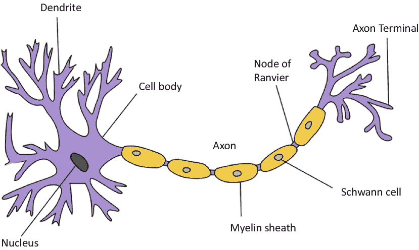
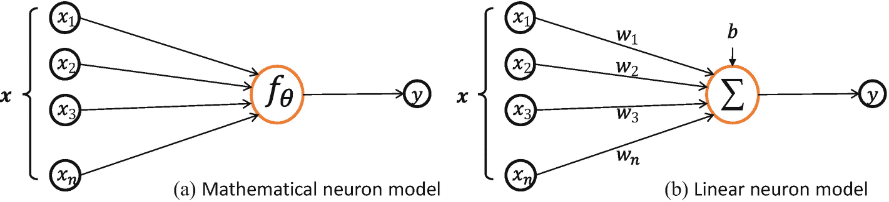
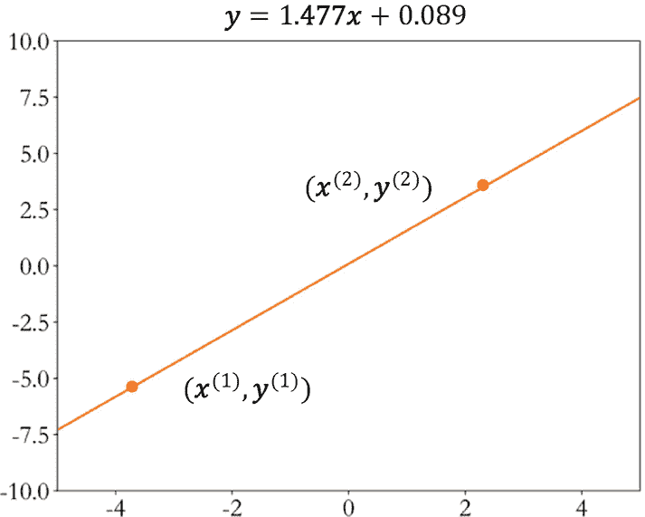
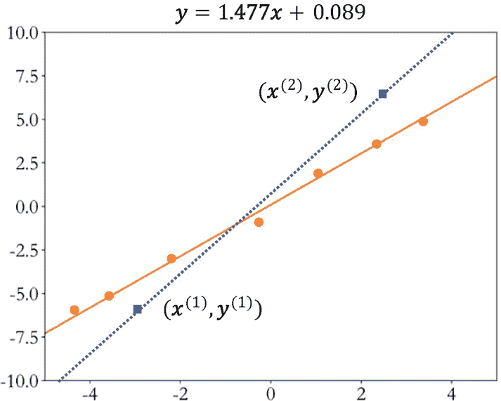
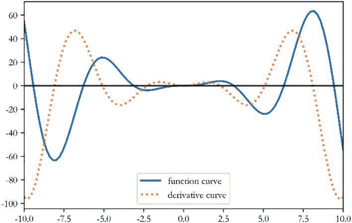
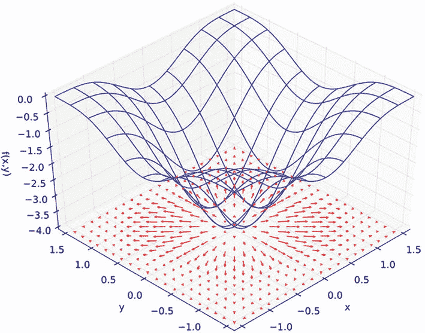
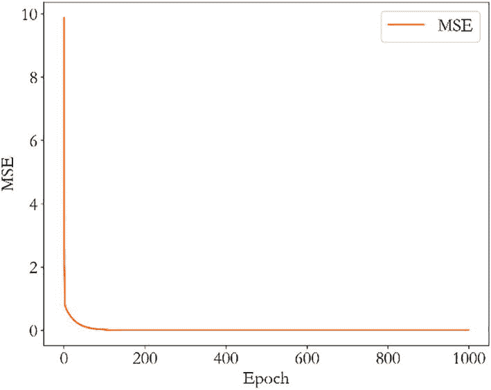

# 二、回归

> 有些人担心人工智能会让我们感到自卑，但话说回来，任何一个头脑正常的人每次看到一朵花都会有一种自卑感。
>
> —艾伦·凯

## 2.1 神经元模型

一个成年人的大脑包含大约 1000 亿个神经元。每个神经元通过树突获得输入信号，通过轴突传递输出信号。神经元相互连接形成了一个巨大的神经网络，从而形成了人类的大脑，感知和意识的基础。图 2-1 是典型的生物神经元结构。1943 年，心理学家沃伦·麦卡洛克和数学逻辑学家沃尔特·皮茨提出了人工神经网络的数学模型来模拟生物神经元的机制[1]。这项研究由美国神经学家 Frank Rosenblatt 进一步发展为感知器模型[2]，这也是现代深度学习的基石。



图 2-1 典型的生物神经元结构 <sup>1</sup>

从生物神经元的结构出发，重温科学先驱的探索，逐步揭开自动学习机的神秘面纱。

首先，我们可以将神经元模型抽象成如图 2-2 (a)所示的数学结构。神经元输入向量 `x` = [x<sub>1</sub>, x<sub>2</sub>, x<sub>3</sub>,…, x<sub>n</sub><sup>T</sup>] 通过函数 `f` 映射到 `y`。考虑一个简化的情况，比如线性变换: `f(x) = w<sup>T</sup>x + b`。扩展的形式是：

```
f(x) = w<sub>1</sub>x<sub>1</sub> + w<sub>2</sub>x<sub>2</sub> + w<sub>3</sub>x<sub>3</sub> + ... + w<sub>n</sub>x<sub>n</sub> + b
```

前面的计算逻辑可以直观地如图 2-2 (b)所示。

图 2-2 数学神经元模型

参数 `θ` = {w<sub>1</sub>, w, 2, w, 3, …, w, n, b} 决定了神经元的状态，通过固定这些参数可以确定该神经元的处理逻辑。当输入节点数 `n` = 1(单输入)时，神经元模型可进一步简化为：

```
y = wx + b
```

然后我们可以将 `y` 的变化绘制成 `x` 的函数，如图 2-3 所示。随着输入信号 `x` 增加，输出 `y` 也线性增加。这里参数 `w` 可以理解为直线的斜率，b 为直线的偏置。



图 2-3 单输入线性神经元模型

对于某个神经元来说， `x` 和 `y` 之间的映射关系 `f`<sub>w, b</sub> 未知但固定。两点可以确定一条直线。为了估计 `w` 和 `b` 的值，我们只需要从图中的直线上采样任意两个数据点 (`x<sup>(1)</sup>`, `y<sup>(1)</sup>`, `x<sup>(2)</sup>`, `y<sup>(2)</sup>`)。

```
y<sup>(1)</sup> = w*x<sup>(1)</sup> + b
y<sup>(2)</sup> = w*x<sup>(2)</sup> + b
```

如果 (`x<sup>(1)</sup>`, `y<sup>(1)</sup>`) ≤ (`x<sup>(2)</sup>`, `y<sup>(2)</sup>`), 我们就可以求解前面的方程组得到 `w` 和 `b` 的值。我们来考虑一个具体的例子: `x<sup>(1)</sup>= 1`, `y<sup>(1)</sup> = 1.567`, `x<sup>(2)</sup> = 2`, `y<sup>(2)</sup> = 3.043`。代入前面公式中的数字，得到：

```
1.567 = w*1 + b
3.043 = w*2 + b
```

这是我们初高中学过的二元线性方程组。利用消元法可以很容易地计算出解析解，即 `w` = 1.477，`b` = 0.089。

你可以看到，我们只需要两个不同的数据点就可以完美地求解一个单输入线性神经元模型的参数。对于输入为 `N` 的线性神经元模型，我们只需要采样 `N` + 1 个不同的数据点。似乎线性神经元模型可以被完美地解析。那么前面的方法有什么问题呢？考虑到任何采样点都可能存在观测误差，我们假设观测误差变量 `ϵ` 服从正态分布 `N(μ, σ²)`，均值为 `μ`，方差为 `σ²`。然后示例如下:

```
y = wx + b + ϵ, ϵ ~ N(μ, σ²)
```

一旦引入观测误差，即使是简单的线性模型，如果只采样两个数据点，也可能带来较大的估计偏差。如图 2-4 所示，数据点都存在观测误差。如果估计基于两个蓝色矩形数据点，则估计的蓝色虚线将与真正的橙色直线有较大偏差。为了减少观测误差引入的估计偏差，我们可以对多个数据点 `D = {({x<sup>(1)</sup>}, {y<sup>(1)</sup>}), ({x<sup>(2)</sup>}, {y<sup>(2)</sup>}), ..., ({x<sup>(n)</sup>}, {y<sup>(n)</sup>})}` 进行采样，然后寻找一条“最佳”的直线，使其最小化所有采样点与该直线之间的误差之和。



图 2-4 有观测误差的模型

由于观测误差的存在，可能不存在完美通过所有采样点 `D` 的直线。因此，我们希望找到一条接近所有采样点的“好”直线。如何衡量「好」与「坏」？一个自然的想法是用所有采样点的预测值 `wx<sup>(i)</sup> + b` 与真实值 `y<sup>(i)</sup>` 之间的均方误差(MSE)作为总误差，即：

```
L = 1/n * Σ<sub>i=1</sub><sup>n</sup>[(wx<sup>(i)</sup> + b - y<sup>(i)</sup>)²]
```

然后搜索一组参数 `w`<sup>∫</sup> 和 `b`<sup>∫</sup> 使总误差最小 `L`。总误差最小对应的直线就是我们要找的最优直线，也就是：

```
w<sup>∗</sup>, b<sup>∗</sup> = argmin<sub>w,b</sub> {1/n * Σ<sub>i=1</sub><sup>n</sup>[(wx<sup>(i)</sup> + b - y<sup>(i)</sup>)²]}
```

这里 `n` 表示采样点数。

## 2.2 优化方法

现在我们来总结一下前面的解法: 我们需要找到最优参数 `w`<sup>∫</sup> 和 `b`<sup>∫</sup>，使输入输出满足一个线性关系 `y<sup>(i)</sup> = wx<sup>(i)</sup> + b`，但是，由于观测误差 `ϵ` 的存在，需要对一个由足够数量的数据样本组成的数据集 `D = {({x<sup>(1)</sup>}, {y<sup>(1)</sup>}), ({x<sup>(2)</sup>}, {y<sup>(2)</sup>}), ..., ({x<sup>(n)</sup>}, {y<sup>(n)</sup>})}` 进行采样，以找到一组最优的参数 `w`<sup>∑</sup> 和 `b`<sup>∑</sup>，使均方误差 `L = 1/n * Σ<sub>i=1</sub><sup>n</sup>[(wx<sup>(i)</sup> + b - y<sup>(i)</sup>)²]` 最小。

对于单输入神经元模型，通过消去法只需要两个样本就可以得到方程的精确解。这种由严格公式导出的精确解称为解析解。然而，在多个数据点 (`n` ≫ 2) 的情况下，很可能没有解析解。我们只能用数值优化的方法来获得一个近似的数值解。为什么叫优化？这是因为计算机的计算速度非常快。我们可以利用强大的计算能力进行多次“搜索”和“尝试”，从而逐步减少错误 `L`。最简单的优化方法就是蛮力搜索或者随机实验。比如为了找到最合适的 `w`<sup>∫</sup> 和 `b`<sup>∫</sup>，我们可以从实数空间中随机抽取任意一个 `w` 和 `b`，计算出对应模型的误差值 `L`。从所有实验 `{L}` 中挑出误差最小的 `{L<sup>∗</sup>}`，其对应的 `w`<sup>∑</sup> 和 `b`<sup>∑</sup> 就是我们要找的最优参数。

这种强力算法简单明了，但对于大规模、高维优化问题效率极低。梯度下降是神经网络训练中最常用的优化算法。凭借强大的图形处理单元(GPU)芯片的并行加速能力，非常适合优化具有海量数据的神经网络模型。自然，它也适用于优化我们简单的线性神经元模型。由于梯度下降算法是深度学习的核心算法，我们将首先应用梯度下降算法来解决简单的神经元模型，然后在第七章中详细介绍其在神经网络中的应用。

有了导数的概念，如果要求解一个函数的最大值和最小值，可以简单地将导函数设为 0，找到对应的自变量数值，也就是驻点，然后检查驻点类型。以函数 `f(x) = x²*sin(x)` 为例，我们可以在区间 `x` ∈ [10, 10] 内绘制函数及其导数，其中蓝色实线为 `f(x)`，黄色虚线为 `df(x)/dx`，如图所示可以看出，导数(虚线)为 0 的点就是驻点，`f(x)` 的最大值和最小值都出现在驻点。



图 2-5 函数 `f(x) = x²*sin(x)` 及其导数

函数的梯度被定义为函数对每个独立变量的偏导数的向量。考虑一个三维函数 `z = f(x, y)`，函数对自变量 `x` 的偏导数为 `∂z/∂x`，函数对自变量 `y` 的偏导数记为 `∂z/∂y`，梯度 ∇`f` 为向量 `(∂z/∂x, ∂z/∂y)`。我们来看一个具体的函数 `f(x, y) = (cos²x + cos²y)²`。如图 2-6 所示，平面中红色箭头的长度代表梯度向量的模，箭头的方向代表梯度向量的方向。可以看出，箭头的方向始终指向函数值增加的方向。函数曲面越陡，箭头的长度越长，梯度的模数越大。



图 2-6 一个函数及其梯度

通过前面的例子，我们可以直观地感受到，函数的梯度方向总是指向函数值增加的方向。那么梯度的反方向应该指向函数值减小的方向。

```
x' = x - η * ∇f
```

(2.1)

为了利用这个特性，我们只需要按照前面的等式迭代更新 `x'`。然后我们可以得到越来越小的函数值。 `η` 用于缩放梯度向量，称为学习率，一般设置为较小的值，如 0.01 或 0.001。特别地，对于一维函数，前面的向量形式可以写成标量形式:

```
x' = x - η * (dy/dx)
```

通过前面的公式多次迭代更新 `x'`，则 `x'` 处的函数值 `y'` 总是比 `x` 处的函数值小的可能性更大。

用公式( 2.1 )优化参数的方法称为梯度下降算法。它计算函数 `f` 的梯度 ∇`f` 并迭代更新参数 `θ` 以获得当函数 `f` 达到其最小值时参数 `θ` 的最优数值解。需要注意的是，深度学习中的模型输入一般表示为 `x`，需要优化的参数一般表示为 `θ`、`w`、`b`。

现在，我们将在本次会议开始时应用梯度下降算法来计算最佳参数 `w`<sup>∑</sup> 和 `b`<sup>∑</sup>。这里，均方误差函数被最小化：

```
L = 1/n * Σ<sub>i=1</sub><sup>n</sup>[(wx<sup>(i)</sup> + b - y<sup>(i)</sup>)²]
```

需要优化的模型参数是 `w` 和 `b`，因此我们使用以下等式迭代更新它们:

```
w' = w - η * ∂L/∂w
b' = b - η * ∂L/∂b
```

## 2.3 运行中的线性模型

让我们使用梯度下降算法实际训练一个单输入线性神经元模型。首先，我们需要对多个数据点进行采样。对于具有已知模型的玩具示例，我们直接从指定的真实模型中取样:

```
y = 1.477x + 0.089
```

1.  **采样数据**

为了模拟观测误差，我们在模型中增加了一个独立的误差变量 `ϵ`，其中 `ϵ` 服从高斯分布，平均值为 0，标准差为 0.01(即方差为 0.01²):

```
y = 1.477x + 0.089 + ϵ, ϵ ~ N


```python
data = []  # A list to save data samples
for i in range(100):  # repeat 100 times
    # Randomly sample x from a uniform distribution
    x = np.random.uniform(-10., 10.)
    # Randomly sample from Gaussian distribution
    eps = np.random.normal(0., 0.01)
    # Calculate model output with random errors
    y = 1.477 * x + 0.089 + eps
    data.append([x, y])  # save to data list
data = np.array(data)  # convert to 2D Numpy array

```

In the preceding code, we execute 100 samples in a loop, each time randomly sampling a data point *x* from the uniform distribution *u*(10, 10), then sampling noise *ϵ* from the Gaussian distribution *N(0, 0.1²)*. Finally, we generate data using the true model and random noise *ϵ* and save it as a Numpy array.

1. **Calculate Mean Squared Error**

Now, let's calculate the mean squared error of the training set by taking the average of the squared difference between the predicted value and the true value of each data point. We can implement this using the following function:

1. **Calculate Slope**

```python
def mse(b, w, points):
    # Calculate MSE based on current w and b
    totalError = 0
    # Loop through all points
    for i in range(0, len(points)):
        x = points[i, 0]  # Get ith input
        y = points[i, 1]  # Get ith output
        # Calculate the total squared error
        totalError += (y - (w * x + b)) ** 2
    # Calculate the mean of the total squared error

    return totalError / float(len(points))
```

According to the gradient descent algorithm, we need to calculate the gradient of the partial derivative of the loss function with respect to each data point. First, consider extending the mean squared error function:

$$
\frac{\partial \mathcal{L}}{\partial w}=\frac{\partial \frac{1}{n}\sum_{i=1}^n{\left(w{x}^{(i)}+b-{y}^{(i)}\right)}²}{\partial w}=\frac{1}{n}\sum_{i=1}^n\frac{\partial {\left(w{x}^{(i)}+b-{y}^{(i)}\right)}²}{\partial w}
$$

Because

$$
\frac{\partial {g}²}{\partial w}=2\bullet g\bullet \frac{\partial g}{\partial w}
$$

We have

$$
\frac{\partial \mathcal{L}}{\partial w}=\frac{1}{n}\sum_{i=1}^n2\left(w{x}^{(i)}+b-{y}^{(i)}\right)\bullet \frac{\partial \left(w{x}^{(i)}+b-{y}^{(i)}\right)}{\partial w}
$$

$$
=\frac{1}{n}\sum_{i=1}^n2\left(w{x}^{(i)}+b-{y}^{(i)}\right)\bullet {x}^{(i)}
$$

$$
=\frac{\mathbf{2}}{\boldsymbol{n}}{\sum}_{\boldsymbol{i}=\mathbf{1}}^{\boldsymbol{n}}\left(\boldsymbol{w}{\boldsymbol{x}}^{\left(\boldsymbol{i}\right)}+\boldsymbol{b}-{\boldsymbol{y}}^{\left(\boldsymbol{i}\right)}\right)\bullet {\boldsymbol{x}}^{\left(\boldsymbol{i}\right)}
$$

(2.2)

If it is difficult to understand the derivation above, you can review the relevant courses in mathematics related to gradients. Detailed content will also be introduced in Chapter 7 of this book. We can temporarily remember the final expression of $\frac{\partial \mathcal{L}}{\partial w}$. Similarly, we can derive the expression for the partial derivative $\frac{\partial \mathcal{L}}{\partial b}$:

$$
\frac{\partial \mathcal{L}}{\partial b}=\frac{\partial \frac{1}{n}\sum_{i=1}^n{\left(w{x}^{(i)}+b-{y}^{(i)}\right)}²}{\partial b}=\frac{1}{n}\sum_{i=1}^n\frac{\partial {\left(w{x}^{(i)}+b-{y}^{(i)}\right)}²}{\partial b}
$$

$$
=\frac{1}{n}\sum_{i=1}^n2\left(w{x}^{(i)}+b-{y}^{(i)}\right)\bullet \frac{\partial \left(w{x}^{(i)}+b-{y}^{(i)}\right)}{\partial b}
$$

$$
=\frac{1}{n}\sum_{i=1}^n2\left(w{x}^{(i)}+b-{y}^{(i)}\right)\bullet 1
$$

$$
=\frac{\mathbf{2}}{\boldsymbol{n}}{\sum}_{\boldsymbol{i}=\mathbf{1}}^{\boldsymbol{n}}\left(\boldsymbol{w}{\boldsymbol{x}}^{\left(\boldsymbol{i}\right)}+\boldsymbol{b}-{\boldsymbol{y}}^{\left(\boldsymbol{i}\right)}\right)
$$

(2.3)

According to expressions (2.2) and (2.3), we only need to calculate the average of (*wx*<sup>(*I*)</sup>+*b*—*y*<sup>(*I*)</sup>)*x*<sup>(*I*)</sup> as follows:

1. **Gradient Update**

```python
def step_gradient(b_current, w_current, points, lr):
    # Calculate gradient and update w and b.
    b_gradient = 0
    w_gradient = 0
    M = float(len(points))  # total number of samples
    for i in range(0, len(points)):
        x = points[i, 0]
        y = points[i, 1]
        # dL/db:grad_b = 2(wx+b-y) from equation (2.3)
        b_gradient += (2/M) * ((w_current * x + b_current) - y)
        # dL/dw:grad_w = 2(wx+b-y)*x from equation (2.2)
        w_gradient += (2/M) * x * ((w_current * x + b_current) - y)
    # Update w',b' according to gradient descent algorithm
    # lr is learning rate
    new_b = b_current - (lr * b_gradient)
    new_w = w_current - (lr * w_gradient)
    return [new_b, new_w]
```

After calculating the gradient of the error function with respect to *w* and *b*, we can update the values of *w* and *b* according to equation (2.1). All samples in the training data set are called a period. We can use the previously defined function to iterate multiple periods. Implementation as follows:

```python
def gradient_descent(points, starting_b, starting_w, lr, num_iterations):
    # Update w, b multiple times
    b = starting_b  # initial value for b
    w = starting_w  # initial value for w
    # Iterate num_iterations time
    for step in range(num_iterations):
        # Update w, b once
        b, w = step_gradient(b, w, np.array(points), lr)
        # Calculate current loss
        loss = mse(b, w, points)
        if step % 50 == 0:  # print loss and w, b
            print(f"iteration:{step}, loss:{loss}, w:{w}, b:{b}")
    return [b, w]  # return the final value of w and b
```

The main training function is defined as follows:

```python
def main():
    # Load training dataset
    data = []
    for i in range(100):
        x = np.random.uniform(3., 12.)
        # mean=0, std=0.1
        eps = np.random.normal(0., 0.1)
        y = 1.477 * x + 0.089 + eps
        data.append([x, y])
    data = np.array(data)
    lr = 0.01  # learning rate
    initial_b = 0  # initialize b
    initial_w = 0  # initialize w
    num_iterations = 1000
    # Train 1000 times and return optimal w*,b* and corresponding loss
    [b, w] = gradient_descent(data, initial_b, initial_w, lr, num_iterations)
    loss = mse(b, w, data)  # Calculate MSE
    print(f'Final loss:{loss}, w:{w}, b:{b}')
```

After 1000 iterations of updating, the final *w* and *b* are the "optimal" solutions we want to find. The results are as follows:

```python
iteration:0, loss:11.437586448749, w:0.88955725981925, b:0.02661765516748428
iteration:50, loss:0.111323083882350, w:1.48132089048970, b:0.58389075913875
iteration:100, loss:0.02436449474995, w:1.479296279074, b:0.78524532356388
...
iteration:950, loss:0.01097700897880, w:1.478131231919, b:0.901113267769968

Final loss:0.010977008978805611, w:1.4781312318924746, b:0.901113270434582
```

It can be seen that at the 100th iteration, the values of *w* and *b* are already close to the true model value. After 1000 updates, the *w* and *b* obtained are very close to the true model. The MSE variation during the training process is shown in Figure 2-7.



Figure 2-7 MSE variation during the training process

The previous example shows the powerful function of the gradient descent algorithm in solving model parameters. It should be noted that for complex nonlinear models, the parameters solved by the gradient descent algorithm may be local minima rather than global minima, which is determined by the non-convexity of the function. However, in practice, the numerical solutions obtained by the gradient descent algorithm can usually be well optimized, and the corresponding solutions can be directly used for approximating the optimal solution.

## 2.4 Summary

Let's briefly review our exploration: we first assume that the input neuron model with *n* neurons is a linear model, and then we can calculate the exact solution for ***w*** and ***b*** with *n* + 1 samples. After introducing observation errors, we can sample multiple data points from a group of data points, optimize them through the gradient descent algorithm, and obtain the numerical solution for ***w*** and ***b***.

If we look at this problem from another perspective, it can be understood as a continuous value prediction problem. Given a dataset $\mathbbm{D}$, we need to learn a model from the dataset to predict the output value of an unknown sample. After assuming the type of the model, the learning process becomes a problem of searching for model parameters. For example, if we assume that the neuron is a linear model, then the training process is a process of searching for the parameters of the linear model ***w*** and ***b***. After training, we can use the model output value as an approximation of the true value of any new input. From this perspective, it is a continuous value prediction problem.

In real life, continuous value prediction problems are very common, such as predicting stock price trends, predicting temperature and humidity in weather forecasts, predicting age, predicting traffic flow, and so on. If its prediction is within a continuous real number range or belongs to a continuous real number range, it is called a regression problem. In particular, if a linear model is used to approximate the true model, it is called linear regression, which is a specific implementation of the regression problem.

In addition to continuous value prediction problems, are there discrete value prediction problems? For example, predicting the outcome of a coin flip, which can only have two predictions: heads or tails. Given an image, the type of object in the image can only be some discrete categories such as cats or dogs. Such problems are called classification problems, which will be introduced in the next chapter.

## 2.5 References

1. W.s. McCulloch and W. Pitts, "A logical calculus of the ideas immanent in nervous activity," *Bulletin of Mathematical Biophysics*, 5, pp. 115-133, December 1, 1943.

2. F. Rosenblatt, Perceptron, a project in perception and recognition automata, Cornell Aeronautical Laboratory, 1957.

<aside aria-label="Footnotes" class="FootnoteSection" epub:type="footnotes">
Footnotes 1

Source: [https://commons.wikimedia.org/wiki/File:Neuron_Hand-tuned.svg](https://commons.wikimedia.org/wiki/File:Neuron_Hand-tuned.svg)

2

Image source: [https://en.wikipedia.org/wiki/Gradient?oldid=747127712](https://en.wikipedia.org/wiki/Gradient%253Foldid%253D747127712)
</aside>
