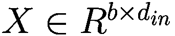
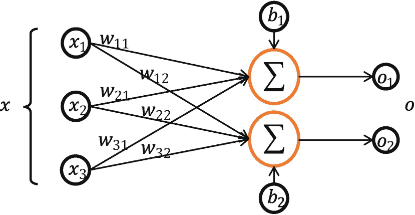
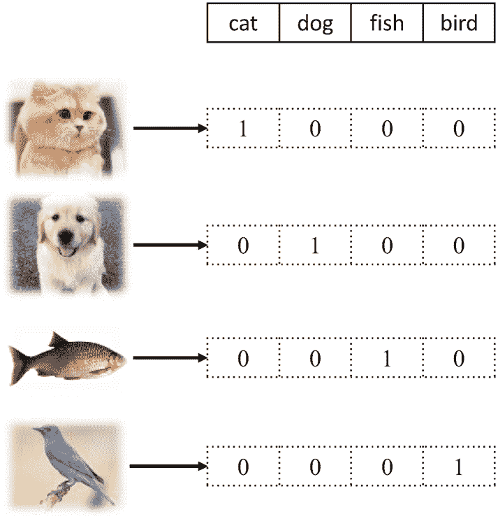
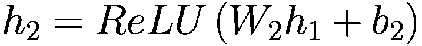
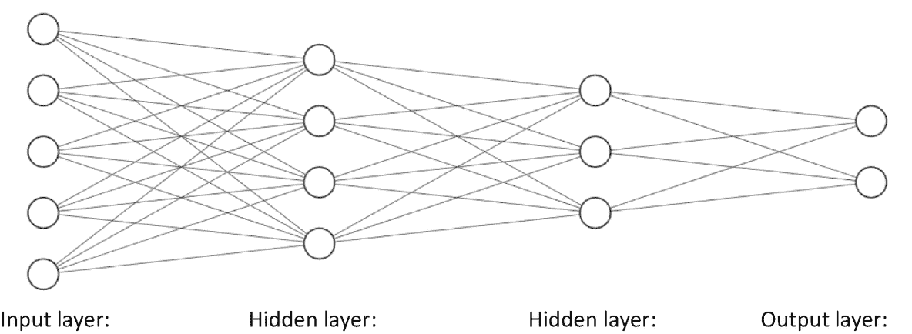

# 三、分类

> 花在人工智能上的一年时间，足以让一个人相信上帝。
> 
> —艾伦·珀利斯

前面已经介绍了用于连续变量预测的线性回归模型。现在让我们深入分类问题。分类问题的一个典型应用是教计算机如何自动识别图像中的对象。我们来考虑一个图像分类中最简单的任务:0–9 数字图片识别，相对简单，也有非常广泛的应用，比如邮政编码、快递单号、手机号识别。我们将以 0–9 数字图片识别为例，探讨如何利用机器学习解决分类问题。

## 3.1 手写数字图片数据集

机器学习需要从数据中学习，所以首先需要收集大量的真实数据。以手写数字图片识别为例，如图 3-1 所示，我们需要收集大量真人书写的 0–9 数字图片。为了便于存储和计算，采集到的图片一般会缩放到固定的大小，比如 224 × 224 或者 96 × 96 像素。这些图片将作为输入数据 ***x*** 。同时，我们需要给每张图片贴上标签，这些标签将作为图片的真实价值。此标签指示图像属于哪个特定类别。对于手写数字图片识别，标签是数字 0-9，代表 0-9 的图片。


图 3-1

手写数字图片

如果我们希望模型在新样本上表现良好，即实现良好的模型泛化能力，那么我们需要尽可能地增加数据集的大小和多样性，使训练数据集尽可能接近真实的人口分布，并且模型也可以在看不见的样本上表现良好。

为了便于算法评估，Lecun 等人[1]发布了一个名为 MNIST 的手写数字图片数据集，其中包含了数字 0–9 的真实手写图片。每个数字总共有 7000 张图片，收集自不同的写作风格。总图数 7 万。其中 6 万张图片用于训练，剩下的 1 万张图片作为测试集。

因为手写数字图片中的信息相对简单，所以每张图片在只保留灰度信息的情况下，缩放为同样大小的 28 × 28 像素，如图 3-2 所示。这些图片由真人书写，包含丰富的字体大小、书写风格、线条粗细等信息，保证这些图片的分布尽可能接近真实手写数字图片的人口分布，从而保证模型泛化能力。


图 3-2

MNIST 数据集示例

现在让我们来看一幅画的表现。图片包含 h 行和 w 列，像素值为 h×w。通常，像素值是从 0 到 255 范围内的整数，以表示颜色强度信息。例如，0 表示最低强度，255 表示最高强度。如果是彩色图片，每个像素包含三个通道 R、G 和 B 的强度信息，这三个通道分别代表红色、绿色和蓝色的颜色强度。因此，与灰度图像不同，彩色图片的每个像素由具有三个元素的一维向量表示，这三个元素表示 R、G 和 B 颜色的强度。这样一来，彩色图像被保存为维数为[h，w，3]的张量，而灰度图片只需要形状为[h，w]的二维矩阵或形状为[h，w，1]的三维张量来表示其信息。图 3-3 显示了 8 号图片的矩阵内容。可以看出，图片中的黑色像素用 0 表示，灰度信息用 0–255 表示。图片中较白的像素对应于矩阵中较大的值。


图 3-3

一幅画是如何表现的 <sup>1</sup>

像 TensorFlow 和 PyTorch 这样的深度学习框架可以通过几行代码轻松下载、管理和加载 MNIST 数据集。这里，我们使用 TensorFlow 自动下载 MNIST 数据集，并将其转换为 Numpy 数组格式:

```py
import  os
import  tensorflow as tf
from    tensorflow import keras
from    tensorflow.keras import layers, optimizers, datasets
# load MNIST dataset
(x, y), (x_val, y_val) = datasets.mnist.load_data()
# convert to float type and rescale to [-1, 1]
x = 2*tf.convert_to_tensor(x, dtype=tf.float32)/255.-1
# convert to integer tensor
y = tf.convert_to_tensor(y, dtype=tf.int32)
# one-hot encoding
y = tf.one_hot(y, depth=10)
print(x.shape, y.shape)
# create training dataset
train_dataset = tf.data.Dataset.from_tensor_slices((x, y))
# train in batch
train_dataset = train_dataset.batch(512)

```

load_data()函数返回两个元组对象:第一个是训练集，第二个是测试集。第一个元组的第一个元素是训练图片数据 *X* ，第二个元素是对应的类别号 *Y* 。与图 3-3 类似，训练集 *X* 中的每幅图像由 28×28 像素组成，训练集 *X* 中有 60000 幅图像，因此 *X* 的最终维数为(60000，28，28)。 *Y* 的大小为(60000)，代表 0-9 的 60000 个数字。类似地，测试集包含 10，000 个测试图片和相应的数字编号，其维数分别为(10000，28，28)和(10，000)。

从 TensorFlow 加载的 MNIST 数据集包含值从 0 到 255 的图像。在机器学习中，一般希望数据的范围分布在 0 左右的小范围内。因此，我们将像素范围重新调整为区间[1，1]，这将有利于模型优化过程。

每张图的计算过程都是通用的。所以我们可以一次计算多张图片，充分利用 CPU 或者 GPU 的并行计算能力。我们用一个形状矩阵[ *h* ， *w* 来表示一张图片。对于多张图，我们可以在前面多加一个维度，用一个形状张量[ *b* ， *h* ， *w* 来表示。这里 *b* 代表批量。彩色图片可以用一个形状为[ *b* ， *h* ， *w* ， *c* ]的张量来表示，其中 *c* 表示通道数，对于彩色图片为 3。TensorFlow 的 Dataset 对象可用于使用 batch()函数方便地将数据集转换为批处理。

## 3.2 建立模型

回想一下我们在上一章讨论的生物神经元结构。我们将输入向量![$$ x={\left[{x}_1,{x}_2,\dots, {x}_{d_{in}}\right]}^T $$](img/515226_1_En_3_Chapter_TeX_IEq1.png)简化为单个输入标量 x，模型可以表示为 *y* = * xw * + *b* 。如果是多输入单输出的模型结构，我们需要使用向量形式:

![$$ y={w}^Tx+b=\left[{w}_1,{w}_2,{w}_3,\dots, {w}_{d_{in}}\right]\bullet \left[{x}_1\ {x}_2\ {x}_3\vdots {x}_{d_{in}}\ \right]+b $$](img/515226_1_En_3_Chapter_TeX_Equa.png)

更一般地，通过组合多个多输入单输出神经元模型，我们可以构建一个多输入多输出模型:


其中、、、。

对于多输出和批量训练，我们以批量形式编写模型:


(3.1)

其中 中的、、、、 *d* <sub>*表示输入维度，*d*<sub>*out*</sub>表示输出维度。 *X* 有形状*</sub> 中 *b* ， *d* <sub> *， *b* 为样本数*d**</sub>为每个样本的长度。 *W* 有形状 *d* <sub>*在*</sub> ， *d* <sub>*出*</sub> ，包含 *d* <sub> *在*</sub>∵*d**出* 参数。偏置向量 *b* 有形状 *d* <sub>*出*</sub> 。@符号表示矩阵乘法。由于运算结果 *X* @ *W* 是一个形状为[ *b* ，*d*<sub>*out*</sub>]的矩阵，所以不能直接加到向量 *b* 上。所以批量形式的+号需要支持广播，即通过复制 *b* 将向量 *b* 展开成形状为 *b* ，*d*<sub>*out*</sub>的矩阵。

考虑两个样本，其中 *d* <sub>*in*</sub> = 3，*d*<sub>*out*</sub>= 2。方程式 3.1 展开如下:

![$$ \left[{o}_1^{(1)}\ {o}_2^{(1)}\ {o}_1^{(2)}\ {o}_2^{(2)}\ \right]=\left[{x}_1^{(1)}\ {x}_2^{(1)}\ {x}_3^{(1)}\ {x}_1^{(2)}\ {x}_2^{(2)}\ {x}_3^{(2)}\ \right]\left[{w}_{11}\ {w}_{12}\ {w}_{21}\ {w}_{22}\ {w}_{31}\ {w}_{32}\ \right]+\left[{b}_1\ {b}_2\ \right] $$](img/515226_1_En_3_Chapter_TeX_Equc.png)

其中上标如(1)和(2)表示样本索引，下标如 1 和 2 表示某个样本向量的元素。相应的模型结构如图 3-4 所示。



图 3-4

具有三个输入和两个输出的神经网络

可以看出，矩阵形式更加简洁明了，同时可以充分发挥矩阵计算的并行加速能力。那么如何将图像识别任务的输入输出转化为张量形式呢？

使用形状为[ *h* 、 *w* 、 *b* 的矩阵存储灰度图像，使用形状为[ *b* 、 *h* 、 *w* 的张量存储图片。但是我们的模型只能接受向量，所以我们需要将[ *h* ， *w* ]矩阵展平成一个长度为 *h* ⋅ *w* 的向量，如图 [3-5 所示，其中输入特征的长度*d*<sub>*in*</sub>=*h*⋅*w*


图 3-5

展平矩阵

对于输出标签 *y* ，之前已经介绍了数字编码。它可以用一个数字来表示标签信息。输出只需要一个数字来表示网络的预测类别值，比如 1 号代表猫，3 号代表鱼。然而，数字编码的一个最大问题是，数字之间存在自然的顺序关系。比如 1、2、3 对应的标签是猫、狗、鱼，它们之间没有顺序关系，而是 1 < 2 < 3。因此，如果使用数字编码，将迫使模型学习这种不必要的约束。换句话说，数字编码会将标称标度(即，没有特定顺序)改变为序数标度(即，具有特定顺序)，这不适合这种情况。

那么如何解决这个问题呢？输出实际上可以设置为一组长度为 *d* <sub>*out*</sub> 的向量，其中 *d* <sub>*out*</sub> 与类别的数量相同。例如，如果输出属于第一类，则相应的索引被设置为 1，其他位置被设置为 0。这种编码方法称为一键编码。以图 3-6 中的“猫、狗、鱼、鸟”识别系统为例，所有样本只属于“猫、狗、鱼、鸟”四类中的一类我们使用索引位置来分别表示猫、狗、鱼和鸟的类别。对于猫的所有图片，它们的一热编码是[1，0，0，0]；对于所有的狗图片，它们的一热编码是[0，1，0，0]；诸如此类。一键编码广泛应用于分类问题。



图 3-6

独热编码示例

手写数字图片的总类别数为十，即 *d* <sub>*out*</sub> = 10。对于一个样本，假设它属于一个类别 *i* ，即编号 *i* 。使用 one-hot 编码，我们可以使用长度为 10 的向量 *y* 来表示它，其中这个向量中的第 I 个元素是 1，其余的是 0。比如图片 0 的一热编码是[1，0，0，…，0]，图片 2 的一热编码是[0，0，1，…，0]，图片 9 的一热编码是[0，0，0，…，1]。独热编码非常稀疏。与数字编码相比，它需要更多的存储空间，所以一般采用数字编码进行存储。在计算过程中，数字编码被转换为一位热码编码，这可以通过 tf.one_hot()函数实现，如下所示:

```py
y = tf.constant([0,1,2,3]) # digits 0-3
y = tf.one_hot(y, depth=10) # one-hot encoding with length 10
print(y)
Out[1]:
tf.Tensor(
[[1\. 0\. 0\. 0\. 0\. 0\. 0\. 0\. 0\. 0.]  # one-hot encoding of number 0
 [0\. 1\. 0\. 0\. 0\. 0\. 0\. 0\. 0\. 0.]  # one-hot encoding of number 1
 [0\. 0\. 1\. 0\. 0\. 0\. 0\. 0\. 0\. 0.]  # one-hot encoding of number 2
 [0\. 0\. 0\. 1\. 0\. 0\. 0\. 0\. 0\. 0.]], shape=(4, 10), dtype=float32)

```

现在让我们回到手写数字图像识别的任务。输入是一个扁平化的图片向量 *x* ∈ *R* <sup>784</sup> ，输出是一个长度为 10*o*∈*R*<sup>10</sup>对应某个数的一键编码的向量，形成一个多输入多输出的线性模型*o*=*W*<sup>*T*我们希望模型输出更接近真实标签。</sup>

## 3.3 误差计算

对于分类问题，我们的目标是最大化某个性能指标，比如准确率。但是当精度被用作损失函数时，它实际上是不可微的。因此，梯度下降算法不能用于优化模型参数。一般的方法是建立一个平滑的和可导的代理目标函数，例如优化模型的输出和独热编码的真实标签之间的距离。通过优化代理目标函数获得的模型通常在测试数据集上也表现良好。与回归问题相比，分类问题的优化和评价目标函数是不一致的。训练一个模型的目标是通过优化损失函数 *L* 找到最优数值解*W*<sup>∫</sup>和*b*<sup>∫</sup>:

对于一个分类问题的误差计算，更常见的是使用交叉熵损失函数，而不是回归问题中引入的均方误差损失函数。我们将在以后的章节中介绍交叉熵损失函数。为了简单起见，这里我们仍然使用均方误差损失函数来解决手写数字图片识别问题。 *n* 个样本的均方误差损失函数可以表示为


现在我们只需要用梯度下降算法优化损失函数得到最优解 *W* 和 *b* 然后用得到的模型预测未知的手写数字图片 *x* ∈ *D* <sup>*测试*</sup> 。

## 3.4 我们真的解决了问题吗？

根据前面的解决方案，手写数字图片识别的问题真的完美解决了吗？至少有两个主要问题:

*   一个**线性模型**是机器学习中最简单的模型之一。它只有几个参数，只能表达线性关系。复杂大脑的感知和决策远比一个线性模型复杂。因此，线性模型显然是不够的。

*   **复杂性**是模型近似复杂分布的能力。前述解决方案仅使用由少量神经元组成的单层神经网络模型。相比人脑中的 1000 亿个神经元互联结构，其泛化能力明显较弱。

图 3-7 显示了模型复杂性和数据分布的示例。绘制了带有观测误差的采样点分布图。实际分布可以是二次抛物线模型。如图 3-7 (a)如果用线性模型拟合数据，很难学习到好的模型；如果使用合适的多项式函数模型进行学习，比如二次多项式，就可以学习到如图 3-7 (b)所示的合适模型。但当模型过于复杂时，比如一个十次多项式，很可能会过拟合，伤害模型的泛化能力，如图 3-7 (c)。


图 3-7

模型复杂性

我们目前使用的多神经元模型仍然是线性模型，泛化能力较弱。接下来，我们将尝试解决这两个问题。

## 3.5 非线性模型

由于线性模型不可行，我们可以在线性模型中嵌入非线性函数，将其转换为非线性模型。我们称这个非线性函数为激活函数，用 *σ* 表示:


这里 *σ* 代表一个特定的非线性激活函数，比如 Sigmoid 函数(图 3-8 (a))和 ReLU 函数(图 3-8 (b))。


图 3-8

常见激活功能

ReLU 函数只保留函数 *y* = *x* 的正部分，并将负部分设置为零。它具有单边抑制特性。虽然简单，但 ReLU 函数具有极好的非线性特性、容易的梯度计算和稳定的训练过程。它是深度学习模型中使用最广泛的激活函数之一。这里，我们通过嵌入 ReLU 函数将模型转换为非线性模型:


## 3.6 模型复杂性

为了增加模型的复杂性，我们可以重复堆叠多个转换，例如





在前面的等式中，我们将第一层神经元的输出值 *h* <sub>1</sub> 作为第二层神经元的输入，然后将第二层神经元的输出 *h* <sub>2</sub> 作为第三层神经元的输入，最后一层神经元的输出为模型输出。

如图 3-9 所示，函数嵌入以一个接一个的连接网络出现。我们称输入节点 *x* 所在的层为输入层。每个非线性模块 *h* <sub>*i*</sub> 的输出及其参数 *W* <sub>*i*</sub> 和 *b* <sub>*i*</sub> 称为一个网络层。特别是网络中间的那一层叫隐藏层，最后一层叫输出层。这种由大量神经元连接而成的网络结构称为神经网络。每层的节点数和层数决定了神经网络的复杂程度。



图 3-9

三层神经网络体系结构

现在我们的网络模型已经升级为三层神经网络，具有下降的复杂度和良好的非线性泛化能力。接下来，我们来讨论如何优化网络参数。

## 3.7 优化方法

我们已经在第二章介绍了回归问题的详细优化过程。实际上，类似的优化方法也可以用来解决分类问题。对于只有一层的网络模型，我们可以直接导出和的偏导数表达式，然后计算每一步的梯度，并使用梯度下降算法更新参数 *w* 和 *b* 。然而，随着复杂非线性函数的嵌入，网络层数和数据特征长度也增加，模型变得非常复杂，并且难以手动导出梯度表达式。此外，一旦网络结构发生变化，模型函数和相应的梯度表达式也会发生变化。因此，依靠人工计算梯度显然是不可行的。

这就是为什么我们发明了深度学习框架。在自动微分技术的帮助下，深度学习框架可以在计算每一层的输出和相应的损失函数时建立神经网络的计算图，然后自动计算任意参数 *θ* 的梯度。用户只需要设置好网络结构，梯度就会自动计算更新，使用起来非常方便高效。

## 3.8 动手手写数字图像识别

在本节中，我们将体验神经网络的乐趣，而不会介绍太多 TensorFlow 的细节。本节的主要目的不是讲授每一个细节，而是让读者对神经网络算法有一个全面直观的体验。让我们开始体验神奇的图像识别算法吧！

### 构建网络

对于第一层，输入是 *x* ∈ *R* <sup>784</sup> ，输出*h*<sub>1</sub>∈*R*<sup>256</sup>是一个长度为 256 的向量。我们不需要明确写出*h*<sub>1</sub>=*ReLU*(*W*<sub>1</sub>*x*+*b*<sub>1</sub>)的计算逻辑。它可以在 TensorFlow 中用一行代码实现:

```py
# Create one layer with 256 output dimension and ReLU activation function
layers.Dense(256, activation='relu')

```

使用 TensorFlow 的序列函数，我们可以很容易地建立一个多层网络。对于三层网络，可以按如下方式实现:

```py
# Build a 3-layer network. The output of 1st layer is the input of 2nd layer.
model = keras.Sequential([
    layers.Dense(256, activation='relu'),
    layers.Dense(128, activation='relu'),
    layers.Dense(10)])

```

三层中的输出节点数分别为 256、128 和 10。调用 model (x)可以直接返回最后一层的输出。

### 模型培训

构建好三层神经网络后，给定输入 ***x*** ，我们可以调用 model( ***x*** )得到模型输出 ***o*** 并计算电流损耗 *L* :

```py
    with tf.GradientTape() as tape: # Record the gradient calculation
        # Flatten x, [b, 28, 28] => [b, 784]
        x = tf.reshape(x, (-1, 28*28))
        # Step1\. get output [b, 784] => [b, 10]
        out = model(x)
        # [b] => [b, 10]
        y_onehot = tf.one_hot(y, depth=10)
        # Calculate squared error, [b, 10]
        loss = tf.square(out-y_onehot)
        # Calculate the mean squared error, [b]
        loss = tf.reduce_sum(loss) / x.shape[0]

```

然后我们使用 TensorFlow tape.gradient(loss，model.trainable _ variables)的自动微分函数来计算所有的梯度。：

```py
        # Step3\. Calculate gradients w1, w2, w3, b1, b2, b3
        grads = tape.gradient(loss, model.trainable_variables)

```

使用梯度列表变量保存梯度结果。然后我们使用优化器对象根据梯度更新规则自动更新模型参数 *θ* 。


代码如下:

```py
        # Auto gradient calculation
        grads = tape.gradient(loss, model.trainable_variables)
        # w' = w - lr * grad, update parameters
        optimizer.apply_gradients(zip(grads, model.trainable_variables))

```

经过多次迭代后，学习到的模型 *f* <sub>*θ*</sub> 可以用来预测未知图片的分类概率。这里暂时不讨论模型测试部分。

MNIST 数据集的训练误差曲线如图 3-10 所示。由于三层神经网络具有较强的泛化能力，手写数字图像识别任务相对简单，训练误差下降较快。在图 3-10 中，x 轴代表迭代所有训练样本的次数，称为历元。迭代所有训练样本一次被称为一个时期。我们可以在几个时期后测试模型的准确性和其他指标，以监控模型的训练效果。


图 3-10

MNIST 数据集的训练误差

## 3.9 摘要

本章通过将一层线性回归模型类比于分类问题，提出了一个三层非线性神经网络模型来解决手写数字图像识别问题。学完这一章，大家应该对(浅显的)神经网络算法有了很好的理解。除了数字图像识别，分类模型还有各种各样的应用。例如，分类模型用于区分垃圾邮件和非垃圾邮件，对非结构化文本进行情感分析，以及处理图像以进行分割。我们将在以后的章节中遇到更多的分类问题和应用。

接下来学习 TensorFlow 的一些基础知识，为后续学习和实现深度学习算法打下坚实的基础。

## 3.10 参考

1.  Y.Lecun、L. Bottou、Y. Bengio 和 P. Haffner，“基于梯度的学习应用于文档识别”，*《IEEE 学报*，1998 年。

<aside aria-label="Footnotes" class="FootnoteSection" epub:type="footnotes">Footnotes 1

数据来源: [`https://towardsdatascience.com/how-to-teach-a-computer-to-see-with-convolutional-neural-networks-96c120827cd1`](https://towardsdatascience.com/how-to-teach-a-computer-to-see-with-convolutional-neural-networks-96c120827cd1)

 </aside>