# 4\. 基本张量流

> 我设想在未来，我们可能相当于机器人宠物狗，到那时我也会支持机器人。
> 
> —克劳德·香农

TensorFlow 是深度学习算法的科学计算库。所有操作都是基于张量对象执行的。复杂的神经网络算法本质上是张量的乘、加等基本运算的组合。因此，熟悉 TensorFlow 中的基本张量运算非常重要。只有掌握了这些操作，才能随意实现各种复杂新颖的网络模型，理解各种模型和算法的本质。

## 4.1 数据类型

TensorFlow 中的基本数据类型包括数值、字符串和布尔。

### 数字

数值张量是张量流的主要数据格式。根据维度，可以分为

*   标量:单个实数，如 1.2 和 3.4，维数为 0，形状为[]。

*   向量:实数的有序集合，用方括号包裹，如【1.2】*【1.2，3.4】，维数为 1，形状根据长度不同为【n】。*

**   矩阵: *n* 行、 *m* 列的实数有序集合，如[[1，2]，[3，4]]，维数为 2，形状为[ *n* ， *m* 。

    *   张量:维数大于 2 的数组。张量的每个维度也称为轴。通常，每个维度代表特定的物理意义。例如，形状为[2，32，32，3]的张量有四个维度。如果表示图像数据，每个维度或轴表示图像的数量、图像高度、图像宽度和颜色通道的数量，即 2 表示两个图片，图像高度和宽度都是 32，3 表示总共三个颜色通道，即 RGB。张量的维数和每个维数所代表的具体物理意义需要用户定义。* 

 *在 TensorFlow 中，标量、向量和矩阵也不加区分地统称为张量。你需要根据张量的维数或者形状来做出自己的判断。同样的惯例也适用于这本书。

首先，让我们在 TensorFlow 中创建一个标量。实现如下:

```py
In [1]:
a = 1.2 # Create a scalar in Python
aa = tf.constant(1.2)  # Create a scalar in TensorFlow
type(a), type(aa), tf.is_tensor(aa)
Out[1]:
     (float, tensorflow.python.framework.ops.EagerTensor, True)

```

如果要使用 TensorFlow 提供的函数，就必须按照 TensorFlow 指定的方式创建张量，而不是标准的 Python 语言。我们可以通过 print (x)或者 x 把张量 x 的相关信息打印出来，代码如下:

```py
In [2]: x = tf.constant([1,2.,3.3])
x # print out x
Out[2]:
<tf.Tensor: id=165, shape=(3,), dtype=float32, numpy=array([1\. , 2\. , 3.3], dtype=float32)>

```

在输出中，id 是 TensorFlow 中内部对象的索引，shape 表示张量的形状，dtype 表示张量的数值精度。numpy()方法可以返回 Numpy.array 类型的数据，方便将数据导出到系统中的其他模块。

```py
In [3]:  x.numpy()      # Convert TensorFlow (TF) tensor to numpy array
Out[3]:
array([1\. , 2\. , 3.3], dtype=float32)

```

与标量不同，向量的定义必须通过一个列表容器传递给 tf.constant()函数。例如，下面是如何创建一个向量:

```py
In [4]:
a = tf.constant([1.2])  # Create a vector with one element
a, a.shape
Out[4]:
(<tf.Tensor: id=8, shape=(1,), dtype=float32, numpy=array([1.2], dtype=float32)>,
 TensorShape([1]))

```

创建一个包含三个元素的向量:

```py
In [5]:
a = tf.constant([1,2, 3.])
a, a.shape
Out[5]:
 (<tf.Tensor: id=11, shape=(3,), dtype=float32, numpy=array([1., 2., 3.], dtype=float32)>,
 TensorShape([3]))

```

类似地，矩阵的实现如下:

```py
In [6]:
a = tf.constant([[1,2],[3,4]])  # Create a 2x2 matrix
a, a.shape
Out[6]:
(<tf.Tensor: id=13, shape=(2, 2), dtype=int32, numpy=
 array([[1, 2],
        [3, 4]])>, TensorShape([2, 2]))

```

三维张量可以定义为

```py
In [7]:
a = tf.constant([[[1,2],[3,4]],[[5,6],[7,8]]])
Out[7]:
<tf.Tensor: id=15, shape=(2, 2, 2), dtype=int32, numpy=
array([[[1, 2],
        [3, 4]],
       [[5, 6],
        [7, 8]]])>

```

### 字符串

除了数值类型，TensorFlow 还支持字符串类型。例如，在处理图像数据时，我们可以先记录图像的路径串，然后通过预处理函数根据路径读取图像张量。字符串张量可以通过传入字符串对象来创建，例如:

```py
In [8]:
a = tf.constant('Hello, Deep Learning.')
a
Out[8]:
<tf.Tensor: id=17, shape=(), dtype=string, numpy=b'Hello, Deep Learning.'>

```

tf.strings 模块为字符串提供了常见的实用函数，如 lower()、join()、length()和 split()。例如，我们可以将所有字符串转换成小写:

```py
In [9]:
tf.strings.lower(a)  # Convert string a to lowercase
Out[9]:
<tf.Tensor: id=19, shape=(), dtype=string, numpy=b'hello, deep learning.'>

```

深度学习算法主要基于数值张量运算，字符串数据使用频率较低，这里不做过多赘述。

### 布尔型

为了方便比较操作，TensorFlow 还支持布尔张量。我们可以轻松地将 Python 标准布尔数据转换为 TensorFlow 内部布尔数据，如下所示:

```py
In [10]: a = tf.constant(True)
a
Out[10]:
<tf.Tensor: id=22, shape=(), dtype=bool, numpy=True>

```

同样，我们可以创建一个布尔向量，如下所示:

```py
In [1]:
a = tf.constant([True, False])
Out[1]:
<tf.Tensor: id=25, shape=(2,), dtype=bool, numpy=array([ True, False])>

```

请注意，Tensorflow 和标准 Python 布尔类型并不总是等价的，也不能通用，例如:

```py
In [1]:
a = tf.constant(True) # Create TF Boolean data
a is True # Whether a is a Python Boolean
Out[1]:
False # TF Boolean is not a Python Boolean
In [2]:
a == True  # Are they numerically the same?
Out[2]:
<tf.Tensor: id=8, shape=(), dtype=bool, numpy=True> # Yes, numerically, they are equal.

```

## 4.2 数值精度

对于数值张量，可以用对应于不同精度的不同字节长度来保存。例如，浮点数 3.14 可以以 16 位、32 位或 64 位精度保存。位越长，精度越高，当然，数字占用的存储空间也越大。TensorFlow 中常用的精度类型有 tf.int16、tf.int32、tf.int64、tf.float16、tf.float32 和 tf.float64，其中 tf.float64 称为 tf.double。

当创建一个张量时，我们可以指定它的精度，例如:

```py
In [12]:
tf.constant(123456789, dtype=tf.int16)
tf.constant(123456789, dtype=tf.int32)
Out[12]:
<tf.Tensor: id=33, shape=(), dtype=int16, numpy=-13035>
<tf.Tensor: id=35, shape=(), dtype=int32, numpy=123456789>

```

注意，当精度太低时，数据 123456789 溢出，并返回错误的结果。通常，tf.int32 和 tf.int64 精度更常用于整数。对于浮点数，高精度张量可以更准确地表示数据。比如 tf.float32 用于 *π* 时，实际保存的数据是 3.1415927:

```py
In [1]:
import numpy as np
tf.constant(np.pi, dtype=tf.float32)  # Save pi with 32 byte
Out[1]:
<tf.Tensor: id=29, shape=(), dtype=float32, numpy=3.1415927>

```

如果我们使用 tf.float64，我们可以得到更高的精度:

```py
In [2]:
tf.constant(np.pi, dtype=tf.float64)  # Save pi with 64 byte
Out[2]:
<tf.Tensor: id=31, shape=(), dtype=float64, numpy=3.141592653589793>

```

对于大多数深度学习算法，tf.int32 和 tf.float32 一般能够满足精度要求。一些精度要求比较高的算法，比如强化学习，可以用 tf.int64 和 tf.float64。

张量精度可以通过 dtype 属性来访问。对于一些只能处理指定精度类型的运算，需要事先检查输入张量的精度类型，不符合要求的张量要用 tf.cast 函数转换成合适的类型，例如:

```py
In [3]:
a = tf.constant(3.14, dtype=tf.float16)
print('before:',a.dtype)  # Get a's precision
if a.dtype != tf.float32:  # If a is not tf.float32, convert it to tf.float32.
    a = tf.cast(a,tf.float32)  # Convert a to tf.float32
print('after :',a.dtype)  # Get a's current precision
Out[3]:
before: <dtype: 'float16'>
after : <dtype: 'float32'>

```

在执行类型转换时，需要确保转换操作的合法性。例如，将高精度张量转换为低精度张量时，可能会出现隐藏的数据溢出风险:

```py
In [4]:
a = tf.constant(123456789, dtype=tf.int32)
tf.cast(a, tf.int16)  # Convert a to lower precision and we have overflow
Out[4]:
<tf.Tensor: id=38, shape=(), dtype=int16, numpy=-13035>

```

布尔类型和整数类型之间的转换也是合法且常见的:

```py
In [5]:
a = tf.constant([True, False])
tf.cast(a, tf.int32)  # Convert boolean to integers
Out[5]:
<tf.Tensor: id=48, shape=(2,), dtype=int32, numpy=array([1, 0])>

```

一般来说，在类型转换期间，0 表示 False，1 表示 True。在 TensorFlow 中，非零数字被视为真，例如:

```py
In [6]:
a = tf.constant([-1, 0, 1, 2])
tf.cast(a, tf.bool)  # Convert integers to booleans
Out[6]:
<tf.Tensor: id=51, shape=(4,), dtype=bool, numpy=array([ True, False,  True,  True])>

```

## 4.3 待优化的张量

为了区分需要计算梯度信息的张量和不需要计算梯度信息的张量，TensorFlow 增加了一个特殊的数据类型来支持梯度信息的记录:tf.Variable. tf。变量在普通张量的基础上增加了名称、可训练性等属性，支持计算图的构造。由于梯度运算消耗大量计算资源并自动更新相关参数，tf。对于不需要梯度信息的张量，如神经网络的输入 *X* ，不需要封装变量。而是需要计算梯度的张量，比如神经网络层的 *W* 和 *b* ，需要用 tf 进行包裹。变量，以便张量流跟踪相关的梯度信息。

特遣部队。Variable()函数可用于将普通张量转换成具有梯度信息的张量，例如:

```py
In [20]:
a = tf.constant([-1, 0, 1, 2])  # Create TF tensor
aa = tf.Variable(a)  # Convert to tf.Variable type
aa.name, aa.trainable # Get tf.Variable properties
Out[20]:
 ('Variable:0', True)

```

名称和可训练属性是特定于 tf 的。可变类型。name 属性用于命名计算图形中的变量。这个命名系统由 TensorFlow 内部维护，一般不需要用户做任何事情。可训练属性指示是否需要为张量记录梯度信息。创建变量对象时，默认启用可训练标志。可以将可训练属性设置为 False，以避免记录渐变信息。

除了创造 tf。可变张量通过普通张量，也可以直接创建，例如:

```py
In [21]:
a = tf.Variable([[1,2],[3,4]])  # Directly create Variable type tensor
a
Out[21]:
<tf.Variable 'Variable:0' shape=(2, 2) dtype=int32, numpy=
array([[1, 2],
       [3, 4]])>

```

特遣部队。可变张量可以认为是普通张量的一种特殊类型。实际上，为了支持自动微分功能，也可以通过 GradientTape.watch()方法将普通张量临时添加到跟踪梯度信息的列表中。

## 4.4 创建张量

在 TensorFlow 中，您可以通过多种方式创建张量，例如从 Python 列表、从 Numpy 数组或从已知的分布中创建。

### 4.4.1 从数组和列表创建张量

Numpy 数组和 Python 列表是 Python 中非常重要的数据容器。许多数据在转换为张量之前被加载到数组或列表中。TensorFlow 的输出数据通常也导出到数组或列表中，这使得它们很容易用于其他模块。

tf.convert_to_tensor 函数可用于从 Python 列表或 Numpy 数组创建新的张量，例如:

```py
In [22]:
# Create a tensor from a Python list
tf.convert_to_tensor([1,2.])
Out[22]:
<tf.Tensor: id=86, shape=(2,), dtype=float32, numpy=array([1., 2.], dtype=float32)>
In [23]:
# Create a tensor from a Numpy array
tf.convert_to_tensor(np.array([[1,2.],[3,4]]))
Out[23]:
<tf.Tensor: id=88, shape=(2, 2), dtype=float64, numpy=
array([[1., 2.],
       [3., 4.]])>

```

请注意，默认情况下，Numpy 浮点数组以 64 位精度存储数据。转换为张量类型时，精度为 tf.float64，需要时可以转换为 tf.float32。事实上，tf.constant()和 tf.convert_to_tensor()都可以自动将 Numpy 数组或 Python 列表转换为张量类型。

### 4.4.2 创建全 0 或全 1 张量

创建全 0 或全 1 的张量是一种非常常见的张量初始化方法。考虑线性变换 *y* = *Wx* + *b* 。权重矩阵 *W* 可以用全 1 的矩阵初始化， *b* 可以用全 0 的向量初始化。于是线性变换变为 *y* = *x* 。我们可以使用 tf.zeros()或 tf.ones()创建任意形状的全零或全一张量:

```py
In [24]: tf.zeros([]),tf.ones([])
Out[24]:
 (<tf.Tensor: id=90, shape=(), dtype=float32, numpy=0.0>,
 <tf.Tensor: id=91, shape=(), dtype=float32, numpy=1.0>)

```

创建一个全 0 和全 1 的向量:

```py
In [25]: tf.zeros([1]),tf.ones([1])
Out[25]:
(<tf.Tensor: id=96, shape=(1,), dtype=float32, numpy=array([0.], dtype=float32)>,
 <tf.Tensor: id=99, shape=(1,), dtype=float32, numpy=array([1.], dtype=float32)>)

```

创建一个全零矩阵:

```py
In [26]: tf.zeros([2,2])
Out[26]:
<tf.Tensor: id=104, shape=(2, 2), dtype=float32, numpy=
array([[0., 0.],
       [0., 0.]], dtype=float32)>

```

创建一个全 1 矩阵:

```py
In [27]: tf.ones([3,2])
Out[27]:
<tf.Tensor: id=108, shape=(3, 2), dtype=float32, numpy=
array([[1., 1.],
       [1., 1.],
       [1., 1.]], dtype=float32)>

```

使用 tf.zeros_like 和 tf.ones_like，您可以轻松地创建一个全为 0 或 1 的张量，它与另一个张量的形状一致。例如，下面是如何创建一个与张量 a 形状相同的全零张量:

```py
In [28]: a = tf.ones([2,3])  # Create a 2x3 tensor with all 1s
tf.zeros_like(a)  # Create a all zero tensor with the same shape of a
Out[28]:
<tf.Tensor: id=113, shape=(2, 3), dtype=float32, numpy=
array([[0., 0., 0.],
       [0., 0., 0.]], dtype=float32)>

```

创建一个与张量 a 形状相同的全 1 张量:

```py
In [29]: a = tf.zeros([3,2])  # Create a 3x2 tensor with all 0s tf.ones_like(a)  # Create a all 1 tensor with the same shape of a
Out[29]:
<tf.Tensor: id=120, shape=(3, 2), dtype=float32, numpy=
array([[1., 1.],
       [1., 1.],
       [1., 1.]], dtype=float32)>

```

### 4.4.3 创建定制的数值张量

除了用全 0 或全 1 初始化张量之外，有时还需要用特定的值初始化张量，比如–1。使用 tf.fill(shape，value)，我们可以创建一个具有特定数值的张量，其中维度由 shape 参数指定。例如，下面是如何用 element–1 创建一个标量:

```py
In [30]:tf.fill([], -1)  #
Out[30]:
<tf.Tensor: id=124, shape=(), dtype=int32, numpy=-1>

```

创建一个包含所有元素的向量–1:

```py
In [31]:tf.fill([1], -1)
Out[31]:
<tf.Tensor: id=128, shape=(1,), dtype=int32, numpy=array([-1])>

```

创建一个包含所有元素的矩阵 99:

```py
In [32]:tf.fill([2,2], 99)  # Create a 2x2 matrix with all 99s
Out[32]:
<tf.Tensor: id=136, shape=(2, 2), dtype=int32, numpy=
array([[99, 99],
       [99, 99]])>

```

### 4.4.4 根据已知分布创建张量

有时，创建从普通分布(如正态(或高斯)和均匀分布)采样的张量非常有用。例如，在卷积神经网络中，卷积核 *W* 通常从正态分布初始化，以便于训练过程。在敌对网络中，隐藏变量 *z* 通常从均匀分布中取样。

使用 tf.random.normal(shape，mean=0.0，stddev=1.0)，我们可以创建一个张量，其维数由形状参数和从正态分布 *N* ( *mean* ， *stddev* <sup>2</sup> )中采样的值定义。例如，以下是如何从均值为 0、标准差为 1 的正态分布创建张量:

```py
In [33]: tf.random.normal([2,2])  # Create a 2x2 tensor from a normal distribution
Out[33]:
<tf.Tensor: id=143, shape=(2, 2), dtype=float32, numpy=
array([[-0.4307344 ,  0.44147003],
       [-0.6563149 , -0.30100572]], dtype=float32)>

```

根据均值为 1、标准差为 2 的正态分布创建张量:

```py
In [34]: tf.random.normal([2,2], mean=1,stddev=2)
Out[34]:
<tf.Tensor: id=150, shape=(2, 2), dtype=float32, numpy=
array([[-2.2687864, -0.7248812],
       [ 1.2752185,  2.8625617]], dtype=float32)>

```

利用 tf.random.uniform(shape，minval=0，maxval=None，dtype=tf.float32)，我们可以创建一个从区间[ *minval* ，*maxval*]采样的均匀分布张量。例如，下面是如何创建一个从区间[0，1]均匀采样的矩阵，其形状为[2，2]:

```py
In [35]: tf.random.uniform([2,2])
Out[35]:
<tf.Tensor: id=158, shape=(2, 2), dtype=float32, numpy=
array([[0.65483284, 0.63064325],
       [0.008816  , 0.81437767]], dtype=float32)>

```

创建一个从区间[0，10]均匀采样的矩阵，形状为[2，2]:

```py
In [36]: tf.random.uniform([2,2],maxval=10)
Out[36]:
<tf.Tensor: id=166, shape=(2, 2), dtype=float32, numpy=
array([[4.541913  , 0.26521802],
       [2.578913  , 5.126876  ]], dtype=float32)>

```

如果我们需要对整数进行统一采样，我们必须指定 maxval 参数，并将数据类型设置为 tf.int*:

```py
In [37]:
# Create a integer tensor from a uniform distribution with interval [0,100)
tf.random.uniform([2,2],maxval=100,dtype=tf.int32)
Out[37]:
<tf.Tensor: id=171, shape=(2, 2), dtype=int32, numpy=
array([[61, 21],
       [95, 75]])>

```

请注意，来自所有随机函数的这些输出可能是不同的。但是，这并不影响这些功能的使用。

### 创建一个序列

当循环或索引一个张量时，经常需要创建一个连续的整数序列，这可以通过 tf.range()函数来实现。函数 tf.range(limit，delta=1)可以创建步长为 delta 且在区间[0， *limit* 内的整数序列。例如，以下是如何创建步长为 1 的 0–10 的整数序列:

```py
In [38]: tf.range(10)  # 0~10, 10 is not included
Out[38]:
<tf.Tensor: id=180, shape=(10,), dtype=int32, numpy=array([0, 1, 2, 3, 4, 5, 6, 7, 8, 9])>

```

创建一个 0 到 10 之间的整数序列，步长为 2:

```py
In [39]: tf.range(10,delta=2) # 10 is not included
Out[39]:
<tf.Tensor: id=185, shape=(5,), dtype=int32, numpy=array([0, 2, 4, 6, 8])>

```

利用 tf.range(start，limit，delta=1)，我们可以在区间[ *start* ，*limit*]内创建一个整数序列，步长为 delta:

```py
In [40]: tf.range(1,10,delta=2)  # 1~10, 10 is not included
Out[40]:
<tf.Tensor: id=190, shape=(5,), dtype=int32, numpy=array([1, 3, 5, 7, 9])>

```

## 4.5 张量的典型应用

在介绍了张量的性质和创建方法之后，下面将介绍张量在各个维度的典型应用，让读者直观地想到它们的主要物理意义和用途，为后续张量的维度变换等一系列抽象运算的学习奠定基础。

这一节不可避免的会提到以后章节要学的网络模型或者算法。你现在不需要完全理解他们，但可以有一个初步的印象。

### 标量

在张量流中，标量是最容易理解的。它是一个维数为 0 的简单数字，形状为[]。标量的典型用途是表示错误值和各种度量，如准确度、精确度和召回率。

考虑模型的训练曲线。如图 [4-1](#Fig1) 所示，x 轴为训练步数，y 轴为每查询图像误差变化损失(图 [4-1](#Fig1) (a))和准确度变化(图 [4-1](#Fig1) (b))，其中损失值和准确度为张量计算生成的标量。

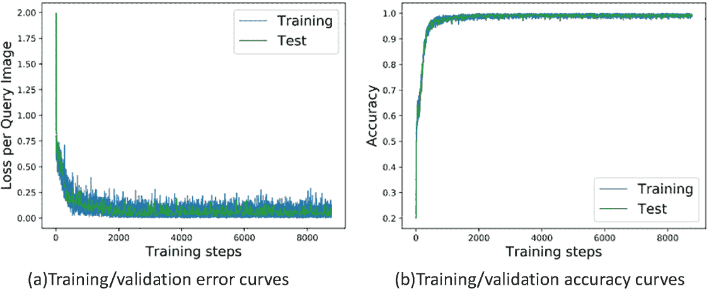

图 4-1

损耗和精度曲线

以均方误差函数为例。tf.keras.losses.mse(或 tf.keras.losses.MSE，同一个函数)返回每个样本的误差值，最后取误差的平均值作为当前批次的误差后，自动变成标量:

```py
In [41]:
out = tf.random.uniform([4,10]) # Create a model output example
y = tf.constant([2,3,2,0]) # Create a real observation
y = tf.one_hot(y, depth=10) # one-hot encoding
loss = tf.keras.losses.mse(y, out) # Calculate MSE for each sample
loss = tf.reduce_mean(loss) # Calculate the mean of MSE
print(loss)

Out[41]:
tf.Tensor(0.19950335, shape=(), dtype=float32)

```

### 4.5.2 矢量

向量在神经网络中非常常见。比如在全连接网络和卷积神经网络中，偏置张量 *b* 用向量来表示。如图 [4-2](#Fig2) 所示，在每个全连接层的输出节点上加一个偏置值，所有输出节点的偏置用向量形式表示*b*=[*b*T8】1，*b*<sub>2</sub><sup>*T*</sup>:

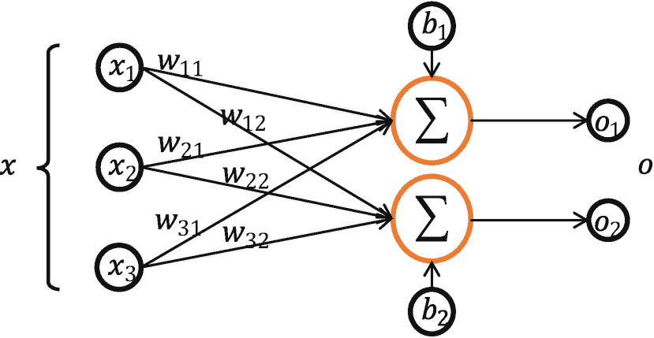

图 4-2

偏置向量的应用

考虑两个输出节点的网络层，我们创建长度为 2 的偏置向量，并在每个输出节点上加回:

```py
In [42]:
# Suppose z is the output of an activation function
z = tf.random.normal([4,2])
b = tf.zeros([2]) # Create a bias vector
z = z + b
Out[42]:
<tf.Tensor: id=245, shape=(4, 2), dtype=float32, numpy=
array([[ 0.6941646 ,  0.4764454 ],
       [-0.34862405, -0.26460952],
       [ 1.5081744 , -0.6493869 ],
       [-0.26224667, -0.78742725]], dtype=float32)>

```

注意，形状为[4，2]的张量 *z* 和形状为[2]的向量 *b* 可以直接相加。这是为什么呢？我们将在稍后的“广播”部分揭示它。

对于通过高级接口类 Dense()创建的网络层，张量 *W* 和 *b* 由类内部自动创建和管理。偏置变量 *b* 可以通过全连接层的偏置成员访问。例如，如果创建了具有四个输入节点和三个输出节点的线性网络层，则它的偏置向量 *b* 应该具有长度 3，如下所示:

```py
In [43]:
fc = layers.Dense(3) # Create a dense layer with output length of 3
# Create W and b through build function with input nodes of 4
fc.build(input_shape=(2,4))
fc.bias # Print bias vector
Out[43]:
<tf.Variable 'bias:0' shape=(3,) dtype=float32, numpy=array([0., 0., 0.], dtype=float32)>

```

可以看出，类的 bias 成员是一个长度为 3 的向量，初始化为全 0。这也是 bias *b* 的默认初始化方案。此外，偏置向量的类型是可变的，因为对于 *W* 和 *b* 都需要梯度信息。

### 矩阵

矩阵也是一种非常常见的张量。例如，一个全连通层的批量输入张量 *X* 的形状为 中的 *b* ， *d* <sub>*，其中 *b* 表示输入样本的个数，即批量大小，*</sub> 中的 *d* <sub>*表示输入特征的长度。例如，特征长度 4 和包含总共两个样本的输入可以表示为矩阵:*</sub>

```py
x = tf.random.normal([2,4])  # A tensor with 2 samples and 4 features

```

设全连通层的输出节点数为三，则它的权张量形状*W*【4，3】。我们可以使用张量 *X* 、 *W* 和向量 *b* 直接实现一个网络层。代码如下:

```py
In [44]:
w = tf.ones([4,3])
b = tf.zeros([3])
o = x@w+b # @ means matrix multiplication
Out[44]:
<tf.Tensor: id=291, shape=(2, 3), dtype=float32, numpy=
array([[ 2.3506963,  2.3506963,  2.3506963],
       [-1.1724043, -1.1724043, -1.1724043]], dtype=float32)>

```

在前面的代码中， *X* 和 *W* 都是矩阵。前面的代码实现了线性变换网络层，激活函数为空。一般来说，网络层*σ*(*X*@*W*+*b*)称为全连通层，可以直接用 TensorFlow 中的 Dense()类实现。特别地，当激活函数 *σ* 为空时，全连通层也称为线性层。我们可以通过 Dense()类创建一个具有四个输入节点和三个输出节点的网络层，并通过全连接层的内核成员查看其权重矩阵 *W* :

```py
In [45]:
fc = layers.Dense(3) # Create fully-connected layer with 3 output nodes
fc.build(input_shape=(2,4)) # Define the input nodes to be 4
fc.kernel # Check kernel matrix W
Out[45]:
<tf.Variable 'kernel:0' shape=(4, 3) dtype=float32, numpy=
array([[ 0.06468129, -0.5146048 , -0.12036425],
       [ 0.71618867, -0.01442951, -0.5891943 ],
       [-0.03011459,  0.578704  ,  0.7245046 ],
       [ 0.73894167, -0.21171576,  0.4820758 ]], dtype=float32)>

```

### 4.5.4 三维张量

三维张量的典型应用是表示序列信号。其格式为

![$$ X=\left[b, sequence\ length, feature\ length\right] $$](img/515226_1_En_4_Chapter_TeX_Equa.png)

其中序列信号的个数为 *b* ，序列长度表示时间维度上采样点或步长的个数，特征长度表示每个点的特征长度。

考虑自然语言处理(NLP)中句子的表示，比如评价一个句子是否是正面情感的情感分类网络，如图 [4-3](#Fig3) 所示。为了便于神经网络对字符串的处理，一般通过嵌入层将单词编码成固定长度的向量。例如，“a”被编码为长度为 3 的向量。那么两个长度相等的句子(每个句子有五个单词)可以表示为一个形状为[2，5，3]的三维张量，其中 2 代表句子的数量，5 代表单词的数量，3 代表编码后的单词向量的长度。我们演示如何通过 IMDB 数据集来表示句子，如下所示:

```py
In [46]:  # Load IMDB dataset
from tensorflow import keras
(x_train,y_train),(x_test,y_test)=keras.datasets.imdb.load_data(num_words=10000)
# Convert each sentence to length of 80 words
x_train = keras.preprocessing.sequence.pad_sequences(x_train,maxlen=80)
x_train.shape
Out [46]: (25000, 80)

```

我们可以看到 x_train 的形状是[25000，80]，其中 25000 代表句子的数量，80 代表每个句子总共 80 个单词，每个单词用一种数字编码的方式表示。接下来，我们使用层。嵌入函数将每个数字编码字转换为长度为 100 的向量:

```py
In [47]: # Create Embedding layer with 100 output length
embedding=layers.Embedding(10000, 100)
# Convert numeric encoded words to word vectors
out = embedding(x_train)
out.shape
Out[47]: TensorShape([25000, 80, 100])

```

通过嵌入层，句子张量的形状变成了[25000，80，100]，其中 100 表示每个单词都被编码为长度为 100 的向量。

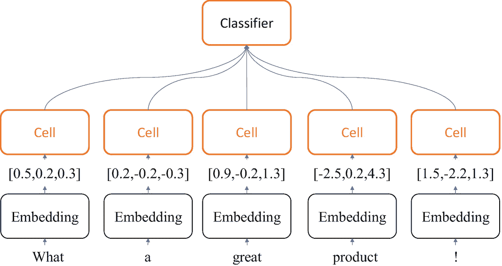

图 4-3

情感分类网络

对于具有一个特征的序列信号，比如一个产品在 60 天内的价格，只需要一个标量来表示产品价格，那么两个产品的价格变化就可以用一个形状为[2，60]的张量来表示。为了便于格式统一，价格变化也可以表示为形状的张量[2，60，1]，其中 1 表示特征长度为 1。

### 4.5.5 四维张量

大多数时候我们只使用维数小于 5 的张量。对于更高维张量，例如元学习中的五维张量表示，可以应用类似的原理。四维张量广泛应用于卷积神经网络中。它们用于保存要素地图。格式一般定义为

![$$ \left[b,h,w,c\right] $$](img/515226_1_En_4_Chapter_TeX_Equb.png)

其中 *b* 表示输入样本的数量； *h* 和 *w* 分别代表特征图的高度和宽度；而 *c* 是通道数。有些深度学习框架也使用[ *b* ， *c* ， *h* ， *w* ]的格式，比如 PyTorch。影像数据是一种特征地图。具有 RGB 三个通道的彩色图像包含像素的 *h* 行和 *w* 列。每个点需要三个值来表示 RGB 通道的颜色强度，因此可以使用形状为[ *h* ， *w* ，3]的张量来表示一幅图片。如图 [4-4](#Fig4) 所示，上图代表原始图像，包含了三个下通道的亮度信息。

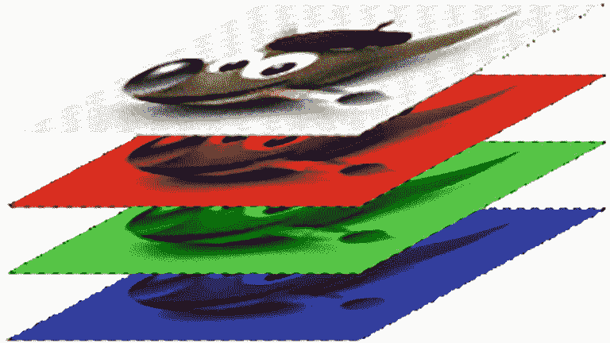

图 4-4

RGB 图像的特征图

在神经网络中，一般会并行计算多个输入以提高计算效率，所以 *b* 图片的张量可以表示为[ *b* 、 *h* 、 *w* ，3]:

```py
In [48]:
# Create 4 32x32 color images
x = tf.random.normal([4,32,32,3])
# Create convolutional layer
layer = layers.Conv2D(16,kernel_size=3)
out = layer(x)
out.shape
Out[48]: TensorShape([4, 30, 30, 16])

```

卷积核张量也是一个四维张量，可以通过核成员变量来访问:

```py
In [49]: layer.kernel.shape
Out[49]: TensorShape([3, 3, 3, 16])

```

## 4.6 索引和切片

张量数据的一部分可以通过索引和切片操作提取出来，这是非常常用的。

### 索引

在 TensorFlow 中，支持标准的 Python 索引方式，比如[ *i* ][ *j* ]以及逗号和“:”。考虑四张 32 × 32 大小的彩色图片(为方便起见，大部分张量由随机正态分布产生，下同)。相应的张量具有如下形状[4，32，32，3]:

```py
x = tf.random.normal([4,32,32,3])

```

接下来，我们使用索引方法从张量中读取部分数据。

*   读取第一图像数据:

*   阅读第一幅图的第二行:

```py
x = tf.random.normal ([4,32,32,3]) # Create a 4D tensor
In [51]: x[0]  # Index 0 indicates the 1st element in Python
Out[51]:<tf.Tensor: id=379, shape=(32, 32, 3), dtype=float32, numpy=
array([[[ 1.3005302 ,  1.5301839 , -0.32005513],
        [-1.3020388 ,  1.7837263 , -1.0747638 ], ...
        [-1.1092019 , -1.045254  , -0.4980363 ],
        [-0.9099222 ,  0.3947732 , -0.10433522]]], dtype=float32)>

```

*   阅读第一幅图片的第二行第三列:

```py
In [52]: x[0][1]
Out[52]:
<tf.Tensor: id=388, shape=(32, 3), dtype=float32, numpy=
array([[ 4.2904025e-01,  1.0574218e+00,  3.1540772e-01],
       [ 1.5800388e+00, -8.1637271e-02,  6.3147342e-01], ...,
       [ 2.8893018e-01,  5.8003378e-01, -1.1444757e+00],
       [ 9.6100050e-01, -1.0985689e+00,  1.0827581e+00]], dtype=float32)>

```

*   选择第三张图片的第二行、第一列和第二(B)通道:

```py
In [53]: x[0][1][2]
Out[53]:
<tf.Tensor: id=401, shape=(3,), dtype=float32, numpy=array([-0.55954427,  0.14497331,  0.46424514], dtype=float32)>

```

```py
In [54]: x[2][1][0][1]
Out[54]:
<tf.Tensor: id=418, shape=(), dtype=float32, numpy=-0.84922135>

```

当维数较大时，使用[ *i* ][ *j* 的方式...【 *k* 不方便。相反，我们可以使用[ *i* ， *j* ，...， *k* 进行分度。它们是等价的。

*   阅读第二幅图片的第十行第三列:

```py
In [55]: x[1,9,2]
Out[55]:
<tf.Tensor: id=436, shape=(3,), dtype=float32, numpy=array([ 1.7487534 , -0.41491988, -0.2944692 ], dtype=float32)>

```

### 切片

使用格式*start*:*end*:*step*可以很容易地提取一段数据，其中 start 是起始位置的索引，end 是结束位置的索引(不包括)，step 是采样步长。

以形状为[4，32，32，3]的图像张量为例，我们将说明如何使用切片来获得不同位置的数据。例如，如下阅读第二幅和第三幅图片:

```py
In [56]: x[1:3]
Out[56]:
<tf.Tensor: id=441, shape=(2, 32, 32, 3), dtype=float32, numpy=
array([[[[ 0.6920027 ,  0.18658352,  0.0568333 ],
         [ 0.31422952,  0.75933754,  0.26853144],
         [ 2.7898    , -0.4284912 , -0.26247284],...

```

*开始* : *结束* : *步骤*刀法有很多缩写。可以根据需要有选择地省略开始、结束和步进参数。当像::，都被省略时，表示读取是从开始到结束，步长为 1。比如 x [0，:]表示读取第一张图片的所有行，其中::表示行维度的所有行，相当于 x [0]:

```py
In [57]: x[0,::]      # Read 1st picture
Out[57]:
<tf.Tensor: id=446, shape=(32, 32, 3), dtype=float32, numpy=
array([[[ 1.3005302 ,  1.5301839 , -0.32005513],
        [-1.3020388 ,  1.7837263 , -1.0747638 ],
        [-1.1230233 , -0.35004002,  0.01514002],
        ...

```

为简洁起见，::可以缩写为单个冒号:，例如:

```py
In [58]: x[:,0:28:2,0:28:2,:]
Out[58]:
<tf.Tensor: id=451, shape=(4, 14, 14, 3), dtype=float32, numpy=
array([[[[ 1.3005302 ,  1.5301839 , -0.32005513],
         [-1.1230233 , -0.35004002,  0.01514002],
         [ 1.3474811 ,  0.639334  , -1.0826371 ],
         ...

```

前面的代码表示读取所有图片，隔行采样，读取所有通道数据，相当于缩放图片原来高度和宽度的 50%。

我们来总结一下不同的切片方式，从第一个元素开始读取时可以省略“start”，即取最后一个元素时可以省略“start = 0”，取最后一个元素时可以省略“end”，步长为 1 时可以省略“step”。详情汇总在表 [4-1](#Tab1) 中。

表 4-1

切片方法概述

<colgroup><col class="tcol1 align-left"> <col class="tcol2 align-left"></colgroup> 
| 

方法

 | 

意义

 |
| --- | --- |
| 开始:结束:步骤 | 从“开始”读到“结束”(不包括)，步长为“步长” |
| 出发 | 从“开始”读到“结束”(不含)，步长为 1。 |
| 开始: | 以步长 1 从“开始”读到对象的结尾。 |
| 开始::步骤 | 以“步长”从“起点”读取到对象的终点 |
| :结束:步骤 | 从第 0 项读到“end”(不含)，步长为“step” |
| :结束 | 从第 0 项读到“end”(不含)，步长为 1。 |
| *步骤 | 从第 0 项读取到最后一项，步长为“step” |
| :: | 阅读所有项目。 |
| ： | 阅读所有项目。 |

特别地，步长可以是负的。例如，*start*:*end*:—1 表示从“start”开始，逆序读取，以“end”结束(不含)，索引“end”小于“start”考虑一个从 0 到 9 的简单序列向量，以相反的顺序取第一个元素，不包括第一个元素:

```py
In [59]: x = tf.range(9)  # Create the vector
x[8:0:-1]  # Reverse slicing
Out[59]:
<tf.Tensor: id=466, shape=(8,), dtype=int32, numpy=array([8, 7, 6, 5, 4, 3, 2, 1])>

```

按如下相反顺序提取所有元素:

```py
In [60]: x[::-1]
Out[60]:
<tf.Tensor: id=471, shape=(9,), dtype=int32, numpy=array([8, 7, 6, 5, 4, 3, 2, 1, 0])>

```

每两个项目反向采样的实现方式如下:

```py
In [61]: x[::-2]
Out[61]:
<tf.Tensor: id=476, shape=(5,), dtype=int32, numpy=array([8, 6, 4, 2, 0])>

```

读取每个图像的所有通道，其中行和列以相反的顺序每两个元素采样一次。实现如下:

```py
In [62]: x = tf.random.normal([4,32,32,3])
x[0,::-2,::-2]
Out[62]:
<tf.Tensor: id=487, shape=(16, 16, 3), dtype=float32, numpy=
array([[[ 0.63320625,  0.0655185 ,  0.19056146],
        [-1.0078577 , -0.61400175,  0.61183935],
        [ 0.9230892 , -0.6860094 , -0.01580668],
        ...

```

当张量维数较大时，不需要采样的维数一般用单冒号“:”表示所有元素都被选中。这样一来，可能会出现很多“:”。考虑形状为[4，32，32，3]的图像张量。当需要读取绿色通道上的数据时，前面的所有维度都被提取为

```py
In [63]: x[:,:,:,1]  # Read data on Green channel
Out[63]:
<tf.Tensor: id=492, shape=(4, 32, 32), dtype=float32, numpy=
array([[[ 0.575703  ,  0.11028383, -0.9950867 , ...,  0.38083118, -0.11705163, -0.13746642],
        ...

```

为了避免出现像 *x* [:，:，:，1]冒号太多的情况，我们可以使用符号“⋯<sup>”</sup>来取多维度的所有数据，其中维度的个数需要根据规则自动推断:当符号⋯以切片方式出现时，“⋯”左边的维度会自动向最左边对齐。符号“⋯”右侧的尺寸将自动与最右侧对齐。系统将自动推断由符号“⋯".”表示的维数详情汇总在表 [4-2](#Tab2) 中。

表 4-2

"..."切片方法摘要

<colgroup><col class="tcol1 align-left"> <col class="tcol2 align-left"></colgroup> 
| 

方法

 | 

意义

 |
| --- | --- |
| a， **⋯** ，b | 为维度 a 选择 0 到 a，为维度 b 选择 b 到结束，为其他维度选择所有元素。 |
| 一、 **⋯** | 为维度 a 选择 0 到 a，为其他维度选择所有元素。 |
| **⋯** ，b | 选择 b 以结束维 b 和其他维的所有元素。 |
| **⋯** | 读取所有元素。 |

我们列举更多的例子如下:

*   读取第一和第二图片的绿色和蓝色通道数据:

*   阅读最后两张图片:

```py
In [64]: x[0:2,...,1:]
Out[64]:
<tf.Tensor: id=497, shape=(2, 32, 32, 2), dtype=float32, numpy=
array([[[[ 0.575703  ,  0.8872789 ],
         [ 0.11028383, -0.27128693],
         [-0.9950867 , -1.7737272 ],
         ...

```

*   读取红色和绿色通道数据:

```py
In [65]: x[2:,...]  # equivalent to x[2:]
Out[65]:
<tf.Tensor: id=502, shape=(2, 32, 32, 3), dtype=float32, numpy=
array([[[[-8.10753584e-01,  1.10984087e+00,  2.71821529e-01],
         [-6.10031188e-01, -6.47952318e-01, -4.07003373e-01],
         [ 4.62206364e-01, -1.03655539e-01, -1.18086267e+00],
         ...

```

```py
In [66]: x[...,:2]
Out[66]:
<tf.Tensor: id=507, shape=(4, 32, 32, 2), dtype=float32, numpy=
array([[[[-1.26881   ,  0.575703  ],
         [ 0.98697686,  0.11028383],
         [-0.66420585, -0.9950867 ],
         ...

```

### 切片总结

张量索引和切片方法多种多样，尤其是切片操作，初学者很容易混淆。本质上，切片操作只有这个基本形式*开始* : *结束* : *步骤*。通过这种基本形式，有目的地省略一些默认参数，并派生出多个缩写方法。所以写起来更容易更快。由于深度学习一般处理的维数在四维以内，所以你会发现张量切片运算在深度学习中并没有那么复杂。

## 4.7 维度转换

在神经网络中，维度变换是最核心的张量运算。通过维度变换，数据可以任意切换，满足不同情况的计算需求。考虑线性图层的批处理形式:

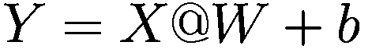

假设两个样本，每个样本的特征长度为 4，包含在 *X* 中，形状为【2，4】。线性层的输出节点数为三，即 *W* 的形状为【4，3】，定义 *b* 的形状为【3】。那么 *X* @ *W* 的结果具有[2，3]的形状。注意，我们还需要添加形状为[3]的 *b* 。如何将两个不同形状的张量直接相加？

回想一下，我们要做的是给每层的每个输出节点增加一个偏置。这种偏差由每个节点的所有样本共享。换句话说，每个样本应该在每个节点增加相同的偏置，如图 [4-5](#Fig5) 所示。

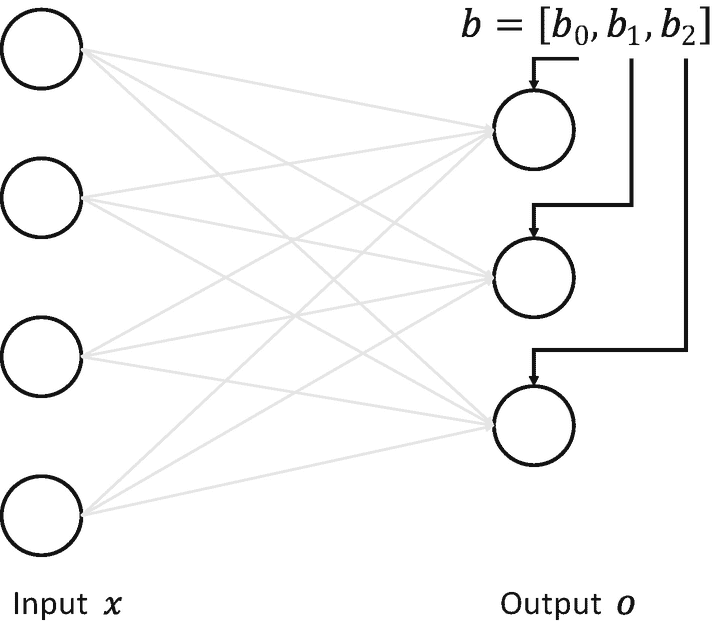

图 4-5

线性层的偏差

因此，对于两个样本的输入 *X* ，我们需要复制偏倚

![$$ b=\left[{b}_1\ {b}_2\ {b}_3\ \right] $$](img/515226_1_En_4_Chapter_TeX_Equd.png)

将样本数转化为如下矩阵形式

![$$ {B}^{\prime }=\left[{b}_1\ {b}_2\ {b}_3\ {b}_1\ {b}_2\ {b}_3\ \right] $$](img/515226_1_En_4_Chapter_TeX_Eque.png)

然后加上*X*<sup>’</sup>=*X*@*W*

![$$ {X}^{\prime }=\left[{x}_{11}^{\prime }\ {x}_{12}^{\prime }\ {x}_{13}^{\prime }\ {x}_{21}^{\prime }\ {x}_{22}^{\prime }\ {x}_{23}^{\prime }\ \right] $$](img/515226_1_En_4_Chapter_TeX_Equf.png)

因为此时它们的形状相同，这就满足了矩阵加法的要求:

![$$ Y={X}^{\prime }+{B}^{\prime }=\left[{x}_{11}^{\prime }\ {x}_{12}^{\prime }\ {x}_{13}^{\prime }\ {x}_{21}^{\prime }\ {x}_{22}^{\prime }\ {x}_{23}^{\prime }\ \right]+\left[{b}_1\ {b}_2\ {b}_3\ {b}_1\ {b}_2\ {b}_3\ \right] $$](img/515226_1_En_4_Chapter_TeX_Equg.png)

这样既满足了矩阵加法需要形状一致的要求，又实现了每个输入样本的输出节点共享偏置向量的逻辑。为了实现这一点，我们向偏置向量 *b* 插入一个新的维度 batch，然后复制 batch 维度中的数据，以获得形状为[2，3]的转换版本*B*<sup>’</sup>。这一系列的操作称为维度变换。

每种算法对张量格式都有不同的逻辑要求。当现有的张量格式不满足算法要求时，需要通过量纲变换将张量调整到正确的格式。基本维度转换包括诸如改变视图(reshape())、插入新维度(expand_dims())、删除维度(squeeze())和交换维度(transpose())之类的功能。

### 重塑

在介绍整形操作之前，我们先来了解一下张量存储和视图的概念。张量的观点就是我们理解张量的方式。例如，形状[2，4，4，3]的张量在逻辑上被理解为两个图片，每个图片具有四行和四列，并且每个像素具有三个通道的 RGB 数据。张量的存储体现在张量在内存中是作为一个连续的区域存储的。对于同一个存储，我们可以有不同的看法。对于[2，4，4，3]张量，我们可以把它看作两个样本，每个样本的特征是一个长度为 48 的向量。同一个张量可以产生不同的视图。这就是存储和视图的关系。视图生成非常灵活，但需要合理。

我们可以通过 tf.range()生成一个向量，通过 tf.reshape()函数生成不同的视图，例如:

```py
In [67]: x=tf.range(96)
x=tf.reshape(x,[2,4,4,3])  # Change view to [2,4,4,3] without change storage
Out[67]:  # Data is not changed, only view is changed.
<tf.Tensor: id=11, shape=(2, 4, 4, 3), dtype=int32, numpy=
array([[[[ 0,  1,  2],
         [ 3,  4,  5],
         [ 6,  7,  8],
         [ 9, 10, 11]],...

```

存储数据时，内存不支持这种维度层次概念，数据只能以分块和顺序的方式写入内存。所以这种层次关系需要人工管理，即需要人工跟踪每个张量的存储顺序。为了便于表达，我们将张量形状列表左侧的维度称为大维度，将形状列表右侧的维度称为小维度。例如，在形状为[2，4，4，3]的张量中，图像 2 的数量被称为大维度，通道 3 的数量被称为小维度。在小维度优先写入的优先级设置下，前一个张量 **x** 的内存布局为

<colgroup><col class="tcol1 align-left"> <col class="tcol2 align-left"> <col class="tcol3 align-left"> <col class="tcol4 align-left"> <col class="tcol5 align-left"> <col class="tcol6 align-left"> <col class="tcol7 align-left"> <col class="tcol8 align-left"> <col class="tcol9 align-left"> <col class="tcol10 align-left"> <col class="tcol11 align-left"> <col class="tcol12 align-left"> <col class="tcol13 align-left"> <col class="tcol14 align-left"> <col class="tcol15 align-left"></colgroup> 
| one | Two | three | four | five | six | seven | eight | nine | ... | ... | ... | Ninety-three | Ninety-four | Ninety-five |

改变张量的观点只会改变理解张量的方式。它不会改变存储顺序。因为写入大量数据会消耗更多的计算资源，所以这样做是为了提高计算效率。由于数据在存储时只有扁平化的结构，与逻辑结构是分离的，新的逻辑结构(视图)不需要改变数据存储方式，可以节省大量的计算资源。改变视图操作在提供便利的同时，也带来了很多逻辑上的危险。改变视图操作的默认前提是存储不变；否则，更改视图操作是非法的。我们首先介绍合法的视图转换操作，然后介绍一些非法的视图转换。

比如张量 *A* 按照 *b* 、 *h* 、 *w* 、 *c* 的初始视图写入内存。如果我们改变理解方式，它可以有以下格式:

*   张量[ *b* ， *h* ⋅ *w* ， *c* 用 *h* ⋅ *w* 像素和 *c* 通道表示 *b* 图片。

*   张量[ *b* ， *h* ， *w* ⋅ *c* 用 *h* 线条表示 *b* 图片，每条线的特征长度为 *w* ⋅ *c* 。

*   张量[ *b* ， *h* ⋅ *w* ⋅ *c* 代表 *b* 图片，每张图片的特征长度为*h*⋅*w*⋅*c*。

前面视图的存储不需要改变，所以都是正确的。

从语法上来说，视图转换只需要确保新视图的元素总数和存储区域的大小相等，即新视图的元素数等于

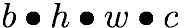

正是因为视图设计的语法约束很少，完全由用户定义，所以在改变视图时容易出现逻辑风险。

现在让我们考虑非法的视图转换。例如，如果新视图被定义为[ *b* 、 *w* 、 *h* 、 *c* 、 *b* 、 *c* 、 *h* 、 *w* ，或者[ *b* 、 *c* 、 *h* 、*w*如果存储顺序没有同步更新，恢复的数据会与新视图不一致，造成数据混乱。这就需要用户了解数据，才能确定操作是否合法。我们将在“交换维度”一节中展示如何改变张量的存储。**

正确使用视图转换操作的一种技术是跟踪存储维度的顺序。比如初始视图中保存的“图片数-行-列-通道”的张量，存储也是按照“图片数-行-列-通道”的顺序写的。如果用“图片数-像素-通道”的方法恢复视图，与“图片数-行-列-通道”不冲突，所以可以得到正确的数据。但如果用“图片数-通道数-像素”的方法恢复数据，由于内存布局是按照“图片数-行-列-通道数”的顺序，视图维的顺序与存储维的顺序不一致，导致数据杂乱。

改变视图是神经网络中非常常见的操作。您可以通过串联多个整形操作来实现复杂的逻辑。但是，当通过 reshape 更改视图时，您必须始终记住张量的存储顺序。新视图的维度顺序必须与存储顺序相同。否则，您需要通过交换维度操作来同步存储顺序。例如，对于具有形状[4，32，32，3]的图像数据，可以通过整形操作将形状调整为[4，1024，3]。视图的维度顺序为*b*—*像素*—*c*，张量的存储顺序为[ *b* ， *h* ， *w* ， *c* ]。形状为[4，1024，3]的张量可以恢复为以下形式:

*   当[ *b* ， *h* ， *w* ， *c* ] = [4，32，32，3]时，新视图的维度顺序和存储顺序一致，可以恢复数据，不会出现紊乱。

*   当[ *b* ， *w* ， *h* ， *c* ] = [4，32，32，3]时，新视图的维度顺序与存储顺序冲突。

*   当[*h*∷*w*∷*c*， *b* ] = [3072，4]时，新视图的维度顺序与存储顺序冲突。

在 TensorFlow 中，我们可以通过张量的 ndim 和 shape 属性获得张量的维数和形状:

```py
In [68]: x.ndim,x.shape # Get the tensor's dimension and shape
Out[68]:(4, TensorShape([2, 4, 4, 3]))

```

使用 TF . shape(x，new_shape)，我们可以合法地任意改变张量的视图，例如:

```py
In [69]: tf.reshape(x,[2,-1])
Out[69]:<tf.Tensor: id=520, shape=(2, 48), dtype=int32, numpy=
array([[ 0,  1,  2,  3,  4,  5,  6,  7,  8,  9, 10, 11, 12, 13, 14, 15,
         16, 17, 18, 19, 20, 21, 22, 23, 24, 25, 26, 27, 28, 29, 30, 31,...
         80, 81, 82, 83, 84, 85, 86, 87, 88, 89, 90, 91, 92, 93, 94, 95]])>

```

参数–1 表示当前轴上的长度需要根据张量的总元素不变的规则自动导出。例如，前面的–1 可以推导为

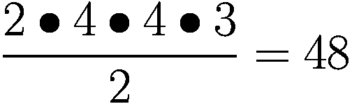

将数据视图再次更改为[2，4，12]，如下所示:

```py
In [70]: tf.reshape(x,[2,4,12])
Out[70]:<tf.Tensor: id=523, shape=(2, 4, 12), dtype=int32, numpy=
array([[[ 0,  1,  2,  3,  4,  5,  6,  7,  8,  9, 10, 11],...
        [36, 37, 38, 39, 40, 41, 42, 43, 44, 45, 46, 47]],
       [[48, 49, 50, 51, 52, 53, 54, 55, 56, 57, 58, 59], ...
        [84, 85, 86, 87, 88, 89, 90, 91, 92, 93, 94, 95]]])>

```

将数据视图再次更改为[2，16，3]，如下所示:

```py
In [71]: tf.reshape(x,[2,-1,3])
Out[71]:<tf.Tensor: id=526, shape=(2, 16, 3), dtype=int32, numpy=
array([[[ 0,  1,  2], ...
        [45, 46, 47]],
       [[48, 49, 50],...
        [93, 94, 95]]])>

```

通过前面一系列连续的视图变换操作，我们需要知道张量的存储顺序没有改变，数据仍然按照 0，1，2，⋯，95 的初始顺序存储在内存中。

### 4.7.2 添加和删除尺寸

**增加一个维度**。添加一个长度为 1 的维度相当于在原始数据中添加一个新维度的概念。维度长度为 1，所以不需要改变数据；这只是观点的改变。

考虑一个具体的例子。大灰度图像的数据保存为 28 × 28 形状的张量。最后，一个新的维度被添加到张量中，它被定义为通道的数量。那么张量的形状变成[28，28，1]如下:

```py
In [72]:  # Generate a 28x28 matrix
x = tf.random.uniform([28,28],maxval=10,dtype=tf.int32)
Out[72]:
<tf.Tensor: id=11, shape=(28, 28), dtype=int32, numpy=
array([[6, 2, 0, 0, 6, 7, 3, 3, 6, 2, 6, 2, 9, 3, 0, 3, 2, 8, 1, 3, 6, 2, 3, 9, 3, 6, 1, 7],...

```

使用 tf.expand_dims (x，axis)，我们可以在指定的轴之前插入一个新的维度:

```py
In [73]:  x = tf.expand_dims(x,axis=2)
Out[73]:
<tf.Tensor: id=13, shape=(28, 28, 1), dtype=int32, numpy=
array([[[6],
        [2],
        [0],
        [0],
        [6],
        [7],
        [3],...

```

可以看到，插入新维度后，数据的存储顺序并没有改变。插入新维度后，只有数据视图会发生变化。

同样，我们可以在前面插入一个新的维度，表示长度为 1 的图像数维度。这时张量的形状变成[1，28，28，1]:

```py
In [74]: x = tf.expand_dims(x,axis=0)  # Insert a dimension at the beginning
Out[74]:
<tf.Tensor: id=15, shape=(1, 28, 28, 1), dtype=int32, numpy=
array([[[[6],
         [2],
         [0],
         [0],
         [6],
         [7],
         [3],...

```

注意，当 tf.expand_dims 的轴为正时，意味着在当前维度之前插入了一个新维度；当它为负值时，表示在当前尺寸之后插入了一个新尺寸。以张量 *b* 、 *h* 、 *w* 、 *c* 为例，不同轴参数的实际插入位置如图 [4-6](#Fig6) 所示。

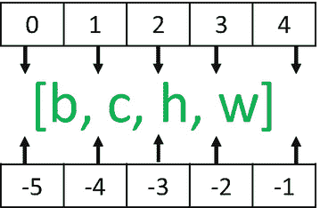

图 4-6

不同轴参数的插入位置

**删除一个尺寸**。删除维度是添加维度的反向操作。与添加维度一样，删除维度只能删除长度为 1 的维度，并且不会改变张量的存储顺序。继续考虑形状[1，28，28，1]的例子。如果我们想删除图片维数，我们可以使用 tf.squeeze (x，axis)函数。axis 参数是要删除的维度的索引号:

```py
In [75]: x = tf.squeeze(x, axis=0)  # Delete the image number dimension
Out[75]:
<tf.Tensor: id=586, shape=(28, 28, 1), dtype=int32, numpy=
array([[[8],
        [2],
        [2],
        [0],...

```

继续删除频道号维度。由于删除了图像数维，此时 x 的形状为[28，28，1]。删除通道号维度时，我们应该指定 axis = 2，如下所示:

```py
In [76]: x = tf.squeeze(x, axis=2)  # Delete channel dimension
Out[76]:
<tf.Tensor: id=588, shape=(28, 28), dtype=int32, numpy=
array([[8, 2, 2, 0, 7, 0, 1, 4, 9, 1, 7, 4, 8, 2, 7, 4, 8, 2, 9, 8, 8, 0, 9, 9, 7, 5, 9, 7],
       [3, 4, 9, 9, 0, 6, 5, 7, 1, 9, 9, 1, 2, 7, 2, 7, 5, 3, 3, 7, 2, 4, 5, 2, 7, 3, 8, 0],...

```

如果我们不指定尺寸参数 axis，即 tf.squeeze(x)，它将默认删除所有长度为 1 的尺寸，例如:

```py
In [77]:
x = tf.random.uniform([1,28,28,1],maxval=10,dtype=tf.int32)
tf.squeeze(x)     # Delete all dimensions with length 1
Out[77]:
<tf.Tensor: id=594, shape=(28, 28), dtype=int32, numpy=
array([[9, 1, 4, 6, 4, 9, 0, 0, 1, 4, 0, 8, 5, 2, 5, 0, 0, 8, 9, 4, 5, 0, 1, 1, 4, 3, 9, 9],...

```

建议逐个指定要删除的维度参数，以防止 TensorFlow 意外删除某些长度为 1 的维度，导致计算结果无效。

### 交换尺寸

改变视图或添加或删除维度不会影响张量的存储。有时，仅仅改变对张量的理解而不改变量纲的顺序是不够的。也就是需要直接调整存储顺序。通过交换维度，张量的存储顺序和视图都发生了变化。

交换维度操作非常常见。例如，一个图像张量在 TensorFlow 中默认的存储格式是[ *b* 、 *h* 、 *w* 、 *c* 格式，但是有些库的图像格式是[ *b* 、 *c* 、 *h* 、 *w* 格式。我们以[ *b* ， *h* ， *w* ， *c* 到[ *b* ， *c* ， *h* ， *w* 的转换为例，介绍如何使用 tf.transpose(x，perm)函数完成维度交换操作，其中参数 perm 代表新维度的顺序。考虑形状为[2，32，32，3]的图像张量，“图片数，行数，列数，通道数”的维数指标分别为 0，1，2，3。如果新维度的顺序是“图片数、通道数、行数、列数”，那么对应的索引号就变成了[0，3，1，2]，所以需要将参数 perm 设置为[0，3，1，2]。实现如下:

```py
In [78]: x = tf.random.normal([2,32,32,3])
tf.transpose(x,perm=[0,3,1,2])  # Swap dimension
Out[78]:
<tf.Tensor: id=603, shape=(2, 3, 32, 32), dtype=float32, numpy=
array([[[[-1.93072677e+00, -4.80163872e-01, -8.85614634e-01, ...,
           1.49124235e-01,  1.16427064e+00, -1.47740364e+00],
         [-1.94761145e+00,  7.26879001e-01, -4.41877693e-01, ...

```

如果我们要将[ *b* 、 *h* 、 *w* 、 *c* 改为[ *b* 、 *w* 、 *h* 、 *c* ]，即交换高度和宽度尺寸，则新的尺寸索引变为[0，2，1，3]，如下所示:

```py
In [79]:
x = tf.random.normal([2,32,32,3])
tf.transpose(x,perm=[0,2,1,3]) # Swap dimension
Out[79]:
<tf.Tensor: id=612, shape=(2, 32, 32, 3), dtype=float32, numpy=
array([[[[ 2.1266546 , -0.64206547,  0.01311932],
         [ 0.918484  ,  0.9528751 ,  1.1346699 ],
         ...,

```

需要注意的是，通过 tf.transpose 完成维度交换后，张量的存储顺序发生了变化，视图也相应发生了变化。所有后续操作都必须基于新的订单和视图。与改变视图操作相比，维度交换操作的计算开销更大。

### 复制数据

插入新维度后，我们可能希望复制新维度上的数据，以满足后续计算的要求。考虑例子*Y*=*X*@*W*+*b*。在插入一个样本数为 *b* 的新维度后，我们需要复制新维度中的批量数据，并将 *b* 的形状改为与 *X* @ *W* 一致，以完成张量加法运算。

我们可以使用 tf.tile(x，倍数)函数来完成指定维度的数据复制操作。参数 multiples 分别指定每个维度的复制编号。例如，1 表示不会复制数据，2 表示新长度是原始长度的两倍。

以输入[2，4]和三输出节点线性变换层为例，偏差 *b* 定义为

![$$ b=\left[{b}_1\ {b}_2\ {b}_3\ \right] $$](img/515226_1_En_4_Chapter_TeX_Equj.png)

通过 tf.expand_dims(b，axis = 0)插入一个新的维度，变成一个矩阵:

![$$ B=\left[{b}_1\ {b}_2\ {b}_3\ \right] $$](img/515226_1_En_4_Chapter_TeX_Equk.png)

现在 *B* 的形状变成了【1，3】。我们需要根据输入样本的数量在轴= 0 的维度上复制数据。这里的批量是 2，也就是做了一份拷贝就变成了

![$$ B=\left[{b}_1\ {b}_2\ {b}_3\ {b}_1\ {b}_2\ {b}_3\ \right] $$](img/515226_1_En_4_Chapter_TeX_Equl.png)

通过 tf.tile(b，倍数= [2，1])，可以在 axis = 0 维复制一次，在 axis = 1 维不复制。首先，插入一个新维度如下:

```py
In [80]:
b = tf.constant([1,2])  # Create tensor b
b = tf.expand_dims(b, axis=0)  # Insert new dimension
b
Out[80]:
<tf.Tensor: id=645, shape=(1, 2), dtype=int32, numpy=array([[1, 2]])>

```

复制批处理维度中数据的一个副本，以实现以下目的:

```py
In [81]: b = tf.tile(b, multiples=[2,1])
Out[81]:
<tf.Tensor: id=648, shape=(2, 2), dtype=int32, numpy=
array([[1, 2],
       [1, 2]])>

```

现在 *B* 的形状变成了【2，3】， *B* 可以直接加到 *X* @ *W* 上。考虑另一个 2×2 矩阵的例子。实现如下:

```py
In [82]: x = tf.range(4)
x=tf.reshape(x,[2,2])  # Create 2x2 matrix
Out[82]:
<tf.Tensor: id=655, shape=(2, 2), dtype=int32, numpy=
array([[0, 1],
       [2, 3]])>

```

首先，复制列维度中数据的一个副本，如下所示:

```py
In [83]: x = tf.tile(x,multiples=[1,2])
Out[83]:
<tf.Tensor: id=658, shape=(2, 4), dtype=int32, numpy=
array([[0, 1, 0, 1],
       [2, 3, 2, 3]])>

```

然后复制行维度中数据的一个副本:

```py
In [84]: x = tf.tile(x,multiples=[2,1])
Out[84]:
<tf.Tensor: id=672, shape=(4, 4), dtype=int32, numpy=
array([[0, 1, 0, 1],
       [2, 3, 2, 3],
       [0, 1, 0, 1],
       [2, 3, 2, 3]])>

```

在二维复制操作之后，我们可以看到数据的形状已经翻倍。这个例子帮助我们更直观地理解数据复制的过程。

需要注意的是，tf.tile 会创建一个新的张量来保存复制的张量。由于复制操作涉及大量的数据读写操作，计算成本相对较高。神经网络中不同形状之间的张量运算很常见，那么有没有轻量级的复制运算呢？这就是接下来要介绍的广播操作。

## 4.8 广播

广播是一种轻量级的张量复制方法，它在逻辑上扩展了张量数据的形状，但只在需要时执行实际的存储复制操作。对于大多数场景，广播机制可以通过避免实际的数据复制来完成逻辑运算，从而与 tf.tile 函数相比减少了大量的计算开销。

对于长度为 1 的所有维度，广播的效果与 tf.tile 相同，不同的是 tf.tile 通过执行 copy IO 操作创建了一个新的张量。广播不会立即复制数据；相反，它会在逻辑上改变张量的形状，使视图成为复制的形状。广播将使用深度学习框架的优化方法来避免数据的实际复制，并完成逻辑运算。对于用户来说，广播和 tf.tile 复制的最终效果是一样的，但是广播机制节省了大量的计算资源。建议在计算过程中尽量使用广播，提高效率。

继续考虑前面的例子*Y*=*X*@*W*+*b*， *X* @ *W* 的形状为【2，3】， *b* 的形状为【3】。我们可以通过组合 tf.expand_dims 和 tf.tile 来手动完成复制数据的操作，即把 *b* 变换成 shape【2，3】然后加到 *X* @ *W* 。但其实用 shape [3]直接把 *X* @ *W* 加到 *b* 上也是正确的，比如:

```py
x = tf.random.normal([2,4])
w = tf.random.normal([4,3])
b = tf.random.normal([3])
y = x@w+b # Add tensors with different shapes directly

```

前面的加法运算不会引发逻辑错误。这是因为它自动调用广播函数 tf.broadcast_to(x，new_shape)，将 *b* 的形状展开为【2，3】。前面的操作等效于

```py
y = x@w + tf.broadcast_to(b,[2,3])

```

换句话说，当运算符+遇到两个形状不一致的张量时，它会自动考虑将这两个张量展开成一致的形状，然后调用 tf.add 来完成张量加法运算。通过自动调用 tf.broadcast_to(b，[2，3])，既达到了增加维度的目的又避免了实际复制数据的昂贵计算成本。

广播机制的核心思想是普遍性。也就是说，相同的数据通常适用于其他位置。在验证普适性之前，我们需要先将张量形状向右对齐，然后进行普适性检查:对于长度为 1 的维度，默认情况下这个数据一般适用于当前维度中的其他位置；对于不存在的维度，增加一个新维度后，默认的当前数据也普遍适用于新维度，从而可以展开成任意维数的张量形状。

考虑到张量 *A* 具有形状[ *w* ，1]，需要扩展到形状[ *b* ， *h* ， *w* ， *c* ]。如图 [4-7](#Fig7) 所示，第一行为展开形状，第二行为现有形状。

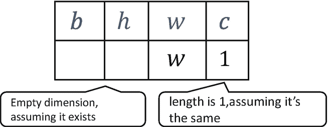

图 4-7

广播示例 1

首先，将两个形状向右对齐。对于通道维度 *c* ，张量的当前长度为 1。默认情况下，该数据也适用于当前维度中的其他位置。数据被逻辑复制，长度变成 c；对于不存在的维度 *b* 和 *h* ，自动插入一个新的维度，新维度的长度为 1，同时当前数据一般适用于新维度中的其他位置，即对于其他图片和其他行，与当前行的数据完全一致。这将自动扩展相应的尺寸到 *b* 和 *h* ，如图 [4-8](#Fig8) 所示。

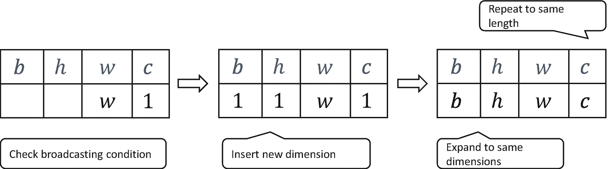

图 4-8

广播示例 2

tf.broadcast_to(x，new_shape)函数可用于显式执行自动扩展功能，将现有形状扩展为 new_shape。实现如下:

```py
In [87]:
A = tf.random.normal([32,1])  # Create a matrix
tf.broadcast_to(A, [2,32,32,3])  # Expand to 4 dimensions
Out[87]:
<tf.Tensor: id=13, shape=(2, 32, 32, 3), dtype=float32, numpy=
array([[[[-1.7571245 , -1.7571245 , -1.7571245 ],
         [ 1.580159  ,  1.580159  ,  1.580159  ],
         [-1.5324328 , -1.5324328 , -1.5324328 ],...

```

可以看出，在普遍性原则的指导下，广播机制变得直观易懂。

让我们考虑一个不满足普遍性原则的例子，如图 [4-9](#Fig9) 所示。

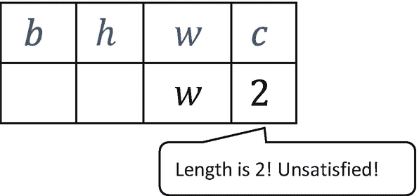

图 4-9

传播坏榜样

在 *c* 维中，张量已经有两个特征，新形状对应维的长度为 *c* ( *c* ≠ 2，如 *c* = 3)。那么当前维度中的这两个特征就不能普遍适用于其他位置，所以不符合普遍性原则。如果我们应用广播，它将触发错误，例如

```py
In [88]:
A = tf.random.normal([32,2])
tf.broadcast_to(A, [2,32,32,4])
Out[88]:
InvalidArgumentError: Incompatible shapes: [32,2] vs. [2,32,32,4] [Op:BroadcastTo]

```

在进行张量运算时，有些运算会在处理不同形状的张量时自动调用广播机制，比如+、-、*、和/，将对应的张量广播成一个共同的形状，然后做相应的计算。图 [4-10](#Fig10) 展示了三种不同形状的张量加法的一些例子。

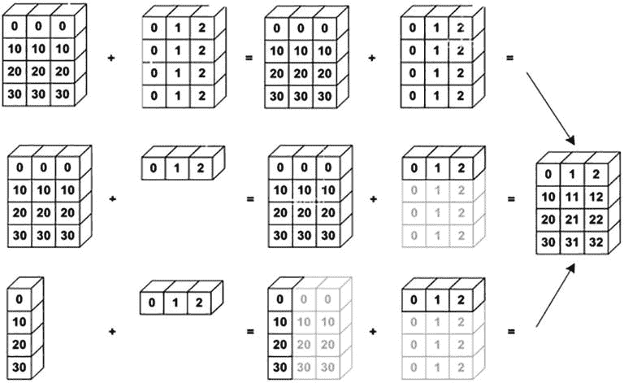

图 4-10

自动广播示例

我们来测试一下基础运营商的自动播报机制，比如:

```py
a = tf.random.normal([2,32,32,1])
b = tf.random.normal([32,32])
a+b,a-b,a*b,a/b # Test automatic broadcasting for operations +, -, *, and /

```

这些操作可以在实际计算之前广播成一个公共形状。使用广播机制可以使代码更加简洁高效。

## 4.9 数学运算

在前几章中，我们已经使用了一些基本的数学运算，如加、减、乘、除。本节将系统介绍 TensorFlow 中常见的数学运算。

### 4.9.1 加减乘除

加减乘除是最基本的数学运算。它们分别由 TensorFlow 中的 tf.add、tf.subtract、tf.multiply 和 tf.divide 函数实现。TensorFlow 具有重载运算符+、-、和/。一般建议直接使用那些运算符。底数除法和余数除法是另外两种常见的运算，分别由//和%运算符实现。让我们演示一下除法运算，例如:

```py
In [89]:
a = tf.range(5)
b = tf.constant(2)
a//b # Floor dividing
Out[89]:
<tf.Tensor: id=115, shape=(5,), dtype=int32, numpy=array([0, 0, 1, 1, 2])>
In [90]: a%b # Remainder dividing
Out[90]:
<tf.Tensor: id=117, shape=(5,), dtype=int32, numpy=array([0, 1, 0, 1, 0])>

```

### 电源操作

通过 tf.pow(x，a)函数，或者运算符** as x**a，可以方便地完成幂运算:

```py
In [91]:
x = tf.range(4)
tf.pow(x,3)
Out[91]:
<tf.Tensor: id=124, shape=(4,), dtype=int32, numpy=array([ 0,  1,  8, 27])>
In [92]: x**2
Out[92]:
<tf.Tensor: id=127, shape=(4,), dtype=int32, numpy=array([0, 1, 4, 9])>

```

将指数设置为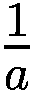的形式来实现根运算![$$ \sqrt[a]{x} $$](img/515226_1_En_4_Chapter_TeX_IEq2.png)，例如:

```py
In [93]: x=tf.constant([1.,4.,9.])
x**(0.5)  # square root
Out[93]:
<tf.Tensor: id=139, shape=(3,), dtype=float32, numpy=array([1., 2., 3.], dtype=float32)>

```

特别是对于常见的平方和平方根运算，可以使用 tf.square(x)和 tf.sqrt(x)。平方运算的实现如下:

```py
In [94]:x = tf.range(5)
x = tf.cast(x, dtype=tf.float32)  # convert to float type
x = tf.square(x)
Out[94]:
<tf.Tensor: id=159, shape=(5,), dtype=float32, numpy=array([ 0.,  1.,  4.,  9., 16.], dtype=float32)>

```

平方根运算实现如下:

```py
In [95]:tf.sqrt(x)
Out[95]:
<tf.Tensor: id=161, shape=(5,), dtype=float32, numpy=array([0., 1., 2., 3., 4.], dtype=float32)>

```

### 指数和对数运算

使用 tf.pow(a，x)或**运算符也可以轻松实现指数运算，例如:

```py
In [96]: x = tf.constant([1.,2.,3.])
2**x
Out[96]:
<tf.Tensor: id=179, shape=(3,), dtype=float32, numpy=array([2., 4., 8.], dtype=float32)>

```

具体来说，对于自然指数 *e* <sup>*x*</sup> ，这可以用 tf.exp(x)来实现，例如:

```py
In [97]: tf.exp(1.)
Out[97]:
<tf.Tensor: id=182, shape=(), dtype=float32, numpy=2.7182817>

```

在 TensorFlow 中，自然对数 *x* 可以用 tf.math.log(x)实现，例如:

```py
In [98]: x=tf.exp(3.)
tf.math.log(x)
Out[98]:
<tf.Tensor: id=186, shape=(), dtype=float32, numpy=3.0>

```

如果要计算其他底数的对数，可以使用对数换底公式:

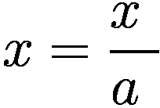

例如，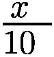的计算可以通过下式实现

```py
In [99]: x = tf.constant([1.,2.])
x = 10**x
tf.math.log(x)/tf.math.log(10.)
Out[99]:
<tf.Tensor: id=6, shape=(2,), dtype=float32, numpy=array([1., 2.], dtype=float32)>

```

### 矩阵乘法

神经网络包含大量矩阵乘法运算。我们之前介绍过，矩阵乘法可以通过@运算符和 tf.matmul(a，b)函数轻松实现。需要注意的是，TensorFlow 中的矩阵乘法可以使用批处理方式，即张量 *A* 和 *B* 可以有大于 2 的维数。当维度大于 2 时，TensorFlow 选择 *A* 和 *B* 的最后两个维度进行矩阵乘法，前面的维度全部视为批量维度。

根据矩阵乘法的定义， *A* 能乘一个矩阵 *B* 的条件是 *A* 的倒数第二个维度(列)的长度和 *B* 的倒数第二个维度(行)的长度必须相等。例如，形状为[4，3，28，32]的张量 a 可以乘以形状为[4，3，32，2]的张量 b。代码如下:

```py
In [100]:
a = tf.random.normal([4,3,28,32])
b = tf.random.normal([4,3,32,2])
a@b
Out[100]:
<tf.Tensor: id=236, shape=(4, 3, 28, 2), dtype=float32, numpy=
array([[[[-1.66706240e+00, -8.32602978e+00],
         [ 9.83304405e+00,  8.15909767e+00],
         [ 6.31014729e+00,  9.26124632e-01],...

```

矩阵乘法也支持自动广播机制，例如:

```py
In [101]:
a = tf.random.normal([4,28,32])
b = tf.random.normal([32,16])
tf.matmul(a,b)  # First broadcast b to shape [4, 32, 16] and then multiply a
Out[101]:
<tf.Tensor: id=264, shape=(4, 28, 16), dtype=float32, numpy=
array([[[-1.11323869e+00, -9.48194981e+00,  6.48123884e+00, ...,
          6.53280640e+00, -3.10894990e+00,  1.53050375e+00],
        [ 4.35898495e+00, -1.03704405e+01,  8.90656471e+00, ...,

```

前面的操作会自动将变量 b 展开为一个常见的形状[4，32，16]，然后以批处理形式将变量 a 相乘，以获得形状为[4，28，16]的结果。

## 4.10 动手向前传播

到目前为止，我们已经介绍了张量创建、索引切片、维度转换和常见的数学运算。最后，我们将使用我们所学的知识来完成三层神经网络的实现:

*out*=*ReLU*{*ReLU*{*ReLU*X@*W*<sub>1</sub>+*b*<sub>1</sub>]@*W*<sub>2</sub>+*b*<sub>2</sub>} @*W【T27*

我们使用的数据集是 MNIST 手写数字图片数据集。输入节点的数量是 784。第一、第二和第三层的输出节点数分别是 256、128 和 10。首先，让我们为每个非线性层创建张量参数 *W* 和 *b* 如下:

```py
# Every layer's tensor needs to be optimized. Set initial bias to be 0s.
# w and b for first layer
w1 = tf.Variable(tf.random.truncated_normal([784, 256], stddev=0.1))
b1 = tf.Variable(tf.zeros([256]))
# w and b for second layer
w2 = tf.Variable(tf.random.truncated_normal([256, 128], stddev=0.1))
b2 = tf.Variable(tf.zeros([128]))
# w and b for third layer
w3 = tf.Variable(tf.random.truncated_normal([128, 10], stddev=0.1))
b3 = tf.Variable(tf.zeros([10]))

```

在正演计算中，首先将形状为[ *b* ，28，28]的输入张量的视图调整为形状为[ *b* ，784]的矩阵，使其适合网络的输入格式:

```py
        # Change view[b, 28, 28] => [b, 28*28]
        x = tf.reshape(x, [-1, 28*28])

```

接下来，完成第一层的计算。我们在这里执行自动扩展操作:

```py
            # First layer calculation, [b, 784]@[784, 256] + [256] => [b, 256] + [256] => [b, 256] + [b, 256]
            h1 = x@w1 + tf.broadcast_to(b1, [x.shape[0], 256])
            h1 = tf.nn.relu(h1) # apply activation function

```

对第二和第三非线性功能层使用相同的方法。输出层可以使用 ReLU 激活函数:

```py
            # Second layer calculation, [b, 256] => [b, 128]
            h2 = h1@w2 + b2
            h2 = tf.nn.relu(h2)
            # Output layer calculation, [b, 128] => [b, 10]
            out = h2@w3 + b3

```

将实标记张量转换为一位热编码，并从 out 计算均方误差，如下所示:

```py
            # Calculate mean square error, mse = mean(sum(y-out)^2)
            # [b, 10]
            loss = tf.square(y_onehot - out)
            # Error metrics, mean: scalar
            loss = tf.reduce_mean(loss)

```

前面的正向计算过程需要在“with tf”的上下文中进行包装。GradientTape() as tape”，以便可以在自动微分操作的正向计算期间保存计算图形信息。

使用 tape.gradient()函数获取网络参数的梯度信息。结果存储在梯度列表变量中，如下所示:

```py
        # Calculate gradients for [w1, b1, w2, b2, w3, b3]
        grads = tape.gradient(loss, [w1, b1, w2, b2, w3, b3])

```

然后我们需要通过

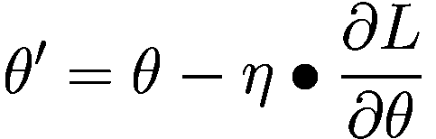

来更新参数

```py
    # Update parameters using assign_sub (subtract the update and assign back to the original parameter)
        w1.assign_sub(lr * grads[0])
        b1.assign_sub(lr * grads[1])
        w2.assign_sub(lr * grads[2])
        b2.assign_sub(lr * grads[3])
        w3.assign_sub(lr * grads[4])
        b3.assign_sub(lr * grads[5])

```

其中，assign_sub()从给定的参数值中减去自身，实现就地更新操作。网络训练误差的变化如图 [4-11](#Fig11) 所示。

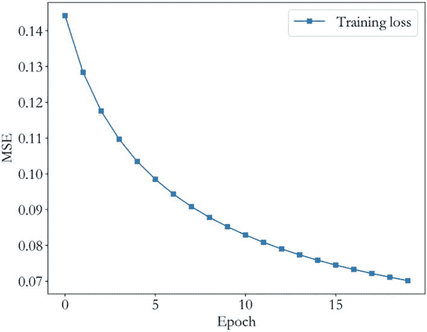

图 4-11

正向计算的训练误差*