# 六、神经网络

> 很难想象哪个大行业不会被人工智能改变。人工智能将在这些行业中发挥主要作用，这一趋势非常明显。
>
> —吴恩达

机器学习的最终目的是找到一组好的参数，让模型从训练集中学习映射关系 *f*<sub>*θ*</sub>:*x*→*y*， *x* ，*y*∈*D*<sup>*train*</sup>，利用训练好的关系预测新的样本。神经网络属于机器学习研究的一个分支。具体指用多个神经元对映射函数 *f*<sub>*θ*</sub> 进行参数化的模型。

## 6.1 感知机

1943 年，美国神经科学家沃伦·斯特吉斯·麦卡洛克和数学逻辑学家沃尔特·皮茨受到生物神经元结构的启发，提出了人工神经元的数学模型，美国神经物理学家弗兰克·罗森布拉特进一步发展并提出了这一模型，被称为感知器模型。1957 年，Frank Rosenblatt 在 IBM-704 计算机上实现了感知器模型。该模型可以完成一些简单的视觉分类任务，如区分三角形、圆形和矩形[1]。

感知器模型的结构如图 6-1 所示。它接受一个长度为 *n* ， *x* = [ *x*<sub>1</sub> ， *x*<sub>2</sub> ，…，*x*<sub>*n*</sub>] 的一维向量，每个输入节点通过一个权重连接 *w*<sub>*i*</sub>，

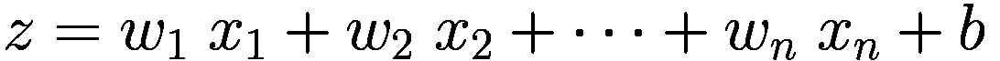

其中， *b* 称为感知器的偏差，一维向量 *w*=【*w*<sub>1</sub>， *w*<sub>2</sub> ，…， *w*<sub>*n*</sub>】称为感知器的权重，而 *z* 称为感知器的净激活值。

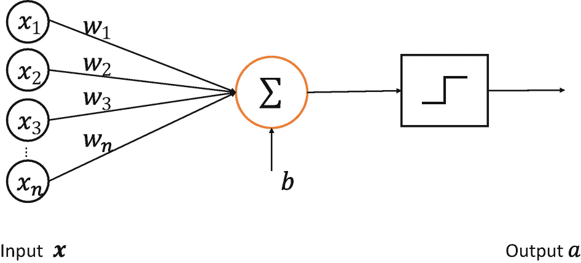

图 6-1 感知模型

前面的公式可以写成向量形式:

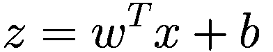

感知器是线性模型，不能处理线性不可分性。激活值通过在线性模型之后添加激活函数来获得:

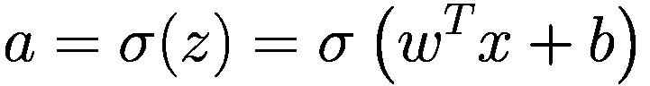

激活函数可以是阶跃函数。如图 6-2 所示，阶跃函数的输出只有 0/1。当 *z* < 0 时，则输出 0，代表类别 0；当 *z* ≥ 0 时，1 为输出，代表类别 1，即:

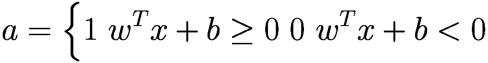

也可以是如图 6-3 所示的符号函数，表达式为:

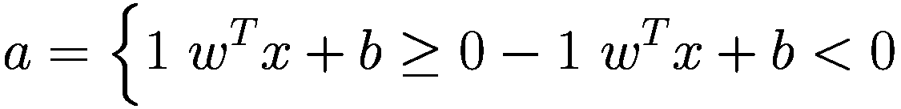

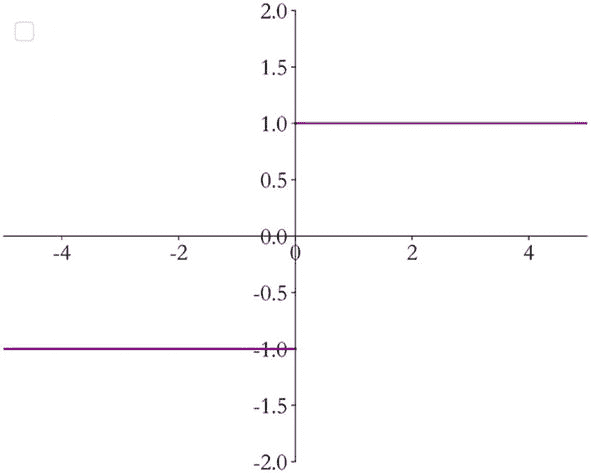

图 6-3 符号函数

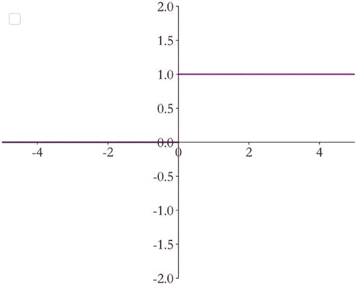

图 6-2 阶跃函数

加入激活函数后，感知器模型可以用来完成二元分类任务。阶跃函数和符号函数在 *z* = 0 处不连续，因此梯度下降算法不能用于优化参数。

为了使感知器模型能够自动从数据中学习，Frank Rosenblatt 提出了一种感知器学习算法，如算法 1 所示。

<colgroup><col class="tcol1 align-left"></colgroup> 

| 算法 1:感知器训练算法 |

| `Initialize`***w =***0***，b =*** **0**重复从训练集中随机选择一个样本(***x***<sub>***I***</sub>，***y***<sub>***I***</sub>)计算输出 ***a =符号***(***w***<sup>***T***</sup>***x***<sub>***I***</sub>***+b***)`If`***a≥y***<sub>***【I】***</sub>**w**<sup>***；【w+y】******【I】***</sup>**【b】**<sup>***；【b+ y】******【I】***</sup>直到达到所需的步数`Output:parameters`***w***`and`*b* |

这里 *η* 是学习率。

虽然感知器模型已经被提出，具有很好的发展潜力，但是马文·李·闵斯基和西蒙·派珀特在 1969 年的《感知器》一书中证明了以感知器为代表的线性模型无法解决线性不可分性问题(XOR ),这直接导致了当时神经网络研究出现谷底。虽然感知器模型不能解决线性不可分问题，但书中也提到可以通过嵌套多层神经网络来解决。

## 6.2 全连接层

感知器模型的不可驱动性严重限制了它的潜力，使它只能解决极其简单的任务。事实上，现代深度学习模型的参数规模有几百万甚至上亿，但核心结构与感知器模型并无太大区别。在感知器模型的基础上，他们用其他光滑连续可导的激活函数代替不连续的阶跃激活函数，并堆叠多个网络层以增强网络的表达能力。

在本节中，我们替换感知器模型的激活函数，并并行堆叠多个神经元，以实现多输入多输出的网络层结构。如图 6-4 所示，两个神经元并行堆叠，即两个激活函数被替换的感知器，形成三个输入节点和两个输出节点的网络层。第一个输出节点是:

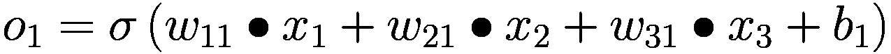

第二个节点的输出是:

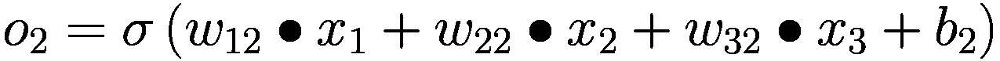

把它们放在一起，输出向量就是 *o* = [ *o*<sub>1</sub> ， *o*<sub>2</sub> 。整个网络层可以用矩阵关系来表示:

![$$ \left[{o}_1\ {o}_2\ \right]=\left[{x}_1\ {x}_2\ {x}_3\ \right]@\left[{w}_{11}\ {w}_{12}\ {w}_{21}\ {w}_{22}\ {w}_{31}\ {w}_{32}\ \right]+\left[{b}_1\ {b}_2\ \right] $$](img/515226_1_En_6_Chapter_TeX_Equ1.png)

(6-1)

那就是:

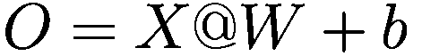

输入矩阵 *X* 的形状定义为 中的 *b* 、 *d*<sub>*，而*</sub> 中的样本数为 *b* 和输入节点数为 *d*<sub>*。权重矩阵 W 的形状定义为[*d*<sub>*in*</sub>，*d*<sub>*out*</sub>]，而输出节点数为*d*<sub>*out*</sub>，偏移向量 b 的形状为[*d*<sub>*out*</sub>]。*</sub>

考虑两个样本![$$ {x}^{(1)}=\left[{x}_1^{(1)},{x}_2^{(1)},{x}_3^{(1)}\right] $$](img/515226_1_En_6_Chapter_TeX_IEq1.png)、![$$ {x}^{(2)}=\left[{x}_1^{(2)},{x}_2^{(2)},{x}_3^{(2)}\right] $$](img/515226_1_En_6_Chapter_TeX_IEq2.png)，前面的等式也可以写成:

![$$ \left[{o}_1^{(1)}\ {o}_2^{(1)}\ {o}_1^{(2)}\ {o}_2^{(2)}\ \right]=\left[{x}_1^{(1)}\ {x}_2^{(1)}\ {x}_3^{(1)}\ {x}_1^{(2)}\ {x}_2^{(2)}\ {x}_3^{(2)}\ \right]@\left[{w}_{11}\ {w}_{12}\ {w}_{21}\ {w}_{22}\ {w}_{31}\ {w}_{32}\ \right]+\left[{b}_1\ {b}_2\ \right] $$](img/515226_1_En_6_Chapter_TeX_Equi.png)

其中输出矩阵 *O* 包含了 *b* 样本的输出，形状为[ *b* ， *d*<sub>*out*</sub> ]。由于每个输出节点都连接到所有输入节点，所以这个网络层称为全连接层，或密集层，其中 *W* 为权重矩阵， *b* 为偏置向量。

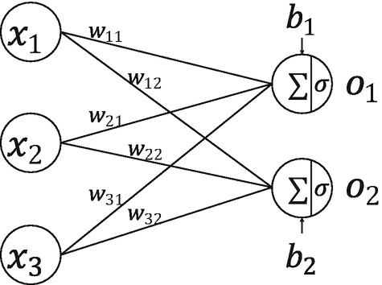

图 6-4 全连接层

### 张量模式实施

在 TensorFlow 中，要实现全连通层，只需要定义权重张量 *W* 和偏置张量 *b* 并使用 TensorFlow 提供的批量矩阵乘法函数 tf.matmul()完成网络层的计算即可。例如，对于一个输入矩阵 *X* 有两个样本，每个样本的输入特征长度*d*<sub>*in*</sub>= 784，输出节点数*d*<sub>*out*</sub>= 256，则权重矩阵 *W* 的形状为【784，256】。偏置向量的形状 *b* 是【256】。相加后，输出层的形状为[2，256]，即每个特征长度为 256 的两个样本的特征。代码实现如下:

```py
In [1]:
x = tf.random.normal([2,784])
w1 = tf.Variable(tf.random.truncated_normal([784, 256], stddev=0.1))
b1 = tf.Variable(tf.zeros([256]))
o1 = tf.matmul(x,w1) + b1  # linear transformation
o1 = tf.nn.relu(o1)  # activation function
Out[1]:
   <tf.Tensor: id=31, shape=(2, 256), dtype=float32, numpy=
   array([[ 1.51279330e+00,  2.36286330e+00,  8.16453278e-01,
           1.80338228e+00,  4.58602428e+00,  2.54454136e+00,...
```

事实上，我们已经多次使用上述代码来实现网络层。

### 层实现

全连接层本质上是矩阵乘法和加法运算。但作为最常用的网络层之一，TensorFlow 有一个更方便的实现方法:layers。dense(单位，激活)。穿过这层。密集类，只需要指定输出节点数(单位)和激活函数类型(activation)。需要注意的是，在第一次操作时，输入节点的数量将根据输入形状来确定，权重张量和偏置张量将根据输入和输出节点的数量自动创建和初始化。由于延迟评估，权重张量和偏差张量不会立即创建。需要构建函数或直接计算来完成网络参数的创建。激活参数指定当前层的激活函数，可以是常用激活函数，也可以是自定义激活函数，也可以指定为 none，即没有激活函数。

```py
In [2]:
x = tf.random.normal([4,28*28])
from tensorflow.keras import layers
# Create fully-connected layer with output nodes and activation function
fc = layers.Dense(512, activation=tf.nn.relu)
h1 = fc(x)  # calculate and return a new tensor
Out[2]:
<tf.Tensor: id=72, shape=(4, 512), dtype=float32, numpy=
array([[0.63339347, 0.21663809, 0\.        , ..., 1.7361937 , 0.39962345, 2.4346168 ],
       ...
```

我们可以用前面代码中的一行代码创建一个全连接层 fc，输出节点数为 512，输入节点数在计算过程中自动获得。代码也自动创建内部权重张量和偏差张量。我们可以通过类内的类成员核和偏差来获得权重和偏差张量对象:

```py
In [3]: fc.kernel # Get the weight tensor
Out[3]:
<tf.Variable 'dense_1/kernel:0' shape=(784, 512) dtype=float32, numpy=
array([[-0.04067389,  0.05240148,  0.03931375, ..., -0.01595572, -0.010759


```python
# Hidden layer 1
w1 = tf.Variable(tf.random.truncated_normal([784, 256], stddev=0.1))
b1 = tf.Variable(tf.zeros([256]))
# Hidden layer 2
w2 = tf.Variable(tf.random.truncated_normal([256, 128], stddev=0.1))
b2 = tf.Variable(tf.zeros([128]))
# Hidden layer 3
w3 = tf.Variable(tf.random.truncated_normal([128, 64], stddev=0.1))
b3 = tf.Variable(tf.zeros([64]))
# Hidden layer 4
w4 = tf.Variable(tf.random.truncated_normal([64, 10], stddev=0.1))
b4 = tf.Variable(tf.zeros([10]))
```

During computation, the output of the previous layer is used as the input to the current layer, and this process is repeated until the last layer, where the output of the output layer is taken as the network's output.

```python
        with tf.GradientTape() as tape:
            # x: [b, 28*28]
            #  Hidden layer 1 forward calculation, [b, 28*28] => [b, 256]
            h1 = x@w1 + tf.broadcast_to(b1, [x.shape[0], 256])
            h1 = tf.nn.relu(h1)
            # Hidden layer 2 forward calculation, [b, 256] => [b, 128]
            h2 = h1@w2 + b2
            h2 = tf.nn.relu(h2)
            # Hidden layer 3 forward calculation, [b, 128] => [b, 64]
            h3 = h2@w3 + b3
            h3 = tf.nn.relu(h3)
            # Output layer forward calculation, [b, 64] => [b, 10]
            h4 = h3@w4 + b4
```

Whether the last layer needs to add an activation function depends on the specific task.

When using TensorFlow's automatic differentiation feature to calculate gradients, the forward computation process needs to be placed in the tf GradientTape() environment, so that the gradient() method of the GradientTape object can be used to automatically calculate the gradient of the parameters, which is updated by the optimizer object.

### Layer-based Implementation

For conventional network layers, implementing through layer methods is more concise and efficient. First, create a new network layer class and specify the activation function type for each layer:

```python
#  Import layers modules
from tensorflow.keras import layers, Sequential

fc1 = layers.Dense(256, activation=tf.nn.relu) #  Hidden layer 1
fc2 = layers.Dense(128, activation=tf.nn.relu) #  Hidden layer 2
fc3 = layers.Dense(64, activation=tf.nn.relu) #  Hidden layer 3
fc4 = layers.Dense(10, activation=None) #  Output layer
x = tf.random.normal([4, 28*28])
h1 = fc1(x)  #  Get output of hidden layer 1
h2 = fc2(h1) #  Get output of hidden layer 2
h3 = fc3(h2) #  Get output of hidden layer 3
h4 = fc4(h3) #  Get the network output
```

For such a network with data forwarding, it can also be encapsulated into a network class object through an ordered container, and the forward calculation function of the class can be called once to complete all the forward calculations of the layers. The implementation is as follows:

```python
from tensorflow.keras import layers, Sequential

#  Encapsulate a neural network through Sequential container
model = Sequential([
    layers.Dense(256, activation=tf.nn.relu) , # Hidden layer 1
    layers.Dense(128, activation=tf.nn.relu) , # Hidden layer 2
    layers.Dense(64, activation=tf.nn.relu) , # Hidden layer 3
    layers.Dense(10, activation=None) , # Output layer
])

```

In the forward computation, it is only necessary to call the large network object once to complete the sequential calculation of all the layers:

```python
out = model(x)
```

### Optimization

We call the computation process from input to output of the neural network forward propagation. The forward propagation process of the neural network is also the process of the data tensor flowing from the first layer to the output layer. That is, starting from the input data, passing the tensor through each hidden layer, until the output is obtained and the error is calculated, which is also the origin of the name of the TensorFlow framework.

The final step of the forward propagation is to complete the error calculation:

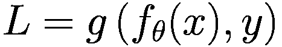

In the formula above, *f*<sub>θT5(。) represents the neural network model with parameters *θ*. *g* (.) is called the error function, which describes the gap between the current network's prediction value *f*<sub>*θ*</sub>(*x*) and the true label *y*. The commonly used mean square error function is an example. *L* is called the network's error or loss, which is generally a scalar. We hope to minimize the training error *L* by learning a set of parameters on the training set *D*<sup>*train*</sup>:

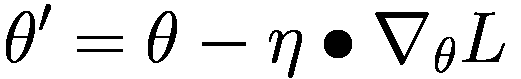

where *η* is the learning rate.

From another perspective, the neural network completes the function of feature dimension transformation. For example, a four-layer MNIST handwritten digit image recognition fully connected network sequentially completes the feature reduction process of 784 → 256 → 128 → 64 → 10. The original features usually have a higher dimension and contain many low-level features and useless information. Through the feature transformation of each layer, the higher dimensions are reduced to lower dimensions, among which usually produce high-level abstract feature information highly relevant to the task, and through the simple logic of these features, specific tasks can be completed, such as image classification.

The number of network parameters is an important indicator of the scale of the network. So how to calculate the parameter amount of the fully connected layer? Consider a network layer, weight matrix *W*, bias vector *b*, input feature length *d*<sub>*in*</sub>, output feature length *d*<sub>*out*</sub>. The number of parameters of *W* is *d*<sub>*in*</sub>∙*d*<sub>*out*</sub>. Adding the bias parameter, the total number of parameters is *d*<sub>*in*</sub>∙*d*<sub>*out*</sub>+*d*<sub>*out*</sub>. For a multi-layer fully connected neural network, such as 784 → 256 → 128 → 64 → 10, the expression of the total parameter amount is:

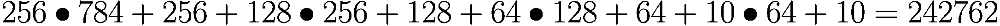

The fully connected layer is the most basic type of neural network. This is very important for the research of subsequent neural network models, such as convolutional neural networks and recurrent neural networks. By learning other network types, we will find that they are more or less derived from the idea of fully connected layer networks. Due to the outstanding contributions of Geoffrey Hinton, Yoshua Bengio, and Yann LeCun to the forefront research of neural networks, they were awarded the Turing Prize in 2018 (Figure 6-6, from right to left: Yann LeCun, Geoffrey Hinton, Yoshua Bengio).


Figure 6-6

2018 Turing Prize winners <sup>1</sup>

## 6.4 Activation Functions

Next, we introduce common activation functions in neural networks. Unlike step functions and sign functions, these functions are smooth and differentiable, and are suitable for gradient descent algorithms.

### Sigmoid

The Sigmoid function, also known as the logistic function, is defined as follows:

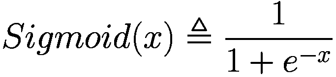

One of its excellent features is that it can compress the input *x* ∈ *R* to an interval *x* ∈ (0, 1). The values in the interval (0, 1) are often used to represent the following meanings in machine learning:

*   **Probability distribution** The output in the interval (0, 1) matches the range of probability distributions. The output can be converted to a probability through the Sigmoid function.
*   **Signal strength** The range of 0~1 can be understood as the strength of a signal, such as the color intensity of a pixel: 1 represents the strongest color of the current channel, and 0 represents no color in the current channel. It can also be used to represent the current gate state, that is, 1 represents open, and 0 represents closed.

The Sigmoid function is continuously differentiable, as shown in Figure 6-7. Gradient descent algorithms can be directly used for optimization.

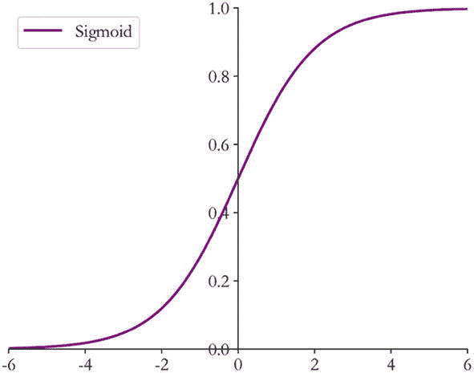

Figure 6-7

Sigmoid function

In TensorFlow, the Sigmoid function can be implemented through the tf.nn.sigmoid function as follows:

```python
In [7]:x = tf.linspace(-6.,6.,10)
x # Create input vector -6~6
Out[7]:
<tf.Tensor: id=5, shape=(10,), dtype=float32, numpy=
array([-6.       , -4.6666665, -3.3333333, -2.       , -0.6666665,
        0.666667 ,  2.       ,  3.333334 ,  4.666667 ,  6.       ]...
In [8]:tf.nn.sigmoid(x) # Pass x to Sigmoid function
Out[8]:
<tf.Tensor: id=7, shape=(10,), dtype=float32, numpy=
array([0.00247264, 0.00931597, 0.03444517, 0.11920291, 0.33924365, 0.6607564 , 0.8807971 , 0.96555483, 0.99068403, 0.9975274 ],
      dtype=float32)>
```

As you can see, the element values in the vector are mapped to the interval (0, 1).
```


# 网络最后一层设计

除了所有的隐藏层，网络最后一层完成了维度变换和特征提取的功能，它也作为一个输出层。需要根据具体的任务来决定是否使用激活功能以及使用什么类型的激活功能。

我们将根据输出值的范围对讨论进行分类。常见的输出类型包括:

*   *o*<sub>*I*</sub>∈*R*<sup>*d*</sup>输出属于整个实数空间，或实数空间的某一部分，如函数值趋势预测、年龄预测问题。

*   *o*

*   *o*<sub>*I*</sub>∈【0，1】，∈<sub>*I*</sub>*o*<sub>*I*</sub>= 1 输出值落在区间[0，1]内，所有输出值之和为 1。常见的问题包括多分类问题，如 MNIST 手写数字图片识别，该图片属于十类的概率之和应为 1。

*   *o*<sub>I∈[1，1]输出值在-1 和 1 之间。</sub>

### 6.5.1 常见实数空间

这类问题比较常见。比如正弦函数曲线、年龄预测、股票走势预测都属于连续实数空间的整体或部分，输出层可能没有激活函数。误差的计算直接基于最后一层的输出 *o* 和真值 *y* 。例如，均方误差函数用于测量输出值 *o* 和真实值 *y* 之间的距离:

```
L=g(o,y)
```

其中 *g* 代表特定的误差计算函数，如 MSE。

### [0，1]区间

输出值属于区间[0，1]也很常见，比如图像生成，二值分类问题。在机器学习中，图像像素值一般归一化为区间[0，1]。如果直接使用输出图层的值，像素值范围将分布在整个实数空间中。为了将像素值映射到有效实数空间[0，1]，需要在输出层之后添加合适的激活函数。在这里，Sigmoid 函数是一个很好的选择。

同样，对于二进制分类问题，比如硬币的正面和反面的预测，输出层只能是一个节点就是一个事件 A 发生的概率 *P* ( *x* )给网络输入 x，如果我们用网络的输出标量 *o* 来表示正面事件发生的概率，那么负面事件发生的概率就是 1*o*。网络结构如图 6-12 所示。

```
P(x)=o
P(x)=1-o
```

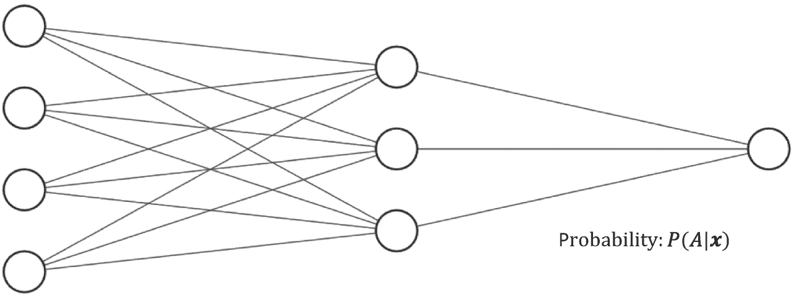

图 6-12

具有单个输出节点的二元分类网络

在这种情况下，只需在输出图层的值后添加 Sigmoid 函数，即可将输出转换为概率值。对于二进制分类问题，除了用单个输出节点来表示事件 A *P* ( *x* )的发生概率外，还可以分别预测 *P* ( *x* )和 *P* ( *x* )，并满足约束条件:

```
P(x)+P(x)=1
```

其中表示事件 a 的相反事件，如图 6-13 所示，二元分类网络的输出层为两个节点。第一个节点的输出值代表事件 A * P* ( *x* )发生的概率，第二个节点的输出值代表相反事件 *P* ( *x* )发生的概率。该函数只能将单个值压缩到区间(0，1)，并且不考虑两个节点值之间的关系。我们希望它们除了满足*o*<sub>*I*</sub>∈【0，1】之外，还能满足概率之和为 1:

```
∑_i{o}_i=1
```

这种情况就是下一节要介绍的问题设置。

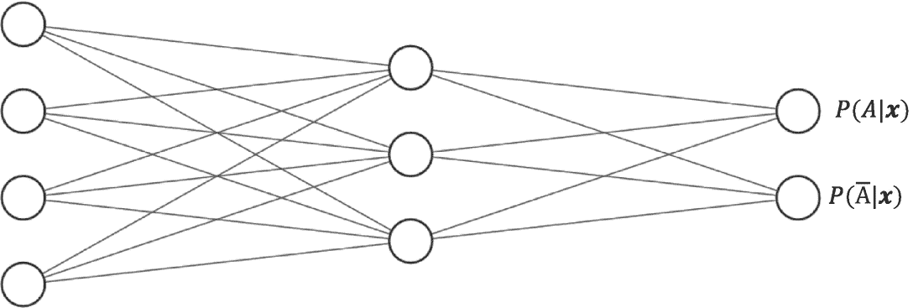

图 6-13

具有两个输出的二元分类网络

### 6.5.3 和为 1 的[0，1]区间

对于输出值*o*<sub>I</sub>∈【0，1】，且所有输出值之和为 1 的情况，是多分类最常见的问题。如图 6-15 所示，输出层的每个输出节点代表一个类别。图中的网络结构用于处理三种分类任务。三个节点的输出值分布代表当前样本属于类别 A、B、C 的概率: *P* ( *x* )、*P*(*B*|*x*)、*P*(*C*|*x*)。因为多分类问题中的样本只能属于其中一个类别，所以所有类别的概率之和应该是 1。

如何实现这个约束逻辑？这可以通过向输出层添加 Softmax 函数来实现。Softmax 函数定义为:

```
Softmax(z_i) ≡ e^{z_i}/∑_{j=1}^{d_{out}}e^{z_j}
```

Softmax 函数不仅可以将输出值映射到区间[0，1]，还可以满足所有输出值之和为 1 的特性。如图 6-14 中的例子所示，输出层的输出为[2.0，1.0，0.1]。通过 Softmax 函数后，输出变为[0.7，0.2，0.1]。每个值代表当前样本属于每个类别的概率，概率值之和为 1。输出层的输出可以通过 Softmax 函数转换为类别概率，该函数在分类问题中非常常用。

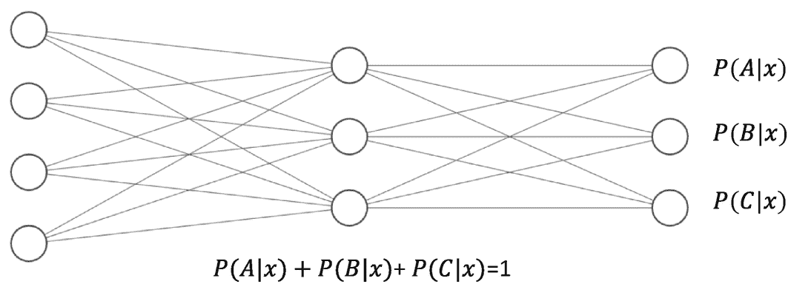

图 6-15

多分类网络结构

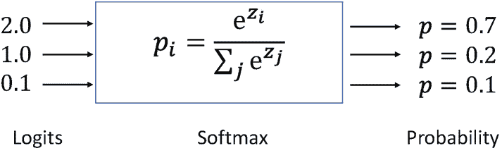

图 6-14

Softmax 函数示例

在 TensorFlow 中，Softmax 函数可以通过 tf.nn.softmax 实现:

```py
In [12]: z = tf.constant([2.,1.,0.1])
tf.nn.softmax(z)
Out[12]:
<tf.Tensor: id=19, shape=(3,), dtype=float32, numpy=array([0.6590012, 0.242433 , 0.0985659], dtype=float32)>
```

与密集图层类似，Softmax 函数也可以用作网络层类。通过图层添加 Softmax 图层很方便。Softmax (axis = -1)类，其中 axis 参数指定要计算的维度。

在 Softmax 函数的数值计算过程中，由于输入值较大，容易出现数值溢出现象。当计算交叉熵时，可能发生类似的问题。对于数值计算的稳定性，TensorFlow 提供了一个统一的接口，同时实现 Softmax 和交叉熵损失函数，并处理数值不稳定的异常。通常建议使用这些接口函数。函数接口为 TF . keras . loss . categorial _ cross entropy(y_true，y_pred，from_logits = False)，其中 y _ true 表示独热编码真标签，y_pred 表示网络的预测值。当 from_logits 设置为 True 时，y_pred 表示没有经过 Softmax 函数的变量 z。当 from_logits 设置为 False 时，y_pred 表示为 Softmax 函数的输出。对于数值计算稳定性，一般将 from_logits 设置为 True，这样 TF . keras . loss . category _ cross entropy 会在内部进行 Softmax 函数计算，不需要在模型中显式显式调用 Softmax 函数。例如:

```py
In [13]:
z = tf.random.normal([2,10]) # Create output of the output layer
y_onehot = tf.constant([1,3]) # Create real label
y_onehot = tf.one_hot(y_onehot, depth=10) # one-hot encoding
# The Softmax function is not explicitly used in output layer, so
# from_logits=True. categorical_cross-entropy function will use Softmax
# function first in this case.
loss = keras.losses.categorical_crossentropy(y_onehot,z,from_logits=True)
loss = tf.reduce_mean(loss) # calculate the loss
loss
Out[13]:
<tf.Tensor: id=210, shape=(), dtype=float32, numpy=2.4201946>
```

除了功能界面，你还可以使用损耗。CategoricalCrossentropy(from _ logits)类方法来同时计算 Softmax 和交叉熵损失函数。例如:

```py
In [14]:
criteon = keras.losses.CategoricalCrossentropy(from_logits=True)
loss = criteon(y_onehot,z)
loss
Out[14]:
<tf.Tensor: id=258, shape=(), dtype=float32, numpy=2.4201946>
```

### 区间(-1，1)

如果希望输出值的范围以区间(1，1)分布，只需使用双曲正切函数即可:

```py
In [15]:
x = tf.linspace(-6.,6.,10)
tf.tanh(x)
Out[15]:
<tf.Tensor: id=264, shape=(10,), dtype=float32, numpy=
array([-0.9999877 , -0.99982315, -0.997458  , -0.9640276 , -0.58278286, 0.5827831 ,  0.9640276 ,  0.997458  ,  0.99982315,  0.9999877 ],
      dtype=float32)>
```

输出层的设计具有一定的灵活性，可以根据实际应用场景进行设计，并充分利用现有激活功能的特点。

## 6.6 误差计算

建立模型结构后，下一步是选择合适的误差函数来计算误差。常见的误差函数有均方误差、交叉熵、KL 散度和铰链损耗。其中，均方误差函数和交叉熵函数在深度学习中较为常见。均方差函数主要用于回归问题，交叉熵函数主要用于分类问题。

### 均方差函数

均方误差(MSE)函数将输出向量和真实向量映射到笛卡尔坐标系中的两个点，通过计算这两个点之间的欧几里德距离(准确地说，欧几里德距离的平方)来测量这两个向量之间的差异:

```
MSE(y,o) ≡ 1/(d_{out}) ∑_{i=1}^{d_{out}}(y_i-o_i)²
```

MSE 的值总是大于或等于 0。当 MSE 函数达到最小值 0 时，输出等于真实标签，神经网络的参数达到最优状态。

MSE 函数广泛用于回归问题。实际上，MSE 函数也可以用于分类问题。在 TensorFlow 中，MSE 计算可以以函数或层的方式实现。例如，使用如下函数实现 MSE 计算:

```py
In [16]:
o = tf.random.normal([2,10]) # Network output
y_onehot = tf.constant([1,3]) # Real label
y_onehot = tf.one_hot(y_onehot, depth=10)
loss = keras.losses.MSE(y_onehot, o) # Calculate MSE
loss
Out[16]:
<tf.Tensor: id=27, shape=(2,), dtype=float32, numpy=array([0.779179 , 1.6585705], dtype=float32)>
```

特别是，MSE 函数返回每个样本的均方误差。您需要在样本维度上再次求平均值，以获得平均样本的均方误差。实现如下:

```py
In [17]:
loss = tf.reduce_mean(loss)
loss
Out[17]:
<tf.Tensor: id=30, shape=(), dtype=float32, numpy=1.2188747>
```

它也可以在层模式下实现。对应的类是 keras . loss . meansquadererror()。和其他类一样，可以调用 __call__ 函数来完成正向计算。代码如下:

```py
In [18]:
criteon = keras.losses.MeanSquaredError()
loss = criteon(y_onehot,o)
loss
Out[18]:
<tf.Tensor: id=54, shape=(), dtype=float32, numpy=1.2188747>
```

### 6.6.2 交叉熵误差函数

在引入交叉熵损失函数之前，我们先介绍一下信息学中熵的概念。1948 年，Claude Shannon 将热力学中熵的概念引入信息论，用来度量信息的不确定性。熵在信息科学中也叫信息熵或香农熵。熵越大，不确定性越大，信息量越大。分布的熵 *P* ( *i* )定义为:

```
H(P) ≡ -∑_i P(i) log P(i)
```

事实上，也可以使用其他基函数。例如，对于四类分类问题，如果样本的真实标签是类别 4，那么标签的一键编码就是[0，0，0，1]。即这张图片的分类是唯一确定的，属于不确定度为 0 的类别 4，其熵可以简单计算为:

```
-0•0-0•0-0•0-1•1=0
```

也就是说，对于某个分布，熵为 0，不确定性最低。

如果预测的概率分布是[0.1，0.1，0.1，0.7]，那么它的熵可以计算为:

```
-0.1•0.1-0.1•0.1-0.1•0.1-0.7•0.7≈1.356
```

考虑一个随机分类器，它对每个类别的预测概率是相等的:[0.25，0.25，0.25，0.25]。同理，可以计算出它的熵约为 2，这种情况下的不确定性略大于前一种情况。

因为，熵总是大于等于 0。当熵达到最小值 0 时，不确定度为 0。分类问题的一热码分布就是


## 6.7 神经网络的类型

### 6.7.1 卷积神经网络

如何识别、分析和理解图片、视频等数据是计算机视觉的一个核心问题。全连接层在处理高维图片和视频数据时，往往存在网络参数庞大、训练非常困难等问题。Yann Lecun 于 1986 年提出了卷积神经网络(CNN)。随着深度学习的繁荣，卷积神经网络在计算机视觉中的性能已经大大超越了其他算法，呈现出统治计算机视觉领域的趋势。用于图像分类的流行模型包括 AlexNet、VGG、GoogLeNet、ResNet 和 DenseNet。对于客观识别，有 RCNN、快速 RCNN、更快 RCNN、掩蔽 RCNN、YOLO 和 SSD。我们将在第十章中详细介绍卷积神经网络的原理。

### 6.7.2 循环神经网络

除了具有空间结构的图片、视频等数据，序列信号也是一种非常常见的数据类型。最有代表性的序列信号之一是文本。如何处理和理解文本数据是自然语言处理的一个核心问题。由于缺乏记忆机制和处理不定长信号的能力，卷积神经网络不擅长处理序列信号。在 Yoshua Bengio，Jürgen Schmidhuber 等人的不断研究下，循环神经网络(RNN)被证明在处理序列信号方面非常出色。1997 年，Jürgen Schmidhuber 提出了 LSTM 网络。作为 RNN 的变体，它更好地克服了 RNN 缺乏长期记忆和不擅长处理长序列的问题。LSTM 在自然语言处理中得到了广泛应用。基于 LSTM 模型，Google 提出了机器翻译的 Seq2Seq 模型，并成功应用于 Google 神经机器翻译系统(GNMT)中。其他 RNN 变体包括 GRU 和双向 RNN。我们将在第十一章中详细介绍循环神经网络的原理。

### 6.7.3 注意机制网络

RNN 不是自然语言处理的最终解决方案。近年来，注意力机制的提出，克服了 RNN 的不足，如训练不稳定、难以并行化等。在自然语言处理、图像生成等领域逐渐崭露头角。注意机制最初是在图像分类任务上提出的，但逐渐开始在自然语言处理中变得更加有效。2017 年，谷歌提出了第一个使用纯注意力机制的网络模型 Transformer，随后基于 Transformer 模型，又相继提出了 GPT、伯特、GPT-2 等一系列用于机器翻译的注意力网络模型。在其他领域，基于注意机制尤其是自我注意机制的网络也取得了不错的效果，比如 BigGAN 模型。

### 6.7.4 图形卷积神经网络

图片和文本等数据具有规则的空间或时间结构，称为欧几里德数据。卷积神经网络和循环神经网络非常擅长处理这种类型的数据。对于像一系列不规则的空间拓扑、社交网络、通讯网络、蛋白质分子结构这样的数据，那些网络似乎无能为力。2016 年，Thomas Kipf 等人提出了基于一阶近似谱卷积算法的图卷积网络(GCN)模型。GCN 算法实现简单，可以从空间一阶邻居信息聚合的角度直观地理解，因此在半监督任务上取得了良好的效果。随后，一系列网络模型被提出，如 GAT、EdgeConv 和 DeepGCN。

## 6.8 汽车油耗预测实践

在本节中，我们将使用全连接网络模型来完成汽车 MPG(每加仑英里数)的预测。

### 数据集

我们使用 auto MPG 数据集，其中包括各种车辆性能指标的真实数据和其他因素，如气缸数量、重量和马力。数据集的前五项如表 6-1 所示。此外，数字字段 origin 表示类别，其他字段都是数字类型。对于原产地，1 表示美国，2 表示欧洲，3 表示日本。

表 6-1

自动 MPG 数据集的前五项

| 每加仑行驶英里数 | 圆筒 | 排水量 | 马力 | 重量 | 加速 | 年型 | 起源 |
| --- | --- | --- | --- | --- | --- | --- | --- |
| Eighteen | eight | Three hundred and seven | One hundred and thirty | Three thousand five hundred and four | Twelve | Seventy | one |
| Fifteen | eight | Three hundred and fifty | One hundred and sixty-five | Three thousand six hundred and ninety-three | Eleven point five | Seventy | one |
| Eighteen | eight | Three hundred and eighteen | One hundred and fifty | Three thousand four hundred and thirty-six | Eleven | Seventy | one |
| Sixteen | eight | Three hundred and four | One hundred and fifty | Three thousand four hundred and thirty-three | Twelve | Seventy | one |
| Seventeen | eight | Three hundred and two | One hundred and forty | Three thousand four hundred and forty-nine | Ten point five | Seventy | one |

自动 MPG 数据集总共包括 398 条记录。我们将数据集从 UCI 服务器下载并读取到 DataFrame 对象中。代码如下:

```py
# Download the dataset online
dataset_path = keras.utils.get_file("auto-mpg.data", "http://archive.ics.uci.edu/ml/machine-learning-databases/auto-mpg/auto-mpg.data")
# Use Pandas library to read the dataset
column_names = ['MPG','Cylinders','Displacement','Horsepower','Weight', 'Acceleration', 'Model Year', 'Origin']
raw_dataset = pd.read_csv(dataset_path, names=column_names,
                      na_values = "?", comment='\t',
                      sep=" ", skipinitialspace=True)
dataset = raw_dataset.copy()
# Show some data
dataset.head()

```

原始表中的数据可能包含丢失的值。这些记录项目需要清除:

```py
dataset.isna().sum() # Calculate the number of missing values
dataset = dataset.dropna() # Drop missing value records
dataset.isna().sum() # Calculate the number of missing values again

```

清除后，数据集记录项减少到 392 项。

由于 origin 字段是分类数据，我们首先将其删除，然后将其转换为三个新字段，USA、Europe 和 Japan，这三个字段表示它们是否来自该原点:

```py
origin = dataset.pop('Origin')
dataset['USA'] = (origin == 1)*1.0
dataset['Europe'] = (origin == 2)*1.0
dataset['Japan'] = (origin == 3)*1.0
dataset.tail()

```

将数据分为训练(80%)和测试(20%)数据集:

```py
train_dataset = dataset.sample(frac=0.8,random_state=0)
test_dataset = dataset.drop(train_dataset.index)

```

将 MPG 移出并使用其真正的标签:

```py
train_labels = train_dataset.pop('MPG')
test_labels = test_dataset.pop('MPG')

```

计算训练集每个字段值的均值和标准差，完成数据的标准化，通过 norm()函数；代码如下:

```py
train_stats = train_dataset.describe()
train_stats.pop("MPG")
train_stats = train_stats.transpose()
# Normalize the data
def norm(x): # minus mean and divide by std
  return (x - train_stats['mean']) / train_stats['std']
normed_train_data = norm(train_dataset)
normed_test_data = norm(test_dataset)

```

打印训练和测试数据集的形状:

```py
print(normed_train_data.shape,train_labels.shape)
print(normed_test_data.shape, test_labels.shape)
(314, 9) (314,) # 314 records in training dataset with 9 features.
(78, 9) (78,) # 78 records in training dataset with 9 features.

```

创建 TensorFlow 数据集:

```py
train_db = tf.data.Dataset.from_tensor_slices((normed_train_data.values, train_labels.values))
train_db = train_db.shuffle(100).batch(32) # Shuffle and batch

```

我们可以通过简单观察数据集中各场之间的分布来观察各场对 MPG 的影响，如图 6-16 所示。大致可以观察到，汽车排量、重量、MPG 之间的关系比较简单。随着排量或重量的增加，汽车的 MPG 降低，能耗增加；缸数越少，MPG 就能越好，符合我们的生活经验。

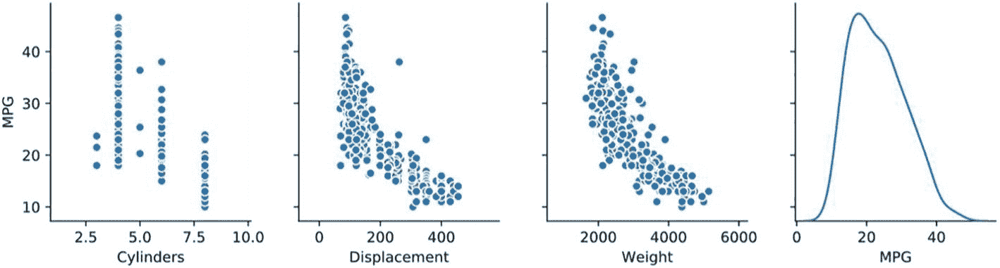

图 6-16

特征之间的关系

### 6.8.2 创建网络

考虑到自动 MPG 数据集的规模较小，我们仅创建一个三层全连接网络来完成 MPG 预测任务。有九个输入要素，因此第一层的输入节点数为 9。第一层和第二层的输出节点数设计为 64 和 64。由于预测值只有一种，所以输出层的输出节点设计为 1。因为 MPG 属于实数空间，所以可以不增加输出层的激活功能。

我们将网络实现为自定义的网络类。我们只需要在初始化函数中创建每个子网络层，在正向计算函数中实现自定义网络类的计算逻辑。自定义网络类继承自 keras.Model，这也是自定义网络类的标准编写方法，为了方便使用 keras 提供的 trainable_variables、save_weights 等各种方便的函数。模型类，实现如下:

```py
class Network(keras.Model):
    # regression network
    def __init__(self):
        super(Network, self).__init__()
        # create 3 fully-connected layers
        self.fc1 = layers.Dense(64, activation='relu')
        self.fc2 = layers.Dense(64, activation='relu')
        self.fc3 = layers.Dense(1)

    def call(self, inputs, training=None, mask=None):
        # pass through the 3 layers sequentially
        x = self.fc1(inputs)
        x = self.fc2(x)
        x = self.fc3(x)

        return x

```

### 培训和测试

创建主网络模型类后，让我们实例化网络对象并创建优化器，如下所示:

```py
model = Network() # Instantiate the network
# Build the model with 4 batch and 9 features
model.build(input_shape=(4, 9))
model.summary() # Print the network
# Create the optimizer with learning rate 0.001
optimizer = tf.keras.optimizers.RMSprop(0.001)

```

接下来，实现网络培训部分。通过 Epoch 和 Step 组成的双层循环训练网络，共训练 200 个 Epoch。

```py
for epoch in range(200): # 200 Epoch
    for step, (x,y) in enumerate(train_db): # Loop through training set once
        # Set gradient tape
        with tf.GradientTape() as tape:
            out = model(x) # Get network output
            loss = tf.reduce_mean(losses.MSE(y, out)) # Calculate MSE
            mae_loss = tf.reduce_mean(losses.MAE(y, out)) # Calculate MAE

        if step % 10 == 0: # Print training loss every 10 steps
            print(epoch, step, float(loss))
        # Calculate and update gradients
        grads = tape.gradient(loss, model.trainable_variables)
        optimizer.apply_gradients(zip(grads, model.trainable_variables))

```

对于回归问题，除了均方误差(MSE)之外，平均绝对误差(MAE)也可以用来衡量模型的性能。


我们可以在训练和测试数据集的每个历元结束时记录 MAE，并绘制如图 6-17 所示的变化曲线。


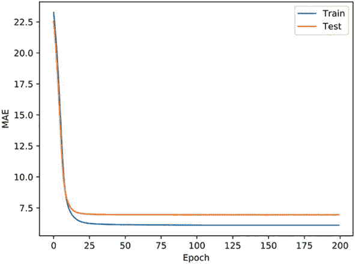

# 图 6-17

MAE 曲线

可以看出，当训练达到大约第 25 个历元时，MAE 的下降变得较慢，其中训练集的 MAE 继续缓慢下降，但测试集的 MAE 几乎保持不变，所以我们可以在第 25 个历元左右结束训练，利用此时的网络参数来预测新的输入。

## 参考文献

1. 尼克，2017。人工智能简史。

2. X.Glorot，A. Bordes 和 Y. Bengio，“深度稀疏整流器神经网络”，*第十四届人工智能和统计国际会议论文集*，美国佛罗里达州劳德代尔堡，2011 年。

3. J.Mizera-Pietraszko 和 P. Pichappan，《实时智能系统讲义》，施普林格国际出版公司，2017 年。

<aside aria-label="Footnotes" class="FootnoteSection" epub:type="footnotes">Footnotes 1

图片来源:`www.theverge.com/2019/3/27/18280665/ai-godfathers-turing-award-2018-yoshua-bengio-geoffrey-hinton-yann-lecun`

 </aside>
