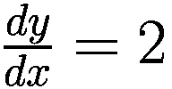
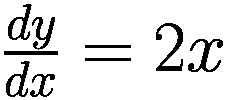
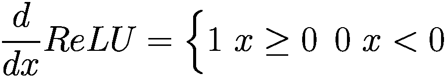
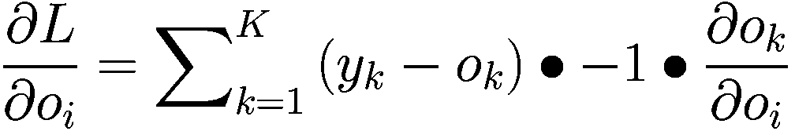
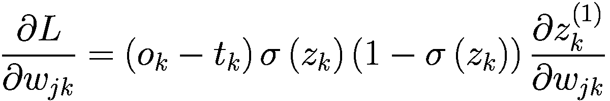
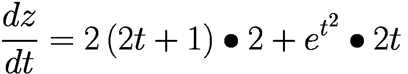
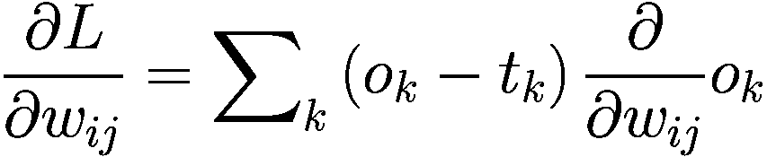
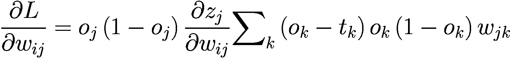
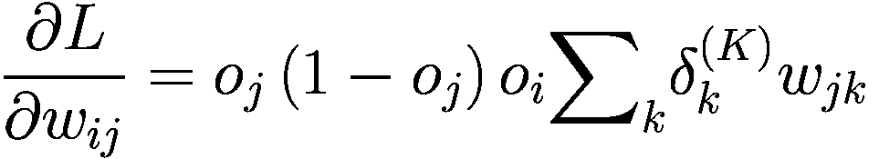
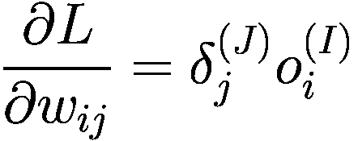

# 七、反向传播算法

> 回顾的时间越长，就能向前看的越远。
> 
> —丘吉尔

在第六章中，我们已经系统地介绍了基本的神经网络算法:从输入输出的表示出发；介绍感知器模型、多输入多输出全连接层；然后扩展到多层神经网络。我们还介绍了不同场景下输出层的设计和常用的损失函数及其实现。

本章我们将从理论层面学习神经网络中的核心算法之一:误差反向传播(BP)。实际上，反向传播算法早在 60 年代初就已经提出，但一直没有引起业界的重视。1970 年，Seppo Linnainmaa 在其硕士论文中提出了自动链推导方法，并实现了反向传播算法。1974 年，Paul Werbos 在其博士论文中首次提出了将反向传播算法应用于神经网络的可能性，但遗憾的是，Paul Werbos 并未发表后续的相关研究。事实上，Paul Werbos 认为这种研究思路对于解决感知机问题是有意义的，但由于人工智能的寒冬，社区普遍失去了解决那些问题的信念。直到大约 10 年后的 1986 年，Geoffrey Hinton 等人将反向传播算法应用于神经网络[1]，使得反向传播算法在神经网络界轰轰烈烈。

通过深度学习框架的自动推导和自动参数更新功能，算法设计人员无需深入了解反向传播算法就可以构建复杂的模型和网络，并可以通过调用优化工具轻松训练网络模型。然而，反向传播算法和梯度下降算法是神经网络的核心，深入理解其原理非常重要。我们先回顾导数、梯度等数学概念，然后推导常用的激活函数和损失函数的梯度形式，开始逐步推导感知器和多层神经网络的梯度传播方法。如果你想刷新你的记忆或者学习更多的线性代数和微积分知识，[2]和[3]有更多的细节。

## 7.1 导数和梯度

高中的时候我们接触到了导数的概念，定义为当自变量 *x* 产生轻微扰动时∈*x*趋近于零时函数输出值的增量∈*y*与自变量 *x* 的增量∈*x*之比的极限:


函数 *f* ( *x* )的导数可以写成*f*<sup>’</sup>(*x*)或者。从几何的角度来说，一元函数的导数就是这里函数的切线的斜率，也就是函数值沿着 *x* 方向的变化率。考虑一个物理学上的例子，比如自由落体运动的位移函数的表达式。对时间的导数是。考虑到速度 *v* 定义为位移的变化率，那么位移对时间的导数就是速度，即 *v* = *gt* 。

事实上，导数是一个非常宽泛的概念。因为我们之前遇到的函数大多是一元函数，所以自变量只有两个方向: *x* <sup>+</sup> 和*x*<sup>-</sup>。当函数的自变量个数大于 1 时，函数导数的概念推广到函数值在任意方向的变化率。导数本身是标量，没有方向，但是导数表征了函数值在某个方向上的变化率。在这些任意方向中，沿着坐标轴的几个方向比较特殊，也叫偏导数。对于一元函数，导数写成。对于多元函数的偏导数，记为。偏导数是导数的特例，没有方向。

考虑一个本质上是多元函数的神经网络模型，比如 shape [784，256]的一个权重矩阵 *W* ，其中包含 784 × 256 的连接权重，我们需要求 784 × 256 的偏导数。需要注意的是，在数学表达习惯中，要讨论的自变量一般记为 *x* ，但在神经网络中，一般用来表示输入，如图片、文本、语音数据等。网络的自变量是网络参数集 *θ* = { *w* <sub>1</sub> 、 *b* <sub>1</sub> 、 *w* <sub>2</sub> 、 *b* <sub>2</sub> 、⋯}.当使用梯度下降算法优化网络时，需要请求网络的所有偏导数。所以我们也关注误差函数 *L* 沿自变量 *θ* <sub>*i*</sub> 方向输出的导数，即。用向量形式写出函数的所有偏导数:


梯度下降算法可以以矢量的形式更新:


*η是*学习率。梯度下降算法一般是求函数 *L* 的最小值，有时也希望求函数的最大值，这就需要按如下方式更新梯度:


这种更新方法称为梯度上升算法。梯度下降算法和梯度上升算法在原理上是相同的。一个是向渐变的反方向更新，一个是向渐变的方向更新。都需要解偏导数。这里向量称为函数的梯度，由所有偏导数组成，代表方向。梯度的方向表示函数值上升最快的方向，梯度的反向表示函数值下降最快的方向。

梯度下降算法不能保证全局最优解，这主要是由于目标函数的非凸性造成的。考虑图 7-1 中的非凸函数。深蓝色区域是最小区域。不同的优化轨迹可能获得不同的最优数值解。这些数值解不一定是全局最优解。


图 7-1

非凸函数示例

神经网络模型表达式通常非常复杂，模型参数可达数千万或上亿级。几乎所有的神经网络优化问题都依赖于深度学习框架来自动计算网络参数的梯度，然后使用梯度下降来迭代优化网络参数，直到性能满足要求。深度学习框架中实现的主要算法是反向传播和梯度下降算法。所以了解这两种算法的原理有助于理解深度学习框架的作用。

在介绍多层神经网络的反向传播算法之前，我们首先介绍导数的公共属性、公共激活函数的梯度导数和损失函数，然后推导多层神经网络的梯度传播规律。

## 7.2 衍生产品的共同属性

本节介绍常用函数的求导规则和示例说明，为神经网络相关函数的求导做铺垫。

### 7.2.1 常见衍生工具

*   常数函数 *c* 的导数为 0。比如 *y* = 2 的导数就是。

*   线性函数 *y* = *ax* + *c* 的导数为 *a* 。比如 *y* = 2 *x* + 1 的导数就是。

*   函数*x*<sup>T3a</sup>的导数为*ax*<sup>*a*—1</sup>。比如*y*=*x*<sup>2</sup>的导数就是。

*   指数函数的导数*a*<sup>T3】xT5】是*a*<sup>*x*</sup>*ln ln a*。比如*y*=*e*<sup>*x*</sup>的导数就是</sup>

*   对数函数 *x* 的导数为。比如 *y* = *lnln x* 的导数就是

### 7.2.2 衍生产品的共同属性

*   (*f*+*g*)<sup>’</sup>=*f*<sup>’</sup>+*g*<sup>’</sup>

*   (*fg*)<sup>=*【F5】<sup>*【g】*+</sup>*【f】</sup>

*   、*g*0

*   Consider function of function *f* (*g*(*x*)), let *u* = *g*(*x*), the derivative is:

    

### 7.2.3 实践衍生产品发现

考虑目标函数*l*=*x*⋅*w*<sup>2</sup>+*b*<sup>2</sup>，其导数为:


考虑目标函数*l*=*x*⋅*e*<sup>*w*</sup>+*e*<sup>*b*</sup>，其导数为:


考虑到目标函数*L*=*y*-(*xw*+*b*)<sup>2</sup>=[(*xw*+*b*)-y*-<sup>2</sup>，设*g*=*xw*+*b**

 *考虑目标函数*L*=*AlN*(*xw*+*b*)，设*g*=*xw*+*b*，导数为:


图 7-2

Sigmoid 函数及其导数

为了帮助理解反向传播算法的实现细节，本章选择不使用 TensorFlow 的自动求导功能。本章使用 Numpy 实现了一个由反向传播算法优化的多层神经网络。这里，Sigmoid 函数的导数由 Numpy 实现:

```py
import numpy as np # import numpy library
def sigmoid(x): # implement sigmoid function
    return 1 / (1 + np.exp(-x))

def derivative(x):  # calculate derivative of sigmoid
    # Using the derived expression of the derivatives
    return sigmoid(x)*(1-sigmoid(x))

```

### ReLU 函数的导数

回忆一下 ReLU 函数的表达式:


其导数的推导很简单:



可以看出 ReLU 函数的导数计算比较简单。当 x 大于或等于零时，导数值总是 1。在反向传播过程中，既不会放大梯度，造成梯度爆炸，也不会缩小梯度，造成梯度消失现象。ReLU 函数的导数曲线如图 7-3 所示。


图 7-3

ReLU 函数及其导数

在 ReLU 函数被广泛使用之前，神经网络中的激活函数大多是 Sigmoid。然而，Sigmoid 函数倾向于梯度分散。当网络的层数增加时，由于梯度值变得很小，网络的参数不能有效地更新。导致无法训练更深层次的神经网络，导致神经网络的研究停留在浅层次。ReLU 函数的引入，很好地缓解了梯度分散现象，神经网络的层数可以达到更深的层。比如 AlexNet 中使用 ReLU 激活功能，层数达到八层。一些超过 100 层的卷积神经网络也大多使用 ReLU 激活函数。

通过 Numpy，我们可以很容易地实现 ReLU 函数的求导，代码如下:

```py
def derivative(x):  # Derivative of ReLU
    d = np.array(x, copy=True)
    d[x < 0] = 0
    d[x >= 0] = 1
    return d

```

### 7 . 3 . 3 leaky relu 函数的导数

回忆 LeakyReLU 函数的表达式:


其导数可以推导为:


它与 ReLU 函数不同是因为当 x 小于零时，LeakyReLU 函数的导数值不是 0，而是一个常数 p，一般设置为较小的值，如 0.01 或 0.02。LeakyReLU 函数的导数曲线如图 7-4 所示。


图 7-4

LeakyReLU 函数及其导数

LeakyReLU 函数有效地克服了 ReLU 函数的缺陷，也得到广泛的应用。我们可以通过 Numpy 实现 LeakyReLU 函数的导数如下:

```py
def derivative(x, p): # p is the slope of negative part of LeakyReLU
    dx = np.ones_like(x)  # initialize a vector with 1
    dx[x < 0] = p  # set negative part to p
    return dx

```

### 7.3.4 双曲正切函数的导数

回忆一下 Tanh 函数的表达式:


其衍生表达式为:


双曲正切函数及其导数曲线如图 7-5 所示。


图 7-5

双曲正切函数及其导数

在 Numpy 中，双曲正切函数的导数通过 Sigmoid 函数实现，如下所示:

```py
def sigmoid(x):  # sigmoid function
    return 1 / (1 + np.exp(-x))

def tanh(x):  # tanh function
    return 2*sigmoid(2*x) - 1

def derivative(x):  # derivative of tanh
    return 1-tanh(x)**2

```

## 7.4 损失函数的梯度

前面已经介绍了常见的损失函数。这里我们主要推导均方误差损失函数和交叉熵损失函数的梯度表达式。

### 7.4.1 均方误差函数的梯度

均方误差损失函数表达式为:


上式中的项是为了简化计算，也可以用来取平均值来代替。这些缩放操作都不会改变渐变方向。那么它的偏导数就可以展开为:


由复合函数的导数定律分解:


即:




考虑到其他情况下 *k* = *i* 和为 0 时为 1，即偏导数只与第 *i* 个节点有关，所以可以去掉上式中的求和符号。均方误差函数的导数可以表示为:


### 7.4.2 交叉熵函数的梯度

在计算交叉熵损失函数时，Softmax 函数和交叉熵函数一般以统一的方式实现。我们首先导出 Softmax 函数的梯度，然后导出交叉熵函数的梯度。

**Softmax 的渐变**回忆 soft max 的表情:


其作用是将输出节点的值转换成概率，并保证概率之和为 1，如图 7-6 所示。


图 7-6

Softmax 图解

回忆:


函数的导数是:


对于 Softmax 功能，，。我们将在两种情况下推导其梯度: *i* = *j* 和*I*≦*j*。

*   *i* = *j*. The derivative of Softmax  is:

    


前面的表达式是 *p* <sub>*i*</sub> 和 1*p*<sub>*j*</sub>和*p*<sub>*I*</sub>=*p*<sub>*j*</sub>的乘积。所以当 *i* = *j* 时，Softmax 的导数为:


*   *i* ≠ *j*. Extend the Softmax function:

    

T2】

也就是:


可以看出，虽然 Softmax 函数的梯度求导过程略显复杂，但最终的表达式还是非常简洁的。偏导数表达式如下:


**交叉熵函数的梯度**考虑交叉熵损失函数的表达式:


这里我们直接推导出最终损耗值 *L* 对网络输出的 logits 变量*z*<sub>T5】I</sub>的偏导数，展开为:


将复合函数 *log log h* 分解为:


也就是:


其中是我们已经推导出的 Softmax 函数的偏导数。

将求和符号拆分为两种情况: *k* = *i* 和*k*≦*I*，代入的表达式，我们可以得到:


也就是:


具体来说，分类问题中标签的一键编码方式有如下关系:


因此，交叉熵的偏导数可以进一步简化为:


## 7.5 全连接层的坡度

在介绍了梯度的基本知识之后，我们正式进入了神经网络的反向传播算法的推导。神经网络的结构是多样的，不可能一一分析梯度表达式。我们将使用具有全连接层网络的神经网络，使用 Sigmoid 函数作为激活函数，使用 softmax + MSE 损失函数作为误差函数来导出梯度传播定律。

### 7.5.1 单一神经元的梯度

对于一个使用 Sigmoid 激活函数的神经元模型，其数学模型可以写成:


变量的上标代表层数。例如， *o* <sup>(1)</sup> 代表第一层的输出， *x* 为网络的输入。我们以权重参数 *w* <sub>*j* 1</sub> 的偏导数求导为例。为了便于演示，我们绘制了如图 7-7 所示的神经元模型。图中未示出 Bias *b* ，输入节点数为 j，从第 *j* 个节点的输入到输出 *o* <sup>(1)</sup> 的权重连接记为，其中上标表示权重参数所属的层数，下标表示当前连接的起始节点数和结束节点数。例如，下标 *j* 1 表示上一层的第 *j* 个节点到当前层的第一个节点。激活函数 *σ* 之前的变量称为，激活函数 *σ* 之后的变量称为。因为只有一个输出节点，所以。误差值 *L* 由输出和实际标签之间的误差函数计算。


图 7-7

神经元模型

如果使用均方误差函数，考虑到单个神经元只有一个输出，那么损耗可以表示为:


其中， *t* 为真实标签值。加入不影响梯度的方向，计算更简单。我们以*J*th(*J*∈【1， *J* )节点的权重变量 *w* <sub>* j * 1</sub> 为例，考虑损失函数 *L* :


的偏导数

考虑到*o*<sub>1</sub>=*σ*(*z*<sub>1</sub>)以及 Sigmoid 函数的导数为*σ*<sup>′</sup>=*σ*(1-T16】σ)，我们有:


*把σ* ( *z* <sub>1</sub> )写成*o*<sub>1</sub>:


考虑，我们有:


从上式可以看出，误差对权重的偏导数*w*<sub>T3】j1</sub>只与输出值 *o* <sub>1</sub> ，真值 *t* ，以及连接到当前权重的输入 *x* <sub>*j*</sub> 有关。

### 7.5.2 全连接层的坡度

我们将单神经元模型推广为全连接层的单层网络，如图 7-8 所示。输入层通过全连接层获得输出向量 *o* <sup>(1)</sup> ，并计算与真实标签向量 *t* 的均方误差。输入节点数为 J，输出节点数为 *K* 。


图 7-8

全连接层

多输出全连接网络层模型与单神经元模型的区别在于它有更多的输出节点，每个输出节点对应一个真实的标签*t*T3】1、*t*T7】2、…、 *t* <sub>* K *</sub> 。*w*<sub>*JK*</sub>是第 *j* 个输入节点和第 *k* 个输出节点的连接权重。均方差可以表示为:


由于只与节点关联，所以可以去掉前面公式中的求和符号，即 *i* = * k * :


代入*o*<sub>T3】kT5】=*σ*(*z*<sub>*k*</sub>):</sub>


考虑 Sigmoid 函数的导数*σ*<sup>’</sup>=*σ*(1*σ*):



将*σ*(*z*<sub>*【k】*</sub>)写成**【k】**

 *考虑 :


可以看出*w*<sub>T3】JKT5】的偏导数只与当前连接的输出节点相关，对应 true 的标签，对应输入节点 *x* <sub>* j *</sub> 。</sub>

让<sub>*【k】*</sub>=(

 **变量 *δ* <sub>*k*</sub> 表征了连线末端节点误差梯度传播的某种特性。使用表示法 *δ* <sub>*k*</sub> 后，偏导数只与当前连接的起始节点 *x* <sub>* j *</sub> 和结束节点 *δ* <sub>* k *</sub> 相关。后面我们会看到 *δ* <sub>* k *</sub> 在循环推导梯度中的作用。

现在已经导出了单层神经网络(即输出层)的梯度传播法，接下来我们尝试导出倒数第二层的梯度传播法。在完成倒数第二层的传播推导后，类似地，可以循环推导所有隐层的梯度传播模式，得到所有层参数的梯度计算表达式。

在介绍反向传播算法之前，我们先学习导数传播的一个核心规则——链式规则。

## 7.6 链式法则

前面我们介绍了输出图层的渐变计算方法。我们现在引入链规则，这是一个核心公式，可以逐层推导梯度，而不需要显式推导神经网络的数学表达式。

事实上，在推导梯度的过程中，或多或少地使用了链式法则。考虑到复合函数 *y* = *f* ( *u* )， *u* = *g* ( *x* )，我们可以从和 :


推导出

考虑两个变量的复合函数 *z* = *f* ( *x* ， *y* )，其中*x*=*g*(*t*)，*y*=*h*(*t*)，那么导数可以由和 :

比如，设 *x* = 2 * t * + 1， *y* = * t * <sup>2</sup> ，那么*z*=*x*<sup>2</sup>+*e*<sup>*y*</sup>。利用前面的公式，我们有:


设 *x* = 2 *t* + 1、*y*=*t*<sup>2</sup>:



也就是:


神经网络的损失函数 *L* 来自每个输出节点，如图 7-9 所示，其中输出节点与隐含层的输出节点关联，因此链式法则非常适合神经网络的梯度求导。让我们考虑如何将链式法则应用于损失函数。


图 7-9

梯度传播插图

在前向传播中，数据通过到达倒数第二层的节点，然后传播到输出层的节点。当每层只有一个节点时，可以利用链式法则将逐层分解为:


在哪里中可以直接从误差函数中导出，而可以从全连接层公式中导出。导数就是输入。可以看出，通过链式法则，对于的导数，我们不需要具体的数学表达式；而是可以直接分解偏导数，逐层迭代求导。

这里我们简单用 TensorFlow 自动求导功能来体验一下链式法则的魅力。

```py
import tensorflow as tf
# Create vectors
x = tf.constant(1.)
w1 = tf.constant(2.)
b1 = tf.constant(1.)
w2 = tf.constant(2.)
b2 = tf.constant(1.)
# Create gradient recorder
with tf.GradientTape(persistent=True) as tape:
    # Manually record gradient info for non-tf.Variable variables
    tape.watch([w1, b1, w2, b2])
    # Create two layer neural network
    y1 = x * w1 + b1
    y2 = y1 * w2 + b2

# Solve partial derivatives
dy2_dy1 = tape.gradient(y2, [y1])[0]
dy1_dw1 = tape.gradient(y1, [w1])[0]
dy2_dw1 = tape.gradient(y2, [w1])[0]

# Valdiate chain rule
print(dy2_dy1 * dy1_dw1)
print(dy2_dw1)

```

在前面的代码中，我们通过 Tensorflow 中的自动梯度计算和链式法则计算了 `,`  `,`和，我们知道和应该等于`.`，它们的结果如下:

```py
tf.Tensor(2.0, shape=(), dtype=float32)
tf.Tensor(2.0, shape=(), dtype=float32)

```

## 7.7 反向传播算法

现在我们来推导一下隐藏层的渐变传播规律。简单回顾一下输出层的偏导数公式:


考虑倒数第二层的偏导数，如图 7-10 所示。输出层节点数为 K，输出为![$$ {o}^{(K)}=\left[{o}_1^{(K)},{o}_2^{(K)},\cdots, {o}_K^{(K)}\right] $$](img/515226_1_En_7_Chapter_TeX_IEq69.png)。倒数第二层有 J 个节点，输出是![$$ {o}^{(J)}=\left[{o}_1^{(J)},{o}_2^{(J)},\cdots, {o}_J^{(J)}\right] $$](img/515226_1_En_7_Chapter_TeX_IEq70.png)。倒数第二层有 I 个节点，输出为![$$ {o}^{(I)}=\left[{o}_1^{(I)},{o}_2^{(I)},\cdots, {o}_I^{(I)}\right] $$](img/515226_1_En_7_Chapter_TeX_IEq71.png)。


图 7-10

反向传播算法

为了表达简洁，一些变量的上标有时被省略。首先，扩展均方误差函数:


因为 *L* 通过各个输出节点 *o* <sub>*k*</sub> 与*w*<sub>T5】ij</sub>关联，这里不能去掉求和符号，可以用链式法则分解均方误差函数:



代入*o*<sub>T3】kT5】=*σ*(*z*<sub>*k*</sub>):</sub>


Sigmoid 函数的导数是*σ*<sup>’</sup>=*σ*(1—*σ*，所以:


把*σ*(*z*<sub>T5】k</sub>写成 *o* <sub>*k*</sub> ，再考虑链式法则，我们有:


其中，所以:


因为与 *k* 没有关联，所以我们有:


因为*o*<sub>*j*</sub>=*σ*(*z*<sub>*j*</sub>)和*σ*<sup>’</sup>=*(1*σ*，我们有:*

**

 *其中是 *o* <sub>* i *</sub> ，所以:


其中，所以:



类似于的格式，将定义为:


此时，可以写成当前连接的起始节点的输出值 *o* <sub>* i *</sub> 和结束节点的梯度变量信息



的简单相乘

可以看出，通过定义变量 *δ* ，各层的梯度表达式变得更加清晰简洁，其中 *δ* 可以简单理解为当前权重 *w* <sub>*ij*</sub> 对误差函数的贡献值。

我们来总结一下各层偏导数的传播规律。

**输出图层:**


**倒数第二层:**


**倒数第二层:**


其中 *o* <sub>*n*</sub> 为倒数第二层的输入。

根据这一规律，只需迭代计算每层各节点的、、值，即可得到当前层的偏导数，从而得到每层权重矩阵 *W* 的梯度，再通过梯度下降算法迭代优化网络参数。

至此，反向传播算法介绍完毕。

接下来我们将进行两个动手案例:第一个案例是使用 TensorFlow 提供的自动求导来优化 Himmelblau 函数的极值。第二种情况是实现基于 Numpy 的反向传播算法，完成针对二分类问题的多层神经网络训练。

## 7.8 Himmelblau 的实际优化

Himmelblau 函数是测试优化算法的常用示例函数之一。包含两个自变量 *x* 和 *y* ，数学表达式为:


首先，我们通过以下代码实现 Himmelblau 函数的表达式:

```py
def himmelblau(x):
    # Himmelblau function implementation. Input x is a list with 2 elements.
    return (x[0] ** 2 + x[1] - 11) ** 2 + (x[0] + x[1] ** 2 - 7) ** 2

```

然后我们完成 Himmelblau 函数的可视化。使用 np.meshgrid 函数(TensorFlow 中也有 meshgrid 函数)生成二维平面网格点坐标如下:

```py
x = np.arange(-6, 6, 0.1) # x-axis
y = np.arange(-6, 6, 0.1) # y-axis
print('x,y range:', x.shape, y.shape)
X, Y = np.meshgrid(x, y)
print('X,Y maps:', X.shape, Y.shape)
Z = himmelblau([X, Y])

```

使用 Matplotlib 库可视化 Himmelblau 函数，如图 7-11 所示:


图 7-11

天蓝色功能

```py
# Plot the Himmelblau function
fig = plt.figure('himmelblau')
ax = fig.gca(projection='3d')
ax.plot_surface(X, Y, Z)
ax.view_init(60, -30)
ax.set_xlabel('x')
ax.set_ylabel('y')
plt.show()

```

图 7-12 是 Himmelblau 功能的等高线图。大致可以看出它有四个局部极小点，局部极小值都是 0，所以这四个局部极小值也是全局极小值。我们可以通过分析方法计算局部最小值的精确坐标；他们是:


知道了极值的解析解，我们现在使用梯度下降算法来优化 Himmelblau 函数的最小数值解。


图 7-12

Himmelblau 函数等高线图

我们可以使用 TensorFlow 自动求导来查找函数和的偏导数，并迭代更新和值，如下所示:

```py
# The influence of the initialization value of the parameter on the optimization cannot be ignored, you can try different initialization values # Test the minimum value of function optimization
# [1., 0.], [-4, 0.], [4, 0.]
x = tf.constant([4., 0.]) # Initialization

for step in range(200):# Loop 200 times
    with tf.GradientTape() as tape: #record gradient
        tape.watch([x]) # Add to the gradient recording list
        y = himmelblau(x) # forward propagation
    # backward propagration
    grads = tape.gradient(y, [x])[0]
    # update paramaters with learning rate of 0.01
    x -= 0.01*grads
    # print info
    if step % 20 == 19:
        print ('step {}: x = {}, f(x) = {}'
               .format(step, x.numpy(), y.numpy()))

```

经过 200 次迭代更新，程序可以找到一个最小解，此时函数值接近于零。数值解是

```py
step 199: x = [ 3.584428  -1.8481264], f(x) = 1.1368684856363775e-12

```

这几乎与其中一个解析解(3.584，1.848)相同。

实际上，通过改变网络参数的初始化状态，程序可以获得多种最小数值解。参数的初始化状态可能会影响梯度下降算法的搜索轨迹，甚至可能会搜索出完全不同的数值解，如表 7-1 所示。这个例子解释了不同初始状态对梯度下降算法的影响。

表 7-1

初始值对优化结果的影响

<colgroup><col class="tcol1 align-left"> <col class="tcol2 align-left"> <col class="tcol3 align-left"></colgroup> 
| 

***x 的初始值***

 | 

***数值解***

 | 

***解析解***

 |
| --- | --- | --- |
| ( **4** ， **0** ) | (3.58,-1.84) | (3.58,-1.84) |
| (1,0) | (3,1.99) | (3,2) |
| (-4,0) | (-3.77,-3.28) | (-3.77,-3.28) |
| (-2,2) | (-2.80,3.13) | (-2.80,3.13) |

## 7.9 实际操作反向传播算法

本节我们将利用前面介绍的多层全连通网络的梯度推导结果，直接用 Python 计算各层的梯度，根据梯度下降算法手动更新。由于 TensorFlow 有自动求导功能，所以我们选择没有自动求导功能的 Numpy 来实现网络，使用 Numpy 手动计算梯度，手动更新网络参数。

需要注意的是，本章推导的梯度传播公式是针对只有 Sigmoid 函数的多个全连通层的，损失函数是网络类型的均方误差函数。对于其他类型的网络，如具有 ReLU 激活函数和交叉熵损失函数的网络，需要重新推导梯度传播表达式，但方法类似。正是因为手动推导梯度的方法比较有限，所以在实际中很少使用。

我们将实现一个四层全连接网络来完成二进制分类任务。网络输入节点数为 2，隐层节点数设计为 20、50、25。输出层的两个节点分别代表属于类别 1 和类别 2 的概率，如图 7-13 所示。这里，Softmax 函数不用于约束网络输出概率值的总和。相反，均方误差函数被直接用于计算预测和独热码编码的真实标签之间的误差。所有激活函数都是 Sigmoid。这个设计是直接用我们的梯度传播公式。


图 7-13

网络结构

### 数据集

通过 scikit-learn 库提供的便利工具，生成了 2000 个线性不可分的 2 类数据集。数据的特征长度是 2。采样数据分布如图 7-14 所示。红点属于一类，蓝点属于另一类。每个类别的分布是新月形的，并且是线性不可分的，这意味着不能使用线性网络来获得好的结果。为了测试网络的性能，我们按照 7:3 的比例划分训练集和测试集。两千。0 s3 = 600 个样本点用于测试，不参与训练。剩下的 1400 分用于网络培训。


图 7-14

数据集分布

数据集的集合使用 scikit-learn 提供的 make_moons 函数直接生成，采样点数和测试比设置如下:

```py
N_SAMPLES = 2000 # number of sampling points
TEST_SIZE = 0.3 # testing ratio
# Use make_moons function to generate data set
X, y = make_moons(n_samples = N_SAMPLES, noise=0.2, random_state=100)
# Split traning and testing data set

X_train, X_test, y_train, y_test = train_test_split(X, y, test_size=TEST_SIZE, random_state=42)
print(X.shape, y.shape)

```

数据集的分布可以通过下面的可视化代码绘制出来，如图 7-14 所示。

```py
# Make a plot
def make_plot(X, y, plot_name, file_name=None, XX=None, YY=None, preds=None, dark=False):
    if (dark):
        plt.style.use('dark_background')
    else:
        sns.set_style("whitegrid")
    plt.figure(figsize=(16,12))
    axes = plt.gca()
    axes.set(xlabel="$x_1$", ylabel="$x_2$")
    plt.title(plot_name, fontsize=30)
    plt.subplots_adjust(left=0.20)
    plt.subplots_adjust(right=0.80)
    if(XX is not None and YY is not None and preds is not None):
        plt.contourf(XX, YY, preds.reshape(XX.shape), 25, alpha = 1, cmap=cm.Spectral)
        plt.contour(XX, YY, preds.reshape(XX.shape), levels=[.5], cmap="Greys", vmin=0, vmax=.6)
    # Use color to distinguish labels
    plt.scatter(X[:, 0], X[:, 1], c=y.ravel(), s=40, cmap=plt.cm.Spectral, edgecolors='none')

    plt.savefig('dataset.svg')
    plt.close()
# Make distribution plot
make_plot(X, y, "Classification Dataset Visualization ")
plt.show()

```

### 网络层

一个新的层类用于实现网络层。输入节点的数量、输出节点的数量和激活函数的类型等参数被传递到网络层。权重和偏差张量偏差是基于初始化期间输入和输出节点的数量自动生成的，如下所示:

```py
class Layer:
    # Fully connected layer
    def __init__(self, n_input, n_neurons, activation=None, weights=None, bias=None):
        """
        :param int n_input: input nodes
        :param int n_neurons: output nodes
        :param str activation: activation function
        :param weights: weight vectors
        :param bias: bias vectors
        """
        # Initialize weights through Normal distribution
        self.weights = weights if weights is not None else np.random.randn(n_input, n_neurons) * np.sqrt(1 / n_neurons)
        self.bias = bias if bias is not None else np.random.rand(n_neurons) * 0.1
        self.activation = activation # activation function, e.g. ’sigmoid’
        self.last_activation = None # output of activation function o
        self.error = None
        self.delta = None

```

网络层的前向传播函数实现如下，其中 last_activation 变量用于保存当前层的输出值:

```py
    def activate(self, x):
        # Forward propagation function
        r = np.dot(x, self.weights) + self.bias  # X@W+b
        # Get output through activation function
        self.last_activation = self._apply_activation(r)
        return self.last_activation

```

自我。前面代码中的 _apply_activation 函数实现了不同类型激活函数的正向计算过程，虽然这里我们只使用 Sigmoid 激活函数。

```py
    def _apply_activation(self, r):
        # Calculate output of activation function
        if self.activation is None:
            return r # No activation function
        # ReLU
        elif self.activation == 'relu':
            return np.maximum(r, 0)
        # tanh
        elif self.activation == 'tanh':
            return np.tanh(r)
        # sigmoid
        elif self.activation == 'sigmoid':
            return 1 / (1 + np.exp(-r))

        return r

```

对于不同类型的激活函数，它们的导数计算如下:

```py
    def apply_activation_derivative(self, r):
        # Calculate the derivative of activation functions
        # If no activation function, derivative is 1
        if self.activation is None:
            return np.ones_like(r)
        # ReLU
        elif self.activation == 'relu':
            grad = np.array(r, copy=True)
            grad[r > 0] = 1.
            grad[r <= 0] = 0.
            return grad
        # tanh
        elif self.activation == 'tanh':
            return 1 - r ** 2
        # Sigmoid
        elif self.activation == 'sigmoid':
            return r * (1 - r)

        return r

```

可以看出，Sigmoid 函数的导数实现为*r*(1—*r*，其中 *r* 为 *σ* ( *z* )。

### 网络模型

在创建了单层网络类之后，我们实现了网络模型的 NeuralNetwork 类，在内部维护各层的网络层对象。您可以通过 add_layer 函数添加网络层，以达到创建不同结构的网络模型的目的，如下所示:

```py
class NeuralNetwork:
    # Neural Network Class
    def __init__(self):
        self._layers = []  # list of network class

    def add_layer(self, layer):
        # Add layers
        self._layers.append(layer)

```

网络的前向传播只需要循环调整每个网络层对象的前向计算函数。代码如下:

```py
    def feed_forward(self, X):
        # Forward calculation
        for layer in self._layers:
            # Loop through every layer
            X = layer.activate(X)
        return X

```

根据图 7-13 中的网络结构配置，我们使用 NeuralNetwork 类创建一个网络对象，添加一个四层全连通网络。代码如下:

```py
nn = NeuralNetwork()
nn.add_layer(Layer(2, 25, 'sigmoid'))  # Hidden layer 1, 2=>25
nn.add_layer(Layer(25, 50, 'sigmoid')) # Hidden layer 2, 25=>50
nn.add_layer(Layer(50, 25, 'sigmoid')) # Hidden layer 3, 50=>25
nn.add_layer(Layer(25, 2, 'sigmoid'))  # Hidden layer, 25=>2

```

网络模型的反向传播稍微复杂一些。我们需要从最后一层开始，计算每一层的变量 *δ* ，然后将计算出来的变量 *δ* 按照下面推导出的梯度公式存储在 layer 类的 delta 变量中:

```py
    def backpropagation(self, X, y, learning_rate):
        # Back propagation
        # Get result of forward calculation
        output = self.feed_forward(X)
        for i in reversed(range(len(self._layers))):  # reverse loop
            layer = self._layers[i]  # get current layer
            # If it’s output layer
            if layer == self._layers[-1]:  # output layer
                layer.error = y - output
                # calculate delta
                layer.delta = layer.error * layer.apply_activation_derivative(output)
            else:  # For hidden layer
                next_layer = self._layers[i + 1]
                layer.error = np.dot(next_layer.weights, next_layer.delta)
                # Calculate delta
                layer.delta = layer.error * layer.apply_activation_derivative(layer.last_activation)
                ... # See following code

```

在反算出每层的变量 *δ* 后，只需要根据公式计算出每层参数的梯度，更新网络参数即可。因为代码中的δ实际计算为 *δ* ，所以更新时使用加号。代码如下:

```py
    def backpropagation(self, X, y, learning_rate):
        ... # Continue above code
        # Update weights
        for i in range(len(self._layers)):
            layer = self._layers[i]
            # o_i is output of previous layer
            o_i = np.atleast_2d(X if i == 0 else self._layers[i - 1].last_activation)
            # Gradient descent
            layer.weights += layer.delta * o_i.T * learning_rate

```

因此，在反向传播函数中，反向计算每层的变量 *δ* ，根据梯度公式计算每层参数的梯度值，根据梯度下降算法完成参数更新。

### 7.9.4 网络培训

这里的二进制分类网络设计有两个输出节点，所以真正的标签需要一热编码。代码如下:

```py
    def train(self, X_train, X_test, y_train, y_test, learning_rate, max_epochs):
        # Train network
        # one-hot encoding
        y_onehot = np.zeros((y_train.shape[0], 2))
        y_onehot[np.arange(y_train.shape[0]), y_train] = 1

```

计算一热编码实标签和网络输出的均方误差，调用反向传播函数更新网络参数，迭代训练集 1000 次，如下:

```py
        mses = []
        for i in range(max_epochs):  # Train 1000 epoches
            for j in range(len(X_train)):  # Train one sample per time
                self.backpropagation(X_train[j], y_onehot[j], learning_rate)
            if i % 10 == 0:
                # Print MSE Loss
                mse = np.mean(np.square(y_onehot - self.feed_forward(X_train)))
                mses.append(mse)
                print('Epoch: #%s, MSE: %f' % (i, float(mse)))

                # Print accuracy
                print('Accuracy: %.2f%%' % (self.accuracy(self.predict(X_test), y_test.flatten()) * 100))

        return mses

```

### 网络性能

我们记录每个历元的训练损失值 *L* 并绘制成曲线，如图 7-15 所示。


图 7-15

训练误差图

在训练 1000 个时期后，在测试集中的 600 个样本上获得的准确率为:

```py
Epoch: #990, MSE: 0.024335
Accuracy: 97.67%

```

可以看出，通过手动计算梯度公式和手动更新网络参数，对于简单的二元分类任务，我们也可以获得更低的错误率。通过微调网络超参数和其他技术，您还可以获得更好的网络性能。

在每个历元中，我们在测试集上完成一次精度测试，并将其绘制成曲线，如图 7-16 所示。可以看出，随着 Epoch 的进步，模型的精度得到了稳步提升，初始阶段更快，后续的提升也比较顺利。


图 7-16

测试准确度

通过这种基于 Numpy 手动计算梯度的全连通网络的二元分类，相信读者可以更深刻地体会到深度学习框架在算法实现中的作用。没有 TensorFlow 这样的框架，我们也可以实现复杂的神经网络，但是灵活性、稳定性、开发效率、计算效率都很差。基于这些深度学习框架的算法设计和训练将大大提高算法开发者的工作效率。同时，我们也可以认识到，框架只是一个工具。更重要的是，我们对算法本身的理解是算法开发者最重要的能力。

## 7.10 参考文献

1.  D.E. Rumelhart，G. E. Hinton 和 R. J. Williams，“通过反向传播错误学习表征”，*《自然》，* 323，6088，第 533-536 页，1986 年。

2.  辛格库尔迪普。*线性代数:循序渐进*。第一版。英国牛津:牛津大学出版社，2013 年。

3.  斯图尔特，詹姆斯。*微积分:早期先验论*。第八版。美国马萨诸塞州波士顿:Cengage Learning，2015。*****