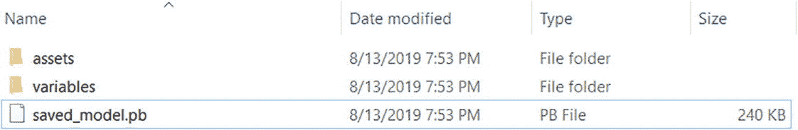
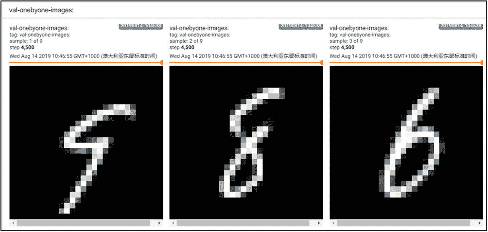

# 8\. 硬高级接口

> 人工智能的问题不仅是计算机科学的问题，也是数学、认知科学和哲学的问题。
> 
> 弗朗索瓦·乔列特

Keras 是一个主要用 Python 语言开发的开源神经网络计算库。它最初是由弗朗索瓦·乔莱写的。它被设计为高度模块化和可扩展的高级神经网络接口，使用户无需过多的专业知识就能快速完成模型的建立和训练。Keras 库分为前端和后端。后端一般调用已有的深度学习框架来实现底层操作，如 Theano、CNTK、TensorFlow 等。前端接口是由 Keras 抽象出来的一组统一的接口函数。用户可以通过 Keras 轻松切换不同的后端操作。由于 Keras 的高度抽象和易用性，根据 KDnuggets 的数据，截至 2019 年，Keras 的市场份额达到 26.6%，增长了 19.7%，在深度学习框架中仅次于 TensorFlow。

TensorFlow 和 Keras 之间是一种交错的关系，既竞争又合作。甚至 Keras 的创始人也在谷歌工作。早在 2015 年 11 月，Keras 后端支持中就加入了 TensorFlow。自 2017 年以来，Keras 的大部分组件都已集成到 TensorFlow 框架中。2019 年，Keras 被正式确定为 TensorFlow 2 唯一的高级接口 API，取代 TensorFlow 1 中包含的 tf.layers 等高级接口。换句话说，现在你只能使用 Keras 接口来完成 TensorFlow 图层模型的建立和训练。在 TensorFlow 2 中，Keras 是在 tf.keras 子模块中实现的。

Keras 和 tf.keras 有什么区别和联系？实际上，Keras 可以理解为一组用于构建和训练神经网络的高级 API 协议。Keras 本身已经实现了这个协议。安装标准的 Keras 库可以轻松调用 TensorFlow、CNTK 等后端完成加速计算。在 TensorFlow 中，也通过 tf.keras 实现了一套 Keras 协议，与 TensorFlow 深度融合，只基于 TensorFlow 后端操作，更完美的支持 TensorFlow。对于使用 TensorFlow 的开发者来说，tf.keras 可以理解为一个普通的子模块，与 tf.math、tf.data 等其他子模块没有区别，除非特别说明，否则以下章节中 keras 指的是 tf.keras 而不是标准的 Keras 库。

## 8.1 常用功能模块

Keras 提供了一系列与神经网络相关的高级类和函数，如经典数据集加载函数、网络层类、模型容器、损失函数类、优化器类和经典模型类。

对于经典数据集，一行代码就可以下载、管理和加载数据集。这些数据集包括波士顿房价预测数据集、CIFAR 图片数据集、MNIST/FashionMNIST 手写数字图片数据集和 IMDB 文本数据集。我们已经在前几章中介绍了其中的一些。

### 8.1.1 常见网络层类别

对于常见的神经网络层，我们可以使用张量模式的底层接口函数来实现，这些函数一般都包含在 tf.nn 模块中。对于常见的网络层，我们一般采用层的方法来完成模型的构建。tf.keras.layers 命名空间中提供了大量常见的网络层(下文中使用层来指代 tf.keras.layers)，例如全连接层、激活功能层、池层、卷积层和递归神经网络层。对于这些网络层类，只需要在创建时指定网络层的相关参数，使用 __call__ 方法完成正向计算即可。使用 __call__ 方法时，Keras 会自动调用各层的正向传播逻辑，一般在类的 call 函数中实现。

以 Softmax 层为例，它可以使用 tf.nn.softmax 函数来完成正向传播中的 softmax 操作，也可以通过层来构建 Softmax 网络层。Softmax(轴)类，其中轴参数指定 Softmax 操作的尺寸。首先，导入相关的子模块，如下所示:

```py
import tensorflow as tf
# Do not use "import keras" which will import the standard Keras, not the one in Tensorflow
from tensorflow import keras
from tensorflow.keras import layers # import common layer class

```

然后创建一个 Softmax 图层，并使用 __call__ 方法完成正向计算:

```py
In [1]:
x = tf.constant([2.,1.,0.1])  # create input tensor
layer = layers.Softmax(axis=-1)  # create Softmax layer
out = layer(x)  # forward propagation

```

通过 Softmax 网络层后，概率分布输出为:

```py
Out[1]:
<tf.Tensor: id=2, shape=(3,), dtype=float32, numpy=array([0.6590012, 0.242433 , 0.0985659], dtype=float32)>

```

当然，我们也可以通过 tf.nn.softmax()函数直接完成计算，如下:

```py
out = tf.nn.softmax(x)

```

### 网络容器

对于常见的网络，我们需要手动调用各层的类实例来完成正向传播操作。当网络层越深入，这部分代码就显得非常臃肿。通过 Keras 提供的网络容器 Sequential，可以将多个网络层封装成一个大型网络模型。只需要调用一次网络模型的实例，就可以完成数据从第一层到最后一层的顺序传播操作。

例如，具有独立激活功能层的两层全连接网络可以通过顺序容器封装为一个网络。

```py
from tensorflow.keras import layers, Sequential
network = Sequential([
    layers.Dense(3, activation=None), # Fully-connected layer without activation function
    layers.ReLU(),# activation function layer
    layers.Dense(2, activation=None), # Fully-connected layer without activation function
    layers.ReLU() # activation function layer
])
x = tf.random.normal([4,3])
out = network(x)

```

顺序容器还可以通过 add()方法继续添加新的网络层，以动态创建网络:

```py
In [2]:
layers_num = 2
network = Sequential([]) # Create an empty container
for _ in range(layers_num):
    network.add(layers.Dense(3)) # add fully-connected layer
    network.add(layers.ReLU())# add activation layer
network.build(input_shape=(4, 4))
network.summary()

```

前面的代码可以创建一个网络结构，其层数由 layers_num 参数指定。网络创建完成后，网络层类不会创建成员变量，如内部权重张量。使用 build 方法，可以指定输入大小，这将自动为所有层创建内部张量。通过 summary()函数，可以方便地打印出网络结构和参数。结果如下:

```py
Out[2]:
Model: "sequential_2"
_______________________________________________________________
Layer (type)                 Output Shape              Param Number
===============================================================
dense_2 (Dense)              multiple                  15
_______________________________________________________________
re_lu_2 (ReLU)               multiple                  0
_______________________________________________________________
dense_3 (Dense)              multiple                  12
_______________________________________________________________
re_lu_3 (ReLU)               multiple                  0
===============================================================
Total params: 27
Trainable params: 27
Non-trainable params: 0
_______________________________________________________________

```

图层列包括由 TensorFlow 内部维护的每个图层的名称，与 Python 的对象名称不同。“输出形状”列指示每个图层的输出形状。请注意,“输出形状”列的值都是“多个”,因为我们此时仅构建或编译了网络，并未真正训练或执行网络。在我们使用真实输入调用网络后，每个层的真实输出形状将反映在输出形状列中。Param number 列是每层的参数数。Total params 统计参数的总数。可训练参数是要优化的参数总数。不可训练参数是不需要优化的参数总数。

当我们通过顺序容器封装多个网络层时，每一层的参数表都会自动合并到顺序容器中。序列对象的可训练变量和变量包含要优化的张量列表和所有层的张量，例如:

```py
In [3]: # print name and shape of trainable variables
for p in network.trainable_variables:
   print(p.name, p.shape)
Out[3]:
dense_2/kernel:0 (4, 3)
dense_2/bias:0 (3,)
dense_3/kernel:0 (3, 3)
dense_3/bias:0 (3,)

```

顺序容器是最常用的类之一。这对快速建立多层神经网络非常有用。应该尽可能地使用它来简化网络模型的实现。

## 8.2 模型配置、培训和测试

在训练网络时，一般的流程是通过正向计算得到网络的输出值，然后通过损失函数计算网络误差，再通过自动微分工具计算并更新梯度，不定期测试网络性能。对于这种常用的训练逻辑，可以通过 Keras 提供的高层接口直接实现。

### 8.2.1 型号配置

在 keras，有两个特殊的阶层:Keras。Model 和 keras . layers . Layer . Layer . Layer 层类是网络层的父类，它定义了网络层的一些常用功能，比如添加权重、管理权重列表等。模型类是网络的父类。除了 layer 类的功能之外，还增加了保存模型、加载模型、训练测试模型等方便的功能。Sequential 也是 model 的子类，所以它拥有 model 类的所有功能。

下面介绍一下模型类及其子类的模型配置和训练功能。以序列容器封装的网络为例，我们首先为 MNIST 手写数字图像识别建立一个五层全连通网络。代码如下:

```py
# Create a 5-layer fully connected network
network = Sequential([layers.Dense(256, activation='relu'),
                     layers.Dense(128, activation='relu'),
                     layers.Dense(64, activation='relu'),
                     layers.Dense(32, activation='relu'),
                     layers.Dense(10)])
network.build(input_shape=(4, 28*28))
network.summary()

```

网络创建后，正常的流程是在数据集中迭代多个历元，批量生成训练数据，做前向传播计算，然后通过损失函数计算误差值，通过反向传播自动计算梯度，更新网络参数。因为这部分逻辑非常通用，所以 Keras 中提供了 compile()和 fit()函数来简化逻辑。我们可以通过 compile 函数直接指定网络使用的优化器、损失函数、评估指标和其他设置。这一步称为配置。

```py
# Import optimizer, loss function module
from tensorflow.keras import optimizers,losses
# Use Adam optimizer with learning rate of 0.01
# Use cross-entropy loss function with Softmax
network.compile(optimizer=optimizers.Adam(lr=0.01),
        loss=losses.CategoricalCrossentropy(from_logits=True),
        metrics=['accuracy'] # Set accuracy as evaluation metric
)

```

compile()函数中指定的优化器、损失函数和其他参数也是我们在自己的训练中需要设置的参数。Keras 在内部实现了这部分通用逻辑，以提高开发效率。

### 模型培训

模型配置完成后，可以通过 fit()函数发送用于训练和验证的数据集。这一步叫做模型训练。

```py
# Training dataset is train_db, and validation dataset is val_db
# Train 5 epochs and validate every 2 epoch
# Training record and history is saved in history variable
history = network.fit(train_db, epochs=5, validation_data=val_db, validation_freq=2)

```

train_db 可以是 tf.data.Dataset 对象或 Numpy 数组。Epochs 参数指定训练迭代的时期数。validation_data 参数指定用于验证的数据集，验证频率由 validation_freq 控制。

前面的代码可以实现网络训练和验证的功能。fit 函数将返回训练过程数据记录的历史，其中 history.history 是字典对象，包括训练过程的损失、评估度量和其他记录，例如:

```py
In [4]: history.history # print training record
Out[4]:
{'loss': [0.31980024444262184,  # training loss
  0.1123824894875288,
  0.07620834542314212,
  0.05487803366283576,
  0.041726120284820596],  # training accuracy
'accuracy': [0.904, 0.96638334, 0.97678334, 0.9830833, 0.9870667],
 'val_loss': [0.09901347314302303, 0.09504951824009701],  # validation loss
 'val_accuracy': [0.9688, 0.9703]}  # validation accuracy

```

fit()函数的操作代表了网络的训练过程，所以会消耗相当多的训练时间，训练完成后返回。训练时生成的历史数据可以通过返回值对象获得。可以看出，通过 Compile&Fit 方法实现的代码非常简洁高效，大大减少了开发时间。但是因为界面很高级，灵活性也降低了，要不要用还是由用户自己决定。

### 模型测试

该模型类不仅可以方便地完成网络的配置、训练和验证，还可以非常方便地进行预测和测试。我们将在过度拟合一章中阐述验证和测试的区别。在这里，验证和测试可以理解为模型评估的一种方式。

Model.predict(x)方法可以完成模型预测，例如:

```py
# Load one batch of test dataset
x,y = next(iter(db_test))
print('predict x:', x.shape) # print the batch shape
out = network.predict(x) # prediction
print(out)

```

其中 out 是网络的输出。通过前面的代码，训练好的模型可以用来预测新样本的标签信息。

如果只需要测试模型的性能，可以使用 Model.evaluate(db)来测试 db 数据集上的所有样本，并打印出性能指标，例如:

```py
network.evaluate(db_test)

```

## 8.3 模型保存和加载

模型训练完成后，需要将模型保存到文件系统中，以便于后续的模型测试和部署。事实上，在训练时保存模型状态也是一个好习惯，这对于训练大规模网络尤为重要。一般大规模的网络需要几天甚至几周的训练。一旦训练过程中断或发生意外，之前的训练进度就会丢失。如果模型状态能够间歇性地保存到文件系统中，那么即使发生了宕机等意外，也可以从最新的网络状态文件中恢复，从而避免浪费大量的训练时间和计算资源。因此，模型的保存和加载非常重要。

在 Keras 中，有三种保存和加载模型的常用方法。

### 张量方法

网络的状态主要体现在网络的结构和网络层内的张量数据上。因此，在拥有网络结构源文件的情况下，将网络张量参数直接保存到文件系统是最轻量级的方式。以 MNIST 手写数字图片识别模型为例，可以通过调用 Model.save_weights(path)方法保存当前的网络参数。代码如下:

```py
network.save_weights('weights.ckpt') # Save tensor data of the model

```

上述代码将网络模型保存到 weights.ckpt 文件中。需要时，我们先创建一个网络对象，然后调用网络对象的 load_weights(path)方法，将指定模型文件中保存的张量值加载到当前网络参数中，例如:

```py
# Save tensor data of the model
network.save_weights('weights.ckpt')
print('saved weights.')
del network # delete network object
# Create similar network
network = Sequential([layers.Dense(256, activation='relu'),
                     layers.Dense(128, activation='relu'),
                     layers.Dense(64, activation='relu'),
                     layers.Dense(32, activation='relu'),
                     layers.Dense(10)])
network.compile(optimizer=optimizers.Adam(lr=0.01),
        loss=tf.losses.CategoricalCrossentropy(from_logits=True),
        metrics=['accuracy']
    )
# Load weights from file
network.load_weights('weights.ckpt')
print('loaded weights!')

```

这种保存和加载网络的方法是最轻量级的。该文件只保存张量参数的值，没有其他额外的结构参数。但它需要使用相同的网络结构才能正确还原网络状态，所以一般在有网络源文件的情况下使用。

### 网络方法

下面介绍一种不需要网络源文件，只需要模型参数文件就可以恢复网络模型的方法。模型结构和模型参数可以通过 Model.save(path)函数保存到路径文件中，网络结构和网络参数可以通过 keras.models.load_model(path)恢复，不需要网络源文件。

首先，将 MNIST 手写数字图片识别模型保存到一个文件中，并删除网络对象:

```py
# Save model and parameters to a file
network.save('model.h5')
print('saved total model.')
del network # Delete the network

```

网络的结构和状态可以通过 model.h5 文件恢复，不需要事先创建网络对象。代码如下:

```py
# Recover the model and parameters from a file
network = keras.models.load_model('model.h5')

```

如您所见，除了存储模型参数，model.h5 文件还应该保存网络结构信息。您可以直接从文件中恢复网络对象，而无需事先创建模型。

### 8.3.3 保存模型方法

TensorFlow 之所以被业界看好，不仅是因为出色的神经网络层 API 支持，还因为它拥有强大的生态系统，包括移动端和 web 端的支持。当模型需要部署到其他平台时，TensorFlow 提出的 SavedModel 方法是平台无关的。

通过 tf.saved_model.save(network，path)，可以将模型保存到路径目录中，如下所示:

```py
#  Save model and parameters to a file
tf.saved_model.save(network, 'model-savedmodel')
print('saving savedmodel.')
del network # Delete network object

```

以下网络文件出现在文件系统 model-savedmodel 目录中，如图 [8-1](#Fig1) 所示:



图 8-1

保存模型方法目录

用户不需要关心文件保存格式，只需要通过 tf.saved_model.load 函数还原模型对象即可。在恢复模型实例后，我们完成了测试准确率的计算，并实现了以下内容:

```py
print('load savedmodel from file.')
# Recover network and parameter from files
network =  tf.saved_model.load('model-savedmodel')
# Accuracy metrics
acc_meter = metrics.CategoricalAccuracy()
for x,y in ds_val:   # Loop through test dataset
    pred = network(x) # Forward calculation
    acc_meter.update_state(y_true=y, y_pred=pred) # Update stats
# Print accuracy
print("Test Accuracy:%f" % acc_meter.result())

```

## 8.4 定制网络

尽管 Keras 提供了许多常见的网络层类，但用于深度学习的网络远不止这些。研究人员通常自己实现相对较新的网络层。因此，掌握自定义网络层和网络的实现非常重要。

对于需要创建自定义逻辑的网络层，可以通过自定义类来实现。创建自定义的网络层类时，需要从层中继承。层基类。创建自定义网络类时，需要从 keras 继承。模型基类，所以用这种方式创建的自定义类可以很容易地使用层/模型基类。该类提供的参数管理和其他功能也可以与其他标准网络层类交互使用。

### 8.4.1 自定义网络层

对于自定义网络层，我们至少需要实现初始化(__init__)方法和正向传播逻辑。我们以一个具体的自定义网络层为例，假设需要一个没有偏置向量的全连通层，即偏置为 0，固定激活函数为 ReLU。尽管这可以通过标准的密集层来创建，我们仍然解释如何通过实现这个“特殊的”网络层类来实现一个定制的网络层。

首先，创建一个类，并从基础层类继承。创建一个初始化方法，调用父类的初始化函数。因为是全连通层，所以需要设置两个参数:输入特征 inp_dim 的长度和输出特征 outp_dim 的长度，形状大小由 self.add_variable(name，shape)创建。名张量 *W* 被设置为优化。

```py
class MyDense(layers.Layer):
    # Custom layer
    def __init__(self, inp_dim, outp_dim):
        super(MyDense, self).__init__()
        # Create weight tensor and set to be trainable
        self.kernel = self.add_variable('w', [inp_dim, outp_dim], trainable=True)

```

需要注意的是，self.add_variable 会返回一个对张量 *W* 的 Python 引用，变量名由 TensorFlow 内部维护，使用频率较低。我们实例化 MyDense 类并查看其参数列表，例如:

```py
In [5]: net = MyDense(4,3) # Input dimension is 4 and output dimension is 3.
net.variables,net.trainable_variables  # Check the trainable parameters
Out[5]:
# All parameters
([<tf.Variable 'w:0' shape=(4, 3) dtype=float32, numpy=...
# Trainable parameters
 [<tf.Variable 'w:0' shape=(4, 3) dtype=float32, numpy=...

```

可以看到张量 *W* 自动包含在参数表中。

通过修改为 self . kernel = self . add _ variable(' W '，[inp_dim，outp_dim]，trainable = False)，我们可以设置张量 *W* 不可训练，然后观察张量的管理状态:

```py
([<tf.Variable 'w:0' shape=(4, 3) dtype=float32, numpy=...], # All parameters
[])# Trainable parameters

```

如你所见，张量此时不由 trainable _ variables 管理。另外，创建为 tf 的类成员变量。类初始化中变量也自动包含在张量管理中，例如:

```py
        self.kernel = tf.Variable(tf.random.normal([inp_dim, outp_dim]), trainable=False)

```

托管张量列表打印如下:

```py
# All parameters
([<tf.Variable 'Variable:0' shape=(4, 3) dtype=float32, numpy=...],
[])# Trainable parameters

```

在自定义类初始化之后，我们将设计正向计算逻辑。对于这个例子，只需要完成矩阵运算 *O* = *X* @ *W* 就可以使用固定的 ReLU 激活函数。代码如下:

```py
    def call(self, inputs, training=None):
        # Forward calculation
        # X@W
        out = inputs @ self.kernel
        # Run activation function
        out = tf.nn.relu(out)
        return out

```

如上所述，正向计算逻辑是在 call(inputs，training = None)函数中实现的，其中 inputs 参数表示输入并由用户传入。training 参数用于指定模型的状态:True 表示训练模式，False 表示测试模式，默认值为 None，即测试模式。因为全连接层的训练和测试模式在逻辑上是一致的，所以这里不需要额外的处理。对于测试和训练模式不一致的网络层，需要根据训练参数设计要执行的逻辑。

### 定制网络

在完成自定义全连接层类实现后，我们基于前面描述的“无偏全连接层”创建了 MNIST 手写数字图片模型。

自定义网络类可以像其他标准类一样，通过顺序容器轻松封装到网络模型中:

```py
network = Sequential([MyDense(784, 256), # Use custom layer
                     MyDense(256, 128),
                     MyDense(128, 64),
                     MyDense(64, 32),
                     MyDense(32, 10)])
network.build(input_shape=(None, 28*28))
network.summary()

```

可以看出，通过堆叠我们自定义的网络层类，也可以实现五层全连通的层网络。全连通层的每一层都没有偏置张量，激活函数使用 ReLU 函数。

顺序容器适用于这样的网络模型，其中数据按顺序从第一层传播到第二层，然后从第二层传播到第三层，并且以这种方式传播。例如，对于复杂的网络结构，第三层的输入不仅是第二层的输出，也是第一层的输出。这时，使用定制的网络更加灵活。首先创建一个从模型基类继承的类，然后分别创建相应的网络层对象，如下所示:

```py
class MyModel(keras.Model):
    # Custom network class
    def __init__(self):
        super(MyModel, self).__init__()
        # Create the network
        self.fc1 = MyDense(28*28, 256)
        self.fc2 = MyDense(256, 128)
        self.fc3 = MyDense(128, 64)
        self.fc4 = MyDense(64, 32)
        self.fc5 = MyDense(32, 10)

```

然后实现定制网络的转发操作逻辑，如下所示:

```py
    def call(self, inputs, training=None):
        # Forward calculation
        x = self.fc1(inputs)
        x = self.fc2(x)
        x = self.fc3(x)
        x = self.fc4(x)
        x = self.fc5(x)
        return x

```

这个例子可以使用顺序容器方法直接实现。但是定制网络的正向计算逻辑可以自由定义，更加通用。我们将在卷积神经网络一章中看到定制网络的优越性。

## 8.5 模型动物园

对于常用的网络模型，如 ResNet 和 VGG，您不需要手动创建它们。它们可以通过 keras.applications 子模块用一行代码直接实现。同时，还可以通过设置权重参数来加载预先训练好的模型。

### 负载模型

以 ResNet50 网络模型为例，去除 ResNet50 最后一层后的网络一般作为新任务的特征提取子网，即利用 ImageNet 数据集上预先训练好的网络参数，根据任务的类别，初始化并追加一个与数据类别数相对应的全连通层，从而在预先训练好的网络基础上快速高效地学习新任务。

首先使用 Keras model zoo 加载 ImageNet 预先训练好的 ResNet50 网络。代码如下:

```py
# Load ImageNet pre-trained network. Exclude the last layer.
resnet = keras.applications.ResNet50(weights='imagenet',include_top=False)
resnet.summary()
# test the output
x = tf.random.normal([4,224,224,3])
out = resnet(x) # get output
out.shape

```

上述代码自动从服务器下载 ImageNet 数据集的模型结构和预训练网络参数。通过将 include_top 参数设置为 False，我们选择移除 ResNet50 的最后一层。网络输出特征图的大小为[ *b* ，7，7，2048]。对于特定的任务，我们需要设置自定义数量的输出节点。以 100 个分类任务为例，基于 ResNet50 重建一个新的网络。创建一个新的池层(此处的池层可以理解为在高维度和宽维度中向下采样的函数)，并将特征维度从[*b*，7，7，2048]减少到[*b*，2048]，如下所示。

```py
In [6]:
# New pooling layer
global_average_layer = layers.GlobalAveragePooling2D()
# Use last layer's output as this layer's input
x = tf.random.normal([4,7,7,2048])
# Use pooling layer to reduce dimension from [4,7,7,2048] to [4,1,1,2048],and squeeze to [4,2048]
out = global_average_layer(x)
print(out.shape)
Out[6]: (4, 2048)

```

最后，创建一个新的完全连接层，并将输出节点数设置为 100。代码如下:

```py
In [7]:
# New fully connected layer
fc = layers.Dense(100)
# Use last layer's output as this layer's input
x = tf.random.normal([4,2048])
out = fc(x)
print(out.shape)
Out[7]: (4, 100)

```

在创建了预训练的 ResNet50 功能子网、新的池层和全连接层之后，我们重新使用顺序容器来封装新的网络:

```py
# Build a new network using previous layers
mynet = Sequential([resnet, global_average_layer, fc])
mynet.summary()

```

可以看到新网络模型的结构信息是:

```py
Layer (type)                 Output Shape              Param Number
===============================================================
resnet50 (Model)             (None, None, None, 2048)  23587712
_______________________________________________________________
global_average_pooling2d (Gl (None, 2048)              0
_______________________________________________________________
dense_4 (Dense)              (None, 100)               204900
===============================================================
Total params: 23,792,612
Trainable params: 23,739,492
Non-trainable params: 53,120

```

通过设置 resnet.trainable = False，可以选择冻结 resnet 部分的网络参数，只训练新创建的网络层，从而快速高效地完成网络模型训练。当然，你也可以更新网络的所有参数。

## 8.6 指标

在网络的训练过程中，往往需要准确率和召回率等指标。Keras 在 keras.metrics 模块中提供了一些常用的指标。

使用 Keras 度量有四个主要步骤:创建新的度量容器、写入数据、读取统计数据和清除度量容器。

### 8.6.1 创建指标容器

在 keras.metrics 模块中，它提供了许多常用的度量类，如均值、精度和余弦相似度。下面，我们以平均误差为例。

```py
loss_meter = metrics.Mean()

```

### 写入数据

可以通过 update_state 函数写入新数据，度量会按照自己的逻辑记录和处理采样的数据。例如，损失值在每个步骤结束时收集一次:

```py
     # Record the sampled data, and convert the tensor to an ordinary value through the float() function
        loss_meter.update_state(float(loss))

```

在每个批处理操作结束时放置前面的采样代码后，血糖仪将根据采样数据自动计算平均值。

### 读取统计数据

采样多次数据后，可以选择调用测量器的 result()函数来获取统计值。例如，区间统计平均损失如下:

```py
      # Print the average loss during the statistical period
        print(step, 'loss:', loss_meter.result())

```

### 清理容器

由于度量容器将记录所有历史数据，因此在开始新一轮统计时，有必要清除历史状态。可以通过 reset_states()函数来实现。例如，每次读取平均误差后，清除统计信息以开始下一轮统计，如下所示:

```py
    if step % 100 == 0:
        # Print the average loss
        print(step, 'loss:', loss_meter.result())
        loss_meter.reset_states() # reset the state

```

### 8.6.5 实际操作准确度指标

根据使用度量工具的方法，我们在训练过程中使用准确度度量来统计准确率。首先，创建一个新的准确度测量容器，如下所示:

```py
acc_meter = metrics.Accuracy()

```

每次正向计算完成后，记录训练准确率。需要注意的是，精度类的 update_state 函数的参数是预测值和真值，而不是当前批次的准确率。我们将当前批次样本的标签和预测结果写入度量，如下所示:

```py
            # [b, 784] => [b, 10, network output
            out = network(x)
            # [b, 10] => [b], feed into argmax()
            pred = tf.argmax(out, axis=1)
            pred = tf.cast(pred, dtype=tf.int32)
            # record the accuracy
            acc_meter.update_state(y, pred)

```

对测试集中所有批次的预测值进行计数后，打印统计数据的平均准确度，并清除指标容器。代码如下:

```py
        print(step, 'Evaluate Acc:', acc_meter.result().numpy())
        acc_meter.reset_states() # reset metric

```

## 8.7 可视化

在网络培训过程中，通过 web 终端监控网络的培训进度，并可视化培训结果，对于提高开发效率非常重要。TensorFlow 提供了一个名为 TensorBoard 的特殊可视化工具，通过 TensorFlow 将监控数据写入文件系统，并使用 web 后端监控相应的文件目录，从而允许用户查看网络监控数据。

TensorBoard 的使用需要模型代码和浏览器的配合。使用 TensorBoard 之前，需要安装 TensorBoard 库。安装命令如下:

```py
# Install TensorBoard
pip install tensorboard

```

接下来介绍如何使用 TensorBoard 工具在模型端和浏览器端监控网络训练进度。

### 模型侧

在模型方面，您需要创建一个汇总类，在需要时写入监控数据。首先通过 tf.summary.create_file_writer 创建一个监控对象类的实例，并指定监控数据写入的目录。代码如下:

```py
# Create a monitoring class, the monitoring data will be written to the log_dir directory
summary_writer = tf.summary.create_file_writer(log_dir)

```

我们以监控误差和可视图像数据为例，介绍如何编写监控数据。正演计算完成后，对于误差等标量数据，我们通过 tf.summary.scalar 函数记录监控数据，并指定时间戳步长参数。这里的步长参数类似于每个数据对应的时标信息，也可以理解为数据曲线的坐标，不做赘述。每种类型的数据通过字符串的名称来区分，相似的数据需要用相同的名称写入数据库。例如:

```py
        with summary_writer.as_default():
            # write the current loss to train-loss database
            tf.summary.scalar('train-loss', float(loss), step=step)

```

TensorBoard 通过字符串 ID 区分不同类型的监测数据，所以对于错误数据，我们命名为“train-loss”；不能写入其他类型的数据，以防止数据污染。

对于图片类型的数据，可以通过 tf.summary.image 函数写入监控图片数据。例如，在训练期间，可以通过 tf.summary.image 函数来可视化样本图像。由于 TensorFlow 中的张量通常包含多个样本，因此 tf.summary.image 函数接受多个图片的张量数据，并设置 max_outputs 参数来选择显示图片的最大数量。代码如下:

```py
        with summary_writer.as_default():
            # log accuracy
            tf.summary.scalar('test-acc', float(total_correct/total), step=step)
            # log images
            tf.summary.image("val-onebyone-images:", val_images, max_outputs=9, step=step)

```

运行模型程序，相应的数据会实时写入指定的文件目录。

### 8.7.2 浏览器端

运行程序时，监控数据被写入指定的文件目录。如果您想要远程实时查看和可视化这些数据，您还需要使用浏览器和 web 后端。第一步是打开 web 后端。在终端中运行“tensorboard - logdir path”命令，指定 web 后端监控的文件目录路径，即可打开 web 后端监控流程，如图 [8-2](#Fig2) 所示:


图 8-2

打开 web 服务器

打开浏览器，输入网址 http://localhost: 6006(也可以通过 IP 地址远程访问，具体端口号可能会根据命令行提示有所变化)监控网络训练的进度。TensorBoard 可以同时显示多条监控记录。在监控页面的左侧，可以选择监控记录，如图 [8-3](#Fig3) 所示:


图 8-3

张量板快照

在监控页面的上端，您可以选择不同类型的数据监控页面，例如标量监控页面标量和图片可视化页面图像。对于这个例子，我们需要监控标量数据的训练误差和测试准确率，其曲线可以在 SCALARS 页面查看，如图 [8-4](#Fig4) 和图 [8-5](#Fig5) 所示。


图 8-5

训练准确度曲线


图 8-4

训练损失曲线

在图像页面，您可以查看每个步骤的图像，如图 [8-6](#Fig6) 所示。



图 8-6

每一步的图片

除了监控标量数据和图像数据，TensorBoard 还支持通过 tf.summary.histogram 查看张量数据的直方图分布、通过 tf.summary.text 打印文本信息等功能，例如:

```py
        with summary_writer.as_default():
            tf.summary.scalar('train-loss', float(loss), step=step)
   tf.summary.histogram('y-hist',y, step=step)
            tf.summary.text('loss-text',str(float(loss)))

```

在直方图页面可以查看张量的直方图，如图 [8-7](#Fig7) 所示，在文本页面可以查看文本信息，如图 [8-8](#Fig8) 所示。


图 8-8

张量板文本可视化


图 8-7

张量板直方图

其实除了 TensorBoard，脸书开发的 Visdom 工具也可以方便的实现数据的可视化，实时支持多种可视化方式，使用起来更加方便。图 [8-9](#Fig9) 显示了 Visdom 数据的可视化。Visdom 可以直接接受 PyTorch 的张量类型数据，但不能直接接受 TensorFlow 的张量类型数据。需要将其转换为 Numpy 数组。对于追求丰富的可视化方法和实时监控的读者来说，Visdom 可能是更好的选择。


图 8-9

智慧快照〔t0〕〔t1〕〔T2〕〔T3〕

## 8.8 摘要

在这一章中，我们介绍了 Keras 高级 API 的使用，它可以节省我们在网络开发过程中的大量时间。我们可以很容易地用容器法来构造网络。使用 Keras 内置函数可以快速实现神经网络的训练和测试。在对网络进行训练和测试之后，我们还可以保存训练好的模型，并在将来使用 Keras 重新加载模型。除了常见的网络层，Keras 还提供了为不同用例构建定制网络层的功能。我们还讨论了如何使用 Keras 加载流行的网络模型，以及使用 TensorBoard 设置评估指标和可视化模型性能。我们通过本章学习的工具可以帮助我们显著提高网络开发效率。

<aside aria-label="Footnotes" class="FootnoteSection" epub:type="footnotes">Footnotes [1](#Fn1_source)

图片来源: [`https://github.com/facebookresearch/visdom`](https://github.com/facebookresearch/visdom)

 </aside>