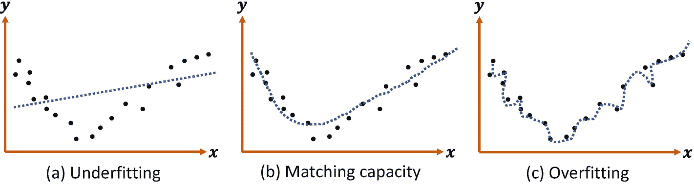
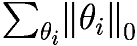
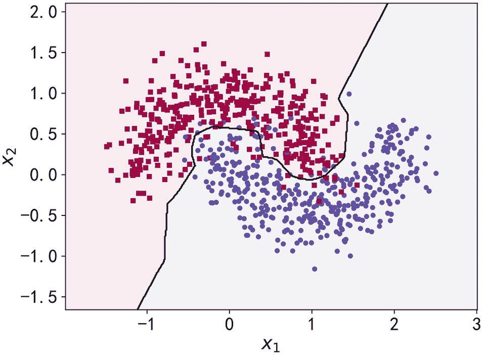
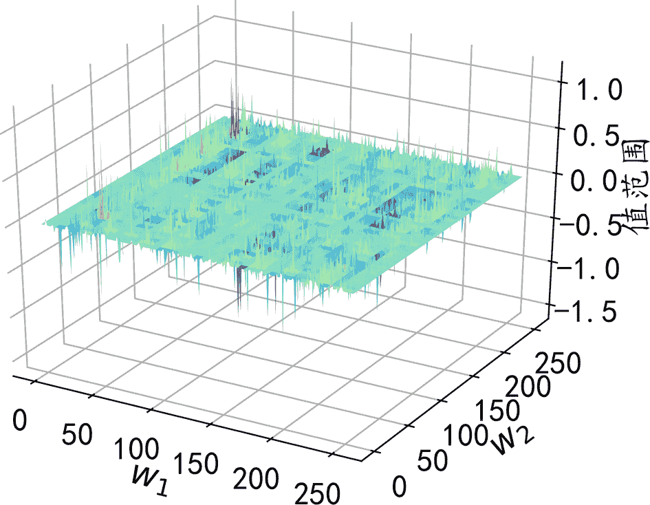

# 九、过拟合

> 一切都要尽量简单，但不能更简单。
> 
> —爱因斯坦

机器学习的主要目的是从训练集中学习数据的真实模型，使其能够在看不见的测试集上表现良好。我们称之为概括能力。一般来说，训练集和测试集是从相同的数据分布中采样的。抽样样本彼此独立，但来自相同的分布。我们称这种假设为独立同分布(i.i.d .)假设。

模型的表现力前面已经提到了，也称为模型的容量。当模型的表达能力较弱时，如单一线性层，只能学习一个线性模型，不能很好地近似非线性模型。当模型的表达能力太强时，可能会减少训练集的噪声模态，但会导致测试集的性能较差(泛化能力较弱)。因此，对于不同的任务，设计一个容量合适的模型可以获得更好的泛化性能。

## 9.1 模型容量

通俗地说，模型的容量或表达能力是指模型对复杂函数的拟合能力。反映模型能力的一个指标是模型假设空间的大小，即模型所能表示的函数集的大小。假设空间越大、越完整，就越有可能从假设空间中搜索接近真实模型的函数。反之，如果假设空间非常有限，就很难找到一个近似真实模型的函数。

考虑从真实分布中抽样:

![$$ {p}_{data}=\left\{\left(x,y\right)|y=\mathit{\sin}(x),x\in \Big[-5,5\Big]\right\} $$](img/515226_1_En_9_Chapter_TeX_Equa.png)

从真实分布中抽取少量点组成训练集，训练集包含观测误差 *ϵ* ，如图 [9-1](#Fig1) 中的小点所示。如果我们只搜索所有一次多项式的模型空间，并将偏差设为 0，即 *y* = *ax* ，如图 [9-1](#Fig1) 中一次多项式的直线所示。那么就很难找到一条非常接近真实数据分布的直线。稍微增加假设空间，使假设空间都是三次多项式函数，即*y*=*ax*<sup>3</sup>+*bx*<sup>2</sup>+*CX*，很明显这个假设空间明显大于一次多项式的假设空间，我们可以找到一条曲线(如图 [9-1](#Fig1) 所示)反映了再次增加假设空间使可搜索函数为 5 次多项式，即*y*=*ax*<sup>5</sup>+*bx*<sup>4</sup>+*CX*+<sup>3</sup>+*dx*<sup>2</sup>+*ex*。在这个假设空间中，可以搜索到更好的函数，如图 [9-1](#Fig1) 中的 5 次多项式所示。再次增大假设空间后，如图 [9-1](#Fig1) 中 7、9、11、13、15、17 的多项式曲线所示，函数的假设空间越大，越有可能找到更接近真实分布的函数模型。


图 9-1

多项式能力

然而，过大的假设空间无疑会增加搜索难度和计算成本。事实上，在有限计算资源的约束下，更大的假设空间不一定能搜索到更好的模型。由于观测误差的存在，更大的假设空间可能包含更多的表达能力太强的函数，这些函数也可以学习训练样本的观测误差，从而伤害模型的泛化能力。选择合适的模型容量是一个难题。

## 9.2 过度配合和不足配合

由于真实数据的分布往往是未知且复杂的，因此无法推导出分布函数的类型及相关参数。因此，在选择学习模型的容量时，人们往往根据经验值选择稍大的模型容量。然而，当模型的容量过大时，它可能在训练集上表现得更好，但在测试集上表现得更差，如图 [9-2](#Fig2) 所示。当模型的容量过小时，可能在训练集和测试集的性能都很差，如图 [9-2](#Fig2) 中红色竖线左侧区域所示。


图 9-2

模型容量与误差的关系[1]

当模型的容量过大时，网络模型除了学习训练集数据的模态外，还会学习额外的观测误差，导致学习后的模型在训练集上表现较好，但在看不见的样本上表现较差，即模型的泛化能力较弱。我们称这种现象为过拟合。当模型的容量太小时，模型不能很好地学习训练集数据的模态，导致训练集和看不见的样本的性能都很差。我们称这种现象为欠拟合。

这里有一个简单的例子来解释模型的容量和数据分布之间的关系。图 [9-3](#Fig3) 描绘了某些数据的分布。可以粗略推测，数据可能属于某个 2 次多项式分布。如果使用简单的线性函数进行学习，会发现很难学习到更好的函数，导致训练集和测试集表现不佳的欠拟合现象，如图 [9-3 (a)](#Fig3) 。但如果使用更复杂的函数模型进行学习，有可能学习到的函数会过度“拟合”训练集样本，而导致在测试集上表现不佳，即过拟合，如图 [9-3 (c)](#Fig3) 。只有当学习到的模型与真实模型的容量大致匹配时，模型才能具有良好的泛化能力，如图 [9-3 (b)](#Fig3) 所示。



图 9-3

过拟合和欠拟合

考虑数据点的分布 *p* <sub>*数据*</sub>(*x*， *y* )，其中


采样时加入随机高斯噪声，得到 120 个点的数据集，如图 [9-4](#Fig4) 所示。图中曲线为真实模型函数，黑色圆点为训练样本，绿色矩阵点为测试样本。


图 9-4

数据集和实函数

在已知真实模型的情况下，设计一个具有适当容量的函数空间来获得一个好的学习模型是很自然的。如图 [9-5](#Fig5) 所示，我们假设模型为二次多项式模型，学习到的函数曲线近似真实模型。然而，在实际场景中，真实的模型往往是未知的，因此如果设计假设空间太小，将无法搜索到合适的学习模型。如果设计假设空间过大，会导致模型泛化能力差。


图 9-5

适当的模型能力

那么如何选择机型的容量呢？统计学习理论为我们提供了一些思路。VC 维(Vapnik-Chervonenkis 维)是一种广泛使用的度量函数容量的方法。虽然这些方法为机器学习提供了一定程度的理论保障，但是这些方法很少应用于深度学习。部分原因是神经网络过于复杂，无法确定网络结构背后数学模型的 VC 维数。

虽然统计学习理论很难给出一个神经网络所需的最小容量，但它可以用来指导一个基于奥卡姆剃刀的神经网络的设计和训练。奥卡姆剃刀原则是由奥卡姆的威廉提出的解决规则，他是 14 世纪的逻辑学家和方济各会的方济各会修士。他在书中声明“不要浪费更多的东西，做那些用更少的东西就能做好的事情。”换句话说，如果两层神经网络结构可以很好地表达真实模型，那么三层神经网络也可以很好地表达，但我们应该更喜欢使用更简单的两层神经网络，因为它的参数数量更小，更容易训练，更容易通过较少的训练样本获得良好的泛化误差。

### 装配不足

让我们考虑一下拟合不足的现象。如图 [9-6](#Fig6) 所示，黑点和绿色矩形是从抛物线函数的分布中独立采样的。因为我们已经知道真实的模型，如果用一个比真实模型容量低的线性函数来拟合数据，模型很难有好的表现。具体表现为学习出来的线性模型在训练集上的误差(如均方差)较大，在测试集上的误差也较大。


图 9-6

典型的欠拟合模型

当我们发现当前模型在训练集上一直保持着较高的误差，难以优化和降低误差，在测试集上也表现不佳时，就可以考虑是否存在欠拟合的现象。可以通过增加神经网络的层数或增加中间维度的大小来解决欠拟合的问题。然而，因为现代深度神经网络模型可以容易地到达更深的层，所以用于学习的模型的容量通常是足够的。在实际应用中，会出现更多的过拟合现象。

### 过度装配

考虑同一个问题，训练集的黑点和测试机的绿色矩形分别从一个分布相同的抛物线模型中独立采样。当我们将模型的假设空间设置为 25 次多项式时，它远大于真实模型的功能容量。发现学习后的模型很可能会过拟合训练样本，导致学习模型对训练样本的误差很小，甚至小于真实模型对训练集的误差。但对于测试样本，模型性能急剧下降，泛化能力很差，如图 [9-7](#Fig7) 。


图 9-7

典型的过拟合模型

现代深度神经网络很容易出现过拟合现象，主要是因为神经网络具有非常强的表达能力，而训练集中的样本数量不够，很容易出现神经网络容量过大的情况。那么如何有效地检测和减少过拟合呢？

接下来，我们将介绍一系列有助于检测和抑制过拟合的方法。

## 9.3 数据集划分

前面我们介绍过，数据集需要分为训练集和测试集。为了选择模型超参数和检测过拟合，通常需要将原始训练集分成新的训练集和验证集，即需要将数据集分成三个子集:训练集、验证集和测试集。

### 9.3.1 验证集和超参数

前面已经介绍了训练集和测试集之间的区别。训练集 *D* <sup>*train*</sup> 用于训练模型参数，测试集 *D* <sup>*test*</sup> 用于测试模型的泛化能力。测试集中的样本不能参与模型训练，妨碍了模型对数据特征的“记忆”，损害了模型的泛化能力。训练集和测试集都是从相同的数据分布中采样的。例如，MNIST 手写数字图片集共有 70，000 幅样本图片，其中 60，000 幅图片用作训练集，其余 10，000 幅图片用于测试集。用户可以定义训练集和测试集的分离比。比如 80%的数据用于训练，剩下的 20%用于测试。当数据集规模较小时，为了更准确地检验模型的泛化能力，可以适当增加测试集的比例。图 [9-8](#Fig8) 展示了 MNIST 手写数字图片集的划分:80%用于训练，剩下的 20%用于测试。


图 9-8

训练和测试数据集部门

但是，仅将数据集分为训练集和测试集是不够的。因为测试集的性能不能用作模型训练的反馈，所以我们需要能够在模型训练期间挑选出更合适的模型超参数，以确定模型是否过拟合。因此，我们需要将训练集分为训练集和验证集，如图 [9-9](#Fig9) 所示。划分的训练集具有与原始训练集相同的功能，并且用于训练模型的参数，而验证集用于选择模型的超参数。其职能包括:


图 9-9

培训、验证和测试数据集

*   调整学习率、权重衰减系数、训练次数等。根据验证集的性能来设置。

*   根据验证集的性能重新调整网络拓扑。

*   根据验证集的性能，确定它是过拟合还是欠拟合。

类似于训练集-测试集的划分，训练集、验证集和测试集可以根据自定义的比例来划分，例如常见的 60%-20%-20%划分。图 [9-9](#Fig9) 为该分部的 MNIST 笔迹数据集示意图。

验证集和测试集的区别在于，算法设计者可以根据验证集的性能来调整模型的各种超参数的设置，以提高模型的泛化能力，但不能用测试集的性能来调整模型。否则，测试集和验证集的功能会重叠，因此测试集上的性能不会代表模型的泛化能力。

事实上，一些开发人员会错误地使用测试集来选择最佳模型，然后将其作为模型泛化性能报告。对于那些情况，测试集实际上是验证集，所以报告的“泛化性能”本质上是验证集上的性能，而不是真正的泛化性能。为了防止这种“作弊”，可以选择生成多个测试集，这样即使开发者使用其中一个测试集来选择模型，我们也可以使用其他测试集来评估模型，这也是 Kaggle 比赛中常用的方法。

### 提前停止

一般我们把训练集中的一次批量更新称为一步，把训练集中的所有样本迭代一次称为一个历元。在几个步骤或时期之后，可以使用验证集来计算模型的验证性能。如果验证步骤过于频繁，它可以准确地观察模型的训练状态，但也会引入额外的计算成本。通常建议在几个时期后执行验证操作。

以分类任务为例，训练性能指标包括训练误差、训练精度等。相应的，验证过程中也有验证误差和验证精度，测试过程中也有测试误差和测试精度。训练精度和验证精度可以大致推断出模型是过拟合还是欠拟合。如果模型的训练误差低，训练精度高，但验证误差高，验证准确率低，就可能出现过拟合。如果训练集和验证集的误差都很高，而精度很低，则可能出现欠拟合。

当观察到过拟合时，可以重新设计网络模型的容量，如减少网络的层数，减少网络的参数个数，增加正则化方法，增加对假设空间的约束，使模型的实际容量减少来解决过拟合现象。当观察到欠拟合现象时，可以尝试增加网络的容量，比如加深网络的层数，增加网络参数的个数，尝试更复杂的网络结构。

事实上，由于网络的实际容量可以随着训练的进行而改变，即使具有相同的网络设置，也可以观察到不同的过拟合和欠拟合情况。图 [9-10](#Fig10) 显示了分类问题的典型训练曲线。红色曲线是训练精度，蓝色曲线是测试精度。从图中可以看出，随着训练前期训练的进行，模型的训练精度和测试精度都呈现出不断提高的趋势，此时并没有出现过拟合现象。在训练后期，即使是同样的网络结构，由于模型实际容量的变化，我们观察到了过拟合的现象。即训练精度不断提高，但泛化能力变弱(测试精度下降)。

这意味着，对于神经网络，即使网络超参数数量保持不变(即，网络的最大容量是固定的)，该模型仍可能看起来过拟合，因为神经网络的有效容量与网络参数的状态密切相关。神经网络的有效容量可以非常大，并且也可以通过稀疏参数和正则化来降低有效容量。在训练的早中期，没有出现过拟合的现象。随着训练次数的增加，过拟合现象越来越严重。在图 [9-10](#Fig10) 中，垂直虚线处于网络的最佳状态，没有明显的过拟合现象，网络的泛化能力最好。


图 9-10

培训流程图

那么如何选择合适的纪元提前停止训练(提前停止)以避免过拟合呢？我们可以通过观察验证度量的变化来预测最合适的历元的可能位置。具体来说，对于分类问题，我们可以记录模型的验证精度，并监控其变化。当发现验证精度对于连续的历元没有降低时，我们可以预测最合适的历元可能已经到达，因此我们可以停止训练。图 [9-11](#Fig11) 绘制了特定训练过程中训练和验证精度随训练时期的变化曲线。可以观察到，当 Epoch 在 30 左右时，模型达到最优状态，我们可以提前停止训练。


图 9-11

训练曲线示例

算法 1 是使用早期停止模型训练算法的伪代码。

<colgroup><col class="tcol1 align-left"></colgroup> 
| **算法 1:提前停止的网络训练** |
| **初始化参数***T3】θT5】***重复****为** ***步=*** **1** ***，*** … ***，N*** **做****随机选择批**{[**、 ***和***}**~ d12】**** *****【θ】*******【l12】****

 ******结束**

**如果每隔******第 n 个纪元做****

 ****计算验证集** {( ***x*** ，***y***)}***~ D***<sup>***val***</sup>**性能**

**如果某些连续步骤的验证性能没有提高，则执行**

**保存网络并停止训练**

**结束**********  |
| **做****直到训练达到最大历元****使用保存的网络计算测试集** {( ***x*** ，***y***)}***~ D***<sup>***测试***</sup> **性能****输出:网络参数** ***θ*** **和测试精度** |

## 9.4 模型设计

验证集可以确定网络模型是过拟合还是欠拟合，这为调整网络模型的容量提供了基础。对于神经网络来说，网络的层数和参数是网络容量非常重要的参考指标。通过减少层数和减少每层网络参数的大小，可以有效地降低网络容量。相反，如果发现模型欠拟合，我们可以通过增加层数和每层中的参数数量来增加网络的容量。

为了演示网络层数对网络容量的影响，我们可视化了分类任务的决策边界。图 [9-12](#Fig12) ，图 [9-13](#Fig13) ，图 [9-14](#Fig14) ，图 [9-15](#Fig15) 分别展示了不同网络层下训练两类分类任务的决策边界图，其中红色矩形块和蓝色圆形块分别代表训练集上的两类样本。在保持其他超参数一致的情况下，只调整网络的层数。如图，可以看到随着网络层数的增加，学习到的模型决策边界越来越接近训练样本，表示过拟合。对于这个任务，两层神经网络可以获得良好的泛化能力。网络的更深层不会提高整体模型性能。反而会导致过拟合，泛化能力变差，计算成本也更高。


图 9-15

六层


图 9-14

四层


图 9-13

三层


图 9-12

两层

## 9.5 正规化

通过设计具有不同层和大小的网络模型，可以为优化算法提供初始函数假设空间，但是模型的实际容量可以随着网络参数的优化和更新而改变。以多项式函数模型为例:


前一个型号的容量可以简单的通过 *n* 来衡量。在训练过程中，如果网络参数 *β* <sub>*k* + 1</sub> 、⋯、 *β* <sub>*n*</sub> 都为 0，则网络的实际容量退化为 *kth* 多项式的函数容量。因此，通过限制网络参数的稀疏性，可以约束网络的实际容量。

这种约束通常通过向损失函数添加额外的参数稀疏惩罚来实现。添加约束前的优化目标是:


在给模型的参数添加附加约束后，优化的目标变成:


其中*ω*(*θ*)表示网络参数 *θ* 上的稀疏约束函数。一般情况下，参数 *θ* 的稀疏性约束是通过约束参数的 *L* 范数来实现的，即:


其中‖*θ*<sub>T3】IT5<sub>*l*</sub>代表参数 *θ* <sub>*i*</sub> 的 *l* 范数。</sub>

新的优化目标除了最小化原损失函数 *L* ( *x* ， *y* )，还需要约束网络参数的稀疏性*ω*(*θ*)。优化算法将在降低 *L* ( *x* ， *y* )的同时，尽可能降低网络参数稀疏度*ω*(*θ*)。这里 *λ* 是平衡 *L* ( *x* ， *y* )和*ω*(*θ*)重要性的权重参数。更大的 *λ* 意味着网络的稀疏性更重要；更小的 *λ* 意味着网络的训练误差更重要。通过选择合适的 *λ* ，可以获得更好的训练性能，同时保证网络的稀疏性，从而获得良好的泛化能力。

常用的正则化方法有 L0、L1 和 L2 正则化。

### L0 正则化

L0 正则化是指以 L0 范数为稀疏罚项的正则化计算方法*ω*(*θ*)，即:


L0 范数‖*θ*<sub>T3】I</sub>‖<sub>0</sub>定义为 *θ* <sub>*i*</sub> 中非零元素的个数。的约束可以强制网络中的连接权重大部分为 0，从而减少网络参数的实际数量和网络容量。然而，由于 L0 范数不可导，梯度下降算法不能用于优化。L0 范数在神经网络中不常用。

### L1 正规化

将 L1 范数作为稀疏惩罚项*ω*(*θ*)的正则化计算方法称为 L1 正则化，即:


L1 范数‖*θ*<sub>T3】IT5】‖<sub>1</sub>定义为张量 *θ* <sub>*i*</sub> 中所有元素的绝对值之和。L1 正则化也称为 Lasso 正则化，它是连续可导的，广泛应用于神经网络中。</sub>

L1 正则化可以如下实现:

```py
# Create weights w1,w2
w1 = tf.random.normal([4,3])
w2 = tf.random.normal([4,2])
# Calculate L1 regularization term
loss_reg = tf.reduce_sum(tf.math.abs(w1))\
    + tf.reduce_sum(tf.math.abs(w2))

```

### L2 正规化

将 L2 范数作为稀疏惩罚项*ω*(*θ*)的正则化计算方法称为 L2 正则化，即:


L2 范数‖*θ*<sub>T3】IT5<sub>2</sub>定义为张量 *θ* <sub>*i*</sub> 中所有元素的平方和。L2 正则化也叫岭正则化，和 L1 正则化一样是连续可导的，在神经网络中有着广泛的应用。</sub>

L2 正则化项实现如下:

```py
# Create weights w1,w2
w1 = tf.random.normal([4,3])
w2 = tf.random.normal([4,2])
# Calculate L2 regularization term
loss_reg = tf.reduce_sum(tf.square(w1))\
     + tf.reduce_sum(tf.square(w2))

```

### 规则化效应

继续以月牙形二类数据为例。在网络结构等其他超参数不变的情况下，在损失函数中加入 L2 正则项，使用不同的正则化超参数 *λ* 获得不同程度的正则化效果。

经过 500 个历元的训练，我们得到学习模型的分类决策边界，如图 [9-16](#Fig16) ，图 [9-17](#Fig17) ，图 [9-18](#Fig18) ，图 [9-19](#Fig19) 所示。该分布表示当使用正则化系数 *λ* = 0.00001，0.001，0.1，*和* 0.13 时的分类效果。可以看出，随着正则化系数的增加，参数稀疏的网络惩罚变得更大，从而迫使优化算法搜索使网络容量更小的模型。当 *λ* = 0.00001 时，正则化效果相对较弱，网络过拟合。然而，当在 *λ* = 0.1，网络已经优化到合适的容量，没有明显的过拟合或欠拟合。

在实际训练中，一般倾向于尝试较小的正则化系数来观察网络是否过拟合。然后尝试逐渐增加参数 *λ* 来增加网络参数的稀疏性，提高泛化能力。但是过大的 *λ* 可能会导致网络不收敛，需要根据实际任务进行调整。


图 9-19

正则化参数:0.13


图 9-18

正则化参数:0.1



图 9-17

正则化参数:0.001


图 9-16

正则化参数:0.00001

在不同的正则化系数下，统计了网络中各连接权的取值范围。考虑网络第二层的权重矩阵 *W* ，其形状为【256，256】，即把一个输入长度为 256 的向量转换成一个输出长度为 256 的向量。从全连接层的权重连接来看，权重 *W* 包含 256 条连接线。我们将它们对应到图 [9-20](#Fig20) ，图 [9-21](#Fig21) ，图 [9-22](#Fig22) ，图 [9-23](#Fig23) 中的 XY 网格，其中 X 轴范围为【0，255】，Y 轴范围为【0，255】。XY 网格的所有整数点分别代表形状【256，256】的权重张量 *W* 的每个位置，每个网格点表示当前连接的权重。从图中可以看出不同程度的正则化约束对网络权值的影响。当 *λ* = 0.00001 时，正则化的效果相对较弱，网络中的权值相对较大，主要分布在区间[1.6088，1.1599]内。将值增加到 *λ* = 0.13 后，网络权重值被限制在一个较小的范围内(0.1104，0.0785)。如表 [9-1](#Tab1) 所示，也可以观察到正则化后权重的稀疏性。


图 9-23

正则化参数:0.13


图 9-22

正则化参数:0.1


图 9-21

正则化参数:0.001



图 9-20

正则化参数:0.00001

表 9-1

正则化后的权重变化

<colgroup><col class="tcol1 align-left"> <col class="tcol2 align-left"> <col class="tcol3 align-left"> <col class="tcol4 align-left"></colgroup> 
|  | 

***min***(***W***

 | 

***max**T3】(*T5】WT7)**

 | 

***意为*** ( ***W*** )

 |
| --- | --- | --- | --- |
| 0.00001 | -1.6088 | 1.1599 | 0.0026 |
| Zero point zero zero one | -0.1393 | 0.3168 | 0.0003 |
| Zero point one | -0.0969 | 0.0832 | Zero |
| Zero point one three | -0.1104 | 0.0785 | Zero |

## 9.6 辍学

2012 年，Hinton 等人在他们的论文“通过防止特征检测器的共同适应来改善神经网络”中使用了 dropout 方法来改善模型性能。Dropout 法通过随机断开神经网络，减少每次训练时模型实际参与计算的参数数量。但是，在测试期间，dropout 方法将恢复所有连接，以确保模型测试期间的最佳性能。

图 [9-24](#Fig24) 是某次正向计算时全连通层网络的连接状态示意图。图 [9-24(a)](#Fig24) 是一个标准的全连接神经网络。当前节点连接到前一层中的所有输入节点。在添加了丢包函数的网络层中，如图 [9-24(b)](#Fig24) 所示，每条连接是否断开都符合某种预设的概率分布，比如带有断开概率的伯努利分布图 [9-24(b)](#Fig24) 所示为具体的采样结果。虚线表示采样结果是断开的线，实线表示采样结果没有断开。


图 9-24

漏失图

在 TensorFlow 中，可以通过 tf.nn.dropout(x，rate)函数实现 dropout 函数，其中 rate 参数设置断开连接的概率 *p* 。例如:

```py
# Add dropout operation with disconnection rate of 0.5
x = tf.nn.dropout(x, rate=0.5)

```

也可以使用 dropout 作为网络层，并在网络中间插入 Dropout 层。例如:

```py
# Add Dropout layer with disconnection rate of 0.5
model.add(layers.Dropout(rate=0.5))

```

为了探究脱落层对网络训练的影响，我们保持网络层数等超参数不变，通过在 5 个全连通层中插入不同数量的脱落层，观察脱落对网络训练的影响。如图 [9-25](#Fig25) 、图 [9-26](#Fig26) 、图 [9-27](#Fig27) 、图 [9-28](#Fig28) 所示，分布绘制了不加脱落层、加一层、二层、四层脱落层的网络模型的决策边界效应。可以看出，当不添加漏失层时，网络模型与前面的观察结果相同。随着脱落层的增加，网络模型在训练时的实际容量减小，泛化能力变强。


图 9-28

具有四个脱落层


图 9-27

具有两个脱落层


图 9-26

有一个脱落层


图 9-25

无脱落层

## 9.7 数据增长

除了前面描述的可以有效检测和抑制过拟合的方法之外，增加数据集的大小是解决过拟合问题的最重要的方法。然而，收集样本数据和标签通常成本高昂。对于有限的数据集，可以通过数据扩充技术增加训练样本的数量，以获得一定程度的性能提升。数据扩充是指在保持样本标签不变的情况下，基于先验知识改变样本的特征，使新生成的样本也符合或近似符合数据的真实分布。

以图像数据为例，我们来介绍一下如何做数据增广。数据集中图片的大小经常不一致。为了便于神经网络的处理，需要将图片重新缩放到固定大小，如图 [9-29](#Fig29) 所示，这是重新缩放后固定大小的 224 × 224 图片。对于图片中的人，根据先验知识，我们知道旋转、缩放、平移、裁剪、改变视角、遮挡某个局部区域都不会改变图片的主类别标签，所以对于图片数据，有多种数据增强方法。


图 9-29

重新调整为 224 × 224 像素后的图片

TensorFlow 提供常见的图像处理功能，位于 tf.image 子模块中。通过 tf.image.resize 函数，我们可以对图片进行缩放。我们通常在预处理步骤中实现数据扩充。在从文件系统中读取图片之后，可以执行图像数据扩充操作。例如:

```py
def preprocess(x,y):
    # Preprocess function
    # x: picture path, y:picture label
    x = tf.io.read_file(x)
    x = tf.image.decode_jpeg(x, channels=3) # RGBA
    # rescale pictures to 244x244
    x = tf.image.resize(x, [244, 244])

```

### 旋转

旋转图片是扩充图片数据的一种非常常见的方式。将原图片旋转一定角度，可以得到不同角度的新图片，这些图片的标签信息保持不变，如图 [9-30](#Fig30) 所示。


图 9-30

图像旋转

通过 tf.image.rot90(x，k = 1)可以将图片逆时针旋转 90 度 k 次，例如:

```py
     # Picture rotates 180 degrees counterclockwise
    x = tf.image.rot90(x,2)

```

### 翻转

画面的翻转分为沿水平轴翻转和沿垂直轴翻转，分别如图 [9-31](#Fig31) 和图 [9-32](#Fig32) 所示。在 TensorFlow 中，可以使用 TF . image . random _ flip _ left _ right 和 tf.image.random_flip_up_down 在水平和垂直方向随机翻转图像，例如:


图 9-32

垂直翻转


图 9-31

水平翻转

```py
    # Random horizontal flip
    x = tf.image.random_flip_left_right(x)
    # Random vertical flip
    x = tf.image.random_flip_up_down(x)

```

### 9.7.3 种植

通过去除原始图像的左、右或上下方向的部分边缘像素，可以保持图像的主体不变，同时可以获得新的图像样本。实际裁剪时，图片一般会缩放到比网络输入尺寸稍大的尺寸，然后再裁剪到合适的尺寸。比如网络的输入尺寸是 224 × 224，那么你可以使用 resize 函数将图片重新缩放到 244 × 244，然后随机裁剪到 224 × 224 的尺寸。代码实现如下:

```py
    # Rescale picture to larger size
    x = tf.image.resize(x, [244, 244])
    # Then randomly crop the picture to the desired size
x = tf.image.random_crop(x, [224,224,3])

```

图 [9-33](#Fig33) 是缩放到 244 × 244 的图片，图 [9-34](#Fig34) 是随机裁剪到 244 × 244 的例子，图 [9-35](#Fig35) 也是随机裁剪的例子。


图 9-35

裁剪和重缩放后-2


图 9-34

裁剪和重缩放后-1


图 9-33

裁剪前

### 生成数据

通过在原始数据上训练生成模型并学习真实数据的分布，生成模型可用于获得新样本。这种方法也可以在一定程度上提高网络性能。比如条件生成对抗网络(conditional generation adversive network，简称 CGAN)可以生成标记样本数据，如图 [9-36](#Fig36) 所示。


图 9-36

CGAN 生成的数字

### 其他方法

除了先前描述的典型图片数据扩充方法之外，图片数据可以被任意变换以基于先验知识获得新的图片，而不改变图片标签信息。图 [9-37](#Fig37) 展示的是在原图片上叠加高斯噪声后的图片数据，图 [9-38](#Fig38) 展示的是通过改变图片的视角得到的新图片，图 [9-39](#Fig39) 展示的是对原图片的部分进行随机分块得到的新图片。


图 9-39

随机阻塞零件


图 9-38

改变视角


图 9-37

添加高斯噪声

## 9.8 手工过度装配

之前，我们使用了大量月牙形的两类数据集来演示网络模型在各种防止过拟合措施下的性能。在本节中，我们将基于月牙形的两个分类数据集的过拟合和欠拟合模型来完成练习。

### 9.8.1 构建数据集

我们使用的样本数据集的特征向量长度为 2，标签为 0 或 1，代表两个类别。在 scikit-learn 库中提供的 make_moons 工具的帮助下，我们可以生成任意数量数据的训练集。首先打开 cmd 命令终端并安装 scikit-learn 库。该命令如下所示:

```py
# Install scikit-learn library
pip install -U scikit-learn

```

为了证明过拟合现象，我们仅采样了 1000 个样本，并添加了标准偏差为 0.25 的高斯噪声，如下所示:

```py
# Import libraries
from sklearn.datasets import make_moons
# Randomly choose 1000 samples, and split them into training and testing sets
X, y = make_moons(n_samples = N_SAMPLES, noise=0.25, random_state=100)
X_train, X_test, y_train, y_test = train_test_split(X, y,
                                    test_size = TEST_SIZE, random_state=42)

```

make_plot 函数可以根据样本的坐标 X 和样本的标签 y 方便地绘制出数据的分布图:

```py
def make_plot(X, y, plot_name, file_name, XX=None, YY=None, preds=None):
    plt.figure()
    # sns.set_style("whitegrid")
    axes = plt.gca()
    axes.set_xlim([x_min,x_max])
    axes.set_ylim([y_min,y_max])
    axes.set(xlabel="$x_1$", ylabel="$x_2$")
    # Plot prediction surface
    if(XX is not None and YY is not None and preds is not None):
        plt.contourf(XX, YY, preds.reshape(XX.shape), 25, alpha = 0.08, cmap=cm.Spectral)
        plt.contour(XX, YY, preds.reshape(XX.shape), levels=[.5], cmap="Greys", vmin=0, vmax=.6)
    # Plot samples
    markers = ['o' if i == 1 else 's' for i in y.ravel()]
    mscatter(X[:, 0], X[:, 1], c=y.ravel(), s=20,
             cmap=plt.cm.Spectral, edgecolors='none', m=markers)
    # Save the figure
    plt.savefig(OUTPUT_DIR+'/'+file_name)

```

画出抽样的 1000 个样本的分布，如图 [9-40](#Fig40) ，红色方块点为一类，蓝色圆圈为另一类。


图 9-40

月亮形两类数据点

```py
# Plot data points
make_plot(X, y, None, "dataset.svg")

```

### 9.8.2 网络层数的影响

为了探索不同网络深度下的过拟合程度，我们一共进行了五个训练实验。当*n*∈【0，4】时，构建具有 *n* + 2 层的全连通层网络，通过 Adam 优化器训练 500 个历元，得到网络在训练集上的分离曲线，如图 9.12、9.13、9.14、9.15 所示。

```py
for n in range(5): # Create 5 different network with different layers
    model = Sequential()
    # Create 1st layer
    model.add(Dense(8, input_dim=2,activation='relu'))
    for _ in range(n): # Add nth layer
        model.add(Dense(32, activation='relu'))
    model.add(Dense(1, activation='sigmoid')) # Add last layer
    model.compile(loss='binary_crossentropy', optimizer='adam', metrics=['accuracy']) # Configure and train
    history = model.fit(X_train, y_train, epochs=N_EPOCHS, verbose=1)
    # Plot boundaries for different network
    preds = model.predict_classes(np.c_[XX.ravel(), YY.ravel()])
    title = "Network layer ({})".format(n)
    file = "NetworkCapacity%f.png"%(2+n*1)
    make_plot(X_train, y_train, title, file, XX, YY, preds)

```

### 9.8.3 辍学影响

为了探讨辍学层对网络训练的影响，我们一共进行了五个实验。每个实验使用七层全连接层网络进行训练，但在全连接层中间隔插入 0~4 个漏层，并通过 Adam 优化器训练 500 个历元。网络训练结果如图 9.25、9.26、9.27 和 9.28 所示。

```py
for n in range(5): # Create 5 different networks with different number of Dropout layers
model = Sequential()
    # Create 1st layer
    model.add(Dense(8, input_dim=2,activation='relu'))
    counter = 0
    for _ in range(5): # Total number of layers is 5
        model.add(Dense(64, activation='relu'))
        if counter < n: # Add n Dropout layers
            counter += 1
            model.add(layers.Dropout(rate=0.5))
    model.add(Dense(1, activation='sigmoid')) # Output layer
    model.compile(loss='binary_crossentropy', optimizer='adam', metrics=['accuracy']) # Configure and train
    # Train
    history = model.fit(X_train, y_train, epochs=N_EPOCHS, verbose=1)
    # Plot decision boundaries for different number of Dropout layers
    preds = model.predict_classes(np.c_[XX.ravel(), YY.ravel()])
    title = "Dropout({})".format(n)
    file = "Dropout%f.png"%(n)

    make_plot(X_train, y_train, title, file, XX, YY, preds)

```

### 9.8.4 正规化的影响

为了探讨正则化系数对网络模型训练的影响，我们采用 L2 正则化方法构建了一个五层神经网络，其中第二、三、四层神经网络的权张量 W 加入了 L2 正则化约束项，如下所示:

```py
def build_model_with_regularization(_lambda):
    # Create networks with regularization terms
    model = Sequential()
    model.add(Dense(8, input_dim=2,activation='relu')) # without regularization
    model.add(Dense(256, activation='relu', # With L2 regularization
                    kernel_regularizer=regularizers.l2(_lambda)))
    model.add(Dense(256, activation='relu', # With L2 regularization
                    kernel_regularizer=regularizers.l2(_lambda)))
    model.add(Dense(256, activation='relu', # With L2 regularization
                    kernel_regularizer=regularizers.l2(_lambda)))
    # Output
    model.add(Dense(1, activation='sigmoid'))
    model.compile(loss='binary_crossentropy', optimizer='adam', metrics=['accuracy']) # Configure and train
    return model

```

在保持网络结构不变的情况下，我们调整正则化系数 *λ* = 0.00001，0.001，0.1，0.12，0.13 来测试网络的训练效果，并在训练集上绘制学习模型的决策边界曲线，如图 [9-16](#Fig16) ，图 [9-17](#Fig17) ，图 [9-18](#Fig18) ，图 [9-19](#Fig19) 所示

```py
for _lambda in [1e-5,1e-3,1e-1,0.12,0.13]:
    # Create model with regularization term
model = build_model_with_regularization(_lambda)
    # Train model
    history = model.fit(X_train, y_train, epochs=N_EPOCHS, verbose=1)
    # Plot weight range
    layer_index = 2
    plot_title = "Regularization-[lambda = {}]".format(str(_lambda))
    file_name = " Regularization _" + str(_lambda)
    # Plot weight ranges

    plot_weights_matrix(model, layer_index, plot_title, file_name)
    # Plot decision boundaries
    preds = model.predict_classes(np.c_[XX.ravel(), YY.ravel()])
    title = " regularization ".format(_lambda)
    file = " regularization %f.svg"%_lambda
    make_plot(X_train, y_train, title, file, XX, YY, preds)

```

矩阵 3D 绘图功能的 plot_weights_matrix 代码如下:

```py
def plot_weights_matrix(model, layer_index, plot_name, file_name):
    # Plot weight ranges
    # Get weights for certain layers
    weights = model.layers[LAYER_INDEX].get_weights()[0]
    # Get minimum, maximum and mean values
    min_val = round(weights.min(), 4)
    max_val = round(weights.max(), 4)
    mean_val = round(weights.mean(), 4)
    shape = weights.shape
    # Generate grids
    X = np.array(range(shape[1]))
    Y = np.array(range(shape[0]))
    X, Y = np.meshgrid(X, Y)
    print(file_name, min_val, max_val,mean_val)
    # Plot 3D figures
    fig = plt.figure()
    ax = fig.gca(projection='3d')
    ax.xaxis.set_pane_color((1.0, 1.0, 1.0, 0.0))
    ax.yaxis.set_pane_color((1.0, 1.0, 1.0, 0.0))
    ax.zaxis.set_pane_color((1.0, 1.0, 1.0, 0.0))
    # Plot weight ranges
    surf = ax.plot_surface(X, Y, weights, cmap=plt.get_cmap('rainbow'), linewidth=0)

    ax.set_xlabel('x', fontsize=16, rotation = 0)
    ax.set_ylabel('y', fontsize=16, rotation = 0)
    ax.set_zlabel('weight', fontsize=16, rotation = 90)
    # save figure
    plt.savefig("./" + OUTPUT_DIR + "/" + file_name + ".svg")

```

## 9.9 参考文献

1.  I. Goodfellow，Y. Bengio 和 a .库维尔，《深度学习》，麻省理工学院出版社，2016 年。