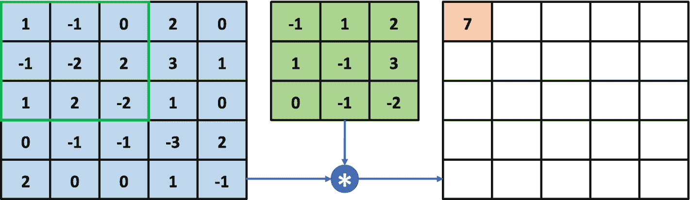
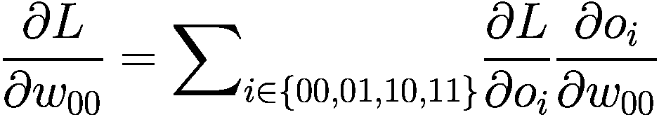
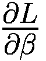
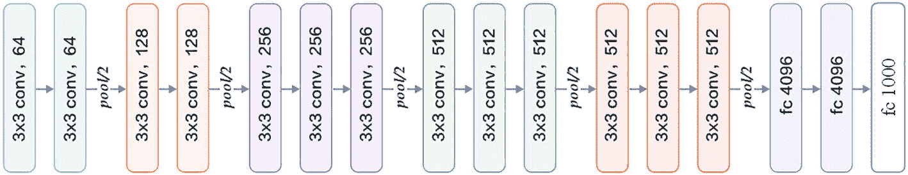
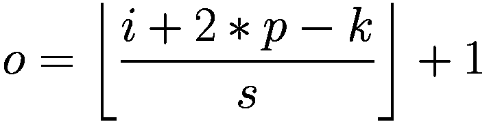
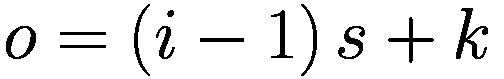
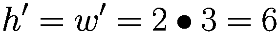

# 十、卷积神经网络

> 目前人工智能还没有达到 5 岁人类的水平，但是在感知方面进步很快。在机器语音和视觉识别领域，五到十年超越人类已经没有悬念。
> 
> —沈向阳

我们介绍了神经网络的基本理论，TensorFlow的使用，以及基本的全连通网络模型，对神经网络有了更全面和深入的了解。但是对于深度学习，我们还是有点怀疑。深度学习的深度是指网络的更深层次，一般在五层以上，目前介绍的神经网络层大多在五层以内实现。那么深度学习和神经网络有什么区别和联系呢？

本质上，深度学习和神经网络指的是同一类型的算法。在 20 世纪 80 年代，基于生物神经元的多层感知器(MLP)数学模型的网络模型被称为神经网络。由于当时计算能力有限、数据量小等因素，神经网络一般只能训练到很少的层数。我们把这种类型的神经网络称为浅层神经网络(shallow neural network)。浅层神经网络不容易从数据中提取高层特征，一般表达能力也不好。虽然在数字图片识别等简单任务中取得了不错的效果，但很快被 90 年代提出的新的支持向量机超越。

加拿大多伦多大学教授杰弗里·辛顿(Geoffrey Hinton)长期坚持神经网络的研究。然而，由于当时支持向量机的流行，神经网络相关的研究遇到了许多障碍。2006 年，Geoffrey Hinton 在[1]中提出了一种逐层预训练算法，可以有效地初始化深度信念网络(DBN)网络，从而使训练大规模、深层次(数百万个参数)的网络成为可能。在论文中，Geoffrey Hinton 将神经网络称为深度神经网络，相关研究也称为深度学习(deep learning)。从这个角度来看，深度学习和神经网络在指定上本质上是一致的，深度学习更侧重于深度神经网络。深度学习的“深度”将在本章的相关网络结构中得到最淋漓尽致的体现。

在学习更深层次的网络模型之前，我们先来考虑这样一个问题:神经网络的理论研究在 80 年代已经基本到位，但为什么未能充分挖掘深度网络的巨大潜力？通过对这个问题的讨论，我们引出本章的核心内容:卷积神经网络。这也是一种可以轻松达到几百层的神经网络。

## 10.1 全连接 N 的问题

首先，我们来分析一下全连通网络的问题。考虑一个简单的四层全连接层网络。输入是调平后的 784 个节点的手写数字图片矢量。中间三个隐层节点数为 256，输出层节点数为十，如图 [10-1](#Fig1) 所示。


图 10-1

四层全连接网络结构简图

我们可以通过 TensorFlow 快速构建这个网络模型:添加 4 个密集层，并使用顺序容器将其封装为一个网络对象:

```py
import tensorflow as tf
from tensorflow import keras
from tensorflow.keras import layers,Sequential,losses,optimizers,datasets
# Create 4-layer fully connected network
model = keras.Sequential([
    layers.Dense(256, activation='relu'),
    layers.Dense(256, activation='relu'),
    layers.Dense(256, activation='relu'),
    layers.Dense(10),
])
# build model and print the model info
model.build(input_shape=(4, 784))
model.summary()

```

使用 summary()函数打印出模型中各层参数的统计结果，如表 [10-1](#Tab1) 所示。网络的参数是如何计算的？每条连接线的权标量被认为是一个参数，所以对于一个有 *n* 个输入节点和 *m* 个输出节点的全连接层，张量 *W* 中包含的参数总共有 *n* ⋅ *m* 个， *m* 个参数包含在向量 *b* 中。因此，全连接层的参数总数为*n*⋅*m*+*m*。以第一层为例，输入特征长度为 784，输出特征长度为 256，当前层的参数量为 784 ⋅ 256 + 256 = 200960。同样的方法可以计算第二层、第三层、第四层的参数量，分别是 65792、65792、*和* 2570。总参数量约 34 万。在计算机中，如果将单个权重保存为 float 类型的变量，至少需要占用 4 个字节的内存(float 在 Python 中占用的内存更多)，那么 34 万个参数至少需要 1.34MB 左右的内存。换句话说，仅存储网络参数就需要 1.34MB 的内存。实际上，网络训练过程还需要缓存计算图、梯度信息、输入和中间计算结果等。，其中与梯度相关的操作会占用大量资源。

表 10-1

网络参数统计

<colgroup><col class="tcol1 align-left"> <col class="tcol2 align-left"> <col class="tcol3 align-left"> <col class="tcol4 align-left"> <col class="tcol5 align-left"></colgroup> 
| 

层

 | 

隐藏层 1

 | 

隐藏层 2

 | 

隐藏层 3

 | 

输出层

 |
| --- | --- | --- | --- | --- |
| 参数数量 | Two hundred thousand nine hundred and sixty | Sixty-five thousand seven hundred and ninety-two | Sixty-five thousand seven hundred and ninety-two | Two thousand five hundred and seventy |

那么训练这样一个网络需要多大的内存呢？我们可以简单地模拟现代 GPU 设备上的资源消耗。在 TensorFlow 中，如果不设置 GPU 内存占用方式，默认会占用所有 GPU 内存。这里 TensorFlow 内存使用量设置为按需分配，其占用的 GPU 内存资源观察如下:

```py
# List all GPU devices
gpus = tf.config.experimental.list_physical_devices('GPU')
if gpus:
  try:
    # Set GPU occupation as on demand
    for gpu in gpus:
      tf.config.experimental.set_memory_growth(gpu, True)
  except RuntimeError as e:
    # excepting handling

    print(e)

```

前面的代码在导入 TensorFlow 库之后、创建模型之前插入。TensorFlow 配置为通过 TF . config . experimental . set _ memory _ growth(GPU，True)按需申请 GPU 内存资源。这样 TensorFlow 占用的 GPU 内存量就是运算所需的量。当批量大小设置为 32 时，我们观察到训练过程中 GPU 内存占用约 708MB，CPU 内存占用约 870MB。因为深度学习框架有不同的设计考虑，所以这个数字仅供参考。即便如此，我们也能感觉到四层全连通层的计算量并不小。

回到 80 年代，1.3MB 网络参数是什么概念？1989 年，Yann LeCun 在关于手写邮政编码识别的论文中使用 256KB 内存的计算机实现了他的算法[2]。这台计算机还配有美国电话电报公司 DSP-32C DSP 计算卡(浮点计算能力约为 25 兆浮点运算)。对于 1.3MB 的网络参数，256KB 内存的电脑连网络参数都加载不了，更别说网络训练了。可以看出，全连接层的较高存储器使用率严重限制了神经网络向更大规模和更深层的发展。

### 局部相关性

接下来，我们探讨如何避免全连接网络参数过大的缺陷。为了讨论方便，我们以图片类型数据的场景为例。对于 2D 图像数据，在进入全连通层之前，需要将矩阵数据展平成一个 1D 向量，然后将每个像素成对连接到每个输出节点，如图 [10-2](#Fig2) 所示。


图 10-2

2D 特征全连通图

可以看出，网络层的每个输出节点都连接到所有输入节点，用于提取所有输入节点的特征信息。这种密集的连接方式是全连接层参数数量大、计算成本高的根本原因。全连接层也叫密集连接层(dense layer)，输出和输入的关系为:


其中*节点* ( *I* )表示第一层的节点集合

那么，有必要将输出节点与所有输入节点连接起来吗？有没有近似的简化模型？我们可以分析输入节点对输出节点的重要性分布，只考虑输入节点中比较重要的部分，舍弃节点中不太重要的部分，这样输出节点只需要连接一些输入节点，表示为:


其中 *top* ( *I* ， *j* ， *k* )表示第 I 层中的 top *k* 节点集合，该集合对于第 j 层中的编号节点具有最高的重要性。这样，全连通层的加权连接可以从第 I 层中的‖ *I* ‖ ⋅ ‖ *J* 减少到第 14 层中的 *k* ⋅ 其中‖ *I* ‖ *和* ‖ *J* 分别表示 I 层和 J 层的节点数。

那么问题就转变为探究第 I 层输入节点对数字输出节点 *j* 的重要性分布。然而，很难找出每个中间节点的重要性分布。我们可以利用先验知识进一步简化这个问题。

在现实生活中，有很多数据使用位置或距离作为重要性分布的度量。比如，住的离自己比较近的人，更容易对自己产生较大的影响(位置相关性)，股票走势预测要更关注近期的走势(时间相关性)；图片的每个像素与周围像素的关联度更大(位置关联)。以 2D 图像数据为例，如果我们简单地认为与当前像素的欧氏距离小于等于的像素更重要，欧氏距离大于的像素更不重要，那么我们就很容易把求每个像素重要性分布的问题简单化。如图 [10-3](#Fig3) 所示，实心网格所在的像素作为参考点，欧氏距离小于等于的像素用矩形网格表示。网格内的像素比较重要，网格外的像素不太重要。这个窗口被称为感受野，它表征了每个像素对中心像素的重要性分布。对于中心像素，将考虑网格内的像素，而忽略网格外的像素。


图 10-3

像素的重要性分布

这种基于距离的重要性分布的假设特征被称为局部相关性。它只关注一些离自己近的节点，而忽略了离自己远的节点。在这种重要性分布的假设下，全连接层的连接方式变成如图 [10-4](#Fig4) 所示。输出节点 *j* 只连接到以 *j* 为中心的局部区域(感受野),不连接其他像素。


图 10-4

本地连接网络

利用局部相关的思想，我们将感受野窗口的高度和宽度记为 *k* (感受野的高度和宽度不一定相等；为方便起见，我们只考虑高度和宽度相等的情况)。当前节点与感受野中的所有像素相连，不考虑外部的其他像素。网络层的输入和输出关系表示如下:


其中 *dist* ( *i* ， *j* )表示 *i* 和 *j* 节点之间的欧氏距离。

### 重量分担

每个输出节点只连接感受野中的 *k* × *k* 个输入节点，输出层节点数为‖ *J* 。所以当前层的参数个数为*k*×*k*×*J*。与全连接层相比，由于 *k* 通常较小，如 1、3 和 5，因此*k*×*k*≪‖*I*成功减少了参数数量。

参数的数量是否可以进一步减少，比如我们是否只需要 *k* × *k* 个参数就可以完成当前层的计算？答案是肯定的。通过权重分担的思想，对于每个输出节点 *o* <sub>*j*</sub> ，使用相同的权重矩阵 *W* ，那么无论输出节点‖ *J* 会有多少，网络层参数的个数总是 *k* × *k* 。如图 [10-5](#Fig5) 所示，计算左上角的输出像素时，使用权重矩阵:

![$$ W=\left[{w}_{11}\ {w}_{12}\ {w}_{13}\ {w}_{21}\ {w}_{22}\ {w}_{23}\ {w}_{31}\ {w}_{32}\ {w}_{33}\ \right] $$](img/515226_1_En_10_Chapter_TeX_Equd.png)

与相应感受野内的像素相乘累加，作为左上像素的输出值。计算右下感受野时，共享权重参数 *W* ，即使用相同的权重参数 *W* 相乘累加得到右下像素值的输出。此时网络层只有 3 × 3 = 9 个参数，与输入输出节点数无关。


图 10-5

重量分配矩阵图

通过应用局部相关和权重共享的思想，我们成功地将网络参数的数量从‖*I*‖×*J*‖减少到 *k* × *k* (准确地说，是在单输入通道和单卷积核的条件下)。这种加权的“局部连接层”网络实际上是一种卷积神经网络。接下来，我们将从数学的角度介绍卷积运算，然后正式学习卷积神经网络的原理和实现。

### 卷积运算

在局部相关性的先验下，我们提出了一个简化的“局部连接层”对于窗口 *k* × *k* 中的所有像素，通过相乘和累加权重提取特征信息，每个输出节点提取感受野区域对应的特征。信息。这个运算其实是信号处理领域的一个标准运算:离散卷积运算。离散卷积运算在计算机视觉中有着广泛的应用。下面是卷积神经网络层的数学解释。

在信号处理领域，1D 连续信号的卷积运算定义为两个函数的积分:函数 *f* ( *τ* ，函数 *g* ( *τ* ，其中中 *g* ( *τ* )翻转平移后变成*g*(*n*-*τ*)。1D 连续卷积被定义为:


离散卷积用累加运算代替了积分运算:


至于卷积为什么这样定义，限于篇幅我就不细说了。我们集中讨论 2D 离散卷积运算。在计算机视觉中，卷积运算是基于 2D 图像函数 *f* ( *m* ， *n* )和 2D 卷积核 *g* ( *m* ， *n* )，其中 *f* ( *i* ， *j* )和 *g* ( *i* ，*j*2D 离散卷积定义为:

![$$ \left[f\bigotimes g\right]\left(m,n\right)={\sum}_{i=-\infty}^{\infty }{\sum}_{j=-\infty}^{\infty }f\left(i,j\right)g\left(m-i,n-j\right) $$](img/515226_1_En_10_Chapter_TeX_Equg.png)


图 10-6

2D 图像函数 *f* ( *i* 、 *j* )和卷积核函数 *g* ( *i* 、 *j* )

让我们详细介绍一下 2D 离散卷积运算。先将卷积核函数 *g* ( *i* ， *j* )(每次沿 *x* 和 *y* 方向反转)变成*g*(-) I，-*j*)。当( *m* ，*n*)=(1，1)；这意味着卷积核函数*g*(1*I*，1*j*)翻转，然后向左上方移动一个单位。此时:

![$$ \left[f\bigotimes g\right]\left(-1,-1\right)={\sum}_{i=-\infty}^{\infty }{\sum}_{j=-\infty}^{\infty }f\left(i,j\right)g\left(-1-i,-1-j\right)={\sum}_{i\in \left[-1,1\right]}{\sum}_{j\in \left[-1,1\right]}f\left(i,j\right)g\left(-1-i,-1-j\right) $$](img/515226_1_En_10_Chapter_TeX_Equh.png)

2D 函数只有在*I*∈[1，1]，*j*∈[1，1]时才有有效值。在其他位置，则为 0。根据计算公式，我们可以得到[ *f* ⨂ *g* ](0，1) = 7，如图 [10-7](#Fig7) 。


图 10-7

离散卷积运算-1

同样，当( *m* ， *n* ) = (0，1):*f*⨂*g*](0，1)=∑<sub>*I*∈【1，1】∈<sub>*j*∈【1，1】</sub>*f*(*I*</sub>

 *即卷积核翻转后，单位上移，对应位置相乘累加，[ *f* ⨂ *g* ](0，1) = 7，如图 [10-8](#Fig8) 。


图 10-8

离散卷积运算-2

当( *m* ， *n* ) = (1，1):

![$$ \left[f\bigotimes g\right]\left(1,-1\right)={\sum}_{i\in \left[-1,1\right]}{\sum}_{j\in \left[-1,1\right]}f\left(i,j\right)g\left(1-i,-1-j\right) $$](img/515226_1_En_10_Chapter_TeX_Equi.png)

即卷积核翻转后向右上方平移一个单位，对应位置相乘累加，[ *f* ⨂ *g* ](1，1) = 1，如图 [10-9](#Fig9) 。


图 10-9

离散卷积运算-3

当( *m* ，*n*)=(1，0):

![$$ \left[f\bigotimes g\right]\left(-1,0\right)={\sum}_{i\in \left[-1,1\right]}{\sum}_{j\in \left[-1,1\right]}f\left(i,j\right)g\left(-1-i,-j\right) $$](img/515226_1_En_10_Chapter_TeX_Equj.png)

即卷积核翻转后向左平移一个单位，对应位置相乘累加，[*f*⨂*g*](1，0) = 1，如图 [10-10](#Fig10) 所示。


图 10-10

离散卷积运算-4

这样循环计算，我们就可以得到函数[ *f* ⨂ *g* ]( *m* ， *m* )，*m*∈[1，1]，*n*∈[1，1]]的所有值，如图 [10-11](#Fig11) 所示。


图 10-11

2D 离散卷积运算

到目前为止，我们已经成功地完成了图像函数和卷积核函数的卷积运算，以获得新的特征图。

回想一下“权重乘累加”的运算，我们记为[ *f* ⋅ *g* ]( *m* ，*n*):[*f*⋅*g*](*m*，*n*)=∑<sub>*I*∑[-*w*/2， *h*/2】</sub>*f*(*I*，*j*)*g*(*I*—*m*，*j*—*m*)

仔细对比标准的 2D 卷积运算，不难发现“权乘累加”中的卷积核函数 *g* ( *m* ， *n* )并没有翻转。对于神经网络，目标是学习一个函数 *g* ( *m* ， *n* )，使 *L* 尽可能小。至于是不是正好是卷积运算中定义的“卷积核”函数，并不是很重要，因为我们不会直接用到。在深度学习中，函数 *g* ( *m* ， *n* )统称为卷积核(kernel)，有时也称为滤波器、权重等。由于总是使用函数 *g* ( *m* ， *n* )来完成卷积运算，所以卷积运算实际上已经实现了重量共享的思想。

我们来总结一下 2D 离散卷积的运算过程:每次通过移动卷积核，与画面对应位置的感受野像素相乘累加，得到该位置的输出值。卷积核是一个行和列的大小为 *k* 的权重矩阵 *W* 。特征图上与尺寸 *k* 相对应的窗口为感受野。感受野和权重矩阵相乘并累加，得到该位置的输出值。通过权重共享，我们逐渐将卷积核从左上向右下移动，提取每个位置的像素特征，直到右下，完成卷积运算。可见两种理解方式是一致的。从数学的角度来看，卷积神经网络是完成 2D 函数的离散卷积运算；从局部相关性和权重分担的角度，也可以得到同样的效果。通过这两个视角，我们不仅可以直观地理解卷积神经网络的计算过程，而且可以从数学的角度进行严密的推导。正是基于卷积运算，卷积神经网络才能如此命名。

在计算机视觉领域，2D 卷积运算可以提取数据的有用特征，用特定的卷积核对输入图像进行卷积运算，得到具有不同特征的输出图像。如表 [10-2](#Tab2) 所示，列出了一些常见的卷积核以及相应的效果。

表 10-2

常见卷积核及其作用

<colgroup><col class="tcol1 align-justify"> <col class="tcol2 align-justify"></colgroup> 
|  |

## 10.2 卷积神经网络

卷积神经网络充分利用了局部相关和权重共享的思想，大大减少了网络参数的数量，从而提高了训练效率，更容易实现超大规模的深度网络。2012 年，加拿大多伦多大学的 Alex Krizhevsky 将深度卷积神经网络应用于大规模图像识别挑战 ILSVRC-2012，在 ImageNet 数据集上取得了 15.3%的 Top-5 错误率，排名第一。与第二名相比，Alex 将前 5 名的错误率降低了 10.9% [3]。这一巨大突破引起了业界的强烈关注。卷积神经网络迅速成为计算机视觉领域的新宠。随后，在一系列的工作中，基于卷积的神经网络模型相继被提出，并在原有的性能上取得了巨大的改善。

现在我们来介绍一下卷积神经网络层的具体计算过程。以 2D 影像数据为例，卷积层接受输入特征图 *X* ，高度 *h* ，宽度 *w* ，通道数 *c* <sub>*在*</sub> 。在*c*<sub>*out*</sub>高 *h* 宽 *w* 和 中通道数 *c* <sub>*的作用下，特征映射为高*h*<sup>′</sup>宽*w*【T34′和 *c 应当注意，卷积核的高度和宽度可以不相等。为了简化讨论，我们只考虑等高和等宽的情况，然后可以很容易地推广到等高和不等宽的情况。**</sub>

我们首先讨论单通道输入和单卷积核，然后推广到多通道输入和单卷积核，最后讨论多通道输入和多卷积核的最常用和最复杂的卷积层实现。

### 10.2.1 单通道输入和单卷积内核

先讨论单通道输入 *c* <sub>*在*</sub> = 1，比如一幅灰度图像只有一个通道的灰度值，单卷积核*c*<sub>*out*</sub>= 1。以大小为 5 × 5 的输入矩阵 *X* 和大小为 3 × 3 的卷积核矩阵为例，如图 [10-12](#Fig12) 所示。与卷积核大小相同的感受野(输入 *X* 上方的绿框)首先移动到输入 *X* 的左上方。选择输入上的感受野元素，乘以卷积核的对应元素(图中中间的方框):

![$$ \left[1-1\ 0-1-2\ 2\ 1\ 2-2\ \right]\bigodot \left[-1\ 1\ 2\ 1-1\ 3\ 0-1-2\ \right]=\left[-1-1\ 0-1\ 2\ 6\ 0-2\ 4\ \right] $$](img/515226_1_En_10_Chapter_TeX_Equk.png)

⨀符号表示哈达玛乘积，即矩阵的相应元素相乘。符号@(矩阵乘法)是矩阵运算的另一种常见形式。矩阵运算后，所有 9 个值相加:


我们得到标量 7，写入输出矩阵第一行第一列的位置，如图 [10-12](#Fig12) 所示。



图 10-12

3 × 3 卷积运算-1

第一个感受野区域的特征提取完成后，感受野窗口向右移动一个步长单位(步长，记为 *s* ，默认为 1)，选择图 [10-13](#Fig13) 中绿色框内的 9 个感受野元素。同样，将卷积核的相应元素相乘并累加，可以得到输出 10，写入第一行第二列位置。


图 10-13

3 × 3 卷积运算-2

将感受野窗口再次向右移动一个步长单位，选择图 [10-14](#Fig14) 中绿色方框内的元素，与卷积核相乘累加，得到输出 3，写入输出的第一行第三列，如图 [10-14](#Fig14) 所示。


图 10-14

3 × 3 卷积运算-3

此时感受野已经移动到有效像素输入的最右侧，不能继续向右移动(不填充无效元素)，所以感受野窗口下移一个步长单位( *s* = 1)，回到当前行的开头，继续选择新的感受野元素区域，如图 [10-15](#Fig15) 所示，卷积核运算得到 output -1。因为感受野下移一步，所以输出值-1 被写入第二行第一列位置。


图 10-15

3 × 3 卷积运算-4

按照前面的方法，感受野每右移一步( *s* = 1)，如果超出输入边界，则下移一步( *s* = 1)，返回到行首，直到感受野移动到最右最底的位置，如图 [10-16](#Fig16) 所示。每个选择的感受野元素乘以卷积核的相应元素，并写入输出的相应位置。最后，我们得到一个 3 × 3 的矩阵，比输入的 5 × 5 略小，这是因为感受野不能超出单元边界。可以看出，卷积运算的输出矩阵的大小是由卷积核的大小 *k* 、输入 *X* 的高度 *h* 和宽度 *w* 、移动步长 *s* 以及是否填充边界决定的。


图 10-16

3 × 3 卷积运算-5

现在我们介绍了单通道输入和单卷积核的计算过程。神经网络输入通道的实际数量通常很大。接下来，我们将学习多通道输入和单个卷积核的卷积运算方法。

### 10.2.2 多通道输入和单卷积内核

多通道输入卷积层更常见。例如，彩色图像包含三个通道(R/G/B)。每个通道上的像素值表示 R/G/B 颜色的强度。下面我们以三通道输入和单卷积核为例，将单通道输入的卷积运算扩展到多通道。如图 [10-17](#Fig17) 所示，每行最左边的 5 × 5 矩阵代表输入通道 1~3，第二列的 3 × 3 矩阵代表卷积核的通道 1~3，第三列的矩阵代表当前通道上计算的中间矩阵；最右边的矩阵表示卷积层运算的最终输出。

在多通道输入的情况下，卷积核的通道数需要与输入通道数相匹配。计算卷积核的第*到第*个通道和输入 *X* 的第*到第*个通道，得到第一个中间矩阵，然后可以看作单输入单卷积核的情况。所有通道的中间矩阵的相应元素被再次相加，作为最终输出。

具体计算过程如下:初始状态下，如图 [10-17](#Fig17) 所示，每个通道上的感受野窗口同步落在相应通道上最左边和最上面的位置。感受野区域元素和每个通道上的卷积核相乘并累加相应通道上的矩阵，得到三个通道上输出 7，-11，-1 的中间变量，然后我们可以将这些中间变量相加得到输出-5，并写入相应的位置。


图 10-17

多通道输入和单卷积核-1

然后，感受野窗口在每个通道上同步向右移动一步( *s* = 1)。此时感受野区域元素如图 [10-18](#Fig18) 所示。每个通道上的感受野乘以卷积核的相应通道上的矩阵，然后累加得到中间变量 10、20 和 20。然后，我们将它们相加得到输出 50，并写入第一行和第二列的元素位置。


图 10-18

多通道输入和单卷积核-2

这样，感受野窗口同步移动到最右边和最底部的位置。完成输入和卷积核的所有卷积运算，得到的 3 × 3 输出矩阵如图 [10-19](#Fig19) 所示。


图 10-19

多通道输入和单卷积核-3

整个计算框图如图 [10-20](#Fig20) 所示。每个输入通道的感受野乘以卷积核的相应通道，以获得与通道数量相等的中间变量。将所有这些中间变量相加以获得当前位置的输出值。输入通道的数量决定了卷积核通道的数量。一个卷积核只能得到一个输出矩阵，与输入通道的数量无关。


图 10-20

多通道输入和单卷积核图

一般来说，一个卷积核只能完成某个逻辑特征的提取。当需要同时提取多个逻辑特征时，可以通过增加多个卷积核来提高神经网络的表达能力。多声道输入和多卷积核就是这种情况。

### 10.2.3 多通道输入和多重卷积内核

多通道输入和多卷积核是卷积神经网络最常见的形式。我们已经介绍了单卷积核的运算过程。每个卷积核和输入被卷积以获得输出矩阵。当有多个卷积核时，将第 *i* th ( *i* ∈ [1， *n* ， *n* 为卷积核的个数)卷积核和输入 *X* 得到第 *i* 个输出矩阵(也称为输出张量 *O* 的通道 *i* ，最后将通道维中的所有输出矩阵缝合在一起(堆栈操作创建一个新的

以一个具有三个输入通道和两个卷积核的卷积层为例。第一个卷积核与输入 *X* 得到第一个输出通道，第二个卷积核与输入 *X* 得到第二个输出通道，如图 [10-21](#Fig21) 。两个输出通道缝合在一起，形成最终输出 *O* 。统一设置每个卷积核的大小 *k* 、步长 *s* 和填充设置，以保证每个输出通道具有相同的大小，满足拼接的条件。


图 10-21

多重卷积核图

### 步幅大小

在卷积运算中，如何控制感受野布局的密度？对于具有高信息密度的输入，例如具有大量对象的图片，为了最大化有用的信息，在网络设计期间，期望更密集地布置感受野窗口。对于信息密度较低的输入，比如海洋的图片，我们可以适当减少感受野的数量。感受野密度的控制方法一般通过移动步幅来实现。

步幅大小是指感受野窗口每次移动的长度单位。对于 2D 输入，分为 *x* (向右)方向和 *y* (向下)方向的移动长度。为了简化讨论，我们只考虑两个方向的步长相同的情况，这也是神经网络中最常见的设置。如图 [10-22](#Fig22) 所示，绿色实线代表感受野窗口的位置，绿色虚线代表最后一个感受野的位置。从最后位置到当前位置的移动长度是步幅大小的定义。在图 [10-22](#Fig22) 中，感受野在 *x* 方向的步长为 2，表示为 *s* = 2。


图 10-22

步长图(即步幅)

当感受野到达输入 *X* 的右边界时，它向下移动一步( *s* = 2)并返回到行首，如图 [10-23](#Fig23) 所示。


图 10-23

卷积运算步长解算-1

如图 [10-24](#Fig24) 所示，来回循环直至到达底部和右侧边缘。卷积层的最终输出高度和宽度只有 2 × 2。与以前的情况( *s* = 1)相比，输出高度和宽度从 3 × 3 减少到 2 × 2，感受野的数量减少到只有 4 个。


图 10-24

卷积运算步长解算-2

可以看出，通过设置步幅大小，可以有效地控制信息密度的提取。步长较小时，感受野移动窗口较小，有助于提取更多的特征信息，输出张量的大小较大；当步长较大时，感受野移动窗口较大，有助于降低计算成本和过滤冗余信息，当然输出张量的大小也较小。

### 填料

卷积运算后，输出的高度和宽度通常会小于输入的高度和宽度。即使步幅大小为 1，输出的高度和宽度也将略小于输入的高度和宽度。当设计网络模型时，有时希望输出的高度和宽度可以与输入的高度和宽度相同，从而便于网络参数和剩余连接的设计。为了使输出的高度和宽度等于输入的高度和宽度，通常通过在原始输入的高度和宽度上填充几个无效元素来增加输入。通过仔细设计填充单元的数量，卷积运算后输出的高度和宽度可以等于原始输入，甚至更大。

如图 [10-25](#Fig25) 所示，我们可以在顶部、底部、左侧或右侧边界填充一个不确定的数字。默认填充数为 0，也可以用自定义数据填充。在图 [10-25](#Fig25) 中，上下方向填充一行，左右方向填充两列。


图 10-25

矩阵填充图

那么如何计算填充后的卷积层数呢？我们可以简单地用填充后得到的新张量*X*<sup>’</sup>代替输入 *X* 。如图 [10-26](#Fig26) 所示，感受野的初始位置在*X*T10】′的左上方。与前面类似，获得输出 1 并写入输出张量的相应位置。


图 10-26

填充-1 后的卷积运算

将步幅移动一个单位，重复操作得到输出 0，如图 [10-27](#Fig27) 所示。


图 10-27

填充-2 后的卷积运算

来回循环，得到的输出张量如图 [10-28](#Fig28) 所示。


图 10-28

填充-3 后的卷积运算

通过精心设计的填充方案，即向上、向下、向左、向右填充一个单元( *p* = 1)，可以得到与输入高度和宽度相同的结果 *O* 。没有填充，如图 [10-29](#Fig29) 所示，我们只能得到略小于输入的输出。


图 10-29

无填充的卷积输出

卷积神经层的输出大小[ *b* ， *h* ，<sup>’</sup>，*w*<sup>’</sup>，*c*<sub>*out*</sub>由卷积核的个数*c*<sub>*out*</sub>、卷积核的大小 *k* 、步长 *s 决定 填充数 *p* (仅考虑上下填充数 *p* <sub>*h*</sub> ，左右填充数 *p* <sub>*w*</sub> )，以及输入 *X* 的高度 *h* 和宽度 *w* 。 之间的数学关系可以表示为:*


其中 *p* <sub>*h*</sub> 和 *p* <sub>*w*</sub> 分别表示高度和宽度方向的填充量，⌊⋅⌋表示向下舍入。以前面的例子为例， *h* = *w* = 5， *k* = 3，*p*<sub>*h*</sub>=*p*<sub>*w*</sub>= 1， *s* = 1，则输出为:


在 TensorFlow 中，当在 *s* = 1，如果想让输出 *O* 和输入 *X* 的高度和宽度相等，只需要简单设置参数 padding="SAME "就可以让 TensorFlow 自动计算填充数，非常方便。

## 10.3 卷积层实现

在 TensorFlow 中，你既可以通过自定义权重的底层实现来构建神经网络，也可以直接调用卷积层的高层 API 来快速构建复杂的网络。我们主要以 2D 卷积为例介绍如何实现一个卷积神经网络层。

### 定制重量

在 TensorFlow 中，2D 卷积运算可以通过 tf.nn.conv2d 函数轻松实现。tf.nn.conv2d 根据输入*X*:中的 *b* 、 *h* 、 *w* 、 *c* <sub>*和*</sub> 中的卷积核*W*:*k*、 *k* 、 *c* <sub>*进行卷积运算 *h*T38’， *w* ，，*c*<sub>*out*</sub>其中*</sub> 中的 *c* <sub>*表示输入通道的数量，*c*<sub>*out*</sub>表示卷积核的数量*</sub>

```py
In [1]:
x = tf.random.normal([2,5,5,3]) # input with 3 channels with height and width 5
# Create w using [k,k,cin,cout] format, 4 3x3 kernels
w = tf.random.normal([3,3,3,4])
# Stride is 1, padding is 0,
out = tf.nn.conv2d(x,w,strides=1,padding=[[0,0],[0,0],[0,0],[0,0]])
Out[1]: #  shape of output tensor
TensorShape([2, 3, 3, 4])

```

填充参数的格式为:

```py
padding=[[0,0],[top,bottom],[left,right],[0,0]]

```

例如，如果一个单元在所有方向(上、下、左、右)都被填满，则填充参数如下:

```py
In [2]:
x = tf.random.normal([2,5,5,3]) # input with 3 channels with height and width 5
# Create w using [k,k,cin,cout] format, 4 3x3 kernels
w = tf.random.normal([3,3,3,4])
# Stride is 1, padding is 0,
out = tf.nn.conv2d(x,w,strides=1,padding=[[0,0],[1,1],[1,1],[0,0]])
Out[2]: # shape of output tensor
TensorShape([2, 5, 5, 4])

```

具体来说，通过设置参数 padding='SAME '和 strides=1，我们可以得到卷积层输入和输出的相同大小，其中填充的具体数目由 TensorFlow 自动计算。例如:

```py
In [3]:
x = tf.random.normal([2,5,5,3]) # input
w = tf.random.normal([3,3,3,4]) # 4 3x3 kernels
# Stride is 1,padding is "SAME"
# padding="SAME" gives use same size only when stride=1
out = tf.nn.conv2d(x,w,strides=1,padding='SAME')
Out[3]: TensorShape([2, 5, 5, 4])

```

当 *s* 例如:

```py
In [4]:
x = tf.random.normal([2,5,5,3])
w = tf.random.normal([3,3,3,4])
out = tf.nn.conv2d(x,w,strides=3,padding='SAME')
Out [4]:TensorShape([2, 2, 2, 4])

```

卷积神经网络层和全连接层一样，网络可以设置一个偏置向量。tf.nn.conv2d 函数不实现偏置向量的计算。我们可以手动添加偏差。例如:

```py
# Create bias tensor
b = tf.zeros([4])
# Add bias to convolution output. It’ll broadcast to size of [b,h',w',cout]
out = out + b

```

### 卷积层类别

通过卷积层类层。Conv2D，可以直接定义卷积核 *W* 和偏置张量 *b* 并直接调用类实例完成卷积层的正演计算。在 TensorFlow 中，API 的命名有一定的规则。大写字母的对象一般代表类，所有小写一般代表功能，比如层。Conv2D 表示卷积层类，nn.conv2d 表示卷积函数。使用类方法将自动创建所需的权重张量和偏差向量。用户不需要记忆卷积核张量的定义格式，因此使用起来更加简单方便，但我们也失去了一些灵活性。函数接口需要自己定义权重和偏置，更加灵活。

当创建一个新的卷积层类时，只需要指定卷积核参数过滤器的数量、卷积核的大小 kernel_size、步距、填充等。具有 4 个 3 × 3 卷积核的卷积层创建如下(步长为 1，填充方案为“相同”):

```py
layer = layers.Conv2D(4,kernel_size=3,strides=1,padding='SAME')

```

如果卷积核的高度和宽度不相等，沿不同方向的步距也不相等，则需要设计元组格式的 kernel_size 参数( *k* <sub>*h*</sub> ， *k* <sub>*w*</sub> )和步距参数( *s* <sub>*h*</sub> ， *s* <sub>*w* 创建 4 个 3 × 4 卷积核如下(*s*<sub>*h*</sub>= 2 在垂直方向，*s*<sub>*w*</sub>= 1 在水平方向):</sub>

```py
layer = layers.Conv2D(4,kernel_size=(3,4),strides=(2,1),padding='SAME')

```

创建完成后，可以通过调用实例(__call__ method)来完成正向计算，例如:

```py
In [5]:
layer = layers.Conv2D(4,kernel_size=3,strides=1,padding='SAME')
out = layer(x) # forward calculation
out.shape # shape of output
Out[5]:TensorShape([2, 5, 5, 4])

```

在 Conv2D 类中保存了卷积核张量 *W* 和偏差 *b* ，通过类成员 trainable _ variables 可以直接返回 *W* 和 *b* 的列表。例如:

```py
In [6]:
# Return all trainable variables
layer.trainable_variables
Out[6]:
[<tf.Variable 'conv2d/kernel:0' shape=(3, 3, 3, 4) dtype=float32, numpy=
 array([[[[ 0.13485974, -0.22861657,  0.01000655,  0.11988598],
          [ 0.12811887,  0.20501086, -0.29820845, -0.19579397],
          [ 0.00858489, -0.24469738, -0.08591779, -0.27885547]], ...
 <tf.Variable 'conv2d/bias:0' shape=(4,) dtype=float32, numpy=array([0., 0., 0., 0.], dtype=float32)>]

```

这个 layer.trainable _ variables 类成员对于获取网络层中要优化的变量非常有用。也可以直接调用类实例 layer.kernel、layer.bias 来访问 *W* 和 *b* 。

## 10.4 动手操作 LeNet-5

20 世纪 90 年代，Yann LeCun 等人提出了一种用于识别手写数字和机印字符图片的神经网络，命名为 LeNet-5 [4]。LeNet-5 的提出使卷积神经网络在当时成功商业化，并广泛应用于邮政编码和支票号码识别等任务中。图 [10-30](#Fig30) 是 LeNet-5 的网络结构图。它接受大小为 32 × 32 的数字和字符图片作为输入，然后通过第一个卷积层获得形状为[ *b* ，28，28，6]的张量。在下采样层之后，张量大小被减小到[*b*，14，14，6]。在第二个卷积层之后，张量形状变成[ *b* ，10，10，16]。经过类似的下采样层，张量大小减少到[ *b* ，5，5，16]。在进入全连接层之前，张量被转换成形状[ *b* ，400]并馈入两个全连接层，输入节点数分别为 120 和 84。获得形状为[ *b* ，84]的张量，并最终通过高斯连接层。


图 10-30

LeNet-5 结构[4]

现在看来，LeNet-5 网络的层数更少(两个卷积层和两个全连接层)，参数更少，计算成本更低，特别是在现代 GPU 的支持下，可以在几分钟内训练完成。

我们基于 LeNet-5 做了一些调整，使其更容易使用现代深度学习框架实现。首先，我们将输入形状从 32 × 32 调整为 28 × 28，然后将两个下采样层实现为最大池层(降低特征图的高度和宽度，这将在后面介绍)，最后将高斯连接层替换为全连接层。修改后的网络在下文中也被称为 LeNet-5 网络。网络结构图如图 [10-31](#Fig31) 所示。


图 10-31

改进的 LeNet-5 结构

我们基于 MNIST 手写数字图片数据集训练 LeNet-5 网络，并测试其最终精度。我们已经介绍了如何在 TensorFlow 中加载 MNIST 数据集，所以在此不再赘述。

首先通过顺序容器创建 LeNet-5，如下所示:

```py
from tensorflow.keras import Sequential

network = Sequential([
    layers.Conv2D(6,kernel_size=3,strides=1), # Convolutional layer with 6 3x3 kernels
    layers.MaxPooling2D(pool_size=2,strides=2), # Pooling layer with size 2
    layers.ReLU(), # Activation function
    layers.Conv2D(16,kernel_size=3,strides=1), # Convolutional layer with 16 3x3 kernels

    layers.MaxPooling2D(pool_size=2,strides=2), # Pooling layer with size 2
    layers.ReLU(), # Activation function
    layers.Flatten(), # Flatten layer

    layers.Dense(120, activation='relu'), # Fully-connected layer
    layers.Dense(84, activation='relu'), # Fully-connected layer
    layers.Dense(10) # Fully-connected layer
                    ])
# build the network
network.build(input_shape=(4, 28, 28, 1))
# network summary

network.summary()

```

summary()函数统计各层的参数并打印出网络结构信息和各层参数的详细情况，如表 [10-3](#Tab3) 所示，我们可以和全连通网络 10.1 的参数标度进行比较。

表 10-3

网络参数统计

<colgroup><col class="tcol1 align-left"> <col class="tcol2 align-left"> <col class="tcol3 align-left"> <col class="tcol4 align-left"> <col class="tcol5 align-left"> <col class="tcol6 align-left"></colgroup> 
| 

层

 | 

卷积层 1

 | 

卷积层 2

 | 

完全连接的第 1 层

 | 

完全连接的第 2 层

 | 

完全连接的第 3 层

 |
| --- | --- | --- | --- | --- | --- |
| 参数数量 | Sixty | Eight hundred and eighty | Forty-eight thousand one hundred and twenty | Ten thousand one hundred and sixty-four | Eight hundred and fifty |

可以看出，卷积层的参数量很小，主要参数量集中在全连接层。因为卷积层降低了输入特征维数很多，所以全连接层的参数量不会太大。整个模型的参数数量约为 60K，表 10.1 中的全连通网络参数数量达到 340000 个，因此卷积神经网络可以在增加网络深度的同时显著减少网络参数数量。

在训练阶段，首先在数据集中 shape[ *b* ，28，28，1]的原始输入上增加一个维度(*b*，28，28，1】，并发送给模型进行正演计算，得到 shape [ *b* ，10]的输出张量。我们创建了一个新的交叉熵损失函数类来处理分类任务。通过设置 from_logits=True 标志，在损失函数中实现 softmax 激活函数，无需手动添加损失函数，提高了数值稳定性。代码如下:

```py
from tensorflow.keras import losses, optimizers
# Create loss function
criteon = losses.CategoricalCrossentropy(from_logits=True)

```

培训实施如下:

```py
    # Create Gradient tape environment
    with tf.GradientTape() as tape:
        # Expand input dimension =>[b,28,28,1]
        x = tf.expand_dims(x,axis=3)
        # Forward calculation, [b, 784] => [b, 10]
        out = network(x)
        # One-hot encoding, [b] => [b, 10]
        y_onehot = tf.one_hot(y, depth=10)
        # Calculate cross-entropy
        loss = criteon(y_onehot, out)

```

获得损耗值后，损耗和网络参数 network.trainable _ variables 之间的梯度由 TensorFlow 的梯度记录器 tf 计算。GradientTape()，网络权重参数由优化器对象自动更新，如下所示:

```py
    # Calcualte gradient
    grads = tape.gradient(loss, network.trainable_variables)
    # Update paramaters
    optimizer.apply_gradients(zip(grads, network.trainable_variables))

```

重复上述步骤几次后，即可完成训练。

在测试阶段，由于不需要记录梯度信息，代码一般不需要在“有 tf 的环境”中编写。GradientTape()作为磁带”。正向计算得到的输出通过 Softmax 函数后，我们得到网络预测当前图片 *x* 属于类别*I*(*I*∈【0，9】)的概率 *P* 。使用 argmax 函数选择概率最高的元素的索引作为当前预测类别，与真实标签进行比较，计算比较结果中真实样本的个数。具有正确预测的样本数除以总样本数，得到网络的测试精度。

```py
        # Use correct to record the number of correct predictions
        # Use total to record the total number
        correct, total = 0,0
        for x,y in db_test: # Loop through all samples
            # Expand dimension =>[b,28,28,1]
            x = tf.expand_dims(x,axis=3)
            # Forward calculation to get probability, [b, 784] => [b, 10]
            out = network(x)
            # Technically, we should pass out to softmax() function firs.
 # But because softmax() doesn’t change the order the numbers, we omit the softmax() part.
            pred = tf.argmax(out, axis=-1)
            y = tf.cast(y, tf.int64)
            # Calculate the correct prediction number
            correct += float(tf.reduce_sum(tf.cast(tf.equal(pred, y),tf.float32)))
            # Total sample number
            total += x.shape[0]
        # Calculate accuracy
        print('test acc:', correct/total)

```

在数据集上循环训练 30 个历元后，网络的训练准确率达到 98.1%，测试准确率也达到 97.7%。对于简单的手写数字图片识别任务，老的 LeNet-5 网络已经可以取得不错的效果，但是对于稍微复杂一点的任务，比如彩色动物图片识别，LeNet-5 的性能会急剧下降。

## 10.5 表征学习

我们介绍了卷积神经网络层的工作原理和实现方法。复杂的卷积神经网络模型也是基于卷积层的堆叠。在过去，研究人员已经发现，网络层越深，模型的表达能力越强，越有可能实现更好的性能。那么堆叠卷积网络的特点是什么，使得层越深，网络的表达能力越强呢？

2014 年，马修·d·泽勒等人[5]试图用可视化的方法来准确理解卷积神经网络学习了什么。通过使用“反进化网络”将每一层的特征映射回输入图片，我们可以查看学习到的特征分布，如图 [10-32](#Fig32) 所示。可以观察到，第二层的特征对应于底层图像的提取，例如边缘、角和颜色；第三层开始捕捉纹理的中间特征；第四层和第五层呈现对象的一些特征，例如小狗的脸、鸟的脚和其他高级特征。通过这些可视化，我们可以在一定程度上体验卷积神经网络的特征学习过程。


图 10-32

卷积神经网络特征的可视化[5]

图像识别过程通常被认为是表征学习过程。它从接收到的原始像素特征开始，逐步提取边缘、角点等低层特征，然后是纹理等中层特征，最后是物体部分等高层特征。最后的网络层基于这些学习到的抽象特征表示来学习分类逻辑。层越高，学习的特征越准确，分类器的分类就越有利，从而获得更好的性能。从表征学习的角度来看，卷积神经网络是逐层提取特征的，网络训练的过程可以认为是一个特征学习的过程。基于学习到的高级抽象特征，可以方便地执行分类任务。

应用表示学习的思想，一个训练有素的卷积神经网络往往可以学习到更好的特征。这种特征提取方法一般是通用的。例如，在猫和狗的任务中学习头、脚、身体和其他特征的表征在某种程度上也可以用于其他动物。基于这种思想，在任务 A 上训练的深度神经网络的前几个特征提取层可以迁移到任务 B 上，只需要训练任务 B 的分类逻辑(表示为网络的最后一层)。这种方法是一种迁移学习，也称为微调。

## 10.6 梯度传播

完成手写数字图像识别练习后，我们对卷积神经网络的使用有了初步的了解。现在我们来解决一个关键问题。卷积层通过移动感受野来实现离散卷积运算。那么它的梯度传播是如何工作的呢？

考虑一个简单的例子，输入是一个 3 × 3 单通道矩阵，使用一个 2 × 2 卷积内核来执行卷积运算。然后，我们计算展平输出和相应标签之间的误差，如图 [10-33](#Fig33) 所示。让我们讨论一下这种情况下的梯度更新方法。


图 10-33

卷积层的梯度传播示例

首先导出输出张量 *O* 的表达式:

*o*<sub>00</sub>=*x*<sub>00</sub>*w*<sub>00</sub>+*x*<sub>01</sub>*w*<sub>01</sub>+*x*<sub>10</sub>*w*<sub>10</sub>+*x*

*o*<sub>01</sub>=*x*<sub>01</sub>*w*<sub>00</sub>+*x*<sub>02</sub>*w*<sub>01</sub>+*x*<sub>11</sub>*w*<sub>10</sub>+*x*

*o*<sub>10</sub>=*x*<sub>10</sub>*w*<sub>00</sub>+*x*<sub>11</sub>*w*<sub>01</sub>+*x*<sub>20</sub>*w*<sub>10</sub>+*x*

*o*<sub>11</sub>=*x*<sub>11</sub>*w*<sub>00</sub>+*x*<sub>12</sub>*w*<sub>01</sub>+*x*<sub>21</sub>*w*<sub>10</sub>+*x*

以 *w* <sub>00</sub> 梯度计算为例，按链式法则分解:



其中可以直接从误差函数中导出。我们来考虑一下:


类似地，可以推导出:


可以观察到，循环移动感受野的方法并没有改变网络层的衍生性，梯度的推导也并不复杂。但是当网络层数增加时，人工的梯度推导会变得非常繁琐。不过不用担心，深度学习框架可以帮助我们自动完成所有参数的梯度计算和更新，我们只需要设计好网络结构。

## 10.7 汇集层

在卷积层，可以通过调整步长参数 s 来降低特征图的高度和宽度，从而减少网络参数的数量。事实上，除了设置步幅大小，还有一个特殊的网络层也可以减少参数数量，这就是所谓的池层。

池层也是基于本地相关性的思想。通过从一组局部相关的元素中取样或聚集信息，我们可以获得新的元素值。特别是，最大池层从本地相关元素集中选择最大的元素值，平均池层从本地相关元素集中计算平均值。以一个 5 × 5 max 池层为例，假设感受野窗口大小 *k* = 2，步幅 *s* = 1，如图 [10-34](#Fig34) 所示。绿色虚线框代表第一个感受野的位置，感受野元素组为:


根据最大池，我们有:


如果使用平均池操作，输出值将为:


在计算当前位置的感受野之后，类似于卷积层的计算步骤，感受野根据步幅大小向右移动几个单位。输出变成:


图 10-34

最大池示例-1

同理，逐渐将感受野窗口移至最右侧，计算输出*x*<sup>’</sup>=*max*(2，0，3，1) = 1。此时，窗口已经到达输入边缘。感受野窗口向下移动一步，回到行首，如图 [10-35](#Fig35) 所示。


图 10-35

最大池示例-2

来回循环，直到我们到达底部和右侧，我们得到最大池层的输出，如图 [10-36](#Fig36) 所示。长度和宽度略小于输入的高度和宽度。


图 10-36

最大池示例-3

由于 pooling 层没有需要学习的参数，计算简单，可以有效减小特征图的大小；它广泛应用于计算机视觉相关的任务。

通过精心设计池层感受野的高度、宽度 *k、*和步幅参数 *s* ，可以实现各种降维操作。比如一个常见的池层设置是 *k* = 2， *s* = 2，可以达到只输出输入高度和宽度一半的目的。如图 [10-37](#Fig37) 和图 [10-38](#Fig38) 所示，感受野 *k* = 3，步长 *s* = 2，输入 *X* 的高度和宽度为 5 × 5，但输出只有高度和宽度 2 × 2。


图 10-38

池层示例(一半大小输出)-2


图 10-37

池层示例(一半大小输出)-1

## 10.8 批处理正则层

随着卷积神经网络的出现，网络参数的数量大大减少，使得几十层的深度网络成为可能。但是在残差网络出现之前，不断增加的神经网络层数使得训练非常不稳定，有时网络长时间不更新甚至不收敛。同时，网络对超参数更加敏感，超参数的微小变化将完全改变网络的训练轨迹。

2015 年，Google 研究人员 Sergey Ioffe 等人提出了一种参数归一化的方法，并设计了批处理归一化(BatchNorm，或 BN)层[6]。BN 层的提出使得网络超参数的设置更加自由，比如更大的学习速率，更随机的网络初始化。同时，网络具有更快的收敛速度和更好的性能。BN 层提出后，被广泛应用于各种深度网络模型中。卷积层、BN 层、ReLU 层、pooling 层一度成为网络模型的标准单元块。堆叠 Conv-BN-ReLU-Pooling 方法通常会产生良好的模型性能。

为什么我们需要对网络中的数据进行规范化？很难从理论层面彻底解释这个问题，即使是 BN 层作者给出的解释也未必能说服所有人。与其纠结原因，不如通过具体问题来体验数据规范化的好处。

考虑 Sigmoid 激活函数及其梯度分布。如图 [10-39](#Fig39) 所示，Sigmoid 函数在区间*x*∈[2，2]的导数值分布在区间【0.1，0.25】。当 x > 2 或 x < -2 时，Sigmoid 函数的导数变得很小，趋近于 0，容易出现梯度弥散。为了避免 Sigmoid 函数因输入过大或过小而出现梯度分散现象，将函数输入归一化到 0 附近的小区间是非常重要的。从图 [10-39](#Fig39) 可以看出，归一化后数值映射到 0 附近，这里的导数值不会太小，不易出现梯度分散。这是规范化好处的一个例子。


图 10-39

Sigmoid 函数及其导数

让我们看另一个例子。考虑一个有两个输入节点的线性模型，如图 [10-40(a)](#Fig40) 所示:


讨论以下两种输入分布下的优化问题:

*   *x*<sub>1</sub>∈【1，10】，*x*<sub>2</sub>∈【1，10】

*   *x*<sub>1</sub>∈【1，10】，*x*<sub>2</sub>∈【100，1000】

因为模型相对简单，所以可以绘制两种类型的损失函数等值线图。图 [10-40(b)](#Fig40) 为*x*<sub>1</sub>∈【1，10】*和 x*<sub>2</sub>∈【100，1000】时的优化轨迹示意图，图 [10-40(c)](#Fig40) 为*x*<sub>1</sub>∈【1，11】时的优化轨迹示意图图中圆环的中心是全局极值点。


图 10-40

数据规范化的一个例子

考虑:


当输入分布相似，偏导数值相同时，函数的优化轨迹如图 [10-40(c)](#Fig40) 所示；当输入分布相差很大时，例如*x*T4】1≪*x*t8】2，


损失函数的等势线在轴上更陡，一个可能的优化轨迹如图 [10-40(b)](#Fig40) 所示。对比两种优化轨迹可以看出，当 *x* <sub>1</sub> *和 x* <sub>2</sub> 的分布相似时，图 [10-40(c)](#Fig40) 中的收敛更快，优化轨迹更理想。

通过前面两个例子，我们可以从经验上得出结论:当网络层输入分布相似，且分布在小范围内(如接近 0)时，更有利于函数优化。那么如何保证投入分布是相似的呢？数据规范化可以达到这个目的，数据可以映射到:


其中 *μ* <sub>*r*</sub> 为均值，*σ*<sub>*r*</sub><sup>2</sup>*ϵ*为小数值，如 1*e*—8。

在基于批次的训练阶段，如何获取各网络层的所有输入统计量 *μ* <sub>*r*</sub> *和σ*<sub>*r*</sub><sup>2</sup>？考虑批内均值 *μ* <sub>*B*</sub> 和方差*σ*<sub>*B*</sub><sup>2</sup>:


可以看作是*μ*<sub>T3】r</sub>*和σ*<sub>*r*</sub><sup>2</sup>的近似值，其中 *m* 为批样本数。因此，在培训阶段，通过规范化:


以及近似的总体均值*μ*<sub>T3】rT5】和方差*σ*<sub>T9】r</sub><sup>2</sup>利用每批的均值 *μ* <sub>*B*</sub> 和方差*σ*<sub>*B*</sub><sup>2</sup>。</sub>

在测试阶段，我们可以使用以下方法标准化测试数据:


前面的运算没有引入额外的变量进行优化，均值和方差都是通过已有数据得到的，不需要参与梯度更新。事实上，为了提高 BN 层的表达能力，BN 层的作者引入了“缩放和移位”技术来再次映射和转换变量:


其中参数 *γ* 再次缩放归一化变量，参数 *β* 实现平移操作。不同的是，参数 *γ和β* 由反向传播算法自动优化，以达到在网络层“按需”缩放和平移数据分发的目的。

我们来学习一下如何在 TensorFlow 中实现 BN 层。

### 向前传播

我们将 BN 层的输入表示为 *x* ，输出表示为。前向传播过程在训练阶段和测试阶段讨论。

训练阶段:首先计算当前批次的均值*μ*<sub>T3】BT5】和方差*σ*<sub>*B*</sub><sup>2</sup>，然后根据以下公式将数据归一化:</sub>


然后，我们使用:


迭代更新全局训练数据的统计值 *μ* <sub>*r*</sub> 和*σ*<sub>*r*</sub><sup>2</sup>，其中动量是一个超参数，需要设置它来平衡更新幅度:当*动量* = 0， *μ* <sub>*r*</sub> 和 *σ* <sub>当*动量* = 1 时， *μ* <sub>*r*</sub> 和*σ*<sub>*r*</sub><sup>2</sup>保持不变。在 TensorFlow 中，动量默认设置为 0.99。</sub>

测试阶段:BN 层使用


计算，其中 *μ* <sub>* r *</sub> ，*σ*<sub>*r*</sub><sup>2</sup>， *γ* ， *β* 来自训练阶段的统计或优化结果，直接用于测试阶段，这些参数不更新。

### 反向传播

在反向更新阶段，反向传播算法求解损失函数的梯度和，并根据梯度更新规则自动优化参数 *γ和β* 。

需要注意的是，对于 2D 特征图输入 *X* : [ *b* ， *h* ， *w* ， *c* ]，BN 层不计算*μ*<sub>*B*</sub>*和σ*<sub>B</sub><sup>2</sup>的每一个点；而是在通道轴 *c* 上的每个通道上计算*μ*<sub>*B*</sub>*和σ*<sub>*B*</sub><sup>2</sup>，所以*μ*<sub>*B*</sub>*和σ<sub>*B*</sub><sup>以形状[100，32，32，3]的输入为例，通道轴上的平均值 *c* 计算如下:</sup>*

```py
In [7]:
x=tf.random.normal([100,32,32,3])
# Combine other dimensions except the channel dimension
x=tf.reshape(x,[-1,3])
# Calculate mean
ub=tf.reduce_mean(x,axis=0)
ub
Out[7]:
<tf.Tensor: id=62, shape=(3,), dtype=float32, numpy=array([-0.00222636, -0.00049868, -0.00180082], dtype=float32)>

```

有 c 个通道，因此产生 c 个平均值。

除了在 c 轴上统计数据的方法，我们还可以很容易地将该方法扩展到其他维度，如图 [10-41](#Fig41) 所示:

*   层范数:计算每个样本所有特征的均值和方差。

*   实例范数:计算每个样本每个通道上特征的均值和方差。

*   分组范数:将 c 通道分成若干组，统计每个样本在通道组中的特征均值和方差。

前面提到的归一化方法是由几篇独立的论文提出的，并且已经被证实在某些应用中它等同于或者优于 BatchNorm 算法。可见深度学习算法的研究并不难。只要多思考，多实践自己的工程能力，每个人都有机会发表创新成果。


图 10-41

不同的规范化插图[7]

### 10.8.3 批量标准化层的实现

在 TensorFlow 中，BN 层可以通过各层轻松实现。BatchNormalization()类:

```py
# Create BN layer
layer=layers.BatchNormalization()

```

与全连接层和卷积层不同，BN 层在训练阶段和测试阶段的行为是不同的。有必要通过设置训练标志来区分训练模式和测试模式。

以 LeNet-5 的网络模型为例，在卷积层之后增加 BN 层；代码如下:

```py
network = Sequential([
    layers.Conv2D(6,kernel_size=3,strides=1),
    # Insert BN layer
    layers.BatchNormalization(),
    layers.MaxPooling2D(pool_size=2,strides=2),
    layers.ReLU(),
    layers.Conv2D(16,kernel_size=3,strides=1),
    # Insert BN layer
    layers.BatchNormalization(),
    layers.MaxPooling2D(pool_size=2,strides=2),
    layers.ReLU(),
    layers.Flatten(),
    layers.Dense(120, activation='relu'),
    layers.Dense(84, activation='relu'),
    layers.Dense(10)
                    ])

```

在训练阶段，你需要设置网络参数`training=True`来区分 BN 层是训练还是测试模型。代码如下:

```py
    with tf.GradientTape() as tape:
        # Insert channel dimension
        x = tf.expand_dims(x,axis=3)
        # Forward calculation, [b, 784] => [b, 10]
        out = network(x, training=True)

```

在测试阶段，你需要设置`training=False`来避免 BN 层的错误行为。代码如下:

```py
        for x,y in db_test:
            # Insert channel dimension
            x = tf.expand_dims(x,axis=3)
            # Forward calculation
            out = network(x, training=False)

```

## 10.9 经典卷积网络

自 2012 年 AlexNet [3]问世以来，人们提出了多种深度卷积神经网络模型，其中比较有代表性的有 VGG 系列[8]、GoogLeNet 系列[9]、ResNet 系列[10]、DenseNet 系列[11]。他们网络层的整体趋势是逐渐增加的。以网络模型在 ILSVRC 挑战赛 ImageNet 数据集上的分类性能为例。如图 [10-42](#Fig42) 所示，AlexNet 出现之前的网络模型都是浅层神经网络，Top-5 错误率在 25%以上。AlexNet 8 层深度神经网络将 Top-5 错误率降至 16.4%，性能大幅提升。随后的 VGG 和谷歌网络模型继续将错误率降至 6.7%；ResNet 的出现，第一次把网络层的数量增加到了 152 层。错误率也降低到 3.57%。


图 10-42

imagenes 数据集分类任务的模型性能

本节将重点介绍这些网络模型的特征。

### 10.9.1 AlexNet

2012 年，ILSVRC12 挑战赛 ImageNet 数据集分类任务的冠军 Alex Krizhevsky 提出了一个八层深度神经网络模型 AlexNet，它接收 224 × 224 的彩色图像数据的输入规模，经过五个卷积层和三个全连接层后得到 1000 个类别的概率分布。为了降低特征图的维数，AlexNet 在第一、第二、第五卷积层之后增加了 Max Pooling 层。如图 [10-43](#Fig43) 所示，网络的参数数量达到 6000 万。为了在当时的 NVIDIA GTX 580 GPU (3GB GPU 内存)上训练模型，Alex Krizhevsky 将卷积层和前两个全连接层分别在两个 GPU 上拆解进行训练，最后一层合并到一个 GPU 上做反向更新。AlexNet 在 ImageNet 中取得了 15.3%的 Top-5 错误率，比第二名低了 10.9%。

AlexNet 的创新之处在于:


图 10-43

AlexNet 架构[3]

*   层数达到了八层。

*   使用 ReLU 激活功能。以前的神经网络大多使用 Sigmoid 激活函数，计算相对复杂，容易出现梯度分散。

*   引入漏失层。剔除提高了模型的泛化能力，防止了过拟合。

### 10.9.2 VGG 系列

AlexNet 模型的卓越性能激发了行业向更深层次的网络模型方向发展。2014 年，ILSVRC14 挑战赛的 ImageNet 分类任务亚军——牛津大学 VGG 实验室提出了 VGG11、VGG13、VGG16、VGG19 等一系列网络模型(图 [10-45](#Fig45) )，并将网络深度提高到了 19 层[8]。以 VGG16 为例，它接受大小为 224 × 224 的彩色图片数据，然后经过 2 个 Conv-Conv 池单元和 3 个 Conv-Conv-Conv 池单元，最后通过 3 个全连通层输出当前图片属于 1000 个类别的概率，如图 [10-44](#Fig44) 所示。VGG16 在 ImageNet 上取得了 7.4%的 Top-5 错误率，比 AlexNet 的错误率低 7.9%。

VGG 系列网络的创新之处在于:


图 10-45

VGG 系列网络架构[8]



图 10-44

VGG16 体系结构

*   层数增加到 19 层。

*   使用更小的 3×3 卷积核，与 AlexNet 中的 7×7 卷积核相比，参数更少，计算成本更低。

*   使用较小的池层窗口 2 × 2，步长大小 *s* = 2，而在 AlexNet 中*s*= 2，池窗口为 3×3。

### 10.9.3 GoogLeNet

3×3 卷积核的个数参数更少，计算成本更低，性能更好。因此，业界开始探索最小的卷积核:1x1 卷积核。如图 [10-46](#Fig46) 所示，输入为三通道 5x5 画面，用单个 1x1 卷积核进行卷积运算。用对应通道的卷积核计算每个通道的数据，得到三个通道的中间矩阵，将对应的位置相加，得到最终的输出张量。对于 中[ *b* 、 *h* 、 *w* 、 *c* <sub>*的输入形状，1x1 卷积层的输出为[ *b* 、 *h* 、 *w* 、*c*<sub>*out*</sub>，其中*c**</sub>1x1 卷积核的一个特殊特性是，它只能变换通道数，而不改变特征图的宽度和高度。


图 10-46

1 × 1 卷积内核示例

2014 年，ILSVRC14 挑战赛冠军 Google 提出了大量使用 3×3 和 1×1 卷积核的网络模型:GoogLeNet，网络层数为 22 [9]。GoogLeNet 的层数虽然比 AlexNet 多很多，但参数量只有 AlexNet 的一半，性能也比 AlexNet 好很多。在 ImageNet 数据集分类任务上，GoogLeNet 取得了 6.7%的 Top-5 错误率，在错误率上比 VGG16 低 0.7%。

GoogLeNet 网络采用模块化设计的思想，通过堆叠大量的初始模块形成复杂的网络结构。如图 [10-47](#Fig47) 所示，初始模块的输入为 *X* ，然后经过四个子网络，最后在通道轴上拼接合并，形成初始模块的输出。这四个子网络是:


图 10-47

初始模块

*   1 × 1 卷积层。

*   1 × 1 卷积层，然后通过一个 3×3 的卷积层。

*   1 × 1 卷积层，然后通过一个 5×5 的卷积层。

*   3 × 3 最大池层，然后通过 1x1 卷积层。

GoogLeNet 的网络结构如图 [10-48](#Fig48) 所示。红框中的网络结构是图 [10-47](#Fig47) 中的网络结构。


图 10-48

GoogLeNet 架构[9]

## 10.10 实际操作 CIFAR10 和 VGG13

MNIST 是机器学习最常用的数据集之一，但由于手写数字图片非常简单，而 MNIST 数据集只保存图像灰度信息，因此不适合输入设计为 RGB 三通道的网络模型。本节将介绍另一个经典的影像分类数据集:CIFAR10。

CIFAR10 数据集由加拿大高级研究所发布。它包含十类物体的彩色图片，如飞机、汽车、鸟和猫。每个类别收集了大小图片 6000 张，共计 60000 张。其中 5 万张作为训练数据集，1 万张作为测试数据集。每种类型的样品如图 [10-49](#Fig49) 所示。


图 10-49

CIFAR10 数据集 <sup>[1](#Fn1)</sup>

同样，在 TensorFlow 中，不需要手动下载、解析和加载 CIFAR10 数据集。训练集和测试集可以通过 datasets.cifar10.load_data()函数直接加载。举个例子，

```py
# Load CIFAR10 data set
(x,y), (x_test, y_test) = datasets.cifar10.load_data()
# Delete one dimension of y, [b,1] => [b]
y = tf.squeeze(y, axis=1)
y_test = tf.squeeze(y_test, axis=1)
# Print the shape of training and testing sets
print(x.shape, y.shape, x_test.shape, y_test.shape)
# Create training set and preprocess
train_db = tf.data.Dataset.from_tensor_slices((x,y))
train_db = train_db.shuffle(1000).map(preprocess).batch(128)
# Create testing set and preprocess
test_db = tf.data.Dataset.from_tensor_slices((x_test,y_test))
test_db = test_db.map(preprocess).batch(128)
# Select a Batch
sample = next(iter(train_db))
print('sample:', sample[0].shape, sample[1].shape,
      tf.reduce_min(sample[0]), tf.reduce_max(sample[0]))

```

TensorFlow 会自动将数据集下载到路径 C:\Users\username\。keras\datasets，用户可以查看它，或者手动删除不必要的数据集缓存。前面的代码运行后，训练集中的 *X* 和 *y* 的形状为(50000，32，32，3)和(50000)，测试集中的 *X* 和 *y* 的形状为(10000，32，32，3)和(10000)，表示图片的大小为 32 × 32，这些是彩色图片，训练集中的样本数

CIFAR10 图像识别任务并不简单。这主要是由于 CIFAR10 的图像内容需要大量的细节才能呈现，保存的图像分辨率只有 32 × 32，使得主体信息模糊，甚至人眼难以分辨。浅层神经网络的表达能力有限，难以达到较好的性能。在本节中，我们将根据数据集的特征修改 VGG13 网络结构，以完成 CIFAR10 图像识别，如下所示:

*   将网络输入调整为 32 × 32。原网络输入为 224 × 224，导致输入特征维数过大，网络参数过大。

*   对于十个分类任务的设置，三个全连接层的维数是[256，64，10]。

图 [10-50](#Fig50) 是调整后的 VGG13 网络结构，我们统称为 VGG13 网络模型。


图 10-50

调整后的 VGG13 模型结构

我们将网络实现为两个子网络:卷积子网络和全连接子网络。卷积子网络由五个子模块组成，每个子模块包含 conv-conv-最大池单元结构。代码如下:

```py
conv_layers = [
    # Conv-Conv-Pooling unit 1
    # 64 3x3 convolutional kernels with same input and output size
    layers.Conv2D(64, kernel_size=[3, 3], padding="same", activation=tf.nn.relu),
    layers.Conv2D(64, kernel_size=[3, 3], padding="same", activation=tf.nn.relu),
    # Reduce the width and height size to half of its original
    layers.MaxPool2D(pool_size=[2, 2], strides=2, padding='same'),

    # Conv-Conv-Pooling unit 2, output channel increases to 128, half width and height
    layers.Conv2D(128, kernel_size=[3, 3], padding="same", activation=tf.nn.relu),
    layers.Conv2D(128, kernel_size=[3, 3], padding="same", activation=tf.nn.relu),
    layers.MaxPool2D(pool_size=[2, 2], strides=2, padding='same'),

    # Conv-Conv-Pooling unit 3, output channel increases to 256, half width and height

    layers.Conv2D(256, kernel_size=[3, 3], padding="same", activation=tf.nn.relu),
    layers.Conv2D(256, kernel_size=[3, 3], padding="same", activation=tf.nn.relu),
    layers.MaxPool2D(pool_size=[2, 2], strides=2, padding='same'),

    # Conv-Conv-Pooling unit 4, output channel increases to 512, half width and height
    layers.Conv2D(512, kernel_size=[3, 3], padding="same", activation=tf.nn.relu),

    layers.Conv2D(512, kernel_size=[3, 3], padding="same", activation=tf.nn.relu),
    layers.MaxPool2D(pool_size=[2, 2], strides=2, padding='same'),

    # Conv-Conv-Pooling unit 5, output channel increases to 512, half width and height
    layers.Conv2D(512, kernel_size=[3, 3], padding="same", activation=tf.nn.relu),
    layers.Conv2D(512, kernel_size=[3, 3], padding="same", activation=tf.nn.relu),
    layers.MaxPool2D(pool_size=[2, 2], strides=2, padding='same')
]
conv_net = Sequential(conv_layers)

```

全连通子网络包含三个全连通层，除最后一层外，每层都增加了一个 ReLU 非线性激活函数。代码如下所示:

```py
# Create 3 fully connected layer sub-network
fc_net = Sequential([
    layers.Dense(256, activation=tf.nn.relu),
    layers.Dense(128, activation=tf.nn.relu),
    layers.Dense(10, activation=None),
])

```

创建子网后，使用以下代码查看网络的参数:

```py
# build network and print parameter info
conv_net.build(input_shape=[4, 32, 32, 3])
fc_net.build(input_shape=[4, 512])
conv_net.summary()
fc_net.summary()

```

卷积网络的参数总数约为 940000，全连接网络的参数总数约为 177000，网络的参数总数约为 950000，比最初版本的 VGG13 少了很多。

由于我们将网络实现为两个子网络，因此在执行梯度更新时，有必要合并两个子网络的参数，如下所示:

```py
# merge parameters of two sub-networks
variables = conv_net.trainable_variables + fc_net.trainable_variables
# calculate gradient for all parameters
grads = tape.gradient(loss, variables)
# update gradients
optimizer.apply_gradients(zip(grads, variables))

```

运行 CIFS ar 10 _ train . py 文件开始训练模型。经过 50 个历元的训练，网络的测试准确率达到了 77.5%。

## 10.11 卷积层变体

卷积神经网络的研究已经产生了各种优秀的网络模型，并且已经提出了卷积层的各种变体。本节将重点介绍几种典型的卷积层变体。

### 扩张/阿特鲁卷积

为了减少网络的参数数目，卷积核的设计通常选择较小的 1 × 1 和 3 × 3 感受野大小。卷积核小使得提取特征时网络的感受野面积有限，但增大感受野面积会增加网络参数的数量和计算成本，因此需要权衡设计。

扩张/阿特鲁卷积是解决这个问题的较好方法。扩张/阿特鲁卷积是在普通卷积的感受野上增加一个扩张率参数来控制感受野区域的采样步长，如图 [10-51](#Fig51) 所示。感受野采样步长扩张率为 1 时，每个感受野采样点之间的距离为 1，此时的扩张卷积退化为普通卷积；当扩张率为 2 时，在感受野中每两个单位采样一个点。如图 [10-51](#Fig51) 中间绿色方框中的绿色网格所示，每个采样网格的间距为 2。同样，图 [10-51](#Fig51) 右侧的膨胀率为 3，采样步长为 3。尽管扩张率的增加会增加感受野的面积，但计算中涉及的实际点数保持不变。


图 10-51

不同扩张率的感受野步长

以单通道 7 × 7 张量和单个 3 × 3 卷积核为例，如图 [10-52](#Fig52) 。在初始位置，感受野从顶部和右侧位置取样，每隔一点取样。共采集了 9 个数据点，如图 [10-52](#Fig52) 中绿色方框所示。这 9 个数据点乘以卷积核，写入输出张量的相应位置。


图 10-52

扩张卷积样本-1

卷积核窗口按照步长 *s* = 1 向右移动一个单位，如图 [10-53](#Fig53) 所示。执行相同的间隔采样。总共采样了 9 个数据点。用卷积核完成乘法和累加运算，输出张量写到相应的位置，直到卷积核移动到最下面最右边的位置。需要注意的是，卷积核窗口的移动步长 *s* 和感受野区域的采样步长扩张率是不同的概念。


图 10-53

扩张卷积样本-2

扩展卷积提供了更大的感受野窗口，而不增加网络参数。然而，当使用中空卷积建立网络模型时，需要仔细设计膨胀率参数以避免网格效应。同时，较大的膨胀率参数不利于诸如小对象检测和语义分割的任务。

在 TensorFlow 中，可以通过设置图层的 dilation_rate 参数来选择使用正常卷积或膨胀卷积。Conv2D()类。例如

```py
In [8]:
x = tf.random.normal([1,7,7,1]) # Input
# Dilated convolution, 1 3x3 kernel
layer = layers.Conv2D(1,kernel_size=3,strides=1,dilation_rate=2)
out = layer(x) # forward calculation
out.shape
Out[8]: TensorShape([1, 3, 3, 1])

```

当 dilation_rate 参数设置为默认值 1 时，使用正常的卷积方法进行计算；当 dilation_rate 参数大于 1 时，对膨胀卷积方法进行采样计算。

### 转置卷积

转置卷积(或分数步长卷积，有时也称为反卷积)。实际上，反卷积在数学上定义为卷积的逆过程，但转置卷积无法恢复原卷积的输入，所以称之为反卷积并不恰当)通过在输入之间填充大量的填充来达到输出高度和宽度大于输入高度和宽度的效果，从而达到上采样的目的，如图 [10-54](#Fig54) 所示。我们先介绍转置卷积的计算过程，然后介绍转置卷积和普通卷积的关系。

为了简化讨论，我们只讨论带有 *h* = *w* 的输入，即输入高度和宽度相等的情况。


图 10-54

用于上采样的转置卷积

#### `o + 2p − k = n * s`

考虑下面这个例子:单通道特征图有 2 × 2 个输入，转置卷积核为 3 × 3， *s* = 2，填充 *p* = 0。首先，在输入数据点之间均匀插入*s*1 个空白数据点，得到的矩阵为 3 × 3，如图 [10-55](#Fig55) 第二个矩阵所示。根据填充量*k**p*1 = 301 = 2 填充 3 × 3 矩阵周围相应的行/列。此时输入张量的高度和宽度为 7 × 7，如图 [10-55](#Fig55) 第三个矩阵所示。


图 10-55

输入和填充示例

在 7 × 7 的输入张量上，应用步长*s*<sup>′</sup>= 1，填充 *p* = 0 的 3 × 3 卷积核运算(注意这个阶段普通卷积的步长*s*<sup>′</sup>始终为 1，与转置卷积的步长 *s* 不同)。根据普通卷积计算公式，输出大小为:


表示 5 × 5 输出大小。我们直接按照这个计算过程给出最终的转置卷积输出和输入关系。当*o*+2*p*-*k*为 s 的倍数时，满足关系*o*=(*I*-1)*s*+*k*-2*p*

转置卷积不是普通卷积的逆过程，但两者有一定的联系，转置卷积也是基于普通卷积实现的。同样设置下，普通卷积运算 *o* = *Conv* ( *x* )后得到输入 *x* ，将 *o* 送入转置卷积运算得到*x*<sup>′</sup>=*conv transpose*(*o*，其中*x*【T20′𕟆*我们可以用输入为 5 × 5，步长 *s* = 2，填充 *p* = 0，3 × 3 卷积核的普通卷积运算来验证演示，如图 [10-56](#Fig56) 所示。*


图 10-56

使用普通卷积生成相同大小的输入

可以看出，将转置卷积大小为 5 × 5 的输出发送到相同设定条件下的普通卷积，可以得到大小为 2 × 2 的输出。这个大小正好是转置卷积的输入大小。同时，我们也观察到输出矩阵并不完全是输入到转置卷积中的输入矩阵。转置卷积和普通卷积不是互逆过程，不能恢复对方的输入内容，只能恢复大小相等的张量。所以称之为反卷积是不合适的。

基于 TensorFlow 实现上例的转置卷积运算，代码如下:

```py
In [8]:
# Create matrix X with size 5x5
x = tf.range(25)+1
# Reshape X to certain shape
x = tf.reshape(x,[1,5,5,1])
x = tf.cast(x, tf.float32)
# Create constant matrix
w = tf.constant([[-1,2,-3.],[4,-5,6],[-7,8,-9]])
# Reshape dimension
w = tf.expand_dims(w,axis=2)
w = tf.expand_dims(w,axis=3)
# Regular convolution calculation
out = tf.nn.conv2d(x,w,strides=2,padding='VALID')
out
Out[9]: # Output size is 2x2
<tf.Tensor: id=14, shape=(1, 2, 2, 1), dtype=float32, numpy=
array([[[[ -67.],
         [ -77.]],

        [[-117.],
         [-127.]]]], dtype=float32)>

```

现在我们用普通卷积的输出作为转置卷积的输入，验证转置卷积的输出是否为 5×5；代码如下:

```py
In [10]:
# Transposed convolution calculation
xx = tf.nn.conv2d_transpose(out, w, strides=2,
    padding='VALID',
    output_shape=[1,5,5,1])
Out[10]: # Output size is 5x5
<tf.Tensor: id=117, shape=(5, 5), dtype=float32, numpy=
array([[   67.,  -134.,   278.,  -154.,   231.],
       [ -268.,   335.,  -710.,   385.,  -462.],
       [  586.,  -770.,  1620.,  -870.,  1074.],
       [ -468.,   585., -1210.,   635.,  -762.],
       [  819.,  -936.,  1942., -1016.,  1143.]], dtype=float32)>

```

可以看出，转置卷积可以恢复相同大小的普通卷积的输入，但转置卷积的输出并不等同于普通卷积的输入。

#### `o + 2p − k ≠n * s`

让我们更深入地分析卷积运算中输入和输出之间关系的细节。考虑卷积运算的输出表达式:



当步长 *s* > 1 时，的下舍入运算使多个输入大小 *i* 对应同一个输出大小 *o* 。例如，考虑输入大小为 6 × 6、卷积核大小为 3 × 3、步长为 1 的卷积运算。代码如下:

```py
In [11]:
x = tf.random.normal([1,6,6,1])
# 6x6 input
out = tf.nn.conv2d(x,w,strides=2,padding='VALID')
out.shape
x = tf.random.normal([1,6,6,1])...
Out[12]: # Output size 2x2, same as when the input size is 5x5
<tf.Tensor: id=21, shape=(1, 2, 2, 1), dtype=float32, numpy=
array([[[[ 20.438847 ],
         [ 19.160788 ]],

        [[  0.8098897],
         [-28.30303  ]]]], dtype=float32)>

```

在这种情况下，可以得到同样大小 2 × 2 的卷积输出，如图 [10-56](#Fig56) 所示。因此，不同输入大小的卷积运算可能获得相同的输出。考虑到卷积和转置卷积的输入输出关系是可以互换的，从转置卷积的角度来看，输入大小 *i* 经过转置卷积运算后，可能会得到不同的输出大小 *o* 。因此，通过填充图 [10-55](#Fig55) 中的 *a* 行和 *a* 列来实现不同大小的输出 *o* ，从而恢复不同大小输入的正常卷积，则 *a* 的关系为:


转置卷积的输出变为:


在 TensorFlow 中，不需要手动指定*一个*。我们只是指定输出大小。TensorFlow 会自动导出需要填充的行数和列数，前提是输出大小合法。例如:

```py
In [13]:
# Get output of size 6x6
xx = tf.nn.conv2d_transpose(out, w, strides=2,
    padding='VALID',
    output_shape=[1,6,6,1])
xx
Out[13]:
<tf.Tensor: id=23, shape=(1, 6, 6, 1), dtype=float32, numpy=
array([[[[ -20.438847 ],
         [  40.877693 ],
         [ -80.477325 ],
         [  38.321575 ],
         [ -57.48236  ],
         [   0\.       ]],...

```

改变参数 output_shape=[1，5，5，1]也可以得到高、宽为 5 × 5 的张量。

#### 矩阵转置

转置卷积的转置*W*<sup>′*T*</sup>是指卷积核矩阵 *W* 生成的稀疏矩阵*W*<sup>′</sup>需要先进行转置，然后进行矩阵乘法运算，而普通卷积没有转置的步骤。这就是为什么它被称为转置卷积。

考虑普通的 Conv2d 运算: *X* 和 *W* ，卷积核需要按照步长在行列方向上循环移动，以获得运算所涉及的感受野的数据，并串行计算每个窗口的“乘累加”值，效率极低。为了加快运算速度，数学上可以将卷积核 *W* 按照步距重排为稀疏矩阵*W*T8】′，然后运算*W*<sup>′</sup>@*X*<sup>′</sup>一次完成(其实矩阵*W*<sup>′</sup>太稀疏，导致很多无用的 0-乘法运算，很多深

以下面的卷积核为例:4 行 4 列的输入 *X* ，高度和宽度为 3 × 3，步幅为 1，无填充。首先将 *X* 展平为*X*T6’，如图 [10-57](#Fig57) 所示。


图 10-57

转置卷积*X*T2

然后将卷积核 *W* 转换成稀疏矩阵*W*<sup>’</sup>，如图 [10-58](#Fig58) 所示。


图 10-58

转置卷积*W*T2

这时，普通的卷积运算可以通过一次矩阵乘法来实现:


如果给定 *O* ，如何生成与 *X* it 形状大小相同的张量？将转置后的矩阵*W*<sup>’</sup>与重排后的矩阵*O*<sup>’</sup>相乘如图 [10-57](#Fig57) :


将*X*T2 整形为与原始输入尺寸 *X* 相同。比如*O*<sup>′</sup>的形状为[4，1】，*W*<sup>′*T*</sup>的形状为[16，4]，矩阵乘法得到的*X*<sup>′</sup>的形状为[16，1]，形状为[4，4]的张量经过整形就可以生成。由于转置卷积在矩阵运算时需要先进行转置，然后才能与转置卷积的输入矩阵相乘，所以称为转置卷积。

转置卷积具有“放大特征图”的功能，被广泛应用于对抗网络的生成和语义分割。例如，DCGAN [12]中的生成器通过堆叠转置卷积层来实现逐层“放大”，最终得到非常逼真的生成画面。


图 10-59

DCGAN 架构[12]

#### 转置卷积实现

在 TensorFlow 中，转置卷积运算可以通过 nn.conv2d_transpose()函数实现。我们先通过 nn.conv2d 完成普通的卷积运算，注意转置卷积的卷积核的定义格式是[ *k* 、 *k* 、 *c* <sub>*out*</sub> 、*c*<sub>*in*</sub>]。例如

```py
In [14]:
# Input 4x4
x = tf.range(16)+1
x = tf.reshape(x,[1,4,4,1])
x = tf.cast(x, tf.float32)
# 3x3 kernel
w = tf.constant([[-1,2,-3.],[4,-5,6],[-7,8,-9]])
w = tf.expand_dims(w,axis=2)
w = tf.expand_dims(w,axis=3)
# Regular convolutional operation
out = tf.nn.conv2d(x,w,strides=1,padding='VALID')
Out[14]:
<tf.Tensor: id=42, shape=(2, 2), dtype=float32, numpy=
array([[-56., -61.],
       [-76., -81.]], dtype=float32)>

```

在步幅=1，填充= '有效'，卷积核不变的情况下，我们通过卷积核 w 与输出的转置卷积运算，尝试恢复与输入 x 大小相同的高度和宽度张量。代码如下:

```py
In [15]: # Restore 4x4 input
xx = tf.nn.conv2d_transpose(out, w, strides=1, padding='VALID', output_shape=[1,4,4,1])
tf.squeeze(xx)
Out[15]:
<tf.Tensor: id=44, shape=(4, 4), dtype=float32, numpy=
array([[  56.,  -51.,   46.,  183.],
       [-148.,  -35.,   35., -123.],
       [  88.,   35.,  -35.,   63.],
       [ 532.,  -41.,   36.,  729.]], dtype=float32)>

```

可以看出，4 × 4 的特征图是由转置卷积生成的，但特征图的数据与输入 x 并不相同。

使用 tf.nn.conv2d_transpose 进行转置卷积运算时，需要手动设置输出高度和宽度。tf.nn.conv2d_transpose 不支持自定义填充设置，它只能设置为 VALID 或 SAME。

当设置了 padding='VALID '时，输出大小为:



当设置 padding='SAME '时，输出大小为:


如果读者暂时不能理解转置卷积的原理细节，他/她可以记住前面的两个表达式。例如，当计算 2 × 2 转置卷积输入和 3 × 3 卷积内核时，步长=1，填充= '有效'，输出大小为:


计算 2 × 2 转置卷积输入和 3 × 3 卷积内核时，步长=3，填充=“相同”，输出大小为:



转置卷积也可以和其他层一样。通过图层创建转置卷积图层。Conv2DTranspose 类，然后调用实例完成正向计算:

```py
In [16]:
layer = layers.Conv2DTranspose(1,kernel_size=3,strides=1,padding='VALID')
xx2 = layer(out)
xx2
Out[16]:
<tf.Tensor: id=130, shape=(1, 4, 4, 1), dtype=float32, numpy=
array([[[[  9.7032385 ],
         [  5.485071  ],
         [ -1.6490463 ],
         [  1.6279562 ]],...

```

### 分离卷积

这里我们以深度方向可分离卷积为例。当普通卷积对多通道输入进行运算时，卷积核的每个通道与输入的每个通道分别进行卷积，得到一个多通道特征图，然后将相应的元素相加，产生单个卷积核输出的最终结果，如图 [10-60](#Fig60) 所示。


图 10-60

普通卷积计算示意图

单独卷积的计算过程是不同的。卷积核的每个通道与每个输入通道进行卷积，得到多个通道的中间特征，如图 [10-61](#Fig61) 所示。然后，对该多通道中间特征张量进行多个 1 × 1 卷积核的普通卷积运算，以获得具有恒定高度和宽度的多个输出。这些输出在信道轴上拼接，以产生最终分离的卷积层输出。可以看出，分离的卷积层包括两步卷积运算。第一卷积运算是单个卷积核，第二卷积运算包括多个卷积核。


图 10-61

深度可分卷积计算示意图

那么使用单独卷积有什么好处呢？一个明显的优点是，对于相同的输入输出，可分离卷积的参数约为普通卷积的 1/3。考虑上图中普通卷积和单独卷积的例子。普通卷积的参数数量为:


分离卷积的参数的第一部分是:


参数的第二部分是:


分离卷积的总参数量只有 39，但它可以实现与普通卷积相同的输入输出大小变换。分离卷积已广泛应用于对计算成本敏感的领域，如异常和移动网络。

## 10.12 深层剩余网络

AlexNet、VGG、GoogLeNet 等网络模型的出现，将神经网络的发展带到了几十层的阶段。研究人员发现，网络越深，越有可能获得更好的泛化能力。但是随着模型的深入，网络越来越难训练，主要是梯度分散和梯度爆炸造成的。在层数较深的神经网络中，当梯度信息从网络的最后一层逐层传递到网络的第一层时，在传递过程中会出现梯度接近 0 或者梯度值很大的现象。网络层越深，这种现象可能越严重。

那么如何解决深度神经网络的梯度分散和梯度爆炸现象呢？一个非常自然的想法是，由于浅层神经网络不容易出现这些梯度，所以可以尝试为深层神经网络添加一个回退机制。当深度神经网络可以容易地回退到浅层神经网络时，深度神经网络可以获得与浅层神经网络相当的模型性能，但不会更差。

通过在输入和输出之间增加一个直接连接——跳过连接——神经网络就有了后退的能力。以 VGG13 深度神经网络为例，假设在 VGG13 模型中观察到了梯度弥散现象，而十层网络模型没有观察到梯度弥散现象，那么可以考虑在最后两个卷积层增加 Skip 连接，如图 [10-62](#Fig62) 所示。这样网络模型就可以自动选择是通过这两个卷积层完成特征变换，还是跳过这两个卷积层选择跳过连接，或者将两个卷积层的输出合并起来跳过连接。


图 10-62

跳过连接的 VGG13 架构

2015 年，微软亚洲研究院的何等人发表了基于跳过连接的深度残差网络(residual neural network，简称 ResNet)算法[10]，提出了 18 层、34 层、50 层、101 层、152 层网络，即 ResNet-18、ResNet-34、ResNet-50、ResNet-101 和 ResNet-152 模型，甚至成功训练了一个 1202 层的极深度神经网络。ResNet 在 ILSVRC 2015 挑战赛的 ImageNet 数据集上实现了分类和检测等任务的最佳性能。ResNet 的论文至今已被引用超过 25000 次，可见 ResNet 在人工智能界的影响力。

### ResNet 原则

ResNet 通过在卷积层的输入和输出之间增加 Skip 连接来实现回退机制，如图 [10-63](#Fig63) 所示。输入 *x* 经过两个卷积层得到特征变换后的输出 *F* ( *x* )，将 *F* ( *x* )的对应元素加到 *x* 得到最终输出:


*H* ( *x* )称为残差块(简称 ResBlock)。由于跳过连接包围的卷积神经网络需要学习映射*F*(*x*)=*H*(*x*)*x*，所以称为残差网络。

为了满足卷积层的输入 *x* 和输出 *F* ( *x* )的相加，输入的形状需要和输出 *F* ( *x* )的形状完全相同。当形状不一致时，输入的 *x* 一般通过在 Skip 连接上增加额外的卷积运算转换成与 *F* ( *x* 相同的形状，如图 [10-63](#Fig63) 中的函数 *identity* ( *x* )所示，其中 *identity* ( *x* )主要采取 1 × 1 卷积运算来调整


图 10-63

剩余模块

图 [10-64](#Fig64) 对比了 34 层深度残差网络、34 层普通深度网络、19 层 VGG 网络结构。可以看出，深度残差网络通过堆叠残差模块达到更深的网络层，从而获得训练稳定、性能优越的深度网络模型。


图 10-64

网络架构比较[10]

### ResBlock 实现

深度残差网络没有添加新的网络层类型，而只是在输入和输出之间添加了一个跳过连接，因此没有 ResNet 的底层实现。残差模块可以通过调用普通卷积层在 TensorFlow 中实现。

首先，创建一个新类。初始化残差块中需要的卷积层和激活功能层，然后创建新的卷积层；代码如下:

```py
class BasicBlock(layers.Layer):
    # Residual block
    def __init__(self, filter_num, stride=1):
        super(BasicBlock, self).__init__()
        # Create Convolutional Layer 1
        self.conv1 = layers.Conv2D(filter_num, (3, 3), strides=stride, padding='same')
        self.bn1 = layers.BatchNormalization()
        self.relu = layers.Activation('relu')
        # Create Convolutional Layer 2
        self.conv2 = layers.Conv2D(filter_num, (3, 3), strides=1, padding='same')
        self.bn2 = layers.BatchNormalization()

```

当 *F* ( *x* )和 *x* 形状不同时，不能直接相加。我们需要创建一个新的卷积层*身份* ( *x* )来完成 *x* 的形状转换。按照前面的代码，实现如下:

```py
        if stride != 1: # Insert identity layer
            self.downsample = Sequential()
            self.downsample.add(layers.Conv2D(filter_num, (1, 1), strides=stride))
        else: # connect directly
            self.downsample = lambda x:x

```

正向传播时，只需要添加 *F* ( *x* )和*身份* ( *x* )并添加 ReLU 激活函数。正向计算功能代码如下:

```py
    def call(self, inputs, training=None):
        # Forward calculation
        out = self.conv1(inputs) # 1st Conv layer
        out = self.bn1(out)
        out = self.relu(out)
        out = self.conv2(out) # 2nd Conv layer
        out = self.bn2(out)
        #  identity() conversion
        identity = self.downsample(inputs)
        # f(x)+x
        output = layers.add([out, identity])
        # activation function
        output = tf.nn.relu(output)
        return output

```

## 10.13 密集网络

跳过连接的想法在 ResNet 上取得了巨大的成功。研究人员已经开始尝试不同的跳过连接方案，其中 DenseNet [11]更受欢迎。DenseNet 通过跳过连接将所有先前图层的要素地图信息与当前图层的输出进行聚合。与 ResNet 的相应位置添加方法不同，DenseNet 使用通道轴维度中的拼接操作来聚合特征信息。

如图 [10-65](#Fig65) 所示，输入 *X* <sub>0</sub> 经过卷积层 *H* <sub>1</sub> ，输出 *X* <sub>1</sub> 与信道轴拼接得到聚合特征张量，发送到卷积层 *H* <sub>2</sub> 得到输出 *X* <sub>2 同样， *X* <sub>2</sub> 与 *X* <sub>1</sub> 和 *X* <sub>0</sub> 拼接发送到下一层。如此重复，直到最后一层*X*T36】4</sub>的输出和前面所有层的特征信息:{*X<sub>*I*</sub>}<sub>*I*= 0，1，2，3</sub> 聚合到模块的最终输出。这种基于跳跃连接的密集连接模块称为密集块。*


图 10-65

密集块状建筑 <sup>[2](#Fn2)</sup>

DenseNet 通过堆叠多个密集块来构建复杂的深度神经网络，如图 [10-66](#Fig66) 所示。


图 10-66

典型的 DenseNet 架构 <sup>[3](#Fn3)</sup>

图[10-67](#Fig67)DenseNet 不同版本的性能对比，DenseNet 和 ResNet 的性能对比，dense net 和 ResNet 的训练曲线。


图 10-67

DenseNet 和 ResNet 的性能比较[11]

## 10.14 实际操作 CIFAR10 和 ResNet18

在本节中，我们将实现 18 层深度残差网络 ResNet18，并在 CIFAR10 图像数据集上对其进行训练和测试。我们将它的性能与 13 层普通神经网络 VGG13 进行比较。

标准 ResNet18 接受大小为 224 × 224 的图像数据。我们适当调整 ResNet18，使其输入尺寸为 32 × 32，输出尺寸为 10。调整后的 ResNet18 网络结构如图 [10-68](#Fig68) 所示。


图 10-68

调整后的 ResNet18 架构

首先实现中间两个卷积层的残差模块，以及如下所示的跳过连接 1x1 卷积层的残差块:

```py
class BasicBlock(layers.Layer):
    # Residual block
    def __init__(self, filter_num, stride=1):
        super(BasicBlock, self).__init__()
        # 1st conv layer
        self.conv1 = layers.Conv2D(filter_num, (3, 3), strides=stride, padding='same')
        self.bn1 = layers.BatchNormalization()
        self.relu = layers.Activation('relu')
        # 2nd conv layer
        self.conv2 = layers.Conv2D(filter_num, (3, 3), strides=1, padding='same')
        self.bn2 = layers.BatchNormalization()

        if stride != 1:
            self.downsample = Sequential()
            self.downsample.add(layers.Conv2D(filter_num, (1, 1), strides=stride))
        else:
            self.downsample = lambda x:x

    def call(self, inputs, training=None):
        # Forward calculation
        # [b, h, w, c], 1st conv layer
        out = self.conv1(inputs)
        out = self.bn1(out)
        out = self.relu(out)
        # 2nd conv layer
        out = self.conv2(out)
        out = self.bn2(out)
        # identity()
        identity = self.downsample(inputs)
        # Add two layers
        output = layers.add([out, identity])

        output = tf.nn.relu(output) # activation function

        return output

```

设计深度卷积神经网络时，一般遵循特征图高度和宽度逐渐减小，通道数逐渐增加的经验法则。高层特征的提取可以通过堆叠通道号逐渐增加的 res 块来实现，通过 build_resblock 可以一次构建多个残差模块，如下所示:

```py
    def build_resblock(self, filter_num, blocks, stride=1):
        # stack filter_num BasicBlocks
        res_blocks = Sequential()
        # Only 1st BasicBlock’s stride may not be 1
        res_blocks.add(BasicBlock(filter_num, stride))

        for _ in range(1, blocks):# Stride of Other BasicBlocks are all 1
            res_blocks.add(BasicBlock(filter_num, stride=1))

        return res_blocks

```

让我们实现一个通用的 ResNet 网络模型，如下所示:

```py
class ResNet(keras.Model):
    # General ResNet class
    def __init__(self, layer_dims, num_classes=10): # [2, 2, 2, 2]
        super(ResNet, self).__init__()
        self.stem = Sequential([layers.Conv2D(64, (3, 3), strides=(1, 1)),
                                layers.BatchNormalization(),
                                layers.Activation('relu'),
                                layers.MaxPool2D(pool_size=(2, 2), strides=(1, 1), padding='same')
                                ])
        # Stack 4 Blocks
        self.layer1 = self.build_resblock(64,  layer_dims[0])
        self.layer2 = self.build_resblock(128, layer_dims[1], stride=2)
        self.layer3 = self.build_resblock(256, layer_dims[2], stride=2)
        self.layer4 = self.build_resblock(512, layer_dims[3], stride=2)

        # Pooling layer => 1x1
        self.avgpool = layers.GlobalAveragePooling2D()
        # Fully connected layer
        self.fc = layers.Dense(num_classes)

    def call(self, inputs, training=None):
        # Forward calculation
        x = self.stem(inputs)
        # 4 blocks
        x = self.layer1(x)
        x = self.layer2(x)
        x = self.layer3(x)
        x = self.layer4(x)

        # Pooling layer
        x = self.avgpool(x)
        # Fully connected layer

        x = self.fc(x)

        return x

```

通过调整每个 Res 块的栈数和通道数可以生成不同的 ResNet，比如用 64-64-128-128-256-256-512-512 通道配置，一共 8 个 Res 块，就可以得到 ResNet18 网络模型。每个 ResBlock 包含两个主卷积层，因此卷积层数为 8 ⋅ 2 = 16，加上网络末端的全连通层，共 18 层。创建 ResNet18 和 ResNet34 可以简单地实现如下:

```py
def resnet18():
    return ResNet([2, 2, 2, 2])

def resnet34():
    return ResNet([3, 4, 6, 3])

```

接下来，按如下方式完成 CIFAR10 数据集的加载:

```py
(x,y), (x_test, y_test) = datasets.cifar10.load_data() # load data
y = tf.squeeze(y, axis=1) # sequeeze data
y_test = tf.squeeze(y_test, axis=1)
print(x.shape, y.shape, x_test.shape, y_test.shape)

train_db = tf.data.Dataset.from_tensor_slices((x,y)) # create training set
train_db = train_db.shuffle(1000).map(preprocess).batch(512)

test_db = tf.data.Dataset.from_tensor_slices((x_test,y_test)) #creat testing set
test_db = test_db.map(preprocess).batch(512)
# sample an example
sample = next(iter(train_db))
print('sample:', sample[0].shape, sample[1].shape,
      tf.reduce_min(sample[0]), tf.reduce_max(sample[0]))

```

数据预处理逻辑相对简单。我们只需要将数据范围直接映射到区间[1，1]。在这里，您还可以根据 ImageNet 数据图片的平均值和标准偏差执行标准化，如下所示:

```py
def preprocess(x, y):
    x = 2*tf.cast(x, dtype=tf.float32) / 255\. - 1
    y = tf.cast(y, dtype=tf.int32)
    return x,y

```

网络训练逻辑与正常分类网络训练部分相同，训练 50 个时期如下:

```py
    for epoch in range(50): # Train epoch
        for step, (x,y) in enumerate(train_db):
            with tf.GradientTape() as tape:
                # [b, 32, 32, 3] => [b, 10], forward calculation
                logits = model(x)
                # [b] => [b, 10],one-hot encoding
                y_onehot = tf.one_hot(y, depth=10)
                # Calculate loss
                loss = tf.losses.categorical_crossentropy(y_onehot, logits, from_logits=True)
                loss = tf.reduce_mean(loss)
            # Calculate gradient

            grads = tape.gradient(loss, model.trainable_variables)
            # Update parameters
            optimizer.apply_gradients(zip(grads, model.trainable_variables))

```

ResNet18 共有 1100 万个网络参数。经过 50 个历元后，网络的准确率达到了 79.3%。我们这里的代码相对来说比较精简。在仔细的超参数和数据增强的支持下，准确率可以更高。

## 10.15 参考

1.  G.E. Hinton，S. Osindero 和 Y.-W. Teh，“深度信念网络的快速学习算法”，*神经计算。，*第 18 期，第 1527—1554 页，2006 年第 7 期。

2.  Y.LeCun，B. Boser，J. S. Denker，D. Henderson，R. E. Howard，W. Hubbard 和 L. D. Jackel，“应用于手写邮政编码识别的反向传播”，*神经计算。，*第 1 卷，第 551—541 页，1989 年第 12 期。

3.  A.Krizhevsky、I. Sutskever 和 G. E. Hinton，“使用深度卷积神经网络的 ImageNet 分类”，*神经信息处理系统的进展 25* ，F. Pereira、C. J. C. Burges、L. Bottou 和 K. Q. Weinberger，Curran Associates，Inc .，2012 年，第 1097-1105 页。

4.  Y.Lecun，L. Bottou，Y. Bengio 和 P. Haffner，“基于梯度的学习在文档识别中的应用”，*《美国电气和电子工程师协会会议录*，1998 年。

5.  米（meter 的缩写））d .泽勒和 r .弗格斯，“可视化和理解卷积网络”，*计算机视觉- ECCV 2014 年*，Cham，2014 年。

6.  南 Ioffe 和 C. Szegedy，“批量标准化:通过减少内部协变量移位来加速深度网络训练”， *CoRR，* abs/1502.03167，2015。

7.  Y.吴和 K. He，“组规范化”， *CoRR，* abs/1803.08494，2018。

8.  K.Simonyan 和 A. Zisserman，“用于大规模图像识别的极深度卷积网络”， *CoRR，* abs/1409.1556，2014 年。

9.  C.Szegedy，W. Liu，Y. Jia，P. Sermanet，S. Reed，D. Anguelov，D. Erhan，V. Vanhoucke 和 A. Rabinovich，“用卷积走得更深”，*《计算机视觉与模式识别(CVPR)】*，2015。

10.  K.何，x .张，s .任，j .孙，“深度残差学习用于图像识别”， *CoRR，* abs/1512.03385，2015。

11.  G.黄，刘，温伯格，“密集连接卷积网络”， *CoRR，* abs/1608.06993，2016。

12.  A.拉德福德，l .梅斯和 s .钦塔拉，深度卷积生成对抗网络的无监督表示学习，2015 年。

<aside aria-label="Footnotes" class="FootnoteSection" epub:type="footnotes">Footnotes [1](#Fn1_source)

图片来源:`www.cs.toronto.edu/~kriz/cifar.html`

  [2](#Fn2_source)

图片来源: [`https://github.com/liuzhuang13/DenseNet`](https://github.com/liuzhuang13/DenseNet)

  [3](#Fn3_source)

图片来源: [`https://github.com/liuzhuang13/DenseNet`](https://github.com/liuzhuang13/DenseNet)

 </aside>*