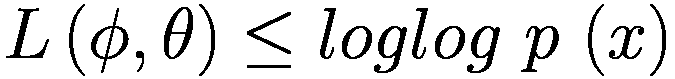
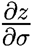
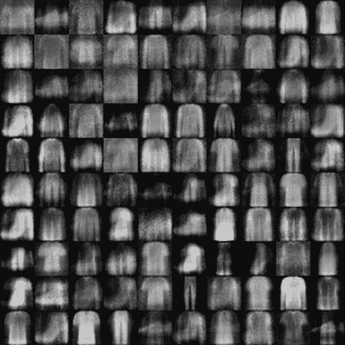

# 12.自动编码器

> 假设机器学习是一块蛋糕，强化学习是蛋糕上的樱桃，监督学习是外面的糖衣，无监督学习是蛋糕本身。
> 
> —杨乐存

前面我们介绍了给定样本及其相应标签的神经网络学习算法。这类算法实际上是学习给定样本 *x* 的条件概率 *P* ( *y* | *x* )。在社交网络蓬勃发展的今天，获取海量样本数据 *x* 相对容易，比如照片、语音、文字，但难点在于获取这些数据对应的标签信息。例如，除了收集源语言文本，机器翻译还需要要翻译的目标语言文本数据。数据标注主要基于人类的先验知识。比如亚马逊的 Mechanical Turk 系统负责数据标注，从全球招募兼职人员完成客户数据标注任务。深度学习需要的数据规模一般都很大。这种严重依赖手工数据注释的方法非常昂贵，并且不可避免地引入了注释者的主观偏见。

对于海量的未标注数据，有没有办法从中学习到数据分布 *P* ( *x* )？这就是我们将在本章介绍的无监督学习算法。特别是，如果算法将 *x* 作为监督信号进行学习，这类算法称为自监督学习，本章介绍的自动编码器算法就是自监督学习算法的一种。

## 12.1 自动编码器的原理

让我们考虑一下神经网络在监督学习中的作用:


*d* <sub>*in*</sub> 是输入特征向量的长度， *d* <sub>*out*</sub> 是网络输出向量的长度。对于分类问题，网络模型将 中长度 *d* <sub>*的输入特征向量 *x* 转换为长度*d*<sub>*out*</sub>的输出向量 *o* 。这个过程可以认为是一个特征约简过程，将原来的高维输入向量 *x* 转化为低维变量 *o* 。降维在机器学习中有着广泛的应用，如文件压缩和数据预处理。最常见的降维算法是主成分分析(PCA)，通过对协方差矩阵进行特征分解来获得数据的主要成分，但 PCA 本质上是线性变换，提取特征的能力有限。*</sub>

那么是否可以利用神经网络强大的非线性表达能力来学习低维数据表示呢？问题的关键在于，训练神经网络一般需要一个显式的标签数据(或者有监督的信号)，而无监督的数据没有额外的标签信息，只有数据 *x* 本身。

所以我们尝试用数据 *x* 本身作为监督信号来指导网络的训练，也就是希望神经网络能够学习到映射*f*<sub>T5】θ</sub>:*x*→*x*。我们把网络 *f* <sub>*θ*</sub> 分成两部分。第一个子网尝试学习映射关系:，后一个子网尝试学习映射关系，如图 [12-1](#Fig1) 所示。我们认为是将高维输入 *x* 编码成低维隐变量 *z* (潜变量或隐变量)的数据编码过程，称为编码器网络。被认为是数据解码的过程，将编码后的输入 *z* 解码成高维的 *x* ，称为解码器网络。


图 12-1

自动编码器模型

编码器和解码器共同完成输入数据 *x* 的编码和解码过程。我们将整个网络模型*f*<sub>T5】θ</sub>简称为自动编码器。如果使用深度神经网络来参数化和函数，则称为深度自动编码器，如图 [12-2](#Fig2) 所示。


图 12-2

使用神经网络参数化的自动编码器

自编码器可以将输入转换为隐藏向量 *z* ，通过解码器重构。我们希望解码器的输出能够完美地或者近似地恢复原始输入，也就是，那么自动编码器的优化目标可以写成:


其中代表 *x* 和之间的距离测量，称为重建误差函数。最常见的测量方法是欧几里德距离的平方。计算方法如下:


原则上它等同于均方误差。自动编码器网络和普通的神经网络没有本质区别，只是训练好的监督信号从标签 *y* 变成了自己的 *x* 。借助于深度神经网络的非线性特征提取能力，自动编码器可以获得良好的数据表示，例如，比原始输入数据更小尺寸和维度的数据表示。这对数据和信息压缩非常有用。与 PCA 等线性方法相比，自动编码器具有更好的性能，甚至可以更完美地恢复输入 *x* 。

在图 [12-3(a)](#Fig3) 中，第一行是从测试集中随机采样的真实 MNIST 手写数字图片，第二、第三和第四行分别使用自动编码器、逻辑 PCA 和标准 PCA，使用长度为 30 的隐藏向量进行重建。在图 [12-3(b)](#Fig3) 中，第一行是真实的肖像图像，第二和第三行是基于长度为 30 的隐藏向量，使用自动编码器和标准 PCA 算法恢复。可以看出，自动编码器重建的图像比较清晰，复原程度高，而 PCA 算法重建的图像比较模糊。


图 12-3

自锚对 PCA [1]

## 12.2 亲身实践时尚 MNIST 形象重建

自动编码器算法的原理非常简单，易于实现，并且训练稳定。与 PCA 算法相比，神经网络强大的表达能力可以学习输入的高层抽象隐藏特征向量 *z* ，也可以基于 *z* 重构输入。这里，我们基于时尚 MNIST 数据集执行实际的图片重建。

### 12.2.1 时尚 MNIST 数据集

时尚 MNIST 是一个比 MNIST 图像识别稍微复杂一点的数据集。它的环境几乎和 MNIST 一样。它包含了十种不同类型的衣服、鞋子、包包的灰度图像，图像大小为 28 × 28，共有 7 万张图片，其中 6 万张用于训练集，1 万张用于测试集，如图 [12-4](#Fig4) 所示。每一行都是一类图片。正如你所看到的，时尚 MNIST 有相同的设置，除了图片内容不同于 MNIST。大多数情况下，基于 MNIST 的原算法代码可以直接替换，无需额外修改。由于时尚 MNIST 图像识别比 MNIST 图像识别更困难，因此它可以用于测试稍微复杂一些的算法的性能。


图 12-4

时尚 MNIST 数据集

在 TensorFlow 中，加载时尚 MNIST 数据集也非常方便，可以使用 keras . datasets . Fashion _ mnist . load _ data()函数在线下载、管理和加载，如下所示:

```py
# Load Fashion MNIST data set
(x_train, y_train), (x_test, y_test) = keras.datasets.fashion_mnist.load_data()
# Normalize
x_train, x_test = x_train.astype(np.float32) / 255., x_test.astype(np.float32) / 255.
# Only need to use image data to build data set objects, no tags required
train_db = tf.data.Dataset.from_tensor_slices(x_train)
train_db = train_db.shuffle(batchsz * 5).batch(batchsz)
#  Build test set objects
test_db = tf.data.Dataset.from_tensor_slices(x_test)
test_db = test_db.batch(batchsz)

```

### 编码器

我们使用编码器将输入图片 *x* ∈ *R* <sup>784</sup> 降维为更低维的隐藏向量 *h* ∈ *R* <sup>20</sup> ，使用解码器基于隐藏向量 *h* 重构图片。自动编码器型号如图 [12-5](#Fig5) 所示。解码器由一个 3 层全连接网络组成，输出节点分别为 256、128 和 20。解码器也由三层全连接网络组成，输出节点分别为 128、256 和 784。


图 12-5

时尚 MNIST 自动编码器网络架构

首先是编码器子网络的实现。使用三层神经网络将图像向量的维数从 784 降低到 256，128，并最终降低到 h_dim。每一层都使用 ReLU 激活函数，最后一层不使用任何激活函数。

```py
        # Create Encoders network, implemented in the initialization function of the autoencoder class
        self.encoder = Sequential([
            layers.Dense(256, activation=tf.nn.relu),
            layers.Dense(128, activation=tf.nn.relu),
            layers.Dense(h_dim)
        ])

```

### 解码器

让我们创建解码器子网。这里隐藏向量 h_dim 依次升级到 128、256、784 的长度。除了最后一层，使用 ReLU 激活功能。解码器的输出是一个长度为 784 的向量，它代表展平后的 28 × 28 大小的图片，可以通过整形操作恢复为图片矩阵，如下所示:

```py
        # Create Decoders network
        self.decoder = Sequential([
            layers.Dense(128, activation=tf.nn.relu),
            layers.Dense(256, activation=tf.nn.relu),
            layers.Dense(784)
        ])

```

### 自动编码器

前面两个编码器和解码器的子网是在 autoencoder 类 AE 中实现的，我们同时在初始化函数中创建这两个子网。

```py
class AE(keras.Model):
    # Self-encoder model class, including Encoder and Decoder 2 subnets
    def __init__(self):
        super(AE, self).__init__()
        #  Create Encoders network
        self.encoder = Sequential([
            layers.Dense(256, activation=tf.nn.relu),
            layers.Dense(128, activation=tf.nn.relu),
            layers.Dense(h_dim)
        ])
        #  Create Decoders network
        self.decoder = Sequential([
            layers.Dense(128, activation=tf.nn.relu),
            layers.Dense(256, activation=tf.nn.relu),
            layers.Dense(784)
        ])

```

接下来，在调用函数中实现正向传播过程。输入图像首先通过编码器子网络获得隐向量 h，然后通过解码器获得重构图像。只需如下依次调用编码器和解码器的正向传播函数:

```py
    def call(self, inputs, training=None):
        # Forward propagation function
        # Encoding to obtain hidden vector h,[b, 784] => [b, 20]
        h = self.encoder(inputs)
        # Decode to get reconstructed picture, [b, 20] => [b, 784]
        x_hat = self.decoder(h)

        return x_hat

```

### 网络培训

自动编码器的训练过程基本上与分类器的训练过程相同。通过误差函数计算重构向量与原始输入向量 *x* 之间的距离，然后利用 TensorFlow 的自动求导机制同时计算编码器和解码器的梯度。

首先，创建一个 autoencoder 和 optimizer 的实例，并设置一个适当的学习速率。例如:

```py
#  Create network objects
model = AE()
#  Specify input size
model.build(input_shape=(4, 784))
#  Print network information
model.summary()
#  Create an optimizer and set the learning rate
optimizer = optimizers.Adam(lr=lr)

```

这里训练 100 个历元，每次通过正演计算得到重建图像向量，使用 TF . nn . sigmoid _ cross _ entropy _ with _ logits 损失函数计算重建图像与原始图像之间的直接误差。事实上，使用 MSE 误差函数也是可行的，如下所示:

```py
for epoch in range(100): # Train 100 Epoch
    for step, x in enumerate(train_db): #  Traverse the training set
        # Flatten, [b, 28, 28] => [b, 784]
        x = tf.reshape(x,    [-1, 784])
        # Build a gradient recorder
        with tf.GradientTape() as tape:
            # Forward calculation to obtain the reconstructed picture
            x_rec_logits = model(x)
            # Calculate the loss function between the reconstructed picture and the input

            rec_loss = tf.nn.sigmoid_cross_entropy_with_logits(labels=x, logits=x_rec_logits)
            # Calculate the mean
            rec_loss = tf.reduce_mean(rec_loss)
        # Automatic derivation, including the gradient of 2 sub-networks
        grads = tape.gradient(rec_loss, model.trainable_variables)
        # Automatic update, update 2 subnets at the same time
        optimizer.apply_gradients(zip(grads, model.trainable_variables))
        if step % 100 ==0:
            # Interval print training error
            print(epoch, step, float(rec_loss))

```

### 图像重建

与分类问题不同，自动编码器的模型性能通常不容易量化。虽然 *L* 值在一定程度上可以代表网络的学习效果，但我们最终还是希望获得还原程度更高、风格更丰富的重构样本。因此，通常需要根据具体问题来讨论自动编码器的学习效果。对于图像重建，它通常取决于对图像生成的人工主观评价的质量，或者使用某些图像保真度计算方法，如初始得分和 Frechet 初始距离。

为了测试图像重建的效果，我们将数据集分为训练集和测试集，其中测试集不参与训练。我们从测试集中随机抽取测试图片*x*∈*D*<sup>T5】test</sup>，通过自动编码器计算重建图片，然后将真实图片和重建图片保存为图片数组并可视化，以便于比较，如下所示:

```py
    # Reconstruct pictures, sample a batch of pictures from the test set
    x = next(iter(test_db))
    logits = model(tf.reshape(x, [-1, 784])) # Flatten and send to autoencoder
    x_hat = tf.sigmoid(logits) # Convert the output to pixel values, using the sigmoid function
    # Recover to 28x28,[b, 784] => [b, 28, 28]
    x_hat = tf.reshape(x_hat, [-1, 28, 28])

    # The first 50 input + the first 50 reconstructed pictures merged, [b, 28, 28] => [2b, 28, 28]
    x_concat = tf.concat([x[:50], x_hat[:50]], axis=0)
    x_concat = x_concat.numpy() * 255\. #  Revert to 0~255 range
    x_concat = x_concat.astype(np.uint8)  #  Convert to integer
save_images(x_concat, 'ae_images/rec_epoch_%d.png'%epoch)  # Save picture

```

图像重建的效果如图 [12-6](#Fig6) ，图 [12-7](#Fig7) ，图 [12-8](#Fig8) 所示。每张图片左边的五列是实景图，右边的五列是对应的重建图。可以看出，在第一个历元，画面重建效果差，画面非常模糊，保真度差。随着训练的进行，重建图片的边缘越来越清晰。在第 100 个时期，重建的图像效果已经更接近真实图像。


图 12-8

第一百个纪元


图 12-7

第十纪元


图 12-6

第一纪元

这里的 save_images 函数负责合并多张图片，保存为大图。这是使用 PIL 图片库完成的。代码如下:

```py
def save_images(imgs, name):
    #  Create 280x280 size image array
    new_im = Image.new('L', (280, 280))
    index = 0
    for i in range(0, 280, 28): # 10-row image array
        for j in range(0, 280, 28): # 10-column picture array
            im = imgs[index]
            im = Image.fromarray(im, mode='L')
            new_im.paste(im, (i, j)) # Write the corresponding location
            index += 1
    # Save picture array
    new_im.save(name)

```

## 12.3 自组装变体

总的来说，autoencoder 网络的训练相对稳定，但由于损失函数直接衡量重建样本与真实样本底层特征之间的距离，而不是评估重建样本的保真度和多样性等抽象指标，因此在一些任务上的效果很一般，例如重建图像边缘容易模糊的图像重建，保真度与真实图像相比并不好。为了学习数据的真实分布，产生了一系列自动编码器变体网络:去噪自动编码器。

为了防止神经网络记住输入数据的底层特征，去噪自动编码器将随机噪声干扰添加到输入数据，例如将从高斯分布采样的噪声 *ε* 添加到输入 *x* :


加入噪声后，网络需要从 *x* 中学习数据的真实隐变量 **z** ，还原原始输入 *x* ，如图 [12-9](#Fig9) 所示。该模型的优化目标是:


图 12-9

去噪自动编码器图


### 12.3.1 压差自动编码器

自动编码器网络也面临过拟合的风险。Dropout autoencoder 通过随机断开网络来降低网络的表达能力，并防止过度拟合。dropout autoencoder 的实现非常简单。可以通过在网络层中插入脱落层来实现网络连接的随机断开。

### 12.3.2 敌方自锚

为了能够方便地从一个已知的先验分布 *p* ( *z* 中采样隐变量 *z* ，可以方便地使用 *p* ( *z* )来重构输入，对抗自动编码器使用一个附加的鉴别器网络(discriminator，简称 D 网络)来确定降维的隐变量 *z* 是否是从先验分布 *p* ( *中采样的鉴别器网络的输出是一个属于区间[0，1]的变量，代表隐向量是否从先验分布 *p* ( *z* )中采样:所有来自先验分布 *p* ( *z* )的样本标记为真，由条件概率*q*(*z*|*x*产生的样本标记为假。这样，除了重构样本，还可以约束条件概率分布 *q* ( *x* )来逼近先验分布 *p* ( *z* )。*


图 12-10

对手自编自编自编自编自编自编自编自编自编自编自编自编自编自编自编自编自编自编自演

对抗式自动编码器由下一章介绍的生成式对抗网络算法衍生而来。学习完对抗性生成网络后，可以加深对对抗性自动编码器的理解。

## 12.4 可变自动编码器

基本的自动编码器本质上学习输入 *x* 和隐藏变量 *z* 之间的映射关系。这是一个判别模型，而不是一个生成模型。那么 autoencoder 可以调整到创成式模型来轻松生成样本吗？

已知隐变量的分布 *P* ( *z* )，如果条件概率分布 *P* ( *z* )，那么我们就可以对联合概率分布 *P* ( *x* ，*z*)=*P*(*z*)*P*(*z*)进行采样变型自动编码器(VAE)可以实现这一目标，如图 [12-11](#Fig11) 所示。如果从神经网络的角度来理解，VAE 和之前的自动编码器是一样的，非常直观，容易理解；但是 VAE 的理论推导有点复杂。接下来，我们先从神经网络的角度解释 VAE，再从概率的角度推导 VAE。


图 12-11

VAE 模型结构

从神经网络的角度来看，与自编码器模型相比，VAE 还有编码器和解码器两个子网络。解码器接受输入 x，输出是潜变量 z；解码器负责将隐变量 z 解码成重构的 x，不同的是，VAE 模型对隐变量 z 的分布有显式约束，希望隐变量 z 符合预设的先验分布 P(z)。因此，在损失函数的设计中，除了原有的重构误差项之外，还增加了对隐变量 z 分布的约束项。

### VAE 原则

从概率的角度来说，我们假设任何一个数据集都是从某个分布 *p* ( *x* | *z* )中抽样得到的； *z* 是隐藏变量，代表某种内部特征，比如手写数字的图片*x*； *z* 可以表示字体大小、书写风格、粗体、斜体等设置，符合一定的先验分布 *p* ( *z* )。给定一个特定的隐藏变量 *z* ，我们可以从学习到的分布*p*(*x*|*z*)中抽取一系列样本。这些样本都具有以 *z* 为代表的共性。

通常假设 *p* ( *z* )遵循一个已知的分布，比如 *N* (0，1)。在 *p* ( *z* )已知的情况下，我们的目标是学习到一个生成概率模型*p*(*x*|*z*)。这里可以使用最大似然估计法:一个好的模型应该有很高的概率产生真实样本 *x* ∈ *D* 。如果我们的生成模型*p*(*x*|*z*)用 *θ* 参数化，那么我们神经网络的优化目标就是:


遗憾的是，由于 *z* 是连续变量，前面的积分无法转化为离散形式，很难直接优化。

另一种思路是利用变分推理的思想，我们通过分布*q*<sub>*ϕ*</sub>(*x*)来近似 *p* ( *z* | *x* ，也就是我们需要最小化*q**(*x*)和 *p* 之间的距离*

 *KL 散度 *D* <sub>*KL*</sub> 是分布 *q* 和 *p* 之间差距的度量，定义为:


严格来说，距离一般是对称的，而 KL 散度是不对称的。将 KL 发散展开为:


使用


得到


我们将定义为 *L* ( *ϕ* ， *θ* )，那么前面的等式就变成:


其中


考虑


我们有



换句话说， *L* ( *ϕ* ， *θ* )是 *loglog p* ( *x* )的下界，优化目标 *L* ( *ϕ* ， *θ* )称为证据下界目标(ELBO)。我们的目标是最大化似然概率 *p* ( *x* )，或者最大化 *loglog p* ( *x* )，可以通过最大化其下界 *L* ( *ϕ* ， *θ* )来实现。

现在我们来分析一下如何最大化 *L* ( *ϕ* ， *θ* )函数，并将其展开得到:


![$$ =-{\int}_z{q}_{\phi }(x) loglog\ \frac{q_{\phi }(x)}{p(z)}+{E}_{z\sim q}\left[ loglog\ {p}_{\theta }(z)\ \right] $$](img/515226_1_En_12_Chapter_TeX_Equv.png)

![$$ =-{D}_{KL}\left({q}_{\phi }(x)\Big\Vert p(z)\right)+{E}_{z\sim q}\left[ loglog\ {p}_{\theta }(z)\ \right] $$](img/515226_1_En_12_Chapter_TeX_Equw.png)

所以，

![$$ L\left(\theta, \phi \right)=-{D}_{KL}\left({q}_{\phi }(x)\Big\Vert p(z)\right)+{E}_{z\sim q}\left[ loglog\ {p}_{\theta }(z)\ \right] $$](img/515226_1_En_12_Chapter_TeX_Equ1.png)

(12-1)

可以用编码器网络参数化*q*<sub>*ϕ*</sub>(*x*)函数，解码器网络参数化*p*<sub>*θ*</sub>(*z*)函数。目标函数 *L* ( *θ* ， *ϕ* )可以通过计算解码器*q**(*x*)的输出分布与先验分布 *p* ( *z* )之间的 KL 散度，以及似然概率 *loglog p* <sub>【T37)来优化</sub>*

 *特别是当*q*<sub>*ϕ*</sub>(*x*)和 *p* ( *z* )都假定为正态分布时，*d*<sub>*KL*</sub>(*q*<sub>*ϕ*</sub>(*x*)的计算

更具体地说，当*q*<sub>*ϕ*</sub>(*x*)为正态分布 *N* ( *μ* <sub>1</sub> ， *σ* <sub>1</sub> ， *p* ( *z* )为正态分布 *N* (0，1)，即【T24

前面的过程使得*d*<sub>*KL*</sub>(*q*<sub>*ϕ*</sub>(*x*)*p*(*z*)*l*(*θ*， *ϕ* )中的项更容易计算，而 *E*

因此，VAE 模型的优化目标由最大化 *L* ( *ϕ* ， *θ* )函数转化为:


还有

![$$ \mathit{\max}\ {E}_{z\sim q}\left[ loglog\ {p}_{\theta }(z)\ \right] $$](img/515226_1_En_12_Chapter_TeX_Equz.png)

第一个优化目标可以理解为约束潜变量 *z* 的分布，第二个优化目标可以理解为提高网络的重构效果。可以看出，经过我们的推导，VAE 模型也非常直观，易于理解。

### 重新参数化技巧

现在考虑在实施上述 VAE 模型时遇到的一个严重问题。从编码器的输出*q*<sub>*ϕ*</sub>(*x*)中采样隐变量 *z* ，如图 [12-12](#Fig12) 左图所示。当*q*<sub>*ϕ*</sub>(*x*)和 *p* ( *z* )均假定为正态分布时，编码器输出正态分布的均值 *μ* 和方差 *σ* <sup>2</sup> ，解码器的输入从 *N* ( *采样由于采样操作的存在，梯度传播是不连续的，VAE 网络不能通过梯度下降算法进行端到端的训练。*


图 12-12

重新参数化技巧图

文献[2]提出了一种连续可导的解决方案，称为重新参数化技巧。它通过*z*=*μ*+*σ*⊙*ε*对隐变量 z 进行采样，其中和都是连续且可微的，从而连接梯度传播。如图 [12-12](#Fig12) 右图所示， *ε* 变量是从标准正态分布 *N* (0，*I*)*μ*和 *σ* 由编码器网络产生。采样后的隐变量可以通过*z*=*μ*+*σ*⊙*ε*得到，保证了梯度传播的连续性。

VAE 网络模型如图 [12-13](#Fig13) 所示，输入 *x* 通过编码器网络*q*<sub>*ϕ*</sub>(*x*)计算得到隐变量 *z* 的均值和方差，隐变量 *z* 通过重新参数化的技巧方法采样得到，送到解码器网络得到分布(【T16


图 12-13

VAE 建筑模型

## 12.5 VAE 图像重建实践

在这一部分，我们将基于 VAE 模型重建和生成时尚 MNIST 图片。如图 [12-13](#Fig13) 所示，输入的是时尚 MNIST 图片矢量。三个全连接层后，得到隐向量 *z* 的均值和方差，用两个全连接层 20 个输出节点表示。FC2 的 20 个输出节点代表 20 个特征分布的均值向量 *μ* ，FC3 的 20 个输出节点代表 20 个特征分布的对数方差向量。通过重新参数化技巧采样获得长度为 20 的隐藏向量 *z* ，通过 FC4 和 FC5 重构样本图像。

作为一种生成模型，VAE 不仅可以重构输入样本，还可以单独使用解码器来生成样本。隐向量 *z* 由先验分布 *p* ( *z* )直接采样得到，生成的样本可以解码后生成。


图 12-14

VAE 建筑模型

### VAE 模型

我们实现了 VAE 类别的编码器和解码器子网络。在初始化函数中，我们分别创建编码器和解码器所需的网络层，如下所示:

```py
class VAE(keras.Model):
    #  Variational Encoder
    def __init__(self):
        super(VAE, self).__init__()

        # Encoder
        self.fc1 = layers.Dense(128)
        self.fc2 = layers.Dense(z_dim) # output mean
        self.fc3 = layers.Dense(z_dim) # output variance

        # Decoder
        self.fc4 = layers.Dense(128)
        self.fc5 = layers.Dense(784)

```

编码器的输入首先经过共享层 FC1，然后分别经过 FC2 和 FC3 网络，得到隐向量分布的均值向量和方差的对数向量值。

```py
    def encoder(self, x):
        # Get mean and variance
        h = tf.nn.relu(self.fc1(x))
        # Mean vector
        mu = self.fc2(h)
        # Log of variance
        log_var = self.fc3(h)

        return mu, log_var

```

解码器接受采样后的隐藏向量 *z* ，解码成图片输出。

```py
    def decoder(self, z):
        #  Generate image data based on hidden variable z
        out = tf.nn.relu(self.fc4(z))
        out = self.fc5(out)
        #  Return image data, 784 vector
        return out

```

在 VAE 的正向计算过程中，首先由编码器获得输入的潜在向量 *z* 的分布，然后通过采样由重新参数化技巧实现的重新参数化函数获得潜在向量 *z* ，最后由解码器恢复重建的图像向量。实现如下:

```py
    def call(self, inputs, training=None):
        # Forward calculation
        # Encoder [b, 784] => [b, z_dim], [b, z_dim]
        mu, log_var = self.encoder(inputs)
        # Sampling - reparameterization trick
        z = self.reparameterize(mu, log_var)
        # Decoder
        x_hat = self.decoder(z)
        # Return sample, mean and log variance
        return x_hat, mu, log_var

```

### 重新参数化技巧

reparameterize 函数接受均值和方差参数，通过从正态分布 *N* (0， *I* 采样得到 *ε* ，通过*z*=*μ*+*σ*⊙*ε*返回采样后的隐藏向量。

```py
    def reparameterize(self, mu, log_var):
        # reparameterize trick
        eps = tf.random.normal(log_var.shape)
        # calculate standard variance
        std = tf.exp(log_var)**0.5
        # reparameterize trick
        z = mu + std * eps
        return z

```

### 网络培训

网络训练 100 个历元，每次重建样本由 VAE 模型正演计算得到。重建误差项*E*<sub>*z*~*q*</sub>[*log log p*<sub>*θ*</sub>(*z*)】是基于交叉熵损失函数计算的。误差项*d*<sub>*KL*</sub>(*q*<sub>*ϕ*</sub>(*x*)‖*p*(*z*))根据式(12-2)计算。

```py
# Create network objects
model = VAE()
model.build(input_shape=(4, 784))
# Optimizer
optimizer = optimizers.Adam(lr)

for epoch in range(100): # Train 100 Epochs
    for step, x in enumerate(train_db): #  Traverse the training set
        # Flatten, [b, 28, 28] => [b, 784]
        x = tf.reshape(x, [-1, 784])
        #  Build a gradient recorder
        with tf.GradientTape() as tape:
            # Forward calculation
            x_rec_logits, mu, log_var = model(x)
            #  Reconstruction loss calculation
            rec_loss = tf.nn.sigmoid_cross_entropy_with_logits(labels=x, logits=x_rec_logits)
            rec_loss = tf.reduce_sum(rec_loss) / x.shape[0]
            # Calculate KL convergence N(mu, var) VS N(0, 1)
            # Refernece:https://stats.stackexchange.com/questions/7440/kl-divergence-between-two-univariate-gaussians
            kl_div = -0.5 * (log_var + 1 - mu**2 - tf.exp(log_var))
            kl_div = tf.reduce_sum(kl_div) / x.shape[0]
            # Combine error
            loss = rec_loss + 1\. * kl_div
        # Calculate gradients
        grads = tape.gradient(loss, model.trainable_variables)
        # Update parameters
        optimizer.apply_gradients(zip(grads, model.trainable_variables))

        if step % 100 == 0:
            # Print error

            print(epoch, step, 'kl div:', float(kl_div), 'rec loss:', float(rec_loss))

```

### 图像生成

图像生成仅使用解码器网络。首先从先验分布 *N* (0， *I* 中采样隐藏向量，然后通过解码器得到图像向量，最后整形为图像矩阵。例如:

```py
    #  Test generation effect, randomly sample z from normal distribution
    z = tf.random.normal((batchsz, z_dim))
    logits = model.decoder(z) #  Generate pictures only by decoder
    x_hat = tf.sigmoid(logits) #  Convert to pixel range
    x_hat = tf.reshape(x_hat, [-1, 28, 28]).numpy() *255.
    x_hat = x_hat.astype(np.uint8)
    save_images(x_hat, 'vae_images/epoch_%d_sampled.png'%epoch) # Save pictures

    # Reconstruct the picture, sample pictures from the test set
    x = next(iter(test_db))
    logits, _, _ = model(tf.reshape(x, [-1, 784])) # Flatten and send to autoencoder
    x_hat = tf.sigmoid(logits) #  Convert output to pixel value
    # Restore to 28x28,[b, 784] => [b, 28, 28]
    x_hat = tf.reshape(x_hat, [-1, 28, 28])
    # The first 50 input + the first 50 reconstructed pictures merged, [b, 28, 28] => [2b, 28, 28]
    x_concat = tf.concat([x[:50], x_hat[:50]], axis=0)
    x_concat = x_concat.numpy() * 255.
    x_concat = x_concat.astype(np.uint8)
    save_images(x_concat, 'vae_images/epoch_%d_rec.png'%epoch)

```

图片重建的效果如图 [12-15](#Fig15) 、图 [12-16](#Fig16) 和图 [12-17](#Fig17) 所示，分别显示了输入第一、第十和第 100 个历元的测试集图片得到的重建效果。每张图片左边五列是实拍图，右边五列是对应的重建效果。图像生成的效果如图 [12-18](#Fig18) 、图 [12-19](#Fig19) 和图 [12-20](#Fig20) 所示，分别显示了第一个、第十个和第 100 个历元的图像生成效果。


图 12-20

图像生成:纪元=100


图 12-19

图像生成:纪元=10



图 12-18

图像生成:纪元=1


图 12-17

图像重建:epoch=100


图 12-16

图像重建:epoch=10


图 12-15

图像重建:epoch=1

可以看出，图像重建的效果略好于图像生成，这也说明图像生成是一项更复杂的工作。虽然 VAE 模型具有生成图像的能力，但生成的效果仍然不够好，人眼仍然可以区分机器生成的图片样本和真实图片样本之间的差异。下一章将要介绍的生成式对抗网络在图像生成方面表现更好。

## 12.6 摘要

在这一章中，我们介绍了强大的自我监督学习算法——自动编码器及其变体。我们从自动编码器的原理开始，以便理解它的数学机制，然后我们通过时尚 MNIST 图像重建练习完成自动编码器的实际实现。按照类似的步骤，讨论了 VAE 模型，并将其应用于时尚 MNIST 图像数据集，以演示图像生成过程。在开发机器学习或深度学习模型时，一个常见的挑战是输入数据的高维度。与传统的降维方法(例如 PCA)相比，自动编码器及其变体通常在以较低的维度和大小生成数据表示方面具有更好的性能。

## 12.7 参考

1.  G.E. Hinton，“用神经网络降低数据的维数”，2008 年。

2.  D.P. Kingma 和 M. Welling，“自动编码变分贝叶斯”，第二届学习表示国际会议，2014 年，ICLR，班夫，AB，加拿大，2014 年 4 月 14-16 日，会议记录，2014 年。**