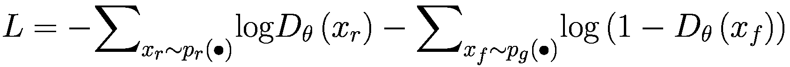
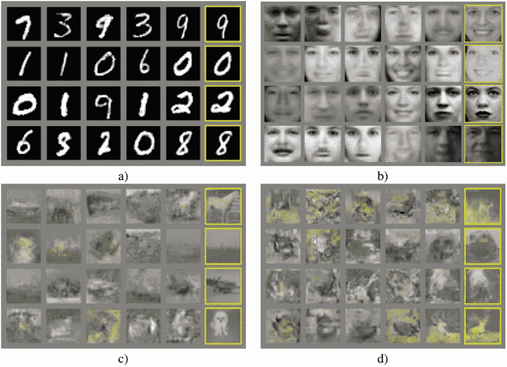
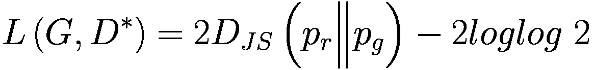
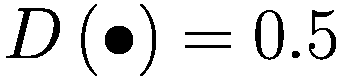
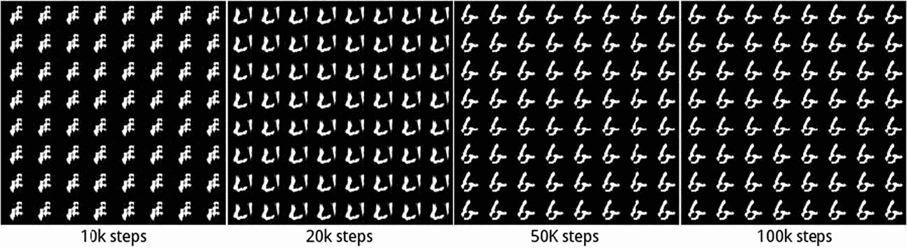
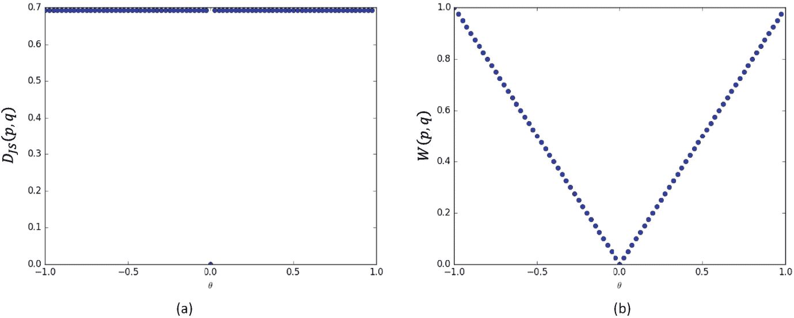
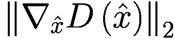

# 十三、生成对抗网络

> 我不能创造的，我还没有完全理解。
> 
> 理查德·费曼

在生成对抗网络(GAN)发明之前，变分自编码器被认为是理论上完整且实现简单的。使用神经网络训练时非常稳定，得到的图像更加近似，但人眼仍然可以轻松区分真实图片和机器生成的图片。

2014 年，蒙特利尔大学 yo shua beng io(2018 年图灵奖获得者)的学生 Ian Goodfellow 提出了 GAN [1]，开启了深度学习最热门的研究方向之一。2014-2019 年，GAN 研究稳步推进，研究成果捷报频传。最新的 GAN 算法在图像生成上的效果已经达到了肉眼难以分辨的程度，实在令人兴奋。由于 GAN 的发明，Ian Goodfellow 被授予 GAN 之父的称号，并于 2017 年被麻省理工学院评论授予 35 名 35 岁以下创新者奖。图 [13-1](#Fig1) 从 2014 年到 2018 年，GAN 模型达到了书代的效果。可以看出，无论是画面的大小，还是画面的保真度，都有了很大的提升。 <sup>[1](#Fn1)</sup>


图 13-1

2014 年至 2018 年 GAN 生成图像效果

接下来我们就从生活中的游戏学习这个例子开始，一步步的介绍 GAN 算法的设计思路和模型结构。

## 13.1 游戏学习的例子

我们用一个漫画家的成长轨迹来形象地介绍甘的想法。考虑一对双胞胎兄弟，分别叫 G 和 D，G 学习如何画漫画，D 学习如何欣赏画作。两兄弟在很小的时候就学会了如何使用画笔和纸张。g 画了一幅不知名的画，如图 [13-2(a)](#Fig2) 。这个时候 D 的辨别能力不高，所以 D 觉得 G 的作品还可以，只是主角不够清晰。在 D 的指导和鼓励下，G 开始学习如何画出主体的轮廓，使用简单的色彩组合。

一年后，G 提高了绘画基本功，D 也初步掌握了通过分析名作和 G 的作品来鉴别作品的能力，此时 D 觉得 G 的作品有了主要人物，如图 [13-2(b)](#Fig2) ，但对色彩的运用还不够成熟。几年后，G 的绘画基本功已经非常扎实，可以轻松地画出主题鲜明、色彩搭配恰当、逼真度高的画作，如图 [13-2(c)](#Fig2) 所示，但 D 也观察到了 G 与其他名作的差异，提高了辨别画作的能力。这时 D 觉得 G 的绘画技巧已经成熟，但是对生活的观察还不够。g 的作品没有传达出表情，一些细节也不完美。又过了几年，G 的画技已经到了炉火纯青的地步。画作细节完美，风格迥异，栩栩如生，宛如大师级，如图 [13-2(d)](#Fig2) 。即使在这个时候，D 的辨别能力也是相当出色的。D 也很难区分 G 和其他大作。

上述画家的成长过程，其实就是一个生活中共同的学习过程，通过双方的学习和相互提高的博弈，最终达到一个平衡点。GAN 网络借鉴了游戏学习的思想，设置了两个子网络:负责生成样本的生成器 G 和负责认证的鉴别器 D。鉴别器 D 通过观察真实样本和发生器 G 产生的样本之间的差异来学习如何区分真假，其中真实样本为真，发生器 G 产生的样本为假。发电机 G 也在学习。它希望生成的样本能够被鉴别器 D 识别为真。因此，生成器 G 试图使其生成的样本被判别式 D 认为是真的，生成器 G 和判别式 D 相互博弈，共同改进，直到达到一个平衡点。此时发生器 G 产生的样本非常逼真，使得鉴别器 D 难以辨别真假。


图 13-2

画家成长轨迹速写

在最初的 GAN 论文中，Ian Goodfellow 用了另一个生动的比喻来介绍 GAN 模型:生成器网络 G 的作用是生成一系列非常逼真的假钞来试图欺骗鉴别器 D，鉴别器 D 通过学习生成器 G 生成的真钱和假钞的区别来掌握钞票鉴别方法。这两个网络在相互博弈的过程中同步，直到生成器 G 产生的假钞非常真实，连鉴别器 D 都勉强能分辨出来。

这种游戏学习的思想使得 GAN 的网络结构和训练过程与之前的网络模型略有不同。下面我们来详细介绍一下 GAN 的网络结构和算法原理。

## 13.2 甘原则

现在我们将正式介绍 GAN 的网络结构和训练方法。

### 网络结构

GAN 包含两个子网络:发生器网络(称为 G)和鉴别器网络(称为 D)。生成器网络 G 负责学习样本的真实分布，而鉴别器网络 D 负责将生成器网络生成的样本与真实样本区分开。

**发电机** *G* ( *z* )发电机网络 G 类似于自编码器的解码器的作用。隐变量*z*~*p*<sub>*z*</sub>(∙)从先验分布*p*<sub>*z*</sub>(∙)中采样。生成的样本*x*~*p*<sub>*G*</sub>(*x*|*z*)由发电机网络 G 的参数化分布*p*<sub>*G*</sub>(*x*|*z*得到，如图 [13-3](#Fig3) 所示隐变量 *z* 的先验分布*p*<sub>*z*</sub>(∙)可以假设为已知分布，比如多元均匀分布 *z* ~ *均匀*(-1，1)。


图 13-3

发电机 G

*p*<sub>*g*</sub>(*x*|*z*)可以通过深度神经网络进行参数化。如图 [13-4](#Fig4) 所示，从均匀分布*p*<sub>*z*</sub>(∙)中抽取隐变量 *z* ，然后从*p*<sub>*g*</sub>(*x*|从输入输出的角度来看，生成器 G 的作用是通过神经网络将隐向量 *z* 转化为样本向量 *x* <sub>*f*</sub> ，下标 *f* 代表伪样本。


图 13-4

转置卷积构成的生成网络

**鉴频器** *D* ( *x* )鉴频器网络的作用类似于普通的二进制分类网络。它接受输入样本 *x* 的数据集，包括从真实数据分布*p*<sub>*r*</sub>(∙)中采样的样本*x<sub>*r*</sub>~*p*<sub>*r*</sub>(∙)以及从发电网络 *x* <sub>*中采样的伪样本 *x* <sub>*r*</sub> 和 *x* <sub>*f*</sub> 共同构成鉴别器网络的训练数据集。鉴别器网络的输出是 *x* 属于真实样本 *P* ( *x 是真实的* | *x* )。我们将所有真实样本 *x* <sub>*r*</sub> 标注为真(1)，生成网络生成的所有样本 *x* <sub>*f*</sub> 标注为假(0)。鉴频器网络 D 的预测值和标签之间的误差用于优化鉴频器网络参数，如图 13-5 所示。*</sub>*


图 13-5

发电机网络和鉴别器网络

### 网络培训

甘游戏学习的思想体现在其训练方法上。由于生成器 G 和鉴别器 D 的优化目标不同，不能和前面的网络模型训练一样，只用一个损失函数。下面我们分别介绍一下如何训练生成器 G 和鉴别器 D。

对于鉴别器网络 D 来说，它的目标是能够区分真样本*x*<sub>T3】rT5】和假样本 *x* <sub>*f*</sub> 。以图片生成为例，其目标是最小化图片的预测值和真实值之间的交叉熵损失函数:</sub>


其中*D*<sub>*θ*</sub>(*x*<sub>*r*</sub>代表判别网络中真实样本的输出*x*<sub>*r*</sub>*D*<sub>*θ*</sub>， *θ* 为判别网络的参数集， *D*<sub>*θ*</sub>(*x*<sub>*f*</sub>)是鉴频器网络中生成样本 *x* <sub>*f*</sub> 的输出， *y* 是 *x* <sub>*r*</sub> 的标签。 因为真实样本被标注为真实，所以*y*<sub>*r*</sub>= 1。 *y* <sub>*f*</sub> 是生成样本的*<sub>*f*</sub>的标签。由于生成的样本被标注为假，*y*<sub>*f*</sub>= 0。CE 函数表示交叉熵损失函数 CrossEntropy。两个分类问题的交叉熵损失函数定义为:*

**

 *因此，鉴频器网络 D 的优化目标是:


将 *L* 转换为 *L* ，并将其写在期望表中:


对于发生器网络 *G* ( *z* )，我们希望*x*<sub>*f*</sub>=*G*(*z*)能够很好地欺骗鉴频器网络 D，使假样本 *x* <sub>*f*</sub> 的输出尽可能接近真实标签。也就是说，在训练发生器网络时，希望鉴频器网络的输出*D*(*G*(*z*))尽可能接近 1，并使*D*(*G*(*z*))与 1 之间的交叉熵损失函数最小:


将 *L* 转换为 *L* ，并将其写在期望表中:


它可以等效地转化为:

![$$ {\phi}^{\ast }=L={E}_{z\sim {p}_z\left(\bullet \right)}\mathit{\log}\left[1-D\left({G}_{\phi }(z)\right)\right] $$](img/515226_1_En_13_Chapter_TeX_Equg.png)

其中 *ϕ* 是发电机网络 g 的参数集，可以用梯度下降算法来优化参数 *ϕ* 。

### 统一的目标函数

我们可以合并生成器和鉴别器网络的目标函数，并将其写成最小-最大博弈的形式:


(13-1)

算法如下:

<colgroup><col class="tcol1 align-center"></colgroup> 
| **算法 1:GAN 训练算法** |
| 随机初始化参数 ***θ和ϕ*****重复****为** k 次**做**随机采样隐藏向量***z ~ p***<sub>***z***</sub>(***∙***)随机抽取真实样本***x***<sub>***r***</sub>***~ p***<sub>***r***</sub>(**)** **根据梯度下降算法更新三维网络:


随机采样隐藏向量***z ~ p***<sub>***z***</sub>(***∙***)

根据梯度下降算法更新 G 网络:


**结束于**

**直到**训练轮数达到要求

**输出**:受训发电机***g***<sub>***ϕ***</sub>**  |

## 13.3 动手 DCGAN

在本节中，我们将完成卡通化身图像的实际生成。参考 DCGAN [2]的网络结构，其中鉴别器 D 由普通卷积层实现，生成器 G 由转置卷积层实现，如图 [13-6](#Fig6) 。


图 13-6

DCGAN 网络结构

### 13.3.1 卡通头像数据集

这里我们用的是卡通头像的数据集，总共 51223 张图片，没有标注信息。图片的主体已被裁剪、对齐并统一缩放到 96 × 96 的大小。一些样品如图 [13-7](#Fig7) 所示。


图 13-7

卡通头像数据集

对于定制数据集，需要自己完成数据加载和预处理工作。我们在这里关注 GAN 算法本身。关于自定义数据集的后续章节将详细介绍如何加载您自己的数据集。这里直接通过预先编写的 make_anime_dataset 函数获取处理后的数据集。

```py
    # Dataset path. URL: https://drive.google.com/file/d/1lRPATrjePnX_n8laDNmPkKCtkf8j_dMD/view?usp=sharing
    img_path = glob.glob(r'C:\Users\z390\Downloads\faces\*.jpg')
    # Create dataset object, return Dataset class and size
    dataset, img_shape, _ = make_anime_dataset(img_path, batch_size, resize=64)

```

dataset 对象是 tf.data.Dataset 类的一个实例。已经完成了随机分散、预处理、批处理等操作，可以直接获得样本批次，img_shape 为预处理后的图像大小。

### 发电机

生成网络 G 由五个转置卷积层叠加而成，以实现特征图高度和宽度的逐层放大和特征图通道数的逐层减少。首先通过整形操作将长度为 100 的隐向量 *z* 调整为一个[ *b* ，1，1，100]的四维张量，并对卷积层进行转置，以便放大高度和宽度维度，减少通道数，最终得到宽度为 64，通道数为 3 的彩色图片。在每个卷积层之间插入一个 BN 层以提高训练稳定性，卷积层选择不使用偏置向量。生成器类代码实现如下:

```py
class Generator(keras.Model):
    # Generator class
    def __init__(self):
        super(Generator, self).__init__()
        filter = 64
        # Transposed convolutional layer 1, output channel is filter*8, kernel is 4, stride is 1, no padding, no bias.
        self.conv1 = layers.Conv2DTranspose(filter*8, 4,1, 'valid', use_bias=False)
        self.bn1 = layers.BatchNormalization()
        # Transposed convolutional layer 2
        self.conv2 = layers.Conv2DTranspose(filter*4, 4,2, 'same', use_bias=False)
        self.bn2 = layers.BatchNormalization()
        # Transposed convolutional layer 3
        self.conv3 = layers.Conv2DTranspose(filter*2, 4,2, 'same', use_bias=False)
        self.bn3 = layers.BatchNormalization()
        # Transposed convolutional layer 4
        self.conv4 = layers.Conv2DTranspose(filter*1, 4,2, 'same', use_bias=False)
        self.bn4 = layers.BatchNormalization()
        # Transposed convolutional layer 5
        self.conv5 = layers.Conv2DTranspose(3, 4,2, 'same', use_bias=False)

```

发电机网络 G 的正向传播实现如下:

```py
    def call(self, inputs, training=None):
        x = inputs # [z, 100]
        # Reshape to 4D tensor:(b, 1, 1, 100)
        x = tf.reshape(x, (x.shape[0], 1, 1, x.shape[1]))
        x = tf.nn.relu(x) # activation function
        # Transposed convolutional layer-BN-activation function:(b, 4, 4, 512)
        x = tf.nn.relu(self.bn1(self.conv1(x), training=training))
        # Transposed convolutional layer-BN-activation function:(b, 8, 8, 256)
        x = tf.nn.relu(self.bn2(self.conv2(x), training=training))
        # Transposed convolutional layer-BN-activation function:(b, 16, 16, 128)
        x = tf.nn.relu(self.bn3(self.conv3(x), training=training))
        # Transposed convolutional layer-BN-activation function:(b, 32, 32, 64)
        x = tf.nn.relu(self.bn4(self.conv4(x), training=training))
        # Transposed convolutional layer-BN-activation function:(b, 64, 64, 3)
        x = self.conv5(x)
        x = tf.tanh(x) # output x range -1~1

        return x

```

生成的网络输出大小为[ *b* ，64，64，3]，取值范围为 1~1。

### 鉴别器

鉴别器网络 D 与普通分类网络相同。它接受大小为[b，64，64，3]的图像张量，并通过五个卷积层连续提取特征。卷积层的最终输出大小为[b，2，2，1024]，然后通过池层 GlobalAveragePooling2D 将特征大小转换为[b，1024]，最后通过一个全连通层得到二叉分类任务的概率。鉴频器网络 D 类的代码实现如下:

```py
class Discriminator(keras.Model):
    # Discriminator class
    def __init__(self):
        super(Discriminator, self).__init__()
        filter = 64
        # Convolutional layer 1
        self.conv1 = layers.Conv2D(filter, 4, 2, 'valid', use_bias=False)
        self.bn1 = layers.BatchNormalization()
        # Convolutional layer 2
        self.conv2 = layers.Conv2D(filter*2, 4, 2, 'valid', use_bias=False)
        self.bn2 = layers.BatchNormalization()
        # Convolutional layer 3
        self.conv3 = layers.Conv2D(filter*4, 4, 2, 'valid', use_bias=False)
        self.bn3 = layers.BatchNormalization()
        # Convolutional layer 4
        self.conv4 = layers.Conv2D(filter*8, 3, 1, 'valid', use_bias=False)
        self.bn4 = layers.BatchNormalization()
        # Convolutional layer 5
        self.conv5 = layers.Conv2D(filter*16, 3, 1, 'valid', use_bias=False)
        self.bn5 = layers.BatchNormalization()
        # Global pooling layer
        self.pool = layers.GlobalAveragePooling2D()
        # Flatten feature layer
        self.flatten = layers.Flatten()
        # Binary classification layer
        self.fc = layers.Dense(1)

```

鉴别器 D 的正向计算过程实现如下:

```py
    def call(self, inputs, training=None):
        # Convolutional layer-BN-activation function:(4, 31, 31, 64)
        x = tf.nn.leaky_relu(self.bn1(self.conv1(inputs), training=training))
        # Convolutional layer-BN-activation function:(4, 14, 14, 128)
        x = tf.nn.leaky_relu(self.bn2(self.conv2(x), training=training))
        # Convolutional layer-BN-activation function:(4, 6, 6, 256)
        x = tf.nn.leaky_relu(self.bn3(self.conv3(x), training=training))
        # Convolutional layer-BN-activation function:(4, 4, 4, 512)
        x = tf.nn.leaky_relu(self.bn4(self.conv4(x), training=training))
        # Convolutional layer-BN-activation function:(4, 2, 2, 1024)
        x = tf.nn.leaky_relu(self.bn5(self.conv5(x), training=training))
        # Convolutional layer-BN-activation function:(4, 1024)
        x = self.pool(x)
        # Flatten
        x = self.flatten(x)
        # Output, [b, 1024] => [b, 1]
        logits = self.fc(x)

        return logits

```

鉴频器的输出大小为[b，1]。类内部不使用 Sigmoid 激活函数，b 样本属于真实样本的概率可以通过 Sigmoid 激活函数得到。

### 培训和可视化

**鉴别器**根据公式( [13-1](#Equ1) ，鉴别器网络的目标是最大化函数 *L* ( *D* ， *G* )，使真实样本预测的概率接近 1，生成样本预测的概率接近 0。我们在 d_loss_fn 函数中实现鉴别器的误差函数，将所有真实样本标记为 1，将所有生成样本标记为 0，通过最小化对应的交叉熵损失函数来最大化函数 L(D，G)。d_loss_fn 函数实现如下:

```py
def d_loss_fn(generator, discriminator, batch_z, batch_x, is_training):
    # Loss function for discriminator
    # Generate images from generator
    fake_image = generator(batch_z, is_training)
    # Distinguish images
    d_fake_logits = discriminator(fake_image, is_training)
    # Determine whether the image is real or not
    d_real_logits = discriminator(batch_x, is_training)
    # The error between real image and 1
    d_loss_real = celoss_ones(d_real_logits)
    # The error between generated image and 0
    d_loss_fake = celoss_zeros(d_fake_logits)
    # Combine loss
    loss = d_loss_fake + d_loss_real

    return loss

```

celoss_ones 函数计算当前预测概率和标签 1 之间的交叉熵损失。代码如下:

```py
def celoss_ones(logits):
    # Calculate the cross entropy belonging to and label 1
    y = tf.ones_like(logits)
    loss = keras.losses.binary_crossentropy(y, logits, from_logits=True)
    return tf.reduce_mean(loss)
The celoss_zeros function calculates the cross entropy loss between the current predicted probability and label 0\. The code is as follows:
def celoss_zeros(logits):
    # Calculate the cross entropy that belongs to and the note is 0
    y = tf.zeros_like(logits)
    loss = keras.losses.binary_crossentropy(y, logits, from_logits=True)
     return tf.reduce_mean(loss)

```

**发电机**发电机网络的训练目标是最小化 *L* ( *D* ， *G* )目标函数。由于真实样本与发生器无关，误差函数只需要最小化。此时的交叉熵误差可以通过将生成的样本标记为 1 来最小化。需要注意的是，在误差反向传播的过程中，鉴别器也参与了计算图的构建，但在这个阶段只需要更新发电机网络参数。发生器的误差函数如下:

```py
def g_loss_fn(generator, discriminator, batch_z, is_training):
    # Generate images
    fake_image = generator(batch_z, is_training)
    #  When training the generator network, it is necessary to force the generated image to be judged as true
    d_fake_logits = discriminator(fake_image, is_training)
    # Calculate error between generated images and 1
    loss = celoss_ones(d_fake_logits)

    return loss

```

**网络训练**在每个历元中，先从先验分布*p*<sub>T5】z</sub>(∙)中随机采样隐向量，从真实数据集中随机采样真实图片，通过发生器和鉴频器计算鉴频器网络损耗，优化鉴频器网络参数 *θ* 。当训练发生器时，需要鉴别器来计算误差，但只计算发生器的梯度信息并更新 *ϕ* 。这里设置鉴频器训练次数 *k* = 5，设置发电机训练时间为 1。

首先，创建生成器网络和鉴别器网络，并分别创建相应的优化器，如下所示:

```py
    generator = Generator() #  Create generator
    generator.build(input_shape = (4, z_dim))
    discriminator = Discriminator() #  Create discriminator
    discriminator.build(input_shape=(4, 64, 64, 3))
    # Create optimizers for generator and discriminator respectively
    g_optimizer = keras.optimizers.Adam(learning_rate=learning_rate, beta_1=0.5)
    d_optimizer = keras.optimizers.Adam(learning_rate=learning_rate, beta_1=0.5)

```

代码的主要培训部分实现如下:

```py
    for epoch in range(epochs): #  Train epochs times
        # 1\. Train discriminator
        for _ in range(5):
            # Sample hidden vectors
            batch_z = tf.random.normal([batch_size, z_dim])
            batch_x = next(db_iter) # Sample real images
            # Forward calculation - discriminator
            with tf.GradientTape() as tape:
                d_loss = d_loss_fn(generator, discriminator, batch_z, batch_x, is_training)
            grads = tape.gradient(d_loss, discriminator.trainable_variables)
            d_optimizer.apply_gradients(zip(grads, discriminator.trainable_variables))
        # 2\. Train generator
        # Sample hidden vectors
        batch_z = tf.random.normal([batch_size, z_dim])
        batch_x = next(db_iter) # Sample real images
        # Forward calculation - generator
        with tf.GradientTape() as tape:
            g_loss = g_loss_fn(generator, discriminator, batch_z, is_training)
        grads = tape.gradient(g_loss, generator.trainable_variables)
        g_optimizer.apply_gradients(zip(grads, generator.trainable_variables))

```

每 100 个时期，执行一次图像生成测试。从先验分布中随机抽取隐藏向量，发送给生成器，得到生成的图片，保存为文件。

如图 [13-8](#Fig8) 所示，为 DCGAN 模型在训练过程中保存的生成图片样本。可以观察到，大部分图片主体清晰，色彩鲜艳，图片多样性丰富，生成的图片接近数据集中的真实图片。同时可以发现，生成的图片仍有少量受损，人眼无法识别图片主体。为了获得图 [13-8](#Fig8) 所示的图像生成效果，需要精心设计网络模型结构，微调网络超参数。


图 13-8

DCGAN 图像生成效果

## 13.4 氮化镓变体

在最初的 GAN 论文中，Ian Goodfellow 从理论层面分析了 GAN 网络的收敛性，并在多个经典图像数据集上测试了图像生成的效果，如图 [13-9](#Fig9) 所示，其中图 [13-9](#Fig9) (a)是 MNIST 数据集，图 [13-9](#Fig9) (b)是多伦多人脸数据集，图 [13-9](#Fig9) (c)和图 [13-9](#Fig9) (d)是 CIFAR1



图 13-9

原始 GAN 图像生成效果[1]

可以看出，最初的 GAN 模型在图像生成效果方面并不突出，与的差异并不明显。这个时候并没有表现出它强大的分布逼近能力。然而，由于 GAN 在理论上相对较新，有许多需要改进的地方，这极大地激发了学术界的研究兴趣。在接下来的几年里，GAN 的研究如火如荼，也取得了实质性的进展。接下来，我们将介绍几种重要的 GAN 变体。

### 13.4.1 DCGAN

最初的 GAN 网络主要基于全连通层来实现生成器 G 和鉴别器 d，由于图片的高维性和网络参数的海量性，训练效果并不优秀。DCGAN [2]提出了用转置卷积层实现的生成器网络，和用普通卷积层实现的鉴别器网络，大大减少了网络参数的数量，大大提高了图像生成的效果，显示出 GAN 模型在图像生成方面具有优于 VAE 模型的潜力。此外，DCGAN 作者还提出了一系列经验性的 GAN 网络训练技术，这些技术被证明有利于 GAN 网络的稳定训练。我们已经使用 DCGAN 模型来完成动画化身的实际图片生成。

### InfoGAN

InfoGAN [3]试图用一种无监督的方式来学习输入 *x* 的可解释隐向量 *z* 的可解释表示，即希望隐向量 *z* 能够对应数据的语义特征。例如，对于 MNIST 手写的数字图片，我们可以认为数字的类别、字体大小和书写风格是图片的隐藏变量。我们希望模型可以学习这些解开的可解释的特征表示方法，以便可以人工控制隐藏变量来生成指定内容的样本。对于 CelebA 名人照片数据集，希望模型可以分离发型、眼镜佩戴情况、面部表情等特征，生成指定形状的人脸图像。

解开可解释特征的好处是什么？它可以使神经网络更具可解释性。比如 *z* 包含了一些单独的可解释特征，那么我们只需要改变这个位置的特征就可以获得不同语义的生成数据。如图 [13-10](#Fig10) 所示，减去“戴眼镜的男人”和“不戴眼镜的男人”的隐向量，再加上“不戴眼镜的女人”的隐向量，就可以生成一张“戴眼镜的女人”的图片。


图 13-10

分离特征的示意图[3]

### 13.4.3 摆明

CycleGAN [4]是由朱俊彦提出的用于图像风格转换的无监督算法。因为算法清晰简单，效果更好，所以这部作品获得了很多好评。CycleGAN 的基本假设是，如果你从 A 图切换到 B 图，再从 B 图切换到 A '，那么 A '应该和 A 是同一个图，所以 CycleGAN 除了设置标准的 GAN 损失项，还增加了循环一致性损失，保证 A '尽可能接近 A。CycleGAN 图片的转换效果如图 [13-11](#Fig11) 所示。


图 13-11

图像转换效果[4]

### 13.4.4 WGAN

甘的训练问题一直为人诟病，容易出现训练不收敛和模式崩溃的现象。WGAN [5]从理论层面分析了原 GAN 使用 JS 散度的缺陷，并提出 Wasserstein 距离可以用来解决这个问题。在 WGAN-GP [6]中，作者提出通过添加梯度惩罚项，从工程层面很好地实现了 WGAN 算法，证实了 WGAN 训练稳定性的优势。

### 13.4.5 同等氮化镓

从 GAN 诞生到 2017 年底，GAN 动物园已经收集了超过 214 个 GAN 网络变种。这些 GAN 变体或多或少地提出了一些创新，但来自 Google Brain 的几位研究人员在一篇论文中提供了另一个观点[7]:没有证据表明我们测试的 GAN 变体算法一直比最初的 GAN 论文更好。在该论文中，对这些 GAN 变体进行了公正和全面的比较。在计算资源充足的情况下，发现几乎所有的 GAN 变体都可以达到相似的性能(FID 分数)。这项工作提醒业界这些 GAN 变体是否具有本质上的创新性。

### 甘的自我关注

注意机制在自然语言处理中得到了广泛的应用。自我注意 GAN (SAGAN) [8]借鉴注意机制，提出了一种基于自我注意机制的 GAN 变体。萨根提高了画面的保真度指数:盗梦空间得分从 36.8 提高到 52.52，弗雷歇盗梦空间距离从 27.62 提高到 18.65。从图像生成的效果来看，萨根的突破非常显著，它也激发了业界对自我关注机制的关注。


图 13-12

萨根的注意机制[8]

### 比根

在 SAGAN 的基础上，BigGAN [9]试图将 GAN 的训练扩展到大规模，使用正交正则化等技术来保证训练过程的稳定性。BigGAN 的意义在于启发人们 GAN 网络的训练也可以受益于大数据和大计算能力。比根影像生成的效果达到了前所未有的高度:盗梦空间评分记录提升至 166.5(提升 52.52)；弗雷歇起始距离下降到 7.4，减少了 18.65。如图 [13-13](#Fig13) 所示，图像分辨率可达 512×512，图像细节极其逼真。


图 13-13

比根生成的图像

## 13.5 纳什均衡

现在我们从理论层面分析，通过博弈学习的训练方法，生成器 G 和判别器 D 会达到什么均衡状态。具体来说，我们将探讨以下两个问题:

*   修正 G，D 会收敛到什么最优状态*D*<sup>∫</sup>？

*   D 达到最优状态*D*<sup>∫</sup>后，G 会收敛到什么状态？

我们先通过一维正态分布的例子*x*<sub>*r*</sub>~*p*<sub>*r*</sub>(∙)进行直观的解释。如图 13-14 所示，黑色虚线代表真实的数据分布*p*<sub>*r*</sub>(∙)，为正态分布 *N* ( *μ* 、 *σ* <sup>2</sup> )，绿色实线代表分布*x*<sub>*f*</sub>~*蓝色虚线表示鉴频器的决策边界曲线。图 [13-14](#Fig14) (a)、(b)、(c)和(d)分别表示发电机网络的学习轨迹。在初始状态下，如图 [13-14](#Fig14) (a)所示，*p*<sub>*g*</sub>(∙)的分布与*p*<sub>*r*</sub>(∙)有很大的不同，鉴别器很容易学习到一个清晰的判定边界，就是图 [13-14(a)](#Fig14) 中的蓝色虚线，它设定了随着生成网络的分布*p*<sub>*g*</sub>(∙)越来越接近真实分布*p*<sub>*r*</sub>(∙)，鉴别器区分真假样本变得越来越困难，如图 13.14(b)(c)所示。最后，当发生器网络学习到的分布*p*<sub>*g*</sub>(∙) =*p*<sub>*r*</sub>(∙)时，从发生器网络提取的样本非常逼真，鉴别器无法区分其中的差别，即判定样本真假的概率相等，如图 13-14( d)所示。*


图 13-14

纳什均衡[1]

这个例子直观地解释了 GAN 网络的训练过程。

### 鉴别器状态

现在我们来推导第一个问题。回顾 GAN 的损失函数:


对于鉴别器 D，优化目标是最大化 *L* ( *G* ， *D* )函数，需要找到以下函数的最大值:


其中 *θ* 为鉴频器 d 的网络参数。

让我们考虑更一般的函数 *f* <sub>*θ*</sub> 的最大值:


需要函数 *f* ( *x* )的最大值。考虑 *f* ( *x* )的导数:


设，我们可以找到 *f* ( *x* )函数的极值点:


因此，可以知道*f*<sub>T3】θT5】函数的极值点也是:</sub>


也就是说，当鉴频器网络*D*<sub>T3】θT5】处于状态时， *f* <sub>* θ *</sub> 函数取最大值， *L* ( *G* ， *D* )函数也取最大值。</sub>

现在回到最大化 *L* ( *G* 、 *D* )的问题，最大值点 *L* ( *G* 、 *D* )在:


这也是 *D* <sub>*θ*</sub> 的最优状态*D*<sup>∫</sup>。

### 发电机状态

在导出第二个问题之前，我们先引入另一个类似于 KL 散度的分布距离度量:JS 散度，它被定义为 KL 散度的组合:


JS 发散克服了 KL 发散的不对称性。

当 D 达到最优状态*D*<sup>∫</sup>时，我们来考虑一下此时 *p* <sub>*r*</sub> 和 *p* <sub>*g*</sub> 的 JS 散度:


根据 KL 散度的定义:


结合常数项，我们可以得到:


那就是:


考虑当网络达到*D*<sup>∫</sup>时，此时的损失函数为:


因此，当鉴频器网络达到*D*<sup>∫</sup>、*D*<sub>*JS*</sub>(*p*<sub>*r*</sub>*p*<sub>*G*</sub>)和 *L* ( *G* 、 *D*


那就是:



对于发电机网络 G，考虑到 JS 发散的性质，训练目标为 *L* ( *G* ， *D* ):


因此， *L* ( *G* ，*D*<sup>∫</sup>)只有在*D*<sub>*JS*</sub>(*p*<sub>*r*</sub>‖*p*<sub>*G*</sub>)= 0(此时 *p*


此时，发电机网络的状态*G*<sup>∫</sup>为:


即*G*<sup>∫</sup>的学习分布 *p* <sub>*g*</sub> 与真实分布 *p* <sub>*r*</sub> 一致，网络达到一个平衡点。此时:


### 纳什均衡点

通过前面的推导，我们可以得出结论，生成网络 G 最终会收敛到真实分布，即:*p*<sub>*G*</sub>=*p*<sub>*r*</sub>

此时生成的样本和真实样本来自同一个分布，真假难辨。鉴别器有相同的概率判断为真或假，即:



这时，损失函数是


## 13.6 甘训练难度

虽然 GAN 网络可以从理论层面学习数据的真实分布，但在工程实现中经常出现 GAN 网络训练困难的问题，主要体现在 GAN 模型对超参数更敏感，需要仔细选择能使模型工作的超参数。超参数设置也容易出现模式崩溃。

### 超参数灵敏度

超参数敏感性是指网络的结构设置、学习速率、初始化状态等超参数对网络的训练过程有较大的影响。少量的超参数调整可能会导致完全不同的网络训练结果。图 [13-15](#Fig15) (a)显示了从 GAN 模型的良好训练中获得的生成样本。图 [13-15](#Fig15) (b)中的网络没有使用批量归一化层等设置，导致 GAN 网络训练不稳定，无法收敛。生成的样本互不相同。真实样本差距很大。


图 13-15

超参数敏感示例[5]

为了训练好 GAN 网络，DCGAN 论文作者提出不使用池化层，不使用全连通层，多使用批量归一化层，生成网络中的激活函数要使用 ReLU。最后一层的激活函数应该是 Tanh，鉴别器网络的激活函数应该使用 LeakyLeLU 等一系列经验训练技术。然而，这些技术只能在一定程度上避免训练不稳定的现象，并没有从理论层面解释为什么会有训练困难以及如何解决训练不稳定的问题。

### 模型折叠

模式崩溃是指模型生成的样本单一，多样性差的现象。由于鉴别器只能识别单个样本是否是从真实分布中采样的，并且不对样本多样性施加显式约束，所以生成模型可能倾向于在真实分布的部分区间中生成少量高质量样本，而不学习所有真实分布。模型坍塌现象在 GAN 中较为常见，如图 [13-16](#Fig16) 所示。在训练过程中，通过可视化生成器网络的样本可以观察到，生成的图片类型非常单一，生成器网络总是倾向于生成某种单一风格的样本来忽悠鉴别者。



图 13-16

图像生成–模型折叠[10]

图 [13-17](#Fig17) 显示了另一个直观理解模式崩溃的例子。第一行是无模式崩溃的发电机网络的训练过程，最后一列是真实分布，即 2D 高斯混合模型。第二行显示了模型折叠的发电机网络的训练过程。最后一栏是真实分布。可以看出，真实的分布是八个高斯模型的混合。模型崩溃发生后，发电机网络总是趋向于接近真实分布的一个狭窄区间，如图 [13-17](#Fig17) 第二行的前六列所示。这个区间的样本在鉴别器中往往能以较高的概率判断为真实样本，从而欺骗鉴别器。但这种现象并不是我们希望看到的。我们希望发电机网络能近似真实分布，而不是真实分布的某一部分。


图 13-17

模型坍塌示意图[10]

那么如何解决 GAN 的训练问题，使 GAN 能像普通神经网络一样被更稳定地训练呢？WGAN 模型提供了一个解决方案。

## 13.7 WGAN 原则

WGAN 算法从理论层面分析了 GAN 训练不稳定的原因，并提出了有效的解决方案。那么是什么让 GAN 训练如此不稳定呢？WGAN 提出非重叠分布 *p* 和 *q* 上的 JS 散度梯度面始终为 0。如图 [13-18](#Fig18) 所示，当分布 *p* 和 *q* 不重叠时，JS 散度的梯度值始终为 0，导致梯度消失现象；所以参数长期无法更新，网络无法收敛。


图 13-18

p 和 q 分布示意图

接下来我们将详细阐述 JS 发散的缺陷以及如何解决这个缺陷。

### 13.7.1 JS 发散劣势

为了避免过多的理论推导，我们用一个简单的分布例子来说明 JS 发散的缺陷。考虑两个完全不重叠的分布 p 和 q(*θ*≠0)，其中分布 p 为:


并且 *q* 的分布为:


其中 *θ* ∈ *R* ，当 *θ* = 0 时，分布 p 和 q 重叠，两者相等；当 *θ* ≠ 0 时，分布 p 和 q 不重叠。

让我们用 *θ* 来分析前面的分布 p 和 q 之间的 JS 散度的变化。根据 KL 散度和 JS 散度的定义，计算出 JS 散度*D*<sub>T5】JS</sub>(*p*‖*q*)当 *θ* = 0:


当 *θ* = 0 时，两个分布完全重叠。此时 JS 散度和 KL 散度都达到最小值，为 0:


由前面的推导，我们可以得到*D*<sub>*JS*</sub>(*p*‖*q*)与 *θ* 的走势:


换句话说，当两个分布完全不重叠时，无论分布之间的距离如何，JS 散度都是一个恒定值 *log log* 2，那么 JS 散度将无法产生有效的梯度信息。当两个分布重叠时，JS 散度平滑变化，产生有效的梯度信息。当两个分布完全重合时，JS 散度取最小值 0。如图 [13-19](#Fig19) 所示，红色曲线将两个正态分布分开。由于两个分布不重叠，生成样本位置的梯度值始终为 0，生成网络的参数无法更新，导致网络训练困难。


图 13-19

JS 散度的梯度消失[5]

因此，当分布 p 和 q 不重叠时，JS 散度不能平滑地测量分布之间的距离。结果，在该位置不能产生有效的梯度信息，GAN 训练不稳定。为了解决这个问题，我们需要使用更好的分布距离度量，这样即使分布 p 和 q 不重叠，它也能平滑地反映分布之间的真实距离变化。

### 13.7.2 远程

WGAN 论文发现 JS 发散导致 GAN 训练不稳定，并引入了一种新的分布距离度量方法:Wasserstein 距离，也称为地球移动器距离(EM distance)，它代表了将一种分布转换为另一种分布的最小成本。它被定义为:

![$$ W\left(p,q\right)={E}_{\left(x,y\right)\sim \gamma}\left[\left\Vert x-y\right\Vert \right] $$](img/515226_1_En_13_Chapter_TeX_Equas.png)

其中∏( *p* ， *q* )是由分布 *p* 和 *q* 组合而成的所有可能的联合分布的集合。对于每个可能的联合分布*γ*∩∏(*p*， *q* )，计算期望距离 *E* <sub>( *x* ，*y*)∩*γ*</sub>*x*-*y*不同的联合分布 *γ* 有不同的期望 *E* <sub>( *x* ，*y*)∩*γ*</sub>*x*—*y*】,这些期望的下确界定义为分布 *p* 和 *q【的瓦瑟斯坦距离*

继续考虑图 [13-18](#Fig18) 中的例子，我们直接给出分布 *p* 和 *q* 之间的 EM 距离的表达式:


绘制 JS 散度和 EM 距离曲线，如图 [13-20](#Fig20) 所示。可以看出，JS 散度在 *θ* = 0 处不连续，其他位置导数都为 0，EM 距离总能产生有效的导数信息。所以 EM 距离比 JS 散度更适合指导 GAN 网络的训练。



图 13-20

JS 散度和 EM 距离随 *θ* WGAN-GP 的变化曲线

考虑到几乎不可能遍历所有的联合分布 *γ* 来计算距离期望 *E* <sub>( *x* ，*y*)∩*γ*</sub>*x*—*y*】of‖*x*—*y* 所以计算发电机网络的分布 *p* <sub>*g*</sub> 与*W*(*p*<sub>*r*</sub>， *p* <sub>*g*</sub> )之间的距离是不现实的。 基于 Kantorovich-Rubinstein 对偶，WGAN 作者将直接计算的*W*(*p*<sub>*r*</sub>， *p* <sub>*g*</sub> )转化为:

![$$ W\left({p}_r,{p}_g\right)=\frac{1}{K}{E}_{x\sim {p}_r}\ \left[f(x)\right]-{E}_{x\sim {p}_g}\left[f(x)\right] $$](img/515226_1_En_13_Chapter_TeX_Equau.png)

其中 *sup* {∙}表示集合的上确界，*f*<sub>T5】L</sub>≤*K*表示满足 K 阶李普希兹连续性的函数*f*:*R*→*R*，即


因此，我们使用判别网络*D*<sub>T3】θT5】(*x*)来参数化 *f* ( *x* )函数，在 *D* <sub>*θ*</sub> 满足 1-Lipschitz 约束的条件下，即 *K* = 1，此时:</sub>

![$$ W\left({p}_r,{p}_g\right)={E}_{x\sim {p}_r}\ \left[{D}_{\theta }(x)\right]-{E}_{x\sim {p}_g}\left[{D}_{\theta }(x)\right] $$](img/515226_1_En_13_Chapter_TeX_Equaw.png)

因此，求解*W*(*p*<sub>*r*</sub>， *p* <sub>*g*</sub> )的问题可以转化为:

![$$ {E}_{x\sim {p}_r}\left[{D}_{\theta }(x)\right]-{E}_{x\sim {p}_g}\left[{D}_{\theta }(x)\right] $$](img/515226_1_En_13_Chapter_TeX_Equax.png)

这是鉴别器 D 的优化目标.鉴别网络函数*D*<sub>*θ*</sub>(*x*)需要满足 1-Lipschitz 约束:


在 WGAN-GP 论文中，作者提出增加梯度罚函数法来强制鉴频器网络满足一阶-Lipschitz 函数约束，并且作者发现当梯度值约束在 1 左右时工程效果更好，因此梯度罚项定义为:

![$$ GP\triangleq {E}_{\hat{x}\sim {P}_{\hat{x}}}\left[{\left({\left\Vert {\nabla}_{\hat{x}}D\left(\hat{x}\right)\right\Vert}_2-1\right)}^2\right] $$](img/515226_1_En_13_Chapter_TeX_Equaz.png)

因此，WGAN 鉴频器 D 的训练目标是:


其中来自于 *x* <sub>* r *</sub> 和 *x* <sub>* f *</sub> 的线性差:

![$$ \hat{x}=t{x}_r+\left(1-t\right){x}_f,t\in \left[0,1\right] $$](img/515226_1_En_13_Chapter_TeX_Equbb.png)

鉴别器 D 的目标是使上述误差 *L* ( *G* ， *D* )最小化，即迫使 EM 距离![$$ {E}_{x_r\sim {p}_r}\left[D\left({x}_r\right)\right]-{E}_{x_f\sim {p}_g}\left[D\left({x}_f\right)\right] $$](img/515226_1_En_13_Chapter_TeX_IEq7.png)尽可能大，接近 1。

WGAN 发电机 G 的培训目标是:


即发电机的分布*p*<sub>T3】gT5】与真实分布 *p* <sub>*r*</sub> 之间的 EM 距离尽可能小。考虑到![$ {E}_{x_r\sim {p}_r}\left[D\left({x}_r\right)\right] $](img/515226_1_En_13_Chapter_TeX_IEq9.png)与发电机无关，发电机的培养目标缩写为:</sub>

![$$ \underset{\phi }{\mathit{\min}}\ L\left(G,D\right)=-{E}_{x_f\sim {p}_g}\left[D\left({x}_f\right)\right] $$](img/515226_1_En_13_Chapter_TeX_Equbd.png)

![$$ =-{E}_{z\sim {p}_z\left(\bullet \right)}\left[D\left(G(z)\right)\right] $$](img/515226_1_En_13_Chapter_TeX_Eqube.png)

从实现的角度来看，鉴频器网络 D 的输出不需要添加 Sigmoid 激活函数。这是因为最初版本的鉴别器是一个二进制分类网络，增加了 Sigmoid 函数来获得属于某一类别的概率；而 WGAN 中的鉴频器用于测量发电机网络的分布 *p* <sub>*g*</sub> 与真实分布 *p* <sub>*r*</sub> 之间的电磁距离。属于实数空间，不需要添加 Sigmoid 激活函数。在计算误差函数时，WGAN 也没有对数函数。在训练 WGAN 时，WGAN 作者推荐使用 RMSProp 或 SGD 等没有动量的优化器。

WGAN 从理论层面发现了原 GAN 容易出现训练不稳定的原因，并给出了新的距离度量和工程实现方案，取得了良好的效果。WGAN 也在一定程度上缓解了模型崩溃的问题，使用 WGAN 的模型不容易出现模型崩溃。需要注意的是，WGAN 一般不会提高模型的生成效果，只是保证模型训练的稳定性。当然，训练的稳定性也是模特表现好的前提。如图 [13-21](#Fig21) 所示，DCGAN 原版在不使用 BN 层等设置的情况下，显示训练不稳定。在相同的设置下，使用 WGAN 训练鉴频器可以避免这种现象，如图 [13-22](#Fig22) 所示。


图 13-22

无 BN 层的 WGAN 发生器效应[5]


图 13-21

无 BN 层的 DCGAN 发生器效应[5]

## 13.8 动手操作 WGAN-GP

WGAN-GP 模型可以在原始 GAN 实现的基础上稍加修改。WGAN-GP 模型的鉴别器 D 的输出不再是样本类别的概率，输出不需要加入 Sigmoid 激活函数。同时，我们需要添加一个梯度惩罚项，如下所示:

```py
def gradient_penalty(discriminator, batch_x, fake_image):
    # Gradient penalty term calculation function
    batchsz = batch_x.shape[0]

    # Each sample is randomly sampled at t for interpolation
    t = tf.random.uniform([batchsz, 1, 1, 1])
    # Automatically expand to the shape of x, [b, 1, 1, 1] => [b, h, w, c]
    t = tf.broadcast_to(t, batch_x.shape)
    # Perform linear interpolation between true and false pictures
    interplate = t * batch_x + (1 - t) * fake_image
    # Calculate the gradient of D to interpolated samples in a gradient environment
    with tf.GradientTape() as tape:
        tape.watch([interplate]) # Add to the gradient watch list
        d_interplote_logits = discriminator(interplate)
    grads = tape.gradient(d_interplote_logits, interplate)

    # Calculate the norm of the gradient of each sample:[b, h, w, c] => [b, -1]
    grads = tf.reshape(grads, [grads.shape[0], -1])
    gp = tf.norm(grads, axis=1) #[b]
    # Calculate the gradient penalty
    gp = tf.reduce_mean( (gp-1.)**2 )

    return gp

```

WGAN 鉴频器的损耗函数计算与 GAN 不同。WGAN 直接最大化真实样本的输出值，最小化生成样本的输出值。没有交叉熵计算过程。代码实现如下:

```py
def d_loss_fn(generator, discriminator, batch_z, batch_x, is_training):
    # Calculate loss function for D
    fake_image = generator(batch_z, is_training) # Generated sample
    d_fake_logits = discriminator(fake_image, is_training) # Output of generated sample
    d_real_logits = discriminator(batch_x, is_training) # Output of real sample
    # Calculate gradient penalty term
    gp = gradient_penalty(discriminator, batch_x, fake_image)
    # WGAN-GP loss function of D. Here is not to calculate the cross entropy, but to directly maximize the output of the positive sample
    # Minimize the output of false samples and the gradient penalty term
    loss = tf.reduce_mean(d_fake_logits) - tf.reduce_mean(d_real_logits) + 10\. * gp

    return loss, gp

```

WGAN 发生器 G 的损失函数只需要最大化鉴别器 D 中生成样本的输出值，同样没有交叉熵计算步骤。代码实现如下:

```py
def g_loss_fn(generator, discriminator, batch_z, is_training):
    # Generator loss function
    fake_image = generator(batch_z, is_training)
    d_fake_logits = discriminator(fake_image, is_training)
    # WGAN-GP G loss function. Maximize the output value of false samples
    loss = - tf.reduce_mean(d_fake_logits)

    return loss

```

与原始 GAN 相比，WGAN 的主要训练逻辑基本相同。WGAN 的鉴频器 D 的作用是测量电磁距离。所以鉴别器越精确，对发生器越有利。对于一个步长，鉴别器 D 可以被训练多次，而发生器 G 可以被训练一次，以获得更精确的 EM 距离估计。

## 13.9 参考

1.  I. Goodfellow、J. Pouget-Abadie、M. Mirza、B. Xu、D. Warde-Farley、S. Ozair、a .库维尔和 Y. Bengio，《生成性对抗性网络》，*神经信息处理系统进展 27* ，Z. Ghahramani、M. Welling、C. Cortes、N. D. Lawrence 和 K. Q. Weinberger，Curran Associates，Inc .，2014 年，第 2672-2680 页。

2.  A.拉德福德，l .梅斯和 s .钦塔拉，深度卷积生成对抗网络的无监督表示学习，2015 年。

3.  X.陈，y .段，R. Houthooft，j .舒尔曼，I. Sutskever 和 P. Abbeel，“信息根:通过信息最大化生成对抗网络的可解释表示学习”，*神经信息处理系统进展 29* ，D. D. Lee，M. Sugiyama，U. V. Luxburg，I. Guyon 和 R. Garnett，Curran Associates，Inc .，2016 年，第 2172-2180 页。

4.  J.-Y. Zhu，T. Park，P. Isola 和 A. A. Efros，“使用循环一致对抗网络的不成对图像到图像翻译”，*计算机视觉()，2017 IEEE 国际会议关于*，2017。

5.  米（meter 的缩写））Arjovsky，S. Chintala 和 L. Bottou，“Wasserstein 生成对抗网络”，*第 34 届机器学习国际会议论文集*，澳大利亚悉尼国际会议中心，2017 年。

6.  I. Gulrajani，F. Ahmed，M. Arjovsky，V. Dumoulin 和 A. C .库维尔，“Wasserstein GANs 的改进训练”，*神经信息处理系统进展 30* ，I. Guyon，U. V. Luxburg，S. Bengio，H. Wallach，R. Fergus，S. Vishwanathan 和 R. Garnett，Curran Associates，Inc .，2017 年，第 5767-5777 页。

7.  米（meter 的缩写））Lucic、K. Kurach、M. Michalski、O. Bousquet 和 S. Gelly，《甘人生来平等吗？大规模研究”，*第 32 届神经信息处理系统国际会议论文集*，美国，2018。

8.  H.张，I. Goodfellow，d .，A. Odena，“自我注意生成对抗网络”，*第 36 届机器学习国际会议论文集*，美国加州长滩，2019。

9.  A.Brock，J. Donahue 和 K. Simonyan，“高保真自然图像合成的大规模 GAN 训练”，*国际学习表示会议*，2019。

10.  长度梅茨，b .普尔，d .普法乌和 j .索尔-迪克斯坦，“展开的生成性对抗性网络”， *CoRR，* abs/1611.02163，2016。

<aside aria-label="Footnotes" class="FootnoteSection" epub:type="footnotes">Footnotes [1](#Fn1_source)

图片来源: [`https://twitter.com/goodfellow_ian/status/1084973596236144640?lang=en`](https://twitter.com/goodfellow_ian/status/1084973596236144640%253Flang%253Den)

 </aside>*