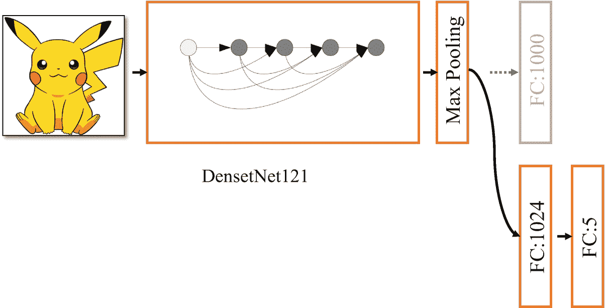

# 十五、定制数据集

> 花一年时间在人工智能上，足以让人相信上帝的存在。
> 
> —阿兰·佩利

深度学习已被广泛用于各种行业，如医学、生物学和金融，并被部署在各种平台上，如互联网和移动终端。前面介绍算法的时候，大部分数据集都是常用的经典数据集。只需几行 TensorFlow 代码就可以完成数据集的下载、加载和预处理，大大提高了研究效率。在实际应用中，对于不同的应用场景，数据集是不同的。对于定制化数据集，使用 TensorFlow 完成数据加载，设计优秀的网络模型训练流程，并将训练好的模型部署到移动和互联网网络等平台，是深度学习算法实现不可或缺的环节。

本章将以图像分类的一个具体应用场景为例，介绍定制数据集下载、数据处理、网络模型设计、迁移学习等一系列实用技术。

## 15.1 pokemon go 数据集

Pokémon Go 是一款手机游戏，它使用增强现实(AR)技术在户外捕捉和训练神奇宝贝精灵，并使用它们进行战斗。该游戏于 2016 年 7 月在 Android 和 IOS 上推出。一经发布就受到了全世界玩家的追捧。服务器一度因玩家太多而瘫痪。如图 15-1 所示，一个玩家用手机扫描了现实环境，收集了虚拟的神奇宝贝“皮卡丘”。


图 15-1

pokemon 游戏画面

我们使用从网上抓取的神奇宝贝数据集来演示如何使用定制数据集。神奇宝贝数据集总共收集了五种精灵生物:皮卡丘、梅特沃、杰尼龟、小火龙和妙蛙种子。每个精灵的信息见表 15-1 ，共 1168 张图片。这些图片中存在错误标注的样本，因此对错误标注的样本进行人工剔除，共获得 1122 张有效图片。

表 15-1

神奇宝贝数据集信息

<colgroup><col class="tcol1 align-justify"> <col class="tcol2 align-justify"></colgroup> 
|  |

读者可以自行下载提供的数据集文件(链接: [`https://drive.google.com/file/d/1Db2O4YID7VDcQ5lK0ObnkKy-U1ZZVj7c/view?usp=sharing`](https://drive.google.com/file/d/1Db2O4YID7VDcQ5lK0ObnkKy-U1ZZVj7c/view%253Fusp%253Dsharing) ，解压后我们可以得到名为 pokemon 的根目录，其中包含五个子文件夹，每个子文件夹的文件名代表图片的类别名称，每个子文件夹下存储有对应的类别如图 15-2 所示。


图 15-2

神奇宝贝数据集存储目录

## 15.2 定制数据集加载

在实际应用中，样品和样品标签的储存方法可能会有所不同。比如在某些场合，所有的图片都存储在同一个目录下，可以从图片名称中导出类别名称，比如一张图片的文件名为“皮卡丘 _asxes0132.png”。类别信息可以从文件名 pikachu 中提取。有些数据样本的标签信息保存在 JSON 格式的文本文件中，每个样本的标签都需要用 JSON 格式查询。无论数据集如何存储，我们总是可以使用逻辑规则来获取所有样本的路径和标签信息。

我们将定制数据的加载过程抽象为以下步骤。

### 创建代码表

样本的类别一般用字符串类型的类别名来标记，但对于神经网络来说，类别名需要进行数字编码，然后在适当的时候转换成一键编码或其他编码格式。考虑一个有 n 个类别的数据集，我们将每个类别随机编码成一个数*l*∈【0，*n*—1】。类别名称和编号之间的映射关系称为编码表。一旦创建，通常无法更改。

对于神奇宝贝数据集的存储格式，我们通过以下方式创建一个编码表。首先，按顺序遍历口袋妖怪根目录下的所有子目录。对于每个子目标，使用类别名称作为码表字典对象 name2label 的键，使用码表中已有的键-值对的个数作为类别的标签映射号，保存到 name2label 字典对象中。实现如下:

```py
def load_pokemon(root, mode='train'):
    # Create digital dictionary table
    name2label = {}  # Coding dictionary, "sq...":0
    # Traverse the subfolders under the root directory and sort them to ensure that the mapping relationship is fixed
    for name in sorted(os.listdir(os.path.join(root))):
        # Skip non-folder objects
        if not os.path.isdir(os.path.join(root, name)):
            continue
        #  Code a number for each category
        name2label[name] = len(name2label.keys())
          ...

```

### 15.2.2 创建样品和标签表单

编码表确定后，我们需要根据实际的数据存储方式，获取每个样本的存储路径及其标签号，分别表示为两个列表对象，图像和标签。图像列表存储每个样本的路径字符串，标签列表存储样本的类别号。两者长度相同，对应位置的元素相互关联。

我们将图像和标签信息存储在 csv 格式文件中，其中 csv 文件格式是纯文本文件格式，数据用逗号分隔，可以用记事本或 MS Excel 软件打开。将所有样本信息存储在一个 csv 文件中有许多优点，例如直接数据集分割和批量采样。csv 文件可以保存数据集中所有样本的信息，或者您可以基于定型集、验证集和测试集创建三个 csv 文件。生成的 csv 文件的内容如图 15-3 所示。每行的第一个元素存储当前样本的存储路径，第二个元素存储样本的类别号。


图 15-3

路径和标签保存在 CSV 文件中

创建 csv 文件的过程是:遍历 pokemon 根目录下的所有图片，记录图片的路径，根据编码表获取编码号，作为一行写入 csv 文件。代码如下:

```py
def load_csv(root, filename, name2label):
    # Return images,labels Lists from csv file
    # root: root directory, filename:csv file name,  name2label:category coding table
    if not os.path.exists(os.path.join(root, filename)):
        # Create csv file if not exist.
        images = []
        for name in name2label.keys(): # Traverse all subdirectories to get all pictures
            # Only consider image files with suffix png,jpg,jpeg:'pokemon\\mewtwo\\00001.png
            images += glob.glob(os.path.join(root, name, '*.png'))
            images += glob.glob(os.path.join(root, name, '*.jpg'))
            images += glob.glob(os.path.join(root, name, '*.jpeg'))
        # Print data info:1167, 'pokemon\\bulbasaur\\00000000.png'
        print(len(images), images)
        random.shuffle(images) # Randomly shuffle
        # Create csv file, and store image path and corresponding label info
        with open(os.path.join(root, filename), mode='w', newline='') as f:
            writer = csv.writer(f)
            for img in images:  # 'pokemon\\bulbasaur\\00000000.png'
                name = img.split(os.sep)[-2]
                label = name2label[name]
                # 'pokemon\\bulbasaur\\00000000.png', 0
                writer.writerow([img, label])
            print('written into csv file:', filename)
              ...

```

创建 csv 文件后，下次只需要从 csv 文件中读取样本路径和标签信息，而不用每次都生成 csv 文件，提高了计算效率。代码如下:

```py
def load_csv(root, filename, name2label):
    ...
    # At this time there is already a csv file on the file system, read directly
    images, labels = [], []
    with open(os.path.join(root, filename)) as f:
        reader = csv.reader(f)
        for row in reader:
            # 'pokemon\\bulbasaur\\00000000.png', 0
            img, label = row
            label = int(label)
            images.append(img)
            labels.append(label)
    # Return image path list and tag list
    return images, labels

```

### 数据集划分

数据集的划分需要根据实际情况灵活调整。当数据集中的样本数量较大时，可以选择 80%-10%-10%的比例分配给训练集、验证集、测试集；当样本数量较少时，比如这里的神奇宝贝数据集中的图片总数只有 1000 张；如果验证集和测试集的比例只有 10%，图片的数量大概是 100 张，那么验证精度和测试精度可能会有很大的波动。对于小数据集，虽然样本量小，但要适当增加验证集和测试集的比例，以保证测试结果准确。这里我们把验证集和测试集的比例设为 20%，也就是有 200 张左右的图片进行验证和测试。

首先调用 load_csv 函数加载图片和标签列表，根据当前模型参数加载相应的图片和标签。具体来说，如果模型参数为 train，则将图像和标签的前 60%数据作为训练集；如果模型参数为 val，图像和标签的 60%到 80%的面积数据作为验证集；如果模型参数是 test，则最后 20%的图像和标签将作为测试集。代码实现如下:

```py
def load_pokemon(root, mode='train'):
    ...
    # Read Label info
    # [file1,file2,], [3,1]
    images, labels = load_csv(root, 'images.csv', name2label)
# Dataset division
    if mode == 'train':  # 60%
        images = images[:int(0.6 * len(images))]
        labels = labels[:int(0.6 * len(labels))]
    elif mode == 'val':  # 20% = 60%->80%
        images = images[int(0.6 * len(images)):int(0.8 * len(images))]
        labels = labels[int(0.6 * len(labels)):int(0.8 * len(labels))]
    else:  # 20% = 80%->100%
        images = images[int(0.8 * len(images)):]
        labels = labels[int(0.8 * len(labels)):]
    return images, labels, name2label

```

需要注意的是，每次运行的数据集划分方案需要固定，以防止使用测试集进行训练，导致模型泛化性能不准确。

## 15.3 实践神奇宝贝数据集

介绍完自定义数据集的加载过程，我们再来加载和训练神奇宝贝数据集。

### 创建数据集对象

首先，通过 load_pokemon 函数返回图像、标签和编码表信息，如下所示:

```py
    # Load the pokemon dataset, specify to load the training set
    # Return the sample path list of the training set, the label number list and the coding table dictionary
    images, labels, table = load_pokemon('pokemon', 'train')
    print('images:', len(images), images)
    print('labels:', len(labels), labels)
    print('table:', table)

```

构造 Dataset 对象，完成数据集的随机拆分、预处理、批量操作。代码如下:

```py
    # images: string path
    # labels: number
    db = tf.data.Dataset.from_tensor_slices((images, labels))
    db = db.shuffle(1000).map(preprocess).batch(32)

```

当我们使用 TF . data . dataset . from _ tensor _ slices 构造数据集时，传入的参数是一个由图像和标签组成的元组，所以在迭代 db 对象时，返回( *X* <sub>*i*</sub> ， *Y* <sub>*i*</sub> )的元组对象，其中 *X* <sub>*i*</sub> 是第*个的图像张量我们可以通过 TensorBoard 可视化查看每次遍历的图像样本，如下所示:*

```py
    # Create TensorBoard summary object
    writter = tf.summary.create_file_writer('logs')
    for step, (x,y) in enumerate(db):
        # x: [32, 224, 224, 3]
        # y: [32]
        with writter.as_default():
            x = denormalize(x) # Denormalize
            # Write in image data
            tf.summary.image('img',x,step=step,max_outputs=9)
            time.sleep(5) # Delay 5s

```

### 数据预处理

我们通过调用。构造数据集时的 map(预处理)函数。由于我们的图像列表目前只保存所有图像的路径信息，而不是图像的内容张量，所以需要在预处理功能中完成图像读取和张量转换。

对于预处理函数(x，y) = preprocess(x，y)，其传入参数需要以与创建数据集时给出的参数相同的格式保存，返回参数需要以与传入参数相同的格式保存。具体来说，我们在构造数据集时传入( *x* ， *y* )元组对象，其中 *x* 是所有图片的路径列表， *y* 是所有图片的标签号列表。考虑到 map 函数的位置是 db = db.shuffle(1000)。映射(预处理)。batch(32)，那么预处理的传入参数是( *x* <sub>*i*</sub> ，*y**I*)，其中 *x* <sub>*i*</sub> 和 *y* <sub>*i*</sub> 分别是第 I 个图片路径字符串和标号。如果映射函数的位置是 db = db.shuffle(1000)。批次(32)。map(预处理)，那么预处理的传入参数为( *x* <sub>*i*</sub> ，*y*<sub>T41】I</sub>)，其中 *x* <sub>*i*</sub> 和 *y* <sub>*i*</sub> 分别为第 I 批的路径和标签列表。代码如下:

```py
def preprocess(x,y): # preprocess function
    # x: image path, y:image coding number
    x = tf.io.read_file(x) # Read image
    x = tf.image.decode_jpeg(x, channels=3) # Decode image
    x = tf.image.resize(x, [244, 244]) # Resize to 244x244

    # Data augmentation
    # x = tf.image.random_flip_up_down(x)
    x= tf.image.random_flip_left_right(x) # flip left and right
    x = tf.image.random_crop(x, [224, 224, 3]) # Crop to 224x224
    # Convert to tensor and [0, 1] range
    # x: [0,255]=> 0~1
    x = tf.cast(x, dtype=tf.float32) / 255.
    # 0~1 => D(0,1)
    x = normalize(x) # Normalize
    y = tf.convert_to_tensor(y) # To tensor

    return x, y

```

考虑到我们的数据集规模很小，为了防止过拟合，我们做了少量的数据增强变换，以获得更多的数据。最后，我们将 0~255 范围内的像素值缩放到 0~1 范围内，并对数据进行归一化处理，将像素映射到 0 附近的分布，有利于网络的优化。最后，将数据转换为张量数据并返回。此时，在对 db 对象进行迭代时，返回的数据将是批量形式的张量数据。

标准化后的数据适用于网络训练和预测，但可视化时需要将数据映射回 0~1 的范围。标准化和规范化的逆过程如下:

```py
# The mean and std here are calculated based on real data, such as ImageNet
img_mean = tf.constant([0.485, 0.456, 0.406])
img_std = tf.constant([0.229, 0.224, 0.225])
def normalize(x, mean=img_mean, std=img_std):
    # Normalization function
    # x: [224, 224, 3]
    # mean: [224, 224, 3], std: [3]
    x = (x - mean)/std
    return x

def denormalize(x, mean=img_mean, std=img_std):
    # Denormalization function
    x = x * std + mean
    return x

```

使用前面的方法，分发创建定型集、验证集和测试集的数据集对象。一般来说，验证集和测试集不直接参与网络参数的优化，不需要随机打乱样本的顺序。

```py
batchsz = 128
# Create training dataset
images, labels, table = load_pokemon('pokemon',mode='train')
db_train = tf.data.Dataset.from_tensor_slices((images, labels))
db_train = db_train.shuffle(1000).map(preprocess).batch(batchsz)
# Create validation dataset
images2, labels2, table = load_pokemon('pokemon',mode='val')
db_val = tf.data.Dataset.from_tensor_slices((images2, labels2))
db_val = db_val.map(preprocess).batch(batchsz)
# Create testing dataset
images3, labels3, table = load_pokemon('pokemon',mode='test')
db_test = tf.data.Dataset.from_tensor_slices((images3, labels3))
db_test = db_test.map(preprocess).batch(batchsz)

```

### 创建模型

VGG13、ResNet18 等主流网络模型之前已经介绍并实现，这里不再赘述模型的具体实现细节。常用的网络模型都是在 keras.applications 模块中实现的，比如 VGG 系列、ResNet 系列、DenseNet 系列、MobileNet 系列，这些模型网络只需要一行代码就可以创建。例如:

```py
# Load the DenseNet network model, remove the last fully connected layer, and set the last pooling layer to max pooling
net = keras.applications.DenseNet121(weights=None, include_top=False, pooling='max')
# Set trainable to True, i.e. DenseNet’s parameters will be updated.
net.trainable = True
newnet = keras.Sequential([
    net, # Remove last layer of DenseNet121
    layers.Dense(1024, activation='relu'), # Add fully connected layer
    layers.BatchNormalization(), # Add BN layer
    layers.Dropout(rate=0.5), # Add Dropout layer
    layers.Dense(5) # Set last layer node to 5 according to output categories
])
newnet.build(input_shape=(4,224,224,3))
newnet.summary()

```

DenseNet121 模型用于创建网络。由于 DenseNet121 最后一层的输出节点设计为 1000，我们去掉了 DenseNet121 的最后一层，根据定制数据集的类别数增加了一个输出节点数为 5 的全连通层。整个设置通过顺序容器重新打包成一个新的网络模型，其中 include_top=False 表示最后一个全连接层被删除，pooling='max '表示 DenseNet121 的最后一个池层被设计为 Max Polling。网络模型结构如图 15-4 所示。



图 15-4

模型结构图

### 网络培训和测试

我们直接使用 Keras 提供的 Compile&Fit 方法对网络进行编译和训练。优化器使用最常用的 Adam 优化器，误差函数使用交叉熵损失函数，设置 from_logits=True。我们在训练过程中关注的衡量指标是准确率。网络模型编译代码如下:

```py
# Compile model
newnet.compile(optimizer=optimizers.Adam(lr=5e-4),
               loss=losses.CategoricalCrossentropy(from_logits=True),
               metrics=['accuracy'])

```

使用拟合函数在训练集上训练模型。历元的每次迭代测试一个验证集。训练时期的最大数量是 100。为了防止过拟合，我们使用提前停止技术，并将提前停止传递到拟合函数的回调参数中，如下所示:

```py
# Model training, support early stopping
history  = newnet.fit(db_train, validation_data=db_val, validation_freq=1, epochs=100,
           callbacks=[early_stopping])

```

其中 early_stopping 是标准的 EarlyStopping 类。它监控的指标是验证集的准确性。如果验证集的测量结果连续三次没有增加 0.001，则触发提前停止条件，训练结束。

```py
# Create Early Stopping class
early_stopping = EarlyStopping(
    monitor='val_accuracy',
    min_delta=0.001,
    patience=3
)

```

我们把训练过程中的训练准确率、验证准确率、最终测试集上得到的准确率绘制成曲线，如图 15-5 所示。可以看出，训练准确率增长很快，维持在较高的状态，但验证准确率相对较低，同时也没有得到很大的提升。触发提前停止条件，训练过程快速终止。网络有一点过拟合的问题。


图 15-5

从随机初始化中训练 DenseNet

那么为什么会出现过拟合呢？DensetNet121 模型的层数达到了 121 层，参数数量达到了 700 万，是一个很大的网络模型，而我们的数据集只有 1000 个左右的样本。根据经验，这远远不够训练这么大规模的网络模型，容易出现过拟合。为了减少过拟合，可以使用层数较浅、参数较少的网络模型，或者增加正则化项，甚至可以增加数据集的大小。除了这些方法，另一个有效的方法是迁移学习技术。

## 15.4 迁移学习

### 迁移学习的原则

迁移学习是机器学习的一个研究方向。主要研究如何将任务 A 上学习到的知识迁移到任务 B 上，以提高任务 B 上的泛化性能，比如任务 A 是猫狗分类问题，需要训练一个分类器来更好的区分猫狗的图片，任务 B 是牛羊分类问题。可以发现任务 A 和任务 b 中有很多共享的知识，比如可以从毛发、体型、形状、毛色等方面来区分这些动物。所以任务 A 中获得的分类器已经掌握了这部分知识。在训练任务 B 的分类器时，不需要从头开始训练，而是可以对任务 A 上获得的知识进行训练或微调，这与“站在巨人的肩膀上”的想法非常相似。通过迁移在任务 A 上学习到的知识，在任务 B 上训练分类器可以使用更少的样本和更低的训练成本，获得良好的性能。

我们介绍一种相对简单，但是非常常用的迁移学习方法:网络微调技术。对于卷积神经网络，一般认为它可以逐层提取特征。层末网络的抽象特征提取能力更强。输出层一般使用输出节点数与分类网络相同的全连通层作为概率分布预测。对于相似的任务 A 和 B，如果它们的特征提取方法相似，网络的前几层可以重用，后面几层可以根据具体的任务设置从零开始训练。

如图 15-6 所示，左边的网络在任务 A 上训练，学习任务 A 的知识，迁移到任务 B 时，网络模型早期各层的参数可以重用，后期各层可以换成新的网络，从头开始训练。我们称在任务 A 中训练的模型为预训练模型。对于图像分类，在 ImageNet 数据集上预训练的模型是更好的选择。


图 15-6

神经网络迁移学习示意图

### 15.4.2 动手迁移学习

基于 DenseNet121，我们用 ImageNet 数据集上预训练的模型参数初始化网络，去掉最后一个全连通层，添加一个新的分类子网络，最后一层的输出节点数设置为 5。

```py
# Load DenseNet model, remove last layer, set last pooling layer as max pooling
# Initilize with pre-trained parameters
net = keras.applications.DenseNet121(weights='imagenet', include_top=False, pooling='max')
# Set trainable to False, i.e. fix the DenseNet parameters
net.trainable = False
newnet = keras.Sequential([
    net, #  DenseNet121 with last layer
    layers.Dense(1024, activation='relu'), # Add fully connected layer
    layers.BatchNormalization(), # Add BN layer
    layers.Dropout(rate=0.5), # Add Dropout layer
    layers.Dense(5) # Set the nodes of last layer to 5
])
newnet.build(input_shape=(4,224,224,3))
newnet.summary()

```

前面的代码创建 DenseNet121 时，可以通过设置 weights='imagenet '参数返回预训练的 DenseNet121 模型对象，重用的网络层和新的子分类网络通过顺序容器重新打包成新的模型 newnet。在微调阶段，可以通过设置 net.trainable = False 来固定 DenseNet121 部分的参数，即网络的 DenseNet121 部分不需要更新参数，只需要训练新加入的子分类网络，大大减少了实际参与训练的参数数量。当然，你也可以像普通网络一样，通过设置 net.trainable = True 来训练所有参数。即便如此，由于网络的复用部分已经用良好的参数状态初始化，网络仍然可以快速收敛，达到更好的性能。

基于预训练的 DenseNet121 模型，我们在图 15-7 中绘制了训练精度、验证精度和测试精度。与从零开始训练的方法相比，在迁移学习的帮助下，网络学习的速度要快得多，并且只需要很少的样本就可以达到更好的性能，改善非常显著。


图 15-7

根据预先训练的 ImageNet 权重训练 DenseNet

至此，你已经到了这本书的结尾。然而，你的机器学习之旅才刚刚开始。希望这本书能作为你研究或工作时的参考书之一，对你有所帮助！

## 15.5 摘要

恭喜你！使用流行的深度学习框架 TensorFlow 2，您已经走了很长一段路来学习深度学习的理论和实现。现在你应该不仅能够理解深度学习的基本原理，而且能够使用 TensorFlow 2 开发自己的深度学习模型来解决现实世界的问题。对于真实世界的应用程序，好的模型是不够的。我们需要可靠的操作系统来持续产生高质量的模型结果。鉴于真实世界的数据一直在变化，并且经常包含噪声或误差，这是非常具有挑战性的。因此，一个可靠的机器学习操作系统需要一个健壮的数据处理流水线，实时的模型性能监控，以及适当的机制来重新训练或切换模型，这就引出了机器学习操作(MLOps)的概念。对于有兴趣了解更多关于 MLOps 的信息并了解深度学习的最新应用和发展的读者，deeplearning.ai 提供了很多很好的资源和课程，以及其每周简讯——[*、批次*](https://read.deeplearning.ai/the-batch/) 。希望这本书能带给你自己有趣的深度学习之旅，促进你的事业和生活！