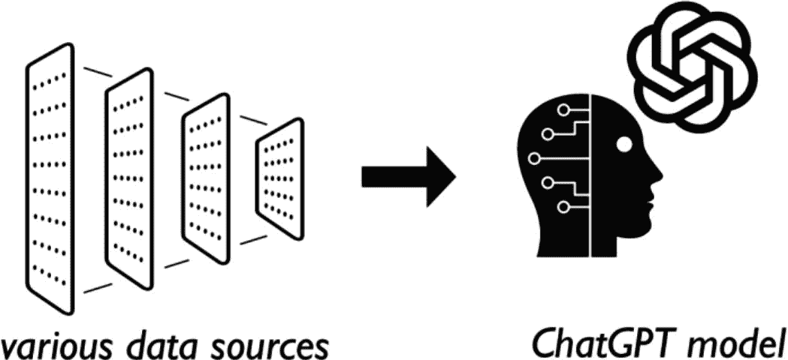
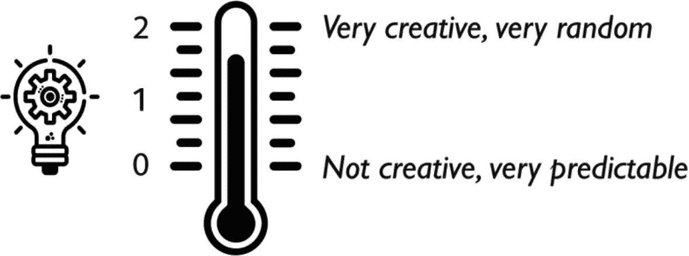

# 1. 为 Python 开发者介绍 ChatGPT

## 本书面向哪些读者？

首先，本书面向的是没有接受过人工智能、自然语言处理、机器学习或深度学习方面培训或经验的 Python 开发者。你可能听说过“语言模型”这个术语，但我假设它*并非*你日常使用的词汇。

其次，你可能熟悉（或尝试过）ChatGPT，但并*不完全*理解其“底层”工作原理，也不确定如何开始以编程方式将 Python 和 ChatGPT 结合使用，从而为自己的应用程序和服务“赋能 AI”。

**注意：** 尽管 ChatGPT 家喻户晓，但其背后的公司 OpenAI 却缺乏广泛的认知度，并不那么广为人知。因此，虽然本书是关于如何在你的 Python 应用中通过编程方式使用 ChatGPT，但我们实际使用的 API 是官方的 OpenAI REST API。因此，我们将同义使用“ChatGPT API”和“OpenAI API”这两个术语。

## 概述

在本章中，我们将直接切入正题，解释一些你可能不熟悉的术语，然后直接进入 ChatGPT Playground。Playground 本质上是一个为开发者设计的、基于 ChatGPT REST API 构建的 Web 界面。因此，一旦你熟悉了 Playground，对 ChatGPT API 的调用和响应就会变得得心应手。

## 立即下载代码！

本书包含大量示例和示例代码，何必自己费力逐字输入呢？下面是访问源代码的 GitHub 仓库链接：

[`github.com/Apress/Beginning-ChatGPT-for-Python`](https://github.com/Apress/Beginning-ChatGPT-for-Python)

## 那么，ChatGPT 到底是什么？为什么我需要使用 OpenAI API？

简单来说，ChatGPT 是由 OpenAI 开发的一组**语言模型**（深度学习算法训练的结果），能够根据给定的提示生成类似人类的文本响应。那么，什么是提示？提示就是你提供给 ChatGPT 的输入文本。那么，让我们先给 ChatGPT 一个提示，问问它对 Python 设计模式的熟悉程度。

```
描述 Python 开发者常用的 3 种设计模式，并说明这些模式为何重要
```

**清单 1-1** — 提示。一个关于 Python 设计模式的简单 ChatGPT 提示

如果你曾有机会在一家专业使用 Python 的公司工作，那么你可能在面试中遇到过与上述提示非常相似的问题。下面的清单是 ChatGPT 的响应。

```
设计模式是软件设计中常见问题的标准解决方案，提供了如何组织代码以使其更易于维护、扩展和理解的指南。在 Python 开发中，由于该语言的特性和哲学，某些设计模式尤其受到青睐。以下是 Python 开发者中常用的三种设计模式：
1. 单例模式
描述：单例模式确保一个类只有一个实例，并提供一个全局访问点来访问该实例。在 Python 中，通过使用一个确保只创建该类一个实例的类来实现。该类将唯一的实例存储在一个类变量中，任何后续尝试实例化该类的操作都只会返回已存在的实例。
重要性：单例模式在拥有类的多个实例可能导致问题的场景中至关重要，例如在数据库连接管理或应用程序的配置设置中。通过确保只创建一个实例，它可以防止状态不一致或资源过度使用等问题。
2. 工厂方法模式
描述：工厂方法模式是一种创建型模式，它提供了一个在超类中创建对象的接口，但允许子类改变将要创建的对象的类型。客户端不直接调用构造函数，而是调用工厂方法，该方法可以根据输入或环境返回不同子类的实例。
重要性：此模式很重要，因为它通过消除将应用程序特定类绑定到代码中的需要，促进了松耦合。工厂方法使你的代码更加模块化、更易于扩展和维护，因为创建逻辑被封装在工厂方法中。这在 Python 中处理一组需要动态创建的相关对象时特别有用。
3. 观察者模式
描述：观察者模式定义了对象之间的一对多依赖关系，使得当一个对象改变状态时，其所有依赖对象都会自动收到通知并更新。它通常通过一个持有依赖对象（观察者）列表的主题（或可观察对象）来实现，并在状态发生变化时通知它们，通常是通过调用它们的方法之一。
重要性：此模式对于创建事件驱动的应用程序，或者当一个对象的状态变化可能需要影响其他对象的状态而又不将它们紧密耦合时至关重要。它广泛应用于 GUI 应用程序、实时数据监控和事件处理系统。Python 中的观察者模式有助于开发能够动态响应变化的响应式、解耦系统。
这些设计模式之所以重要，是因为它们解决了反复出现的设计问题，使代码更具可重用性、可维护性和可扩展性。通过使用这些模式，Python 开发者可以确保他们的代码库健壮、高效且易于适应变化。
```

**清单 1-2** — 响应。ChatGPT 对清单 1-1 中提示的响应


不错吧？ChatGPT 不仅能列出 Python 开发者常用的设计模式，还能用自然语言解释它们为何重要。

那么，归根结底，这对 Python 开发者意味着什么呢？嗯，这其实意义重大。因为开发者现在能够创建对自然语言文本具有一定“理解”能力的应用程序。在像 ChatGPT 这样的人工智能工具出现之前，开发者通常需要创建正则表达式（也称为“regex”）来对文本主体执行基本的字符和字符串模式匹配。然而，模式匹配和自然语言理解完全是两码事。

## 正则表达式 vs. ChatGPT：对决！

> **注意**  
> 如果你已经知道正则表达式无法执行自然语言理解或情感分析，可以随意跳过本节。

我深信，每个程序员在职业生涯的某个阶段都遇到过某个恰好是编写正则表达式专家的家伙。正则表达式很棒，因为它们能够解析大量文本，以编程方式在文本中查找模式。

*然而*，正则表达式最大的缺点之一是，一旦编写完成，它们就极难阅读（在我看来，即使是原始开发者本人也难以阅读）。

那么，让我们看看正则表达式在面对具备自然语言处理（NLP）和自然语言理解（NLU）能力的 ChatGPT 时表现如何。

清单 1-3 讲述了一个不切实际的悲伤故事。然而，它清楚地说明了一点：尽管正则表达式可用于在文本主体中查找单词和短语，但它无法提供任何类型的 NLU。

```
在美国巴特斯维尔市的米尔克梅德街上，住着三个朋友：玛丽昂·优格特、珍妮尔·德·克索和史蒂夫·奇斯沃斯三世。在一个炎热的夏日，他们听到了冰淇淋车的音乐，决定去买点吃的。
玛丽昂喜欢草莓味，珍妮尔偏爱巧克力味，而史蒂夫有乳糖不耐症。那天，只有两个孩子吃了冰淇淋，其中一个还买了一瓶常温的水。冰淇淋车里备齐了各种经典口味的冰淇淋。
清单 1-3
Sadstory.txt：一个关于没吃上冰淇淋的孩子的悲伤故事
```

### 分析问题 #1：谁没吃到冰淇淋，为什么？

现在，让我们稍微分析一下，并问自己几个问题。首先，谁没吃到冰淇淋，为什么？显而易见的答案是史蒂夫因为乳糖不耐症没吃到冰淇淋。然而，由于故事没有直接说史蒂夫没买冰淇淋，正则表达式无法匹配到故事中的文本模式。

正则表达式可以查找诸如“没吃”、“没有冰淇淋”或孩子们的名字等关键词。然而，它只能根据这些模式的存在来提供响应。例如，如果正则表达式匹配到“没吃”或“没有冰淇淋”与史蒂夫名字的模式，它可以向你展示文本模式的结果。但是，它肯定无法解释为什么史蒂夫是那个没吃冰淇淋的人，也无法提供任何特定于上下文的推理。

现在，让我们把同样的故事提供给 ChatGPT，并提问：“谁没吃到冰淇淋？”下面的清单 1-4 将我们的问题和上面的故事放在一起，作为一个提示词。

```
根据下面故事中的信息，谁没吃到冰淇淋，为什么？
###
在美国巴特斯维尔市的米尔克梅德街上，住着三个朋友：玛丽昂·优格特、珍妮尔·德·克索和史蒂夫·奇斯沃斯三世。在一个炎热的夏日，他们听到了冰淇淋车的音乐，决定去买点吃的。
玛丽昂喜欢草莓味，珍妮尔偏爱巧克力味，而史蒂夫有乳糖不耐症。那天，只有两个孩子吃了冰淇淋，其中一个还买了一瓶常温的水。冰淇淋车里备齐了各种经典口味的冰淇淋。
清单 1-4
提示词。被放入提示词的悲伤故事
```

请注意，在创建同时包含指令和数据的提示词（如上所示）时，提供某种分隔符（此处为“###”）是一种最佳实践。稍后，当我们开始使用 Playground 或 Python 以编程方式调用 ChatGPT API 时，你会看到有更好的方法来实现这种分隔。

因此，发送提示词后，ChatGPT 会提供如下答案。

```
根据所给信息，史蒂夫有乳糖不耐症，因此不能吃冰淇淋。所以，史蒂夫是那个没吃到冰淇淋的人。
清单 1-5
响应。ChatGPT 对分析问题 #1 的回答
```

如你所见，ChatGPT 能够利用 NLP 和 NLU，因此它可以（以人工智能的方式）理解场景的上下文。它可以解读孩子们之间的关系、他们的喜好以及史蒂夫的乳糖不耐症。它能够理解孩子们的名字、街道名称和城市名称都是乳制品的名称，但显然与当前问题无关。

### 分析问题 #2：哪个孩子可能感到难过？

现在，为了进一步证明正则表达式无法提供任何类型的 NLP 或 NLU，让我们引入一个新术语：**情感分析**。那么，冰淇淋车开走后，哪个孩子感到难过？

由于故事中没有提及任何孩子的感受或情绪，因此没有任何文本模式能让正则表达式返回匹配结果。

然而，如果你向 ChatGPT 提出同样的问题，它会返回如下响应。

```
由于史蒂夫有乳糖不耐症，不能吃冰淇淋，他会是那个感到难过的孩子，因为他无法像玛丽昂和珍妮尔一样享受冰淇淋。
由于史蒂夫有乳糖不耐症，不能吃冰淇淋，他会是那个感到难过的孩子，因为他无法像玛丽昂和珍妮尔一样享受冰淇淋。
清单 1-6
响应。ChatGPT 对分析问题 #2 的回答
```

因此，ChatGPT 能够理解场景，推理信息，并提供正确答案以及该答案的解释。

## 为了更深入了解 ChatGPT API，让我们先忘掉一些词汇

首先，在开始使用 ChatGPT 和 OpenAI API 之前，你应该先熟悉一些词汇和术语；否则，事情可能不会完全说得通。所以，让我们确保在使用 ChatGPT 编程时，对模型、提示词、令牌和温度的定义都一清二楚。


### 模型。模型？模型！！！

作为一名 Python 开发者，当你听到“模型”这个词时，可能立刻会想到 Python 应用中现实世界实体的表示，对吧？例如，想想“对象模型”这个术语。此外，如果你曾使用过任何类型的数据库，那么“模型”这个词*也*可能会让你联想到数据库中数据及其关系的表示。例如，想想“数据模型”这个术语。

然而，在使用 ChatGPT API（以及广义上的人工智能）时，你需要忘记这两种定义，因为它们并不适用。在人工智能领域，“模型”是一个预训练的**神经网络**。

请记住，正如我之前提到的，阅读本书并不需要机器学习博士学位。那么，什么是神经网络？简单来说，神经网络是人工智能系统的基本组成部分，因为它通过使用互连的人工神经元层来处理和分析数据，旨在模拟人脑的工作方式。这些网络可以在大量数据上进行训练，以学习模式、关系并做出预测。



**图 1-1** 人工智能模型在大量数据上进行训练

在人工智能的语境中，“预训练模型”指的是一个神经网络，它在可供开发者使用之前，已经针对特定任务或数据集进行了训练。这个训练过程包括将模型暴露于大量已标记和分类（也称为“注释”）的数据中，并调整其内部参数以优化其在给定任务上的性能。

让我们来看看 OpenAI 为开发者提供的一些模型，以便为其应用程序赋能人工智能。

| `o1` | `o1` 系列大型语言模型通过强化学习进行训练，以处理复杂的推理任务。`o1` 模型在回答前会进行深度思考，在响应用户之前生成长篇的内部推理链。这些模型生成响应所需的时间比其他模型长得多。一些可用的 `o1` 模型包括：• `o1` • `o1-mini` |
| --- | --- |
| `GPT-4` | `GPT-4` 是 OpenAI 的 GPT 模型系列中生成速度最快的模型之一。`GPT` 代表生成式预训练变换器，这些模型经过训练，能够理解自然语言以及多种编程语言。`GPT-4` 模型接受文本和图像作为提示输入，并输出文本。一些可用的 `GPT-4` 模型包括：• `gpt-4o` • `gpt-4o-mini` • `gpt-4o-realtime` • `gpt-4o-audio` |
| `DALL·E` | `DALL·E` 模型可以根据自然语言提示生成和编辑图像。在本书后面的第 5 章中，我们将使用 `DALL·E` 模型来可视化你最喜欢的播客剧集中讨论的内容，这会很有趣。一些可用的 `DALL·E` 模型包括：• `dall-e-3` • `dall-e-2` |
| `TTS` | `TTS` 模型接收文本并将其转换为音频，效果出奇地好。在大多数情况下，生成的音频几乎与人类声音无法区分。一些可用的 `TTS` 模型包括：• `tts-1` • `tts-1-hd` |
| `Whisper` | 简单来说，`Whisper` 模型将音频转换为文本。在本书中，我们将使用 `Whisper` 模型在播客剧集中搜索文本。 |
| `Embeddings` | `Embeddings` 模型可以将大量文本转换为数值表示，以反映文本中字符串之间的关联方式。那么这有什么用呢？嵌入允许开发者使用自定义数据集执行特定任务。是的，这意味着你可以在与你的应用程序相关的特定数据上训练 `Embeddings` 模型。这使你能够执行诸如以下操作：• 在你自己的文本语料库中进行搜索 • 对数据进行聚类，以便根据相似性对文本字符串进行分组 • 获取推荐（推荐具有相关文本字符串的项目） • 检测异常（识别出相关性较低的异常值） • 衡量多样性（分析相似性分布） • 对数据进行分类（根据最相似的标签对文本字符串进行分类） |
| `Moderations` | `Moderations` 模型是经过微调的模型，可以检测文本是否敏感或不安全。这些模型可以分析文本内容，并根据以下类别进行分类：• 仇恨 • 仇恨/威胁 • 骚扰 • 骚扰/威胁 • 自残 • 自残/意图 • 自残/指示 • 色情 • 色情/未成年人 • 暴力 • 暴力/图形 可用的 `Moderations` 模型包括：• `text-moderation-latest` • `omni-moderation-latest` • `text-moderation-stable` |
| 旧版与已弃用 | 自 ChatGPT 首次亮相以来，OpenAI 一直持续支持其较旧的 AI 模型，但这些模型已被标记为“旧版”或“已弃用”。这些模型仍然存在；然而，他们已经发布了其他更准确、更快且使用成本更低的模型。 |

> **注意**  
> 这绝非 OpenAI 为开发者提供的可用模型的详尽列表！随着新模型的发布，旧模型将被标记为旧版或已弃用。因此，务必通过查看 OpenAI 文档中的模型列表来保持更新：  
> [`platform.openai.com/docs/models`](https://platform.openai.com/docs/models)

### 当我们谈论 Token 时，别想成访问令牌

当使用第三方 API（例如外部 REST 服务）时，你可能会将“token”理解为访问令牌，它通常是一个 UUID，用于标识你的身份并与服务保持会话。那么，现在请忘记这个定义。相反，在使用 OpenAI API 时，**token** 是一个大约四个字符长的文本块。仅此而已——没有其他特殊含义。

那么，如果 token 只是一个大约四个字符的文本块，我们为什么要在意它呢？

在使用 OpenAI 的文本模型时，开发者需要注意 token 限制，因为它们会影响 API 调用的成本和性能。例如，`gpt-4o` 和 `o1` 模型都支持 128,000 个 token（大约相当于一本 300 页小说的篇幅）作为提示输入。这些输入 token 也称为上下文窗口。相比之下，`gpt-4o` 的最大输出 token 为 16,384，而 `o1` 模型的最大输出 token 为 32,768。

因此，开发者需要考虑作为模型输入和输出的提示长度，确保它们符合模型的 token 约束。

**表 1-1** 列出了一些最新模型及其 token 限制和定价。

**表 1-1** 模型列表及其 Token 限制和每 Token 成本

| 模型 | 上下文窗口 | 输入 Token 成本 | 输出 Token 成本 |
| --- | --- | --- | --- |
| `gpt-4o` | 128,000 | $2.50 / 1M 输入 tokens | $10.00 / 1M 输出 tokens |
| `gpt-4o-mini` | 128,000 | $0.150 / 1M 输入 tokens | $0.600 / 1M 输出 tokens |
| `o1` | 128,000 | $15.00 / 1M 输入 tokens | $60.00 / 1M 输出 tokens |
| `o1-mini` | 128,000 | $3.00 / 1M 输入 tokens | $12.00 / 1M 输出 tokens |

### 温度关乎创造力

当然，ChatGPT 没有感知能力，因此无法像人类一样思考。但是，通过调整向 ChatGPT API 发送提示中的**温度**设置，你可以让响应更具创造力。如果你想充分利用其潜力，了解它所理解的内容至关重要。



**图 1-2** 调整温度以获得更多（或更少）创造性的响应


