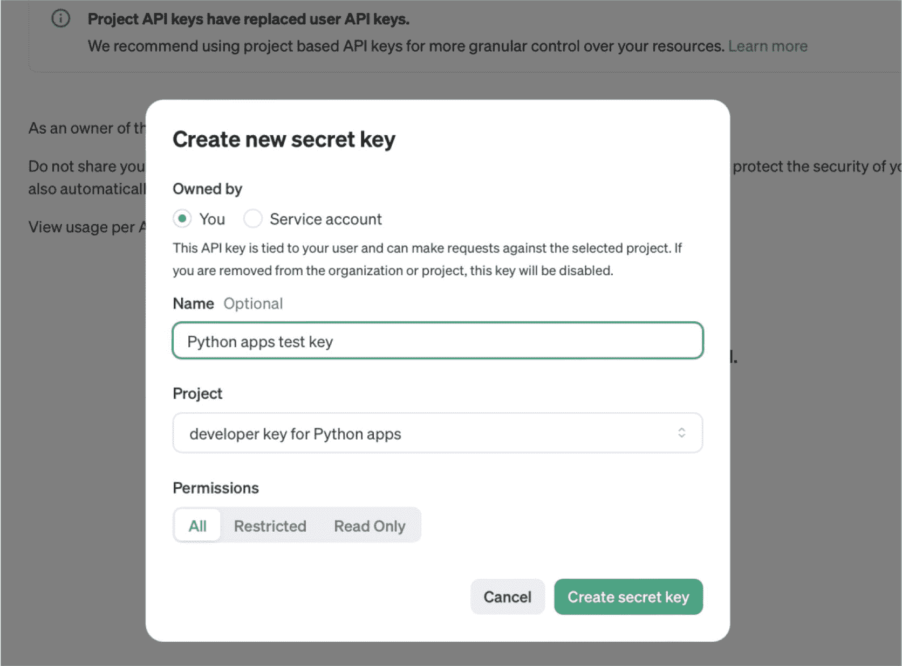
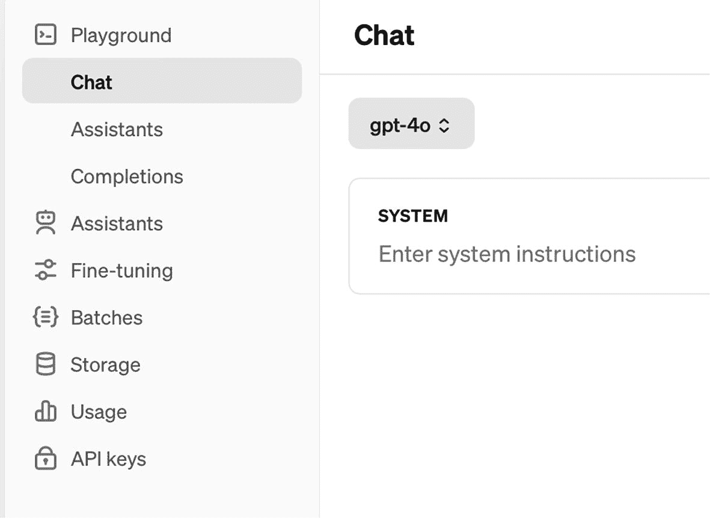
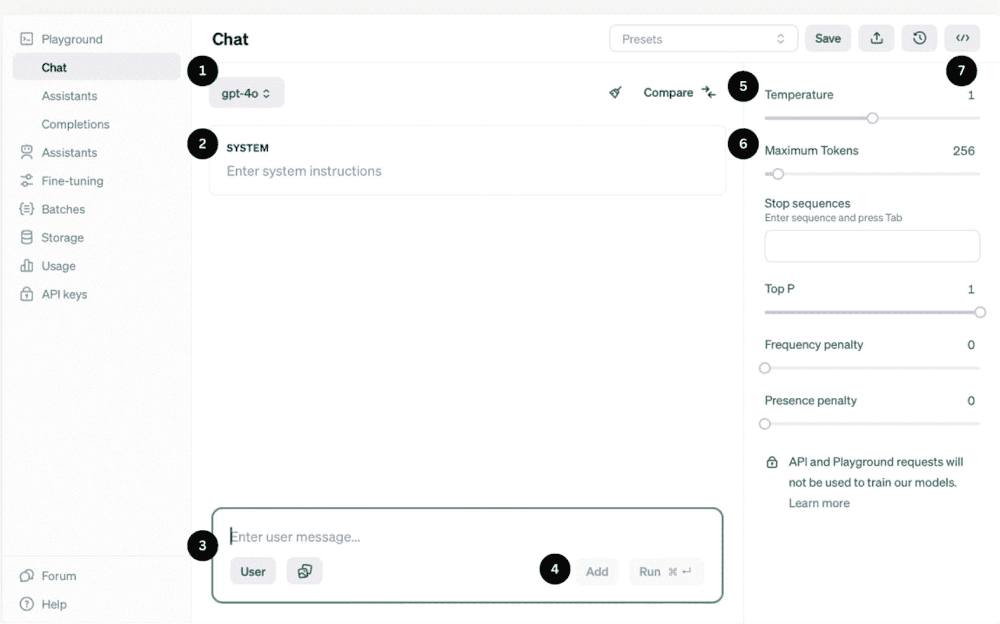
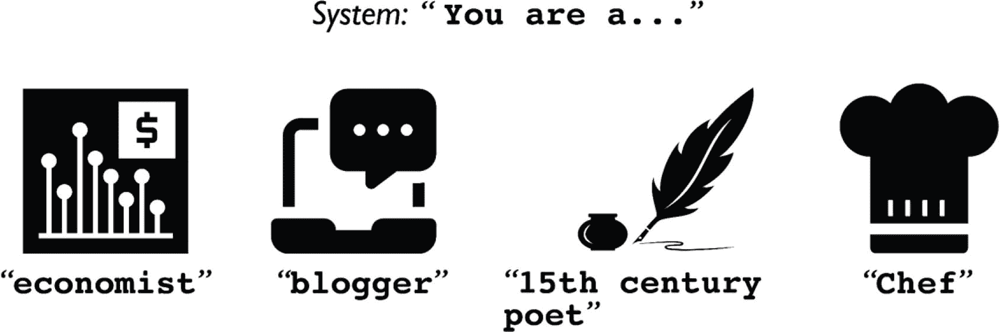

# OpenAI Playground 入门指南

现在，是时候将我们目前学到的概念付诸实践了！不过，我们需要按部就班，因此，你首先需要拥有一个 OpenAI 开发者账户并创建一个 API 密钥。

请访问以下网址创建你的开发者账户和 API 密钥：

[`platform.openai.com/account/api-keys`](https://platform.openai.com/account/api-keys)

如图 1-3 所示，你可以为你的 API 密钥任意命名。



图 1-3

在访问 Playground 或调用 API 之前，你需要拥有一个 API 密钥

请注意，创建 API 密钥的一个必要条件是，你需要向 OpenAI 提供一张信用卡，以便根据模型使用量进行计费。

现在你已经有了 API 密钥，让我们直接进入以下网址的 Chat Playground：

[`platform.openai.com/playground`](https://platform.openai.com/playground)

进入 Playground 后，点击顶部的下拉框，选择 **Chat** 选项以启动 Chat Playground，如图 1-4 所示。



图 1-4

进入 Playground 后，选择 Chat 选项

图 1-5 展示了 Chat Playground，其中某些部分已编号以便识别。



图 1-5

Chat Playground 初看可能有些令人望而生畏

## 1. 模型

在本章前面部分，我们讨论了可供开发者使用的各种模型。点击 **模型** 字段即可查看可用模型列表。

你可能还会注意到，某些模型的名称中带有月份和日期，这仅仅是该模型的一个快照。通过编程方式选择快照，可以让开发者对 ChatGPT 返回的响应有一定程度的可预测性，因为当前模型总是在不断更新。

## 2. 系统

如你所见，Chat Playground 的用户界面远比其他人使用的 ChatGPT 网站复杂得多。那么，我们来谈谈 **系统** 字段（见图 1-5 中的第 2 项）。

在我看来，ChatGPT 可以被描述为“一种极其强大的人工智能……但患有健忘症”。因此，当你以编程方式使用 ChatGPT 时，你需要告知系统它在对话中扮演的角色！

下图 1-6 展示了 ChatGPT 在对话中可以扮演的数千种不同角色。



图 1-6

Chat Playground 中的系统字段允许你设置 ChatGPT 在对话中扮演的角色

## 3. 用户/助手

Chat Playground 中的 **用户** 字段（图 1-5 中的第 3 项）是你向 ChatGPT 输入提示的地方，可以是任何你想要的内容，例如“描述远程医疗将如何影响医疗行业”。

当你初次加载 Chat Playground 时，**助手** 字段是不可见的。要使其显示，你需要点击“用户”按钮切换到助手字段。现在，你可能会问自己：“为什么需要这个字段？”嗯，这是个好问题。如果你希望 ChatGPT 记住它在之前对话中已经告诉过你的某些信息，那么你需要将你认为相关的、它已经告诉过你的内容输入到助手字段中，以便继续对话。记住，它是一个极其强大的人工智能，但它有健忘症！

## 4. 添加（可选）

**添加**（图 1-5 中的第 4 项）是你点击以向对话中添加一条助手消息或另一条用户消息的地方。现在，你可能会问：“既然我可以在上面的原始用户字段中输入我想要的内容，那么再向对话中添加另一条用户消息有什么意义呢？”好问题。

如果你想将命令与数据分开，那么你可以为此使用单独的用户消息。

你还记得本章前面的代码清单 1-4 中，我们不得不使用“###”来分隔给 ChatGPT 的命令和我们要它分析的数据吗？嗯，现在不再需要这样做了，因为命令可以是第一条用户消息；数据可以是第二条用户消息。

## 5. 温度（可选）

正如本章前面所述，温度选择器的范围在 0 到 2 之间，允许你选择响应的“随机性”。

## 6. 最大令牌数（可选）

你还记得本章前面关于令牌的讨论吗？通过在此项范围内选择任何值，你可以调整响应中的令牌数量（这直接影响单词数量）。

## 7. 代码（可选）

在 Playground 中提交提示后，你可以点击代码按钮（图 1-4 中的第 7 项），以查看使用其支持的任何语言发送相同提示所需的代码。

## 立即尝试！使用“系统”角色进行实验

现在我们已经熟悉了 Chat Playground 的几个功能，让我们使用上述设置发送第一个提示。下面的代码清单 1-7 和 1-8 使用了相同的提示，要求 ChatGPT 写几段关于远程医疗的文字，但系统的角色却截然不同。

```
系统：你是一位观点鲜明的健康博主，总是分享亲身经历的故事
用户：写三段关于远程医疗利弊的文字
代码清单 1-8
提示：作为观点鲜明的健康博主，谈远程医疗的利弊
```

```
系统：你是一位严格基于事实的研究员
用户：写三段关于远程医疗利弊的文字
代码清单 1-7
提示：作为研究员，谈远程医疗的利弊
```

我们鼓励你亲自尝试这两个提示，看看响应结果。调整温度和令牌长度的设置，以熟悉这些参数如何影响输出。

## 结论

你刚刚了解了更多关于开发者如何使用 ChatGPT 的知识。我们介绍了 Chat Playground 的一些基础知识，这是一个供开发者与 ChatGPT API 交互的 Web 界面。

我们讨论了如何在 Chat Playground 中设置系统、用户和助手角色，以及如何调整诸如温度和最大输出长度等设置。

你学习了使用 Chat Playground 所需的一些参数和术语，例如模型、温度和令牌。熟悉 Chat Playground 的参数对于了解如何使用 REST API 至关重要，因为 Playground 是 REST API 所提供功能的一个子集。

在下一章中，我们将了解如何将 ChatGPT 用作你的“结对编程伙伴”，并创建一个为我们提供天气和上班到达时间的生产力应用程序。

