# 2. 使用 ChatGPT 作为你的 Python 结对编程伙伴

我是 XP（极限编程）某些实践的忠实粉丝，尤其是结对编程。无论你喜欢哪种风格的结对编程，它都涉及两名工程师坐在同一屏幕前，共同解决同一个问题。你获得的最大好处之一就是为问题带来新的视角，当然，现在有两名工程师“接触”过代码库，而不是只有一名。有时，你可以让一名工程师编写代码，另一名编写测试和注释。无论你如何划分，这都是好事。


## 概述

本章将引导您获取并测试您的 API 密钥，让您熟悉如何调用 OpenAI Python API 来使用 ChatGPT，并介绍如何将其应用于其他模型。此外，我们将把 ChatGPT 作为结对编程伙伴，开发一个应用程序，该程序能够接收城市名称和您希望到达工作地点的时间，然后根据交通状况为您提供天气和预计到达时间！听起来很激动人心吧？那么，让我们马上开始吧。

## 使用 `pip` 安装（或更新）OpenAI 库

要使用 Python 的 OpenAI 库，您的机器上至少需要安装 Python 3.7.1。要检查您安装的 Python 版本，只需打开一个终端窗口，然后执行：

```
python3 -v
```

如果已安装 Python 3，终端将显示您拥有的版本。当然，如果终端提示您使用的是不兼容的版本（即低于 3.7.1），那么您应该更新机器上的 Python。此外，如果您根本没有安装 Python 3，那么您应该在继续之前安装它。

现在您已经满足了所有先决条件，是时候安装 OpenAI Python 库本身了。回到您的终端窗口，执行以下命令：

```
pip install --upgrade openai
```

上面的命令将为您安装 OpenAI 库（如果尚未安装），如果已安装，则会将其更新到最新版本。

## 设置 API 密钥的三种方法

在设置 OpenAI API 的 API 密钥时，有多种方法可供选择，每种方法都针对特定的项目需求和安全考虑而设计。

### 选项 #1：设置系统级环境变量

环境变量方法会建立一个系统级的环境变量来存储 API 密钥。这为密钥管理提供了一个集中点，简化了跨不同项目的部署。

让我们看看具体的操作步骤。

#### 对于 Mac OS

首先，打开终端。您可以在“应用程序”文件夹中找到它，或使用聚焦搜索（Command + Space）进行搜索。

接下来，编辑您的 bash 配置文件。对于较旧的 MacOS 版本，您需要使用命令 `nano ~/.bash_profile`。较新 MacOS 版本的用户需要使用 `nano ~/.zshrc`。这将在文本编辑器中打开配置文件。

现在，让我们添加您的环境变量。在编辑器中，添加下面这一行，将 `'your-api-key-here'` 替换为您的实际 API 密钥（不要包含单引号）。

```
export OPENAI_API_KEY='your-api-key-here'
```

让我们保存并退出，按 `Ctrl+O` 写入更改，然后按 `Ctrl+X` 关闭编辑器。

现在，您需要加载您的配置文件，对于较旧的 Mac OS 版本使用 `source ~/.bash_profile`，对于较新的 Mac OS 版本使用 `source ~/.zshrc`。这将加载更新后的配置文件。

最后，我们将验证一切是否正确完成。在终端中，输入 `echo $OPENAI_API_KEY`。如果一切顺利，它将显示您的 API 密钥，确认设置成功。

```
echo $OPENAI_API_KEY
```

#### 对于 Windows

首先打开命令提示符。您可以在开始菜单中搜索 "cmd" 来找到它。

现在，我们将使用以下命令在当前会话中设置环境变量，将 `'your-api-key-here'` 替换为您的实际 API 密钥。此命令为当前会话设置 `OPENAI_API_KEY`。

```
setx OPENAI_API_KEY 'your-api-key-here'
```

您可以通过系统属性添加变量来使设置永久生效：

*   右键单击“此电脑”或“我的电脑”，然后选择“属性”。
*   点击“高级系统设置”。
*   点击“环境变量”按钮。
*   在“系统变量”部分，点击“新建...”，然后输入 `OPENAI_API_KEY` 作为变量名，输入您的 API 密钥作为变量值。

为确保一切正常工作，请重新打开命令提示符并输入以下命令来验证设置。它应该会显示您的 API 密钥。

```
echo %OPENAI_API_KEY%
```

#### 对于 Linux

要为当前会话设置环境变量，请打开一个终端窗口并使用 `export` 命令。将 `'your-api-key-here'` 替换为您的实际 API 密钥。

```
export OPENAI_API_KEY='your-api-key-here'
```

要使环境变量在会话之间持久化，您可以将其添加到 shell 的配置文件中，例如 Bash 的 `~/.bashrc`。操作方法如下：

在文本编辑器中打开配置文件。例如：

```
nano ~/.bashrc
```

在文件末尾添加以下行：

```
export OPENAI_API_KEY='your-api-key-here'
```

保存文件并退出文本编辑器。

要立即应用更改，您可以关闭并重新打开终端，或者运行：

```
source ~/.bashrc
```

要验证环境变量是否正确设置，您可以在终端中 `echo` 其值。此命令应显示您的 API 密钥：

```
echo $OPENAI_API_KEY
```

### 选项 #2：创建 `.env` 文件

使用系统级环境变量非常适合让机器上的任何应用程序或脚本都能访问 API 密钥。但是，如果您的用例更简单一些，我们可以简单地创建一个仅在特定程序或脚本范围内可访问的局部变量。这在不同项目需要不同密钥的情况下也很有用，因此可以防止密钥使用冲突。让我们开始吧！

我们将首先创建一个本地的 `.env` 文件。此文件将存放您的 API 密钥，确保它仅被指定的项目使用。导航到您打算创建 `.env` 文件的项目文件夹。

**注意：** 为防止您的 `.env` 文件通过版本控制被意外共享，请在项目的根目录中创建一个 `.gitignore` 文件。添加一行 `.env` 以确保您的 API 密钥和其他敏感信息的机密性。

接下来，使用终端或 IDE 创建 `.gitignore` 和 `.env` 文件。复制您的 API 密钥，并将 `'your-api-key-here'` 替换为您的实际 API 密钥（不要包含单引号）。

此时，您的 `.env` 文件应如下所示：

```
OPENAI_API_KEY='your-api-key-here'
```

最后，您可以使用以下代码片段将 API 密钥导入到您的 Python 代码中。

```
import os
from dotenv import load_dotenv
from openai import OpenAI
### 从 .env 加载环境变量
load_dotenv()
### 使用环境变量中的 API 密钥
api_key = os.getenv("OPENAI_API_KEY")
client = OpenAI()
清单 2-1
将您的 .env 文件导入到 Python 应用程序中
```


### 选项 #3：在应用程序中直接硬编码 API 密钥（请谨慎使用）

出于安全原因，不建议长期使用最后这种方法。但是，为了了解其工作原理，我们将介绍如何将 API 密钥硬编码到应用程序中，以便快速测试你的 API 密钥是否正常工作。

首先，你需要在 Python 代码中将 API 密钥赋值给一个变量。将 `"YOUR_API_KEY"` 替换为你从 OpenAI 收到的实际 API 密钥。请确保此 API 密钥安全存放，不要公开分享。

接下来，你需要在 Python 脚本中初始化 OpenAI 客户端。这通过实例化 `OpenAI` 类并将 `api_key` 参数设置为该 API 密钥来完成。通过在初始化时提供 API 密钥，你可以让 OpenAI 客户端访问 OpenAI API 提供的服务。此步骤确保你的 Python 脚本能够使用指定的 API 密钥与 OpenAI API 进行通信。

```python
from openai import OpenAI
#### API 密钥
API_KEY = "your-api-key-here"
#### 使用硬编码的 API 密钥初始化 OpenAI 客户端
client = OpenAI(api_key=API_KEY)
清单 2-2
将你的 API 密钥直接编码到应用程序中
```

现在，让我们使用 OpenAI API 创建第一个应用程序，并通过获取 OpenAI API 可用模型列表来同时测试该密钥。

> **注意**  
> 从现在开始，代码示例将通过本地的 `.env` 文件访问我们的 API 密钥。

## 创建你的第一个 Python ChatGPT 应用程序：`model_lister.py`

实际上，我们将在这里同时完成两项任务。我们将使用 OpenAI API 创建一个基本的 Python 应用程序，并在此过程中验证我们是否已正确获取 API 密钥。因此，不言而喻，如果你还没有这样做，请按照第 1 章的说明创建你的 OpenAI 开发者帐户并获取 API 密钥。接下来，本书中的所有代码示例都需要一个有效的 API 密钥。

### 使用 `OpenAI.models.list()` 获取可用模型列表

我们可以调用的最基本（但也至关重要）的功能之一位于 `Model` 类中。你可能会问，为什么？`Model` 类允许你获取当前开发者可通过 Python API 使用的所有 AI 模型的列表。

成功获取 `OpenAI` 和 `Model` 对象的实例后，API 将提供 OpenAI API 中所谓的 `SyncPage`，它本质上是一个字典，其结构如表 2-1 所示。

### 处理响应

**表 2-1** Model 对象的结构

| 字段 | 类型 | 描述 |
| --- | --- | --- |
| `object` | 字符串 | 始终返回字面量 `"list"`。 |
| `data` | 字典 | OpenAI 提供的 AI 模型字典。 |
| `↳ id` | 字符串 | AI 模型的唯一 ID，本质上是模型的完整名称。 |
| `↳ object` | 字符串 | 始终返回字面量 `"model"`。 |
| `↳ created` | 整数 | 模型的创建日期。 |
| `↳ owned_by` | 字符串 | 拥有该模型的组织名称。 |

> **注意**  
> 由于对象可以包含字典（在表格中可能难以表示），我们使用以下符号 `↳` 来表示字典的元素。从表 2-1 中可以看出，`id`、`object`、`created` 和 `owned_by` 都是响应中 `data` 字典的元素。

现在我们已经了解了 `Model` 对象的详细信息，接下来讨论如何测试我们在第一章中获取的 API 密钥。实际上有几种方法可以做到这一点。

### 使用你的 API 密钥通过 OpenAI API 获取可用模型列表

将 API 密钥设置在本地 `.env` 文件中后，我们将使用以下代码获取 OpenAI API 中可用的模型列表，然后将其打印到终端。

```python
"""用于与 OpenAI API 交互以列出可用模型的模块"""
import os
from dotenv import load_dotenv
from openai import OpenAI
### 从 .env 加载环境变量
load_dotenv()
### 使用环境变量中的 API 密钥
api_key = os.getenv("OPENAI_API_KEY")
client = OpenAI()
models_list = client.models.list()
print(models_list)
清单 2-3
通过调用 models.list() 方法并使用 model_lister.py 获取 OpenAI API 可用模型列表
```

运行清单 2-3 中的代码后，清单 2-4 是你应该会看到的截断响应。

```
SyncPageModel, Model(id='dall-e-2', created=1698798177, object='model', owned_by='system'), Model(id='gpt-3.5-turbo-0125', created=1706048358, object='model', owned_by='system'), Model(id='text-embedding-ada-002', created=1671217299, object='model', owned_by='openai-internal'), Model(id='tts-1-hd-1106', created=1699053533, object='model', owned_by='system'), Model(id='tts-1-hd', created=1699046015, object='model', owned_by='system'). . .
清单 2-4
运行我们的 model_lister.py 应用程序后得到的难看响应
```

### 获取更美观的模型列表

清单 2-4 只是一个部分列表，因为可供开发者使用的模型数量非常庞大！不过，好消息是，完整的响应以表格形式提供在附录 1 中。

所以，首先，这很棒。我们知道我们的 API 密钥有效！但是，你可能没有注意到，我们得到的响应相当难看。为简洁起见，清单 2-4 已被缩短，但很明显，当我们只想知道 OpenAI API 中的所有模型时，没有人愿意阅读那一大段文本。

如果我们能在运行代码后得到更清晰的响应，那就太好了。那么，让我们添加一些代码来格式化响应。

```python
"""用于与 OpenAI API 交互以列出可用模型的模块"""
import os
from dotenv import load_dotenv
from openai import OpenAI
### 从 .env 加载环境变量
load_dotenv()
### 使用环境变量中的 API 密钥
api_key = os.getenv("OPENAI_API_KEY")
client = OpenAI()
models_list = client.models.list()
#### 遍历列表并打印模型信息
for model in models_list.data:
print(f"模型 ID: {model.id}")
print(f"创建时间: {model.created}")
print(f"对象: {model.object}")
print(f"拥有者: {model.owned_by}")
print("\n============================\n")  # 分隔符，提高可读性
清单 2-5
使用 model_lister_pretty.py 清理从 OpenAI API 获得的响应
```

清单 2-6 是运行 `model_lister_pretty.py` 后的响应。

```
模型 ID: text-embedding-ada-002
创建时间: 1671217299
对象: model
拥有者: openai-internal
==================================================
模型 ID: gpt-3.5-turbo-instruct
创建时间: 1692901427
对象: model
拥有者: system
==================================================
模型 ID: dall-e-3
创建时间: 1698785189
对象: model
拥有者: system
清单 2-6
使用 model_lister_pretty.py 从 OpenAI 获得的清理后响应
```


## 等等，我的提示词里有多少个 Token？

在某个时刻，你开始思考计划发送给 ChatGPT 的提示词，并会仔细考虑所用模型的 Token 限制（以及成本）。以防你忘记，请务必参考表 1-1，其中列出了模型及其 Token 价格。此外，OpenAI 还创建了一个简单易用的网站，可以让你查看提示词中包含多少个 Token，如下图所示。

*ChatGPT Token 计数器*

[`platform.openai.com/tokenizer`](https://platform.openai.com/tokenizer)

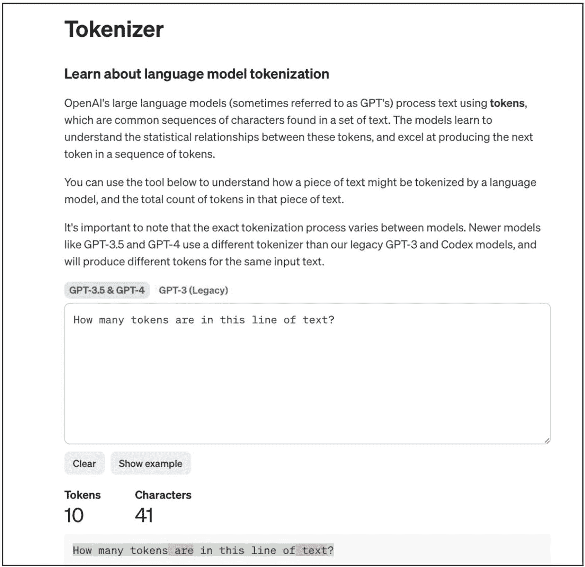

**图 2-1** ChatGPT Token 计数器可以快速统计你提示词中的 Token 数量

## 使用 ChatGPT 作为结对编程伙伴构建天气应用

现在我们已经确认 API 密钥可以正常工作，是时候开始用 ChatGPT 编写我们的第一个项目了。这是激动人心的部分！我们将使用 ChatGPT 帮助我们创建一个 Python 应用程序，它能提供天气信息以及从家到工作地点的通勤时间。听起来很厉害，对吧？

### 设置提示词

让我们问问 ChatGPT 应该如何开始。现在是练习提示词工程的好时机。我们将向 ChatGPT 说明我们的需求，看看它会给出什么方案。这是我们使用的提示词。

```
如何用 Python 制作一个简单的应用程序，让我输入城市名称，然后使用 AccuWeather 的 API 获取天气信息？
清单 2-7
提示 ChatGPT 帮助我们制作一个用于提高生产力的天气应用
```

这是我们从回复中得到的代码。

```
要创建一个简单的 Python 应用程序，让你输入城市名称并通过 AccuWeather 的 API 获取天气信息，可以按照以下步骤操作：
- 在 AccuWeather 开发者门户注册并获取 API 密钥：https://developer.accuweather.com/。
- 如果尚未安装 requests 库，请先安装。可以通过 pip 安装：
pip install requests
- 编写一个 Python 脚本来与 AccuWeather API 交互。以下是一个基本示例：
import requests
def get_weather(accuweather_api_key, city):
base_url = "http://dataservice.accuweather.com/locations/v1/cities/search"
params = {
"apikey": accuweather_api_key,
"q": city,
}
response = requests.get(base_url, params=params)
location_data = response.json()
if location_data:
location_key = location_data[0]["Key"]
weather_url = f"http://dataservice.accuweather.com/currentconditions/v1/{location_key}"
params = {
"apikey": accuweather_api_key,
}
response = requests.get(weather_url, params=params)
weather_data = response.json()
if weather_data:
weather_text = weather_data[0]["WeatherText"]
temperature = weather_data[0]["Temperature"]["Metric"]["Value"]
print(f"当前{city}的天气是{weather_text}，温度为{temperature}°C。")
else:
print("未找到天气数据。")
else:
print("未找到位置。")
if __name__ == "__main__":
accuweather_api_key = "api-key"
city = input("请输入你的城市：")
get_weather(accuweather_api_key, city)
清单 2-8
从 ChatGPT 获取回复以构建我们的天气应用 accuweather_forecaster.py
```

### 使用 AccuWeather API 创建 `accuweather_forecaster.py`

那么，让我们按照从 ChatGPT 获得的步骤操作。首先，我们需要在 AccuWeather 上注册一个账户。访问 [`developer.accuweather.com/`](https://developer.accuweather.com/) 并点击注册。


**图 2-2** AccuWeather 开发者主页

登录后，你会注意到菜单发生了变化，现在可以导航到 **My Apps**。


**图 2-3** 导航到 AccuWeather 开发者门户的 My Apps 选项卡

进入 **My Apps** 选项卡后，你需要 **Add a new App** 以获取一个 API 密钥，用于我们的应用程序。

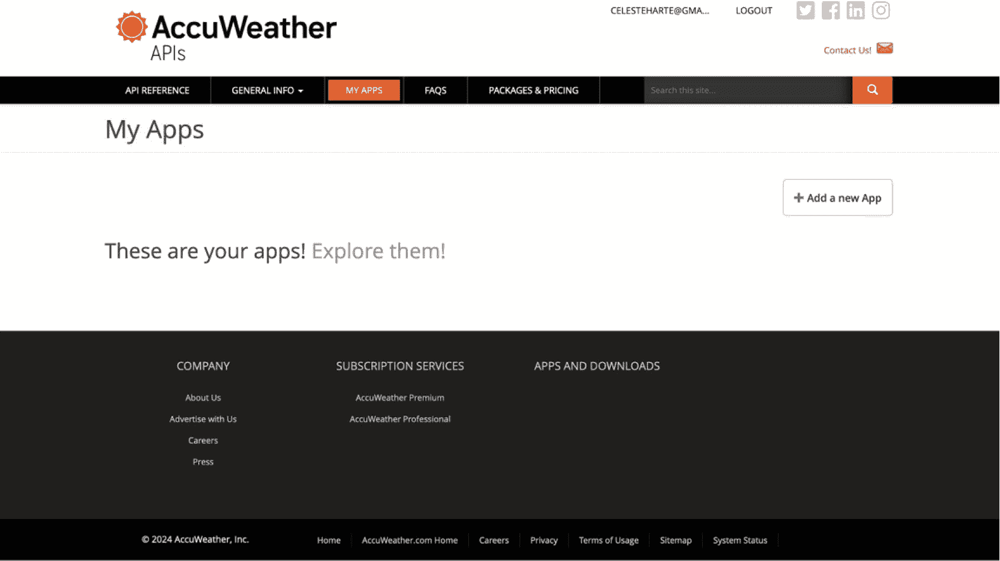

**图 2-4** 在 AccuWeather 上创建新应用

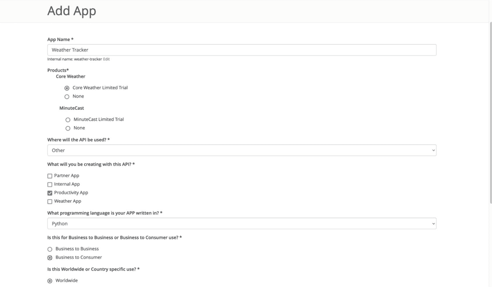

**图 2-5** 为我们的 AccuWeather 应用添加规格说明

在设置过程中，你需要为应用命名，并回答一些简单的问题，例如 API 将在何处使用以及你计划用 API 创建什么。如图 2-5 所示，我们将 AccuWeather 应用命名为“Weather Tracker”；但这并不是我们实际 Python 应用 `accuweather_forecaster.py` 的名称。

名称不必一致。你可以在 AccuWeather 中随意命名你的应用。这里需要启用的最重要配置是，系统会要求你指定打算使用的产品。**请务必启用 Core Weather Limited Trial。**

选择 Core Weather 和 MinuteCast 的区别在于，一个应用能正常工作，而另一个则不能，并且需要花很长时间才能找出原因（你能看出这是一次令人难忘的经历吗？）。

你的应用可能需要一些时间才能获得批准，但通常这个过程非常快。完成后，你会在 **My Apps** 页面上看到你的新应用，其中包含你的 API 密钥！任务完成。

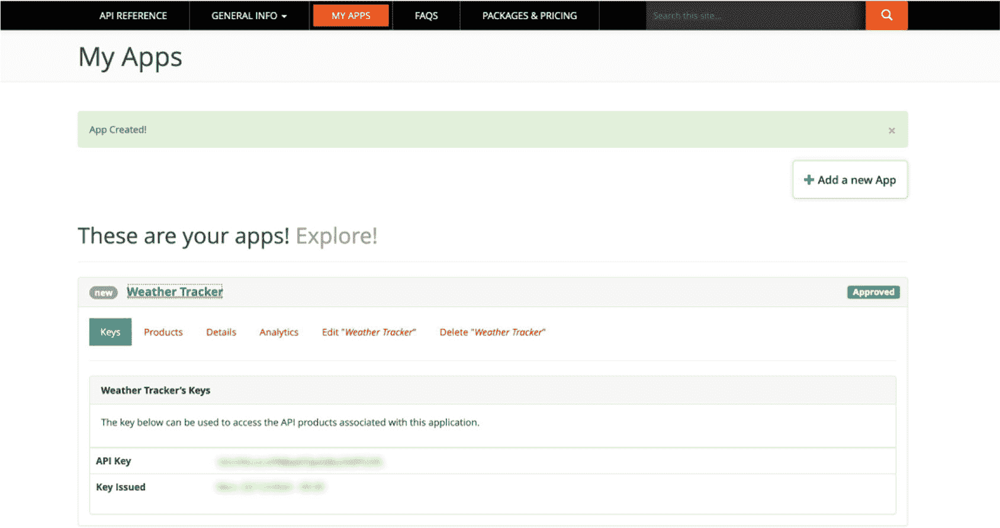

**图 2-6** 在 AccuWeather 开发者门户上查看你新创建的应用


#### 通过提示工程优化我们的提示

回到 ChatGPT 提供的代码示例，我们可以在代码中需要的位置提供 API 密钥。为清晰起见，我们将 API 密钥变量重命名为`accuweather_api_key`。如果需要回顾，以下是我们需要输入 AccuWeather API 密钥的代码行。

```
if __name__ == "__main__":
    accuweather_api_key = "your-accuweather-api-key-here"
    city = input("Enter your city: ")
    get_weather(accuweather_api_key, city)
```

现在，所有内容整合在一起后，运行代码时，您应该会看到一个提示，要求输入城市名称。

```
Enter your city:
```

一旦您提供有效的城市名称，一切将顺利运行，您将得到类似如下的响应（显然，预报会根据您输入的城市以及运行当天的天气情况而变化）。

```
The current weather in New York City is Sunny with a temperature of 5.6°C.
```

通过运行代码，我们得到了纽约市天气的基本描述，但仍有几个方面可以改进。

AccuWeather 为各种天气状况提供了图标。目前，我们可以看到纽约的天气是晴天，但我们也可以获取更长的描述，说明当天剩余时间的天气情况。美国人可能更倾向于以华氏度查看温度（作为美国作者，我们也选择这样做）。因此，让我们请 ChatGPT 帮助我们进行这些修改。

为了让 ChatGPT 保留上下文，我们将在同一个聊天会话中向 ChatGPT 提出以下提示。

```
This code works, however, I'd like to make the following changes:
- get the temperature in Fahrenheit
- make an API call to get an icon number and an icon url to print in the response
- make an API call to get a weather description in the response
```

这是我们从 ChatGPT 得到的回答。

```
Sure, here's the modified version of the code to accommodate your requirements:
```python
import requests

def get_weather(accuweather_api_key, city):
    base_url = "http://dataservice.accuweather.com/locations/v1/cities/search"
    params = {
        "apikey": accuweather_api_key,
        "q": city,
    }
    response = requests.get(base_url, params=params)
    location_data = response.json()
    if location_data:
        location_key = location_data[0]["Key"]
        weather_url = f"http://dataservice.accuweather.com/currentconditions/v1/{location_key}"
        params = {
            "apikey": accuweather_api_key,
        }
        response = requests.get(weather_url, params=params)
        weather_data = response.json()
        if weather_data:
            weather_text = weather_data[0]["WeatherText"]
            temperature_imperial = weather_data[0]["Temperature"]["Imperial"]["Value"]

            # Fetching icon number and icon URL
            icon_number = weather_data[0]["WeatherIcon"]
            icon_url = f"http://developer.accuweather.com/sites/default/files/{icon_number:02d}-s.png"
```


##### 调用 API 获取天气头条

```python
headline_url = f"http://dataservice.accuweather.com/forecasts/v1/daily/1day/{location_key}"
response = requests.get(headline_url, params=params)
headline_data = response.json()
if headline_data and "Headline" in headline_data:
    headline_text = headline_data["Headline"]["Text"]
    print(f"The current weather in {city} is {weather_text} with a temperature of {temperature_imperial}°F.")
    print(f"Weather Headline: {headline_text}")
    print(f"Weather Icon: {icon_url}")
else:
    print("Weather headline not found.")
else:
    print("Weather data not found.")
else:
    print("Location not found.")
if __name__ == "__main__":
    accuweather_api_key = "your-accuweather-api-key-here"
    city = input("Enter your city: ")
    get_weather(accuweather_api_key, city)
```

此修改后的代码版本：
- 将温度从摄氏度转换为华氏度。
- 获取天气图标编号和描述。
- 打印天气图标编号并构建图标 URL。

请务必将 `"your-accuweather-api-key-here"` 替换为你自己的 AccuWeather API 密钥。

**清单 2-13** ChatGPT 对我们 `accuweather_forecaster.py` 应用程序中代码修改的响应

当我们运行这段代码时，得到了我们想要的结果。我们再次输入一个有效的城市名称（本例中为纽约市），得到了如下响应。

```
Weather in New York City:
Temperature: 45.0°F
Weather Text: Sunny
Weather Headline: Expect rainy weather late tomorrow night through late Thursday night
Icon Number: 1
Icon URL: http://developer.accuweather.com/sites/default/files/01-s.png
```

**清单 2-14** 在 `accuweather_forecaster` API 密钥中运行修改后的代码后，AccuWeather API 的响应

现在，我们的代码完全按照我们的意愿运行，但仍有改进空间。如果你使用的 IDE 带有任何类型的 linting 工具，你可能会看到当前运行的代码存在不少 linting 错误。以下是当前代码可能显示的一些 linting 错误。

```
Redefining name 'city' from outer scope (line 45)
Redefining name 'city' from outer scope (line 45)
Missing timeout argument for method 'requests.get' can cause your program to hang indefinitely
Missing timeout argument for method 'requests.get' can cause your program to hang indefinitely
Missing timeout argument for method 'requests.get' can cause your program to hang indefinitely
Missing module docstring
Missing function or method docstring
Line too long (102/100)
Line too long (103/100)
Line too long (121/100)
Constant name "accuweather_api_key" doesn't conform to UPPER_CASE naming style
```

**清单 2-15** IDE 指出的 Linting 错误

> **注意：** 那么，什么是 linting？Linting 是分析代码错误的过程，但主要针对风格不一致的问题。它有助于维护代码质量，强制执行编码标准，并通过使用通用约定使代码更具可读性。

为了清理这些问题，我们再次在同一个聊天对话中向 ChatGPT 提交以下内容。

```
My IDE is making me aware of the following linting errors. Help me modify my code to comply to the styling standards.
###
Redefining name 'city' from outer scope (line 45)
Redefining name 'city' from outer scope (line 45)
Missing timeout argument for method 'requests.get' can cause your program to hang indefinitely
Missing timeout argument for method 'requests.get' can cause your program to hang indefinitely
Missing timeout argument for method 'requests.get' can cause your program to hang indefinitely
Missing module docstring
Missing function or method docstring
Line too long (102/100)
Line too long (103/100)
Line too long (121/100)
Constant name "accuweather_api_key" doesn't conform to UPPER_CASE naming style
```

**清单 2-16** 提示 ChatGPT 帮助我们解决 Linting 错误

这是我们从 ChatGPT 得到的响应。

```
To address the linting errors and improve the code's compliance with styling standards, you can make the following modifications:
- Add module docstring to describe the purpose of the script.
- Add function docstring to describe the purpose of the `get_weather` function.
- Rename the `accuweather_api_key` variable to `ACCUWEATHER_API_KEY` to comply with the UPPER_CASE naming convention for constants.
- Remove redefining `city` from the outer scope by renaming the input parameter of the `get_weather` function.
- Add a timeout argument to the `requests.get` calls to prevent hanging indefinitely.
- Split long lines to comply with the maximum line length.
Here's the modified code:
```

```python
"""
Script to fetch current weather information using AccuWeather API.
"""
import requests

def get_weather(accuweather_api_key, city):
    """
    Get current weather information for a given city using AccuWeather API.

    Args:
        accuweather_api_key (str): AccuWeather API key.
        city (str): Name of the city for which weather information is requested.

    Returns:
        None
    """
    base_url = "http://dataservice.accuweather.com/locations/v1/cities/search"
    params = {
        "apikey": accuweather_api_key,
        "q": city,
    }
    response = requests.get(base_url, params=params, timeout=10)
    location_data = response.json()
    if location_data:
        location_key = location_data[0]["Key"]
        weather_url = f"http://dataservice.accuweather.com/currentconditions/v1/{location_key}"
        params = {
            "apikey": accuweather_api_key,
        }
        response = requests.get(weather_url, params=params, timeout=10)
        weather_data = response.json()
        if weather_data:
            weather_text = weather_data[0]["WeatherText"]
            temperature_imperial = weather_data[0]["Temperature"]["Imperial"]["Value"]

            # Fetching icon number and icon URL
            icon_number = weather_data[0]["WeatherIcon"]
            icon_url = (
                f"http://developer.accuweather.com/sites/default/files/"
                f"{icon_number:02d}-s.png"
            )

            # Making API call to get weather headline
            headline_url = (
                f"http://dataservice.accuweather.com/forecasts/v1/daily/1day/"
                f"{location_key}"
            )
            response = requests.get(headline_url, params=params, timeout=10)
            headline_data = response.json()
            if headline_data and "Headline" in headline_data:
                headline_text = headline_data["Headline"]["Text"]
                print(f"The current weather in {city} is {weather_text} "
                      f"with a temperature of {temperature_imperial}°F.")
                print(f"Weather Headline: {headline_text}")
                print(f"Weather Icon: {icon_url}")
            else:
                print("Weather headline not found.")
        else:
            print("Weather data not found.")
    else:
        print("Location not found.")

if __name__ == "__main__":
    ACCUWEATHER_API_KEY = "your-accuweather-api-key"
    user_city = input("Enter your city: ")
    get_weather(ACCUWEATHER_API_KEY, user_city)
```

**清单 2-17** 从 ChatGPT 获得响应，解决了 `accuweather_forecaster_cleaned_up.py` 中的所有 Linting 错误

这些修改应该能够解决 linting 错误，并提高代码的可读性和对样式标准的符合度。请务必将 `"your-accuweather-api-key-here"` 替换为你实际的 API 密钥。

## 使用 ChatGPT 作为结对编程伙伴，构建一个估算距离和到达时间的应用程序

接下来我们要做的是，开始构建一个能够提供从一个地点到另一个地点（例如，从家到公司）的到达时间和距离的应用程序。我们将使用一个经典方案，深入研究 Google Maps API。


### 使用 Google Maps Platform API 创建项目

大多数人已经拥有 Gmail 账户，但万一你没有，请务必在继续之前创建一个。

Google 为各种应用提供了大量的 API，因此我们需要直接访问 Google Maps 的 API，具体地址是 [`https://developers.google.com/maps/documentation`](https://developers.google.com/maps/documentation)。


图 2-7 Google Maps Platform 主页

在 Google Maps Platform 页面上，点击 **开始使用** 来设置你的账户以使用这些 API。按照 Google 提供的步骤操作后，你将进入图 2-8 所示的页面，在这里你可以看到 Google Maps Platform 提供的不同 API。但首先可能引起你注意的是，你仍然需要 **完成账户设置**。


图 2-8 完成你的 Google Maps Platform 账户设置

完成账户设置需要输入信用卡信息，以便开始免费试用，这将为你提供价值 200 美元的额度，这完全足够我们测试之用。


图 2-9 导航到 Google Maps Platform 上的 API 和服务选项卡

正确设置账户后，你会看到一个欢迎页面。在左侧，你会找到一个菜单图标，点击它可以显示你可以访问的服务列表。你需要导航到 **应用和服务**，然后点击 **库**。

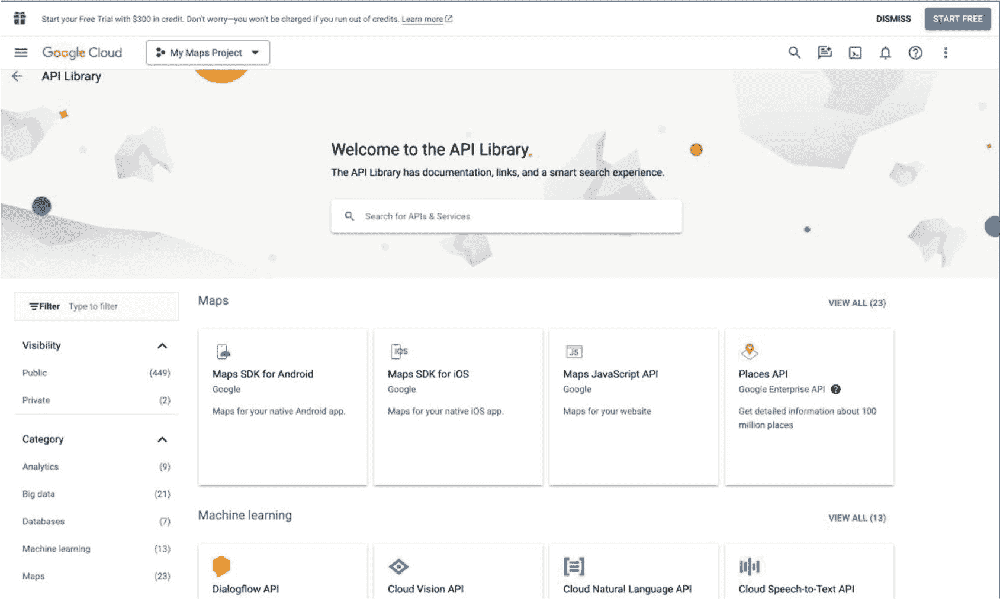

图 2-10 API 库页面

你需要点击 **Maps JavaScript API**，然后 **启用** 它。

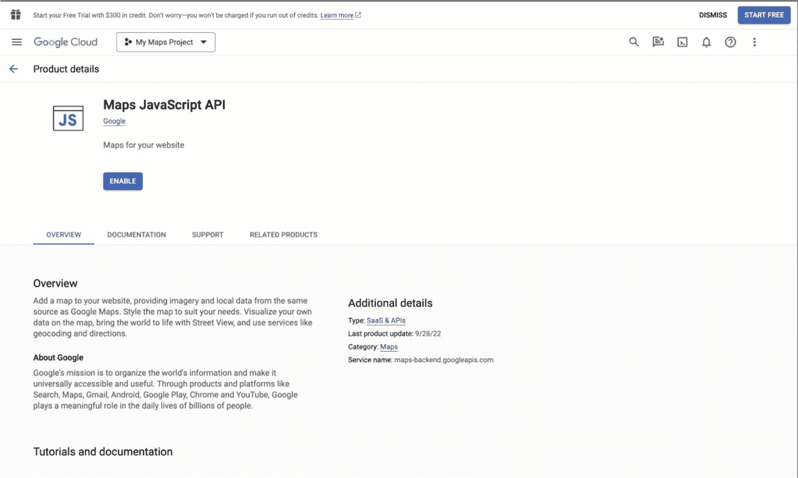

图 2-11 启用 JavaScript API

启用 JavaScript API 后，返回两次并再次打开菜单，然后点击 **Google Maps Platform** 以查看 Google Maps 的仪表盘。

从这里，我们将查看另一个侧边菜单，它看起来与之前的类似，但这次我们要再次点击 **应用和服务** 以查看一个不同的页面。在这里，你可以点击 **路线** 来启用它。


图 2-12 启用 Routes API

一旦启用了我们需要的 API，请导航到 **密钥和凭据** 选项卡，并 **创建一个新的 API 密钥**。

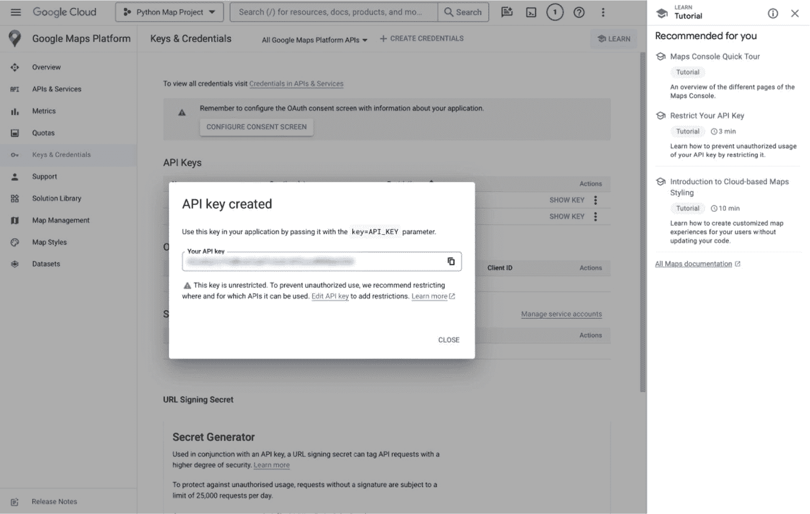

图 2-13 Google Maps Platform 上的密钥和凭据页面

现在我们有了 Google Maps API 密钥，就可以利用我们的结对编程伙伴了。实际上，有两种方法可以使用 ChatGPT 来简化代码运行，从而成功检索我们想要的信息：目的地有多远，以及到达那里需要多长时间（这里有一个有趣的事实——Google Maps Routes API 在预估行程时间中考虑了交通趋势，这使得我们的应用程序非常适合提高生产力！）。

### 使用 ChatGPT 将 cURL 命令转换为可在 Python 中使用的代码：灵活程序员的方法

对一些人来说，使用 cURL 可能有点令人生畏，这就是为什么我们提供了两种使用 ChatGPT 帮助我们编写代码来利用 Google Maps Platform API 的方法；一种方法是将 cURL 代码“翻译”成我们可以在 Python 中使用的东西，另一种方法则完全不需要查看任何令人生畏的 cURL 代码。

在第一种方法中，我们实际上不会去查阅 Google Maps Platform 文档，而是直接切入正题，为你提供所需的 cURL 代码，并向你展示如何使用 ChatGPT 将其转换为 Python 程序员可用的代码。不用谢。

以下是来自 Google Maps Platform 文档的 cURL 代码。

```
curl -X POST -d '{
"origin":{
"location":{
"latLng":{
"latitude": 37.419734,
"longitude": -122.0827784
}
}
},
"destination":{
"location":{
"latLng":{
"latitude": 37.417670,
"longitude": -122.079595
}
}
},
"travelMode": "DRIVE",
"routingPreference": "TRAFFIC_AWARE",
"departureTime": "2023-10-15T15:01:23.045123456Z",
"computeAlternativeRoutes": false,
"routeModifiers": {
"avoidTolls": false,
"avoidHighways": false,
"avoidFerries": false
},
"languageCode": "en-US",
"units": "IMPERIAL"
}' \
-H 'Content-Type: application/json' -H 'X-Goog-Api-Key: YOUR_API_KEY' \
-H 'X-Goog-FieldMask: routes.duration,routes.distanceMeters,routes.polyline.encodedPolyline' \
'https://routes.googleapis.com/directions/v2:computeRoutes'
```

清单 2-18 使用 Google Maps Routes API 的 cURL 代码

请记住，在实践提示工程时，最佳实践是使用三个井号（`###`）将指令与内容分开，以获得最佳结果。为此，以下是我们给 ChatGPT 的提示，以便我们可以使用这段 cURL 代码并产生我们想要的结果，我们使用了三个井号来分隔指令和内容，内容即清单 2-18 中展示的 cURL 代码：

```
我正在用 Python 编码，试图构建一个应用程序，该应用程序向 Google Maps API 发出请求，并获取从一个地点到另一个地点所需的时间。这是可以实现该目标的 cURL 代码。请帮助我将其转换为可以在 Python 中使用的东西。
###
[来自清单 2-18 的 cURL 代码]
```

清单 2-19 提示 ChatGPT 以 cURL 命令为上下文提供 Python 代码

这是我们从 ChatGPT 的回复中得到的代码。

```
import requests
import json
#### 定义负载
payload = {
"origin": {
"location": {
"latLng": {
"latitude": 37.419734,
"longitude": -122.0827784
}
}
},
"destination": {
"location": {
"latLng": {
"latitude": 37.417670,
"longitude": -122.079595
}
}
},
"travelMode": "DRIVE",
"routingPreference": "TRAFFIC_AWARE",
"departureTime": "2025-02-17T17:00:00Z",
"computeAlternativeRoutes": False,
"routeModifiers": {
"avoidTolls": False,
"avoidHighways": False,
"avoidFerries": False
},
"languageCode": "en-US",
"units": "IMPERIAL"
}
#### 定义请求头
headers = {
"Content-Type": "application/json",
"X-Goog-Api-Key": "YOUR_API_KEY",
"X-Goog-FieldMask": "routes.duration,routes.distanceMeters,routes.polyline.encodedPolyline"
}
#### 发起请求
response = requests.post("https://routes.googleapis.com/directions/v2:computeRoutes", json=payload, headers=headers)
#### 打印响应
print(response.json())
```

清单 2-20 从 ChatGPT 获得包含可用 Python 代码的回复

**注意**

为了使此代码运行，你必须在 `DEPARTURE-TIME` 参数中设置一个晚于你运行代码时间的日期和时间。换句话说，出发时间不能设置为过去的时间。在此示例中，日期设置为 2025 年的某个特定时间，但如果你在 2025 年之后运行此代码，则需要调整 `DEPARTURE-TIME` 参数中的代码，以便代码按预期运行。

运行此代码后，你应该会得到如下响应。

```
{'routes': [{'distanceMeters': 773, 'duration': '158s', 'polyline': {'encodedPolyline': 'ipkcFjichVzQ@d@gU{E?'}}]}
```

清单 2-21 运行 ChatGPT 代码后的成功响应


### 使用 ChatGPT 避免阅读大量文档和解析任何 cURL 代码

如前所述，Google Maps 平台有*大量*文档需要阅读。如果你粗略浏览一下我们为了到达 Routes API 而经过的其他 API，特别是，你会看到用于提取各种数据的各种 API：空气质量、花粉、鸟瞰图（就像你使用 Google Maps 时看到的那样），以及你可能认为理所当然的 Google Maps 的许多其他功能，它们都有各自的 API。你知道什么是地理编码吗？好吧，如果你自己通读文档，你可能会费一番功夫才能弄明白。

通读文档很烦人。尤其是当我们只想要某个 API 或服务中的几个功能时。在一个完美的世界里，我们甚至不*需要*知道什么是地理编码，就能让我们的代码在不同于 Google 提供的示例代码的各种场景下工作。

我们可能生活在一个不完美的世界，但我们*不必*知道什么是地理编码，至少现在不用了。我们可以简单地使用 ChatGPT 来跳过我们不想阅读的文档。

以下是我们向 ChatGPT 提出的问题，这样你就不必阅读任何 Google Maps Route API 文档就能获得可用的代码。

```
我需要使用 Google Maps 平台的 Routes API 来获取从一个目的地到另一个目的地所需的时间以及两点之间的距离信息。我如何在 Python 中发出 HTTP 请求来获取我正在寻找的信息？
清单 2-22
提示 ChatGPT 以避免阅读文档
```

这是我们从 ChatGPT 的回复中得到的代码。

```
import requests
def get_route_info(google_maps_api_key, origin, destination):
url = f"https://maps.googleapis.com/maps/api/directions/json?origin={origin}&destination={destination}&key={google_maps_api_key}"
response = requests.get(url)
if response.status_code == 200:
route_data = response.json()
if route_data["status"] == "OK":
route_info = route_data["routes"][0]["legs"][0]
distance = route_info["distance"]["text"]
duration = route_info["duration"]["text"]
print(f"Distance: {distance}, Duration: {duration}")
else:
print("Error:", route_data["status"])
else:
print("Error:", response.status_code)
#### 将 'YOUR_GOOGLE_MAPS_API_KEY' 替换为你的实际 Google Maps API 密钥
google_maps_api_key = 'YOUR_GOOGLE_MAPS_API_KEY'
origin = 'New York, NY'  # 示例起点
destination = 'Los Angeles, CA'  # 示例终点
get_route_info(google_maps_api_key, origin, destination)
清单 2-23
从 ChatGPT 获得回复以避免阅读文档
```

如果你运行这段代码，你应该会得到这个非常清晰、非常简单的响应：

```
Distance: 2,789 mi, Duration: 1 day 17 hours
```

## 结论

让我们澄清一个常见的误解并说明真相：ChatGPT 并不是什么读心术的巫师！作为一种 AI 工具，它并不是要取代开发人员和架构师的专业知识——而是为了补充它，并节省大量时间和麻烦，解决普通程序员日常工作中经常遇到的挫折。当然，它可以帮助将你的自然语言请求翻译成代码，但我们不要忘记人类判断的关键作用。最终，由开发者来决定是使用、调整还是丢弃生成的代码。

# 3. 在 Python 中创建一个基本的 ChatGPT 客户端

本章的目的简单明了。我们将仅用几行 Python 代码构建最强大的 ChatGPT 客户端。这个客户端将比你在 ChatGPT 网站上能做的多得多，并且会为你提供比我们在第 1 章中看到的 Chat Playground 更多的选项。

## 创建我们的 ChatGPT 聊天补全应用程序 `chatgpt_client.py`

清单 3-1 是我们 ChatGPT 客户端 `chatgpt_client.py` 的代码。

```
"""
演示使用 OpenAI 的 GPT-4 进行聊天补全的 API 调用的脚本。
"""
from dotenv import load_dotenv
from openai import OpenAI
### 从 .env 加载环境变量
load_dotenv()
### 实例化 OpenAI 对象
client = OpenAI()
response = client.chat.completions.create(
model="gpt-4o",
messages=[
{
"role": "system",
"content": "你是一名 Python 开发者"
},
{
"role": "user",
"content": "为什么 Python 通常用于数据科学？"
}
],
temperature=0.85,
max_tokens=1921,
top_p=1,
frequency_penalty=0,
presence_penalty=0
)
print(response)
清单 3-1
chatgpt_client.py
```

当你分析清单 3-1 中的代码时，你会看到一些在 Chat Playground 中非常熟悉的东西，比如 `model`、`messages`、`temperature` 和 `tokens`。

注意

在本章中，我们将使用 Python 数据类型，因此你会看到一个 `list`，而在官方 OpenAPI 文档中指定的是 `Array`。

## 使用 `OpenAI.chat.completions.create()` 向 ChatGPT 发送消息

`OpenAI.chat.completions.create()` 方法基本上是你可以在 Chat Playground 中执行的操作的一对一映射；因此，这个方法应该让你感觉非常熟悉。

表 3-1 描述了调用 `OpenAI.chat.completions.create()` 方法所需参数的格式。虽然表格很长，但快速浏览后，你应该会看到只有少数几个字段是成功调用该方法所必需的。

该方法的响应被称为 `ChatCompletion`。

### 检查方法参数

表 3-1

创建 ChatCompletion 对象的结构


| 字段 | 类型 | 是否必填 | 描述 |
| --- | --- | --- | --- |
| `model` | `String` | `Required` | 用于`ChatCompletion`的模型 ID。兼容模型包括：`gpt-4`、`gpt-4-0613`、`gpt-4-32k`、`gpt-4-32k-0613`、`gpt-4o`、`gpt-4o-mini`、`o1`、`o1-mini` |
| `messages` | `List` | `Required` | 共有四种消息类型，每种类型各有其要求：`系统消息`（见表 3-2）、`用户消息`（见表 3-3）、`助手消息`（见表 3-4）、`工具消息`（见表 3-5） |
| `frequency_penalty` | `Number` 或 `null`（默认值：`0`） | `Optional` | 介于-2.0 到 2.0 之间的数字。正值会根据对话历史中已有的词频对词元进行惩罚，从而降低逐字重复相同句子的可能性。 |
| `logit_bias` | `JSON map`（默认值：`null`） | `Optional` | 允许你修改特定词元在补全中出现的可能性。你需要提供一个 JSON 对象，将词元（通过分词器中的词元 ID 指定）映射到-100 到 100 之间的相关偏差值。该偏差会在采样前添加到模型的 logits 中。 |
| `logprobs` | `Boolean` 或 `null` | `Optional`，默认为`false` | 此参数用于决定是否返回输出词元的对数概率。当设置为`true`时，它会提供消息内容中包含的每个输出词元的对数概率。不过，`gpt-4-vision-preview`模型目前不支持此功能。 |
| `max_tokens` | `Integer` 或 `null` | `Optional` | 此参数用于设置生成的`ChatCompletion`可以拥有的最大词元数量。 |
| `n` | `Integer` 或 `null`（默认值：`1`） | `Optional` | 指定模型应为每条输入消息生成多少个`ChatCompletion`选项。 |
| `presence_penalty` | `Number` 或 `null`（默认值：`0`） | `Optional` | 介于-2.0 到 2.0 之间的数字。正值会根据新词元是否出现在对话历史中进行惩罚，从而鼓励模型谈论新话题。 |
| `response_format` | `JSON object` | `Optional` | 你有两个选项：`{ "type": "json_object" }`用于 JSON 对象响应，或`{ "type": "text" }`用于文本响应。注意：务必记住，在 JSON 模式下操作时，你需要通过系统或用户指令明确命令模型生成 JSON。否则，模型可能会无限输出空白字符，直到达到词元上限，导致请求看似卡住。此外，请注意，如果`finish_reason`为`"length"`，则表明生成内容超出了`max_tokens`或对话超出了最大允许上下文长度，这可能导致消息被截断。 |
| `seed` | `Integer` 或 `null` | `Optional` | 通过指定种子，系统将尝试生成可重复的结果。理论上，这意味着如果你使用相同的种子和参数重复请求，应该会得到相同的结果。为了获取用于后续请求的种子值，请从你上一次的响应中复制`system_fingerprint`。 |
| `stop` | `String`/`list`/`null`（默认值：`null`） | `Optional` | 你可以提供最多四个序列，API 将在这些序列处停止生成更多词元。这对于控制响应的长度或内容很有用。 |
| `stream` | `Boolean` 或 `null`（默认值：`false`） | `Optional` | 如果`"stream"`设置为`"true"`，部分消息更新将以服务器发送事件的形式发送。这意味着词元将在可用时作为纯数据事件发送，并且流将以`"data: [DONE]"`消息结束。 |
| `temperature` | `Number` 或 `null`（默认值：`1`） | `Optional` | 有效值范围在 0 到 2 之间。控制模型输出的随机性。最佳实践是调整`top_p`或`temperature`，但不要同时调整两者。 |
| `tool_choice` | `String` 或 `JSON object` | `Optional` | 此参数控制模型调用哪个（如果有）函数。你有两个选项：`"none"`或`"auto"`。如果你不希望模型调用函数，请使用`"none"`。如果你希望模型在生成消息或调用函数之间进行选择，请使用`"auto"`。通过`{"type": "function", "function": {"name": "my_function"}}`指定特定函数会强制模型调用该函数。请注意，当没有函数时，默认值为`"none"`；当存在函数时，默认值为`"auto"`。 |
| `tools` | `List` | `Optional` | 你可以选择指定模型可能调用的工具列表。目前，仅支持函数作为工具。使用此参数提供模型可能为其生成 JSON 输入的函数列表。 |
| `top_logprobs` | `Integer` 或 `null` | `Optional` | 可以是 0 到 5 之间的任意整数。用于确定在每个词元位置返回的最可能词元的数量，并附带其各自的对数概率。要使此参数生效，必须通过将`logprobs`设置为`true`来启用它。 |
| `top_p` | `Number` 或 `null`（默认值：`1`） | `Optional` | 有效值范围在 0 到 1 之间。指示是考虑少数可能性（0）还是所有可能性（1）。最佳实践是调整`top_p`或`temperature`，但不要同时调整两者。 |
| `user` | `String` | `Optional` | 这是一个唯一 ID，你可以选择生成它来表示你的最终用户。这将有助于 OpenAI 监控和检测滥用行为。 |

好了，表 3-1 看起来有点吓人！不过，如前所述，只有`model`和`messages`是必填参数。

此外，我们还在上面的代码清单 3-1 中展示了这些参数在实际应用程序中是如何使用的。

所以，正如你所见，作为一名 Python 开发者，我们有几个可供使用的选项和参数，这些是普通人使用 ChatGPT 网站或聊天游乐场无法做到的。

现在，最需要详细解释的参数是`messages`参数，让我们进一步分析它。

## 共有四种消息类型

当以编程方式调用 ChatGPT API 时，你可以向 API 提供四种类型的消息：

*   系统消息
*   用户消息
*   助手消息
*   工具消息

好消息是，如果你回顾一下第 1 章中我们解释如何使用聊天游乐场的内容，你会发现我们已经接触过前三种消息类型了！我们目前不熟悉的唯一新消息类型是工具消息。

### 系统消息（字典）

表 3-2：系统消息的结构

| 字段 | 类型 | 是否必填 | 描述 |
| --- | --- | --- | --- |
| `role` | `String` | `Required` | 必须设置为字符串`"system"` |
| `content` | `String` | `Required` | 这些是你希望系统在对话中执行的指令。 |
| `name` | `String` | `Optional` | 这是你可以为系统提供的可选名称。 |

代码清单 3-2 是代码清单 3-1 中的一个片段，展示了系统消息的格式。

```
messages=[
{
"role": "system",
"content": "你是一名 Python 开发者"
},
...
```


### 用户消息（字典）

表 3-3  
用户消息的结构

| 字段 | 类型 | 是否必填 | 描述 |
| --- | --- | --- | --- |
| `role` | `String` | `Required` | `必须设置为字符串 "user"` |
| `content` | `String` | `Required` | `此字符串包含您想要发送给 ChatGPT 的实际消息或问题。` |
| `name` | `String` | `Optional` | `这是您在对话中可选的名称。` |

清单 3-3 是清单 3-1 中的一个片段，展示了用户消息的格式。

```
messages=
...
{
"role": "user",
"content": "为什么 Python 通常用于数据科学？"
}
...
清单 3-3
格式化用户消息
```

### 助手消息（字典）

**注意**  
以防您忘记，助手消息用于“提醒”ChatGPT 它在之前回复中告诉您的内容。理想情况下，这可以让您继续数周或数月前与它的对话。

表 3-4  
助手消息的结构

| 字段 | 类型 | 是否必填 | 描述 |
| --- | --- | --- | --- |
| `role` | `String` | `Required` | `必须设置为字符串 "assistant"` |
| `content` | `String` | `Required` | `此字符串包含来自之前对话中 ChatGPT 的回复。` |
| `name` | `String` | `Optional` | `这是您在对话中为 ChatGPT 提供的可选名称。` |
| `tool_calls` | `List` | `Optional` | `如果 ChatGPT 在之前的回复中使用了工具，请在此处包含它指定的工具。` |
| `↳ id` | `String` | `Required` | `这是 ChatGPT 调用的工具的 ID。` |
| `↳ type` | `String` | `Required` | `这是 ChatGPT 调用的工具的类型。只有字面量 "function" 是有效的工具。` |
| `↳ function` | `Object` | `Required` | `这是模型调用的函数。` |

清单 [3-4 是清单 3-1 中的一个片段，展示了助手消息的格式。

```
messages=
...
{
"role": "assistant",
"content": "Python 通常用于数据科学有几个原因..."
}
...
清单 3-4
格式化助手消息
```

### 工具消息（字典）

工具消息是一种高级消息类型，用于非常特定的用例。您不能在 ChatGPT 网站或聊天游乐场中使用它们。通过使用工具消息和表 [3-1 中的 `tool` 参数，您可以让 ChatGPT 为您“调用一个函数”。

乍一看，您可能会想：“哇！ChatGPT 会在云端加载我的代码并为我执行它？太棒了！”不幸的是，事实并非如此。

通过提供函数名称和调用它所需的参数，ChatGPT 会告诉您是否应该调用该函数以及要放入函数的参数。然后，您需要在您的 Python 代码中*自己*调用该函数。

表 3-5  
工具消息的结构

| 字段 | 类型 | 是否必填 | 描述 |
| --- | --- | --- | --- |
| `role` | `String` | `Required` | `必须设置为字符串 "tool"` |
| `content` | `String` | `Required` | `此字符串包含工具消息的内容。` |
| `tool_call_id` | `List` | `Optional` | `这是工具调用的 ID。` |

## 运行 `chatgpt_client.py`

那么，在运行我们在清单 3-1 中创建的代码后，我们可以预期得到一个类似清单 3-5 所示的响应。

```
ChatCompletion(id='chatcmpl-9ACnRg1bk54jYeIFbxJ3yDnomQmij', choices=[Choice(finish_reason='stop', index=0, message=ChatCompletionMessage(content="Python 通常用于数据科学有几个原因：\n\n1\. **简单易读**：Python 的语法清晰直接，使代码易于阅读和编写。这种简单性使数据科学家能够快速理解 Python 语法并开始编码。\n\n2\. **丰富的库生态系统**：Python 拥有大量专为数据科学任务设计的库和工具。例如 NumPy 和 SciPy 适用于科学计算，Pandas 擅长数据处理和分析，Matplotlib 和 Seaborn 用于数据可视化，Scikit-learn 用于机器学习。\n\n3\. **支持多种数据格式**：Python 支持数据科学中常用的多种数据格式。您可以轻松加载和处理 CSV、Excel 电子表格、SQL 数据库等不同格式的数据。\n\n4\. **社区支持**：Python 拥有庞大且活跃的开发者社区，他们不断为改进语言及其工具做出贡献。这也意味着当问题出现时，通常比使用不太流行的语言更容易找到解决方案和示例。\n\n5\. **集成能力**：Python 可以轻松与 C、C++、Java 等其他语言集成，并且几乎可以在所有操作系统上运行。这使得它成为需要处理不同软件和系统的数据科学家的便捷选择。\n\n6\. **支持高级数据分析**：Python 支持各种类型的高级数据分析，包括机器学习、人工智能和深度学习，拥有 TensorFlow、PyTorch 和 Keras 等库。\n\n7\. **适合原型开发**：Python 的简单性和速度使其非常适合原型开发。数据科学家可以使用 Python 构建模型，查看其工作方式，然后在必要时使用 Python 或其他语言构建更永久的版本。", role='assistant', function_call=None, tool_calls=None), logprobs=None)], created=1712219497, model='gpt-4-0613', object='chat.completion', system_fingerprint=None, usage=CompletionUsage(completion_tokens=368, prompt_tokens=25, total_tokens=393))
清单 3-5
ChatGPT 解释为什么 Python 如此强大
```

因此，当我们简要查看清单 3-5 时，我们看到响应（称为 `ChatCompletion`）的主体部分是对我们在本章开头清单 3-1 中向 ChatGPT 提出的问题的回答。然而，我们的响应周围有很多元数据，让我们更详细地分析一下 `ChatCompletion` 对象。


### 处理响应（`ChatCompletion`）

**表 3-6** `ChatCompletion` 对象响应的结构

| 字段 | 类型 | 描述 |
| --- | --- | --- |
| `id` | `String` | `ChatCompletion` 的唯一标识符。 |
| `choices` | `List` | `ChatCompletion` 选项的列表。如果表 3-1 中的 `n` 大于 1，则响应中可能存在多个选项。 |
| `↳ finish_reason` | `String` | 每个响应都会包含一个 `finish_reason`。`finish_reason` 的可能值为：`stop`、`length`、`tool_call`、`content_filter`、`null`。 |
| `↳ index` | `Integer` | 该选项在选项列表中的索引。 |
| `↳ message` | `Object` | 模型生成的 `ChatCompletionMessage`。详细信息见表 3-7。 |
| `↳ logprobs` | `Object` 或 `null` | 该选项的对数概率信息。 |
| `model` | `String` | 用于 `ChatCompletion` 的模型。 |
| `system_fingerprint` | `String` | 如果你希望从之前的对话中获得可重现的结果，可以在后续请求中将此参数用作 `seed`。 |
| `object` | `String` | 此字段始终返回字面量 `"chat.completion"`。 |
| `usage` | `Object` | 补全请求的使用统计信息。 |
| `↳ completion_tokens` | `Integer` | 生成的补全内容中的令牌数。 |
| `↳ prompt_tokens` | `Integer` | 提示中的令牌数。 |
| `↳ total_tokens` | `Integer` | 请求中使用的令牌总数，包括提示和补全内容。 |

`ChatCompletion` 对象中最重要的部分是 `ChatCompletionMessage`，其详细信息见表 3-7。

### `ChatCompletionMessage`

**表 3-7** `ChatCompletionMessage` 的结构

| 字段 | 类型 | 描述 |
| --- | --- | --- |
| `role` | `String` | 此字段始终为字面量 `"assistant"`。 |
| `content` | `String` 或 `null` | 这是一个字符串，包含 ChatGPT 对我们请求的响应。 |
| `tool_calls` | `List` | 如果你在表 3-1 中指示 ChatGPT 调用一个工具（目前是一个函数），那么此列表将存在于 `ChatCompletionMessage` 中。 |
| `↳ id` | `String` | 这是 ChatGPT 调用的工具的 ID。 |
| `↳ type` | `String` | 这是 ChatGPT 调用的工具的类型。只有字面量 `"function"` 是有效的工具。 |
| `↳ function` | `Object` | 这是模型调用的函数及其参数。 |

## 结论

在本章中，我们借鉴了第 1 章和第 2 章的经验，用 Python 创建了一个功能完备的 ChatGPT 客户端。在 ChatGPT 客户端的代码中，我们看到了一些在 Chat Playground 中已经介绍过的术语，例如 `model`、`messages`、`temperature` 和 `tokens`。

我们还看到，作为 Python 开发者，OpenAI 为我们提供了大量额外的选项来调用 ChatGPT，这些选项是普通日常用户甚至使用 Chat Playground 的技术人员都无法使用的。在本章中，我们花时间解释了这些选项，重点是我们能够发送的 `messages`。

既然我们已经有了一个可用的 Python ChatGPT 客户端，接下来让我们看看如何利用它来完成本书其余部分的示例！

# 4. 在企业中使用 AI！为 Slack 消息创建文本摘要器

在当今的企业界，公司使用 Slack（或 Microsoft Teams）来组织自身，并将其作为公司内部所有人的中心沟通场所，这是非常普遍的现象。现在，如果你曾经使用过 Slack，我想你知道一个频道很容易因为公司或世界某个地方发生了某些重要事情而被大量消息淹没。

当然，你在公司承担的责任越多（例如，经理、团队负责人、架构师等），你被期望参与的频道就越多。在我看来，Slack 是一把双刃剑。你需要用它来完成工作，但作为开发者，你肯定不能在每日站会上说：“昨天，呃，我花了一整天读 Slack。没有遇到障碍。”

此外，如果你为一家客户遍布不同时区的公司工作（这在当今很常见），那么早上打开 Slack 看到大量在你离开键盘期间发布的消息，会让人感到相当沮丧。

因此，在本章中，我们将把 AI 应用于企业，使 Slack 更加有用。我们将利用上一章的代码，用 Python 创建一个 Slack 机器人，用于总结 Slack 频道中的重要对话。我们将利用 ChatGPT 的文本摘要能力，并更多地关注**提示工程**。

## 那么，什么是提示工程？

简单来说，提示工程就是精心设计和优化提示及输入参数，以指导和引导 ChatGPT 及其他 AI 模型行为的过程。它基本上是行业内用来描述创建正确输入以获得所需结果的术语。

## ChatGPT 会抢走所有人的饭碗（其实不然）

我个人的浅见是，世界上每家公司都坐拥一座未开发信息的金矿。如果你正在使用任何记录员工之间交流日志的系统、客户支持请求的数据库，或任何大型文本存储库（是的，这包括你的电子邮件、Microsoft Exchange 和企业版 Gmail），那么你就拥有一个等待被利用的大型非结构化文本存储库。

因此，ChatGPT 的最佳用途不是要消除任何人的工作。它应该被用来增强和扩展公司团队成员已经在做的事情。正如我们在上一章中看到的，作为一名程序员，ChatGPT 可以作为一个非常有效的结对编程伙伴。它也非常擅长高效快速地执行某些困难任务。因此，本章的项目涉及处理一个实际示例，展示如何利用大量非结构化文本源使其变得有用。

你可以使用在第 3 章中创建的 ChatGPT 客户端来运行本章后面列出的提示工程示例，也可以使用我们在第 1 章中讨论过的 Playground 模式。无论哪种方式，让我们直接开始吧。


## 审视真实世界的问题：软件公司的客户支持

让我们来看看软件开发中最艰巨的任务之一：提供技术支持。想象一下，整天接听来自可能因使用你的软件而感到沮丧、困惑或只是需要解决方案的人们的电话和信息，这该有多“美妙”。以下是客户支持为何如此棘手的一些原因：

-   众所周知，你的最终用户和客户在解释软件问题时非常不擅长。
-   一级技术人员通常是第一道防线，他们通常处理最基本的问题或用户错误。但当问题变得更复杂时，用户会被升级到二级。
-   中级是一个棘手的位置，因为他们比一级技术支持人员拥有更多的知识和经验；然而，他们没有机会直接从最终用户那里获得答案。
-   真正糟糕的问题会被升级到三级；然而，这些是最昂贵的技术支持人员，因为他们拥有最多的知识和经验。他们对代码以及服务器和基础设施都有实践经验。

那么，让我们以一个在 Slack 中典型的支持渠道内的真实对话为例。以下是虚构公司中团队成员及其角色的列表：

-   法蒂玛（客户服务代表）
-   约翰（软件工程师）
-   戴夫（项目经理）
-   基思（首席技术官）

下面的列表提供了一个软件初创公司团队成员之间的对话示例。客户服务代表法蒂玛让团队知道他们的应用在启动后立即崩溃（这可不是什么好问题）。首席技术官基思立即介入，升级了这个问题。

```
Fatima [16:00 | 02/08/2019]: 大家好，我有一个紧急问题需要讨论。我刚和一个客户通完电话，他们的应用一加载就崩溃。他们非常沮丧。我们能尽快解决这个问题吗？😫
Keith [16:01 | 02/08/2019]: 法蒂玛，感谢你提醒我们这个问题。我们马上处理。@John，既然我们的架构师今天生病请假了，你能带头调查这个问题吗？
John [16:02 | 02/08/2019]: 没问题，基思。我会深入代码库，看看能否找到导致崩溃的潜在原因。
John [16:02 | 02/08/2019]: 法蒂玛，你能从客户那里收集一些额外信息吗？问问他们具体的设备型号、操作系统以及最近是否安装了任何更新。
Fatima [16:03 | 02/08/2019]: 当然可以，约翰。我马上联系客户收集这些细节。有消息了我会通知大家。
Dave [16:04 | 02/08/2019]: 我理解情况的紧迫性。法蒂玛，我们一定要让客户了解我们的进展。在故障排除过程中，我们不想让他们感觉被蒙在鼓里。
Fatima [16:04 | 02/08/2019]: 肯定的，戴夫。我会定期向客户更新情况，告知他们我们发现的任何相关信息。
John [16:20 | 02/08/2019]: 我检查了代码库，到目前为止没有发现明显的问题。应用在加载时崩溃很奇怪。会不会是内存相关的问题？基思，我们最近有收到内存泄漏或高内存使用的报告吗？
Keith [16:22 | 02/08/2019]: 我会调出监控日志，约翰，检查最近的版本中是否有任何内存相关的异常。我查完再回复你。
Fatima [17:01 | 02/08/2019]: 各位，快速更新一下。客户使用的是运行 iOS 15.1 的 iPhone X。他们提到问题是在几天前更新应用后开始的。
Keith [17:05 | 02/08/2019]: 谢谢更新，法蒂玛。这是很有用的信息。约翰，我们重点在装有 iOS 15.1 的 iPhone X 模拟器上测试最新的应用更新，看看能否重现这个问题。
John [17:06 | 02/08/2019]: 好主意，基思。我马上设置模拟器并运行一些测试。
Keith [17:30 | 02/08/2019]: 约翰，在模拟器上重现问题有进展吗？
John [17:32 | 02/08/2019]: 有的，基思。我成功在模拟器上重现了崩溃。这似乎与 iOS 15.1 的兼容性问题有关。我怀疑是由于调用了一个已弃用的方法。我会修复它并运行更多测试来确认。
John [18:03 | 02/08/2019]: 修复了已弃用方法的问题，应用在加载时不再崩溃。看来我们已经找到并解决了问题。我会准备一个补丁发给你，基思，供你审查和部署。
Keith [18:04 | 02/08/2019]: 谢谢，请尽快把补丁发给我。我审查完后，我们会将修复部署到应用商店。
Dave [18:06 | 02/08/2019]: 干得好，团队！约翰，请让客户了解进展，并告知他们我们已准备好在下一次应用更新中为他们提供修复。有人能确保发布说明中反映这一点吗？
John [18:07 | 02/08/2019]: 我会的，戴夫。我会通知客户，确保他们知道即将到来的修复。
Keith [18:27 | 02/08/2019]: 补丁已审查并批准，约翰。请继续更新商店中的应用。我们争取在一小时内完成。
John [18:26 | 02/08/2019]: 明白，基思。我正在上传中。
Fatima [18:38 | 02/08/2019]: 我刚通知了客户关于修复的消息。他们松了一口气，并对我们的迅速响应表示感谢。感谢大家的协作和快速行动。能与如此能干的团队共事真是愉快！
Dave [18:40 | 02/08/2019]: 干得好，团队！非常感谢大家的努力。我们以创纪录的速度解决了这个紧急问题。让我们继续保持良好的工作状态！
列表 4-1
Slack 频道中试图分析客户问题的团队成员
```

## 提示工程入门：文本摘要

所以，不用说，没人愿意整天在 Slack 频道里滚动阅读那些“火烧眉毛”的问题。我们将利用 ChatGPT 的文本摘要能力。为简单起见，让我们尝试几个提示，将整个聊天消息列表发送给 ChatGPT，以便它为我们生成所有已发生事件的可用的摘要。


### 提示 #1：`“tl;dr”`

这个提示简短、精炼且直击要点。如果你不熟悉它，这是一个在网络上经常使用的术语，用来简要总结一篇长文章。它的字面意思是“太长，没读”（too long; didn’t read），这也是我在工作繁忙时，对 `Slack` 上许多对话的感受。方便的是，`ChatGPT` 能够理解这个简单的术语（我不一定称它为单词）作为提示，而且效果相当令人印象深刻。

```
System: You are a helpful assistant
User:  Fatima [16:00 | 02/08/2019]: Hey everyone, I have an urgent ...
User: Tl;dr
Model: gpt-4o
Temperature: 1
Maximum length: 360
Top P: 1
Frequency penalty: 0
Presence penalty: 0
Listing 4-2
PROMPT. 请求对较长对话的摘要版本
```

请注意，令牌数量被控制在较小的 360 个，这最终有助于 `ChatGPT` 生成简短的回复。同时，可以看到温度设置为 1（默认值），但 `Top P` 被增加到了最大值（即 1）。因此，调整温度和其他设置来控制 `ChatGPT` 回复的语气和多样性是很重要的。

下面的列表 4-3 展示了 `ChatGPT` 对列表 4-1 中对话的总结。

```
The team quickly responds to a client's app crashing issue. John investigates the codebase while Fatima gathers information from the client. They discover a compatibility issue with iOS 15.1 and John fixes it. The patch is reviewed and approved, and the app is updated in the store. The client is informed and grateful for the quick resolution. The team is praised for their collaboration and prompt action.
Listing 4-3
RESPONSE. 获取超长对话的摘要版本
```

太棒了！它将那段极长的对话缩减成了一个只有 68 个单词的简单摘要。如你所见，`ChatGPT` 并非要取代某个工作岗位，但它无疑能提高人们的工作效率。现在，让我们再试试几个提示，好吗？

### 提示 #2：`“用三句话或更少的话解释这个”`

那么，如果 `“tl;dr”` 提供的解释对你来说还不够简短，我们可以告诉 `ChatGPT` 让事情变得更简单。`ChatGPT` 在处理参数方面表现良好，所以让我们指定解释内容不能超过三句话。

```
System: You are a helpful assistant
User:  Fatima [16:00 | 02/08/2019]: Hey everyone, I have an urgent ...
User: Explain this in 3 sentences or less.
Model: gpt-4o
Temperature: 1
Maximum length: 250
Top P: 0
Frequency penalty: 0
Presence penalty: 0
Listing 4-4
PROMPT. 请求对较长对话的更短版本
```

你可能已经注意到，在这个例子中温度设置为 0.82。我们确实希望 `ChatGPT` 能给出一个简洁的答案，所以越“干巴巴”越好。

```
A customer reported an urgent issue of app crashes to the team. John investigates the issue and asks Fatima to gather additional information from the client. They discover that the issue is related to a compatibility problem with iOS 15.1\. John fixes the problem and Keith approves the deployment of the fix to the client's production environment.
Listing 4-5
RESPONSE. 获取三句话摘要
```

### 提示 #3：`“我是一名经理。向我解释发生了什么”`

当你不想成为那个唯一听不懂的人时，`ChatGPT` 能够重新表述已经说过的话，并将其分解，直到变得非常简单易懂。

```
System: You are a helpful assistant
User:  Fatima [16:00 | 02/08/2019]: Hey everyone, I have an urgent ...
User: Summarize this conversation and explain it to me like I'm a manager with little technical experience.
Model: gpt-4o
Temperature: 0.82
Maximum length: 750
Top P: 1
Frequency penalty: 0
Presence penalty: 0
Listing 4-6
PROMPT. 请求对更复杂对话的简化版本
```

同样，温度设置低于 1.0，以便 `ChatGPT` 能保持答案简洁易懂。我们增加了令牌长度，以便 `ChatGPT` 能有足够篇幅来解释一些可能涉及的技术概念。

```
In this conversation, Fatima brings up an urgent issue with a client who is experiencing app crashes as soon as they load it. Keith assigns John to investigate the issue since their architect is out sick. John asks Fatima to gather additional information from the client about their device, operating system, and recent updates. Dave emphasizes the importance of keeping the client informed throughout the troubleshooting process.
John checks the codebase but doesn't find any obvious issues, so he suspects it could be a memory-related problem. Keith agrees to check for memory-related anomalies in recent releases. Fatima provides an update that the client is using an iPhone X running iOS 15.1 and mentioned that the issue started after updating the app. Keith suggests testing the latest app update on an iPhone X simulator with iOS 15.1 to replicate the issue.
John successfully reproduces the crash on the emulator and identifies a compatibility issue with iOS 15.1, possibly due to a deprecated method call. He fixes the issue and prepares a patch for review and deployment. Keith approves the patch and asks John to update the app in the store. Dave requests that the client be kept informed and that the release notes reflect the upcoming fix.
John uploads the patch and informs the client about the fix. Keith reviews and approves the patch, and John proceeds with updating the app in the store. Fatima informs the client about the fix, and they express relief and gratitude for the prompt response. Dave commends the team for their collaboration and quick action, emphasizing the importance of maintaining good work.
In summary, the team quickly addressed an urgent issue where a client's app was crashing on load. They investigated the issue, identified a compatibility problem with iOS 15.1, fixed it, and prepared a patch for deployment. The client was kept informed throughout the process, and the fix was successfully implemented, resulting in a relieved and grateful client.
Listing 4-7
RESPONSE. 获取更复杂对话的简化版本
```


### 提示 #4：“给我下一步行动建议”

除了生成更易于理解的摘要外，`ChatGPT` 还能以不同的风格和“语气”进行解释。我们将把 `Top P` 提高到 `0.75`，因为我们希望 `ChatGPT` 能比默认设置考虑更多可能性。我们还将把 `存在惩罚` 提高到 `0.5`，因为我们希望鼓励生成多样化的回复。

```
系统：你是一个乐于助人的助手
用户：Fatima [16:00 | 02/08/2019]：大家好，我有一件紧急的事情……
用户：我是公司的 QA 工程师。请给我下一步行动的建议。
模型：gpt-4o
温度：1
最大长度：1200
Top P：0.75
频率惩罚：0
存在惩罚：0.5
清单 4-8
提示。向 ChatGPT 询问最佳下一步行动建议
```

```
作为一名 QA 工程师，以下是下一步行动的一些建议：
1. 测试补丁：一旦补丁部署到应用商店，在各种设备和操作系统上对其进行彻底测试，以确保问题已解决，并且没有引入新的错误或回归问题。
2. 进行回归测试：除了测试特定问题外，还要执行全面的回归测试，以确保修复不会对应用的其他功能产生任何意外的副作用。
3. 向客户沟通修复情况：随时向客户更新进展，并告知他们修复程序已在最新的应用更新中可用。向他们提供如何更新应用的清晰说明，并鼓励他们也在自己那边进行测试。
4. 监控用户反馈：在修复程序部署后密切关注用户反馈。鼓励用户报告他们遇到的任何问题，并主动及时解决这些问题。
5. 记录问题和解决方案：创建一份详细报告，记录问题、重现和解决该问题所采取的步骤，以及任何其他相关信息。这将作为未来故障排除的参考，并有助于改进开发流程。
6. 进行事后分析：在问题解决且修复程序部署后，安排一次与团队的事后分析会议，讨论根本原因、经验教训以及可以实施的流程改进，以防止将来出现类似问题。
7. 持续改进：将此事件视为一个机会，识别开发和测试流程中需要改进的领域。评估是否可以做出任何更改，以防止将来发生类似问题。
请记住，开放的沟通、协作和持续学习是确保应用最高质量并与客户保持牢固关系的关键。
清单 4-9
响应。ChatGPT 关于可能下一步行动的建议
```

当然，`ChatGPT`（就像地球上所有其他形式的人工智能一样）并非完全完美。例如，第三条建议是一个有效的待办事项，但通常 QA 人员并不负责直接与客户沟通。这种沟通可以通过技术支持或拥有沟通渠道的产品经理来完成（尤其是当客户非常重要时）。所以，这个建议本身没问题，但对于公司中担任该角色的人来说并不合适。

### 让我们谈谈真正的提示工程

如果你在谷歌上搜索“提示工程”这个词，你会找到大量的示例、博客，甚至还有提供订阅计划的完整网站，它们会试图说服你，完美的提示只需通过纯文本就能创建。正如你从上面的示例中看到的，提示工程不能仅仅通过精心设计文本输入来完成。

实际上，这个过程很像烹饪一道精致的菜肴。想象一下，例如，只用盐作为调味料，而忽略所有其他配料和香料来烹饪勃艮第牛肉！老实说，结果与真正的菜肴相比会相形见绌。

类似地，尝试组建一个完整的管弦乐队，却只使用一种乐器和一位音乐家。那是一个尴尬的“一人乐队”。因此，仅仅调整提示文本不足以真正执行提示工程。诸如模型的`温度`（控制随机性）、`Top P`（影响令牌概率）、所使用的特定模型、令牌数量以及其他参数，都在获得出色响应中扮演着至关重要的角色。

本书并非关于提示工程，因为（从上面的解释可以看出）它确实涉及几个与 Python 无关的因素。但是，我们强烈建议你尝试 OpenAI 提供的模型中的*所有*参数，以找到最适合你用例的设置。

## 注册一个 Slack 机器人应用

现在我们已经了解了`ChatGPT`为我们总结大量文本的各种方法，接下来看看在 Python 中创建一个简单的机器人所需的条件，该机器人将能够以编程方式抓取 Slack 实例中某个频道内的所有消息。

**注意**

要完成这些步骤，你需要拥有对 Slack 工作区的管理权限。大多数开发者**不会**拥有这些级别的权限；因此，为了充分进行实验，我建议你创建自己的个人 Slack 工作区用于测试目的。这样，你将拥有安装 Slack 机器人的所有权限。

但是，一步一步来。首先，我们要创建我们的 Slack 机器人应用，所以前往 Slack API 网站：

[`https://api.slack.com/`](https://api.slack.com/)


**图 4-1** 要创建 Slack 机器人，请前往 Slack API 网站

当然，你需要有一个 Slack 账户才能使其工作，所以如果你还没有，需要先创建一个。

登录后，转到页面右上角，导航到“你的应用 > 创建你的第一个应用”，如上图 4-1 所示。在 Slack 术语中，“机器人”就是一个“应用”，并且机器人必须先向 Slack 注册，才能在一个 Slack 实例上运行。


**图 4-2** 为 Slack 创建一个新的机器人应用

如上图 4-2 所示，你将被带到**你的应用**页面，在那里你可以管理你的 Slack 应用。你会立即在屏幕中央看到一个弹出窗口，上面有一个**创建应用**按钮。

选择**从头开始**创建你的应用的选项。这是因为我们希望自己能够操控应用的所有细节，而不被一堆默认设置弄得过于复杂。

之后，系统会提示你为你的机器人指定一个名称，并选择你希望机器人有权访问的工作区，如下图 4-3 所示。

点击**创建应用**按钮继续。


**图 4-3** 为 Slack 创建一个新的机器人应用


### 通过设置作用域来指定机器人能（和不能）做什么

现在，你将看到一个包含大量 Slack 工作区机器人选项的屏幕。不过，你需要做的第一件事是，从左侧边栏点击 **OAuth 与权限**。

我们的机器人将非常简单；它只需要读取某个频道中的消息，以便为我们提供讨论内容的摘要。除了读取消息，我们还需要知道 Slack 工作区中人员的姓名，否则我们将获得人员的 UUID 表示形式，而不是他们的姓名，这对我们来说毫无意义。

因此，向下滚动，为你的 Slack 机器人添加以下 OAuth 作用域，如下图 4-4 所示。


图 4-4

为 Slack 机器人应用添加作用域

- `channels:history`
- `channels:read`
- `users:read`

### 确认你的设置

为你的机器人添加了适当的作用域后，向上滚动并从左侧边栏点击**基本信息**。

在接下来的页面上，你会看到“添加特性和功能”旁边现在有一个绿色的勾选标记，这确认了你已正确添加作用域，如下图 4-5 所示。


图 4-5

确认你的设置

### 查看 OAuth 与权限页面

如下图 4-6 所示，导航到 **OAuth 与权限**页面，然后点击“安装到工作区”按钮。


图 4-6

OAuth 与权限屏幕

### 将你的 Slack 机器人应用安装到工作区

现在所有权限都已请求完毕，是时候将你的机器人安装到工作区了。在安装过程中，你应该会看到如下图 4-7 所示的屏幕。


图 4-7

*“安装”一个新的* *Slack 机器人应用*

点击**允许**按钮以授权机器人并允许你在上一步中分配的权限。

注意

理解这里“安装”的含义很重要。在传统的 Python 意义上，安装应用意味着将你的文件和依赖项复制到另一台机器并执行它。这里的情况并非如此。

在这里，当你“安装”一个机器人应用时，你是在启用你的 Slack 工作区，允许一个应用加入该工作区——仅此而已。你的机器人代码将在你自己的机器上运行，而不是在 Slack 的服务器上。

### 获取你的 Slack 机器人（访问）令牌

这次，“令牌”实际上指的是访问令牌！为了以编程方式连接到 Slack API 并访问消息和用户信息，你需要一个为你的 Slack 机器人生成的特定 OAuth 令牌。


图 4-8

为你的 Slack 机器人应用复制 OAuth 令牌

回到 **OAuth 与权限**页面，请务必从此页面复制机器人令牌（通常以 `xoxb-` 开头），如下图 4-8 所示。

### 将你的机器人邀请到频道

接下来，你将进入想要用来测试机器人的频道，并在该频道中输入以下命令。

```
/invite
```

选择“将应用添加到此频道”选项，然后选择你之前在向 Slack 注册机器人时指定的 Slack 机器人名称。


图 4-9

将你的 Slack 机器人添加到一个频道

恭喜！你现在已成功向 Slack 注册了一个 Slack 机器人应用，使其能够读取你工作区中的消息，并将该 Slack 机器人添加到了一个频道。在我们编写 Python 代码来访问工作区中的频道之前，我们需要知道 Slack 用于我们频道的内部 ID。

## 查找你频道的频道 ID

好的，这是一个简单的步骤。在 Slack 中，右键单击你的频道名称，然后选择“查看频道详细信息”选项。弹出窗口的底部就是你的频道 ID。复制该编号并保存以备后用。你的 Python 应用将需要它来加入 Slack 工作区中的正确频道。

## 使用你的 Slack 机器人应用自动抓取频道中的消息

好了，既然我们已经完成了所有先决条件并且知道了频道的 ID，让我们开始编写 Python 代码来访问特定 Slack 频道中的所有消息。

### 使用 `slack_chat_reader_bot.py` 以编程方式从 Slack 读取消息

首先，你需要安装官方的 Python Slack 库 `slack_sdk`。你可以像这样使用 `pip install`：

```
pip install slack_sdk
```

清单 4-10 是一个简单的 Python Slack 机器人，它获取指定时间段内频道中每条帖子的用户名、时间戳和消息内容。

```
from slack_sdk import WebClient
from slack_sdk.errors import SlackApiError
from datetime import datetime, timezone

#### 定义你的 Slack API 令牌
SLACK_BOT_TOKEN = "YOUR_SLACK_API_TOKEN"

#### 初始化一个 WebClient 实例
client = WebClient(token=SLACK_BOT_TOKEN)

#### 定义你的频道 ID
channel_id = "YOUR_CHANNEL_ID"

#### 以 UTC 时间定义开始和结束时间
start_time_utc = datetime(2024, 8, 3, 10, 0, tzinfo=timezone.utc)
end_time_utc = datetime(2024, 8, 12, 15, 0, tzinfo=timezone.utc)

#### 将开始和结束时间转换为 Unix 时间戳
start_time_unix = int(start_time_utc.timestamp())
end_time_unix = int(end_time_utc.timestamp())

try:
    # 使用 WebClient 调用 conversations.history 方法
    response = client.conversations_history(
        channel=channel_id,
        oldest=start_time_unix,
        latest=end_time_unix,
    )

    # 检查 API 调用是否成功
    if response["ok"]:
        # 反转消息列表以按时间顺序获取
        messages = reversed(response["messages"])
        for message in messages:
            user_id = message.get("user")
            timestamp = datetime.fromtimestamp(float(message.get("ts")), tz=timezone.utc)
            user_info_response = client.users_info(user=user_id)
            if user_info_response["ok"]:
                user_name = user_info_response["user"]["name"]
                print("用户:", user_name)
                print("时间戳:", timestamp)
                print("消息:", message.get("text"))
                print()
            else:
                print("获取用户信息失败:", user_info_response["error"])
    else:
        print("获取消息失败:", response["error"])
except SlackApiError as e:
    print(f"错误: {e.response['error']}")
```

清单 4-10

`slack_chat_reader_bot.py`

让我们一起来浏览这段代码。首先，我们导入与 Slack API 交互和管理日期/时间数据所需的基本模块。然后，我们定义了身份验证所需的 Slack API 令牌（`SLACK_BOT_TOKEN`）以及目标 Slack 频道的 ID（`channel_id`）。

接下来，我们建立消息检索窗口的开始和结束时间，并以协调世界时（UTC）指定它们。我们的脚本将这些时间值转换为 Unix 时间戳，因为 Slack API 期望消息检索使用此格式的时间戳。

如果 API 调用成功，我们的脚本将继续提取和处理消息。消息按时间顺序呈现，以便最早的消息首先出现。为了保持整洁，对于每条消息，脚本会检索用户 ID 和消息时间戳。然后，它使用 `client.users_info` 方法获取有关发送消息的用户的更多信息。

如果在 API 请求过程中出现任何错误（`SlackApiError`），脚本会捕获并处理它们，打印一条错误消息。

清单 4-11 显示了执行 `slack_chat_reader_bot.py` 后的输出，此处已截断，因为你已在本章前面的清单 4-1 中获得了完整文本。


```  
Fatima [2023-08-11T09:04:20] : 大家好，我有个紧急问题需要讨论。我刚和一位客户通完电话，他们的应用一加载就崩溃。客户非常沮丧。我们能尽快解决这个问题吗？:tired_face:  
Keith [2023-08-11T09:04:35] : 感谢你提醒我们，Fatima。我们马上处理这个问题。John，既然我们的架构师今天生病请假了，你能牵头调查这个问题吗？  
John [2023-08-11T09:04:52] : 没问题，Keith。我会深入代码库，看看能否找到导致崩溃的潜在原因。  
John [2023-08-11T09:05:30] : Fatima，你能从客户那里收集一些额外信息吗？问问他们具体的设备型号、操作系统，以及最近是否安装了任何更新。  
...  
清单 4-11  
执行 `slack_chat_reader_bot.py` 的输出  
```  

## 留给读者的练习  

显然，我们还可以做一些额外的工作，这些步骤将留给您（读者）来完成，例如：  

*   将 `slack_chat_reader_bot.py` 中从 Slack 读取消息的代码连接到 `chatgpt_client.py`，以便将抓取消息和获取摘要合并为一步操作。  

*   为 Slack 机器人本身增加更多功能，例如添加命令，使频道中的任何人都可以请求摘要。在当前状态下，机器人不会在频道中发布任何内容。然而，机器人的“用户界面”就是频道本身；因此，用户应该能够通过输入命令（例如请求摘要）与 Slack 机器人进行交互。  

*   确保机器人不会让糟糕的情况变得更糟。每当机器人提供摘要时，它不应在频道内发布，因为这可能会给已经嘈杂的环境增加更多噪音。最佳实践是让机器人向请求摘要的人（或您创建的任何新命令的发起者）发送私密消息。  

## 结论  

在本章中，我们讨论了人工智能在企业中实际应用的多种方式之一。我们探讨了什么是真正的“提示工程”，指出提示工程不能仅通过向 ChatGPT 输入文本就能完成。为了正确且有效地进行提示工程，您必须理解 ChatGPT API 所有输入参数的影响。  

利用我们学到的提示工程知识，我们成功地对提供的任何大段文本进行了摘要。最后，我们看到了运行自动化机器人所需的代码，该机器人可以在指定有效日期范围的情况下，以编程方式从任何 Slack 频道抓取消息。  

在本章（以及前一章）中，我们专门使用了 OpenAI API 的聊天补全模型。在下一章中，我们将通过实验 Whisper 和 DALL·E 模型来突破可能的边界。  

# 5. 多模态 AI：使用 Whisper 和 DALL·E 3 创建播客可视化工具  

现在让我们引入一个新术语：**多模态 AI**。简单来说，生成式 AI 模型可以创建以下四种格式之一的内容：  

*   文本  
*   音频  
*   图像  
*   视频  

每种格式都是一种**模态**。多模态 AI 是使用多个 AI 模型共同生成（或理解）内容的过程，其中输入是一种模态类型，而输出是另一种不同的模态类型。  

以 OpenAI 的 Whisper 模型为例。如果你提供音频，它能够将所有内容转录为文本。DALL·E 也是如此。如果你提供文本提示，它能够生成你所描述内容的图像。  

在本章中，我们将把多模态 AI 提升到一个新的水平！作为一名狂热的播客听众，我经常在收听音频格式的沉浸式故事时，好奇场景、意象、角色、主题或背景是什么样的。  

因此，我们将使用 OpenAI 的多个模型创建一个播客可视化工具。这涉及几个步骤，但最终结果令人惊叹。在收听一个关于某人用豆腐烹饪美味佳肴（别急着否定，先试试看）的播客时，播客可视化工具生成了图 5-1 中的图像。  

  

**图 5-1** 使用 GPT-4、Whisper 和 DALL·E 模型可视化关于豆腐的播客的 AI 生成结果  

为了使播客可视化工具的代码易于理解，我们将分以下三个步骤分别进行：  

*   步骤 1：获取一集播客，使用 Whisper 模型生成转录文本。  
*   步骤 2：获取生成的转录文本，使用 GPT-4 模型描述该集播客中讨论内容的视觉方面。  
*   步骤 3：获取生成的描述，使用 DALL·E 模型生成图像。  

本章提供的代码具有大量实际用途，例如：  

*   如果你只是好奇一集播客的内容可能是什么样子（我们总是如此），你可以获得一个简单的代表性视觉图像，与你正在收听的内容相关联。  
*   对于有听力障碍的人，你可以轻松地将播客或广播节目转换为图像幻灯片。这大大增强了内容的可访问性。  
*   对于播客创作者，你现在有了一种简单的方法，可以为每一集添加视觉/主图。这很有用，因为 Apple Podcasts 和 Spotify 等播客播放器允许播客创作者显示单张图像与单集关联。这有助于提高听众的参与度。


## 介绍 OpenAI 的 Whisper 模型

现在让我们介绍另一个新术语：**自动语音识别**（ASR）。普通消费者对这种技术非常熟悉，因为它已集成到手机（例如 iPhone 的 Siri）和智能音箱（例如各类 Alexa 设备）中。其核心功能是将口语转换为文本。

Whisper 是 OpenAI 的语音识别模型，其准确度惊人地高。下方列表是热门播客《多邻国西班牙语》某一集的转录文本，该播客通过将英语和西班牙语交织成叙事故事，让英语听众能够轻松理解西班牙语。在清单 5-1 中，你可以看到使用 Whisper 模型生成的转录文本。

```
……我是玛蒂娜·卡斯特罗。每期节目，我们都会为您带来引人入胜的真实故事，帮助您提升西班牙语听力，并获得看待世界的新视角。讲述者将使用中级西班牙语，而我会用英语补充背景信息。如果您错过了什么，随时可以回退重听。我们还在 podcast.duolingo.com 提供完整文本。
琳达从小就对她的祖母埃尔琳达着迷。埃尔琳达是一位治疗师或 curandera（巫医），为人们提供心理、情感、身体或精神疾病的疗法。
在危地马拉，这是一种通过同一家族世代口耳相传的实践。Mal de ojo（邪恶之眼）被许多危地马拉人视为一种疾病，他们认为人类有能力将负能量传递给他人。当邻居们怀疑婴儿有能量失衡时，就会把宝宝带到琳达的祖母那里。Su madre lo llevaba a nuestra casa para curarlo……
清单 5-1
Whisper 模型执行语音识别，将音频转换为文本
```

如果你曾经使用过语音识别系统（即使是像 Siri 和 Alexa 这样复杂的技术），你就会知道它存在问题，例如：

* **语音识别在标点符号方面存在问题**
  * 你有没有注意到，没有人说话时会带标点符号？对于英语，我们通过改变语调或音量来提问或表达感叹。我们也用短停顿和长停顿来表示逗号和句号。

* **语音识别在外来词和口音方面存在问题**
  * 根据你询问的对象不同，英语中至少有 17 万个单词。然而，在英语口语中，我们经常使用外来词，例如：
    * Tsunami（源自日语）：通常由地震引起的巨大海浪
    * Hors d'oeuvre（源自法语）：开胃菜
    * Lingerie（源自法语）：女性内衣或睡衣
    * Aficionado（源自西班牙语）：对特定活动或主题非常热衷的人
    * Piñata（源自西班牙语）：一种色彩鲜艳的糖果盒，供孩子们尽情敲打

* **语音识别在名称方面存在问题**
  * 某些人名、企业名和网站名通常难以拼写和理解

* **语音识别在同音词方面存在问题**
  * 你还记得那些发音相同但拼写和含义不同的词吗？本书那位出色的编辑全都知道！
    * Would / Wood
    * Flour / Flower
    * Two / Too / To
    * They’re / There / Their
    * Pair / Pare / Pear
    * Break / Brake
    * Allowed / Aloud

正如你从上面的清单 5-1 中看到的，Whisper 能够理解音频中的所有标点符号，识别所有外来词（其中有几个），理解人名，以及 URL 中的公司名称（"Duolingo"）！当然，如果你注意到了，它还能区分 "wood" 和 "would"。

### Whisper 模型的功能与限制

Whisper 模型能够将以下语言的口语音频转换为文本：

* 南非荷兰语
* 阿拉伯语
* 亚美尼亚语
* 阿塞拜疆语
* 白俄罗斯语
* 波斯尼亚语
* 保加利亚语
* 加泰罗尼亚语
* 中文
* 克罗地亚语
* 捷克语
* 丹麦语
* 荷兰语
* **英语（当然！）**
* 爱沙尼亚语
* 芬兰语
* 法语
* 加利西亚语
* 德语
* 希腊语
* 希伯来语
* 印地语
* 匈牙利语
* 冰岛语
* 印尼语
* 意大利语
* 日语
* 卡纳达语
* 哈萨克语
* 韩语
* 拉脱维亚语
* 立陶宛语
* 马其顿语
* 马来语
* 马拉地语
* 毛利语
* 尼泊尔语
* 挪威语
* 波斯语
* 波兰语
* 葡萄牙语
* 罗马尼亚语
* 俄语
* 塞尔维亚语
* 斯洛伐克语
* 斯洛文尼亚语
* 西班牙语
* 斯瓦希里语
* 瑞典语
* 他加禄语
* 泰米尔语
* 泰语
* 土耳其语
* 乌克兰语
* 乌尔都语
* 越南语
* 威尔士语

所以，归根结底，它能够理解你自己说的音频，以及你的朋友和同事可能说的任何语言。

开发者每分钟最多只能向 API 发送 50 个请求，因此如果你要转录大量音频，需要考虑这一限制。

Whisper 支持 `flac`、`mp3`、`mp4`、`mpeg`、`mpga`、`m4a`、`ogg`、`wav` 或 `webm` 格式的音频。无论你使用哪种格式，发送到 API 的最大文件大小为 25MB。

现在，如果你没有大量处理过音频文件，请注意，某些格式会生成*非常大的*文件（例如 `wav` 格式），而其他格式会生成非常小的文件（例如 `m4a` 格式）。因此，将文件转换为不同格式可以帮助你应对 25MB 的限制。不过，在本章后面，我们将看到一个工具的代码，它可以将单个大音频文件分割成多个较小的文件。

### 使用 `OpenAI.audio.transcriptions.create()` 转录音频

`OpenAI.audio.transcriptions.create()` 方法将音频转换为文本，并且仅与 Whisper 模型兼容。让我们看看表 5-1，了解成功调用该方法需要在参数中包含哪些内容。

**表 5-1** Whisper 的请求体

| 字段 | 类型 | 是否必需 | 描述 |
| --- | --- | --- | --- |
| `file` | `File` | 必需 | 你想要转录的整个音频文件。接受的格式为 `flac`、`mp3`、`mp4`、`mpeg`、`mpga`、`m4a`、`ogg`、`wav`、`webm`。 |
| `model` | `String` | 必需 | 你想要用于转录的模型 ID。兼容的模型包括 `whisper-1`。 |
| `prompt` | `String` | 可选 | 这是可以提供以改变模型转录风格或为其提供来自先前音频片段更多上下文的任何文本。为确保最佳效果，请确保提示与音频使用相同语言。此外，此字段可用于更改 Whisper 不熟悉的任何单词的拼写或大小写。 |
| `response_format` | `String` 默认值：`json` | 可选 | 这是转录输出的格式。接受的格式为 `json`、`text`、`srt`、`verbose_json`、`vtt`。 |
| `temperature` | `Number` 默认值：`0` | 可选 | 这是采样温度，范围从 0 到 1。较高的值会增加输出的随机性，而较低的值则确保输出更具确定性。 |
| `language` | `String` | 可选 | 这是输入音频的语言。它是可选的，但提供该值可以提高转录的准确性和延迟。 |

### 检查方法参数


## 创建音频文件分割工具：`audio_splitter.py`

好了，我们即将能够使用 `OpenAI.audio.transcriptions.create()` 方法以编程方式调用 Whisper 模型。然而，Whisper 模型对每个文件有 25MB 的大小限制。

如果你收听的是（例如）德克萨斯大学奥斯汀分校的 *StarDate* 播客，这倒不是问题。这个播客用大约两分钟的音频就能让你对夜空中该寻找什么有个很好的了解。但对于其他时长可达一小时（甚至更长）的音频节目来说，情况就不同了。在这种情况下，你肯定会超过 25MB 的文件大小限制。

因此，让我们与 ChatGPT 结对编程，运用我们的人类智慧来创建自己的工具，将单个音频文件分割成多个较小的文件。

**注意**

在本节中，我将介绍多种将大音频文件分割成小片段的方法之一。例如，你可以使用流行的音频编辑应用（如开源工具 Audacity 或授权工具 Adobe Audition）手动将大文件切割成较小的文件。

`FFmpeg` 是以编程方式处理音频文件最可靠的方法之一，而 `pydub` 是 OpenAI 关于使用 Whisper 与 Python 的文档中推荐的开源库。

清单 5-2 是发送给 ChatGPT 的提示，用于获取一个基本的音频文件分割应用。

```
System: You are a Python developer
User: Write an application that takes as input a single MP3 file and splits the file into contiguous segments no longer than 10 minutes using the pydub library and ffmpeg
清单 5-2
提示。使用 ChatGPT 创建 audio_splitter.py 应用
```

经过一番来回交流，我们成功创建了（如清单 5-3 所示）`audio_splitter.py` 应用，其中包含我们对 ChatGPT 生成内容的编辑。

```
from pydub import AudioSegment
import os
### 输入音频文件的路径
input_audio_path = "audio-example.mp3"
### 加载音频文件
audio = AudioSegment.from_mp3(input_audio_path)
### 定义片段长度（毫秒） - 10 分钟
segment_length_ms = 10 * 60 * 1000  # 10 分钟换算为毫秒
### 将音频分割成每段十分钟的片段
segments = [audio[i:i+segment_length_ms] for i in range(0, len(audio), segment_length_ms)]
### 保存片段的输出目录
output_directory = "/PATH/TO/OUTPUT"
### 确保输出目录存在，如果不存在则创建
os.makedirs(output_directory, exist_ok=True)
### 处理每个片段（例如，可以将它们保存到单独的文件中）
for i, segment in enumerate(segments):
segment.export(os.path.join(output_directory, f"segment_{i}.mp3"), format="mp3")
清单 5-3
响应。audio_splitter.py
```

我们的目标很简单：使用 Python 语言将一个 MP3 文件分割成不超过十分钟的连续片段。在此过程中，我们遵循以下步骤：

-   指定输入文件路径、输出目录以及所需的片段时长（以毫秒为单位，十分钟）。
-   使用 `pydub` 库的 `AudioSegment` 类加载 MP3 文件，该类提供了音频处理功能。
-   遍历输入的 MP3 文件，使用切片操作将其分割成指定时长（十分钟或更短）的较小部分。
-   将每个片段作为单独的 MP3 文件保存到指定的输出目录中。

要使其正常工作，你需要在项目中正确安装并配置 `pydub` 库**以及** `FFmpeg`。`FFmpeg` 是一个极其通用的媒体转换器，不仅能处理 MP3 音频文件，还能处理各种其他音频文件格式（包括 `m4a`、`ogg` 和 `wav`）。它还能转换视频格式以及静态图像，如 `png`、`jpeg` 和 `gif`。

运行脚本后，你将得到一个装满时长不超过十分钟的分段音频文件的文件夹。使用 `audio_splitter.py` 工具，你拥有一个易于使用的 Python 脚本，可以修改设置以最适合你的需求。就我们的目的而言，目标是让音频文件小于 25MB，因此如果你要转录（例如）WAV 格式的八小时法律诉讼记录，你可能需要将时长调整得更短，比如六分钟。

使用音频分割器时，最佳实践是将输出文件夹与输入文件夹分开，当我们开始使用 Whisper 模型调用 OpenAI 的 `audio.transcriptions.create()` 方法时，你就会明白原因。

## 创建音频转录器：`whisper_transcriber.py`

现在，让我们构建下一个 Python 应用 `whisper_transcriber.py`。同样，我们将与 ChatGPT 结对编程，以获得一个可用的基础。清单 5-4 是放入聊天游乐场以启动的提示。

```
System: You are a Python developer.
User: Using Python, write a script that iterates over all of the mp3 files in a single folder on my local computer and send all the files in the folder to be transcribed by OpenAI's Whisper model, using the OpenAI's python library.
Model: gpt-4o
Temperature: 1
Maximum Length: 1150
清单 5-4
提示。要求 ChatGPT 使用 OpenAI 的 Python 库并将 MP3 文件发送到 Whisper 的 API
```

经过一些来回交流，清单 5-5 显示了 ChatGPT 给我们的有效响应。

```
import os
import openai
from dotenv import load_dotenv
def transcribe_mp3_files(openai_api_key, mp3_folder_path):
### 设置 OpenAI API 密钥
openai.api_key = openai_api_key
### 用于转录的模型
model = "whisper-1"
### 转录响应的期望格式
response_format = "text"
### 遍历文件夹中的每个 MP3 文件
for filename in sorted(os.listdir(mp3_folder_path)):
if filename.endswith(".mp3"):
file_path = os.path.join(mp3_folder_path, filename)
try:
### 读取 MP3 文件的内容
with open(file_path, "rb") as f:
file_content = f.read()
### 转录 MP3 文件
response = openai.audio.transcriptions.create(
file=(filename, file_content),
model=model,
response_format=response_format
)
### 打印整个响应对象
print(response)
except Exception as e:
print(f"文件 {filename} 转录错误: {e}")
def main():
### 从 .env 文件加载环境变量
load_dotenv()
### OpenAI 的 API 密钥
openai_api_key = os.getenv("OPENAI_API_KEY")
### 包含要转录的 MP3 文件的文件夹
mp3_folder_path = "/PATH/TO/OUTPUT"  # 替换为你的 MP3 文件夹路径
### 转录 MP3 文件
transcribe_mp3_files(openai_api_key, mp3_folder_path)
if __name__ == "__main__":
main()
清单 5-5
响应。whisper_transcriber.py
```

从上面的代码清单可以看出，将输入文件与输出文件放在不同文件夹的一个主要好处是，你可以将输出文件夹的路径提供给上面的脚本，而无需担心其他任何事情。该脚本会抓取输出文件夹中的所有文件，无论该文件夹中有多少个文件，因此可以是 1 个或 100 个文件——都没关系。


## 用播客找点乐子，动手试试看

好了，让我们用目前展示的代码来运行一个测试。《*美国生活*》是一档由艾拉·格拉斯主持、与芝加哥 WBEZ 电台联合制作的每周公共广播节目（也是一个播客）。该播客的图标如图 5-2 所示。


**图 5-2** 如果你在寻找一个故事引人入胜的好播客，我推荐收听《美国生活》（图片来源：芝加哥 WBEZ 电台）

每一集节目都围绕一个特定的主题或话题，将一系列故事编织在一起。有些故事是调查性新闻报道，另一些则只是对拥有动人故事的普通人的采访。第 811 集的标题是“我唯一不能去的地方”，文件大小为 56MB，格式为 MP3。既然我们已经知道 56MB 对于发送给 Whisper 进行转录来说太大了，我们需要使用`audio_splitter.py`来为我们拆分文件。

代码清单 5-6 展示了该集完整转录文本的摘录。

```
“……我的表妹卡米尔其实并不喜欢狗，但有一只狗她非常喜爱。它叫福克西，因为它看起来完全像一只狐狸，只不过它是黑色的。它是邻居家的狗，但卡米尔和它似乎有一种真正的亲密关系，也许是因为她们俩离地面都不太远。那时卡米尔大概四五岁，说话有点口齿不清，所以福克西被她叫成了‘福兹’。我觉得这是我听过最可爱的事情之一。
卡米尔对福克西的记忆，几乎像一部电影。她的回忆感觉像是无尽的夏天，朦胧而完美，就像用有颗粒感的胶片拍摄的场景。我只记得那种兴奋地跑去看福克西的感觉。我脑海里有一个画面，就是来到房子前，我能看到福克西在外面。我能透过通往花园的门看到福克西。有一个关于卡米尔和福克西的故事，我经常想起。我和姐姐谈论这个故事好多年了，但从未和卡米尔聊过。故事是这样的：有一次她们在玩的时候……”
```

**代码清单 5-6** 《美国生活》第 811 集的部分转录文本

为简洁起见，我们只展示了转录文本的摘录。完整的转录文本超过 8000 个单词，因为该集节目时长接近一小时。

### 元操作：提示工程——让 GPT-4 为 DALL·E 编写提示词

由于我们想要可视化的播客集完整文本转录有数千个单词，我们将使用 GPT-4 来自动创建 DALL·E 模型所需的提示词。DALL·E 能够根据提示词中的文本描述生成图像，但最好让提示词尽可能简短。代码清单 5-7 是让 GPT-4 为 DALL·E 生成提示词的提示词。

```
系统：你是一个帮助可视化播客的服务。
用户：阅读以下播客转录文本。为一位视障人士描述最能代表该集整体主题的背景和主体。请以下列短语之一开头：
- "一张照片，内容是"
- "一幅画，内容是"
- "一张 35mm 微距照片，内容是"
- "数字艺术作品，内容是"
用户：对《美国生活》的支持来自 Squarespace……
模型：gpt-4o
温度：1.47
最大长度：150
Top P：0
频率惩罚：0.33
存在惩罚：0
```

**代码清单 5-7** 让 GPT-4 为 DALL·E 创建提示词的提示词

DALL·E 需要知道要生成哪种类型的图像，因此我们需要指定图像应该是照片、绘画、数字艺术等。我们需要确保 GPT-4 生成的文本简短，所以我们将最大长度设为 150 个令牌。此外，为了防止 GPT-4 多次重复某些短语，我们引入了 0.33 的频率惩罚。

代码清单 5-8 展示了 GPT-4 在阅读《美国生活》第 811 集转录文本后生成的结果。

```
数字艺术作品，内容是一个小女孩坐在花园里，旁边有一只看起来像狐狸的黑狗。女孩在微笑，狗在摇尾巴。图像具有朦胧、梦幻般的质感，并带有胶片颗粒效果，以唤起怀旧之情。
```

**代码清单 5-8** GPT-4 为 DALL·E 创建的提示词

### 使用 `OpenAI.images.generate()` 创建图像

为了使用 DALL·E 模型根据文本提示词动态创建图像，你需要调用 `OpenAI.images.generate()` 方法。

### 检查方法参数

表 5-2 描述了 `OpenAI.images.generate()` 方法请求体所需参数的格式。显而易见，`prompt` 参数是成功调用模型的唯一必需参数。

**表 5-2** `OpenAI.images.generate()` 方法的请求体

| 字段 | 类型 | 是否必需 | 描述 |
| --- | --- | --- | --- |
| `prompt` | 字符串 | 必需 | 在此描述你想要创建的图像。对于 `dall-e-2`，最大长度为 1000 个字符；对于 `dall-e-3`，最大长度为 4000 个字符。 |
| `model` | 字符串 | 可选 | 用于生成图像的模型名称。兼容的模型包括：`"dall-e-2"`、`"dall-e-3"`。 |
| `n` | 整数或 null 默认值：1 | 可选 | 这是你请求创建的图像数量。必须在 1 到 10 之间。注意：由于 `dall-e-3` 所需的复杂性，OpenAI 可能会将你的请求限制为单张图像。 |
| `quality` | 字符串 默认值：`"standard"` | 可选 | 允许你指定生成图像的质量。此参数仅对 `dall-e-3` 有效。可接受的值有：`"standard"`、`"hd"`。 |
| `size` | 字符串或 null 默认值：`"1024x1024"` | 可选 | 生成图像的尺寸。`dall-e-2` 可用的图像尺寸有：`"256x256"`、`"512x512"`、`"1024x1024"`。`dall-e-3` 可用的图像尺寸有：`"1024x1024"`、`"1792x1024"`（横向）、`"1024x1792"`（纵向）。 |
| `style` | 字符串 默认值：`"vivid"` | 可选 | 允许你指定生成图像的自然程度。此参数仅对 `dall-e-3` 有效。可接受的值有：`"natural"`（适合照片）、`"vivid"`（适合艺术风格）。 |
| `response_format` | 字符串或 null 默认值：`"url"` | 可选 | 生成图像的格式。可接受的值有：`"url"`、`"b64_json"`。 |
| `user` | 字符串 | 可选 | 这是一个代表最终用户的唯一标识符，可以帮助 OpenAI 监控和检测滥用行为。 |

### 处理响应

成功调用 `OpenAI.images.generate()` 方法后，API 将返回一个图像 JSON 对象。表 5-3 展示了该图像对象的分解结构，它只有一个参数。

**表 5-3** 响应对象的结构

| 字段 | 类型 | 描述 |
| --- | --- | --- |
| `url`（或）`b64_json` | 字符串 | 如果请求中的 `response_format` 是 `"url"`，则这是生成图像的 URL。（或）如果请求中的 `response_format` 是 `"b64_json"`，则这是 base64 编码的 JSON 图像。 |


### 创建图像生成器：`dalle_client.py`

清单 5-9 是一个简短而精妙的脚本，它使我们能够以编程方式调用 DALL·E，从而创建我们想要的任何图像。

```
import openai
import os
from dotenv import load_dotenv
#### 从 .env 文件加载 API 密钥
load_dotenv()
api_key = os.getenv("OPENAI_API_KEY")
openai.api_key = api_key
#### 定义提示词和尺寸
prompt = "一张 35mm 微距照片，三只可爱的罗威纳幼犬，没有项圈，躺在田野里"
size = "1024x1024"
#### 使用 DALL·E 生成图像
response = openai.images.generate(
prompt=prompt,
size=size,
model="dall-e-3"
)
print("图像 URL:", response.data[0].url)
清单 5-9
在 dalle_client.py 中使用 Python 调用 DALL·E
```

下面的图 5-3 和图 5-4 展示了根据清单 5-8 中来自播客节目《美国生活》第 811 期的文本提示词生成的图像。


图 5-4

来自《美国生活》播客第 811 期的 DALL·E 生成图像：一个小女孩和她的狗


图 5-3

来自《美国生活》播客第 811 期的 DALL·E 生成图像：一个小女孩和她的狗

### DALL·E 提示词工程与最佳实践

现在，使用 DALL·E 创建图像需要运用提示词工程，才能获得一致且理想的结果。最好多尝试不同的提示词来练习，看看哪些对你和你的用例有效。也许你更喜欢绘画而不是 3D 效果的图像？也许你需要照片而不是数字艺术？也许你希望图像是特写镜头而不是肖像？有很多可能性需要考虑。

无论你的用例是什么，这里有两条黄金法则，可以帮助你充分利用 DALL·E 提示词。

#### DALL·E 黄金法则 #1：熟悉 DALL·E 能生成的图像类型

首先，DALL·E 需要理解的最重要的事情之一是需要生成的图像类型。以下是 DALL·E 能够创建的几种最常见的图像类型列表：

*   3D 渲染
*   绘画
*   抽象画
*   表现主义油画
*   油画（以任何已故艺术家的风格）
*   油画棒
*   数字艺术
*   照片
*   照片级真实感
*   超写实
*   霓虹照片
*   35mm 微距照片
*   高质量照片
*   剪影
*   蒸汽波
*   卡通
*   毛绒物体
*   大理石雕塑
*   手绘草图
*   海报
*   铅笔与水彩
*   合成波
*   漫画风格
*   手绘

#### DALL·E 黄金法则 #2：详细描述你希望出现在前景和背景中的内容

我们怎么强调都不为过：你需要向 DALL·E 进行详细描述，才能获得一致且理想的结果。这听起来可能有点奇怪，但向 DALL·E 描述图像的最佳方式，就像你向另一个人描述一个梦境一样。

所以，作为我们之间的一个思维练习，试着描述你最近做的一个梦。当你描述梦中的人物、地点和事物时，你的脑海中会浮现出你记得的最重要的东西，以及你所感受到的体验。当你向另一个人描述时，微小的细节开始浮现，例如：

*   有多少人在场（如果有的话）？
*   人或动物处于什么姿势？站着、坐着还是躺着？
*   场景和背景中有什么东西？
*   哪些物品让你印象深刻？声音？气味？颜色？
*   你感觉如何？快乐、诡异、兴奋？
*   感觉是什么时间？早晨、中午、夜晚？

如果你能向另一个人描述一个梦，那么向 DALL·E 描述你想要的东西应该毫无问题。

### 让我们尝试向 DALL·E 输入提示词

为了让您了解可以用 DALL·E 做些什么，我们创建了几个不同风格的图像提示词，供您参考并激发灵感。图 5-5 到 5-10 展示了几个不同的示例。


图 5-10

油画：暴风雨中的船只，背景有动态光线和闪电


图 5-9

3D 艺术：一只在打字机前工作的熊猫宝宝


图 5-8

数字绘画：一位女性电子游戏角色，手持长矛和盾牌，身处丛林


图 5-7

蒸汽波：神庙中的希腊雕像


图 5-6

矢量艺术：一位戴着太阳镜、留着花朵胡须的男人


图 5-5

照片级真实感：坐在办公桌前的企鹅

## 结论

在本章中，我们收获颇丰！通过几个脚本，我们创建了一个播客可视化工具。

*   我们创建并使用了 `audio_splitter.py`，它作为我们的一个实用工具。如果你有一个音频文件，其大小超过了 Whisper 模型的限制，这个脚本会为你提供一个包含较小音频文件的文件夹，以便发送给 Whisper。
*   我们创建并使用了 `whisper_transcriber.py` 来获取一个音频文件夹的转录文本。该文件夹可以包含单个音频文件或多个文件。你唯一的限制是你可以发送给 Whisper 模型的请求数量。
*   我们对 GPT-4 进行了一些提示词工程，以便根据转录文本获取播客中图像的描述性提示词。
*   最后，我们创建并使用了 `dalle_client.py`，它接收调用 GPT-4 模型生成的提示词，并获取一张能够直观代表该播客剧集的图像。

## 留给读者的练习

显然，我们在这里还可以做一些额外的事情，这些步骤将留给你（读者）来完成，例如：

*   `audio_splitter.py` 应用是 FFmpeg 的一个 Python 接口。FFmpeg 不仅可以分割音频文件，还可以对媒体文件做更多事情，例如格式转换和重新编码。尝试找出 Whisper 支持的哪种媒体格式产生的音频文件最小。提示：肯定不是 `wav` 格式。
*   如果你计划创建一个根据最终用户的文本提示词自动生成图像的应用或服务，那么你肯定需要更新 `dalle_client.py` 脚本，以确保在你的请求中跟踪并提供 `user` 参数。这是因为你的最终用户有可能通过你的 API 密钥生成有害图像。请记住，你拥有 OpenAI 的 API 账户，而他们没有！因此，你需要留意是否需要终止与那些通过你的服务违反 OpenAI 内容规则的用户之间的业务关系。


# 6. 使用 Discord 和 Python 创建自动化社区管理机器人

当你发布一款应用或服务时，建立并维护自己的社区至关重要。以下是健康用户社区的典型特征：

-   成员参与有意义的讨论，分享见解、反馈和支持。
-   存在分歧或辩论，但能以建设性的方式处理，不进行人身攻击或使用侮辱性语言。
-   充满尊重的氛围，成员相互倾听并认可不同意见。
-   新老成员都积极参与，确保社区保持活力，不会停滞不前。
-   用户贡献多样化的内容，从回答问题到分享资源，丰富了社区的知识库。
-   索取与给予之间保持平衡；寻求帮助或信息的成员也会向他人提供帮助。
-   新成员频繁加入，通常由现有成员推荐，这表明社区被积极看待且值得推荐。
-   用户经常成为社区或平台的倡导者，在社区空间之外（例如社交媒体或其他论坛）进行推广。
-   社区通过为功能和特性提供新想法，帮助塑造应用或服务。

无论我创建何种类型的应用或服务，我都希望我的用户社区能够体现上述所有特征！

## 选择 Discord 作为你的社区平台

在过去几年中，Discord 作为社区管理工具，在那些对社区充满热情的人群中迅速流行起来。这在一定程度上归功于其跨平台兼容性，允许成员无论是在桌面端、移动设备还是网页浏览器上都能保持联系。然而，其最突出的特点之一是基于邀请的社区系统，这有助于社区管理者控制增长并防止垃圾信息。这种模式不仅确保了为成员提供量身定制的体验，还增强了安全性，因为社区管理者有权决定是否授予访问权限。

Discord 不仅支持文本消息，还支持语音聊天和视频流。与 Slack 非常相似，Discord 允许社区管理者将内容分隔到不同的频道中，以组织讨论、简化信息流，并帮助用户看到他们感兴趣的内容。

## 创建比我们的 Slack 机器人更高级的机器人

现在，如果你已经成功完成了第 4 章中关于 Slack 机器人的步骤，那么本章的步骤会让你感到熟悉。在第 4 章中，我们创建了一个 Slack 机器人，用于在特定时间段内读取单个频道并获取所讨论内容的摘要。那个 Slack 机器人并非社区管理者，而更像一个有用的助手。

在本书的剩余部分，我们将执行所有必要的步骤，为 Discord 创建强大的机器人，这些机器人将利用人工智能来实际帮助管理社区。

## 创建比任何典型 Discord 机器人更高级的机器人

如果你曾经有过使用 Discord 机器人的经验，那么你可能知道，与它们交互最常见的方式是使用所谓的“`/命令`”。这使得典型的机器人（即非智能机器人）基本上只有在接收到非常具体的操作或命令时才能工作。如果没有提供“`/命令`”，机器人就会保持沉默，什么也不做。本质上，它体现了“只有别人跟你说话时你才能说话”这句话。

然而，我们正在创建一个将具备人工智能的 Discord 机器人，因此，它将比任何典型的 Discord 机器人先进得多。我们将创建能够读取并查看 Discord 服务器中所有消息，并且足够智能以做出正确响应的机器人。

### 理解机器人的角色

那么，让我们探讨一个场景，以使事情变得真实。我们正在创建一个公共 Discord 服务器，以便与移动银行应用的用户进行交互。我们的最终目标是拥有用 Python 编写的机器人来处理以下场景：

-   问答：监控特定频道，并自动回答用户关于如何使用银行应用的问题。为此，机器人需要接受关于应用如何工作的训练。
-   禁止招揽：对于任何商业社区来说，确保社区参与者不被不道德的个人盯上非常重要。例如，如果你正在创建一个银行应用，你希望你的客户被用户名为“`B4nk Admin`”的人联系吗？
-   禁止有害内容：对于任何社区来说，保护成员免受仇恨言论等有害内容的侵害非常重要。

## 我们的示例银行：克鲁克银行

出于本示例的目的，我决定使用一个虚构银行的虚构名称，该名称与实际银行名称重合的可能性极低。因此，在本示例中，“克鲁克银行”正在为其银行客户推出一款新的移动应用。他们希望有一个由机器人监控的频道来回答应用用户的问题，并且他们还希望确保没有人向其应用用户进行招揽，或在他们的 Discord 服务器中发布伤害性或有害的内容。图 6-1 展示了克鲁克银行的一个有趣插图。


图 6-1：这家来自虚构银行的虚构应用存在真实问题

## 首要任务：创建你自己的 Discord 服务器

在我们能够创建 AI Discord 机器人之前，显然我们需要一个已经就位的 Discord 服务器供机器人与之交互。使用 Discord 应用或访问 Discord 网站（当然要先登录），然后开始添加/创建新服务器的过程。

开始该过程后，选择标记为“创建我自己的”选项，如图 6-2 所示。


图 6-2：创建你自己的 Discord 服务器

接下来，系统会提示你指定有关服务器的其他信息。继续完成创建过程，直到系统提示你为服务器提供名称和图标，如图 6-3 所示。

指定你的服务器名称，并提供可选的服务器图标（如果你有的话）。


图 6-3：为你自己的 Discord 服务器提供名称

## 创建问答频道

默认情况下，每个 Discord 服务器都有一个“通用”频道，但我们想要一个专门用于问答的频道。根据你创建服务器的方式，系统会呈现图 6-4 来创建你的新频道。

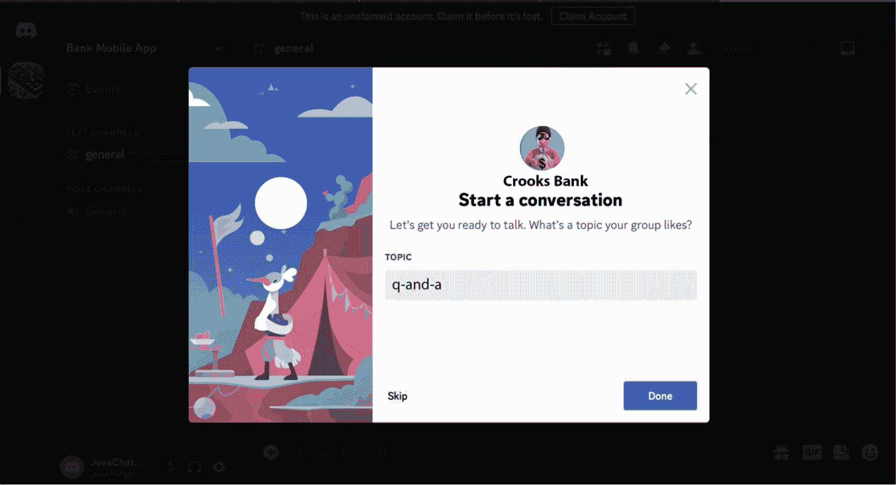

图 6-4：使用 Web 界面创建频道


## 在 Discord 上注册一个新的机器人应用

现在我们已经创建好了包含相应频道的 Discord 服务器，是时候注册机器人本身了——或者更确切地说，在我们的案例中，是注册多个机器人。为了保持代码的整洁和可维护性，我们实际上会为 Discord 服务器配置多个机器人。第一个机器人将专门用于回答“问答”频道中的问题。第二个机器人将监控所有频道，查找有害内容或广告等不良信息。

要创建我们的机器人，请前往 Discord 开发者网站，如图 6-5 所示：

[**https://discord.com/developers**](https://discord.com/developers)

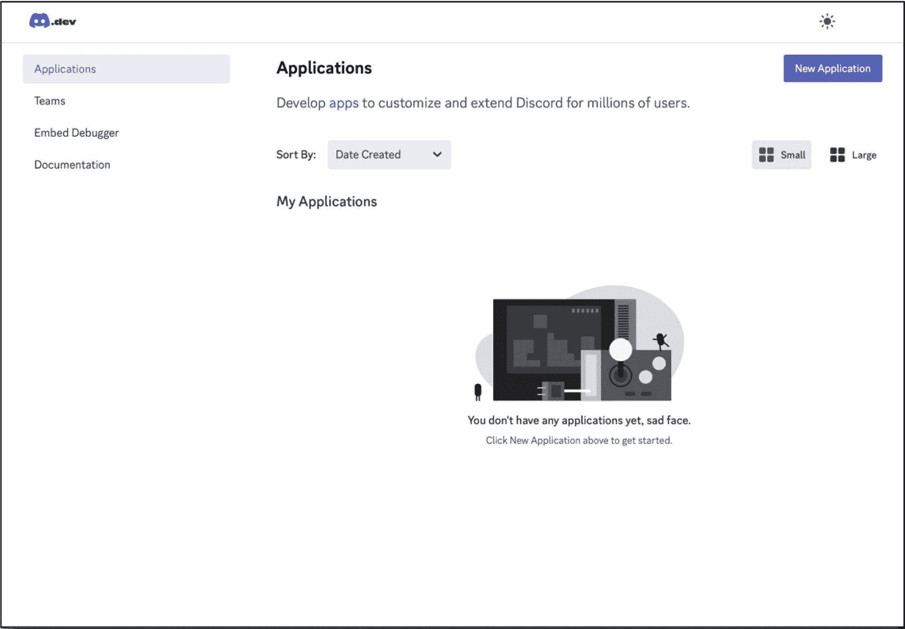

图 6-5

要创建 Discord 机器人，请前往 Discord 开发者网站

在页面右上角，点击“新建应用”按钮，如图 6-5 所示。

在 Discord 和 Slack 的术语中，“机器人”就是一个“应用”，并且机器人必须先向 Discord 注册，才能在 Discord 服务器上运行。

为机器人指定一个名称，然后点击“创建”按钮，如图 6-6 所示。

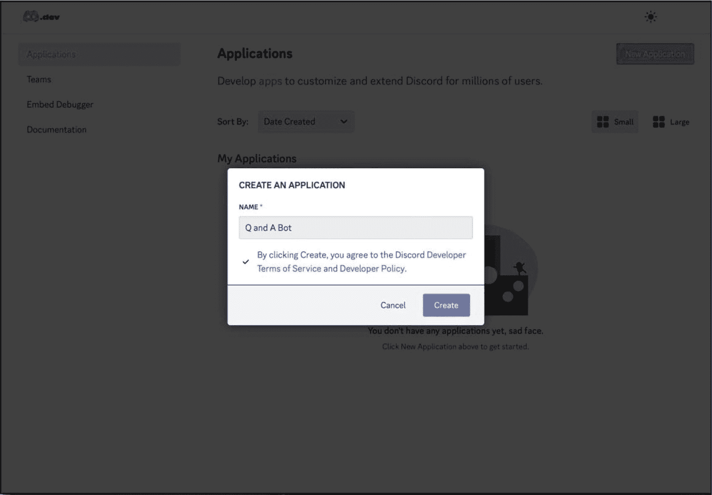

图 6-6

为 Discord 创建/注册机器人

### 指定机器人的基本信息

之后，您将进入一个页面，可以在其中指定机器人的基本信息，如图 6-7 所示。

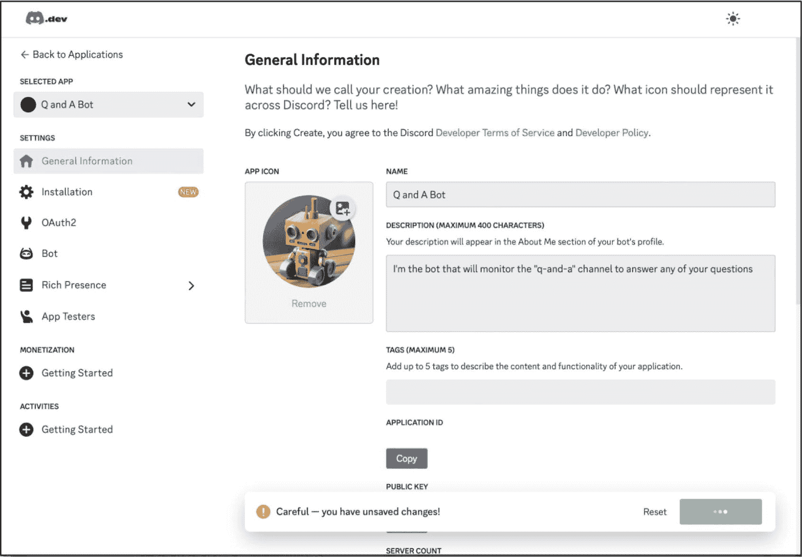

图 6-7

我决定给我的机器人一个可爱的小机器人图标

请务必熟悉页面左侧的导航菜单。如您所见，我们有几类设置需要为机器人配置。默认情况下，我们位于“基本信息”页面，在此处指定机器人的基本信息。如果您已为机器人准备好图标，可以在此处上传。

### 为机器人指定 OAuth2 参数

现在，是时候为我们的机器人指定作用域和权限了。如果您按照第 4 章中创建 Slack 机器人的步骤操作，那么（如前所述）您会对这个过程感到熟悉。机器人**不能**也**不应该**拥有做任何事的能力——它们只应被允许执行其设计要执行的一系列操作。

在左侧的设置导航菜单中，导航到“OAuth2 > OAuth2 URL 生成器”以继续。

以下是我们需要的作用域：

*   作用域
    *   机器人

这反映在图 6-8 中。

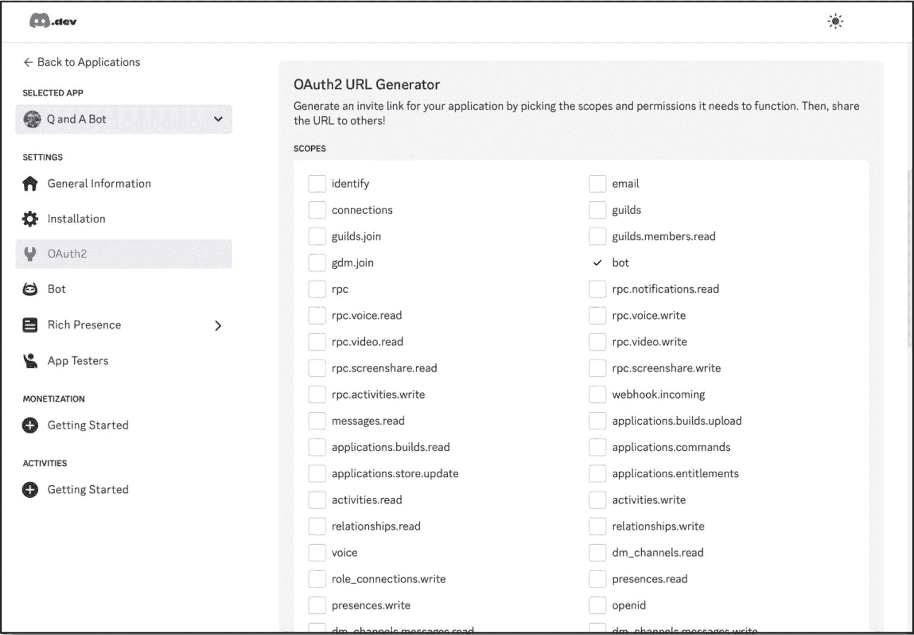

图 6-8

选择作用域

选择机器人的作用域后，我们会看到所有仅适用于机器人的权限（请务必向下滚动查看）。

根据您授予的权限，机器人可以变得相当强大。有些权限允许机器人像普通人类管理员一样行事，例如管理服务器、角色和频道。拥有这些权限的机器人还可以踢出和封禁成员。

我们现在要为机器人启用的权限是允许机器人在文本频道中发送和接收消息，以及允许机器人参与语音频道的语音权限。很简单，对吧？

为机器人选择以下权限：

*   机器人权限
    *   读取消息/查看频道
    *   发送消息
    *   读取消息历史

这反映在图 6-9 中。

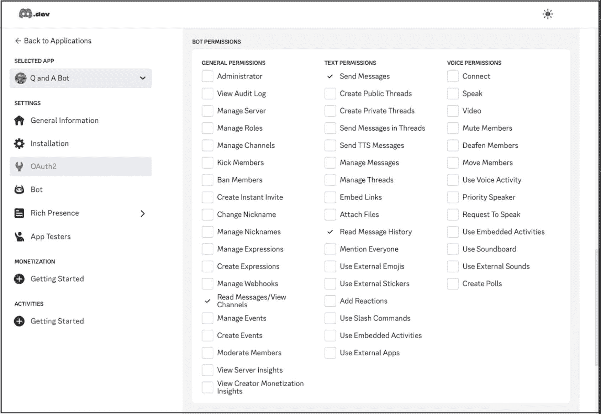

图 6-9

指定机器人权限

尽管您还没有编写任何 Python 代码，但现在是将机器人邀请到您的服务器的时候了。

### 将机器人邀请到您的服务器

选择适当的权限后，Discord 会为您生成一个动态 URL，使您能够将机器人邀请到您的服务器（如果看不到，请向下滚动页面）。

复制该 URL 并将其粘贴到您已登录 Discord 的 Web 浏览器中。结果如图 6-10 所示。


图 6-10

如果您仔细阅读此处的屏幕信息，您会发现 Discord 颇具幽默感

点击“继续”按钮将机器人添加到您的服务器。

接下来，您将看到一个与上一页面非常相似的页面，但主要区别在于它会为您提供机器人所有权限和功能的摘要。通常，如果您要将机器人添加到*非您创建*的服务器，这会非常有用。但是，由于这个机器人是我们自己创建的，这仅是对我们之前已指定设置的确认。图 6-11 显示了使用所选权限授权我们机器人的确认屏幕。

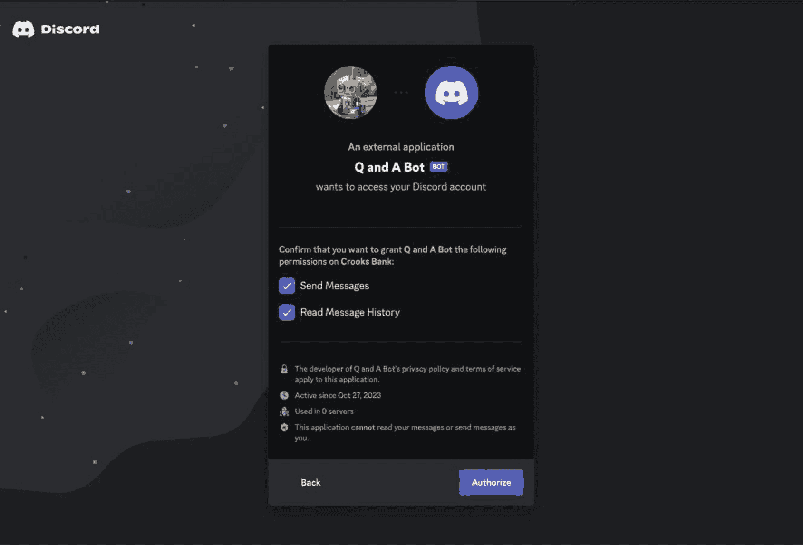

图 6-11

确认机器人的功能

点击“授权”按钮，授予机器人在您的服务器上运行的权限。

如果一切顺利，您应该会在服务器的常规频道中看到一条自动消息，表明该过程已成功完成。

### 获取机器人的 Discord ID 令牌并设置网关意图

现在，是时候获取机器人的 Discord ID 令牌了，您将在代码中使用它来以编程方式验证您的机器人。

注意

出于显而易见的原因，在这里使用“令牌”一词让我感到紧张，因为由于上下文原因，这个词在本书中有两种不同的含义，但这里快速回顾一下其含义：

*   使用 Discord 和 Slack API 时，“令牌”是身份验证令牌。
*   使用 OpenAI API 时，“令牌”是单词的一部分。

返回 Discord 开发者网站，在设置导航菜单中点击“机器人”类别以继续。

尽管您还没有看到您的令牌，但您需要点击“重置令牌”按钮，如图 6-12 所示。

请务必将 ID 令牌复制并保存到安全的地方。您将在本章后面介绍的 Python 代码中需要此令牌。

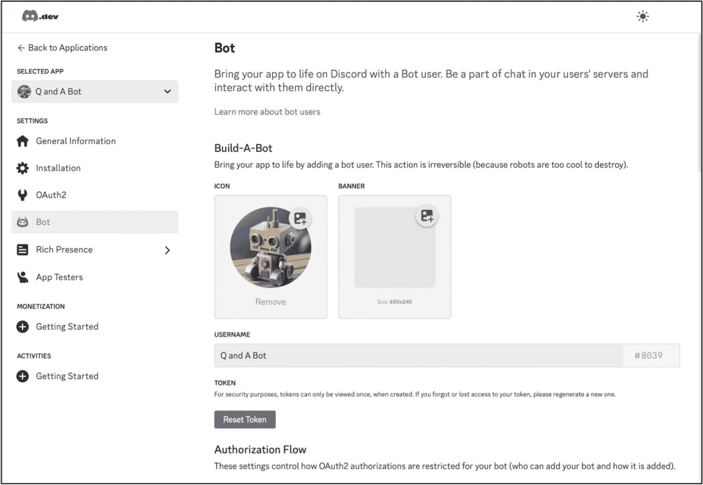

图 6-12

点击“重置令牌”按钮查看您的 ID 令牌

向下滚动页面到名为“特权网关意图”的部分，并启用名为“消息内容意图”的选项。

注意

那么，让我们放慢节奏，谈谈意图。到底什么是“意图”，为什么需要它？就 Discord API 而言，您需要明确指定您希望 Discord 以编程方式通知您的每一种信息类型。否则，Discord 会不断用与您或您的机器人无关的事件轰炸您。例如，就我们的目的而言，我们不关心人们何时加入或离开服务器。但是，如果您想向首次加入服务器的任何人发送服务器规则列表，那么您肯定希望启用“服务器成员意图”。当我们深入研究代码时，您会看到更多关于意图的信息。

请务必点击绿色按钮“保存更改”以保存您的更改。结果如图 6-13 所示。

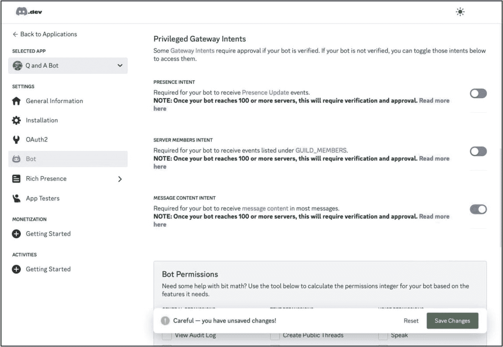

图 6-13

启用名为“消息内容意图”的选项


## 用 Python 创建问答机器人应用，从频道中回答问题：`tech_support_bot_dumb.py`

当然，既然我们已经完成了所有必要的准备工作，并且知道了要监控用户问题的频道名称，那么接下来就让我们看看用 Python 编写的代码，这些代码能让机器人加入我们的服务器并访问特定 Discord 频道的所有消息。

这是本章中我们将要创建的两个 Discord 机器人中的第一个。这个名为 `tech_support_bot_dumb.py` 的机器人将负责监控我们 Discord 服务器中“q-and-a”频道的消息。

在本章稍后的内容中，我们将创建另一个机器人，它负责审核 Discord 服务器中的*所有内容*，包括“q-and-a”频道，以过滤掉不良内容。这样做的目的是遵循“关注点分离”的架构模式。我们不会创建一个庞大的、能处理 Discord 服务器所有审核需求的 Python Discord 机器人，而是将功能拆分成两个不同的应用。

我们还将循序渐进，将本章的重点放在攻克 Python 中 Discord 功能的学习曲线上。在本书的最后几章中，我们将对这两个机器人进行增强，利用 OpenAI API 让它们具备人工智能。

清单 6-1 展示了创建一个基础 Discord 机器人所需的代码，该机器人可以监控单个频道中发布的所有消息并提供回答。

*清单 6-1.* *tech_support_bot_dumb.py*

```
import discord
### 用于身份验证的机器人令牌
discord_token = 'YOUR_TOKEN_HERE'
### 机器人应监控和交互的频道名称
channel_to_watch = 'q-and-a'
### 初始化 Discord 客户端
discord_client = discord.Client()
### 机器人就绪时的事件处理程序
@discord_client.event
async def on_ready():
print('已登录为', client.user)
print('------')
### 收到消息时的事件处理程序
@ discord_client.event
async def on_message(message):
### 忽略机器人自己发送的消息，防止自我回复
if message.author == client.user:
return
### 忽略不在指定 "q-and-a" 频道中的消息
if isinstance(message.channel, discord.TextChannel) and message.channel.name != channel_to_watch:
return
### 向发送消息的用户发送问候回复
reply = f'你好 {message.author.mention}，我可以帮你解决这个问题！'
await message.channel.send(reply)
### 使用提供的令牌运行机器人
discord_client.run(discord_token)
```

在脚本的开头，你应该会注意到我们通过 `channel_to_watch` 变量指定了我们想要监控的频道。

**注意**

由于某些原因，Discord 自身的术语有时会将 Discord 服务器称为“公会”。然而，从我们的角度来看，公会就是一个 Discord 服务器。

## 处理发送到 Discord 服务器的消息

在结束第一个 Python Discord 机器人的介绍之前，我们需要讨论一下 `on_message(message)` 函数。对于发送到 Discord 服务器的每一条消息，以及用户直接以私信形式发送给机器人本身的消息，都会异步调用此函数。

**注意**

你知道吗？当机器人在 Discord 服务器中回答某人的问题时，Discord 会调用机器人的 `on_message(message)` 函数，将机器人刚刚发送的消息传递给机器人。这听起来像是无限循环的根源，不是吗？因此，我们在代码中设置了逻辑，让机器人忽略自己发送的消息。

在 `on_message(message)` 函数的最后几行中，我们通过在回复中“@提及”原始消息发送者，确保给予他们友好的回复。正如我们之前提到的，这个问答机器人的第一个版本是“笨”的。当你在 Discord 服务器中发布问题时，它会做出响应，但响应实际上并不会回答你的问题。

## 成功！运行你的第一个 Discord 机器人：`tech_support_bot_dumb.py`

现在，让我们运行我们的 Python Discord 机器人。执行应用后，请务必返回你的 Discord 服务器，并尝试在你为问答设置的频道中输入一个问题。图 6-14 展示了对我的问题“这个机器人会回答我关于这个应用的问题吗？”的响应。

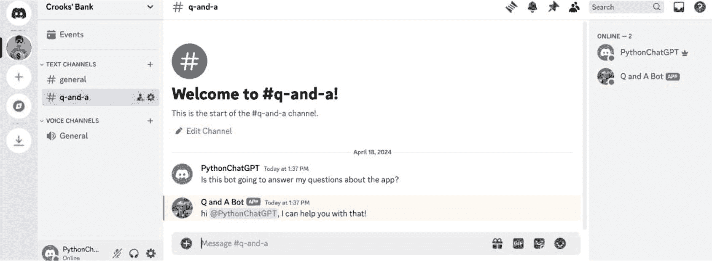

图 6-14

在 Discord 中成功运行问答机器人

仔细查看图 6-14，你会看到一些关键特性，例如：

- 在右侧，你会看到机器人处于在线状态，并带有绿色状态指示器。
- 在频道中提问后，机器人会直接@提及你。

## 简化向 Discord 注册下一个 Discord 机器人应用的流程

既然我们已经成功完成了所有步骤，拥有了一个可运行的 Discord 机器人，那么创建第二个机器人就易如反掌了！所以，让我们简要地重复一下上述所有步骤，以便创建我们的第二个 Discord 机器人。我会明确指出哪些项目需要更改或增强，因为第二个机器人将作为审核员，而不是为 Discord 服务器的用户提供问题答案。

### 向 Discord 注册一个新的 Discord 机器人应用

执行与上述相同的步骤；不过，明智的做法是给机器人起一个不同的名字。对我来说，第二个机器人将命名为“Mod Bot”。

### 指定机器人的常规信息

对我来说，内容审核机器人有一个不同的图标，所以我在这里指定了它，如图 6-15 所示。

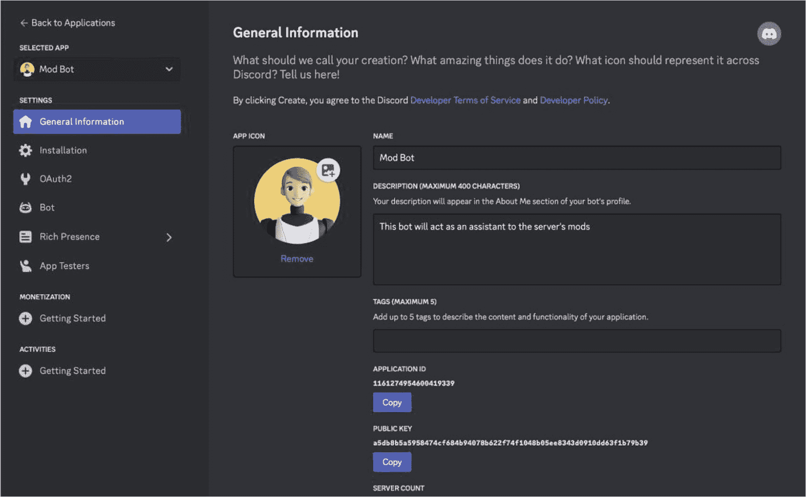

图 6-15

为第二个机器人提供名称和图标

### 为机器人指定 OAuth2 参数

第二个机器人需要更多权限才能执行更多任务。以下是我们需要的范围：

- 机器人
  - 踢出成员
  - 封禁成员
  - 发送消息
  - 管理消息
  - 读取消息历史

### 邀请你的机器人到你的服务器

重复第一个机器人的相同步骤。

### 获取机器人的 Discord ID 令牌并设置网关意图

再次按照上述步骤获取 Discord ID 令牌。然后，向下滚动页面到名为“特权网关意图”的部分，并启用名为“服务器成员意图”和“消息内容意图”的选项。


## 创建下一个 Discord 机器人：`content_moderator_bot_dumb.py`

内容审核员的职责是确保 Discord 服务器中不会出现不当内容。与我们本章前面创建的机器人一样，这个机器人（暂时）还不具备人工智能。在当前状态下，该机器人会不加区分地删除服务器中任何包含“puppies”一词的消息。

这并不是因为“puppies”本身有什么邪恶之处。不过，它们确实有在你不在家时毁掉你最爱那双鞋的倾向。老实说，我们只是需要在 Discord 中运行机器人时，有东西可以用来测试我们的代码。

清单 6-2 展示了 `content_moderator_bot_dumb.py` 的代码。

*清单 6-2.* `content_moderator_bot_dumb.py`

```
import discord
### 用于身份验证的机器人令牌
discord_token = ''
### 需要监控的违禁词
banned_word = 'puppies'
### 初始化 Discord 客户端
discord_client = discord.Client()
### 机器人就绪时的事件处理程序
@discord_client.event
async def on_ready():
print('已登录为', discord_client.user)
print('------')
### 收到消息时的事件处理程序
@discord_client.event
async def on_message(message):
### 忽略机器人自身发送的消息，防止自我响应
if message.author == discord_client.user:
return
### 检查消息是否发送自公会（服务器）
if message.guild is not None:
### 检查消息内容中是否包含违禁词
if banned_word in message.content:
### 删除该消息
await message.delete()
### 提及发送不当消息的用户
author_mention = message.author.mention
### 发送一条提及该用户的警告消息
await message.channel.send(f'{author_mention} 此评论被认为不适合本频道。'
'如果您认为这是误判，请联系人工服务器管理员。')
### 使用提供的令牌运行机器人
discord_client.run(discord_token)
```

## 处理发送到 Discord 服务器的消息

再次，让我们将注意力集中在 `onMessageReceived()` 函数上，因为每当有消息发布到 Discord 服务器时，它都会被异步调用。如您所见，如果发布到服务器的消息包含违禁词，我们会删除该消息，并在发布违规消息的同一频道中通过 @提及 消息向发送者发出警告。

## 再次成功！运行您的第二个 Discord 机器人：`content_moderator_bot_dumb.py`

现在，让我们运行第二个 Python Discord 机器人。执行应用程序后，请务必返回您的 Discord 服务器，并在任意频道中输入一条包含违规词的消息。图 6-16 展示了机器人的运行效果。

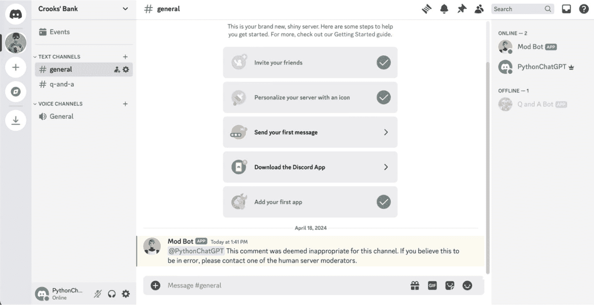

图 6-16

这个机器人对讨论“Puppies”有严格规定；不过，讨论“Kittens”则完全没问题

## 结论

我们刚刚完成了用 Python 创建两个可运行 Discord 机器人所需的所有步骤。对于那些不熟悉创建 Discord 服务器流程的读者，我们展示了如何设置一个服务器来管理我们的社区。

如您所见，我们采用的方法与我们在第 4 章中创建的 Slack 机器人截然不同！我们创建的 Slack 机器人主要关注工作场所的用户生产力。而这两个 Discord 机器人则真正专注于社区管理。借助 OpenAI 的 API，我们已经为这些机器人具备人工智能做好了所有准备。这一切将在最后两章中完成。

## 留给读者的练习

在接下来的章节中，我们将让我们的“傻瓜”机器人变得智能，但至少有一件事我们现在就可以做。与其使用命令行报告状态消息，不如让机器人拥有一个专门用于状态报告的频道。这样，当机器人启动、关闭或有任何重要信息需要通知管理员时，所有信息都会记录并保存在一个中心位置。

# 为我们的 Discord 机器人增加智能，第 1 部分：使用聊天模型进行问答

至此，我们已经具备了所有结构，可以使我们在上一章创建的两个 Discord 机器人功能完备且具备人工智能，这正是我们在本书最后几章要做的事情。本章的重点是我们的技术支持机器人，它被称为 `tech_support_bot_dumb.py`。以下是我们要做的两个主要更改：

- 修改我们的 `chatgpt_client.py` 脚本，使 Discord 机器人脚本能够就我们提供的特定信息进行提问。更新后的文件将是一个名为 `chatgpt_client_for_qa_and_moderation.py` 的类。它将在本章用于问答目的，并且也将在本书的最后一章中使用。

- 修改我们的 `tech_support_bot.py` 脚本（原名为 `tech_support_bot_dumb.py`），使其能够加载一个包含常见问题及解答的外部文本文件。然后，该脚本会将文本文件的内容提供给 `chatgpt_client_for_qa_and_moderation.py` 脚本中的 `ChatGPTClient` 类，该类负责创建提示词，并当然会调用 OpenAI Python API 的聊天对象。


## 让 `tech_support_bot.py` 更智能

代码清单 7-1 包含了虚构客服团队根据新推出的手机银行应用用户工单所创建的常见问题解答的完整内容。

- ```
  账户管理：查看账户余额、交易记录等。
  ```

- ```
  转账：轻松在您的账户之间或向其他银行账户转账。
  ```

- ```
  账单支付：支付账单并管理定期付款。
  ```

- ```
  存入支票：拍摄支票照片进行远程存款。
  ```

- ```
  ATM 定位器：查找附近的 ATM 和分行。
  ```

- ```
  通知：接收账户活动和重要更新的提醒。
  ```

```
1. 什么是克鲁克斯银行手机应用？
克鲁克斯银行手机应用是一款尖端的手机银行应用，让您能够方便地通过移动设备管理财务、进行交易以及访问广泛的银行服务。
2. 如何下载克鲁克斯银行手机应用？
您可以从 iOS 设备的 App Store 和 Android 设备的 Google Play 下载克鲁克斯银行手机应用。只需搜索“克鲁克斯银行手机应用”并点击“安装”按钮即可。
3. 克鲁克斯银行手机应用安全可靠吗？
是的，克鲁克斯银行手机应用将您的安全放在首位。我们使用最先进的加密和安全协议来保护您的数据和交易。您的信息在我们这里很安全。
4. 克鲁克斯银行手机应用提供哪些功能？
克鲁克斯银行手机应用提供多种功能，包括：
代码清单 7-1
FAQ.txt
```

```
5. 我可以在克鲁克斯银行手机应用中关联外部账户吗？
可以，克鲁克斯银行手机应用支持关联其他金融机构的外部账户。您可以在一个地方监控和管理来自不同银行的账户。
6. 如果我忘记密码，如何重置？
如果您忘记密码，只需在登录屏幕上点击“忘记密码”选项。您将收到关于如何重置密码的说明。
7. 克鲁克斯银行手机应用有哪些相关费用？
克鲁克斯银行手机应用力求费用透明。您可以在应用内的“费用”部分或我们的网站上找到关于账户费用、交易手续费和其他成本的信息。
8. 我可以通过克鲁克斯银行手机应用获得客户支持吗？
当然可以！我们通过应用内的消息功能提供客户支持。您也可以在我们的网站上找到我们的客户服务联系方式。
9. 克鲁克斯银行手机应用适用于企业账户吗？
克鲁克斯银行手机应用主要满足个人银行需求。不过，我们计划在未来推出企业银行服务。
10. 我如何为克鲁克斯银行手机应用提供反馈或建议？
我们欢迎您的反馈！您可以通过应用内或我们网站上的“联系我们”部分提交建议和反馈。
```

正如您在代码清单 7-1 的 `FAQ.txt` 文件中看到的，这里并没有什么魔法。它只是一个问题和答案的列表。现在，让我们看看新修改的 `tech_support_bot.py` 类。这体现在代码清单 7-2 中。

```
"""
tech_support_bot.py
一个与 ChatGPT 集成的 Discord 机器人，用于在指定频道中自动回复。
此脚本使用 discord.Client() 类初始化一个 Discord 机器人，并监听诸如消息发送等事件。
当在指定频道收到消息时，机器人会调用 ChatGPT 根据消息内容生成回复，并将回复发送回同一频道。
要求：
- discord (https://pypi.org/project/discord.py/)
- chatgpt_client (假定为提供与 ChatGPT 交互的自定义模块)
用法：
1. 将 DISCORD_TOKEN 变量替换为您从 Discord 开发者门户获取的机器人令牌。
2. 调整 CHANNEL_TO_WATCH 变量以指定机器人应监控和交互的频道名称。
3. 确保 chatgpt_client 模块已正确实现且可访问。
注意：此脚本假定存在一个 chatgpt_client 模块用于与 ChatGPT API 交互。
"""
import discord
from chatgpt_client_for_qa_and_moderation import ChatGPTClient
### 用于身份验证的机器人令牌
DISCORD_TOKEN = ''
### 机器人应监控和交互的频道名称
CHANNEL_TO_WATCH = 'q-and-a'
### 初始化 Discord 客户端
discord_client = discord.Client()
### 为 ChatGPT 创建系统消息
system_message_to_chatgpt = "You are a virtual assistant that provides support for the Crooks Bank banking app."
with open('FAQ.txt', 'r', encoding='utf-8') as file:
    # 将文件的全部内容作为一个字符串读入变量
    file_contents = file.read()
### 初始化 ChatGPT 客户端
chatgpt_client_for_qa_and_moderation = ChatGPTClient(system_message_to_chatgpt, file_contents)
### 机器人就绪时的事件处理程序
@discord_client.event
async def on_ready():
    """
    当机器人成功登录并准备好接收事件时触发的事件处理程序。
    """
    print('已登录为', discord_client.user)
    print('------')
### 收到消息时的事件处理程序
@discord_client.event
async def on_message(message):
    """
    收到消息时触发的事件处理程序。
    参数：
    message (discord.Message)：机器人收到的消息。
    返回：
    None
    """
    # 忽略机器人自己发送的消息，以防止自我回复
    if message.author == discord_client.user:
        return
    # 忽略不在指定“tech-support”频道中的消息
    if isinstance(message.channel, discord.TextChannel) and \
            message.channel.name != CHANNEL_TO_WATCH:
        return
    async with message.channel.typing():
        # 调用 ChatGPT 根据收到的消息生成回复
        response_from_chatgpt = chatgpt_client_for_qa_and_moderation.send_message_from_discord(message.content)
        # 构建一条提及消息作者并附加 ChatGPT 回复的回复
        reply = f'{message.author.mention} {response_from_chatgpt}'
        # 将回复发送到收到原始消息的同一频道
        await message.channel.send(reply)
### 使用提供的令牌运行机器人
discord_client.run(DISCORD_TOKEN)
代码清单 7-2
tech_support_smart_bot.py
```

## 与之前版本技术支持机器人相比的重要变化

让我们简要分析一下 `tech_support_smart_bot.py` 并讨论所做的更改。代码片段清单 7-3 包含了完整清单的一部分。

```
### 为 ChatGPT 创建系统消息
system_message_to_chatgpt = "You are a Q and A bot for a discord group dedicated to the banking app, Crook's Bank"
with open('FAQ.txt', 'r', encoding='utf-8') as file:
    # 将文件的全部内容作为一个字符串读入变量
    file_contents = file.read()
代码清单 7-3
为 tech_support_bot.py 设置系统消息和常见问题解答信息
```

如您所见，我们同时做了几件事。

首先，正如我们从本书前几章中学到的，您可以通过在提示中为系统本身提供一条特定消息来显著设定对话的基调。因此，我们这里有一个包含系统消息的变量。

接下来，我们定义了另一个变量，它提供了存储常见问题解答文件的路径位置引用。然后我们简单地读取了文件——就这么简单。


### `on_message(message)` 函数的更新

当收到消息时，请务必注意以下几行代码：

```
@discord_client.event
async def on_message(message):
```

此函数是我们 Discord 机器人的核心部分。每当我们的 Discord 服务器中发布一条消息时，就会调用 `on_message()` 函数。这里的 `async` 关键字很重要，因为它使得 `on_message()` 能够被异步调用，这正是我们想要的，即每当有消息发布时都能及时响应。

**注意**

快速回顾一下同步通信与异步通信的区别。同步通信的一个典型例子是使用网页浏览器访问网络服务器。一旦你发送请求，就需要等待直到收到响应。要查看不同的网站，你需要再次发送请求并再次等待响应。

异步通信的一个好例子是给朋友或同事发送电子邮件。你可以给朋友发送 1 封、2 封、5 封、10 封甚至 1000 封邮件，但他们不一定在*等待*你的邮件。换句话说，由于电子邮件的运作方式，他们不会陷入“等待模式”并一直等着你发送内容。当邮件到达时，你的朋友会收到通知。

因此，每当我们的 Discord 服务器中发布一条消息时，就会调用 `on_message()` 函数，并将消息本身作为函数参数传入。

现在，让我们进一步分析 `tech_support_bot.py` 中的以下代码：

```
async with message.channel.typing():
#### 调用 ChatGPT 根据收到的消息生成回复
response_from_chatgpt = chatgpt_client_for_qa_and_moderation.send_message_from_discord(message.content)
#### 构建一条提及消息作者并附加 ChatGPT 回复的回复消息
reply = f'{message.author.mention} {response_from_chatgpt}'
```

在这里，我们提供了良好的用户体验，在用户的问题被发送到 ChatGPT 的同时，向用户显示机器人正在“输入”。当收到回复后，我们将回复内容返回给用户。

## 分析 `chatgpt_client_for_qa_and_moderation.py`

现在，当我们进一步查看上面的代码清单 7-2 时，`tech_support_bot.py` 在 `chatgpt_client_for_qa_and_moderation.py` 脚本中实例化了 `ChatGPTClient` 对象，该脚本（正如我们之前所述）与我们之前使用的 `chatgpt_client.py` 脚本非常相似。`chatgpt_client_for_qa_and_moderation.py` 的完整源代码如代码清单 7-4 所示。

```
import os
from dotenv import load_dotenv
from openai import OpenAI
class ChatGPTClient:
def __init__(self, system_message, initial_instructions_to_chatgpt):
### 从 .env 文件加载环境变量
load_dotenv()
### 使用环境变量中的 API 密钥
self.client = OpenAI()
self.system_message = system_message
self.initial_instructions_to_chatgpt = initial_instructions_to_chatgpt
def send_message_from_discord(self, user_message):
response = self.client.chat.completions.create(
model="gpt-4",
messages=[
{
"role": "system",
"content": f'{self.system_message}'
},
{
"role": "user",
"content": f'{self.initial_instructions_to_chatgpt}'
},
{
"role": "user",
"content": f'{user_message}'
}
],
temperature=0.85,
max_tokens=1921,
top_p=1,
frequency_penalty=0,
presence_penalty=0
)
condensed_response = response.choices[0].message.content
return condensed_response
代码清单 7-4
chatgpt_client_for_QA_and_moderation.py
```

### 解析 Python 中的 `ChatGPTClient` 类，以便我们的机器人能够利用 ChatGPT

我们创建的 Python 类 `ChatGPTClient` 在将 OpenAI API 集成到我们的 Discord 机器人中扮演着关键角色。让我们来看看它的优势：

该类在设计上考虑了模块化，封装了与 ChatGPT 交互的所有功能。在 `__init__` 方法中，我们初始化客户端，传入系统消息和 `FAQ.txt` 的内容，并从 `.env` 文件中加载 OpenAI API 密钥。

通过 `send_message_from_discord()` 方法，该类简化了与 ChatGPT 的通信。由于对象在构建时已经包含了系统消息的初始指令，Discord 用户的消息会被作为用户消息放入提示中，这样我们就可以通过编程方式将用户的问题发送给 ChatGPT。

`send_message_from_discord()` 方法并不限制我们对该类的使用场景。目前，我们将其用于问答；然而，任何使用该类的机器人都可以出于任何目的以任何方式向 ChatGPT 发送提示。

最后，我们通过提取生成消息的内容并返回精简版本来高效处理来自 OpenAI API 的响应。这使得我们的 Discord 机器人能够仅回复我们所需的信息，而不是聊天模型返回的完整响应。这通过一行代码即可实现：

```
condensed_response = response.choices[0].message.content
```

### 运行我们的智能问答机器人：`tech_support_bot.py`

现在，让我们运行我们全新改进的 Python Discord 问答机器人 `tech_support_bot.py`。执行应用程序后，请务必返回你的 Discord 服务器并开始提问。图 7-1 展示了机器人的运行情况。


**图 7-1** 与我们的智能 Discord 问答机器人 `tech_support_bot.py` 进行对话

代码清单 7-6 展示了我们与 Discord 机器人之间的对话。

```
我：你好，我是这个频道的新用户。我可以问哪些类型的问题？
问答机器人：你好！欢迎来到克鲁克斯银行移动应用支持频道。在这里，你可以询问任何关于我们银行应用的问题。例如，你可以询问：
1. 如何安装和使用该应用。
2. 应用内的功能和服务。
3. 解决你可能遇到的任何问题。
4. 保护你的数据和交易的安全措施。
5. 重置密码的说明。
6. 使用应用的相关费用。
7. 如何关联外部银行账户。
8. 客户支持的可用时间。
9. 改进应用的反馈和建议。
请随时提出任何其他与克鲁克斯银行移动应用相关的问题。我们随时为你提供帮助！
我：我有一部旧的黑莓手机，这个应用支持我的设备吗？
问答机器人：很抱歉给您带来不便，但目前克鲁克斯银行移动应用仅适用于 iOS 和 Android 设备。它不支持黑莓或其他操作系统。您仍然可以通过手机浏览器访问我们的网站来管理您的银行账户。
我：我是 iPhone 用户。我可以用面容 ID 或触控 ID 登录应用吗？
问答机器人：当然可以，以下是在您的 iPhone 上设置克鲁克斯银行移动应用的方法：
1. 打开您 iPhone 上的 App Store。
2. 在顶部的搜索栏中输入“克鲁克斯银行移动应用”，然后点击“搜索”。
3. 当您在搜索结果中看到该应用时，只需点击“获取”按钮即可下载。
4. 应用下载完成后，点击“打开”。
5. 首次启动时，您需要同意我们的条款和条件。
6. 如果您是克鲁克斯银行的现有会员，您可以使用您的网上银行用户 ID 和密码登录。如果您是新会员，则需要注册一个账户。
7. 登录后，您可以设置触控 ID 或面容 ID，以便将来更快、更安全地登录。
8. 现在，您可以开始使用克鲁克斯银行移动应用来管理您的财务、支付账单、进行交易等！
请确保定期更新应用以获取新功能和改进。如果在设置过程中遇到任何问题，请通过应用的支持功能或致电我们的客户服务与我们联系。
代码清单 7-5
与智能问答 Discord 机器人的首次对话
```


## 我们取得了一项里程碑式的成就……但有一个小缺陷

好了，如果你退后一步审视我们目前取得的成果，你应该会意识到，我们正见证着一项堪称里程碑式的成就。我们拥有以下成果：

-   一个由几个脚本组成的系统，允许用户输入问题，并获得关于如何使用我们移动应用的答案。
-   通过一个简单的文本文件，我们可以教会机器人如何回答用户的问题。这个文本文件可以由公司里的任何人编辑，并可作为知识库，日复一日地帮助提升机器人的智能。这真是太棒了。
-   我们的系统允许客户使用自然语言输入问题，机器人则会向他们提供智能答案。你知道吗？客户不喜欢阅读常见问题解答（FAQ）——尤其是那些特别长的。然而，使用这个系统，他们就不需要了！他们只需提出与自己相关的问题即可。

那么，在我们取得所有这些成就的同时，却有一个*巨大*的缺陷不容忽视。在上面的代码清单 7-5 中，机器人对用户说：

```
Once you're logged in, you can set up Touch ID or Face ID for quicker, secure login in the future.
```

不，不，不！坏机器人！如果你没有完整阅读常见问题解答文件，请允许我解释一下这里出了什么问题：

1.  代码清单 7-1 中的 `FAQ.txt` 文件明确指出，Crook's Bank 移动应用是一个移动应用。目前，Touch ID 只能用于苹果台式机和笔记本电脑。所以，这根本说不通。
2.  `FAQ.txt` 文件中完全没有提到使用 Face ID 进行移动应用身份验证。

所以，不幸的是，ChatGPT 在编造一些根本不真实的事情，并假设存在某些并不存在的功能。因此，就真正的技术支持而言，这是绝对不可接受的。

那么，我们该如何解决这个问题呢？在阅读下一节之前，先思考一下*你*会如何解决这个问题。

## 更新发送给 ChatGPT 的系统消息，再试一次

你想出解决方案了吗？解决这个问题的一种方法是更新系统消息。请参考上面代码清单 7-2 中的以下代码行：

```
system_message_to_chatgpt = "You are a virtual assistant that provides support for the Crooks Bank banking app. ";
```

请记住，系统消息向 ChatGPT 指明了它在聊天对话中的角色。目前，它被设定为一个乐于助人的助手，因此它擅自猜测移动应用中存在某些功能。现在，让我们确保 ChatGPT 不会做出任何假设。将系统消息更新如下所示：

```
system_message_to_chatgpt = "You are a virtual assistant that provides support for the Crooks Bank banking app. You will be provided Information about the application, and users will ask you questions about the application. Your role is to answer questions explicitly from the training information. If you were not given an answer to a question, then provide an apologetic message to the user explaining that you do not know the answer.";
```

就是这样。`FAQ.txt` 文件保持与之前完全相同，我们只需要更新系统消息，让 ChatGPT 知道它在对话中的角色。代码清单 7-6 展示了我们与 Discord 机器人的新对话。

```
Me: How are you today?
Q and A Bot: As a virtual assistant, I don't have feelings or emotions, but I'm here and ready to assist you. How may I help you with the Crooks Bank Mobile App today?
Me: I have an old Blackberry phone, is the app supported on my device?
Q and A Bot: I'm sorry, but from the information provided, the Crooks Bank Mobile App can only be downloaded from the App Store for iOS devices and Google Play for Android devices. BlackBerry devices are not mentioned, therefore I cannot confirm that it would be compatible.
Me: So, if I use an iPhone, how do I setup the app?
Q and A Bot: To set up the Crooks Bank Mobile App on your iPhone, you can download it from the App Store. Simply search for "Crooks Bank Mobile App" and click the "Install" button. After the installation is finished, open the app and follow the prompts to set up your account. If you already have an account, use your login information to access your account through the app.
代码清单 7-6
我们与智能问答 Discord 机器人的第二次（也是更好的）对话
```

现在，好多了！我们的技术支持机器人“严格遵守脚本”，不允许编造或假设任何事情。

## 结论

在本章中，我们收获颇丰！我们拥有一个功能完备的 Discord 机器人，任何人都可以使用一个简单的文本文件来训练它，而无需任何 AI、NLP 或机器学习经验。我们了解到，一个“乐于助人的助手”有时可能会变得*过于热心*，并假设一些不真实的事实。然而，我们也再次强调了系统消息的概念和价值，这是提示工程的重要组成部分。

现在，我们已经让我们的问答 Discord 机器人变得智能，接下来让我们看看如何让我们的内容审核机器人也变得智能吧！


# 8. 为 Discord 机器人注入智能，第二部分：使用聊天与审核模型进行内容审核

在本章中，我们将采取必要步骤，使我们的内容审核 Discord 机器人具备人工智能。让我们概述一下将要进行的更改：

*   创建一个新脚本 `moderation_client.py`，用于调用 OpenAI API 的 `OpenAI.moderations.create()` 方法。审核模型使我们能够识别任何文本内容是否属于以下类别：
    *   仇恨言论
    *   仇恨/威胁性言论
    *   骚扰
    *   骚扰/威胁性言论
    *   自残
    *   自残/意图
    *   自残/指导
    *   色情内容
    *   色情内容/涉及未成年人
    *   暴力内容
    *   暴力内容/血腥画面

*   复用上一章中的 `chatgpt_client_for_qa_and_moderation.py` 脚本。在第 7 章中，该脚本用于调用 OpenAI 的 Chat 类，以回答用户提出的问题。在本章中，它将再次用于调用 Chat 类，但这次是为了审核目的。这就是为什么该脚本被恰当地命名为 `chatgpt_client_for_qa_and_moderation`，因为它既用于第 7 章的问答，也用于本章的审核。

*   修改我们的 `content_moderator_bot.py` 脚本（原名为 `content_moderator_bot_dumb.py`），使其能够同时调用 `moderation_client.py` 和 `chatgpt_client_for_qa_and_moderation.py`。如果任一脚本指示 Discord 频道中输入的内容存在异议，它将从该 Discord 频道中删除该消息。请记住，此机器人会监控 Discord 服务器中所有频道的所有内容！

现在，你可能会问自己，既然审核类已经知道如何标记任何有害内容，为什么我们还需要使用聊天类呢？问得好。

是的，审核类能让我们了解有害内容，但它**不会**告知我们其他类型的不当内容（针对我们的用例而言），例如当不怀好意的人试图引诱我们的用户陷入骗局时。请记住，这是一个银行应用的 Discord 服务器，因此诈骗者肯定会非常乐意针对该服务器的所有成员，因为这里聚集了大量银行用户！

因此，我们将使用 `moderation_client.py` 调用审核类，以了解 Discord 服务器中是否存在任何有害内容；同时，我们将复用上一章的 `chatgpt_client_for_qa_and_moderation.py` 来调用聊天方法，以便了解 Discord 服务器中是否发布了任何其他不良内容，例如诈骗企图。

## 使用 `OpenAI.moderations.create()` 审核内容

通过使用审核模型，开发者可以提交一段文本，并随后了解该文本是否包含暴力、仇恨和/或威胁性内容，或任何形式的骚扰。

表 8-1 描述了调用 `OpenAI.moderations.create()` 方法所需参数的格式。该服务使用起来非常简单，因为只需一个参数即可正确调用该服务。

### 检查方法参数

**表 8-1** 审核模型的请求体

| 字段 | 类型 | 是否必需 | 描述 |
| --- | --- | --- | --- |
| `input` | 字符串或列表 | 必需 | 需要分类的文本。 |
| `model` | 字符串默认值：`omni-moderation-latest` | 可选 | 有多个内容审核模型可供使用，例如：`omni-moderation-latest`、`text-moderation-stable`、`text-moderation-latest`。默认情况下，此参数设置为 `omni-moderation-latest`。它会随时间自动升级，确保你始终使用最准确的模型。如果你决定使用任何基于文本的审核模型，则只能提交文本进行评估。然而，全能审核模型能够评估文本和图像内容。因此，请选择最适合你用例的模型。 |

### 处理响应

成功调用审核模型后，该方法将返回一个响应，其结构如表 8-2 所示。


### 审核（字典）

**表 8-2** 审核响应的结构

| 字段 | 类型 | 描述 |
| --- | --- | --- |
| `id` | String | 审核请求的唯一标识符。 |
| `model` | String | 用于执行审核请求的模型。 |
| `results` | List | 审核对象列表。 |
| ↳ `flagged` | Boolean | 标记内容是否违反 OpenAI 的使用政策。 |
| ↳ `categories` | List | 类别列表及其是否被标记。 |
|  ↳↳ `hate` | Boolean | 表示给定文本是否表达、煽动或宣扬基于种族、性别、宗教、民族、国籍、残疾状况、性取向或种姓的仇恨。 |
|  ↳↳ `hate/threatening` | Boolean | 表示给定文本是否包含仇恨内容，并同时基于上述偏见对目标群体威胁实施暴力或严重伤害。 |
|  ↳↳ `harassment` | Boolean | 表示给定文本是否包含表达、煽动或宣扬针对任何目标的骚扰性语言。 |
|  ↳↳ `harassment/threatening` | Boolean | 表示给定文本是否包含骚扰内容，并同时威胁对任何目标实施暴力或严重伤害。 |
|  ↳↳ `self-harm` | Boolean | 表示给定文本是否包含宣扬、鼓励或描述自残行为的内容，例如自杀、割伤和饮食失调。 |
|  ↳↳ `self-harm/intent` | Boolean | 表示给定文本是否包含说话者表示正在或意图进行自残行为的内容，例如自杀、割伤和饮食失调。 |
|  ↳↳ `self-harm/instructions` | Boolean | 表示给定文本是否包含鼓励进行自残行为的内容，例如自杀、割伤和饮食失调。这包括提供如何实施此类行为的指导或建议的内容。 |
|  ↳↳ `sexual` | Boolean | 表示给定文本是否包含旨在引起性兴奋的内容，例如对性行为的描述。这包括推广性服务的内容；但**不包括**性教育和健康等主题。 |
|  ↳↳ `sexual/minors` | Boolean | 表示给定文本是否包含涉及未满 18 岁个人的内容。 |
|  ↳↳ `violence` | Boolean | 表示给定文本是否包含描述死亡、暴力或身体伤害的内容。 |
|  ↳↳ `violence/graphic` | Boolean | 表示给定文本是否包含详细描述死亡、暴力或身体伤害的内容。 |
| ↳ `category_scores` | List | 类别列表及其对应的模型评分。 |
|  ↳↳ `hate` | Number | “hate”类别的评分。 |
|  ↳↳ `hate/threatening` | Number | “hate/threatening”类别的评分。 |
|  ↳↳ `harassment` | Number | “harassment”类别的评分。 |
|  ↳↳ `harassment/threatening` | Number | “harassment/threatening”类别的评分。 |
|  ↳↳ `self-harm` | Number | “self-harm”类别的评分。 |
|  ↳↳ `self-harm/intent` | Number | “self-harm/intent”类别的评分。 |
|  ↳↳ `self-harm/instructions` | Number | “self-harm/instructions”类别的评分。 |
|  ↳↳ `sexual` | Number | “sexual”类别的评分。 |
|  ↳↳ `violence` | Number | “violence”类别的评分。 |
|  ↳↳ `violence/graphic` | Number | “violence/graphic”类别的评分。 |

以下列表是调用审核模型后返回的审核响应示例。表 8-2 看起来有点复杂，但正如你所见，如果任何类别被标记为“true”，那么 `results.flagged` 节点也会被标记为“true”。

请查看清单 8-1，了解审核响应的实际示例。

```
{
"id": "modr-XXXXX",
"model": "text-moderation-005",
"results": [
{
"flagged": true,
"categories": {
"sexual": false,
"hate": false,
"harassment": false,
"self-harm": false,
"sexual/minors": false,
"hate/threatening": false,
"violence/graphic": false,
"self-harm/intent": false,
"self-harm/instructions": false,
"harassment/threatening": true,
"violence": true,
},
"category_scores": {
"sexual": 1.2282071e-06,
"hate": 0.010696256,
"harassment": 0.29842457,
"self-harm": 1.5236925e-08,
"sexual/minors": 5.7246268e-08,
"hate/threatening": 0.0060676364,
"violence/graphic": 4.435014e-06,
"self-harm/intent": 8.098441e-10,
"self-harm/instructions": 2.8498655e-11,
"harassment/threatening": 0.63055265,
"violence": 0.99011886,
}
}
]
}
```
**清单 8-1** 审核响应

## 为审核模型创建客户端：`moderation_client.py`

清单 8-2 是我们用于调用审核模型的客户端。请先查看它，然后我们将讨论其中的重要部分。

```
import os
from dotenv import load_dotenv
from openai import OpenAI
class ModerationResponse:
def __init__(self):
load_dotenv()
self.client = OpenAI()
def moderate_text(self, text):
moderation = self.client.moderations.create(input=text)
return moderation
```
**清单 8-2** `moderation_client.py`

在本书的前几章中，我们为 OpenAI API 类的各种方法创建了客户端脚本。因此，上面 `moderation_client.py` 中的 `ModerationResponse` 类应该看起来相当熟悉。归根结底，我们有一个简单的函数 `moderate_text()`，它允许我们传递要评估的文本并返回响应。

## 让 `content_moderator_bot.py` 更智能

现在我们有了用于调用审核模型的 `moderation_client.py`，让我们看看更新后的 `content_moderator_bot.py`（之前名为 `content_moderator_bot_dumb.py`），它将使用 `moderation_client.py` 检查有害内容，并使用 `chatgpt_client_for_qa_and_moderation.py`（与前一章相比未修改）检查潜在的诈骗。

清单 8-3 是我们智能 Discord 审核机器人 `content_moderator_bot.py` 的完整源代码。


```python
"""
content_moderation_bot.py
一个集成了 ChatGPT 和审核服务的 Discord 机器人，用于 Discord 服务器的自动内容审核。
该脚本使用`discord.Client()`类初始化一个 Discord 机器人，并监听消息发送等事件。当收到消息时，它会同时调用 ChatGPT API 和审核服务来分析消息内容是否违反规则。如果任一服务标记了该消息，机器人将删除该消息，并向用户发送通知，说明其为何被视为不当内容。

依赖项：
- discord (https://pypi.org/project/discord.py/)
- chatgpt_client_for_qa_and_moderation (假设为自定义模块，提供与 ChatGPT 的交互)
- moderation_client (假设为自定义模块，提供与审核服务的交互)

使用方法：
1. 将`DISCORD_TOKEN`变量替换为从 Discord 开发者门户获取的机器人令牌。
2. 确保`chatgpt_client_for_qa_and_moderation`和`moderation_client`模块已正确实现并可访问。

注意：此脚本假设存在用于与 ChatGPT 和审核服务交互的模块。
"""
import discord
from chatgpt_client_for_qa_and_moderation import ChatGPTClient
from moderation_client import ModerationResponse

### 用于身份验证的机器人令牌
DISCORD_TOKEN = ''

### 初始化 Discord 客户端
discord_client = discord.Client()

### 为 ChatGPT 创建系统消息
system_message_to_chatgpt = """
你是 Discord 服务器的自动审核助手。
请检查每条消息是否存在以下违规行为：
1. 敏感信息
2. 辱骂
3. 不当评论
4. 垃圾信息，例如：全大写字母的消息、重复多次的相同短语或单词、超过 3 个感叹号或问号。
5. 广告
6. 外部链接
7. 政治消息或辩论
8. 宗教消息或辩论
如果检测到任何违规行为，请回复"FLAG"（大写，不含引号）。如果消息符合规则，请回复"SAFE"（大写，不含引号）。
"""

initial_instructions_to_chatgpt = "分析以下消息是否存在违规行为："

### 初始化 ChatGPT 客户端
chatgpt_client_for_qa_and_moderation = ChatGPTClient(system_message_to_chatgpt, initial_instructions_to_chatgpt)

### 初始化审核客户端
moderation_client = ModerationResponse()

### 机器人就绪时的事件处理程序
@discord_client.event
async def on_ready():
    """
    当机器人成功登录并准备好接收事件时触发的事件处理程序。
    """
    print('已登录为', discord_client.user)
    print('------')

### 收到消息时的事件处理程序
@discord_client.event
async def on_message(message):
    """
    收到消息时触发的事件处理程序。
    参数：
    message (discord.Message)：机器人收到的消息。
    返回：
    None
    """
    # 忽略机器人自己发送的消息，防止自我响应
    if message.author == discord_client.user:
        return

    # 调用审核方法检查有害内容
    moderation_response = moderation_client.moderate_text(message.content)

    # 调用 ChatGPT 根据收到的消息生成响应
    response_from_chatgpt = chatgpt_client_for_qa_and_moderation.send_message_from_discord(message.content)

    # 检查 ChatGPT 的响应是否为"FLAG"，或审核响应是否标记了输入内容
    if response_from_chatgpt == "FLAG" or moderation_response.results[0].flagged:
        # 删除消息
        await message.delete()
        # 提及发送不当消息的用户
        author_mention = message.author.mention
        # 发送一条消息，提及用户并解释为何不当
        await message.channel.send(f"{author_mention} 此评论被视为不适合本频道。" +
                                   "如果您认为这是误判，请联系人工服务器管理员。")

### 使用提供的令牌运行机器人
discord_client.run(DISCORD_TOKEN)
```

**清单 8-3** `content_moderator_bot.py`

### 对 `on_message(message)` 函数的更新

在 Discord 服务器的任何频道中收到消息后，`on_message(message)` 函数会被异步调用。以下是需要注意的最重要的更改：

```python
#### 调用审核模型检查有害内容
moderation_response = moderation_client.moderate_text(message.content)
#### 调用 ChatGPT 根据收到的消息生成响应
response_from_chatgpt = chatgpt_client_for_qa_and_moderation.send_message_from_discord(message.content)
#### 检查 ChatGPT 的响应是否为"FLAG"，或审核响应是否标记了输入内容
if response_from_chatgpt == "FLAG" or moderation_response.results[0].flagged:
    # 删除消息
    await message.delete()
    # 提及发送不当消息的用户
    author_mention = message.author.mention
    # 发送一条消息，提及用户并解释为何不当
    await message.channel.send(f"{author_mention} 此评论被视为不适合本频道。" +
                               "如果您认为这是误判，请联系人工服务器管理员。")
```

在这里，我们获取在 Discord 服务器中发布的每条消息，并使用`Moderations`类和`Chat`方法进行检查。如果任一方法返回信息告知我们消息被标记，则删除频道中的消息，并通知用户其消息违反了规则。

现在我们的内容审核 Discord 机器人已经智能化，让我们试试看吧！

## 运行我们的智能内容审核机器人：`content_moderator_bot.py`

现在让我们运行全新改进的内容审核 Python Discord 机器人`content_moderator_bot.py`。执行应用程序后，请务必返回 Discord 服务器并开始提问。图 8-1 展示了机器人的运行情况。

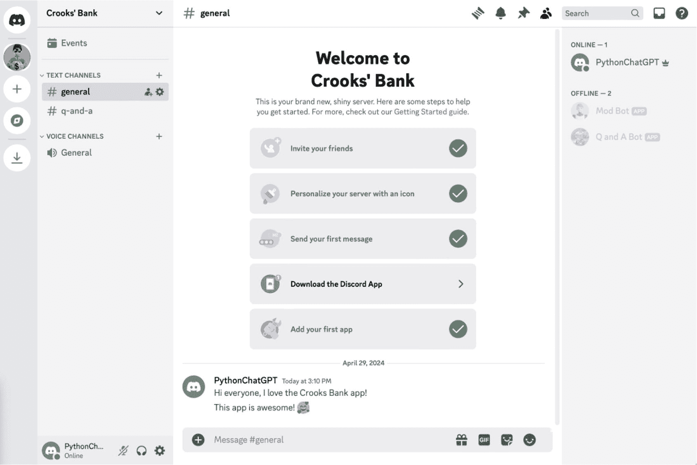

**图 8-1** 与我们的智能 Discord 内容审核机器人进行讨论：`content_moderator_bot.py`

清单 8-4 展示了我们与 Discord 机器人之间的对话，用于测试并查看其功能。

```
我：大家好，我喜欢 Crooks Bank 应用！
我：这个应用太棒了！
我：来我的网站！http://www.google.com
内容审核机器人：@PythonChatGPT 此评论被视为不适合本频道。如果您认为这是误判，请联系人工服务器管理员。
我：很抱歉违反了规则。我现在已经改过自新了
我：但我有个坏消息要告诉你们
我：我想☠所有人
内容审核机器人：@PythonChatGPT 此评论被视为不适合本频道。如果您认为这是误判，请联系人工服务器管理员。
```

**清单 8-4** 我们与智能审核 Discord 机器人的攻击性对话

在两种情况下，当不当内容发布到 Discord 服务器的任何频道时，不仅违规用户被点名，而且不良消息也被删除了。好机器人！

你注意到`Moderation`和`Chat`方法也能读取表情符号了吗？

## 结论

在本章中，我们为整个 Discord 服务器创建了一个功能完整的内容审核机器人！我们利用 OpenAI 的`Moderations`和`Chat`方法创建了一个自定义内容审核机器人，它不仅能够标记仇恨和威胁消息等不安全内容，还能防止 Discord 服务器的用户受到不必要的骚扰。


## 留给读者的练习

尽管我们在本章（以及本书中！）已经完成了许多工作，但仍有一项改进代码的工作可以做。例如：

- 我们创建的各个 Discord 机器人已经知道不响应自己发送的消息。然而，这些机器人还不知道它们不应该响应由**其他机器人**发送的消息。换句话说，如果你同时运行两个机器人，并且有人在“问答”频道中发布了不良内容，内容审核机器人当然会删除该消息并通知所有人消息已被删除。但是，由于技术支持机器人不知道它不应该响应其他机器人，它会尝试创建回复。当然，机器人之间不应该互相交谈。

## 索引

### A
- `AccuWeather API`
- `accuweather_forecaster.py`
- `带注释的数据`
- `API 密钥`
- `OpenAI API`
  - 清理响应
  - 模型列表
  - 系统级环境变量
  - 创建 `.env` 文件
  - 创建 `.gitignore` 文件
  - 硬编码
  - Linux
  - Mac OS
  - Windows
- `API 请求流程` (`SlackApiError`)
- `人工智能工具`
- `ASR` (参见 `自动语音识别 (ASR)`)
- `助手消息 (字典)`
- `audio_splitter.py` 应用
- `自动语音识别 (ASR)`

### B
- `机器人`
  - `Discord`
    - `ID 令牌`
    - 基本信息
    - `消息内容意图`
    - `OAuth2` 参数
    - 权限
    - 角色

### C
- `channel_reader_slack_bot.py`
- `ChatCompletion`
- `ChatCompletion 对象响应`
- `ChatGPT`
  - 用于避免阅读文档的 API
  - `聊天游乐场`
  - 下载的代码
  - 设计模式
  - 高效的结对编程伙伴
  - 用于检查 linting 错误的语言模型
  - `model_lister.py`
  - 结对编程伙伴 (参见 `结对编程伙伴`)
  - 使用 `Python` 设计模式的 `Python 代码`
  - `Python` 开发者
  - `工厂方法模式`
  - `观察者模式`
  - `单例模式` *对比* `正则表达式`
  - 响应
  - 软件开发
  - 远程医疗
  - `分词器`
- `ChatGPT API`
  - 带注释的数据
  - `DALL⋅E`
  - 数据模型定义
  - 嵌入模型
  - `GPT-3.5`
  - `GPT-4`
  - 遗留/弃用模型
  - 模型
  - 审核模型
  - 预训练模型
  - 预训练神经网络
  - 温度
  - 令牌
  - `TTS`
  - `Whisper` 模型
- `chatgpt_client_for_qa_and_moderation.py` 脚本
- `Python` 中的 `ChatGPT` 客户端
  - 创建 `chatgpt_client.py`
  - 运行脚本
- `聊天游乐场`
  - “/命令”
- `内容审核 AI`
  - `content_moderator_bot.py`
  - `moderation_client.py`
  - `OpenAI.moderations.create()` 方法
- `内容审核机器人`
  - `content_moderator_bot_dumb.py`
  - `content_moderator_bot.py`
  - 智能 `Discord` 审核机器人
  - `on_message(message)` 方法
- `上下文窗口`
- `协调世界时 (UTC)`
- `Core Weather 有限试用版`
- `Crook 银行`
- `cURL 命令`
- `客户支持`

### D
- `dalle_client.py`
- `DALL⋅E` 模型
  - 描述性
  - `OpenAI.images.generate()` 方法
  - 创建图像生成器
  - `dalle_client.py`
  - `DALL⋅E 生成的图像`
  - 方法参数
  - 请求体
  - 响应对象，结构
- `提示工程`
  - `GPT-4`
  - 使用 `GPT-4` 创建提示
  - 图像类型
- `数据模型`
- `Discord`
  - 频道
  - 社区平台
  - 确认、权限和能力
  - 创建频道
  - 生成的 URL
  - 注册新的 `Discord 机器人` 应用
  - 流媒体视频
  - 语音聊天
- `Discord 机器人`
  - “/命令”
  - `content_moderator_bot_dumb.py`
  - 带有 `Discord` 的 `content_moderator_bot_dumb.py`
  - `Discord ID 令牌`
  - 基本信息
  - `OAuth2` 参数
  - `onMessageReceived()` 方法
- `Discord 开发者` 网站
- `Discord ID 令牌`

### E
- `嵌入模型`
- 创建 `.env` 文件

### F
- `工厂方法模式`
- `FAQ.txt` 文件
- `FFmpeg`

### G, H
- `地理编码`
- 创建 `.gitignore` 文件
- `Google Maps API`
  - 应用仪表盘
  - `JavaScript API`
  - 库
  - 平台账户设置
  - `API 和服务`
  - 文档主页
  - 密钥和凭据选项卡
  - 路线
- `GPT-3.5`
- `GPT-4`

### I, J, K
- `IDE`
- `__init__` 方法

### L
- `语言模型`
- `遗留/弃用模型`

### M
- `审核机器人`
- `model_lister.py`
- `moderation_client.py`
- `审核模型`
- `多模态 AI`
  - 格式
  - `播客可视化工具`

### N
- `自然语言处理 (NLP)`
- `自然语言理解 (NLU)`
- `神经网络`
- `NLP` (参见 `自然语言处理 (NLP)`)
- `NLU` (参见 `自然语言理解 (NLU)`)

### O
- `观察者模式`
- `on_message(message)` 方法
- `on_message()` 方法
- `onMessageReceived()` 方法
- `OpenAI`
  - 添加消息
  - `API 密钥`
  - 助手字段
  - `聊天游乐场`
  - 库，安装/更新
  - 模型
  - 系统字段
  - 温度
  - 令牌
  - 用户字段
  - 用户消息
  - 查看代码
- `OpenAI.audio.transcriptions.create()` 方法
- `OpenAI.chat.completions.create()` 方法
  - 定义
  - 参数格式
- `OpenAI.images.generate()` 方法
- `OpenAI.models.list()`
  - 处理响应
  - `SyncPage` 结构
- `OpenAI.moderations.create()` 方法
  - 审核响应参数
  - `results.flagged` 节点
  - 审核响应的结构

### P
- `结对编程伙伴`
  - 到达时间和距离
  - `cURL 命令`
  - `departure-time` 参数
  - `Google Maps API`
  - *大量*文档
  - 天气应用
  - `AccuWeather API`
  - 生产力
  - 提示工程
  - 提示
- `播客可视化工具`
- `提示工程`
  - `提示 #1：“tl;dr”`
  - `提示 #2：“用三句话以内解释”`
  - `提示 #3：“我是经理。向我解释发生了什么”`
  - `提示 #4：“给我下一步行动的建议”`
- `Python`
  - `OpenAI APIs`
- `问答机器人应用` (参见 `问答机器人应用, Python`)

### Q
- `问答机器人应用, Python`
  - `Discord`
  - 特性
  - `on_message(message)` 方法
  - `tech_support_bot_dumb.py`

### R
- `正则表达式` *对比* `ChatGPT`
  - `NLP`
  - `NLU`
  - 正则表达式
  - 情感分析
  - 分离类型
- `正则表达式`

### S
- `send_message_from_discord()` 方法
- `情感分析`
- `单例模式`
- `Slack`
  - 客户支持
  - 查找频道 ID
  - 读取消息
  - `Slack API 令牌` (`SLACK_BOT_TOKEN`)
- `Slack 机器人应用`
  - 添加特性和功能
  - `API` 网站
  - 创建
  - 获取访问令牌
  - 安装，工作区
  - 邀请到频道
  - `Python`
  - `Slack` 实例
  - 指定 `OAuth` 范围
  - 查看 `OAuth 和权限` 页面
  - `Python Slack` 库，`slack_sdk`
- `系统消息 (字典)`

### T
- `tech_support_bot_dumb.py`
- `tech_support_bot.py` 脚本
  - 所做的更改
  - `ChatGPTClient` 对象实例化
  - `discord.Client()` 类
  - 外部文本文件 `FAQ.txt` 文件
  - 里程碑式的成就
  - `on_message()` 系统消息更新
- `tech_support_smart_bot.py`
- `远程医疗`
- `令牌`
- `工具消息 (字典)`
- `TTS`
- `消息类型`
  - 助手消息
  - 系统消息
  - 工具消息
  - 用户消息

### U, V
- `用户消息 (字典)`

### W
- `天气追踪器`
- `Whisper` 模型
  - `audio_splitter.py` 应用
  - 特性
  - 局限性
  - `OpenAI.audio.transcriptions.create()` 方法
  - `OpenAI` 模型
  - 播客
  - 请求体
  - 语音识别
  - 转录音频，`OpenAI.audio.transcriptions.create()` 方法
  - `whisper_transcriber.py`

### X, Y, Z
- `XP (极限编程)`
