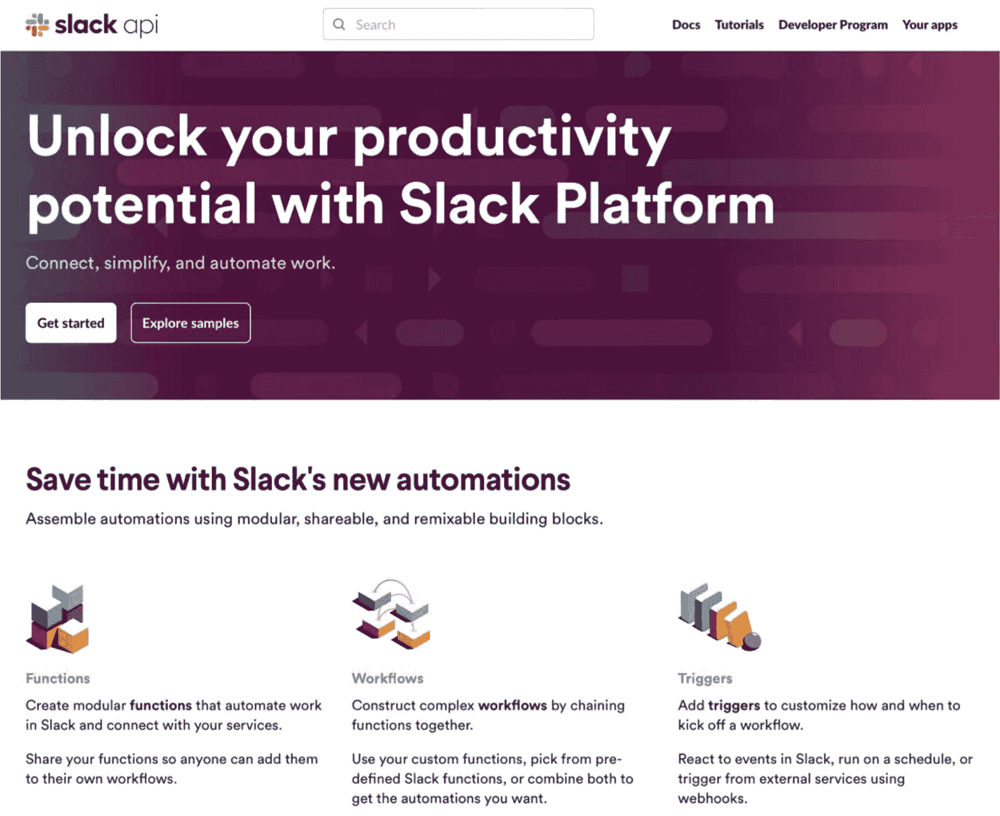
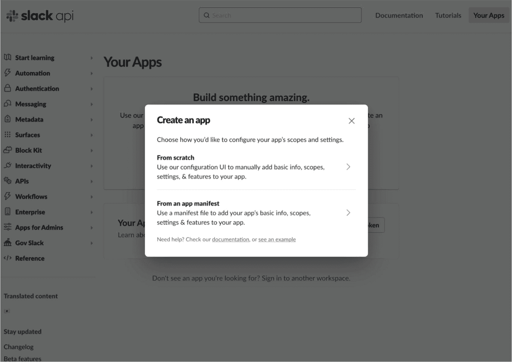
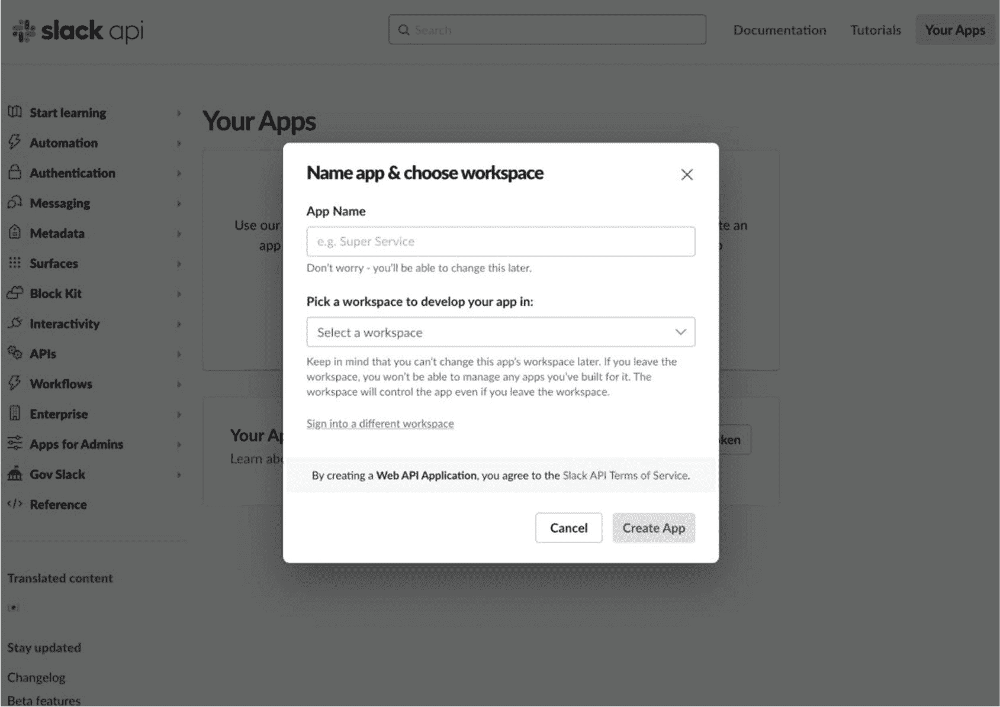
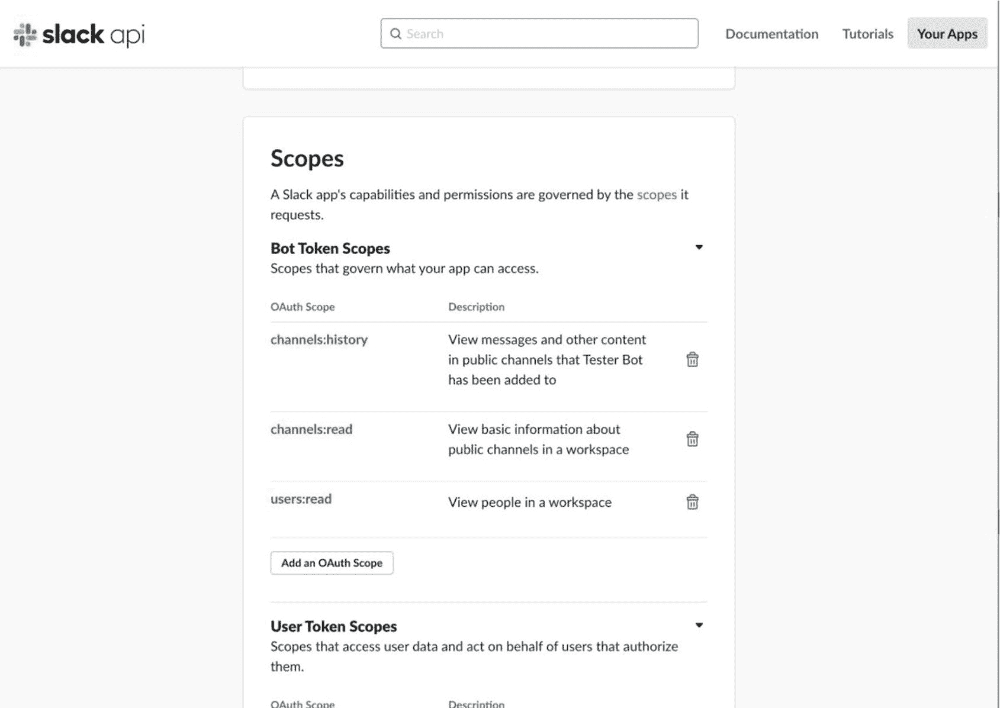
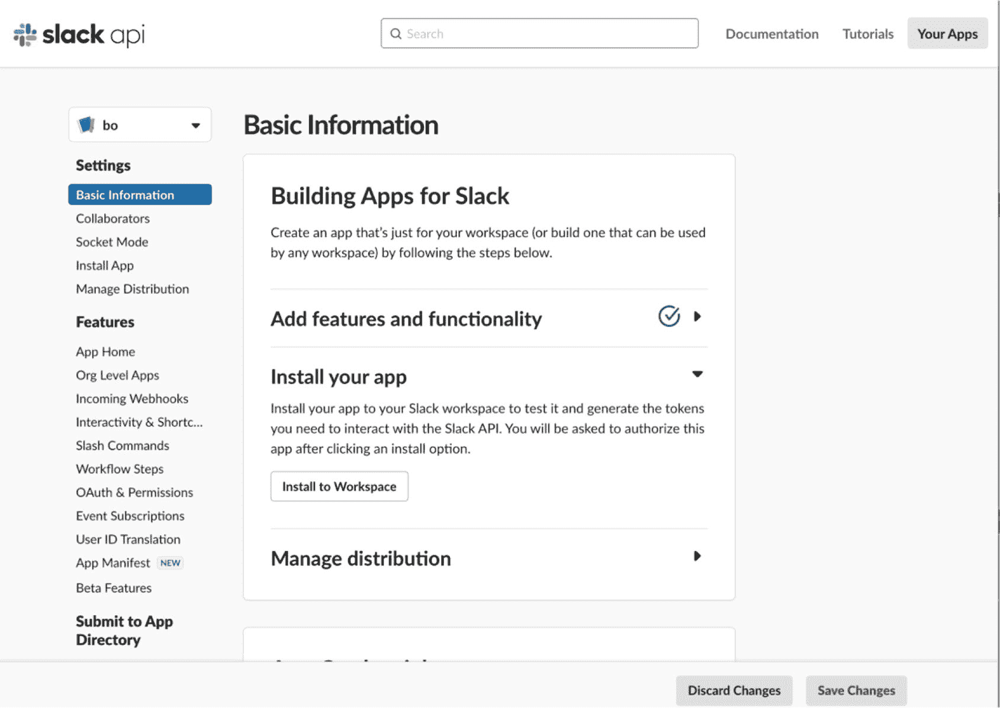
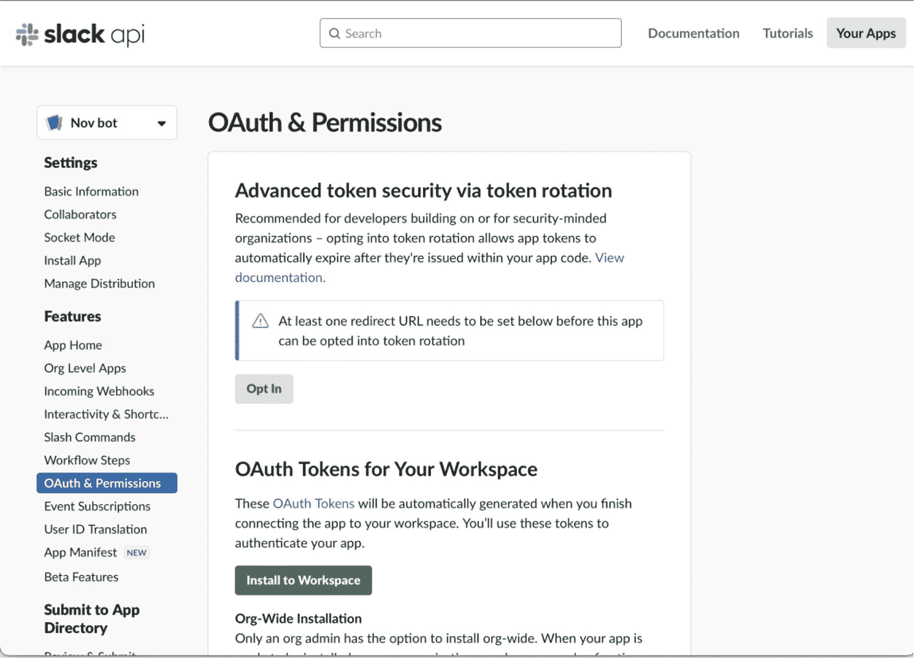
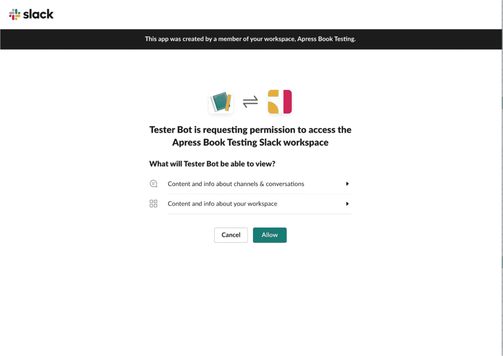
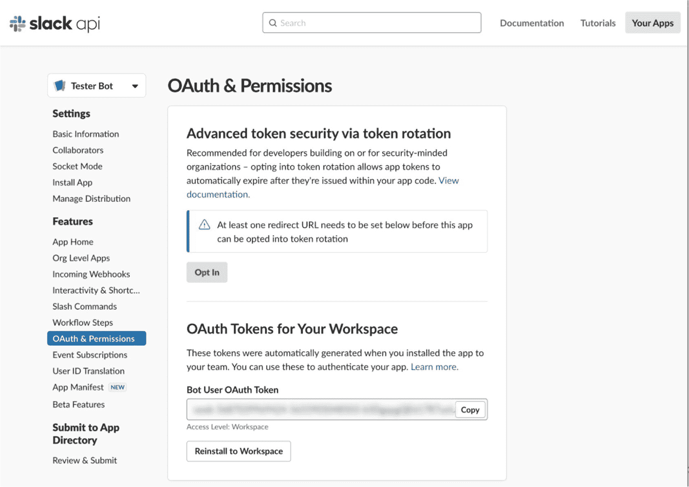
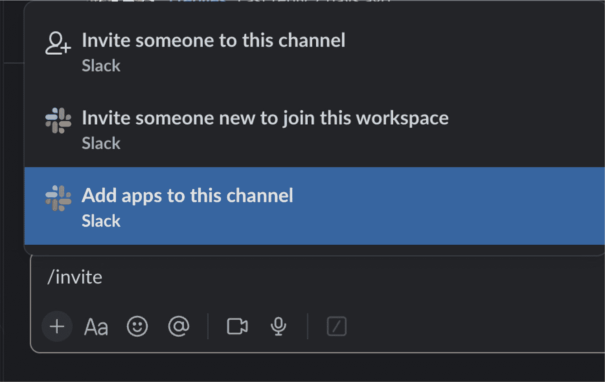

# 4. 在企业中使用 AI！为 Slack 消息创建文本摘要器

在当今的企业界，公司使用 Slack（或 Microsoft Teams）来组织自身，并将其作为公司内部所有人的中心沟通场所，这是非常普遍的现象。现在，如果你曾经使用过 Slack，我想你知道一个频道很容易因为公司或世界某个地方发生了某些重要事情而被大量消息淹没。

当然，你在公司承担的责任越多（例如，经理、团队负责人、架构师等），你被期望参与的频道就越多。在我看来，Slack 是一把双刃剑。你需要用它来完成工作，但作为开发者，你肯定不能在每日站会上说：“昨天，呃，我花了一整天读 Slack。没有遇到障碍。”

此外，如果你为一家客户遍布不同时区的公司工作（这在当今很常见），那么早上打开 Slack 看到大量在你离开键盘期间发布的消息，会让人感到相当沮丧。

因此，在本章中，我们将把 AI 应用于企业，使 Slack 更加有用。我们将利用上一章的代码，用 Python 创建一个 Slack 机器人，用于总结 Slack 频道中的重要对话。我们将利用 ChatGPT 的文本摘要能力，并更多地关注**提示工程**。

## 那么，什么是提示工程？

简单来说，提示工程就是精心设计和优化提示及输入参数，以指导和引导 ChatGPT 及其他 AI 模型行为的过程。它基本上是行业内用来描述创建正确输入以获得所需结果的术语。

## ChatGPT 会抢走所有人的饭碗（其实不然）

我个人的浅见是，世界上每家公司都坐拥一座未开发信息的金矿。如果你正在使用任何记录员工之间交流日志的系统、客户支持请求的数据库，或任何大型文本存储库（是的，这包括你的电子邮件、Microsoft Exchange 和企业版 Gmail），那么你就拥有一个等待被利用的大型非结构化文本存储库。

因此，ChatGPT 的最佳用途不是要消除任何人的工作。它应该被用来增强和扩展公司团队成员已经在做的事情。正如我们在上一章中看到的，作为一名程序员，ChatGPT 可以作为一个非常有效的结对编程伙伴。它也非常擅长高效快速地执行某些困难任务。因此，本章的项目涉及处理一个实际示例，展示如何利用大量非结构化文本源使其变得有用。

你可以使用在第 3 章中创建的 ChatGPT 客户端来运行本章后面列出的提示工程示例，也可以使用我们在第 1 章中讨论过的 Playground 模式。无论哪种方式，让我们直接开始吧。


## 审视真实世界的问题：软件公司的客户支持

让我们来看看软件开发中最艰巨的任务之一：提供技术支持。想象一下，整天接听来自可能因使用你的软件而感到沮丧、困惑或只是需要解决方案的人们的电话和信息，这该有多“美妙”。以下是客户支持为何如此棘手的一些原因：

-   众所周知，你的最终用户和客户在解释软件问题时非常不擅长。
-   一级技术人员通常是第一道防线，他们通常处理最基本的问题或用户错误。但当问题变得更复杂时，用户会被升级到二级。
-   中级是一个棘手的位置，因为他们比一级技术支持人员拥有更多的知识和经验；然而，他们没有机会直接从最终用户那里获得答案。
-   真正糟糕的问题会被升级到三级；然而，这些是最昂贵的技术支持人员，因为他们拥有最多的知识和经验。他们对代码以及服务器和基础设施都有实践经验。

那么，让我们以一个在 Slack 中典型的支持渠道内的真实对话为例。以下是虚构公司中团队成员及其角色的列表：

-   法蒂玛（客户服务代表）
-   约翰（软件工程师）
-   戴夫（项目经理）
-   基思（首席技术官）

下面的列表提供了一个软件初创公司团队成员之间的对话示例。客户服务代表法蒂玛让团队知道他们的应用在启动后立即崩溃（这可不是什么好问题）。首席技术官基思立即介入，升级了这个问题。

```
Fatima [16:00 | 02/08/2019]: 大家好，我有一个紧急问题需要讨论。我刚和一个客户通完电话，他们的应用一加载就崩溃。他们非常沮丧。我们能尽快解决这个问题吗？😫
Keith [16:01 | 02/08/2019]: 法蒂玛，感谢你提醒我们这个问题。我们马上处理。@John，既然我们的架构师今天生病请假了，你能带头调查这个问题吗？
John [16:02 | 02/08/2019]: 没问题，基思。我会深入代码库，看看能否找到导致崩溃的潜在原因。
John [16:02 | 02/08/2019]: 法蒂玛，你能从客户那里收集一些额外信息吗？问问他们具体的设备型号、操作系统以及最近是否安装了任何更新。
Fatima [16:03 | 02/08/2019]: 当然可以，约翰。我马上联系客户收集这些细节。有消息了我会通知大家。
Dave [16:04 | 02/08/2019]: 我理解情况的紧迫性。法蒂玛，我们一定要让客户了解我们的进展。在故障排除过程中，我们不想让他们感觉被蒙在鼓里。
Fatima [16:04 | 02/08/2019]: 肯定的，戴夫。我会定期向客户更新情况，告知他们我们发现的任何相关信息。
John [16:20 | 02/08/2019]: 我检查了代码库，到目前为止没有发现明显的问题。应用在加载时崩溃很奇怪。会不会是内存相关的问题？基思，我们最近有收到内存泄漏或高内存使用的报告吗？
Keith [16:22 | 02/08/2019]: 我会调出监控日志，约翰，检查最近的版本中是否有任何内存相关的异常。我查完再回复你。
Fatima [17:01 | 02/08/2019]: 各位，快速更新一下。客户使用的是运行 iOS 15.1 的 iPhone X。他们提到问题是在几天前更新应用后开始的。
Keith [17:05 | 02/08/2019]: 谢谢更新，法蒂玛。这是很有用的信息。约翰，我们重点在装有 iOS 15.1 的 iPhone X 模拟器上测试最新的应用更新，看看能否重现这个问题。
John [17:06 | 02/08/2019]: 好主意，基思。我马上设置模拟器并运行一些测试。
Keith [17:30 | 02/08/2019]: 约翰，在模拟器上重现问题有进展吗？
John [17:32 | 02/08/2019]: 有的，基思。我成功在模拟器上重现了崩溃。这似乎与 iOS 15.1 的兼容性问题有关。我怀疑是由于调用了一个已弃用的方法。我会修复它并运行更多测试来确认。
John [18:03 | 02/08/2019]: 修复了已弃用方法的问题，应用在加载时不再崩溃。看来我们已经找到并解决了问题。我会准备一个补丁发给你，基思，供你审查和部署。
Keith [18:04 | 02/08/2019]: 谢谢，请尽快把补丁发给我。我审查完后，我们会将修复部署到应用商店。
Dave [18:06 | 02/08/2019]: 干得好，团队！约翰，请让客户了解进展，并告知他们我们已准备好在下一次应用更新中为他们提供修复。有人能确保发布说明中反映这一点吗？
John [18:07 | 02/08/2019]: 我会的，戴夫。我会通知客户，确保他们知道即将到来的修复。
Keith [18:27 | 02/08/2019]: 补丁已审查并批准，约翰。请继续更新商店中的应用。我们争取在一小时内完成。
John [18:26 | 02/08/2019]: 明白，基思。我正在上传中。
Fatima [18:38 | 02/08/2019]: 我刚通知了客户关于修复的消息。他们松了一口气，并对我们的迅速响应表示感谢。感谢大家的协作和快速行动。能与如此能干的团队共事真是愉快！
Dave [18:40 | 02/08/2019]: 干得好，团队！非常感谢大家的努力。我们以创纪录的速度解决了这个紧急问题。让我们继续保持良好的工作状态！
列表 4-1
Slack 频道中试图分析客户问题的团队成员
```

## 提示工程入门：文本摘要

所以，不用说，没人愿意整天在 Slack 频道里滚动阅读那些“火烧眉毛”的问题。我们将利用 ChatGPT 的文本摘要能力。为简单起见，让我们尝试几个提示，将整个聊天消息列表发送给 ChatGPT，以便它为我们生成所有已发生事件的可用的摘要。


### 提示 #1：`“tl;dr”`

这个提示简短、精炼且直击要点。如果你不熟悉它，这是一个在网络上经常使用的术语，用来简要总结一篇长文章。它的字面意思是“太长，没读”（too long; didn’t read），这也是我在工作繁忙时，对 `Slack` 上许多对话的感受。方便的是，`ChatGPT` 能够理解这个简单的术语（我不一定称它为单词）作为提示，而且效果相当令人印象深刻。

```
System: You are a helpful assistant
User:  Fatima [16:00 | 02/08/2019]: Hey everyone, I have an urgent ...
User: Tl;dr
Model: gpt-4o
Temperature: 1
Maximum length: 360
Top P: 1
Frequency penalty: 0
Presence penalty: 0
Listing 4-2
PROMPT. 请求对较长对话的摘要版本
```

请注意，令牌数量被控制在较小的 360 个，这最终有助于 `ChatGPT` 生成简短的回复。同时，可以看到温度设置为 1（默认值），但 `Top P` 被增加到了最大值（即 1）。因此，调整温度和其他设置来控制 `ChatGPT` 回复的语气和多样性是很重要的。

下面的列表 4-3 展示了 `ChatGPT` 对列表 4-1 中对话的总结。

```
The team quickly responds to a client's app crashing issue. John investigates the codebase while Fatima gathers information from the client. They discover a compatibility issue with iOS 15.1 and John fixes it. The patch is reviewed and approved, and the app is updated in the store. The client is informed and grateful for the quick resolution. The team is praised for their collaboration and prompt action.
Listing 4-3
RESPONSE. 获取超长对话的摘要版本
```

太棒了！它将那段极长的对话缩减成了一个只有 68 个单词的简单摘要。如你所见，`ChatGPT` 并非要取代某个工作岗位，但它无疑能提高人们的工作效率。现在，让我们再试试几个提示，好吗？

### 提示 #2：`“用三句话或更少的话解释这个”`

那么，如果 `“tl;dr”` 提供的解释对你来说还不够简短，我们可以告诉 `ChatGPT` 让事情变得更简单。`ChatGPT` 在处理参数方面表现良好，所以让我们指定解释内容不能超过三句话。

```
System: You are a helpful assistant
User:  Fatima [16:00 | 02/08/2019]: Hey everyone, I have an urgent ...
User: Explain this in 3 sentences or less.
Model: gpt-4o
Temperature: 1
Maximum length: 250
Top P: 0
Frequency penalty: 0
Presence penalty: 0
Listing 4-4
PROMPT. 请求对较长对话的更短版本
```

你可能已经注意到，在这个例子中温度设置为 0.82。我们确实希望 `ChatGPT` 能给出一个简洁的答案，所以越“干巴巴”越好。

```
A customer reported an urgent issue of app crashes to the team. John investigates the issue and asks Fatima to gather additional information from the client. They discover that the issue is related to a compatibility problem with iOS 15.1\. John fixes the problem and Keith approves the deployment of the fix to the client's production environment.
Listing 4-5
RESPONSE. 获取三句话摘要
```

### 提示 #3：`“我是一名经理。向我解释发生了什么”`

当你不想成为那个唯一听不懂的人时，`ChatGPT` 能够重新表述已经说过的话，并将其分解，直到变得非常简单易懂。

```
System: You are a helpful assistant
User:  Fatima [16:00 | 02/08/2019]: Hey everyone, I have an urgent ...
User: Summarize this conversation and explain it to me like I'm a manager with little technical experience.
Model: gpt-4o
Temperature: 0.82
Maximum length: 750
Top P: 1
Frequency penalty: 0
Presence penalty: 0
Listing 4-6
PROMPT. 请求对更复杂对话的简化版本
```

同样，温度设置低于 1.0，以便 `ChatGPT` 能保持答案简洁易懂。我们增加了令牌长度，以便 `ChatGPT` 能有足够篇幅来解释一些可能涉及的技术概念。

```
In this conversation, Fatima brings up an urgent issue with a client who is experiencing app crashes as soon as they load it. Keith assigns John to investigate the issue since their architect is out sick. John asks Fatima to gather additional information from the client about their device, operating system, and recent updates. Dave emphasizes the importance of keeping the client informed throughout the troubleshooting process.
John checks the codebase but doesn't find any obvious issues, so he suspects it could be a memory-related problem. Keith agrees to check for memory-related anomalies in recent releases. Fatima provides an update that the client is using an iPhone X running iOS 15.1 and mentioned that the issue started after updating the app. Keith suggests testing the latest app update on an iPhone X simulator with iOS 15.1 to replicate the issue.
John successfully reproduces the crash on the emulator and identifies a compatibility issue with iOS 15.1, possibly due to a deprecated method call. He fixes the issue and prepares a patch for review and deployment. Keith approves the patch and asks John to update the app in the store. Dave requests that the client be kept informed and that the release notes reflect the upcoming fix.
John uploads the patch and informs the client about the fix. Keith reviews and approves the patch, and John proceeds with updating the app in the store. Fatima informs the client about the fix, and they express relief and gratitude for the prompt response. Dave commends the team for their collaboration and quick action, emphasizing the importance of maintaining good work.
In summary, the team quickly addressed an urgent issue where a client's app was crashing on load. They investigated the issue, identified a compatibility problem with iOS 15.1, fixed it, and prepared a patch for deployment. The client was kept informed throughout the process, and the fix was successfully implemented, resulting in a relieved and grateful client.
Listing 4-7
RESPONSE. 获取更复杂对话的简化版本
```


### 提示 #4：“给我下一步行动建议”

除了生成更易于理解的摘要外，`ChatGPT` 还能以不同的风格和“语气”进行解释。我们将把 `Top P` 提高到 `0.75`，因为我们希望 `ChatGPT` 能比默认设置考虑更多可能性。我们还将把 `存在惩罚` 提高到 `0.5`，因为我们希望鼓励生成多样化的回复。

```
系统：你是一个乐于助人的助手
用户：Fatima [16:00 | 02/08/2019]：大家好，我有一件紧急的事情……
用户：我是公司的 QA 工程师。请给我下一步行动的建议。
模型：gpt-4o
温度：1
最大长度：1200
Top P：0.75
频率惩罚：0
存在惩罚：0.5
清单 4-8
提示。向 ChatGPT 询问最佳下一步行动建议
```

```
作为一名 QA 工程师，以下是下一步行动的一些建议：
1. 测试补丁：一旦补丁部署到应用商店，在各种设备和操作系统上对其进行彻底测试，以确保问题已解决，并且没有引入新的错误或回归问题。
2. 进行回归测试：除了测试特定问题外，还要执行全面的回归测试，以确保修复不会对应用的其他功能产生任何意外的副作用。
3. 向客户沟通修复情况：随时向客户更新进展，并告知他们修复程序已在最新的应用更新中可用。向他们提供如何更新应用的清晰说明，并鼓励他们也在自己那边进行测试。
4. 监控用户反馈：在修复程序部署后密切关注用户反馈。鼓励用户报告他们遇到的任何问题，并主动及时解决这些问题。
5. 记录问题和解决方案：创建一份详细报告，记录问题、重现和解决该问题所采取的步骤，以及任何其他相关信息。这将作为未来故障排除的参考，并有助于改进开发流程。
6. 进行事后分析：在问题解决且修复程序部署后，安排一次与团队的事后分析会议，讨论根本原因、经验教训以及可以实施的流程改进，以防止将来出现类似问题。
7. 持续改进：将此事件视为一个机会，识别开发和测试流程中需要改进的领域。评估是否可以做出任何更改，以防止将来发生类似问题。
请记住，开放的沟通、协作和持续学习是确保应用最高质量并与客户保持牢固关系的关键。
清单 4-9
响应。ChatGPT 关于可能下一步行动的建议
```

当然，`ChatGPT`（就像地球上所有其他形式的人工智能一样）并非完全完美。例如，第三条建议是一个有效的待办事项，但通常 QA 人员并不负责直接与客户沟通。这种沟通可以通过技术支持或拥有沟通渠道的产品经理来完成（尤其是当客户非常重要时）。所以，这个建议本身没问题，但对于公司中担任该角色的人来说并不合适。

### 让我们谈谈真正的提示工程

如果你在谷歌上搜索“提示工程”这个词，你会找到大量的示例、博客，甚至还有提供订阅计划的完整网站，它们会试图说服你，完美的提示只需通过纯文本就能创建。正如你从上面的示例中看到的，提示工程不能仅仅通过精心设计文本输入来完成。

实际上，这个过程很像烹饪一道精致的菜肴。想象一下，例如，只用盐作为调味料，而忽略所有其他配料和香料来烹饪勃艮第牛肉！老实说，结果与真正的菜肴相比会相形见绌。

类似地，尝试组建一个完整的管弦乐队，却只使用一种乐器和一位音乐家。那是一个尴尬的“一人乐队”。因此，仅仅调整提示文本不足以真正执行提示工程。诸如模型的`温度`（控制随机性）、`Top P`（影响令牌概率）、所使用的特定模型、令牌数量以及其他参数，都在获得出色响应中扮演着至关重要的角色。

本书并非关于提示工程，因为（从上面的解释可以看出）它确实涉及几个与 Python 无关的因素。但是，我们强烈建议你尝试 OpenAI 提供的模型中的*所有*参数，以找到最适合你用例的设置。

## 注册一个 Slack 机器人应用

现在我们已经了解了`ChatGPT`为我们总结大量文本的各种方法，接下来看看在 Python 中创建一个简单的机器人所需的条件，该机器人将能够以编程方式抓取 Slack 实例中某个频道内的所有消息。

**注意**

要完成这些步骤，你需要拥有对 Slack 工作区的管理权限。大多数开发者**不会**拥有这些级别的权限；因此，为了充分进行实验，我建议你创建自己的个人 Slack 工作区用于测试目的。这样，你将拥有安装 Slack 机器人的所有权限。

但是，一步一步来。首先，我们要创建我们的 Slack 机器人应用，所以前往 Slack API 网站：

[`https://api.slack.com/`](https://api.slack.com/)



**图 4-1** 要创建 Slack 机器人，请前往 Slack API 网站

当然，你需要有一个 Slack 账户才能使其工作，所以如果你还没有，需要先创建一个。

登录后，转到页面右上角，导航到“你的应用 > 创建你的第一个应用”，如上图 4-1 所示。在 Slack 术语中，“机器人”就是一个“应用”，并且机器人必须先向 Slack 注册，才能在一个 Slack 实例上运行。



**图 4-2** 为 Slack 创建一个新的机器人应用

如上图 4-2 所示，你将被带到**你的应用**页面，在那里你可以管理你的 Slack 应用。你会立即在屏幕中央看到一个弹出窗口，上面有一个**创建应用**按钮。

选择**从头开始**创建你的应用的选项。这是因为我们希望自己能够操控应用的所有细节，而不被一堆默认设置弄得过于复杂。

之后，系统会提示你为你的机器人指定一个名称，并选择你希望机器人有权访问的工作区，如下图 4-3 所示。

点击**创建应用**按钮继续。



**图 4-3** 为 Slack 创建一个新的机器人应用


### 通过设置作用域来指定机器人能（和不能）做什么

现在，你将看到一个包含大量 Slack 工作区机器人选项的屏幕。不过，你需要做的第一件事是，从左侧边栏点击 **OAuth 与权限**。

我们的机器人将非常简单；它只需要读取某个频道中的消息，以便为我们提供讨论内容的摘要。除了读取消息，我们还需要知道 Slack 工作区中人员的姓名，否则我们将获得人员的 UUID 表示形式，而不是他们的姓名，这对我们来说毫无意义。

因此，向下滚动，为你的 Slack 机器人添加以下 OAuth 作用域，如下图 4-4 所示。



图 4-4

为 Slack 机器人应用添加作用域

- `channels:history`
- `channels:read`
- `users:read`

### 确认你的设置

为你的机器人添加了适当的作用域后，向上滚动并从左侧边栏点击**基本信息**。

在接下来的页面上，你会看到“添加特性和功能”旁边现在有一个绿色的勾选标记，这确认了你已正确添加作用域，如下图 4-5 所示。



图 4-5

确认你的设置

### 查看 OAuth 与权限页面

如下图 4-6 所示，导航到 **OAuth 与权限**页面，然后点击“安装到工作区”按钮。



图 4-6

OAuth 与权限屏幕

### 将你的 Slack 机器人应用安装到工作区

现在所有权限都已请求完毕，是时候将你的机器人安装到工作区了。在安装过程中，你应该会看到如下图 4-7 所示的屏幕。



图 4-7

*“安装”一个新的* *Slack 机器人应用*

点击**允许**按钮以授权机器人并允许你在上一步中分配的权限。

注意

理解这里“安装”的含义很重要。在传统的 Python 意义上，安装应用意味着将你的文件和依赖项复制到另一台机器并执行它。这里的情况并非如此。

在这里，当你“安装”一个机器人应用时，你是在启用你的 Slack 工作区，允许一个应用加入该工作区——仅此而已。你的机器人代码将在你自己的机器上运行，而不是在 Slack 的服务器上。

### 获取你的 Slack 机器人（访问）令牌

这次，“令牌”实际上指的是访问令牌！为了以编程方式连接到 Slack API 并访问消息和用户信息，你需要一个为你的 Slack 机器人生成的特定 OAuth 令牌。



图 4-8

为你的 Slack 机器人应用复制 OAuth 令牌

回到 **OAuth 与权限**页面，请务必从此页面复制机器人令牌（通常以 `xoxb-` 开头），如下图 4-8 所示。

### 将你的机器人邀请到频道

接下来，你将进入想要用来测试机器人的频道，并在该频道中输入以下命令。

```
/invite
```

选择“将应用添加到此频道”选项，然后选择你之前在向 Slack 注册机器人时指定的 Slack 机器人名称。



图 4-9

将你的 Slack 机器人添加到一个频道

恭喜！你现在已成功向 Slack 注册了一个 Slack 机器人应用，使其能够读取你工作区中的消息，并将该 Slack 机器人添加到了一个频道。在我们编写 Python 代码来访问工作区中的频道之前，我们需要知道 Slack 用于我们频道的内部 ID。

## 查找你频道的频道 ID

好的，这是一个简单的步骤。在 Slack 中，右键单击你的频道名称，然后选择“查看频道详细信息”选项。弹出窗口的底部就是你的频道 ID。复制该编号并保存以备后用。你的 Python 应用将需要它来加入 Slack 工作区中的正确频道。

## 使用你的 Slack 机器人应用自动抓取频道中的消息

好了，既然我们已经完成了所有先决条件并且知道了频道的 ID，让我们开始编写 Python 代码来访问特定 Slack 频道中的所有消息。

### 使用 `slack_chat_reader_bot.py` 以编程方式从 Slack 读取消息

首先，你需要安装官方的 Python Slack 库 `slack_sdk`。你可以像这样使用 `pip install`：

```
pip install slack_sdk
```

清单 4-10 是一个简单的 Python Slack 机器人，它获取指定时间段内频道中每条帖子的用户名、时间戳和消息内容。

```
from slack_sdk import WebClient
from slack_sdk.errors import SlackApiError
from datetime import datetime, timezone

#### 定义你的 Slack API 令牌
SLACK_BOT_TOKEN = "YOUR_SLACK_API_TOKEN"

#### 初始化一个 WebClient 实例
client = WebClient(token=SLACK_BOT_TOKEN)

#### 定义你的频道 ID
channel_id = "YOUR_CHANNEL_ID"

#### 以 UTC 时间定义开始和结束时间
start_time_utc = datetime(2024, 8, 3, 10, 0, tzinfo=timezone.utc)
end_time_utc = datetime(2024, 8, 12, 15, 0, tzinfo=timezone.utc)

#### 将开始和结束时间转换为 Unix 时间戳
start_time_unix = int(start_time_utc.timestamp())
end_time_unix = int(end_time_utc.timestamp())

try:
    # 使用 WebClient 调用 conversations.history 方法
    response = client.conversations_history(
        channel=channel_id,
        oldest=start_time_unix,
        latest=end_time_unix,
    )

    # 检查 API 调用是否成功
    if response["ok"]:
        # 反转消息列表以按时间顺序获取
        messages = reversed(response["messages"])
        for message in messages:
            user_id = message.get("user")
            timestamp = datetime.fromtimestamp(float(message.get("ts")), tz=timezone.utc)
            user_info_response = client.users_info(user=user_id)
            if user_info_response["ok"]:
                user_name = user_info_response["user"]["name"]
                print("用户:", user_name)
                print("时间戳:", timestamp)
                print("消息:", message.get("text"))
                print()
            else:
                print("获取用户信息失败:", user_info_response["error"])
    else:
        print("获取消息失败:", response["error"])
except SlackApiError as e:
    print(f"错误: {e.response['error']}")
```

清单 4-10

`slack_chat_reader_bot.py`

让我们一起来浏览这段代码。首先，我们导入与 Slack API 交互和管理日期/时间数据所需的基本模块。然后，我们定义了身份验证所需的 Slack API 令牌（`SLACK_BOT_TOKEN`）以及目标 Slack 频道的 ID（`channel_id`）。

接下来，我们建立消息检索窗口的开始和结束时间，并以协调世界时（UTC）指定它们。我们的脚本将这些时间值转换为 Unix 时间戳，因为 Slack API 期望消息检索使用此格式的时间戳。

如果 API 调用成功，我们的脚本将继续提取和处理消息。消息按时间顺序呈现，以便最早的消息首先出现。为了保持整洁，对于每条消息，脚本会检索用户 ID 和消息时间戳。然后，它使用 `client.users_info` 方法获取有关发送消息的用户的更多信息。

如果在 API 请求过程中出现任何错误（`SlackApiError`），脚本会捕获并处理它们，打印一条错误消息。

清单 4-11 显示了执行 `slack_chat_reader_bot.py` 后的输出，此处已截断，因为你已在本章前面的清单 4-1 中获得了完整文本。


```  
Fatima [2023-08-11T09:04:20] : 大家好，我有个紧急问题需要讨论。我刚和一位客户通完电话，他们的应用一加载就崩溃。客户非常沮丧。我们能尽快解决这个问题吗？:tired_face:  
Keith [2023-08-11T09:04:35] : 感谢你提醒我们，Fatima。我们马上处理这个问题。John，既然我们的架构师今天生病请假了，你能牵头调查这个问题吗？  
John [2023-08-11T09:04:52] : 没问题，Keith。我会深入代码库，看看能否找到导致崩溃的潜在原因。  
John [2023-08-11T09:05:30] : Fatima，你能从客户那里收集一些额外信息吗？问问他们具体的设备型号、操作系统，以及最近是否安装了任何更新。  
...  
清单 4-11  
执行 `slack_chat_reader_bot.py` 的输出  
```  

## 留给读者的练习  

显然，我们还可以做一些额外的工作，这些步骤将留给您（读者）来完成，例如：  

*   将 `slack_chat_reader_bot.py` 中从 Slack 读取消息的代码连接到 `chatgpt_client.py`，以便将抓取消息和获取摘要合并为一步操作。  

*   为 Slack 机器人本身增加更多功能，例如添加命令，使频道中的任何人都可以请求摘要。在当前状态下，机器人不会在频道中发布任何内容。然而，机器人的“用户界面”就是频道本身；因此，用户应该能够通过输入命令（例如请求摘要）与 Slack 机器人进行交互。  

*   确保机器人不会让糟糕的情况变得更糟。每当机器人提供摘要时，它不应在频道内发布，因为这可能会给已经嘈杂的环境增加更多噪音。最佳实践是让机器人向请求摘要的人（或您创建的任何新命令的发起者）发送私密消息。  

## 结论  

在本章中，我们讨论了人工智能在企业中实际应用的多种方式之一。我们探讨了什么是真正的“提示工程”，指出提示工程不能仅通过向 ChatGPT 输入文本就能完成。为了正确且有效地进行提示工程，您必须理解 ChatGPT API 所有输入参数的影响。  

利用我们学到的提示工程知识，我们成功地对提供的任何大段文本进行了摘要。最后，我们看到了运行自动化机器人所需的代码，该机器人可以在指定有效日期范围的情况下，以编程方式从任何 Slack 频道抓取消息。  

在本章（以及前一章）中，我们专门使用了 OpenAI API 的聊天补全模型。在下一章中，我们将通过实验 Whisper 和 DALL·E 模型来突破可能的边界。  

