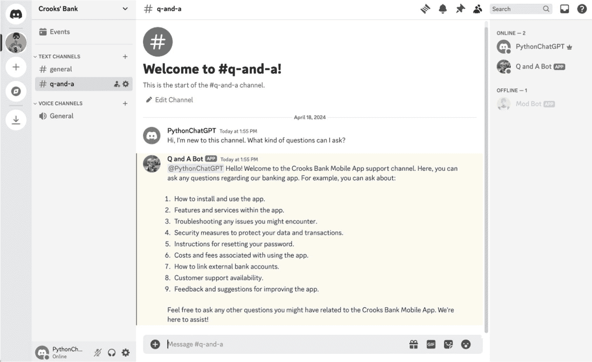

# 7. 为我们的 Discord 机器人增加智能，第 1 部分：使用聊天模型进行问答

至此，我们已经具备了所有结构，可以使我们在上一章创建的两个 Discord 机器人功能完备且具备人工智能，这正是我们在本书最后几章要做的事情。本章的重点是我们的技术支持机器人，它被称为 `tech_support_bot_dumb.py`。以下是我们要做的两个主要更改：

- 修改我们的 `chatgpt_client.py` 脚本，使 Discord 机器人脚本能够就我们提供的特定信息进行提问。更新后的文件将是一个名为 `chatgpt_client_for_qa_and_moderation.py` 的类。它将在本章用于问答目的，并且也将在本书的最后一章中使用。

- 修改我们的 `tech_support_bot.py` 脚本（原名为 `tech_support_bot_dumb.py`），使其能够加载一个包含常见问题及解答的外部文本文件。然后，该脚本会将文本文件的内容提供给 `chatgpt_client_for_qa_and_moderation.py` 脚本中的 `ChatGPTClient` 类，该类负责创建提示词，并当然会调用 OpenAI Python API 的聊天对象。


## 让 `tech_support_bot.py` 更智能

代码清单 7-1 包含了虚构客服团队根据新推出的手机银行应用用户工单所创建的常见问题解答的完整内容。

- ```
  账户管理：查看账户余额、交易记录等。
  ```

- ```
  转账：轻松在您的账户之间或向其他银行账户转账。
  ```

- ```
  账单支付：支付账单并管理定期付款。
  ```

- ```
  存入支票：拍摄支票照片进行远程存款。
  ```

- ```
  ATM 定位器：查找附近的 ATM 和分行。
  ```

- ```
  通知：接收账户活动和重要更新的提醒。
  ```

```
1. 什么是克鲁克斯银行手机应用？
克鲁克斯银行手机应用是一款尖端的手机银行应用，让您能够方便地通过移动设备管理财务、进行交易以及访问广泛的银行服务。
2. 如何下载克鲁克斯银行手机应用？
您可以从 iOS 设备的 App Store 和 Android 设备的 Google Play 下载克鲁克斯银行手机应用。只需搜索“克鲁克斯银行手机应用”并点击“安装”按钮即可。
3. 克鲁克斯银行手机应用安全可靠吗？
是的，克鲁克斯银行手机应用将您的安全放在首位。我们使用最先进的加密和安全协议来保护您的数据和交易。您的信息在我们这里很安全。
4. 克鲁克斯银行手机应用提供哪些功能？
克鲁克斯银行手机应用提供多种功能，包括：
代码清单 7-1
FAQ.txt
```

```
5. 我可以在克鲁克斯银行手机应用中关联外部账户吗？
可以，克鲁克斯银行手机应用支持关联其他金融机构的外部账户。您可以在一个地方监控和管理来自不同银行的账户。
6. 如果我忘记密码，如何重置？
如果您忘记密码，只需在登录屏幕上点击“忘记密码”选项。您将收到关于如何重置密码的说明。
7. 克鲁克斯银行手机应用有哪些相关费用？
克鲁克斯银行手机应用力求费用透明。您可以在应用内的“费用”部分或我们的网站上找到关于账户费用、交易手续费和其他成本的信息。
8. 我可以通过克鲁克斯银行手机应用获得客户支持吗？
当然可以！我们通过应用内的消息功能提供客户支持。您也可以在我们的网站上找到我们的客户服务联系方式。
9. 克鲁克斯银行手机应用适用于企业账户吗？
克鲁克斯银行手机应用主要满足个人银行需求。不过，我们计划在未来推出企业银行服务。
10. 我如何为克鲁克斯银行手机应用提供反馈或建议？
我们欢迎您的反馈！您可以通过应用内或我们网站上的“联系我们”部分提交建议和反馈。
```

正如您在代码清单 7-1 的 `FAQ.txt` 文件中看到的，这里并没有什么魔法。它只是一个问题和答案的列表。现在，让我们看看新修改的 `tech_support_bot.py` 类。这体现在代码清单 7-2 中。

```
"""
tech_support_bot.py
一个与 ChatGPT 集成的 Discord 机器人，用于在指定频道中自动回复。
此脚本使用 discord.Client() 类初始化一个 Discord 机器人，并监听诸如消息发送等事件。
当在指定频道收到消息时，机器人会调用 ChatGPT 根据消息内容生成回复，并将回复发送回同一频道。
要求：
- discord (https://pypi.org/project/discord.py/)
- chatgpt_client (假定为提供与 ChatGPT 交互的自定义模块)
用法：
1. 将 DISCORD_TOKEN 变量替换为您从 Discord 开发者门户获取的机器人令牌。
2. 调整 CHANNEL_TO_WATCH 变量以指定机器人应监控和交互的频道名称。
3. 确保 chatgpt_client 模块已正确实现且可访问。
注意：此脚本假定存在一个 chatgpt_client 模块用于与 ChatGPT API 交互。
"""
import discord
from chatgpt_client_for_qa_and_moderation import ChatGPTClient
### 用于身份验证的机器人令牌
DISCORD_TOKEN = ''
### 机器人应监控和交互的频道名称
CHANNEL_TO_WATCH = 'q-and-a'
### 初始化 Discord 客户端
discord_client = discord.Client()
### 为 ChatGPT 创建系统消息
system_message_to_chatgpt = "You are a virtual assistant that provides support for the Crooks Bank banking app."
with open('FAQ.txt', 'r', encoding='utf-8') as file:
    # 将文件的全部内容作为一个字符串读入变量
    file_contents = file.read()
### 初始化 ChatGPT 客户端
chatgpt_client_for_qa_and_moderation = ChatGPTClient(system_message_to_chatgpt, file_contents)
### 机器人就绪时的事件处理程序
@discord_client.event
async def on_ready():
    """
    当机器人成功登录并准备好接收事件时触发的事件处理程序。
    """
    print('已登录为', discord_client.user)
    print('------')
### 收到消息时的事件处理程序
@discord_client.event
async def on_message(message):
    """
    收到消息时触发的事件处理程序。
    参数：
    message (discord.Message)：机器人收到的消息。
    返回：
    None
    """
    # 忽略机器人自己发送的消息，以防止自我回复
    if message.author == discord_client.user:
        return
    # 忽略不在指定“tech-support”频道中的消息
    if isinstance(message.channel, discord.TextChannel) and \
            message.channel.name != CHANNEL_TO_WATCH:
        return
    async with message.channel.typing():
        # 调用 ChatGPT 根据收到的消息生成回复
        response_from_chatgpt = chatgpt_client_for_qa_and_moderation.send_message_from_discord(message.content)
        # 构建一条提及消息作者并附加 ChatGPT 回复的回复
        reply = f'{message.author.mention} {response_from_chatgpt}'
        # 将回复发送到收到原始消息的同一频道
        await message.channel.send(reply)
### 使用提供的令牌运行机器人
discord_client.run(DISCORD_TOKEN)
代码清单 7-2
tech_support_smart_bot.py
```

## 与之前版本技术支持机器人相比的重要变化

让我们简要分析一下 `tech_support_smart_bot.py` 并讨论所做的更改。代码片段清单 7-3 包含了完整清单的一部分。

```
### 为 ChatGPT 创建系统消息
system_message_to_chatgpt = "You are a Q and A bot for a discord group dedicated to the banking app, Crook's Bank"
with open('FAQ.txt', 'r', encoding='utf-8') as file:
    # 将文件的全部内容作为一个字符串读入变量
    file_contents = file.read()
代码清单 7-3
为 tech_support_bot.py 设置系统消息和常见问题解答信息
```

如您所见，我们同时做了几件事。

首先，正如我们从本书前几章中学到的，您可以通过在提示中为系统本身提供一条特定消息来显著设定对话的基调。因此，我们这里有一个包含系统消息的变量。

接下来，我们定义了另一个变量，它提供了存储常见问题解答文件的路径位置引用。然后我们简单地读取了文件——就这么简单。


### `on_message(message)` 函数的更新

当收到消息时，请务必注意以下几行代码：

```
@discord_client.event
async def on_message(message):
```

此函数是我们 Discord 机器人的核心部分。每当我们的 Discord 服务器中发布一条消息时，就会调用 `on_message()` 函数。这里的 `async` 关键字很重要，因为它使得 `on_message()` 能够被异步调用，这正是我们想要的，即每当有消息发布时都能及时响应。

**注意**

快速回顾一下同步通信与异步通信的区别。同步通信的一个典型例子是使用网页浏览器访问网络服务器。一旦你发送请求，就需要等待直到收到响应。要查看不同的网站，你需要再次发送请求并再次等待响应。

异步通信的一个好例子是给朋友或同事发送电子邮件。你可以给朋友发送 1 封、2 封、5 封、10 封甚至 1000 封邮件，但他们不一定在*等待*你的邮件。换句话说，由于电子邮件的运作方式，他们不会陷入“等待模式”并一直等着你发送内容。当邮件到达时，你的朋友会收到通知。

因此，每当我们的 Discord 服务器中发布一条消息时，就会调用 `on_message()` 函数，并将消息本身作为函数参数传入。

现在，让我们进一步分析 `tech_support_bot.py` 中的以下代码：

```
async with message.channel.typing():
#### 调用 ChatGPT 根据收到的消息生成回复
response_from_chatgpt = chatgpt_client_for_qa_and_moderation.send_message_from_discord(message.content)
#### 构建一条提及消息作者并附加 ChatGPT 回复的回复消息
reply = f'{message.author.mention} {response_from_chatgpt}'
```

在这里，我们提供了良好的用户体验，在用户的问题被发送到 ChatGPT 的同时，向用户显示机器人正在“输入”。当收到回复后，我们将回复内容返回给用户。

## 分析 `chatgpt_client_for_qa_and_moderation.py`

现在，当我们进一步查看上面的代码清单 7-2 时，`tech_support_bot.py` 在 `chatgpt_client_for_qa_and_moderation.py` 脚本中实例化了 `ChatGPTClient` 对象，该脚本（正如我们之前所述）与我们之前使用的 `chatgpt_client.py` 脚本非常相似。`chatgpt_client_for_qa_and_moderation.py` 的完整源代码如代码清单 7-4 所示。

```
import os
from dotenv import load_dotenv
from openai import OpenAI
class ChatGPTClient:
def __init__(self, system_message, initial_instructions_to_chatgpt):
### 从 .env 文件加载环境变量
load_dotenv()
### 使用环境变量中的 API 密钥
self.client = OpenAI()
self.system_message = system_message
self.initial_instructions_to_chatgpt = initial_instructions_to_chatgpt
def send_message_from_discord(self, user_message):
response = self.client.chat.completions.create(
model="gpt-4",
messages=[
{
"role": "system",
"content": f'{self.system_message}'
},
{
"role": "user",
"content": f'{self.initial_instructions_to_chatgpt}'
},
{
"role": "user",
"content": f'{user_message}'
}
],
temperature=0.85,
max_tokens=1921,
top_p=1,
frequency_penalty=0,
presence_penalty=0
)
condensed_response = response.choices[0].message.content
return condensed_response
代码清单 7-4
chatgpt_client_for_QA_and_moderation.py
```

### 解析 Python 中的 `ChatGPTClient` 类，以便我们的机器人能够利用 ChatGPT

我们创建的 Python 类 `ChatGPTClient` 在将 OpenAI API 集成到我们的 Discord 机器人中扮演着关键角色。让我们来看看它的优势：

该类在设计上考虑了模块化，封装了与 ChatGPT 交互的所有功能。在 `__init__` 方法中，我们初始化客户端，传入系统消息和 `FAQ.txt` 的内容，并从 `.env` 文件中加载 OpenAI API 密钥。

通过 `send_message_from_discord()` 方法，该类简化了与 ChatGPT 的通信。由于对象在构建时已经包含了系统消息的初始指令，Discord 用户的消息会被作为用户消息放入提示中，这样我们就可以通过编程方式将用户的问题发送给 ChatGPT。

`send_message_from_discord()` 方法并不限制我们对该类的使用场景。目前，我们将其用于问答；然而，任何使用该类的机器人都可以出于任何目的以任何方式向 ChatGPT 发送提示。

最后，我们通过提取生成消息的内容并返回精简版本来高效处理来自 OpenAI API 的响应。这使得我们的 Discord 机器人能够仅回复我们所需的信息，而不是聊天模型返回的完整响应。这通过一行代码即可实现：

```
condensed_response = response.choices[0].message.content
```

### 运行我们的智能问答机器人：`tech_support_bot.py`

现在，让我们运行我们全新改进的 Python Discord 问答机器人 `tech_support_bot.py`。执行应用程序后，请务必返回你的 Discord 服务器并开始提问。图 7-1 展示了机器人的运行情况。



**图 7-1** 与我们的智能 Discord 问答机器人 `tech_support_bot.py` 进行对话

代码清单 7-6 展示了我们与 Discord 机器人之间的对话。

```
我：你好，我是这个频道的新用户。我可以问哪些类型的问题？
问答机器人：你好！欢迎来到克鲁克斯银行移动应用支持频道。在这里，你可以询问任何关于我们银行应用的问题。例如，你可以询问：
1. 如何安装和使用该应用。
2. 应用内的功能和服务。
3. 解决你可能遇到的任何问题。
4. 保护你的数据和交易的安全措施。
5. 重置密码的说明。
6. 使用应用的相关费用。
7. 如何关联外部银行账户。
8. 客户支持的可用时间。
9. 改进应用的反馈和建议。
请随时提出任何其他与克鲁克斯银行移动应用相关的问题。我们随时为你提供帮助！
我：我有一部旧的黑莓手机，这个应用支持我的设备吗？
问答机器人：很抱歉给您带来不便，但目前克鲁克斯银行移动应用仅适用于 iOS 和 Android 设备。它不支持黑莓或其他操作系统。您仍然可以通过手机浏览器访问我们的网站来管理您的银行账户。
我：我是 iPhone 用户。我可以用面容 ID 或触控 ID 登录应用吗？
问答机器人：当然可以，以下是在您的 iPhone 上设置克鲁克斯银行移动应用的方法：
1. 打开您 iPhone 上的 App Store。
2. 在顶部的搜索栏中输入“克鲁克斯银行移动应用”，然后点击“搜索”。
3. 当您在搜索结果中看到该应用时，只需点击“获取”按钮即可下载。
4. 应用下载完成后，点击“打开”。
5. 首次启动时，您需要同意我们的条款和条件。
6. 如果您是克鲁克斯银行的现有会员，您可以使用您的网上银行用户 ID 和密码登录。如果您是新会员，则需要注册一个账户。
7. 登录后，您可以设置触控 ID 或面容 ID，以便将来更快、更安全地登录。
8. 现在，您可以开始使用克鲁克斯银行移动应用来管理您的财务、支付账单、进行交易等！
请确保定期更新应用以获取新功能和改进。如果在设置过程中遇到任何问题，请通过应用的支持功能或致电我们的客户服务与我们联系。
代码清单 7-5
与智能问答 Discord 机器人的首次对话
```


## 我们取得了一项里程碑式的成就……但有一个小缺陷

好了，如果你退后一步审视我们目前取得的成果，你应该会意识到，我们正见证着一项堪称里程碑式的成就。我们拥有以下成果：

-   一个由几个脚本组成的系统，允许用户输入问题，并获得关于如何使用我们移动应用的答案。
-   通过一个简单的文本文件，我们可以教会机器人如何回答用户的问题。这个文本文件可以由公司里的任何人编辑，并可作为知识库，日复一日地帮助提升机器人的智能。这真是太棒了。
-   我们的系统允许客户使用自然语言输入问题，机器人则会向他们提供智能答案。你知道吗？客户不喜欢阅读常见问题解答（FAQ）——尤其是那些特别长的。然而，使用这个系统，他们就不需要了！他们只需提出与自己相关的问题即可。

那么，在我们取得所有这些成就的同时，却有一个*巨大*的缺陷不容忽视。在上面的代码清单 7-5 中，机器人对用户说：

```
Once you're logged in, you can set up Touch ID or Face ID for quicker, secure login in the future.
```

不，不，不！坏机器人！如果你没有完整阅读常见问题解答文件，请允许我解释一下这里出了什么问题：

1.  代码清单 7-1 中的 `FAQ.txt` 文件明确指出，Crook's Bank 移动应用是一个移动应用。目前，Touch ID 只能用于苹果台式机和笔记本电脑。所以，这根本说不通。
2.  `FAQ.txt` 文件中完全没有提到使用 Face ID 进行移动应用身份验证。

所以，不幸的是，ChatGPT 在编造一些根本不真实的事情，并假设存在某些并不存在的功能。因此，就真正的技术支持而言，这是绝对不可接受的。

那么，我们该如何解决这个问题呢？在阅读下一节之前，先思考一下*你*会如何解决这个问题。

## 更新发送给 ChatGPT 的系统消息，再试一次

你想出解决方案了吗？解决这个问题的一种方法是更新系统消息。请参考上面代码清单 7-2 中的以下代码行：

```
system_message_to_chatgpt = "You are a virtual assistant that provides support for the Crooks Bank banking app. ";
```

请记住，系统消息向 ChatGPT 指明了它在聊天对话中的角色。目前，它被设定为一个乐于助人的助手，因此它擅自猜测移动应用中存在某些功能。现在，让我们确保 ChatGPT 不会做出任何假设。将系统消息更新如下所示：

```
system_message_to_chatgpt = "You are a virtual assistant that provides support for the Crooks Bank banking app. You will be provided Information about the application, and users will ask you questions about the application. Your role is to answer questions explicitly from the training information. If you were not given an answer to a question, then provide an apologetic message to the user explaining that you do not know the answer.";
```

就是这样。`FAQ.txt` 文件保持与之前完全相同，我们只需要更新系统消息，让 ChatGPT 知道它在对话中的角色。代码清单 7-6 展示了我们与 Discord 机器人的新对话。

```
Me: How are you today?
Q and A Bot: As a virtual assistant, I don't have feelings or emotions, but I'm here and ready to assist you. How may I help you with the Crooks Bank Mobile App today?
Me: I have an old Blackberry phone, is the app supported on my device?
Q and A Bot: I'm sorry, but from the information provided, the Crooks Bank Mobile App can only be downloaded from the App Store for iOS devices and Google Play for Android devices. BlackBerry devices are not mentioned, therefore I cannot confirm that it would be compatible.
Me: So, if I use an iPhone, how do I setup the app?
Q and A Bot: To set up the Crooks Bank Mobile App on your iPhone, you can download it from the App Store. Simply search for "Crooks Bank Mobile App" and click the "Install" button. After the installation is finished, open the app and follow the prompts to set up your account. If you already have an account, use your login information to access your account through the app.
代码清单 7-6
我们与智能问答 Discord 机器人的第二次（也是更好的）对话
```

现在，好多了！我们的技术支持机器人“严格遵守脚本”，不允许编造或假设任何事情。

## 结论

在本章中，我们收获颇丰！我们拥有一个功能完备的 Discord 机器人，任何人都可以使用一个简单的文本文件来训练它，而无需任何 AI、NLP 或机器学习经验。我们了解到，一个“乐于助人的助手”有时可能会变得*过于热心*，并假设一些不真实的事实。然而，我们也再次强调了系统消息的概念和价值，这是提示工程的重要组成部分。

现在，我们已经让我们的问答 Discord 机器人变得智能，接下来让我们看看如何让我们的内容审核机器人也变得智能吧！


