# 1. AI 和机器人基础

本章涵盖了机器人的基础知识、它们的工作原理以及与用户的交互。在讨论聊天机器人的更详细信息以及为什么它们是必要的之前，我们还将探讨人工智能（AI）究竟是什么。

此外，本章还解释了人工智能及其子集机器学习和深度学习之间的联系。最后，我们将研究人工智能和机器人的结构，并涵盖可用的机器人框架。

## 人工智能

*人工智能*，或称*AI*，如今是一个热门词汇。它是计算机科学的一个分支，正获得巨大的普及。人工智能的目标是创建独立且智能运作的计算机系统。

当我们用人类的特征或能力来描述人工智能时，最容易理解人工智能。让我们探索人工智能是如何与人类或模拟人类行为的。

人类通过语言与其他人类交流。在人工智能领域，我们称这种语言交流为*语音识别*。由于语音识别更基于统计，我们称这种学习为*统计学习*。

人类能够阅读和书写文本。在人工智能中，这种交流过程被称为*自然语言处理*（*NLP*）。

人类也能够通过眼睛看世界并处理他们所见。这种感知，当转化为人工智能的媒介时，被称为*计算机视觉*。计算机视觉属于处理*符号学习*的计算机科学范畴。

当人类观察他们周围的世界时，他们通过眼睛创造图像。在人工智能术语中，这被称为*图像处理*。

人类能够识别他们的环境并在其中自由移动。当我们试图在人工智能中复制这些行为时，我们使*机器人学*成为可能。

人类有将类似对象模式分组的能力。在人工智能术语中，我们称这为*模式识别*。机器在模式识别方面比人类更擅长，因为机器可以使用更多的数据。机器将数据解释如下：

1.  数据集被输入到机器中。

1.  机器处理数据集。

1.  机器将数据集分为训练数据和测试数据。

1.  机器通过使用机器学习算法处理训练数据集来创建模型。

1.  机器将模型与测试数据进行比较。

1.  机器将训练数据和测试数据合并，评估，并最终可视化数据。

图 1-1 展示了这一过程。

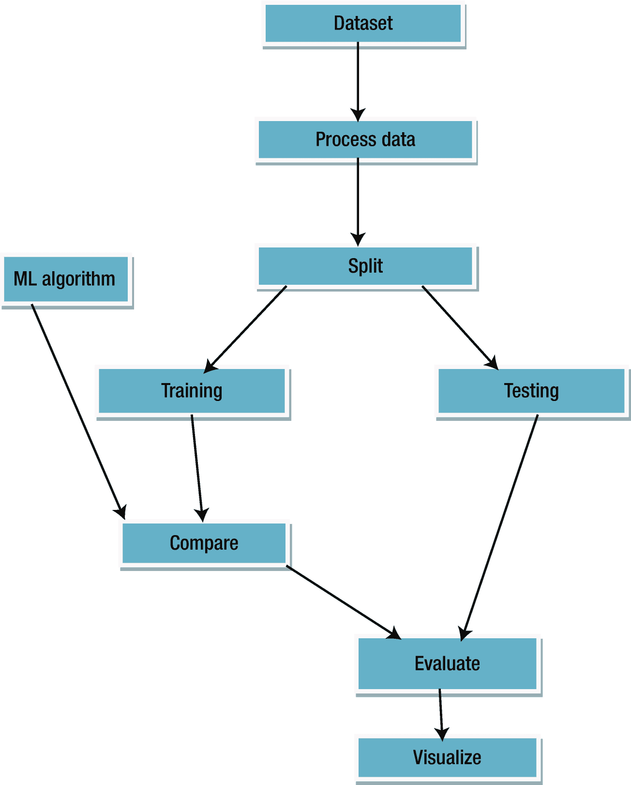

图 1-1

机器学习流程

机器能够处理数据集中的大量数据。当机器试图从数据中解释和学习，而不需要被编程这样做时，我们称这个过程为*机器学习*（*ML*）。

在人脑中，一组神经元通过积极协作来做出决策。当人工应用相同的情况时，人工神经元（这些神经元是神经网络的基础）试图以类似生物神经元的方式工作，这种行为被称为 *认知计算*。当神经元之间发生通信并自行构建网络以传递信息和创建网络时，我们称之为 *神经网络*。当网络变得过于复杂而难以理解，涉及复杂的数据集和许多隐藏层时，机器正在进行 *深度学习*（*DL*）。

当机器从左到右或从上到下扫描图像时，这些机器形成了一个 *卷积神经网络*。

人类通常能记住昨天做了什么，比如，昨天我们吃了什么。能够理解相同顺序概念的人工智能机器形成了 *循环神经网络*。

图 1-2 显示了人工智能以两种方式工作。一种是基于符号的方法，另一种是基于数据的方法。基于符号的学习使用图像识别；通常，这项技术用于机器人。当我们处理大量数据集时，我们使用基于数据的方法，也称为机器学习方法。

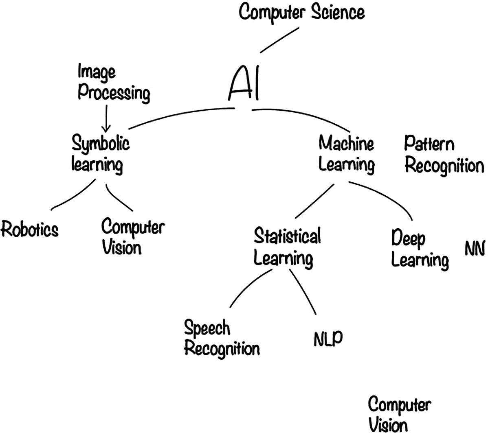

图 1-2

人工智能工作方式中的两种主要方法

当我们使用基于数据的方法时，通常我们处理的是大量需要从中学习的数据。随后，机器将能够从早期阶段开始就做出更好的预测，因为现在有大量数据可以使用这种基于数据的方法。

让我们看看机器如何处理数据的例子。我们有销售和广告数据，并使用线性回归来识别它们之间的关系。线性回归处理用于解决方案的数值。我们试图得到一个线性回归曲线，该曲线适合直线方程 y = mx + C，其中 m 是梯度的斜率，C 是常数，x 是因变量，y 是自变量。首先，让我们看看图 1-3 中的数据点。

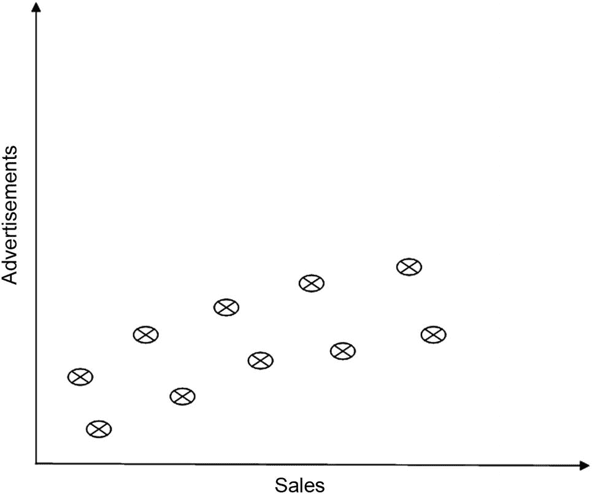

图 1-3

表示销售与广告数据的数据点

图 1-4 展示了一些模式，现在我们可以将其应用于机器学习（ML）。在机器学习到这些模式后，它可以根据所学内容进行预测。

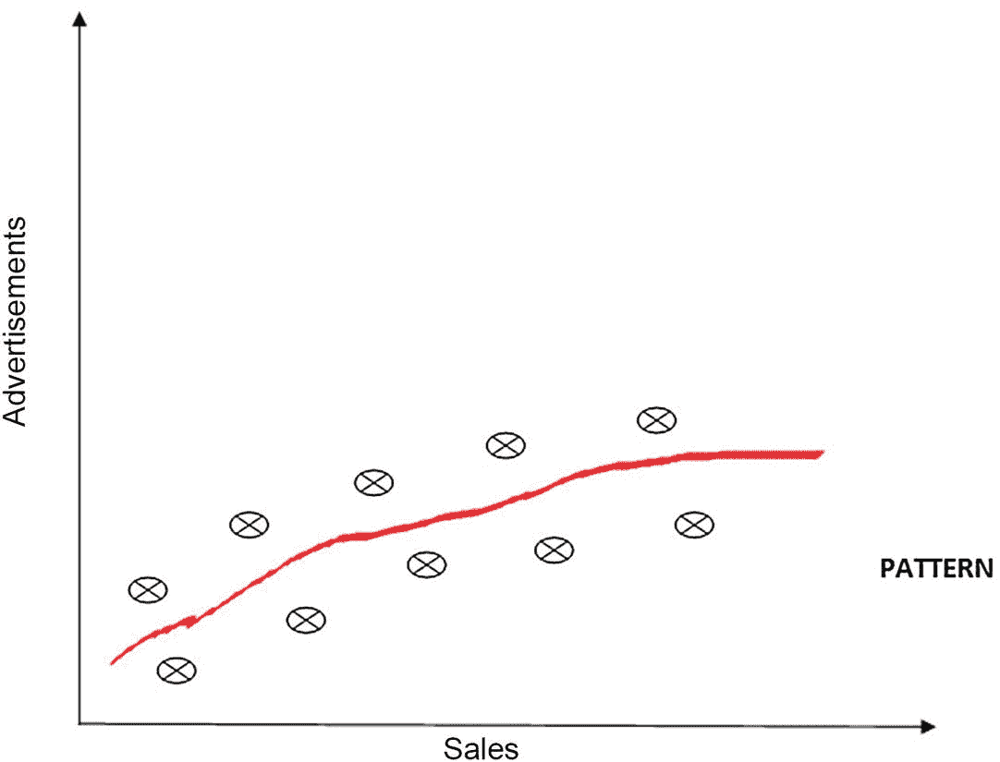

图 1-4

曲线显示了模式。曲线是根据广告增加模式相对于销售生成的。

而对于一维、二维或三维（维度数据是从收集到的信息中生成数据）来说，对人类来说很容易学习，机器可以在多个维度上学习。高维数据包含大量信息，例如，对于一个著名人物，我们检查他们出生的地方，他们如何成为公众人物，他们的职业生涯都有一些数据，但需要一些有价值的见解来获取最佳信息，因此高维度的机器学习有助于数据的可读性和快速访问。

图 1-5 展示了数据在高维空间中的可用性以及与之相关的数据量的大小。机器从这种高维数据空间中快速有效地学习。

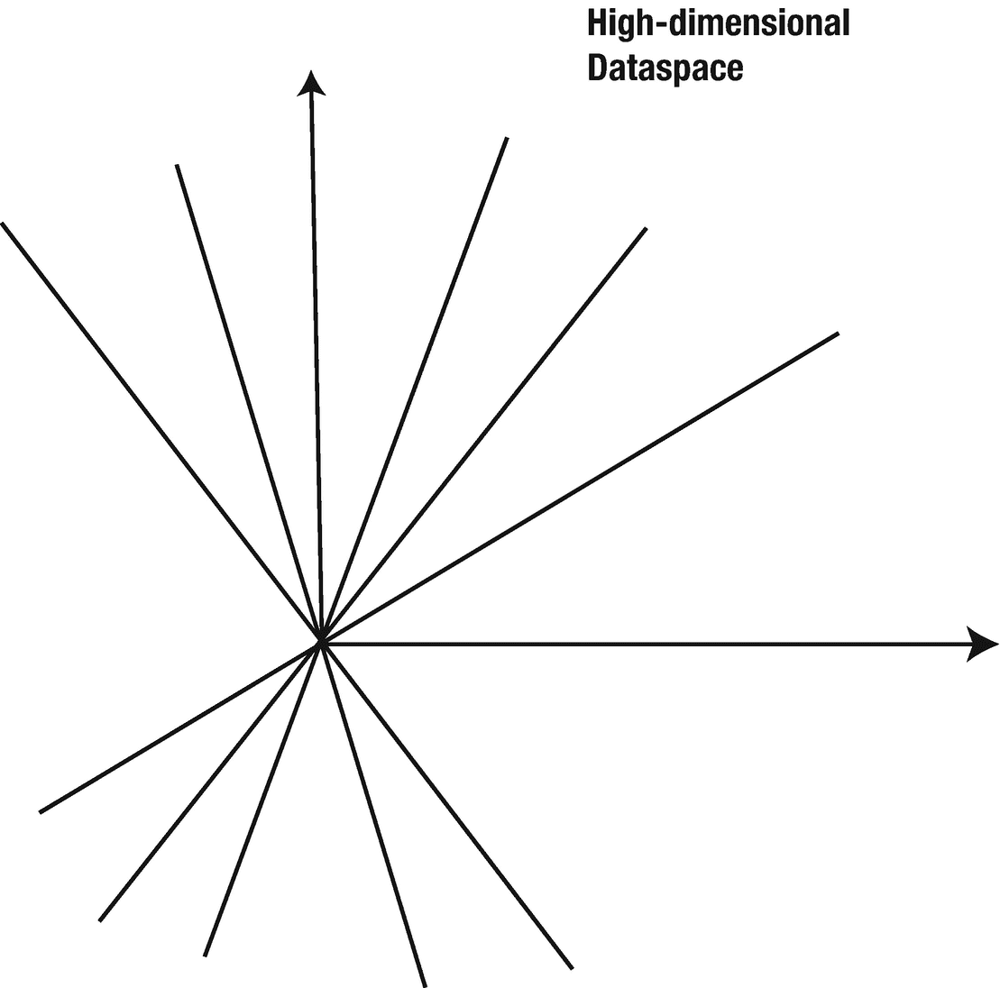

图 1-5

高维空间

机器可以在数据集内查看大量数据，我们称之为高维数据，并确定模式。在机器学习这些模式后，这些有价值的信息提供了有用的见解，导致大量研究，再次导致 AI 的快速发展。机器使用这些模式做两件事：

+   分类

+   预测

### 分类

当我们处理不同类型的数据集时，我们通常将数据集划分为观察类型。我们利用训练数据，以便可以将其应用于不同的机器学习算法。当使用分类时，如果我们试图将进入我们账户的邮件分类为合法邮件或垃圾邮件，我们将将其关联到两个级别，要么它将进入邮箱，要么它将进入垃圾邮件。我们为它关联标签，这决定了通过分类的垃圾邮件过滤过程。

### 预测

当我们致力于特定数据集的未来准备时，我们通常使用可用的数据集进行预测。我们创建的模型在应用机器学习技术后是一个基准，这样我们就可以根据这个模型预测未来的结果。机器通常以两种方式学习：

+   监督学习

+   无监督学习

#### 监督学习

*监督学习*通常基于可用的真实标签（我们共享数据点（如输入、输出和任何其他可用信息）的每个资源）。因此，我们向机器或程序提供输入和输出。机器通过可用的信息进行学习，并最终进行预测。回归是监督学习的一个例子。让我们假设我们想要预测一个地区的房产价格，我们创建的模型应用了回归和斜率公式 y = mx + C，我们可以得到一个与实际房产价格相差很大的结果，这个差异就是误差。为了使模型更准确，更接近结果，我们将调整斜率值以获得正确的值。

#### 无监督学习

根据场景的不同，我们正在处理的数据集可能没有任何先前的信息可用。我们可能正在处理未标记或未分类的数据集。在这种情况下，我们使用*无监督学习*。

*聚类*是无监督学习的一个例子。

处理环境有不同的方式，我们称这个机器学习的分支为*强化学习*。在强化学习中，我们给机器一个目标，并要求它通过试错来学习它。

机器学习有三种方式，如图 1-6 所示：监督学习、无监督学习和强化学习。

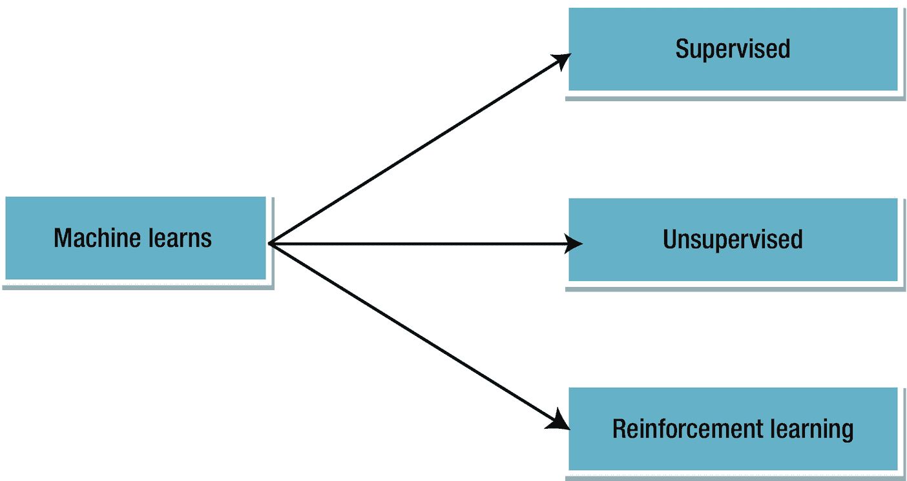

图 1-6

*机器学习的三种方式*

## AI、ML 和 DL 之间的相互联系

AI、ML 和 DL，如图 1-7 所示，是不同的术语。然而，它们确实有相互联系，下面将进行描述。

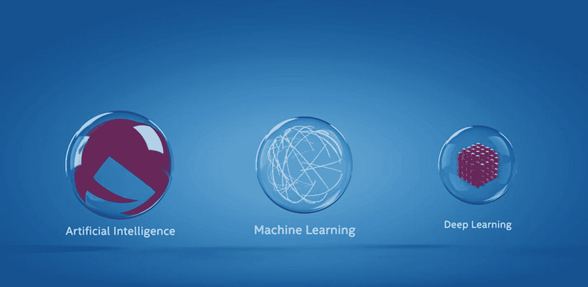

图 1-7

AI、ML 和 DL

*人工智能*指的是一种广泛的计算类别，其中系统足够强大，可以直接从数据中学习。这是由于大量交互、分析、数据结构和数据可视化使用数据分析实现的。这是通过人类干预定义的规则集或越来越多地通过也称为机器学习的 AI 子集实现的。

随着机器学习的进步，许多事物都发生了变化，包括数据处理和信息使用的方式。数据需要某种形式的自动化，以便在没有人类干预的情况下更快地评估。机器学习也处理大量数据集。

当我们为我们的工作使用大量数据时，我们会达到一个计算临界点，这是指大量数据被聚集在一起，规模非常大，如图 1-8 所示。这可能导致数据分析中的新实现方法。

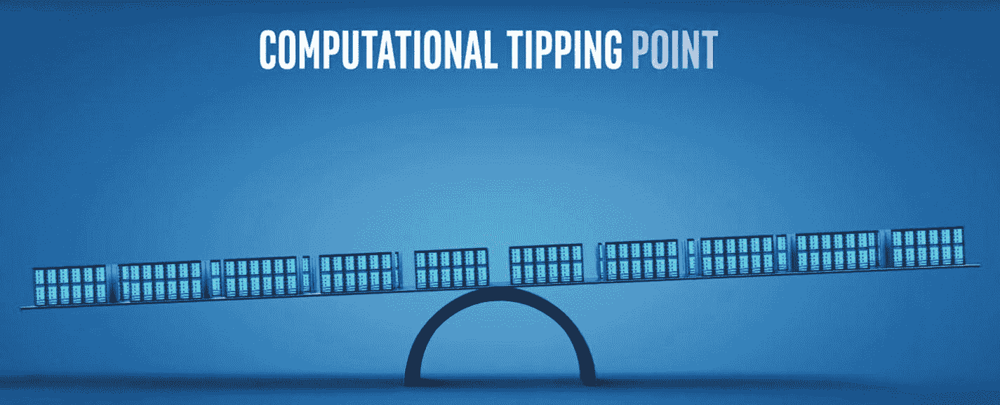

图 1-8

达到计算临界点

深度学习（DL）是达到这个临界点的一个结果，它是机器学习的一个子集。图 1-9 说明了 AI、ML 和 DL 之间的关系。

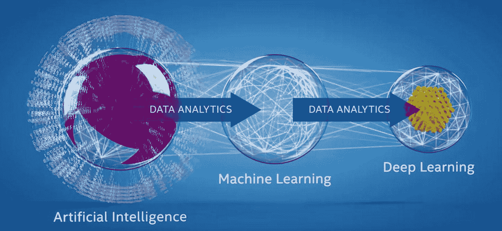

图 1-9

从人工智能到深度学习的演变

神经网络，如图 1-10 所示，是我们将在本书中讨论的另一个概念，它已经变得流行。在分析图像时，计算机首先会将图像分解成 RGB 尺度，现在我们有了不同层次的抽象层。我们需要以不同的方式访问层。因此，生成了一个神经网络，正如我们所看到的，如果抽象层次超过 3，它就直接属于深度学习，而神经网络是其中的一部分。

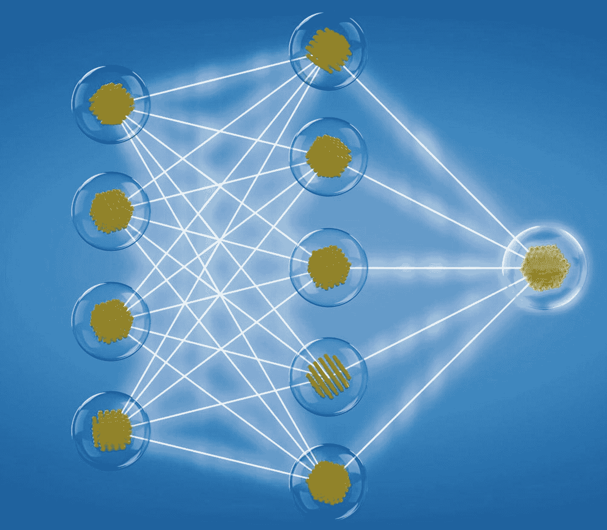

图 1-10

神经网络

神经网络理解了不同的连接神经元网络，并产生了带来突破性成果的输出。这导致了 AI 在更广泛意义上的能力，如图像、语音和自然语言识别的渐进式增长。这在我们日常生活中产生了重大和积极的影响。深度学习的演变表明，AI 不是静态的，它将随着不同技术的出现而增长和适应。一个很好的例子是我们去了一个我们不知道语言的地方，AI 的能力可以捕捉到或转换成易于理解的英语语言的信息，使用网络摄像头。

## 聊天机器人

聊天机器人已经走了很长的路。从静态转向更多互动。

在当今世界，我们必须将服务层隐藏在普通的对话技术中。我们不希望展示下面发生的事情，所以我们包装服务层并隐藏逻辑，这样我们就不能展示整个通信过程，因为许多人希望他们的技术是保密的。

对于最好的聊天机器人，我们需要强调一点。如果一个人分析了一个机器人和人类的对话，却无法区分两者，我们说它通过了 *图灵测试*。然而，到目前为止，还没有任何机器人能够实现这一壮举。

传统上讲，聊天机器人使用了我们所说的 *基于检索的模型*。在这个模型中，程序员的代码提供了预定义的响应，聊天机器人以启发式的方式学习选择适当的响应。

最初创建的聊天机器人使用了基于规则的匹配表达式。现在这种方法已经转向使用机器学习作为分类器以获得更好的响应。我们可以以 Facebook 的 API 为例，我们可以硬编码响应，然后根据意图对单词进行分类。然后如果我们问或表达一个查询，比如，“今天是什么日子？”或者“今天是星期几？”聊天机器人都能理解。

### 生成式聊天机器人模型

一种 *生成式聊天机器人模型* 依赖于预定义的响应，无论我们做什么，我们都应该从头开始编写它们。当我们与聊天机器人一起工作时，我们首先必须看看我们是在一个封闭领域还是在一个开放领域工作。

#### 开放领域

在一个 *开放领域* 中，对话可以走向任何地方。有无限多的事情可以谈论。

#### 封闭领域

在一个*封闭领域*中，对话集中于单一主题或话题。聊天机器人根据我们想要的对话类型（长或短）进行演变。短对话更容易使用。

### 聊天机器人是如何工作的？

了解聊天机器人工作最佳的方式是首先了解机器人的大脑。我们称之为*数字大脑*，它由三个主要部分组成：

+   知识来源：我们需要找出哪些信息需要提供给机器人，以便开始对话以及问答

+   常用短语：这是我们可以处理常用对话短语的地方，这些短语使用得更频繁

+   对话式记忆：当我们进行对话时，我们必须记住已经发生的过程，因此需要对话式记忆

当我们开始与机器人沟通时，我们可能会发送一条消息（例如，“你好”），然后机器人开始工作——更准确地说，分析消息。机器人的活动被称为*解析*。接下来，机器人将寻找关键词以回复消息。

然后，机器人的大脑将使用其三个主要部分来分析消息，然后构建其回复。图 1-11 展示了机器人数字大脑的结构。

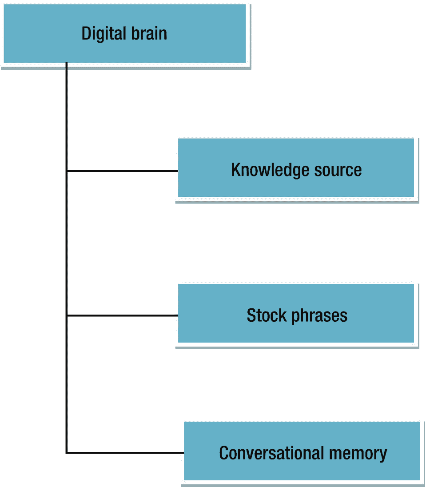

图 1-11

机器人的数字大脑

图 1-12 展示了响应是如何从数字大脑中生成的。

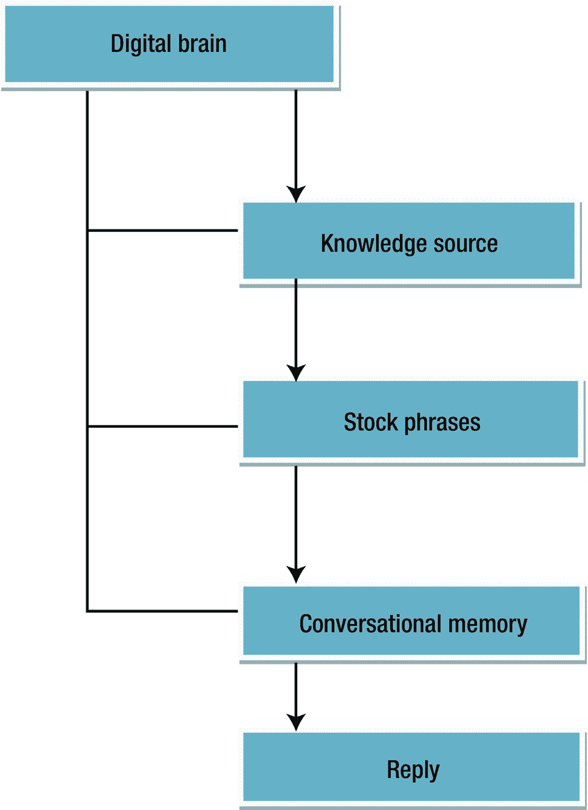

图 1-12

机器人生成的响应

### 聊天机器人的兴起——对话式商业

对话式商业使用聊天、消息或某种自然语言作为其界面。*对话式*意味着它使用某种声音或文本媒介来传输数据并理解人们的交流方式。我们通过聊天和消息使用这种特定的媒介来轻松地相互交流。为了使我们的工作更轻松，我们向机器人提供常见的问题和答案，这样我们就可以在需要时节省时间，避免他们去客户服务。

对话式商业的出现使用户能够以简单的方式与公司交谈，并且公司也能以简单的方式回应。这可以通过三种方式发生：

+   双向：这意味着在机器人内部的通信流程更快且无缝

+   异步：允许在及时的方式下控制消息，而不是在指定的时间间隔内

+   实时：通信响应是为了使其实时

#### 聊天机器人的角色

在对话式商业中，聊天机器人是用于模拟与人类对话的计算机程序。它们使用基于文本的方法。

聊天机器人工作在以下方面：

+   基本操作

+   基本事物：轻松回答一般查询

+   基本问题

#### 人类的作用

对话式商业由人类驱动。开发出的用户界面由人类驱动。结构（也称为*界面*）由人类设计，并且在这里发生交流。

当对话变得复杂时，将由人工操作员来处理解决。

### 聊天应用的增长

聊天机器人的流行源于消息应用（如 Facebook Messenger、WhatsApp 和 Telegram）的日益普及。这些聊天应用现在很流行，并超越了社交应用。Facebook Messenger 平台是一个很好的例子，因为它超越了所有社交应用：

+   统一且流畅的用户界面

+   优秀的体验

+   非常动态，因为很多人使用它们

聊天机器人允许我们通过与公司直接对话来处理业务标准。

以下部分提供了一些聊天机器人的示例。

#### Poncho

Poncho 是一个以猫为标志的天气活动机器人。猫处理所有的对话，并以简单和协作的方式分享天气。

#### CNN 机器人

这是一个提供新闻选项的新闻机器人。我们可以用“太空”等关键词向机器人提出具体问题。然后它会给我们提供关于太空新闻的信息。CNN 机器人也会从我们的日常活动中学习，并据此预测，基于我们进行的搜索类型提供新闻选项。

#### 爬虫机器人

另一种常见的机器人类型是网络爬虫机器人。这些机器人从网络中收集信息，以发现可以收集和存储的详细信息。我们可以使用这些机器人从网页上捕获电子邮件信息，并跳转到下一页。这个过程被称为*抓取*。搜索引擎如谷歌使用爬虫来提高搜索速度。

#### Twitter 机器人

Twitter 上存在一些分析推文的机器人。它们专注于寻找特定主题，意图基于这些主题进行转发。

#### 机器人网络

当一组协调的机器人协同工作时，我们称之为*机器人网络*。机器人网络可以同时请求访问同一网页并使网站崩溃。当机器人网络分布时，这也被称为分布式拒绝服务（DDoS）攻击。

#### 强化学习机器人

强化学习机器人使用强化学习方法。强化学习基于试错。强化学习还基于环境（可以是 3D 空间，基于游戏的场景等）和世界，因此我们不应该致力于建模世界。相反，我们应该致力于建模思维，这意味着应该给机器提供最佳可能的步骤，使其在其限制内工作。

DeepMind（这是一个由谷歌资助的初创公司，致力于寻找强化学习解决方案以进行实践）致力于寻找现在流行的解决方案，并致力于人工智能通用性的制定。

DeepMind 的算法旨在解决解决方案，例如使用统一方法玩 Atari 游戏，被称为深度 Q 学习。它需要两个输入：游戏的原始像素和游戏得分。基于这两个输入，它必须达到其目标以最大化得分。首先，它使用深度卷积神经网络来解释像素。深度卷积神经网络提取特征，随着隐藏层变得极其抽象，机器人通过这些隐藏层进行学习。

### 机器人的结构

本节描述了机器人结构的外观以及对话是如何流动的。

图 1-13 描述了机器人编程结构是如何形成的。

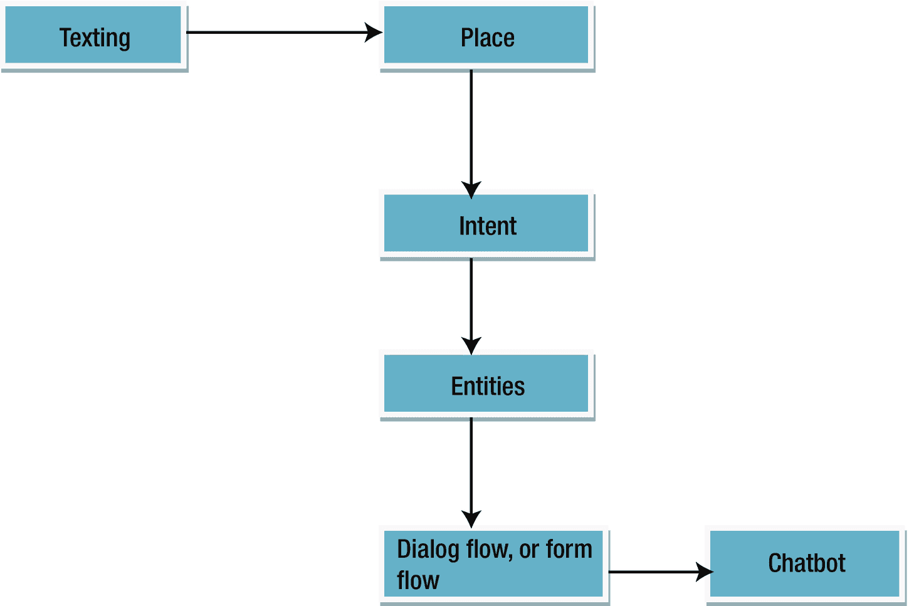

图 1-13

机器人的结构

我们首先从发送一些问题开始进行文本交流，然后转到开始开发或编写机器人逻辑的地方/模板，在这里生成响应流程。接下来，我们描述构成机器人交流基础的意图，以便提供文本响应并使聊天机器人交互。

我们使用实体来分解信息流中的信息片段，以便更好地理解我们使用的情况。最后，我们为机器人创建一个工作流程以实现组织。这个允许整个流程高效运行的流程，被称为*对话流程*或*表单流程*。

现在我们来详细讨论机器人的结构。我们通常希望看到一个高效的文本响应平台。为了让机器人在特定方式下工作，我们需要一个特定的软件开发工具包或接口，我们从那里开始准备逻辑。逻辑可以嵌入在 IDE 中，也可以完全基于云，如 IBM 的 Watson。

我们需要一个模板或地方开始我们的开发。当然，从模板开始更容易，因为基础已经形成。

现在我们需要找到处理某种沟通的具体方法。为此，我们使用意图。意图通常是训练我们机器人的基础。例如，如果我们有一个让机器人提供问候的意图，机器人开始这个意图的方式可能是“嗨”，“你好”，“嘿，那里”，等等。我们必须提供特定的文本来理解意图的逻辑。

现在我们转向所谓的*实体*。当用户与机器人进行文本对话时，机器人使用意图来选择响应或做出智能决策以推动对话流程。

#### 对话流程或表单流程

这种对话流程或表单流程是我们将意图和实体结构化以共同实现特定目标的过程，为机器人声明所有将执行的功能。现在我们已经完成了逻辑，这就是机器人组织的方式。

### 机器人框架

技术巨头们都已经提出了不同的机器人框架，以开始机器人开发。以下是主要的机器人框架：

+   微软有 Bot Framework。

+   谷歌有 Wit.ai 和 Dialogflow。

+   IBM 有 Watson。

+   亚马逊网络服务（AWS）拥有自己的由 AWS Lambda 驱动的机器人框架。

+   我们可以使用 TensorFlow 来开发聊天机器人。

+   我们还可以使用 FlockOS 来开发聊天机器人。

聊天机器人的受欢迎程度正在上升。这就是为什么每个大公司都在尝试创建一个框架，以便进行机器人开发。

随着我们通过机器人流程收集信息，我们使用编程语言来构建机器人的结构，并相应地引导它。

我们看到随着机器人框架的不断发展，聊天机器人正在兴起，并且这些框架正变得易于使用。

## 结论

本章介绍了机器人框架的基础知识，并描述了开发机器人的过程。我们还涵盖了人工智能，包括机器学习和深度学习的描述。我们展示了对话式商业是如何运作的，并从聊天机器人的角度讨论了数字大脑。最后，我们简要介绍了机器人的结构，并以可用于机器人开发的框架结束。在下一章中，我们可以开始机器人开发。
