# 2. Microsoft Bot Framework

本章涵盖了 Microsoft Bot Framework。我们将从对 Microsoft Bot Framework 的简要介绍开始。之后，我们将转向：

+   使用 Visual Studio 的 Bot Framework 模板

+   使用 Visual Studio 开始与 Bot Framework 一起工作

+   讨论不同的 Bot Framework 状态，如意图、机器人的实体，然后描述对话框和表单流程

+   语言理解与智能服务（LUIS）。

+   新的 LUIS 网站，变化，探索并讨论其功能

+   使用不同的机器人属性开发端到端机器人

+   发布机器人

+   使用 Dynamics CRM 在 Bot Framework 中使用它

+   学习 AI 和机器人的结构。

当我们致力于构建连接，即聊天机器人的交互性质和良好的对话流程管理时，我们旨在使用使我们的工作更简单的框架。Microsoft Bot Framework 是创建和部署良好管理的对话机器人时使工作更简单的工具和辅助软件开发工具包（SDK）的必要集合。

## 从先决条件开始

要使用 Microsoft Bot Framework 进行开发，我们首先需要满足一些先决条件。本节描述了一些为了开始所需的必要事项：

+   *集成开发环境*：Visual Studio

+   *操作系统*：Windows 10

+   *机器人开发框架*：Bot Builder

+   *测试模拟器*：Bot Framework 模拟器

### Visual Studio

首先，为了让框架工作，我们需要一个集成开发环境（IDE），一个我们可以编写整个代码的地方。Visual Studio 是为 Microsoft Bot Framework 开发的一个基本选择。它将 Microsoft 技术的使用结合得非常顺畅，并且与 Microsoft 技术栈很好地对齐。在这本书中，我们将使用 Visual Studio 2015，但我们也可以使用 Visual Studio 2017。您可以从[`docs.microsoft.com/en-us/visualstudio/install/install-visual-studio`](https://docs.microsoft.com/en-us/visualstudio/install/install-visual-studio)下载 Visual Studio。

### Windows 10

我们需要有一个操作系统来开发和托管 IDE。首选的操作系统是 Windows 10，您可以从[www.microsoft.com/en-in/software-download/windows10](https://www.microsoft.com/en-in/software-download/windows10)下载它。图 2-1 显示了 Windows 10 下载页面。

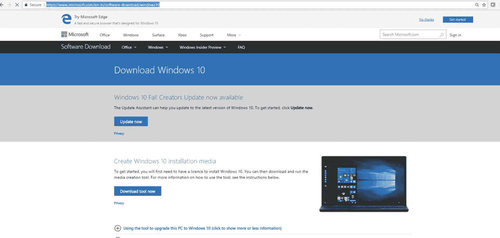

图 2-1

下载 Windows 10 的页面

### Bot Builder

我们还需要为我们的 Bot Framework 开发在 Visual Studio 中有一个蓝图。我们将需要下载一个模板，是的，我们还需要选择一种编程语言来开发我们的机器人。首选的编程语言是 C#。在机器人开发的大部分时间里，我们将处理相同的编程语言。

你可以从[`https://docs.microsoft.com/en-us/bot-framework/bot-builder-overview-getstarted`](https://docs.microsoft.com/en-us/bot-framework/bot-builder-overview-getstarted)下载模板。滚动到该页面以找到要下载的模板，如图 2-2 所示。

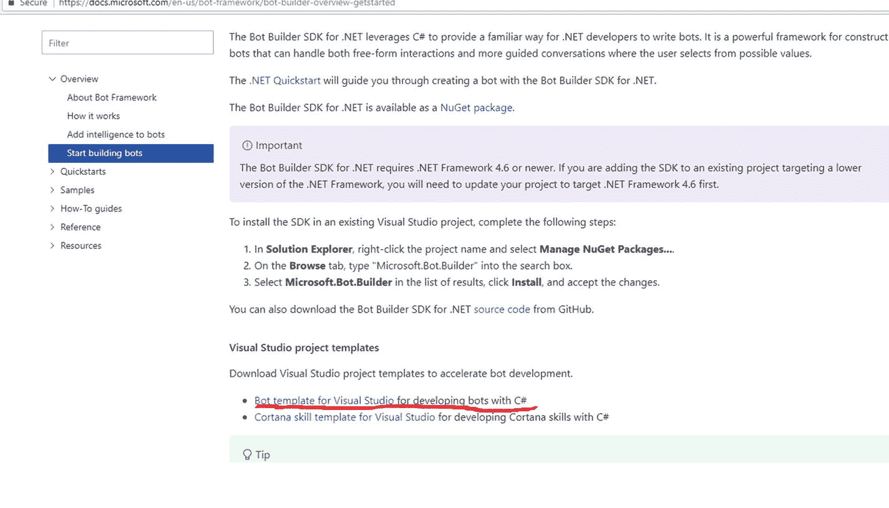

图 2-2

下载 Visual Studio 模板的链接

### Bot Framework 模拟器

当我们完成编码后，在托管之前，我们需要在本地测试机器人。我们将使用机器人模拟器来测试所有功能以及机器人的整个流程。你可以从[`https://docs.microsoft.com/en-us/bot-framework/debug-bots-emulator`](https://docs.microsoft.com/en-us/bot-framework/debug-bots-emulator)下载 Bot Framework 模拟器。图 2-3 显示了模拟器的下载页面。

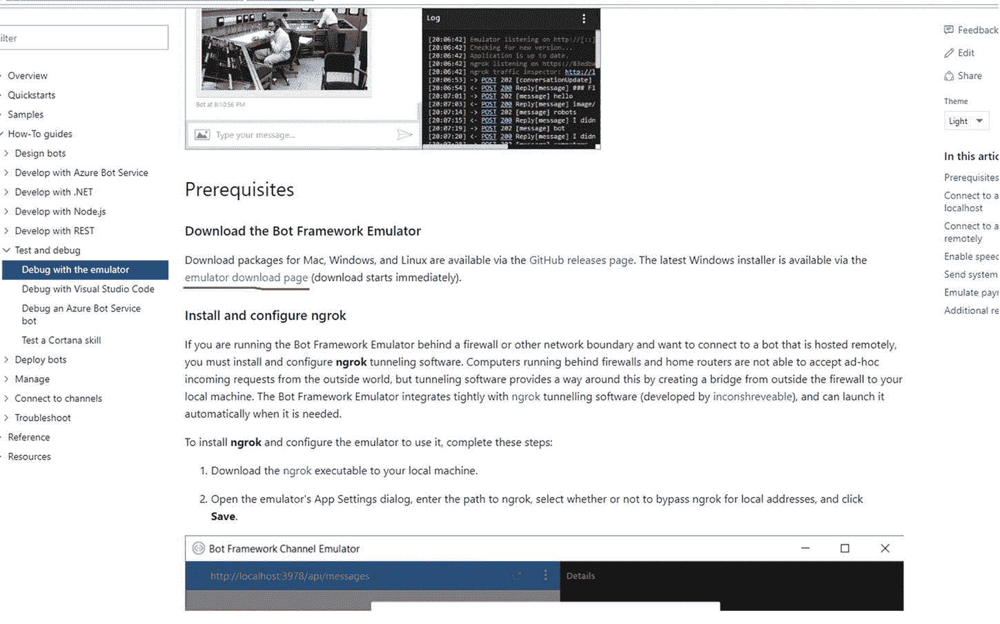

图 2-3

模拟器下载页面

主页托管所有机器人模拟器。从该列表中，我们可以下载并运行模拟器的 EXE 文件。可执行文件将在桌面上创建一个快捷方式。然后你可以双击该快捷方式来运行模拟器。获取 EXE 的直接链接是[`https://github.com/Microsoft/BotFramework-Emulator/releases/tag/v3.5.34`](https://github.com/Microsoft/BotFramework-Emulator/releases/tag/v3.5.34)。

图 2-4 显示了要下载的正确 EXE 文件。

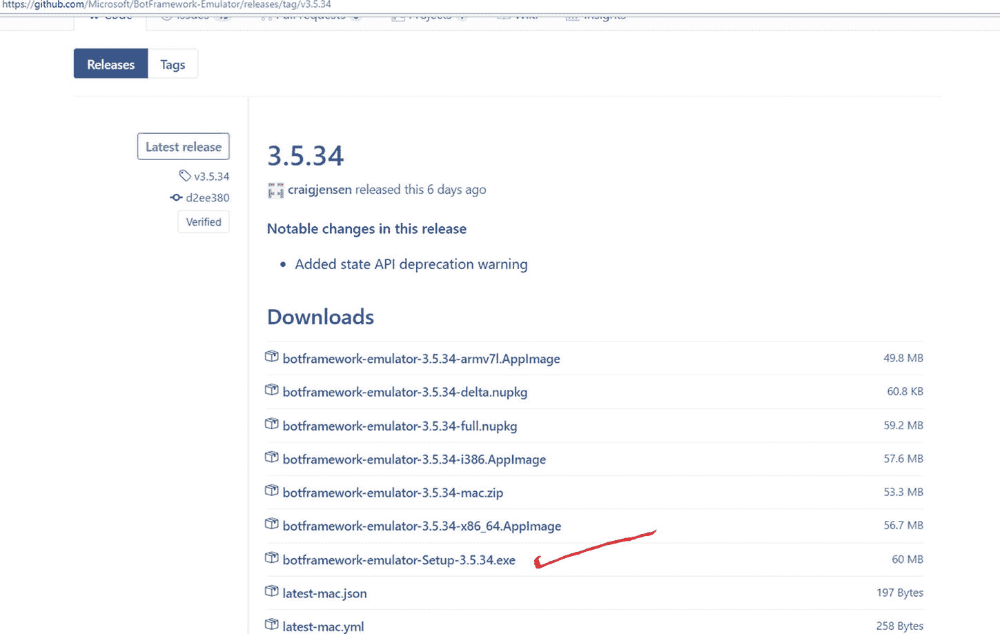

图 2-4

模拟器的 EXE 文件

## 创建简单的 Bot Framework 应用

在本节中，你将通过使用 C# 语言的 VS 模板来创建一个简单的机器人框架应用。然后你将首先通过本地运行应用来测试该应用，然后使用 Bot Framework 模拟器进行测试。

### 使用模板创建项目

要开始，你首先需要启动 Visual Studio IDE 进行开发。当你打开 Visual Studio 时，IDE 屏幕看起来像图 2-5。

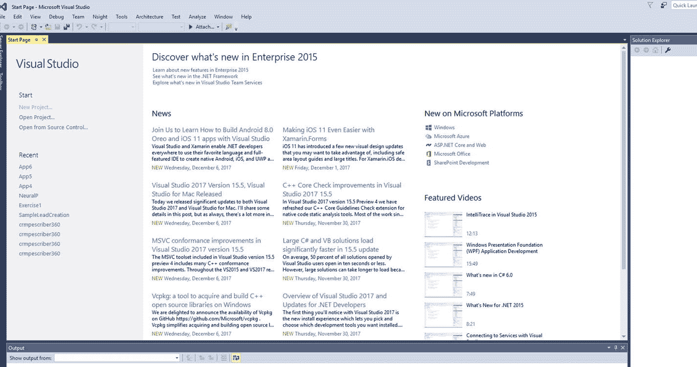

图 2-5

首次打开 Visual Studio IDE 的屏幕

你需要打开一个新的模板来创建项目。点击左上角的文件选项卡，然后点击新建 ➤ 项目，如图 2-6 所示。

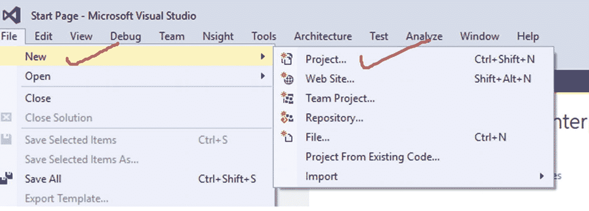

图 2-6

创建新项目

在打开的新项目窗口中，你会看到下载的 Visual Studio C# 模板可用于创建机器人。在 Visual C# 的模板中，你可以找到机器人应用程序模板（见图 2-7）。

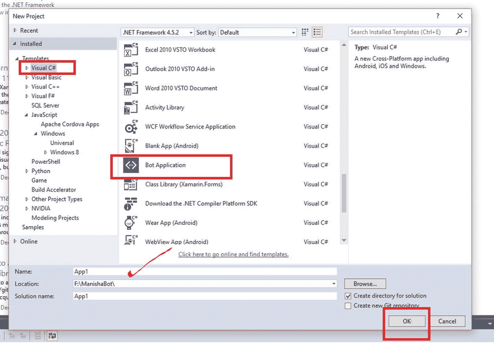

图 2-7

Bot 应用程序模板

您现在可以准备好从模板创建一个应用程序了。在这个示例中，您将使用未更改任何参数的模板，以便您可以看到 Bot 应用程序模板的功能。

首先，您需要命名应用程序。在这个示例中，您将将其命名为 App1。然后点击“确定”继续。在后台，模板将构建机器人框架的基本要素并创建必要的文件以使您的第一个机器人应用程序工作。让我们运行并观察创建的代码。

### 与代码一起工作

随着项目文件的创建，您将关注解决方案资源管理器选项，在那里您可以查看可用文件的层次结构。图 2-8 显示了项目开始时创建的文件。

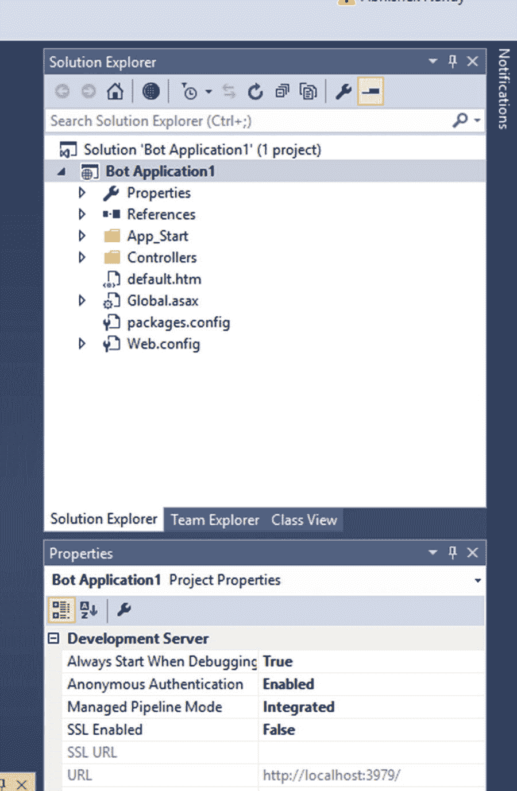

图 2-8

新项目可用的文件

在确保一切正确的情况下，最重要的文件是`web.config`文件。它用于在 Azure 上托管应用程序，并确保所有关键细节都填写正确。它是一个 XML 文件，您必须提供应用程序 ID 以及来自 Bot Framework 网站的其他详细信息，我们将在后面讨论。

图 2-9 展示了在 IDE 中访问 XML 文件时的样子。

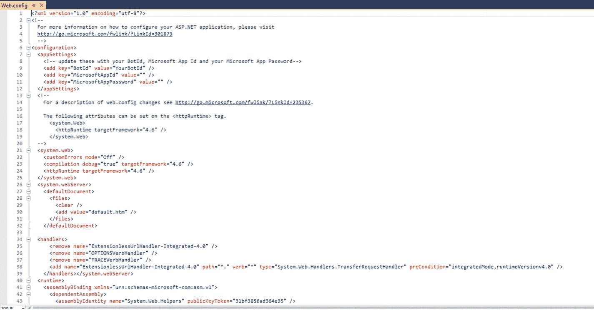

图 2-9

在 IDE 中的 web.config 文件

整个 web.config XML 文件的结构如列表 2-1 所示。

```py

tag.

-->

Listing 2-1
web.config file as XML Format
```

图 2-10 显示了 XML 文件最重要的部分，我们需要在这里进行更改。配置选项卡是我们必须填写所有信息的地方。需要更新 appID、BotID 和 AppPassword。

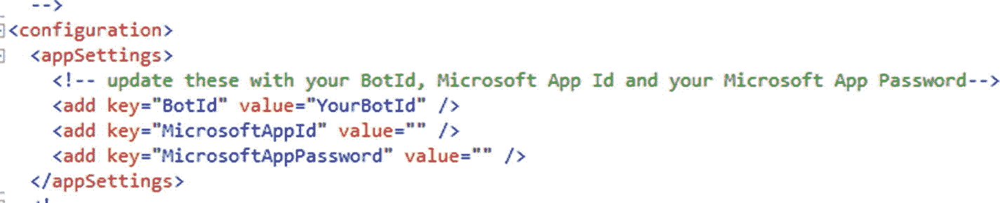

图 2-10

配置选项卡的代码

列表 2-2 展示了如何获取需要填入的`BotId`、`MicrosoftAppId`和`MicrosoftAppPassword`值。

```py

Listing 2-2
Important Code Section Providing Values from the bot Website
```

您将从 Bot Framework 网站上获取机器人 ID、Microsoft 应用 ID 和密码的详细信息。您将在本章后面的发布应用程序时进行此过程。现在，让我们集中精力在编码逻辑上。

在`controllers`文件夹中，您将找到`MessageController.cs`文件。模板的逻辑是这样的：`MessageController.cs`文件检查活动并扫描发送给机器人的任何消息。该文件检查字符串长度，然后返回字符大小或消息长度。列表 2-3 展示了使用 C#检查字符长度的过程。

```py
if (activity.Type == ActivityTypes.Message)
{
ConnectorClient connector = new ConnectorClient(new Uri(activity.ServiceUrl));
// calculate something for us to return
int length = (activity.Text ?? string.Empty).Length;
// return our reply to the user
Activity reply = activity.CreateReply($"You sent {activity.Text} which was {length} characters");
await connector.Conversations.ReplyToActivityAsync(reply);
}
Listing 2-3
The Reply Message Code Block in C#
```

第一行代码使用客户端连接器。此连接器通过机器人消息系统建立通信通道。下一行检查消息的字符串长度。使用 `??` 运算符提供两个选项：`activity.Text ?? string.Empty`。如果我们得到一定长度的字符，则执行左侧的逻辑。如果消息为空，则执行右侧的逻辑。

列表 2-4 显示了完整的 `MessageController.cs` 文件。

```py
using System;
using System.Linq;
using System.Net;
using System.Net.Http;
using System.Threading.Tasks;
using System.Web.Http;
using System.Web.Http.Description;
using Microsoft.Bot.Connector;
using Newtonsoft.Json;
namespace Bot_Application1
{
[BotAuthentication]
public class MessagesController : ApiController
{
/// 
/// POST: api/Messages
/// Receive a message from a user and reply to it
/// 
public async Task Post([FromBody]Activity activity)
{
if (activity.Type == ActivityTypes.Message)
{
ConnectorClient connector = new ConnectorClient(new Uri(activity.ServiceUrl));
// calculate something for us to return
int length = (activity.Text ?? string.Empty).Length;
// return our reply to the user
Activity reply = activity.CreateReply($"You sent {activity.Text} which was {length} characters");
await connector.Conversations.ReplyToActivityAsync(reply);
}
else
{
HandleSystemMessage(activity);
}
var response = Request.CreateResponse(HttpStatusCode.OK);
return response;
}
private Activity HandleSystemMessage(Activity message)
{
if (message.Type == ActivityTypes.DeleteUserData)
{
// Implement user deletion here
// If we handle user deletion, return a real message
}
else if (message.Type == ActivityTypes.ConversationUpdate)
{
// Handle conversation state changes, like members being added and removed
// Use Activity.MembersAdded and Activity.MembersRemoved and Activity.Action for info
// Not available in all channels
}
else if (message.Type == ActivityTypes.ContactRelationUpdate)
{
// Handle add/remove from contact lists
// Activity.From + Activity.Action represent what happened
}
else if (message.Type == ActivityTypes.Typing)
{
// Handle knowing tha the user is typing
}
else if (message.Type == ActivityTypes.Ping)
{
}
return null;
}
}
}
Listing 2-4
Entire Message Reply Code Block
```

### 运行应用程序

现在让我们运行机器人项目。要运行项目文件，选择带有浏览器选择的绿色播放按钮，如图 2-11 所示。

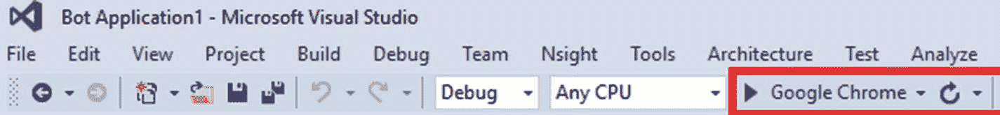

图 2-11

运行项目

当您运行应用程序时，您会看到它在本地的网页浏览器中打开；见图 2-12。

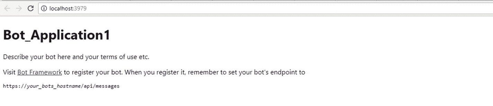

图 2-12

在网页浏览器中运行的机器人

注意本地主机地址。为了测试目的，您必须使用此链接。现在，让我们启动模拟器。图 2-13 显示了机器人框架模拟器启动时的屏幕。

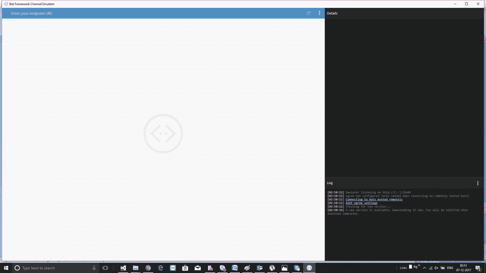

图 2-13

机器人框架模拟器屏幕

您必须提供机器人应用的端点 URL 或本地主机 URL。在提供本地主机地址后，保持其他选项为空，然后单击连接按钮，如图 2-14 所示。

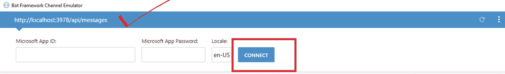

图 2-14

分享本地主机地址并连接

### 测试应用程序

现在让我们测试应用程序。首先，发送一条消息“Hi there who are you”。回复消息提供了字符数，如图 2-15 所示。

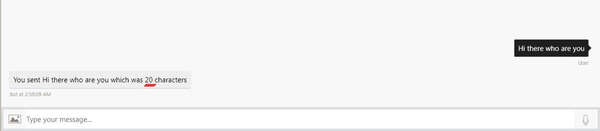

图 2-15

消息的响应

机器人代码和逻辑是三者的组合，如图 2-16 所示。

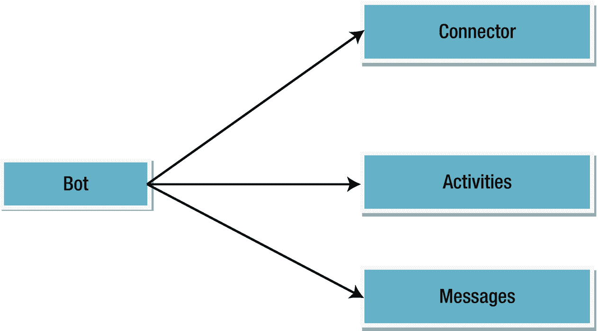

图 2-16

机器人代码逻辑

连接器处理所有通信。活动是机器人与用户之间发生的事件。消息是显示在机器人和用户之间的消息。

让我们稍微修改一下代码。这次，在活动部分，您将使用 Markdown 内容。所以让我们回到代码。保持活动部分的所有内容，并在列表 2-5 中添加代码。

```py
reply.TextFormat = "markdown";
reply.Text += ",this is a continued effort that we are making";
reply.Text += ", We are writing for Apress";
The update Activities code chunk looks like this.
if (activity.Type == ActivityTypes.Message)
{
ConnectorClient connector = new ConnectorClient(new Uri(activity.ServiceUrl));
// calculate something for us to return
int length = (activity.Text ?? string.Empty).Length;
// return our reply to the user
Activity reply = activity.CreateReply($"You sent {activity.Text} which was {length} characters");
reply.TextFormat = "markdown";
reply.Text += ",this is a continued effort that we are making";
reply.Text += ", We are writing for Apress";
await connector.Conversations.ReplyToActivityAsync(reply);
}
Listing 2-5
Markdown Reply Format
```

让我们运行这段代码并在模拟器中测试它。当你模拟运行代码时，你会看到它以 Markdown 格式打印消息。添加的文本也会被打印出来。图 2-17 展示了响应。

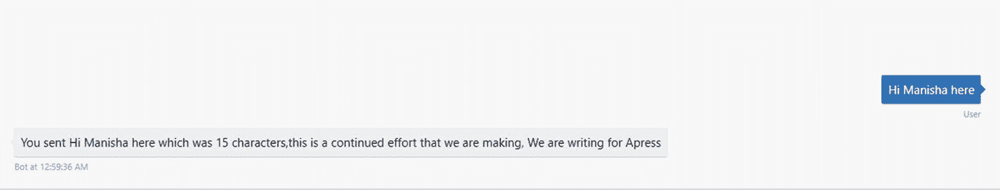

图 2-17

更新代码后的响应

## 管理状态

本节展示了如何在机器人中管理状态。当我们需要管理复杂的通信时，我们需要有一种通信媒介或一个地方来开始对话。图 2-18 展示了在机器人中管理状态的可选方案。表 2-1 解释了每个状态。

表 2-1

管理状态

| 管理状态 | 描述 |
| --- | --- |
| 存储方法 | 我们可以使用数据库的帮助来保存机器人的状态。我们可以在 SQL Server、Azure 等中保存数据。 |
| 运行时类特定逻辑 | 我们可以在运行时启动一个类，并使机器人工作。然后我们可以通过机器人随着不同功能的变化而演变，来理解机器人的逻辑。 |
| 表单流程，或对话流程 | 如果我们想要按顺序启动某些事物，我们需要实现表单流程或对话流程。 |
| 状态客户端 | 此选项类似于在 .NET 或 MVC 中查看状态或会话状态。 |

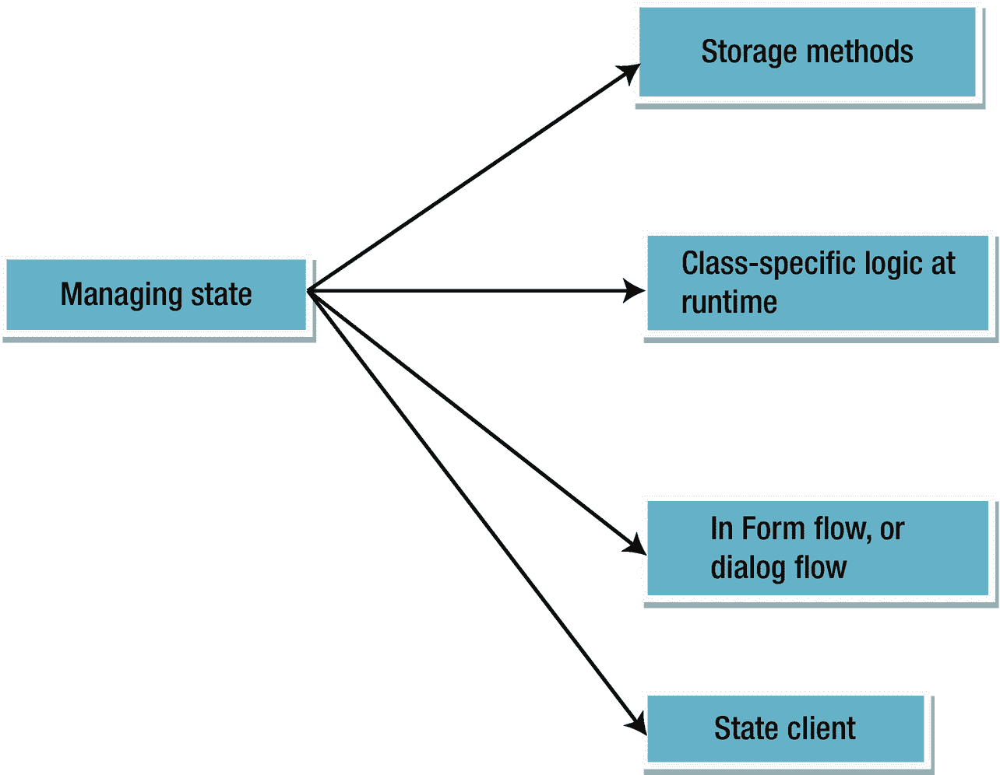

图 2-18

管理机器人的方式

## 理解对话的使用

*对话* 是以链式方式使用消息提供的一种交流方式，以传达响应。

当我们创建机器人时，我们以高效的方式工作，以便以适当的方式获得响应。更具体地说，我们试图接收应该响应的交互。因此，我们致力于提供机器人对话的优质体验。对话帮助我们实现机器人的完美体验。

现在，让我们专注于对话的代码概念。首先，打开 Visual Studio 并再次选择机器人模板。将其命名为 ManishaBot，如图 2-19 所示。

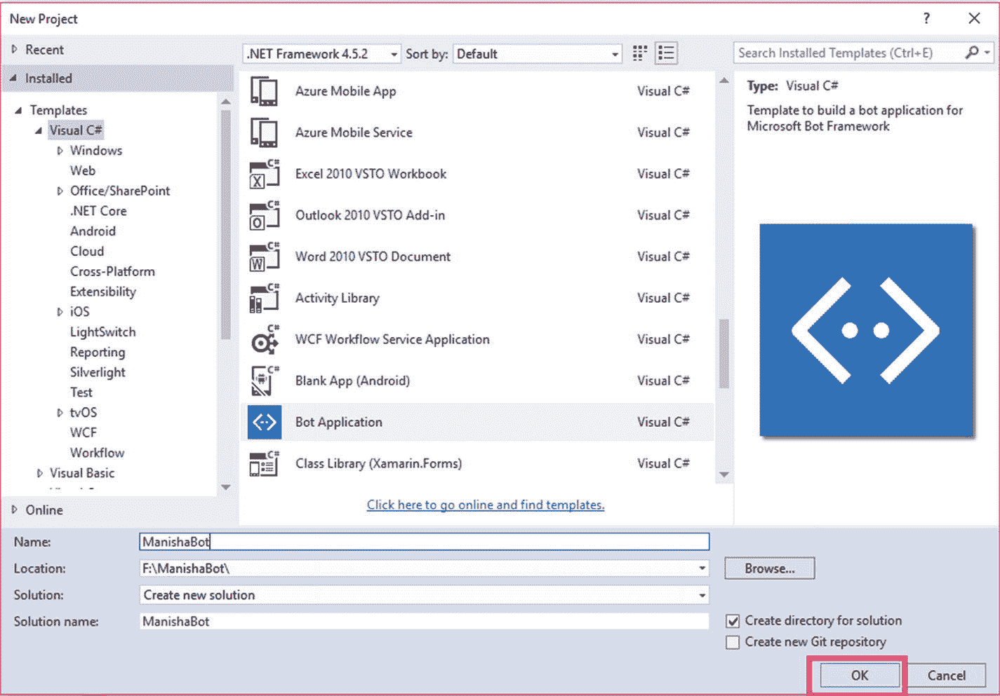

图 2-19

创建对话机器人

在项目的目录结构中，你需要创建一个 `Dialogs` 文件夹。创建文件夹的过程如图 2-20 所示：点击添加 ➤ 新建文件夹。

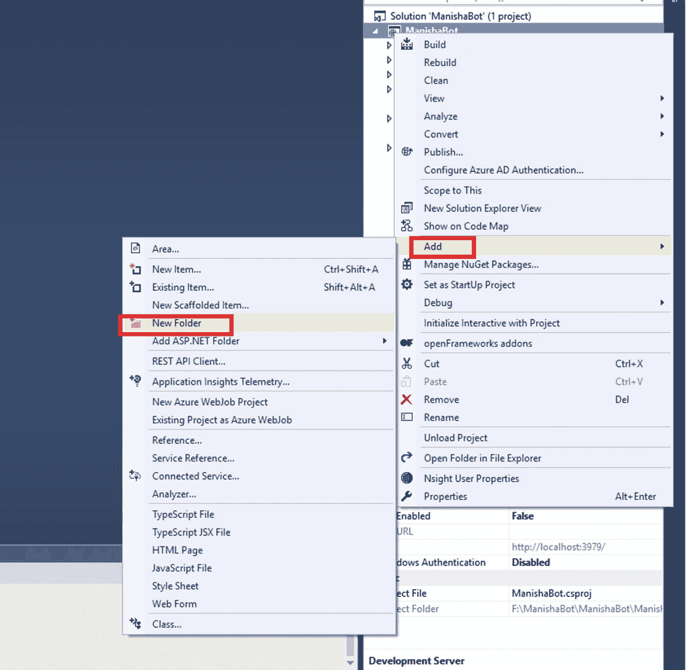

图 2-20

创建名为 Dialogs 的文件夹

在 `Dialogs` 文件夹中，你将添加一个类文件。点击添加 ➤ 新建项，如图 2-21 所示。

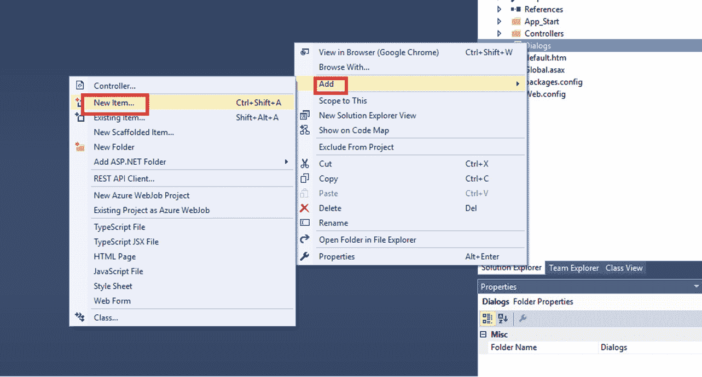

图 2-21

添加新项目。从 Visual Studio 中选择新项目，然后添加一个类文件。

现在，您将添加一个类文件。过程如图 2-22 所示。将类文件命名为 `RandomFactDialog.cs`。

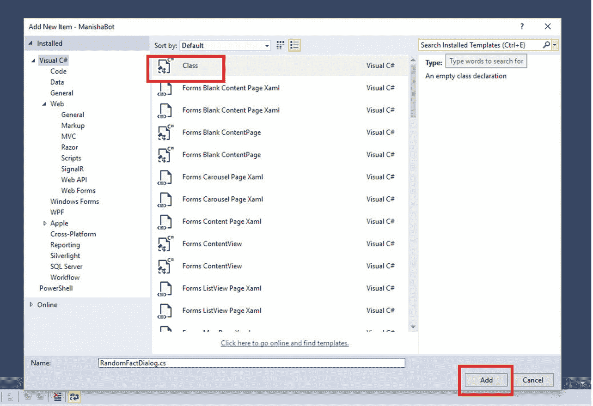

图 2-22

创建一个类。在这里，我们创建一个单独的类，以便我们可以在这里制定逻辑。

接下来，您将消息控制器链接到您创建的对话类；请参阅列表 2-6。

```py
if (activity.Type == ActivityTypes.Message)
{
ConnectorClient connector = new ConnectorClient(new Uri(activity.ServiceUrl));
// calculate something for us to return
// int length = (activity.Text ?? string.Empty).Length;
// return our reply to the user
// Activity reply = activity.CreateReply($"You sent {activity.Text} which was {length} characters");
//await connector.Conversations.ReplyToActivityAsync(reply);
await Conversation.SendAsync(activity, () => Dialogs.RandomFactDialog.Dialog);
}
The most important part being this piece of code where we link it to the Dialog class we created.
await Conversation.SendAsync(activity, () => Dialogs.RandomFactDialog.Dialog);
Listing 2-6
Referencing the RandomFactDialog Class File
```

现在，`RandomFactDialog` 类文件，您在其中实现消息链，看起来像列表 2-7。

```py
using System;
using System.Collections.Generic;
using System.Linq;
using System.Web;
using Microsoft.Bot.Builder.Dialogs;
namespace ManishaBot.Dialogs
{
[Serializable]
public class RandomFactDialog
{
public static readonly IDialog Dialog = Chain
.PostToChain()
.Select(m => "The fact is,you said **" + m.Text + "**")
.PostToUser();
}
}
Listing 2-7
Chaining Messages
```

让我们运行代码并查看具体发生了什么。输入 *hi*。在对话链中，响应在机器人中可用，如图 2-23 所示。

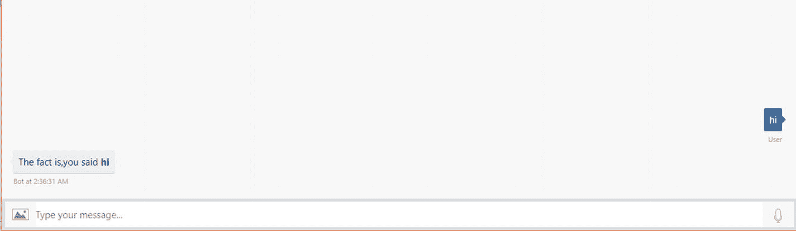

图 2-23

机器人的响应

现在，您将开发更复杂的对话链。列表 2-8 显示了对话链结构的更改。

```py
public static readonly IDialog Dialog = Chain
.PostToChain()
.Select(m => m.Text)
.Switch
(
Chain.Case
(
new Regex("^tell me a fact"),
(context, text) =>
Chain.Return("Grabbing a fact...")
.PostToUser()
.ContinueWith(async (ctx, res) =>
{
var response = await res;
// var fact = await Helpers.GeneralHelper.GetRandomFactAsync();
return Chain.Return("**FACT:** *" +"** We are working on a fact that we are writing for Apress**" + "*");
})
),
Chain.Default>(
(context, text) =>
Chain.Return("Say 'tell me a fact'")
)
)
.Unwrap().PostToUser();
Listing 2-8
Chaining a Series of Messages
```

列表 2-9 提供了整个类文件。

```py
using System;
using System.Collections.Generic;
using System.Linq;
using System.Web;
using Microsoft.Bot.Builder.Dialogs;
using System.Text.RegularExpressions;
using System.Threading.Tasks;
namespace ManishaBot.Dialogs
{
[Serializable]
public class RandomFactDialog
{
public static readonly IDialog Dialog = Chain
.PostToChain()
.Select(m => m.Text)
.Switch
(
Chain.Case
(
new Regex("^tell me a fact"),
(context, text) =>
Chain.Return("Grabbing a fact...")
.PostToUser()
.ContinueWith(async (ctx, res) =>
{
var response = await res;
// var fact = await Helpers.GeneralHelper.GetRandomFactAsync();
return Chain.Return("**FACT:** *" +"** We are working on a fact that we are writing for Apress**" + "*");
})
),
Chain.Default>(
(context, text) =>
Chain.Return("Say 'tell me a fact'")
)
)
.Unwrap().PostToUser();
public static Task Helpers { get; private set; }
}
}
Listing 2-9
The Class File Showing the Entire Chaining Process
```

如果现在运行代码，您将得到图 2-24 中显示的结果。

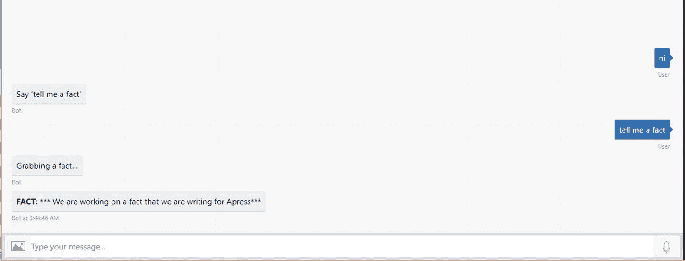

图 2-24

在处理复杂的链式过程

您通过输入 *hi* 开始对话。机器人响应为 *说‘告诉我一个事实’*。当您输入 *告诉我一个事实* 时，机器人进入链式逻辑并弹出一条消息。

## 使用 Azure 将机器人发布到云端

为了将机器人发布到云端，您首先需要注册机器人。您可以通过访问[`https://dev.botframework.com/`](https://dev.botframework.com/)来完成此操作。

机器人框架页面如图 2-25 所示。

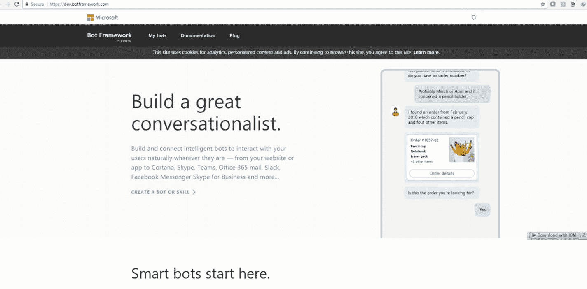

图 2-25

机器人框架页面

在页面顶部，点击图 2-26 中显示的“我的机器人”链接。

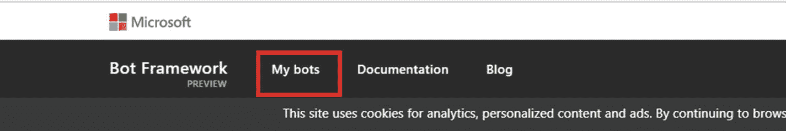

图 2-26

我的机器人选项

从“我的机器人”页面，点击图 2-27 中显示的“创建机器人”按钮。

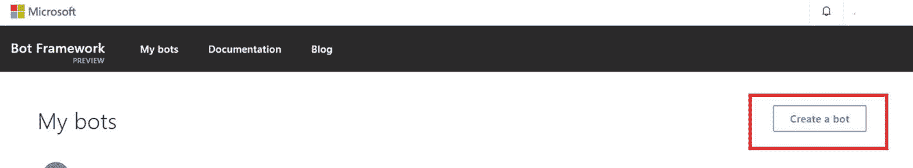

图 2-27

创建机器人选项

在下一页，点击图 2-28 中显示的“创建”按钮。

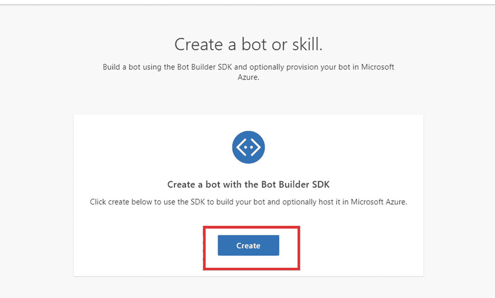

图 2-28

创建机器人

点击图 2-29 中显示的“使用 Bot Builder SDK 注册现有机器人”单选按钮。然后点击“确定”按钮。

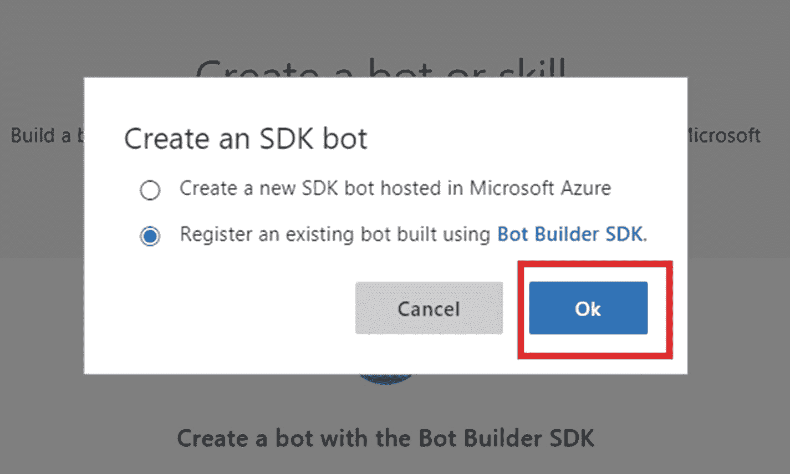

图 2-29

选择“机器人构建器”选项

接下来，提供机器人的详细信息，如图 2-30 所示。

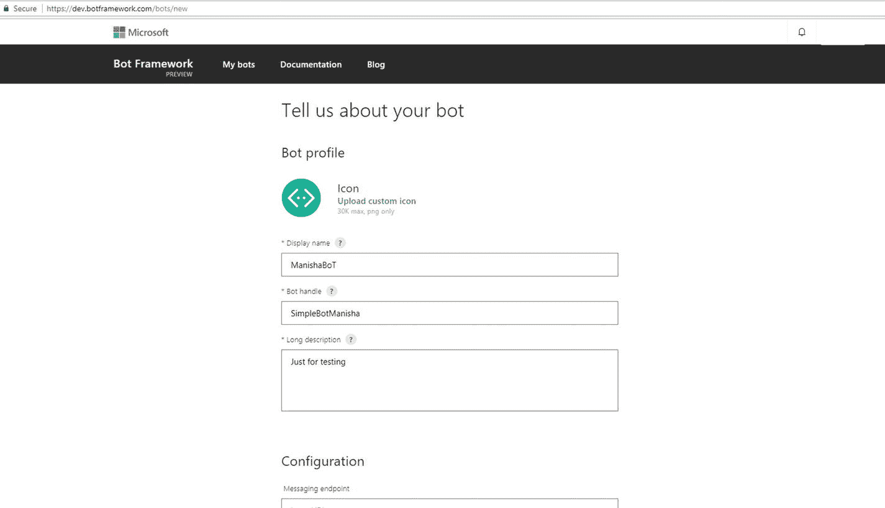

图 2-30

提供关于机器人的详细信息

在您提供机器人的详细信息后，您需要生成一个应用程序 ID 和密码。点击“创建 Microsoft 应用 ID 和密码”选项，如图 2-31 所示。

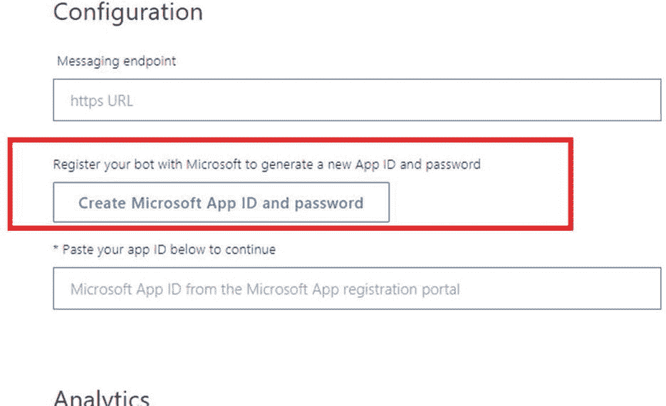

图 2-31

生成应用程序 ID 和密码

在下一个窗口中，您的应用程序 ID 将显示，如图 2-32 所示。

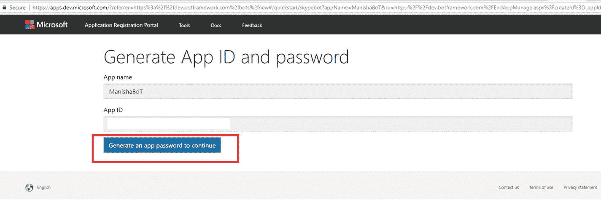

图 2-32

您已拥有应用程序 ID

点击“生成应用程序密码以继续”按钮。在 `web.config` 文件中输入应用程序 ID、密码和机器人句柄。新密码将生成，如图 2-33 所示。

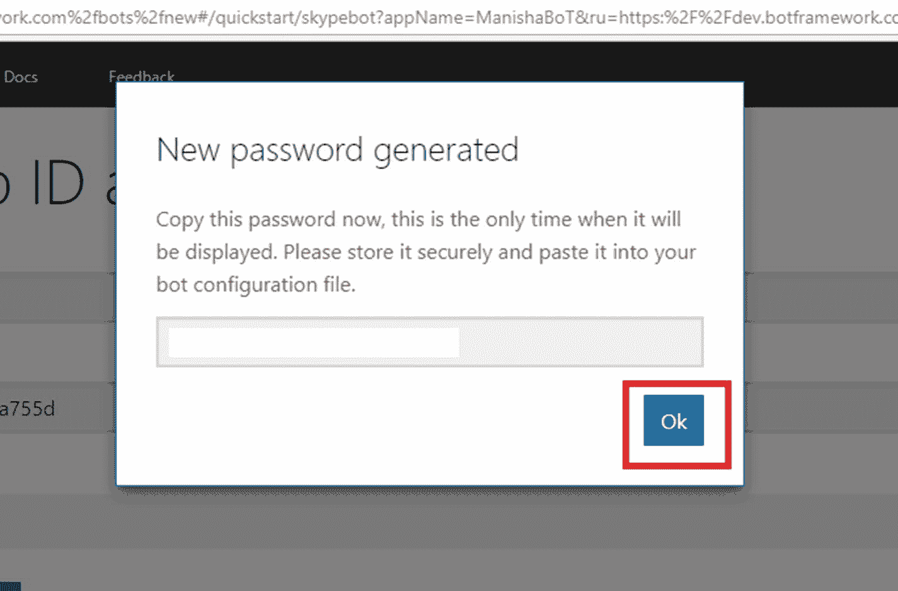

图 2-33

新密码已生成

要从 Visual Studio 发布机器人，右键单击它以访问“发布”选项，如图 2-34 所示。

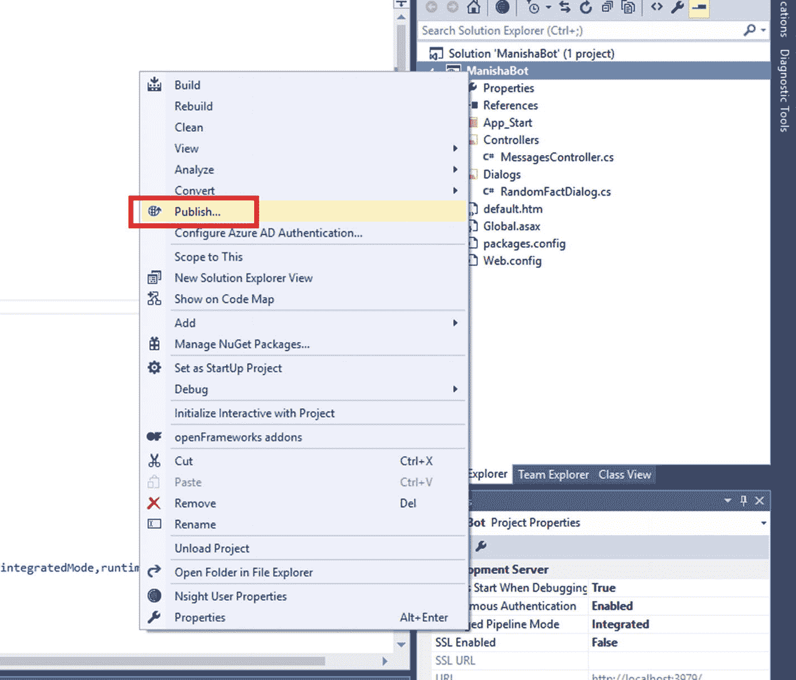

图 2-34

准备发布

打开 App Service 屏幕，如图 2-35 所示。点击 Azure 服务的“新建”按钮。

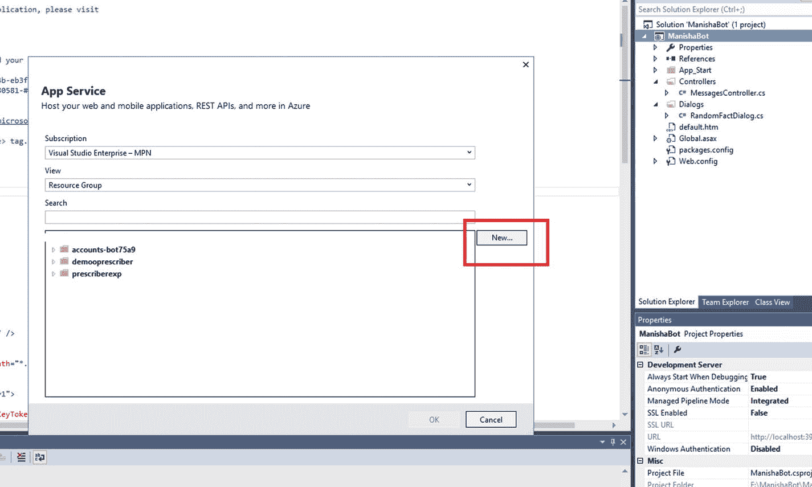

图 2-35

点击“新建”按钮

机器人已准备好发布。您将验证连接并发布，如图 2-36 所示。

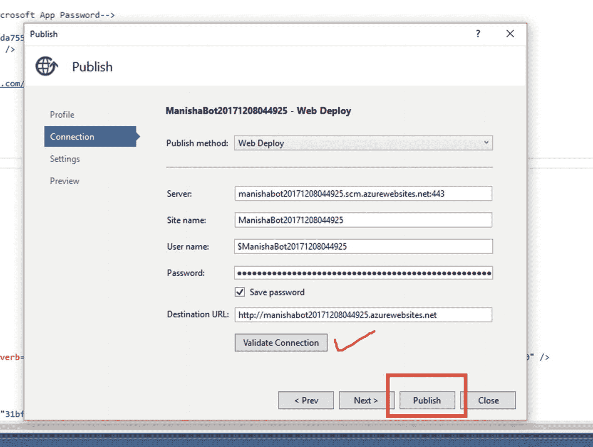

图 2-36

验证并发布机器人

机器人发布后，您需要编辑 Bot 框架门户中的配置。图 2-37 显示了 Azure 网页的样式。

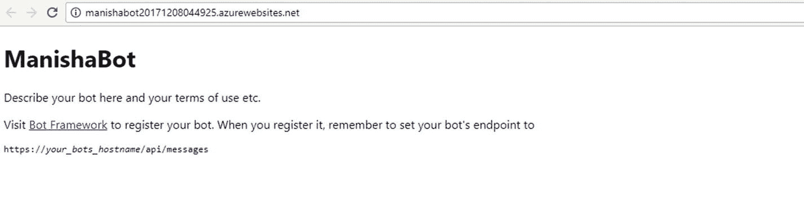

图 2-37

机器人已发布在 Azure 上

现在，返回到 Bot 框架门户。您需要编辑机器人的消息端点。它将是 Azure 网站，后面跟着 `/api/messages`。见图 2-38 中的下划线部分。

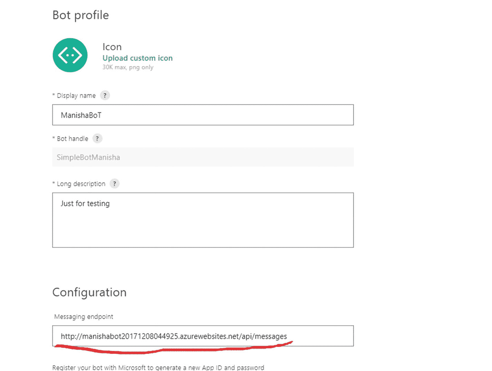

图 2-38

在配置选项中添加详细信息

机器人现在已准备好并位于云端。

## 结论

本章介绍了 Microsoft Bot Framework，以便你了解其基础知识，并将机器人发布到云端。

你学习了 Bot Framework 模板，并创建了一个可以识别发送给机器人的字符的示例。你看到了如何在主机器人框架逻辑中引用类文件。接下来，你学习了如何登录到 Bot Framework 网站，以生成用于你的 `web.config` 文件的应用程序 ID 和密码。最后，你学习了如何将机器人从 Visual Studio 发布到 Azure 云。

这第一次介绍构成了理解机器人框架工作原理的基础。在下一章中，你将了解来自其他组织的新机器人。
