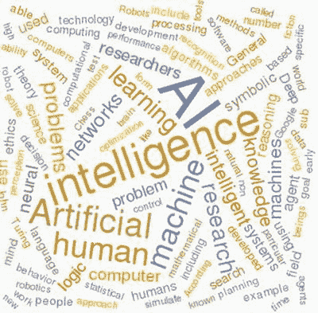

# 1. 人工智能简介

本章提供了对人工智能（AI）的简单介绍，这反过来又有助于提供一个框架来理解人工智能是什么以及为什么它是一个如此令人兴奋且快速发展的研究领域。让我们从一些关于人工智能起源的历史事实开始。

## 人工智能历史起源

令人惊讶的是，人工智能，或者类似的东西，已经存在了很长时间。有记录显示，古希腊哲学家讨论过具有内在智能的自动机或机器。1517 年，布拉格的哥莱姆被创造出来；它如图 1-1 所示。

图 1-1。

布拉格哥莱姆

哥莱姆是由粘土制成的，但根据犹太民间传说，它可以被赋予生命来执行各种报复和报复行为，针对那些对犹太人进行反犹主义行为的人。

著名的法国哲学家勒内·笛卡尔在 1637 年关于方法的论文中写道，机器智能是不可能的。笛卡尔并不是提倡人工智能，但这篇论文确实表明它在他心中有所考虑。

一个更为奇幻的人工智能实验例子——或者更准确地说，是一个骗局——是一个在 18 世纪末到 19 世纪中叶在欧洲流传的自动下棋选手。它被称为“土耳其人”。现代邮票上的它的一幅石版画如图 1-2 所示。

图 1-2。

自动下棋选手

据称，它是一台智能机器，可以与人类对手下棋。实际上，有一个人类棋手被塞进了机器的支撑箱里。他操作操纵杆来移动机器的棋子。我想，一定有一个微型潜望镜或窥视孔，以便让这个隐藏的棋手有机会监视棋盘。这个名字“土耳其人”来自德语单词 Schachtürke，意为“自动棋手”。隐藏在箱子里的典型的人类棋手技艺高超，他经常在对阵著名对手的比赛中获胜，包括拿破仑·波拿巴和本杰明·富兰克林。直到许多年后，才有了真正能够进行合理棋局的机器。

科学人工智能方法的诞生直到 1943 年，随着麦卡洛克和皮茨发表的一篇论文，他们描述了“感知器”，这是一个基于真实生物脑细胞（神经元）的数学模型。在他们的论文中，他们准确地描述了神经元细胞以二进制方式放电，类似于电子二进制电路。他们还远远超出了这个简单的比较，展示了这些细胞如何随着时间的推移动态地改变其功能，本质上创造了基本的行动行为。这篇开创性的论文是建立了一个重要的 AI 研究领域——神经网络研究——的第一个系列论文中的第一篇。我将在后面的章节中更详细地讨论这个话题。

在 1947 年，艾伦·M·图灵写道：

> 在我看来，这个问题，即在合理短的时间内提供大量内存，比在高速下进行乘法等操作更为重要。如果机器要足够快以使其具有商业价值，速度是必要的，但如果要能够进行比相当琐碎的操作更复杂的操作，那么大量的存储是必要的。因此，存储能力是更基本的要求。

图灵，许多读者可能认识他为解码德国恩尼格玛机器的天才，这大大缩短了二战的持续时间，他也在这段简短的文字中认识到，任何未来的机器“智能”都将基于有足够的机器内存可用，而不仅仅依赖于计算速度。我将在本章稍后讨论图灵测试时，对图灵有更多的话要说。

在 1951 年，一位名叫马文·明斯基的年轻数学博士候选人，与爱德蒙兹院长一起，设计并构建了一台基于麦卡洛奇和皮茨论文中描述的感知器原理的模拟计算机。这台计算机被命名为随机神经网络模拟强化计算机（SNARC）。它由 40 个真空管神经元模块组成，这些模块又控制了许多额外的阀门、电机、齿轮、离合器和执行器。这个系统是一个由赫布突触组成的随机连接网络，构成了一个神经网络学习机器。SNARC 可能是第一个人工自学习机器。它成功地模拟了老鼠穿越迷宫寻找食物的行为。这个系统表现出一些基本的“学习”行为，使得老鼠模拟最终能够解决迷宫。

人工智能进步的一个真正转折点发生在 1956 年，当时在达特茅斯学院举行了一次人工智能会议。这次会议是在麦斯基、约翰·麦卡锡和克劳德·香农的要求下举行的，旨在探索人工智能这一新领域。克劳德·香农因其在美国新泽西州霍姆德尔著名的贝尔电话实验室所取得的杰出工作而经常被称为“信息论之父”。

约翰·麦卡锡也不是等闲之辈，他是第一个使用“[人工智能](https://en.wikipedia.org/wiki/Artificial_intelligence)”这个短语的人，同时也是 Lisp 编程语言家族的创造者。他在 ALGOL 编程语言的设计中发挥了重要作用。他还极大地贡献了计算机[时分共享](https://en.wikipedia.org/wiki/Timesharing)的概念，这使得现代计算机网络成为可能。麦斯基和麦卡锡也是麻省理工学院媒体实验室的创始人，该实验室现被称为麻省理工学院计算机科学与人工智能实验室。

回到 1956 年的会议，麦卡锡提出了现在已成为经典的 AI 定义，据我所知，这仍然是大多数人被要求定义 AI 时使用的“黄金标准”：

> 这是制造智能机器的科学和工程，特别是智能计算机程序。它与使用计算机来理解人类智能的类似任务相关，但人工智能不必局限于生物可观察的方法。

麦卡锡在这个定义中使用了“人类智能”这个短语，我将在本章稍后进一步探讨。这次会议还提出了许多其他基本的 AI 概念，我在这本书中无法进一步解释，但我敦促感兴趣的读者进一步探索。

20 世纪 60 年代在人工智能研究方面是一个非常进步的十年。可以说，纽厄尔和西蒙在详细阐述通用问题求解器算法方面的工作是突出的。这种方法结合了计算机和人类解决问题的技术。不幸的是，计算机的发展仍在演进中，内存和速度能力不足以高效地处理算法的要求。 (记住我之前讨论过的图灵的警告。) 通用问题求解器项目最终被放弃——不是因为它在理论上是错误的，而是因为实现它的硬件根本不可用。

20 世纪 60 年代人工智能的另一个重大贡献是洛夫蒂·扎德引入了模糊集合和逻辑，这是令人印象深刻的人工智能分支——模糊逻辑的基础。扎德讨论了计算机不必一定以精确和离散的逻辑模式行为，而是采取更类似于人类的模糊逻辑方法。我在第五章中介绍了一个有趣的模糊逻辑项目。

20 世纪 60 年代进行的研究中不幸的一个结果是预测计算机可以模仿人脑。当然，当时可用于进行关于人脑如何真实运作的基础研究计算能力是根本不存在的。这导致了人工智能社区中的许多失望和幻灭。

模仿或以某种方式复制人脑的工作过程，并将这种功能放入机器中的过程被称为经典的人工智能方法。这导致了人工智能社区内部的深刻分歧，许多研究人员认为机器应该以自己的方式变得智能，而不是模仿人类智能。后一种方法被称为现代人工智能。

在 20 世纪 60 年代末，人们投入了大量精力研究如何让计算机通过自然语言而非计算机代码与人类进行对话。在这段时间里，约瑟夫·魏森鲍姆（Joseph Weisenbaum）创造了一个非常巧妙的程序，名为 ELIZA。尽管按照今天的标准来看它相当原始，但它仍然能够欺骗一些用户，让他们误以为自己在与另一个人而不是一台机器进行对话。ELIZA 项目引发了一个非常有趣的话题，即如何判断一台机器是否达到了某种程度的“智能”。一个很好的答案就是所谓的图灵测试，我之前提到过。在 1950 年《计算机制与智能》杂志的一篇文章中，艾伦·图灵（Alan Turing）讨论了他认为使一台机器达到智能状态的充分条件。他基本上认为，如果一台机器能够成功地欺骗一个知识渊博的人类观察者，让他误以为自己是在与另一个人而不是机器进行对话，那么这台机器就可以被认为是智能的。当然，对话必须通过一个中立的通信渠道进行，以避免声音或外观等明显线索暴露出机器。20 世纪 50 年代使用的通信设备是电传打字机，用于实现中立渠道。即使考虑到今天的科技，图灵测试仍然是一个合理的基准。甚至可以使用高度有效的现代语音识别和合成技术来进一步欺骗观察者。图灵测试在哲学家和其他讨论智能本质的感兴趣人士中仍然存在争议。

在 20 世纪 70 年代，由于计算技术的缓慢发展，人工智能的发展缓慢。人们对自然语言处理、图像识别和分析非常感兴趣，但不幸的是，研究人员可用的计算机仍然相当有限，无法完成这些困难的任务。很快，很明显，在人工智能真正取得进展之前，必须显著提高处理能力。此外，还有许多关于人工智能的哲学争论，包括约翰·塞尔（John Searle）提出的著名的“中文房间”论证。明斯基（Minsky）反对塞尔的假设，这仅仅导致了持续研究中大量的内斗和误导。与此同时，麦卡锡（McCarthy）主张一种现代人工智能方法，他认为人类智能和机器智能是不同的，应该这样对待。

20 世纪 80 年代，由于个人电脑的出现和许多研究人员采用麦克阿瑟的实用主义方法，人工智能的发展取得了显著的进步。在这个时间段内，专家系统的出现显示出巨大的潜力，并在商业和工业/制造业领域得到了实际应用。我在后面的章节中展示了几个专家系统应用。经典的 AI 方法继续存在；然而，现代方法迅速得到认可，并且更重要的是，它被用于许多现实世界的情况。巧合的是，当时在机器人技术和真实机器人开发方面也做了很多工作。人工智能研究自然地转向了这个领域，因为这两个领域似乎完美互补。实用人工智能的时代终于到来了，未来的发展也迅速到来，因为现代计算的时代也在发生。正是在这个时候，摩尔定律的真实影响变得明显。摩尔定律指的是英特尔创始人之一戈登·摩尔在 1965 年所说的话：“自集成电路发明以来，每平方英寸的晶体管数量每年翻一番。”

这种密度的指数级增长似乎与计算机性能的惊人提升密切相关，这对于人工智能的改进和增长是极其需要的。

在 1990 年代取得了显著的里程碑，包括 IBM 的 Deep Blue 计算机系统在 1997 年击败世界围棋冠军、加里·卡斯帕罗夫的令人印象深刻的胜利。尽管这场胜利非常令人印象深刻，但有人对此事件泼了冷水。这场胜利的冷酷现实应该被以下麦克阿瑟的观察所缓和，当时他被问及计算机是否能够赢得围棋，一种传统的中国棋类游戏：

> 中国和日本的围棋也是一种棋类游戏，玩家轮流移动。围棋揭示了我们对人类游戏中所涉及的智力机制的现有理解存在的弱点。尽管投入了相当大的努力（不如围棋那么多），围棋程序仍然是非常糟糕的玩家。问题似乎在于围棋的位置必须心理上分成一系列假设，这些假设首先分别分析，然后分析它们的相互作用。人类在围棋中也使用这种方法，但围棋程序将位置视为一个整体。围棋程序通过进行数千次或 Deep Blue 案例中的数百万次计算来弥补这种智力机制的缺乏。

这种先见之明的分析应该可以缓解任何读者对计算机在许多科幻电影中获得的类似于《终结者》系列、《2001 太空漫游》和经典电影《电子战》中的人类水平智力的恐惧。在计算系统真正变得智能之前，还有很长的路要走，还有更多研究需要完成。这是下一节的主题。

## 智力

讨论智能的本质始终是初学者人工智能课程中的主题。学生们在试图理解如何定义智能以及如何识别它时，最常陷入循环推理。探索智能通常也会导致创建几乎无穷无尽的问题列表，例如：

+   鼠是否智能？

+   对于一台机器来说，智能意味着什么？

+   海豚是海洋中最聪明的哺乳动物吗？

+   外星人将如何识别地球上的智能？

可以无限地提出类似的问题。也许，回顾过去，仅仅提出这样的问题就是智能的明确标志。现在您应该明白我所说的循环推理是什么意思了。事实证明，达成对智能的普遍定义是一项困难，如果不是不可能的任务。例如，以下是从 Meriam-Webster 在线词典中找到的智能的定义：

1.  a (1): 学习或理解或处理新或困难情况的能力：[理由](https://www.merriam-webster.com/dictionary/reason)；也：合理运用推理的能力（2）：应用知识来操纵环境或抽象思考的能力，这种能力可以通过客观标准（如测试）来衡量，b 基督科学：神圣心智的基本永恒品质，c：思维敏捷：[精明](https://www.merriam-webster.com/dictionary/shrewdness)

1.  a：智能实体；特别是：[天使](https://www.merriam-webster.com/dictionary/angel)，b：智能思想或心智 <宇宙智能>

1.  理解的行为：[理解](https://www.merriam-webster.com/dictionary/comprehension)

1.  a：[信息](https://www.merriam-webster.com/dictionary/information)，[新闻](https://www.merriam-webster.com/dictionary/news)，b：关于敌人或可能的敌人或地区的情报；也：从事获取此类情报的机构

1.  执行计算机功能的能力

如您所 readily see，词典编辑们在尝试捕捉智能的定义时具有广泛的多样性，包括人类行为、精神层面、宗教，最后还有一点有趣的是，第五级定义是执行计算机功能。

在线 Macmillan 词典提供了一个更为简洁的定义：

> [理解](http://www.macmillandictionary.com/us/dictionary/american/ability_1) 和 [思考](http://www.macmillandictionary.com/us/dictionary/american/think_1) [事物](http://www.macmillandictionary.com/us/dictionary/american/thing) 的能力，以及获取和使用 [知识](http://www.macmillandictionary.com/us/dictionary/american/knowledge) 的能力

我坚信，如果我访问其他在线词典，我会看到许多其他的定义，这就是为什么试图确定智能是如此困难。因此，没有关于什么是智能的共识标准，使得在一致和公认的基础上识别智能变得几乎不可能。

智能也与感官输入和运动或驱动输出有关。显然，我们的大脑包含在我们的身体中，我们的身体也配备了五个感官系统——视觉、听觉、味觉、触觉和嗅觉。这些感官系统是我们智能的组成部分；然而，已经反复证明，仍然有一些非常聪明的人失去了他们的一个或多个感官输入。人类身体在特定感官系统受伤或被破坏时具有补偿能力，这一点相当非凡。同样，人类智能也与我们的运动技能有关；然而，我会争辩说，这不如感官输入那么重要。失去说话的能力并没有减少史蒂芬·霍金（Stephen Hawking）的智力和天才。拥有行走、奔跑、开车或驾驶飞机的能力给个人提供了探索和理解他们环境的机会，从而扩展他们的知识和经验，但并不一定提高或扩展他们的智能——除非你认同知识和智能是同义的概念。

研究动物并考虑它们是否具有智能只是小步之遥。鸟类可以飞翔，通常比人类有更好的视力。这难道意味着它们在至少这两个领域拥有超越人类物种的智能吗？答案显然是未知的，这导致以下合理的结论：动物和机器智能应该简单地接受其本质，而不应与人类智能相比较。试图进行这种比较就像比较苹果和橘子一样；这真正是没有意义的。

在前面的讨论中，我的目标是重申现代人工智能方法的假设，即机器智能应该单独考虑，而不是与人类智能相比较。这是本书的潜在前提，其中项目探索机器的优势，但既不期望也不希望模仿或模拟人类智能。

## 强人工智能 vs. 弱人工智能，广人工智能 vs. 窄人工智能

除了您可能从本节标题中推断出的描述符外，还有其他一些常用于人工智能的描述符。试图将人类推理模拟到尽可能高水平的 AI 工作和研究有时被称为强人工智能。我推测，古典人工智能方法的倡导者也会强烈支持这个术语。这个强烈的形容词与仅仅关系到使实际 AI 系统有效运行的弱人工智能形容词形成鲜明对比。这种方法就是我所说的现代方法。我不知道这些强弱术语是如何产生的，但我怀疑它们的存在是为了给现代方法投下一种特权阴影，这是不幸的，因为两种方法都是同样有效且应得到同等重要性和认可。我之所以引入这些术语，是为了让您在偶然阅读关于 AI 应用或项目时理解它们的含义。我不使用这两个术语；相反，我只是专注于 AI 应用——无论它们是强人工智能还是弱人工智能。

在本节标题中我使用的另一对术语是广义人工智能和狭义人工智能。广义人工智能关注一般推理，与特定任务或应用无关。我想广义人工智能和强人工智能可能会倾向于有自然的联系，因为它们都与推理和思考的人类背景相关。狭义人工智能专注于应用于特定任务的 AI，并且并不过于泛化。然而，也有一些例外，这些例外往往容易打破广义和狭义人工智能的定义。谷歌开发了在预测或描述“事物”应该如何描述或排列方面表现卓越的系统。谷歌应用在概括以及具体编目功能方面都表现出广义和狭义人工智能的特点。亚马逊同样拥有智能代理，它们在概括和做出具体客户推荐方面都表现出色。

我用图 1-3 结束本节，这是一个使用运行在 Raspberry Pi 3 上的 Mathematica 创建的词云。这个图只是一个图形表示，展示了与人工智能常用的许多不同单词。本图中的所有单词都来自维基百科。

图 1-3。

人工智能词云

## 推理

我在之前的讨论中反复使用了“推理”和“推理”这两个词。但它们究竟是什么意思，它们与 AI 有什么关系呢？推理描述的是创造或考虑一个理由。这个词的意思是思考事物或想法如何与已知的事物或更简单地说，与知识相关。一些推理的例子可以帮助阐明我试图传达的思想。

+   学习是基于检查或讨论现有知识集来构建新的知识集的过程。在这个背景下，集合是指任何数据集合，无论是否基于现实。

+   语言的使用是将书面或口头上的词语转化为思想和支持性关系的过程。

+   基于逻辑的推理意味着根据逻辑关系决定某事是否为真。

+   基于证据的推理意味着根据所有可用的支持性证据决定某事是否为真。

+   自然语言生成旨在使用给定的语言满足沟通目标和目的。

+   问题解决是确定如何实现既定目标或目标的过程。

这些活动中的任何一项都必须必然涉及推理以达到令人满意的结果。请注意，在列表中，我并没有将推理限制在只有人类身上。其中一些活动非常适合由机器实现，在某些情况下甚至可以由动物实现。有无数实验成功地证明了动物可以解决问题，尤其是如果涉及到获取食物的话。

最近出现了大量基于语音激活的互联网设备，包括亚马逊的 Alexa、微软的 Cortana、苹果的 Siri 和谷歌的 Home。这些设备或应用程序可以是独立的，也可以安装在智能手机上。无论如何，它们都配备了识别语音查询、将查询转换为可操作的互联网查询，并最终以高度可理解的方式将结果传达给用户，通常是一个发音清晰的女性声音。这些设备/应用程序必须使用某种程度的推理来执行其预期功能，即使它们在回复时并不理解用户的请求。

## 人工智能类别

表 1-1 是我创建的列表，用来展示构成现代人工智能的大多数类别。我认为它并不全面。可能有一些类别被无意中遗漏了。我明确地省略了一些类别，例如人工智能的历史和哲学，因为它们与这个表格的目的没有直接相关性。

表 1-1。

现代人工智能类别

| 类别 | 简要描述 |
| --- | --- |
| 情感计算 | 研究和开发能够识别、解释、处理和模拟人类[情感](https://en.wikipedia.org/wiki/Affect_(psychology))的系统和设备。 |
| 人工免疫系统 | 主要基于脊椎动物[免疫系统](https://en.wikipedia.org/wiki/Immune_system)中固有的原则和过程的智能、基于规则的机器学习系统。 |
| 聊天机器人 | 一种旨在通过文本或音频通道与一个或多个人类用户进行智能对话的对话代理或计算机程序。 |
| 认知架构 | 关于人类心智结构的理论。[人类心智](https://en.wikipedia.org/wiki/Human_mind)的一个主要目标是将认知心理学中的概念纳入一个全面的计算机模型。 |
| 计算机视觉 | 一个[跨学科领域](https://en.wikipedia.org/wiki/Interdisciplinarity)，研究计算机如何从[数字图像](https://en.wikipedia.org/wiki/Digital_image)或[视频](https://en.wikipedia.org/wiki/Video)中获得高级理解。 |
| 进化计算 | 基于达尔文主义原理的进化算法的应用，其名称由此而来。这些算法属于一种试错问题求解器家族，并使用元启发式或随机全局方法来确定多种解决方案。 |
| 游戏人工智能 | 在游戏中使用的人工智能，用于生成[智能](https://en.wikipedia.org/wiki/Intelligence_(trait))行为，主要在[非玩家角色](https://en.wikipedia.org/wiki/Non-player_character)（NPC）中，通常[模拟](https://en.wikipedia.org/wiki/Simulating)类似人类的智能。 |
| 人机交互界面（HCI） | 研究计算机技术的设计和使用，重点关注人与人（[用户](https://en.wikipedia.org/wiki/User_(computing)))与计算机之间的接口。 |
| 智能软件助手或智能个人助理（IPA） | 一种能够为个人执行任务或提供服务的[软件代理](https://en.wikipedia.org/wiki/Software_agent)。这些任务或服务通常基于用户输入、位置感知以及从各种在线来源获取信息的能力。此类代理的例子包括[苹果](https://en.wikipedia.org/wiki/Apple_Inc)的 Siri、[亚马逊的 Alexa](https://en.wikipedia.org/wiki/Amazon_Alexa)、[亚马逊](https://en.wikipedia.org/wiki/Amazon.com)的[Evi](https://en.wikipedia.org/wiki/Evi_(software))、谷歌的 Home、[微软](https://en.wikipedia.org/wiki/Microsoft)的[Cortana](https://en.wikipedia.org/wiki/Cortana_(intelligent_personal_assistant))、开源的[Lucida](https://en.wikipedia.org/wiki/Lucida_(Intelligent_Assistant))、[Braina](https://en.wikipedia.org/wiki/Braina)（由 Brainasoft 为[微软 Windows](https://en.wikipedia.org/wiki/Microsoft_Windows)开发的软件）、[三星](https://en.wikipedia.org/wiki/Samsung)的[S Voice](https://en.wikipedia.org/wiki/S_Voice)和[LG G3](https://en.wikipedia.org/wiki/LG_G3)的[Voice Mate](https://en.wikipedia.org/wiki/Voice_Mate)。 |
| 知识工程 | 涉及到构建、维护和使用[基于知识的系统](https://en.wikipedia.org/wiki/Knowledge-based_systems)的所有技术、科学和社会方面。 |
| 知识表示（KR） | 致力于以计算机系统可以利用的形式表示关于世界的信息，以解决复杂任务，如诊断医疗状况或在[自然语言](https://en.wikipedia.org/wiki/Natural_language)中进行对话。 |
| 逻辑编程 | 一种主要基于[形式逻辑](https://en.wikipedia.org/wiki/Formal_logic)的编程类型。任何用逻辑[编程语言](https://en.wikipedia.org/wiki/Programming_language)编写的程序都是一组以逻辑形式表达的句子，表达关于某个问题领域的事实和规则。主要的逻辑编程语言家族包括[Prolog](https://en.wikipedia.org/wiki/Prolog)、[答案集编程](https://en.wikipedia.org/wiki/Answer_set_programming) (ASP)和[Datalog](https://en.wikipedia.org/wiki/Datalog)。 |
| 机器学习（ML） | 在人工智能的背景下，机器学习为计算机提供了无需明确编程就能学习的能力。浅层学习和深度学习是两个主要子领域。 |
| 多智能体系统（M.A.S.） | M.A.S.是一个由多个相互作用的[智能体](https://en.wikipedia.org/wiki/Intelligent_agent)组成的计算机化系统。 |
| 机器人学 | 机器人学是[跨学科](https://en.wikipedia.org/wiki/Interdisciplinarity)的[工程](https://en.wikipedia.org/wiki/List_of_engineering_branches)和[科学](https://en.wikipedia.org/wiki/Branches_of_science)分支，包括[机械工程](https://en.wikipedia.org/wiki/Mechanical_engineering)、[电气工程](https://en.wikipedia.org/wiki/Electrical_engineering)、[计算机科学](https://en.wikipedia.org/wiki/Computer_science)、人工智能以及其他领域。 |
| 机器人 | 机器人是一种机器，尤其是可以通过计算机编程的机器，能够自主执行一系列复杂的动作。 |
| 规则引擎或系统 | 基于规则的系统用于存储和操作知识，以便以有用的方式解释信息。 |
| 图灵测试 | 图灵测试是由[艾伦·图灵](https://en.wikipedia.org/wiki/Alan_Turing)于 1950 年开发的一种测试，用于检验机器是否能够[展现与人类相当或无法区分的智能行为](https://en.wikipedia.org/wiki/Artificial_intelligence)。 |

我将重复说明，这个表格并不涵盖所有现代人工智能研究及活动，但它确实突出了其中大部分重要的内容。在这本书中，我只展示了列出的几个 AI 类别，但即便如此，这些也应该能提供关于如何使用相对简单的计算机资源实现 AI 的合理见解。

在这一点上，我认为讨论人工智能及其对现代社会的影响是合适的，这种影响远远超出了本书的范围。我提供这次简短的讨论，希望增强读者对我如何影响我们所有人日常生活的知识和理解。

## 人工智能与大数据

大多数读者都听说过大数据这个词，但就像大多数人一样，你可能没有真正理解它是什么以及它如何影响我们的现代社会。大数据有许多定义，就像人工智能也有许多定义一样。我喜欢的一个简单定义是：具有巨大体积、快速速度和极大多样性的数据集合。

巨大体积的量级可以通过以下方式来描述：它通常以拍字节（PB）为单位进行衡量，其中 1 PB 等于一百万千字节（GB）。这确实是一个巨大的数据量。定义中提到的快速速度指的是数据生成或创建的速度。只需看看 Facebook，就能体会到数亿在线用户不断创建的新内容的速度。最后，定义中的“种类繁多”一词指的是构成巨大数据流的各种数据类型。这包括图片、视频、音频以及普通的文本。平均每张上传到 Facebook 的照片可能需要大约四到五兆字节的存储空间。将这个数字乘以不断上传的数百万张照片，你很快就会意识到大数据的本质。那么人工智能是如何影响大数据的呢？答案是，当人工智能学习系统应用于大数据集时，它允许用户从大量嘈杂的输入中提取有用信息。典型的能够处理大数据的计算机系统由数千个处理器以并行方式协同工作，以极大地加快通常称为 MapReduce 的数据减少过程。IBM 的沃森计算机就是这样一个系统的典型例子。它通过使用基于规则的引擎处理数千甚至数百万份医疗记录，实现了专家医疗系统。最终结果是，一个计算机系统帮助医生诊断疾病和相关疾病，这些疾病没有明显的或与已知疾病相关的症状。

亚马逊的网站集成了一个令人印象深刻的 AI 系统，该系统能够轻松地编制每个反复访问其网站的潜在或实际客户的详细资料。它将客户的搜索与搜索或咨询过类似产品的其他客户的搜索进行匹配。它还试图根据客户的过去搜索和订单预测可能引起网站访问者兴趣的内容。亚马逊系统使用的所有数据都是交易性的，基本上识别出可能引起其客户兴趣的内容。这种交易性数据，可能符合大数据的定义，是亚马逊 AI 计算机系统的主要输入。输出是之前提到的资料，但它也可能被视为附加在潜在或实际客户身上的特征集；例如，一个导致网站建议的结果可能如下所示：

“你可能对罗伯特·海因莱因的《月球是个严酷的女王》感兴趣，因为你购买了以下书籍：”

+   《满月》

+   《星球大战：帝国反击战》

+   《肖申克的救赎》

这份看似不相关的书籍列表可能表明，客户对月球、外太空的冲突或监狱中的不公感兴趣，所有这些都以某种方式触及了海因莱因的书籍。（顺便提一下，海因莱因的书籍在 1967 年获得了[雨果奖](https://en.wikipedia.org/wiki/Hugo_Award)，最佳科幻小说奖。）将客户过去的书籍购买与海因莱因的书籍内容之间的这种隐秘联系建立起来，需要大量的计算机分析工作以及访问庞大的数据库。

最大的全球大数据分析用户是美国政府在执行全球反恐战争（GWOT）中的行动。美国国家安全局（NSA）在检测可能/可能的本土恐怖袭击方面处于前沿。其年度机密预算估计超过 150 亿美元，其中大部分用于收集和分析各种大数据以对抗 GWOT。它收集的内容以及如何进行大数据分析是高度机密的，但可以合理地假设 NSA 专家使用了所有适当的 AI 技术，其中许多人我预计也是进行秘密 AI 研究的专家。这并不是我的阴谋论，而只是任何合理的门外汉都应该期望的事情。

本节总结了我对人工智能的介绍，尽管内容有些简略，但希望其中包含了足够的信息，为您开始研究特定的人工智能概念提供合理的背景。这将在下一章开始。

## 摘要

我以人工智能的历史概述开始本章，它始于古代并一直延续到现代。这表明人类长期以来一直在思考如何制造机器来完成智能行为。只是在最近，计算机才被开发出来，具备了实施智能行为的能力。

对经典和现代人工智能开发方法的差异进行了简要讨论。简而言之，经典方法试图让计算机模仿或模拟人脑，而现代方法则简单地利用计算机固有的速度和计算能力在其上实施人工智能。我还定义了额外的术语，例如广义人工智能和狭义人工智能，以及强人工智能和弱人工智能。

对智能本质的简要审视旨在激发您的兴趣，并思考您如何识别机器或动物中是否存在智能。随后是一个关于推理的简短部分，其中包含了一些例子，以帮助识别当推理被纳入人工智能应用时的情况。

接着，我列出了一系列人工智能类别，以帮助解释重要的和当前的 AI 研发工作。在这本书中，只有少数人工智能类别可以展示。

本章以讨论人工智能如何影响现代社会结束，尤其是在处理大数据时。
