# 2. 基本人工智能概念

在本章中，我介绍并探讨了人工智能至关重要的基本概念。

仔细研究这些概念，以获得对人工智能在最基本层面上如何工作的欣赏和理解，这一点非常重要。如果不先进行这项初步研究，就很难进行更高级的人工智能项目。我仅涵盖理解本书中项目所需的概念。让我们从一些基础概念讨论开始。

## 布尔代数

布尔代数是由乔治·布尔在 1847 年创立的。它是一种代数，其中变量值是[真值](https://en.wikipedia.org/wiki/Truth_value)，即真和假，通常分别表示为 1 和 0。有一些非常基本的布尔运算，这些运算在人工智能表达式中经常使用。以下列出了变量 A 和 B 的这些运算：

+   A 且 B

+   A 或 B

+   取反 A

+   取反 B

表达式 A AND B 也可以表示为 A * B，其中 * 符号代表 AND 运算。它并不是普通代数中使用的通用乘法符号的真实类比，但它足够接近，以至于大多数人可以互换使用。同样，表达式 A OR B 可以表示为 A + B，对于常规代数中使用的正常 + 符号，这个观察也是正确的。你很快就会看到，在布尔代数中存在 1 + 1 = 1 的情况，但在非布尔代数中显然不是这样。取反或补运算是一元运算，意味着它只使用一个操作数或变量；而 AND 和 OR 是二元运算，需要两个逻辑变量。取反运算有一个正式的符号（¬），但在程序中并不常用。相反，在大多数逻辑表达式中，通常在符号上方放置一个横线，这就是我使用的符号。

表 2-1 展示了各种 A 和 B 输入下，我刚才提到的运算的结果。请注意，我使用变量 C 来表示输出。

表 2-1.

基本布尔运算

| 操作 | 输入变量 | 输出变量 |
| --- | --- | --- |
|    | A | B | C |
| A * B | 0 | 0 | 0 |
| A * B | 1 | 0 | 0 |
| A * B | 0 | 1 | 0 |
| A * B | 1 | 1 | 1 |
| A + B | 0 | 0 | 0 |
| A + B | 1 | 0 | 1 |
| A + B | 0 | 1 | 1 |
| A + B | 1 | 1 | 1 |
| Ā | 0 | - | 1 |
| Ā | 1 | - | 0 |

逻辑符号可以很容易地排列组合，形成简单和复杂的布尔代数表达式。例如，AND 运算可以表示如下：

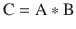

应该不难理解，通过使用超过两个变量并使用这些基本运算组合，可以创建出更加复杂的表达式。然而，重要的是要理解，最终所有表达式都会解析为真或假、1 或 0 的输出。

在布尔代数中也有三种二级运算：

+   异或

+   材料蕴涵

+   等价

在推理讨论中，我使用了这三种操作中的两种（材料蕴涵和等价），但我并没有特别指出它们的布尔代数名称。在人工智能领域，不同子领域之间有很多重叠，这些子领域共同构成了整体人工智能技术；因此，使用一个子领域中存在的特定名称的概念，同时在另一个子领域中也有不同名称或参考，并不罕见。只要你能掌握基本概念，这种区分不应该让你感到困扰。

### 一些额外的布尔定律

理解一些更基本的布尔代数定律也很重要，因为它们在许多章节中使用的逻辑表达式的组合中会被多次使用。它们在此简要描述。

这是一个德摩根定律的例子：

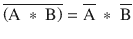

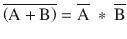

这是一个结合律的例子：

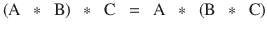

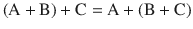

这是一个交换律的例子：

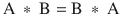

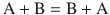

这是一个分配律的例子：

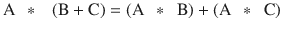

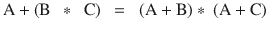

## 推理

推理是第一章中引入的推理过程的一部分。这个推理过程包括从一个初始前提或事实陈述移动到一个逻辑结论。推理通常分为三个类别。

+   演绎：基于已知或假定真实的前提，使用逻辑定律和规则推导出逻辑结论。

+   归纳：基于具体前提得出普遍结论。

+   归纳：将前提简化为最佳解释。

我使用推理演绎类别来讨论以下内容，因为它最适合即将介绍的专家系统主题。

有一个拉丁短语，modus ponens，意为“通过肯定来肯定的方式”。它代表了演绎推理的基本规则。用逻辑术语来说，这个规则可以表述为“P [蕴含](https://en.wikipedia.org/wiki/Material_conditional) Q，并且 P 被断定为真，因此 Q 也必须是真。”这个规则可以追溯到古代，并且被历代逻辑学家所使用，包括现代。这个规则可以分为两个部分。第一部分是一个条件陈述，传统上以“如果……那么”的形式表述。第二部分是条件陈述的结果；即“那么”之后的逻辑陈述。一般规则的条件陈述由两个前提组成：P 蕴含 Q 和 P 为真。P 也被称为条件陈述的前件。结果显然是 Q 为真。在 AI 中，这个简单的 modus ponens 规则的运用被称为正向推理，它是专家系统中的一个关键元素。我将在下一节中讨论它。

## 专家系统

专家系统是一种计算机程序，旨在使用特定问题域中存在的事实。然后，它以类似于人类专家使用相同事实进行推理并得出相似结论的方式，对这些事实得出结论。这样的程序或专家系统需要访问该域中的所有事实，以及被编程以遵循人类专家关于这些事实的规则，并从相同的事实中得出结论。有时这种专家系统也被称为基于规则或基于知识的系统。

第一个能够以人类专家水平执行的大规模专家系统被命名为 MYCIN。它被用作医生在诊断血液感染时的智能助手。MYCIN 包含了大约 450 条规则。它能够在与没有经验的医生相当的水平上做出正确的诊断。MYCIN 使用的规则是基于对大量该领域专家的访谈创建的，他们反过来又依赖于自己的经验和知识。在很大程度上，这些规则捕捉了超出医学教科书和标准程序的实际数据和知识。MYCIN 使用的规则与我之前介绍过的格式相同：

```py
if (conditional claim) then (consequent)
```

以下是一个例子：

```py
if (bacteria in blood) then (septicemia)
```

顺便提一下，败血症是一种非常严重的血液传染病，必须立即治疗。

我现在将条件陈述简单地缩短为“条件”这个词，它可能很复杂，因为它可以通过结合布尔代数部分中引入的逻辑运算符与其他条件相结合。我还会使用“结论”这个词代替“结果”，因为在专家系统设计中它更常用。

以下是一些复杂规则的通用格式：

+   if (condition1 and condition2) then (conclusion)

+   if (condition1 or condition2) then (conclusion)

+   if ((condition1 or condition2) and condition3) then (conclusion)

想象 MYCIN 规则创建的复杂性并不困难，这些规则基于问题域以及该域中所有变量或条件。为 MYCIN 开发的工具和技术后来被用于其他专家系统。

是否有可能在给定相同的事实或条件下得出不同的结论？答案是肯定的，这就是冲突解决介入的地方。

### 冲突解决

当使用给定条件应用规则时，会创建多个不同的结论，但只需要一个结论。这种冲突必须以某种方式解决。冲突解决的答案可以以以下列表中描述的几种方式提供。

+   最高规则优先级：专家系统中的每个规则都分配了一个优先级或数字。由最高优先级规则得出的结论是选中的结论。在这些情况下，也必须有一些决断程序。

+   最高条件优先级：专家系统中的每个条件都分配了一个优先级或数字。包含最高优先级条件（s）的规则得出的结论是选中的结论。在这些情况下，也必须有一些决断程序。

+   最具体优先级：使用最多条件的规则创建的结论是选中的结论。

+   近期优先级：由规则创建的最新结论是选中的结论。

+   上下文特定优先级：专家系统规则被分为组，其中只有一组到几组在任何给定时间处于活动状态或被使用。必须从活动规则组中生成一个选定的结论。

决定采用哪种冲突解决方法实际上取决于专家系统的性质。它可能确实需要应用不同的方法并评估哪种方法表现最好。当然，始终有默认决策，即不使用任何冲突解决方法，直接向人类用户展示所有结论并让他们决定。

规则也可以以分层的方式组合，以创建一个“推理”方法，反映人类专家在给定条件下如何运作。以下示例应有助于阐明规则组合是如何工作的。我选择使用一个在美式橄榄球联盟（NFL）中比赛的虚拟四分卫（QB）作为我的虚拟专家。假设情况是四分卫的球队处于三档，需要七码才能获得一档。一个合理的结论是，专家四分卫会选择传球来获得所需的码数，因为在三档时跑七码获得成功的概率很低，至少在 NFL 中是这样。

四分卫的下一个关注点是防守方的布局，因为它实质上影响了选择的传球类型。如果四分卫发现防守方可能会发动快速进攻，即他们发送一个或两个额外的冲传手来阻止四分卫，传球类型也可能改变。快速进攻几乎总是将防守方置于一对一或人盯人防守，从而增加了成功传球的可能性。实际的快速进攻通常会让四分卫尝试长距离传球进攻。当显示快速进攻但未执行时，四分卫通常会尝试短距离屏幕传球进攻，这通常会导致短距离的推进。

我刚才描述的场景可以分为计划和行动两个阶段。计划阶段开始于队伍之间的阵容排列。行动阶段开始于进攻方的中锋将足球传给四分卫。这两个阶段在生成分层规则结构时转化为层次。以下是为这个足球场景制定的一组合理的分层规则。

以下是一层 1 的规则：

```py
if (third down and long yardage to gain) then (pass play planned)
if (blitz suspected) then (long yardage pass planned)
```

这些是二层 2 的规则：

```py
if (blitz happens) then (execute long yardage pass play)
if (blitz does not happen) then (execute screen pass play)
```

这些规则显然是简化的，因为在现实中，四分卫有其他选择，这取决于他自己的运动能力——例如，他可以抓住足球并试图通过自己的努力获得第一次进攻机会。第 1 层显示的规则是相互独立的，而第 2 层显示的规则是完全依赖的，这意味着要么执行其中一个，要么“触发”，但永远不会同时执行两个。最后，规则集是动态的，因为条件直到触发任何规则之前的瞬间才确定。这与大多数常规专家系统形成鲜明对比，在应用规则集之前，条件是固定的并且完全可用。

### 反向链

触发规则以生成结论的过程，这些结论随后又作为后续规则的条件被使用，称为正向链。正向链是专家系统正常工作的方式。然而，有时从结论开始，并试图推断出产生该最终结论所需的条件，这非常有用且重要。这个过程被称为反向链，通常用于验证系统按预期工作，并确保不会得出不适当或“错误”的结论。这种验证在用于安全关键系统的专家系统中尤为重要，例如在陆地、海洋或空中车辆中使用的控制系统。

反向链也可以用来确定是否需要开发更多规则，以防止通过特定的输入条件得出未预料或奇怪的结论。

到目前为止，你应该已经拥有足够多的背景信息来使用 Raspberry Pi 开始一个初级的 AI 项目。这个项目包括在 Raspberry Pi 上安装 SWI Prolog 语言，并随后用它来对一个小型知识库进行查询。但在开始之前，让我们先说几句关于用于与 Prolog 一起工作的 Raspberry Pi 配置。

## Raspberry Pi 配置

我通过无头或 SSH 连接连接到一个独立设置的 Raspberry Pi。我的客户端电脑是一台 MacBook Pro，我用它来处理所有的手稿制作。它还允许我轻松地捕获控制 Raspberry Pi 的终端窗口的截图。我发现这种连接类型非常高效；它允许我完全访问 Raspberry Pi 以及我 Mac 上的所有文件。如果你选择以这种方式运行自己的系统，终端窗口中显示的所有内容都可以复制到直接连接到 Raspberry Pi 的显示器上。当然，在 Raspberry Pi 上的文件操作必须通过命令行来完成，而不是通过拖放点击——就像在 Mac 上那样。

## SWI Prolog 简介

AI 语言 Prolog 最初是由 20 世纪 60 年代到 70 年代初期的苏格兰、法国和加拿大研究人员共同创造的。考虑到现代计算机语言的生成速度，它已经存在很长时间了。最初，这个项目的目的是从通过自动化手段提取的法国文本中进行推理。这项工作涉及自然语言处理、计算机算法的开发和逻辑分析。Prolog 这个名字来自三个法语单词的组合：PROgrammation en LOGique。

Prolog 被认为是一种声明式编程语言，因为它使用一组称为知识库的事实和规则。Prolog 用户可以向知识库提出查询或问题，这些被称为目标。Prolog 通过逻辑推理对目标（s）做出回答，正如在推理部分所讨论的。通常，答案是简单的是或非，但它可能是数字的，甚至是文本的，这取决于目标是如何表达的。

Prolog 也被视为一种符号语言，完全与硬件或特定实现没有任何联系。由于其抽象级别，Prolog 通常被那些计算机知识有限的人使用。大多数用户在使用 Prolog 时不需要任何先前的计算机编程经验——至少在其最基本水平上，正如你很快就会体验到的。

从一开始，Prolog 就被 AI 社区视为使用符号实现 AI 的一个光辉典范。这种语言本质上是一种推理和逻辑过程，包含思考和智能的概念。虽然一开始相当简单，但随着研究人员向语言中添加更多功能和能力，Prolog 变得越来越复杂。在我看来，这对语言的推广既有好的一面也有不好的一面。曾经对非 AI 用户来说既简单又吸引人，但现在对 AI 初学者来说既复杂又令人畏惧。然而，不要害怕：在接下来的 Prolog 演示中，我会尽量保持简单明了。然而，请注意，你所看到的只是 Prolog 能力的“冰山一角”。

运行 Prolog 所需的计算能力与 20 世纪 70 年代相比发生了巨大变化，当时需要超级计算机，而如今，35 美元的单板计算机可以轻松且快速地处理 Prolog 查询。

## 在 Raspberry Pi 上安装 Prolog

以下说明将帮助你在一个 Raspberry Pi 上安装一个非常强大且有用的 Prolog 版本，名为 SWI Prolog。SWI 是荷兰语中表示社会科学信息学的缩写。SWI Prolog 的网站是 [www.swi-prolog.org](http://www.swi-prolog.org) 。我强烈建议你查看这个网站，因为它包含了许多有用的教程和其他关键数据。

要开始安装 SWI Prolog，你首先需要更新你的 Raspian 分发版。我假设大多数读者都在使用最新的分发版，名为 Jessie，这是在撰写本书时 Raspberry Pi 基金会提供的。

你需要执行的第一条命令是更新 Raspberry Pi Linux 分发版：

```py
sudo apt-get Update
```

更新操作只需几分钟即可完成。之后，你就可以准备安装 SWI Prolog。输入以下内容：

```py
sudo apt-get install swi-prolog
```

此命令安装 SWI Prolog 语言以及它在 Raspberry Pi 上运行所需的所有依赖项。这个安装过程可能需要几分钟或更长时间，具体取决于你使用的 Raspberry Pi 型号。

要测试安装是否成功，只需输入以下内容：

```py
swipl
```

你应该在监视器上看到以下文本：

```py
pi@raspberrypi:∼ $ swipl
Welcome to SWI-Prolog (Multi-threaded, 32 bits, Version 6.6.6)
Copyright (c) 1990-2013 University of Amsterdam, VU Amsterdam
SWI-Prolog comes with ABSOLUTELY NO WARRANTY. This is free software,
and you are welcome to redistribute it under certain conditions.
Please visit http://www.swi-prolog.org for details.
For help, use ?- help(Topic). or ?- apropos(Word).
?-
```

提示符是 `?-`，这意味着 Prolog 正在等待你的输入。假设你看到了这个启动屏幕，你就可以开始尝试使用 Prolog 了，这是下一节的主题。

## 初始 Prolog 演示

正如我所说的，你需要一个知识库来查询 Prolog。我使用的知识库直接来自 SWI Prolog 教程，该教程位于他们的网站上。这个知识库涉及太阳、行星和一个月亮。知识库只是一个文本文件，应该放在树莓派的 home 目录中。我使用默认的 nano 编辑器创建了此文本文件。我强烈建议你也使用 nano；然而，如果你愿意，当然可以使用其他文本编辑器。除非你确保所有隐藏的格式都被排除在文本文件之外，否则你不应该使用 Microsoft Word 或类似的强大文字编辑器。任何隐藏的格式都会导致 Prolog 程序产生错误，因此你将无法使用该知识库。

以下是一个知识库的列表，该知识库名为 `satellites.pl`，位于 `pi` 目录中。

```py
%% a simple Prolog knowledge base
%% facts
orbits(earth, sun).
orbits(saturn, sun).
orbits(titan, saturn).
%% rules
satellite(X) :- orbits(X, _).
planet(X) :- orbits(X, sun).
moon(X) :- orbits(X, Y), planet(Y).
```

关于这个知识库，你应该知道以下几点。注释以这些符号开始：`%%`。注释是为了人类读者；它们被 Prolog 解释器忽略。文件中的大小写计数（意味着 `x` 和 `X`）不是相同的符号。事实和规则总是以句号 `'.'` 结尾。

你必须使用 `consult` 命令来强制 Prolog 使用知识库。在这种情况下，命令的参数是知识库的名称，不带 `.pl` 扩展名：

```py
?- consult(satellites).
```

这是 `consult` 命令的简写版本：

```py
?- [satellites].
```

一旦知识库就绪，你就可以开始进行查询或设置目标。以下是一个简单的查询，询问地球是否是太阳的卫星：

```py
?- satellite(earth).
```

Prolog 的响应是 true，因为知识库中的一个事实是地球绕太阳运行，其中一个规则是将卫星定义为任何绕太阳运行的符号。当然，用于此规则的符号是文本“`earth`”。图 2-1 展示了涉及卫星、行星和月亮的五个查询。

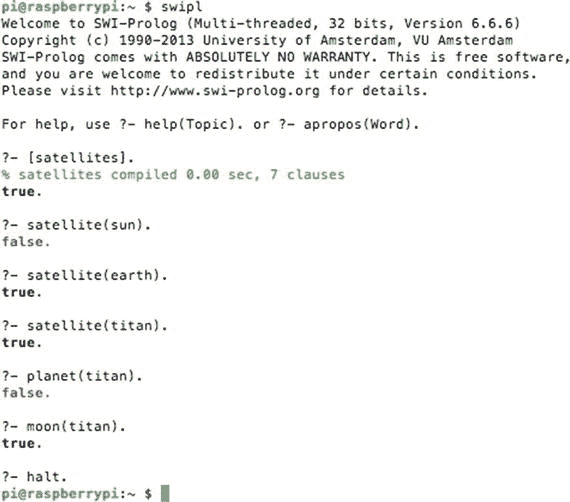

图 2-1.

Prolog 知识库查询

从技术上讲，月亮也绕太阳运行，因为它们的行星绕太阳运行，但这很快就会变得混乱，所以留给读者去思考。注意，图 2-1 中显示的最后一个交互式 Prolog 命令是 `halt`。该命令会导致 Prolog 停止并返回到默认操作系统的提示符。

显然，可以很容易地向知识库添加更多事实，以涵盖更多的太阳系。也可以轻松添加更多规则，以涵盖除确定行星、卫星和月亮状态之外的行为。这种灵活性是 Prolog 拥有的固有力量之一，可以处理更复杂和全面的知识库。

现在应该也很明显，通过其知识库，Prolog 是实现专家系统的自然方式。在专门讨论专家系统的章节中，详细考察了一个这样的系统。现在，是时候转移焦点，讨论模糊逻辑在人工智能中采取的方法了。

## 模糊逻辑简介

我以一个明显的观点开始本节，即模糊逻辑（FL）背后的理论没有任何模糊或不精确之处，之所以这样命名是因为它远远超出了传统逻辑中的一个核心概念，即一个陈述要么是真的，要么是假的（也称为二元决策）。在 FL 中，一个陈述可以是部分正确或错误。一个陈述也可以附加概率，例如“该陈述有 60%的可能性是真的”。FL 反映了现实，因为人类不仅做出二元决策，而且还会根据程度做出决定。当你调整淋浴的温度时，它不仅仅是热或冷，更有可能是温暖或稍微凉爽。当驾驶时，你可能会调整你的车速以符合名义上的交通流量，这可能会很容易地略高于限速；你不仅仅是超速或停车。这些基于幅度或程度的决策就在我们周围。FL 帮助在人工智能中捕捉这种决策。以下例子应该能更清楚地说明 FL 是什么以及它是如何工作的。

### FL 的例子

让我们回到淋浴的例子，来说明 FL 是如何工作的。我将从一些极端的水温范围开始：最冷是 50 华氏度，最热是 150 华氏度。总温度范围是方便的 100 华氏度，我安排了这个范围以简化计算。当然，任何极端的温度对于正常的淋浴来说都是不可接受的。现在，让我们取这个范围的百分比，看看会发生什么。假设淋浴温度设置为范围的 40%。这将使实际的淋浴温度为舒适的 90 华氏度，大多数人的舒适区都在这个范围内。将百分比与实际温度相关联的这种简单方法就是模糊化过程的开端，其中将现实世界的条件与 FL 值关联起来，或者在这个例子中是将温度与百分比关联起来。以下条件适用于淋浴温度模糊化的例子：

+   50 华氏度变为 0%，60 华氏度变为 10%，依此类推，直到 150 华氏度变为 100%

+   在极端范围内，每 1 华氏度的差异精确对应 1%

同样，创建一个简单方程将百分比与温度相关联也非常容易：

+   百分比 = (T – 50)，其中 T 是华氏度，范围在 50 到 150 之间。

一旦将现实世界的值进行了模糊化处理，它就可以传递给一组规则进行评估。这些规则与我之前在专家系统讨论中描述的完全相同，这进一步强化了人工智能中各种技术的整合。这些 FL 模型有时被称为模糊推理系统。

然而，一般形式的如果（条件）那么（结论）必须稍作修改以适应 FL。这意味着以下规则可能在传统的逻辑安排中适用：

```py
if (water temp is cold) then (turn on water heater)
if (water temp is hot) then (turn off water heater)
```

它们可以用一个更简单的与 FL 兼容的规则来替换：

```py
if (water is hot) then (turn on water heater)
```

但等等！乍一看，这个规则似乎没有意义。它似乎在说如果水是热的，就打开热水器。这是因为你在用传统意义上的真/假或开/关来思考。现在，重新思考一下关于水是否热的条件，不是从真或假的角度出发，而是将其视为一个从 0 到 100%的模糊百分比值。你应该开始意识到，打开热水器的结论部分也变成了一个百分比，但方向相反。例如，如果水是热的状态只有 10%为真，那么打开热水器的结论可能是其最大值的 90%，热水器将几乎以最大容量运行。然而，如果水是热的状态有 90%为真，那么打开热水器的结论可能是其最大值的 10%，热水器实际上会被关闭。确实需要一点努力来重新调整你对 FL 及其在规则系统中的应用方式的思考，但我保证这是值得的。

规则可以以类似于专家系统讨论中所示的方式组合。假设热水加热系统已经安装在一个能源分配网格中，该网格在一天中的不同时间有不同的千瓦时（kw-hr）使用率。可能有一个考虑不同能源成本（如下所示）的修改规则：

```py
if (water is hot and kw-hr rate is high) then (turn on water heater)
```

现在，假设模糊化的水温被分配了 45%的值，而模糊化的能源成本被评估为 58%，那么综合的条件值是多少？结果是，在 FL 规则构建中，当在条件表达式中使用`and`运算符时，最小百分比被传递下去。在这个例子中，这个值是 45%。以类似的方式，当在条件表达式中使用`or`运算符时，最大百分比被传递下去。你可能想知道在一个包含`and`和`or`运算符的复杂表达式中，最终的模糊化值是什么。答案是，最终使用`and`最小值，因为根据逻辑组合的规则，`and`运算符比`or`运算符具有优先级，如本章前面所述。

### 模糊化

去模糊化是将多个规则的数值结论组合起来产生一个最终、整体结果值的过程。最简单、最直接的方法就是简单地平均所有结论以产生一个单一的数字。如果所有规则都具有相同的重要性，这种方法是可行的，但通常并非如此。对规则的分配是通过权重因子完成的；例如，假设有四个规则，每个规则都有不同的权重，如表 2-2 所示。

表 2-2.

加权规则示例

| 规则编号 | 权重 | 结论值 | 结论值 * 权重 |
| --- | --- | --- | --- |
| 1 | 2 | 74 | 148 |
| 2 | 4 | 37 | 148 |
| 3 | 6 | 50 | 300 |
| 4 | 8 | 22 | 176 |

组合或去模糊化的值等于所有结论值的总和，乘以各自的规则权重，除以所有规则权重的总和。这如下所示：

去模糊化值 = (148 + 148 + 300 + 176)/(2 + 4 + 6 + 8) = 772/20 = 38.6

这个去模糊化的值也被称为加权平均值。

冲突解决通常不是 FL 规则应用的问题，因为权重值会引发对规则的优先级排序。

我在第五章中展示了一个全面的模糊逻辑（FL）示例，在那个地方我也介绍了关于特定 FL 项目中的模糊集概念。我觉得如果你看到模糊集应用于实际案例，而不是阅读抽象讨论，可能会更有意义。现在让我们将注意力转向问题解决领域。

## 问题解决

在 AI 讨论的这个阶段，所有关于问题域的各种问题/决策都已经在一系列全面的规则中仔细详细地描述了。但在问题解决的一般主题上并非如此。考虑一下在汽车 GPS 系统中知道你的起始点和终点这个经典例子。通常有几种方式可以在两点之间旅行，除了在孤立、沙漠高速公路上两点之间旅行的平凡情况。这类问题是 AI 非常擅长解决的问题，通常以快速和高效的方式进行。

让我们设定一个场景来检查解决这个问题的各种方面。考虑从波士顿到纽约市的公路旅行。有各种方式可以完成这次旅行。由于这是一个人口众多的走廊，两个地点之间有许多城镇和城市，因此从波士顿到纽约的路径有很多。将应用一些常识性指南，包括在旅行中任何城镇或城市只能访问一次。在旅行中反复循环通过特定的城镇或城市并没有太多意义。在做出旅行路径选择时需要考虑的关键现实因素是显现的成本：旅行时间、路径长度、燃油成本、通行费和交通密度，这些是实际或预期的延误。这些成本往往是相互依赖的，因为较长的路径会增加燃油费用，但并不一定增加旅行时间，因为另一条路径可能使用高速公路，汽车可以保持更高的恒定速度，与通过乡村道路和经过许多小城镇相比。但是，高速公路可能会拥堵，降低整体速度，甚至可能需要缴纳通行费，这会加剧痛苦。

确定最佳路径的第一种方法被称为广度优先搜索。

### 广度优先搜索

广度优先方法首先考虑波士顿和纽约市之间所有可能的路径，并在通过各种路径前进的过程中计算和累计总成本。这种蛮力方法既耗时又占用内存，因为计算机必须在决定最佳路径之前跟踪数千条路径的成本。当然，算法可能会通过自动排除所有次要道路，仅坚持州际高速公路来简化搜索。大多数现代车辆 GPS 系统优化的典型成本是路径长度，但并不总是这样。有时，最小化旅行时间是优先目标；这完全取决于提供给 GPS 系统软件开发者的要求。还有其他进行路径搜索的方法。

### 深度优先搜索

在深度优先搜索中，从起点到终点遵循一条路径，并计算其总成本。然后，遵循另一条路径并计算其成本。接下来，比较这两个成本，并拒绝成本较高的路径。然后，考虑另一条路径并进行成本比较。这个过程一直持续到考虑了所有可能的路径。这种方法最小化了内存需求，因为只保留最近和成本最低的路径。这种搜索类型真正的难题是它可能需要很长时间才能完成计算，尤其是在第一次路径选择不佳的情况下。搜索算法通常只对初始路径进行轻微的修改，然后计算其成本。不需要太多想象力就能认识到，找到一条好路径可能需要很长时间。

下一个搜索方法在这次搜索方法上有了很大的改进。

### 深度限制搜索

深度限制搜索与深度优先搜索非常相似，只是在确定成本之前，只选择有限数量的城镇和城市。当达到选择数量时，进行成本比较，并保留最低成本的路径。这种方法基于一个现实假设，即如果路径一开始比竞争路径便宜，那么它很可能继续保持这种状态。我所知道的任何路径搜索算法都不会在广泛不同的方向上搜索，以意外地通过包括一个与首选方向有极大偏差的路径来增加成本。选择合适的深度数是此算法的主要关注点。太少，你可能会轻易错过最佳路径；太多，它从计算负载方面开始类似于深度优先搜索。10 到 12 的深度限制是合理的。

### 双向搜索

双向搜索是深度限制搜索的一种变体，旨在大大提高后者的计算效率。在双向搜索中检查的路径首先被分成两部分，然后进行两个搜索：一个向起点方向进行，另一个向终点方向进行。这两个新的分支搜索路径都是深度限制的，因此只有预选数量的城镇和城市会被横跨。成本比较与深度限制搜索中进行的相同，保留最低成本的路径。这个搜索算法背后的思考过程是，将路径分成两部分并检查两个部分是一种更有效的方法，可以快速确定较低成本的路径。它还消除了常规深度限制搜索中存在的初始路径选择不佳的问题。

### 其他问题解决示例

在许多其他情况下，路径搜索都可以应用。解决迷宫是一个极好的例子，其中双向路径搜索可以轻松处理甚至最复杂的迷宫。搜索算法甚至可以应用于魔方解决方案，其最终目标是改变魔方每个面的颜色，使其成为单一颜色。

下棋与路径搜索问题域完全不同。这是因为游戏中有一个智能对手，他积极对抗移动，并最终达到将军的位置。这种新的动态在旅行者的路径搜索问题中是不存在的，因为所有的路径路线都是静态且不变的。在下棋中，计算机不能简单地检查所有未来的可用移动，因为这些移动依赖于对手的下一步——潜在的移动数量实际上是天文数字的。相反，计算机被设置为结合深度机器学习，这是下一节讨论的部分内容。

## 机器学习

机器学习最早由麻省理工学院教授亚瑟·塞缪尔（Arthur Samuel）在 1959 年定义，他是计算机科学和人工智能公认的先驱。塞缪尔教授表示：“机器学习作为一门研究领域，赋予计算机在没有明确编程的情况下学习的能力。”他本质上想要表达的是，计算机可以被编程为具有从输入数据中学习并基于相同数据做出后续预测的算法。这意味着学习算法可以完全脱离任何预编程或静态算法，并能够通过基于输入数据建立模型来做出数据驱动的决策或预测。

机器学习被广泛应用于许多现代应用中，包括电子邮件垃圾邮件过滤器、光学字符识别（OCR）、文本搜索引擎、计算机视觉等。

如果考虑专家系统，实现机器学习可能比你想象的要容易。在一个传统的专家系统中，有一系列通过访谈专家生成的规则，然后使用输入条件“触发”。如果一台机器能够采用一个或多个这些规则并对其进行轻微修改，然后尝试使用修改后的规则生成的结论会怎样？如果新的修改后的规则改进了最终结论，那么它们将被保留，并且可能比旧规则拥有更高的优先级，类似于冲突解决中所做的那样。另一方面，如果使用修改后的规则得出的结论不太理想，那么它们将被拒绝，并替换为额外的新的规则修改。如果这是一个持续的过程，难道不能说计算机确实在学习吗？在人工智能社区中，回答这类问题一直是一个有争议的领域。

实现机器学习有多种方法。我在接下来的几节中讨论了其中的一些。然而，我认为回顾一些关于学习的基本概念（预测和分类）是明智的，因为它们将应用于这个领域。

### 预测

预测是通过使用与输出相关的模型和特定的输入来确定新的输出值。也许最简单的预测器是通过 x-y 图的坐标原点的一条斜线。这可以通过以下方程轻松建模，并在图 2-2 中以图形方式展示。

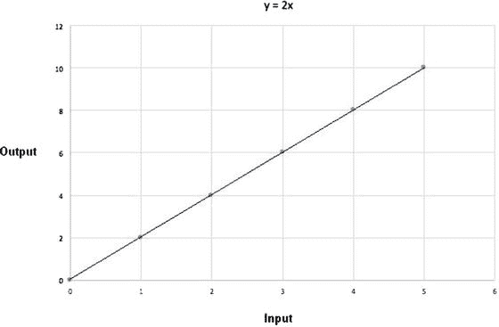

图 2-2.

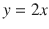

使用这个预测器有几个隐藏的约束条件。首先，是输入值的允许范围。在图 2-2 中，有五个输出值被绘制出来，它们对应着介于 0 和 10 之间的五个相应的输入值。通常，你可以假设输入值没有限制在这个相同的范围内，但现实世界中的模型可能会有限制，例如只允许非负数。此外，虽然方程在绘制区域内是线性的，但无法保证如果输入值超过某个值，现实世界的模型不会变得非线性。

如同你可能从简短的介绍中推断出的，有用的预测只与预测中使用的模型一样好。现实世界的模型通常比简单的直线方程复杂得多，因为建模现实世界的行为是一个复杂的问题。现在是我们考虑分类的时候了，它与预测同样重要。

### 分类

我通过陈述一个假设的情况开始分类讨论，在这种情况下，对某种蘑菇进行分类很重要。注意，讨论的蘑菇是虚构的，所以我的读者中的任何真菌学家（真菌专家）都不需要回应。假设有两种蘑菇类型：一种美味且无毒，另一种有毒且显然不可食用。它们看起来几乎相同；然而，可食用的品种更大、密度更低，而有毒的品种更小、密度更高。用于分类这些蘑菇类型的有两个参数或输入值：重量（以克为单位）和冠（或帽）周长（以毫米为单位）。密度是一个派生参数，如果需要，可以从重量和周长的两个基本测量值中确定。图 2-3 是两种蘑菇类型选择的 x-y 散点图。

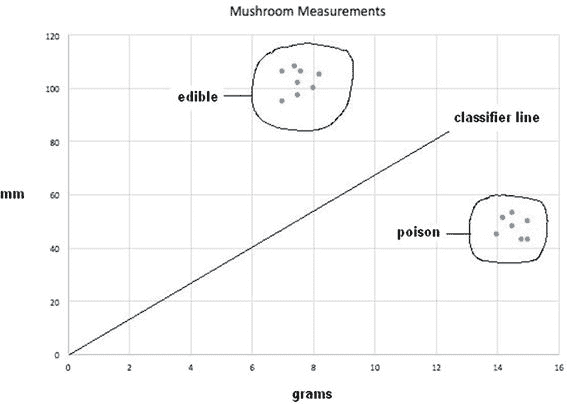

图 2-3。

蘑菇散点图

在图 2-3 中，我圈出了两种蘑菇类型的所有数据点，并放置了一条斜线，标记为分类线。这条线清楚地划分了两组，正如你可以轻易看到的，但问题仍然是如何最好地分析性地确定划分线。线的方程形式与图 2-1 中显示的完全相同，具有通用形式

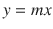

其中 m 是斜率。让我们尝试将 m 设为 2 作为初始值，看看会发生什么。图 2-4 展示了结果。

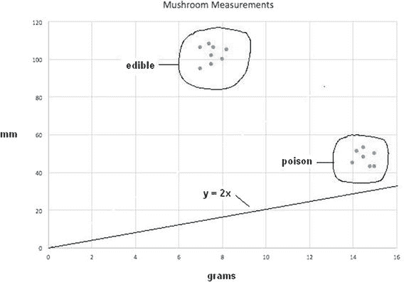

图 2-4。

带有分类线 y = 2x 的散点图

显然，这不是一个令人满意的结果，因为两个数据点簇都在线的同一侧，这证明了 m 的这个特定选择不能作为有用的分类器。需要的是一个精确确定 m 的方法，而不仅仅是使用盲目的手动试错方法。这种方法是机器学习过程的开始。

我首先需要建立一个所谓的训练数据集，这个数据集将被用来评估分类器函数的工作效果。这个数据只是每个簇中的一个数据点，如表 2-3 所示。

表 2-3。

训练数据

| 数据点编号 | 克 (x) | 毫米 (y) | 蘑菇类型 |
| --- | --- | --- | --- |
| 1 | 15 | 50 | 有毒 |
| 2 | 8 | 100 | 可食用 |

将数据点 1 的 x 值代入方程  得到的 y 值为 30，而不是目标值 100。这个差值+20 被称为误差值。为了得到一个可工作的分类器，必须最小化这个误差值。增加分类器线的斜率是唯一减小误差的方法。让我们用符号∆来表示斜率的变化，€表示误差，y [ t ]表示期望的目标值。因此，误差变为

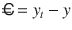

假设∆取一个值，使得 y [t]可以达到，展开前面的方程得到以下结果：

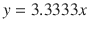

展开并收集项得到以下结果：

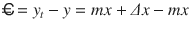


误差项的最终表达式非常简单，就是Δ值乘以输入值，如果你仔细思考一下，这完全是有道理的。重新排列最后一个方程并求解Δ得到

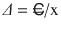

将初始试验值代入得到Δ值为

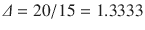

新的 m 值现在是 1.3333 + 2，即 1.3333，因此修正后的分类器线方程是


将之前的 x 训练值，即 15，代入现在得到期望的目标值 50。图 2-5 显示了修正后的分类器线在散点图上的位置。

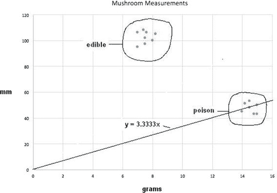

图 2-5。

修正后的分类器线 y = 3.3333x

### 进一步分类

虽然修正后的分类器线在某种程度上改善了分类，但仍然有一些有毒蘑菇的数据点位于或高于这条线，这使得这条分类器线仍然不满意。

现在，让我们使用数据点编号 2 和这个修正后的分类器线，看看结果如何。使用 x = 8 得到 y 值为 26.664。现在，实际的 y 数据点值是 100，这意味着€ = 100 – 26.664 = 73.336。新的 m 值可以计算如下：


将训练值 x（8）代入，现在得到期望的目标值 50。图 2-6 显示了新修订的分类器线在散点图上的位置。

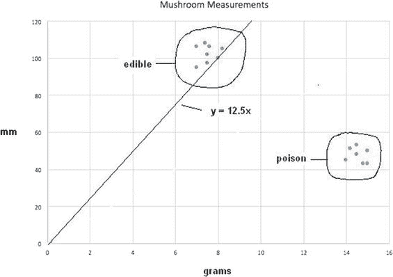

图 2-6。

修订后的分类器线 y = 12.5x

虽然这个新修订的分类器线确实将可食用的蘑菇与有毒的蘑菇分开，但它并不令人满意：仍然可能有一些可食用的蘑菇因为稍微低于这条线而被错误地拒绝。然而，现在存在一个更大的问题，因为所有的训练点都已经耗尽。如果我回到之前使用点号 1，它将回到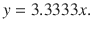分类器线。这是因为该过程没有考虑任何先前数据点的影响；也就是说，没有记忆。一种解决办法是引入学习率的概念，以调节修订，使其不会跳到极端，这正是目前发生的情况。

在人工智能中用于学习率的标准符号是η（希腊字母艾塔）。学习率是方程Δ中的一个简单乘数：

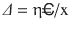

将η设置为 0.5 是一个合理的起点，如果只应用一半的更新。对于初始数据点，新的Δ = 0.5 * 1.333 = 0.667。因此，新的分类器线是 y = 2.667x。我不会展示这个变化的散点图线，但可以说，它略逊于原始版本。没关系，因为下一个版本应该会好得多。

对于数据点 2，新的分类器线是 y = 6.25x，使用新的η学习率。图 2-7 显示了这种新分类器线的散点图结果。

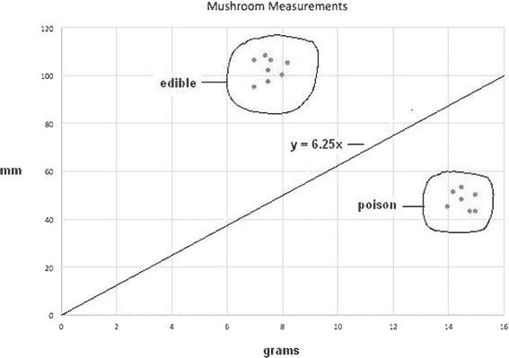

图 2-7。

修订后的分类器线 y = 6.25x

图 2-7 揭示了一条出色的分类器线，它正确地将两种蘑菇类型分开，最小化了错误分类的可能性。

现在是时候介绍神经网络的基本概念了，这对于实现实用的机器学习至关重要。

## 神经网络

神经网络的概念可以追溯到 1943 年 McCulloch 和 Pitts 的研究文章，该文章专注于神经计算。我在第一章 1 中首次提到了这些先驱研究者。这篇文章表明，简单的神经网络原则上可以计算任何算术或逻辑函数。要理解神经网络，你必须了解生物神经网络中的关键元素，即神经元。图 2-8 是人体神经元的示意图。

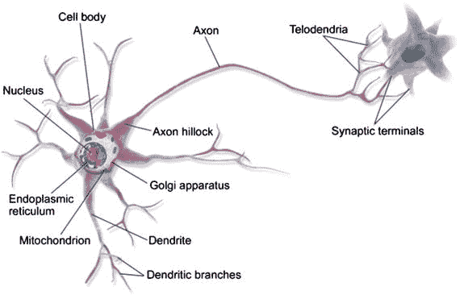

图 2-8。

人类神经元图（来源：维基百科）

图 2-9 是 1899 年由西班牙神经科学家[Santiago Ramón y Cajal](https://en.wikipedia.org/wiki/Santiago_Ram%C3%B3n_y_Cajal)绘制的鸽脑神经元草图。图中清晰地展示了树突和端点。


图 2-9.

鸽脑神经元草图（来源：维基百科）

现在的问题变成了：与现代计算机相比，为什么人脑在成功执行智能任务方面具有如此大的能力？一个答案是，一个成熟的人脑估计有超过 1000 亿个神经元。其精确功能仍然未知。为了了解如此大量神经元固有的能力，你可以简单地考虑一种简单的蚯蚓，它只有 302 个神经元，但仍能完成让大规模计算机困惑的任务。

检查单个神经元的运作方式有助于解释如何创建一个神经网络来解决人工智能问题。一个神经元的输出信号可以引起与其直接相连的神经元的兴奋或抑制。当一个神经元向连接的神经元发送兴奋信号时，它会被添加到该神经元同时接收的所有其他输入中，当所有输入的兴奋总和达到预设的水平或阈值时，该神经元就会放电。放电并不依赖于任何给定输入的水平；重要的是阈值被超过以启动放电。图 2-10 显示了典型神经元电信号的时序轨迹。

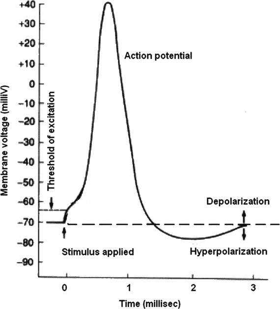

图 2-10.

神经元放电时间轨迹

如图 2-10 所示，峰值电压仅为 40 毫伏，总脉冲持续时间约为 3 毫秒（ms）。大多数神经元只有一个轴突，所以给定神经元中刺激输入和兴奋输出之间的延迟仅为 3 ms。尝试将这一点与人类反应时间联系起来是很有趣的。已验证的最快人类反应时间是 101 ms，平均大约是 215 ms。这是从感官输入，如视觉，到运动激活，如鼠标点击所需的总时间。假设信号从眼睛发送到大脑中相应的神经元需要 10 ms；也许从控制手指肌肉动作的神经元发送神经信号需要 20 ms，肌肉激活本身需要 40 ms。这留下了大约 145 ms 的总大脑处理时间。这个时间限制使得最长的神经元链长度约为 14 到 15。这个数字意味着必须有一个巨大的数量级的短并行神经元链相互作用来完成解释视觉信号、回忆适当的动作，并将神经控制信号发送到手指进行鼠标点击的任务。而且所有这些任务都是在仍然进行维持生命所需的背景自主活动的同时动态完成的。

神经元的兴奋作用可以通过步进函数大致模拟，如图 2-11 所示。

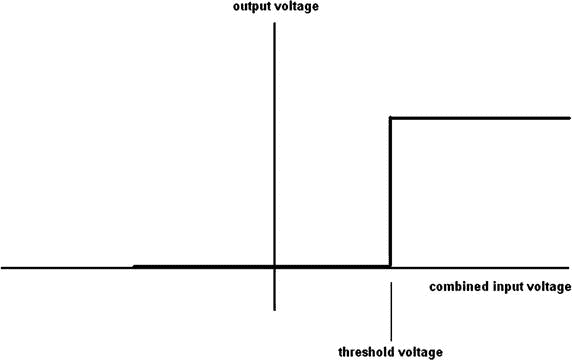

图 2-11.

步进函数

在自然界中，没有任何事物像步进函数那样尖锐和明确，尤其是对于生物功能。人工智能研究人员采用了 Sigmoid 函数来更真实地模拟神经元阈值函数。图 2-12 展示了 Sigmoid 函数。

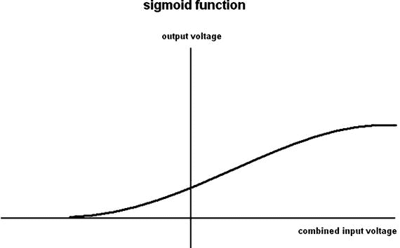

图 2-12.

Sigmoid 函数

Sigmoid 函数的解析表达式是

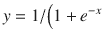，其中 e = 数学常数 2.71828… 

当 x = 0 时，y = 0.5，这是 Sigmoid 函数的 y 轴截距。这个函数被用作我们神经元模型的阈值函数。考虑图 2-13 一个非常基本的神经元模型，有三个输入（x1、x2 和 x3）和一个输出（y）。

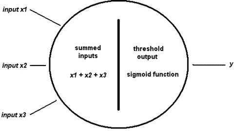

图 2-13.

基本三输入神经元模型

基本模型是有用的，但它并不是完整的答案，因为神经元必须连接到网络才能作为一个学习实体来发挥作用。图 2-14 展示了一个由三个神经元层组成的简单神经网络，分别标记为输入、隐藏和输出。

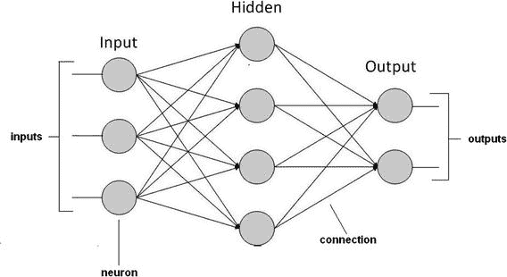

图 2-14.

示例神经网络

下一个显而易见的问题是这个网络是如何学习的？最简单的方法是调整连接的权重。这意味着调整从输出到输入的幅度或强度。因此，高权重意味着给定的连接被强调得更多，而低权重则被弱化。图 2-15 展示了分配给每个神经元或节点连接的权重。它们表示为 w[n,m]，其中 n 是源节点编号，m 是目标节点编号。

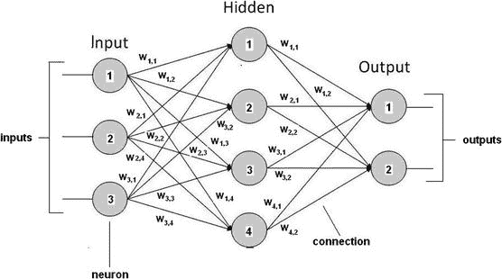

图 2-15.

带有权重互连的神经网络

在这一点上，我将推迟进一步的讨论，直到神经网络章节，在那里我将分配实际的权重并展示一个实际的学习系统。到目前为止，讨论的主要目的是为您准备神经网络实现。

## 浅层学习与深层学习

你可能已经听说过浅层和深层被应用于机器学习的术语。术语浅层似乎暗示着某种微不足道且轻量级的学习正在进行，而深层则意味着相反。实际上，浅层学习和深层学习只是主观形容词，用于描述神经网络，基于网络中实现的层数。实际上并没有一个正式的定义来区分浅层和深层学习，因为特定神经网络的效率由许多因素决定，其中之一是网络中的层数。提出这个观点的原因是因为我并不真正关心特定的神经网络被归类为浅层还是深层，但我关心它在满足期望的要求和标准方面的有效性。

## 进化计算

存在一个快速发展的 AI 领域，称为进化计算。它受到生物进化理论的启发，但使用基于群体的试错问题求解算法。反过来，这些问题求解器使用元启发式技术，这意味着它们依赖于统计和概率方法，而不是严格的确定性、分析技术。从广义上讲，进化计算问题从一组初始候选解开始，随后对这些解进行优化性测试。如果发现它们次优，则通过仅少量随机改变这些解，然后重新测试。每一代新的候选解都是通过移除前一代中确定的较不理想的解来改进的。一个生物学上的类比是，当种群受到自然选择和突变的影响时。这导致种群逐渐进化，以增加整体适应性，以适应环境条件。对于进化计算，类似的过程是优化算法预先选择的适应性函数。实际上，进化计算有时被进化生物学的研究人员用于实验程序，以研究共同的过程。

进化计算可以用于其他 AI 领域。如果你还记得，当我提到机器可以采取一个或多个这些规则并稍作修改，然后尝试使用修改后的规则生成的结论时，我提到了进化计算的方法。创建一个受进化筛选过程影响的候选专家规则集可能是一个困难但可解决的问题。

进化计算的一个非常流行的子集被称为遗传算法，我将在下一节简要介绍。

### 遗传算法

遗传算法（GA）从一组候选解的种群开始，如进化计算介绍中所述。在 GA 术语中，这些解被称为个体、生物或表型。它们用于优化过程以找到改进的解。每个候选解都有一个称为染色体或基因型的属性集，这些属性可以被改变或突变。传统上，候选解也以一串二进制数字（1 和 0）表示。接下来是进化过程，其中对随机生成的候选解中的每个个体进行适应性评估。从种群中随机选择“更适应”的个体。这些个体的基因组进一步修改，形成下一代。然后，这一代在 GA 中迭代使用，直到发生以下两种情况之一。首先，达到最大迭代次数，过程终止，无论是否找到最优解。其次，在达到最大迭代限制之前，达到一个令人满意的适应性水平。

一个典型的遗传算法（GA）需要

+   与问题域兼容的遗传表示

+   能够有效评估解决方案的适应度函数

二进制数字，或位（bits），是生成候选解决方案最常见的方式。还有其他形式和结构，但使用位似乎是现代人工智能中遗传算法最流行的做法。通常，位串有一个固定的大小，这使得执行所谓的交叉操作变得容易。这些操作以及其他操作对于完成代际修改和突变是必不可少的。

如果这个解释像泥一样不清楚，请不要沮丧。我向你保证，在后面的章节中会有一个遗传算法的演示，这将使这个主题变得清晰，甚至可能让你想尝试一些遗传算法。希望进一步探索遗传算法的读者可以访问[`https://intelligence.org`](https://intelligence.org)阅读一些有趣的文章。

这本关于遗传算法的介绍将基本人工智能概念章节结束。你应该已经准备好接受剩余章节中展示的演示和项目。但请提前警告：项目章节中会介绍新的 AI 材料，因为在一个章节中涵盖所有内容是不可能的。

## 概述

本章的主要目的是介绍和讨论一些将在项目章节中演示的基本人工智能概念。我从一个关于布尔逻辑及其相关逻辑操作的简要概述开始，因为这些在人工智能表达中经常被使用。本章的其余部分提供了以下内容的概述：

+   推理、专家系统和与实现专家系统相关的冲突解决

+   在树莓派上安装 SWI Prolog

+   一个 Prolog 演示，这是我选择的项目中实现专家系统的程序

+   一个简单的模糊逻辑示例，以帮助阐明基本概念

+   一系列关于机器学习的章节

+   神经网络（NN），它们模仿生物大脑神经元

+   特征遗传算法的进化计算
