# 3. 专家系统演示

本章包含几个专家系统演示，所有这些演示都是在 Raspberry 3 独立桌面配置上运行的。第一个演示，Demo 3-1，是一个非常简单的演示——旨在向您展示如何在 Raspberry Pi 上开始使用 Prolog。我还包括了一些关于如何使用命令行和 GUI 跟踪功能（这对于调试 Prolog 程序非常有用）的讨论。第二个演示，Demo 3-2，稍微复杂一些，程序会询问用户一些关于未知动物的问题，然后根据问题的答案尝试得出结论。

随着下一个专家程序 Demo 3-3 的出现，其实现了一个井字棋游戏，复杂性也随之增加。我提供了一些关于井字棋程序如何工作的详细讨论，以便提供一些关于谓词及其在 Prolog 程序中如何使用的见解。下一个演示，Demo 3-4，可以帮助诊断你是否感冒或流感。这只是一个演示；它不应替代医生办公室的访问。Demo 3-5 将 Prolog 专家系统的结果与 Raspberry Pi GPIO 引脚的实际激活相结合。我向你展示了如何安装和使用名为 PySWIP 的库，它允许在 Python 程序中调用和执行 Prolog 命令。

所有这些演示也应该可以在早期的 Raspberry 模型上运行，但速度会慢一些。对于 Demo 3-5，你需要一些额外的零件，这些零件在表 3-1 中进行了描述。

表 3-1。

零件清单

| 描述 | 数量 | 备注 |
| --- | --- | --- |
| Pi Cobbler | 1 | 40 引脚版本，T 或 DIP 封装形式均可接受 |
| 无焊面包板 | 1 | 860 个插孔，带电源条 |
| 跳线 | 1 包 |  |
| LED | 2 |  |
| 220Ω 电阻 | 2 | 1/4 瓦 |

这些零件可以从多个在线来源轻松获得，包括 Adafruit Industries、MCM Electronics、RS Components、Digikey 和 Mouser。

我以一个简单的数据库开始专家系统演示，在这个数据库中，我使用 `trace` 命令来说明 Prolog 如何解决用户的目标或查询。

## Demo 3-1：办公室数据库

以下程序和讨论主要基于 MultiWingSpan 网站上关于 Prolog 跟踪的一个非常清晰的教程。以下列表是 Prolog 数据库，它恰当地命名为 office.pl。

```py
/*office program */
adminWorker(black).
admnWorker(white).
officeJunior(green).
manager(brown).
manager(grey).
supervises(X,Y) :- manager(X), adminWorker(Y).
supervises(X,Y) :- adminWorker(X), officeJunior(Y).
supervises(X,Y) :- manager(X), officeJunior(Y).
```

该数据库非常简单：只有五个关于办公室角色的事实和三个关于谁监督谁的规则。图 3-1 显示了一个交互式 Prolog 会话，其中我查询了 Prolog 关于各种办公室成员的角色以及他们监督谁的信息。查询非常直接，但并没有揭示 Prolog 如何得出结论。

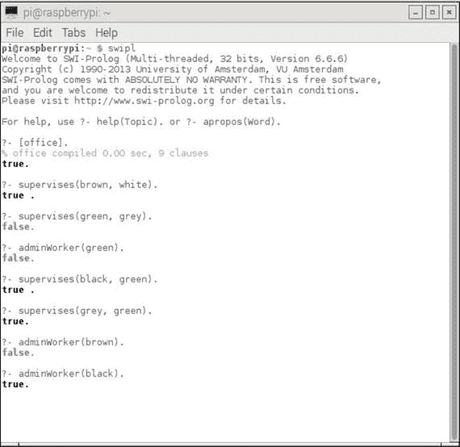

图 3-1.

交互式 Prolog 会话

Prolog 中可用的重要调试工具之一是 `trace` 命令。跟踪允许您按顺序查看 Prolog 查询中执行的各个目标。您还可以查看目标失败时发生的任何“回溯”。通过此命令打开跟踪：

```py
?- trace.
Prolog will respond with:
true.
```

当完成跟踪后，您可以使用此命令将其关闭：

```py
?- notrace.
Prolog will respond with:
true.
```

`trace` 命令是 SWI Prolog 中实现的 20 多个调试命令之一。涵盖所有使用 Prolog 调试工具的各种方式可能需要单独的一本书。我的目的是仅说明一些简单的调试措施，这些措施应该有助于您了解 Prolog 如何与数据库一起工作。

以下是我刚刚展示的办公室数据库的命令行跟踪会话。图 3-2 是跟踪会话的完整截图。

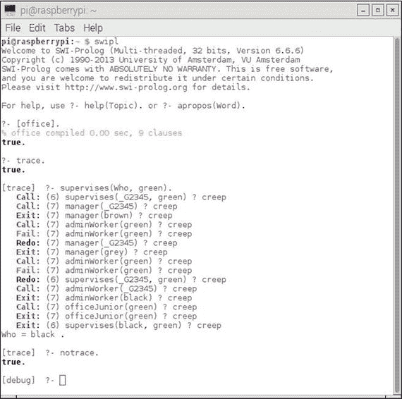

图 3-2。

办公室数据库跟踪会话

表 3-2 是对图 3-2 中显示的跟踪会话的逐行评论。您应该注意，SWI Prolog 调试器支持六个标准端口，分别命名为 Call、Exit、Redo、Fail、Exception 和 Unify。您在以下评论中看到一些这些端口，因为它们代表了 Prolog 解释器在数据库事实和规则方面的操作。您还看到端口名称后面的括号中的数字。这是正在从数据库中处理的当前子句行号。

表 3-2。

行跟踪会话评论

| Prolog 对话/跟踪输出 | 评论 |
| --- | --- |
| `swipl` | 启动 SWI-Prolog |
| `[office].` | 加载办公室数据库。此形式是 consult 函数的简写。 |
| `trace.` | 开始跟踪。 |
| `supervises(Who, green).` | 用户输入查询以确定谁监督员工 `green`。 |
| `Call: (6)` `supervises(_G2345, green) ? creep` | Prolog 找到 supervises(X,Y) 的第一个规则，并将 Y 实例化为与查询中所述的 green 匹配，当您按下 Enter 键时会出现 `creep` 这个词。这意味着 Prolog 已被指示移动到下一个指令。Prolog 内存引用 _G2345 是 X 参数的引用，因此之后被称为 `Who`。 |
| `Call: (7)` `manager(_G2345) ? creep` | Prolog 尝试满足规则的第一个子目标。它尝试 `manager(X)`。 |
| `Exit: (7)` `manager(brown) ? creep` | 找到 `brown` 作为管理者。Prolog 接下来测试这是否会导致解决方案。单词 `Exit` 反映了 Prolog 已找到其最后调用的解决方案的事实。它将 X 设置为 `brown`。 |
| `Call: (7)` `adminWorker(green) ? creep` | 如果 `brown` 管理 `green`，则 `green` 必须是 `adminWorker`。 |
| `Fail: (7)` `adminWorker(green) ? creep` | 由于 `green` 不是 `adminWorker`，因此规则的第二个子目标无法满足。 |
| `Redo: (7)` `manager(_G2345) ? creep` | Prolog 回溯到第一个子目标，并从上次离开的地方继续 `manager(X)`。 |
| `退出: (7)` `manager(grey) ? creep` | Prolog 找到 `grey` 并将 X 实例化为这个新值。 |
| `调用: (7)` `adminWorker(green) ? creep` | Prolog 再次测试 green 是否是 `adminWorker`。 |
| `失败: (7)` `adminWorker(green) ? creep` | 再次失败。这意味着规则无法提供解决方案。 |
| `重做: (6)` `supervises(_G2345, green) ? creep` | Prolog 回溯到初始规则并继续处理顶层目标。 |
| `调用: (7)` `adminWorker(_G2345) ? creep` | 这次，Prolog 寻找 `adminWorker` 作为管理者。（第二个规则。） |
| `退出: (7)` `adminWorker(black) ? creep` | Prolog 找到 `black` 并将 X 实例化为这个新值。 |
| `调用: (7)` `officeJunior(green) ? creep` | Prolog 检查第二个子目标是否现在得到满足。 |
| `退出: (7)` `officeJunior(green) ? creep` | `green` 是一个 `officeJunior`，因此，第二个子目标得以满足。 |
| `退出: (6)` `supervises(black, green) ? creep` | 顶层目标得以满足。 |

图中 `Who = black.` 的声明不是跟踪的一部分，而是 Prolog 对初始查询 `supervises(Who, green)` 的响应所显示的 Prolog 响应。

在所有跟踪行中显示的单词 `creep` 出现在您按下 Enter 键之后。它只是表示 Prolog 正在继续执行跟踪的下一行。有关 `trace` 命令的许多附加信息都可用。只需键入以下内容即可了解更多关于跟踪及其功能的信息：

```py
?- help(trace).
```

您还应该注意，跟踪不适用于 Prolog 的内置函数。您必须依赖 Prolog 的详尽文档来了解这些函数。

SWI Prolog 还提供了除我刚才演示的命令行版本之外的调试图形用户界面（GUI）。图 3-3 显示了用于调用 GUI 的命令行会话，该会话使用与上一个示例中相同的数据库和查询。

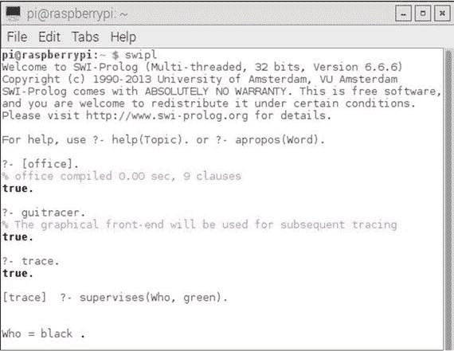

图 3-3。

调用 GUI 跟踪器

命令行和图形用户界面调用之间的唯一区别是，在咨询命令之后立即输入 `guitracer` 命令。Prolog 返回以下语句：

```py
% The graphical front-end will be used for subsequent tracing
true.
```

然而，直到您实际输入 `trace` 命令并输入一个目标（在这个例子中是 `supervises(Who, green)`），才会显示 GUI。从这一点开始，所有用户跟踪和调试操作都在 GUI 对话框屏幕中进行，如图 3-4 所示。

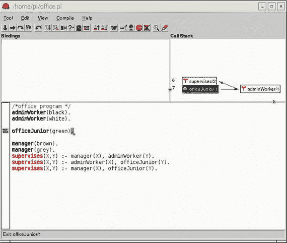

图 3-4。

GUI 跟踪对话框显示

您必须反复点击工具栏左上角的方向向右的箭头，以便逐步通过表 3-2 中详细说明的所有 Prolog 操作。图 3-4 实际上显示了在以下步骤中 Prolog 序列的状态，摘自表 3-2。

| `调用: (7)` `officeJunior(green) ? creep` | Prolog 检查第二个子目标是否现在已满足。 |
| --- | --- |

GUI 显示的右上角也显示了调用栈的图形表示。许多 Prolog 用户更喜欢 GUI 表示而不是命令行版本，但你可以确信，任何版本都精确地执行相同的跟踪操作。

你可以使用类似于命令行版本的命令来停止 GUI 跟踪：

```py
?- noguitracer.
```

下一个专家系统演示是一个经典游戏，通常向大多数初学人工智能的学生展示。

## 演示 3-2：动物识别

这个专家系统是一个动物识别游戏，是 The Handbook of Artificial Intelligence Vol 4 中最初展示的 Lisp 程序的 Prolog 版本，该书由 Barr、Cohen 和 Feigenbaum 编辑（Addison-Wesley，1990）。这是一个相对简单的程序，试图从七个选项中识别你正在思考的动物：

+   狮子

+   老虎

+   长颈鹿

+   斑马

+   鸵鸟

+   企鹅

+   信天翁

程序被设置为提出一系列问题，以确定动物。我建议你在讨论其工作原理之前先尝试一下这个程序。你只需输入`yes`或`no`来回答问题。你的回答甚至可以缩短为`y`或`n`。输入以下内容

```py
?- go.
```

在加载程序之后。

以下列出了 Prolog 动物脚本。

```py
/* animal.pl
animal identification game.
start with ?- go.     */
go :- hypothesize(Animal),
write('I guess that the animal is: '),
write(Animal),
nl,
undo.
/* hypotheses to be tested */
hypothesize(cheetah)   :- cheetah, !.
hypothesize(tiger)     :- tiger, !.
hypothesize(giraffe)   :- giraffe, !.
hypothesize(zebra)     :- zebra, !.
hypothesize(ostrich)   :- ostrich, !.
hypothesize(penguin)   :- penguin, !.
hypothesize(albatross) :- albatross, !.
hypothesize(unknown).             /* no diagnosis */
/* animal identification rules */
cheetah :- mammal,
carnivore,
verify(has_tawny_color),
verify(has_dark_spots).
tiger :- mammal,
carnivore,
verify(has_tawny_color),
verify(has_black_stripes).
giraffe :- ungulate,
verify(has_long_neck),
verify(has_long_legs).
zebra :- ungulate,
verify(has_black_stripes).
ostrich :- bird,
verify(does_not_fly),
verify(has_long_neck).
penguin :- bird,
verify(does_not_fly),
verify(swims),
verify(is_black_and_white).
albatross :- bird,
verify(appears_in_story_Ancient_Mariner),
verify(flys_well).
/* classification rules */
mammal    :- verify(has_hair), !.
mammal    :- verify(gives_milk).
bird      :- verify(has_feathers), !.
bird      :- verify(flys),
verify(lays_eggs).
carnivore :- verify(eats_meat), !.
carnivore :- verify(has_pointed_teeth),
verify(has_claws),
verify(has_forward_eyes).
ungulate :- mammal,
verify(has_hooves), !.
ungulate :- mammal,
verify(chews_cud).
/* how to ask questions */
ask(Question) :-
write('Does the animal have the following attribute: '),
write(Question),
write('? '),
read(Response),
nl,
( (Response == yes ; Response == y)
->
assert(yes(Question)) ;
assert(no(Question)), fail).
:- dynamic yes/1,no/1.
/* How to verify something */
verify(S) :-
(yes(S)
->
true ;
(no(S)
->
fail ;
ask(S))).
/* undo all yes/no assertions */
undo :- retract(yes(_)),fail.
undo :- retract(no(_)),fail.
undo.
```

这个程序很有趣，因为它试图验证属性以得出结论。问题的答案也简要存储以供将来参考。当提出一个问题并回答为`yes`时，答案通过断言子句`yes(question)`并成功记录；否则，答案通过断言子句`no(question)`并失败记录。记录`yes`答案是因为在尝试验证相同假设时，对另一个问题的不同`no`答案可能会导致整个假设失败；而相同的`yes`答案可能会在处理过程中晚些时候导致对另一个假设的成功验证。记录答案是程序避免重复提问的方式。问题中指定的条件通过检查`yes(question)`是否在内存中并成功或`no(question)`是否已存储并失败来验证。如果两个检查都不为真，则执行`ask(question)`。

图 3-5 显示了与该程序的一个示例交互会话，我在其中进行了几次问答运行。

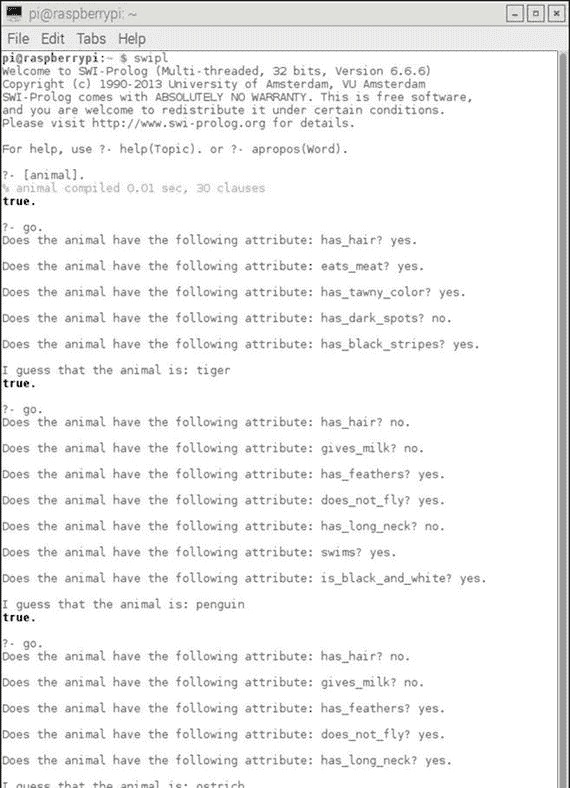

图 3-5.

交互式动物程序会话

我确定程序将基于添加一条仅根据尖锐牙齿、爪子和向前 facing 的眼睛来分类肉食动物的规则，对肉食动物得出错误的结论。图 3-6 显示了交互会话，我在其中对是否吃肉的动物回答了`no`，对牙齿、爪子和眼睛的问题回答了`yes`。

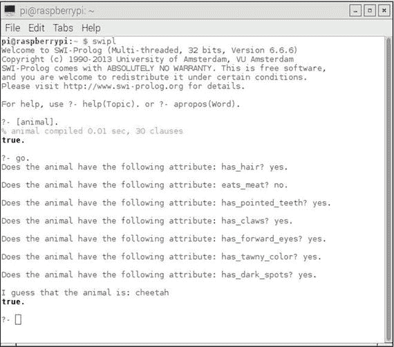

图 3-6。

错误结论动物会话

在这个特定的专家系统中，这种行为仅仅指出，如果规则与它们所基于的现实世界模型不一致，可能会得到错误的结果。根据定义，食肉动物是肉食动物，尽管我故意回答了那个问题。在下一个演示中，我将从大型猫科动物和鸟类转向一个更加温和但同样有趣的专家系统。

## 演示 3-3：井字棋

井字棋，在美国被称为井字棋，在其他地方被称为十字棋，是一种令人愉快的游戏，通常由非常年幼的孩子有效地玩。它也可以通过专家系统实现。以下是一个简单的井字棋程序，名为 tictactoe.pl，可以通过输入以下内容与计算机对战：

```py
?- playo.
```

还有一个自我对弈选项，其中计算机与自己对战。那个选项总是以 X 获胜结束。要启动自我对弈，请输入以下内容：

```py
?- selfgame.
The tictactoe.pl listing follows:
% A tic-tac-toe program in Prolog.   S. Tanimoto, May 11, 2003.
% Additional comments   D. J. Norris, Jan, 2017.
% To play a game with the computer, type
% playo.
% To watch the computer play a game with itself, type
% selfgame.
% Predicates that define the winning conditions:
win(Board, Player) :- rowwin(Board, Player).
win(Board, Player) :- colwin(Board, Player).
win(Board, Player) :- diagwin(Board, Player).
rowwin(Board, Player) :- Board = [Player,Player,Player,_,_,_,_,_,_].
rowwin(Board, Player) :- Board = [_,_,_,Player,Player,Player,_,_,_].
rowwin(Board, Player) :- Board = [_,_,_,_,_,_,Player,Player,Player].
colwin(Board, Player) :- Board = [Player,_,_,Player,_,_,Player,_,_].
colwin(Board, Player) :- Board = [_,Player,_,_,Player,_,_,Player,_].
colwin(Board, Player) :- Board = [_,_,Player,_,_,Player,_,_,Player].
diagwin(Board, Player) :- Board = [Player,_,_,_,Player,_,_,_,Player].
diagwin(Board, Player) :- Board = [_,_,Player,_,Player,_,Player,_,_].
% Helping predicate for alternating play in a "self" game:
other(x,o).
other(o,x).
game(Board, Player) :- win(Board, Player), !, write([player, Player, wins]).
game(Board, Player) :-
other(Player,Otherplayer),
move(Board,Player,Newboard),
!,
display(Newboard),
game(Newboard,Otherplayer).
% These move predicates control how a move is made
move([b,B,C,D,E,F,G,H,I], Player, [Player,B,C,D,E,F,G,H,I]).
move([A,b,C,D,E,F,G,H,I], Player, [A,Player,C,D,E,F,G,H,I]).
move([A,B,b,D,E,F,G,H,I], Player, [A,B,Player,D,E,F,G,H,I]).
move([A,B,C,b,E,F,G,H,I], Player, [A,B,C,Player,E,F,G,H,I]).
move([A,B,C,D,b,F,G,H,I], Player, [A,B,C,D,Player,F,G,H,I]).
move([A,B,C,D,E,b,G,H,I], Player, [A,B,C,D,E,Player,G,H,I]).
move([A,B,C,D,E,F,b,H,I], Player, [A,B,C,D,E,F,Player,H,I]).
move([A,B,C,D,E,F,G,b,I], Player, [A,B,C,D,E,F,G,Player,I]).
move([A,B,C,D,E,F,G,H,b], Player, [A,B,C,D,E,F,G,H,Player]).
display([A,B,C,D,E,F,G,H,I]) :- write([A,B,C]),nl,write([D,E,F]),nl,
write([G,H,I]),nl,nl.
selfgame :- game([b,b,b,b,b,b,b,b,b],x).
% Predicates to support playing a game with the user:
x_can_win_in_one(Board) :- move(Board, x, Newboard), win(Newboard, x).
% The predicate orespond generates the computer's (playing o) reponse
% from the current Board.
orespond(Board,Newboard) :-
move(Board, o, Newboard),
win(Newboard, o),
!.
orespond(Board,Newboard) :-
move(Board, o, Newboard),
not(x_can_win_in_one(Newboard)).
orespond(Board,Newboard) :-
move(Board, o, Newboard).
orespond(Board,Newboard) :-
not(member(b,Board)),
!,
write('Cats game!'), nl,
Newboard = Board.
% The following translates from an integer description
% of x's move to a board transformation.
xmove([b,B,C,D,E,F,G,H,I], 1, [x,B,C,D,E,F,G,H,I]).
xmove([A,b,C,D,E,F,G,H,I], 2, [A,x,C,D,E,F,G,H,I]).
xmove([A,B,b,D,E,F,G,H,I], 3, [A,B,x,D,E,F,G,H,I]).
xmove([A,B,C,b,E,F,G,H,I], 4, [A,B,C,x,E,F,G,H,I]).
xmove([A,B,C,D,b,F,G,H,I], 5, [A,B,C,D,x,F,G,H,I]).
xmove([A,B,C,D,E,b,G,H,I], 6, [A,B,C,D,E,x,G,H,I]).
xmove([A,B,C,D,E,F,b,H,I], 7, [A,B,C,D,E,F,x,H,I]).
xmove([A,B,C,D,E,F,G,b,I], 8, [A,B,C,D,E,F,G,x,I]).
xmove([A,B,C,D,E,F,G,H,b], 9, [A,B,C,D,E,F,G,H,x]).
xmove(Board, N, Board) :- write('Illegal move.'), nl.
% The 0-place predicate playo starts a game with the user.
playo :- explain, playfrom([b,b,b,b,b,b,b,b,b]).
explain :-
write('You play X by entering integer positions followed by a period.'),
nl,
display([1,2,3,4,5,6,7,8,9]).
playfrom(Board) :- win(Board, x), write('You win!').
playfrom(Board) :- win(Board, o), write('I win!').
playfrom(Board) :- read(N),
xmove(Board, N, Newboard),
display(Newboard),
orespond(Newboard, Newnewboard),
display(Newnewboard),
playfrom(Newnewboard).
```

图 3-7 显示了我和计算机对弈的一局游戏。

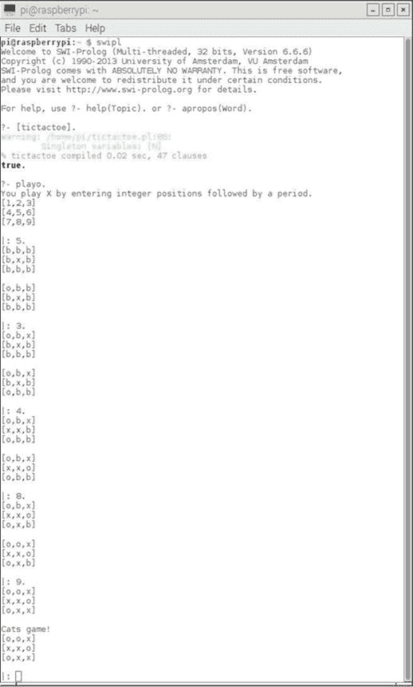

图 3-7。

与计算机对弈的游戏

你应该注意到，程序在回合结束时显示了`Cats game!`，这是井字棋术语，表示平局。

我还启动了一个自我游戏，其中计算机与自己对战。图 3-8 显示了那个结果。正如我之前提到的，它总是以 X 获胜结束。

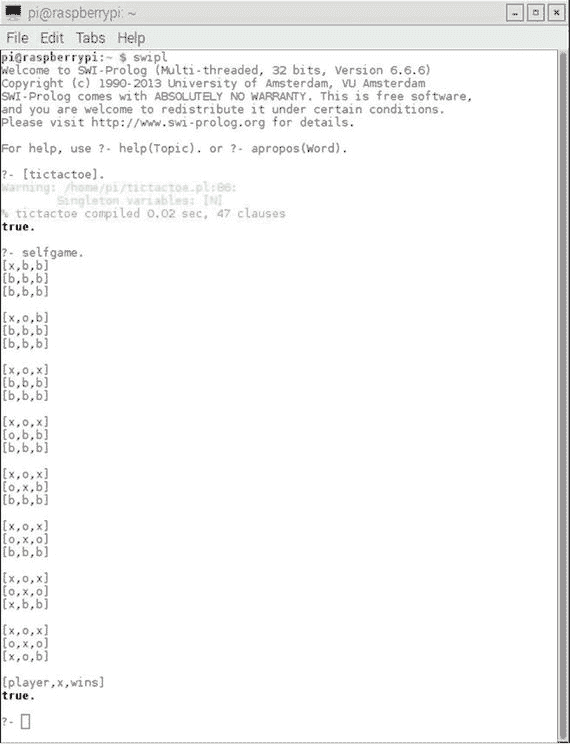

图 3-8。

自我游戏

在这一点上，我讨论了井字棋程序的内部工作原理，因为你已经看到了它是如何运行的。有三个规则或谓词定义了获胜条件：按行、按列或按对角线。以下是一个通用的获胜谓词：

```py
win(Board, Player) :- rowwin(Board, Player).
```

接下来，有三种获胜方式：按行或按列，以及两种按对角线。以下谓词是通过完成顶部行的一种获胜方式：

```py
rowwin(Board, Player) :- Board = [Player,Player,Player,_,_,_,_,_,_].
```

对于其他行、列和对角线，也生成了类似的谓词，正如你通过查看代码所看到的。

有九个移动谓词控制移动的方式，对应于九个棋盘位置。

如下所示，谓词控制人类玩家如何与游戏互动：

```py
x_can_win_in_one(Board) :- move(Board, x, Newboard), win(Newboard, x).
```

类似地，一系列`orespond`谓词控制计算机如何与游戏互动。

最后，有九个名为`xmove`的谓词，确保只能做出合法的移动。它们还将内部游戏位置表示从 A、B、C、…转换为相应的显示位置 1、2、3、…。

下一个专家系统演示处理的是我们偶尔都会遇到的情况：确定我们是否感冒或流感。

## 演示 3-4：感冒或流感诊断

此示例是一个非常基本的医疗诊断专家系统，您只需回答几个问题，系统就会尝试确定您是否患有流感或更温和的感冒。

注意

该专家系统绝对不能替代真正的医生建议和咨询。如果您真的生病了，请去看医生。不要依赖此程序进行可靠的诊断。

以下程序命名为 flu_cold.pl。

```py
% flu_cold.pl
% Flu or cold identification example
% Start with ?- go.
go:- hypothesis(Disease),
write('I believe you have: '),
write(Disease),
nl,
undo.
% Hypothesis to be tested
hypothesis(cold):- cold, !.
hypothesis(flu):- flu, !.
% Hypothesis Identification Rules
cold :-
verify(headache),
verify(runny_nose),
verify(sneezing),
verify(sore_throat).
flu :-
verify(fever),
verify(headache),
verify(chills),
verify(body_ache).
% Ask a question
ask(Question) :-
write('Do you have the following symptom: '),
write(Question),
write('? '),
read(Response),
nl,
( (Response == yes ; Response == y)
->
assert(yes(Question)) ;
assert(no(Question)), fail).
:- dynamic yes/1,no/1.
% Verify something
verify(S) :- (yes(S) -> true ;
(no(S)  -> fail ;
ask(S))).
% Undo all yes/no assertions
undo :- retract(yes(_)),fail.
undo :- retract(no(_)),fail.
undo.
```

如注释所述，您可以使用以下方式启动程序：

```py
?- go.
```

症状将依次呈现。只需回答“是。”或“否。”（或者，您可以使用单个字母`y.`或`n.`）。不要忘记在回答的末尾输入句号；否则，Prolog 将无法识别您的输入。如果您选择了一组症状，这些症状不属于任何一个假设，那么 Prolog 将简单地显示“失败”，因为它无法将您的输入与已知事实相匹配。

图 3-9 显示了我与该专家系统进行的样本会话。我选择了流感、感冒和一些不匹配案例的症状。

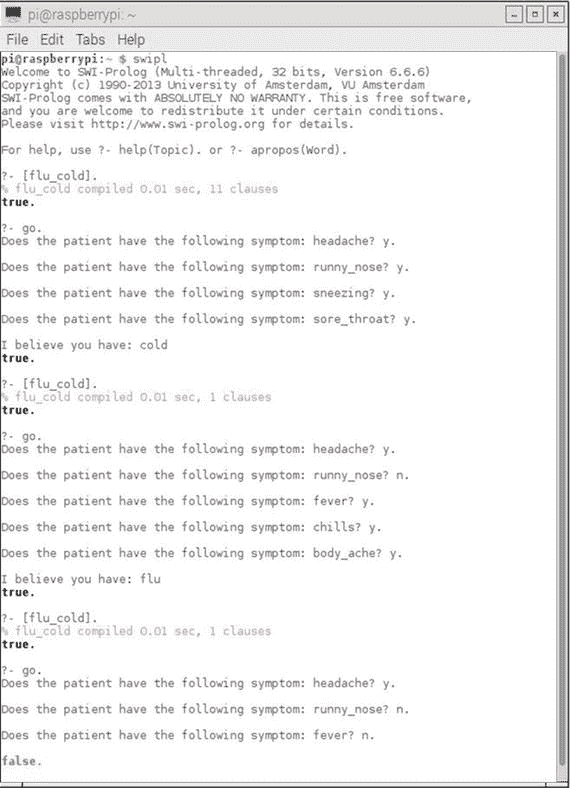

图 3-9。

冷感和流感专家系统会话

下一演示是本章的最后一个演示。它涉及另一个简单的专家系统——但是有一个转折，因为该系统控制着几个 Raspberry Pi GPIO 输出。

## 演示 3-5：带有 Raspberry Pi GPIO 控制的专家系统

到目前为止，我向您展示了可以在任何兼容 Prolog 版本的 PC 或 Mac 上运行的专家系统。这次演示有所不同，因为我向您展示了如何直接使用 Prolog 控制一些通用输入/输出（GPIO）引脚——这在普通 PC 上通常是不可能的。

实事求是地说，直接使用 Prolog 命令控制 GPIO 引脚是不可能的；但是，如果您将 Prolog 与 Python 语言结合使用，则可以实现这一点。这种组合是由一个名为 PySWIP 的优秀程序实现的，它允许在 Python 程序中调用和执行 Prolog 命令。还有一个名为 RPi.GPIO 的优秀 Python 应用程序编程接口（API），它简化了 GPIO 引脚控制。接下来，我将描述如何安装 PySWIP 应用程序并设置 RPi.GPIO API，这两者都是本专家系统演示的先决条件。

### 安装 PySWIP

PySWIP 是由 Yuce Tekol 创建的，作为 Prolog 和 Python 之间的桥梁程序。他将其作为 GPL 开源软件提供给社区。该程序不是 Raspian 存储库的一部分，因此不能使用 apt 软件包管理器安装。要安装它，您必须使用 pip 程序。如果您已经在 Raspberry Pi 上安装了 pip，可以使用以下命令安装它：

```py
sudo apt-get install python-pip
```

安装 pip 后，您可以使用以下命令使用它安装 PySWIP：

```py
sudo pip install pyswip
```

为了 Python 能够识别 Prolog，必须执行一个额外的步骤，那就是在原始共享库名称和最新版本之间创建一个符号链接。只需输入以下命令来创建链接：

```py
sudo ln -s libswipl.so /usr/lib/libpl.so
```

接下来，你应在交互式 Python 会话中输入以下 Python 命令来测试 PySWIP 安装是否成功：

```py
>>> from pyswip import Prolog
>>> prolog = Prolog()
>>> prolog.assertz("father(michael,john)")
>>> prolog.assertz("father(michael,gina)")
>>> list(prolog.query("father(michael,X)"))
```

以下是对前面命令的 Prolog 响应：

```py
[{'X': 'john'}, {'X': 'gina'}]
>>> for soln in prolog.query("father(X,Y)"):
```

确保下一行缩进。我使用了四个空格。

```py
...     print soln["X"], "is the father of", soln["Y"]
...
```

按下退格键和 Enter 键来执行`for`语句。然后 Python 解释器应该显示以下内容：

```py
michael is the father of john
michael is the father of gina
```

如果你看到这两行，你可以确信 Python 和 Prolog 正在通过 PySWIP 桥接程序良好地一起工作。图 3-10 展示了使用 Raspberry Pi 进行的此测试。

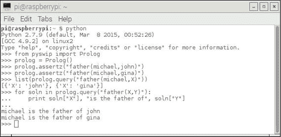

图 3-10。

Prolog 和 Python 兼容性测试

现在是时候讨论硬件设置了，该设置使用了 Python/Prolog 专家系统。

### 硬件设置

我使用了一个 T 形 Pi Cobbler 附件来扩展 Raspberry Pi 的 GPIO 引脚，以便在这个设置中可以轻松地与无焊点面包板一起使用。图 3-11 是一个 Fritzing 图，展示了带有两个 LED 和两个限流电阻的设置。

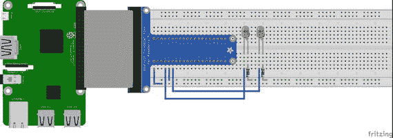

图 3-11。

Fritzing 图

LED 连接到 GPIO 引脚#4 和#17，220Ω限流电阻连接到地。因此，当引脚设置为高值时，LED 会亮起，对于 Raspberry Pi 来说，这个高值是 3.3V。LED 串联电阻将最大电流流量设置为大约 12 ma，这远远低于任何给定 Raspberry Pi GPIO 引脚的 25 ma 电流限制。

图 3-12 显示了带有 T Pi Cobbler、无焊点面包板、LED 和其他组件的 Raspberry Pi 物理设置。

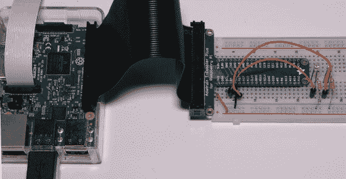

图 3-12。

Raspberry Pi 物理设置

接下来，你应该设置 RPi.GPIO API 以 Python 控制 LED。

### Rpi.GPIO 设置

本讨论重点介绍 RPi.GPIO API 在 Python 程序中的应用。这些设置步骤必须包含在需要控制 GPIO 引脚的每个 Python 程序中。我在交互式会话中演示了设置，但你应该意识到，相同的语句必须包含在常规程序脚本中。

RPi.GPIO API 现在包含在所有标准的 Raspian Linux 发行版中。如果你使用的是最新的 Jessie Raspian 发行版，你应该已经设置好了。第一步是导入 API，如下所示：

```py
>>> import RPi.GPIO as GPIO
```

从现在开始，所有对 API 的引用都简单地使用 GPIO 名称。接下来，你必须选择合适的引脚编号方案。Raspberry Pi 的引脚编号方案有两种变体：

+   GPIO.BOARD：在 P1 引脚上的物理引脚编号后面跟随的板号，该引脚包含所有 GPIO 引脚。

+   GPIO.BCM：芯片制造商 BROADCOM 或 BCM 使用的编号方案。

Pi Cobbler 上的引脚编号遵循 BCM 方案，所以我使用了这个方案。你可以通过以下语句确定使用哪种编号方案：

```py
>>> GPIO.setmode(GPIO.BCM)
```

接下来，必须将选定的两个引脚从默认输入模式设置为输出模式，这可以通过以下两个语句来完成：

```py
>>> GPIO.setup(4, GPIO.OUT)
>>> GPIO.setup(17, GPIO.OUT)
```

现在，应该已经设置好了切换引脚的高低电平。默认情况下，它们在启动时被设置为低电平状态。接下来的两个语句应该点亮两个 LED：

```py
>>> GPIO.output(4, GPIO.HIGH)
>>> GPIO.output(17, GPIO.HIGH)
```

如果 LED 没有亮起，你应该检查面包板中 LED 的安装方向。每个标准 LED 都有两条“腿”，其中一条比另一条稍短。较短的腿连接到电阻的一个引脚，另一个引脚连接到地。尝试改变 LED 的安装方向，看看它是否可以点亮。改变安装方向不会损坏 LED。此外，请确保你连接到 4 号和 17 号引脚，并且已经选择了正确的编号方案。我发现当事情没有按预期工作的时候，通常是因为连接问题或设置中的简单错误。

关闭 LED 使用以下语句完成：

```py
>>> GPIO.output(4, GPIO.LOW)
>>> GPIO.output(17, GPIO.LOW)
```

现在已经准备好创建一个专家系统来控制 LED。

### 带有 LED 控制的专家系统

我决定基本上使用与验证 PySWIP 安装时使用的相同简单的 Prolog 脚本。然而，程序进行了一些重构，以利用 Python 使用函数的方式。这就是为什么在程序开始附近使用 PySWIP 的 Functor 函数的原因。这个程序命名为 LEDtest.py，通过输入以下内容来运行：

```py
python LEDtest.py
```

以下为 LEDtest.py 的代码列表。

```py
# LEDtest.py by D. J. Norris  Jan, 2017
# Uses Prolog with Python type functions
import time
import RPi.GPIO as GPIO
from pyswip import Functor, Variable, Query, call
# Setup GPIO pins
GPIO.setmode(GPIO.BCM)
GPIO.setup(4, GPIO.output)
GPIO.setup(17, GPIO.output)
# Setup Python like functions for Prolog statements
assertz = Functor("assertz", 1)
father = Functor("father", 2)
# Add facts to a dynamic database
call(assertz(father("michael","john")))
call(assertz(father("michael", "gina")))
# Setup an iterative query session
X = Variable()
q = Query(father("michael",X))
while q.nextSolution():
print "Hello, ", X.value
if str(X.value) == "john": # LED #4 on if john is michael's child
GPIO.output(4,GPIO.HIGH)
time.sleep(5)
GPIO.output(4,GPIO.LOW)
if str(X.value) == "gina": # LED #17 on if gina is michael's child
GPIO.output(17,GPIO.HIGH)
time.sleep(5)
GPIO.output(17,GPIO.LOW)
```

图 3-13 显示了程序输出。无法显示的是，LED 灯亮了五秒钟，表明两个查询已成功运行。

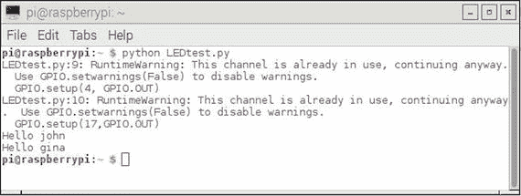

图 3-13。

程序输出

到目前为止，你可能想知道如何将这个演示与 Raspberry Pi 的实际应用结合起来。这个答案将在几章之后给出，直到我介绍一个模糊逻辑项目，该项目使用嵌入式专家系统和一些 GPIO 引脚控制加热和冷却系统（HVAC）。

## 摘要

本章演示了五个专家系统。它们从只有一个几个事实和规则的极其简单的系统，到实现井字游戏的更复杂的系统。

最后的演示展示了如何将 Python 与 Prolog 结合使用，以便控制 Raspberry Pi 的 GPIO 引脚。
