# 4. 游戏

本章全部关于游戏。但我所讨论的游戏并不是目前市场上充斥着的价值数百万美元的视频游戏大作。相反，它们是那些存在了很长时间的简单游戏；有些已经存在了数千年。即使在这些简单游戏中，人工智能也产生了影响。本章讨论的游戏传统上涉及两个人类对手，但现代版本涉及一个人类与计算机对战。这就是人工智能的用武之地：为人类玩家提供一些随机性和竞争性，使得游戏不会很快变得无聊和单调。

每个演示都需要一些额外的零件，具体细节见表 4-1。

表 4-1。

零件清单

| 描述 | 数量 | 备注 |
| --- | --- | --- |
| Pi Cobbler | 1 | 40 引脚版本，T 或 DIP 尺寸均可接受 |
| 无焊面包板 | 1 | 860 插入点，带电源带 |
| 跳线 | 1 包 |   |
| LED | 3 |   |
| 220Ω 电阻 | 3 | 1/4 瓦 |
| 16 × 4 LCD 显示屏 | 1 | Adafruit p/n 198 或等效产品您也可以使用 16 × 2 LCD |
| 10k Ω 可变电阻 | 1 | 包含在 LCD 显示屏中 |
| 按钮开关 | 4 | 触觉式，适用于无焊面包板使用 |

首先要演示的游戏是我们都玩过的那个老牌游戏：掷骰子。

## 演示 4-1：掷骰子

这里是关于人机掷骰子游戏的规则，以防你有一段时间没有玩了。每个对手紧握拳头，数到三，然后展示以下手势之一：

+   平手：纸张

+   拳头：石头

+   两指成 V 形：剪刀

获胜的规则如下：

+   每个对手的相同信号表示平局。

+   石头击败剪刀，所以石头标志获胜。

+   纸覆盖石头，所以纸标志获胜。

+   剪刀剪破纸，所以剪刀标志获胜。

只有九种可能的组合，包括三种平局的方式。每个对手有三种获胜的方式，如上所述，这导致了九种可能的组合。

以下名为 prs.py 的 Python 程序是掷骰子游戏的直接实现。这个程序没有使用前一章中展示的任何 Prolog 语句，而是依赖于标准的 Python `if ... else` 语句。这些语句的效果与推理部分讨论的 if <条件> then <结论> 相同。

prs.py 列表

```py
# prs.py
from random import randint
# List the input options
inputList = ["paper", "rock", "scissors"]
# Random computer pick
computer = inputList[randint(0,2)]
# Initially set player = False
player = False
while player == False:
player = raw_input("paper, rock, scissors?")
if player == computer:
print("Tie!")
elif player == "rock":
if computer == "paper":
print("You lose ", computer, "covers", player)
else:
print("You win ", player, "dulls", computer)
elif player == "paper":
if computer == "scissors":
print("You lose ", computer, "cuts", player)
else:
print("You win ", player, "covers", computer)
elif player == "scissors":
if computer == "rock":
print("You lose ", computer, "dulls", player)
else:
print("You win ", player, "cuts", computer)
else:
print("Invalid input. Please reenter")
# Reset player = False to continue looping
player = False
computer = inputList[randint(0,2)]
```

图 4-1 展示了我用树莓派进行的几轮游戏。

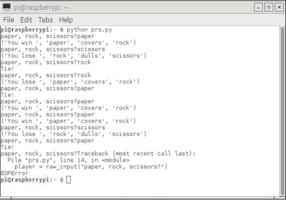

图 4-1。

掷骰子游戏玩法

我确实想对程序的一个方面发表评论，这个方面特别针对那些不太熟悉编写 Python 程序的那些读者。`elif`命令是`else if`单词的缩写，它是嵌套的`if ... else`结构的一部分，用于实现游戏逻辑。游戏逻辑也可以用树状图表示，如图 4-2 所示。

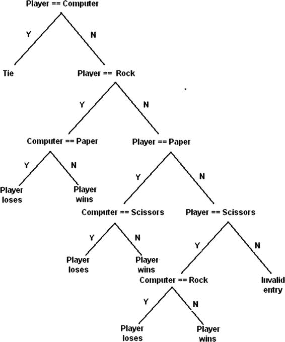

图 4-2。

掷骰子游戏的树状图

我想你可以欣赏图中所描述的逻辑的对称性。注意，有六个叶子或终点，显示了玩家要么赢要么输的地方。这与我之前提到的六个胜负组合完全一致。

信不信由你，这个游戏中存在某种潜在的战略，当与人类对手玩游戏时可以调用。为了理解竞争战略，我必须首先为游戏结果分配一些值。让我们假设以下合理的点分配方案：

+   胜利 = 2 分

+   平局 = 1 分

+   失败 = 0 分

表 4-2 显示了，在连续长时间的游戏中，平均预期玩家值应该是多少。

表 4-2。

平均玩家结果

|   |   | 对手移动 | 平均玩家得分 |
| --- | --- | --- | --- |
|   |   | paper | rock | scissors |
| --- | --- | --- | --- |
| 玩家移动 | paper | 1 | 2 | 0 | 1 |
|   | rock | 0 | 1 | 2 | 1 |
|   | scissors | 2 | 0 | 1 | 1 |

平均玩家得分不应该让你感到惊讶，因为从长远来看（假设每个对手都做出随机选择），预期的得分或值应该平均分配到所有可能的结果中。但现在，让我们给正常方法增加一个转折，并利用人类的一个特性。这种特性或行为涉及随机数字的选择。如果你要求某人从 1 到 10 中选择三个随机数字，他们可能会回答 7、4 和 8，或者类似的变体。他们可能会轻松地回答 5、5 和 5，这会满足要求，但使用“随机”这个词显然会偏袒行为。现在假设你的对手在上一个回合选择了石头。他不太可能在下一个回合再次选择石头。现在可以修改平均预期值表，如表 4-3 所示。

表 4-3。

修改后的平均预期值

|   |   | 对手移动 | 平均玩家得分 |
| --- | --- | --- | --- |
|   |   | paper | rock | scissors |
| --- | --- | --- | --- | --- |
| 玩家移动 | paper | 1 | - | 0 | 0.5 |
|   | rock | 0 | - | 2 | 1 |
|   | scissors | 2 | - | 1 | 1.5 |

显然，根据对手的上一轮动作，玩家在动作上有一个最佳选择，这是基于正常的人类行为。然而，编写一个检查例程以避免给人类玩家提供竞争优势并不太难。代码可能如下所示；但请注意，我只是使用了索引整数值，而没有使用等效的字符串值。

```py
if computer == lastMove & won == 0:
computer = player + 1
if computer > 3:
computer = 1
```

`lastMove` 和 `won` 是两个新的整数变量，分别代表计算机的上一轮选择和是否获胜。我没有将此代码集成到当前程序中，因为我只想演示经典的游戏设计。

我对剪刀石头布游戏的下一个迭代版本消除了键盘输入和屏幕显示，并用按钮开关和 LED 取代它们。

### 使用开关和 LED 的剪刀石头布游戏

我认为将 Raspberry Pi 上的游戏玩法改为使用按钮开关选择标志，并用 LED 表示游戏胜利、失败或平局，既有趣又引人入胜。在这个项目中，我还介绍了 Raspberry Pi 如何使用 Python 语言处理中断。这个程序有一个注意事项。它必须使用以下命令行条目启动：

```py
python prs_with_LEDs_and_Switches.py
```

现在需要设置 Raspberry Pi 系统。Fritzing 图表如图 4-3 所示。

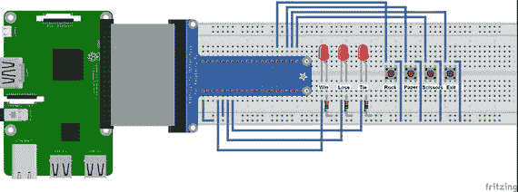

图 4-3.

剪刀石头布游戏机的 Fritzing 图表

图 4-3 是图 3-11 的扩展，后者用于专家系统演示。我在电路中增加了一个额外的 LED 和四个按钮开关。额外的 LED 连接到引脚 27，而按钮开关连接到引脚 12、16、20 和 21。

物理 Raspberry Pi 设置如图 4-4 所示。注意，我在 LED 和按钮开关附近放置了标签，以帮助用户确定 LED 表示什么，以及哪个按钮开关启用特定的标志。当按下第四个按钮时，程序将退出。

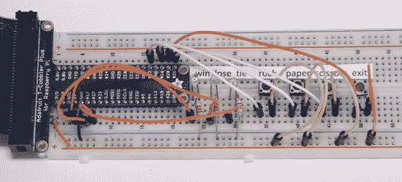

图 4-4.

物理 Raspberry Pi 设置

按钮开关作为输入，当按下时，在引脚上提供瞬时的 3.3V 高电平。每个输入引脚也被设置为下拉模式，其中引脚输入处的内部电阻连接到地。这防止了不确定的浮空状态应用于引脚。在这种状态下，浮空引脚可能会“看到”从几十毫伏到高达两伏的电压，这可能会在引脚上触发一个错误的高电平。实际的浮空电压高度可变，并且取决于引脚周围的局部电场。连接下拉电阻可以避免所有这些麻烦。好消息是，下拉电阻实际上是通过软件命令配置的，我将在展示以下代码列表之后讨论这一点。

prs_with_LEDs_and_Switches.py

```py
import RPi.GPIO as GPIO
import time
from random import randint
# Setup GPIO pins
# Set the BCM mode
GPIO.setmode(GPIO.BCM)
# Outputs
GPIO.setup( 4, GPIO.OUT)
GPIO.setup(17, GPIO.OUT)
GPIO.setup(27, GPIO.OUT)
# Ensure all LEDs are off to start
GPIO.output( 4, GPIO.LOW)
GPIO.output(17, GPIO.LOW)
GPIO.output(27, GPIO.LOW)
# Inputs
GPIO.setup(12, GPIO.IN, pull_up_down = GPIO.PUD_DOWN)
GPIO.setup(16, GPIO.IN, pull_up_down = GPIO.PUD_DOWN)
GPIO.setup(21, GPIO.IN, pull_up_down = GPIO.PUD_DOWN)
GPIO.setup(20, GPIO.IN, pull_up_down = GPIO.PUD_DOWN)
global player
player = 0
# Setup the callback functions
def rock(channel):
global player
player = 1  # magic number 1 = rock, pin 12
def paper(channel):
global player
player = 2  # magic number 2 = paper pin 16
def scissors(channel):
global player
player = 3  # magic number 3 = scissors pin 21
def quit(channel):
exit()      # pin 20, immediate exit from the game
# Add event detection and callback assignments
GPIO.add_event_detect(12, GPIO.RISING, callback=rock)
GPIO.add_event_detect(16, GPIO.RISING, callback=paper)
GPIO.add_event_detect(21, GPIO.RISING, callback=scissors)
GPIO.add_event_detect(20, GPIO.RISING, callback=quit)
# computer random pick
computer = randint(1,3)
while True:
if player == computer:
# This is a tie condition
GPIO.output(27,GPIO.HIGH)
time.sleep(5)
GPIO.output(27, GPIO.LOW)
player = 0
elif player == 1:
if computer == 2:
# Player loses, paper covers rock
GPIO.output(17,GPIO.HIGH)
time.sleep(5)
GPIO.output(17, GPIO.LOW)
player = 0
else:
# Player wins, rock dulls scissors
GPIO.output(4,GPIO.HIGH)
time.sleep(5)
GPIO.output(4, GPIO.LOW)
player = 0
elif player == 2:
if computer == 3:
# Player loses, scissors cuts paper
GPIO.output(17,GPIO.HIGH)
time.sleep(5)
GPIO.output(17, GPIO.LOW)
player = 0
else:
# Player wins, paper covers rock
GPIO.output(4,GPIO.HIGH)
time.sleep(5)
GPIO.output(4, GPIO.LOW)
player = 0
elif player == 3:
if computer == 1:
# Player loses, rock dulls scissors
GPIO.output(17,GPIO.HIGH)
time.sleep(5)
GPIO.output(17, GPIO.LOW)
player = 0
else:
# Player wins, scissors cuts paper
GPIO.output(4,GPIO.HIGH)
time.sleep(5)
GPIO.output(4, GPIO.LOW)
player = 0
# another random pick for the computer
computer = randint(1,3)
```

你应该立即注意到，在这个游戏版本中，我只使用数字来表示符号。实际上不需要字符串名称，因为 LED 显示了回合的结果，而按钮已经清楚地标明。然而，我通过在代码列表中使用注释来标识这些“魔法”数字代表什么。我使用“魔法”来表示任何用来表示其他东西的数字。如果没有注释或其他标识方式，那么在程序中孤立的一个数字就变成了一个魔术。不幸的是，一些开发者仍然在他们的程序中使用魔法数字——我强烈建议你避免这种做法，除非你对其进行了注释，但这样一来它们就不再是魔法了。

上述程序中的逻辑与程序的第一版本中展示的完全相同。然而，输入和输出之间有很大的差异，现在使用的是按钮和 LED。我将首先讨论 LED 输出，因为你在专家系统演示中已经见过它。首先选择引脚编号方案，它仍然是 BCM，因为它与 T Pi Cobbler 引脚标识相匹配。接下来设置要作为输出的引脚。这些引脚是 4、17 和 27，分别代表赢、输和平局。这就是预配置输出所需的所有内容。使用以下命令打开输出：

```py
GPIO.output(n, GPIO.HIGH)  # where n = pin number
```

你还应该注意到，我在每个 LED 输出命令后面跟了这个命令：

```py
time.sleep(5)
```

这迫使 Python 解释器暂停五秒钟，使用户能够轻松地识别哪个 LED 被点亮。如果没有暂停，LED 将会快速点亮和熄灭，以至于你根本无法看到。这种情况可能会让许多期待看到点亮 LED 的新程序员感到困惑。程序可能按预期运行，但新程序员忽略了实时时钟周期的现实，即 LED 只持续微秒级——对于人眼来说时间太短，无法检测到。

现在转到输入引脚和中断的讨论。

### 中断

处理引脚输入主要有两种方式：轮询和中断。正如其名所示，轮询只是简单地定期检查引脚状态。它必须在一个循环中实现才能工作。以下代码片段展示了检查引脚状态的一种方法：

```py
if GPIO.input(n):           # where n = pin number
print('Input was HIGH')
else:
print('Input was LOW')
```

轮询（Polling）比使用中断（interrupts）慢得多，因为循环中的所有代码都必须执行。如果程序完成每个循环所需的时间相对较长，尤其是在循环中包含任何暂停语句，可能会错过按键操作。

另一方面，中断几乎是立即发生的，与主程序中的操作无关，无论是循环还是不循环。中断利用了 ARM 微处理器内部的一个称为中断控制器的硬件子系统。图 4-5 是一个非常简化的中断控制器图，它有三个中断源：一个按钮、一个串行输入和一个时钟输入。在这个项目中，按钮中断源是相关的。

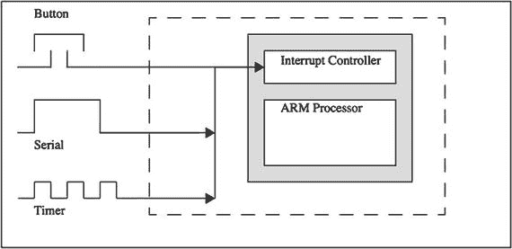

图 4-5。

中断控制器

图 4-6 是一个逻辑流程图，清楚地显示了发生中断时的动作顺序。

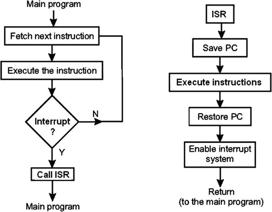

图 4-6。

中断逻辑流程图

通常，微处理器在运行主程序时，会依次取指令并执行。当发生中断时，我现在将其称为事件，以符合 Python 语言的术语，会跳转到中断服务例程（ISR），如图 4-6 所示。而且为了进一步混淆你，ISR 在 Python 中被称为回调函数。中断控制器会自动保存下一个可执行指令的地址以及几个其他参数，这被称为保存处理器状态。接下来运行回调函数，当它完成后，中断控制器重新加载处理器状态，并从被中断时的点精确恢复。所有这些动作只需微秒即可完成，比轮询快得多。

在 Python 中设置中断需要执行几个步骤。首先，必须设置用于接收中断的适当引脚。我将使用岩石按钮作为例子。接下来的语句将引脚 12 设置为输入，并配置下拉电阻，原因是我之前讨论过的：

```py
GPIO.setup(12, GPIO.IN, pull_up_down = GPIO.PUD_DOWN)
```

接下来，必须识别中断源并将其链接到回调函数。以下语句为岩石信号按钮执行此操作：

```py
GPIO.add_event_detect(12, GPIO.RISING, callback=rock)
```

最后，必须定义回调函数。对于岩石信号，这个函数是

```py
def rock(channel):
global player
player = 1  # magic number 1 = rock, pin 12
```

注意，在函数定义中必须使用单词`channel`作为参数。这只是 Python 语言的一个特性。

还要注意，我在函数定义中使用了单词`global`，这指定了`player`变量是全局的或对程序的所有部分都可用，无论它是否在函数或主程序中。我通常不喜欢使用全局变量，因为它们破坏了面向对象的封装原则，但在这个情况下，似乎适当的最小化代码重复并提高程序效率。你还需要在主程序中将`player`标识为全局。

最后一个新程序特性是退出按钮，它会导致程序立即退出 Python 解释器。这是回调函数：

```py
def quit(channel):
exit()      # pin 20, immediate exit from the game
```

程序中的其他部分都是直接了当的，或者之前已经讨论过。

我无法展示这个程序运行的截图，因为输入是手动按按钮激活，输出是 LED 灯的点亮。我只能说，一切如预期般运作。

我接下来要讨论的游戏是 Nim。

## 演示 4-2：Nim

Nim 是一种数学策略游戏，两名玩家轮流从公共堆中移除物品。在每一轮中，玩家可以移除一个、两个或三个物品。游戏的目标是避免成为移除最后一件物品的玩家，尽管 Nim 的变体中，移除最后一件物品的玩家会获胜。

自古以来，人们就玩过各种 Nim 风格的游戏，通常使用鹅卵石作为堆。Nim 也被称为拾石子、最后一块石头，在最近的时代，被称为棍子或拾棍子。尽管并不是一个已知的事实，但人们认为 Nim 可能起源于中国，因为它与游戏 Tsyan-shizi 或“拾石头”非常相似。在欧洲历史上，Nim 可以追溯到 16 世纪初期。Nim 的实际名称归功于哈佛大学教授查尔斯·巴顿，他在 20 世纪初被认为是博弈论创造者。

我将首先演示 Nim 的双人游戏 Python 版本。我简单地将其描述为“天真 Nim”，其中没有人工智能，只有玩家的天然智力。

naive_nim.py 列表

```py
sticks = 21
max_picks = 3
while (sticks != 0):
pick1 = 0
pick2 = 0
pick1 = int(raw_input("Player 1 pick: "))
while pick1 > max_picks or (sticks - pick1)  max_picks or (sticks - pick2) <= 0:
print "You cannot pick more than 3 or reduce sticks to zero or less"
pick2 = int(raw_input("Player2 pick: "))
sticks = sticks - pick2
print "remaining sticks = ", sticks
if sticks == 1:
print 'Player 2 Wins!'
exit()
```

图 4-7 显示了我玩的两轮：pick1 和 pick2。注意，我添加了一些验证检查，确保没有超过三根棍子被拾取，并且任何一次拾取都没有将棍子总数减少到零或以下。

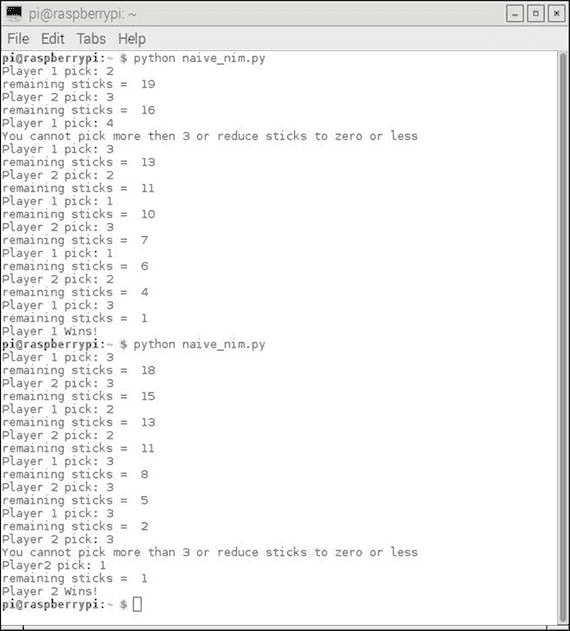

图 4-7。

Nim 游戏的两轮

现在是时候通过实现计算机对手来向 Nim 游戏中添加一些人工智能了。

nim_computer.py 列表

```py
import random
print "NIM GAME"
player1 = raw_input("Enter your name: ")
player2 = "Computer"
howMany = 0
gameover=False
global stickNumber
stickNumber = 21
def moveComputer():
removedNumber = random.randint(1,3)
global stickNumber
while (removedNumber = 5:
stickNumber -= removedNumber
return stickNumber
elif (stickNumber == 4) or (stickNumber == 3) or (stickNumber == 2):
stickNumber = 1
return stickNumber
def moveHuman():
global stickNumber
global howMany
stickNumber -= howMany
return stickNumber
def humanLegalMove():
global howMany
global stickNumber
legalMove=False
while not legalMove:
print("It's your turn, ",player1)
howMany=int(input("How many sticks do you want to remove?(from 1 to 3) "))
if  howMany>3 or howMany= stickNumber):
print("The entered number is greater than or equal to the number of sticks remaining.")
howMany=int(input("How many sticks do you want to remove?"))
return howMany
def checkWinner(player):
global stickNumber
if stickNumber == 1:
print(player," wins.")
global gameover
gameover = True
return gameover
def resetGameover():
global gameover
global stickNumber
gameover = False
stickNumber = 21
howMany = 0
return gameover
def game():
while gameover == False:
print("It's ",player2,"turn. The number of sticks left: ", moveComputer())
checkWinner(player2)
if gameover == True:
playAgain()
humanLegalMove()
print("The number of sticks left: ", moveHuman())
checkWinner(player1)
if gameover == True:
playAgain()
def playAgain():
answer = raw_input("Do you want to play again?(y/n)")
resetGameover()
if answer=="y":
game()
else:
print("Thanks for playing the game")
exit()
game()
playAgain()
```

图 4-8 显示了与计算机进行的两轮 Nim 游戏。

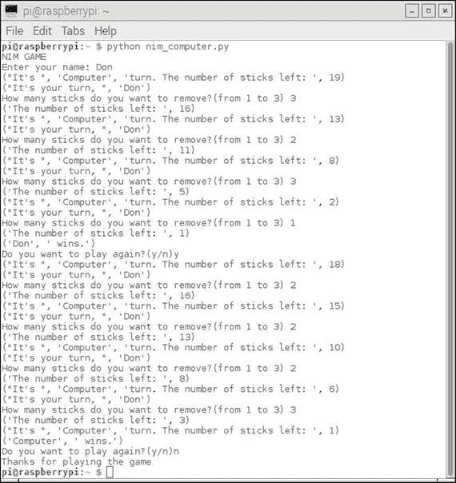

图 4-8。

两轮计算机与人类对战

图 4-8 显示了当每个对手输入有效的棍子数字时，程序按预期运行。虽然计算机不可能输入无效的数字，但对于人类来说并非如此。此外，程序必须防止输入会减少棍子数量为零或更少的输入。图 4-9 显示了当我尝试输入大于三的数字或减少棍子总数为零时，这些保护措施是如何起作用的。

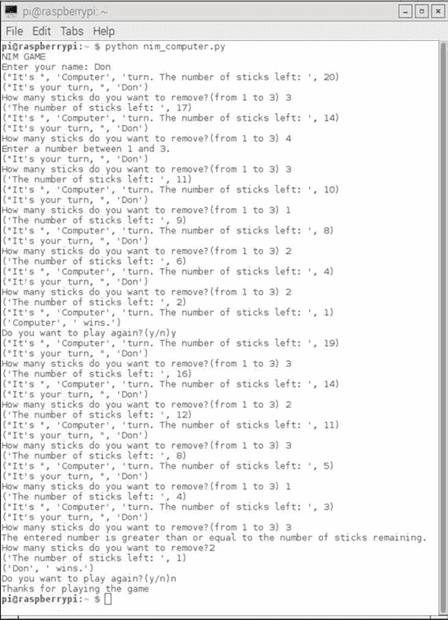

图 4-9。

验证或“合理性”检查

图 4-8 和 4-9 中不明显的是，我在程序中添加了一小部分人工智能。通常，每个回合的计算机输入由以下语句确定：

```py
removedNumber = random.randint(1,3)
```

这个语句生成一个介于 1 和 3 之间的随机数（包括 3）。通常，这对于一种天真方法来说是足够的；然而，我不希望当棍子数在 4 或更少时给人类玩家带来太多不公平的优势。因此，我在 `moveComputer` 函数中添加了以下代码：

```py
elif (stickNumber == 4) or (stickNumber == 3) or (stickNumber == 2):
stickNumber = 1
return stickNumber
```

这确保了电脑赢得这一轮，因为它模拟了如果人类玩家面对两根、三根或四根剩余棍子时预期的确切人类行为。

Nim 游戏的竞争策略还有很多内容你应该知道。假设还剩下六根棍子，轮到你行动。根据博弈论，你最佳的选择是移除满足以下方程的确切数量的棍子：

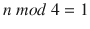 其中 n 是你行动后剩余的棍子数。

方程中的 mod 运算符代表整数除法的余数。例如，8 mod 3 等于 2，因为 3 两次除入 8，余数为 2。所以基本上，你丢弃被除数，保留余数进行整数除法。表 4-4 显示了堆中仍有六根棍子时你所有可能的移动。

表 4-4。

堆中六根棍子的竞争策略

| 可能的移动 | 剩余棍子数 (n) | n mod 4 |
| --- | --- | --- |
| 1 | 5 | 1 |
| 2 | 4 | 0 |
| 3 | 3 | 3 |

因此，根据博弈论，你的最佳移动是移除一根棍子。你不必是游戏专家就能理解这个选择。记住你的对手只能移除一根、两根或三根棍子。因此，在对手移除棍子后，只剩下两根、三根或四根棍子。然后你保证能赢，因为你可以移除适当数量的棍子，使得只剩下一根。

在这个特定的游戏中，人类玩家具有明显的优势，因为电脑总是随机选择移除棍子的数量，直到堆中剩余的棍子数少于四根。因此，你应该总是试图让电脑的倒数第二次移动是使用六根棍子。在下一节中展示的下一个 Nim 版本中，我已经消除了这个优势。

### 带有 LCD 和开关的 Nim

这个 Nim 版本使用按钮开关来输入要移除的棍子数。它使用 LCD 显示人类玩家何时应按按钮，以及显示剩余的棍子数。按钮连接到 Python 回调函数，就像自动化剪刀石头布 (rps) 游戏版本所做的那样。实际上，我在 prs 游戏中使用了非常相似的按钮电路。我确实不得不更改按钮使用的引脚，以适应 LCD 显示的互连。prs 游戏中的 LED 现在不再需要，因为它们被 16 × 2 LCD 显示器所取代。

自动化 Nim 设置的 Fritzing 图表显示在图 4-10 中。

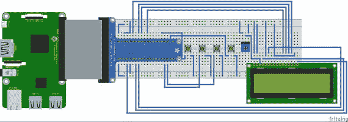

图 4-10。

自动化 Nim 游戏的 Fritzing 图表

显然，在这个设置中，连接线太多，无法在 Fritzing 图中正确显示。因此，我提供了两种图示：一种是显示 LCD 至 Pi Cobbler 互连的电路图，另一种是显示所有系统互连的引脚列表。图 4-11 是 LCD 模块至 Pi Cobbler 的电路图。

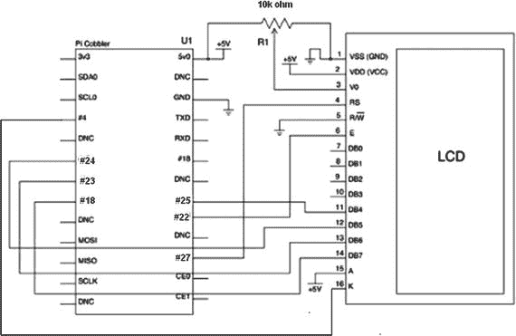

图 4-11.

Pi Cobbler 至 LCD 模块的电路图

表 4-5 是详细说明所有板子互连的引脚列表。请注意，LCD 引脚编号从左边的 1 开始，到右边的 16 结束，如 Fritzing 图所示。可变电阻是“颠倒”的，这使引脚位于顶部。左侧引脚连接到地，中间引脚连接到 LCD 引脚 3，右侧引脚连接到 5V。

表 4-5.

焊接互连引脚列表

| 从 | 到 | 备注 |
| --- | --- | --- |
| LCD 引脚 1 | 地 |   |
| LCD 引脚 2 | 5V | Vcc |
| LCD 引脚 3 | 中间引脚 - 可变电阻 | 亮度调整 Vo |
| LCD 引脚 4 | RasPi 引脚 27 | 寄存器选择 |
| LCD 引脚 5 | 地 | 读/写（R/W） |
| LCD 引脚 6 | RasPi 引脚 22 | 使能（时钟） |
| LCD 引脚 7 | - | 无连接（比特 0） |
| LCD 引脚 8 | - | 无连接（比特 1） |
| LCD 引脚 9 | - | 无连接（比特 2） |
| LCD 引脚 10 | - | 无连接（比特 3） |
| LCD 引脚 11 | RasPi 引脚 25 | 比特 4 |
| LCD 引脚 12 | RasPi 引脚 24 | 比特 5 |
| LCD 引脚 13 | RasPi 引脚 23 | 比特 6 |
| LCD 引脚 14 | RasPi 引脚 18 | 比特 7 |
| LCD 引脚 15 | 5V | 背光 LED 阳极 |
| LCD 引脚 16 | RasPi 引脚 4 | 背光 LED 阴极 |
| 左侧可变电阻引脚 | 地 |   |
| 中间可变电阻引脚 | LCD 引脚 3 |   |
| 右侧可变电阻引脚 | 5V |   |
| 按钮开关 1，左侧 | RasPi 引脚 12 |   |
| 按钮开关 1，右侧 | 3.3V |   |
| 按钮开关 2，左侧 | RasPi 引脚 13 |   |
| 按钮开关 2，右侧 | 3.3V |   |
| 按钮开关 3，左侧 | RasPi 引脚 19 |   |
| 按钮开关 3，右侧 | 3.3V |   |
| 退出按钮，左侧 | RasPi 引脚 20 |   |
| 退出按钮，右侧 | 3.3V |   |

在这个设置中需要连接很多跳线，因此在焊接无焊点面包板时要特别小心。如果你使用的是水平方向的板，建议使用单独的电源轨为 5V 供电，应位于面包板的顶部。特别注意不要将任何 5V 电源连接到 Raspberry Pi 的输入，因为这肯定会损坏该输入引脚。GPIO 输入严格限制在最大 3.3V，任何高于这个电压的都会烧毁输入引脚，并可能对 Raspberry Pi 核心造成进一步损坏。

图 4-12 显示了完整的物理设置，每个按钮的功能都已标注。

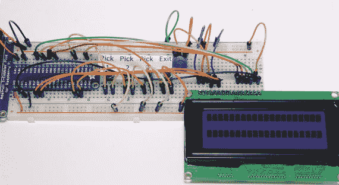

图 4-12.

自动 Nim 游戏的物理设置

控制此硬件的程序名为 automated_nim.py。它基于之前的程序，但所有输入现在都是通过回调函数完成的，并且使用 LCD 显示屏来显示游戏状态。我觉得在真正进入主程序之前，首先讨论 LCD 显示屏如何与 Raspberry Pi 一起工作是很合适的。

### 液晶显示屏

我首先承认，本节的大部分内容是基于 Tony DiCola 编写的一个非常好的 Adafruit 教程，该教程可在[`learn.adafruit.com/character-lcd-with-raspberry-pi-or-beaglebone-black/overview`](https://learn.adafruit.com/character-lcd-with-raspberry-pi-or-beaglebone-black/overview)找到。

价格低廉的 16 × 2 或 16 × 4 液晶显示屏，具有 16 个连接引脚，很可能是使用 Hitachi HD44780 控制器或其通用等效控制器。该液晶显示屏使用并行接口，这意味着您需要从 Raspberry Pi 引出多根线来控制它。此配置仅使用四个数据引脚和两个控制引脚。这种配置被称为 LCD nibble 输入模式。另一种模式是在每次向 LCD 输入新字符时，传输一个完整的字节或八位。显然，nibble 模式比字节模式慢，但在此应用中，速度差异并不明显。Raspberry Pi 只向显示屏发送数据；它不读取任何数据。这意味着您不必担心发送到更敏感的 Raspberry Pi 输入引脚的任何 5V 脉冲，因为这些引脚的最大电压输入为 3.3V，正如我之前提到的。

16 引脚 LCD 引脚上的寄存器选择引脚#4 有两个用途。当拉低时，Raspberry Pi 可以向 LCD 发送控制命令，例如更改到指定的字符位置或清除屏幕。这种模式被称为写入指令或命令寄存器。当寄存器选择引脚设置为高时，LCD 控制器进入数据模式并接受要显示在屏幕上的数据。

读写引脚#5 接地，因为在此配置中只需向 LCD 写入数据。

使能引脚#6 根据需要切换，以写入最终显示在屏幕上的输入寄存器中的数据。

在连接 LCD、按钮开关和电位计后，您需要加载一个特殊的 Python 库，该库允许 LCD 显示屏与 Raspberry Pi 一起工作。这个库是由 Adafruit 的聪明人创建的，他们有很多库来支持各种设备和传感器。我接下来要执行的程序也适用于加载大多数其他 Adafruit 专用库。

### 加载 Adafruit LCD 库

您需要 Git 应用程序来加载库，因为 Adafruit 使用 github.com 来存储其所有库。请输入以下命令来安装 Git：

```py
sudo apt-get update
sudo apt-get install git
```

一旦安装了 Git，你现在可以下载 LCD 库。这个下载过程被称为克隆。它会在你的主目录中创建一个名为 `Adafruit_Python_CharLCD` 的新目录。输入以下命令：

```py
sudo git clone git://github.com/adafruit/Adafruit_Python_CharLCD
```

新创建的目录包含设置库所需的全部文件，下一步是设置库。设置过程既长又复杂；然而，提供了一个简单的设置脚本来自动化整个过程。输入以下命令来设置库：

```py
cd Adafruit_Python_CharLCD
sudo python setup.py install
```

图 4-13 展示了安装过程的开始和结束。总的来说，在安装过程中发生了超过 70 个单独的操作，包括下载和构建多个依赖项。

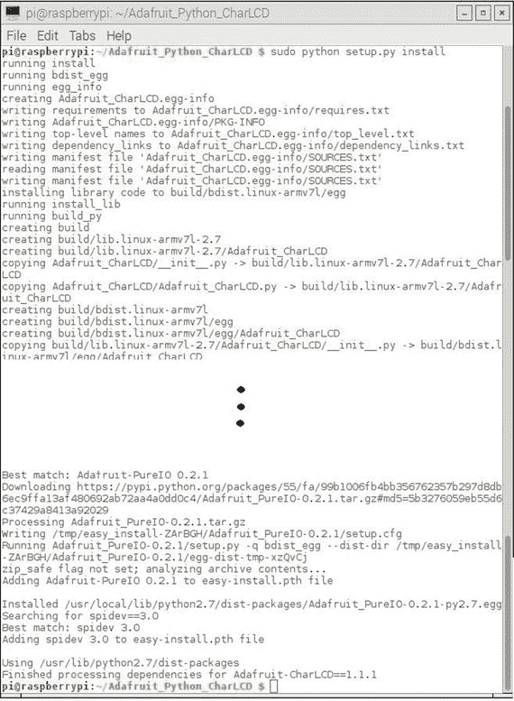

图 4-13。

LCD 库安装脚本执行

现在，你应该测试硬件和软件安装，以验证一切是否正常工作。

### LCD 测试

命名为 char_lcd.py 的测试程序应位于 Git 克隆操作完成后创建的 `Adafruit_Python_CharLCD` 目录的 examples 子目录中。转到 examples 目录并输入以下命令：

```py
python char_lcd.py
```

如果一切接线正确，并且所有库都已正确安装，你应该会看到如图 4-14 所示的显示。

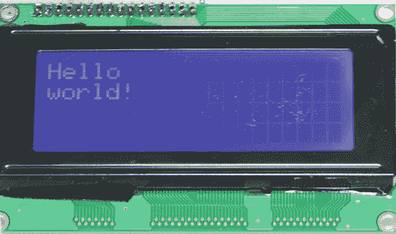

图 4-14。

运行 char_lcd.py 程序的结果

如果你没有看到这个显示，请重新检查所有接线，因为很容易错放跳线插入点或连接到 Pi Cobbler 或 LCD 模块上的错误引脚。正如我之前提到的，大多数故障通常是接线或互连错误。

假设 LCD 测试成功，现在是时候考虑主要的 Nim 程序了。

### automated_nim.py

由于需要整合回调函数和 LCD 显示例程，这个程序与之前的 Nim 程序相比已经发生了重大变化。我还将一些 AI 逻辑整合到程序中：计算机对手现在使用博弈论方程 n mod 4 = 1 来帮助其选择棍子，此外，当无法实现最佳选择时，还会使用随机数生成器。

automated_nim.py 列表

```py
!/usr/bin/python
# import statements
import random
import time
import Adafruit_CharLCD as LCD
import RPi.GPIO as GPIO
# Start Raspberry Pi configuration
# Raspberry Pi pin designations
lcd_rs        = 27
lcd_en        = 22
lcd_d4        = 25
lcd_d5        = 24
lcd_d6        = 23
lcd_d7        = 18
lcd_backlight =  4
# Define LCD column and row size for a 16x4 LCD.
lcd_columns = 16
lcd_rows    =  4
# Instantiate an LCD object
lcd = LCD.Adafruit_CharLCD(lcd_rs, lcd_en, lcd_d4, lcd_d5, lcd_d6, lcd_d7, lcd_columns, lcd_rows, lcd_backlight)
# Print a two line welcoming message
lcd.message('Lets play nim\ncomputer vs human')
# Wait 5 seconds
time.sleep(5.0)
# Clear the screen
lcd.clear()
# Setup GPIO pins
# Set the BCM mode
GPIO.setmode(GPIO.BCM)
# Inputs
GPIO.setup(12, GPIO.IN, pull_up_down = GPIO.PUD_DOWN)
GPIO.setup(13, GPIO.IN, pull_up_down = GPIO.PUD_DOWN)
GPIO.setup(19, GPIO.IN, pull_up_down = GPIO.PUD_DOWN)
GPIO.setup(20, GPIO.IN, pull_up_down = GPIO.PUD_DOWN)
# Create the global variables
global player
player = ""
global humanTurn
humanTurn = False
global stickNumber
stickNumber = 21
global humanPick
humanPick = 0
global gameover
gameover = False
# Set up the callback functions
def pickOne(channel):
global humanTurn
global humanPick
humanPick = 1
humanTurn = True
def pickTwo(channel):
global humanTurn
global humanPick
humanPick = 2
humanTurn = True
def pickThree(channel):
global humanTurn
global humanPick
humanPick = 3
humanTurn = True
def quit(channel):
lcd.clear()
exit()      # pin 20, immediate exit from the game
# Add event detection and callback assignments
GPIO.add_event_detect(12, GPIO.RISING, callback=pickOne)
GPIO.add_event_detect(13, GPIO.RISING, callback=pickTwo)
GPIO.add_event_detect(19, GPIO.RISING, callback=pickThree)
GPIO.add_event_detect(20, GPIO.RISING, callback=quit)
# random selection for the players
playerSelect = random.randint(0,1)
if playerSelect:
humanTurn = True
lcd.message('Human goes first')
time.sleep(2)
lcd.clear()
else:
humanTurn = False
lcd.message('Computer goes first')
time.sleep(2)
lcd.clear()
# The AI portion
def computerMove():
global stickNumber
global humanTurn
if (stickNumber-1) % 4 == 1:
computerPick = 1
elif (stickNumber-2) % 4 == 1:
computerPick = 2
elif (stickNumber-3) % 4 == 1:
computerPick = 3
else:
computerPick = random.randint(1,3)
if stickNumber >= 4:
stickNumber -= computerPick
elif (stickNumber==4) or (stickNumber==3) or (stickNumber==2):
stickNumber = 1
humanTurn = True
# The human portion
def humanMove():
global humanPick
global humanTurn
global stickNumber
while not humanPick:
pass
while (humanPick >= stickNumber):
lcd.message('Number selected\n')
lcd.message('is >= remaining\n')
lcd.message('sticks')
stickNumber -= humanPick
humanTurn = False
humanPick = 0
lcd.clear()
def checkWinner():
global gameover
global player
global stickNumber
if stickNumber == 1:
msg = player + ' wins!'
lcd.message(msg)
time.sleep(5)
gameover = True
def resetGameover():
global gameover
global stickNumber
gameover = False
stickNumber = 21
return gameover
# This module controls the overall game play
def game():
global player
global humanTurn
global gameover
global stickNumber
while gameover == False:
if humanTurn == True:
lcd.message('human turn\n')
msg = 'sticks left: ' + str(stickNumber) + '\n'
lcd.message(msg)
humanMove()
msg = 'sticks left: ' + str(stickNumber)
lcd.message(msg)
time.sleep(2)
checkWinner()
lcd.clear()
else:
lcd.message('computer turn\n')
computerMove()
msg = 'sticks left: ' + str(stickNumber)
lcd.message(msg)
time.sleep(2)
checkWinner()
lcd.clear()
if gameover == True:
lcd.clear()
playAgain()
# As the name suggests; play again?
def playAgain():
global humanPick
lcd.message('Play again?\n')
lcd.message('1 = y, 2 = n')
# This loop is needed to idle while waiting for a button press
while humanPick == 0:
pass
if humanPick == 1:
lcd.clear()
resetGameover()
game()
elif humanPick == 2:
lcd.clear()
lcd.message('Thanks for \n')
lcd.message('playing the game')
time.sleep(5)
lcd.clear()
exit()
# This function call kicks off the game play
game()
```

我相信你会发现在这个程序中击败计算机相当困难，这与早期的、更天真的 Nim 程序形成鲜明对比。图 4-15 是我在与计算机进行一轮游戏时捕获的 LCD 屏幕照片。

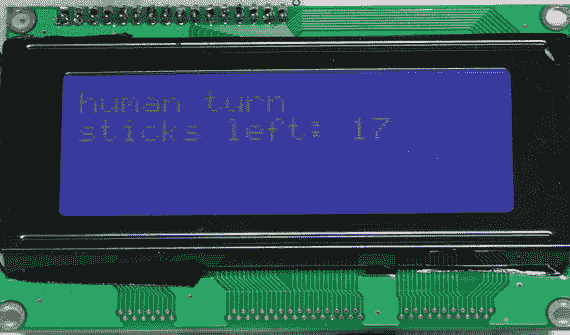

图 4-15。

轮次游戏中的 LCD 显示

这个自动化的 Nim 程序是本章的最终项目。在 Jessie Linux 发行版中，你可以轻松找到更多 Python 游戏，你可能希望对其进行调查。它们可以在图 4-16 所示的主 X 窗口 GUI 中找到。

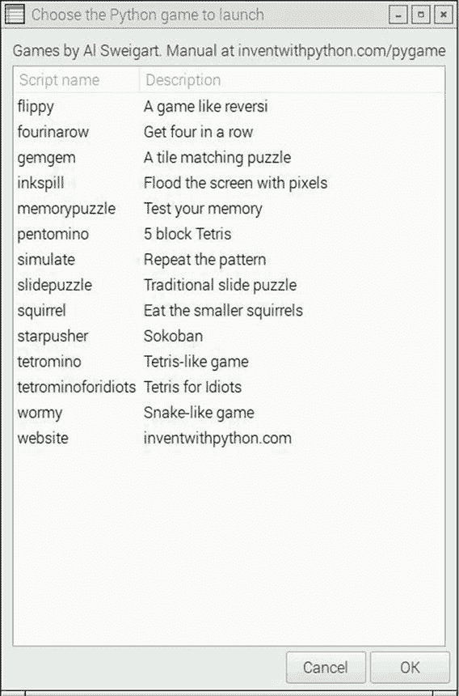

图 4-16。

其他 Python 游戏

这些游戏由 Al Sweigert 提供，他的网站是[www.inventwithpython.com](http://www.inventwithpython.com)。在这个网站上，您可以免费下载一本 347 页的电子书，书名为《用 Python & Pygame 制作游戏》，Al 在其中详细描述了图 4-16 中列出的游戏的工作原理。对于那些对 Python 游戏开发感兴趣并希望超越本章所讨论的内容的读者来说，这是一本强烈推荐的书籍。

## 摘要

本章的重点是 Python 语言编写的相对简单的游戏程序。我展示了两个游戏——剪刀石头布和 Nim——的几个版本，这些版本从相对简单的版本发展到更复杂的版本，这些复杂版本将 AI 集成到了计算机对手中。

本章的一个目标是要展示如何将相对简单的 AI 概念应用到经典游戏中，在这些游戏中，人类玩家与计算机程序进行对抗。

另一个附带目标是展示一些硬件和软件技术，包括 Python 中断，并展示如何使用树莓派上的 LCD 显示屏。
