# 5. 模糊逻辑系统

本章是关于模糊逻辑（FL）概念的扩展，这些概念最初在第二章中介绍。2。我展示了两个模糊逻辑项目。第一个项目处理我们偶尔都会遇到的一种常见情况：如何在餐厅用餐时计算小费。第二个演示更为复杂，涉及实现一个使用模糊逻辑（FL）作为其控制技术一部分的控制系统。这两个演示都使用了 Python 和 pyFuzzy 插件库，该库将模糊逻辑集成到 Python 语言中。还有一些新的模糊逻辑主题需要讨论。我将这些新主题与模糊逻辑小费演示结合起来，为新的概念提供一个更好的框架。

在我开始基本模糊逻辑系统（FLS）部分之前，确保你已经设置了 Raspberry Pi，以便可以加载和运行 FL 演示程序是非常重要的。

## 零件清单

对于最后一个演示，你需要表 5-1 中列出的部件。

表 5-1。

零件清单

| 描述 | 数量 | 备注 |
| --- | --- | --- |
| Pi Cobbler | 1 | 40 针版本，T 或 DIP 形式均可接受 |
| 无焊面包板 | 1 | 860 个插入点，带电源条 |
| 跳线 | 1 包 | 可从许多来源获得 |
| LED | 3 | 可从许多来源获得的商品 |
| 220Ω电阻 | 3 | 1/4 瓦 |

## 软件安装

首先，你需要 Python 2.7，它应该已经作为 Jessie Linux 发行版的一部分安装。你还需要 numpy、scipy、matplotlib 和 skfuzzy 包，这些包使用 Python 实现模糊逻辑，并具有创建可视化的绘图函数。

在命令行中输入以下命令以安装 numpy、scipy 和 matplotlib 软件：

```py
sudo apt-get update
sudo apt-get install python-numpy
```

注意

numpy 可能已经安装，所以当你运行此命令时，你只会看到已安装最新版本。

```py
sudo apt-get install python-scipy
sudo apt-get install python-matplotlib
```

skfuzzy 软件的安装相对复杂。你需要从 GitHub 网站克隆软件；然而，你需要 Git 应用程序来完成此操作。因此，通过输入以下命令安装 Git：

```py
sudo apt-get install git
```

安装 Git 后，你需要使用以下命令克隆软件：

```py
sudo git clone https://github.com/scikit-fuzzy/scikit-fuzzy.git
```

克隆操作会自动将所有 skfuzzy 软件解压缩到名为 scikit-fuzzy 的新子目录中，位于主目录中。输入以下命令设置 skfuzzy：

```py
cd scikit-fuzzy
sudo python setup.py install
```

当 skfuzzy 安装进行时，你会看到很多对话框滚动过去。安装完成后，你应该可以执行模糊 Python 脚本。

## 基本 FLS

图 5-1 显示了构成基本 FLS 的四个主要组件。

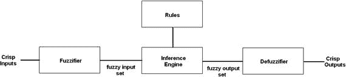

图 5-1。

基本 FLS 的框图

这些是主要的 FLS 组件：

+   模糊化器：这是一个收集清晰输入数据并将其转换为模糊集的过程，使用模糊语言变量、模糊语言术语和隶属函数。

+   规则：收集并编码到推理引擎中的专家知识。

+   推理引擎：根据应用于输入模糊集的一组规则生成推理。

+   反模糊化器：基于推理引擎的模糊集输出创建清晰输出。

图 5-1 也可以表示为一系列步骤或实现 FL 过程的逻辑算法。我使用这个通用算法，如表 5-2 所示，来实现本章所有 FLS 演示项目。

表 5-2。

FL 算法

| 步骤编号 | 名称 | 描述 |
| --- | --- | --- |
| 1 | 初始化 | 定义语言变量和术语 |
| 2 | 初始化 | 构建隶属函数 |
| 3 | 初始化 | 构建规则集 |
| 4 | 模糊化 | 使用隶属函数将清晰输入数据转换为模糊集 |
| 5 | 推理 | 根据规则集评估模糊集 |
| 6 | 聚合 | 结合每个规则评估的结果 |
| 7 | 反模糊化 | 将模糊集转换为清晰输出值 |

## 初始化：定义语言变量和术语

我刚才介绍的语言变量是代表系统输入和输出的值。它们通常不是数值，而是通常是来自自然语言（如英语）的单词，甚至是句子。语言变量也被分解成一组语言术语。

## 演示 5-1：使用 FL 计算小费

在小费场景中，有多个输入变量会影响决定在完成餐厅餐后给服务员多少小费。让我们考虑两个主要输入：食品质量和服务质量。

我确实意识到，当确定小费时，许多人会将食品质量与服务质量区分开来，因为服务员除了确保餐点在桌上上桌时仍然热之外，对食品质量或准备没有控制权。然而，在这个演示中，我考虑食品质量是一个有效的输入。

唯一的输出变量是小费金额，它是总账单的百分比。

现在，重要的是要开发一些适合这种情况的语言术语。

可能最容易且最明显的方法来分类食品质量是使用以下术语：

+   极好

+   还可以

+   差

同样，使用这些术语对服务质量进行分类：

+   惊人

+   可接受

+   糟糕

小费金额也受模糊语言术语的影响。这些是小费金额使用的术语：

+   低

+   中等

+   高

备注

从现在开始，我将使用斜体来表示语言变量，以帮助区分它们与普通单词或术语。

必须有一个数值量表供用户对服务质量以及食品质量进行评分。对于大多数人来说，0 到 10 的量表就足够了，其中 0 是最差的，10 是最佳的。小费输出的数值量表也必须设置。这个量表设置为 0 到 26，以表示适合正常小费百分比的适当范围。所有这些数值量表都代表了隶属函数的清晰或非模糊输入或输出，这些将在下一节中讨论。

## 初始化：构建隶属函数

隶属函数在 FL 模糊化和去模糊化步骤中都得到应用。这些函数将非模糊输入值映射到模糊语言变量以进行模糊化，并将模糊变量映射到非模糊输出值以进行去模糊化。本质上，隶属函数量化了语言术语。图 5-2 显示了食品质量隶属函数。

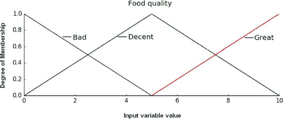

图 5-2。

食品质量隶属函数

图 5-3 显示了服务质量隶属函数。

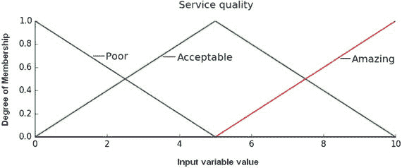

图 5-3。

服务质量隶属函数

最后，图 5-4 显示了小费金额隶属函数。

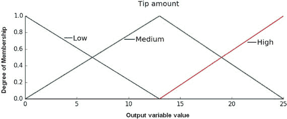

图 5-4。

小费金额隶属函数

我选择使用三角形形状来表示良好、可接受和中等语言术语。我使用开口梯形形状来表示极坏、极好、差、惊人、低和高等术语。除了三角形之外，还有其他形状常用于隶属函数，包括

+   高斯分布

+   梯形

+   单点

+   分段线性

+   正弦

+   指数

选择合适的隶属函数形状通常基于用户的经验。我有时使用以下类比来帮助人们理解隶属函数。假设你采访了一大批人，了解他们在根据食品和服务质量确定适当的小费金额时的偏好。正如大多数读者所理解的那样，小费值的结果分布呈高斯分布，或呈正态分布，这是随机采访大量人群的可能结果。高斯曲线上的任何一点都是对应食品和服务质量度量的组概率。完全有可能使用高斯分布形状作为隶属函数，如图 5-5 所示。

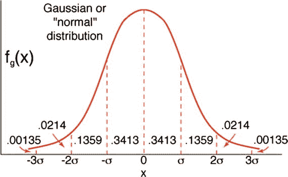

图 5-5。

高斯分布隶属函数

使用这种形状的唯一问题是，你现在正在处理高斯曲线背后的基础数学，当试图在 FL 应用中使用时，它会迅速变得混乱和繁琐。归一化高斯方程的形式如下：

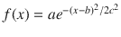 其中 a、b 和 c 是广义参数

高斯曲线可能是这个例子中人类行为和选择的更好模型，但使用它并不值得付出努力，因为可以使用远为简单的三角形形状来很好地理解隶属度曲线。

### 隶属函数可视化

主要的 Python 程序还包含了图 5-2、5-3 和 5-4 中显示的代码，这应该会极大地帮助理解隶属函数。以下代码段在整体程序执行时生成这些图形：

```py
# Visualize the membership functions
fig, (ax0, ax1, ax2) = plt.subplots(nrows=3, figsize=(8, 9))
ax0.plot(x_qual, qual_lo, 'b', linewidth=1.5, label='Bad')
ax0.plot(x_qual, qual_md, 'g', linewidth=1.5, label='Decent')
ax0.plot(x_qual, qual_hi, 'r', linewidth=1.5, label='Great')
ax0.set_title('Food quality')
ax0.legend()
ax1.plot(x_serv, serv_lo, 'b', linewidth=1.5, label='Poor')
ax1.plot(x_serv, serv_md, 'g', linewidth=1.5, label='Acceptable')
ax1.plot(x_serv, serv_hi, 'r', linewidth=1.5, label='Amazing')
ax1.set_title('Service quality')
ax1.legend()
ax2.plot(x_tip, tip_lo, 'b', linewidth=1.5, label='Low')
ax2.plot(x_tip, tip_md, 'g', linewidth=1.5, label='Medium')
ax2.plot(x_tip, tip_hi, 'r', linewidth=1.5, label='High')
ax2.set_title('Tip amount')
ax2.legend()
# Turn off top/right axes
for ax in (ax0, ax1, ax2):
ax.spines['top'].set_visible(False)
ax.spines['right'].set_visible(False)
ax.get_xaxis().tick_bottom()
ax.get_yaxis().tick_left()
plt.tight_layout()
```

注意

在此代码段运行之前需要额外的初始化。下一代码段中显示了这些额外的代码。

## 初始化：构建规则集

FLS 还需要一个专家系统来根据模糊化的输入变量生成适当的控制动作。这个专家系统是“如果<条件>那么<结论>”的形式，这在第二章中讨论过。以下是为这个 FLS 演示实现的规则：

+   如果食物很差或服务很差，那么小费将是低的

+   如果服务可以接受，那么小费将是适中的

+   如果食物很棒或服务惊人，那么小费将是高的

这三条规则适用于输入变量和输出变量。我将在模糊化部分讨论之后讨论如何应用这些规则，这部分内容将在下一部分介绍。模糊化是 FLS 算法的第 4 步。

模糊化：使用隶属函数将清晰输入数据 a 转换为模糊集。

隶属函数形状和生成适当小费百分比的规则已经设置。接下来要展示的是如何对清晰的食物和服务评分进行模糊化。这个程序对每个这些清晰变量都是相同的，因为我为每个选择了相同的隶属函数形状。这个选择可以变化，在 FLS 中对于不同的清晰变量通常会有不同的、独立的隶属函数。

“模糊化”一词指的是使用模糊语言变量和术语以及隶属函数将一组清晰输入数据转换为模糊集的行为。实际的模糊化发生在依赖于以下代码段的函数集中，该代码段创建输入和输出变量范围以及隶属函数：

```py
import numpy as np
import skfuzzy as fuzz
import matplotlib.pyplot as plt
# Generate universe variables
#   * food quality and service on subjective ranges, 0 to 10
#   * tip has a range of 0 to 25 in units of percentage points
x_qual = np.arange(0, 11, 1)
x_serv = np.arange(0, 11, 1)
x_tip  = np.arange(0, 26, 1)
# Generate fuzzy membership functions
qual_lo = fuzz.trimf(x_qual, [0, 0, 5])
qual_md = fuzz.trimf(x_qual, [0, 5, 10])
qual_hi = fuzz.trimf(x_qual, [5, 10, 10])
serv_lo = fuzz.trimf(x_serv, [0, 0, 5])
serv_md = fuzz.trimf(x_serv, [0, 5, 10])
serv_hi = fuzz.trimf(x_serv, [5, 10, 10])
tip_lo  = fuzz.trimf(x_tip,  [0, 0, 13])
tip_md  = fuzz.trimf(x_tip,  [0, 13, 25])
tip_hi  = fuzz.trimf(x_tip,  [13, 25, 25])
```

为了测试算法，让我们假设食物质量被评为 6.5，服务被评为 9.8。以下代码段计算每个输入变量和隶属函数的六个隶属度。

```py
qual_level_lo = fuzz.interp_membership(x_qual, qual_lo, 6.5)
qual_level_md = fuzz.interp_membership(x_qual, qual_md, 6.5)
qual_level_hi = fuzz.interp_membership(x_qual, qual_hi, 6.5)
serv_level_lo = fuzz.interp_membership(x_serv, serv_lo, 9.8)
serv_level_md = fuzz.interp_membership(x_serv, serv_md, 9.8)
serv_level_hi = fuzz.interp_membership(x_serv, serv_hi, 9.8)
```

`fuzz.interp_membership(a, b, c)`函数是您之前安装的 skfuzzy 库的一部分。这是一个插值函数，它使用隶属函数范围（`a`）、线性形状（`b`）以及清晰输入值（`c`）来计算该特定组的隶属度。

一旦确定了隶属度值，就到了应用规则的时候了。这是算法或推理的第 5 步。

## 推理：根据规则集评估模糊集

应用 if…then 推理规则相当容易，因为你只需关注语言术语之间的关系。例如，这是规则 1：

+   如果食物很差或服务很差，那么小费将是低的

坏和差的语言术语之间的结合是“或”运算符。在模糊逻辑中，使用“或”运算符相当于选择代表各自语言术语的两个隶属度值中的最大值。如果你回顾图 5-2 和 5-3，你会很快看到，对于假设的 crisp 输入变量值，与坏和差的隶属函数都没有交集，因此应用此规则的结果必须是 0。将结合的坏和差语言术语连接到低小费隶属函数是微不足道的，因为值仍然大于适用值域。

应用规则 2 略有不同。这是规则 2：

如果服务是可接受的，那么小费将是中等的。

在这种情况下，只考虑服务成员函数作为输入。回顾图 5-3，你会看到将 crisp 输入变量值 9.8 应用到可接受隶属组，结果得到大约 0.02 的隶属度。然后对可接受服务和中等小费隶属函数应用“与”运算符，这导致对两个隶属函数都应用最小操作。这个最小操作有效地“平顶化”了隶属函数，产生了新的形状，如图 5-6 所示。注意，输入范围已经扩展，以适应小费值范围，这是输入服务范围的 2.5 倍。还要注意，由于 x 轴尺度的扩展，隶属函数末端的线斜率减小。

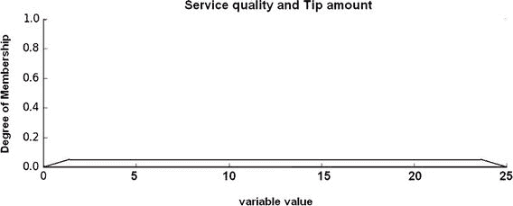

图 5-6。

应用规则 2 后的服务和小费成员函数

规则 3 是最后应用的：

如果食物很棒或服务很惊人，那么小费将是高的。

对于规则 3，应用了“或”操作，就像规则 1 一样。但在这个情况下，与伟大的和惊人的成员函数有明确的交集。图 5-7 显示了在合并之前被平顶化后的食物和服务成员函数。

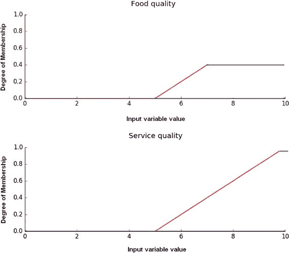

图 5-7。

平顶化食物和服务成员函数

图 5-8 显示了优秀、惊人和高成员函数的结合。由于“或”操作命令最大值，且两个未修改的成员函数形状完全相同，因此形状大致与未修改的成员函数相同，这并不令人惊讶。在将组合隶属函数“与”高尖端隶属函数结合后，形状也保持不变，尽管 x 轴值的范围变为 0 到 25 以适应尖端范围，就像之前的规则一样，并且由于 x 轴的扩展，平顶区域略有扩大。

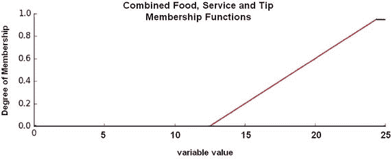

图 5-8。

结合了优秀、惊人和高成员函数

以下代码段应用规则并组合隶属函数：

```py
# Apply rule 1
# The 'or' operator means to take the maximum by using the 'np.max' function
active_rule1 = np.fmax(qual_level_lo, serv_level_lo)
# Next, flattop the corresponding output
# Combine with low tip membership function using `np.fmin`
tip_activation_lo = np.fmin(active_rule1, tip_lo)  # Removed entirely to 0
# Rule 2  connects acceptable service to medium tipping
# No flat topping needed as there is only one input membership function
# However, the tip membership must be combined using an 'and' or 'np.fmin' function
tip_activation_md = np.fmin(serv_level_md, tip_md)
# Rule 3 connects amazing service or great food with high tipping
active_rule3 = np.fmax(qual_level_hi, serv_level_hi)
tip_activation_hi = np.fmin(active_rule3, tip_hi)
```

到目前为止，所有规则都已应用于输出隶属函数。现在需要将它们全部结合。在 FL 术语中，这被称为聚合，是 FLS 算法的第 6 步。

## 聚合：结合每个规则评估的结果

聚合通常使用最大运算符来完成。以下语句执行聚合：

```py
# Aggregate all three output membership functions together
aggregated = np.fmax(tip_activation_lo, np.fmax(tip_activation_md, tip_activation_hi))
```

图 5-9 显示了聚合完成后最终的组合隶属函数。

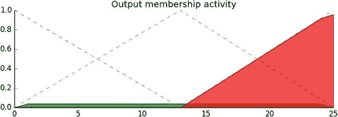

图 5-9。

聚合后的隶属函数

FLS 算法中只有一步更多：去模糊化。

## 去模糊化：将模糊集转换为清晰输出值

去模糊化是将我们从模糊世界返回现实世界并创建一个可以采取行动的输出的过程，在这种情况下是一个尖端百分比。去模糊化有多种数学技术可用，包括

+   重心

+   分割线

+   平均值

+   最大值中的最小值

+   最大值中的最大值

+   加权平均

图 5-10 展示了如何使用任意的聚合隶属函数选择每种方法的价值。

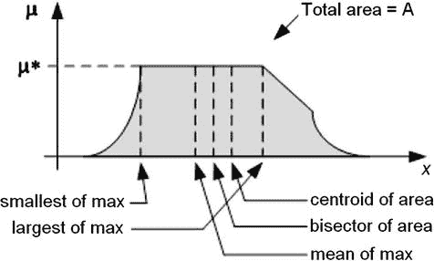

图 5-10。

不同的去模糊化方法

重心去模糊化是最常用的方法，因为它非常准确。它计算隶属函数曲线下的面积中心。这可能需要对复杂成员函数进行大量的计算处理。重心方程是

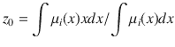

其中 z [0]是去模糊化输出，μ [i]代表一个隶属函数，x 是输出变量。

分割线去模糊化使用垂直线将隶属曲线下的面积分割成两个相等的区域：

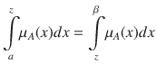

最大隶属度均值（MOM）模糊化方法使用聚合隶属函数输出的平均值。

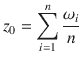

最小隶属度法使用聚合隶属函数输出的最小值。

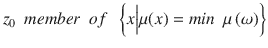

最大隶属度法使用聚合隶属函数输出的最大值。

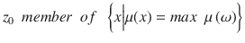

加权平均模糊化方法计算每个模糊集的加权总和。根据以下公式确定的加权值和模糊输出的隶属度，设置清晰值：

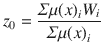

μ [i] 是输出单例 i 的隶属度，W [i] 是输出单例 i 的模糊输出权重值。

接下来，我将讨论如何实现此项目的质心方法。以下代码片段计算质心模糊化值：

```py
# Calculate defuzzified result
tip = fuzz.defuzz(x_tip, aggregated, 'centroid')
# This value is needed for the plot
tip_activation = fuzz.interp_membership(x_tip, aggregated, tip)
```

本节完成了小费模糊逻辑项目。剩下要做的就是加载并运行以下名为 tipping.py 的代码。输入以下内容以运行程序：

```py
sudo python tipping.py
```

每次出现一个图后，您需要关闭它才能继续下一个图。

tipping.py 列表

```py
import numpy as np
import skfuzzy as fuzz
import matplotlib.pyplot as plt
# Generate universe variables
#   * Quality and service on subjective ranges [0, 10]
#   * Tip has a range of [0, 25] in units of percentage points
x_qual = np.arange(0, 11, 1)
x_serv = np.arange(0, 11, 1)
x_tip  = np.arange(0, 26, 1)
# Generate fuzzy membership functions
qual_lo = fuzz.trimf(x_qual, [0, 0, 5])
qual_md = fuzz.trimf(x_qual, [0, 5, 10])
qual_hi = fuzz.trimf(x_qual, [5, 10, 10])
serv_lo = fuzz.trimf(x_serv, [0, 0, 5])
serv_md = fuzz.trimf(x_serv, [0, 5, 10])
serv_hi = fuzz.trimf(x_serv, [5, 10, 10])
tip_lo = fuzz.trimf(x_tip, [0, 0, 13])
tip_md = fuzz.trimf(x_tip, [0, 13, 25])
tip_hi = fuzz.trimf(x_tip, [13, 25, 25])
# Visualize these universes and membership functions
fig, (ax0, ax1, ax2) = plt.subplots(nrows=3, figsize=(8, 9))
ax0.plot(x_qual, qual_lo, 'b', linewidth=1.5, label='Bad')
ax0.plot(x_qual, qual_md, 'g', linewidth=1.5, label='Decent')
ax0.plot(x_qual, qual_hi, 'r', linewidth=1.5, label='Great')
ax0.set_title('Food quality')
ax0.legend()
ax1.plot(x_serv, serv_lo, 'b', linewidth=1.5, label='Poor')
ax1.plot(x_serv, serv_md, 'g', linewidth=1.5, label='Acceptable')
ax1.plot(x_serv, serv_hi, 'r', linewidth=1.5, label='Amazing')
ax1.set_title('Service quality')
ax1.legend()
ax2.plot(x_tip, tip_lo, 'b', linewidth=1.5, label='Low')
ax2.plot(x_tip, tip_md, 'g', linewidth=1.5, label='Medium')
ax2.plot(x_tip, tip_hi, 'r', linewidth=1.5, label='High')
ax2.set_title('Tip amount')
ax2.legend()
# Turn off top/right axes
for ax in (ax0, ax1, ax2):
ax.spines['top'].set_visible(False)
ax.spines['right'].set_visible(False)
ax.get_xaxis().tick_bottom()
ax.get_yaxis().tick_left()
plt.tight_layout()
plt.show()
# Calculate degrees of membership
# The exact values 6.5 and 9.8 do not exist on our universes
# Use fuzz.interp_membership to determine values
qual_level_lo = fuzz.interp_membership(x_qual, qual_lo, 6.5)
qual_level_md = fuzz.interp_membership(x_qual, qual_md, 6.5)
qual_level_hi = fuzz.interp_membership(x_qual, qual_hi, 6.5)
serv_level_lo = fuzz.interp_membership(x_serv, serv_lo, 9.8)
serv_level_md = fuzz.interp_membership(x_serv, serv_md, 9.8)
serv_level_hi = fuzz.interp_membership(x_serv, serv_hi, 9.8)
# Apply the rules, Rule 1 concerns bad food OR service.
# The OR operator means we take the maximum of these two.
active_rule1 = np.fmax(qual_level_lo, serv_level_lo)
# Now we apply this by clipping the top off the corresponding output
# membership function with `np.fmin`
tip_activation_lo = np.fmin(active_rule1, tip_lo)  # removed entirely to 0
# Rule 2 is a straight if ... then construction
# if acceptable service then medium tipping. This is an AND operator
# We take the minimum for an AND operator
tip_activation_md = np.fmin(serv_level_md, tip_md)
# For rule 3 we connect high service OR high food with high tipping
active_rule3 = np.fmax(qual_level_hi, serv_level_hi)
tip_activation_hi = np.fmin(active_rule3, tip_hi)
tip0 = np.zeros_like(x_tip)
# Visualize these rule applications
fig, ax0 = plt.subplots(figsize=(8, 3))
ax0.fill_between(x_tip, tip0, tip_activation_lo, facecolor='b', alpha=0.7)
ax0.plot(x_tip, tip_lo, 'b', linewidth=0.5, linestyle='--', )
ax0.fill_between(x_tip, tip0, tip_activation_md, facecolor='g', alpha=0.7)
ax0.plot(x_tip, tip_md, 'g', linewidth=0.5, linestyle='--')
ax0.fill_between(x_tip, tip0, tip_activation_hi, facecolor='r', alpha=0.7)
ax0.plot(x_tip, tip_hi, 'r', linewidth=0.5, linestyle='--')
ax0.set_title('Output membership activity')
# Turn off top/right axes
for ax in (ax0,):
ax.spines['top'].set_visible(False)
ax.spines['right'].set_visible(False)
ax.get_xaxis().tick_bottom()
ax.get_yaxis().tick_left()
plt.tight_layout()
plt.show()
# Aggregate all three output membership functions together
# This aggregation uses OR operators, hence the maximum is found
aggregated = np.fmax(tip_activation_lo, np.fmax(tip_activation_md, tip_activation_hi))
# Calculate defuzzified result using the method of centroids
tip = fuzz.defuzz(x_tip, aggregated, 'centroid')
# display the tip percentage on the console
print tip
# Value needed for the next plot
tip_activation = fuzz.interp_membership(x_tip, aggregated, tip)
# Visualize the final results
fig, ax0 = plt.subplots(figsize=(8, 3))
ax0.plot(x_tip, tip_lo, 'b', linewidth=0.5, linestyle='--', )
ax0.plot(x_tip, tip_md, 'g', linewidth=0.5, linestyle='--')
ax0.plot(x_tip, tip_hi, 'r', linewidth=0.5, linestyle='--')
ax0.fill_between(x_tip, tip0, aggregated, facecolor='Orange', alpha=0.7)
ax0.plot([tip, tip], [0, tip_activation], 'k', linewidth=1.5, alpha=0.9)
ax0.set_title('Aggregated membership and result (line)')
# Turn off top/right axes
for ax in (ax0,):
ax.spines['top'].set_visible(False)
ax.spines['right'].set_visible(False)
ax.get_xaxis().tick_bottom()
ax.get_yaxis().tick_left()
plt.tight_layout()
plt.show()
```

图 5-11 是显示器上首先显示的图像。它显示了所有三个隶属函数：食品质量、服务质量和小费金额。

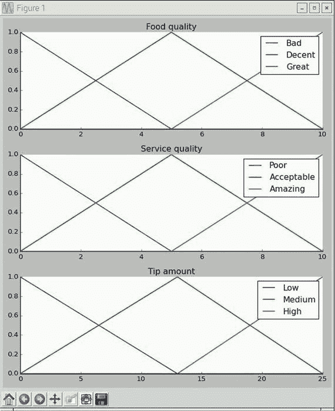

图 5-11.

三个隶属函数

图 5-12 展示了以下显示：应用所有规则后的组合隶属函数，以及所有输入和输出的隶属函数都连接在一起。

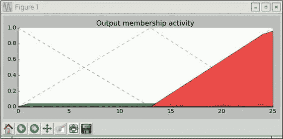

图 5-12.

规则应用后的隶属函数

图 5-13 展示了以下显示：所有处理过的隶属函数的聚合结果。此外，还有一条线表示由模糊化过程产生的小费百分比的清晰输出。

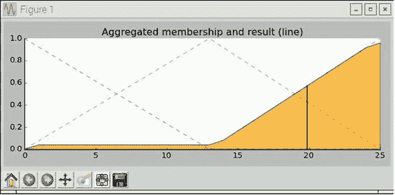

图 5-13.

聚合和模糊化结果

最后，图 5-14 展示了小费百分比的文本显示，它来自程序中的打印语句。

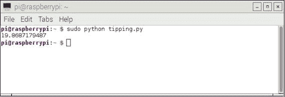

图 5-14.

打印小费百分比的语句

## 演示 5-2：对 tipping.py 程序的修改

在本节中，我讨论了对 Python 程序的修改，使其更容易使用并且更加便携。主要的修改是询问用户关于食物和服务质量，而不是像初始项目那样使用静态值。这个修改相当简单，包括创建两个变量来存储食物和服务质量等级，以及两个输入语句将数据输入到程序中。附加或修改的代码如下：

```py
food_qual = raw_input('Rate the food quality, 0 to 10')
service_qual = raw_input('Rate the service quality, 0 to 10')
qual_level_lo = fuzz.interp_membership(x_qual, qual_lo, float(food_qual))
qual_level_md = fuzz.interp_membership(x_qual, qual_md, float(food_qual))
qual_level_hi = fuzz.interp_membership(x_qual, qual_hi, float(food_qual))
serv_level_lo = fuzz.interp_membership(x_serv, serv_lo, float(service_qual))
serv_level_md = fuzz.interp_membership(x_serv, serv_md, float(service_qual))
serv_level_hi = fuzz.interp_membership(x_serv, serv_hi, float(service_qual))
```

这段修改后的代码负责提示用户输入食物和服务质量评分。

第二次修改是将整个系统完全做成便携式，某种程度上类似于前一章中讨论的 Nim 游戏配置。我会使用一个液晶显示屏来显示用户提示输入食物和服务质量评分，然后显示结果的小费百分比。拥有一套便携式模糊逻辑系统来计算小费百分比并向你的亲戚和朋友炫耀，那会多么酷啊？液晶显示屏界面和软件在前一章中已有讨论。唯一需要的新技术是用户输入质量评分的 USB 数字键盘。图 5-15 展示了我在这次修改中试验的一个非常便宜的 USB 键盘。我不会详细介绍如何完成这个便携式系统，因为我相当自信你们大多数人可以适应前一章中关于 LCD 的讨论来应用于这个新应用。只需记住，不再需要所有的可视化代码，这大大减少了主程序的大小。


图 5-15。

便宜的 USB 数字键盘

本节完成了第一个项目。现在是时候考虑一个更复杂的模糊逻辑控制器项目了。

## 演示 5-3：FLS 供暖和冷却系统

我开始这个项目假设你已经阅读并理解了本章的第一个项目。关于 FL 概念不应该需要任何详细的讨论。我只是在开发这个项目时遵循 FLS 算法。此外，在这个项目中我没有使用任何可视化代码，因为它们在前一个项目中已经完成了其任务。感兴趣的读者可以很容易地重新引入代码以获得图表，以了解这个系统的功能。

考虑一个供暖、通风和空调系统（HVAC），从实际的角度来看，它是一个既可以作为空调也可以作为加热器的热泵。图 5-16 展示了这样一个系统的框图。这种配置在控制术语中也被称为闭路系统。

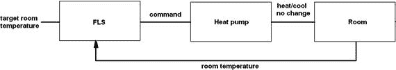

图 5-16。

HVAC 闭路系统

让我们定义温度（t）为一个清晰输入变量，以表示正在加热或冷却的室温。通常，人们使用热和冷作为室温的限定词。这些术语以及相关的术语可以发展成一套语言术语，使得

```py
T(t) = { cold, comfortable,  hot }
```

这个 T(t) 的表达式代表输入变量 t 的分解函数。这个语言分解集的每个成员代表或与一个数值温度范围相关联。例如，冷可能是一个 40°F 到 60°F 的范围，而热可能是一个 70°F 到 90°F 的范围。如果决定 20°F 是一个合适的间隔值，其他语言术语可以轻松填补中间的范围。

此外，还有一个名为目标温度的输入，由占用房间的人设置。这类似于设置房间恒温器。

图 5-17 显示了创建的隶属函数，用于将清晰的非模糊房间和目标温度值映射到相应的模糊语言术语。只显示了一组隶属函数，因为它们对房间和目标温度输入变量都是通用的。

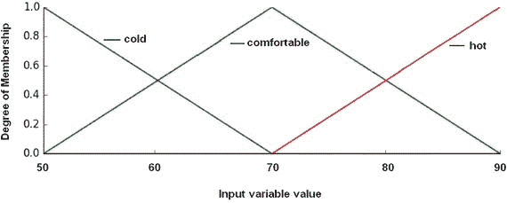

图 5-17。

室温和目标温度隶属函数

在这种情况下，任何给定的室温可以属于一个或两个组，这取决于其值。图 5-18 显示，65°F 的室温在舒适隶属函数中具有隶属度值为 0.5，同时在寒冷隶属函数中也具有隶属度值为 0.5。精确到 70°F 的室温具有隶属度值为 1.0，并且仅属于舒适隶属函数。

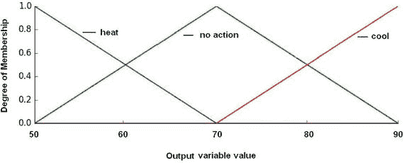

图 5-18。

HVAC 控制隶属函数

HVAC 控制器还需要根据命令结果采取一套隶属函数。图 5-18 显示了 HVAC 控制的隶属函数集。请注意，它具有与输入变量相同的形状和输出变量范围。

以下是一些基于房间和目标温度确定控制命令的示例规则：

+   如果（室温是冷的）并且（目标温度是舒适的），则命令是加热

+   如果（室温是热的）并且（目标温度是舒适的），则命令是冷却

+   如果（室温是舒适的）并且（目标温度是舒适的），则命令是不变

使用预设的目标温度和测量的室温所采取的精确命令动作必须由人类专家确定并在规则数据库中编码。表 5-3 是一个矩阵，详细说明了房间和目标温度所有语言变量组合的精确控制命令。

表 5-3。

房间和目标温度语言变量的命令动作矩阵

| 室温 | 目标温度 |
| --- | --- |
|   | 冷 | 舒适 | 热 |
| 冷 | 无变化 | 热量 | 热量 |
| 舒适 | 凉爽 | 无变化 | 热量 |
| 热 | 凉爽 | 凉爽 | 无变化 |

需要六个规则来适应所有交错的房间温度和目标温度语言术语的组合，这些术语需要采取行动。无变化的规则被忽略。这些规则是：

+   如果房间温度冷且目标温度舒适，则命令为热量

+   如果房间温度冷且目标温度热，则命令为热量

+   如果房间温度舒适且目标温度冷，则命令为凉爽

+   如果房间温度舒适且目标温度为热量，则命令为热量

+   如果房间温度热且目标温度冷，则命令为凉爽

+   如果房间温度热且目标温度舒适，则命令为凉爽

现在规则集已经创建，接下来讨论模糊化。

### 模糊化

以下代码段设置了输入变量范围和隶属函数：

```py
import numpy as np
import skfuzzy as fuzz
# Generate universe variables
#   * room and target temperature range is 50 to 90
#   * same for the output control variable
x_room_temp    = np.arange(50, 91, 1)
x_target_temp  = np.arange(50, 91, 1)
x_control_temp = np.arange(50, 91, 1)
# Generate fuzzy membership functions
room_temp_lo     = fuzz.trimf(x_qual, [50, 50, 70])
room_temp_md     = fuzz.trimf(x_qual, [50, 70, 90])
room_temp_hi     = fuzz.trimf(x_qual, [70, 90, 90])
target_temp_lo   = fuzz.trimf(x_serv, [50, 50, 70])
target_temp_md   = fuzz.trimf(x_serv, [50, 70, 90])
target_temp_hi   = fuzz.trimf(x_serv, [50, 90, 90])
control_temp_lo  = fuzz.trimf(x_tip,  [50, 50, 70])
control_temp_md  = fuzz.trimf(x_tip,  [50, 70, 90])
control_temp_hi  = fuzz.trimf(x_tip,  [70, 90, 90])
```

算法的下一步是根据房间温度和目标温度的值确定模糊化值。在本项目中，要求用户输入这两个值。在现实世界的模糊逻辑控制系统中，目标温度是手动设置的，而房间温度由传感器确定。然而，为了简化问题，两个输入都是手动设置的。以下代码接受用户输入并将这些输入模糊化：

```py
# Get user inputs
room_temp = raw_input('Enter room temperature 50 to 90')
target_temp = raw_input('Enter target temperature 50 to 90')
# Calculate degrees of membership
room_temp_level_lo = fuzz.interp_membership(x_room_temp, room_temp_lo, float(room_temp))
room_temp_level_md = fuzz.interp_membership(x_room_temp, room_temp_md, float(room_temp))
room_temp_level_hi = fuzz.interp_membership(x_room_temp, room_temp_hi, float(room_temp))
target_temp_level_lo = fuzz.interp_membership(x_target_temp, target_temp_lo, float(target_temp))
target_temp_level_md = fuzz.interp_membership(x_target_temp, target_temp_md, float(target_temp))
target_temp_level_hi = fuzz.interp_membership(x_target_temp, Target_temp_hi, float(target_temp))
```

现在进入推理步骤，应用所有规则并组合隶属函数。

### 推理

以下代码段应用了六个规则并组合了所有隶属函数：

```py
# Apply rule 1:  if room_temp is cold and target temp is comfortable then command is heat
# The 'and' operator means to take the minimum by using the 'np.fmin' function
active_rule1 = np.fmin(room_temp_level_lo, target_temp_level_md)
# Combine with hi control membership function using `np.fmin`
control_activation_1 = np.fmin(active_rule1, control_temp_hi)
# Next go through all five remaining rules
#Apply rule 2: if room_temp is cold and target temp is hot then command is heat
active_rule2 = np.fmin(room_temp_level_lo, target_temp_level_hi)
# Combine with hi control membership function using `np.fmin`
control_activation_2 = np.fmin(active_rule2, control_temp_hi)
#Apply rule 3: if room_temp is comfortable and target temp is cold then command is cool
active_rule3 = np.fmin(room_temp_level_md, target_temp_level_lo)
# Combine with lo control membership function using `np.fmin`
control_activation_3 = np.fmin(active_rule3, control_temp_lo)
#Apply rule 4: if room_temp is comfortable and target temp is heat then command is heat
active_rule4 = np.fmin(room_temp_level_md, target_temp_level_hi)
# Combine with hi control membership function using `np.fmin`
control_activation_4 = np.fmin(active_rule4, control_temp_hi)
#Apply rule 5: if room_temp is hot and target temp is cold then command is cool
active_rule5 = np.fmin(room_temp_level_hi, target_temp_level_lo)
# Combine with lo control membership function using `np.fmin`
control_activation_5 = np.fmin(active_rule5, control_temp_lo)
#Apply rule 6: if room_temp is hot and target temp is comfortable then command is cool
active_rule6 = np.fmin(room_temp_level_hi, target_temp_level_md)
# Combine with lo control membership function using `np.fmin`
control_activation_6 = np.fmin(active_rule6, control_temp_lo)
```

本节介绍了应用规则和组合集合。下一步是聚合。

### 聚合

由于有六个控制激活值，聚合语句较长。

```py
aggregated = np.fmax(control_activation_1, control_activation_2,
control_activation_3, control_activation_4,
control_activation_5, control_activation_6)
```

聚合完成后，是进行反模糊化的时间。

### 反模糊化

本项目将应用质心法，因为它在之前的项目中已经使用过。

```py
# Calculate defuzzified result using the method of centroids
control_value = fuzz.defuzz(x_control_temp, aggregated, 'centroid')
```

现在，简单地显示清晰的输出值。

```py
print control_value
```

以下是对 hvac.py 程序的完整列表。

```py
import numpy as np
import skfuzzy as fuzz
# Generate universe variables
#   * room and target temperature range is 50 to 90
#   * same for the output control variable
x_room_temp    = np.arange(50, 91, 1)
x_target_temp  = np.arange(50, 91, 1)
x_control_temp = np.arange(50, 91, 1)
# Generate fuzzy membership functions
room_temp_lo     = fuzz.trimf(x_room_temp,   [50, 50, 70])
room_temp_md     = fuzz.trimf(x_room_temp,   [50, 70, 90])
room_temp_hi     = fuzz.trimf(x_room_temp,   [70, 90, 90])
target_temp_lo   = fuzz.trimf(x_target_temp, [50, 50, 70])
target_temp_md   = fuzz.trimf(x_target_temp, [50, 70, 90])
target_temp_hi   = fuzz.trimf(x_target_temp, [50, 90, 90])
control_temp_lo  = fuzz.trimf(x_control_temp,[50, 50, 70])
control_temp_md  = fuzz.trimf(x_control_temp,[50, 70, 90])
control_temp_hi  = fuzz.trimf(x_control_temp,[70, 90, 90])
# Get user inputs
room_temp = raw_input('Enter room temperature 50 to 90: ')
target_temp = raw_input('Enter target temperature 50 to 90: ')
# Calculate degrees of membership
room_temp_level_lo = fuzz.interp_membership(x_room_temp, room_temp_lo, float(room_temp))
room_temp_level_md = fuzz.interp_membership(x_room_temp, room_temp_md, float(room_temp))
room_temp_level_hi = fuzz.interp_membership(x_room_temp, room_temp_hi, float(room_temp))
target_temp_level_lo = fuzz.interp_membership(x_target_temp, target_temp_lo, float(target_temp))
target_temp_level_md = fuzz.interp_membership(x_target_temp, target_temp_md, float(target_temp))
target_temp_level_hi = fuzz.interp_membership(x_target_temp, target_temp_hi, float(target_temp))
# Apply all six rules
# rule 1:  if room_temp is cold and target temp is comfortable then command is heat
active_rule1 = np.fmin(room_temp_level_lo, target_temp_level_md)
control_activation_1 = np.fmin(active_rule1, control_temp_hi)
# rule 2: if room_temp is cold and target temp is hot then command is heat
active_rule2 = np.fmin(room_temp_level_lo, target_temp_level_hi)
control_activation_2 = np.fmin(active_rule2, control_temp_hi)
# rule 3: if room_temp is comfortable and target temp is cold then command is cool
active_rule3 = np.fmin(room_temp_level_md, target_temp_level_lo)
control_activation_3 = np.fmin(active_rule3, control_temp_lo)
# rule 4: if room_temp is comfortable and target temp is heat then command is heat
active_rule4 = np.fmin(room_temp_level_md, target_temp_level_hi)
control_activation_4 = np.fmin(active_rule4, control_temp_hi)
# rule 5: if room_temp is hot and target temp is cold then command is cool
active_rule5 = np.fmin(room_temp_level_hi, target_temp_level_lo)
control_activation_5 = np.fmin(active_rule5, control_temp_lo)
# rule 6: if room_temp is hot and target temp is comfortable then command is cool
active_rule6 = np.fmin(room_temp_level_hi, target_temp_level_md)
control_activation_6 = np.fmin(active_rule6, control_temp_lo)
# Aggregate all six output membership functions together
# Combine outputs to ease the complexity as fmax() only as two args
c1 = np.fmax(control_activation1, control_activation2)
c2 = np.fmax(control_activation3, control_activation4)
c3 = np.fmax(control_activation5, control_activation6)
c4 = np.fmax(c2,c3)
aggregated = np.fmax(c1, c4)
# Calculate defuzzified result using the method of centroids
control_value = fuzz.defuzz(x_control_temp, aggregated, 'centroid')
#  Display the crisp output value
print control_value
```

### 测试控制程序

表 5-4 至 5-8 显示了在代表性范围的房间温度和目标温度输入下测试控制程序的结果。

表 5-8。

目标设置为 90

| 房间温度 | 目标温度 | 命令输出 |
| --- | --- | --- |
| 50 | 90 | 83.33 |
| 60 | 90 | 82.22 |
| 70 | 90 | 83.33 |
| 80 | 90 | 82.22 |
| 89* | 89* | 70.00 |

表 5-7。

目标设置为 80

| 房间温度 | 目标温度 | 命令输出 |
| --- | --- | --- |
| 50 | 80 | 83.33 |
| 60 | 80 | 82.22 |
| 70 | 80 | 83.33 |
| 80 | 80 | 70.00 |
| 90 | 80 | 57.78 |

表 5-6。

目标设置为 70

| 房间温度 | 目标温度 | 命令输出 |
| --- | --- | --- |
| 50 | 70 | 83.33 |
| 60 | 70 | 82.22 |
| 70 | 70 | 82.22 |
| 80 | 70 | 70.00 |
| 90 | 70 | 56.67 |

表 5-5。

目标设置为 60

| 房间温度 | 目标温度 | 命令输出 |
| --- | --- | --- |
| 50 | 60 | 82.22 |
| 60 | 60 | 70.00 |
| 70 | 60 | 66.40 |
| 80 | 60 | 66.40 |
| 90 | 60 | 57.78 |

表 5-4。

目标设置为 50

| 室内温度 | 目标温度 | 命令输出 |
| --- | --- | --- |
| 51* | 51* | 70.00 |
| 60 | 50 | 57.78 |
| 70 | 50 | 56.67 |
| 80 | 50 | 57.78 |
| 90 | 50 | 56.67 |

备注

带有星号 (*) 的温度略有偏移，因为当温度匹配且处于变量范围的极端时，去模糊化方法会抛出错误。

我仔细研究了测试结果，并从测试数据中得出以下结论：

+   命令值大约在 65 到 75 之间表示无变化

+   命令值大约在 82 到 83 之间表示需要加热

+   命令值大约在 56 到 65 之间表示需要冷却

“无变化”的范围大约在目标温度周围 ±4。这个发现实际上并不太糟糕，因为它防止了系统进行不必要的操作，同时仍然实现了对所需室内温度的大多数“意见”。

## Demo 5-4：对 HVAC 程序的修改

对于这个演示，我对控制程序进行了简单的修改：根据用户输入确定是否需要加热、冷却或无变化，三个 LED 中的一个会亮起。以下代码附加到之前的列表中，除了额外的导入和配置语句应放置在程序的开头，就像我之前使用 LED 的程序一样。我提供了指示在此修改中使用的 GPIO 引脚的注释。它们与在 prs.py 游戏中使用的相同，因此请使用该项目中的 LED 互连图。

```py
# Include the following at the beginning of the hvac.py program
import RPi.GPIO as GPIO
import time
# Setup GPIO pins
# Set the BCM mode
GPIO.setmode(GPIO.BCM)
# Outputs
GPIO.setup( 4, GPIO.OUT) # heat command
GPIO.setup(17, GPIO.OUT) # cool command
GPIO.setup(27, GPIO.OUT) # no change command
# Ensure all LEDs are off to start
GPIO.output( 4, GPIO.LOW)
GPIO.output(17, GPIO.LOW)
GPIO.output(27, GPIO.LOW)
# The following should be appended to the existing code
if control_value > 65 and control_value  82 and control_value  56 and control_value < 68: # cool
GPIO.output(17, GPIO.HIGH)
time.sleep(5)
GPIO.output(17, GPIO.LOW)
else:
print 'strange value calculated'
# This next statement used in debugging phase
print 'Thats all folks'
```

hvac_led.py——包含 LED 修改的完整程序——可在本书的网站上找到。图 5-19 展示了带有三个控制 LED 连接到无焊面包板的 Raspberry Pi 物理设置。

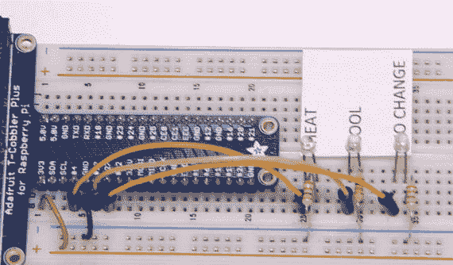

图 5-19。

物理设置

## 摘要

本章重点介绍了模糊逻辑，这是一种非常巧妙的方法，用于处理几乎存在于每个人类情况中的非精确值。我的方法是通过几个实际项目将模糊逻辑引入一个可理解的框架，从而你可以开发自己的 FL 项目。

本章包含非常详细的演示，包括开发模糊逻辑系统（FLS）的七步算法。

第一次演示展示了如何根据食品质量和服务质量计算小费。七步算法产生了一个程序，可以快速根据用户评分计算小费百分比。我甚至提出了一种使项目完全可移植的方法。

第二次演示比第一次稍微技术性一些。它涉及到创建一个加热和冷却的 FL 控制系统。这种系统类型在商用暖通空调产品中是可用的。实际上，一家制造商宣传其系统集成了模糊逻辑。诚然，本章的项目是商用暖通空调系统的一个缩小版，但它仍然包含了 FLS 的所有重要部分。
