# 6. 机器学习

本章开始对机器学习这一广泛主题进行探索，我在第二章中介绍了这一主题。机器学习是当前工业和学术界的热门话题。像 Google、Amazon 和 Facebook 这样的公司已经投资了数百万美元用于机器学习，以改进他们的产品和服务。我从 Bert van Dam 的书中获得了许多灵感和知识，这本书是《人工智能：23 个项目让你的微控制器生动起来》（Elektor Electronics Publishing，2009 年）。尽管 van Dam 没有使用 Raspberry Pi 作为微控制器，但他应用的概念和技术是完全有效的，并且特别值得赞赏。

## 零件清单

对于第一次演示，你需要表 6-1 中列出的部件。

表 6-1.

零件清单

| 描述 | 数量 | 备注 |
| --- | --- | --- |
| Pi Cobbler | 1 | 40 引脚版本，T 形或 DIP 封装形式均可接受 |
| 无焊点面包板 | 1 | 300 个插入点，带电源条 |
| 无焊点面包板 | 1 | 300 个插入点 |
| 跳线 | 1 包 |   |
| LED | 2 | 绿色和黄色 LED，如果可能的话 |
| 2.2kΩ 电阻 | 6 | 1/4 瓦特 |
| 220Ω 电阻 | 2 | 1/4 瓦特 |
| 10Ω 电阻 | 2 | 1/2 瓦特 |
| 按钮开关 | 1 | 触觉式 |
| MCP3008 | 1 | 8 通道 ADC 芯片 DIP |

本章讨论了一个机器人演示，你可以通过遵循附录中的说明来构建它。你也可以简单地阅读机器人讨论，从而对概念有所了解。

## 演示 6-1：颜色选择

在这个演示中，你教计算机你喜欢的颜色，要么是绿色，要么是黄色。首先，Raspberry Pi 必须根据图 6-1 中显示的 Fritzing 图表进行设置。

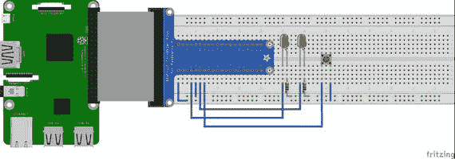

图 6-1.

Fritzing 图表注意事项

确保将按钮开关的一侧连接到 3.3 V，而不是 5 V，因为如果你不小心将其连接到更高的电压，你会损坏 GPIO 引脚。

接下来，我将解释颜色选择算法是如何工作的。

### 算法

考虑图 6-2 中所示的横向条形。它有一个从 0 到 255 的总数值刻度。条形左侧的刻度是 0 到 127，代表绿色 LED 的激活。条形右侧的刻度是 128 到 255，代表黄色 LED 的激活。

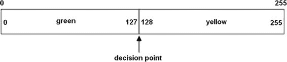

图 6-2.

LED 激活条

让我们创建一个整数随机数生成器，它可以生成介于 0 到 255 之间的数字（包括 0 和 255）。这可以通过以下函数轻松实现，我在之前的 Python 程序中使用过这个函数：

```py
decision = randint(0,255)
```

`randint()` 是来自 Python `random` 库的随机整数生成方法。变量 decision 的值在 0 到 255 之间。如果它在 0 到 127 之间，则绿色 LED 灯亮；否则，值在 128 到 255 之间，在这种情况下，黄色 LED 灯亮。现在，如果决策点保持不变，那么在每次程序重复中绿色 LED 灯亮起的概率（或长期来看的概率）是 50/50；黄色 LED 灯亮起的概率同样。但这不是本程序的目标。目标是要“教”程序选择你的最喜欢的颜色。通过移动决策点以偏袒最喜欢的颜色选择，最终可以达到这个目标。让我们决定绿色是最喜欢的颜色。因此，每次绿色 LED 灯亮起时，决策点都会改变，因为用户按下了按钮。这个按钮按下创建了一个中断，并调用一个回调函数来增加决策点值。最终，决策点将增加到这样一个值，几乎每个生成的随机数都将落在条形图的绿色 LED 部分，如图 6-3 所示。

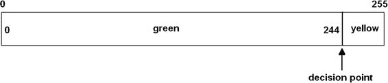

图 6-3。

调整数字条

以下名为 color_selection.py 的程序实现了该算法：

```py
!/usr/bin/python
# import statements
import random
import time
import RPi.GPIO as GPIO
# initialize global variable for decision point
global dp
dp = 127
# Setup GPIO pins
# Set the BCM mode
GPIO.setmode(GPIO.BCM)
# Outputs
GPIO.setup( 4, GPIO.OUT)
GPIO.setup(17, GPIO.OUT)
# Input
GPIO.setup(27, GPIO.IN, pull_up_down = GPIO.PUD_DOWN)
# Setup the callback function
def changeDecisionPt(channel):
global dp
dp = dp + 1
if dp == 255: # do not increase dp beyond 255
dp =255
# Add event detection and callback assignment
GPIO.add_event_detect(27, GPIO.RISING, callback=changeDecisionPt)
while True:
rn = random.randint(0,255)
# useful to check on the dp value
print 'dp = ', dp
if rn <= dp:
GPIO.output(4, GPIO.HIGH)
time.sleep(2)
GPIO.output(4, GPIO.LOW)
else:
GPIO.output(17, GPIO.HIGH)
time.sleep(2)
GPIO.output(17, GPIO.LOW)
```

注意

按下 CTRL+C 退出程序。

当程序开始时，很容易看出 LED 灯亮和灭的时间几乎相等。然而，随着我不断按下按钮，很快就变得明显，绿色 LED 灯亮的时间更长，直到 dp 值等于 255，黄色 LED 灯从未亮起。因此，程序“学习”到我最喜欢的颜色是绿色。

但计算机实际上是否真的学到了什么？这与其说是一个技术问题，不如说是一个哲学问题。这是那种一直困扰着人工智能研究人员和爱好者的问题。我可以轻松地重新启动程序，计算机将重置决策点并“忘记”之前的程序执行。同样，我可以更改程序，使 dp 值存储在外部单独的数据文件中，每次程序运行时都会加载，从而记住最喜欢的颜色选择。我将绕过关于计算机学习实际上意味着什么的问题，并专注于人工智能的实际问题，正如我在第一章中提到的麦卡锡博士所采取的路径。

下一个部分扩展了在本简单演示中讨论的概念。

### 轮盘赌算法

图 6-4 展示了一个非常简化的轮盘赌盘，有四个相等的区域（A 到 D），它们代表问题域中的事件，这些事件构成了完整的圆圈。

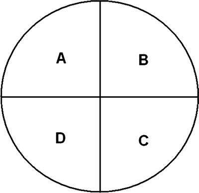

图 6-4。

简单轮盘赌

在轮盘赌的每次旋转中，任何一段被选中的平均概率为 0.25。计算这一事件概率的方程与每个段的面积直接相关。它可以表示如下：

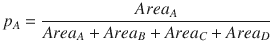

使用此类方程的一个特定问题是，尽管可能只需要 p [A]，但代表区域 B、C 和 D 也必须计算出来，以推导出事件 A 的有效概率。从计算的角度来看，专注于 p [A]而不关心其他事件概率是非常有利的。你真正需要知道的是，对于特定事件 A 存在一个 p [A]，并且它可以修改以适应动态情况。在人工智能术语中，A、B、C 和 D 被称为适应度。此外，初始假设是所有适应度范围都相等，因为没有明显的证据改变这种明显的选择。

使用水平条形图讨论适应度相对容易，就像本章的第一个例子一样。图 6-5 显示了在水平条形图中设置的适应度变量，每个变量分配了 25 个任意值。条形图上还显示了三个随机抽签的结果，其百分比值可以从 0 到 100。我选择的个人适应度范围使其与抽签百分比一一对应。

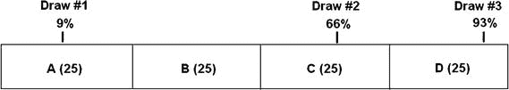

图 6-5。

四个适应度变量和三个随机抽签

每次抽签的匹配适应度在表 6-2 中显示。

表 6-2。

初始适应度选择

| 抽签编号 | 抽签百分比 | 数值 | 选择的适应度 |
| --- | --- | --- | --- |
| 1 | 9 | 9 | A |
| 2 | 60 | 60 | C |
| 3 | 93 | 93 | D |

然而，假设最初的假设是错误的，并且四个适应度范围并不相等，而是如图 6-6 所示。图 6-5 中显示的相同抽签百分比也显示出来。

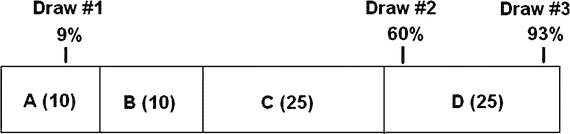

图 6-6。

真实适应度范围

这条新信息改变了适应度选择，如表 6-3 所示。

表 6-3。

修改后的适应度选择

| 抽签编号 | 抽签百分比 | 数值 | 选择的适应度 |
| --- | --- | --- | --- |
| 1 | 9 | 6.3 | A |
| 2 | 60 | 42 | D |
| 3 | 93 | 65.1 | D |

现在减少的 A 和 B 适应度范围导致抽签#2 的适应度选择，从 C 变为 D。这种情况与颜色选择示例中发生的确切相同活动完全一样，其中每次按钮按下都会改变决策点，进而改变两种颜色选择的适应度范围。

修改适应度范围和随之而来的策略选择是轮盘赌算法的基本基础。正如你很快就会学到的那样，这个算法在实现自主车辆（如小型移动机器人）的学习行为时非常有用。例如，轮盘赌算法在医学研究中用于染色体生存统计的研究。

## 演示 6-2：自主机器人

来认识一下阿尔菲，这是我为我的小型移动和自主机器人挑选的名字。阿尔菲在图 6-7 中有展示。

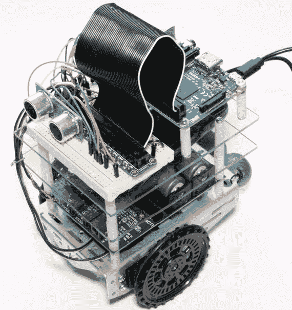

图 6-7。

阿尔菲

我提到阿尔菲的构建说明在附录中。请随意阅读以下部分，无需担心构建机器人所涉及的繁琐技术细节。然而，在你构建和编程阿尔菲之后，你当然能够复制这个演示。

机器人主要任务是避开其路径上的所有障碍物。机器人的路径以 2 秒的增量随机生成。有时路径是直行，而有时是向左或向右的环绕运动。技术上，机器人并不是真正避开障碍物，因为这会意味着一个预定的路径。实际上，它是在避开所有包含表面，实际上是指任何附近的墙壁和门。

机器人有一个超声波传感器，正在向前发射或“观察”。目标是如果超声波传感器检测到障碍物，机器人必须立即采取行动避免它。以下机器人可以采取的唯一行动是：

+   向前行驶

+   向左转

+   向右转

没有简单地停止的选项。机器人必须继续移动，即使这可能不是特定情况下的最佳选择。

### 自主算法

让我们开始实现轮盘赌算法，通过任意分配每个动作的适应度值为 20。如果发现这个初始值在算法中无效，可以更改它。接下来，进行一次随机选择或抽取。这个抽取每 2 秒进行一次，以防止机器人陷入静态行为，不“学习”任何东西。我使用与颜色选择示例中相同的 256 个数值范围。适应度选择的方程如下：

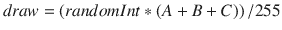

randomInt 的范围从 0 到 255。

该设置的横向条形显示屏如图 6-8 所示。

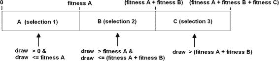

图 6-8。

机器人轮盘赌适应度配置

适应性区域会根据机器人的活动和是否遇到障碍物不断更新和修改。通常，如果遇到障碍物，特定活动的适应性会减少一个单位，从而略微降低其在绘图中被选中的整体概率。你可以想象，在足够长的时间内，所有活动适应性都会降低到 0。在此之后，机器人会被命令停止，实际上是在放弃避免障碍物的追求。

以下代码段包含了所有组件模块的初始化语句以及轮盘赌算法的选择逻辑：

```py
import RPi.GPIO as GPIO
import time
GPIO.setmode(GPIO.BCM)
GPIO.setup(18, GPIO.OUT)
GPIO.setup(19, GPIO.OUT)
pwmL = GPIO.PWM(18,20) # pin 18 is left wheel pwm
pwmR = GPIO.PWM(19,20) # pin 19 is right wheel pwm
# must 'start' the motors with 0 rotation speeds
pwmL.start(2.8)
pwmR.start(2.8)
# ultrasonic sensor pins
TRIG = 23 # an output
ECHO = 24 # an input
# set the output pin
GPIO.setup(TRIG, GPIO.OUT)
# set the input pin
GPIO.setup(ECHO, GPIO.IN)
# initialize sensor
GPIO.output(TRIG, GPIO.LOW)
time.sleep(1)
if fitA + fitB + fitC == 0:
select = 0
robotAction(select)
elif draw >= 0 and draw  fitA and draw  (fitA + fitB):
select = 3
robotAction(select)
```

`robotAction(select)`方法命令机器人执行一个动作，或者在所有适应性都降低到 0 的极端情况下停止。选定的`robotAction`在 2 秒内有效，直到生成另一个绘图并随机选择一个动作。它可能是刚刚完成的那个动作，也可能是其他两个动作之一。随着障碍物的出现，选择概率会发生变化。

以下代码实现了`robotAction`方法：

```py
def robotAction(select):
if select == 0:
# stop immediately
exit()
elif select == 1:
pwmL.ChangeDutyCycle(3.6)
pwmR.ChangeDutyCycle(2.2)
elif select == 2:
pwmL.ChangeDutyCycle(3.6)
pwmR.ChangeDutyCycle(2.8)
elif select == 3:
pwmL.ChangeDutyCycle(2.8)
pwmR.ChangeDutyCycle(2.2)
```

机器人程序使用轮询程序来指示机器人距离障碍物 10 英寸或 25.4 厘米以内。这个程序会导致机器人暂时停止，然后后退 2 秒钟，此时生成一个新的绘图。此外，当检测到障碍物时，有效的适应性会减少一个单位。所有这些活动都在一个无限循环中设置，这样机器人会继续漫游或达到静止状态，只是原地旋转。所有适应性级别也可以降低到 0，使其永久停止。

超声波传感器的工作原理和接线在附录中有说明，但现在重要的是要意识到，当超声波传感器的距离输出值达到 10 英寸或 25.4 厘米时，轮询程序将跳转到备份动作并减少当前活动适应性区域。 

以下代码段列出了超声波传感器的距离计算程序：

```py
# forever loop to continually generate distance measurements
while True:
# generate a 10 usec trigger pulse
GPIO.output(TRIG, GPIO.HIGH)
time.sleep(0.000010)
GPIO.output(TRIG, GPIO.LOW)
# following code detects the time duration for the echo pulse
while GPIO.input(ECHO) == 0:
pulse_start = time.time()
while GPIO.input(ECHO) == 1:
pulse_end = time.time()
pulse_duration = pulse_end - pulse_start
# distance calculation
distance = pulse_duration * 17150
# round distance to two decimal points
distance = round(distance, 2)
# for debug
print 'distance = ', dist, ' cm'
# check for 25.4 cm distance or less
if distance < 25.40:
backup()
```

`backup()`方法仅在检测到的距离低于 10 英寸或 25.4 厘米时被调用。在这个程序中，当超声波传感器轮询程序触发该方法时，机器人被命令从其当前位置向后移动。备份方法还会在备份事件启动时减少控制机器人的活动适应性。以下为备份方法列表：

```py
def backup():
global fitA, fitB, fitC, pwmL, pwmR
if select == 1:
fitA = fitA - 1
if fitA < 0:
fitA = 0
elif select == 2:
fitB = fitB - 1
if fitB < 0:
fitB = 0
else:
fitC = fitC -1
if fitC < 0:
fitC = 0
# now, drive the robot in reverse for 2 secs.
pwmL.ChangeDutyCycle(2.2)
pwmR.ChangeDutyCycle(3.6)
time.sleep(2) # unconditional time interval
```

我现在已经涵盖了组成自主控制程序的所有主要模块。以下列表将所有模块组合成一个综合程序。我还将一个时间例程集成到主循环中，确保由绘制选择的每个机器人动作持续激活 2 秒钟。当机器人执行动作时，超声波传感器也在运行。唯一的例外是当检测到障碍物时；这会导致机器人立即停止正在做的事情，并无条件地后退 2 秒钟。这个程序被命名为 robotRoulette.py。

```py
import RPi.GPIO as GPIO
import time
from random import randint
global pwmL, pwmR, fitA, fitB, fitC
# initial fitness values for each of the 3 activities
fitA = 20
fitB = 20
fitC = 20
# use the BCM pin numbers
GPIO.setmode(GPIO.BCM)
# setup the motor control pins
GPIO.setup(18, GPIO.OUT)
GPIO.setup(19, GPIO.OUT)
pwmL = GPIO.PWM(18,20) # pin 18 is left wheel pwm
pwmR = GPIO.PWM(19,20) # pin 19 is right wheel pwm
# must 'start' the motors with 0 rotation speeds
pwmL.start(2.8)
pwmR.start(2.8)
# ultrasonic sensor pins
TRIG = 23 # an output
ECHO = 24 # an input
# set the output pin
GPIO.setup(TRIG, GPIO.OUT)
# set the input pin
GPIO.setup(ECHO, GPIO.IN)
# initialize sensor
GPIO.output(TRIG, GPIO.LOW)
time.sleep(1)
# robotAction module
def robotAction(select):
global pwmL, pwmR
if select == 0:
# stop immediately
exit()
elif select == 1:
pwmL.ChangeDutyCycle(3.6)
pwmR.ChangeDutyCycle(2.2)
elif select == 2:
pwmL.ChangeDutyCycle(2.2)
pwmR.ChangeDutyCycle(2.8)
elif select == 3:
pwmL.ChangeDutyCycle(2.8)
pwmR.ChangeDutyCycle(2.2)
# backup module
def backup(select):
global fitA, fitB, fitC, pwmL, pwmR
if select == 1:
fitA = fitA - 1
if fitA = 0 and draw  fitA and draw  (fitA + fitB):
select = 3
robotAction(select)
clockFlag = True
current = time.time()
# check to see if 2 seconds (2000ms) have elapsed
if (current - start)*1000 > 2000:
# this triggers a new draw at loop start
clockFlag = False
# generate a 10 μsec trigger pulse
GPIO.output(TRIG, GPIO.HIGH)
time.sleep(0.000010)
GPIO.output(TRIG, GPIO.LOW)
# following code detects the time duration for the echo pulse
while GPIO.input(ECHO) == 0:
pulse_start = time.time()
while GPIO.input(ECHO) == 1:
pulse_end = time.time()
pulse_duration = pulse_end - pulse_start
# distance calculation
distance = pulse_duration * 17150
# round distance to two decimal points
distance = round(distance, 2)
# check for 25.4 cm distance or less
if distance < 25.40:
backup()
```

### 测试运行

我将机器人放在了我家的一个 L 形走廊里，那里被墙壁和门完全封闭。机器人由外部手机电池供电。我可以通过家庭 Wi-Fi 网络 SSH 到树莓派。我通过输入以下命令启动了程序：

```py
sudo python robotRoulette.py
```

机器人立即做出反应，转弯、直行或后退，以接近墙壁或门。看起来机器人基本上将自己限制在一个大约 3 × 3 英尺的区域，但偶尔会有一些偏离。这种行为持续了大约 6 分钟，然后它开始只进行来回运动，这可能意味着转向适应性区域减少到 0，或者接近 0。7 分钟后，当所有适应性值最终等于 0 时，程序退出，机器人关闭。

这个测试表明，机器人确实根据动态变化的适应性值改变了其操作行为。我是否将其称为学习，留给你自己决定。

如果你想给机器人汽车添加一些额外的学习功能，你应该在下一节中了解这一点。

### 额外学习

如果你想在机器人汽车中添加学习行为，理解学习的基本要求是至关重要的。只需考虑一下在先前的例子中，机器人汽车是如何改变其行为的。首先，定义了汽车可以采取的动作。它们相当直接，所以在这个阶段实际上没有涉及学习。接下来，创建了适应性区域，并实施了一种随机选择特定区域的方法来激活后续动作。再次，没有涉及学习。最后，将传感器集成到方案中，以便传感器输出可以影响适应性值，并最终影响机器人的行为。这就是学习开始的地方。因此，至少在这个案例中，学习需要一个传感器和一个基于传感器输出的修改适应性值的技术。如果你稍加思考，你会认识到这也是人类学习的方式。这可能是通过阅读书籍，眼睛是传感器，或者通过听音乐，耳朵是主要的传感器。甚至可能是小孩子触摸一个热散热器时的手指。

因此，我们可能需要一个新的传感器或以某种方式修改现有的传感器来实现额外的学习。我选择将能源管理视为新的学习行为。具体来说，优先考虑那些最小化能耗的动作，以增强机器人车的学习潜力。

直接测量能耗是困难的，但测量每单位时间的能耗相当容易。当然，一段时间内使用的能量仅仅是功率，可以使用欧姆定律轻松计算：

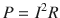

或者等价于：

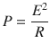

需要在电机电源中插入一个小电阻，以便测量通过它的电流或它上的电压降。我选择测量电压降，因为它与用于通过 Raspberry Pi 获取传感器读数的模拟数字转换器芯片兼容。电阻值必须非常小，以免降低电机电源电压到足以干扰所需电机操作的程度。

为了确定电阻值，我将万用表串联在正电机电源引线上，并测量了两个电机以正向运行时的平均电流。平均电流消耗约为 190 毫安。串联 5Ω 电阻在此电流下约有 1 伏的电压降，同时消耗 0.2 瓦的功率。考虑到电机电源的最大满量程电压输出为 7.5 伏，单个电压降对电机操作的影响应该不大。机器人电机的标称额定电压为 6 伏，但可以接受略高的电压而不会造成损害。更高的电压只会使电机转速加快。

使用 MCP3008 多通道模拟数字转换器（ADC）测量电阻上的电压降。该 ADC 芯片的设置和安装在机器人构建附录中进行了详细说明。使用两个 ADC 通道，因为需要测量电阻上的差分电压来确定电流。图 6-9 是 ADC 连接到电流检测电阻的示意图。

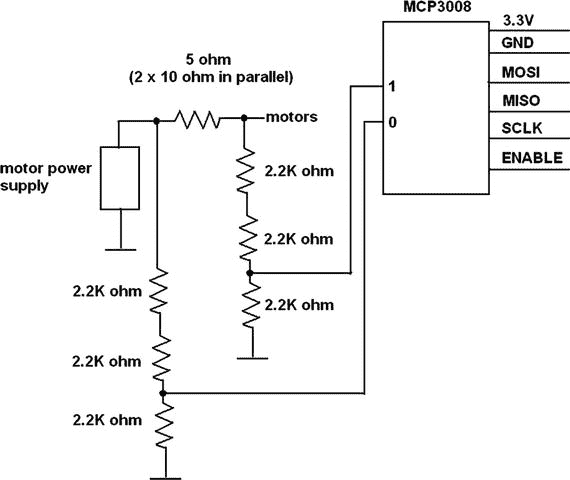

图 6-9。

ADC 连接到电流检测电阻

以下代码是一个测试程序，证明 ADC 已连接且运行正常。它是从 Adafruit Learn 网站获取的 simpletest.py 程序的微小修改：

```py
# Import SPI library (for hardware SPI) and MCP3008 library.
import Adafruit_GPIO.SPI as SPI
import Adafruit_MCP3008
# Hardware SPI configuration:
SPI_PORT   = 0
SPI_DEVICE = 0
mcp = Adafruit_MCP3008.MCP3008(spi=SPI.SpiDev(SPI_PORT, SPI_DEVICE))
print('Reading MCP3008 values, press Ctrl-C to quit...')
# Print nice channel column headers.
print('| {0:>4} | {1:>4} | {2:>4} | {3:>4} | {4:>4} | {5:>4} | {6:>4} | {7:>4} |'.format(*range(8)))
print('-' * 57)
# Main program loop.
while True:
# Read all the ADC channel values in a list.
values = [0]*8
for i in range(8):
# The read_adc function will get the value of the specified channel (0-7).
values[i] = mcp.read_adc(i)
# Print the ADC values.
print('| {0:>4} | {1:>4} | {2:>4} | {3:>4} | {4:>4} | {5:>4} | {6:>4} | {7:>4} |'.format(*values))
# Pause for half a second.
time.sleep(0.5)
```

图 6-10 是程序运行约 30 秒后的输出截图。

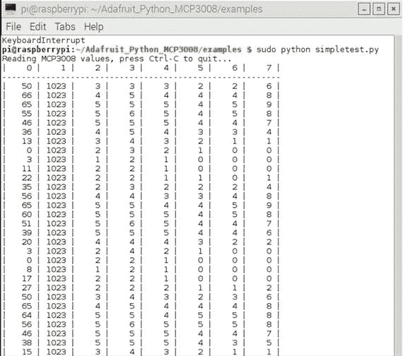

图 6-10。

测试程序输出

注意到通道 1 显示的是一致的值 1023，因为它连接到了 3.3 V 电源。V[ref] 也连接到了 3.3 V 电源，导致最大值为 1023。这个最大值是转换过程中有 10 位直接导致的结果。还有一点值得注意的是，通道 0 显示的是变化的值，范围从 0 到 66，而未连接到任何东西或基本上是浮动的。通道 2 到 7 也是浮动的，但只显示从 0 到 9 的值。我的猜测是，通道 0 和 1 之间存在高阻抗交叉耦合，这影响了通道 0 的读数。当通道 0 实际连接到感测电阻时，这种耦合不应该产生影响。

实际的总功率计算需要从通道 0 和 1 的两个 ADC 读数之间的差值。通道 0 也是输入电机电源电压。我选择使用电阻上的绝对计数差，因为得益于 1 V 电阻降和 1023 的最大 ADC 范围，几乎每个计数对应 1 毫伏的精确比例。两个输入都使用电压分压器网络，将输入电压降低三分之二，以保持它们在 ADC 芯片的 3.3 V 输入范围内。这些电压降低在功率计算中得到补偿。

总功率损耗包括电阻功率和电机功率。这个值（以瓦特为单位）是按照以下方式计算的：

让！$$ diff= count0- count1 $$

这也是电阻的电压降。

因此，电流是：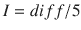

电机上的电压降：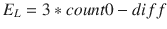

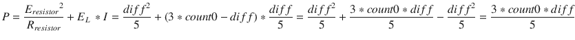

下一步是考虑如何将功率测量和能耗最小化方法集成到现有的 robotRoulette 程序中。

## 演示 6-3：考虑能耗的自适应学习

应将最小化能耗视为机器人汽车的背景活动，而不是像向前行驶或转弯这样的主要活动。这种区分的原因是所有主要活动都会消耗能量，但有些消耗的能量少于其他活动。由于所有活动都涉及能量消耗，因此为它创建一个单独的适应性类别是没有意义的。相反，更合理的是奖励那些消耗较少能量的活动，并惩罚那些消耗更多能量的活动。奖励和惩罚以对相应活动适应性值的轻微调整的形式出现。我任意决定，如果测量的功率水平高于或低于预设的毫瓦阈值值，则适应性值增加或减少 0.5 分。这种调整包含在 robotAction 模块中。除了插入一个计算功率水平的新模块外，没有对现有代码进行其他更改。下面列出了新的功率模块和修改后的 robotAction 模块。

```py
global mcp, pwrThreshold
pwrThreshold = 1000 # initial threshold value of 1000 mW
def calcPower:
global mcp
count0 = mcp.read_adc(0)
count1 = mcp.read_adc(1)
diff = count0 - count1
power = (3*count0*diff)/5
return power
# modified robotAction module
def robotAction(select):
global pwmL, pwmR, pwrThreshold, fitA, fitB, fitC
if select == 0:
# stop immediately
exit()
elif select == 1:
pwmL.ChangeDutyCycle(3.6)
pwmR.ChangeDutyCycle(2.2)
if power() > pwrThreshold:
fitA = fitA - 0.5
else:
fitA = fitA + 0.5
elif select == 2:
pwmL.ChangeDutyCycle(2.2)
pwmR.ChangeDutyCycle(2.8)
if power() > pwrThreshold:
fitB = fitB - 0.5
else:
fitB = fitB + 0.5
elif select == 3:
pwmL.ChangeDutyCycle(2.8)
pwmR.ChangeDutyCycle(2.2)
if power() > pwrThreshold:
fitC = fitC - 0.5
else:
fitC = fitC + 0.5
```

我预期，在转弯活动中，平均能耗将低于向前行驶。原因是转弯时只有一个电机供电，而向前行驶时有两个电机供电。这自然导致 fitB 和 fitC 值逐渐增加，而 fitA 值减少。当然，与障碍物检测相关的适应性调整仍在进行。我为能耗分配了 0.5 个适应性分数，这使得这个学习因子只有障碍物学习因子的 50%有效。我预期机器人最终会达到一个静息状态，此时它只会转圈。

在对程序进行修改和初始化以支持这些修改后，我将主程序重命名为 rre.py（代表 robotRoulette_energy）。以下是完整的列表。

```py
import RPi.GPIO as GPIO
import time
from random import randint
# next two libraries must be installed IAW appendix instructions
import Adafruit_GPIO.SPI as SPI
import Adafruit_MCP3008
global pwmL, pwmR, fitA, fitB, fitC, pwrThreshold, mcp
# Hardware SPI configuration:
SPI_PORT   = 0
SPI_DEVICE = 0
mcp = Adafruit_MCP3008.MCP3008(spi=SPI.SpiDev(SPI_PORT, SPI_DEVICE))
# initial fitness values for each of the 3 activities
fitA = 20
fitB = 20
fitC = 20
#initial pwrThreshold
pwrThreshold = 1000 # units of milliwatts
# use the BCM pin numbers
GPIO.setmode(GPIO.BCM)
# setup the motor control pins
GPIO.setup(18, GPIO.OUT)
GPIO.setup(19, GPIO.OUT)
pwmL = GPIO.PWM(18,20) # pin 18 is left wheel pwm
pwmR = GPIO.PWM(19,20) # pin 19 is right wheel pwm
# must 'start' the motors with 0 rotation speeds
pwmL.start(2.8)
pwmR.start(2.8)
# ultrasonic sensor pins
TRIG = 23 # an output
ECHO = 24 # an input
# set the output pin
GPIO.setup(TRIG, GPIO.OUT)
# set the input pin
GPIO.setup(ECHO, GPIO.IN)
# initialize sensor
GPIO.output(TRIG, GPIO.LOW)
time.sleep(1)
# modified robotAction module
def robotAction(select):
global pwmL, pwmR, pwrThreshold, fitA, fitB, fitC
if select == 0:
# stop immediately
exit()
elif select == 1:
pwmL.ChangeDutyCycle(3.6)
pwmR.ChangeDutyCycle(2.2)
if calcPower() > pwrThreshold:
fitA = fitA - 0.5
else:
fitA = fitA + 0.5
elif select == 2:
pwmL.ChangeDutyCycle(2.2)
pwmR.ChangeDutyCycle(2.8)
if calcPower() > pwrThreshold:
fitB = fitB - 0.5
else:
fitB = fitB + 0.5
elif select == 3:
pwmL.ChangeDutyCycle(2.8)
pwmR.ChangeDutyCycle(2.2)
if calcPower() > pwrThreshold:
fitC = fitC - 0.5
else:
fitC = fitC + 0.5
# backup module
def backup(select):
global fitA, fitB, fitC, pwmL, pwmR
if select == 1:
fitA = fitA - 1
if fitA = 0 and draw  fitA and draw  (fitA + fitB):
select = 3
robotAction(select)
clockFlag = True
current = time.time()
# check to see if 2 seconds (2000ms) have elapsed
if (current - start)*1000 > 2000:
# this triggers a new draw at loop start
clockFlag = False
# generate a 10 μsec trigger pulse
GPIO.output(TRIG, GPIO.HIGH)
time.sleep(0.000010)
GPIO.output(TRIG, GPIO.LOW)
# following code detects the time duration for the echo pulse
while GPIO.input(ECHO) == 0:
pulse_start = time.time()
while GPIO.input(ECHO) == 1:
pulse_end = time.time()
pulse_duration = pulse_end - pulse_start
# distance calculation
distance = pulse_duration * 17150
# round distance to two decimal points
distance = round(distance, 2)
# check for 25.4 cm distance or less
if distance < 25.40:
backup()
```

### 测试运行

我将机器人放在与上次测试运行相同的走廊里。我启动了另一个 SSH 会话，通过输入以下命令来启动程序：

```py
sudo python rre.py
```

机器人立即做出了反应，就像之前一样，通过转弯、直线前进或后退来接近墙壁或门。动作相当混合。大约 5 分钟后，绝大多数动作都是转弯动作，只有偶尔的直线前进动作。后退动作只有在机器人转弯时离墙壁太近时才会发生。对我来说，机器人显然已经“学会”了转弯动作确实是节省能量的最佳方式。

本项目结束了本章对机器学习的关注。下一章将机器学习推向一个更深层次。

## 摘要

本章是几章中关于机器学习这一高度有趣主题的第一章。第一个树莓派演示涉及用户在喜欢的 LED 随机点亮时按下按钮。不久，计算机“学习”了喜欢的颜色，并持续点亮那个特定的 LED。在这个项目中引入了适应性（fitness）的概念。

接下来，我讨论了轮盘赌算法，这是下一个演示的自主机器人汽车学习行为的序曲。机器人汽车 Alfie 执行了一些选定的动作或行为，这些动作最终根据汽车在执行动作时是否遇到障碍物而得到强化或减弱。最终，汽车达到了一个静息状态，无法执行任何动作，它只是简单地关闭了。

最后的演示说明了如何给机器人汽车添加另一种行为。这种新的行为专注于节能。汽车迅速学会了优先选择那些消耗能量少于预设阈值的动作。
