# 7. 机器学习：人工神经网络

本章继续探讨机器学习，并重点关注人工神经网络（ANN）。我想再次感谢，其中一些演示受到了伯特·范·达姆的启发。

## 零件清单

对于演示 7-1，你需要 Alfie 机器人车和额外的零件，这些零件在表 7-1 中详细说明。

表 7-1。

零件清单

| 描述 | 数量 | 备注 |
| --- | --- | --- |
| Pi Cobbler | 1 | 40 引脚版本，T 或 DIP 封装形式均可接受 |
| 无焊面包板 | 1 | 700 个插入点，带有 2 个电源带 |
| 跳线 | 1 包 |    |
| 超声波传感器 | 2 | 类型 HC-SR04 |
| 4.9kΩ 电阻 | 2 | 1/4 瓦 |
| 10kΩ 电阻 | 6 | 1/4 瓦 |
| MCP3008 | 1 | 8 通道 ADC 芯片 |
| 光电细胞 | 1 | 任何 CdS 类型 |

让我们先深入了解所有人工神经网络中最简单的一种：霍普菲尔德网络。

## 霍普菲尔德网络

霍普菲尔德网络在 1982 年由约翰·霍普菲尔德普及，当时他描述了一个实现了与人类记忆功能密切相似的联想记忆模型的 ANN。霍普菲尔德网络在霍华德·S·史密斯的书《我，机器人》（机器人二进制，2008）中被讨论后，获得了一些名气；（不要与艾萨克·阿西莫夫的《我，机器人》（Grosset & Dunlap，1950）混淆，这是 2004 年威尔·史密斯同名电影的基础）。

在描述网络本身之前，我需要描述霍普菲尔德网络中使用的模拟神经元。图 7-1 是这种模拟神经元的模型。

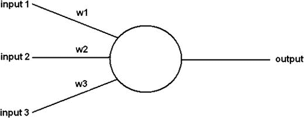

图 7-1。

神经元模型

虽然图 7-1 中只显示了三个输入，但在复杂的网络中存在许多更多。无论有多少输入进入神经元，只有一个输出。神经元处于一致或维持的状态，直到它被更新。神经元的状 态是二进制的，值为 1 或 -1（至少对于本书中使用的霍普菲尔德网络）。更新是通过以下三个步骤完成的。

1.  每个输入的值被确定，并计算加权总和。

1.  如果加权总和输入等于或大于 0，则神经元输出设置为 1；否则，它设置为 -1。

1.  神经元保留输出值，直到它再次更新。

更新神经元有两种方法，我将在下面描述。您理解更新方法不是很重要，因为这涉及到网络初始化和实时操作的数学。

+   异步：选择特定的神经元并立即更新。这可以通过预选的顺序或随机完成。

+   同步：在更新神经元之前，计算所有加权输入总和。完成后，所有神经元都进行更新。

现在我已经介绍了基本的人工神经元，是时候讨论 Hopfield 网络了。这个网络通常被描述为一个循环网络，其中输出值以无向方式反馈到输入。这些反馈回路对网络的学习能力有重要影响。以下列表提供了一些重要的 Hopfield 网络属性。

+   由一组 N 个神经元或节点组成，从现在起我将它们称为节点

+   所有节点间连接的权重对称

+   没有节点直接连接回自身（即不允许自环）

+   没有专门的输入或输出节点

+   每个节点只有二进制或双状态输出

+   一个激活的节点会激活所有与它通过正权重连接的节点

+   所有输入同时应用于所有节点，然后进行反馈

+   网络经过有限次迭代后达到平衡或恒定状态

图 7-2 是我在下一系列演示中使用的六节点 Hopfield 网络的示意图。

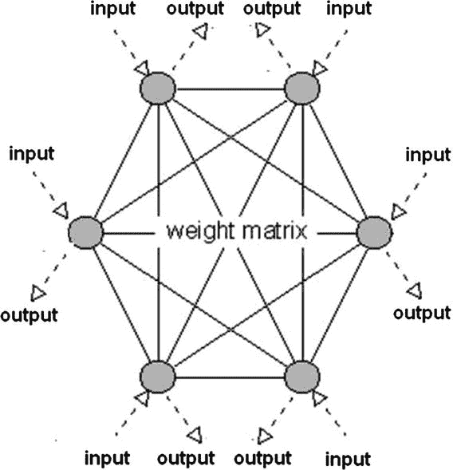

图 7-2。

六节点 Hopfield 网络

在本节的开头，我提到 Hopfield 网络是基于联想记忆模型的。探索联想记忆模型并了解它是如何工作的肯定是有帮助的。看看图 7-3。我确信你能认出它是字母 S。


图 7-3。

字母 S

你能认出它，因为 S 字母的形状自你童年起就深深地印在你的记忆中。关于这种记忆回忆的理解并不多，因为字母和数字的图案在我们的记忆中非常嵌入。然而，看看图 7-4，并尝试确定它是什么。

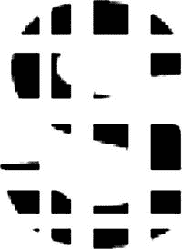

图 7-4。

扭曲的字母

我相当确信，大多数读者都能认出相同的字母 S，尽管超过 50%的字母身体已被擦除。你的大脑和内在记忆本质上已经填补了点，在你的脑海中形成了一个 S 字母的形象。很可能，你没有将扭曲的图形识别为字母，而是将点状和黑色斑点的混乱与字母 S“关联”起来。这种在机器内存中存储的内容与现实呈现的现实之间的关联概念是以下演示中的一个重要点。

正如你必须学会识别字母 S 一样，机器也必须被教会识别事物。下面将要介绍的 Hopfield 网络示例仅使用+1 和-1 作为输入符号。这些符号在现实世界中所代表的意义与本次讨论关系不大。让我们从一个包含值 1，-1，-1，-1，1 和 1 的六个输入样本数据集开始。然而，为了数学上的精确性，我将这个输入数据集表达为以下向量：

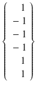

这个向量需要被转换成一个 6×6 矩阵，以表示由六个节点 Hopfield 网络产生的所有节点互连。这可以通过将输入数据向量与其自身相乘轻松完成。

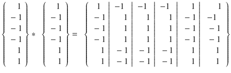

表 7-2 展示了信息的完整向量乘法。

表 7-2.

向量乘法

|   |  1 | –1 | –1 | –1 |  1  |  1  |
| --- | --- | --- | --- | --- | --- | --- |
|  1 | 1 | –1 | –1 | –1 |  1 | 1 |
| –1 | –1 |  1 |  1 |  1 | –1 | –1 |
| –1 | –1 | 1 | 1 | 1 | –1 | –1 |
| –1 | –1 | 1 | 1 | 1 | –1 | –1 |
| 1 | 1 | –1 | –1 | –1 | 1 | 1 |
| 1 | 1 | –1 | –1 | –1 | 1 | 1 |

幸运的是，Python numpy 库为所有未来的计算提供了出色的矩阵运算，这完全自动化了所有这些繁琐且容易出错的手动计算。

现在，让我们假设存在另一组由以下向量表示的输入数据：

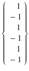

将这个新向量与其自身相乘得到以下结果：

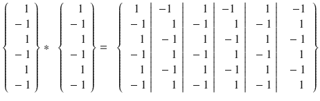

下一步是将两个 6×6 矩阵相加。这会得到一个单一的 6×6 矩阵，该矩阵“记住”了两组输入数据向量。让我们称这个最终的矩阵为权重矩阵，以符合图 7-1 中所示的矩阵。

![$$ \left\{\left.\begin{array}{l}\kern1em 1\\ {}-1\\ {}-1\\ {}-1\\ {}\kern1em 1\\ {}\kern1em 1\end{array}\right|\left.\begin{array}{l}-1\\ {}\kern1em 1\\ {}\kern1em 1\\ {}\kern1em 1\\ {}-1\\ {}-1\end{array}\right|\left.\begin{array}{l}-1\\ {}\kern1em 1\\ {}\kern1em 1\\ {}\kern1em 1\\ {}-1\\ {}-1\end{array}\right|\left.\begin{array}{l}-1\\ {}\kern1em 1\\ {}\kern1em 1\\ {}\kern1em 1\\ {}-1\\ {}-1\end{array}\right|\left.\begin{array}{l}\kern1em 1\\ {}-1\\ {}-1\\ {}-1\\ {}\kern1em 1\\ {}\kern1em 1\end{array}\right|\begin{array}{c}\hfill \kern1em 1\hfill \\ {}\hfill \begin{array}{l}-1\\ {}-1\\ {}-1\\ {}\kern1em 1\\ {}\kern1em 1\end{array}\hfill \end{array}\right\}+\kern0.5em \left\{\left.\begin{array}{l}\kern0.5em 1\\ {}-1\\ {}\kern1em 1\\ {}-1\\ {}\kern1em 1\\ {}-1\end{array}\right|\left.\begin{array}{l}-1\\ {}\kern1em 1\\ {}-1\\ {}\kern1em 1\\ {}-1\\ {}\kern1em 1\end{array}\right|\left.\begin{array}{l}\kern1em 1\\ {}-1\\ {}\kern1em 1\\ {}-1\\ {}\kern1em 1\\ {}-1\end{array}\right|\left.\begin{array}{l}-1\\ {}\kern1em 1\\ {}-1\\ {}\kern1em 1\\ {}-1\\ {}\kern1em 1\end{array}\right|\left.\begin{array}{l}\kern1em 1\\ {}-1\\ {}\kern1em 1\\ {}-1\\ {}\kern1em 1\\ {}-1\end{array}\right|\begin{array}{c}\hfill -1\hfill \\ {}\hfill \begin{array}{l}\kern1em 1\\ {}-1\\ {}\kern1em 1\\ {}-1\\ {}\kern1em 1\end{array}\hfill \end{array}\right\}=\kern0.5em \left\{\left.\begin{array}{l}\kern0.5em 2\\ {}-2\\ {}\kern1em 0\\ {}-2\\ {}\kern1em 2\\ {}\kern1em 0\end{array}\right|\left.\begin{array}{l}-2\\ {}\kern1em 2\\ {}\kern1em 0\\ {}\kern1em 2\\ {}-2\\ {}\kern1em 0\end{array}\right|\left.\begin{array}{l}\kern1em 0\\ {}\kern1em 0\\ {}\kern1em 2\\ {}\kern1em 0\\ {}\kern1em 0\\ {}-2\end{array}\right|\left.\begin{array}{l}-2\\ {}\kern1em 2\\ {}\kern1em 0\\ {}\kern1em 2\\ {}-2\\ {}\kern1em 0\end{array}\right|\left.\begin{array}{l}\kern1em 2\\ {}-2\\ {}\kern1em 0\\ {}-2\\ {}\kern1em 2\\ {}\kern1em 0\end{array}\right|\begin{array}{c}\hfill \kern1em 0\hfill \\ {}\hfill \begin{array}{l}\kern1em 0\\ {}-2\\ {}\kern1em 0\\ {}\kern1em 0\\ {}\kern1em 2\end{array}\hfill \end{array}\right\} $$](img/A436848_1_En_7_Chapter_Eque.gif)

由于输入矩阵只包含 ±1，求和矩阵只能包含 ±2 或 0，这正是它所做到的。

为了证明权重矩阵实际上“记住”了输入数据集向量，我将第一个向量乘以权重矩阵，看看结果如何。

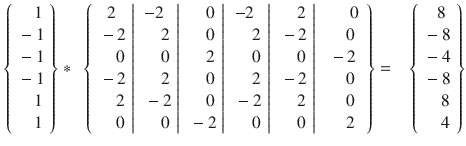

上述矩阵乘法过程由六个独立的步骤组成，其中向量值与权重矩阵的每一行相乘，并将得到的部分乘积相加。例如，向量与权重矩阵的第一行相乘得到以下结果：

(1 * 2) + (-1 * -2) (-1 * 0) + (-1 * -2) + (1 * 2) + (1 * 0) = 8

这个结果向量接下来必须归一化以匹配输入数据的格式，输入数据只包含 1 或-1。归一化规则非常简单：

所有 0 或 0 以上的值都变为 1，而所有小于 0 的值都变为-1。

应该注意的是，0 值的精确归一化并不是一门精确的科学。在某些网络中，将其归一化为 1 可以提供更好的结果，而在其他网络中，将其归一化为-1 可能更合适。对于这个网络，我确定前者更合适，并产生了准确的结果。

将此规则应用于向量结果得到以下结果：

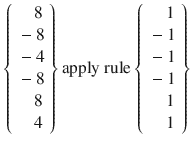

你现在可以清楚地看到，归一化后的结果向量与原始输入数据向量完全相同。你可以对第二个输入数据向量执行前面的操作，它也会返回该向量，从而证明权重矩阵“记得”存储在其中的初始数据。

到这个时候，你可能认为这些操作很有趣，但它们的实际价值是什么？如何将这个 Hopfield 网络用于实际应用？为了回答这些合理的问题，考虑以下场景。

假设输入向量代表一些现实世界的事物，可能由一个或多个传感器生成，并且由于噪声或类似的干扰，结果向量被损坏或扭曲，就像图 7-4 与图 7-3 相似。假设新的输入数据向量如下，其中 0 表示没有数据：

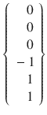

接下来，将这个新向量乘以权重矩阵，看看会发生什么：

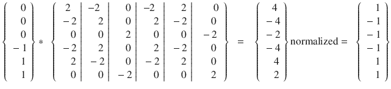

最终，归一化的结果向量与原始输入向量完全相同。Hopfield 网络将损坏的输入向量与其结构中存储的内容关联起来，并返回与扭曲输入版本最相似的向量。这种情况与您从原始版本中识别出严重扭曲的字母非常相似。

下一个演示将有助于进一步定义这个关联过程。

## 示例 7-1：数值图形识别演示

图 7-5 展示了一种独特的方法，仅使用六条直线段来表示十进制数字 0 到 9。这个方案没有名字，因为我完全自己想出来的。

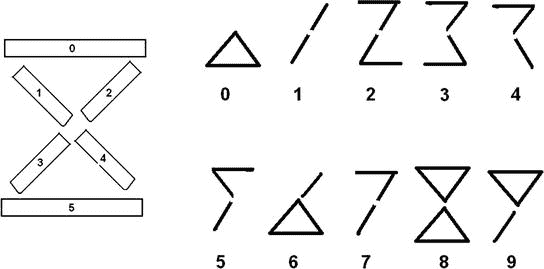

图 7-5.

六段数值方案

我非常确信，你可以在没有问题的前提下轻松识别图 7-5 中的大多数分段数字。由于可用段数的限制，数字 4 和 5 是最难的。

假设为这些数字中的每一个创建一个输入数据向量，其中用 1 表示显示的段，用 –1 表示未显示的段。例如，数字 0 和 1 将由以下向量表示：


接下来，需要使用表 7-3 中显示的所有十个输入数据向量来创建一个 Hopfield 网络。

表 7-3.

数值方案的输入数据向量

| 数字 | 0 | 1 | 2 | 3 | 4 | 5 |
| --- | --- | --- | --- | --- | --- | --- |
| 0 | –1 | –1 | –1 | 1 | 1 | 1 |
| 1 | –1 | –1 | 1 | 1 | –1 | –1 |
| 2 | 1 | –1 | 1 | 1 | –1 | 1 |
| 3 | 1 | 1 | –1 | 1 | –1 | 1 |
| 4 | 1 | –1 | 1 | –1 | 1 | –1 |
| 5 | 1 | 1 | –1 | –1 | 1 | 1 |
| 6 | –1 | –1 | 1 | 1 | 1 | 1 |
| 7 | 1 | –1 | 1 | 1 | –1 | –1 |
| 8 | 1 | 1 | 1 | 1 | 1 | 1 |
| 9 | 1 | 1 | 1 | 1 | –1 | –1 |

通过使用我之前提到的 Python numpy 矩阵库，我避免了大量的手动计算。在接下来的讨论中，我使用“点积向量”这个短语来描述矩阵乘法的结果。我包括以下边栏来描述点积和叉积，并解释它们如何应用于矩阵。

点积与叉积

点积也称为标量积，是两个矩阵或数组相乘的结果。成功操作的唯一要求是其中一个矩阵或数组的行数必须与另一个矩阵或数组的列数相匹配。以下简单的 Python 示例足以说明它是如何工作的：

```py
>>> import numpy as np
>>> x = np.array(((2,3), (3,5)))
>>> y = np,array(((1,2), (5,-1)))
>>> np.dot(x,y)
matrix([17,1],
[28,1])
>>>
```

通过将数组转换为矩阵并使用乘法运算符（`*`），可以得到相同的结果。

```py
>>> np.mat(x) * np.mat(y)
matrix([17,1],
[28,1])
>>>
```

对于前面的例子，Python 解释器在确定两个矩阵要相乘时，会自动调用点积操作。

第二种类型的矩阵乘法涉及叉积。叉积定义为三维空间中两个向量的二元运算。结果向量与两个输入向量正交。

下一个例子应该可以阐明定义。假设创建了两个单位向量，如下所示：

```py
>>> y = np.array([0,1,0])
>>> z = np.array([0,0,1])
>>>
```

图 7-6 显示了这两个向量在 3D 空间中的绘制。

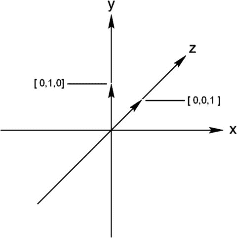

图 7-6。

y 和 z 单位向量

以下表达式计算 y 和 z 的叉积向量。

```py
>>> np.cross(y, z)
array([-1,0,0]
>>>
```

这个新向量与 y 和 z 正交，因此，它必须位于 x 轴上，如图 7-7 所示。

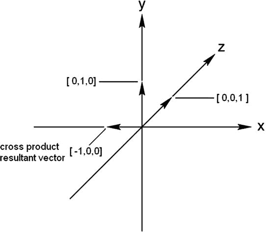

图 7-7。

交叉乘积结果向量

numpy 交叉函数中参数的顺序很重要。如果您要反转顺序，以下结果会出现：

```py
>>> np.cross(z, y)
array([1,0,0]
>>>
```

这是相同的单位大小向量，但方向相反。我没有绘制这个向量，因为它很容易可视化。我在任何演示中都没有使用叉积，但我包括它供您参考。

图 7-8 显示了 Python 交互会话的开始和结束，我在其中基于所有 10 个输入数据向量创建了 Hopfield 权重矩阵。

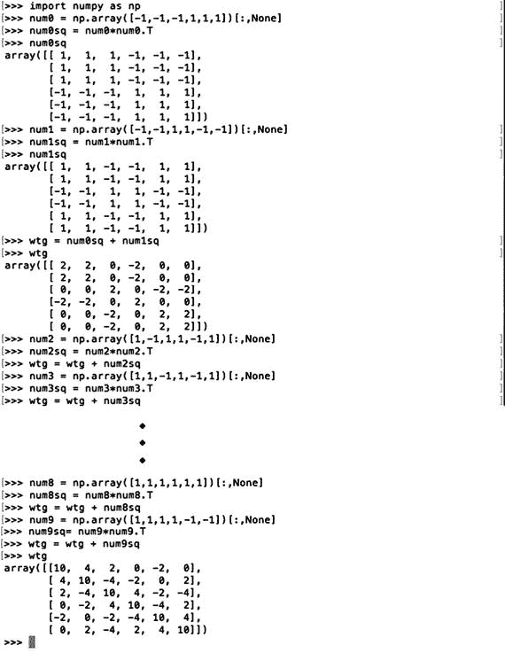

图 7-8。

创建 Hopfield 权重矩阵的 Python 会话

以下是最终权重矩阵：

```py
array([[10,  4,  2,  0, -2,  0],
[ 4, 10, -4, -2,  0,  2],
[ 2, -4, 10,  4, -2, -4],
[ 0, -2,  4, 10, -4,  2],
[-2,  0, -2, -4, 10,  4],
[ 0,  2, -4,  2,  4, 10]])
```

我将使用这个矩阵和从虚构的数值方案中略微扭曲的数字，看看 Hopfield 网络是否能识别出来。图 7-9 显示了缺少两段的数字 8。

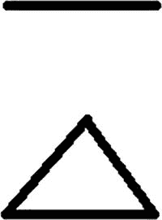

图 7-9。

扭曲的图形 8

以下是对应的扭曲图形的输入数据向量：

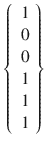

测试网络所需的所有操作是将扭曲的输入向量乘以权重矩阵，并对结果点积向量进行归一化。图 7-10 显示了交互会话，其中向量被乘以权重矩阵，并显示了结果点积向量。

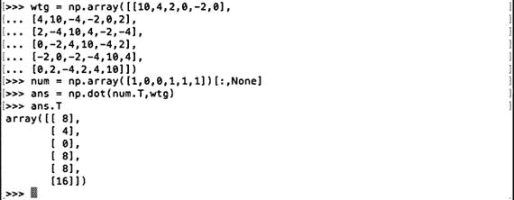

图 7-10。

交互式 Python 会话以计算扭曲的图形

以下显示了归一化的向量。它与图 8 输入数据向量完全匹配。

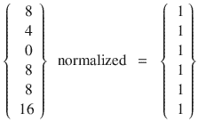

这个测试再次表明，Hopfield 网络确实存储了数据，可以很容易地帮助识别未知或扭曲的输入数据集，前提是它是网络的一部分。我对有关 Hopfield 网络和字符或模式识别的文章进行了简要和有限的回顾，我发现这样的网络在从扭曲或卷曲的输入向量中识别正确的字符时通常有超过 90%的成功率。当然，这完全取决于输入数据量和质量以及网络中创建的节点数量。在我的非常简单和有限的演示中，如果成功率远超过 70%，我会感到非常惊讶，考虑到它的局限性和约束，这仍然是非常令人印象深刻的。

下一个演示在纯计算方法方面显著改变了我迄今为止所做的工作。它使用了一个更现实的人工神经网络（ANN）应用。

## 演示 7-2：使用 ANN 的自主机器人汽车

这个演示使用了在前一章中介绍的机器人汽车 Alfie。在 Alfie 的最后一个项目中，它被编程为尽可能避免所有墙壁和门，同时在行驶过程中尽可能节约能量。这个项目与之前的项目显著不同，因为机器人汽车会接近障碍物并尝试绕过它们。我放弃了能量节约方案，因为对于这个人工神经网络（ANN）的演示来说并不重要。然而，Alfie 装备了另一个超声波传感器，这应该有助于它在检测和避免障碍物时的努力。实现了一个 Hopfield 网络来帮助机器人记住过去的行为，这应该有助于它在环境中旅行时选择更好的行动和行为。

使用这个网络，采用了五个元素的输入数据向量。以下是构成输入向量的元素：

+   左侧传感器

+   右侧传感器

+   两个传感器

+   左侧电机

+   右侧电机

这些元素对于初始演示就足够了，但可以根据需要轻松增加更多元素。这五个元素意味着应该使用一个 5×5 的 Hopfield 网络来支持机器人汽车控制系统。使用 1 和-1 的标称值，就像我在上一个例子中所做的那样。需要做的是将 1 或-1 的含义与每个元素关联起来。让我们从传感器开始。似乎用 1 表示传感器没有检测到物体非常合适；或者，在“两个传感器”的情况下，每个传感器报告前方有障碍物。请注意，我还没有为超声波传感器定义一个阈值距离。这将在稍后进行。电机元素的定义也很简单。1 表示电机正在运行，而-1 表示它已停止。在这里也要注意，电机要么在运行，要么不在运行；没有中间功率设置。那么以下输入向量意味着什么呢？


对于传感器的所有 1 表示没有检测到障碍物，而对于电机的所有 1 表示汽车正在直线前进。这是一个相当简单且明确的规则，如果汽车不是应该学习并不仅仅遵循一组存储的规则，那么它将是合适的。需要的是一种让汽车学习什么是好规则或行为，什么不是很好的规则的方法。这种方法意味着汽车必须尝试不同的事情，并确定哪些是好的并且应该被记住，哪些是不好的并且不应该被保留。当然，什么是好或不好是相当任意的，所以必须有一种方法来评估那些应该保留和存储的行为，以及那些应该被丢弃的行为。

尝试不同的事情实际上意味着随机激活电机，以便尝试新的路径以查看是否遇到障碍。唯一禁止的运动是倒退，因为没有传感器面向那个方向，也无法生成有效的输入数据向量。以下是被允许的唯一运动：

+   向左转

+   向右转

+   直行

+   停止

由于实验的性质，上一次机器人演示中不允许停止选项。这次，绝对允许。事实上，机器人最终可能学会最佳行为是停止不动。转弯的方式也与上次演示有所不同。在上次测试中，转向侧的轮子停止转动，而其他轮子继续旋转。机器人实际上是在停止的轮子上旋转。这次，转向侧的轮子被命令向相反方向旋转，而另一侧的轮子停止。这个动作允许机器人在其自身半径内转弯。这通常被称为零半径转弯。虽然不是很准确，但你应该明白实际的转弯半径非常小。

机器人学习过程的下一部分更困难：区分好的行为或动作与不太好的行为。幸运的是，我们大多数人在成长过程中都有父母和老师，他们可以帮助我们完成这项重要任务。不幸的是，对于机器人来说，没有人可以帮助它完成这项关键任务。它必须自己完成。我们可以通过编程让机器人接受“提高”其整体进步的行为。显然，应该接受的任务是不包括检测障碍物的行为。这种方法与上次机器人演示中调整适应度值的方式非常相似。每次遇到墙壁或门时，当时正在进行的适应度值会略微降低。这次，没有适应度值，只有输入数据向量，这些向量要么被存储，要么不被存储。要存储向量，唯一重要的是机器人“相信”情况已经改善。下次机器人遇到具有相同向量的情况时，它会回忆起存储的内容并重复该动作。这种方法可能导致机器人以完全不同于你预期的模式运行，但这没关系，因为它是在自己的条件下“学习”。这就是机器人汽车真正自主的含义。此外，观察一个不可预测的机器人可能会很有趣，只要它不会追逐你的猫或打翻你昂贵的花瓶。

另一个需要回答的重要问题是机器人将如何识别新的情况。让我们假设机器人的传感器没有检测到任何东西，而且我们对操作电机一无所知。这与我在 Hopfield 网络讨论开始时讨论的扭曲输入向量非常相似。在这种情况下，输入数据向量如下所示：

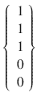

你可能记得，你需要将扭曲的输入向量乘以权重矩阵。因此，我们必须创建权重矩阵，在这种情况下是

![$$ \left\{\begin{array}{c}\hfill\ 1\hfill \\ {}\hfill\ 1\hfill \\ {}\hfill\ 1\hfill \\ {}\hfill\ 1\hfill \\ {}\hfill\ 1\hfill \end{array}\right\}\kern0.5em *\kern0.5em \left\{\begin{array}{c}\hfill\ 1\hfill \\ {}\hfill\ 1\hfill \\ {}\hfill\ 1\hfill \\ {}\hfill\ 1\hfill \\ {}\hfill\ 1\hfill \end{array}\right\}\kern0.5em =\kern0.5em \left\{\begin{array}{c}\hfill\ 1\ 1\ 1\ 1\ 1\hfill \\ {}\hfill\ 1\ 1\ 1\ 1\ 1\hfill \\ {}\hfill\ 1\ 1\ 1\ 1\ 1\hfill \\ {}\hfill\ 1\ 1\ 1\ 1\ 1\hfill \\ {}\hfill\ 1\ 1\ 1\ 1\ 1\hfill \end{array}\right\} $$](img/A436848_1_En_7_Chapter_Equo.gif)

因此，新的向量乘以权重矩阵是

![$$ \left\{\begin{array}{c}\hfill\ 1\hfill \\ {}\hfill\ 1\hfill \\ {}\hfill\ 1\hfill \\ {}\hfill\ 0\hfill \\ {}\hfill\ 0\hfill \end{array}\right\}\kern0.5em *\kern0.75em \left\{\begin{array}{c}\hfill\ 1\ 1\ 1\ 1\ 1\hfill \\ {}\hfill\ 1\ 1\ 1\ 1\ 1\hfill \\ {}\hfill\ 1\ 1\ 1\ 1\ 1\hfill \\ {}\hfill\ 1\ 1\ 1\ 1\ 1\hfill \\ {}\hfill\ 1\ 1\ 1\ 1\ 1\hfill \end{array}\right\}\kern0.5em = \left\{\begin{array}{c}\hfill\ 3\hfill \\ {}\hfill\ 3\hfill \\ {}\hfill\ 3\hfill \\ {}\hfill\ 3\hfill \\ {}\hfill\ 3\hfill \end{array}\right\}\kern0.5em \mathrm{normalized}\kern0.5em =\kern0.5em \left\{\begin{array}{c}\hfill\ 1\hfill \\ {}\hfill\ 1\hfill \\ {}\hfill\ 1\hfill \\ {}\hfill\ 1\hfill \\ {}\hfill\ 1\hfill \end{array}\right\} $$](img/A436848_1_En_7_Chapter_Equp.gif)

在这个讨论的这个阶段，这个向量结果不应该让你感到惊讶。网络已经将这个未知向量与它所知道的包含传感器数据的向量相关联，这些数据中没有检测到任何对象，例如

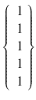

存储的行为是启动两个电机并直线前进。这个结果导致以下结论：

如果已知数据是正确的，那么你应该假设未知数据也是正确的。

虽然这个结论看起来很好，也有些深刻，但如果存储的向量本身有误，它也可能导致错误的行为。拥有一个错误的存储向量与拥有一个虚假记忆非常相似。也就是说，任何你认为真实准确但事实上并不代表真实经历的记忆。随着年龄的增长，大多数人往往会用虚假记忆代替真实记忆，这促使人们想起“美好的过去”，而这些过去很可能并不那么美好。

大部分讨论都是为接下来开始的软件讨论做铺垫。

## 示例 7-3：避障机器人车的 Python 控制脚本

机器人汽车控制程序名为 annRobot.py，它使用与 robotRoulette.py 程序开发的类似结构。电机控制和超声波传感器模块是相同的。随机动作选择代码已修改，并需要几个新的矩阵计算模块来支持 Hopfield 网络。新的程序（如下所示）相当长，新部分或模块之前有大量的注释。我选择这种方法，而不是逐个展示每个新部分或模块，讨论它们，并在最后有一个综合列表。请参考之前的讨论或机器人构建附录，以获取有关已展示模块的信息，例如随机抽取或电机控制。

```py
import RPi.GPIO as GPIO
import time
from random import randint
import numpy as np
global pwmL, pwmR
threshold = 25.4
# use the BCM pin numbers
GPIO.setmode(GPIO.BCM)
# setup the motor control pins
GPIO.setup(18, GPIO.OUT)
GPIO.setup(19, GPIO.OUT)
pwmL = GPIO.PWM(18,20) # pin 18 is left wheel pwm
pwmR = GPIO.PWM(19,20) # pin 19 is right wheel pwm
# must 'start' the motors with 0 rotation speeds
pwmL.start(2.8)
pwmR.start(2.8)
# ultrasonic sensor pins
TRIG1 = 23 # an output
ECHO1 = 24 # an input
TRIG2 = 25 # an output
ECHO2 = 27 # an input
# set the output pins
GPIO.setup(TRIG1, GPIO.OUT)
GPIO.setup(TRIG2, GPIO.OUT)
# set the input pins
GPIO.setup(ECHO1, GPIO.IN)
GPIO.setup(ECHO2, GPIO.IN)
# initialize sensors
GPIO.output(TRIG1, GPIO.LOW)
GPIO.output(TRIG2, GPIO.LOW)
time.sleep(1)
# Create an initial weighting matrix named wtg
# based on all 1's in the input data vector
vInput = np.array([1,1,1,1,1])[:,None] # actually a [1,0] matrix
wtg = vInput.T*vInput # matrix multiplication yields a 5 x 5 matrix
# vInput.T is the transpose form (i.e. column)
# The square of new and successful input data
# vectors  be added to wtg matrix.
# robotAction module
def robotAction(select):
global pwmL, pwmR
if select == 0: # drive straight
pwmL.ChangeDutyCycle(3.6)
pwmR.ChangeDutyCycle(2.2)
elif select == 1: # turn left
pwmL.ChangeDutyCycle(2.2)
pwmR.ChangeDutyCycle(2.8)
elif select == 2: # turn right
pwmL.ChangeDutyCycle(2.8)
pwmR.ChangeDutyCycle(3.6)
elif select == 3: # stop
pwmL.ChangeDutyCycle(2.8)
pwmR.ChangeDutyCycle(2.8)
# flag used to trigger a new draw
clockFlag = False
# forever loop
while True:
if clockFlag == False:
start = time.time()
draw = randint(0,3) # generate a random draw
if draw == 0:   # drive forward
select = 0
robotAction(select)
elif draw == 1: # turn left
select = 1
robotAction(select)
elif draw == 2: # turn right
select = 2
robotAction(select)
elif draw == 3: # stop
select = 3
robotAction(select)
clockFlag = True
numHits = 0
# sensor 1 reading
GPIO.output(TRIG1, GPIO.HIGH)
time.sleep(0.000010)
GPIO.output(TRIG1, GPIO.LOW)
# following code detects the time duration for the echo pulse
while GPIO.input(ECHO1) == 0:
pulse_start = time.time()
while GPIO.input(ECHO1) == 1:
pulse_end = time.time()
pulse_duration = pulse_end - pulse_start
# distance calculation
distance1 = pulse_duration * 17150
# round distance to two decimal points
distance1 = round(distance1, 2)
# check for distance and set v1 as appropriate
if distance1 = 0:
tv[i][0] = 1
else:
tv[i][0] = -1
# check for a solution
if(tv[0][0] != v1 or tv[1][0] != v2 or tv[2][0] != v3):
print 'No solution found'
# generate a random solution
if randint(0,64) > 31:
v4 = 1
else:
v4 = -1
if randint(0,64) > 31:
v5 = 1
else:
v5 = -1
# select an action based on the random draws for v3 and v4
if v4 ==1 and v5 == 1:
select = 0
robotAction(select)
elif v4 == 1 and v5 == -1:
select = 1
robotAction(select)
elif v4 == -1 and v5 == 1:
select = 2
robotAction(select)
elif v4 == -1 and v5 == -1:
select =3
robotAction(select)
earlyNumHits =  numHits
numHits = 0 # reset to check if new solution is better
# check if the new solution, if any, is better
if  numHits  2000:
#this triggers a new draw at loop start
clockFlag = False
```

### 测试运行

机器人由外部电池组供电，使其能够完全无绳操作。我启动了一个如图 7-11 所示的 SSH 远程会话，以启动 annRobot 程序。

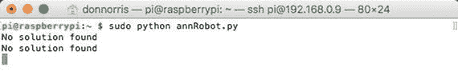

图 7-11.

SSH 会话

机器人的移动开始主要是转弯，偶尔直线行驶。在操作的前一分钟内，机器人遇到了我在比赛场地上放置的障碍物或墙壁，显示了两条“未找到解决方案”的消息。我判断整体运动有些混乱，这是预期的。大约 4 到 5 分钟后，机器人主要进入圆形运动，偶尔直线移动。显然，它学会了这是避开障碍物的最佳方案。它从未停止，尽管停止也是一个选项。

下一个演示是对这个演示的修改。它添加了寻找目标的行为。

## 演示 7-4：寻光机器人

在演示 7-3 中的自主机器人只是在它的环境中四处移动时试图避开障碍物。这次新的冒险通过试图到达一个目标（一个明亮的灯光）给机器人更多的目的性。我将使用一个新的光传感器，以及之前项目中使用的两个超声波传感器。Hopfield 网络将帮助引导机器人到达目的地。这意味着必须创建一个具有适当元素定义的初始输入数据向量。以下向量定义了这个网络：

+   v1 - 光传感器测量（t[0]）

+   v2 - 光传感器测量（t[1]）

+   v3 - 超声波传感器 1

+   v4 - 超声波传感器 2

+   v5 - 左电机

+   v6 - 右电机

我使用 1 和-1 作为向量值，代表每个向量元素的状态，如表 7-4 所示。

表 7-4.

输入数据向量状态定义

| 向量元素 | 值 | 状态描述 |
| --- | --- | --- |
| v1, v2 |  1 | 提高光强度 |
| v1, v2 | –1 | 相同或降低光强度 |
| v3, v4 | 1 | 未检测到物体 |
| v3, v4 | –1 | 检测到物体 |
| v5, v6 | 1 | 电机开启 |
| v5, v6 | –1 | 电机关闭 |

表 7-5 指定了机器人可能会遇到的所有相关向量状态。显示的是 10 种状态，而最大组合数为 36 种。我本可以将所有状态都包括在内，但这会无谓地复杂化计算，而没有任何实际的好处。如果后来认为这些组合有益，总是可以回过头来添加。

表 7-5。

相关向量状态

| 向量元素 |  1 |  2 | 3 | 4 | 5 | 6 | 7 | 8 | 9 | 10 |
| --- | --- | --- | --- | --- | --- | --- | --- | --- | --- | --- |
| v1 |  1 | –1 |  1 | –1 |  1 | –1 |  1  |  1 |  1 |  1 |
| v2 | –1 |  1 | –1 |  1 | –1 |  1 | 1 | 1 | 1 | 1 |
| v3 | –1 | –1 | 1 | 1 | –1 | –1 | –1 | –1 | 1 | 1 |
| v4 | –1 | –1 | –1 | –1 | 1 |  1 | –1 | 1 | –1 | 1 |
| v5 | 1 | –1 | 1 |  1  | –1 | –1 | 1 | –1 | 1 | –1 |
| v6 | 1 | 1 | –1 | –1 | 1 | 1 | 1 | 1 | –1 | –1 |

这是一个非有用或“无关”向量的例子：

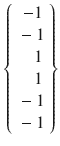

这个向量表示光强度没有变化，没有检测到障碍物，并且两个电机都关闭。这个向量没有传递任何有用的信息来帮助推动机器人到达其最终目的地；因此，它不应该被纳入最终的加权矩阵中。

下一步是对表 7-5 中显示的每个向量进行平方，并将它们全部相加。所有步骤都在图 7-12 中显示。

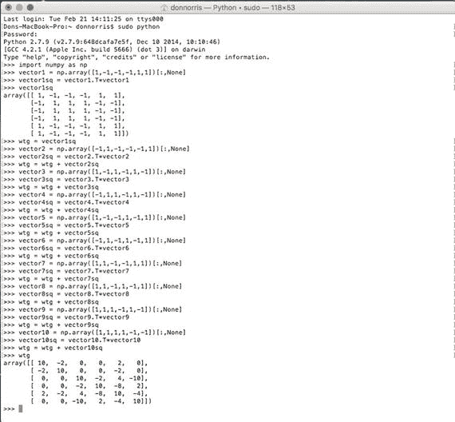

图 7-12。

创建加权矩阵的计算

最终的加权矩阵，命名为`wtg`，如下所示：

```py
>>> wtg
array([[ 10,  -2,   0,   0,   2,   0],
[ -2,  10,   0,   0,  -2,   0],
[  0,   0,  10,  -2,   4, -10],
[  0,   0,  -2,  10,  -8,   2],
[  2,  -2,   4,  -8,  10,  -4],
[  0,   0, -10,   2,  -4,  10]])
```

### 未知数

自主机器人操作中真正的问题之一是它们会遇到你根本无法计划的情况。处理未知数的问题是 Hopfield 网络优于一系列内置规则或预编程例程来处理不同情况的主要原因。为了说明，假设机器人正在正常运行，突然遇到了一个完全阻挡其路径的障碍物。由于未知原因，避障没有起作用，机器人正在与障碍物作斗争。可能地板上有一个开口，驱动轮掉进去，从而停止了前进运动，但未检测到障碍物。

理想的情况是在电机过热和/或完全耗尽电机电源之前停止电机。让我们讨论一下 Hopfield 网络解决方案。以下输入数据向量描述了这种情况：

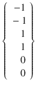

这个向量描述了光强度不变且没有报告障碍物的情况。电机虽然可能仍在运行，但不是已知输入向量的一部分，因此被分配了 0 值。这个向量乘以 wtg 矩阵，得到最终的输出向量：


最终，归一化结果向量中的电机值都是-1，这意味着它们应该被关闭。这正是这个不太可能且未知场景的准确解决方案。正确处理未知因素正是霍普菲尔德网络优于典型机器人控制程序的原因。

下一个部分解释了 Demo 7-4 的最终权重矩阵是如何开发的，以及它与更广泛的大脑映射概念之间的关系。

### 大脑映射

跳频网络与人类大脑之间存在显著的相似性。人类大脑的某些区域负责特定的行为，例如视觉、言语和运动。在某种程度上，某些区域或权重矩阵元素的集合可以与机器人权重矩阵编码的特定行为、功能或感官输入相关联。图 7-13 显示了这些区域映射到权重矩阵上。

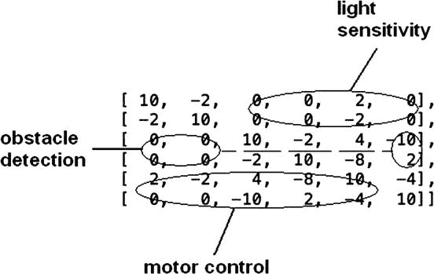

图 7-13。

带有功能和感官输入叠加的权重矩阵

这个叠加很有趣，但以这种方式分割权重矩阵的实际用途是什么？答案在于计算效率。在这个演示中，我专注于与光寻目标直接相关的电机控制功能。这种方法只涉及电机控制向量 v5 和 v6，并且只有八个元素乘法和求和，而处理完整的 36 元素矩阵。

此外，完全有可能针对并更改特定的矩阵值以放大或减弱感官效果或运动控制激活。如果你尝试这个过程，叠加提供了所需的信息。结果矩阵可能会变得不稳定，甚至可能无法达到平衡，正如我之前讨论的那样。无论如何，通过简单地运行程序，可以很容易地重新构建整个权重矩阵。

部分 Hopfield 网络的使用类似于人类大脑在经历中风时可能发生的情况。大脑的某些区域被破坏，但经过一段时间，患者通过治疗和康复能够恢复一些失去的功能，因为大脑网络的部分仍然有效，能够执行这些功能，尽管大脑在中风之前并不完全“启用”。

在我讨论控制程序之前，我将讨论在修改后的机器人车上使用的光强度传感器。

### 光强度传感器

我使用光敏电阻来测量光强度。图 7-14 显示了一个典型的光敏电阻，技术上称为硫化镉（CdS）光电阻。

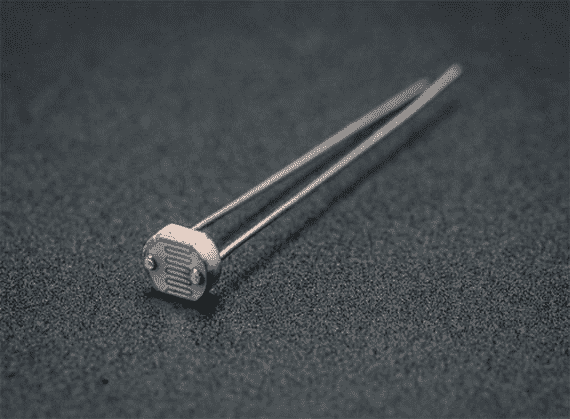

图 7-14.

光敏电阻

光敏电阻也被称为光敏电阻（LDR），因为通过它的电流流动的阻力直接取决于照射其活性表面的光强度。还必须施加电压到光敏电阻和外部电阻上，以产生电流流动和随后的光敏电阻上的电压降。图 7-15 是安装在机器人车上的光敏电阻电路的电路图。

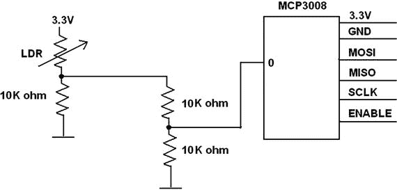

图 7-15.

光敏电阻电路图

MCP3008 ADC 测量的电压是 10K 欧姆串联电阻上的电压降，通过另一个电压分压器减半，以不超过 ADC 的 3.3V 最大输入电压限制。当光敏电阻完全照亮时，从光敏电阻电路中预期的最大电压约为 2.2V。ADC 测量的绝对电压并不重要，因为只需要相对电压比较来判断机器人是接近还是远离光源。只需确保所有测量的电压都位于 ADC 中间范围附近，以避免饱和或截止。

我使用与第六章节能 conservation 项目中相同的 MCP3008 电路。在这种情况下，不是测量电机功率，而是 ADC 测量与照射光敏电阻的光强度相关的电压。提醒一下，MCP3008 使用 SPI 总线与 RasPi 通信。当 RasPi 启动时，必须启用此总线，可以使用第一章节中讨论的 raspi-config 应用程序来完成。

图 7-16 显示了以下演示中使用的完整机器人车的照片。

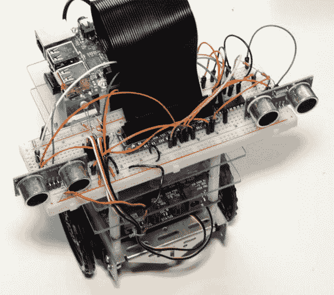

图 7-16.

完整的光寻踪机器人车

如果你仔细观察无焊点面包板的左侧部分，你几乎可以看到插在板上的光敏电阻。这不是一个最佳的位置，正如我在测试运行讨论中解释的那样。

这完成了硬件讨论。现在是时候讨论软件了。

### 寻求目标的机器人汽车的控制脚本

我将这个控制程序命名为 lightSeeker.py，以反映机器人汽车行为的本质。它使用了 annRobot.py 代码的大部分内容，并添加了 MCP3008 接口代码，以及一个处理光传感器的新的模块。我已经从该脚本中删除了所有随机抽取的代码，因为这台机器人的主要目标是寻找光源，而不是避开障碍物。在演示之后，我将讨论当需要寻光和避障时代码更改的影响。

以下代码包含大量注释，以帮助您理解各个部分和模块中发生的情况。

```py
import RPi.GPIO as GPIO
import time
from random import randint
import numpy as np
# next two libraries must be installed IAW appendix instructions
import Adafruit_GPIO.SPI as SPI
import Adafruit_MCP3008
global pwmL, pwmR, mcp
lightOld = 0
hysteresis = 2
# Hardware SPI configuration:
SPI_PORT   = 0
SPI_DEVICE = 0
mcp = Adafruit_MCP3008.MCP3008(spi=SPI.SpiDev(SPI_PORT, SPI_DEVICE))
threshold = 25.4
# use the BCM pin numbers
GPIO.setmode(GPIO.BCM)
# setup the motor control pins
GPIO.setup(18, GPIO.OUT)
GPIO.setup(19, GPIO.OUT)
pwmL = GPIO.PWM(18,20) # pin 18 is left wheel pwm
pwmR = GPIO.PWM(19,20) # pin 19 is right wheel pwm
# must 'start' the motors with 0 rotation speeds
pwmL.start(2.8)
pwmR.start(2.8)
# ultrasonic sensor pins
TRIG1 = 23 # an output
ECHO1 = 24 # an input
TRIG2 = 25 # an output
ECHO2 = 27 # an input
# set the output pins
GPIO.setup(TRIG1, GPIO.OUT)
GPIO.setup(TRIG2, GPIO.OUT)
# set the input pins
GPIO.setup(ECHO1, GPIO.IN)
GPIO.setup(ECHO2, GPIO.IN)
# initialize sensors
GPIO.output(TRIG1, GPIO.LOW)
GPIO.output(TRIG2, GPIO.LOW)
time.sleep(1)
# The following matrix elements are all that are needed
# (and a bit more) to implement the motor control function.
# Read the brain mapping section to see why this is true.
m25 =   2
m26 =  -2
m27 =   4
m28 =  -8
m29 =  10
m30 =  -4
m31 =   0
m32 =   0
m33 = -10
m34 =   2
m35 =  -4
m36 =  10
# robotAction module
def robotAction(select):
global pwmL, pwmR
if select == 0: # drive straight
pwmL.ChangeDutyCycle(3.6)
pwmR.ChangeDutyCycle(2.2)
elif select == 1: # turn left
pwmL.ChangeDutyCycle(2.4)
pwmR.ChangeDutyCycle(2.8)
elif select == 2: # turn right
pwmL.ChangeDutyCycle(2.8)
pwmR.ChangeDutyCycle(3.4)
elif select == 3: # stop
pwmL.ChangeDutyCycle(2.8)
pwmR.ChangeDutyCycle(2.8)
# forever loop
while True:
# light sensor readings
# acquire new reading
lightNew = mcp.read_adc(0)
v7 = 0
# debug
print 'lightNew = ',lightNew, ' lightOld = ',lightOld
# determine if moving toward or away from light source
if lightNew  > (lightOld+hysteresis):
# moving toward the light source
v1 = 1
v2 = -1
elif lightNew = 0:
v5 = 1
else:
v5 = -1
if v6 >  0:
v6 = 1
else:
v6 = -1
# motor control actions based on the new computed vector elements
if v7 == 1:
# stop, light is unchanged
select = 3
robotAction(select)
# debug
print 'stopped'
exit()
elif v5 == 1 and v6 == -1:
# drive straight ahead
select = 0
robotAction(select)
# debug
print 'driving straight ahead'
elif v5 == -1 and v6 == -1:
# randomly select turning left or right
turnRnd = randint(0,1)
if turnRnd == 0:
# turn left
select = 1
robotAction(select)
# debug
print 'turning left'
else:
# turn right
select = 2
robotAction(select)
# debug
print 'turning right'
# pause for a 2 seconds
time.sleep(2)
(End list)
```

### 测试运行

我在之前所有演示都进行的同一个内部走廊进行了测试运行。走廊里没有窗户，所有相邻的门都关着。我在地板上放置了一个明亮的可调式荧光台灯作为光源。机器人汽车被放置在离灯大约四英尺远的地方，并指向灯的方向。我使用 MacBook Pro 笔记本电脑的 SSH 会话启动了测试运行。图 7-17 显示了整个 SSH 会话，整个过程只持续了大约 10 秒，机器人面对着离灯大约两英尺的墙壁。

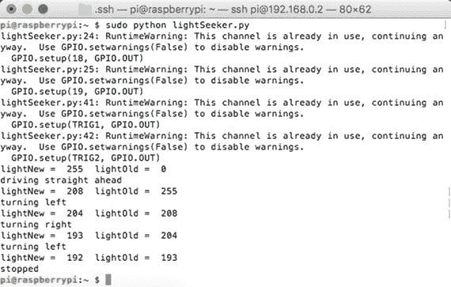

图 7-17。

SSH 会话

我没有考虑走廊的墙壁，墙壁被涂成非常反光的白色；因此，光传感器立即检测到了这一点，机器人开向了墙壁。当它接触到墙壁时，光强度显然没有变化，机器人检测到了这一点，并立即停止——正如它被编程的那样。这一行动表明程序正在正常工作，但光传感器检测环境光而不是光源的方式存在问题。屏蔽光传感器帮助不大，因为它仍然可能会检测到来自墙壁的反射光而不是光源本身。这是因为环境中反射的光比直接从光源发出的光要多。解决这个困境的唯一方法是将走廊的墙壁涂成黑色，但我的妻子不会同意这样做，或者在一个除了光源外没有环境光的地方进行测试。我在傍晚在我的车库里做了后者。空间足够大，以至于任何从墙壁反射的光与来自灯的强烈光线相比都大大减弱。机器人直接开向了灯，然后像预期的那样停止。这一行动证实了程序按预期工作。

在下一节中，我将讨论同时尝试避障和寻光时可能出现的问题。

### 避障和寻光

同时进行障碍物规避和寻找光源是一个难以解决的问题。你可能已经意识到，在尝试寻找光源功能时，我没有在机器人的路径上放置任何障碍物。乍一看，这两个功能似乎是完全相反的，因为障碍物规避脚本会让机器人采取随机行动来清除障碍物，而寻找光源功能则倾向于将机器人驱使得更靠近光源。我承认我在寻找光源脚本中放置了一个关于左转或右转的随机选择，但意图是让机器人直线行驶到光源。那么，如何解决这些冲突的优先级呢？

一种方法是在检测到障碍物时简单地暂停寻找光源功能。如果路径上有障碍物，试图直接驶向光源是没有意义的。在这种情况下，让机器人根据霍普菲尔德网络命令采取随机行动，并尝试以某种方式清除障碍物。一旦清除，再继续寻找光源。这可能不是寻找光源最有效的方法，但可能会成功。

另一种方法是生成一组额外的向量，指示机器人根据光传感器测量和超声波测量采取期望的行动。这些额外的向量无疑会增加权重矩阵的大小，以考虑所有传感器值组合。例如，当光线从高变低并且报告右侧有障碍物时，就需要一个新的向量元素。另一种情况可能是光线保持不变，但两个传感器都报告机器人正前方有障碍物。这将导致机器人停止使用纯寻找光源脚本，但这种情况并不符合你的需求。我想你已经明白了，如果采取这种方法，将涉及复杂性的快速增长。记住，霍普菲尔德网络并非魔法；它需要存储期望的向量以实现良好的结果。

结果表明，霍普菲尔德网络可能不是解决这种障碍规避和目标寻找场景的最佳方案。还有其他人工智能解决方案可以考虑；例如，子吸收架构，其中将优先级分配给不同的行为，这在第十一章中有讨论。障碍物规避行为将被分配比寻找光源行为更高的优先级，机器人会在继续寻找光源行为之前清除任何障碍物。

## 摘要

这本书的第二章是关于机器学习的一系列章节之一。在这一章中，我专注于霍普菲尔德网络，这是人工神经网络（ANN）最简单形式之一。讨论从对霍普菲尔德网络中使用的艺术神经元模型的解释开始。然后，我继续创建一个使用数值矩阵来表示网络的示例网络。

Hopfield 网络的关键属性是它充当关联记忆，类似于人类大脑的功能方式。网络记忆由一个权重矩阵组成，该矩阵由代表感官输入和运动控制动作的数据向量构成。

第一次演示使用了上一章中介绍的同款机器人汽车。演示的目的是展示汽车如何通过含有障碍物的区域。我展示了如何使用 Python 程序脚本创建和更新一个“学习”了适当检测和避开障碍物方式的 Hopfield 网络。脚本中使用了 numpy 库的矩阵函数来简化计算并提高程序效率。

第二次演示采用了不同的方法，通过使用部分 Hopfield 网络权重矩阵来控制机器人在目标寻找实验中的行为。目标是前往光源，使用光电传感器作为主要传感器。超声波传感器被激活，但并非必需，因为机器人的路径上没有放置障碍物。我成功演示了即使是部分 Hopfield 网络也能在这种情况下控制机器人。
