# 8. 机器学习：深度学习

这是机器学习系列的第三章。重点是广义人工神经网络（ANNs）。涵盖这个主题需要大量的背景讨论，其中包含相当数量的数学内容，所以请提前做好准备。在 Raspberry Pi 上的 Python 实现也需要大量的讨论。我尽力保持所有内容既有趣又切中要点。

让我们从一些基本概念简要回顾开始，然后转向使用 Python 和从 numpy 库导入的矩阵算法对更大规模的三层九节点 ANN 进行计算。你还将查看一些传播示例，随后是对梯度下降（GD）的讨论。

本章后面提供了两个演示。第一个演示展示了如何创建一个未训练的 ANN。第二个演示展示了如何训练一个 ANN 以生成有用的结果。本章 9 中展示了使用本章介绍的技术进行的几个实际 ANN 演示。ANN 内容实在太多，无法在一个章节中全部展示。

当你完成本章学习后，你将获得大量关于如何创建有用 ANN 的理论和实践知识。

## 广义 ANN

到目前为止，本书已经对 ANN 主题进行了相当多的讨论，但仍有许多内容需要探讨。在本书的这一阶段，你应该清楚的是，ANN 是人类大脑中许多神经元及其相互连接的数学表示或模型。ANN 基础知识在第二章 2 中进行了讨论。我在第七章 7 中介绍了一种专门化的 ANN，它非常适合简单的机器人应用。然而，ANN 领域非常广泛，还有很多内容需要覆盖。

在本章的标题中，我使用了“深度学习”这个短语，我在第二章 2 中也简要提到了它。深度学习是 AI 从业者常用术语，指多层人工神经网络（ANNs），它们能够通过反复应用训练数据集来学习。图 8-1 展示了一个三层 ANN。

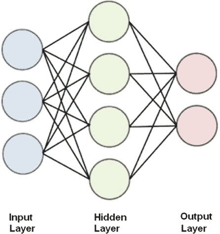

图 8-1。

三层 ANN

下文将解释图 8-1 中显示的层。

+   输入：输入应用于这一层。

+   隐藏：所有未被分类为输入或输出的层都是隐藏的。

+   输出：输出出现在这一层。

所有神经元或节点都是逐层相互连接的。这意味着输入层连接到第一隐藏层中的所有节点。同样，最后一隐藏层中的所有节点都连接到输出节点。

我还把这个网络配置称为广义 ANN，以区别于霍普菲尔德网络，后者是广义的一个特殊情况。霍普菲尔德网络只由单层组成，其中所有节点都作为输入和输出，没有隐藏层。从现在开始，当我提到 ANN 时，我指的是具有多个层的广义类型。

ANN 有两种广泛的类别：

+   前馈：数据流是单向的。节点将数据从一层发送到下一层。

+   反馈：使用反馈回路实现双向数据。

图 8-2 显示了这两种 ANN 类型的模型。

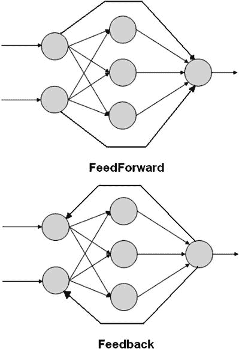

图 8-2。

前馈和反馈人工神经网络（ANN）模型

ANN 的输入只是一个通过网络的数字模式，每个节点将输入求和，如果总和超过阈值值，则节点会触发并输出一个数字到下一个连接的节点。节点之间的连接强度称为权重，正如我在之前的霍普菲尔德网络中描述的那样。确定权重值是 ANN 学习的关键元素。ANN 学习通常发生在将许多训练数据集应用于网络时。这些训练数据集包含输入和输出数据。输入数据创建输出数据，然后与真实输出数据进行比较，当值不一致时会产生错误结果。这些错误数据随后通过 ANN 反馈，并根据预编程的学习算法以增量方式调整权重。在许多训练周期中，通常是数千次，ANN 被训练来计算给定输入的期望输出。这种学习技术称为反向传播。

图 8-3 显示了所有相关权重将节点相互连接的三层 ANN。权重以 w[i,j]的表示形式显示，其中 i 是源节点，j 是接收或目标节点。权重越强，源节点对目标节点的影响就越大。当然，反之亦然。

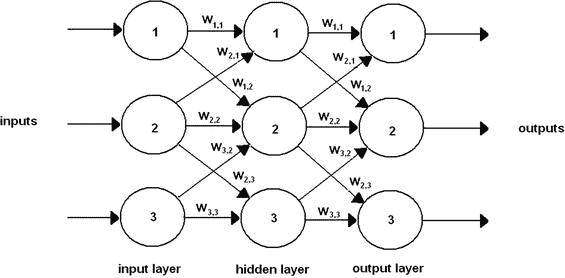

图 8-3。

带权重的三层 ANN

如果你仔细检查图 8-3，你会看到并非所有层与层之间的节点都是相互连接的。例如，输入层节点 1 与隐藏层节点 3 没有连接。如果确定网络无法得到充分的训练，这种情况是可以得到改善的。通过矩阵运算添加更多的节点到节点连接是相当容易的，正如你很快就会看到的。添加更多的连接并不会造成真正的伤害，因为连接权重会被调整。网络被训练到不需要的连接被分配 0 权重值，从而有效地从网络中移除。

在这一点上，实际跟随一个信号路径通过简化的 ANN 是有用的，这样你就能很好地理解这种网络的内部工作原理。我使用一个非常简单的两层、四个节点的网络来进行这个例子，因为它完全满足这个目的。图 8-4 显示了这个网络，它只包含一个输入层和一个输出层。在这个 ANN 中不需要隐藏层。

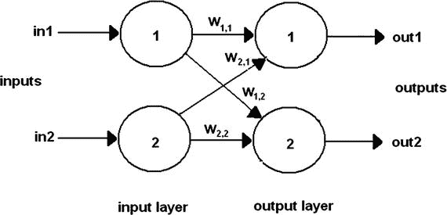

图 8-4.

两层 ANN

现在，让我们将图 8-4 中所示输入和权重赋予以下值，如表 8-1 所列。

表 8-1.

示例人工神经网络（ANN）的输入和权重值

| 符号 | 值 |
| --- | --- |
| in1 | 0.8 |
| in2 | 0.4 |
| w[1,1] | 0.8 |
| w[1,2] | 0.1 |
| w[2,2] | 0.4 |
| w[2,1] | 0.9 |

这些值是随机选择的，不代表也不模拟任何物理情况。通常，权重是随机分配的，目的是更容易促进快速收敛到最优、训练好的解。由于涉及到的输入和权重很少，我认为省略这些实际值的图不是问题。如果你需要，可以轻松地画出带有这些值的图来帮助你理解以下步骤。

我从层 2 的节点 1 开始计算，因为没有在数据输入和输入节点之间发生任何修改。输入节点存在是为了方便网络计算。输入层节点没有直接应用于数据输入集的权重。回想一下第二章的内容，节点会汇总所有来自其相互连接节点的加权输入。在这种情况下，层 2 的节点 1 有来自层 1 中两个节点的输入。因此，加权总和是

w[1,1] * in1 + w[2,1] * in2 = 0.8 * 0.8 + 0.9 * 0.4 = 0.64 + 0.36 = 1.00

接下来，假设激活函数是标准的 sigmoid 表达式，我在第二章中也描述了它。sigmoid 方程是：

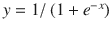 其中 e = 数学常数 2.71828…

当 x = 1.0 时，这个方程变为：

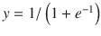 = 1/(1.3679) = 0.7310 或 out1 = 0.7310

对层 2 中的其他节点重复前面的步骤，得到以下结果：

w[2,2] * in2 + w[1,2] * in1 = 0.4*0.4 + 0.1*0.8 = 0.16 + 0.08 = 0.24

令 x = 0.24 得到这个结果：

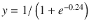 = 1/(1.7866) = 0.5597 或 out2 = 0.5597

对于特定的输入数据集，现在已经确定了两个 ANN 的输出。对于这个极其简单的两层、四个节点的 ANN，进行大量手动计算是合理的。我相信你可以很容易地看出，在没有产生错误的情况下，手动进行这些计算在更大的网络上几乎是不可能的。这正是计算机在执行这些繁琐计算时表现出色的地方，尤其是在大型、多层 ANN 中。我在上一章中使用 numpy 矩阵进行 Hopfield 网络的乘法和点积。类似的矩阵操作也应用于这个网络。这个示例的输入向量只是两个值：in1 和 in2。它们以向量格式表示如下

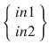

同样，以下是这个权重矩阵：

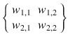

图 8-5 展示了这些矩阵操作在一个交互式 Python 会话中的应用。请注意，只需几条语句就能得到与手动计算完全相同的结果。

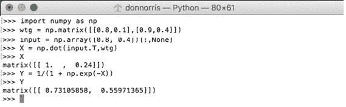

图 8-5.

交互式 Python 会话

下一个示例涉及一个更大的 ANN，它完全由 Python 脚本处理。

### 更大的 ANN

这个示例涉及一个有三层、每层有三个节点的 ANN。ANN 模型如图 8-6 所示，其中包含输入数据集和部分权重值，以避免模糊图示。

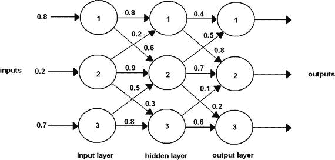

图 8-6.

更大的 ANN

让我们从输入数据集开始，因为它相当简单。如下以向量格式表示：

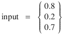

在这个例子中有两个权重矩阵。一个用于表示输入层（wtg[ih]）和隐藏层之间的权重，另一个用于表示隐藏层和输出层之间的权重（wtg[ho]）。权重像之前的示例一样随机分配。

![$$ {\mathrm{wtg}}_{\mathrm{ih}}=\left\{\begin{array}{ccc}\hfill {w}_{1,1}\hfill & \hfill {w}_{1,2}\hfill & \hfill {w}_{1,3}\hfill \\ {}\hfill {w}_{2,1}\hfill & \hfill {w}_{2,2}\hfill & \hfill {w}_{2,3}\hfill \\ {}\hfill {w}_{3,1}\hfill & \hfill {w}_{3,2}\hfill & \hfill {w}_{3,3}\hfill \end{array}\right\}=\left\{\begin{array}{ccc}\hfill 0.8\hfill & \hfill 0.6\hfill & \hfill 0.3\hfill \\ {}\hfill 0.2\hfill & \hfill 0.9\hfill & \hfill 0.3\hfill \\ {}\hfill 0.2\hfill & \hfill 0.5\hfill & \hfill 0.8\hfill \end{array}\right\} $$](img/A436848_1_En_8_Chapter_Equd.gif)

![$$ {\mathrm{wtg}}_{\mathrm{ho}}=\left\{\begin{array}{ccc}\hfill {w}_{1,1}\hfill & \hfill {w}_{1,2}\hfill & \hfill {w}_{1,3}\hfill \\ {}\hfill {w}_{2,1}\hfill & \hfill {w}_{2,2}\hfill & \hfill {w}_{2,3}\hfill \\ {}\hfill {w}_{3,1}\hfill & \hfill {w}_{3,2}\hfill & \hfill {w}_{3,3}\hfill \end{array}\right\}=\left\{\begin{array}{ccc}\hfill 0.4\hfill & \hfill 0.8\hfill & \hfill 0.4\hfill \\ {}\hfill 0.5\hfill & \hfill 0.7\hfill & \hfill 0.2\hfill \\ {}\hfill 0.9\hfill & \hfill 0.1\hfill & \hfill 0.6\hfill \end{array}\right\} $$](img/A436848_1_En_8_Chapter_Eque.gif)

图 8-7 展示了输入到隐藏层的矩阵乘法。结果矩阵在截图中被表示为 X1。

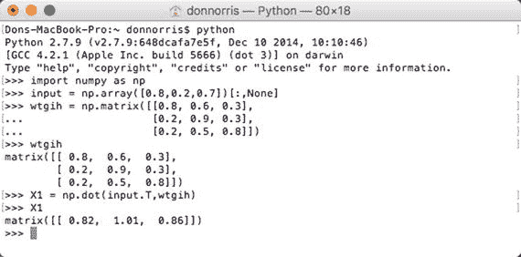

图 8-7.

第一次矩阵乘法

接下来必须应用 sigmoid 激活函数到这个结果上。我将转换后的矩阵称为 O1，以表明它是从隐藏层到实际输出层的输出。结果 O1 矩阵是：

```py
matrix([[ 0.69423634,  0.73302015,  0.70266065]])
```

这些是乘以权重矩阵 wtg[ho] 的值。图 8-8 展示了这次乘法。我将结果矩阵称为 X2，以区别于第一个矩阵。最终的 sigmoid 计算也在截图中被展示，我将其命名为 O2。

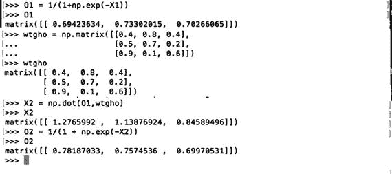

图 8-8.

第二次矩阵乘法

矩阵 O2 也是人工神经网络（ANN）的最终输出，它

```py
matrix([[ 0.78187033,  0.7574536,  0.69970531]])
```

这个输出应该反映输入，让我们比较这两个并计算它们之间的误差或差异。所有这些都在表 8-2 中展示。

表 8-2.

ANN 输出与输入的比较

| 输入 | 输出 | 错误 |
| --- | --- | --- |
| 0.8 | 0.78187033 | 0.01812967 |
| 0.2 | 0.7574536 | -0.5574536 |
| 0.7 | 0.69970531 | 0.00029469 |

结果实际上相当显著，因为其中两个输出非常接近相应的输入值。然而，中间的值偏离很大，这表明至少 ANN 的一些权重必须修改。但是，你该如何做呢？

在我向您展示如何做到这一点之前，请考虑图 8-9 所示的情况。

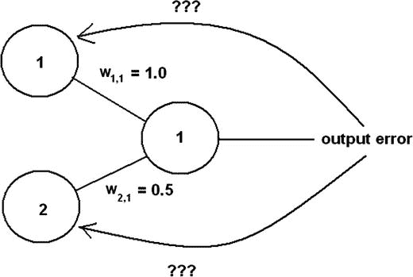

图 8-9.

错误分配问题

在图 8-9 中，两个节点连接到一个具有错误值的输出节点。如何将错误反映回连接节点的权重？在一种情况下，你可以在输入节点之间平均分配错误。然而，这不会准确地反映输入节点对真实错误的贡献，因为节点 1 的权重或影响是节点 2 的两倍。稍加思考应该会引导你找到正确的解决方案，即错误应该按节点连接的权重值成比例分配。在图 8-9 中显示的两个输入节点的情况下，节点 1 应该负责三分之二的错误，而节点 2 应该有三分之一的错误贡献，这正是它们各自权重与分配给输出节点的总和的比率。

这种方式使用权重是权重矩阵的附加功能。通常，权重应用于通过 ANN 向前传播的信号。然而，这种方法使用带有错误值的权重，然后以反向方向传播。这也是为什么错误确定也被称为反向传播。

考虑一下，如果多个输出节点出现错误，这种情况在大多数初始人工神经网络（ANN）启动时很可能是真实的。图 8-10 展示了这种情况。

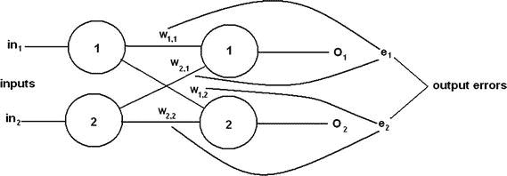

图 8-10。

多个输出节点的错误分配问题

结果表明，对于多个节点，这个过程与单个节点的情况是相同的。这是因为输出节点之间是独立的，没有相互连接的链接。如果不是这样，从相互连接的输出节点反向传播将会非常困难。

分配错误的方程也非常简单。它只是基于连接到输出节点的权重的分数。例如，为了确定图 8-10 中 e[1] 的修正，应用于 w[1,1] 和 w[2,1] 的分数如下：

+   w[1,1]/( w[1,1] + w[2,1]) 和 w[2,1]/( w[1,1] + w[2,1])

同样，以下为 e[2] 的错误。

+   w[1,2]/( w[1,2] + w[2,2]) 和 w[2,2]/( w[1,2] + w[2,2])

到目前为止，根据输出错误调整权重的过程相当简单。由于训练数据提供了正确答案，因此错误很容易确定。对于两层 ANN，这已经足够了。但是，如何处理三层 ANN，其中隐藏层输出肯定存在错误，但没有任何训练数据可用来确定错误值呢？

### 三层 ANN 中的反向传播

图 8-11 展示了一个三层、六个节点的 ANN，每层有两个节点。我故意简化了这个 ANN，以便更容易关注网络所需的有限反向传播。

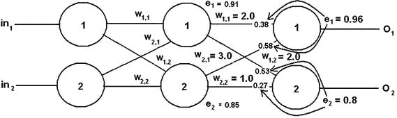

图 8-11。

具有三层、六个节点的神经网络及其误差值

在图 8-11 中，你应该能够看到为这个示例任意创建的输出误差值。隐藏层节点 1 和 2 的个别误差贡献显示在每个输出节点的输入处。这些归一化值计算如下：

+   e[1output1] * w[1,1]/(w[1,1] + w[2,1]) = 0.96 * 2/(2 + 3) = 0.96 * 0.4 = 0.38

+   e[1output2] * w[2,1]/(w[1,1] + w[2,1]) = 0.96 * 3/(2 + 3) = 0.96 * 0.6 = 0.58

+   e[2output1] * w[1,2]/(w[1,2] + w[2,2]) = 0.8 * 2/(2 + 1) = 0.8 * 0.66 = 0.53

+   e[2output2] * w[2,2]/(w[1,2] + w[2,2]) = 0.8 * 1/(2 + 1) = 0.8 * 0.33 = 0.27

每个隐藏节点的总归一化误差值是给定输出节点的个别误差贡献的总和，并按以下方式计算：

+   e[1] = e[1output1] + e[2output1] = 0.38 + 0.53 = 0.91

+   e[2] = e[1output2] + e[2output2] = 0.58 + 0.27 = 0.85

这些值显示在图 8-11 中每个隐藏节点旁边。

上述过程可以根据需要继续进行，以计算任何剩余隐藏层的所有组合误差值。由于输入层必须对所有输入节点为 0，因为它们只是传递输入值而不做任何修改，因此无需计算输入层的误差值。

计算隐藏层误差输出的上述过程相当繁琐，因为它是手动完成的。如果能用类似前馈计算的方式使用矩阵来自动化它，那就好多了。如果将矩阵从手动方法一对一转换，结果如下：


不幸的是，没有合理的方法可以输入前面矩阵中显示的分数。但如果考虑分数实际上做什么，就并非全无希望。它们将节点的误差贡献归一化，这意味着分数转换为介于 0 和 1.0 之间的数字。相对误差贡献也可以通过仅使用权重分子并省略分母来表示为未归一化的数字。结果仍然是可接受的，因为实际上只需要计算一个有用的组合误差值，该值可用于权重更新。我将在下一节中介绍这一点。

移除所有分数的分母得到

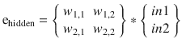

上述矩阵可以使用 numpy 的矩阵运算轻松处理。唯一需要注意的是，在乘法中必须使用矩阵的转置，这再次不是问题。图 8-12 展示了该错误反向传播示例的实际矩阵运算。

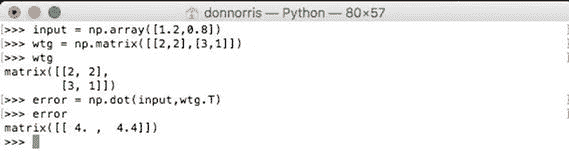

图 8-12。

隐藏层误差矩阵乘法

现在是时候讨论一旦确定了误差，如何更新权重矩阵值了。

### 更新权重矩阵

更新权重矩阵是人工神经网络学习过程的核心。这个矩阵的质量决定了人工神经网络在解决特定人工智能问题时的有效性。然而，在尝试从给定输入和权重数学上确定节点的输出时，存在一个非常显著的问题。考虑以下适用于三层、九节点 ANN 的方程，该 ANN 确定特定输出节点出现的值：

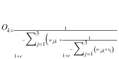

O [k] 是第 k 个节点的输出。

w [j,k] 是输入层和所选输出节点之间所有的连接权重。

x [i] 是输入值。

尽管这个方程只处理一个相对简单的三层、九节点人工神经网络（ANN），但它确实是一个令人敬畏的方程。你可以想象一个六输入、五层 ANN 的可怕方程，而这本身并不是一个很大的 ANN。更大的 ANN 方程可能超出了人类的理解能力。那么，这个难题是如何解决的？

你可以尝试一种暴力搜索的方法，其中一台快速计算机简单地尝试每个权重的一系列不同值。假设每个权重有 1000 个要测试的值，范围从-1 到 1，以 0.002 为增量。在人工神经网络（ANN）中允许使用负权重，0.002 的增量可能足以确定准确的权重。然而，对于我们的三层、九节点 ANN，有 18 个可能的加权链接。由于每个链接有 1000 个值，因此有 18,000 种可能性要测试。这意味着如果计算机每个组合花费一秒钟，则需要大约五小时才能遍历所有组合。对于简单的 ANN 来说，五小时并不算什么，然而，对于更大的 ANN，经过的时间将以指数级增长。例如，在一个非常实用的 500 节点 ANN 中，大约有 5 亿个权重组合。每个组合测试一秒钟将需要大约 16 年才能完成。而且这仅仅是针对一个训练集。想象一下针对数千个训练集所需的时间。显然，必须有一种比使用暴力搜索方法更好的方法。

这个难题的解决方案来自于应用一种名为最速下降的数学方法。这种方法最早由 1847 年的一位名叫奥古斯丁·路易·柯西的法国数学教授提出。他在一篇关于解联立方程组的论文中提出了这个方法。然而，在超过 120 年的时间里，数学家和人工智能研究人员才将其应用于 ANN。一旦这种技术变得众所周知并被理解，ANN 研究领域迅速发展。

这种技术也通常被称为梯度下降，我从这一点开始介绍。梯度下降的底层数学可能有点令人困惑，也有些晦涩，尤其是在应用于 ANN 时。以下边栏深入探讨了梯度下降技术的细节，以便为对这一主题感兴趣的读者提供一个简要的背景。

梯度下降技术考察

这要归功于马特·内德里奇，他在 2014 年初写了一篇优秀的博客，我从这篇博客中借鉴了这次讨论的大部分内容。当时，马特在密歇根州安阿伯的 Atomic Objects 软件咨询公司工作。你可以在[`https://spin.atomicobject.com`](https://spin.atomicobject.com)查看原始博客。

我首先关注的是线性回归这个近亲。这并不是我第一次讨论线性回归。在第二章中，我通过蘑菇的例子讨论了线性预测的概念。线性预测器是一条斜线，其通用方程形式为

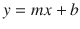

我当时没有提到它，但这个方程通常被用作 x-y 散点图数据的“最佳拟合”预测器，这是线性回归的基础。考虑图 8-13，这也是 Matt 博客中自动化绘图序列的起始 gif。

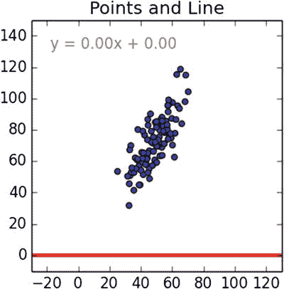

图 8-13。

初始 x-y 散点图

线性回归技术旨在最佳拟合一条通过 x-y 数据点的斜线，以最小化如果单独使用斜线作为给定 x 的 y 预测器的总误差。我建议去博客上点击 gif，看看线寻求最佳拟合位置的自动化序列。在这本书中，我只能用确定斜线位置的数学步骤来继续。

应该有一个起始方程来启动这个线性回归技术的讨论。在这种情况下，它是第二章线性预测模型中使用的斜线方程。


其中 m = 斜率或梯度

b = y 轴截距

一般方法是使用`(m, b)`数据集，然后确定具有这些参数的线如何“拟合”x-y 数据点。这种拟合是通过在数据集中对给定 x 计算 y，然后使用数据集中的真实 y 计算误差来确定的。使用数据集中的所有 x。这个误差通常被称为斜线穿过数据集时的距离。这个误差或距离也被平方，以确保低于线的距离不会抵消高于线的正距离。平方距离还确保整体误差函数可以微分。

下面的 Python 方法实现了这个误差函数：

```py
# y = mx + b
# m is slope, b is y-intercept
def computeErrorForLineGivenPoints(b, m, points):
totalError = 0
for i in range(0, len(points)):
totalError += (points[i].y - (m * points[i].x + b)) ** 2
return totalError / float(len(points))
```

下面的代码实现了一个正式的误差函数：

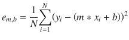

当误差（如前所述的误差函数所计算）达到数据集整体可能的最小值时，斜线生成最佳拟合。现在的技巧是创建一种形式的误差函数，它提供适当的 m 和 b 值，以产生整体最小值。在我深入之前，可视化 m、b 和 e[m,b]之间的关系将是有帮助的。图 8-14 来自博客，清楚地显示了所有变量之间关系的曲线性质。

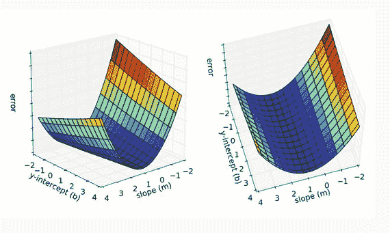

图 8-14。

绘制 m、b 和 e[m,b]图

想象一下将一颗弹珠高高举起放在某个表面上，然后让它沿着斜坡滚动下来可能也有帮助。它应该刚好停在最低点，这个最低点与一个 m 和一个 b 相关联，以及最小误差[m,b]。

运行梯度下降搜索相当于滚动神话中的弹珠下山。进行梯度下降计算的第一步是对误差函数进行两次偏导数运算，因为它有两个独立变量：m 和 b。

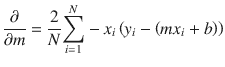

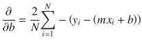

在描述计算最优 m 和 b 值的过程之前，我想先讨论一下全局最小值的概念。图 8-15 是 x 和 y 变量分析连续函数的三维（3D）图。

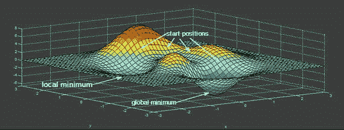

图 8-15。

多重最小值 3D 图

在这个 3D 图中，你可以看到已经识别出两个最小值或山谷。一个比另一个“更深”。最深的最小值被认为是全局最小值，而另一个被称为局部最小值。根据你开始梯度下降的位置，你可能会落在局部最小值上，同时认为它是全局最小值。不幸的是，计算机没有内在的能力去观察如图 8-15 所示的 3D 图像，并找出从哪里开始梯度下降以找到真正的全局最小值。因此，迭代整个独立变量 m 和 b 的范围，采取足够小的步长以找到全局最小值，并拒绝所有局部最小值变得非常重要。很快，你就会看到设置步长成为这个过程的一个重要部分。

所有启动梯度下降所需的部分都已讨论完毕。实际的搜索从设置 m = –1 和 b = 0 开始。这个点可以称为原点，作为一个简单的参考。梯度下降应该根据初始误差函数开始向最优解的下行过程。每次迭代也应提供一个改进的解，直到达到一个误差保持不变或开始增加的点。迭代的方向基于之前显示的两个偏导数。

以下 Python 代码实现了这个梯度下降算法：

```py
def stepGradient(b_current, m_current, points, learningRate):
b_gradient = 0
m_gradient = 0
N = float(len(points))
for i in range(0, len(points)):
b_gradient += -(2/N) * (points[i].y - ((m_current*points[i].x) + b_current))
m_gradient += -(2/N) * points[i].x * (points[i].y - ((m_current * points[i].x) + b_current))
new_b = b_current - (learningRate * b_gradient)
new_m = m_current - (learningRate * m_gradient)
return [new_b, new_m]
```

`learningRate`变量控制了寻找最小值时步长的大小。步长过大，你可能会错过最小值。然而，步长过小会无谓地增加找到最小值前所需的迭代次数。

执行算法从之前提到的原点开始。对于每次迭代，m 和 b 的值都会更新，以产生比前一次迭代略低的错误。在图 18-16 中，左侧图上的点显示了梯度下降搜索的当前位置。右侧图显示了当前 m 和 b 值的最佳拟合线。

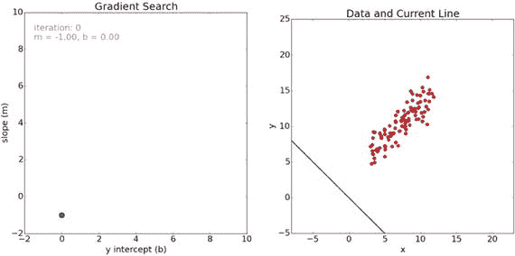

图 18-16.

梯度下降的开始

你可以从右侧的图中清楚地看到，最佳拟合线的初始猜测与实际相差甚远。在下一迭代中，拟合大幅改进，如图 18-17 所示。左侧的图现在显示了从初始点到达当前位置的路径。

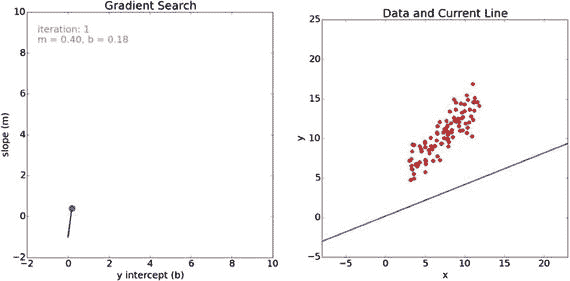

图 18-17.

梯度搜索的第 1 次迭代

在下一次迭代之后，拟合继续改进，如图 18-18 所示。

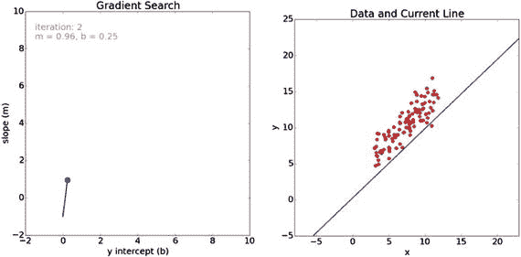

图 18-18.

梯度搜索的第 2 次迭代

最后，经过 100 次迭代后，搜索结果非常接近最佳拟合，如图 18-19 所示。

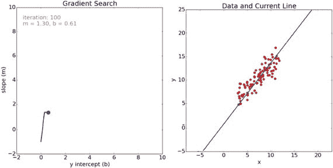

图 18-19.

梯度搜索的第 100 次迭代

你可以从左侧图中显示的路径中看到，在最后一系列迭代中，搜索略微向下和向右跳跃，以寻找全局最小值。

图 18-20 是梯度搜索前 100 次迭代的错误值图。

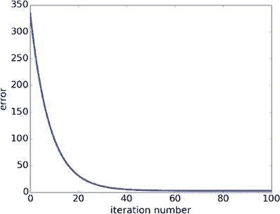

图 18-20.

错误值与迭代次数的对比图

检查梯度搜索的正确操作是件好事。确保随着迭代次数的增加，错误值持续下降。从图表上看，在第 50 次迭代后，错误值非常接近零。这很可能表明存在一个广泛的极小曲面，其中 m 和 b 的值在产生最佳拟合线时不会发生显著变化。

这是使用梯度搜索 100 次迭代得到的最佳拟合线的最终行：

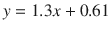

我希望你已经对梯度搜索技术的工作原理有所了解。

## 将梯度下降应用于人工神经网络

图 8-21 很好地总结了将梯度下降技术应用于人工神经网络的情况。它必须通过调整权重 w[i,j]来确定全局最小值，以最小化人工神经网络中存在的整体错误。

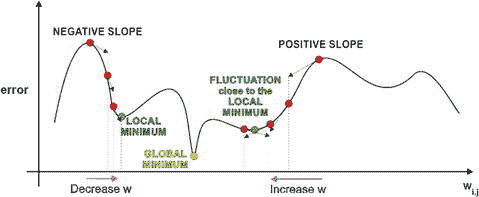

图 8-21.

人工神经网络全局最小值

这种调整成为误差函数关于权重 w[j,k] 的偏导数的一个函数。这个偏导数由这些符号表示：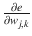。这个导数也是错误函数的斜率。它是沿着斜率下降到全局最小值的梯度下降算法。

图 8-22 展示了以下讨论的基础网络，一个三层、六个节点的 ANN。注意 i、j 和 k 索引，因为它们在执行过程中非常重要。

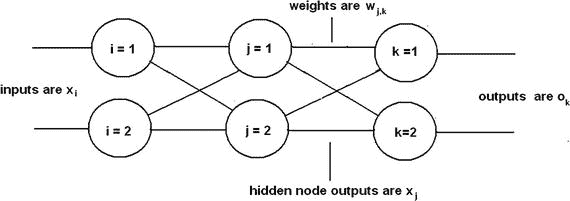

图 8-22。

三层、六个节点 ANN

除了图 8-22 中所示之外，还需要一个额外的符号：输出节点误差，表示为

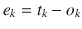

t[k] 是来自训练集的真实或目标值。

o[k] 是由训练集输入 x[i] 值产生的输出。

任何给定节点 n 的总误差是将 n 替换为 k 的前一个方程。因此，整个 ANN 的总误差是所有单个节点误差的总和。误差也平方了，原因在侧边栏中提到。这导致以下错误函数的方程：

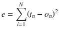

N 是人工神经网络 (ANN) 中的节点总数。

这个错误函数是所需的精确函数，用于对 w[j,k] 进行微分，导致以下形式：

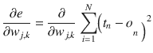

通过注意任何特定节点的错误仅由其输入连接引起，这个方程可以大大简化。这意味着第 k 个节点的输出仅取决于其输入连接上的 w[j,k] 权重。这一认识的作用是消除了错误函数中的求和，因为没有任何其他节点会对第 k 个节点的输出做出贡献。这导致了一个更简单的错误函数：

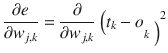

下一步是对函数进行实际的偏导数运算。我简单地通过最小化注释的步骤来得到最终方程，而不延长整个推导过程。

1.  应用链式法则：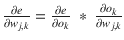

1.  o[k] 与 w[j,k] 无关。第一个偏导数 = 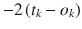

1.  输出 o[k]应用了 sigmoid 函数。第二个偏导数 = 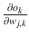 sigmoid 

1.  sigmoid 的微分是 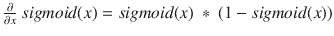

1.  结合：。注意最后一个项是必要的，因为 sigmoid 函数中的求和项。这只是链式法则的另一个应用。

1.  简化：

深吸一口气，这是我经常在严格的微积分课后做的事情。这是用来调整权重的最终方程：


你还应该注意到方程开头去掉的 2。它只是一个缩放因子，对确定误差函数斜率的方向并不重要，而误差函数斜率是梯度下降算法的主要关键。我真心想祝贺那些已经走到这一步的读者。很多人在达到这个阶段所需的数学上遇到了非常大的困难。

现在给这个复杂的方程一个物理解释将非常有帮助。第一部分 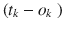 只是误差，这很容易看出。sigmoid 函数内部的求和表达式 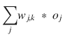 是 k[第]个最终层节点的输入。而最后的项 o[j]是隐藏层中 j[第]个节点的输出。了解这个物理解释应该会使创建其他层到层误差斜率表达式变得容易得多。

我陈述了输入到隐藏层误差斜率方程，而没有让你经历严格的数学推导。这个表达式依赖于刚才提出的物理解释。

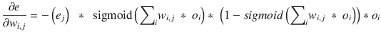

下一步是展示如何使用前面的误差斜率表达式来计算新的权重。实际上，如以下方程所示，这相当简单：

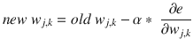

α=学习率

是的，这正是第二章中讨论的相同的学习率，我在那里将其作为线性预测器讨论的一部分引入。学习率很重要，因为设置得太高可能会导致梯度下降错过最小值，而设置得太低会导致许多额外的迭代，降低梯度下降算法的效率。

### 矩阵乘法用于权重变化确定

将所有前面的表达式用矩阵表示将非常有帮助，这是实际计算真实权重变化的方法。以下表达式代表隐藏层和输出层之间误差斜率表达式的矩阵元素之一：


o [j] ^T 是隐藏层输出矩阵的转置。

以下是为三层、六个节点的示例 ANN 的矩阵：

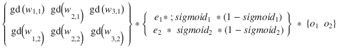

o [1] 和 o [2] 是隐藏层的输出。

这完成了所有必要的预备背景，以便开始更新权重。

## 工作示例

在展示 Python 方法之前，先通过一个手动示例非常重要，这样你才能真正理解当你将其作为 Python 脚本运行时的过程。图 8-23 是图 8-11 的一个略微修改版本，我在其中插入了任意隐藏节点输出值，以便有足够的数据来完成示例。

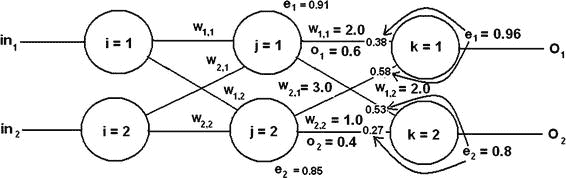

图 8-23。

用于手动计算的示例 ANN

让我们从更新 w [1,1] 开始，这是隐藏层中连接到输出层节点 1 的权重。目前，它的值为 2.0。这是用于这些层链接的错误斜率方程：


如下图中所示，代入值得到：

 = e[1] = 0.96

 = (2.0 * 0.6) + (3.0 * 0.4) = 2.4

sigmoid =  = 0.9168

1 – sigmoid = 0.0832

o [1]= 0.6

将适用的值乘以负号得到：

+   –0.96 * 0.9168 * 0.0832 * 0.6 = –0.04394

假设一个学习率为 0.15，这并不太激进，以下是新权重：

+   2.0 – 0.15 * (–0.04394) = 2.0 + 0.0066 = 2.0066

这与原始版本的变化不大，但你必须记住，在达到全局最小值之前，会进行数百甚至数千次迭代。小的变化会迅速积累，导致权重发生相当大的变化。

网络中的其他权重可以按照演示的方式进行调整。

关于人工神经网络（ANN）学习效果的重要问题，我将在下文中进行讨论。

### ANN 学习问题

你应该意识到，并不是所有的 ANN 都能很好地学习，就像并不是所有人都能以相同的方式学习。幸运的是，对于 ANN 来说，这与智能无关，而是与更平凡的与 sigmoid 激活函数直接相关的事项有关。图 8-24 是图 2-12 的修改版本，显示了 sigmoid 函数的输入和输出范围。


图 8-24.

注释的 sigmoid 函数

观察图 8-24，你应该看到如果 x 输入值大于 2.5，y 输出值变化非常小。这是因为 sigmoid 函数在 x 值附近渐近地接近 1.0。对于大的输入变化来说，小的变化意味着梯度变化非常小。在这种情况下，ANN 学习被抑制，因为梯度下降算法依赖于存在合理的斜率。因此，ANN 训练集应限制输入 x 值在约 -3 到 3 的伪线性范围内。x 值超出这个范围会导致 ANN 学习饱和，并且不会发生有效的权重更新。

以类似的方式，sigmoid 函数不能输出大于 1 或小于 0 的值。这些范围内的输出值是不可能的，权重必须适当缩放，以便始终保持允许的输出范围。实际上，由于前面描述的渐近性质，输出范围应该是 0.01 到 0.99。

### 初始权重选择

根据刚才讨论的问题，我相信你可能意识到选择一组好的 ANN 初始权重非常重要，这样学习就可以发挥作用，而不会遇到输入饱和或输出限制问题。显然的选择是将权重选择限制在我之前提到的伪线性范围内（即，±3）。通常，权重进一步限制在±1，以更加保守。

这些年来，AI 研究人员和数学家已经制定了一条“经验法则”：

权重应最初使用正态分布分配，其平均值等于 ANN 中节点数的平方根的倒数。

对于我之前使用的 36 节点、三层 ANN，平均值是$$ \frac{1}{\sqrt{36}} $$或 0.16667。图 8-25 显示了具有此平均值和±2 近似标准差的正态概率分布。


图 8-25。

36 节点 ANN 的初始权重正态分布

在大约-0.5 到 0.8333 的范围内随机选择权重将很好地为 36 节点网络的 ANN 学习提供一个良好的起点。

最后，你应该避免将所有权重设置为相同的值，因为 ANN 学习依赖于不均匀的权重分布。显然，也不要将所有权重设置为 0，因为这会完全禁用 ANN。

这最后一部分完成了我对 ANN 的所有背景讨论。现在是时候在 Raspberry Pi 上使用 Python 生成一个完整的 ANN 了。

## 演示 8-1：ANN Python 脚本

这个第一个演示向您展示了如何使用 Python 创建一个未训练的 ANN。我首先讨论构成 ANN 的模块。一旦完成，所有模块都被放入一个操作包中，然后运行脚本。要讨论的第一个模块是创建和初始化 ANN 的那个模块。

### 初始化

此模块的结构在很大程度上取决于要构建的 ANN 类型。在这个演示中，我正在构建一个三层、九节点的 ANN，这意味着必须有代表每一层的对象。此外，还需要创建并适当标记输入、输出和权重。表 8-3 详细说明了此模块所需的对象和引用。

表 8-3。

初始化模块对象和引用

| 名称 | 描述 |
| --- | --- |
| inode | 输入层中的节点数 |
| hnode | 隐藏层中的节点数 |
| onode | 输出层中的节点数 |
| wtgih | 输入层和隐藏层之间的权重矩阵 |
| wtgho | 隐藏层和输出层之间的权重矩阵 |
| wij | 单个权重矩阵元素 |
| 输入 | 输入数组 |
| 输出 | 输出数组 |
| ohidden | 隐藏层输出数组 |
| lr | 学习率 |

基本初始化模块结构开始如下：

```py
def __init__ (self, inode, hnode, onode, lr):
# Set local variables
self.inode = inode
self.hnode = hnode
self.onode = onode
self.lr = lr
```

您需要使用为创建 ANN 正确的值来调用 `init` 模块。对于具有三个层、九个节点的网络和适中的学习率，值如下：

+   inode = 3

+   hnode = 3

+   onode = 3

+   lr = 0.25

接下来要讨论的是如何根据所有之前的背景讨论创建和初始化关键权重矩阵。我使用正态分布来生成权重，均值为 0.1667，标准差为 0.3333。幸运的是，numpy 有一个非常棒的函数可以自动化此过程。要创建的第一个矩阵是 wtgih，其维度为 inode × hnode，或在我们的例子中为 3 × 3。

下一个 Python 语句生成此矩阵：

```py
self.wtgih = np.random.normal(0.1667, 0.3333, self.hnodes, self.inodes)
```

以下是从上一个语句生成的交互会话的样本输出：

```py
>>>import numpy as np
>>>wtgih = np.random.normal(0.1667, 0.3333, [3, 3])
>>>wtgih
array([[ 0.44602141,  0.58021837,  0.00499487],
[ 0.40433922, -0.31695922, -0.40410581],
[ 0.63401073, -0.37218566,  0.14726115]])
```

生成的矩阵 `wtgih` 形状良好，起始值优秀。

在这一点上，可以使用前面显示的矩阵生成语句完成 `init` 模块的编写。

```py
def __init__ (self, inode, hnode, onode, lr):
# Set local variables
self.inode = inode
self.hnode = hnode
self.onode = onode
self.lr = lr
# mean is the reciprocal of the sq root total nodes
mean = 1/(pow((inode + hnode + onode), 0.5)
# standard deviation (sd) is approximately 1/6 total weight range
# total range = 2
sd = 0.3333
# generate both weighting matrices
# input to hidden layer matrix
self.wtgih = np.random.normal(mean, sd, (hnode, inode])
# hidden to output layer matrix
self.wtgho = np.random.normal(mean, sd, [onode, hnode])
```

在这一点上，我引入了一个第二个模块，它允许在由 `init` 模块创建的网络上进行一些简单的测试。这个新模块被命名为 `testNet` 以反映其目的。它接受一个输入数据集或元组（Python 术语），并返回一个输出集。以下过程在模块中运行：

1.  输入数据元组转换为数组。

1.  数组乘以 wtgih 权重矩阵。现在这是隐藏层的输入。

1.  这个新数组随后通过 sigmoid 函数进行调整。

1.  隐藏层的调整数组乘以 wtgho 矩阵。现在这是输出层的输入。

1.  这个新数组随后通过 sigmoid 函数进行调整，得到最终的输出数组。

模块列表如下：

```py
def testNet(self, input):
# convert input tuple to an array
input = np.array(input, ndmin=2).T
# multiply input by wtgih
hInput = np.dot(self.wtgih, input)
# sigmoid adjustment
hOutput = 1/(1 + np.exp(-hInput))
# multiply hidden layer output by wtgho
oInput = np.dot(self.wtgho, hOutput)
# sigmoid adjustment
oOutput = 1/(1 + np.exp(-oInput))
return oOutput
```

### 测试运行

图 8-26 显示了我在一个 Raspberry Pi 3 上运行的交互 Python 会话，以测试此初步代码。


图 8-26。

交互 Python 会话

`init` 和 `testNet` 模块都是名为 ANN 的类的一部分，而该类又位于名为 ANN.py 的文件中。我首先启动 Python 并从文件中导入该类，以便解释器能够识别类名。接下来，我创建了一个名为 ann 的对象，所有节点都设置为 3，学习率等于 0.3。学习率目前不需要，但它必须存在，否则您无法实例化对象。实例化对象的行为会自动运行 `init` 模块。它期望所有三个节点的大小值和一个学习率值。

我接下来使用三个输入值运行了`testNet`模块。这些值如表 8-4 所示，以及相应的计算输出值。我还包括了手动计算的错误值。

表 8-4。

初始测试

| 输入 | 输出 | 误差 | 百分误差 |
| --- | --- | --- | --- |
| 0.8 | 0.74993428 | –0.05006572 | 6.3 |
| 0.5 | 0.52509703 | 0.02509703 | 5.0 |
| 0.6 | 0.60488966 | 0.00488966 | 0.8 |

考虑到这是一个完全未训练的 ANN，误差并不太多。下一节将讨论如何训练 ANN 以极大地提高其准确性。

## 示例 8-2：训练 ANN

在这个演示中，我向您展示如何使用名为`trainNet`的第三个模块来训练 ANN，该模块已被添加到 ANN 类定义中。该模块的功能与`testNet`函数非常相似，通过基于输入数据集计算输出集。然而，`trainNet`模块的输入数据是一个预定的训练集，而不是我刚才演示的任意数据元组。这个新模块还通过比较 ANN 的输出与输入并使用差异来训练网络来计算错误集。输出计算的方式与`testNet`模块中完全相同。`trainNet`的参数现在包括一个输入列表和一个训练列表。以下语句从列表参数创建这些数组：

```py
def trainNet(self, inputT, train):
# This module depends on the values, arrays and matrices
# created when the init module is run.
# create the arrays from the list arguments
self.inputT = np.array(inputT, ndmin=2).T
self.train = np.array(train, ndmin=2).T
```

如前所述，误差是训练集输出与实际输出之间的差异。k[th]输出节点的误差方程如前所述是：


输出误差的矩阵表示法是

```py
self.eOutput = self.train - self.oOutput
```

对于这个示例 ANN，隐藏层误差的矩阵表示法是


以下是用 Python 语句生成此数组的语句：

```py
self.hError = np.dot(self.wtgho.T, self.eOutput)
```

以下是为调整第 j[th]层和第 k[th]层之间的链接而更新的方程，如前所示：


新的 gd(w[j,k])数组必须添加到原始数组中，因为这些是对原始数组的调整。前面的方程可以简洁地封装成以下单个 Python 语句：

```py
self.wtgho += self.lr * np.dot((self.eOutput * self.oOutputT * (1 - self.oOutputT)), self.hOutputT.T)
```

编写输入层和隐藏层之间权重更新的代码使用的是完全相同的格式。

```py
self.wtgih += self.lr * np.dot((self.hError * self.hOutputT * (1 - self.hOutputT)), self.inputT.T)
```

将所有前面的代码段以及之前的模块组合在一起，产生了 ANN.py 列表。请注意，我已经为每个段落的函数添加了注释，以及额外的调试语句。

```py
import numpy as np
class ANN:
def __init__ (self, inode, hnode, onode, lr):
# set local variables
self.inode = inode
self.hnode = hnode
self.onode = onode
self.lr = lr
# mean is the reciprocal of the sq root of the total nodes
mean = 1/(pow((inode + hnode + onode), 0.5))
# standard deviation is approximately 1/6 of total range
# range = 2
stdev = 0.3333
# generate both weighting matrices
# input to hidden layer matrix
self.wtgih = np.random.normal(mean, stdev, [hnode, inode])
print 'wtgih'
print self.wtgih
print
# hidden to output layer matrix
self.wtgho = np.random.normal(mean, stdev, [onode, hnode])
print 'wtgho'
print self.wtgho
print
def testNet(self, input):
# convert input tuple to an array
input = np.array(input, ndmin=2).T
# multiply input by wtgih
hInput = np.dot(self.wtgih, input)
# sigmoid adjustment
hOutput = 1/(1 + np.exp(-hInput))
# multiply hidden layer output by wtgho
oInput = np.dot(self.wtgho, hOutput)
# sigmoid adjustment
oOutput = 1/(1 + np.exp(-oInput))
return oOutput
def trainNet(self, inputT, train):
# This module depends on the values, arrays and matrices
# created when the init module is run.
# create the arrays from the list arguments
self.inputT = np.array(inputT, ndmin=2).T
self.train = np.array(train, ndmin=2).T
# multiply inputT array by wtgih
self.hInputT = np.dot(self.wtgih, self.inputT)
# sigmoid adjustment
self.hOutputT = 1/(1 + np.exp(-self.hInputT))
# multiply hidden layer output by wtgho
self.oInputT = np.dot(self.wtgho, self.hOutputT)
# sigmoid adjustment
self.oOutputT = 1/(1 + np.exp(-self.oInputT))
# calculate output errors
self.eOutput = self.train - self.oOutputT
# calculate hidden layer error array
self.hError = np.dot(self.wtgho.T, self.eOutput)
# update weight matrix wtgho
self.wtgho += self.lr * np.dot((self.eOutput * self.oOutputT * (1 - self.oOutputT)), self.hOutputT.T)
# update weight matrix wtgih
self.wtgih += self.lr * np.dot((self.hError * self.hOutputT * (1 - self.hOutputT)), self.inputT.T)
print 'updated wtgih'
print wtgih
print
print 'updated wtgho'
print wtgho
print
```

### 测试运行

图 8-27 展示了一个人机交互的 Python 会话，其中我实例化了一个三层、九节点的 ANN，学习率等于 0.20。


图 8-27。

交互式 Python 会话

我在 ANN 脚本中包含了一些调试打印语句，这允许直接比较初始权重矩阵和更新后的矩阵。你应该看到它们之间只有微小的变化，这正是预期和希望的。一个重要的事实是，梯度下降通过使用小的增量来避免错过全局最小值而工作得很好。在这个会话中，我只能进行一次迭代，因为代码没有设置为多迭代。

恭喜你一直跟随着我到这一点！我涵盖了关于 ANN 基础和实现的大量主题。你现在应该已经完全准备好理解和欣赏下一章中展示的有趣的实用 ANN 演示了。

## 摘要

这是关于人工神经网络（ANNs）的四个章节中的第三个。在本章中，我专注于深度学习，这实际上不过是多层 ANN 背后的基础和概念。

在简要回顾了一些基础知识之后，我逐步手动计算了一个两层、六个节点的 ANN。随后，我使用 Python 脚本重新进行了这些计算。

接下来是对一个更大、三层、九节点的 ANN 的计算。这些计算完全使用 Python 和从 numpy 库导入的矩阵算法完成。

我讨论了未训练的 ANN 中存在的错误以及它们是如何传播的。了解这一点很重要，因为它构成了用于调整权重以优化 ANN 的逆向传播技术的基础。

接下来，我进行了一个完整的反向传播示例，说明了如何更新权重以减少整体网络错误。随后是一个侧边栏，其中介绍了使用线性回归示例的梯度下降（GD）技术。

接下来是对将梯度下降（GD）算法应用于示例 ANN 的应用进行了讨论。GD 算法通过尝试找到全局最小值来使用误差函数的斜率，这对于实现性能良好的 ANN 是必要的。

我提供了一个完整的示例，说明了如何使用 GD 算法更新权重。讨论了 ANN 学习和初始权重选择的问题。

本章以一个详尽的 Python 脚本为例结束，该脚本初始化并训练任何大小的人工神经网络（ANN）。
