# 9. 机器学习：实用的 ANN 演示

这是探索机器学习的系列中的最后一章。我展示了基于前几章讨论的概念和 Python 实现的两个实际的人工神经网络（ANN）的例子。您应该至少回顾前两章的内容，以便从阅读和复制本章的演示中获得最大收益。

我非常感谢 Tariq Rashid，他的书籍《Make Your Own Neural Network》（CreateSpace Independent Publishing Platform，2016 年）为我准备本书和其他章节提供了灵感和指导。我强烈推荐 Tariq 的书籍给那些希望深入了解实际 ANN 的读者。Tariq 还有一个博客在[`http://makeyourownneuralnetwork.blogspot.co.uk/`](http://makeyourownneuralnetwork.blogspot.co.uk/)，我发现这是一个非常有用的信息来源和充满活力的讨论平台。

本章的演示主要集中在识别手写数字上。它们是经典的 ANN 项目，充分展示了 ANN 的学习能力。

## 零件清单

您需要额外的部分来进行演示，这些部分在表 9-1 中有详细说明。

表 9-1。

零件清单

| 描述 | 数量 | 备注 |
| --- | --- | --- |
| Pi Cobbler | 1 | 40 针版本，T 或 DIP 形式均可接受 |
| 无焊面包板 | 1 | 700 个插入点，带 1 个电源条 |
| 跳线 | 1 包 |  | |
| 220Ω电阻 | 1 | 1/4 瓦 |
| LED | 1 |  | |
| Pi 相机 | 1 | 版本 2 |
| 触觉按钮开关 | 1 | 带无焊连接 |

## 演示 9-1：MNIST 数据集

我将向您展示一个人工神经网络（ANN）如何识别手写数字。本项目使用的训练和测试数据直接来自两个混合国家标准与技术研究院（MNIST）数据库。这些数据库多年来一直被广泛用于训练和测试 ANN，并且是评估特定 ANN 完成特定任务准确性的一个公认标准。

MNIST 数据库的起源来自于 500 人手写的数字符号输入图像，其中一半是美国人口普查局的员工，另一半是高中生。原始的黑白图像也被标准化以适应 20 × 20 像素图像边界块，并进一步抗锯齿，这为每个像素生成了一个字节的灰度值。这究竟意味着什么将在稍后向您解释清楚。

MNIST 数据集相当大，包括 60,000 个训练图像（104MB）和 10,000 个测试图像（18MB）。这两个数据集都可以从以下网站免费获取，以逗号分隔值（CSV）格式：

+   训练集：[`http://www.pjreddie.com/media/files/mnist_train.csv`](http://www.pjreddie.com/media/files/mnist_train.csv)

+   测试集：[`http://www.pjreddie.com/media/files/mnist_test.csv`](http://www.pjreddie.com/media/files/mnist_test.csv)

训练集应用于训练人工神经网络（ANN）。所有包含的记录都有标签，这意味着 CSV 数据与它所代表的图像相对应。测试集用于检查 ANN 在识别测试 CSV 数据方面的表现。测试数据集还包含标签，作为验证 ANN 是否成功识别正确数字的辅助。将训练数据与测试数据分开总是个好主意，因为如果训练数据也是测试数据，ANN 可能会返回存储的模式。这种情况并不能很好地表明 ANN 实际上学习得如何。

图 9-1 显示了由运行在我的 MacBook Pro 上的十六进制编辑器应用程序显示的训练数据集中的第一条记录的开头部分。

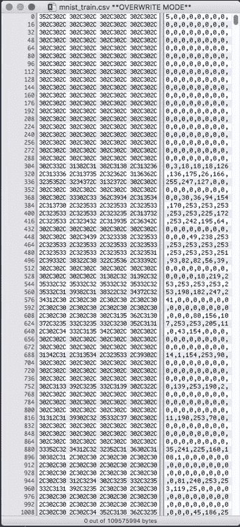

图 9-1.

MNIST 训练数据集的第一条记录的一部分

一张图像由 784 个字节组成，因为数据库中的每张图像都已被调整到 28 × 28 像素或总共 784 个像素。每个像素值代表一个像素的等效灰度值。一个字节的数值范围是 0 到 255，其中 0 是全白，255 是全黑。因此，每个数据库图像由 784 个像素值、785 个逗号和 1 个用于标签的字节组成，总共 1570 个字节。虽然单个这样的记录处理起来并不困难，但一个文件中超过 60,000 个这样的记录往往会超载大多数程序，尤其是那些预期在树莓派上运行的程序。幸运的是，较大的 MNIST 训练和测试数据集都有两个非常小的子集，这些子集可以在以下网站上找到：

+   测试数据集 [`raw.githubusercontent.com/makeyourownneuralnetwork/makeyourownneuralnetwork/master/mnist_dataset/mnist_test_10.csv`](https://raw.githubusercontent.com/makeyourownneuralnetwork/makeyourownneuralnetwork/master/mnist_dataset/mnist_test_10.csv)

+   训练数据集 [`raw.githubusercontent.com/makeyourownneuralnetwork/makeyourownneuralnetwork/master/mnist_dataset/mnist_train_100.csv`](https://raw.githubusercontent.com/makeyourownneuralnetwork/makeyourownneuralnetwork/master/mnist_dataset/mnist_train_100.csv)

我使用十六进制编辑器打开了两个下载的数据集，它们看起来都很正常。然而，要在 Python 脚本中使用这些数据，你需要使用一些语句来访问这些数据集。以下 Python 语句创建了一个名为 `dataFile` 的文件对象，将数据逐行读入一个名为 `dataList` 的列表对象，并最终关闭文件。这些语句类型是使用 Python 读取数据文件的非常常见的方式：

```py
dataFile = open("mnist_train_100.csv")
dataList = dataFile.readlines()
dataFile.close()
```

图 9-2 显示了在树莓派上使用前面的语句创建 `dataList` 对象的交互式会话。

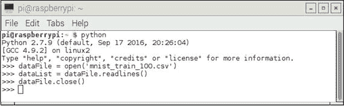

图 9-2.

创建 dataList 对象的交互式 Python 会话

我在 MNIST 数据集所在的同一目录中运行了 Python 会话。如果你没有在同一个目录中拥有数据集，那么你必须将适当的路径添加到 MNIST 数据集名称之前，以避免 Python 找不到文件的错误。

一旦数据被读取，你就可以开始检查数据。我输入了`len(dataList)`来找出被放入`dataList`对象中的记录数。返回值是`100`，正如预期的那样。图 9-3 展示了这一语句以及第一个记录的显示，这是通过输入`dataList[0]`来实现的。

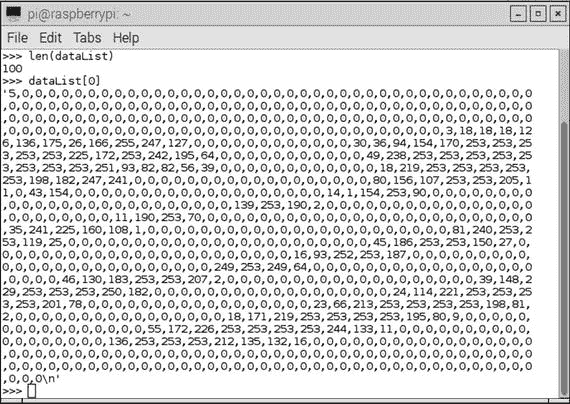

图 9-3。

dataList 属性

如果你仔细检查图中的`datalist[0]`显示，你可能看到数据以撇号开始和结束。这表明`dataList[0]`记录被 Python 解释器识别为字符串。它看起来像数字，但根据 Python，它被认为只是一个 ASCII 字符的字符串。结束撇号前的字符是`\n`，这是“转义”的字母`n`。这告诉 Python 第一个记录结束，并且它应该在这一点放置一个新行。换行符是记录集的分隔符，告诉 Python 一个记录在哪里结束，下一个记录在哪里开始。所有 100 条记录都是索引的，这意味着可以通过使用列表名称旁边的适当索引号单独访问它们，就像我用来访问第一个记录（即`dataList[0]`）那样。索引是从 0 开始的，在这个例子中范围从 0 到 99。

接下来，我将向你展示如何想象一个记录，而不仅仅是看那些毫无意义的数字。

### 想象一个 MNIST 记录

实际上，使用几个 Python 命令来想象一个数据记录相当容易。我使用 Python GUI IDLE 2 来完成下一步。一个 GUI 环境是必要的，以便显示结果图像。如果你愿意，可以使用 Python 3 GUI，但需要修改以下 Python 3 的安装语句。需要 matplotlib 库来创建和显示图像；更具体地说，是包含在 matplotlib 库中的 pyplot 包中的`imshow`和`show`方法。输入以下命令来安装 matplotlib 库：

```py
sudo apt-get update
sudo apt-get install python-matplotlib
```

安装完成后，你就可以输入下一步的命令来读取来自 100 条记录的简略数据集。输入以下命令：

```py
import numpy as np
import matplotlib.pyplot as plt
dataFile = open('mnist_train_100.csv')
dataList = dataFile.readlines()
dataFile.close()
```

前两个导入命令在数据读取部分不是必需的，但我总是希望将任何导入语句放在代码块的开头。`dataFile`逻辑引用是通过 open 语句创建的，它指向 100 条记录文件的开始。实际的读取是通过下一个语句完成的，该语句将 100 个单独的记录读入名为`dataList`的列表对象中。`readlines`方法只是逐个字符读取，直到遇到换行符（`\n`）。在那个瞬间，它为列表创建一个新的记录，并继续逐个字符的读取，直到遇到文件结束（EOF）字符，这会停止读取过程。`close`方法只是“销毁”`dataFile`逻辑引用，这样文件就不会被意外修改。

一旦数据集存储在内存中，脚本就会设置为对选定的记录进行图像化。以下代码实现了这一目标：

```py
record0 = dataList[0].split(',')
imageArray = np.asfarray(record0[1:]).reshape((28, 28))
plt.imshow(imageArray, cmap='Greys', interpolation='None')
plt.show()
```

第一个命令创建了一个名为`record0`的小列表对象，它包含读入大`dataList`对象中的第一个记录的所有 785 个元素。`record0`对象中有 785 个单独的列表元素，因为`split`方法通过使用逗号分隔符作为分隔的指示符来创建了它们。第二个命令使用`imshow`方法创建要显示的图像。它从第二个列表元素开始，它是一个 28 × 28 像素的灰度图像。注意`imshow`参数列表中的`Greys`的拼写。最后，`show`方法实际上在 IDLE 2 GUI 中显示了图像。

图 9-4 显示了在 IDLE 2 GUI 中运行的所有先前命令。

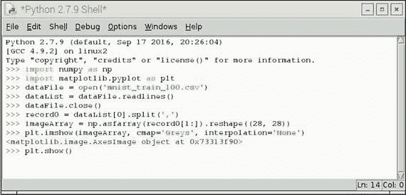

图 9-4。

IDLE 2 GUI 交互式 Python 会话

结果的数字图像在图 9-5 中展示。

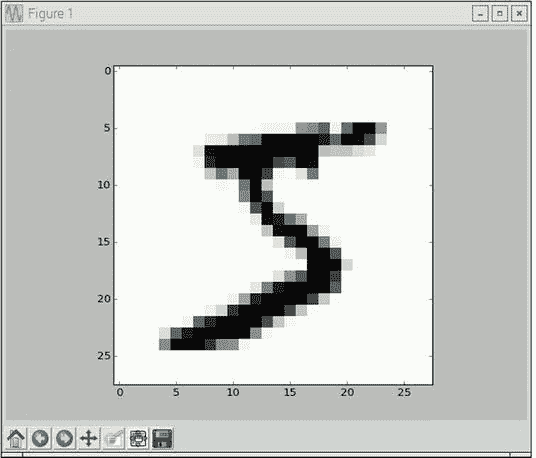

图 9-5。

数字图

如您所见，图中展示的是一个相当随意书写的数字 5，这是用于训练 ANN 的众多记录之一。顺便提一下，如果您回顾一下图 9-1，您会看到数字 5 作为第一个记录的标签，这证实了记录的身份。

在这一点上，我将讨论如何准备数据集，以便它们可以有效地与 ANN 一起使用。

### 调整输入和输出数据集

您当然知道所有 MNIST 数据集包含从 0 到 255 的值，这远远超出了我迄今为止开发的任何 ANN 可以接受的范围。输入值应该在 0.01 到 1.0 的优选范围内，这与 sigmoid 函数的输入要求非常吻合。以下 Python 语句调整 MNIST 数据集记录的值范围，以匹配 ANN 输入数据集的优选范围：

```py
adjustedRecord0 = (np.asfarray(record0[1:]) / 255.0 * 0.99) + 0.01
```

图 9-6 显示了在交互式 Python 会话中创建的调整后的记录集。记录集的一部分也显示在屏幕截图上，确认新的 MNIST 值在所需的输入值范围内。

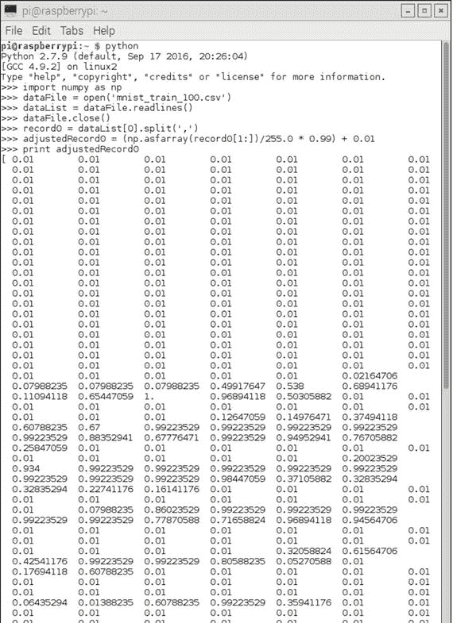

图 9-6。

调整 MNIST 数据集

前面的讨论解决了输入问题，但输出数据集应该是什么样子呢？答案在于考虑 ANN 所服务的目的。它的目的是识别一个值在 0 到 9 之间的手写数字。因此，ANN 仅输出与识别的数字相关联的输出节点附近的高值是有意义的。以下理想的输出数组显示了 ANN 检测到了一个手写数字 5。

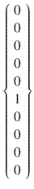

这样的数组中的实际值不会是 0 或 1，而是接近 0 的低识别值和接近 1 的高识别值。也有可能 ANN 在多个节点上输出中间值，例如 0.4 和 0.6，这表明 ANN 不能选择一个独特的值，而是“认为”输入数字可能是几个候选者之一。这与人类无法决定因果写出的数字是什么的情况非常相似，例如将 4 与 9 混淆。

以下代码段创建了一个样本训练数组，该数组用于更新 ANN 权重，以便它可以识别特定的数字。让我们使用之前讨论的现实输入值创建小 MNIST 训练数据集的第一条记录的训练数组。Python 代码非常简单，如下所示：

```py
import numpy as np
dataFile = open('mnist_train_100.csv')
dataList = dataFile.readlines()
dataFile.close()
record0 = dataList[0].split(',')
onodes = 10
train = np.zeros(onodes) + 0.01
train[int[record0[0]] = 0.99
print train
```

到现在为止，前面的程序段应该对你来说非常熟悉，除了最后几行。以下行创建了一个包含所有值为 0.01 的 10 元素数组：

```py
train = np.zeros(onodes) + 0.01
```

接下来，以下行取第一条记录中的第一个元素（标签）并将其转换为整数，然后将其设置为 0.99：

```py
train[int([record0[0])] = 0.99
```

图 9-7 显示了在交互式 Python 会话中运行的上述代码段。

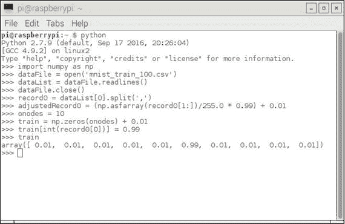

图 9-7。

创建训练数组交互会话

你可以清楚地看到创建的训练数组，其中第六个元素被设置为 0.99，因为标签等于 5。

现在数据集输入和训练集已经开发出来，是时候关注如何配置这个 ANN 了。

### 配置用于手写数字检测的 ANN

这个过程的第一个步骤是决定基本 ANN 配置。到目前为止，我主要使用三层 ANN，我认为没有真正的理由改变这种方法。根据之前的讨论，输出节点的数量确定为 10。剩下的是确定要创建的输入和隐藏节点的数量。

确定输入节点数相对容易，因为必须检查 784 个单独的像素值。这意味着 ANN 需要 784 个输入节点。这看起来很多，但这个问题的本质决定了这是利用问题域中所有数据的所需数量。

确定隐藏层节点数是一个更难以解决的问题。没有可用的分析方法来确定适当的数量。我在这个主题上做了一些研究，并确定大多数人工智能研究人员使用各种“经验法则”来确定这个数字。以下是最常见的几种：

+   使用输入层节点（N[i]）和输出层节点（N[o]）的平均值。

+   取 N[i]乘以 N[o]的平方根。

+   隐藏层节点数（N[h]）应该在 N[i]和 N[o]的大小之间。

+   Nh 应该是 N[i]的 2/3 加上 N[o]。

+   Nh 应该小于 N[i]的两倍。

一个对我来说非常明显的事实是，人工神经网络（ANN）的配置往往变成了一种试错过程。有两个相关的术语你应该熟悉，那就是欠拟合和过拟合。在 ANN 中，当节点太少以至于无法支持足够的训练时，就会发生欠拟合。欠拟合的症状是 ANN 无法训练，或者错误率足够高以至于使 ANN 无法使用。相反，过拟合的情况则相反，节点过多，训练受到过多链接的阻碍，ANN 的性能受到影响。当发生过拟合时，ANN 的信息处理能力如此之强，以至于训练集中包含的有限数据量不足以训练隐藏层中的所有节点。此外，隐藏层中大量不必要的节点增加了训练网络所需的时间。这种增加的训练时间可能使得无法充分训练 ANN。为了实现最佳性能，目标是既不欠拟合也不过拟合 ANN。

基于前面的讨论和我的研究，我得出以下关于设置适当数量的隐藏层节点的结论：

在三层 ANN 中，隐藏层节点数应设置为输出节点数的平方，但不应超过输入层和输出层节点数的平均值。

这个结论可能被认为是前面提到的各种经验法则的“混合体”。我还注意到，在 ANN 技术中似乎经常出现平方关系。这种关系在计算初始权重平均值和计算错误函数斜率时都存在。将 10 个输出节点平方意味着应该设置 100 个隐藏层节点。这个值似乎是一个初始尝试的合适值。如果 ANN 表现不佳，这个值可以很容易地改变。

到目前为止，将所有前面的代码段合并到一个 Python 脚本中是合适的，该脚本还导入了上一章开发的 ANN.py 脚本。以下列表命名为 trainANN.py：

```py
# trainANN.py
import numpy as np
import matplotlib.pyplot as plt
from ANN import ANN
# setup the network configuration
inode = 784
hnode = 100
onode = 10
# set the learning rate
lr = 0.2
# instantiate an ANN object named ann
ann = ANN(inode, hnode, onode, lr)
# create the training list data
dataFile = open('mnist_train_100.csv')
dataList = dataFile.readlines()
dataFile.close()
# train the ANN using all the records in the list
for record in dataList:
recordx = record.split(',')
inputT = (np.asfarray(recordx[1:])/255.0 * 0.99) + 0.01
train = np.zeros(onode) + 0.01
train[int(recordx[0])] = 0.99
# training begins here
ann.trainNet(inputT, train)
```

对于所进行的计算量来说，Python 代码非常简洁。将 ANN 类定义与测试代码分离总是一个好主意，因为类可以很容易地更新或扩展，而无需修改测试代码。

我在交互式会话中执行了 trainANN 脚本，它没有出错，但当然，没有显示任何内容。现在需要一些测试数据来查看它的功能如何。

### 测试运行

我下载的 MNIST 测试数据子集的设置与训练数据相同，因为它与训练数据具有相同的格式。以下熟悉的 Python 代码准备测试数据：

```py
import numpy as np
testDataFile = open('mnist_test_10.csv')
testDataList = testDataFile.readlines()
testDataFile.close()
```

在使用 ANN 进行实际测试之前，先对第一个测试数据记录进行图像化处理是明智的。图 9-8 展示了使用 IDLE 2 进行图像化的会话。

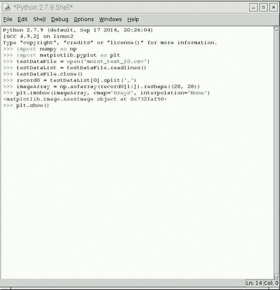

图 9-8.

IDLE 2 GUI 交互式 Python 会话

显示的数字如图 9-9 所示。

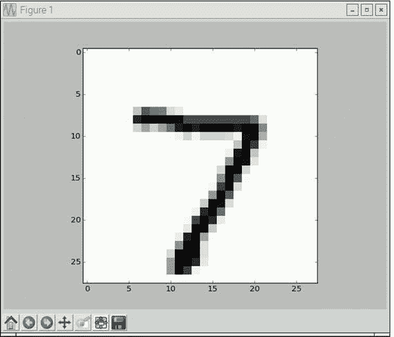

图 9-9.

数字图

下一步是将以下代码添加到 trainANN.py 脚本中。技术上，这个脚本既训练又测试 ANN。你可能希望给它一个新的名字来反映其新的功能。我只是保留了旧的名字，并试图记住现在它正在测试 ANN。以下附加的 Python 代码如下：

```py
# create the test list data
testDataFile = open('mnist_test_10.csv')
testDataList = testDataFile.readlines()
testDataFile.close()
# iterate through all 10 test records and display output arrays
for record in testDataList:
recordz = record.split(',')
# determine record label
labelz = int(recordz[0])
# rescale and offset record values
inputz = (np.asfarray(recordz[1:])/255.0 * 0.99) + 0.01
outputz = ann.testNet(inputz)
print 'output for label = ', labelz
print outputz
```

图 9-10 展示了运行新修改的 trainANN 脚本的输出结果。由于屏幕截图过程存在限制，只显示了六个输出数组。

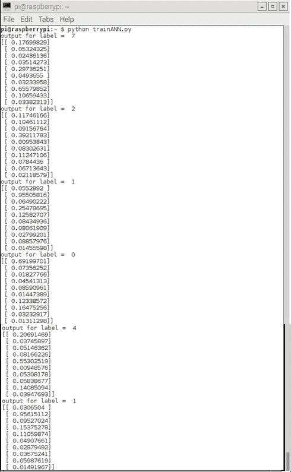

图 9-10.

trainANN 输出与测试输入

表 9-2 清晰地总结了将标签值与输出数组中最高值的索引进行比较的结果。

表 9-2.

测试结果

| 标签 | 7 | 2 | 1 | 0 | 4 | 1 | 4 | 9 | 5 | 9 |
| --- | --- | --- | --- | --- | --- | --- | --- | --- | --- | --- |
| 索引 | 7 | 3 | 1 | 0 | 4 | 1 | 7 | 6 | 0 | 7 |
| 匹配 | x |   | x | x | x | x |   |   |   |

50%的结果相当令人失望，但也许这是可以预料的，因为 ANN 只使用了 60,000 多条训练记录中的 100 条进行训练。我确实注意到，对于匹配的记录，输出值相当高，而那些不匹配的记录则具有随机值均匀分布的特点。

我随后稍微修改了代码，以自动计算成功率，特别是考虑到我打算运行 10,000 个测试记录，而且我不想手动计算那个测试运行。我还删除了输出数组的显示代码。以下代码实现了这些更改：

```py
match = 0
no_match = 0
# iterate through all test records and display output arrays
for record in testDataList:
recordz = record.split(',')
# determine record label
labelz = int(recordz[0])
# rescale and offset record values
inputz = (np.asfarray(recordz[1:])/255.0 * 0.99) + 0.01
outputz = ann.testNet(inputz)
max_value = np.argmax(outputz)
if max_ value == labelz:
match = match + 1
else:
no_match = no_match + 1
print 'success match rate = ', float(match)/float(match + no_match)
```

我运行了 trainANN 脚本六次，并看到了一些有趣的结果，如图 9-11 所示。

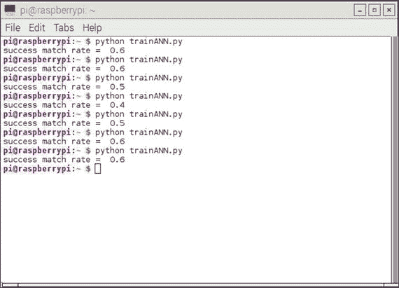

图 9-11.

带有成功率计算的 trainANN 脚本

成功率在 0.4 到 0.6 之间变化；使用了相同的测试输入数据集。唯一合理的解释是，某些权重矩阵比其他矩阵更适合。这些矩阵是使用随机正态分布生成的，正如我在第八章中讨论的那样，显然，有些稍微更适合产生比其他更准确的结果。让我们希望当使用完整的 60,000 个训练记录集训练 ANN 时，这些随机变化会消失。要使用 60,000 个记录集，只需在 trainANN.py 脚本中的文件`open`语句中进行以下更改：

```py
dataFile = open('mnist_train.csv')
```

我进行了这个更改并重新运行了 10 个测试数据记录。我很高兴地发现，现在的成功率达到了 0.90。顺便说一下，树莓派处理完整的训练集大约花了 5 分钟，我觉得对于一个四核、1.2GHz 的处理器来说并不算长。

下一步是运行完整的 10,000 个记录测试数据集。你可以通过再次更改一个语句来完成：

```py
testDataFile = open('mnist_test.csv')
```

这次，脚本大约花了 8 分钟来完成，并显示了一个非常令人尊重的 0.9381 成功匹配率。

接下来，我想看看匹配成功率如何随着不同的学习率而变化。为此，我在 trainANN.py 脚本中的训练和测试代码周围添加了一个新的循环，其中学习率以 0.1 的增量从 0.1 变化到 0.9。图 9-12 显示了这次测试的结果。

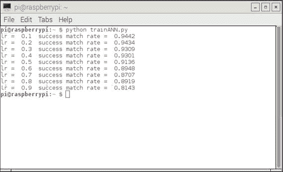

图 9-12.

不同学习率下的匹配成功率

当学习率等于 0.1 时，最大成功匹配率为 0.9442。这是一个非常好的识别率，可以与许多更大、更复杂的科研级 ANN 相媲美。我真心相信，如果你复制了我到目前为止所做的一切，你会非常高兴地创建出这样一个表现良好的 ANN。我可以从个人经验中说，大多数大学 AI 学生都没有在本章中完成你所做的事情。你应该对你的背景和教育感到非常满意。

然而，不要因为尝试一些额外的实验而感到胆怯，以查看 ANN 在不同参数下的表现，包括更改隐藏节点的数量。Tariq 在他的书中提到的一种技术是“时代”的概念，即 ANN 使用相同的训练数据集多次进行训练。每个完整的训练周期被称为一个时代。Tariq 以及其他 AI 研究人员发现，通常可以过度训练 ANN，导致整体性能比仅运行几个时代要差。这种现象的确切原因尚不清楚，除了研究人员推测 ANN 由于数据输入过多而过度拟合。请参阅有关过度拟合的先前讨论，该讨论解释了这种训练类型出现的症状。

ANN 的有趣和有趣之处在于存在很多多样性，您可以进行实验以尝试调整额外的性能。虽然 94 到 95% 的识别准确率没有什么可羞愧的，但尝试进一步提高 ANN 的性能也是值得的。您还可以尝试构建卷积 ANN，据称在 MNIST 测试数据集上具有 98.5% 的成功率。Adrian Rosebrock 博士在 [`www.pyimagesearch.com`](http://www.pyimagesearch.com) 的博客中解释了如何做到这一点。这有点复杂，但使用一个名为 Keras 的优秀 Python 库以及 Adrian 的自定义库，可以快速且无故障地构建 ANN。这些对于想要更进一步的人来说非常推荐。

在下一节中，我将向您展示一个互补项目，该项目使用 Pi 相机进行手写数字识别。

## 演示 9-2：使用 Pi 相机进行手写数字识别

您必须做的第一件事是确保 Pi 相机已在 Raspberry Pi 配置中启用。最简单的方法是通过在命令行中输入以下命令来运行 raspi-config 工具：

```py
sudo raspi-config
```

然后，您会看到显示的菜单，如图 9-13 所示。

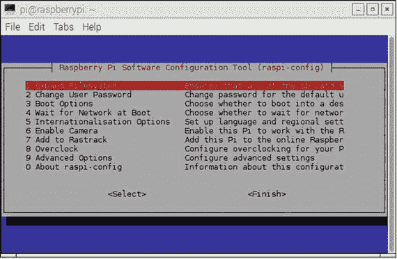

图 9-13。

raspi-config 菜单

选择 6 启用相机。此选项安装 Pi 相机的驱动程序。驱动程序使相机设备和 Jessie 操作系统协同工作。

下一步是安装 Pi 相机。相机通过一根柔性扁平电缆连接到 Raspberry Pi，这根电缆在购买相机时应该已经连接到相机上。电缆的自由端插入到相机串行接口（CSI）连接器，该连接器位于电路板上，直接位于 RJ-45 连接器后面。要插入电缆，您必须首先小心地直接向上拉起细塑料条两侧的两个黑色塑料卡扣。请非常小心，因为这是一个容易因用力过猛而损坏的塑料件。塑料件会变得松动，但仍附着在连接器本体上。

接下来，仔细将柔性电缆插入带有暴露的银色触点的插座中。电缆带上的蓝色背面应朝向 RJ-45 连接器。确保电缆在连接器的底部牢固就位，并且电缆与电路板垂直，在连接器中没有任何倾斜。接下来，轻轻按下黑色塑料卡扣以锁定电缆。请注意，没有咔哒声或其他噪音来指示塑料部件已完全就位。只需使用坚定但温和的压力将其锁定即可。作为警告，我注意到如果移动相机，电缆可能会松动，导致连接器中的电缆略微移动。如果发生这种情况，你通常会看到软件报告无法再与相机连接。如果你看到这个错误，只需重新安装连接器。图 9-14 是摄像机连接带连接到 CSI 连接器的特写。

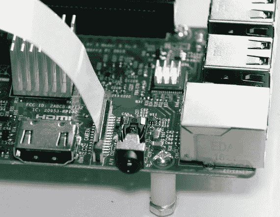

图 9-14。

摄像机连接带已连接

接下来，你需要安装一些 Python 库，这些库是使用 Python 拍照所必需的。通过输入以下命令可以轻松完成这项任务：

```py
sudo apt-get update
sudo apt-get install python-picamera
```

在完成所有上述步骤后，你就可以拍照了。我将通过一个逐步的 Python 交互会话来演示如何对手写数字进行图像处理。

首先，你需要一个手写数字作为主题。我建议使用黑色细尖的 Sharpie 在约 4 × 4 英寸的白色纸上画一个数字。我用数字 9 作为我的主题。你可以画任何你想要的数字。图 9-15 显示了我的手写数字。

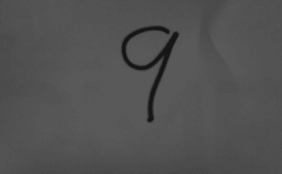

图 9-15。

主题：手写数字

这可能看起来有点奇怪，因为图像是使用 Pi Camera 的单色效果捕获的，我将在稍后解释。请相信我，纸张是白色的，数字非常暗。以下是一个 Python 交互会话，每个命令后面都有注释：

```py
>>> import picamera
```

picamera 包包含所有用于捕获、保存和读取图像的模块。

```py
>>> camera = picamera.PiCamera()
```

这实例化了一个名为`camera`的对象，可以在其上调用所需的操作。

```py
>>> camera.color_effects = (128, 128)
```

此命令设置 Pi Camera 以拍摄黑白图像，这在技术上描述为单色或甚至是“灰色阴影”。

```py
>>> camera.capture('ninebw.jpg')
```

使用此命令捕获或获取图像。在这种情况下，它以`ninebw.jpg`的名称存储在当前目录中。它以默认的高分辨率格式 1920 × 1080 像素。我建议将写有数字的纸张放在相机前方约 5 英寸处，并支撑使其垂直于相机。Pi 相机镜头具有非常广的视角，因此在如此近的距离下，它将完全填满传感器。在处理脚本中，结果图像将被大幅缩小并调整大小。

图 9-16 展示了 Pi Camera 版本 2 在透明的塑料支架中面向写有数字的纸张。顺便说一句，这个价格低廉的支架在 Amazon.com 上有售。


图 9-16.

Pi 相机设置以捕获图像

图 9-17 展示了捕获数字图像的完整交互式 Python 会话。

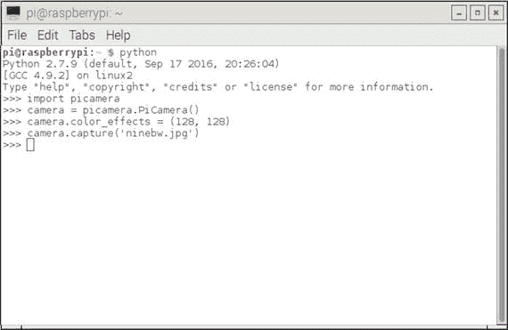

图 9-17.

交互式 Python 会话

我修改了 trainANN.py 脚本，使其使用图 9-15 作为测试数据输入。完整的列表 trainANN_Image.py 如下所示，其中在列表之后有解释说明。

```py
import numpy as np
import matplotlib.pyplot as plt
from ANN import ANN
import PIL
from PIL import Image
# setup the network configuration
inode = 784
hnode = 100
onode = 10
# set the learning rate
lr = 0.1
# instantiate an ANN object named ann
ann = ANN(inode, hnode, onode, lr)
# create the training list data
dataFile = open('mnist_train.csv')
dataList = dataFile.readlines()
dataFile.close()
# train the ANN using all the records in the list
for record in dataList:
recordx = record.split(',')
inputT = (np.asfarray(recordx[1:])/255.0 * 0.99) + 0.01
train = np.zeros(onode) + 0.01
train[int(recordx[0])] = 0.99
# training begins here
ann.trainNet(inputT, train)
# create the test list data from an image
img = Image.open('ninebw.jpg')
img = img.resize((28, 28), PIL.Image.ANTIALIAS)
# read pixels into list
pixels = list(img.getdata())
# convert into single values from tuples
pixels = [i[0] for i in pixels]
# save to a temp file named test.csv with comma separators
a = np.array(pixels)
a.tofile('test.csv', sep=',')
# open the temp file and read into a list
testDataFile = open('test.csv')
testDataList =  testDataFile.readlines()
testDataFile.close()
# iterate through all the list elements and submit to the ANN
for record in testDataList:
recordx = record.split(',')
input = (np.asfarray(recordx[0:])/255.0 * 0.99) + 0.01
output = ann.testNet(input)
# display output
print output
```

请注意，我无需更改基本 ANN 类，就可以将这些修改纳入 trainANN_Image 脚本中，这是将类定义与功能或应用代码分离的强大理由。

下一个讨论仅涉及对原始 trainAN.py 脚本所做的更改，以适应新的图像处理功能。

### 修改 trainAN.py 脚本

从以下命令开始：

```py
import PIL
from PIL import Image
```

使用 Python 处理图像需要 Python 图像库（PIL）及其组件之一`Image`。

```py
img = Image.open('ninebw.jpg')
img = img.resize((28, 28), PIL.Image.ANTIALIAS)
```

这些命令加载脚本中硬编码的文件，然后将其调整大小为 28 × 28 像素大小的图像。反走样参数确保在缩小操作过程中不会创建任何伪影。

```py
pixels = list(img.getdata())
```

此命令将 784 个像素值转换为名为`pixels`的列表。

```py
a = np.array(pixels)
a.tofile('test.csv', sep=',')
```

然后将像素列表转换为适合存储在名为`test.csv`的文件中的逗号分隔数组。这个新创建的文件随后以与未修改的 trainANN.py 脚本中所有其他测试文件完全相同的方式进行处理。

图 9-18 展示了输出数据数组，其中你可以清楚地看到最后一个元素是整个数组中最高的，这对应于 ANN 相信它已经识别出数字 9，这是正确答案。

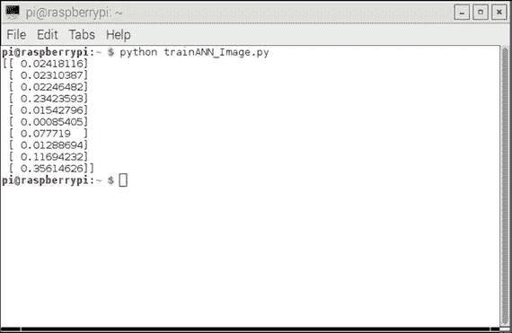

图 9-18.

输出数据数组

这个演示需要相当多的准备和运行工作，以展示一个由 Raspberry Pi 控制的相机与一个训练有素的 ANN 结合使用，实际上可以识别出以前从未见过的以这种方式书写的数字。

本演示的最后部分描述了如何自动化图像识别过程。

### 使用 ANN 进行自动数字识别

使用 ANN 自动处理图像的过程相对简单。我使用了一个中断驱动的结构，其中图像捕获和处理是通过按下连接到 Raspberry Pi GPIO 引脚之一的按钮来启动的。

第一项是硬件设置，它包括使用 Pi Cobbler I/O 适配器将 Pi 相机、按钮和 LED 连接到 Raspberry Pi。图 9-19 是一个 Fritzing 图，显示了 LED 和按钮连接到 Pi Cobbler 的连接方式。

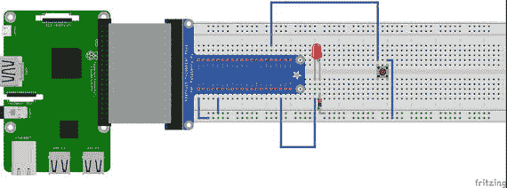

图 9-19。

LED 和按钮连接

我认为没有必要单独绘制电路图，因为连接已经在图 9-19 中清楚地显示了。Pi 相机连接方式如前所述。

新脚本中有一个“永远循环”，我将其命名为 automatedImager.py，它只是等待中断信号来启动图像处理时闪烁 LED。完整的脚本列在下面，并指出了从 trainANN_Image.py 脚本中的新修改。

```py
import numpy as np
import matplotlib.pyplot as plt
from ANN import ANN
import PIL
from PIL import Image
import RPi.GPIO as GPIO
import time
import picamera
# instantiate and configure a Pi Camera object
camera = picamera.PiCamera()
camera.color_effects = (128, 128)
# setup the i/o pins 12 and 19
GPIO.setmode(GPIO.BCM)
GPIO.setup(12, GPIO.IN, pull_up_down=GPIO.PUD_DOWN)
GPIO.setup(19, GPIO.OUT)
# this is the callback function where all the processing is done
def processImage(self):
# capture an image
camera.capture('test.jpg')
# create the test list data from an image
img = Image.open('test.jpg')
img = img.resize((28, 28), PIL.Image.ANTIALIAS)
# read pixels into list
pixels = list(img.getdata())
# convert into single values from tuples
pixels = [i[0] for i in pixels]
# save to a temp file named test.csv with comma separators
a = np.array(pixels)
a.tofile('test.csv', sep=',')
# open the temp file and read into a list
testDataFile = open('test.csv')
testDataList =  testDataFile.readlines()
testDataFile.close()
# iterate through all the list elements and submit to the ANN
for record in testDataList:
recordx = record.split(',')
input = (np.asfarray(recordx[0:])/255.0 * 0.99) + 0.01
output = ann.testNet(input)
# display output
print output
# event detection
GPIO.add_event_detect(12, GPIO.RISING, callback=processImage)
# setup the network configuration
inode = 784
hnode = 100
onode = 10
# set the learning rate
lr = 0.1 # optimal value
# instantiate an ANN object named ann
ann = ANN(inode, hnode, onode, lr)
# create the training list data
dataFile = open('mnist_train.csv')
dataList = dataFile.readlines()
dataFile.close()
# train the ANN using all the records in the list
for record in dataList:
recordx = record.split(',')
inputT = (np.asfarray(recordx[1:])/255.0 * 0.99) + 0.01
train = np.zeros(onode) + 0.01
train[int(recordx[0])] = 0.99
# training begins here
ann.trainNet(inputT, train)
while True:
# blink an LED forever
GPIO.output(19, GPIO.HIGH)
time.sleep(1)
GPIO.output(19, GPIO.LOW)
time.sleep(1)
```

### 测试运行

我将 Pi 相机设置成与手动测试运行完全相同的方式。训练完成后，LED 开始闪烁，表明系统已准备好通过按下按钮来激活图像捕获和 ANN 分析。ANN 测试运行的结果显示在图 9-20 中。

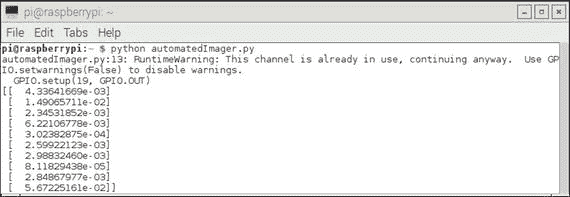

图 9-20。

自动测试运行输出

数组中的最后一个元素是数组中的最大值，这表明人工神经网络（ANN）将这个数字识别为 9，这是正确的数字。

这个项目完成了我希望向您展示的实用演示。您应该把它们视为进一步实验和 ANN 实践的开始点。

## 摘要

本章介绍了两个 ANN 演示。这些演示展示了经过训练的 ANN 如何识别手写数字。训练数据集由 MNIST 数据库中的 60,000 条记录组成。

第一项演示使用了来自与 MNIST 训练数据库不同的数据库中的 10,000 个测试数据记录。结果显示，三层 ANN 达到了 94.5%的成功识别率。

第二项演示使用了 Pi 相机来识别手写数字。一个 Python 脚本将捕获的图像转换为输入数据记录，成功识别了手写数字。

然后演示了一个略微修改过的 Python 脚本，它完全自动化了图像识别过程。
