# 10. 进化计算

本章讨论进化计算（EC）。我将首先定义 EC 及其范围，以便您了解本章讨论的内容以及它如何应用于人工智能。以下列出了 EC 领域的一些主要子主题：

+   进化编程

+   进化策略

+   遗传算法

+   遗传编程

+   分类系统

这个列表绝不是详尽的，因为许多人工智能主题的范围通常受人工智能实践者的观点影响，但它对我很有帮助，并且远远超出了本章讨论的所有项目。

我将从一个小故事开始，这个故事应该将进化计算的基本概念——进化和突变——置于适当的背景中。

## Alife

多年前，在亚热带丛林中有一个巨大的洞穴，那里居住着一种两栖生物，我将其简单地称为 alife。Alife 是一种温和的动物，它们组成一个庞大的群体（数量达到数万），在洞穴中生活了很长时间。它们以地衣、苔藓和其他营养物为食，这些营养物由几条清澈的溪流慷慨地供应，这些溪流穿过洞穴。Alife 繁殖力很强，繁殖速度很快，代际时间以周计算。它们的群体规模也很稳定，基本上基于恒定的出生和死亡比率以及稳定的食物供应而达到一个平衡点。总的来说，Alife 社区似乎对现状非常满意。然而，一场灾难发生了。

一场大地震震动了该地区，强度之大以至于洞穴顶部坍塌，alife 首次在数亿年来首次暴露于外界。由于大脑相对原始，alife 并没有意识到发生了什么，它们继续以它们普通的方式生活。然而，一只鹰恰好在该地区盘旋，并从新打开的洞中俯冲下来进行侦查。在那里，它发现了美味的 alife 群体并开始捕食它们。吃饱后，鹰飞回它的巢区，与其他鹰交流它所发现的情况。很快，就有大量的饥饿鹰开始捕食 alife。对于 alife 来说，形势看起来相当严峻。

幸运的是，一些 alifes 群体能够躲藏在鹰无法触及的岩石和洞穴中。但殖民地被灭绝只是时间问题。然后，发生了令人瞩目的事情。一个新生 alife 头顶上的皮肤细胞发生了变化或突变，使其对光变得敏感。这个 alife 不知道该怎么办，但原始本能指引它避开任何光线。这个 alife 继续繁衍后代，它们也拥有光敏感细胞。有趣的是，每一代 alife 在检测光线方面都比上一代更擅长。这些光敏感的 alifes 很快变得擅长躲避鹰，以至于它们是唯一存活的 alifes。当鹰意识到免费的午餐已经结束，它们就离开了。

在 alifes 中发生了另一种突变，其中第二组光敏感细胞在第一组附近发展起来。经过许多代，这些光敏感细胞进化成了原始的眼睛。这些 alifes 现在可以看见，更重要的是，有了两只眼睛，它们可以感知深度。有了这种新的深度感知，alifes 可以冒险走出洞穴，开始探索它们洞穴家园之外的世界。

当 alifes 开始从洞穴中冒险出去时，它们暴露在强烈的阳光下，它们的顶部皮肤细胞开始突变，变得更加坚韧和具有保护性。它们的嘴巴也开始突变，因为它们需要更多的食物能量来在丛林中移动。它们长出了牙齿，消化系统也发生了变化，以适应它们现在所消费的生肉蛋白质。它们的身体也开始增长，以处理新的器官和身体部位的重量。这个过程持续了很长时间，直到现在。今天，在我们中间有 alifes，但我们不称它们为 alifes；相反，我们称它们为鳄鱼。

我相信你们能认出我的故事是虚构的，除了突变和进化对于 alifes 继续其物种所必需的重要部分。物种适应恶劣环境以生存是查尔斯·达尔文在其论文《物种起源》中提出的首要观点。

当突变在自然界发生时，它总是处于一个非常小的规模，并且通常基于某种随机过程。这个想法在进化计算中得到了体现，其中变化或突变也非常小，对整个过程的影响微乎其微，无论这个过程是什么。突变也是通过使用兼容的伪随机机制来创造的。我现在将进一步讨论进化编程（EP）来进一步发展这些想法。

## 进化编程

EP 是由劳伦斯·福格尔博士在 20 世纪 60 年代初创建的。它可以被视为一种使用随机选择的试验解来测试一个或多个目标的优化策略。试验解也被称为个体种群。然后对现有个体应用突变，从而产生新的个体或后代。突变可以对新个体的行为产生广泛的影响。然后，新个体在“锦标赛”中比较，以选择哪些个体能够生存下来形成新的个体种群。

EP 与遗传算法（GA）不同，因为它关注父母和后代之间的行为联系；而 GA 试图模拟在基因组中发生的自然遗传操作，包括使用遗传交叉编码行为和重组。

EP 与进化策略（ES）也非常相似，尽管它们是独立开发的。主要区别在于，EP 使用随机过程从种群中选择个体，而 ES 则使用确定性方法。在 ES 中，根据定义良好的指标，表现不佳的个体会被从个体种群中删除。

现在我已经介绍了 EC 并讨论了其基本组件，是时候向你展示一个实际的 EC 演示了。

## 演示 10-1：手动计算

我以一些手动计算开始这个演示，就像我在其他章节中做的那样。然而，明确说明目的会有所帮助，这样你就能对演示要展示的内容有一个大致的了解。目的是生成一个包含六个整数的列表，这些整数的值在 0 到 100 之间，且它们的和为 371。我可以猜测，大多数读者可以轻松地列出这样一个列表而不会遇到任何真正的问题。

我将带你了解我的推理过程，以展示我是如何发展出这个列表的。

1.  首先，我意识到每个数字可能都超过 60，因为只有六个数字可以相加得到目标值。

1.  接下来，我选择了一个数字（比如说 71），并从目标值中减去它，这导致创建了一个新的目标值 300，剩下五个数字。

1.  我重复使用其他数字进行这些步骤，直到我得到了以下列表。最后一个数字只是在我选择了第五个整数后的余数。[71, 90, 65, 70, 25, 50]这个过程中没有任何随机性，因为我一直在推理我的选择。这个过程应该被归类为确定性。可以编写一个传统的脚本或程序来规范它。顺便说一句，我也可以创建以下列表，因为没有规定整数不能重复：[60, 60, 60, 60, 60, 71]

这只是人类天性中的一种怪癖，我们通常不会以那种方式思考和推理。

我认为前面的手动计算对于一个人类来说相当简单。然而，对于计算机来说并不简单，这就是下面 Python 演示的作用所在。

### Python 脚本

信用必须归功于威尔·拉尔森。我正在使用他 2009 年发表在博客 Irrational Exuberance 上的文章“遗传算法：酷炫的名字和简单至极”中的代码（[`lethain.com/genetic-algorithms-cool-name-damn-simple/`](https://lethain.com/genetic-algorithms-cool-name-damn-simple/)）。我强烈推荐您查看它。

要解决的问题与在手动计算部分确定六个取值范围为 0 到 100 且总和为 371 的整数的相同。

在制定解决方案时首先要考虑的是如何构建它以适应 EC 模式。需要创建个体，这些个体最终将形成一个种群。在这个特定情况下，个体将是六个由 0 到 100 之间的整数组成的元素列表。多个个体组成一个种群。以下代码段创建了个体：

```py
from random import randint
def individual(length, min, max):
# generates an individual
return [randint(min, max) for x in xrange(length)]
```

图 10-1 展示了一个交互式 Python 会话，其中我生成了几个个体。

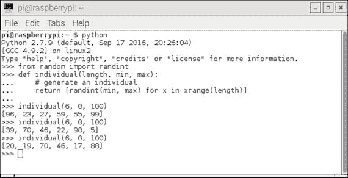

图 10-1.

交互式 Python 会话个体生成

生成的个体必须被收集，以便形成一个种群，这是解决方案结构的下一部分。以下代码段生成了一个种群。此段代码依赖于前面的代码段已经输入：

```py
def population(count, length, min, max):
# generate a population
return [individual(length, min, max) for x in xrange(count)]
```

图 10-2 展示了一个交互式 Python 会话，其中我生成了几个种群。

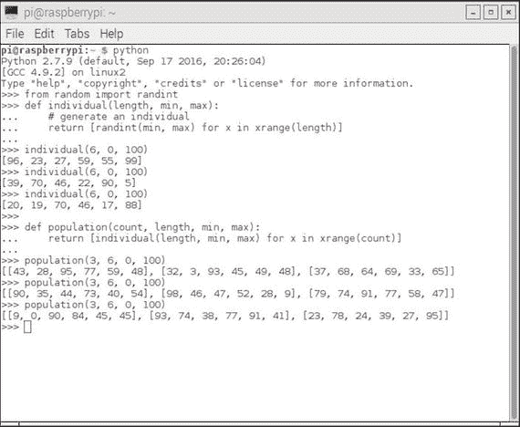

图 10-2.

交互式 Python 会话种群生成

此过程的下一步是创建一个函数来衡量特定个体在满足既定目标（即整数列表值求和到目标值）方面的表现如何。这个函数被称为适应度函数。请注意，适应度函数需要先输入个体函数。以下是一个适应度函数的代码段实现：

```py
from operator import add
def fitness(individual, target):
# calculate fitness, lower the better
sum = reduce(add, individual, 0)
return abs(target - sum)
```

图 10-3 展示了一个交互式 Python 会话，其中我测试了几个个体与一个恒定目标值。

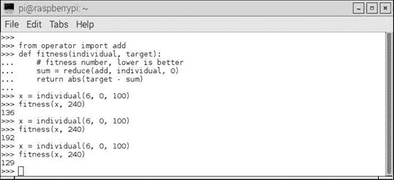

图 10-3.

交互式 Python 会话适应度测试

这个特定的适应度函数比我在过去章节中展示的类似适应度测试要简单得多。在这个例子中，只计算个体列表中包含的元素与目标值之间的差的绝对值。最佳情况是 0.0 值，我将很快演示。

结构中唯一缺少的元素是如何改变或进化种群以满足目标。只有最纯粹的运气，初始解决方案才会是一个最优解决方案。必须有一个策略来正确实现进化函数。以下是为这个结构提出的策略：

+   从先前种群中选取表现最好的 20%（精英率）并包含在新种群中。

+   大约繁殖新种群中的 75% 作为子代。

+   从父亲那里选取长度的一半元素，从母亲那里选取长度的一半元素来形成子代。

+   父亲和母亲不能是同一个个体。

+   从种群中随机选择 5%。

+   突变新种群中的 1%。

这种策略绝对不是标准的，甚至也不是非常全面的，但对于这个问题来说足够了，并且它相当典型地代表了用于类似问题的策略。

图 10-4 是一个交互式 Python 会话，展示了在这个策略中子代是如何形成的。

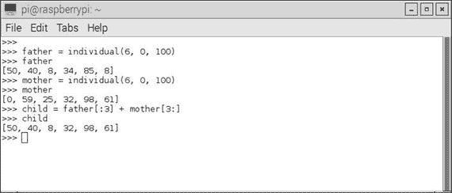

图 10-4.

为新种群形成子代

策略中的突变部分稍微复杂一些，我在尝试解释之前，部分展示了下一个代码段：

```py
from random import random, randint
chance_to_mutate = 0.01
for i in population:
if chance_to_mutate > random():
place_to_mutate = randint(0, len(i))
i[place_to_mutate] = randint(min(i), max(i))
...
...
```

`chance_to_mutate` 变量设置为 0.01，代表 1% 的突变机会，正如我之前提到的，这非常低。语句 `for i in population:` 遍历整个种群，并且只有在随机数生成器小于 .01 时才会发生突变，这并不常见。实际被选中的突变个体是通过 `place_to_mutate = randint(0, len(i))` 语句实现的，这不太可能是随机数小于 .01 时正在迭代的个体。最后，实际的突变是通过这个语句完成的：`i[place_to_mutate] = randint(min(i), max(i))`。所选个体的整数值是基于种群的最小值和最大值随机生成的。

整个策略设计，包括选择最佳表现个体、从种群的所有部分繁殖子代以及偶尔的突变，旨在找到全局最大值并避免局部最大值。这正是 ANNs 的梯度下降算法中正在进行的思考过程，其目标是找到全局最小值并避免局部最小值。你可以查看图 8-15 来可视化寻找全局最大值或最高峰的过程，而不是最深的山谷，代表全局最小值。

`evolve` 函数的内容远不止展示的这些。剩余的代码将在完整的脚本列表中展示。

在展示完整脚本之前，还有一个函数需要解释。这个函数名为 `grade`，它计算整个种群的整体适应度度量。Python 内置的 `reduce` 函数将每个个体的适应度得分相加，并按种群大小平均。以下代码实现了 `grade` 函数：

```py
def grade(pop, target):
'Find average fitness for a population.'
summed = reduce(add, (fitness(x, target) for x in pop))
return summed / (len(pop) * 1.0)
```

这个最后的功能列表总结了我对构成 Python 脚本的所有功能的讨论。以下是对最终脚本的完整列表，以及如何在交互式 Python 会话中运行脚本的说明。请注意，我修改了说明，以显示满足目标的第一代数字以及最终解决方案本身。示例中的种群数量为 100，每个个体有六个元素，其值介于 0 到 100 之间。

```py
"""
# Example usage
>>> from genetic import *
>>> target = 371
>>> p_count = 100
>>> i_length = 6
>>> i_min = 0
>>> i_max = 100
>>> p = population(p_count, i_length, i_min, i_max)
>>> fitness_history = [grade(p, target),]
>>> fitFlag = 0
>>> for i in xrange(100):
...    p = evolve(p, target)
...    fitness_history.append(grade(p, target))
...    if grade(p, target) == 0:
...        if fitFlag == 0:
...            fitFlag = 1
...            print 'Generation = ', i
...            print p[0]
>>> for datum in fitness_history:
...    print datum
"""
from random import randint, random
from operator import add
def individual(length, min, max):
'Create a member of the population.'
return [ randint(min,max) for x in xrange(length) ]
def population(count, length, min, max):
"""
Create a number of individuals (i.e. a population).
count: the number of individuals in the population
length: the number of values per individual
min: the minimum possible value in an individual's list of values
max: the maximum possible value in an individual's list of values
"""
return [ individual(length, min, max) for x in xrange(count) ]
def fitness(individual, target):
"""
Determine the fitness of an individual. Higher is better.
individual: the individual to evaluate
target: the target number individuals are aiming for
"""
sum = reduce(add, individual, 0)
return abs(target-sum)
def grade(pop, target):
'Find average fitness for a population.'
summed = reduce(add, (fitness(x, target) for x in pop))
return summed / (len(pop) * 1.0)
def evolve(pop, target, retain=0.2, random_select=0.05, mutate=0.01):
graded = [ (fitness(x, target), x) for x in pop]
graded = [ x[1] for x in sorted(graded)]
retain_length = int(len(graded)*retain)
parents = graded[:retain_length]
# randomly add other individuals to
# promote genetic diversity
for individual in graded[retain_length:]:
if random_select > random():
parents.append(individual)
# mutate some individuals
for individual in parents:
if mutate > random():
pos_to_mutate = randint(0, len(individual)-1)
# this mutation is not ideal, because it
# restricts the range of possible values,
# but the function is unaware of the min/max
# values used to create the individuals,
individual[pos_to_mutate] = randint(
min(individual), max(individual))
# crossover parents to create children
parents_length = len(parents)
desired_length = len(pop) - parents_length
children = []
while len(children) < desired_length:
male = randint(0, parents_length-1)
female = randint(0, parents_length-1)
if male != female:
male = parents[male]
female = parents[female]
half = len(male) / 2
child = male[:half] + female[half:]
children.append(child)
parents.extend(children)
return parents
```

图 10-5 展示了一个交互式会话，我在脚本注释部分的说明部分输入了所有显示的语句。

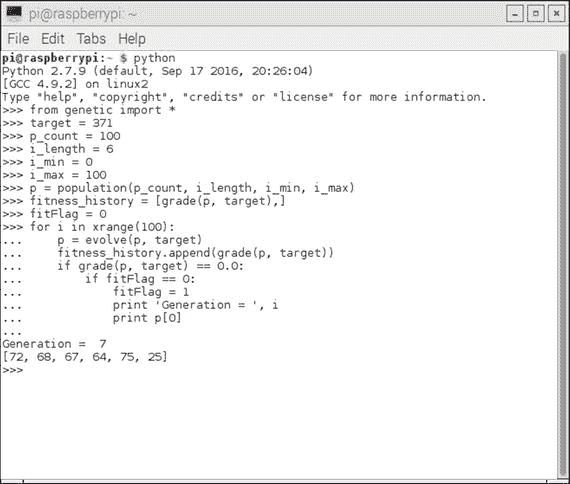

图 10-5。

运行脚本的交互式 Python 会话

您应该能在屏幕截图上看到，在经过仅七代进化后找到了解决方案。解决方案是 `[72, 68, 67, 64, 75, 25]`，这些数字的总和正好是目标值 371。脚本在找到第一个成功解决方案后不会停止，而是继续进化并变异，略微退化然后改善，直到完成预设的周期数。

每一代关联的适应度数值的历史部分在图 10-6 中显示。

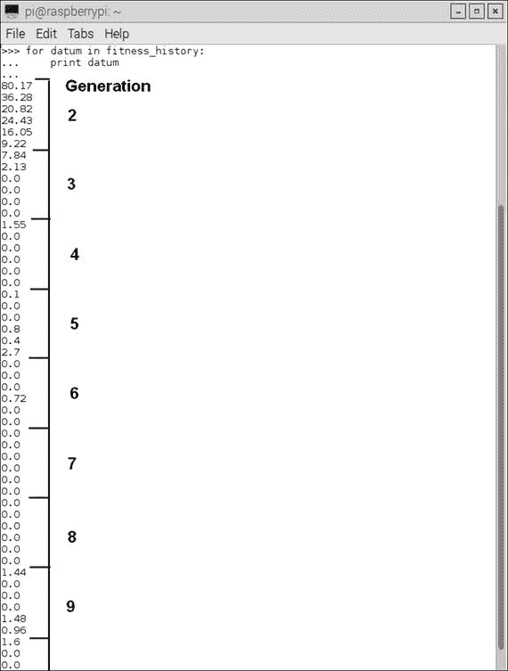

图 10-6。

适应度历史列表

在图 10-6 中，我标注了第 7 代每个个体的适应度值为 0.0。总的来说，这种遗传编程方法非常高效，特别是对于相对简单的目标，即给定六个随机生成的整数数字确定目标总和。

下一个演示是康威生命游戏的一个轻微变体，这是一个经典项目，它将遗传编程与人工生命（alife）结合在一起，根据它们彼此之间的条件进行繁殖和死亡，我稍后会解释。

## 演示 10-2：康威生命游戏

生命游戏，或如人们通常所知，生命，是由英国数学家约翰·康威在 1970 年创建的一个细胞自动机项目。游戏从初始条件开始，但不需要进一步的用户输入即可完成游戏。这种操作模式被称为零玩家游戏，这意味着自动机——或者，从现在起我将它们称为细胞——根据以下规则或条件自行进化：

1.  任何少于两个活邻居的活细胞会死亡，就像因为人口不足一样。

1.  任何有两个或三个活邻居的活细胞会活到下一代。

1.  任何多于三个活邻居的活细胞会死亡，就像因为人口过剩一样。

1.  任何恰好有三个活邻居的死亡细胞会变成活细胞，就像通过繁殖一样。

该游戏的面板字段或宇宙在理论上是一个无限的正交网格方阵，其中细胞可以以活或死的状态占据网格。活与被占用同义，死与未被占用同义。每个细胞最多有八个邻居，除了在我们现实世界的实际网格系统中，边缘细胞，在那里不可能有无限网格。

该网格通过初始放置的细胞进行“播种”，这些细胞可以是随机或确定性地放置的。然后立即应用细胞规则，导致出生和死亡同时发生。在游戏术语中，这被称为时间滴答。因此形成了一个新的一代，规则立即重新应用。最终，游戏达到一个平衡状态，其中细胞在两种稳定的细胞配置之间循环，它们永远漫游，或者它们全部死亡。

从历史角度来看，康威对约翰·冯·诺伊曼教授尝试创建能够自我复制的计算机器非常感兴趣。冯·诺伊曼最终通过描述一个基于矩形网格的数学模型并遵循一个非常复杂的规则集而成功。康威游戏是对冯·诺伊曼概念的极大简化。该游戏发表在 1970 年 10 月的《科学美国人》杂志马丁·加德纳的“数学游戏”专栏中。它立刻取得了巨大成功，并引起了同行人工智能研究人员和热情读者的极大兴趣。

该游戏也可以扩展到与 1940 年代由艾伦·图灵首次提出的通用图灵机相当的程度（在前面章节中解释）。

该游戏对人工智能的另一个重要影响是，它可能启动了被称为细胞自动机的数学研究领域。该游戏模拟了一个生物群体的出生和死亡，这与自然界中发生的真实过程有着惊人的密切关系。这个游戏直接导致了其他许多类似的模拟游戏，这些游戏模拟了自然界本身的过程。这些模拟在计算机科学、生物学、物理学、生物化学、经济学、数学等领域得到了应用。

我使用一个名为 Sense HAT 的整洁的树莓派附件板来演示康威生命游戏。图 10-7 展示了 Sense HAT 板。HAT 名称代表一系列称为 Hardware Attached on Top（HAT）的附件板，它们具有标准化的格式，可以直接插入 40 针 GPIO 引脚头，并机械固定在树莓派 2 和 3 型号的底板上。

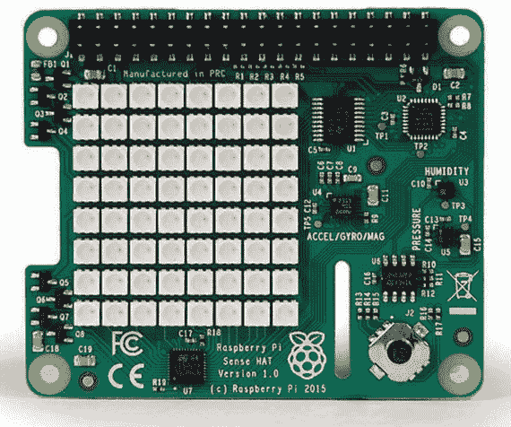

图 10-7。

感知 HAT 板

每个 HAT 板都支持一个自动配置系统，该系统允许自动 GPIO 和驱动程序设置。这种自动配置是通过使用 40 引脚 GPIO 头上的两个专用引脚来实现的，这些引脚是为 I2C eeprom 保留的。这个 eeprom 存储了板制造商的信息、GPIO 设置和设备树片段，这是一个描述附加硬件的描述，反过来又允许 Linux 操作系统自动加载任何所需的驱动程序。

Sense HAT 板上有一个 8 × 8 RGB LED 阵列，为所有细胞自动机提供了一个非常不错的网格显示。此外，还有一个强大的 Python 库，为 LED 阵列和各种板载传感器提供了大量功能，包括以下内容：

+   惯性仪

+   加速度计

+   磁力计

+   温度

+   气压

+   湿度

板上还有一个五向位置摇杆，以支持需要此类用户控制的应用程序。我在“生命游戏”应用程序中并没有使用任何传感器或摇杆，只使用了 8 × 8 LED 阵列。

### Sense HAT 硬件安装

首先，确保 Raspberry Pi 完全关闭电源。Sense HAT 设计用于安装在 Raspberry Pi 顶部。它附带一个 40 引脚 GPIO 雄性引脚扩展头，您必须首先将其插入 Raspberry Pi 上的雌性 40 引脚头。然后，使用 40 个雄性引脚作为指南，将 Sense HAT 安装在 Raspberry Pi 顶部。这些引脚应该简单地推过 Sense 板上的 40 引脚雌性头。剩下的只是安装提供的支架，这些支架在 Raspberry Pi 和 Sense HAT 之间提供坚固的支撑。图 10-8 显示了安装在 Raspberry Pi 上的 Sense HAT。

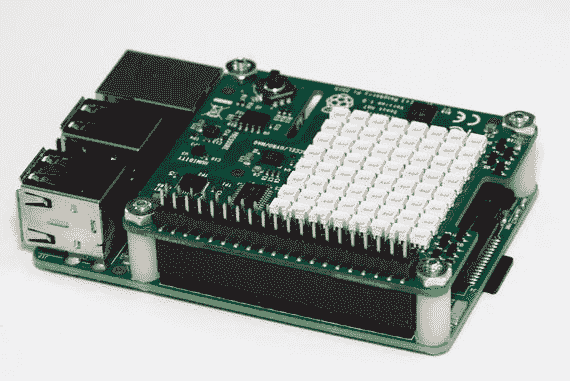

图 10-8。

Sense HAT 安装在 Raspberry Pi 上

您还应该知道一件事。Raspberry Pi 和 Sense HAT 需要一个能够提供 2.5A 5V 的电源。未能使用足够强大的电源可能会引起奇怪的行为，例如 Linux 操作系统无法识别 Sense HAT，这不幸地被我证实是一个事实。

### Sense HAT 软件安装

在运行任何将运行生命游戏的脚本之前，必须先加载支持 Sense HAT 的 Python 库。首先，确保 Raspberry Pi 连接到互联网，然后输入以下命令来加载软件：

```py
sudo apt-get update
sudo apt-get install sense-hat
sudo reboot
```

您需要运行以下测试以确保 Sense HAT 与新安装的软件正常工作。在交互式 Python 会话中输入以下内容：

```py
from sense_hat import SenseHat
sense = SenseHat()
sense.show_message("Hello World!")
```

如果安装一切顺利，你应该能看到`Hello World!`信息在 LED 阵列上滚动。如果你没有看到，我建议你重新检查 Sense HAT 是否牢固地固定在 Raspberry Pi 上，以及所有 40 个引脚是否都通过了各自的插座孔。很可能你不小心弯曲了一个引脚，使得它被迫偏离了位置。如果是这种情况，只需小心地将其弄直并重新安装所有引脚。

一旦软件检出，你就可以在这个 Sense HAT/Raspberry Pi 组合上运行生命游戏的 Python 版本了。我现在转向游戏软件的讨论。

### 生命游戏：Python 版本

我在这个部分的开头要感谢 Swee Meng Ng 先生，他是一位非常有才华的马来西亚开发者，在 GitHub.com 上发布了我在这个项目中使用的很大一部分代码。Swee 在 GitHub 上的用户名是 sweemeng。他有一个博客在[`www.nomadiccodemonkey.com`](http://www.nomadiccodemonkey.com)。如果你想了解那个地区正在进行的代码开发工作，可以看看它。

你应该首先从[`github.com/sweemeng/sweemengs-game-of-life.git`](https://github.com/sweemeng/sweemengs-game-of-life.git)将以下 Python 脚本加载到你的主目录中：

+   genelab.ppy

+   designer.py

+   gameoflife.py

genelab.py 是我将要讨论的第一个脚本。它是这个应用程序中的主要脚本。通过主要，我的意思是它包含了起点、初始化、生成创建和变异，最后强制执行行为规则。然而，这个脚本需要两个辅助脚本才能正常工作。这些辅助脚本分别命名为 designer.py 和 gameoflife.py，我将在稍后讨论。我为 Swee Meng 的脚本添加了自己的注释，以帮助将其中的一部分与已经讨论过的概念联系起来，并希望澄清代码段的目的。

```py
import random
import time
# first helper
from designer import CellDesigner
from designer import GeneBank
# second helper
from gameoflife import GameOfLife
# not exactly a helper but needed for the display
from sense_hat import SenseHat
# you can customize your colors here
WHITE = [ 0, 0, 0 ]
RED = [ 120, 0, 0 ]
# begin class definition
class Genelab(object):
# begin initialization
def __init__(self):
self.survive_min = 5 # Cycle
self.surival_record = 0
self.designer = CellDesigner()
self.gene_bank = GeneBank()
self.game = GameOfLife()
self.sense = SenseHat()
# random starting point
def get_start_point(self):
x = random.randint(0, 7)
y = random.randint(0, 7)
return x, y
# create a fresh generation (population)
# or mutate an existing one
def get_new_gen(self):
if len(self.gene_bank.bank) == 0:
print("creating new generation")
self.designer.generate_genome()
elif len(self.gene_bank.bank) == 1:
print("Mutating first gen")
self.designer.destroy()
seq_x = self.gene_bank.bank[0]
self.designer.mutate(seq_x)
else:
self.designer.destroy()
coin_toss = random.choice([0, 1])
if coin_toss:
print("Breeding")
seq_x = self.gene_bank.random_choice()
seq_y = self.gene_bank.random_choice()
self.designer.cross_breed(seq_x, seq_y)
else:
print("Mutating")
seq_x = self.gene_bank.random_choice()
self.designer.mutate(seq_x)
# a method to start the whole game, i.e. lab.run()
def run(self):
self.get_new_gen()
x, y = self.get_start_point()
cells = self.designer.generate_cells(x, y)
self.game.set_cells(cells)
# count is the generation number
count = 1
self.game.destroy_world()
# forever loop. Change this if you only want a finite run
while True:
try:
# essentially where the rules are applied
if not self.game.everyone_alive():
if count > self.survive_min:
# Surivival the fittest
self.gene_bank.add_gene(self.designer.genome)
self.survival_record = count
print("Everyone died, making new gen")
print("Species survived %s cycle" % count)
self.sense.clear()
self.get_new_gen()
x, y = self.get_start_point()
cells = self.designer.generate_cells(x, y)
self.game.set_cells(cells)
count = 1
if count % random.randint(10, 100) == 0:
print("let's spice thing up a little")
print("destroying world")
print("Species survived %s cycle" % count)
self.game.destroy_world()
self.gene_bank.add_gene(self.designer.genome)
self.sense.clear()
self.get_new_gen()
x, y = self.get_start_point()
cells = self.designer.generate_cells(x, y)
self.game.set_cells(cells)
count = 1
canvas = []
# this where the cells are "painted" onto the canvas
# The canvas is based on the grid pattern from the
# gameoflife script
for i in self.game.world:
if not i:
canvas.append(WHITE)
else:
canvas.append(RED)
self.sense.set_pixels(canvas)
self.game.run()
count = count + 1
time.sleep(0.1)
except:
print("Destroy world")
print("%s generation tested" % len(self.gene_bank.bank))
self.sense.clear()
break
if __name__ == "__main__":
# instantiate the class GeneLab
lab = Genelab()
# start the game
lab.run()
```

第一个辅助脚本是 designer.py。以下是带有我自己的注释的代码列表：

```py
import random
class CellDesigner(object):
# initialization
def __init__(self, max_point=7, max_gene_length=10, genome=[]):
self.genome = genome
self.max_point = max_point
self.max_gene_length = max_gene_length
# a genome is made up of 1 to 10 genes
def generate_genome(self):
length = random.randint(1, self.max_gene_length)
print(length)
for l in range(length):
gene = self.generate_gene()
self.genome.append(gene)
# a gene is an (+/-x, +/-y) cooordinate pair; x, y range 0 to 7
def generate_gene(self):
x = random.randint(0, self.max_point)
y = random.randint(0, self.max_point)
x_dir = random.choice([1, -1])
y_dir = random.choice([1, -1])
return ((x * x_dir), (y * y_dir))
def generate_cells(self, x, y):
cells = []
for item in self.genome:
x_move, y_move = item
new_x = x + x_move
if new_x > self.max_point:
new_x = new_x - self.max_point
if new_x  self.max_point:
new_y = new_y - self.max_point
if new_y  len(seq_y):
main_seq = seq_x
secondary_seq = seq_y
else:
main_seq = seq_y
secondary_seq = seq_x
for i in range(len(main_seq)):
gene = random.choice([ main_seq, secondary_seq ])
if i > len(gene):
continue
self.genome.append(gene[i])
def mutate(self, sequence):
# Just mutate one gene
for i in sequence:
mutate = random.choice([ True, False ])
if mutate:
gene = self.generate_gene()
self.genome.append(gene)
else:
self.genome.append(i)
def destroy(self):
self.genome = []
class GeneBank(object):
def __init__(self):
self.bank = []
def add_gene(self, sequence):
self.bank.append(sequence)
def random_choice(self):
if not self.bank:
return None
return random.choice(self.bank)
```

第二个辅助脚本是 gameoflife.py。这个脚本中只有一小部分实际上用作主脚本的辅助。我包括它是为了完整性，并为你提供代码，以防你想运行单一代生命游戏，我将在稍后解释。以下是带有我自己的注释的完整代码列表：

```py
import time
world = [
0, 0, 0, 0, 0, 0, 0, 0,
0, 0, 0, 0, 0, 0, 0, 0,
0, 0, 0, 0, 0, 0, 0, 0,
0, 0, 0, 0, 0, 0, 0, 0,
0, 0, 0, 0, 0, 0, 0, 0,
0, 0, 0, 0, 0, 0, 0, 0,
0, 0, 0, 0, 0, 0, 0, 0,
0, 0, 0, 0, 0, 0, 0, 0,
]
max_point = 7 # We use a square world to make things easy
class GameOfLife(object):
def __init__(self, world=world, max_point=max_point, value=1):
self.world = world
self.max_point = max_point
self.value = value
def to_reproduce(self, x, y):
if not self.is_alive(x, y):
neighbor_alive = self.neighbor_alive_count(x, y)
if neighbor_alive == 3:
return True
return False
def to_kill(self, x, y):
if self.is_alive(x, y):
neighbor_alive = self.neighbor_alive_count(x, y)
if neighbor_alive  3:
return True
return False
def to_keep(self, x, y):
if self.is_alive(x, y):
neighbor_alive = self.neighbor_alive_count(x, y)
if neighbor_alive >= 2 and neighbor_alive  max_point:
x = 0
if y  max_point:
y = 0
return (x * (max_point+1)) + y
# I am seriously thinking of having multiple species
def set_pos(self, x, y):
pos = self.get_pos(x, y)
self.world[pos] = self.value
def set_cells(self, cells):
for x, y in cells:
self.set_pos(x, y)
def unset_pos(self, x, y):
pos = self.get_pos(x, y)
self.world[pos] = 0
def run(self):
something_happen = False
operations = []
for i in range(max_point + 1):
for j in range(max_point + 1):
if self.to_keep(i, j):
something_happen = True
continue
if self.to_kill(i, j):
operations.append((self.unset_pos, i, j))
something_happen = True
continue
if self.to_reproduce(i, j):
something_happen = True
operations.append((self.set_pos, i, j))
continue
for func, i, j in operations:
func(i, j)
if not something_happen:
print("weird nothing happen")
def print_world(self):
count = 1
for i in self.world:
if count % 8 == 0:
print("%s " %i)
else:
print("%s " %i) #, end = "")
count = count + 1
print(count)
def print_neighbor(self, x, y):
neighbors = self.get_neighbor(x, y)
count = 1
for i, j in neighbors:
pos = self.get_pos(i, j)
if count %3 == 0:
print("%s " %self.world[pos])
else:
print("%s " %self.world[pos]) #, end = "")
count = count + 1
print(count)
def everyone_alive(self):
count = 0
for i in self.world:
if i:
count = count + 1
if count:
return True
return False
def destroy_world(self):
for i in range(len(self.world)):
self.world[i] = 0
def main():
game = GameOfLife()
cells = [ (2, 4), (3, 5), (4, 3), (4, 4), (4, 5) ]
game.set_cells(cells)
print(cells)
while True:
try:
game.print_world()
game.run()
count = 0
time.sleep(5)
except KeyboardInterrupt:
print("Destroy world")
break
def debug():
game = GameOfLife()
cells = [ (2, 4), (3, 5), (4, 3), (4, 4), (4, 5) ]
game.set_cells(cells)
test_cell = (3, 3)
game.print_neighbor(*test_cell)
print("Cell is alive: %s" % game.is_alive(*test_cell))
print("Neighbor alive: %s" % game.neighbor_alive_count(*test_cell))
print("Keep cell: %s" % game.to_keep(*test_cell))
print("Make cell: %s" % game.to_reproduce(*test_cell))
print("Kill cell: %s" % game.to_kill(*test_cell))
game.print_world()
game.run()
game.print_world()
if __name__ == "__main__":
main()
#debug()
```

### 测试运行

首先，在运行此命令之前，请确保 genelab.py、designer.py 和 gameoflife.py 脚本位于 pi 主目录中：

```py
python genelab.py
```

Raspberry Pi 需要一点时间来加载所有内容。你应该开始看到细胞出现在 Sense HAT LED 阵列上，以及控制台屏幕上的状态信息。图 10-9 是我的脚本运行时的 LED 阵列的照片。

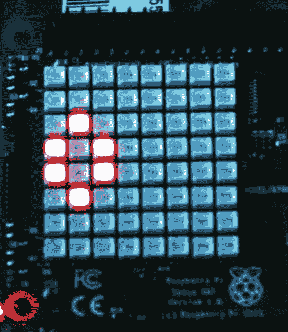

图 10-9。

当 Game of Life 运行时，Sense HAT LED 阵列

图 10-10 展示了游戏运行时的控制台显示。

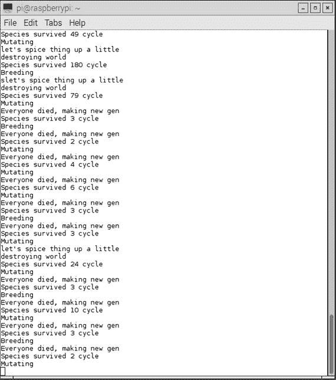

图 10-10。

运行生命游戏的控制台显示

### 生命游戏单代

也完全可以只实验生命游戏的一代。这个脚本仅仅遵循之前指定的细胞邻居规则，不允许细胞或基因突变。以下脚本命名为 main.py。它可以在与之前脚本相同的 GitHub 网站上找到。

```py
from sense_hat import SenseHat
from gameoflife import GameOfLife
import time
WHITE = [ 0, 0, 0 ]
RED = [ 255, 0, 0 ]
def main():
game = GameOfLife()
sense = SenseHat()
# cells = [(2, 4), (3, 5), (4, 3), (4, 4), (4, 5)]
cells = [(2, 4), (2, 5), (1,5 ), (1, 6), (3, 5)]
game.set_cells(cells)
while True:
try:
canvas = []
for i in game.world:
if not i:
canvas.append(WHITE)
else:
canvas.append(RED)
sense.set_pixels(canvas)
game.run()
if not game.everyone_alive():
sense.clear()
print("everyone died")
break
time.sleep(0.1)
except:
sense.clear()
break
if __name__ == "__main__":
main()
```

运行以下命令来运行此脚本：

```py
python main.py
```

初始细胞配置由以下语句设置：

```py
cells = [(2, 4), (2, 5), (1, 5), (1, 6), (3, 5)]
```

您可以通过取消注释之前的`cells`数组来尝试另一种配置，然后注释掉这个配置。我做了这个动作，然后运行了脚本。我观察到了一个不寻常的显示，这里就不描述了。我将留给您去发现。

我想提醒您，我即将描述的内容可能会变得相当上瘾。这是在测试新的初始起始模式的后果。有不止几位 AI 研究人员将他们的职业生涯奉献给了细胞自动机的学习，这包括研究生命游戏中的迷人演变模式。

图 10-11 展示了您可能希望尝试的一些起始配置。伴随的细胞配置数组值显示在每个模式旁边。

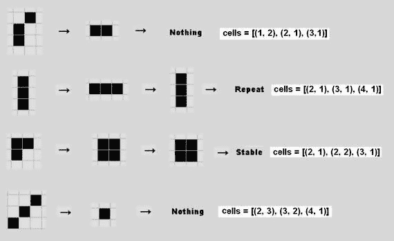

图 10-11。

生命游戏起始模式示例

两种模式立即消失（死亡），一种进入双稳态，第四种模式进入稳定状态。我测试了每种模式，并确认它们的行为如预期所示。

图 10-12 展示了您可以实验的其他初始模式，以观察它们根据设定的规则如何演变。伴随的细胞数组值显示在每个模式旁边。

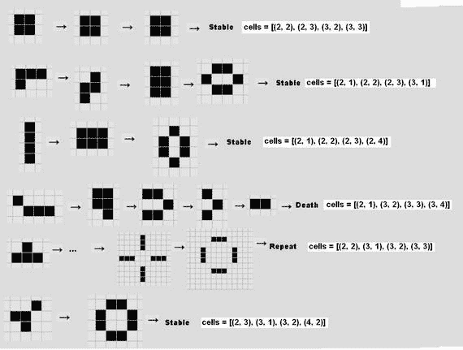

图 10-12。

其他起始模式

有一系列动态模式，这意味着它们会不断在网格上移动并重复其模式。图 10-13 展示了在网格上移动并在每四代重复其模式的滑翔模式。

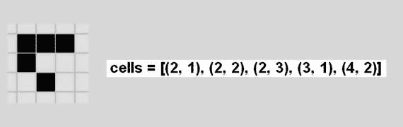

图 10-13。

滑翔模式

类似的动态模式是轻量级飞船，如图 10-14 所示。它也在网格上移动。

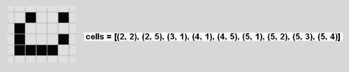

图 10-14。

轻量级飞船模式

康威发现了几个需要许多代才能最终进化并变得可预测和周期性的模式。顺便说一句，他没有使用计算机的帮助就做出了这些发现。他把这些模式称为 Methuselahs，这个名字来自《希伯来圣经》中描述的一个活了 969 岁的人。这些长寿模式中的第一个被称为 F-pentomino，如图 10-15 所示。它在 1101 代后变得稳定。

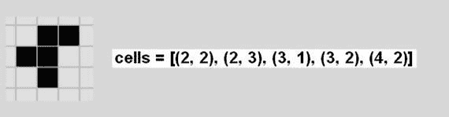

图 10-15。

F-pentomino 模式

图 10-16 中所示的 Acorn 模式是 Methuselah 的一个例子，它在经过 5206 代后变得稳定且可预测。

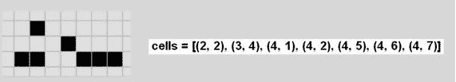

图 10-16。

Acorn 模式

想要实验更多模式的读者可以访问 Alan Hensel 的网页`radicaleye.com/lifepage/picgloss/picgloss.html`，在那里他整理了一个相当大的其他常见模式列表。

这完成了使用康威生命游戏作为工具的细胞自动机的初步探索。你现在应该能够利用这个工具进行更多实验，以获得更多经验和在这个强大的 AI 主题上的信心。我还强烈推荐斯蒂芬·沃尔夫拉姆博士的著作《一种新的科学》（Wolfram Media，2002 年），在这本书中，他使用他创建的 Mathematica 应用程序来审视整个细胞自动机领域。顺便说一句，Mathematica 应用程序现在可以免费从`raspberrypi.org`提供的最新 Raspian 发行版中获得。

## 摘要

本章讨论了进化计算。我以一个故事开始了本章，讲述了进化和变异是如何成为 EC 不可或缺的部分的。

第一次演示展示了如何使用进化编程结合进化和变异技术来解决相对简单的问题。解决方案最初是通过手工计算得出，然后通过一个 Python 脚本自动计算。

第二次演示介绍了遗传算法和遗传编程的 EC 子主题。我使用康威生命游戏的 Python 版本作为解释和演示这些概念的手段。本节还介绍了细胞自动机的概念，这是游戏的核心。

展示了两种游戏版本：一种使用遗传进化和变异，另一种更确定，你可以指定起始模式。后者进一步用于检查产生一些异常行为的各种细胞模式。

使用 Raspberry Pi 3 和 Sense HAT 附件板来显示生命游戏模拟。
