# 11. 基于行为的机器人学

基于行为的机器人学（BBR）是控制机器人的方法。其起源在于对动物和昆虫行为的研究。本章深入探讨了这种方法。

## 零件清单

对于第二个演示，你需要表 11-1 中列出的零件。

表 11-1.

零件清单

| 描述 | 数量 | 备注 |
| --- | --- | --- |
| Pi Cobbler | 1 | 40 引脚版本，T 或 DIP 形式均可接受 |
| 无焊面包板 | 1 | 带电源条，300 插入点 |
| 无焊面包板 | 1 | 300 插入点 |
| 跳线 | 1 包 |    |
| 超声波传感器 | 2 | 类型 HC-SR04 |
| 4.9kΩ 电阻 | 2 | 1/4 瓦 |
| 10kΩ 电阻 | 5 | 1/4 瓦 |
| MCP3008 | 1 | 8 通道 ADC 芯片 |

本章讨论的演示中有一个机器人，你可以通过附录中的说明来构建它。零件清单包括除基本机器人所需零件之外的其他零件。

BBR 的基础形式结构被称为吸收架构。1985 年，麻省理工学院教授罗德尼·布鲁克斯博士撰写了一份内部技术备忘录，标题为“用于移动机器人的鲁棒分层控制机制。”当时，布鲁克斯博士在麻省理工学院的人工智能实验室工作。他的备忘录随后于 1986 年作为一篇论文发表在 IEEE 机器人与自动化杂志上。他的论文改变了多年来的机器人研究性质和方向。论文的要点描述了他称之为吸收架构的机器人控制组织。该架构背后的理论部分基于人类大脑的进化发展。

## 人类大脑结构

在非常广泛的范围内，人类大脑可以分为三个级别或部分。最低级别是最原始的部分，负责基本的生命维持活动，如呼吸、血压、核心温度等。脑干是承载这些原始功能的有机脑部分。图 11-1 展示了脑干和边缘系统。

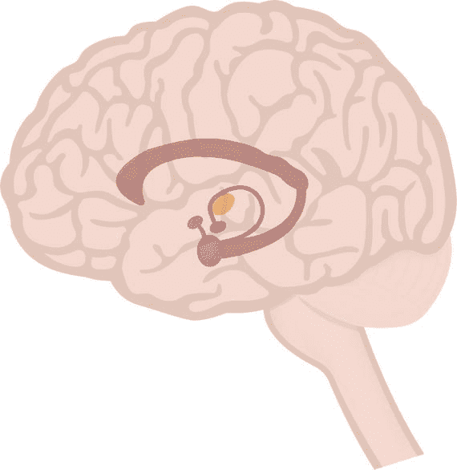

图 11-1.

脑干和边缘系统

大脑功能下一个较高的级别被称为爬行动物脑或边缘系统。它负责进食、睡眠、繁殖、飞行或战斗等行为。边缘系统由海马体、杏仁核、下丘脑和垂体组成。最后，最高的认知水平是新皮层，它负责学习、思考等高级复杂活动。组成新皮层或大脑皮层的脑部成分是额叶、颞叶、枕叶和顶叶。图 11-2 展示了构成大脑皮层的四个叶。

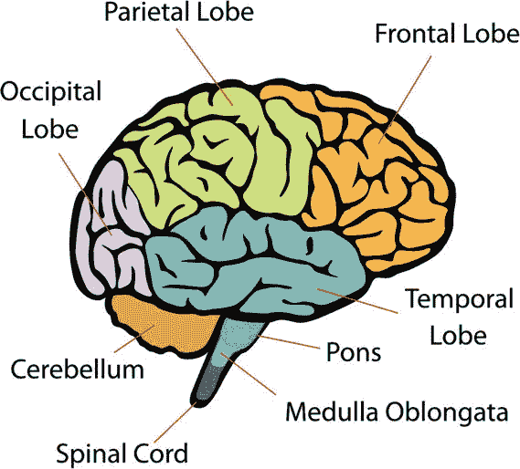

图 11-2.

大脑皮层

通常，这些不同的脑部层级功能彼此独立运作，但它们可以并且经常存在冲突。也许你有一个“易怒”的个性，发现食物是一种受欢迎的消遣，可以缓解压力。高级功能知道吃太多错误类型的食物对你没有好处，但低级爬行动物大脑仍然渴望它。哪个脑部层级会覆盖并改变你的行为是个问题。有时低级层级获胜，有时高级层级获胜。然而，如果你有上瘾，那么总是低级层级获胜并改变你的行为，通常是不良的改变。任何人都可以在特定时间有许多不同的脑部层级行为准备激活，但只有一种“获胜”并导致当前活跃行为被展示。这种脑部行为之间的相互作用是布鲁克斯博士的吸收架构的一个来源。

## 吸收架构

在讨论的这个阶段，对吸收的定义将有所帮助。然而，真正需要定义的是单词 subsume，因为吸收被循环定义为吸收的行为。

> subsume：将某事物纳入更广泛的类别；将某事物包含在更大的群体中或更高层次的群体中

这些定义暗示复杂的行为可以被分解成多个更简单的行为。必须添加另一个视角到定义中。这个添加是单词 reactive，因为在现实世界中，机器人依赖于传感器来根据感官输入做出反应或改变行为。这些输入不断对机器人环境的变化做出反应。反应性行为也称为刺激/反应行为，这适用于昆虫。与哺乳动物相比，昆虫是较低级的生命形式，它们没有高度发达的学习能力。它们所拥有的被称为习惯化，这允许昆虫适应某些类型的环

显示反应性系统传统方法的示意图如图 11-3 所示。

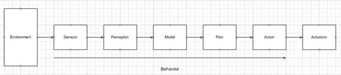

图 11-3.

基于传感器的系统的流程图

从传感器到动作的串行过程集合可以被视为一种行为。这种串行过程或任务的布局速度慢且相对不灵活。传感器获取数据而不尝试以任何方式处理它。这项工作留给感知块，它必须在将数据传递给模型块之前整理所有相关的感官数据。模型块将过滤后的数据转换为情境感知或状态。计划块根据从模型块接收到的状态遵循规则。最后，动作块执行从计划块接收到的适当规则，并将所需的控制信号发送到执行器，这些执行器在图中的最后一个块中显示。所有这些块在串行架构中使得响应速度慢，这不是一个好的机器人属性。

图中所示的串行块代表可以由单层表示的复杂行为。从行为的角度来看，一层可能被视为一个由代理或机器人要实现的目标。

复杂行为可以分解为更简单的行为。这是吞没架构的关键。图 11-4 显示了在图 11-3 中显示的复杂单层行为流中的两层分解。

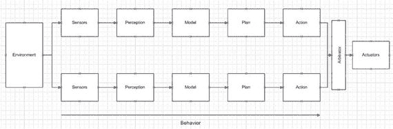

图 11-4。

两层行为串行流

每一层或路径都被认为与一个特定任务相关，例如跟随墙壁或检测障碍物。这是布鲁克斯博士提出的吞没架构。请注意，还有一个额外的仲裁块，它在将选定的信号发送到执行器之前处理所有动作块的信号。这个仲裁块是吞没架构中的另一个重要元素。

通过将单一、复杂的行为本质转化为多个并行路径，系统可以变得更加响应。也容易想象在不干扰现有任何层的情况下，可以添加更多层。在不修改现有代码的情况下扩展代码的功能，这与之前章节中讨论的软件组合原则非常相似。能够在不太多“干扰”现有代码的情况下扩展现有代码总是一件好事。

吞没架构并没有提供如何将复杂行为分解为更简单的多个任务的指导。此外，感知块通常被认为是所有块中最难定义和实现的。问题是从有限数量的环境传感器中创建一个有意义的数据库。然后，这个数据库为模型块提供数据，模型块有效地创建机器人的世界或状态。在这个阶段，BBR 与更传统的做法有显著的不同。我首先讨论传统的做法，然后是 BBR 方法。

### 传统方法

在传统方法中，模型块存储了机器人操作的真实世界的完整和准确模型。这可能通过多种方式实现，但通常涉及某种类型的几何坐标系，以便移动机器人建立当前状态并预测未来状态。传感器数据必须校准并准确，以便精确确定状态。理想状态信息要么基于传感器数据集存储，要么计算得出。与理想状态之间的偏差是传递到计划块的错误，以便采取适当的控制措施来最小化这些错误。控制器或执行器也必须精确和准确，以确保纠正动作严格符合由计划和行动块创建的命令。

传统的做法通常需要大量的计算机内存来存储或计算必要的状态信息。它比 BBR 方法慢，这反过来又使得机器人响应较慢。

### 基于行为机器人学方法

在讨论 BBR 之前，稍微偏离一下话题是有价值的。在动物行为学，也称为生态学的研究中，已经证明幼海鸥会响应父母的模型。图 11-5 展示了这样一个带有图例中圈出特征的父模型，这将触发幼海鸥的本能喂食行为。

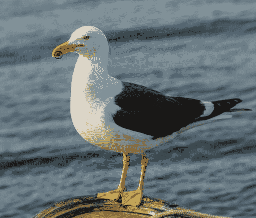

图 11-5。

海鸥生态学

对幼海鸥来说，重要的是父母海鸥模型有一个尖锐的喙，喙尖附近有一个彩色斑点。幼鸟张开嘴巴等待食物的到来。这些幼海鸥使用非常有限的现实世界表示，但它已被证明对于海鸥物种的生存是完全可以的。

同样，现实世界的机器人可以使用有限的现实世界表示或模型，因此它应该足以执行所需的要求，而不依赖于过于详细的世界模型。

这些有限的表示通常被称为“局部环境的快照”。行为被设计成对这些快照做出反应。两个重要点是，移动机器人不需要维护几何坐标系，也不需要有一个充满记忆的真实世界模型。通过利用类似反射的直接响应，移动机器人最小化了模型、计划和行动块的复杂性。行为流几乎回到了简单的行为图，如图 11-6 所示。

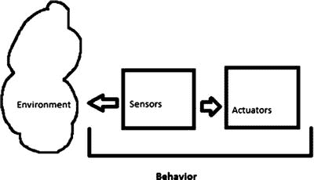

图 11-6。

简单的行为流

如何将环境快照与机器人行为相关联？最初，必须创建一个数据集，该数据集包含在环境条件存在时生成的传感器数据，这些数据应触发所需的机器人反射性行为。这些被称为传感器特征。现在需要做的就是使用解释例程将特征与特定行为联系起来，通常在预测块中完成。然而，可能存在一个问题，即由于相对粗粒度的传感器数据特征，可能会发生同时的刺激/响应配对。为简单行为分配优先级可以缓解这种情况。此外，默认或长期行为通常比新兴或“战术”行为具有较低的优先级。如果机器人遇到需要机器人控制系统立即注意的环境条件，就会发生战术特征。

实施行为优先级方案有一个意想不到的积极结果。机器人通常以相同的行为运行，例如向前移动。所有按顺序执行的行为都应该努力保持这种正常状态。只有在环境条件需要时，行为才会指导机器人偏离正常状态。当发生偏差时，优先级较高的行为接管并试图恢复正常状态。

BBR 还结合了长期进度指标，以帮助避免“循环”情况，例如机器人不断在两个障碍物之间弹跳或被锁定在墙角。这些长期进度指标有效地生成一个战略轨迹，其中机器人向一个大致方向或路径移动。当进度受阻时，选择不同的行为集以返回正常状态。

在分层子吸收模型中，低级层可能的目标是“避开障碍物”。这个层可能位于“四处游荡”的高级层“之下”。“四处游荡”的高级层被认为是吸收了“避开障碍物”的较低级行为。所有层都可以访问传感器以检测环境变化，以及控制执行器的能力。一个总体约束是，单独的任务有能力抑制任何输入并抑制发送到执行器的输出。这样，最低层可以非常敏感地响应环境变化，就像生物体中的反射一样。高级层更抽象，致力于满足目标。

以下行为可能由各种图形或数学模型表示：

+   功能符号

+   刺激/响应图

+   有限状态机 (FSM)

+   方案

我使用 FSM 模型，因为它提供了对行为交互的良好表示，而不需要太多的数学抽象。基本 FSM 模型如图 11-7 所示。

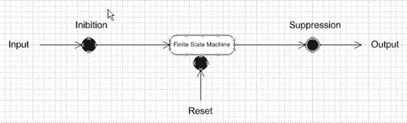

图 11-7.

基本 FSM 模型

图 11-8 展示了具有相互关系的多种行为，包括感觉抑制和执行器抑制。注意之前讨论过的分层行为序列和行为优先级。

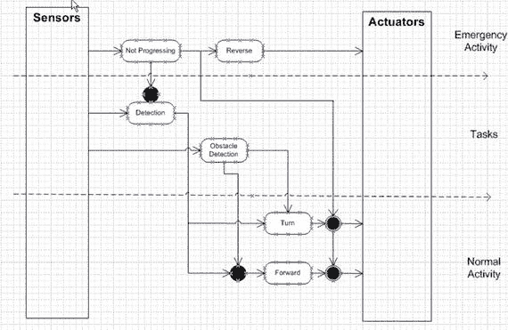

图 11-8。

多层有限状态机模型

在讨论的这个阶段，我通常会继续向你展示一个在 Raspberry Pi 上运行的子吸收架构的 Python 实现。然而，接下来，我将偏离常规，讨论一个非常棒的机器人模拟项目，它可以实现子吸收以及更多功能。

## 演示 11-1：Breve 项目

breve 项目是 Jon Klein 的作品，他将其作为他本科和研究生论文的一部分开发出来。它可以从 Jon 的网站 [www.spiderland.org](http://www.spiderland.org) 下载，适用于 Windows、Linux 和 Mac 平台。我正在 MacBook Pro 上使用它，并且它似乎运行得相当完美。只是要注意，Jon 在他的网站上声明，他不再积极更新这个应用程序，但至少在 Mac 格式上仍然提供。

这里是 Jon 自己的话来描述 breve 的内容：“breve 是一个免费的开源软件包，它使得构建多智能体系统和人工生命的 3D 模拟变得容易。使用 Python 或使用一种名为 steve 的简单脚本语言，你可以定义 3D 世界中智能体的行为，并观察它们如何交互。breve 包含物理模拟和碰撞检测，因此你可以模拟真实的生物。它还拥有一个 OpenGL 显示引擎，因此你可以可视化你的模拟世界。”

网站上有大量的 HTML 格式文档，我强烈建议你查阅；特别是介绍页面，展示了如何运行许多可用的演示脚本。这些脚本既在“steve”前端语言中，也在 Python 中。我无法浏览所有这些文档页面，这些页面本身可以构成一本书。我确实在 breve 中运行了以下 Python 脚本，名为 RangerImage.py。这里展示了脚本列表，以提供对使用 breve 的强大功能和灵活性的初步了解。

```py
import breve
class AggressorController( breve.BraitenbergControl ):
def __init__( self ):
breve.BraitenbergControl.__init__( self )
self.depth = None
self.frameCount = 0
self.leftSensor = None
self.leftWheel = None
self.n = 0
self.rightSensor = None
self.rightWheel = None
self.simSpeed = 0
self.startTime = 0
self.vehicle = None
self.video = None
AggressorController.init( self )
def init( self ):
self.n = 0
while ( self.n < 10 ):
breve.createInstances( breve.BraitenbergLight, 1 ).move( breve.vector( ( 20 * breve.breveInternalFunctionFinder.sin( self, ( ( self.n * 6.280000 ) / 10 ) ) ), 1, ( 20 * breve.breveInternalFunctionFinder.cos( self, ( ( self.n * 6.280000 ) / 10 ) ) ) ) )
self.n = ( self.n + 1 )
self.vehicle = breve.createInstances( breve.BraitenbergVehicle, 1 )
self.watch( self.vehicle )
self.vehicle.move( breve.vector( 0, 2, 18 ) )
self.leftWheel = self.vehicle.addWheel( breve.vector( -0.500000, 0, -1.500000 ) )
self.rightWheel = self.vehicle.addWheel( breve.vector( -0.500000, 0, 1.500000 ) )
self.leftWheel.setNaturalVelocity( 0.000000 )
self.rightWheel.setNaturalVelocity( 0.000000 )
self.rightSensor = self.vehicle.addSensor( breve.vector( 2.000000, 0.400000, 1.500000 ) )
self.leftSensor = self.vehicle.addSensor( breve.vector( 2.000000, 0.400000, -1.500000 ) )
self.leftSensor.link( self.rightWheel )
self.rightSensor.link( self.leftWheel )
self.leftSensor.setBias( 15.000000 )
self.rightSensor.setBias( 15.000000 )
self.video = breve.createInstances( breve.Image, 1 )
self.video.setSize( 176, 144 )
self.depth = breve.createInstances( breve.Image, 1 )
self.depth.setSize( 176, 144 )
self.startTime = self.getRealTime()
def postIterate( self ):
self.frameCount = ( self.frameCount + 1 )
self.simSpeed = (self.getTime()/(self.getRealTime()- self.startTime))
print '''Simulation speed = %s''' % (  self.simSpeed )
self.video.readPixels( 0, 0 )
self.depth.readDepth( 0, 0, 1, 50 )
if ( self.frameCount < 10 ):
self.video.write( '''imgs/video-%s.png''' % (self.frameCount))
self.depth.write16BitGrayscale('''imgs/depth-%s.png''' % (self.frameCount))
breve.AggressorController = AggressorController
# Create an instance of our controller object to initialize the simulation
AggressorController()
```

图 11-9 展示了实际在 breve 显示中运行的机器人，这是由前面的脚本创建的。

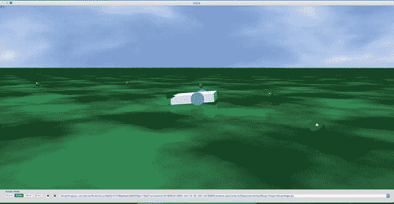

图 11-9。

breve 世界

你可能在脚本中注意到有关于 BraitenbergControl、BraitenbergLight 和 BraitenbergVehicle 的引用。这些是基于意大利-奥地利控制论学家[瓦伦蒂诺·布赖滕贝格](https://en.wikipedia.org/wiki/Valentino_Braitenberg#Valentino%20Braitenberg)进行的[思想实验](https://en.wikipedia.org/wiki/Thought_experiment#Thought%20experiment)。布赖滕贝格在 1984 年出版了《车辆：合成心理学实验》（麻省理工学院出版社），我强烈推荐想要了解更多关于他创新机器人方法的人阅读。在他的实验中，他设想车辆直接由传感器控制。产生的行为可能看起来很复杂，甚至很智能，但实际上，它基于一系列更简单的行为。这应该会让你想起正在起作用的吸收行为。

可以将 Braitenberg 车辆视为一个基于自身感官输入自主移动的代理。在这些思想实验中，传感器是原始的，仅仅测量一个刺激，这通常只是一个点光源。传感器也直接连接到电机执行器，这样传感器在受到刺激时可以立即激活电机。再次提醒，这应该让你想起图 11-4 中显示的简单行为流。

结果的 Braitenberg 车辆行为取决于传感器和电机如何连接。在图 11-10 中，传感器和电机之间有两种不同的配置。左侧的车辆被布线成避免或远离光源。这与右侧的车辆形成对比，后者朝向光源行驶。

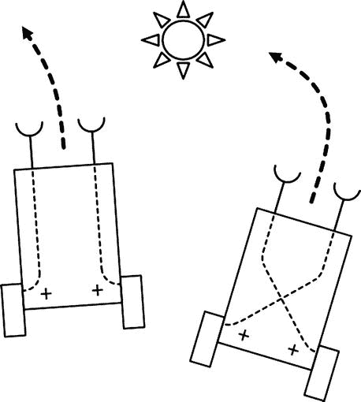

图 11-10。

Braitenberg 车辆

说左侧的车辆“害怕”光线，而右侧的车辆“喜欢”光线，并不算太大的跳跃。我已经将类似人类的行为赋予了机器人，这正是布赖滕贝格所寻求的结果。

另一个 Braitenberg 车辆有一个光传感器，具有以下行为：

+   更多的光线产生更快的移动。

+   更少的光线产生更慢的移动。

+   黑暗产生静止。

这种行为可以解释为害怕光线的机器人，它会快速移动以远离它。它的目标是找到一个黑暗的地方藏身。

当然，互补的 Braitenberg 车辆具有以下行为：

+   更多的黑暗产生更快的移动。

+   更少的黑暗产生更慢的移动。

+   全部光线产生静止。

在这种情况下，行为可以解释为寻求光线的机器人，它会快速移动以到达那里。它的目标是找到最亮的地方停车。

Braitenberg 车辆在具有多个刺激源复杂环境中表现出复杂和动态的行为。根据传感器和执行器之间的配置，Braitenberg 车辆可能会靠近一个源，但不接触它，迅速逃跑，或者围绕一个点画圈或八字形。图 11-11 阐述了这些复杂行为。

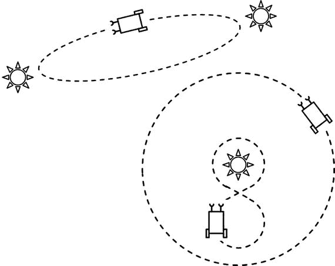

图 11-11。

具有复杂行为的 Braitenberg 车辆

这些行为可能看起来是有目标导向的、适应性的，甚至是有智能的，就像人们将最低限度的智能归因于蟑螂的行为一样。但事实是，这个代理是以纯粹机械的方式运作的，没有任何[认知](https://en.wikipedia.org/wiki/Cognition#Cognition)或推理过程。

在 breve Python 示例中，有几个项目我想进一步解释，以便为创建你自己的 Braitenberg 车辆的逐步示例做准备。首先要注意的是，所有 breve 模拟都需要一个控制器对象，该对象指定了模拟应该如何设置。在这个模拟中，控制器的名称是 AggressorController。在控制器定义中，至少有一个名为 `init` 的初始化方法。在这个特定的情况下，因为这是一个 Python 脚本，还有一个名为 `__init__` 的初始化方法。当 breve 对象被实例化时，会调用第一个初始化方法。当 Python 对象被实例化时，会自动调用第二个初始化方法。breve 使用一个名为桥（bridge）的第三个对象来处理 breve 和 Python 对象之间的关系。你通常不必担心这些桥对象。事实上，如果你只使用 steve 脚本语言（而不是 Python），你永远不会看到桥对象。

`init` 方法创建了 10 个 Braitenberg 光对象，其中一些可以在图 11-7 中看到。它们是围绕 Braitenberg 机器人（也是由 `init` 方法创建的，被称为 `vehicle`）的名为 `'n'` 的球体。

`__init__` 方法创建了模拟所需的所有属性，然后调用 `init` 方法，该方法是实例化所有必需的模拟对象并将实际值分配给属性。一旦完成这些，只需点击播放按钮即可查看模拟。

逐步演示从这里开始。以下列表创建了一个非功能性的 Braitenberg 车辆和一个光源：

```py
import breve
class Controller(breve.BraitenbergControl):
def __init__(self):
breve.BraitenbergControl.__init__(self)
self.vehicle = None
self.leftSensor = None
self.rightSensor = None
self.leftWheel = None
self.rightWheel = None
self.simSpeed = 0
self.light = None
Controller.init(self)
def init(self):
self.light = breve.createInstances(breve.BraitenbergLight, 1)
self.light.move(breve.vector(10, 1, 0))
self.vehicle = breve.createInstances(breve.BraitenbergVehicle, 1)
self.watch(self.vehicle)
def iterate(self):
breve.BraitenbergControl.iterate(self)
breve.Controller = Controller
Controller()
```

我将这个脚本命名为 firstVehicle.py，以表明它是开发工作模拟过程中生成的几个脚本中的第一个。图 11-12 展示了我在 breve 应用程序中加载并“播放”此脚本后的结果。

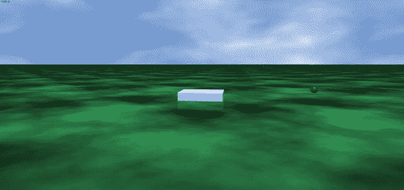

图 11-12。

firstVehicle 脚本的 breve 世界

此脚本定义了一个 `Controller` 类，它具有前面提到的两个初始化方法。`init` 方法实例化一个 Braitenberg 光对象和一个 Braitenberg 车辆。"__init__" 方法创建一个属性列表，该列表由后续脚本填充。此方法还调用了 `init` 方法。

还有一种名为 `iterate` 的新方法，它简单地将模拟连续运行。

开发脚本的下一步是向车辆添加传感器和轮子，以便它能够在 breve 世界中移动和探索。以下语句添加了轮子并设置了一个初始速度，使车辆在 breve 世界中旋转。这些语句被放入 `init` 方法中。

```py
self.vehicle.move(breve.vector(0, 2, 18))
self.leftWheel = self.vehicle.addWheel(breve.vector(-0.500000,0,-1.500000))
self.rightWheel = self.vehicle.addWheel( breve.vector(-0.500000,0,1.500000))
self.leftWheel.setNaturalVelocity(0.500000)
self.rightWheel.setNaturalVelocity(1.000000)
```

下一组语句添加了传感器。这些也被添加到 `init` 方法中。传感器也在轮子之间交叉链接（即，右传感器控制左轮，反之亦然）。`setBias` 方法设置传感器对其链接轮子的影响量。默认值是 1，这意味着传感器对轮子有轻微的正向影响。值为 15 表示传感器对轮子有强烈正向的影响。偏差也可以是负值，意味着影响与轮子激活直接相反。

```py
self.rightSensor = self.vehicle.addSensor(breve.vector(2.000000, 0.400000, 1.500000))
self.leftSensor = self.vehicle.addSensor( breve.vector(2.000000, 0.400000, -1.500000 ) )
self.leftSensor.link(self.rightWheel)
self.rightSensor.link(self.leftWheel)
self.leftSensor.setBias(15.000000)
self.rightSensor.setBias(15.000000)
```

前面的语句组被添加到 `init` 方法中。整个脚本名称被更改为 secondVehicle.py。传感器被设计成对任何光源都有自然的亲和力。然而，如果传感器没有检测到任何光源，它们将不会激活其相应的链接轮子。在此脚本配置中，传感器没有立即检测到光源，车辆简单地保持静止，这就是我为每个轮子设置初始自然速度的原因。这些设置保证了机器人会移动。它可能不会朝光源的方向移动，但它会移动。图 11-13 显示了带有增强车辆的更新后的 breve 世界。

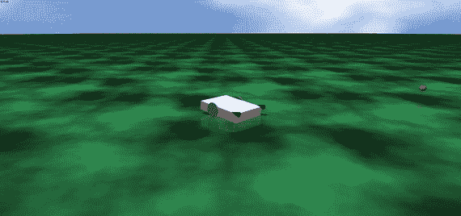

图 11-13。

secondVehicle 脚本的 breve 世界

在这个阶段，模拟正在运行，但有点无聊，因为车辆除了在 breve 世界中旋转外没有其他目的，也许只是瞥见那个孤立的光源。是时候给车辆一个更好的目标，以实现模拟背后的合理性。我使目标非常简单，因为这只是一个“hello world”类型的演示，其目的是阐明，而不是模糊化 breve 模拟的工作原理。目标是让车辆寻找多个光源，并简单地“跑过”它们。

这些额外的 Braitenberg 光源是通过以下添加到 `init` 方法的循环生成的。

```py
self.n = 0
while (self.n < 10):
breve.createInstances( breve.BraitenbergLight, 1).move( breve.vector((20 * breve.breveInternalFunctionFinder.sin(self, ((self.n * 6.280000) / 10))), 1,(20 * breve.breveInternalFunctionFinder. cos(self, ((self.n * 6.280000 ) / 10)))))
self.n = ( self.n + 1 )
```

我还注释掉了初始脚本中创建的单个光源。此外，我将自然速度重置为 0.0，因为现在有足够的光源，车辆传感器可能能够检测到。图 11-14 显示了更新的 breve 世界，其中包含一些额外的光源和车辆穿过它们。新的脚本被重命名为 thirdVehicle.py。

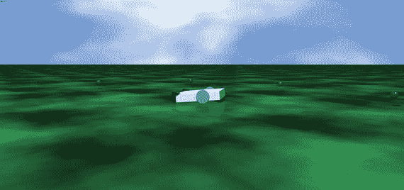

图 11-14。

thirdVehicle 脚本的 breve 世界

这个最后的脚本完成了我在 breve 环境中使用 Python 创建机器人模拟的入门课程。这门课程只是触及了 breve 能提供的表面——不仅限于机器人模拟，还包括一系列其他人工智能应用。看看图 11-15，看看你是否能认出它。

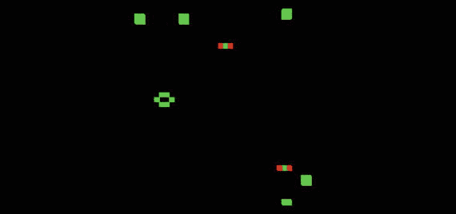

图 11-15。

breve 快照

这是康威生命游戏在 breve 中运行的快照。这个脚本名为 PatchLife.py。它可以在 Python 和 steve 格式的演示菜单选择中找到。实际上，大多数演示都以这两种格式提供。有许多演示可供您尝试，包括以下内容：

+   拉布雷特：车辆、灯光

+   化学：Gray Scott 扩散，超循环

+   DLA：扩散限制攻击（分形增长）

+   遗传学：2D 和 3D 的生命游戏

+   音乐：播放 midi 和 wav 文件

+   神经网络：多层

+   物理：弹簧、关节、步行者

+   群体：集群机器人和其他生命形式

+   地形：探索地形特征的机器人和生物

现在是时候结束 breve 的讨论，回到子集控制。

## Demo 11-2: 构建一个受子集控制机器人汽车

本节的目标是描述如何编程 Raspberry Pi 以直接控制机器人汽车。该机器人汽车与第七章中使用的相同平台，但现在使用子集架构来控制汽车的行为。Python 是子集类和脚本的实现语言。

在 GitHub 上搜索后，我受到了 Alexander Svenden 的 EV3 贴文的启发，该贴文使用 Python 实现了通用的子集结构。我还依赖我在使用 leJOS 开发子集 Java 类的经验。您可以在 [`www.lejos.org`](http://www.lejos.org) 上了解更多关于这些 Java 类的信息。需要两个主要类：一个名为 `Behavior` 的抽象类和另一个名为 `Controller` 的类。`Behavior` 类使用以下方法封装汽车的行为：

+   `takeControl()` : 返回一个布尔值，指示行为是否应该接管控制。

+   `action()` : 实现汽车执行的具体行为。

+   `suppress()` : 导致行为动作立即停止，然后返回汽车状态到下一个行为可以接管的状态。

```py
import RPi.GPIO as GPIO
import time
class Behavior(self):
global pwmL, pwmR
# use the BCM pin numbers
GPIO.setmode(GPIO.BCM)
# setup the motor control pins
GPIO.setup(18, GPIO.OUT)
GPIO.setup(19, GPIO.OUT)
pwmL = GPIO.PWM(18,20) # pin 18 is left wheel pwm
pwmR = GPIO.PWM(19,20) # pin 19 is right wheel pwm
# must 'start' the motors with 0 rotation speeds
pwmL.start(2.8)
pwmR.start(2.8)
```

`Controller`类包含主要的子总结逻辑，该逻辑根据优先级和激活需求确定哪些行为是活跃的。以下是这个类中的一些方法：

+   `__init__()`: 初始化`Controller`对象。

+   `add()`: 将一个行为添加到可用的行为列表中。它们被添加的顺序决定了行为的优先级。

+   `remove()`: 从可用的行为列表中移除一个行为。如果下一个最高优先级的行为覆盖它，则停止任何正在运行的行为。

+   `update()`: 停止旧的行为并运行新的行为。

+   `step()`: 找到下一个活跃的行为并运行它。

+   `find_next_active_behavior()`: 找到下一个希望变得活跃的行为。

+   `find_and_set_new_active_behavior()`: 找到下一个希望变得活跃的行为并使其变得活跃。

+   `start()`: 运行选定的动作方法。

+   `stop()`: 停止当前动作。

+   `continously_find_new_active_behavior()`: 实时监控希望变得活跃的新行为。

+   `__str__()`: 返回当前行为的名称。

`Controller`对象还充当一个调度器，一次只有一个行为是活跃的。活跃的行为由传感器数据和其优先级决定。当具有更高优先级的行为表示它想要运行时，任何旧活跃的行为都会被压制。

使用`Controller`类有两种方式。第一种方式是通过调用`start()`方法让类自己处理调度器。另一种方式是通过调用`step()`方法强制启动调度器。

```py
import threading
class Controller():
def __init__(self):
self.behaviors = []
self.wait_object = threading.Event()
self.active_behavior_index = None
self.running = True
#self.return_when_no_action = return_when_no_action
#self.callback = lambda x: 0
def add(self, behavior):
self.behaviors.append(behavior)
def remove(self, index):
old_behavior = self.behaviors[index]
del self.behaviors[index]
if self.active_behavior_index == index:  # stop the old one if the new one overrides it
old_behavior.suppress()
self.active_behavior_index = None
def update(self, behavior, index):
old_behavior = self.behaviors[index]
self.behaviors[index] = behavior
if self.active_behavior_index == index:  # stop the old one if the new one overrides it
old_behavior.suppress()
def step(self):
behavior = self.find_next_active_behavior()
if behavior is not None:
self.behaviors[behavior].action()
return True
return False
def find_next_active_behavior(self):
for priority, behavior in enumerate(self.behaviors):
active = behavior.takeControl()
if active == True:
activeIndex = priority
return activeIndex
def find_and_set_new_active_behavior(self):
new_behavior_priority = self.find_next_active_behavior()
if self.active_behavior_index is None or self.active_behavior_index > new_behavior_priority:
if self.active_behavior_index is not None:
self.behaviors[self.active_behavior_index].suppress()
self.active_behavior_index = new_behavior_priority
def start(self):  # run the action methods
self.running = True
self.find_and_set_new_active_behavior()  # force it once
thread = threading.Thread(name="Continuous behavior checker",
target=self.continuously_find_new_active_behavior, args=())
thread.daemon = True
thread.start()
while self.running:
if self.active_behavior_index is not None:
running_behavior = self.active_behavior_index
self.behaviors[running_behavior].action()
if running_behavior == self.active_behavior_index:
self.active_behavior_index = None
self.find_and_set_new_active_behavior()
self.running = False
def stop(self):
self._running = False
self.behaviors[self.active_behavior_index].suppress()
def continuously_find_new_active_behavior(self):
while self.running:
self.find_and_set_new_active_behavior()
def __str__(self):
return str(self.behaviors)
```

`Controller`类通过允许使用通用方法实现各种行为而非常通用。`takeControl()`方法允许一个行为表示它希望控制机器人。这种方式将在后面讨论。`action()`方法是行为开始控制机器人的方式。如果传感器检测到阻碍机器人路径的障碍物，障碍物避免行为将启动其`action()`方法。`suppress()`方法由优先级更高的行为用来停止或压制优先级较低的行为的`action()`方法。这发生在障碍物避免行为通过压制前进行为的`action()`方法并激活自己的`action()`方法来接管正常前进运动行为时。

`Controller` 类需要一个包含机器人整体行为的 `Behavior` 对象列表或数组。`Controller` 实例从 `Behavior` 数组中的最高数组索引开始，并检查 `takeControl()` 方法的返回值。如果是 true，它将调用该行为的 `action()` 方法。如果是 false，`Controller` 将检查下一个 `Behavior` 对象的 `takeControl()` 方法的返回值。优先级是通过附加到每个 `Behavior` 对象的索引数组值来分配的。`Controller` 类会不断重新扫描所有 `Behavior` 对象，并在高优先级行为在低优先级 `action()` 方法激活时断言 `takeControl()` 方法时抑制低优先级行为。图 11-16 展示了添加所有行为的过程。

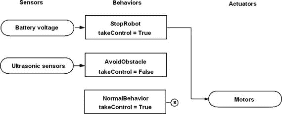

图 11-16。

行为状态图

现在是时候创建一个相对简单的基于行为的机器人示例了。

## Demo 11-3: Alfie 机器人车

目标机器人是 Alfie，它在之前的章节中已被使用。正常或低优先级的行为是向前行驶。高优先级的行为是避障，它使用超声波传感器检测机器人直接路径上的障碍物。避障行为是停止、后退并右转 90 度。

下一个类命名为 `NormalBehavior`。它强化了分层行为方法。这个类实现了所有必需的 `Behavior` 方法。

```py
class NormalBehavior(Behavior):
def takeControl():
return true
def action():
# drive forward
pwmL.ChangeDutyCycle(3.6)
pwmR.ChangeDutyCycle(2.2)
def suppress():
# all stop
pwmL.ChangeDutyCycle(2.6)
pwmR.ChangeDutyCycle(2.6)
```

`takeControl()` 方法应始终返回逻辑值 true。高优先级行为总是允许 `Controller` 类控制；这个低优先级请求控制并不重要。

`action()` 方法非常简单：使用全功率设置向前给电机供电。

`suppress()` 方法也很简单：它停止两个电机。

避障行为稍微复杂一些。它仍然实现了 `Behavior` 接口中指定的相同三个方法。我将类命名为 `AvoidObstacle` 以指示其基本行为。

```py
class AvoidObstacle(Behavior):
global distance1, distance2
def takeControl():
if distance1 <= 25.4 or distance2 <= 25.4:
return True
else:
return False
def action():
# drive backward
pwmL.ChangeDutyCycle(2.2)
pwmR.ChangeDutyCycle(3.6)
time.sleep(1.5)
# turn right
pwmL.ChangeDutyCycle(3.6)
pwmR.ChangeDutyCycle(2.6)
time.sleep(0.3)
# stop
pwmL.ChangeDutyCycle(2.6)
pwmR.ChangeDutyCycle(2.6)
def suppress():
# all stop
pwmL.ChangeDutyCycle(2.6)
pwmR.ChangeDutyCycle(2.6)
```

有几点关于这个类需要指出。`takeControl()` 方法仅在超声波传感器和障碍物之间的距离为 10 英寸或更少时返回逻辑 true。如果没有断言 true 值，此行为永远不会激活。

`action()` 方法使机器人后退 1.5 秒，如 `time.sleep(1.5)` 语句所示。然后机器人根据停止右电机并允许左电机继续运行旋转 0.3 秒。然后机器人停止等待下一个行为激活。

`suspense()` 方法简单地停止两个电机，因为没有其他明显的暂停避障的行为意图。

下一步是创建一个名为`testBBR`的测试类，它实例化了之前定义的所有类和一个`Controller`对象。请注意，我还添加了`StopRobot`类到这个列表中，我将在下文中讨论。这样做是为了避免另一个长的代码列表。以下列表命名为 subsumption.py：

```py
import RPi.GPIO as GPIO
import time
import threading
import numpy as np
# next two libraries must be installed IAW appendix instructions
import Adafruit_GPIO.SPI as SPI
import Adafruit_MCP3008
class Behavior():
global pwmL, pwmR, distance1, distance2
# use the BCM pin numbers
GPIO.setmode(GPIO.BCM)
# setup the motor control pins
GPIO.setup(18, GPIO.OUT)
GPIO.setup(19, GPIO.OUT)
pwmL = GPIO.PWM(18,20) # pin 18 is left wheel pwm
pwmR = GPIO.PWM(19,20) # pin 19 is right wheel pwm
# must 'start' the motors with 0 rotation speeds
pwmL.start(2.8)
pwmR.start(2.8)
class Controller():
def __init__(self):
self.behaviors = []
self.wait_object = threading.Event()
self.active_behavior_index = None
self.running = True
#self.return_when_no_action = return_when_no_action
#self.callback = lambda x: 0
def add(self, behavior):
self.behaviors.append(behavior)
def remove(self, index):
old_behavior = self.behaviors[index]
del self.behaviors[index]
if self.active_behavior_index == index:  # stop the old one if the new one overrides it
old_behavior.suppress()
self.active_behavior_index = None
def update(self, behavior, index):
old_behavior = self.behaviors[index]
self.behaviors[index] = behavior
if self.active_behavior_index == index:  # stop the old one if the new one overrides it
old_behavior.suppress()
def step(self):
behavior = self.find_next_active_behavior()
if behavior is not None:
self.behaviors[behavior].action()
return True
return False
def find_next_active_behavior(self):
for priority, behavior in enumerate(self.behaviors):
active = behavior.takeControl()
if active == True:
activeIndex = priority
return activeIndex
def find_and_set_new_active_behavior(self):
new_behavior_priority = self.find_next_active_behavior()
if self.active_behavior_index is None or self.active_behavior_index > new_behavior_priority:
if self.active_behavior_index is not None:
self.behaviors[self.active_behavior_index].suppress()
self.active_behavior_index = new_behavior_priority
def start(self):  # run the action methods
self.running = True
self.find_and_set_new_active_behavior()  # force it once
thread = threading.Thread(name="Continuous behavior checker",
target=self.continuously_find_new_active_behavior, args=())
thread.daemon = True
thread.start()
while self.running:
if self.active_behavior_index is not None:
running_behavior = self.active_behavior_index
self.behaviors[running_behavior].action()
if running_behavior == self.active_behavior_index:
self.active_behavior_index = None
self.find_and_set_new_active_behavior()
self.running = False
def stop(self):
self._running = False
self.behaviors[self.active_behavior_index].suppress()
def continuously_find_new_active_behavior(self):
while self.running:
self.find_and_set_new_active_behavior()
def __str__(self):
return str(self.behaviors)
class NormalBehavior(Behavior):
def takeControl(self):
return True
def action(self):
# drive forward
pwmL.ChangeDutyCycle(3.6)
pwmR.ChangeDutyCycle(2.2)
def suppress(self):
# all stop
pwmL.ChangeDutyCycle(2.6)
pwmR.ChangeDutyCycle(2.6)
class AvoidObstacle(Behavior):
def takeControl(self):
#self.distance1 = distance1
#self.distance2 = distance2
if self.distance1 <= 25.4 or self.distance2 <= 25.4:
return True
else:
return False
def action(self):
# drive backward
pwmL.ChangeDutyCycle(2.2)
pwmR.ChangeDutyCycle(3.6)
time.sleep(1.5)
# turn right
pwmL.ChangeDutyCycle(3.6)
pwmR.ChangeDutyCycle(2.6)
time.sleep(0.3)
# stop
pwmL.ChangeDutyCycle(2.6)
pwmR.ChangeDutyCycle(2.6)
def suppress(self):
# all stop
pwmL.ChangeDutyCycle(2.6)
pwmR.ChangeDutyCycle(2.6)
def setDistances(self, dest1, dest2):
self.distance1 = dest1
self.distance2 = dest2
class StopRobot(Behavior):
critical_voltage = 6.0
def takeControl(self):
if self.voltage < critical_voltage:
return True
else:
return False
def action(self):
# all stop
pwmL.ChangeDutyCycle(2.6)
pwmR.ChangeDutyCycle(2.6)
def suppress(self):
# all stop
pwmL.ChangeDutyCycle(2.6)
pwmR.ChangeDutyCycle(2.6)
def setVoltage(self, volts):
self.voltage = volts
# the test class
class testBBR():
def __init__(self):
# instantiate objects
self.nb = NormalBehavior()
self.oa = AvoidObstacle()
self.control = Controller()
# setup the behaviors array by priority; last-in = highest
self.control.add(self.nb)
self.control.add(self.oa)
# initialize distances
distance1 = 50
distance2 = 50
self.oa.setDistances(distance1, distance2)
# activate the behaviors
self.control.start()
threshold = 25.4 #10 inches
# use the BCM pin numbers
GPIO.setmode(GPIO.BCM)
# ultrasonic sensor pins
self.TRIG1 = 23 # an output
self.ECHO1 = 24 # an input
self.TRIG2 = 25 # an output
self.ECHO2 = 27 # an input
# set the output pins
GPIO.setup(self.TRIG1, GPIO.OUT)
GPIO.setup(self.TRIG2, GPIO.OUT)
# set the input pins
GPIO.setup(self.ECHO1, GPIO.IN)
GPIO.setup(self.ECHO2, GPIO.IN)
# initialize sensors
GPIO.output(self.TRIG1, GPIO.LOW)
GPIO.output(self.TRIG2, GPIO.LOW)
time.sleep(1)
# Hardware SPI configuration:
SPI_PORT   =  0
SPI_DEVICE = 0
self.mcp = Adafruit_MCP3008.MCP3008(spi=SPI.SpiDev(SPI_PORT, SPI_DEVICE))
def run(self):
# forever loop
while True:
# sensor 1 reading
GPIO.output(self.TRIG1, GPIO.HIGH)
time.sleep(0.000010)
GPIO.output(self.TRIG1, GPIO.LOW)
# detects the time duration for the echo pulse
while GPIO.input(self.ECHO1) == 0:
pulse_start = time.time()
while GPIO.input(self.ECHO1) == 1:
pulse_end = time.time()
pulse_duration = pulse_end - pulse_start
# distance calculation
distance1 = pulse_duration * 17150
# round distance to two decimal points
distance1 = round(distance1, 2)
time.sleep(0.1) # ensure that sensor 1 is quiet
# sensor 2 reading
GPIO.output(self.TRIG2, GPIO.HIGH)
time.sleep(0.000010)
GPIO.output(self.TRIG2, GPIO.LOW)
# detects the time duration for the echo pulse
while GPIO.input(self.ECHO2) == 0:
pulse_start = time.time()
while GPIO.input(self.ECHO2) == 1:
pulse_end = time.time()
pulse_duration = pulse_end - pulse_start
# distance calculation
distance2 = pulse_duration * 17150
# round distance to two decimal points
distance2 = round(distance2, 2)
time.sleep(0.1) # ensure that sensor 2 is quiet
self.oa.setDistances(distance1, distance2)
count0 = self.mcp.read_adc(0)
# approximation given 1023 = 7.5V
voltage = count0 / 100
self.control.find_and_set_new_active_behavior()
# instantiate an instance of testBBR
bbr = testBBR()
# run it
bbr.run()
```

到目前为止，这是一个展示如何轻松添加另一个行为的良好机会。

### 添加另一个行为

新的类封装了一个基于电池电压级别的停止行为。当电池电压降至临界水平以下时，您当然希望停止机器人。您还需要构建并连接一个电池监控电路，如图 11-17 所示电路。

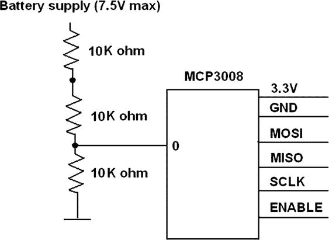

图 11-17。

电池监控电路图

此电路使用了之前章节中讨论的 MCP3008 ADC 芯片。您应该回顾此芯片的安装和配置，因为它使用 SPI，这需要一个专门的 Python 接口库。

新的`Behavior`子类名为`StopRobot`。它实现了所有三个`Behavior`子吸收方法，以及一个设置实时电压水平的方法。以下是这个类的代码：

```py
class StopRobot(Behavior):
critical_voltage = 6.0 # change to any value suitable for robot
def takeControl(self):
if self.voltage < critical_voltage:
return True
else:
return False
def action(self):
# all stop
pwmL.ChangeDutyCycle(2.6)
pwmR.ChangeDutyCycle(2.6)
def suppress(self):
# all stop
pwmL.ChangeDutyCycle(2.6)
pwmR.ChangeDutyCycle(2.6)
def setVoltage(self, volts):
self.voltage = volts
```

`testBBR`类也需要稍作修改以接受额外的行为。以下代码显示了必须添加到`testBBR`类的两个语句。请注意，`StopRobot`行为是最后添加的，使其成为最高优先级——正如它应该的那样。

`self.sr = StopRobot() (`将此代码添加到`Behavior`子类列表的底部。)

`self.sr.setVoltage(voltage) (`在电压测量后立即添加此代码。)

### 测试运行

机器人是通过 SSH 会话运行的，使机器人汽车完全自主，没有任何束缚的电线或电缆。脚本以以下命令开始：

```py
python subsumption.py
```

机器人立即直线行驶，直到遇到障碍物，即一个纸箱。当机器人距离箱子大约 10 英寸时，它迅速停下，向右转，然后继续直线行驶。为了演示的目的，停止在这里就足够了；尽管随着对机器人提出更多要求，机器人的行为可能需要不断微调。

想要深入研究 BBR 的读者可以查看以下推荐的网站和在线文章：

+   [`sccn.ucsd.edu/wiki/MoBILAB`](https://sccn.ucsd.edu/wiki/MoBILAB)

+   [`www.sci.brooklyn.cuny.edu/~sklar/teaching/boston-college/s01/mc375/iecon98.pdf`](http://www.sci.brooklyn.cuny.edu/%7Esklar/teaching/boston-college/s01/mc375/iecon98.pdf)

+   [`robotics.usc.edu/publications/media/uploads/pubs/60.pdf`](http://robotics.usc.edu/publications/media/uploads/pubs/60.pdf)

+   [`www.ohio.edu/people/starzykj/network/Class/ee690/EE690 Design of Embodied Intelligence/Reading Assignments/robot-emotion-Breazeal-Brooks-03.pdf`](http://www.ohio.edu/people/starzykj/network/Class/ee690/EE690 Design of Embodied Intelligence/Reading Assignments/robot-emotion-Breazeal-Brooks-03.pdf)

## 摘要

基于行为机器人学（BBR）是本章的主题。BBR 基于动物和昆虫的行为模式，特别是与生物体如何对其环境中的感官刺激做出反应相关的模式。

简短的一节讨论了人类大脑如何表现出多层行为功能，这些功能从基本的生存行为到复杂推理行为不等。随后介绍了吸收架构；它紧密模仿了人类大脑的多层行为模型。

深入的讨论涵盖了简单和复杂的行为模型。我选择使用有限状态模型（FSM）来演示本章的机器人汽车。

我接下来演示了一个名为 breve 的开源、图形化机器人仿真系统。创建并运行了一个简单的布赖滕贝格车辆仿真，进一步展示了刺激/响应行为模式是如何工作的。

最后的演示使用了 Alfie 机器人汽车，它由使用吸收架构模型创建的 Python 脚本控制。脚本包含三种行为，每种行为都有自己的优先级。我展示了基于吸收的行为如何根据机器人遇到的环境条件接管机器人。
