# 1. 异常检测简介

在本章中，你将了解一般异常、异常的分类以及异常检测。你还将了解为什么异常检测很重要，如何检测异常，以及这种机制的应用案例。

简而言之，本章涵盖了以下内容：

+   什么是异常？

+   不同异常的分类

+   什么是异常检测？

+   异常检测在哪里使用？

## 什么是异常？

在你开始学习异常检测之前，你必须首先了解你到底在针对什么。一般来说，**异常**是一个偏离预期的结果或值，但确定异常的确切标准可能因情况而异。

### 异常天鹅

为了更好地理解什么是异常，让我们看看一些坐在湖边的天鹅（图 1-1）。

一幅描绘湖边草地上 2 只天鹅的插图。

图 1-1

一对天鹅在湖边

假设我们想要观察这些天鹅，并对这个特定湖中天鹅的颜色做出假设。我们的目标是确定天鹅的正常颜色，并看看是否有天鹅的颜色与这个不同（图 1-2）。

一幅描绘湖边草地上 9 只天鹅的插图，其中 3 只面向右边，6 只面向左边。

图 1-2

出现了更多的天鹅，它们都是白色的

我们继续观察天鹅几年，它们都是白色的。鉴于这些观察结果，我们可以合理地得出结论，这个湖中的每只天鹅都应该都是白色的。就在第二天，我们再次在湖边观察天鹅。但是等等！这是什么？一只黑天鹅刚刚飞了进来（图 1-3）。

一幅描绘湖边草地上 9 只天鹅的插图，其中 3 只面向右边，6 只面向左边。一只面向左边的黑天鹅靠近湖边。

图 1-3

出现了一只黑天鹅

考虑到我们之前的观察，我们认为我们已经看到了足够多的天鹅，可以假设下一只天鹅也会是白色的。然而，这只黑天鹅完全违背了这一假设，使其成为一个*异常*。它并不是一个真正的离群值，例如，一个非常大的白色天鹅或一个非常小的白色天鹅；它是一只颜色完全不同的天鹅，使其成为一个异常。在我们的场景中，绝大多数的天鹅都是白色的，这使得黑天鹅极为罕见。

换句话说，给定一只湖边的天鹅，它黑色的概率非常小。我们可以用两种方法之一（尽管我们并不局限于这两种方法）来解释我们为什么将黑天鹅标记为异常。

首先，鉴于在这个特定湖泊观察到的天鹅绝大多数是白色的，我们可以假设，通过类似于归纳推理的过程，这里天鹅的正常颜色是白色。自然地，我们会根据我们之前的假设——所有天鹅都是白色的，并且在我们看到黑天鹅之前只看到过白天鹅——将黑天鹅标记为异常。

另一种看待黑天鹅为何是异常的方法是通过概率。现在假设这个湖中共有 1000 只天鹅，其中只有两只黑天鹅；天鹅是黑色的概率是 2/1000，或 0.002。根据*概率阈值*，即将被接受为正常的结果或事件的最低概率，黑天鹅可以被标记为异常或正常。在我们的情况下，我们将它视为异常，因为在这个湖中它的稀有性非常极端。

### 异常作为数据点

我们可以将这个相同的概念扩展到现实世界的应用中。在下面的例子中，我们将考察一个生产螺丝的工厂，并尝试确定在这个背景下可能出现的异常情况，并且从每个批次中抽取个别螺丝进行测试，以确保保持一定的质量水平。对于每个抽取的螺丝，假设测量了其密度和抗拉强度（螺丝在应力下的抗断裂能力）。

图 1-4 是各种抽取螺丝的示例图，虚线代表允许的密度和抗拉强度的范围。实线形成一个边界框，其中任何抗拉强度和密度值都在这个框内被认为是好的。

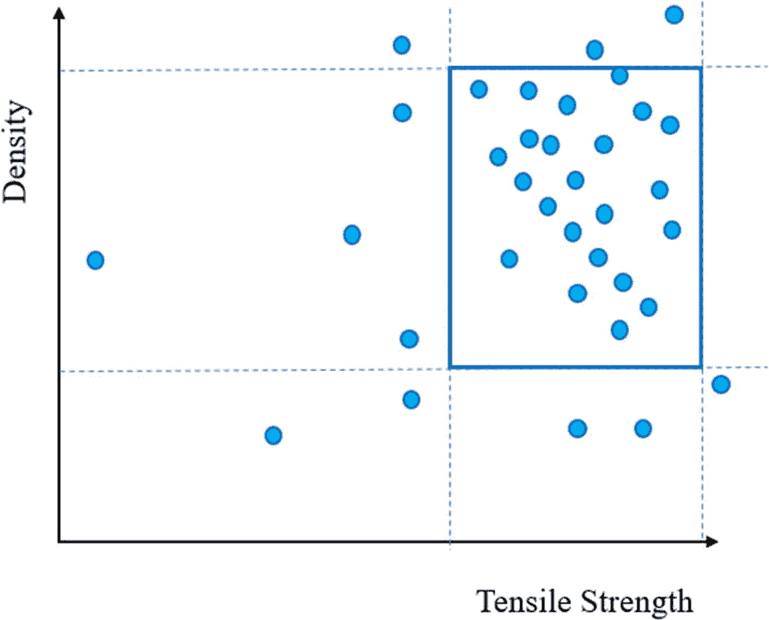

密度与抗拉强度的散点图。点集中在平面的右上角。

图 1-4

批次螺丝样本中的密度和抗拉强度

虚线的交点形成了包含数据点的几个不同区域。值得注意的是，由两组虚线交点形成的边界框（实线），因为它包含了被认为可接受样本的数据点（图 1-5）。任何在这个特定框外的数据点将被认为是异常的。

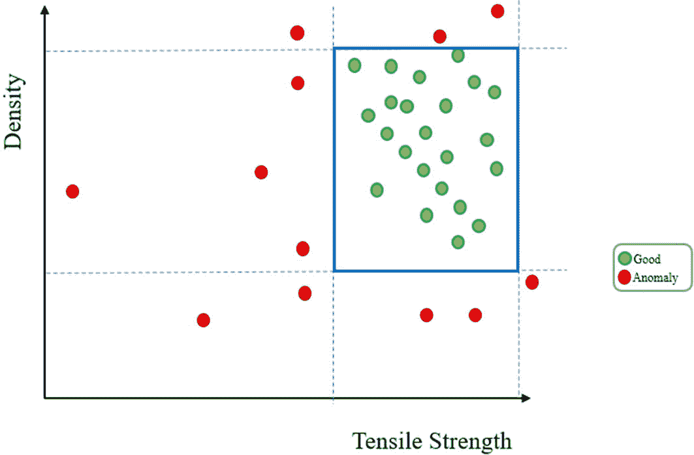

密度与抗拉强度的散点图。好的数据点集中在平面的右上角。异常点围绕好的数据点散布。

图 1-5

数据点根据其位置被识别为“好的”或“异常”

既然我们已经知道了哪些点是可接受的，哪些点不可接受，那么让我们从一批新的螺丝中抽取一个样本，并检查其数据，看看它在图（图 1-6）上的位置。

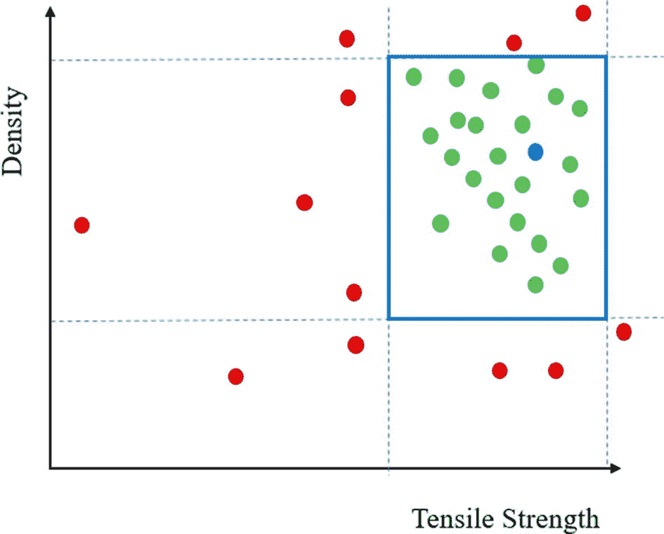

密度与抗拉强度的散点图。好的数据点集中在平面的右上角。异常值围绕着好的数据点散布。一个独特的点与好的数据点合并。

图 1-6

为新的样本螺丝生成一个新的数据点，数据点落在边界框内。

这个样本螺丝的数据在可接受的范围内。这意味着这批螺丝是好的，因为它的密度以及抗拉强度适合消费者使用。现在让我们看看下一批螺丝的样本并检查其数据（图 1-7）。

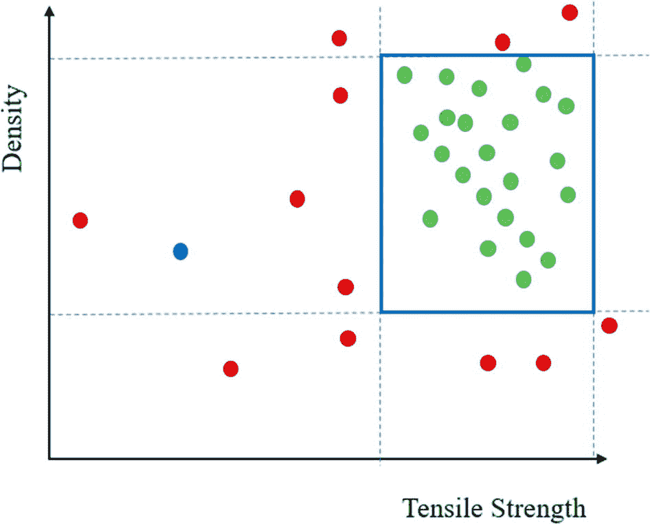

密度与抗拉强度的散点图。好的数据点集中在平面的右上角。异常值围绕着好的数据点散布。一个独特的点位于平面的左侧。

图 1-7

为另一个样本生成一个新的数据点，但这个数据点超出了边界框。

数据远远超出了可接受的范围。对于其密度，螺丝的抗拉强度极低，不适合使用。由于它已被标记为异常，工厂可以调查为什么这批螺丝变得脆弱。对于规模相当大的工厂来说，保持高标准的质量以及维持高稳定产量以满足消费者需求非常重要。对于如此重大的任务，自动化检测任何异常以避免发送出故障螺丝是必不可少的，并且具有极高的可扩展性。

到目前为止，我们已经探讨了异常作为数据点，它们要么是黑天鹅事件中的不合适，要么是故障螺丝中的不希望出现的。那么当我们引入时间作为新的变量时会发生什么呢？

### 时间序列中的异常

随着时间作为变量的引入，我们现在处理的是与数据集相关的*时间性*概念。这意味着某些模式依赖于时间。例如，每日、每月或每年的发生都是时间序列模式，因为它们在固定的时间间隔上呈现。

为了更好地理解基于时间序列的异常，让我们看看几个例子。

#### 个人消费模式

图 1-8 展示了一个人在一个月内的消费习惯。

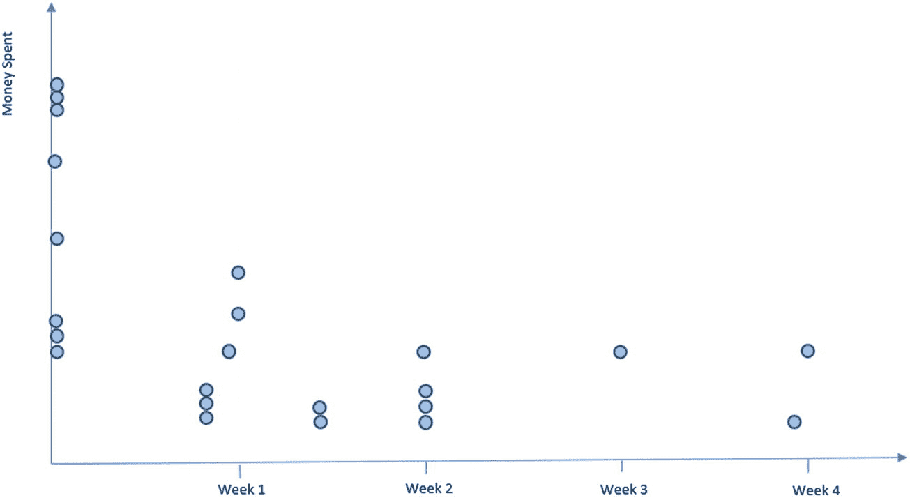

花费与第 1 至 4 周的关系散点图。第 1 周花费最高，而在第 1 周和第 2 周之间花费最低。

图 1-8

一个人在一个月内的消费习惯

假设月初支出激增是由于支付诸如租金和保险等账单。在工作日，我们的例子中的人偶尔外出就餐，在周末则购买杂货、衣服和其他各种物品。还假设这个月没有包括任何重大节假日。

这些支出可能每月都有所不同，尤其是在有重大节假日的月份。假设这个人住在美国，感恩节在 11 月的最后一个星期四。许多美国雇主也将感恩节后的星期五作为员工的休息日。美国零售商利用这一事实，通过提供所谓的“黑色星期五”的特殊优惠来吸引人们开始他们的圣诞节购物。考虑到这一点，让我们看看这个人在 11 月的消费模式（图 1-9）。不出所料，黑色星期五出现了大量购买，其中一些相当昂贵。

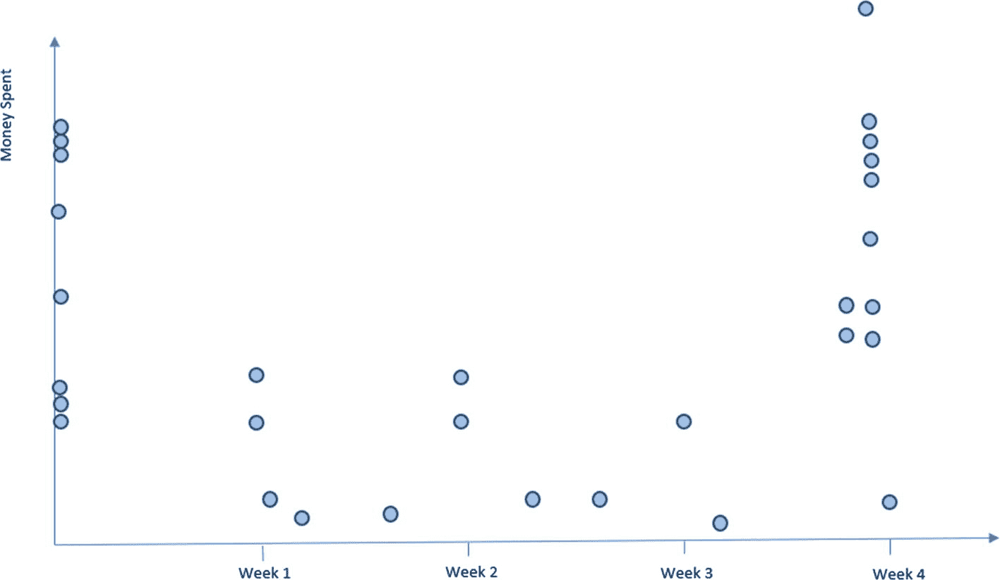

花费与第 1 周到第 4 周的关系散点图。第 4 周最高，在第 1 周和第 2 周之间最低。

图 1-9

同一个人在 11 月份的消费习惯

现在假设，不幸的是，我们的这个人信用卡信息被盗，负责此案的犯罪分子决定购买他们感兴趣的各种物品。使用与第一个例子（图 1-8；没有重大节假日）相同的月份，图 1-10 中的图表描述了可能发生的情况。

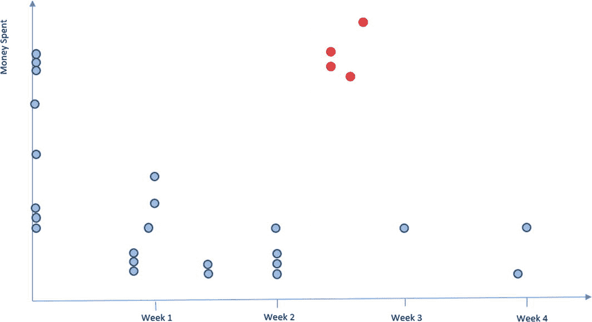

花费与第 1 周到第 4 周的关系散点图。第 1 周最高，在第 1 周和第 2 周之间最低。第 2 周和第 3 周之间有四个独特的点。

图 1-10

与图 1-8 中相同月份以该人名义进行的购买。

假设我们有一份关于这个用户多年购买记录的记录。多亏了这个建立的历史记录，这次购买激增会被标记为异常。这种购买群组可能在黑色星期五或圣诞节前的一周是正常的，但在没有重大节假日的任何其他月份，看起来就不太合适。在这种情况下，信用卡公司可能会联系这个人，确认他们是否真的进行了购买。

一些公司甚至可能会标记出符合正常社会趋势的购买。如果那个电视不是我们的这个人在黑色星期五买的呢？在这种情况下，信用卡公司的软件可以通过电话应用直接询问客户是否真的购买了该物品，从而为欺诈性购买提供一些额外的保护。

#### 出租车

作为时间序列异常的另一个例子，让我们看看一个随机城市和任意出租车公司的出租车接单和下�单的样本数据，看看我们是否能检测到任何异常。

在一个普通的日子里，总接单数可能看起来像图 1-11 中显示的图案。

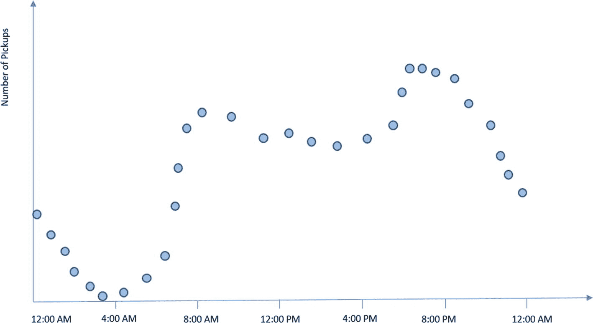

描述一天中接单数量与时间的关系的散点图。凌晨 4 点最低，大约下午 6 点最高。

图 1-11

一天内出租车公司的接单数量

从图表中我们可以看到，午夜后有一段时间的活动有所下降，在深夜时段接近零。然而，在早晨高峰时段，顾客流量突然增加，并保持到傍晚，在傍晚高峰时段达到峰值。这基本上就是平均一天的样子。

让我们进一步扩大范围，以获得一周内乘客流量的整体视角（图 1-12）。

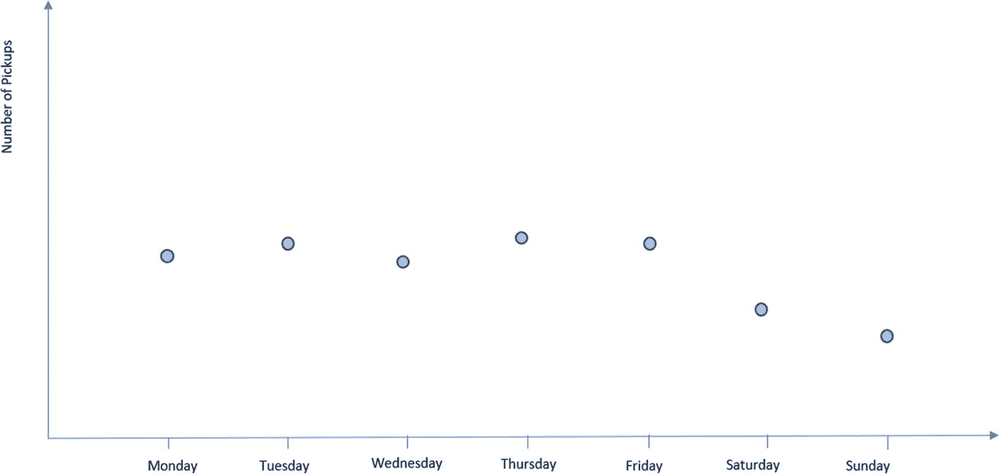

接单数量与一周中每一天的直方图。周二和周四接单量最高，周日接单量最低。

图 1-12

一周内出租车公司的接单数量

如预期的那样，大多数接单发生在工作日，通勤者必须上下班。周末，相当多的人仍然外出购物或只是去某个地方度过周末。

在这样的小规模上，异常的原因可能是任何阻止出租车运营或激励顾客不使用出租车的因素。例如，假设周五发生了一场可怕的雷暴。图 1-13 展示了该图表。

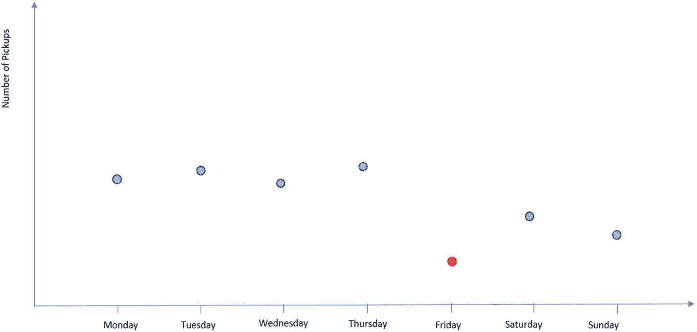

接单数量与一周中每一天的直方图。周二和周四接单量最高，周五接单量最低，并用不同的阴影标记。

图 1-13

一周内出租车公司的接单数量，周五有严重的雷暴

雷暴可能影响了某些人留在室内，导致工作日的接单量比平时低。然而，这类异常通常规模太小，不会对整体模式产生任何明显的影响。

让我们看一下整年的数据，如图 1-14 所示。

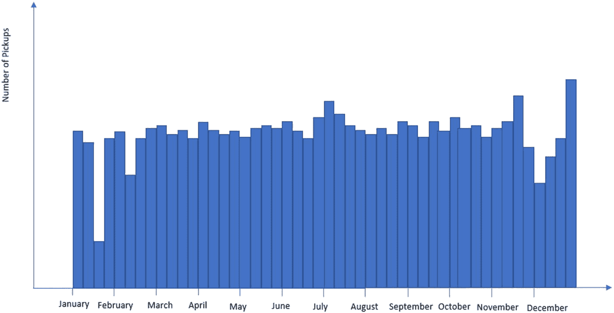

一年中的接单数量与月份的直方图，趋势基本均匀。12 月底接单量最高，1 月的第三季度接单量最低。

图 1-14

一年内出租车公司的接单数量

冬季月份接单量最大，因为预计会有暴风雪。这些是每年在相似时间可以观察到的常规模式，因此它们不是异常。但当相对罕见的极地涡旋在 4 月初降临城市并引发几次强烈暴风雪时，顾客流量水平会发生什么变化？图 1-15 展示了该图表。

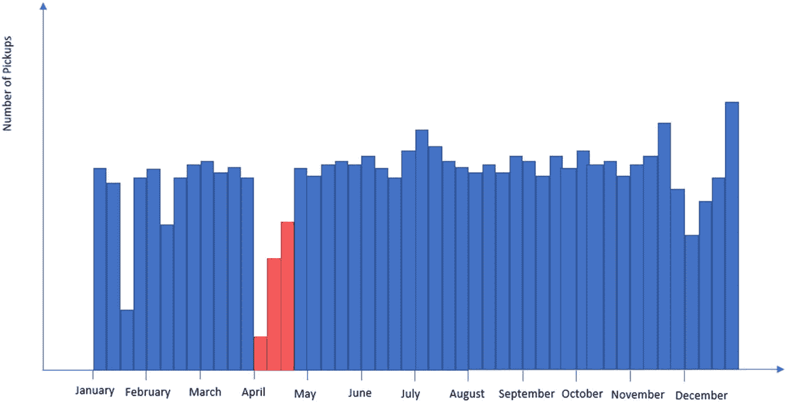

一年中的接单数量与月份的直方图。12 月底接单量最高，4 月的第一季度接单量最低。4 月的前三个季度用不同的阴影标记。

图 1-15

一年之中出租车公司的接单数量，以及四月份城市遭遇极地涡旋的情况

如你在图 1-15 中看到的，4 月的第一周暴风雪严重减缓了所有交通，并在接下来的两周给城市带来了负担。将此图与图 1-14 中显示的图进行比较，可以看出 4 月由于极地涡旋引起的异常是明显定义的。由于这种模式在 4 月份极为罕见，因此会被标记为异常。

## 异常类别

现在你对各种情况下可能出现的异常有了更多的了解，你可以看到它们通常分为以下这些广泛的类别：

+   基于数据点的异常

+   基于上下文的异常

+   基于模式的异常

### 基于数据点的异常

**基于数据点的异常**可能看起来与数据点集中的离群值相似。然而，如前所述，异常和离群值不是同一回事，尽管这些术语有时可以互换使用。**离群值**是预期将在数据集中存在的数据点，可能是由不可避免的随机错误或与数据采样方式相关的系统错误引起的。**异常**将是出乎意料存在的离群值或其他值。这些数据异常可能存在于任何存在值的数据集中。

以一个可能存在基于数据点异常的数据集为例，考虑一个甲状腺诊断值的数据集，其中大多数数据点表明甲状腺功能正常。在这种情况下，异常值代表有病的甲状腺。虽然它们不一定是离群值，但在考虑所有正常数据的情况下，它们出现的概率很低。

我们还可以检测到总金额过大的单个购买，并将它们标记为异常，因为根据定义，它们不应该发生或发生的概率非常低。在这种情况下，它们被标记为可能欺诈的交易，并且会联系持卡人以确保购买的合法性。

基本上，我们可以这样描述异常和离群值之间的区别：我们应该期望数据集中包含离群值，但不应该期望包含异常。尽管“异常”和“离群值”这两个术语有时可以互换使用，但异常并不总是离群值，而且并非所有离群值都是异常。

### 基于上下文的异常

**基于上下文的异常**包括那些最初可能看起来正常但根据其相应上下文被认为是异常的数据点。回到我们之前提到的个人消费例子，我们可能会预期在特定节假日附近会有购买量的突然增加，但在八月中旬这些购买可能看起来就不寻常。该人在黑色星期五的高额购买并未被标记为异常，因为这对于黑色星期五的人来说是典型的消费行为。然而，如果这些购买发生在与之前的购买历史不相符的月份，它就会被标记为异常。这看起来可能类似于之前为基于数据点的异常提供的例子，但基于上下文的异常的区别在于，单个购买不必是昂贵的。如果一个人因为拥有一辆电动汽车而从不购买汽油，那么突然购买汽油在上下文中就显得不合适。对于许多人来说，购买汽油是正常的行为，但在这种情况下，它被视为异常。

### 基于模式的异常

**基于模式的异常**是指与历史对比偏离的模式和趋势，它们通常出现在时间序列或其他基于序列的数据中。在之前的出租车公司例子中，四月份的客户接单数量与全年其他月份相当一致。然而，一旦极地涡旋来袭，数字明显下降，导致图表上出现巨大的下降，被标记为异常。

类似地，当监控工作场所的网络流量时，预期的网络流量模式是通过几个月甚至几年持续的数据监控形成的。如果员工试图下载或上传大量数据，它会在整体网络流量流中产生一定的模式，如果这种模式偏离了员工的正常行为，它可能会被视为异常。

作为基于模式异常的另一个例子，如果外部黑客决定对一个公司的网站发起**分布式拒绝服务（DDoS）攻击**——这是一种试图通过压垮处理特定网站网络流量的服务器，以试图使整个网站崩溃或停止其功能的行为——每一次尝试都会在网络上产生异常的峰值。所有这些峰值都明显偏离了正常流量模式，会被视为异常。

## 异常检测

现在你对不同的异常类型有了更好的理解，我们可以继续讨论创建用于检测异常的模型的途径。本节介绍我们可以采取的一些方法，但请记住，我们并不局限于这些方法。

回顾我们将黑天鹅标记为异常的原因。一个原因是，因为我们迄今为止看到的所有天鹅都是白色的，所以这只单独的黑天鹅显然是一个异常。用统计方法解释这个推理是，截至最近的观测数据集，我们有一只黑天鹅和成千上万只白天鹅。因此，黑天鹅出现的概率是所有观测到的天鹅中万分之一。由于这个概率如此之低，仅仅因为我们根本不期望看到它，黑天鹅就成为了异常。

本书将探讨的异常检测模型，要么通过在未标记数据上训练，要么通过在正常、非异常数据上训练，要么通过在正常和异常数据上训练标记数据来遵循这些方法。在识别天鹅的背景下，我们会被告知哪些天鹅是正常的，哪些天鹅是异常的。

那么，什么是异常检测？简单来说，**异常检测**是一个高级算法识别某些数据或数据模式为异常的过程。异常检测包括异常值检测、噪声消除、新颖性检测、事件检测、变化点检测和异常分数计算等任务。本书将探讨所有这些，因为它们基本上都是异常检测方法。以下列举的异常检测任务并不全面，但它们是当今一些较为常见的异常检测任务。

### 异常值检测

**异常值检测**是一种旨在检测给定数据集中异常异常值的技术。如前所述，可以应用于这种情况的三种方法是：仅用正常数据训练模型以识别异常（通过下一个描述的高重建误差），在概率分布中建模，其中异常将被标记为与非常低的概率相关联，或者训练一个模型来识别异常，通过教它异常和正常点看起来像什么。

关于高重建误差，可以这样想：模型在正常数据集上训练，并学习与正常数据相对应的模式。当暴露于异常数据点时，模式与模型学习关联的正常数据不匹配。重建误差可以与异常点与模型训练的正常点之间学习到的模式偏差相类比。我们将在第六章正式介绍重建误差。回到天鹅的例子，黑天鹅与我们通过观察湖中的天鹅学到的模式不同，因此它是异常的，因为它没有遵循颜色模式。

### 噪声消除

**噪声去除**涉及从数据集中过滤掉任何恒定的背景噪声。想象一下你在一个聚会上，你正在和一个朋友交谈。周围有很多背景噪声，但你的大脑专注于你朋友的说话声，并隔离它，因为那是你想要听到的。同样，模型学会高效地编码原始声音，只表示必要的信息。例如，编码你朋友的声音音调、节奏、语音语调等。然后，它能够重建原始声音，而不包含异常干扰噪声。

这也可能是一个图像以某种形式被修改的情况，例如通过扰动、细节丢失、雾气等。模型学会原始图像的准确表示，并输出一个不包含图像中任何异常元素的重建图像。

### 新颖性检测

**新颖性检测**与异常值检测非常相似。在这种情况下，新颖性是指模型所接触到的训练集之外的数据点，该数据点被展示给模型以确定它是否是异常。新颖性检测与异常值检测的关键区别在于，在异常值检测中，模型的任务是确定训练数据集中什么是异常。而在新颖性检测中，模型学会什么是正常数据点，什么不是，并试图对它从未见过的新的数据集中的异常进行分类。

例子可以包括工厂的质量保证，以确保新批次生产的产品符合标准，例如前面提到的螺丝例子。另一个案例是网络安全。可以监控传入的流量数据，以确保没有异常行为发生。这两种情况都涉及新颖性（新数据），需要不断进行预测。

### 事件检测

**事件检测**涉及检测时间序列数据集中偏离正常情况的数据点。例如，在本章前面提到的出租车公司例子中，极地涡旋减少了 4 月份的客户接单数量。这些与 4 月份的正常情况偏差都关联到数据集中发生的异常事件，事件检测算法会识别这些事件。事件检测的另一个例子是跟踪极地海冰水平随时间的变化，形成一个时间序列。事件检测算法可以精确地标记海冰水平何时异常偏离通常的正常水平，例如 2023 年 7 月最近发生的情况，当时海冰水平被检测到比设定的平均值低六个标准差。

### 变点检测

**变化点检测**涉及检测数据集中统计属性开始持续偏离由其余数据给出的既定规范的那些点。换句话说，变化点检测算法测量统计趋势的变化。一个很好的例子是全球平均温度随时间的变化。变化点检测算法可以识别持续变暖的时期，其中统计属性开始随时间变化。变化点检测算法可以识别加速变暖的时期，这些时期与正常的变暖速率不同。

### 异常分数计算

**异常分数计算**涉及为给定的数据样本分配一个表示其异常程度的分数。这不仅仅是对是否为异常的直接判断，而是在我们想要对数据样本可能偏离正常程度进行某种度量时使用。在某些情况下，异常分数计算是异常检测的直接前奏，因为你可以通过异常分数分配一个阈值，以确定哪些是异常，哪些不是。在其他情况下，异常分数计算可以帮助更深入地理解数据集，并通过提供对数据点正常程度的更细致的度量或数据样本偏离正常程度的一个度量来帮助数据分析。

## 异常检测的三种风格

有三种主要的“风格”的异常检测：

+   监督异常检测

+   半监督异常检测

+   无监督异常检测

**监督异常检测**是一种技术，其中训练数据对异常数据点和正常数据点都有标签。基本上，我们在训练过程中告诉模型一个数据点是否是异常。不幸的是，这不是最实用的训练方法，特别是因为整个数据集需要处理，每个数据点都需要标记。由于监督异常检测基本上是一种二分类任务，意味着模型的工作是将数据分类到两个标签之一，因此任何分类模型都可以用于这项任务，尽管并非每个模型都能达到高水平的性能。第九章提供了一个关于时间卷积网络背景下的示例。

**半监督异常检测**涉及部分标记训练数据集。对于“半监督”的确切实现和定义可能有所不同，但基本要点是你正在处理部分标记的数据。在异常检测的背景下，这可能是一个只有正常数据被标记的情况。理想情况下，模型将学习正常数据点的外观，以便它可以标记出与正常数据点不同的异常数据点。可以使用半监督学习进行异常检测的模型示例包括自动编码器，你将在第六章中了解它们。

**无监督异常检测**，正如其名所示，涉及在未标记的数据上训练模型。在训练过程之后，模型预计将知道数据集中哪些数据点是正常的，哪些点是异常的。隔离森林，我们将在第四章中探讨的模型，就是可以用于无监督异常检测的这样一个模型。

## 异常检测在哪些地方被使用？

无论我们是否意识到，异常检测现在正被应用于我们生活的几乎每一个方面。几乎任何涉及数据收集的任务都可以应用异常检测。让我们看看一些最普遍的领域和主题，异常检测可以应用于其中。

### 数据泄露

在今天的大数据时代，关于各种公司的用户存储了大量的信息，信息安全至关重要。任何信息泄露都必须立即报告并标记，但在如此大的规模上手动做到这一点是困难的。数据泄露可能从简单的意外事故开始，例如员工丢失了一个包含敏感公司信息的 USB 闪存驱动器，有人捡到并访问了数据，到故意行为，例如员工故意将数据发送给外部第三方，或者攻击者通过入侵攻击获得对数据库的访问。一些高调的数据泄露在新闻媒体中被广泛报道，例如 Facebook / Meta、iCloud 和 Google 的安全漏洞，数百万个密码或照片被泄露。所有这些公司都在国际范围内运营，需要自动化来监控一切，以确保对任何数据泄露的最快响应时间。

数据泄露可能甚至不需要网络访问。例如，一个员工可能通过电子邮件向外部第三方或与竞争对手公司有联系的另一名员工发送关于旅行计划以会面并交换机密信息的邮件。当然，这些邮件不会如此明显地直接表达这样的意图。然而，监控这些邮件可能有助于作为数据泄露后的分析，以找出公司内部的任何可疑人员，或者作为实时监控软件的一部分，以确保跨团队的数据保密合规性。异常检测模型可以筛选和处理员工邮件，以标记任何可疑活动。该软件可以捕捉关键词并处理它们，以理解上下文并决定是否标记员工的电子邮件以供审查。

以下是一些异常检测软件如何检测内部数据泄露的例子：

+   员工可能被分配一个特定的连接来上传数据。例如，一个员工不应频繁访问的大容量存储驱动器。

+   员工可能经常作为其工作职责的一部分访问数据。然而，如果他们突然开始下载大量他们不应下载的数据，那么异常检测器可能会标记这一点。

+   检测器会查看许多变量，包括用户是谁，访问的是哪个数据存储库，传输了多少数据量，用户多久与这个数据存储库互动一次等，以确定这次最近的互动是否偏离了既定模式。

在这种情况下，某些事情不会相符，软件会检测到并标记该员工。这可能只是一次性的授权事件，很好，模型完成了它的任务，但这次还好，或者可能表明员工以某种方式访问了他们不应该访问的数据，这意味着发生了数据泄露。

在工作场所使用异常检测的关键好处是它很容易进行扩展。这些模型可以用于小型公司，也可以用于大规模的国际公司。

### 身份盗窃

身份盗窃是当今社会另一个常见问题。多亏了在线服务的开发，使得购买物品时能够轻松访问，每天进行的信用和借记卡交易量大幅增长。然而，这种发展也使得窃取信用卡和借记卡信息或银行账户信息变得更加容易，如果卡没有被停用或账户没有得到再次保护，犯罪分子就可以购买他们想要的任何东西。由于交易量巨大，监控一切都很困难。然而，这就是异常检测可以介入并帮助的地方，因为它具有高度的可扩展性，可以在请求发送的瞬间帮助检测欺诈交易。

如我们之前讨论的，上下文很重要。当进行支付卡交易时，支付卡公司的异常检测软件会考虑持卡人的历史记录，以确定新的交易是否应该被标记。显然，突然进行的一系列高价值购买会立即引发警报，但如果是犯罪分子足够聪明，意识到这一点，只是随着时间的推移进行一系列购买，不会在持卡人的账户中留下明显的漏洞呢？再次强调，根据上下文，软件会捕捉到这些交易并将它们再次标记。

例如，假设某人的祖母最近才开始接触亚马逊网站和在线购物的概念。不幸的是，有一天她误入了一个类似亚马逊的网站，并输入了她的信用卡信息。另一方面，一些犯罪分子拿到了这些信息，开始随机购买物品，但不是一次性购买，以免引起怀疑——或者他认为不会引起怀疑。祖母的身份盗窃保险公司在最近注意到一些电池、硬盘、闪存驱动器和其他电子产品的购买。虽然这些购买可能并不昂贵，但与祖母之前购买的杂货、宠物食品和各种装饰品相比，它们显然是不同的。基于这一历史记录，检测软件会标记新的购买，并联系祖母以验证这些购买。这些交易甚至可能在尝试购买时就被标记为可疑。在这种情况下，购买者的位置或交易的性质可能会引发警报，阻止交易成功。

### 制造业

我们已经探讨了制造业中异常检测的应用案例。制造工厂通常必须确保其产品在发货前达到一定的质量标准。当工厂被配置成以近乎恒定的速率生产大量产品时，自动检查各种样品的质量变得必要。与虚构的螺丝制造商例子类似，现实生活中的制造工厂可能会测试并使用异常检测软件来确保各种金属部件、工具、发动机、食品、衣物等的质量。

### 网络

异常检测在网络安全领域可能是一个最重要的应用场景。互联网上遍布着各种网站，这些网站位于全球各地的服务器上。不幸的是，由于互联网的易用性，许多人出于恶意目的访问互联网。与之前在保护公司数据时讨论的数据泄露类似，黑客也可以对网站发起攻击，泄露其信息。

例如，黑客可能会试图通过网络攻击泄露政府机密。考虑到如此敏感的信息以及每天预期的大量攻击，自动化是帮助网络安全专业人员应对攻击并保护国家机密的一项必要工具。在较小的规模上，黑客可能会尝试突破云网络或局域网并尝试泄露数据。即使在这样较小的案例中，异常检测也能帮助检测正在发生的网络入侵攻击并通知相关官员。网络入侵异常检测的一个示例数据集是 KDD Cup 1999 数据集。该数据集包含大量条目，详细描述了各种类型的网络入侵攻击，以及每个攻击的详细变量列表，有助于模型识别每种攻击类型。

### 医学

异常检测在医学领域也发挥着巨大的作用。例如，模型可以检测患者心跳中的微妙不规则性以分类疾病，或者它们可以测量脑电波活动以帮助医生诊断某些状况。除此之外，它们还可以帮助分析患者的原始诊断数据，并对其进行处理以快速诊断任何可能的问题，类似于前面讨论的甲状腺例子。

异常检测甚至可以用于医学影像，以确定给定图像是否包含异常物体。例如，假设一个异常检测模型仅通过暴露于正常骨骼的 MRI 图像进行训练。当展示一个骨折图像时，它会将该新图像标记为异常。同样，异常检测甚至可以扩展到肿瘤检测，允许模型分析全身 MRI 扫描中的每一张图像，寻找异常生长或模式的存在。

### 视频监控

异常检测在视频监控中也有应用。异常检测软件可以监控视频流，并标记任何捕捉到异常行为的视频。虽然这听起来可能很反乌托邦，但它确实可以帮助捕捉罪犯并在繁忙的街道和其他交通系统中维护公共安全。例如，这种类型的软件可能能够将夜间街道上的抢劫事件识别为异常事件，并向最近的警察局发出警报。此外，这种类型的软件还可以检测交叉路口的异常事件，如事故或某些异常障碍，并立即引起对视频的关注。

### 环境

异常检测也可以用来监控环境条件。例如，异常检测系统被用来监控河流中的重金属水平，以检测潜在的水源泄漏或溢出。另一个例子是空气质量监测，它可以检测从远处传入的任何东西，从季节性花粉到野火烟雾。此外，异常检测还可以用于农业或环境调查案例中监测土壤健康，以评估生态系统的健康状况。土壤水分或特定营养水平的任何下降都可能表明某种问题。

## 摘要

通常，异常检测在医学、金融、网络安全、银行、网络、交通和制造业中得到广泛应用，但它并不局限于这些领域。对于几乎所有涉及数据收集的可想象案例，异常检测都可以被用来帮助用户自动化检测异常的过程，甚至可能移除它们。由于科学领域的数据收集量很大，许多科学领域都可以从异常检测中受益。如果异常是由系统误差或随机误差引起的，那么可能会检测并移除那些会干扰结果解释或以其他方式向数据引入某种偏差的异常。

在本章中，我们讨论了什么是异常以及为什么检测异常对我们组织的数据处理非常重要。

接下来，第二章将向您介绍您需要了解的核心数据科学概念，以便跟随本书的其余部分。
