# 2. 数据科学介绍

本章向您介绍了数据科学工作流程的基本原则。这些概念将帮助您准备数据，使其能够被输入到机器学习模型中，并通过分析理解其底层结构。

您将学习如何使用 Pandas、Numpy、Scikit-Learn 和 Matplotlib 库来加载数据、操作数据和数据分析。此外，您还将学习如何执行数据输入/输出；根据您的喜好操作、转换和处理数据；分析和绘制数据；以及为机器学习建模任务选择/创建相关特征。

简而言之，本章涵盖了以下主题：

+   数据输入/输出

+   数据操作

+   数据分析

+   数据可视化

+   数据处理

+   特征工程/选择

注意

代码示例提供在 Python 3.8 中。所有框架的包版本都提供。您需要某种类型的程序来运行 Python 代码，所以请确保提前设置好。本书的代码仓库可在[`github.com/apress/beginning-anomaly-detection-python-deep-learning-2e/tree/master`](https://github.com/apress/beginning-anomaly-detection-python-deep-learning-2e/tree/master)找到。

仓库还包括一个 requirements.txt 文件，用于检查您的包及其版本。

本章的代码示例可在[`github.com/apress/beginning-anomaly-detection-python-deep-learning-2e/blob/master/Chapter%202%20Introduction%20to%20Data%20Science/chapter2_datascience.ipynb`](https://github.com/apress/beginning-anomaly-detection-python-deep-learning-2e/blob/master/Chapter%202%20Introduction%20to%20Data%20Science/chapter2_datascience.ipynb)找到。导航到“第二章 数据科学介绍”然后点击 chapter2_datascience.ipynb。代码也以 .py 文件的形式提供，尽管它是笔记本的导出版本。

我们将使用 JupyterLab ([`jupyter.org`](https://jupyter.org)) 来展示所有的代码示例。

## 数据科学

“数据科学”这个词现在非常流行，那么它究竟是什么呢？最近，术语“数据科学”已经代表了一系列的角色和职责。根据公司不同，数据科学家可能需要执行从数据处理（通常规模较大，涉及“大数据”领域）到统计分析与可视化，再到训练和部署机器学习模型的各种任务。实际上，数据科学家通常一次执行两个或更多这些角色。

本章侧重于三个角色的概念，在您探索第三章建模方面之前，引导您准备和分析数据集。

请注意，这将对这些各种数据科学包提供的相关功能进行简要、高级的概述。每个包都非常全面，需要一本书来深入探讨。因此，鼓励您探索每个包的在线文档以及其他指南和教程，以尽可能多地学习。

### 数据集

对于初露头角的数据科学家来说，泰坦尼克号数据集是一个流行的入门级数据集，可在 Kaggle 上找到：[`https://www.kaggle.com/c/titanic`](https://www.kaggle.com/c/titanic)。你还可以在这个书的存储库中找到这个数据集：[`https://github.com/apress/beginning-anomaly-detection-python-deep-learning-2e/blob/master/data/train.csv`](https://github.com/apress/beginning-anomaly-detection-python-deep-learning-2e/blob/master/data/train.csv)。

Kaggle 是寻找数据集的好地方。它还举办机器学习建模竞赛，其中一些竞赛甚至提供奖金。Kaggle 是练习技能的绝佳资源，鼓励大家去使用！如果你想要练习本书中学到的概念，可以在 Kaggle 上搜索各种异常检测数据集。

要从 Kaggle 网站下载泰坦尼克号数据集，请遵循下面的说明。如果你愿意，Kaggle 提供了一个可以通过 PIP 安装的 API，地址为[`https://github.com/Kaggle/kaggle-api`](https://github.com/Kaggle/kaggle-api)。


Kaggle 网站的概述页面截图。在竞赛页面下，标题为“Ahoy，欢迎来到 Kaggle，你找到了正确的位置，标题为‘泰坦尼克号机器学习：灾难中的学习’”。

图 2-1

Kaggle 上泰坦尼克号数据集的概述页面（截至 2023 年 4 月的情况）

1.  前往 [`www.kaggle.com/c/titanic`](https://www.kaggle.com/c/titanic)，你将看到类似图 2-1 的界面。

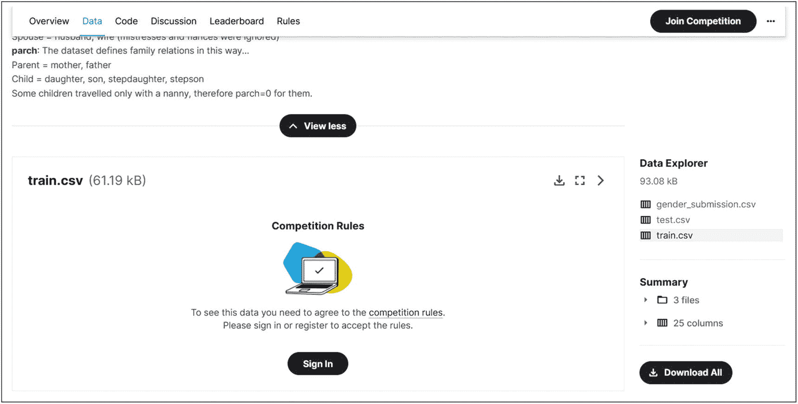

数据标签页的截图显示了一个名为 train.dot.csv 的压缩文件，以及位于竞赛规则下方的登录按钮。加入竞赛按钮位于顶部。在右侧面板中，提供了数据探索器和摘要信息，下方有一个“下载全部”按钮。

图 2-2

点击“下载全部”以下载数据作为压缩文件

1.  点击“数据”标签页。你应该会看到一个数据集的简要描述以及一个数据探索器，如图 2-2 所示。

1.  点击“下载全部”。系统会提示你登录。你可以创建一个账户或者使用其他选项登录。登录后，你将返回到概述页面。

1.  返回“数据”标签页，向下滚动，然后点击“下载全部”。将下载一个压缩文件。

1.  在任何你想要的地方解压这个压缩文件，并记下目录路径。

在你解压压缩文件后，你几乎可以开始使用 Python 处理这个数据集了。首先，确保你有一个用于开发 Python 代码的 IDE。为了轻松地跟随本书中的示例，建议使用 Jupyter Notebook 或 JupyterLab。

接下来，确保你已经安装了以下库及其版本，尽管你可能还想检查 GitHub 存储库上可用的 requirements.txt 文件或使用它来准备你的环境：

+   pandas==2.0.0

+   numpy==1.22.2

+   scikit-learn==1.2.2

+   matplotlib==3.7.1

不必拥有完全相同的版本，但请记住，较旧的版本可能不包含我们在本书后面探索的功能。新版本应该没问题，除非它们非常新，这可能会导致重新设计的语法或功能，从而引入不兼容性。

你可以很容易地在 Python 中检查版本。图 2-3 介绍了导入这些包并打印它们版本的代码。

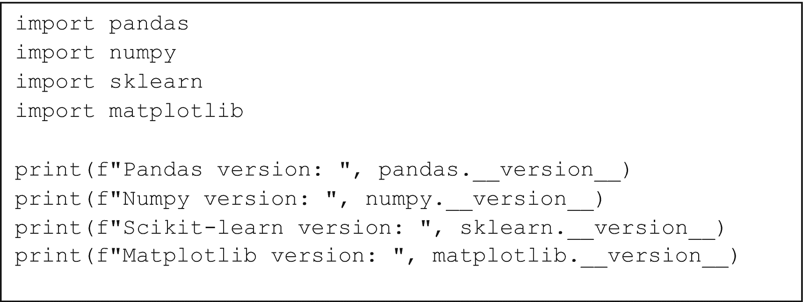

一段 8 行的 Python 代码。导入 pandas、numpy、sklearn 和 matplotlib 库并打印它们的版本。

图 2-3

导入 pandas、numpy、sklearn 和 matplotlib 并打印它们版本的代码

你应该看到类似于图 2-4 中显示的输出。


一个有 4 行输出的输出窗口如下。Pandas 版本 2.0.0。Numpy 版本 1.22.2。Scikit learn 版本 1.2.2。Matplotlib 版本 3.7.1。

图 2-4

在图 2-3 中运行代码的文本输出

### Pandas、Scikit-Learn 和 Matplotlib

**Pandas** 是一个用于 Python 的数据科学框架，它允许你自由地操纵和分析数据以满足你的需求。它是一个功能丰富的、全面的框架，提供了许多功能，应该适合你的数据处理需求。直到你开始将数据集扩展到千兆字节级别，Pandas 都可以快速高效。

**Scikit-Learn** 是一个机器学习库，它涵盖了与机器学习建模相关的广泛功能，从数据处理函数到各种机器学习方法

**Matplotlib** 是一个数据可视化库，它允许你构建定制的图表和图形。它与 pandas 和 scikit-learn 集成得很好，甚至允许你显示图像。

**NumPy** 是一个用于数值计算的库，它为各种计算任务提供了高度高效的实现。你可以将你的数据表示为 NumPy 数组，并执行快速、矢量化计算，线性代数操作等。NumPy 与许多流行的 Python 包集成得非常好，包括 pandas、scikit-learn 和 matplotlib。

使用所有这些包，你应该能够执行全面的数据分析。然而，请记住，还有其他 Python 包可用于补充你的数据分析，例如 **statsmodels**（统计建模库）、**seaborn**（另一个绘图库，我们将在后续章节中使用）、**plotly**（另一个绘图库，用于交互式图形）和 **scipy**（科学计算库，它允许你执行各种统计测试）

### 数据输入/输出

在我们的环境设置完成后，让我们直接进入内容。在我们进行任何类型的数据分析之前，我们实际上需要数据。在 Pandas 中加载数据有无数种方法，但我们将保持简单，从 csv 文件中加载。

为了方便，让我们用别名重新导入我们的库，如图 2-5 所示。


三行 Python 代码导入库 pandas 作为 p d，NumPy 作为 n p，以及 mat plot lib dot p y plot 作为 p l t。

图 2-5

为了方便起见，让我们重新导入我们的库，如图 2-5 所示。

一旦执行了这段代码，让我们继续加载我们的数据集。

#### 数据加载

首先，确保你的数据集路径已定义，如图 2-6 所示。


两行 Python 代码设置数据路径以定义泰坦尼克号训练数据集。

图 2-6

指定泰坦尼克号训练数据集的路径

你可以选择将其定义为完整的、绝对路径，只是为了确保 Pandas 能够找到这个文件，如果你遇到问题的话。在这里，数据文件夹位于我们的笔记本目录级别之上，因为它包含每个章节共有的数据文件。

为了加载数据，我们将使用 `pd.read_csv(data_path)`，如图 2-7 所示。`read_csv()` 方法读取一个 csv 文件及其包含的所有数据。它还可以读取其他输入格式，包括 JSON、SAS7BDAT 和 Excel 文件。更多详细信息请参阅 Pandas 文档：[`https://pandas.pydata.org/docs/reference/index.xhtml`](https://pandas.pydata.org/docs/reference/index.xhtml)。

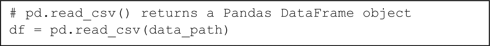

一行 Python 代码使用 p d read c s v 函数返回 Pandas Dataframe 对象。

图 2-7

`pd.read_csv()` 接收路径作为参数并返回一个 pandas DataFrame

如果没有产生任何错误，你现在已经加载了一个 pandas 数据框。一个可视化这个数据框的简单方法是使用 `df.head(``N``)`，其中 `N` 是一个 *可选* 参数，用于定义你想要查看多少行。如果你不传递 `N`，默认显示五行。只需运行图 2-8 中所示的代码行即可。


一行 Python 代码读取 d f dot head 2。

图 2-8

在 `df` 上调用 `.head(2)` 来显示 `df` 的两行

你应该看到类似于表 2-1 的输出。

表 2-1

执行图 2-8 中的代码的输出

|   | PassengerId | Survived | Pclass | Name | Sex | Age | SibSp | Parch | Ticket | Fare | Cabin | Embarked |
| --- | --- | --- | --- | --- | --- | --- | --- | --- | --- | --- | --- |
| **0** | 1 | 0 | 3 | Braund, Mr. Owen Harris | male | 22.0 | 1 | 0 | A/5 21171 | 7.2500 | NaN | S |
| **1** | 2 | 1 | 1 | Cumings, Mrs. John Bradley (Florence Briggs Th... | female | 38.0 | 1 | 0 | PC 17599 | 71.2833 | C85 | C |

要获取表格的维度，运行以下代码：

```py
df.shape
```

这返回一个包含表格维度的元组 (*M*，*N*)。它显示了 *M* 行和 *N* 列。对于此示例，您应该看到以下打印输出：

```py
(891, 12)
```

#### 数据保存

要保存您的数据集，请调用 `df.to_csv(save_path)`，其中 `save_path` 是一个包含字符串路径的变量，您希望将 dataframe 保存到该路径。（除了 csv 之外，还有许多其他输出格式可用。）例如，运行图 2-9 中显示的代码。

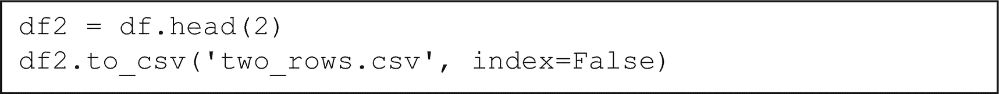

使用 df head 函数返回带有假索引的两行 Python 代码。

图 2-9

`df.head(2)` 返回 `df` 的两行，并将其保存为 `df2`。然后，通过传递参数 `index=False` 将其保存为 `two_rows.csv`。此参数告诉 pandas 不要将索引作为 csv 的一部分保存，因此不会在之前没有索引的数据中引入额外的列

参数 **index=False** 告诉 pandas 不要将 dataframe 索引保存到 csv 中。当您加载数据时，pandas 会创建索引，如果您需要，可以覆盖为自定义索引。您可以将此更改为 `index=True`（这是默认值）并查看这如何更改 csv 输出。

#### DataFrame 创建

除了从特定源加载数据外，您还可以根据列表或字典从头创建 dataframe。当您以迭代方式在多个不同的变量设置上执行实验，并希望将数据保存到漂亮的表格中时，这非常有用。

图 2-10 中显示的代码创建了一个任意指标的 dataframe。

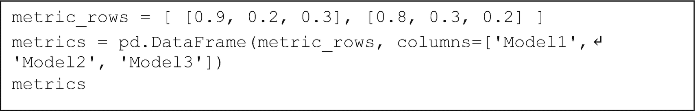

四行 Python 代码创建了一个包含两行和三列的 dataframe。列标题是模型 1、2 和 3。

图 2-10

从列表的列表（两行，三列）创建 dataframe

注意

图 2-10（以及随后的代码显示）中的 ↵ 符号表示代码已被截断，并且它仍然是同一行。因此，`'Model1', 'Model2', 'Model3'])` 是此行的实际结束。

输出应类似于表 2-2。

表 2-2

执行图 2-10 中代码的输出

|    | Model1 | Model2 | Model3 |
| --- | --- | --- | --- |
| **0** | 0.9 | 0.2 | 0.3 |
| **1** | 0.8 | 0.3 | 0.2 |

要从字典创建 dataframe，执行图 2-11 中显示的代码。在此格式中，字典的键是列本身，值是与键对应的数据列表。

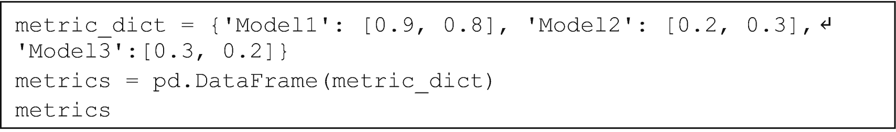

四行 Python 代码创建了一个包含三个行和两个列的 dataframe，用于模型 1、2 和 3。数据来自指标字典。键是模型 1、2 和 3。值是 0.9 和 0.8、0.2 和 0.3、以及 0.3 和 0.2。

图 2-11

从字典创建 dataframe

执行此代码后，你应该再次看到图 2-2 中的数据框，因为此代码生成的输出与图 2-10 中所示的代码生成的输出相同。

现在你已经了解了 pandas 数据 I/O 的非常基础的知识，让我们继续了解我们可以用许多方式来操纵这些数据以符合我们的喜好。

### 数据操作

Pandas 将允许你用你的数据做几乎所有你能想象到的事情。为了让你开始，本节涵盖了以下你可以使用 pandas 执行的数据操作过程：

+   **选择**：通过特定的行/列选择和切片数据框

+   **过滤**：根据特定条件过滤行

+   **排序**：在一列或多列上按升序/降序排序

+   **应用函数**：在数据框的列或行上应用自定义函数，并运行聚合函数

+   **分组**：分组数据框，遍历组，并执行分组聚合

+   **合并数据框**：合并或连接数据框

+   **操作列**：创建、重命名和删除列

这些是在任何与数据相关的软件中使用的最常见的数据操作过程，尽管 pandas 确实让你可以完全控制如何迭代数据，因为本质上，pandas 数据框只是一个多维数组。

#### 选择

在我们开始选择之前，让我们找出数据框中甚至有哪些列。我们可以通过运行图 2-12a 来做到这一点。

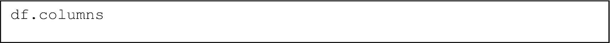

一行 Python 代码读取 d f 点 columns。

图 2-12a

输出数据框 `df` 的列

你应该会看到类似于图 2-12b 的文本输出：

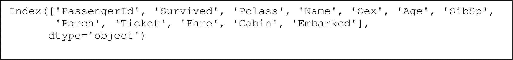

使用索引函数的 3 行 Python 输出，列头为乘客 ID、幸存、等级、姓名、性别、年龄、兄弟姐妹、补丁、票号、票价、船舱和登船港口。数据类型是对象。

图 2-12b

执行 `df.columns` 的文本输出

如果需要，你可以通过执行以下操作将此转换为列表：

```py
list(df.columns)
```

在我们开始选择任何内容之前，别忘了 pandas 是**区分大小写的**，这意味着你必须精确匹配数据框中的列名来选择相同的列。

让我们选择列‘Name’并选择此列。选择单个数据框的最佳约定（因为考虑到包含空格的列）是运行 `df[column_name]`，其中 `column_name` 是一个包含数据框中存在的某些列名的字符串。运行图 2-13 中所示的代码以选择姓名列的前两行。

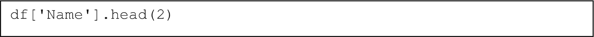

一行 Python 代码读取 d f，名称用单引号和方括号括起来，点号在 2 的位置。

图 2-13

选择单个列和结果的前两行

你应该会在图 2-14 中看到输出。

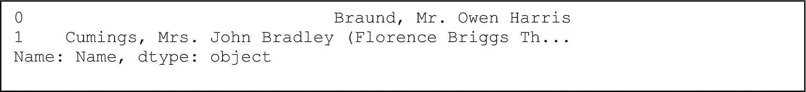

三行输出如下。0, 布朗德，欧文·哈里斯先生。1, 卡明斯，约翰·布拉德利夫人（佛罗伦萨·布里格斯·T...，姓名，和 d 类型，对象。

图 2-14

执行图 2-13 中代码的输出

这看起来与表 2-1 中的显示不同，不是吗？这是因为当你选择单个列时，返回的结果是一个 pandas **Series**，而不是数据框。Series 和数据框确实包含很多共享功能，但在某些情况下它们在本质上有所不同。Series 更好地被视为一个更明确索引的值列表，而数据框是列表的列表。

我们可以通过以下约定选择单个列并获取数据框结果：

```py
df[list_of_columns]
```

`list_of_columns` 是一个字符串列表，对应于 `df` 中存在的各种列的名称。要选择单个列，只需传递一个包含单个列名称的列表，如图 2-15 所示。

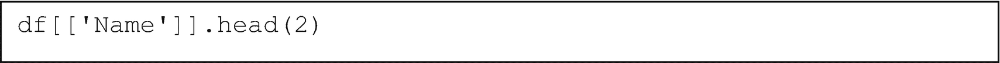

一行 Python 代码读取 d f，Name 在单引号和方括号中，点 2 的头部。

图 2-15

选择一列作为字符串列表以获取数据框输出

你现在应该看到表 2-3 中显示的输出。

表 2-3

执行图 2-15 中代码的输出

|   | 姓名 |
| --- | --- |
| **0** | 布朗德，欧文·哈里斯先生 |
| **1** | 卡明斯，约翰·布拉德利夫人（佛罗伦萨·布里格斯·T... |

现在看起来像表 2-1 和 2-2 中的输出，因为这是一个数据框结果。数据框可以被视为列表的列表，尽管在这种情况下，每个列表中只有一个值。

我们只需遵循相同的约定来选择多列，如图 2-16 中的代码行所示。

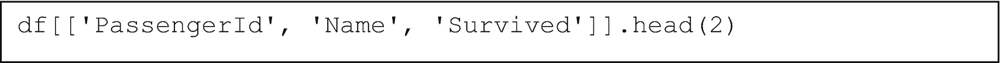

一行 Python 代码读取 d f，开方括号，乘客 ID，姓名，生存，每个都在单引号中，闭方括号，点 2 的头部。

图 2-16

选择多列

输出应类似于表 2-4。

表 2-4

执行图 2-16 中代码的输出

|   | 乘客 ID | 姓名 | 生存 |
| --- | --- | --- | --- |
| **0** | 1 | 布朗德，欧文·哈里斯先生 | 0 |
| **1** | 2 | 卡明斯，约翰·布拉德利夫人（佛罗伦萨·布里格斯·T... | 1 |

我们还可以使用以下方式选择行：

+   iloc

+   loc

**iloc** 是基于整数的索引，其操作方式与列表索引相同。*基于整数的索引*意味着行是通过它们的整数位置选择的，从第一行开始，这是零索引。因此，要选择第一行，我们必须选择索引 0，就像列表一样。

**iloc** 也允许我们选择列。iloc 的一般格式是

```py
.iloc[row_start:row_end, column_start:column_end]
```

其中起始和结束索引是整数。这被称为 *切片*，我们通过这些索引指定我们想要的 DataFrame 的“切片”类型。在 Python 列表中，如果你有一个多维列表（列表的列表，其中每个列表有多个条目），你不能这样切片，但在 pandas（以及 numpy）中你可以这样切片。

**loc** 与之不同，因为它是一种基于标签的索引。切片操作是按照索引值显式进行的。这就是索引发挥作用的地方。你可能已经注意到了这些表格输出最左侧的无名列——这就是索引，pandas 默认将其设置为从零开始。你可以更改它，甚至为列命名，这将在稍后演示。

让我们使用 .iloc 切片前五行，如图 2-17 所示。


一行 Python 代码读取 d f dot i loc open square bracket colon 5 close square bracket。

图 2-17

使用 iloc 切片前五行。如果未给出 iloc 的起始索引，则假定从零开始，就像在 Python 中一样

输出应类似于表 2-5。

表 2-5

执行图 2-17 中代码的输出

|   | PassengerId | Survived | Pclass | Name | Sex | Age | SibSp | Parch | Ticket | Fare | Cabin | Embarked |
| --- | --- | --- | --- | --- | --- | --- | --- | --- | --- | --- | --- | --- |
| **0** | 1 | 0 | 3 | Braund, Mr. Owen Harris | male | 22.0 | 1 | 0 | A/5 21171 | 7.2500 | NaN | S |
| **1** | 2 | 1 | 1 | Cumings, Mrs. John Bradley (Florence Briggs Th... | female | 38.0 | 1 | 0 | PC 17599 | 71.2833 | C85 | C |
| **2** | 3 | 1 | 3 | Heikkinen, Miss. Laina | female | 26.0 | 0 | 0 | STON/O2\. 3101282 | 7.9250 | NaN | S |
| **3** | 4 | 1 | 1 | Futrelle, Mrs. Jacques Heath (Lily May Peel) | female | 35.0 | 1 | 0 | 113803 | 53.1000 | C123 | S |
| **4** | 5 | 0 | 3 | Allen, Mr. William Henry | male | 35.0 | 0 | 0 | 373450 | 8.0500 | NaN | S |

我们也可以像在图 2-18 中那样切片列。


两行 Python 代码使用 d f i loc 函数选择并切片前五行，然后是前四列。读取 d f dot i loc open square bracket colon 5 comma colon 4 close square bracket。

图 2-18

切片前五行和前四列

输出应类似于表 2-6。

表 2-6

执行图 2-18 中代码的输出

|   | PassengerId | Survived | Pclass | Name | Sex | Age | SibSp | Parch | Ticket | Fare | Cabin | Embarked |
| --- | --- | --- | --- | --- |
| **0** | 1 | 0 | 3 | Braund, Mr. Owen Harris |
| **1** | 2 | 1 | 1 | Cumings, Mrs. John Bradley (Florence Briggs Th... |
| **2** | 3 | 1 | 3 | Heikkinen, Miss. Laina |
| **3** | 4 | 1 | 1 | Futrelle, Mrs. Jacques Heath (Lily May Peel) |
| **4** | 5 | 0 | 3 | Allen, Mr. William Henry |

那么，在这种情况下 **.loc** 会如何工作呢？.loc 非常相似，但它操作的是直接标签而不是索引。使用 loc，你有以下这些：

```py
.loc[start_label:end_label, start_label:end_label]
```

.loc 是包含的，这意味着它也包括结束标签。

尝试以下代码行，看看它与 .iloc 有何不同：

```py
df.loc[:5]
```

让我们构建一个新的索引来演示 loc 如何与不同的标签一起工作。图 2-19 展示了代码。

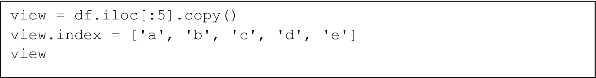

一行 Python 代码使用复制方法创建并查看前五行。这些行是 a、b、c、d 和 e。

图 2-19

使用 `.copy()` 创建前五行的一个副本，以确保原始 `df` 没有机会被更改。这个副本被分配了一个新的索引，称为 `view`，由 'a'、'b'、'c'、'd'、'e' 组成

图 2-19 中代码的输出应类似于表 2-7。注意，现在的索引不同了。

表 2-7

执行图 2-19 中代码的输出

|   | PassengerId | Survived | Pclass | Name | Sex | Age | SibSp | Parch | Ticket | Fare | Cabin | Embarked |
| --- | --- | --- | --- | --- | --- | --- | --- | --- | --- | --- | --- |
| **a** | 1 | 0 | 3 | Braund, Mr. Owen Harris | male | 22.0 | 1 | 0 | A/5 21171 | 7.2500 | NaN | S |
| **b** | 2 | 1 | 1 | Cumings, Mrs. John Bradley (Florence Briggs Th... | female | 38.0 | 1 | 0 | PC 17599 | 71.2833 | C85 | C |
| **c** | 3 | 1 | 3 | Heikkinen, Miss. Laina | female | 26.0 | 0 | 0 | STON/O2\. 3101282 | 7.9250 | NaN | S |
| **d** | 4 | 1 | 1 | Futrelle, Mrs. Jacques Heath (Lily May Peel) | female | 35.0 | 1 | 0 | 113803 | 53.1000 | C123 | S |
| **e** | 5 | 0 | 3 | Allen, Mr. William Henry | male | 35.0 | 0 | 0 | 373450 | 8.0500 | NaN | S |

现在运行图 2-20 中的代码。索引列也需要直接标签，但你可以根据它们在 `df.columns` 中出现的顺序来切片列。


一行 Python 代码读取 view 点 loc 开方括号，b 在引号内冒号 d 在引号内逗号 Name 在引号内冒号 Ticket 在引号内闭方括号。

图 2-20

使用 loc 仅包括行 b 到 d 和列 Name 到 Ticket

这段代码的输出由表 2-8 展示。Loc 知道如何在 'b' 和 'd' 之间索引，因为它们按顺序出现。同样，loc 能够正确地在 'Name' 和 'Ticket' 之间索引。并不是它在 'b' 和 'd' 之间按字母数字顺序枚举，所以请记住这一点。

表 2-8

执行图 2-20 中代码的输出

|   | Name | Sex | Age | SibSp | Parch | Ticket |
| --- | --- | --- | --- | --- | --- | --- |
| **b** | Cumings, Mrs. John Bradley (Florence Briggs Th... | female | 38.0 | 1 | 0 | PC 17599 |
| **c** | Heikkinen, Miss. Laina | female | 26.0 | 0 | 0 | STON/O2\. 3101282 |
| **d** | Futrelle, Mrs. Jacques Heath (Lily May Peel) | female | 35.0 | 1 | 0 | 113803 |

如果你想要将索引重置回零索引形式，只需调用 `df.reset_index(drop=True)`，其中 `df` 是任何数据框结果的占位符。

你可以使用以下代码：

```py
view.loc['b':'d', 'Name':'Ticket'].reset_index(drop=True)
```

这将显示与表 2-8 相同的内容，但左侧的索引是 0，1，2。`drop=True`表示你不想将旧索引作为新列插入到 dataframe 结果中，否则 Pandas 会默认这样做。

有了这些，你就掌握了在 Pandas 中选择行和列的基础。

#### 过滤

过滤允许你选择满足某些条件的行。如果你想要选择与一定年龄以上的个人相关的行，已婚的人，状态属于几个可能的类别之一等等，这很有用。

过滤的核心工作方式是

```py
df[boolean_list]
```

这个`boolean_list`仅仅是一个包含真或假值的列表，其总长度与`df`的长度相匹配。如果这个`boolean_list`是一个 pandas Series，那么它也有对应于每个布尔值的索引。如果布尔值是`True`，pandas 将保留结果 dataframe 中的该行。如果是`False`，则该行不会被包括。

尝试以下代码行，以培养对底层发生什么的感觉：

```py
df.head()[[True, False, False, False, True]]
```

我们通过传递硬编码的布尔列表手动“过滤”`df.head()`的结果。

话虽如此，回想一下，类似`df['Name']`会产生一个 pandas Series 结果。如果你尝试类似`df['Age'] > 50`的操作，你会看到结果是布尔值的 Series。使用相同的直觉，让我们首先从基本过滤开始，选择年龄超过 50 岁的人，如图 2-21 所示。

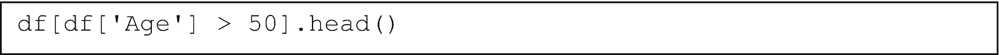

一行 Python 代码读取 d f 开方括号 d f，Age 在引号内关闭方括号大于 50 关闭方括号点头，开闭括号。

图 2-21

过滤 dataframe 以包含年龄超过 50 岁的条目并显示前五行

你应该看到表 2-9 作为输出。这个 dataframe 是`df`的过滤版本，只包含`Age`值大于`50`的行。

表 2-9. 执行图 2-21 中的代码的输出

| |   | 乘客 ID | 是否幸存 | 船舱等级 | 姓名 | 性别 | 年龄 | 兄弟姐妹数 | 父母数 | 票号 | 费用 | 船舱 | 登船港口 |
| --- | --- | --- | --- | --- | --- | --- | --- | --- | --- | --- | --- |
| **6** | 7 | 0 | 1 | McCarthy, Mr. Timothy J | 男性 | 54.0 | 0 | 0 | 17463 | 51.8625 | E46 | S |
| **11** | 12 | 1 | 1 | Bonnell, Miss. Elizabeth | 女性 | 58.0 | 0 | 0 | 113783 | 26.5500 | C103 | S |
| **15** | 16 | 1 | 2 | Hewlett, Mrs. (Mary D Kingcome) | 女性 | 55.0 | 0 | 0 | 248706 | 16.0000 | NaN | S |
| **33** | 34 | 0 | 2 | Wheadon, Mr. Edward H | 男性 | 66.0 | 0 | 0 | C.A. 24579 | 10.5000 | NaN | S |
| **54** | 55 | 0 | 1 | Ostby, Mr. Engelhart Cornelius | 男性 | 65.0 | 0 | 1 | 113509 | 61.9792 | B30 | C |

我们也可以通过使用以下运算符来组合不同的布尔条件，创建我们想要的精确过滤条件：

+   `&`: 与运算符

+   `|`: 或运算符

+   `~`: 否定运算符

要否定一个条件，只需使用

```py
~(condition)
```

要连接两个条件，确保每个条件都被括号包围，并执行以下操作之一：

+   `(condition1) & (condition2)` 用于“与”操作

+   `(condition1) | (condition2)` 用于“或”操作

这次，为了找到所有 50 岁以上的女性，让我们运行图 2-22 中的代码。

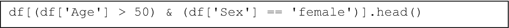

一行 Python 代码使用 d f 函数和 and 运算符来过滤数据，如果年龄超过 50 岁且性别为女性。

图 2-22

使用`&`运算符将两个不同的布尔值链在一起

注意

所有这些最终都会变成一个单一的布尔列表，只选择 50 岁以上的女性。

生成的表格应该看起来像表 2-10。

表 2-10

执行图 2-22 中代码的结果

|   | PassengerId | Survived | Pclass | Name | Sex | Age | SibSp | Parch | Ticket | Fare | Cabin | Embarked |
| --- | --- | --- | --- | --- | --- | --- | --- | --- | --- | --- | --- |
| **11** | 12 | 1 | 1 | Bonnell, Miss. Elizabeth | 女性 | 58.0 | 0 | 0 | 113783 | 26.5500 | C103 | S |
| **15** | 16 | 1 | 2 | Hewlett, Mrs. (Mary D Kingcome) | 女性 | 55.0 | 0 | 0 | 248706 | 16.0000 | NaN | S |
| **195** | 196 | 1 | 1 | Lurette, Miss. Elise | 女性 | 58.0 | 0 | 0 | PC 17569 | 146.5208 | B80 | C |
| **268** | 269 | 1 | 1 | Graham, Mrs. William Thompson (Edith Junkins) | 女性 | 58.0 | 0 | 1 | PC 17582 | 153.4625 | C125 | S |
| **275** | 276 | 1 | 1 | Andrews, Miss. Kornelia Theodosia | 女性 | 63.0 | 1 | 0 | 13502 | 77.9583 | D7 | S |

注意过滤后索引值是如何混乱的。不要忘记你可以调用`.reset_index(drop=True)`来随时重置索引。`drop=True`意味着你不想将旧索引作为新列插入到数据框结果中。

如果列包含字符串值，你可以直接使用以下方法：

```py
df[column].str
```

这提供了访问以下函数的权限：

+   `df[column].str.contains(pattern)`

+   `df[column].str.startswith(pattern)`

+   `df[column].str.endswith(pattern)`

你可以在这里找到其他函数：[`https://pandas.pydata.org/docs/reference/api/pandas.Series.str.capitalize.xhtml`](https://pandas.pydata.org/docs/reference/api/pandas.Series.str.capitalize.xhtml)。

你甚至可以应用正则表达式模式。

图 2-23 展示了一个选择，我们正在选择所有名字包含“Mrs.”的人。

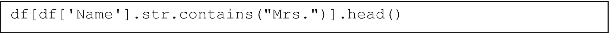

一行 Python 代码使用 d f 函数选择包含 Missis 头衔的行的数据。

图 2-23

选择所有名字包含“Mrs.”的行，选择所有已婚女性

你也可以检查值是否作为列表中元素之一存在。要这样做，请使用`df[column_name].isin(iterable_of_values)`，其中`iterable_of_values`是你想要匹配的值的列表。

注意到从显示的表中可以看出，"Embarked"列中的值似乎很常见的是‘S’或‘C’。让我们使用否定运算符来查找任何"Embarked"列中的值既不是‘S’也不是‘C’的行。参见图 2-24。

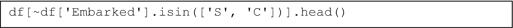

一行 Python 代码使用 d f 函数和否定运算符来过滤"Embarked"列中不是 S 或 C 的值。

图 2-24

过滤以使结果包含既不是‘S’也不是‘C’的“Embarked”值

注意到结果包含值‘Q’，这意味着我们成功过滤出了‘S’和‘C’值。

最后，理解我们也可以**过滤并替换**值。让我们将"Sex"列中的值替换为现有标签“male”和“female”的数值等价物。这是对像“Sex”这样的分类列通常执行的一个步骤，以便结果值可以在机器学习模型中使用。机器学习模型不能直接从文本中学习——文本需要被转换成等效的数值表示。

一个好的约定是使用 loc：

```py
df.loc[boolean_list, column] = replacement
```

我们正在选择仅适用于布尔值的行，选择要替换值的列，然后将其替换为新值。参见图 2-25 以了解如何进行此操作。

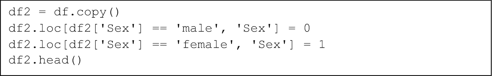

一段 4 行的 Python 代码使用 d f copy 和 loc 函数将"male"的值替换为 0，将"female"的值替换为 1。

图 2-25

将‘male’替换为 0，将‘female’替换为 1

表 2-11 显示了输出表。正如你所见，‘male’和‘female’已经被替换成了数值等价物。

表 2-11

执行图 2-25 中的代码的结果

|   | PassengerId | Survived | Pclass | Name | Sex | Age | SibSp | Parch | Ticket | Fare | Cabin | Embarked |
| --- | --- | --- | --- | --- | --- | --- | --- | --- | --- | --- | --- | --- |
| **0** | 1 | 0 | 3 | Braund, Mr. Owen Harris | 0 | 22.0 | 1 | 0 | A/5 21171 | 7.2500 | NaN | S |
| **1** | 2 | 1 | 1 | Cumings, Mrs. John Bradley (Florence Briggs Th... | 1 | 38.0 | 1 | 0 | PC 17599 | 71.2833 | C85 | C |
| **2** | 3 | 1 | 3 | Heikkinen, Miss. Laina | 1 | 26.0 | 0 | 0 | STON/O2\. 3101282 | 7.9250 | NaN | S |
| **3** | 4 | 1 | 1 | Futrelle, Mrs. Jacques Heath (Lily May Peel) | 1 | 35.0 | 1 | 0 | 113803 | 53.1000 | C123 | S |
| **4** | 5 | 0 | 3 | Allen, Mr. William Henry | 0 | 35.0 | 0 | 0 | 373450 | 8.0500 | NaN | S |

通过这种方式，你现在知道了如何根据你的喜好过滤行，以及如何替换你已过滤的值。

#### 排序

有时，你会发现对数据进行排序很重要，无论是通过特定的排序顺序将具有不同索引的数据帧进行匹配，还是按时间顺序对时间序列数据帧进行排序。

你可以简单地使用以下约定：

```py
df.sort_values(column, ascending=True)
```

如果你只传递`column`，pandas 默认假设`ascending=True`。

图 2-26 展示了按列 ‘Fare’ 升序排序（从低到高）的代码。

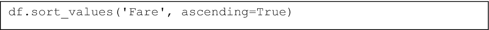

一行 Python 代码读取 d f dot sort underscore values，open parenthesis，Fare in quotes comma ascending = True，close parenthesis。

图 2-26

按升序排序列 ‘Fare’ 的值

表 2-12 展示了运行图 2-26 中代码的输出。如图所示，费用按升序排列。（为了清晰起见，省略了一些行。）

表 2-12

图 2-26 中代码执行的结果

|   | 乘客 ID | 是否幸存 | 船舱等级 | 姓名 | 性别 | 年龄 | 兄弟姐妹数 | 父母或配偶数 | 票号 | 费用 | 船舱 | 登船港口 |
| --- | --- | --- | --- | --- | --- | --- | --- | --- | --- | --- | --- |
| **271** | 272 | 1 | 3 | 托恩奎斯特，威廉·亨利先生 | 男 | 25.0 | 0 | 0 | LINE | 0.0000 | NaN | S |
| **597** | 598 | 0 | 3 | 约翰逊，阿尔弗雷德先生 | 男 | 49.0 | 0 | 0 | LINE | 0.0000 | NaN | S |
| **302** | 303 | 0 | 3 | 约翰逊，威廉·卡霍恩·约翰逊先生 | 男 | 19.0 | 0 | 0 | LINE | 0.0000 | NaN | S |
| **...** | ... | ... | ... | ... | ... | ... | ... | ... | ... | ... | ... | ... |
| **341** | 342 | 1 | 1 | 富尔顿，艾丽斯·伊丽莎白小姐 | 女 | 24.0 | 3 | 2 | 19950 | 263.0000 | C23 C25 C27 | S |
| **737** | 738 | 1 | 1 | 莱苏尔，古斯塔夫·J 先生 | 男 | 35.0 | 0 | 0 | PC 17755 | 512.3292 | B101 | C |
| **258** | 259 | 1 | 1 | 华德，安娜小姐 | 女 | 35.0 | 0 | 0 | PC 17755 | 512.3292 | NaN | C |
| **679** | 680 | 1 | 1 | 卡德扎，托马斯·德雷克·马丁内斯先生 | 男 | 36.0 | 0 | 1 | PC 17755 | 512.3292 | B51 B53 B55 | C |

我们也可以传递一个列的列表来排序，如下所示：

```py
df.sort_values(list_of_values, ascending=list_of_booleans)
```

值的列表和布尔值的列表一一对应。如果 `list_of_values` 是 `['a', 'b', 'c']`，而 `list_of_booleans` 是 `[True, False, True]`，那么我们是在说：

1.  ‘a’ 是升序排列。

1.  ‘b’ 是降序排列。

1.  ‘c’ 是升序排列。

有多个列时，首先按 ‘a’ 排序。如果有相同值，则通过排序 ‘b’ 来打破平局，而与 ‘a’ 和 ‘b’ 的平局则通过 ‘c’ 来打破。列 ‘a’ 中的平局是指两行或多行具有完全相同的 ‘a’ 值。

考虑列 ‘Survived’。许多人要么在泰坦尼克号沉没中幸存，要么没有幸存，所以如果我们按 ‘Survived’ 排序，我们将有许多行处于模糊排序状态。

如果我们额外按 ‘Name’ 排序，那么在 ‘Survived’ 排序的顺序中，剩余的行也将按 ‘Name’ 排序。

图 2-27 展示了如何按列 `['Pclass', 'Age']` 和升序列表 `[True, False]` 排序。

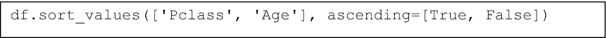

一行 Python 代码读取 d f dot sort underscore values，open parenthesis 和 square bracket，P class comma Age each in quotes，close square bracket，comma ascending equals，True comma false in square brackets，close parenthesis。

图 2-27

按 ‘Pclass’ 和 ‘Age’ 排序，保持 ‘Pclass’ 升序和 ‘Age’ 降序

表 2-13 显示了执行图 2-27 中代码的结果。注意，Pclass 是按升序排列的，而 Age 是按降序排列的。

表 2-13

执行图 2-27 中的代码的结果

|   | PassengerId | Survived | Pclass | Name | Sex | Age | SibSp | Parch | Ticket | Fare | Cabin | Embarked |
| --- | --- | --- | --- | --- | --- | --- | --- | --- | --- | --- | --- | --- |
| **630** | 631 | 1 | 1 | Barkworth, Mr. Algernon Henry Wilson | male | 80.0 | 0 | 0 | 27042 | 30.0000 | A23 | S |
| **96** | 97 | 0 | 1 | Goldschmidt, Mr. George B | male | 71.0 | 0 | 0 | PC 17754 | 34.6542 | A5 | C |
| **493** | 494 | 0 | 1 | Artagaveytia, Mr. Ramon | male | 71.0 | 0 | 0 | PC 17609 | 49.5042 | NaN | C |
| **745** | 746 | 0 | 1 | Crosby, Capt. Edward Gifford | male | 70.0 | 1 | 1 | WE/P 5735 | 71.0000 | B22 | S |
| **54** | 55 | 0 | 1 | Ostby, Mr. Engelhart Cornelius | male | 65.0 | 0 | 1 | 113509 | 61.9792 | B30 | C |
| **…** | ... | ... | ... | ... | ... | ... | ... | ... | ... | ... | ... | ... |
| **859** | 860 | 0 | 3 | Razi, Mr. Raihed | male | NaN | 0 | 0 | 2629 | 7.2292 | NaN | C |
| **863** | 864 | 0 | 3 | Sage, Miss. Dorothy Edi“h “Do”ly” | female | NaN | 8 | 2 | CA. 2343 | 69.5500 | NaN | S |
| **868** | 869 | 0 | 3 | van Melkebeke, Mr. Philemon | male | NaN | 0 | 0 | 345777 | 9.5000 | NaN | S |
| **878** | 879 | 0 | 3 | Laleff, Mr. Kristo | male | NaN | 0 | 0 | 349217 | 7.8958 | NaN | S |
| **888** | 889 | 0 | 3 | Johnston, Miss. Catherine Hel“n “Car”ie” | female | NaN | 1 | 2 | W./C. 6607 | 23.4500 | NaN | S |

通过这样，你已经学会了排序值的基本知识。

#### 应用函数

我们可以对列中的每个单独的值应用函数，或者我们可以使用聚合函数，这些函数将整个列压缩成某种指标。聚合函数的例子有 `sum()`、`.mean()`、`.std()`、`.min()` 和 `.max()`。

应用函数的表示法是

```py
series.apply(function)
```

回想一下，我们可以通过字符串选择仅一个列来获得一个 Series。

我们可以应用任何兼容的函数，包括类型转换。例如，我们可以通过执行图 2-28 中显示的代码将列 ‘Fare’ 转换为整数。

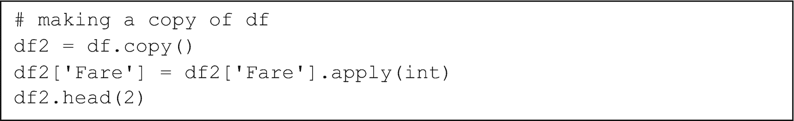

一段 4 行的 Python 代码使用复制方法复制 df，将其赋值给 df2 变量，使用 apply 方法将 Fare 列转换为整数，并使用 head 方法返回前两行。

图 2-28

创建 `df` 的副本，以便我们保留原始数据，而无需从磁盘重新加载它

执行图 2-28 中的代码的输出显示在表 2-14 中。注意，Fare 现在是整数，而之前是浮点数。

表 2-14

执行图 2-28 中的代码的输出

|   | PassengerId | Survived | Pclass | Name | Sex | Age | SibSp | Parch | Ticket | Fare | Cabin | Embarked |
| --- | --- | --- | --- | --- | --- | --- | --- | --- | --- | --- | --- | --- |
| **0** | 1 | 0 | 3 | Braund, Mr. Owen Harris | male | 22.0 | 1 | 0 | A/5 21171 | 7 | NaN | S |
| **1** | 2 | 1 | 1 | Cumings, Mrs. John Bradley (Florence Briggs Th... | female | 38.0 | 1 | 0 | PC 17599 | 71 | C85 | C | 71 |

您还可以创建自定义函数并在 `.apply()` 中使用它们。图 2-29 展示了对“票价”执行任意操作的示例。

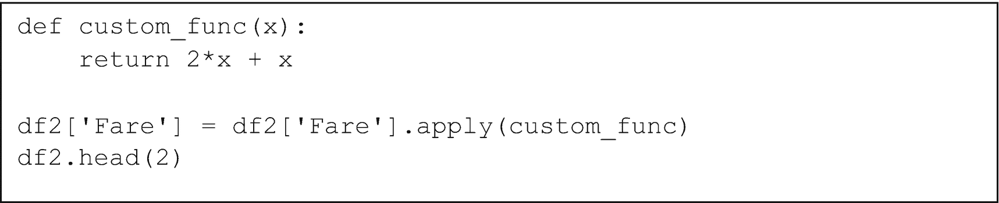

一段 4 行的 Python 代码定义了一个名为 custom_func 的函数，参数为 x，并返回 2 倍的 x + x。使用此函数在 d f 2 的票价列上应用 apply 方法，并使用 head 方法返回前 2 行。

图 2-29

将自定义函数应用于定义的“票价”上的一些数学运算

输出如表 2-15 所示。

表 2-15

将自定义函数应用于“票价”列的输出

|   | PassengerId | Survived | Pclass | Name | Sex | Age | SibSp | Parch | Ticket | Fare | Cabin | Embarked |
| --- | --- | --- | --- | --- | --- | --- | --- | --- | --- | --- | --- | --- |
| **0** | 1 | 0 | 3 | Braund, Mr. Owen Harris | 0 | 22.0 | 1 | 0 | A/5 21171 | 21 | NaN | S | 0 |
| **1** | 2 | 1 | 1 | Cumings, Mrs. John Bradley (Florence Briggs Th... | 1 | 38.0 | 1 | 0 | PC 17599 | 213 | C85 | C |

我们可以通过聚合函数创建新列。图 2-30 展示了一个示例，演示了使用 `axis=1` 来指示我们想要在整个行上应用函数。每一行都会传递到函数中，我们可以单独访问列。

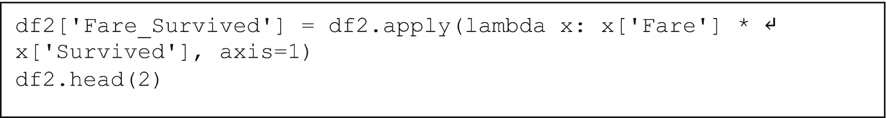

A 3-line Python code uses a lambda function multiplying fare and survived column values, and axis = 1 in the apply method, to create a new column of fare underscore survived in d f 2, and returns the first 2 rows using the head method.

图 2-30

使用 `axis=1` 参数在整个行上使用自定义函数创建新列

这样，我们可以通过将两个不同的列值相乘来创建一个新列“票价 _ 存活”。此代码的输出在表 2-16 中捕获。

表 2-16

执行图 2-30 中的代码的输出，包含新列

|   | PassengerId | Survived | Pclass | Name | Sex | Age | SibSp | Parch | Ticket | Fare | Cabin | Embarked | Fare_Survived |
| --- | --- | --- | --- | --- | --- | --- | --- | --- | --- | --- | --- | --- |
| **0** | 1 | 0 | 3 | Braund, Mr. Owen Harris | male | 22.0 | 1 | 0 | A/5 21171 | 21 | NaN | S | 0 |
| **1** | 2 | 1 | 1 | Cumings, Mrs. John Bradley (Florence Briggs Th... | female | 38.0 | 1 | 0 | PC 17599 | 213 | C85 | C | 213 |

然而，有一种更高效的方法来完成相同的计算。我们将进行所谓的*向量操作*，这指的是一次性对整个 pandas Series 进行操作。这比`.apply()`方法更快，并且扩展性更好。

图 2-31 演示了如何以向量化的方式执行等效操作。

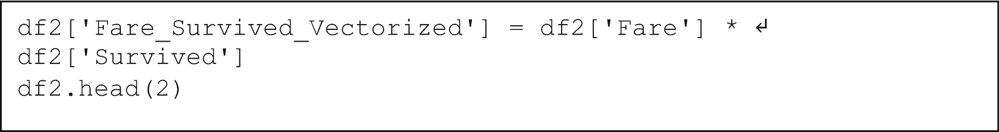

三行 Python 代码使用 d f 2 中票价和 survived 列的向量乘法，并在 d f 2 中创建一个新的列名为 fare underscore survived underscore vectorized，并使用 head 方法返回前两行。

图 2-31

注意到‘票价’和‘Survived’之间的乘法现在是在它们各自的整个列上同时进行的。这就是执行向量操作的方法。

因此，让我们继续讨论聚合函数。聚合函数是在整个列上执行某种计算以将其减少为一个数字的函数。

简单的聚合函数如`.sum()`、`.mean()`、`.std()`、`.min()`和`.max()`，所有这些都可以应用于 pandas Series 或 pandas dataframe。图 2-32 演示了这些聚合函数在 Series 中的应用。

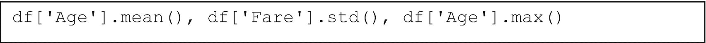

一行 Python 代码使用诸如年龄的均值、票价的标准差和 d f 中年龄的最大值等函数。

图 2-32

对几个 Series 应用各种聚合

输出被捕获在图 2-33 中。

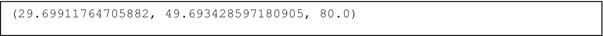

一行输出读取如下。（29.69911764705882，49.693428597180905，80.0）。

图 2-33

执行图 2-32 中代码的输出

图 2-34 演示了`.sum()`函数在 dataframe 中的应用。图 2-35 捕获了结果输出，它是一个 Series。

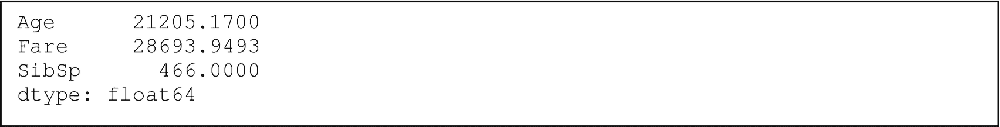

一行输出显示值如下。年龄，21205.1700。票价，28693.9493。兄弟姐妹比例，466.0000。数据类型，float 64。

图 2-35

执行图 2-34 中代码的结果

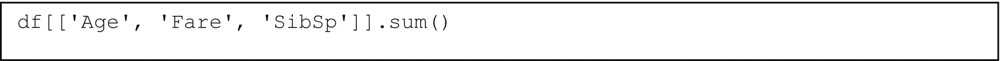

一行 Python 代码在 d f 的票价、年龄和 Sib s p 列上应用求和函数。

图 2-34

对三个列的数据框进行求和聚合

就像`.apply()`一样，我们可以指定`axis=1`来在整个行上使用聚合函数。图 2-36 演示了如何将三个不同列的值求和以将其压缩为一列。结果是 Series，我们可以在 Series 上调用`.head()`来显示前五行。

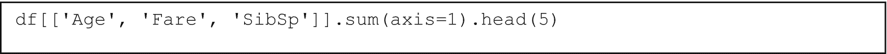

一行 Python 代码使用 axis 等于 1 的 sum 函数对年龄、票价和 sib s p 列进行求和。

图 2-36

沿着三列求和，对每一行应用`sum()`函数

图 2-37 显示了在图 2-36 中运行代码的输出。

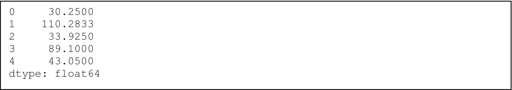

一行 5 个输出显示值如下。0, 30.2500。1, 110.2833。2, 33.9250。3, 89.1000。4, 43.0500。数据类型，float 64。

图 2-37

在我们对每一行应用行级求和聚合后，得到的结果 Series，而不是在整个列上。通过使用`axis=1`按行执行，求和聚合将每一行的三列值汇总到单个列中

#### 分组

我们可以按某些列对数据框进行分组并遍历每个组。例如，如果我们有一个房屋数据框，并且颜色是一个属性，我们可以按房屋颜色进行分组，并一次探索每个颜色组。其他数据处理软件可能无法提供如此多的控制（或者至少，不是如此直接的控件），但在 pandas 中，您可以直接访问每个组并遍历所有组。

通用表示法是

```py
grouped_obj = df.groupby(column)
```

`grouped_obj`是一个可迭代对象。要遍历它，我们可以执行图 2-38 中显示的代码。这使我们能够访问分组值（名称）以及分组数据框本身（组）。如图 2-39 所示，分组数据框，组，将只包含分组列等于名称中的值的值。如果我们按颜色分组，并且我们有“红色”、“绿色”和“蓝色”可供选择，那么每次迭代将产生一个名称是“红色”、“绿色”或“蓝色”之一，以及一个名为“组”的数据框，它只包含这些相应的颜色。

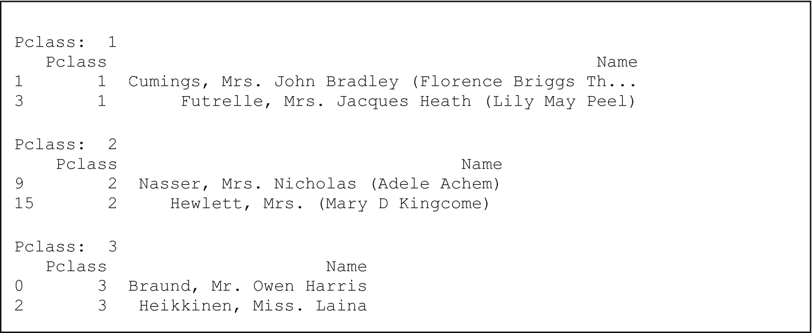

一行 12 个输出显示 3 个 p 类部分，每行有 2 个名称。

图 2-39

执行图 2-38 中代码的输出

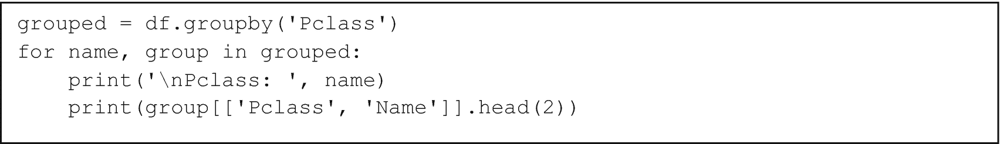

一段 4 行的 Python 代码。使用 d f 中的 P 类分组方法，并将其分配给 grouped。使用 for 循环遍历 grouped 中的 name 和 group，并打印它们。

图 2-38

遍历分组数据框并显示单个分组数据框的代码

我们也可以按多个列进行分组。图 2-40 显示了如何进行分组，以及如何打印分组值和分组数据框。如果您有多个分组列，那么您将遍历多个分组列中所有唯一的值组合。

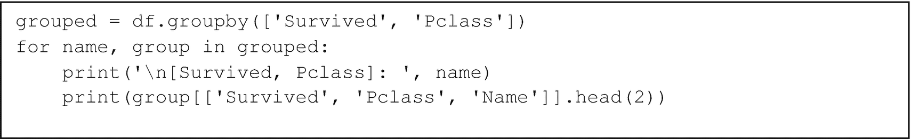

一段 4 行的 Python 代码使用 d f 中的 survived 和 P 类列的分组方法，将其分配给 grouped，使用 for 循环遍历 grouped 中的 name 和 group，并打印分组值和分组数据框。

图 2-40

多个分组列

图 2-40 的输出显示在图 2-41 中。完整的输出已被截断，但你应该能看到类似的内容。

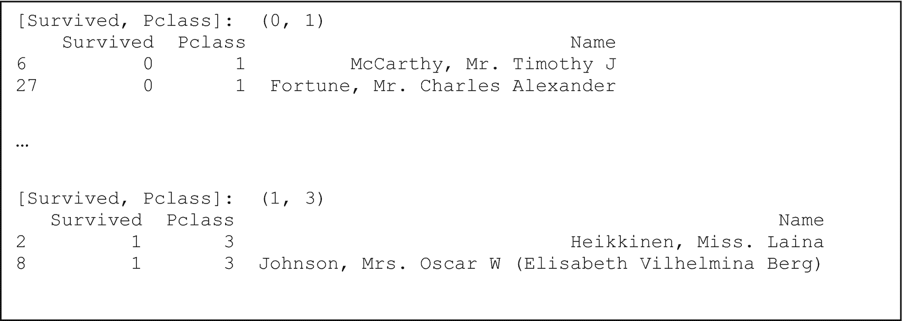

一个输出显示了幸存者和乘客等级的第一组和最后一组的值。这些值位于 (0, 1) 和 (1, 3)

图 2-41

图 2-40 中代码的截断输出，仅显示第一组和最后一组的输出值

也可以对数据帧进行分组，然后进行聚合。这样做将计算并显示每个组的相应聚合。回想一下，在前一节中，我们进行了求和、平均值、最大值等聚合操作，但如果我们先分组然后执行相同的聚合操作，它将首先将数据帧分成不同的块，然后在每个块上执行聚合，然后将最终结果组合在一起。图 2-42 显示了对是否幸存者进行分组的几个数值列的求和聚合。

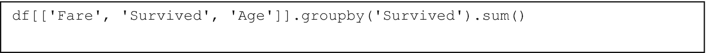

一行 Python 代码读取 df open double square brackets, Fare comma Survived comma Age each in quotes, close double square brackets dot group by open parenthesis, Survived in quotes, close parenthesis dot sum open and close parentheses.

图 2-42

选择几个数值列，按一列分组，然后计算总和

图 2-42 的输出被捕获在表 2-17 中。

表 2-17

执行图 2-42 中的代码输出

|   | 船票价格 | 年龄 |
| --- | --- | --- |
| **幸存者** |   |   |
| **0** | 12142.7199 | 12985.50 |
| **1** | 16551.2294 | 8219.67 |

我们可以使用多个分组列进行分组聚合。图 2-43 中显示的代码修改了图 2-42 中的代码，以按额外的列进行分组。

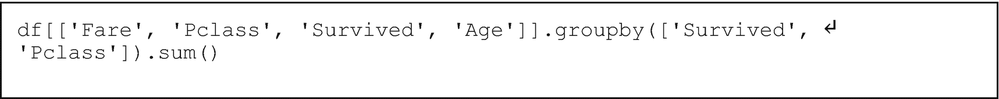

一行 Python 代码使用 group by 方法和对函数来分组并求和船票价格、乘客等级、幸存者和年龄列的聚合。

图 2-43

按额外列分组但使用图 2-42 中的代码

图 2-43 的输出通过表 2-18 显示。

表 2-18

执行图 2-43 中的代码输出

|   |   | 船票价格 | 年龄 |
| --- | --- | --- | --- |
| **幸存者** | **乘客等级** |   |   |
| **0** | **1** | 5174.7206 | 2796.50 |
| **2** | 1882.9958 | 3019.00 |
| **3** | 5085.0035 | 7170.00 |
| **1** | **1** | 13002.6919 | 4314.92 |
| **2** | 1918.8459 | 2149.83 |
| **3** | 1629.6916 | 1754.92 |

有了这些，我们已经涵盖了分组和分组聚合函数的基础。

#### 合并 DataFrames

有几种方法可以合并数据帧。你可能想要合并或连接它们（合并和连接的功能非常相似——我们只会介绍合并）或者将数据帧（堆叠）连接在一起。

首先，让我们准备两个独立的数据框。它们都将包含 PassengerId 列，但它们的其他列将不同。目标是统一这两个表，以便对于每个乘客 ID，行包含来自两个数据框的列。换句话说，我们只在两个表中的乘客 ID 相同时压缩两个数据框。这被称为*连接*或*合并*两个表。图 2-44 显示了执行此操作的代码。

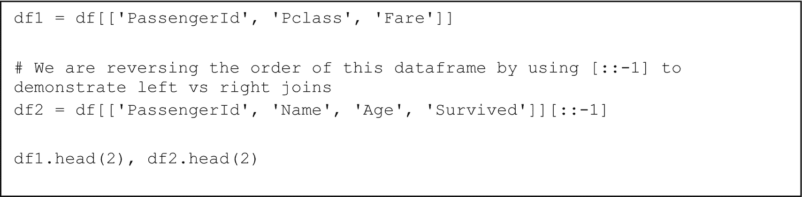

一段 5 行的 Python 代码用于创建两个数据框。左侧的数据框包含乘客 ID、P 类和票价。右侧的数据框包含乘客 ID、姓名、年龄和存活列，并使用开方括号双冒号负 1 进行顺序反转。

图 2-44

创建两个数据框，它们有一个共同的列，但所有其他列都不同

执行此代码的输出被图 2-45 捕获。

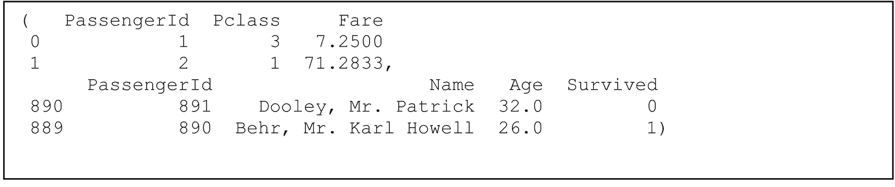

一段 5 行的输出显示了两个数据框，分别有 3 列数据用于乘客 ID、P 类和票价，以及 4 列数据用于乘客 ID、姓名、年龄和存活。

图 2-45

现在有两个不同的数据框

让我们执行一个默认的连接，不指定我们想要如何连接两个数据框。默认情况下，Pandas 执行内部连接，将我们指定的行（使用`on=`参数）压缩起来，并按左侧数据框的顺序排序。当我们提到左侧和右侧数据框时，我们是在将我们称为“右侧”的数据框连接到“左侧”的数据框上。对于某些连接方法，如左连接，哪个是左侧哪个是右侧很重要。在左连接中，保留左侧数据框的所有行，并且只有当它们是匹配条目时，才将这些行附加到右侧数据框的列上。否则，对于不匹配的行，在右侧添加的列将插入空值。请参阅图 2-46 以查看 PassengerId 列上的内部连接代码。

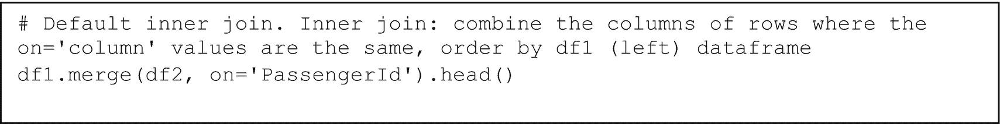

一段 3 行的 Python 代码使用合并函数将左侧数据框中值相同的乘客 ID 的行列合并。

图 2-46

当我们想要指定一个连接时，我们添加参数`how="inner"`，例如。如果我们不指定这个，Pandas 将默认执行内部连接。合并本身返回一个数据框；`.head()`仅用于简洁性

图 2-46 的输出被表 2-19 捕获。这两个数据框在 PassengerId 相等时被压缩，结果按`df1`（左侧数据框）中的行顺序排序。

表 2-19。图 2-46 中代码的输出

|   | PassengerId | Pclass | Fare | Name | Age | Survived |
| --- | --- | --- | --- | --- | --- | --- |
| **0** | 1 | 3 | 7.2500 | Braund, Mr. Owen Harris | 22.0 | 0 |
| **1** | 2 | 1 | 71.2833 | Cumings, Mrs. John Bradley (Florence Briggs Th... | 38.0 | 1 |
| **2** | 3 | 3 | 7.9250 | Heikkinen, Miss. Laina | 26.0 | 1 |
| **3** | 4 | 1 | 53.1000 | Futrelle, Mrs. Jacques Heath (Lily May Peel) | 35.0 | 1 |
| **4** | 5 | 3 | 8.0500 | Allen, Mr. William Henry | 35.0 | 0 |

图 2-47 展示了如何执行右连接，它以类似的方式将数据帧打包，但按“右”数据帧（`df2`）中的顺序排列行。

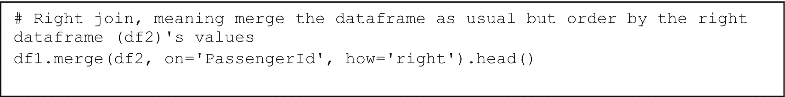

三行 Python 代码使用合并函数将数据帧与其右侧的数据帧对应项合并。

图 2-47

通过传递 `how='right'` 作为参数指定右连接

此输出由表 2-20 捕获。注意，排序与 `df2` 的排序相匹配。这是因为右连接按“右”数据帧中的行出现的顺序对行进行排序，或者在这个例子中是 `df2`。

表 2-20

执行图 2-47 中代码的输出

|   | PassengerId | Pclass | Fare | Name | Age | Survived |
| --- | --- | --- | --- | --- | --- | --- |
| **0** | 891 | 3 | 7.75 | Dooley, Mr. Patrick | 32.0 | 0 |
| **1** | 890 | 1 | 30.00 | Behr, Mr. Karl Howell | 26.0 | 1 |
| **2** | 889 | 3 | 23.45 | Johnston, Miss. Catherine Helen “Carrie” | NaN | 0 |
| **3** | 888 | 1 | 30.00 | Graham, Miss. Margaret Edith | 19.0 | 1 |
| **4** | 887 | 2 | 13.00 | Montvila, Rev. Juozas | 27.0 | 0 |

我们也可以通过传递 `how='left'` 作为参数来指定左连接，但结果应该与表 2-19 相同。

有几种不同的方式可以指定你想要如何连接两个数据帧。鼓励你进一步探索，因为连接方法远不止简单的“内部”、“左”和“右”连接。然而，截至目前，在 Pandas 中，`.merge()` 函数支持“左”、“右”、“外部”、“内部”和“交叉”连接。

接下来，让我们看看如何连接两个数据帧。为此，我们将首先将原始数据帧拆分为一个用于男性乘客的数据帧和一个用于女性乘客的数据帧。请参阅图 2-48 中的此代码。

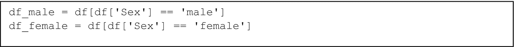

一行 Python 代码创建两个数据帧，用于男性或女性，使用性别等于男性或女性的属性。

图 2-48

创建两个不同的数据帧，每个数据帧按“男性”或“女性”分组

要执行连接，我们只需遵循以下约定：

```py
pd.concat(list_of_dataframes).
```

图 2-49 展示了如何合并 `df_male` 和 `df_female`。

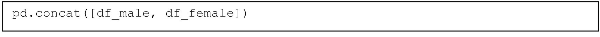

一行 Python 代码读取 p d dot concat open parenthesis open square bracket d f underscore male comma, d f underscore female, close parenthesis close square bracket。

图 2-49

合并 `df_male` 和 `df_female`，结果是一个包含连接结果的数据帧

参考表 2-21 以查看输出。

表 2-21

执行图 2-49 中的代码的连接结果

|   | PassengerId | Survived | Pclass | Name | Sex | Age | SibSp | Parch | Ticket | Fare | Cabin | Embarked |
| --- | --- | --- | --- | --- | --- | --- | --- | --- | --- | --- | --- |
| **0** | 1 | 0 | 3 | Braund, Mr. Owen Harris | male | 22.0 | 1 | 0 | A/5 21171 | 7.2500 | NaN | S |
| **4** | 5 | 0 | 3 | Allen, Mr. William Henry | male | 35.0 | 0 | 0 | 373450 | 8.0500 | NaN | S |
| **5** | 6 | 0 | 3 | Moran, Mr. James | male | NaN | 0 | 0 | 330877 | 8.4583 | NaN | Q |
| **6** | 7 | 0 | 1 | McCarthy, Mr. Timothy J | male | 54.0 | 0 | 0 | 17463 | 51.8625 | E46 | S |
| **7** | 8 | 0 | 3 | Palsson, Master. Gosta Leonard | male | 2.0 | 3 | 1 | 349909 | 21.0750 | NaN | S |
| **...** | ... | ... | ... | ... | ... | ... | ... | ... | ... | ... | ... | ... |
| **880** | 881 | 1 | 2 | Shelley, Mrs. William (Imanita Parrish Hall) | female | 25.0 | 0 | 1 | 230433 | 26.0000 | NaN | S |
| **882** | 883 | 0 | 3 | Dahlberg, Miss. Gerda Ulrika | female | 22.0 | 0 | 0 | 7552 | 10.5167 | NaN | S |
| **885** | 886 | 0 | 3 | Rice, Mrs. William (Margaret Norton) | female | 39.0 | 0 | 5 | 382652 | 29.1250 | NaN | Q |
| **887** | 888 | 1 | 1 | Graham, Miss. Margaret Edith | female | 19.0 | 0 | 0 | 112053 | 30.0000 | B42 | S |
| **888** | 889 | 0 | 3 | Johnston, Miss. Catherine Helen “Carrie” | female | NaN | 1 | 2 | W./C. 6607 | 23.4500 | NaN | S |

如表 2-21 所示，数据框被堆叠在一起（注意索引不连续，跳过了一些数字）。如果你的数据框有一个其他数据框没有的额外列，那么在属于其他数据框的行中，该列将是空值。

#### 创建、重命名和删除列

最后，让我们回顾一下如何在数据框中创建新列（正式名称），重命名列，以及完全从数据框中删除列。

回想一下之前关于 `.apply()` 的讨论，我们创建新列的方式如下：

```py
df['new_col'] = df['some_col'].apply(some_func)
```

我们可以使用 `.insert()` 函数来定制我们想要插入列的位置。

首先，让我们复制原始数据框，如图 2-50 所示。这确保了我们所做的任何操作都不会影响 `df`。

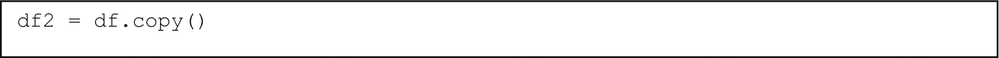

一行 Python 代码读取 d f 2 = d f dot copy open and close parentheses。

图 2-50

将原始数据框 `df` 复制到新变量 `df2`

现在，让我们对“年龄”列应用一些转换，并将 Series 结果存储在变量中。参见图 2-51。

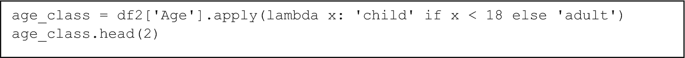

一行两行的 Python 代码使用 lambda 函数和 apply 方法对小于 18 岁的儿童标签进行操作，否则标签为成人，并将结果分配给变量 age underscore class，并使用 head 方法调用前两行。

图 2-51

对 'Age' 列应用标签转换，并将结果存储在 age_class 中

你应该看到类似图 2-52 的内容。

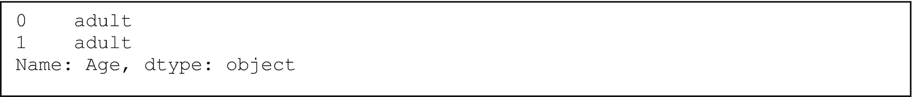

3 行输出显示标签如下。0, adult. 1, adult. Name, age. d type, object.

图 2-52

执行图 2-51 中代码的结果

现在将此 Series 作为列插入 `df2` 中。参见图 2-53。参数如下：

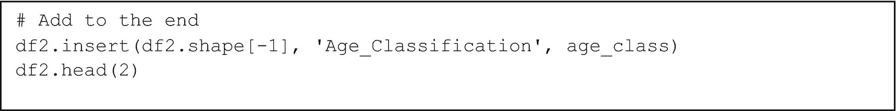

使用 Python 代码的 insert 方法在数据框 2 的末尾添加年龄分类列，其值为年龄类别。

图 2-53

将列插入 `df2` 的末尾

```py
df2.insert(position, column_name, column_values)
```

`position` 是从 0 到 len(df2.columns) 的任意位置，允许你指定在数据框中的任何位置插入新列。变量 `column_name` 允许你指定自定义名称，而 `column_values` 是你正在插入的 Series。

你应该看到类似表 2-22，其中新列已成功插入 `df2` 的末尾。

表 2-22

执行图 2-53 中代码的结果

|   | PassengerId | Survived | Pclass | Name | Sex | Age | SibSp | Parch | Ticket | Fare | Cabin | Embarked | Age_Classification |
| --- | --- | --- | --- | --- | --- | --- | --- | --- | --- | --- | --- | --- | --- |
| **0** | 1 | 0 | 3 | Braund, Mr. Owen Harris | male | 22.0 | 1 | 0 | A/5 21171 | 7.2500 | NaN | S | adult |
| **1** | 2 | 1 | 1 | Cumings, Mrs. John Bradley (Florence Briggs Th... | female | 38.0 | 1 | 0 | PC 17599 | 71.2833 | C85 | C | adult |

假设现在我们想要将列 Age_Classification 重命名为 Age_Status。为此，我们可以创建一个 *k*:*v* 映射的字典，其中 *k* 是数据框中当前存在的某个列，而 *v* 是我们想要重命名的名称。

参见图 2-54 了解如何重命名列的示例。一般约定是

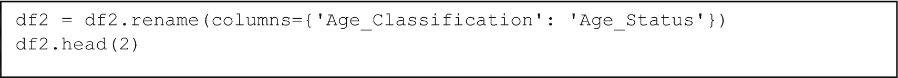

使用 2 行 Python 代码使用 rename 方法将列 age classification 重命名为 age status。

图 2-54

将 Age_Classification 重命名为 Age_Status

```py
df.rename(columns={'existing_column': 'renamed_column'})
```

这样就得到了一个应用了新名称的数据框。你可以通过在用于重命名列的字典中添加更多条目来以这种方式重命名多个列。

图 2-54 的输出被表 2-23 捕获。注意重命名是成功的。

表 2-23

执行图 2-54 中代码的结果

|   | PassengerId | Survived | Pclass | Name | Sex | Age | SibSp | Parch | Ticket | Fare | Cabin | Embarked | Age_Status |
| --- | --- | --- | --- | --- | --- | --- | --- | --- | --- | --- | --- | --- | --- |
| **0** | 1 | 0 | 3 | Braund, Mr. Owen Harris | male | 22.0 | 1 | 0 | A/5 21171 | 7.2500 | NaN | S | adult |
| **1** | 2 | 1 | 1 | Cumings, Mrs. John Bradley (Florence Briggs Th... | female | 38.0 | 1 | 0 | PC 17599 | 71.2833 | C85 | C | adult |

最后，让我们完全删除此列。一般约定是

```py
df.drop(column_name, axis=1)
```

参见图 2-55 了解如何从数据框中删除 'Age_Status'。

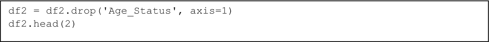

一行 Python 代码使用 drop 方法在 d f 2 中删除 axis = 1 的年龄状态列。

图 2-55

完全从 `df2` 中删除列 ‘Age_Status’

图 2-55 的输出被表 2-24 捕获。注意 'Age_Status' 已成功删除。

表 2-24

执行图 2-55 中代码的结果

|   | PassengerId | Survived | Pclass | Name | Sex | Age | SibSp | Parch | Ticket | Fare | Cabin | Embarked |
| --- | --- | --- | --- | --- | --- | --- | --- | --- | --- | --- | --- | --- |
| **0** | 1 | 0 | 3 | Braund, Mr. Owen Harris | male | 22.0 | 1 | 0 | A/5 21171 | 7.2500 | NaN | S |
| **1** | 2 | 1 | 1 | Cumings, Mrs. John Bradley (Florence Briggs Th... | female | 38.0 | 1 | 0 | PC 17599 | 71.2833 | C85 | C |

通过这些，你应该对 Pandas API 以及它允许你做什么有足够的了解，以便跟上书中其余的代码。如果有任何新的或高级的内容，将会进行解释。

现在你已经学会了如何根据你的喜好操作数据，你就可以探索如何进行数据分析了。

### 数据分析

Pandas 提供了各种功能来分析你的数据（以及检查关系、潜在模式等）。它还易于与其他专注于统计功能的 Python 模块集成，如 scipy 和 statsmodels，让你能够执行更详细的统计程序，更好地理解你的数据。

#### 频率计数

让我们从 `.value_counts()` 函数开始，该函数显示所有唯一的值及其频率计数。图 2-56 中显示的代码用于显示 'Embarked' 列的此类计数。

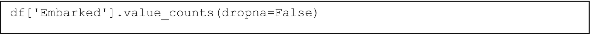

一行 Python 代码读取 d f 开方括号，Embarked 在引号中，闭方括号点 value underscore counts 开圆括号 drop n a = False 闭圆括号。

图 2-56

使用参数 `dropna=False` 指定不过滤任何空值的频率计数来显示 'Embarked' 列的频率计数

参见图 2-57 以查看图 2-56 的对应输出。

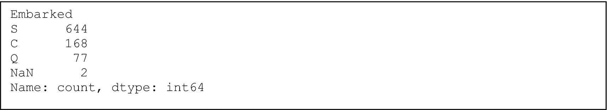

6 行输出显示了 embark 列的频率计数如下。S, 644。C, 168。Q, 77。N a N, 2。名称，计数。数据类型，int 64。

图 2-57

执行图 2-56 中代码的输出。value_counts() 函数提供了频率计数

通过调用 `.unique()`，我们可以直接获取列中所有唯一的值。参见图 2-58。


一行读取 d f，开方括号，引号中的 "Embarked"，闭方括号，点 unique，开括号，闭括号。

图 2-58

在 Pandas 系列上调用 `.unique()` 返回一个包含此系列中唯一值的 numpy 数组

执行图 2-58 中的代码的输出显示在图 2-59 中。


一行 Python 代码读取数组，开括号，开方括号，引号中的 "S"，逗号，引号中的 "C"，逗号，引号中的 "Q"，闭方括号，逗号，数据类型 = 对象，闭括号。

图 2-59

返回一个唯一值的数组

#### Pandas `.describe()` 方法

要获取每个列的简单摘要统计信息，我们可以调用 `.describe()` 来提供以下信息：

+   count

+   mean

+   std

+   min

+   max

+   第 25 百分位数

+   第 50 百分位数（中位数）

+   第 75 百分位数

图 2-60 展示了在多个列的数据框上调用 `.describe()` 的命令。这将为每个列生成一个摘要。


一行 Python 代码读取 d f，开双方括号，引号中的 "Fare"，逗号，引号中的 "Age"，闭双方括号，点 describe，开括号，闭括号。

图 2-60

在只有两列的数据框上调用 `.describe()`

输出表被捕获为表 2-25。

表 2-25

调用 `.describe()` 的统计摘要表输出

|   | Fare | Age |
| --- | --- | --- |
| **count** | 891.000000 | 714.000000 |
| **mean** | 32.204208 | 29.699118 |
| **std** | 49.693429 | 14.526497 |
| **min** | 0.000000 | 0.420000 |
| **25%** | 7.910400 | 20.125000 |
| **50%** | 14.454200 | 28.000000 |
| **75%** | 31.000000 | 38.000000 |
| **max** | 512.329200 | 80.000000 |

#### Pandas 相关矩阵

Pandas 相关矩阵告诉我们每对列之间的相关系数。**相关系数**衡量两个变量之间线性关系的强度。相关系数的范围从 -1 到 1，其中：

+   系数为 1 表示两个变量 x 和 y 具有完美的正线性关系。当 x 增加一个固定量时，y 也增加一个固定量。想想 y = 2x 这条线。

+   系数为 -1 表示两个变量 x 和 y 具有完美的负线性关系。当 x 增加一个固定量时，y 减少一个固定量。想想 y = -2x 这条线。

+   系数为 0 表示 x 和 y 之间没有可测量的线性关系。这并不意味着没有非线性关系，只是没有线性关系。

系数越接近 1 或 -1，两个变量之间的线性相关性就越强。如果你有一个相关系数为 0.8，那么当 x 增加时，y 也倾向于增加，但不如系数为 1 时那样可靠或一致。

通常，在机器学习任务中，你使用一些“特征”变量来根据某些“目标”变量进行预测。例如，使用生活成本、某些股票价格、利率、ZIP 码等（特征变量）来预测房价（目标变量）。更正式地说，你可能会看到特征变量被称为“解释变量”或“预测变量”，而目标变量被称为“因变量”。

我们可以使用相关矩阵来确定哪些预测变量与因变量具有最高的线性相关系数。如果你有一些与因变量几乎呈线性相关的变量，那么你的预测任务可能表现相当好。

此外，如果有多个解释变量彼此之间高度相关，你最好删除其中一些以避免冗余信息。例如，如果你有某人的税前工资和税后工资作为两个单独的变量，同时拥有这两个变量并不会给你带来太多信息。你只是在学习任务中引入了更多的“噪声”，使得模型更难学习。因此，删除彼此高度相关的预测变量可能是有益的。

在此基础上，让我们探讨如何在 Pandas 中生成和查看相关矩阵。你想要使用 `.corr()` 方法。请随时参考 Pandas 文档，了解生成相关系数的不同方法，你可以将这些方法指定为参数。

图 2-61 展示了如何进行此操作。首先，选择几个数值列。（相关系数只能在数值列之间计算。如果你想包括字符串列，你必须以某种形式对它们进行数值编码。我们将在稍后介绍这一点。）


以下是一行 Python 代码：d f 2 = d f open double square brackets, Survived in quotes comma Pclass in quotes comma Age in quotes comma Sib S p in quotes comma Parch in quotes comma Fare in quotes close double brackets. d f 2 dot c o r r open and close parentheses.

图 2-61

选择数值列并使用 `.corr()` 创建相关矩阵。结果是 pandas 数据框

请参考表 2-26 以查看输出相关矩阵（由 Pandas 作为数据框返回）。

表 2-26. 执行图 2-61 中的代码产生的输出相关矩阵

|   | 生存 | Pclass | 年龄 | 兄弟姐妹数 | 父母和配偶数 | 船票价格 |
| --- | --- | --- | --- | --- | --- | --- |
| **生存** | 1.000000 | -0.338481 | -0.077221 | -0.035322 | 0.081629 | 0.257307 |
| **Pclass** | -0.338481 | 1.000000 | -0.369226 | 0.083081 | 0.018443 | -0.549500 |
| **年龄** | -0.077221 | -0.369226 | 1.000000 | -0.308247 | -0.189119 | 0.096067 |
| **兄弟姐妹数** | -0.035322 | 0.083081 | -0.308247 | 1.000000 | 0.414838 | 0.159651 |
| **Parch** | 0.081629 | 0.018443 | -0.189119 | 0.414838 | 1.000000 | 0.216225 |
| **Fare** | 0.257307 | -0.549500 | 0.096067 | 0.159651 | 0.216225 | 1.000000 |

忽略对角线列——当然，一列与其自身完全线性相关。特别值得注意的是“Survived”列及其与其他列的相关性。Pclass 和 Fare 似乎与 Survived 的相关性最强，尽管这种相关性的幅度并不高。我们可以称之为*弱相关性*，而*强相关性*是指大于 0.7 的系数，例如。

### 可视化

为了可视化您的数据，您可以使用 matplotlib 创建图表，这是一个 Python 库，允许您创建符合您喜好的定制图表。像 seaborn 这样的库在功能上扩展了 matplotlib。我们将在第五章和第六章中使用 seaborn 的热图，这是一个有用的功能，可以让我们可视化各种机器学习性能指标。

以下几节将介绍一些关于创建图表的基本知识。

#### 折线图

**折线图**对于绘制时间序列数据或任何沿某种轴进展的数据类型非常有用——例如，绘制数学函数。图 2-62 展示了如何通过采样正态分布并绘制折线图来生成一些白噪声。


Python 代码读取 noise = n p dot random dot normal open parenthesis size = 100 close parenthesis. p l t dot plot open parenthesis noise close parenthesis.

图 2-62

创建一些随机噪声并绘制它

`plt.plot(sequence)` 创建一个基本的折线图，其中 `sequence` 是一种可迭代对象，如列表或 NumPy 数组，它包含要绘制的数据。您也可以传递 `plt.plot(seq_x, seq_y)`，但如果只传递一个序列，matplotlib 会隐式地创建一个从零到序列长度的范围，用于 x 轴。

执行图 2-62 中的代码生成的图表应该看起来像图 2-63。请注意，它不会完全匹配，因为我们正在取噪声的随机样本。所以只要你的图表在风格上与图 2-63 相似，那么它就是有效的。


折线图绘制了随机噪声的 y 与 x 值。曲线不规则，有许多尖锐的峰和谷。

图 2-63

随机正态噪声的简单折线图

#### 图表定制

现在我们来看看如何定制我们的图表，以及如何在同一图表中绘制第二条线。请参考图 2-64 中的代码列表。


一段 18 行的 Python 代码使用绘图函数绘制两种不同的随机噪声序列。将大小、标题、x 标签、y 标签和图例添加到图表中。

图 2-64

绘制两种不同随机噪声序列的代码。此外，我们还可以配置图表大小、标题、x 和 y 轴标签，并添加图例

执行图 2-64 中的代码的输出显示在图 2-65 中。


一个图表绘制了白噪声的值与样本数的关系。数据为图 1 和图 2 绘制。曲线是不规则的，有许多尖锐的峰和谷。

图 2-65

执行图 2-64 中的代码的输出

注意

使用这种基本的配置，我们可以在后面的章节中自由地绘制任何我们想绘制的内容。例如，绘制多个不同模型的损失曲线（直观地评估模型之间的性能）或并排评估两个时间序列图表。一个例子是绘制某个月的时间序列预测与实际时间序列数据。

以下列表描述了图 2-64 中的代码：

+   `plt.figure(figsize=(a,b))` 允许你配置图表的大小。参数 `a, b` 指的是图表的宽度和高度（以英寸为单位）。

+   `plt.title(your_title)` 允许你为图表添加标题。

+   `plt.xlabel(xlabel_string)` 和 `plt.ylabel(ylabel_string)` 分别允许你为 x 轴和 y 轴添加标签。

+   `plt.legend(list_of_names)` 允许你添加图例。字符串名称列表必须与图表的时序顺序相对应。

#### 散点图

你还可以绘制其他类型的图表，例如散点图。图 2-66 展示了如何创建散点图。散点图在你想了解数据在各个列之间如何分布时非常有用。例如，你可以查看房价与 ZIP 码的关系，以了解每个 ZIP 码的数据分布情况。


一段 3 行的 Python 代码读取 x= n p dot random dot random open parenthesis size = 100 close parenthesis。y = n p dot random dot random open parenthesis size = 100 close parenthesis。p l t dot scatter open parenthesis x comma y close parenthesis。

图 2-66

在 x 和 y 轴上生成随机噪声并创建散点图

执行图 2-66 中的代码的输出显示在图 2-67 中。


散点图绘制 y 与 x 的关系。这些点在图表上是随机分布的。

图 2-67

对于散点图，你需要明确提供 x 和 y 数据

记住，之前的自定义函数在这里同样适用，因此你可以为你的图表添加标题，标注轴标签，调整图表大小，等等。Matplotlib 非常可定制，所以请花些时间自己进一步探索。

#### 直方图

您还可以绘制直方图。这在您想要了解数据集中数据点的频率分布以找出数据分布时非常有用。其工作原理是将整体数据范围分成几个子区间。如果一个数据点落在这个区间内，该区间的计数就增加一个。其余的数据以这种方式计数，从而得到频率图。图 2-68 展示了使用数据框中的“Fare”列绘制直方图的代码。


一行 Python 代码读取 p l t dot hist open parenthesis d f open square bracket, Fare in quotes, close square bracket close parenthesis。

图 2-68

创建乘客支付费用的整体分布的直方图

结果应该看起来像图 2-69。请记住，这个直方图是高度可定制的。您可以设置自己的 bin 数量以更精细地显示频率，这样就不会有太多的值落在同一个 bin 中。


直方图显示了 y 与 x 的关系。估计值是（0 到 50，700），（50 到 100，100），（100 到 150，40），（150 到 200，10），（200 到 250，20），（250 到 300，10），（300 到 450，0），以及（450 到 500，10）。

图 2-69

频率直方图，显示费用数据如何落入各自的 bin

#### 柱状图

柱状图非常适合显示多个类别中的数据。例如，如果您知道信息，您可以显示数据集中有多少异常值和多少正常数据点。图 2-70 中的代码使用柱状图显示了男性和女性的数据频率。


一行 Python 代码读取 p l t dot bar open parenthesis d f open square bracket, Sex in quotes close square bracket dot unique open and close parentheses comma d f open square bracket, Sex in quotes, close square bracket dot value underscore counts open and double close parentheses。

图 2-70

创建柱状图

第一个参数告诉 matplotlib 有哪些唯一值，第二个参数分别给出了男性和女性的数据频率。

图 2-71 展示了生成的柱状图。


柱状图显示了单位与性别的关系。估计值是（男性，580）和（女性，340）。

图 2-71

由图 2-70 中的代码创建的柱状图

注意

请记住，这些图表都是高度可定制的。本节仅提供了显示 matplotlib 中可以执行的一些基本操作的最低限度的代码。

我们将在本书的后面部分遇到一些这些基本的图表和绘图类型。别忘了 matplotlib 提供了更多有用的绘图类型，这些类型在您的数据分析或可视化中可能非常有用。

### 数据处理

数据处理是数据科学中一个非常关键的因素。现实世界的数据几乎从不完美，尤其是如果你在大数据库中处理大量存储的数据，或者如果你在处理实时数据流时。在某个时候，你将不得不处理缺失值、异常值、错误条目，或者需要将你的数据转换成更好的、更适合模型格式的格式。

你可能会遇到的最常见的数据不完美之一是空值，它发生在本应存在条目的地方却不存在条目时。在这些情况下，你需要处理具有这些缺失元素的数据，因为机器学习模型不知道如何直接解释它。

#### 空值

处理空值条目有许多策略。一个简单的解决方案是删除包含空值的列本身或删除包含空值的行。检查一个列有多少空值的一种方法是使用`df[your_column].isna().sum()`。函数`.isna()`在值是空值时返回`True`，如果不是空值则返回`False`。通过求和，你可以得到空值数量的总数。

图 2-72 显示了比较列‘年龄’中的空值数量与总行数的代码。


一行 Python 代码读取 d f 开方括号，Age 在引号内，闭方括号点 is n a 开括号和闭括号 sum 开括号和闭括号逗号 len 开括号 d f 开方括号，Age 在引号内，闭方括号闭括号。

图 2-72

比较列‘年龄’中的空值数量与总记录数

你应该看到一个类似`(177, 891)`的输出。所以现在我们知道‘年龄’列有 177 个空值，考虑到这意味着几乎 20%的数据对于‘年龄’来说是空值。

再次，一个简单的方法是删除所有空值的行。我们可以通过执行图 2-73 中的代码来实现。


一行 Python 代码 d f 点 drop n a 开括号 subset =开方括号，Age 在引号内，闭方括号闭括号。

图 2-73

删除行并指定我们只想删除属于传递给子集的列表中的列的空值行

我们明确地将‘年龄’包含在遇到空值时需要删除行的列子集中。如果我们没有传递任何参数给`.dropna()`，它将删除任何地方检测到单个空值的行。这将大大减少我们的总数据量。

有时候，你可能不想删除缺失值，因为这会过多地减少数据量。也许只有一个列有缺失值，而其他列相对较好。你也可以*插值*值——沿着列拟合各种函数来近似应该放在中间的内容，或者通过一些算法方法（如最近非空值的平均值）来填充它们——这是一个单独的主题，本身就有很多深度。

我们可以通过首先计算‘年龄’列的平均值，然后使用`.fillna()`函数来简单地填充缺失值（**插补**），如图 2-74 所示。


使用 5 行 Python 代码在 d f 的年龄列上使用 mean 函数，将其分配给 d f 2 的副本，并使用 fill n a 函数和 is n a 函数检查年龄是否因性别而填写错误。

图 2-74

计算平均年龄，使用此计算出的平均值填充缺失值，然后使用原始缺失值的索引显示‘年龄’列的填充缺失值

执行图 2-74 中的代码的输出显示在表 2-27 中。如果你查看`df`中的相同行，你会注意到这些特定行的‘年龄’会是空的。然而，在`df2`中，我们使用平均年龄插补了这些缺失值。表 2-27 显示我们已经成功替换了缺失值。

表 2-27

执行图 2-74 中的代码的输出

|   | PassengerId | Survived | Pclass | Name | Sex | Age | SibSp | Parch | Ticket | Fare | Cabin | Embarked |
| --- | --- | --- | --- | --- | --- | --- | --- | --- | --- | --- | --- |
| **5** | 6 | 0 | 3 | Moran, Mr. James | male | 29.699118 | 0 | 0 | 330877 | 8.4583 | NaN | Q |
| **17** | 18 | 1 | 2 | Williams, Mr. Charles Eugene | male | 29.699118 | 0 | 0 | 244373 | 13.0000 | NaN | S |
| **19** | 20 | 1 | 3 | Masselmani, Mrs. Fatima | female | 29.699118 | 0 | 0 | 2649 | 7.2250 | NaN | C |
| **26** | 27 | 0 | 3 | Emir, Mr. Farred Chehab | male | 29.699118 | 0 | 0 | 2631 | 7.2250 | NaN | C |
| **28** | 29 | 1 | 3 | O’Dwyer, Miss. Ellen “Nellie” | female | 29.699118 | 0 | 0 | 330959 | 7.8792 | NaN | Q |

#### 类别编码

在你的数据中，你可能有很多你想要建模的字符串值。例如，性别被记录为‘male’或‘female’，但机器学习模型不能直接解释文本。它们在数字上操作，所以我们需要将这些字符串转换为数值表示。有两种方法可以做到这一点：

+   将标签映射到一个一对一的数值等效

+   构造独热向量并将其作为列添加以对类别进行编码

对于第一种方法，我们可以使用 scikit-learn 帮助我们创建一个标签编码器，将我们的分类标签自动映射到数值等效。我们也可以使用这个相同的标签编码器对象将这些值切换回原始的分类值。要开始使用标签编码器，请参考图 2-75。


一段 3 行的 Python 代码用于从 s k learn.preprocessing 导入标签编码器。读取 d f 2 = d f dot copy open and close parentheses。d f 2 open square bracket，Embarked in quotes，close square bracket dot unique open and close parentheses。

图 2-75

导入标签编码器并找出“Embarked”中存在的唯一值，以查看我们必须编码的内容。“Embarked”中包含一个空值，它也将被标签编码器映射

你应该看到类似这样的内容：

```py
array(['S', 'C', 'Q', nan], dtype=object)
```

要实际上将标签编码器拟合到我们的数据上，我们执行图 2-76 中显示的代码。


一段 3 行的 Python 代码使用标签编码器函数将值拟合到“Embarked”列。

图 2-76

实例化一个标签编码器对象并将其拟合到我们的值列。然后我们打印出类别

你应该看到类似这样的内容：

```py
array(['C', 'Q', 'S', nan], dtype=object)
```

现在我们可以开始转换我们的 dataframe 中的值，如图 2-77 所示。


一段 2 行的 Python 代码用于将 d f 2 中的“Embarked”列的值进行转换。

图 2-77

使用`embarked_encoder`对象将“Embarked”中的现有值转换为数值等效

输出应该看起来像表 2-28。

表 2-28

将“Embarked”列的值转换为数值等效后的“Embarked”列

|   | PassengerId | Survived | Pclass | Name | Sex | Age | SibSp | Parch | Ticket | Fare | Cabin | Embarked |
| --- | --- | --- | --- | --- | --- | --- | --- | --- | --- | --- | --- |
| **0** | 1 | 0 | 3 | Braund, Mr. Owen Harris | male | 22.0 | 1 | 0 | A/5 21171 | 7.2500 | NaN | 2 |
| **1** | 2 | 1 | 1 | Cumings, Mrs. John Bradley (Florence Briggs Th... | female | 38.0 | 1 | 0 | PC 17599 | 71.2833 | C85 | 0 |
| **2** | 3 | 1 | 3 | Heikkinen, Miss. Laina | female | 26.0 | 0 | 0 | STON/O2\. 3101282 | 7.9250 | NaN | 2 |
| **3** | 4 | 1 | 1 | Futrelle, Mrs. Jacques Heath (Lily May Peel) | female | 35.0 | 1 | 0 | 113803 | 53.1000 | C123 | 2 |
| **4** | 5 | 0 | 3 | Allen, Mr. William Henry | male | 35.0 | 0 | 0 | 373450 | 8.0500 | NaN | 2 |

如果你想反转转换，请使用`.inverse_transform()`函数，如图 2-78 所示。


一行代码使用逆转换函数对 d f 2 中“Embarked”列的值进行操作，并使用 head 方法调用前两行。

图 2-78

将转换反转，使“Embarked”值回到它们最初的状态

你应该看到值已经恢复正常。

我们也可以对列中的分类值进行独热编码。独热编码产生一个值向量，其中每个条目正好对应一个特定的分类类别。向量将到处都是 0，除了一个特定的索引，它对应于类别本身，那里的值是 1。

为了说明这一点，假设我们只有三个分类值：‘猫’，‘狗’和‘老鼠’。属于‘狗’的数据点的独热向量将是[0, 1, 0]。标签‘老鼠’的独热向量将是[0, 0, 1]，而‘猫’的独热向量将是[1, 0, 0]。在整个向量中应该只有一个 1，属于特定的类别。如果标签是空值（Null），那么向量可以全部是 0，整个向量中不包含任何 1。

当我们将独热编码作为列本身的转换时，我们现在为每个分类标签创建一个列，其中值只能是 1（如果条目属于这个类别）或其它地方都是 0。这是一种更可扩展的分类编码方法，特别是如果你有很多类别。此外，稀疏数据（**稀疏**意味着有很多 0 值和很少的真实值）格式也可以使学习任务更容易，因为它可能更容易区分属于不同类别的不同数据点。区分 1 和 0 比区分 1、2、3、4 等更容易。

要以这种独热方式执行分类编码，我们可以使用函数`pd.get_dummies()`，它为遇到的每个唯一类别创建单独的列，其中值只能是`True`或`False`。每一行在整个行中只有一个`True`值，因为它应该是一个独热向量。

图 2-79 中的代码显示了如何使用`.get_dummies()`为‘Embarked’列创建独热列。`prefix`参数将此值作为前缀添加到创建的列中。否则，每个创建的列将根据它所属的分类值命名。最好提供前缀，这可以简单地是列名本身，以便于清晰。


Python 代码使用 d f 2 的独热索引作为列标题的前缀。

图 2-79

为‘Embarked’列创建独热列

输出应该看起来像表 2-29。注意，空值（null）作为列是缺失的，但在这个例子中，如果整个行中没有单个`True`值，那么该行表示空值。所以如果整个行是`False`（或 0），那么对于那一行来说‘Embarked’是空的。

表 2-29

为‘Embarked’创建的独热列

|   | Embarked_C | Embarked_Q | Embarked_S |
| --- | --- | --- | --- |
| **0** | False | False | True |
| **1** | True | False | False |

你会注意到在表 2-29 中，值不是 1 或 0，而是布尔值。如果需要，你可以通过类型转换显式地将这些值转换为数字，例如 int 或 float。

那么，我们如何将这个与我们的原始数据框结合起来呢？这正是连接操作派上用场的地方。我们只需要将这个独热数据框与原始数据框连接起来。索引应该相同。参见图 2-80。


一行 Python 代码使用 join 函数创建一个名为 embarked 的列。

图 2-80

将原始数据框与派生的独热数据框连接起来。隐式地，Pandas 在两行具有相同索引时在索引上进行连接

输出应该看起来像表 2-30。在这里，我们只显示 `.head(2)`。

表 2-30

将原始数据框与独热数据框连接起来，以重新添加独热列

|    | PassengerId | Survived | Pclass | … | Embarked | Embarked_C | Embarked_Q | Embarked_S |
| --- | --- | --- | --- | --- | --- | --- | --- | --- |
| **0** | 1 | 0 | 3 | … | S | False | False | True |
| **1** | 2 | 1 | 1 | … | C | True | False | False |

在进行任何建模之前，别忘了删除‘Embarked’；整个目的就是为了用独热列来替换它。

#### 缩放和归一化

将数据缩放/归一化到公共范围可以非常有助于促进建模任务。假设你有两个列，一个的范围高达 10,000，另一个的范围只有 1。模型可能会更重视前者的值，而不是后者的值。这纯粹是因为对模型所做的调整将对具有大数值的列产生更大的影响。

如果你考虑一个简单的 y=mx+b 模型，其中 x 的定义域包括一些高达一百万的巨大数字，那么对斜率 m 的增量更新甚至只有 0.1，也会导致预测的 y 值发生巨大变化。现在想象一下，如果 x 的定义域缩小到类似（-1，1）的范围，而分布大致保持不变，增量更新将不再导致预测的大幅波动。当多个列都在相似的范围内时，学习任务会更好，因为模型可以更有效地进行学习步骤来正确地拟合数据。

更正式地说，缩放和归一化的好处包括以下内容：

+   **偏差减少**：模型不会受到异常值或相对于其他数据具有大数值的列的影响，这将使模型能够更准确地模拟数据。

+   **稳定性**：有时，模型的学习过程可能会变得不稳定，并完全偏离（得到一个坏解决方案）。通过归一化数据的规模，模型的学习任务将更加直接，甚至可能收敛到一个更好的解决方案。

那么，我们如何缩放/归一化数据？有相当多的方法，但特别的是标准缩放（计算列的 z 分数）和最小-最大缩放（通过使用列中找到的最小值和最大值将值缩放到更小的范围）。我们将使用 scikit-learn 来帮助完成这项工作。

以下是用作 StandardScaler 重新缩放值的 Z 分数公式的示例。变量 x 是输入，u 是列的平均值，s 是列的标准差。


让我们从 StandardScaler 开始。查看图 2-81 中的代码。


一段 10 行的 Python 代码使用标准缩放函数来拟合年龄列。

图 2-81

StandardScaler 的语法与标签编码器非常相似。使用 StandardScaler，我们归一化‘年龄’列

您应该看到类似于表 2-31 的输出，该表显示已对‘年龄’列应用了标准缩放，以便数据遵循正态分布。

表 2-31

将标准缩放应用于‘年龄’列

|   | PassengerId | Survived | Pclass | Name | Sex | Age | Cabin | … | Embarked |
| --- | --- | --- | --- | --- | --- | --- | --- | --- | --- |
| **0** | 1 | 0 | 3 | Braund, Mr. Owen Harris | male | -0.530377 | NaN | … | S |
| **1** | 2 | 1 | 1 | Cumings, Mrs. John Bradley (Florence Briggs Th... | female | 0.571831 | C85 | … | C |
| **2** | 3 | 1 | 3 | Heikkinen, Miss. Laina | female | -0.254825 | NaN | … | S |
| **3** | 4 | 1 | 1 | Futrelle, Mrs. Jacques Heath (Lily May Peel) | female | 0.365167 | C123 | … | S |
| **4** | 5 | 0 | 3 | Allen, Mr. William Henry | male | 0.365167 | NaN | … | S |

标准缩放并不一定将您的范围缩小到（-1,1）。它对数据进行归一化，因此数据可能具有与平均值相差四个标准差的价值。这种转换使数据具有均值为 0 和标准差为 1。

Scikit-learn 提供了许多其他标准化技术，每种技术对数据都有其自己的影响。值得探索和尝试这些技术，因为没有一种万能的缩放方法，并且您数据的性质可能需要各种技术。

### 特征工程与选择

**特征工程**是从数据中创建有意义的特征。这可能涉及原始数据的处理，清理空值，以及通过使用现有列/数据的组合或结合来自其他来源的外部数据来创建新的数据列。有时，领域专业知识也有助于创建新的特征。

**特征选择**更多地关于选择仅与建模任务相关和有用的特征。并非每个列或变量都将是有用的，正如我们在 Pandas 相关矩阵部分所提到的。

让我们创建一些新的特征，看看我们是否能从中获得任何有用的信息。特别是，我们将创建以下列：

+   **职位**：提取小姐、夫人、先生或任何其他职位。

+   **年龄组**：根据年龄分组，如儿童、成年人、青年等。

+   **家庭成员数量**：Parch 是乘客在船上的父母和孩子的数量。SibSp 是这位乘客的兄弟姐妹数量。我们将这些结合起来形成一个新的指标。

让我们定义一些函数来帮助我们提取这些特征。参见图 2-82。


13 行 Python 代码使用 split 和 strip 函数将姓名以名-姓格式分开，删除逗号后的空格，并在职位后应用点。

图 2-82

创建`df2`，`df`的副本，并应用`get_title()`创建一个仅用于职位的列

接下来，图 2-83 通过创建“年龄组”列和“家庭成员数量”列继续进行特征创建。


13 行 Python 代码使用年龄组函数和 if 或 else 循环将年龄类别映射到儿童、青少年、青年成年人、成年人和老年。

图 2-83

将年龄映射到创建不同的年龄分类类别，并通过求和“SibSp”和“Parch”创建“家庭成员数量”

通过调用`df2.head()`，你应该能看到类似于表 2-32 的内容。

表 2-32

观察新创建的特征

|   | 乘客 ID | 是否幸存 | 船级 | 姓名 | … | 职位 | 年龄组 | 家庭成员数量 |
| --- | --- | --- | --- | --- | --- | --- | --- | --- |
| **0** | 1 | 0 | 3 | 布朗，欧文·哈里斯先生 | … | 先生 | 青年成年人 | 1 |
| **1** | 2 | 1 | 1 | 库明斯，约翰·布拉德利夫人（佛罗伦斯·布里格斯·… | … | 夫人 | 成年人 | 1 |
| **2** | 3 | 1 | 3 | 海金恩，莱娜小姐 | … | 小姐 | 成年人 | 0 |
| **3** | 4 | 1 | 1 | 菲特雷尔，杰奎斯·希思夫人（莉莉·梅·皮尔） | … | 夫人 | 成年人 | 1 |
| **4** | 5 | 0 | 3 | 艾伦，威廉·亨利先生 | … | 先生 | 成年人 | 0 |

现在让我们将这些列中适当的地方应用标签编码器。参见图 2-84。


使用标签编码器索引的 9 行 Python 代码用于标记列。标记的列是性别、登船港口、职位和年龄组。

图 2-84. 对列“性别”、“登船港口”、“职位”和“年龄组”应用标签编码器

你的输出应该类似于表 2-33。

表 2-33

截断的表输出，相关列的值已映射到数值等效

|   | 乘客 ID | 姓名 | … | 性别 | 职位 | 年龄组 | 家庭成员数量 |
| --- | --- | --- | --- | --- | --- | --- | --- |
| **0** | 1 | 布朗，欧文·哈里斯先生 | … | 1 | 11 | 4 | 1 |
| **1** | 2 | 库明斯，约翰·布拉德利夫人（佛罗伦斯·布里格斯·… | … | 0 | 12 | 0 | 1 |

现在我们可以最终查看相关矩阵，以了解哪些列与‘Survived’相关性最高。参见图 2-85。


一段 3 行的 Python 代码使用选择列表索引和 c o r r 函数来选择列。

图 2-85

在相关矩阵中选择特定的列进行显示。分类列不能直接在矩阵中

你的相关矩阵应该看起来像表 2-34。

表 2-34

相关矩阵（截断）

|   | Survived | Pclass | … | Age_Group | Family_Count |
| --- | --- | --- | --- | --- | --- |
| **Survived** | 1.000000 | -0.338481 | ... | -0.052325 | 0.016639 |
| **Pclass** | -0.338481 | 1.000000 | ... | 0.124159 | 0.065997 |
| **Sex** | -0.543351 | 0.131900 | … | -0.029088 | -0.200988 |
| **年龄** | -0.077221 | -0.369226 | … | -0.298501 | -0.301914 |
| **SibSp** | -0.035322 | 0.083081 | … | -0.013418 | 0.890712 |
| **Parch** | 0.081629 | 0.018443 | … | -0.054641 | 0.783111 |
| **Embarked** | -0.163517 | 0.157112 | … | -0.039660 | 0.064701 |
| **Title** | -0.193635 | 0.029099 | … | -0.080130 | -0.199883 |
| **Age_Group** | -0.052325 | 0.124159 | … | 1.000000 | -0.036469 |
| **家庭成员数量** | 0.016639 | 0.065997 | … | -0.036469 | 1.000000 |

如果我们只看‘Survived’列，我们会发现‘Sex’和‘Pclass’是两个最强的相关性值，因为这些列具有最高的相关性幅度。

我们还想要确保特征之间不是过于相互关联。如果是这样，那么我们引入了冗余，因为如果相关性高，很可能是更多同类型的信息。如果我们看一下‘Family_Count’、‘SibSp’和‘Parch’，这三个变量之间的相关性非常高。考虑到我们直接从后两个列中推导出‘Family_Count’，这是有道理的，但这说明了‘Family_Count’是一个冗余变量。我们可以删除‘Family_Count’并保留‘SibSp’和‘Parch’，或者我们可以删除后两个，只保留‘Family_Count’。有许多方法可以采取。

最后，让我们尝试对列进行独热编码，看看扩展分类特征是否能帮助我们更好地理解数据关系。参见图 2-86。


一段 6 行的 Python 代码使用 join 函数创建了四个列。列标题是 sex、embarked、title 和 age group。

图 2-86

为‘Sex’、‘Embarked’、‘Title’和‘Age_Group’创建独热编码列

你的输出将类似于表 2-35。由于扩展，现在有 43 列。请注意，如果你的类别很多，你的列数可能会激增。你可以使用相关矩阵来帮助你通过消除相关性非常差的列来修剪和删除列数。但请注意，缺乏线性相关性并不意味着没有非线性相关性，而且高相关性也不一定意味着有因果关系。

表 2-35

扩展后的数据集

|   | PassengerId | Survived | … | Title_15 | Title_16 | Age_Group_0 | Age_Group_1 | Age_Group_2 | Age_Group_3 | Age_Group_4 |
| --- | --- | --- | --- | --- | --- | --- | --- | --- | --- | --- |
| **0** | 1 | 0 | … | False | False | False | False | False | False | True |
| **1** | 2 | 1 | … | False | False | True | False | False | False | False |

我们创建了很多新的列，因此更新后的相关矩阵将会非常大。让我们通过选择列‘Survived’并检查这些相关性值来观察更新后的相关矩阵。代码如图 2-87 所示。如果你愿意，可以更详细地检查完整的相关矩阵。别忘了，相关矩阵的结果本身就是一个 dataframe，因此你可以选择列、过滤值、排序表格等。


一行 Python 代码使用了 drop 方法，在 axis = 1 的乘客 ID、姓名、票号和客舱列上，并选择了 df 2 中的 survived 列用于 c o r r 函数。

图 2-87

删除不必要的列，并在结果的相关矩阵中仅选择‘生存’列

执行图 2-87 中的代码后，你的输出应该看起来类似于表 2-36。再次提醒，完整的表格将会非常长。

表 2-36

更新后的相关矩阵截断到生存列

|   | 生存 |
| --- | --- |
| --- | |
| **Survived** | 1.000000 |
| **Pclass** | -0.338481 |
| **性别** | -0.543351 |
| **…** | … |
| **Age_Group_3** | 0.043789 |
| **Age_Group_4** | -0.037627 |

看起来，通过进行独热编码，我们发现了与‘生存’比其他特征更相关的特征。例如，包括 Title_11、Title_12 和 Title_8。如果我们像图 2-88 中所示，使用标签编码器对这些特征进行逆变换，我们就会立即明白原因。


一行 Python 代码读取 title underscore label underscore encoder dot inverse underscore transform open parenthesis open square bracket 8 comma 11 comma 12 close square bracket close parenthesis。

图 2-88

对相关性高的三个标题值进行逆变换

给出的输出如下：

```py
array(['Miss.', 'Mr.', 'Mrs.'], dtype=object)
```

因此，我们现在可以理解为什么这些标题与其他标题的相关性更高。你仅从这些标题中就可以直接提取乘客的性别，这也解释了为什么 Title_11（对应“先生”）与“Survived”的相关性比其他标题要高，因为幸存下来的乘客倾向于女性。

有了这些，你现在已经完成了基本特征工程和选择。在数据科学的一般领域，还有更多内容，但就本书的目的和范围而言，你已经超越了你需要了解的基础知识，以便跟随本书的其余部分。

## 摘要

现在，你应该更熟悉如何使用 Pandas、scikit-learn 和 matplotlib 来加载数据，将其转换为你的喜好，为机器建模做准备，并进行统计和可视化分析。有了这些知识，你将能够跟随本书的其余部分，并有一个基本的基础来扩展未来的项目。

在第三章中，我们将从高层次上介绍机器学习是什么，以及涵盖将应用于本书其余部分、深度学习以及更广泛领域的重要概念。
