# 3. 机器学习简介

本章向您介绍了机器学习的基本原理，包括机器学习的工作流程。这些概念将适用于您可能遇到的几乎所有建模任务，并且它们也扩展到深度学习建模。这是对机器学习的高层次理论介绍，因为后续章节将涵盖这些机器学习原理的实践材料和实现。

到本章结束时，您将了解基本的机器学习建模工作流程，机器学习建模是什么，如何评估和解释模型性能，以及如何处理模型正确学习任务并在全新数据上表现良好的问题。

简而言之，本章涵盖了以下主题：

+   机器学习简介

+   数据拆分

+   建模与评估

+   过拟合与偏差-方差权衡

+   超参数调整

+   验证

注意

代码示例使用 Python 3.8 编写。本书的代码仓库可在以下链接找到：[`https://github.com/apress/beginning-anomaly-detection-python-deep-learning-2e/tree/master`](https://github.com/apress/beginning-anomaly-detection-python-deep-learning-2e/tree/master)。

仓库中还有一个 requirements.txt 文件，可以检查您的包及其版本。

本章的编码示例可在以下链接找到：[`https://github.com/apress/beginning-anomaly-detection-python-deep-learning-2e/blob/master/Chapter%203%20Introduction%20to%20Machine%20Learning/chapter3_machinelearning.ipynb`](https://github.com/apress/beginning-anomaly-detection-python-deep-learning-2e/blob/master/Chapter%203%20Introduction%20to%20Machine%20Learning/chapter3_machinelearning.ipynb)。

导航到“第三章 机器学习简介”然后点击 chapter3_machinelearning.ipynb。代码也以.py 文件的形式提供，尽管它是笔记本的导出版本。

我们将使用 JupyterLab 来展示所有的代码示例。

## 机器学习

近年来，人工智能（AI）和机器学习（ML）已成为商业、学术界和媒体讨论的热门话题。这并非没有原因。得益于计算能力和算法的发展，机器学习真正起飞并永久地改变了社会。您可能不知道，但机器学习几乎支撑了您日常生活的每一个部分，包括在线内容/产品推荐、语音助手、Google 搜索，甚至资源消耗预测（例如，由能源公司和有线电视公司执行）。

这些进步主要来自深度学习，它是机器学习的一个子领域，专注于人工神经元的概念。我们将在第五章节中更详细地介绍深度学习。然而，机器学习的某些基本方面既适用于传统的机器学习算法（不依赖于神经网络），也适用于深度学习模型，我们将在本章中介绍这些内容。在本章中，我们将介绍机器学习是什么，机器学习的工作流程是什么样的，如何评估机器学习模型，以及如何调整它们以实现更优的性能。

### 机器学习简介

在最简单的意义上，**机器学习**是通过提供数据来教授模型如何执行任务的过程。我们不是明确地编写模型来执行任务，而是编写模型可以学习、改进和重复执行任务的机制，这样到训练结束时，模型就能够执行我们想要的任何任务。

你可以把它想象成给一个孩子（他作为一个空白 slate 和模型，对主题一无所知）提供一个合适的学习环境和材料，并让这个孩子只研究这个主题几天。到头来，这个孩子可能会希望学会如何执行学习材料所教授的任何任务。

在机器学习的背景下，一个**模型**是一个高级函数，它接受输入数据并将其映射到特定的输出。当模型正在**学习**时，它正在调整其内部机制以更好地执行它所接受的数据上的任务。当我们说一个模型表现得好或不好时，我们定义一些指标来评估这些机器学习模型的输出预测，以了解它们的性能如何。例如，准确率是一个简单的指标，我们可以用它来衡量预测性能。

机器学习的概念经常与人工智能和深度学习的概念混淆，所以让我们定义其他两个术语。

**人工智能**是计算机科学的一个广泛领域，它专注于解决通常只有人类才能执行的高级、复杂任务。人工智能程序通常是许多组件组成的系统，所有这些组件共同工作以帮助完成各种任务，这些任务可以从像 Siri、Alexa 和 Cortana 这样的语音助手，到像 ChatGPT 这样强大的通用人工智能，它可以编写代码、创建图片等，再到自动驾驶汽车。每个系统都依赖于各种机器学习模型组件来工作。自动驾驶汽车需要一个视觉模型来从视频流中检测对象并将它们分类为行人、汽车、路标等，还需要另一个机器学习模型来负责做出“在当前时刻我应该转向多少？”之类的决策。

**深度学习**是机器学习的一个子领域。它继承了所有典型的建模工作流程过程，但深度学习严格关注人工神经元的概念，这是一个对生物神经元的慷慨抽象。尽管如此，它已经证明作为一个学习模型非常成功，并且与过去十年计算能力的爆炸性增长相结合，深度学习模型已经变得非常强大和有能力。也许截至本文写作时，深度学习的顶峰是 OpenAI 的 ChatGPT。

图 3-1 展示了这三个领域是如何相互关联的。

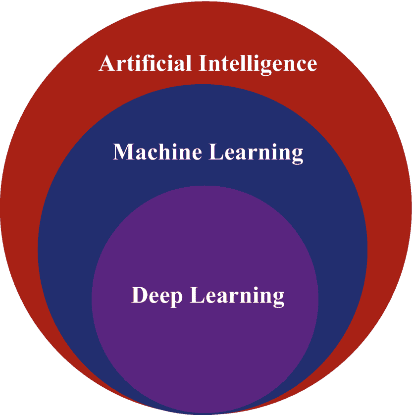

一个三个同心圆的示意图。从最内层到最外层，圆圈分别标记为深度学习、机器学习和人工智能。

图 3-1

人工智能、机器学习和深度学习之间的关系

注意，这三个领域都与数据科学重叠，因为建模也可以是数据科学的一部分。还请注意，人工智能本身与其他相关领域部分重叠，例如机器人学、强化学习（它本身与机器人学、机器学习和深度学习重叠）、统计学等等。人工智能确实是一个跨学科领域。

回到机器学习的抽象定义，我们知道我们有一个机器，并且它在给定数据的情况下试图学习某些东西。那么，这个工作流程通常是什么样的呢？无论你处理的是机器学习模型还是深度学习模型，建模工作流程包括以下内容：

+   **问题陈述**：你试图解决的任务是什么？

+   **数据收集**：在你能够向模型教授任何东西之前，你首先需要相关的数据。

+   **数据处理**：处理数据（如果需要）并手动标注，以向模型展示任务上正确性能的样子。这就是你清理数据、分析数据并执行特征工程的地方。

+   **数据拆分**：将数据集划分为训练、测试和验证组件。想法是在训练拆分上训练，在测试拆分上评估，并使用验证拆分进行改进。我们将在下一节中更详细地介绍这一点。

+   **模型训练**：在训练数据集上训练模型。模型训练涉及许多复杂性，特别是如果你使用迭代方法或深度学习模型。

+   **模型评估**：评估你的模型在测试数据上的性能，并检查到目前为止的过程中的任何故障。盲性能（测试数据未由模型见过）可以表明模型的有效性。

+   **模型调优**：通过调整某些可以影响模型学习能力的较高级别参数来优化性能。

这基本上是机器学习模型的典型工作流程，无论你使用的是传统机器学习模型还是深度学习模型。

谈到深度学习和机器学习，如果深度学习现在如此受欢迎，为什么还要考虑机器学习呢？这是一个合理的问题。要了解机器学习与深度学习在数据量方面的表现，请参考图 3-2。

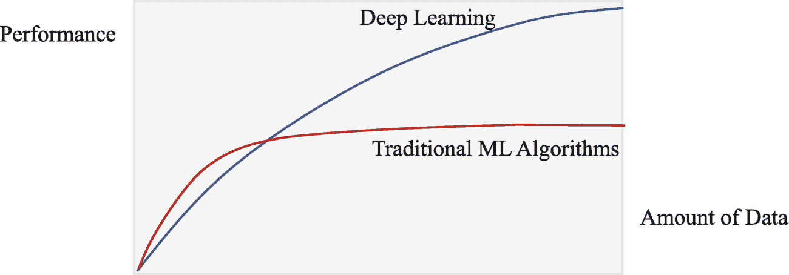

性能与数据量关系的折线图显示了深度学习和传统机器学习算法的 2 条曲线，它们从原点开始。传统的机器学习算法曲线最初上升然后变为水平。深度学习曲线持续上升。

图 3-2

随着数据量的增加，深度学习算法和传统机器学习算法的性能

通常，在低数据规模（高达数十万和极低百万级别）的情况下，机器学习模型可能在同一任务上优于深度学习模型。但这并不是一个绝对规则，而是一个可能的趋势。正如您所看到的，深度学习在大量数据方面远远超过了机器学习模型。关于曲线高端的深度学习模型可能是什么样子，ChatGPT 无疑是迄今为止最先进的模型（再次，以本文撰写时为准），它是一个包含约 1750 亿参数的非常大的深度学习模型，在数十个太字节的数据上进行了训练。

在决定最适合您任务的模型时，必须考虑一些注意事项。以下因素可能使传统的机器学习模型比深度学习模型更适合使用：

+   **小数据集**：从数千条记录到低百万级别的数据集都可以尝试使用传统的机器学习模型**。

+   **计算能力**：深度学习模型可以在 CPU 上训练和运行，但在专门硬件如 GPU（图形处理单元）和 TPU（张量处理单元）上运行要快得多**。这些资源运行成本可能很高，因为深度学习模型需要多次迭代训练，并且随着数据和模型复杂度的增加，所需时间也会增加。

+   **可解释性**：神经网络被认为是“黑盒”模型，其内部工作原理几乎无法解析。另一方面，传统的机器学习算法如决策树和回归算法可以清楚地显示它们做出预测的原因。相比之下，神经网络的输出可能依赖于数百万个其他神经元。

+   **梯度提升树**：像 XGBoost 和其他梯度提升树这样的模型在表格数据上表现相当好，能够训练得更快，在某些情况下甚至可以超越神经网络。由于这些因素，它们最近变得很受欢迎，尽管当数据规模非常高时，神经网络仍然更受欢迎。根据机器的不同，甚至低至数百万条记录也可能能够被这些算法建模。

再次强调，没有一条硬性规则规定何时使用机器学习（ML）而不是深度学习（DL）；你只需要尝试各种解决方案，找到最适合你的。哪种方法更可行将取决于你拥有的计算能力、数据量、任务的复杂度等因素。我们将在“验证”部分中详细介绍如何进行这一操作。

### 数据拆分

模型工作流程中的数据处理步骤在第二章 2 中介绍。通常，你有一些与你的任务相关的数据集合。在处理、分析和特征工程步骤之后，它就准备好用于训练了。然而，在你立即传递数据之前，你希望将整体数据集拆分为**训练**、**测试**和**验证**拆分。

在实践中，你可能只会遇到训练和测试拆分，但在深度学习场景中，验证拆分非常有用。首先，我们将解释每个拆分的含义：

+   **训练拆分**：这应该是整体数据集中最大的比例，并且仅用于模型训练。

+   **测试拆分**：这部分数据应完全独立于训练数据集，模型不得在此数据上训练。

+   **验证拆分**：与测试数据集的作用类似，但它可以在训练过程中用于执行各种优化任务。它应来自训练拆分。

图 3-3 展示了这些拆分是如何得出的。验证集是从训练拆分生成的，以保持其与测试拆分的完全分离，因为验证集在训练阶段使用。

一个示意图有两个不等分的条形图。第一个条形图按照条形图的 4 比 1 比例分为训练和测试。第二个条形图按照条形图的 3 比 1 比 1 比例分为训练、验证和测试。

图 3-3

分割数据的有两种可能的方式：训练-测试拆分或训练-验证-测试拆分。在生成验证拆分时，你应该首先计算训练-测试拆分，然后取训练部分，并将其再次拆分为训练-验证拆分。这样，验证拆分就来自训练拆分，并且与测试数据分开。这确保在开发模型时绝对没有信息泄露。

你的**训练集**通常占整个数据拆分的 60-80%。具体分配多少百分比通常取决于你是否使用深度学习模型或传统机器学习模型。对于深度学习模型，你可能从更高的训练拆分中受益，因为深度学习模型随着数据量的增加而扩展得更好。这也帮助避免过拟合，这在本章后面将讨论。

**测试集**将占你数据分割的 10-20%。如果你的数据计数数量很高，例如数百万，你可以用较少的比例为测试数据预留空间，因为测试集中的数据样本数量将足够高，足以充分评估你的模型在全新数据上的表现是否与它未见过的数据相当。

**验证集**是可选的，但它通常占你数据的 10-20%。验证集是从原始训练分割中派生出来的一个小子集，对于快速实验和原型设计非常有用，在具有迭代训练方法的模型（如深度学习）的情况下，它们可以指示模型是否正在积极过拟合。我们将在本章的最后部分更详细地介绍验证集。

至于这些集的整体使用情况，验证集对于快速确定哪些模型甚至适合数据任务非常有用。这样，你可以为任务创建一个候选模型列表，使用如 K 折交叉验证（将在后面介绍）这样的验证训练策略，并收集证据来确定你应该选择哪个模型。不过要小心，因为一些模型，如深度学习模型，可能需要更多的数据才能在性能上超越其竞争对手模型。

一旦你确定了一组核心模型，你希望在训练分割上进行训练，重要的是确保它们在积极训练在训练集上时，永远不会在验证集或测试集上训练。你希望保持评估数据独立，这样你就可以对模型在未见数据上的性能进行公平评估，这是机器学习模型训练的一个重要目标。这就是所谓的**泛化**，它指的是模型以这种方式学习任务，使其在从未见过的数据上执行任务时达到高性能。

### 建模与评估

当涉及到机器学习建模时，有几个范例决定了你可以如何训练你的模型：

+   **监督学习**：模型被提供输入数据和相应的正确输出。其目标是尽可能学习从输入到输出的正确映射。模型将尝试使它们的预测尽可能接近真实输出。两个主要的学习任务属于监督学习：

    +   **分类**：将数据标记为特定类别。例如，预测一张图片是猫还是狗。许多其他任务也属于分类，如异常检测（正常与异常）、多标签分类（一张狗的图片可以同时被分类为哺乳动物和狗）等。

    +   **回归**：任何实值输出预测任务，如房价预测、股价预测等。

+   **无监督学习**：模型被给予输入数据，必须通过自身学习数据中的结构和模式。以下学习任务属于无监督学习：

    +   **聚类**：通过一些共享的共同点将数据点分组在一起。

    +   **表示学习/降维**：学习以更小的维度表示相同的数据，同时最小化信息损失。

+   **半监督学习**：介于监督学习和无监督学习之间，可以包含许多学习方法。通常它涉及一小部分监督学习和一小部分无监督学习。例如：

    +   **师生模型**：手动标记一小部分数据，并以监督方式训练一个教师模型。然后，让教师模型通过在许多新的、未见过的例子上做出预测来创建一个更大的训练集。这些输入-输出对可以通过算法优化来消除不确定的预测，这个新的数据集被用来训练一个学生模型。

    +   **单一类别训练**：在异常检测的背景下，你可能有很多正常数据点，而异常数据点很少，你可以训练一个模型来识别仅正常数据。当对新数据（可能包括异常）进行预测时，模型可能在异常数据点上难以做出自信的预测。由于这种不确定性，你可以将这些点标记为异常。我们将在后面使用 One-Class SVM 模型来探讨这种方法。

你使用的方法取决于你的问题陈述和数据分布。如果你有很多未标记的例子，但只能标注少数几个，那么半监督方法可能最好。如果你有大量易于标记的数据，那么监督方法通常效果最好。如果你不想标注数据，并想让模型自己尝试创建类别（通过聚类），那么无监督方法将是最好的。

无论你遵循哪种范式，你都需要一种方法来衡量误差。**误差**是衡量模型预测错误程度的一个指标。误差也通常被称为模型的**损失**。对于**分类**任务，一个简单的损失函数将是**交叉熵损失/对数损失**函数，如方程 3-1 所示。

值 y[i] 是模型对数据输入 x[i] 的预测。P(y[i]) 表示模型预测 y[i] 的置信概率。你可以将 y[i] = 1 和 y[i] = 0 插入进去，看看相同的方程对于预测 1 和 0 是如何工作的。对于一个逻辑回归模型的输出，p(y[i]) 将是一个从 0 到 1 的概率分数，其中任何大于 0.5 的值都被视为分类为 1，否则为 0。当你插入值来计算损失时，y[i] = 1 和 p(y[i]) 可以是 0.65，或者 yi=0 和 p(yi) 可以是 0.34。

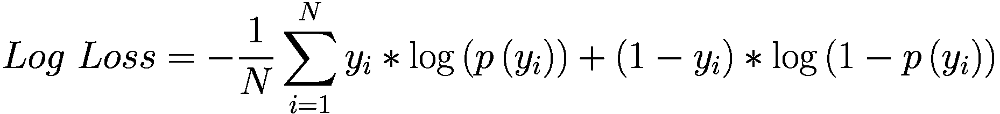

***方程 3-1.*** 对数损失函数

这是一个适用于仅对两个标签进行分类的损失函数，这两个标签分别用 0 或 1 表示。

对于**回归**任务，一个简单的损失函数是**均方误差 (MSE)**，在方程 3-2 中定义。它仅仅是预测值与实际值之间所有偏差平方的平均值。

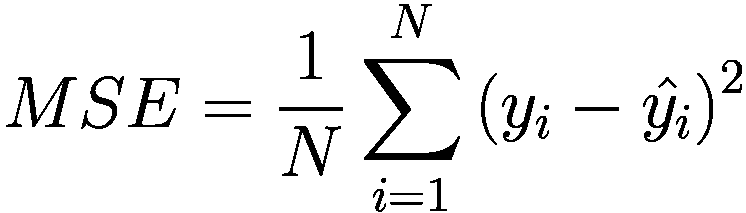

***方程 3-2.*** 均方误差 (MSE) 损失

任何学习任务的目标是**最小化损失**。换句话说，预测值与真实输出之间的测量差异必须尽可能低。

现在我们已经涵盖了损失函数的要点，让我们继续讨论性能指标。性能指标可以像分类准确率那样简单，即计算匹配的预测数量，并将其除以预测总数。对于回归任务，均方误差本身就是一种指标。然而，有许多方法可以衡量你的模型性能，这远远超出了简单的准确率，尤其是在分类任务中。

#### 分类指标

准确率有什么问题呢？好吧，在数据不平衡的情况下，你可以有 99 个正常点和 1 个异常点。如果异常检测模型正确预测了所有正常点但错过了异常点，你的准确率是 99%。然而，你没有检测到异常，而这正是异常检测模型的全部目的，从这个意义上说，准确率是非常误导的。我们如何做得更好？

这就是**混淆矩阵**发挥作用的地方，如图 3-4 所示。

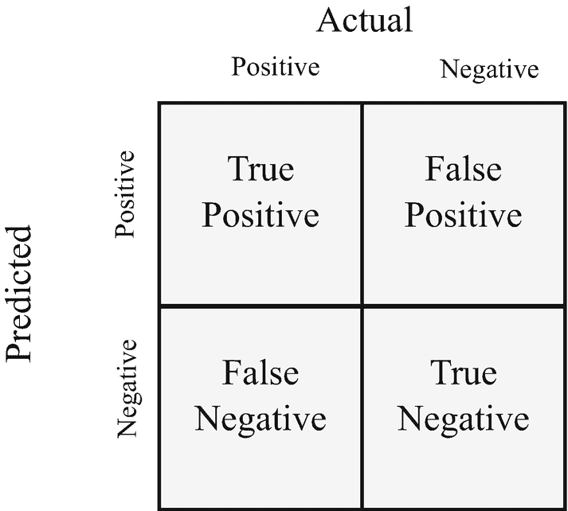

预测值与实际值之间的混淆矩阵。从左上角顺时针方向，值分别是真正例、假正例、真负例和假负例。

图 3-4

混淆矩阵。垂直轴对应于模型的预测。水平轴对应于真实标签。矩阵将通过每种预测类型的频率计数来填充

混淆矩阵的四个象限定义如下：

+   **真正例 (TP)**: 预测为正，且真实标签为正

+   **假正例 (FP)**: 预测为正，但真实标签为负

+   **真负例 (TN)**: 预测为负，且真实标签为负

+   **假负例 (FN)**: 预测为负，但真实标签为正

让我们将上下文设定为根据动物园动物的血液样本中的几个标志物来判断动物是否生病。模型将把这些标志物作为输入特征，并预测动物是阳性（意味着动物有病）还是阴性（意味着动物没有病）。在这个上下文中，让我们将混淆矩阵的指标具体化。

**真阳性**是指模型预测的结果是正确的。在这里，如果模型预测动物生病了，而它确实生病了，那么这是一个真阳性预测。**真阴性**是指模型预测动物没有生病，而它确实没有生病。至于**假阳性**，是指模型预测动物生病了，但实际上并没有生病。同样，**假阴性**是指模型预测动物没有生病，但实际上它是生病的。

在统计学中，有与假阳性和假阴性类似的术语：**第一类错误**和**第二类错误**。这些错误用于假设检验，其中存在一个零假设（通常表示两个观察到的现象之间不存在关系）和一个备择假设（旨在反驳零假设，意味着两个观察之间存在统计上显著的关系）。

**第一类错误**是指零假设实际上是正确的，但你错误地拒绝了它，支持备择假设——换句话说，这是一个假阳性，因为你拒绝了最终证明是正确的，而接受了错误的。**第二类错误**是指接受零假设为正确（意味着你没有拒绝零假设），但最终证明零假设是错误的，而备择假设是正确的。这是一个假阴性，因为你接受了错误的，而拒绝了正确的。

从混淆矩阵的指标中，我们可以推导出以下额外的指标：

+   **精确度**：模型做出的正确预测中正预测的百分比。也称为*阳性预测值*。

+   **召回率**：在数据集中所有真正正例中，这是模型正确识别的百分比。也称为*灵敏度*或*真阳性率*。

+   **F1 度量**：精确度和召回率的调和平均数。精确度和召回率越高，F1 度量就越高。

+   **真阴性率**：在模型评估的所有真正负例中，这是模型正确识别的百分比。也称为*特异性*。

+   **准确度**：所有预测中正确预测的数量。

图 3-5 显示了混淆矩阵以及计算**精确度**、**召回率**和**准确度**的公式。

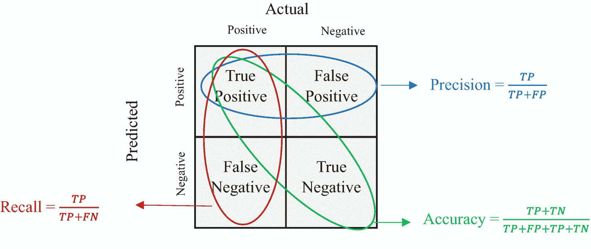

混淆矩阵。真正阳性和假阳性指向精确度等于 TP/(TP + FP)。真正阳性和真正阴性指向准确度等于 (TP + TN)/(TP + FP + TN + FP + TN)。真正阳性和假阴性指向召回率等于 TP/(TP + FN)。

图 3-5

显示了精确度、召回率和准确度计算公式的混淆矩阵

关于如何计算**F1 度量**，请参阅方程式 3-3。要实现更高的 F1 度量分数意味着模型的精确度和召回率都必须很高，这意味着模型不仅做出了正确的阳性预测，而且正确地捕捉了高比例的真正阳性数据样本。

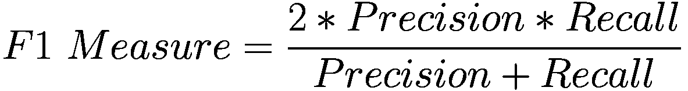

***方程式 3-3.*** F1 度量方程

关于如何计算**真阴性率（TNR）**，请参阅方程式 3-4。TNR 告诉我们模型预测负性的准确性。它与召回率类似，但不同之处在于，在所有真正负性实例中，它计算了这些负性实例被正确预测为负性的百分比。

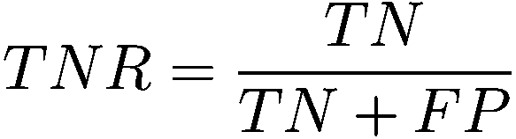

***方程式 3-4.*** 真阴性率方程

理解精确度和召回率之间的权衡是很重要的。只有其中之一可能会导致一些灾难性的结果。例如，模型可能具有完美的精确度，做出完美的阳性预测。然而，在所有阳性实例中，它可能只正确识别了 15%，使其召回率为 0.15。这是可怕的——模型对其预测有信心，但几乎未能从阳性数据集中识别出任何内容。

另一方面，一个模型可以通过将所有数据标记为阳性，从真正阳性的数据集中正确识别出所有内容。它的召回率会完美无缺，但精确度会非常糟糕，因为所有阳性预测中，只有一小部分是正确的。

这就是为什么 F1 度量（同义词 F1 分数）是一个好的度量标准：要有一个高的 F1 分数，必须同时具有高精确度和高召回率。除了 F1 分数之外，我们还可以从混淆矩阵中得出进一步的见解。

使用 scikit-learn，我们可以绘制接收者操作特征（ROC）曲线，该曲线绘制了真正阳率（召回率）与假阳性率（1 – 真阴性率）的关系。图 3-6 显示了 ROC 曲线的示例。

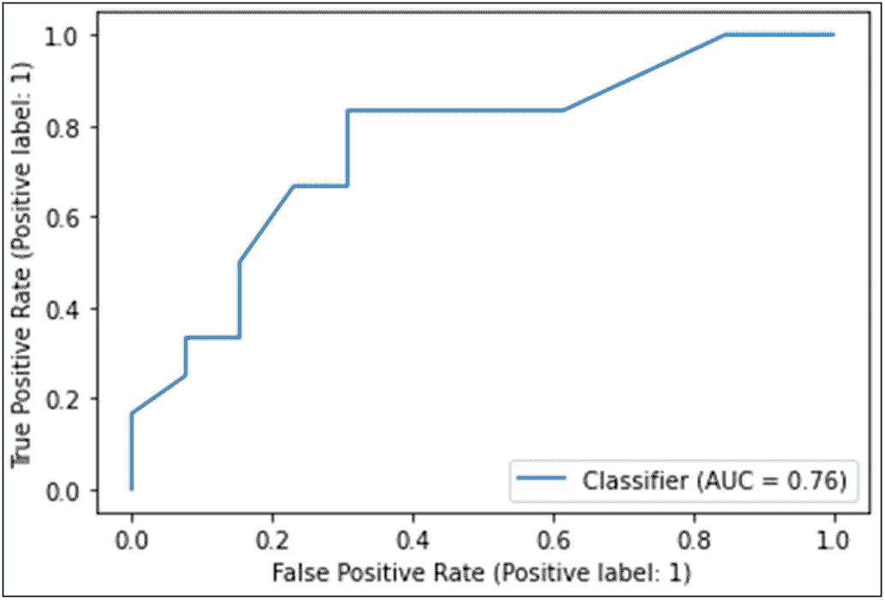

真正阳性和假阳性率对比的线图。线分类器，AUC 等于 0.76，从 (0, 0) 开始，波动到 (0.3, 0.8)，保持恒定到 (0.6, 0.8)，然后不均匀地上升到 (0.9, 1.0)，然后保持恒定到 (1, 1)。数值是近似的。

图 3-6

一个稍微弱一些的分类器的 ROC 曲线示例。AUC = 1 表示一个完美的分类器，但 AUC = 0.76 表示一个较弱的分类器，其假阳性增加，且预测出的真阳性较少

我们可以通过 ROC 曲线下的面积来推导出一个称为曲线下面积（AUC）分数的指标。AUC 分数越高，模型在区分两个类别上的表现越好。直观上，这是有道理的，因为图表本身是在绘制模型的正预测正确率与其假阳性率。最理想的图表会在 FPR 为 0.0 时 TPR 为 1.0，并保持这个 1.0 值贯穿整个图表，看起来像图 3-7。

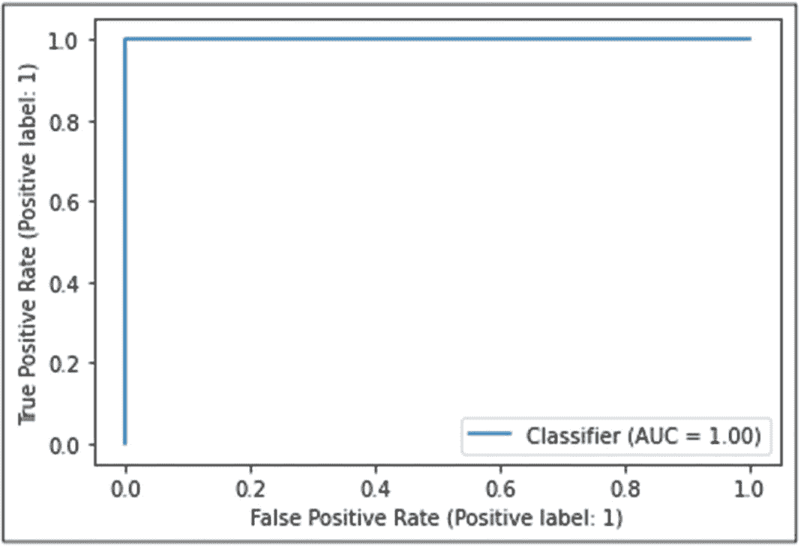

真阳性率与假阳性率的线图。线分类器，AUC 等于 1，从(0, 0)开始，垂直上升至(0, 1)，然后水平延伸至(1, 1)。数值是近似的。

图 3-7

一个具有完美 AUC 的 ROC 曲线，意味着所有预测都是正确的。这意味着对于每一个 FPR，TPR 都保持在 1.0

这个 AUC 分数被称为 ROC-AUC 分数，这是更常引用的 AUC 分数。一个良好的 AUC 分数目标是大约 0.95 或更好。

另有一个称为精确率-召回率（PR）曲线的曲线。我们可以同样找到这个曲线下的面积，scikit-learn 将其称为平均精确度（AP）分数。与 ROC-AUC 分数相似，AP 分数为 1 表示一个完美的分类器，能够完美地区分正负类别。

PR 曲线绘制了精确率与召回率，这使得它在处理不平衡数据集时更加友好，因为它只关注正类。在异常检测中，数据可能会严重偏向正常数据，这意味着你的大多数预测将是真阴性。PR 曲线处理精确率（模型正预测的正确性）和召回率（模型正确捕获的所有正例的比例），因此当我们关注纯异常检测性能时，它更有信息量。

然而，ROC 曲线，它关注的是召回率/TPR（模型正确捕获的所有正例的比例）和假阳性率（所有负数据中被错误预测为正的比例），也是很有用的，因为它可以给我们展示模型在整体数据上的性能图。

对于我们的用例，最好同时使用这两条曲线，以获得模型在异常检测和正常与异常数据整体预测性能上的全面表现图。

由于 scikit-learn 的便利性，绘制这些曲线的代码非常简单，这在后续章节中将在分析机器学习模型性能的上下文中进行介绍。

通过这些，你应该对分类指标及其评估方法有了很好的了解。现在让我们来看看回归指标。

#### 回归指标

回归关注的是实值输出，而不是类别，所以我们将要处理的损失函数都计算某种偏差。除了简单的均方误差（MSE）之外，我们还有平均绝对误差（MAE），它是预测值和真实 y 值的平均绝对值偏差，以及平均绝对百分比误差（MAPE），它是预测值与真实 y 值的平均绝对百分比偏差。

哪个指标要使用将取决于你的建模任务以及数据分布的情况。在高层上：

+   **均方误差**由于平方元素，对较大偏差的惩罚比对较小偏差的惩罚更大，这有利于惩罚异常预测。公式在方程 3-5 中显示。

***方程 3-5.*** 测量预测值和真实值平均平方偏差的均方误差方程

+   **平均绝对误差**对所有值进行惩罚更加均匀。较大的偏差不会产生像均方误差（MSE）那样高的误差。这在优先考虑大量预测值而不是异常值时更有用。公式在方程 3-6 中显示。

***方程 3-6.*** 测量预测值和真实值偏差平均幅度的平均绝对误差方程

+   **平均绝对百分比误差**衡量预测值与真实值之间的百分比偏差。如果建模的数据波动很大（如股价）或变化范围很大，这是一个可能更有用的指标。误差也在百分比尺度上，并且不直接测量偏差，因此如果偏差很大，它们不会使损失函数爆炸。这就是为什么如果数据尺度变化很大，它可能更稳定。公式在方程 3-7 中显示。

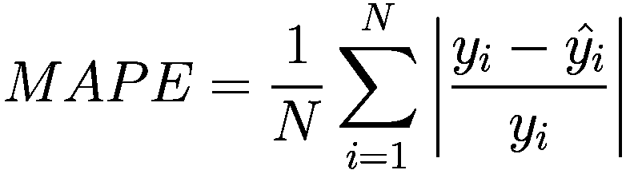

***方程 3-7.*** 测量预测值真实值百分比误差幅度的平均绝对百分比误差方程

现在你已经了解了这本书后面将要执行的各种任务中适当的度量标准，让我们来谈谈模型在训练集和盲新数据上的性能差异。

### 过拟合和偏差-方差权衡

在上述性能指标的基础上，我们现在可以测量训练、验证和测试损失。理想情况下，你的训练和测试性能将在同一区域或匹配。如果它们没有差异，并且你的性能良好，那么模型已经正确地学习了任务，并且泛化得很好。然而，你可能经常看到测试误差明显比训练误差差。为了更好地阐述这种情况，让我们回顾一下**偏差-方差权衡**是什么。

首先，什么是偏差？简单来说，**偏差**是衡量模型平均预测值与真实值之间差异的度量。如果模型没有在训练集上正确学习任务，它将会有很高的损失，因此偏差也会很高。如果模型已经很好地学习了任务，那么它的偏差将会很低。

在统计术语中，偏差是估计量的期望值与它试图估计的参数之间的差异的度量。估计量是一种试图逼近特定参数的函数。回到我们的机器学习概念，模型可以扮演估计量的角色。

至于偏差的公式，请参考方程 3-8。它衡量估计量的期望值及其与被估计的总体参数之间的差异。如果偏差为零，那么估计量是θ的无偏估计量。

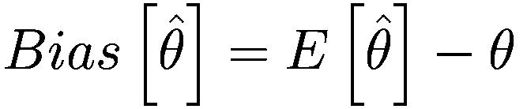

***方程 3-8.*** 偏差的公式

以一个大学学生身高的高斯/正态分布为例。这个分布的总体参数由均值 mu 和标准差 sigma 给出。然而，假设我们想使用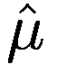来估计μ。如果我们定义为均值公式，那么结果就是是μ的无偏估计量，因为如果我们将值分别代入偏差方程，最终的偏差变为零。当我们说一个估计量是**无偏的**时，其偏差为零。

同样，一个**有偏**的估计量有一个非零的偏差。在实践中，你的机器学习模型很可能会都是有偏的，因为在实际设置中不存在完美的模型。

**方差**在统计学中就是方差公式，但应用于模型的预测。作为复习，方差在方程 3-9 中定义。

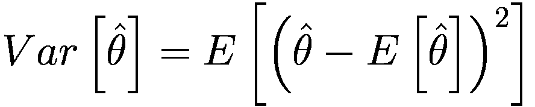

***方程 3-9.*** 估计量的方差公式* 

如果偏差为零，那么方程 3-9 的结果应该正好等于均方误差。那么，这里的方差测量的是什么？方差测量的是预测值与其平均值之间的平均分散程度。如果数据相对无噪声（数据点没有偏离平均预测值很远），那么方差本身会较低。但如果个别预测值偏离预测值的平均值，那么方差会更高。高方差不好，因为预测值增加的噪声可能导致更高的损失。

要查看高偏差与低方差和高方差，请参考图 3-8。上下文是射箭和靶场练习。

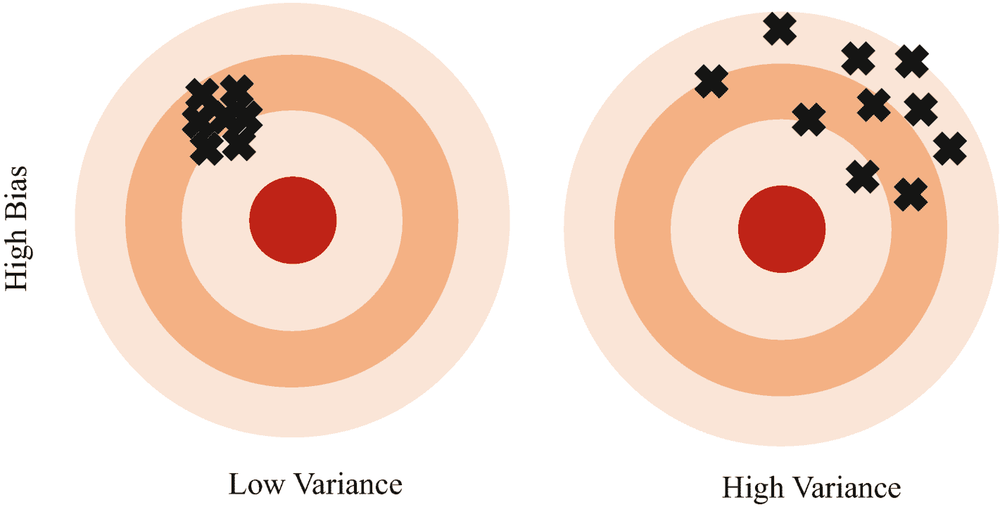

高偏差与低方差和高方差对比的示意图。在低方差中，目标集中在左上部分。在高方差中，目标散布在右上部分。

图 3-8

高偏差、低方差和高方差通过靶场练习进行视觉表示，这是一个很好的例子，说明了偏差和方差是如何相互关联的。

参考图 3-8，高偏差在所有射击都落在中心之外表现得非常明显。在低方差的情况下，射击非常接近。在数学上，射击没有偏离所有射击的中心太多。相比之下，在高方差的情况下，射击分布得更广。它仍然是高偏差，因为那些射击的中心离目标板的中心相当远。现在是高方差，因为射击中心与中心平均偏差更高。

图 3-9 展示了在低方差和高方差设置下低偏差的样子。

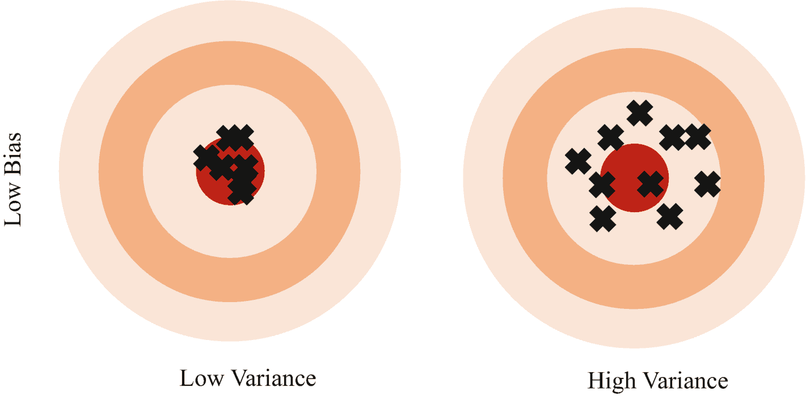

低偏差与低方差和高方差对比的示意图。在低方差中，目标集中在中心。在高方差中，目标散布在中心周围。

图 3-9

低偏差、低方差和高方差通过靶场练习进行视觉表示。

这次，我们可以看到射击分布的中心大致与目标板的中心对齐。这意味着偏差较低。与之前类似，低方差和高方差指的是射击在平均意义上的分布范围。最佳性能是通过低偏差和低方差实现的。

从机器学习的角度来看，总体参数是真实生活中我们实际上不知道的真实总体参数。这可能只是对应于从总体中一组 x 值的真实 y 值那么简单。

我们必须从样本数据中训练我们的模型，这仅仅占整个总体的一小部分。因此，问题变得熟悉：在整个人群的较小子集上训练，并试图通过正确预测未知 y 值来正确地泛化到整个人群。

由于我们不知道 y 值的整个总体，因此在测试集上进行评估是有帮助的，测试集本身也是总体样本的一部分。然而，由于分布可能不同于训练集，它为我们提供了一个了解模型在盲数据上可能表现如何的窗口。我们的测试集越大，我们就能更好地评估模型的无监督性能和泛化能力。

在了解了偏差和方差的概念之后，现在让我们更直接地将它们与训练集和测试集联系起来：

+   偏差指的是机器学习模型在训练集上的误差。它是衡量机器学习模型平均正确预测训练集中 y 值的程度的一个指标。低偏差意味着低训练误差（因此拟合良好），而高偏差意味着高训练误差（因此拟合不良）。

+   方差指的是在测试数据上的预测误差。高方差意味着噪声和不稳定的预测，将导致高测试损失，意味着泛化能力差。低方差意味着稳定和一致的预测，导致较低的测试损失（前提是模型不是过于偏差）。

综合起来，我们得到所谓的**偏差-方差权衡**，其目标是最小化偏差和方差。为什么会有权衡呢？好吧，结果是机器学习模型往往在训练数据集上优化得很好，以至于它们最终在训练集上**过拟合**。换句话说，它们在训练集上学习任务学得很好，以至于它们学会了“记忆”训练数据以最大化其性能。当在测试数据上评估时，性能将与训练数据上的性能有很大差异。

一个类似的例子是一个学生死记硬背家庭作业中的问题，结果发现考试中包含全新的问题。要想在考试中取得好成绩，唯一的办法是对问题及其解决方法有一个通盘的理解。因此，尽管学生在家庭作业中得了 100%，但他们最终却因为未能正确学习任务而考试不及格。

**过拟合**受几个参数的影响：

+   **模型复杂度**：如果模型非常复杂，它往往会学习一个非常复杂的输入-输出数据映射函数，这在训练数据上可能效果很好，但会损害其测试数据性能。

+   **训练时间**：如果一个模型被允许无限期地训练，它最终会调整其内部参数以仅适合训练数据。这在像神经网络这样的迭代学习模型中更为明显。

+   **训练数据不足**：如果可供学习的样本数据太少，模型可能无法正确地泛化。因此，即使它在训练数据上表现良好，其测试性能也会受到影响。

+   **数据处理不佳**：如果某个特征值很大或噪声太多，模型可能会倾向于仅仅拟合噪声或压倒其他特征的特性。（如果某一列有大量值的数据，损失将会非常高。减少损失的最快途径是只针对这一列进行调整，这不是模型应该学习的行为。）因此，一旦测试数据（具有不同的噪声分布）被评估，模型的性能就会受到影响。

幸运的是，有许多方法可以避免过拟合，包括：

+   **损失惩罚**：我们可以在损失函数中添加惩罚项，迫使权重更小，从而迫使模型学习更有效的映射，这些映射对过拟合更鲁棒。这被称为**正则化**。

+   **减少复杂性**：我们可以通过在模型中减少可学习的参数来降低模型复杂性。

+   **数据处理**：这将确保数据是干净的，并且模型不会因为数据中不同的训练集和测试集而学习不佳或受到其他因素的影响。

+   **超参数调整**：调整决定模型学习过程的顶层参数可以带来其在泛化能力上的良好提升。

+   **增加训练数据**：有时，仅仅增加更多的训练数据就能帮助模型更好地学习泛化。

相反，如果模型在训练数据上有很高的偏差，就会发生**欠拟合**。以下是一些可能导致模型欠拟合的因素：

+   **过于简单**：模型可能不够复杂，无法理解如何学习任务。

+   **训练不足**：模型可能没有训练足够长的时间来学习任务。

+   **数据质量差**：数据特征可能没有良好的预测质量。例如，股价与天气展望有什么关系？此外，数据可能过于嘈杂，这会阻止模型学习，因为任何可能引导模型学习任务的信号都会被噪声淹没。

+   **严格的正则化**：如果正则化/损失惩罚过高，模型会受到过于严厉的惩罚，无法正确学习。

关于模型复杂性，我们想要确保模型有足够的参数量，以便能够正确地拟合数据。考虑一个例子，我们试图学习真正的函数 y = 0.12x³ – 0.2x²。我们已经采样了 x 空间，并注入了人工噪声来测试不同复杂性的模型如何拟合这些噪声数据，以及它们是否能够学会近似真实的基本函数。要重现此代码，请运行图 3-10 中所示的代码。

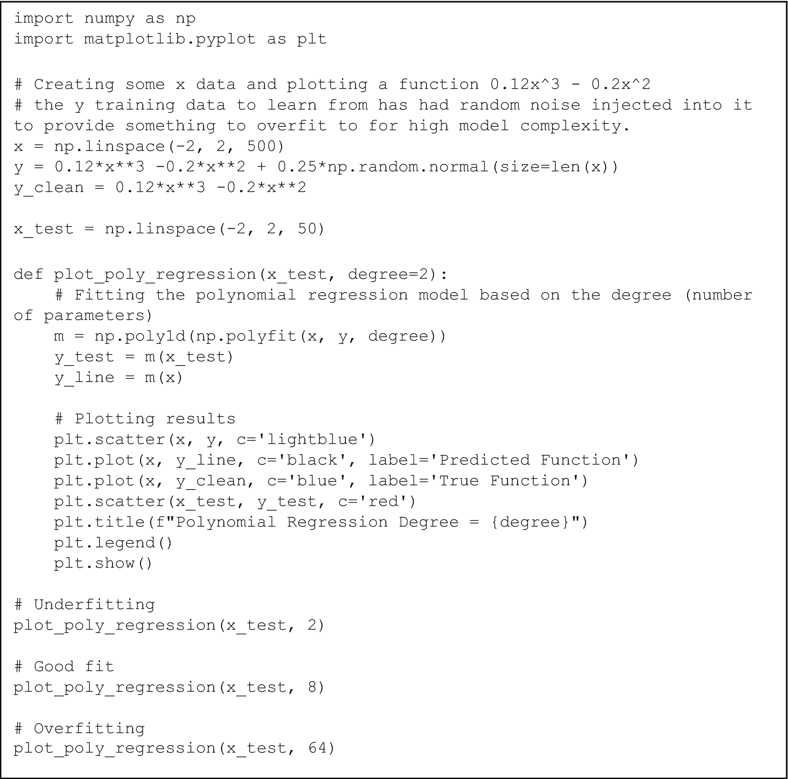

一段代码从`import numpy as np`开始，到`plot poly regression, x test, 64`结束。

图 3-10

适配多项式回归模型并绘制图表的代码

图 3-11 展示了次数为 2 的欠拟合模型。

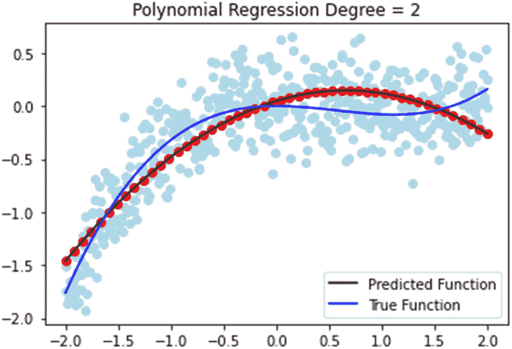

多项式回归的次数等于 2 的图表。预测函数和真实函数的起点大约在（负 2，负 1.5）和（负 2，负 1.75），向上弯曲，相交。图表围绕着这两条线。

图 3-11

一个欠拟合模型的预测。它没有足够的参数来充分逼近真实函数

图 3-12 展示了次数为 8 的模型，该模型拟合良好。

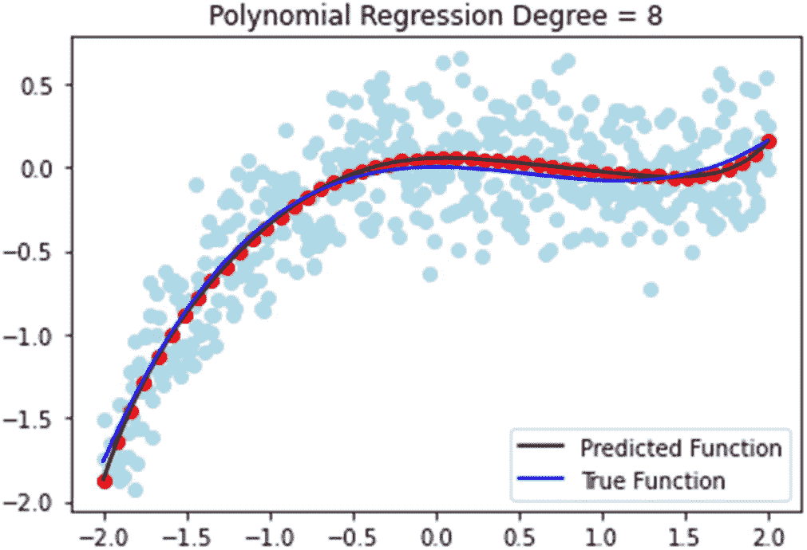

多项式回归的次数等于 8 的图表。预测函数和真实函数的起点大约在（负 2，负 2），几乎同样遵循一个向下凹的增函数曲线。图表围绕着这两条线。

图 3-12

由于参数数量充足，模型拟合得更好。它能够比之前的模型更好地估计真实函数。

图 3-13 展示了次数为 64 的过拟合模型。注意预测函数如何努力击中每个采样数据点（以红色点突出显示），以至于它未能最佳地逼近真实函数。这是因为它受到添加的噪声影响太大，它试图尽可能多地将其噪声数据包含到其模型中。

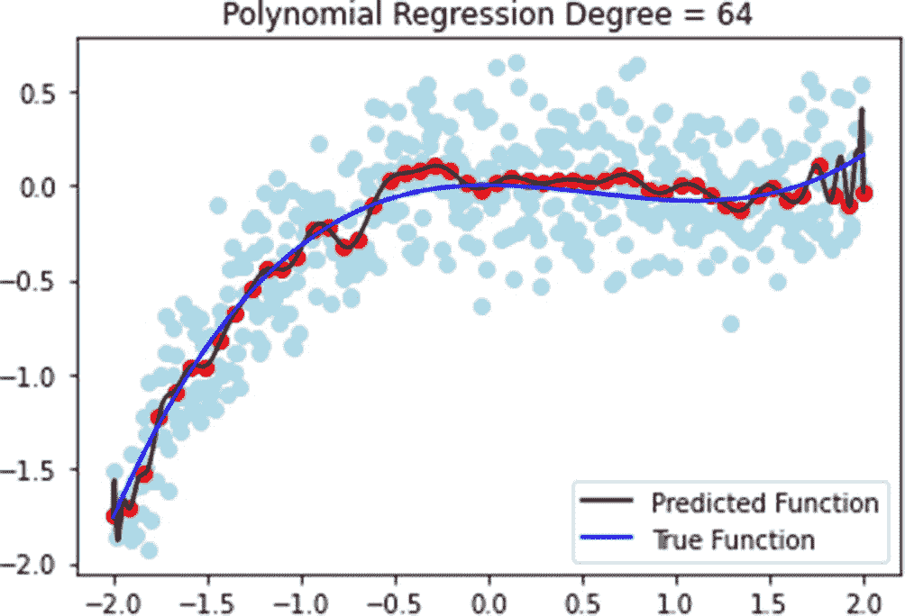

多项式回归的次数等于 64 的图表。预测函数和真实函数的起点大约在（负 2，负 1.75），向上弯曲。预测函数在增加时波动，在多个点上与真实函数相交。图表围绕着这两条线。

图 3-13

一个参数过多，严重过拟合的模型。预测函数曲线如此之高，因为它试图适应所有噪声异常值，却未能最佳地逼近真实函数。

我们之前多次提到了泛化。再次强调，**模型的泛化**是指我们在训练和测试数据集上看到相似的性能和错误。那么，我们如何通过从偏差和方差的角度来看待模型的表现来理解模型的泛化能力呢？

让我们看看以下场景及其含义：

1.  **低偏差，低方差**：理想设置。模型在训练和测试数据上都表现良好。

1.  **低偏差，高方差**：过拟合。模型在训练数据上表现良好，但在测试数据上表现不佳。考虑实施减少过拟合的策略。

1.  **高偏差，低方差**：欠拟合。模型在训练数据上的表现不佳，其测试数据预测的方差却很低。这意味着模型真的很差，例如，一个无论输入是什么都预测相同值的模型。

1.  **高偏差，高方差**：欠拟合。模型在训练和测试数据上的表现都较差。这种情况的最坏情况是一个预测所有随机值的模型。

通过视觉方式，观察图 3-14 中的偏差-方差权衡。

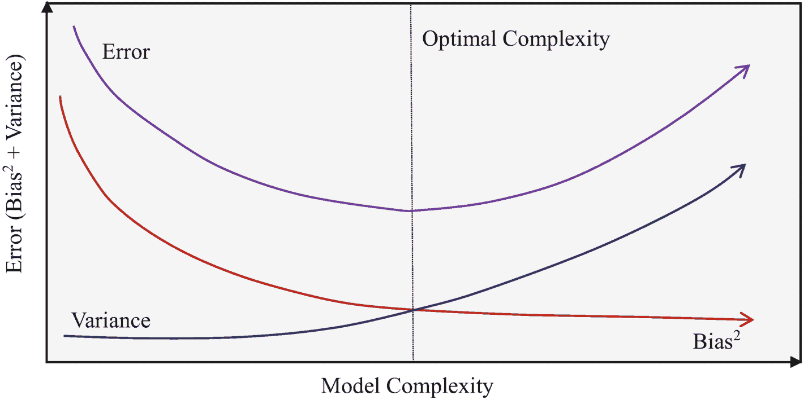

一个图表显示了误差与模型复杂度的关系。误差曲线从顶部开始，然后向下弯曲，然后又上升。曲线偏差平方开始低于误差曲线，然后向下倾斜。方差曲线从原点附近开始，向上倾斜。

图 3-14

一个描述随着模型复杂度增加，偏差平方、方差和总误差的图表。对于深度学习也存在类似的曲线，以找到最大化泛化能力的最佳点。最佳复杂度最小化偏差和方差。

正如我们之前所看到的，模型复杂度可以极大地影响模型拟合数据的好坏（偏差），这随后会影响它对新数据的泛化能力（方差）。总的来说，这个偏差-方差权衡可能是你将在机器学习模型生命周期中遇到的最大挑战，而这个权衡对于产生好的模型是至关重要的。

### 超参数调整

一旦你拥有一个拟合良好的模型，你可能希望提高其性能。你可以通过调整模型的**超参数**来实现这一点，这些是控制模型建模行为以及其他内部机制的高级参数。对于深度学习，这可能包括调整层数、调整模型的学习率（我们将在第五章中介绍的概念），以及更多。对于像线性回归或多项式回归这样的机器学习模型，它们可能包括模型度数，正如我们之前所看到的。

要找到最佳的超参数，你将不得不搜索超参数的可能配置，并找到最适合的配置。这可以手动完成，这非常繁琐，或者通过脚本完成，这需要大量的时间和计算资源，但可以为你找到好的超参数设置。

一个称为**网格搜索**的过程可以帮助你确定应该选择哪些超参数。网格搜索是一个算法框架，它允许你遍历一个自定义的超参数值范围，使用该超参数设置完成建模和评估，并存储相关指标。在整个搜索结束时，你可以轻松地调出每个超参数的存储指标，并找出你应该搜索的方向。

一个好的策略是首先广泛地搜索一个较大的超参数范围，找到表现更好的值域，然后进行更窄的搜索。图 3-15 展示了这种从宽到窄的方法，以之前提到的多项式回归为例，假设度数=8 是最优拟合。

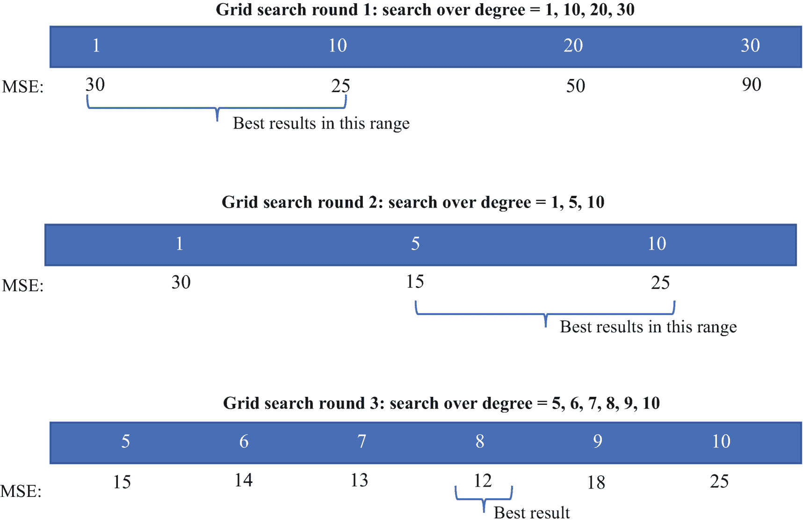

3 幅插图。在网格搜索第 1 轮中，最佳结果位于均方误差（MSE）值 30 和 25 之间。在网格搜索第 2 轮中，最佳结果位于均方误差值 15 和 25 之间。在网格搜索第 3 轮中，最佳结果出现在均方误差值为 12 的位置。

图 3-15

展示了三轮网格搜索。蓝色框中的数字是我们搜索的具体超参数设置。框下方的 MSE 值是使用上述参数设置获得的相应 MSE 损失值。正如你可以想象的那样，这是一个计算密集型的过程，这就是为什么我们需要高效地进行网格搜索。

当需要搜索更复杂的模型和更多超参数组合时（如果你为不同的超参数搜索多个超参数设置，你将得到一个笛卡尔积），这很容易导致复杂性和计算强度的增加。这就是为什么高效地处理搜索范围非常重要。

此外，你也不想反复在整个训练数据集上训练。超过一定范围后，你将永远等待进步。这就是为什么存在**验证集**的原因——它允许更快地进行超参数调整。

我们现在将介绍一些验证集策略。

## 验证

我们之前已经讨论过**验证集**几次，但现在是你可能使用验证集的时候了：

1.  **避免过拟合**：在深度学习中，我们多次在训练数据集上训练神经网络。这很容易导致过拟合，因此我们需要知道何时停止训练。在这个设置中，验证集充当测试数据。我们可以在训练过程中以固定的时间间隔评估训练损失和验证损失，当我们检测到训练损失在下降而验证损失在上升（低偏差，高方差）时，我们可以立即停止训练。

1.  **模型选择**：我们可以使用验证集来彻底测试和评估不同架构的多个模型的性能，以找到最适合此训练任务的模型。

1.  **超参数调整**：我们可以在网格搜索中使用验证集来找到最佳的超参数设置。

那么，我们如何进行这些操作呢？我们可以采用一些流行的策略：

1.  **保留验证集**：从训练集中衍生出一个验证集，并用于我们需要的任何目的。

1.  **K 折交叉验证**：一种更稳健的策略，其中整个数据集被划分为 K 个单独的区间。进行 K 轮的训练和评估，并且在每一轮的训练中，一个独特的区间作为评估数据集。

**保留验证**是一种快速简单的策略，但它容易受到随机性的影响，因为特定的随机分割可能会导致验证数据比通常更容易预测。例如，它可能不具有训练数据的典型噪声特征。大多数情况下，你的情况可能不会这么极端，但这不是一个彻底的实验性合理的策略。

**K 折交叉验证**是一种非常彻底且稳健的策略，因为它将你的整个数据集随机划分为 K 个不同的“折叠”或区间。进行 K 轮的训练，其中每个独特的区间作为测试/评估分割，而其余的区间则合并形成训练数据。经过一轮后，下一个区间（之前未作为测试数据）被选中，然后重复此过程。

总的来说，你将重复训练-测试过程 K 次。正如你可以想象的那样，这是一个计算密集型的策略，但它在实验上是合理的，并确保你的验证结果是准确的，不会受到随机性的影响。然而，考虑到如果你将这种方法与网格搜索结合使用，你不仅会等待很长时间才能得到结果，而且还会花费大量时间积极训练模型。对于需要专用硬件进行训练的大型模型，你想要保守地对待模型训练的时间。

话虽如此，将两种策略结合起来是可能的。你可以在全数据集的一个特定随机分割上应用 K 折交叉验证，以实现更快速的快速原型设计。这个随机分割不会涵盖你给出的整个数据集，但你应该使其足够大。

Scikit-learn 还提供了易于实现的 K 折交叉验证功能。结合你在第二章中学到的数据科学原则，你可以进行各种实验，解释结果，并在需要时调整你的方法，无论是由于超参数调整、模型选择还是任何需要比较两个不同模型的其它因素。

## 摘要

在本章中你学到的机器学习基础知识应该有助于你理解本书其余部分以及更广泛范围内的模型背后的直觉。它们适用于传统的机器学习建模方法，也适用于深度学习建模方法。在第四章中，我们将探讨如何在数据集上实现机器学习算法并执行异常检测。
