# 4. 传统机器学习算法

本章向您介绍隔离森林和单类支持向量机算法，并指导您如何使用它们进行异常检测。在这个过程中，您还将练习整合基本的机器学习工作流程，并使用验证集进行超参数调整。

简而言之，本章涵盖了以下主题：

+   隔离森林

+   单类支持向量机

注意

代码示例以 Python 3.8 为例提供。本书的代码仓库可在[`github.com/apress/beginning-anomaly-detection-python-deep-learning-2e/tree/master`](https://github.com/apress/beginning-anomaly-detection-python-deep-learning-2e/tree/master)找到。

仓库还包括一个 requirements.txt 文件，用于检查您的包及其版本。

本章的代码示例有两个位置。对于隔离森林算法，请访问[`github.com/apress/beginning-anomaly-detection-python-deep-learning-2e/blob/master/Chapter%204%20Traditional%20Machine%20Learning%20Algorithms/chapter4_isolationforest.ipynb`](https://github.com/apress/beginning-anomaly-detection-python-deep-learning-2e/blob/master/Chapter%204%20Traditional%20Machine%20Learning%20Algorithms/chapter4_isolationforest.ipynb)。

对于单类支持向量机，请访问[`github.com/apress/beginning-anomaly-detection-python-deep-learning-2e/blob/master/Chapter%204%20Traditional%20Machine%20Learning%20Algorithms/chapter4_ocsvm.ipynb`](https://github.com/apress/beginning-anomaly-detection-python-deep-learning-2e/blob/master/Chapter%204%20Traditional%20Machine%20Learning%20Algorithms/chapter4_ocsvm.ipynb)。

导航到“第四章 传统机器学习算法”，然后点击 chapter4_isolationforest.ipynb 和 chapter4_ocsvm.ipynb。代码也以 .py 文件的形式提供，尽管它是笔记本的导出版本。

我们将使用 JupyterLab 来展示所有的代码示例。

## 传统机器学习算法

“传统”机器学习算法是非神经网络架构，如 k 近邻、支持向量机、随机森林、决策树等。这些模型仍然相当流行，尤其是在 XGBoost（梯度提升树）等形式中，它们在结构化、表格数据上与神经网络保持相当竞争力。其他仍在使用的传统流行算法包括聚类算法和树。尽管深度学习模型可能受到关注，但传统机器学习算法并未过时，并且仍有很好的用途，尤其是在第三章讨论的案例中。

特别是，我们将介绍隔离森林、单类支持向量机（OC-SVM）以及如何使用它们进行异常检测。

### 隔离森林

**隔离森林**是一种无监督学习算法，它试图发现数据集的潜在结构并隔离异常值。它是一组单个树结构，根据其属性递归地划分数据集。在过程的每次迭代中，都会选择一个随机特征，并根据所选特征的随机选择值进行数据划分。

这个过程会重复进行，直到整个数据集被划分，形成森林中的单个树。异常值通常比正常数据点从根节点到路径的长度要短得多，因为它们更容易被隔离。我们可以通过使用涉及平均路径长度的数据点函数来找到异常分数，这是 scikit-learn 通过其隔离森林的实现提供的。

#### 隔离森林示例

为了更好地理解隔离森林的作用，让我们来看一个假设场景。在一个大湖中，一个不负责任的鱼养殖者繁殖并释放了一种本地鱼类物种的突变版本。以下方面区分了突变物种与本地物种：

+   较长的平均长度

+   较大的平均周长

+   尾鳍长度与身体长度的比例更长

这为我们提供了三个可以针对每条鱼采取的测量值，以区分入侵、突变物种与本地物种。这类似于在 X 数据集中每个数据点有三个列。

为了直观地展示在这个场景中本地和突变物种的差异，图 4-1 展示了本地鱼的平均标本外观，图 4-2 展示了突变鱼的平均标本外观。


入侵鱼的草图。

图 4-2

平均入侵鱼类物种示例

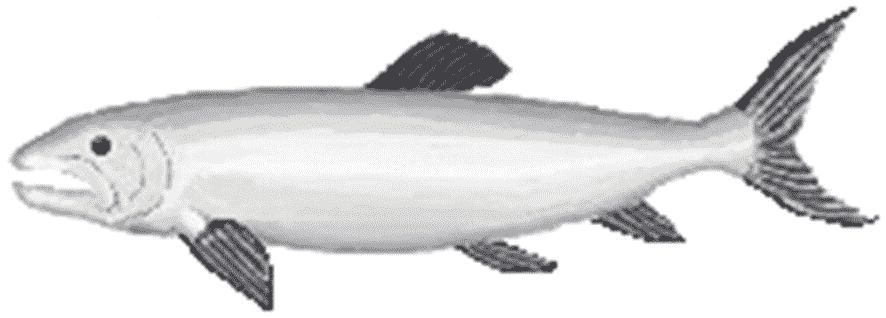

本地鱼类的草图。

图 4-1

平均本地鱼类物种示例

如您所见，平均而言，入侵物种的周长更大，身体更长，尾鳍更长。然而，所有这些测量值都落在分布上，两种物种之间有很大的重叠：一些本地鱼比本地物种的平均值要大，而一些入侵鱼比突变物种的平均值要小。这种重叠使得很难立即判断一条鱼是入侵的还是本地的。

在为当地政府机构工作的生态学家们开始担忧，这种突变物种的侵扰威胁到了湖中本地物种的生存。生态学家们决定对鱼类种群进行一次调查，以调查入侵程度的范围，并雇佣了一群渔民来协助他们。受到统计方法的启发，生态学家们要求渔民在湖中捕获 1,000 条鱼。生态学家们还培训了渔民，根据鱼围、总长度和尾鳍长度的测量，将鱼分类为本地物种（正常）或入侵物种（异常）。基于他们的发现结果，生态学家可以大致估计湖中入侵物种与本地物种的整体分布。

接下来是评估过程，渔民们同意以下流程，并将对总共 1,000 条鱼中的随机几百条进行重复操作：

1.  每位渔民选择一组随机特征子集，并使用每个选定特征的最小值和最大值之间的随机值对数据进行分区。有些人可能会强调长度和周长，而其他人则会关注长度和尾鳍长度等。

1.  每位渔民利用他们的直觉来分离那些立即看起来异常的鱼。有些鱼难以分类，需要更仔细的审查。

1.  一旦每位渔民评估了分配给他们的所有鱼，他们会平均他们的标准，并为每一条 1,000 条鱼生成分数。每个分数代表该鱼在使用步骤 1 中的过程时，与其他鱼分离的难易程度。例如，在一堆较小的鱼中，一条非常大的鱼仅凭体型就能轻松地被分到一边：基于这些分数，可以设置一个阈值，并根据阈值将鱼评估为正常或异常鱼。

在这个例子中，每位渔民代表 Isolation Forest 中的一个隔离树。给定数据的一个随机子集，每棵树尝试通过随机选择的特征子集随机分区。这类似于每位渔民在总共 1,000 条鱼的小子集中查看每条鱼的一个或两个方面，并尝试将它们彼此分离。例如，一条非常大的鱼显然会被放在远离其他鱼的堆里，而其余的鱼可能需要更仔细地测量和按大小排序。在样本中，鱼越难分离，树（以及路径长度）就越深。

当树木形成后，它们聚集在一起形成一个森林（集成）。当渔民聚集起来为每条鱼分配异常分数时，每个渔民根据自己的标准提交自己的分数，这些标准是基于他们随机批次学到的。然后，这些异常分数被平均在一起，以呈现每条鱼的最终异常分数。在隔离森林中，每棵树提交一个异常分数，该分数是路径长度的函数。

样本越容易与其他数据分离，路径长度就越短。个人分数被平均在一起，以呈现一个异常分数，这实际上是平均路径长度。如果所有找到的树都容易隔离数据点，其平均路径长度和异常分数将很低，因此它很可能是异常值。

因此，对于渔民来说，他们各自创建自己的分离标准，作为一个团队提交他们捕获的每条鱼的最终异常分数。这就是隔离森林的工作方式。

然而，这并不是一个完美的系统；正如之前讨论的，由于平均大小突变鱼和平均大小本地鱼的交叉重叠，一些入侵鱼可能会被错误地识别为本地鱼，而一些本地鱼可能会被错误地识别为入侵鱼。这些情况分别代表假阴性和假阳性。

#### 使用隔离森林进行异常检测

让我们直接深入应用隔离森林算法到一个数据集。同样，本节所用的 Jupyter 笔记本可以在本章开头提供的 GitHub URL 中找到。

我们将使用 KDDCUP 1999 数据集，它包含大量数据，代表广泛的入侵攻击。为了简化问题，我们将范围缩小到仅与 HTTP 攻击相关的数据。

您可以在[`github.com/apress/beginning-anomaly-detection-python-deep-learning-2e/blob/master/data/kddcup.data.gz`](https://github.com/apress/beginning-anomaly-detection-python-deep-learning-2e/blob/master/data/kddcup.data.gz)找到数据集。

下载 kddcup.data.gz 文件并解压它。您应该会看到一个名为 kddcup.data.corrected 的文件。

让我们从导入开始。执行图 4-3 中所示的代码。参见第二章对导入包的描述。

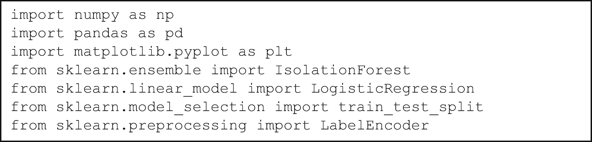

一组 Python 程序代码。它导入了 n p, p d, p l t, Isolation Forest, Logistic Regression, 训练测试分割，和标签编码器。

图 4-3

需要导入的语句

一旦我们完成了导入，我们就可以加载数据，处理它，并开始我们的建模。

##### 数据准备

我们必须定义 42 列。执行图 4-4 中所示的代码以加载数据框并定义 KDDCUP 数据集的列。

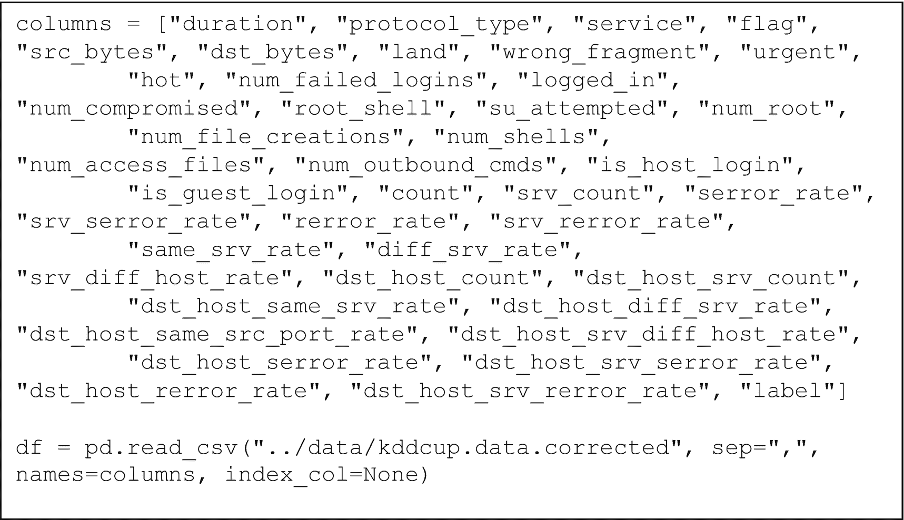

一组 Python 程序代码。它定义了需要执行的列。

图 4-4

加载数据框所需的代码

最好访问 GitHub 上的 Jupyter 笔记本以获取必要的列列表。一旦加载数据框，就可以自由探索其形状以及列中各种数据项的外观。这是一个非常大的数据集，包含 4,898,431 行，但我们只会在涉及 HTTP 攻击的子集上操作。

图 4-5 展示了如何过滤数据框以获得 623,091 行。

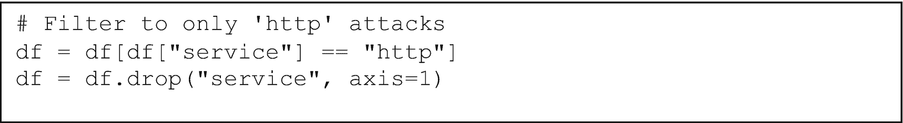

一组 Python 程序代码。它过滤了 http 数据框。

图 4-5

代码用于过滤数据框，只包含 HTTP 攻击。行数应为 623,091 行，41 列。

接下来，执行图 4-6 中显示的代码。

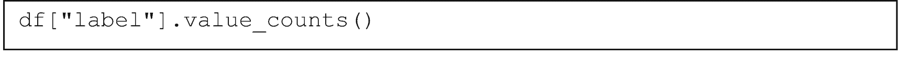

一组 Python 程序代码读取以下内容。d f，开方括号，开双引号，label，关双引号，关方括号，点，value underscore counts，开括号，关括号。

图 4-6

获取‘label’列的值计数

你应该注意到，如图 4-7 所示，存在许多不同类型的异常攻击。

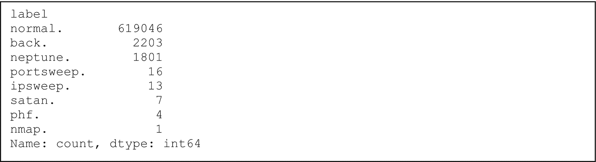

一组 Python 程序代码列出了异常攻击的类型，作为标签、正常、后门、Neptune、端口扫描、IP 扫描、Satan、PHF、Nmap、名称和 d 类型。

图 4-7

不同标签的频率计数。数据集非常不平衡，并且严重偏向“正常”。

首先要注意的是，数据集非常不平衡，并且按比例异常数据点非常少。其次要注意的是，这些是分类标签。我们需要将它们编码为数字格式。为此，我们可以简单地给正常数据点分配 0，给异常数据点分配 1，因为我们的唯一目标是区分异常点和正常点。图 4-8 显示了执行此操作的代码。

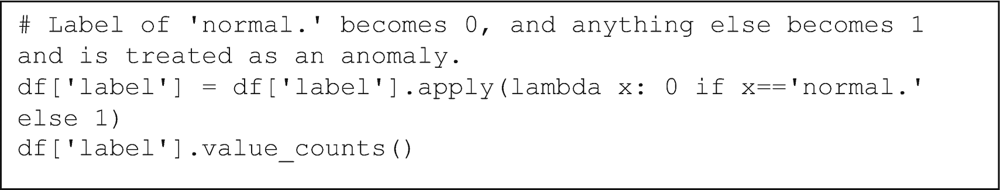

一组 Python 程序代码。它将正常标记为 0，其他任何内容标记为 1，并被视为异常。

图 4-8

应用数值编码并检查值计数

你应该看到如图 4-9 所示的输出。

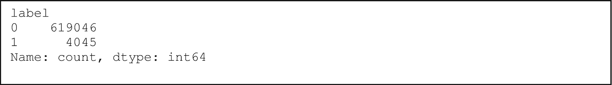

一组 Python 程序代码显示以下输出。行 1\. label。行 2\. 0 space 619046。行 3\. 1 space 4045。行 4 space Name colon count comma d type colon int 64。

图 4-9

数字标签及其频率计数。现在很容易看出正常数据点比异常数据点多多少。

我们还需要对任何其他分类列进行编码。为此，我们可以遍历列，确定数据类型，并使用 scikit-learn 中的标签编码器进行编码。在字典中将列和数据类型一起映射的不错方法是图 4-10 所展示的。


一组 Python 程序代码读取以下内容。datatypes 等于 dict，左括号，zip，左括号，d f dot d types dot index 逗号 d f dot d types，双右括号。

图 4-10

创建一个包含`df`列及其相应数据类型的字典

`.dtypes`属性返回一个以列作为索引的 pandas Series 数据类型。如果我们像图 4-10 中那样将其压缩，我们就会得到一个列及其相应数据类型的字典。

接下来运行图 4-11 中的代码。

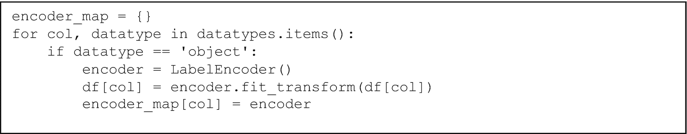

一组 Python 程序代码。它使用 for 条件调用 datatypes，遍历 d f 的列，并通过编码运行代码。

图 4-11

遍历`df`的列，如果它是字符串对象，则对其进行编码并保存编码器对象，以防我们以后需要它。

现在我们已经处理了所有分类变量并将所有内容转换为数值等效，我们可以检查相关矩阵。运行图 4-12 中显示的代码。如果您愿意，您可以自己探索相关矩阵的其余部分。

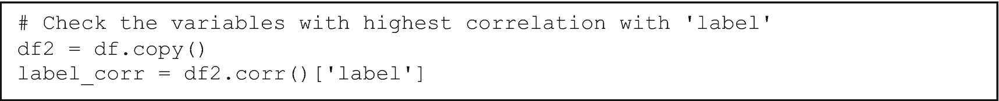

一组 Python 程序代码。它检查与标签相关性最高的变量。

图 4-12

创建`df`的副本（以便在需要时有一个恢复点）并将相关矩阵的标签列保存为其自己的变量

我们只想保留与标签至少有 0.2 幅度相关性的列。换句话说，如果它是至少弱线性相关的，我们只想包括那些变量。以下列表提供了一个关于幅度的通用规则：

+   **0.0 相关性**：没有线性相关性

+   **0.2 到 0.4**：弱线性相关性

+   **0.4 到 0.6**：中等线性相关性

+   **0.6 到 0.8**：强线性相关性

+   **0.8 到 1.0**：非常强的线性相关性

+   **1.0 相关性**：完美的线性相关性，如 y = mx 的关系，其中 m 是一个正系数，所有点都位于一条直线上

相关性也可以是负的。正相关意味着当 y 增加时，x 也增加。负相关意味着当 y 增加时，x 减少。-1.0 相关性的一个例子是 y = mx 的关系，其中 m 是一个负系数。所有点都位于一条直线上。

我们选择 0.2 作为阈值，因为实际上在该点以下几乎没有线性相关性。最终，这又是一个需要调整和实验的超参数，以查看它如何影响最终性能。

运行图 4-13 中的代码。您可以自由探索`label_corr`的全部内容。

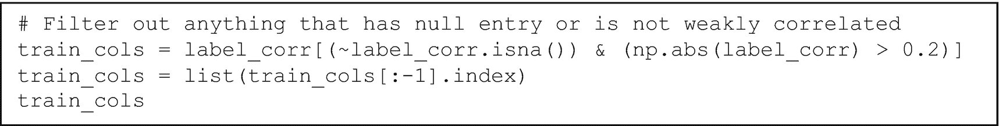

一组 Python 程序代码。它通过过滤掉任何包含空值或不是弱相关性的内容来运行代码。

图 4-13

过滤掉包含空值或无线性相关性的列。我们还索引`t`rain_cols[:-1]`以移除标签作为其自身的相关性

由于相关性修剪，我们从 42 个总列减少到只有 13 个，从而降低了我们模型训练的计算复杂度，因为模型需要摄入的数据量大大减少。您应该看到图 4-14 中显示的输出。

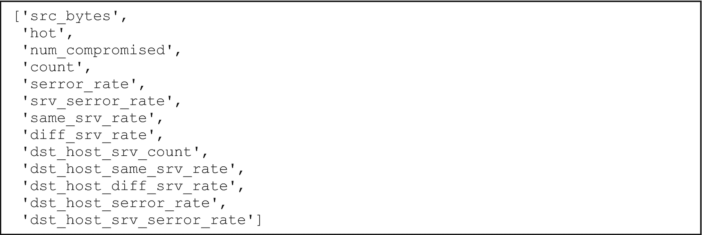

一组 Python 程序代码。它通过减少相关列来降低训练模型的计算复杂度。

图 4-14

运行图 4-13 中的代码的输出。这些是与‘label’至少有弱线性相关性的列

您可以通过执行`label_corr[train_cols]`来自己检查相关性。

现在让我们将数据分成训练集、测试集和验证集。运行图 4-15 中的代码。

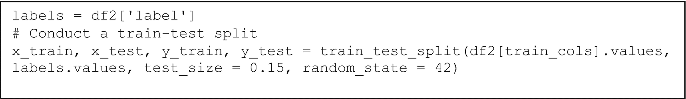

一组 Python 程序代码。它将数据分为训练集、测试集和验证集，并运行代码。

图 4-15

将数据集分割为训练和测试分割

之后，执行图 4-16 中的代码以创建我们的验证集。

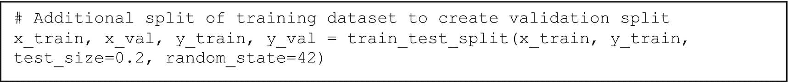

一组 Python 程序代码。它创建训练数据集的额外分割以创建验证分割。

图 4-16

从原始训练分割创建验证集

执行图 4-17 中的代码以打印出我们不同集合的形状。

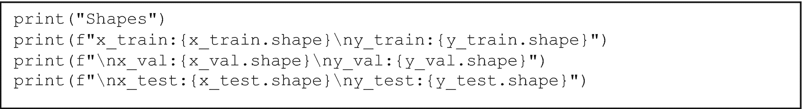

一组 Python 程序代码。它执行代码并打印出不同集合的形状。

图 4-17

打印出我们创建的所有数据分割形状的代码

如果一切顺利，它应该与图 4-18 中显示的输出相匹配。

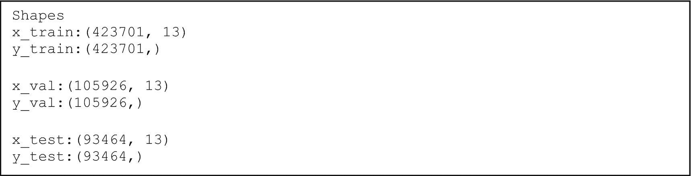

一组 Python 程序代码显示形状的输出为 x train、y train、x validation、y validation、x test 和 y test。

图 4-18

训练集、验证集和测试集的输出形状

##### 训练

最后，我们可以开始隔离森林建模任务。运行图 4-19 以实例化我们的模型。

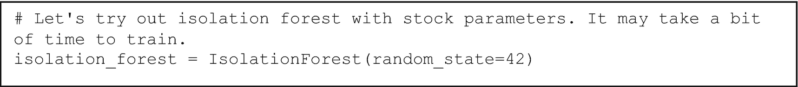

一组 Python 程序代码。它实现了具有股票参数的隔离森林算法，并调用随机状态值 42。

图 4-19

使用默认参数，实例化一个隔离森林模型

图 4-20 中的代码在训练数据上训练并从训练数据生成异常分数。


一组 Python 程序代码。它使用隔离森林决策函数在训练数据上训练并生成异常分数。

图 4-20

训练模型并预测异常分数。

我们可以可视化异常分数并了解平均路径长度的分布情况。记住，隔离 *森林* 包含许多单独的树，每棵树都有特定的路径长度，这就是为什么我们要对所有路径长度进行平均。我们应该看到一个左偏斜，意味着图表左侧的尾部很长，而大部分数据都分布在右侧。图 4-21 展示了如何绘制这个图表。

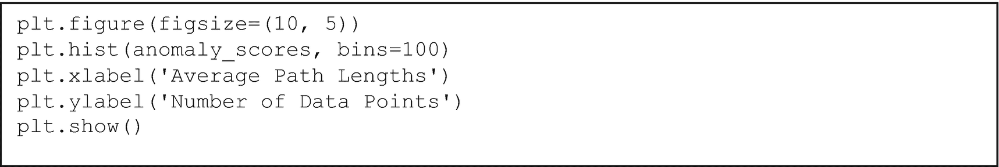

一组 Python 程序代码。它定义了绘制异常分数直方图的代码，将 x 轴标记为平均路径长度，y 轴标记为数据点数量。

图 4-21

代码用于绘制异常分数的直方图，该分数来自数据中每个样本的平均路径长度。

输出应类似于图 4-22 所示的图表。

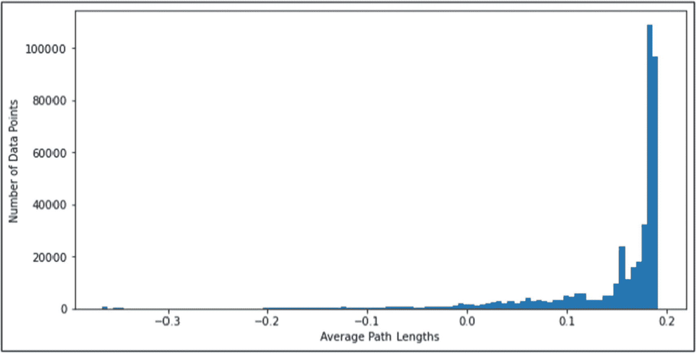

数据点数量与平均路径长度的直方图。它绘制了指数增长的趋势，最高值在(0.18, 100000)。数据是近似的。

图 4-22

显示平均路径长度（异常分数）的直方图。由于大部分数据是正常的，我们应该看到一个左偏斜，正如我们在图表中看到的那样。远在左侧的小簇异常很明显。

根据我们在图表中看到的情况，让我们手动设置一个阈值。想法是，任何低于此阈值的异常分数都被计为异常，而任何高于此阈值的异常分数都被计为正常点。

运行图 4-23 中的代码来完成此操作，以及检查结果的预测的精确度、召回率和 F1 分数。负路径长度是 Scikit-Learn 的隔离森林实现所使用的特定评分算法的结果。负分数表示异常，正分数表示正常点。正如我们清楚地看到，在-0.3 左侧有一个小的异常簇，我们将根据这个观察结果设置阈值为-0.3。这足以捕获我们的异常吗？这是一个可调整的超参数。请随意调整它并注意性能的相应变化。

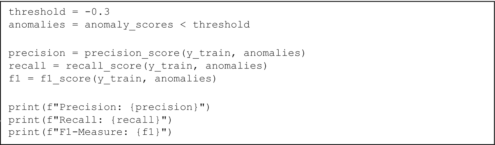

一组 Python 程序代码。它设置阈值、异常、精确度、召回率和 F1，并打印精确度、召回率和 F1 度量。

图 4-23

根据每个分数落在阈值哪一侧来设置阈值并预测异常。然后显示精确度、召回率和 F1 度量。

精确度、召回率和 F1 度量被选中，因为它们有助于清晰地描绘模型在预测异常方面的表现。我们希望最大化精确度（模型的异常预测成功率）和召回率（模型的真正异常捕获率）。只有当两者都最大化时，我们才有一个合适的异常检测器。执行图 4-23 中的代码的输出显示在图 4-24 中。

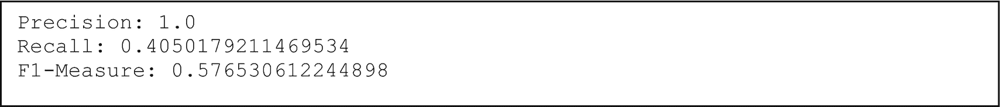

一组 Python 程序代码显示以下内容。行 1：精确度为 1.0。行 2：召回率为 0.4050179211469534。行 3：F1 度量值为 0.576530612244898。

图 4-24

模型的预测性能很差，如召回率和 F1 度量值很低所示。这是一个糟糕的异常检测器

观察图 4-24，精确度为 1.0。这意味着我们确实通过选择阈值隔离了异常值，但显然还不够，因为我们只捕获了大约 40%的异常值。

这并不意味着 Isolation Forest 模型不好，而是我们现在必须开始超参数调整过程，以便更好地将隔离模型拟合到我们的特定数据集和用例。

##### 超参数调整

Isolation Forest 依赖于超参数设置，这些设置必须根据您的特定数据集进行调整。它不像深度神经网络那样主要依靠自身学习；使用这些传统机器学习算法的大部分工作都是确保超参数调整恰到好处。

使用 Isolation Forest 时，以下是需要调整的超参数：

+   `max_samples`：用于训练森林中每棵树的样本数量

+   `max_features`：每个数据点用于训练森林中每棵树的特征数量

+   `n_estimators`：森林中应包含多少棵树

此外，还有一个功能，**contamination**，它告诉 Isolation Forest 有多少比例的数据被异常值污染。但对于这一点，我们可以从我们的训练集中计算异常值的比例，并直接传递它。

至于超参数调整的方法，我们将使用保留验证结合网格搜索。保留验证，在数据量足够的情况下，有助于获得关于超参数调整方向的大致估计。保留验证在大幅提升预测能力方面做得很好。然而，如果您想要实验上完全可靠且稳健，如果您能承担计算成本或者验证数据量不足，K 折交叉验证是最佳选择。

话虽如此，让我们首先计算`contamination`参数，如图 4-25 所示。

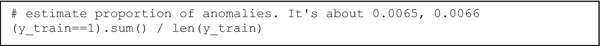

一组用 Python 编写的程序代码。它估计 y train 中异常的大约 0.0065 和 0.006 的比例以及 y train 的长度。

图 4-25

计算训练数据集中异常的比例。

输出应约为 0.00658，我们可以将其四舍五入到 0.0066。现在，让我们定义一个单独的实验运行为一个函数，使我们的代码更加模块化。参见图 4-26。

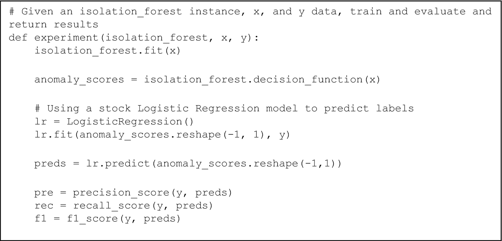

一组用 Python 编写的程序代码。它使用隔离森林实例、x 和 y 数据、train、evaluate 并返回结果。它使用股票逻辑回归模型来预测精确度、召回率和 F1 分数的标签。

图 4-26

给定 Isolation Forest 模型和 x 和 y 数据时执行一个实验试验的代码。计算并返回精确度、召回率和 F1 度量指标。

注意，我们正在使用逻辑回归模型来预测异常分数。这是为了避免手动调整阈值，并让模型自己找到这个阈值。逻辑回归模型接受输入特征，本质上充当一个阈值函数，如果阈值被通过，输出为 1，否则为 0。这里的目的是让模型自动学习阈值，并使用学到的阈值来预测未来数据的异常标签。

现在我们首先调整`max_samples`参数。我们不知道从哪里开始，所以让我们从覆盖 256 并向上到 4096 的 2 的幂开始。确保阅读文档以了解在进行网格搜索时应从哪个大致范围开始。你不想偏离太远，以至于任何方向的变化都不会给你带来很大的收益。

执行图 4-27 中的代码。可能需要一些时间。

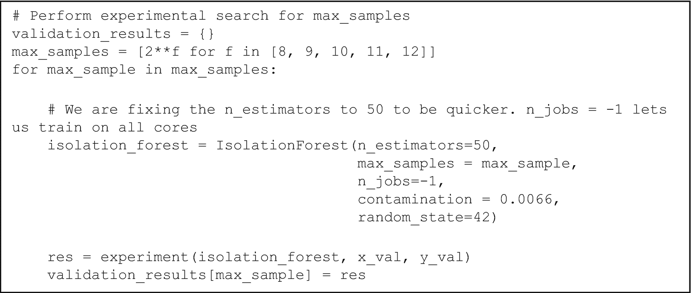

一组用 Python 编写的程序代码。它执行最大样本的实验搜索，并通过调用隔离森林、x 和 y 值来固定 n 估计器以加快速度。

图 4-27

在 256 到 4096 的`max_sample`大小范围内进行网格搜索，以找出在验证分割上提供最佳结果的设置。

注意，我们已经切换到使用我们的验证集。这使得我们能够比每次在完整训练集上训练更快地进行原型设计。

如果你运行图 4-28 中的代码，你应该看到网格搜索的结果作为单元格输出显示。

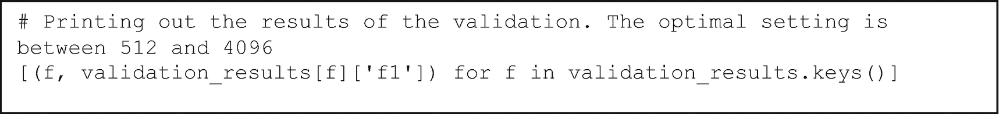

一组用 Python 编写的程序代码。它打印出验证结果。最佳设置在 512 到 4096 之间，并运行代码。

图 4-28

代码用于遍历结果字典并显示超参数值和相应的 F1 度量。由于 F1 度量反映了精确度和召回率，最大化 F1 度量也将最大化精确度和召回率。

图 4-28 的输出显示在图 4-29 中。

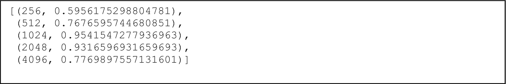

一组 Python 程序代码显示了以最大样本数 1024 和 F1 度量值 0.954 为最优设置的验证结果。

图 4-29

只看`max_samples` = 1024，我们的结果看起来已经接近完美，因为 F1 度量值为 0.954

如你在图 4-28 中看到的那样，仅仅调整一个超参数就产生了巨大的差异。让我们看看我们是否可以继续调整`max_samples`并达到一个可能表现更好的更精确值。

我们将搜索范围缩小到 500 到 2000 之间，因为这似乎是 F1 分数达到峰值并开始再次减少的范围。

运行图 4-30 中的代码。

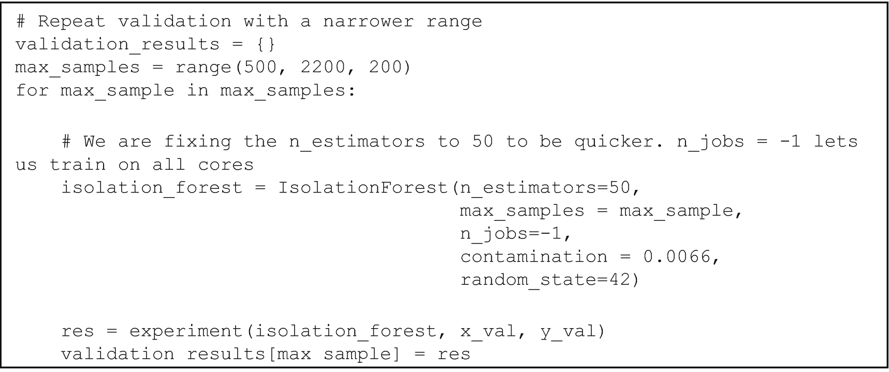

一组 Python 程序代码。它重复了最大样本数范围更窄的验证，将 n 估计器固定以加快速度，并使用 Isolation Forest 算法在所有核心上训练。

图 4-30

使用更窄的`max_samples`候选值范围重复超参数网格搜索

现在通过重新运行该单元格或在新单元格中粘贴相同的代码来重新运行图 4-28 中的代码。你应该看到图 4-31 中显示的输出。

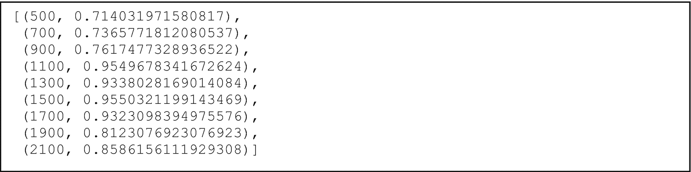

一组 Python 程序代码显示了验证结果、最优设置、最大样本数、n 估计器和 Isolation Forest 算法核心的重复验证的输出。

图 4-31

运行图 4-28 中的代码后的输出

从图 4-31 中，我们可以看到最佳范围在 900-1100 之间，再次在 1300-1700 之间。

让我们再次以更窄的范围重复调整过程，看看 F1 分数能提高多少。执行图 4-32 中的代码。

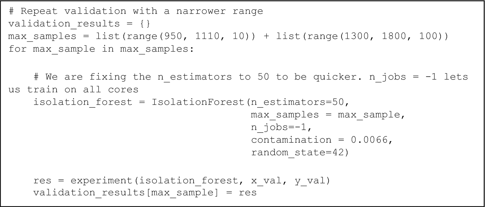

一组 Python 程序代码。它重复了最大样本数范围更窄的验证，并使用 Isolation Forest、x 和 y 值固定 n 估计器以加快速度。

图 4-32

在更窄的候选值范围内重复超参数搜索

完成后，重新运行图 4-28 中的代码。你应该注意到参数设置 950 的 F1 分数迄今为止最高，达到了 0.963。我们可以继续进行超参数调整，或者接受我们看到的值。在某个点上，我们将看到收益递减，所以记住这一点。从我们的结果来看，设置 950 实际上在某些方面表现最好，因此我们将使用这个设置来继续调整其他超参数。

接下来，我们将调整`max_features`。执行图 4-33 中的代码。

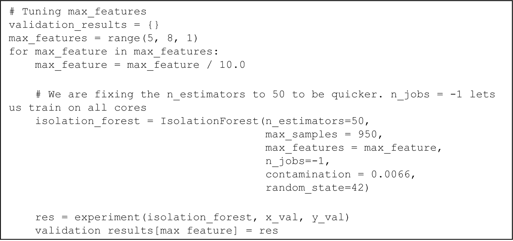

一组 Python 程序代码。它调整最大特征值，将 n 估计器固定以加快速度，并使用隔离森林、x 和 y 值训练所有核心。

图 4-33

参数 `max_features` 是一个分数，这就是我们将其除以十的原因。我们在 0.5 到 0.7 之间以 0.1 间隔进行搜索

完成后，再次运行图 4-28 中的代码。你应该会看到 `max_features` 设置为 0.6 给我们带来了 0.972 的 F1 分数。

我们可以尝试另一轮超参数调整，看看更窄的范围是否能给我们带来更多收益。让我们以 0.55 到 0.70 的 0.01 间隔进行搜索。运行图 4-34 中的代码。

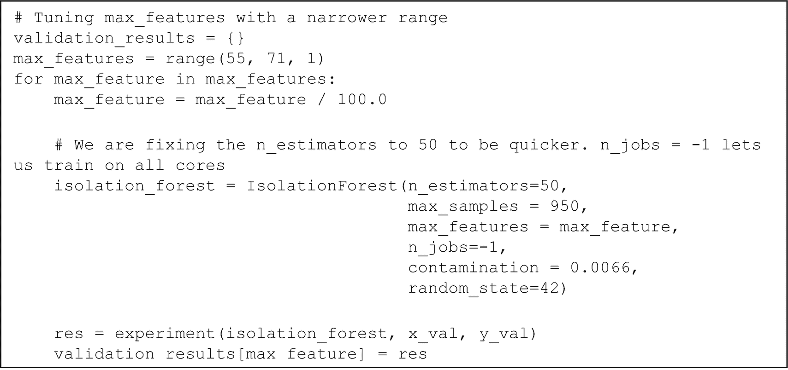

一组 Python 程序代码。它通过更窄的范围调整最大特征值，将 n 估计器固定以加快速度，使用隔离森林、x 和 y 值训练所有核心，并返回验证结果。

图 4-34

尝试 `max_features` 的 0.55 到 0.70 的更窄范围，以 0.01 间隔

完成后，再次执行图 4-28 中的代码。你应该会看到 0.55 到 0.61 的值与大约 0.9722 的值相同，之后的分数下降。让我们就选择 `max_features` = 0.55 并调整最终的超参数 `n_estimators`。我们选择 `max_features` = 0.55 的原因只是选择最小的超参数设置，同时仍然获得了最多的性能。有一个原则叫做奥卡姆剃刀，当应用于机器学习时，意味着性能相等，选择更简单的机器学习模型可能是更好的选择。

这个选择与奥卡姆剃刀原则一致，当应用于性能相对相等的机器学习模型时，意味着最简单的机器学习模型可能是最佳选择。选择一个较小的随机特征比率以隔离，同时仍然获得相同性能，可能意味着最好是保持简单，并选择 `max_features` 的最低值以获得最佳性能。但这并不是一个不可更改的规则。

现在执行图 4-35 中的代码，以进行 `n_estimators` 候选值的广泛搜索。

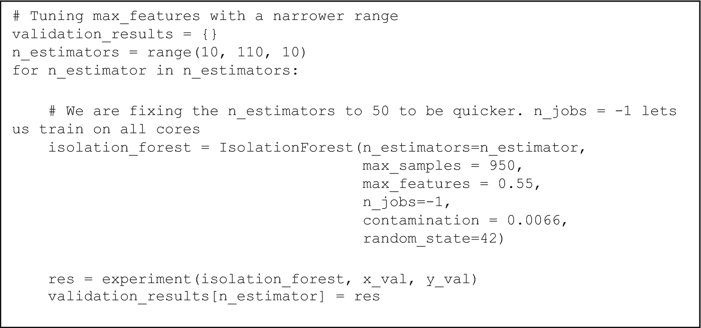

一组 Python 程序代码。它通过更窄的范围调整最大特征值，将 n 估计器固定以加快进行 n 估计器候选值的广泛搜索速度，使用隔离森林、x 和 y 值训练所有核心，并返回验证结果。

图 4-35

进行 `n_estimators` 候选值的广泛搜索

完成后，重新运行图 4-28 以观察结果。看起来 `n_estimators` = 10 实际上给我们带来了最佳的 F1 分数，0.9799，这是我们迄今为止看到的最强性能。因此，森林中仅有十个估计量，Isolation Forest 就能在验证集上很好地预测异常。让我们保留所有这些超参数设置，在训练数据上训练，并在测试数据上评估，看看我们得到什么样的性能。

##### 评估和总结

使用发现的最佳超参数设置，执行图 4-36 中的代码。

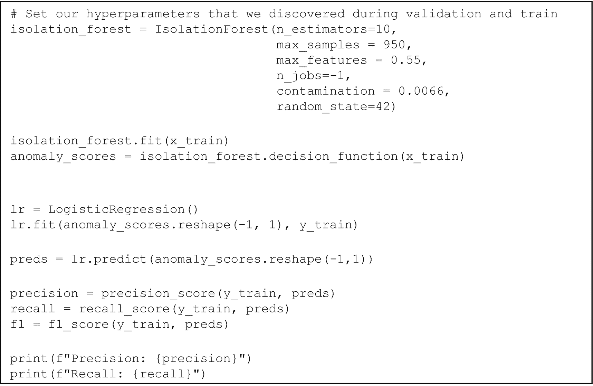

一组 Python 程序代码。它通过执行隔离森林来设置在验证和训练过程中发现的超参数，预测异常分数，并打印出精确度和召回率分数。

图 4-36

使用我们发现的全部最佳超参数设置，在训练集上训练，并在训练集上再次评估

你应该看到图 4-37 中所示的那种输出。

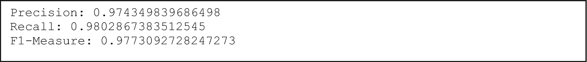

一组 Python 程序代码显示了以下输出。行 1\. 精确度：0.974349839686498。行 2\. 召回率：0.9802867383512545。行 3\. F 1 测量值：0.9773092728247273。

图 4-37

这是在训练数据上相当不错的性能。让我们看看这种相同的性能是否也适用于测试数据

这是一个好的性能，但预测是基于它所训练的数据。到目前为止，我们只知道模型至少可以拟合到训练数据。但它是否可以推广到新的样本？图 4-38 包含了预测测试数据的代码。

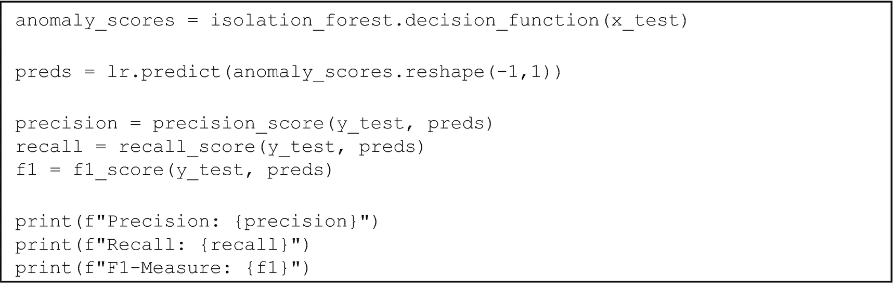

一组 Python 程序代码。它使用从隔离森林决策算法估计的异常分数来预测测试数据，并打印出精确度、召回率和 F 1 测量值。

图 4-38

使用在测试数据上生成的异常分数，以及用训练数据训练来识别异常的逻辑回归模型，我们进行预测并计算指标

你应该看到图 4-39 中所示的那种输出。

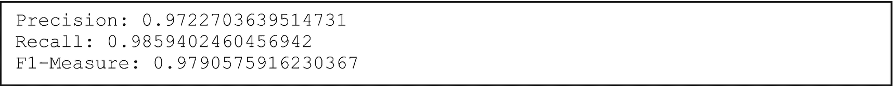

一组 Python 程序代码显示了以下输出。行 1\. 精确度：0.9722703639514731。行 2\. 召回率：0.9859402460456942。行 3\. F 1 测量值：0.9790575916230367。

图 4-39

这是一个非常强的性能，因为我们得到了 0.979 的 F1 分数

这是一个非常好的性能。当我们在做这件事的时候，让我们也检查一下 `roc_auc_score`，通过运行以下代码：

```py
roc_auc_score(y_test, preds)
```

输出结果应该是一个 0.9928 的分数。有了这么高的 AUC 分数和 0.979 的 F1 测量值，我们有一个强大的异常检测器。我们还可以检查混淆矩阵。执行图 4-40 中的代码。

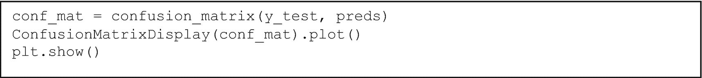

一组 Python 程序代码。它通过使用测试和预测的 y 值创建混淆矩阵，并显示该矩阵。

图 4-40

创建混淆矩阵并使用 scikit-learn 内置功能显示它

您应该看到类似图 4-41 的内容。

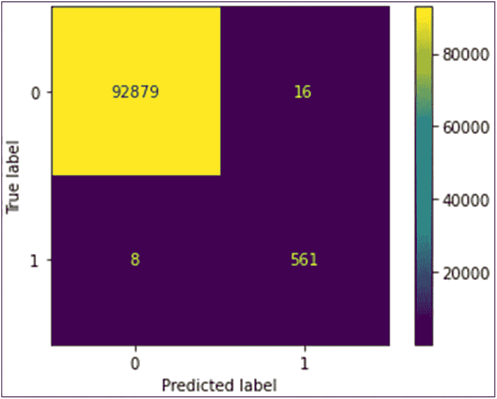

真实标签与预测标签的 2x2 混淆矩阵。颜色渐变的比例从 0 到 80000。第 1 行读取 92879 和 16。第 2 行读取 8 和 561。元素 92879 轻微着色，而其他元素则鲜艳。

图 4-41

结果相当好，569 个异常中有 8 个假阴性，以及近 93,000 个正常点中有 16 个假阳性

希望您现在理解了如何使用 scikit-learn 实现自己的 Isolation Forest 算法，使用保留验证和网格搜索策略进行调整，并使用发现的超参数设置来创建一个可靠的异常检测器。

在实际使用之前，Isolation Forest 模型确实有一些优缺点，您应该考虑。

**优点：**

+   **高维数据**：Isolation Forest 可以高效地采样和处理高维数据。典型的“维度诅咒”（高维数据需要更多的数据样本以便模型学习任务）在这里并不那么强烈，并且只让 Isolation Forest 更容易地隔离样本。

+   **可扩展性**：由于高效的实现，Isolation Forest 可以扩展到更大的数据规模。

+   **异常评分**：Isolation Forest 明确地为每个样本提供异常评分，让您能够解释为什么一个数据点可能是异常数据点而不是正常数据点，以及数据点可能是一个多强的异常。

**缺点：**

+   **对超参数敏感**：如您之前所见，模型对您设置的哪种超参数非常敏感。但话虽如此，一旦调整，模型就能达到标准。

+   **密集点**：当点彼此非常接近时，可能需要更多的分割（因此路径长度更高）来分离数据。这种更高的路径长度可能会错误地暗示一个难以分离的异常实际上是一个正常点，而它并不是。

+   **不平衡数据集**：参数 `contamination` 必须设置以帮助 Isolation Forest 理解期望多少异常。

+   **可解释性**：尽管提供了异常评分，但由于森林中有多少树、它们必须进行多少分割等因素，很难理解一个点是如何被决定为异常点或正常点的。

话虽如此，如果您有大量数据、高维数据，并且愿意坐下来进行超参数调整过程并仔细引导参数选择，Isolation Forest 是一个出色的算法。

### 一类支持向量机

**单类支持向量机（OC-SVM）**是一种修改过的支持向量机模型，非常适合新颖性检测（**半监督异常检测**的一个例子）。其思路是模型在正常数据上训练，并在新数据呈现时用于检测异常。虽然 OC-SVM 可能最适合半监督异常检测，因为只在一个类别上训练意味着在考虑整个数据集时它仍然是“部分标记”的，但它也可以用于无监督异常检测，其中你传递所有数据，让它学习一个最优边界，并通过边界之外的内容来预测异常。

我们将在与 Isolation Forest 示例中使用的相同 KDDCUP 1999 数据集上执行半监督异常检测。

#### OC-SVM 是如何工作的？

在我们深入代码之前，让我们先了解一下什么是支持向量机，以及 OC-SVM 的独特之处。首先，让我们在二维平面上可视化一些数据，如图 4-42 所示。

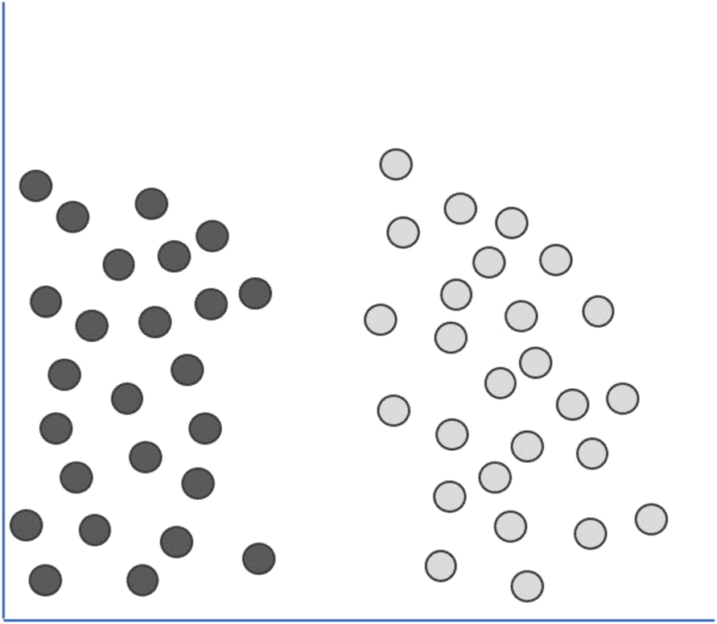

一个二维平面有两个数据点簇。靠近原点的簇被深色阴影覆盖，而右边的簇被浅色阴影覆盖。

图 4-42

2D 空间中成群的两簇点

我们的目的是将数据簇分开成两个不同的区域。我们可以通过简单地在这两个数据簇之间画一条线来实现，如图 4-43 所示。

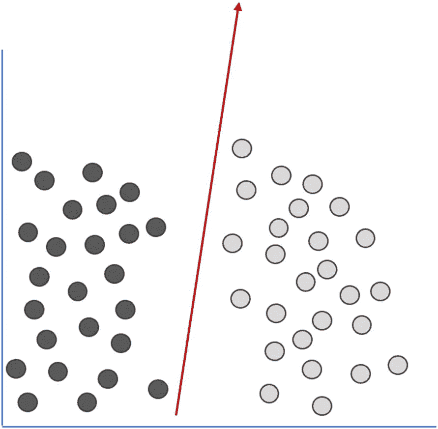

一个二维平面有两个数据点簇。靠近原点的簇被深色阴影覆盖，而右边的簇被浅色阴影覆盖。一个明亮的斜箭头将簇分开。

图 4-43

绘制一条线将数据簇分为两个区域

当你这么想的时候，有很多种方法可以画出这条线。从建模的角度来看，我们的目标是推广到新的数据，其分布与训练数据相似，但可能不同。如图 4-43 中所示，如果我们得到一个仍然在其空间区域内但落在线错误一侧的点会发生什么？

有一种更好的方法来绘制这条线，并从所谓的**支持向量**的角度来理解它。它们正是这个模型被称为支持向量机的原因，因为这些支持向量在确定决策边界方面具有非常大的影响力。

图 4-44 展示了支持向量的样子，它们究竟是什么？请参考图 4-44。

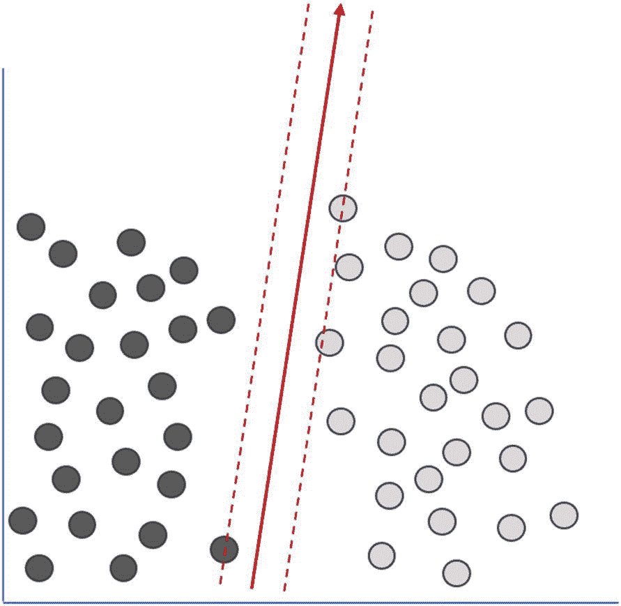

一个二维平面有两个数据点簇。靠近原点的簇被深色阴影覆盖，而右边的簇被浅色阴影覆盖。一个明亮的斜箭头将簇分开，两侧有虚线边界，形成一个超平面。

图 4-44

同样的线，但这次还绘制了支持向量

**支持向量**是与超平面（中间画出的线）平行的向量，充当决策边界，包含一个离超平面最近的点，并帮助建立决策边界的间隔。**超平面**是它所在空间中维度少一的一种子空间。在当前示例中，超平面是一条线，因为只有两个维度。在三维空间中，超平面将是一个平面。在四维及以上，它就被称为“超平面”。

如图 4-44 所示，超平面和支持向量本身之间存在一些空间。这是**间隔**，是为了容纳未来数据点而保留的空间，这些数据点应该属于它们正确的区域，但偏离了它们的分布。间隔越大，你就有更多的余地来容纳这些散点数据，从而避免误分类。

图 4-45 展示了一个更优的超平面间隔。

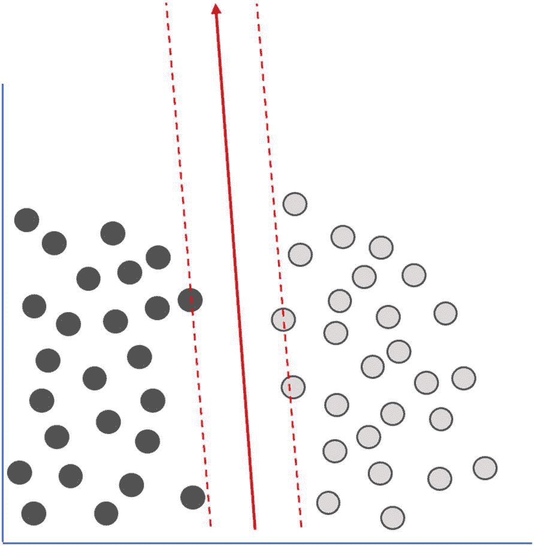

在二维平面上有两个数据点簇。靠近原点的簇用深色阴影表示，而右侧的簇用浅色阴影表示。一个向左倾斜的明亮箭头将簇分开，两侧用虚线边界创建超平面。

图 4-45

由于新的支持向量，具有更优超平面和间隔的相同数据分布

根据超平面的绘制方式，其各自支持向量通过的点离超平面最近。这是超平面的一个更优解，因为超平面的间隔比图 4-44 中先前示例中的间隔大得多。

然而，在现实中，你将看到的数据分布更类似于图 4-46 中所示的数据分布。

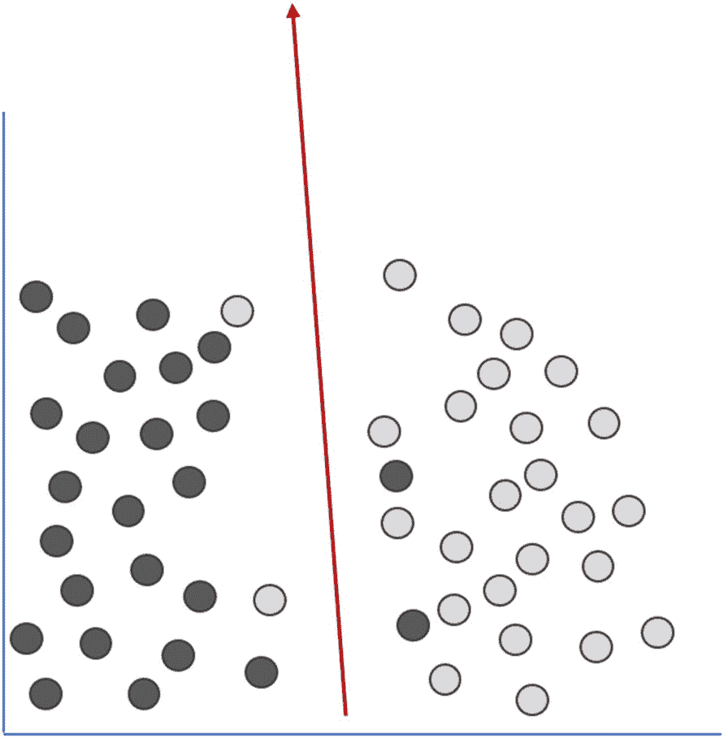

在二维平面上有两个数据点簇。靠近原点的簇用两种浅色调深色阴影表示，而右侧的簇用两种深色调浅色阴影表示。一个向左倾斜的明亮箭头将簇分开。

图 4-46

更真实、有噪声的数据分布

如你所见，仍然有两个明显的区域，其中绝大多数点属于某一类。然而，在这些区域中，每个区域都出现了来自对立类的一些散点。在这种情况下，图 4-46 中画出的超平面是好的，因为它很好地推广到新的数据。图 4-47 展示了另一种可能的解决方案。

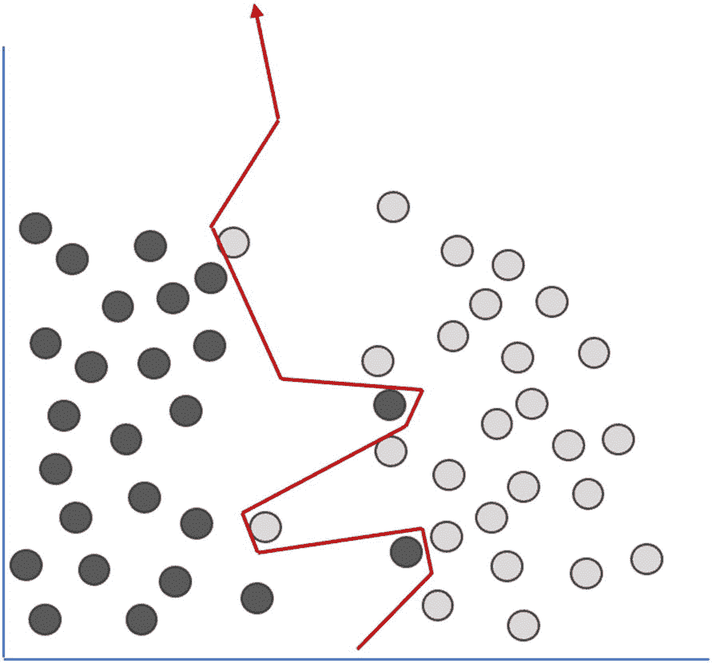

一个二维平面有两个数据点簇。靠近原点的簇用深色阴影表示，而右侧的簇用浅色阴影表示。一个明亮的之字形箭头向左分开这两个簇，将深色阴影的数据点簇与右侧的簇分开。

图 4-47

对数据过拟合的例子

如您所见，我们对数据进行了大规模的过拟合。它在训练数据上具有完美的分类性能，但当推广到新数据时，它可能会明显表现得更差。

决策边界在这里是非线性的原因是因为支持向量机可以转换数据并将其映射到不同的空间。在这个空间中，数据可能是线性可分的，允许在这个新空间中绘制一个超平面。当映射回原始空间时，决策边界看起来是非线性的。

图 4-48 展示了数据分布本身在当前空间中可能没有直接解决方案的例子。

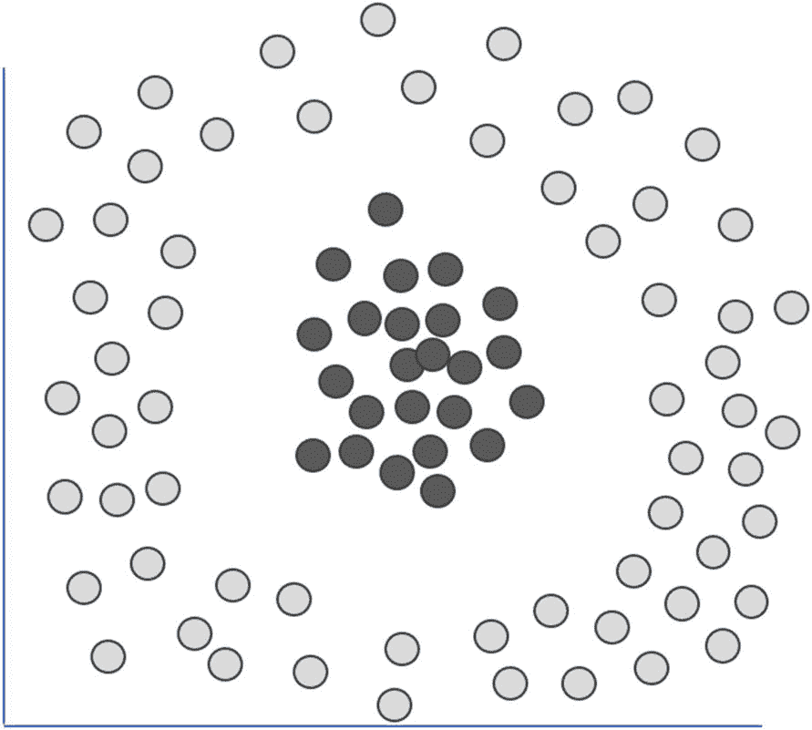

一个二维平面有两个数据点簇，以球形格式呈现。深色阴影的簇位于中心，周围是浅色阴影的簇。

图 4-48

数据分布仍然有清晰的空间区域，其中同一类别的数据存在于其中，但用线性模型实现这种区域分离并不直接。

我们无法通过这条数据画线并实现任何良好的性能。这说明了之前提到的将数据映射到不同空间的观点。假设我们使用一个数学函数将 2D（x，y）坐标转换到 3D 空间。应用这种转换后，我们会在新空间中看到类似图 4-49 的内容。

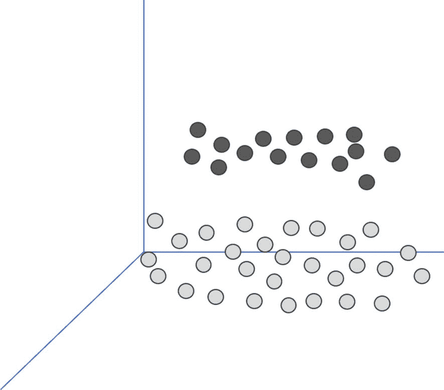

一个三维平面在 X 平面上有两个数据点簇。深色阴影的簇沿着 X Y 平面，浅色阴影的簇位于 X Z 平面上。

图 4-49

在这个新空间中，我们可以看到数据现在是线性可分的。

现在，两个类别之间有明显的分离，我们可以继续将数据点分成两个区域，如图 4-50 所示。

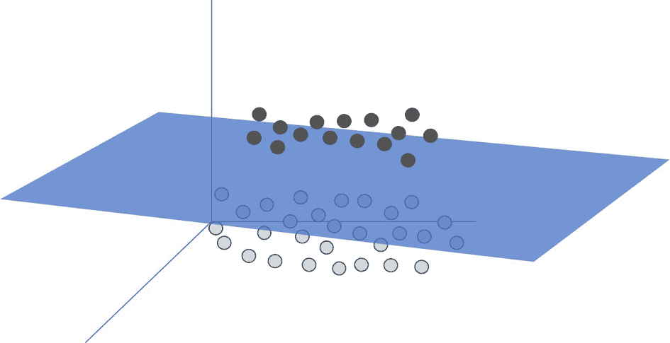

一个三维平面在 X 平面上有两个数据点簇。深色阴影的簇沿着 X Y 平面，浅色阴影的簇位于 X Z 平面上。一个实心平面将这两个簇分开。

图 4-50

我们能够在这个高维空间中绘制一个超平面来分离两个区域。

当我们回到二维空间时，我们的决策边界看起来像图 4-51。

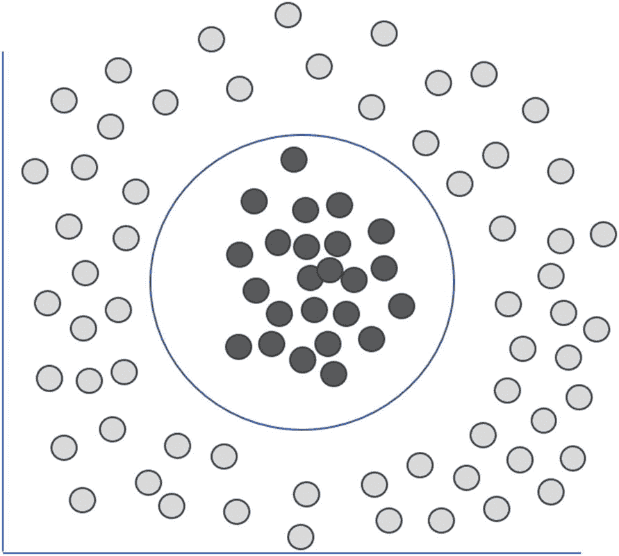

一个二维平面上有两个以球形格式排列的数据点簇。深色阴影的簇位于中心，周围环绕着一个实心环。浅色阴影的簇环绕着这个环。

图 4-51

回到原始空间，我们原本的线性决策边界现在是非线性的

我们刚才所做的是使用**核函数**将数据转换到另一个维度，在这个维度中，数据类别之间有明显的区分。这种数据映射称为**核技巧**。有不同类型的核，包括我们在早期示例中看到的**线性核**。其他类型的核包括**多项式核**，它使用多项式函数将数据映射到某个 n 维，以及**指数核**，它根据指数函数映射数据。

最后，边缘是每个类别的最近数据点到超平面的距离。如前所述，一个**理想边缘**或**最大边缘**涉及支持向量与超平面之间的最大分离。一个**不良边缘**或**次优边缘**会使超平面过于接近一个类别，或者每个点或支持向量到超平面的距离没有尽可能远。

现在你已经知道了 SVM 是如何工作的，OC-SVM 有什么不同呢？图 4-52 展示了这种差异。SVM 和 OC-SVM 非常相似，但在它们执行的确切任务上有所不同。

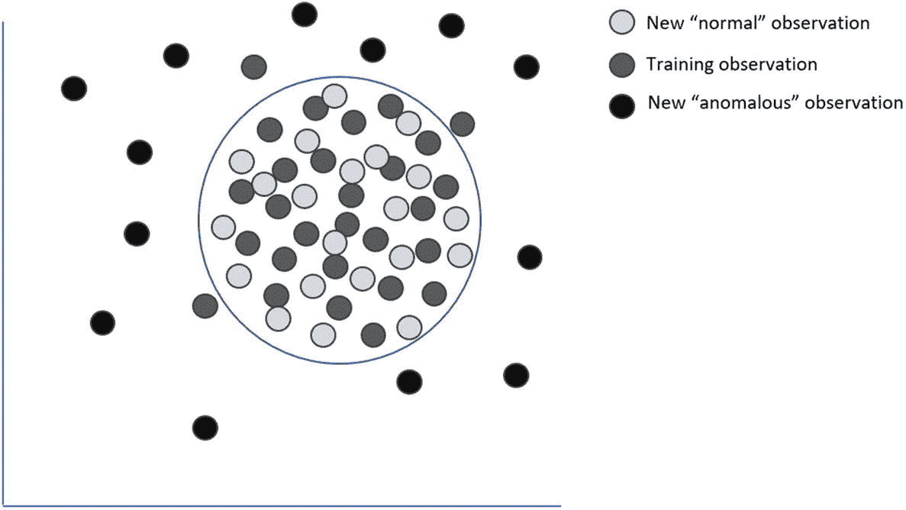

一个二维平面有两个数据点簇。浅色阴影的点是新正常观察点。灰色阴影的点是训练观察点。一个实心环包围着这些簇。新异常观察点的深色数据点随机地散布在环周围。

图 4-52

OC-SVM 上的预测任务示例，包括决策边界

OC-SVM 的任务是找到一个超平面，尽可能多地包含其一侧尽可能多的数据点。设置了一个最大训练误差作为超参数，因此超平面必须尽可能多地包含一侧的数据点，同时也要遵守允许的最大训练误差，并故意将一些点放在超平面的另一侧。

关键是找到一个超参数之间的平衡，使得 OC-SVM 尽可能包含尽可能多的数据点，同时将决策边界设置在异常值明显位于其外的位置。正如你很快就会发现的，这是一个非常微妙的平衡。

至于核函数，OC-SVM 通常使用所谓的**径向基函数（RBF**），这是一种特定的函数映射，允许 SVM 形成非线性决策边界。

#### 使用 OC-SVM 进行异常检测

再次，我们将使用 KDDCUP 1999 数据集。请按照以下 Jupyter 笔记本进行操作：[`https://github.com/apress/beginning-anomaly-detection-python-deep-learning-2e/blob/master/Chapter%204%20Traditional%20Machine%20Learning%20Algorithms/chapter4_ocsvm.ipynb`](https://github.com/apress/beginning-anomaly-detection-python-deep-learning-2e/blob/master/Chapter%204%20Traditional%20Machine%20Learning%20Algorithms/chapter4_ocsvm.ipynb)。

由于我们在“隔离森林”部分已经介绍了如何获取数据，如果需要重新下载数据，请参考该部分。

让我们通过执行图 4-53 中所示的导入语句来直接进入正题。

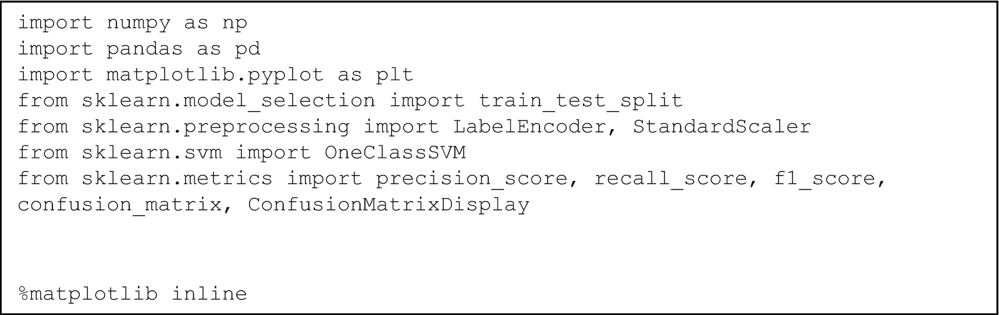

一组 Python 程序代码。它导入 n p, p d, p l t, 训练测试分割，标签编码器，标准缩放器，单类 SVM，精确度分数，召回率分数，f 1 分数，混淆矩阵，以及混淆矩阵显示。

图 4-53

OC-SVM 异常检测任务的导入语句

#### 数据准备

如“隔离森林”部分所述，要加载数据框并定义所有列，请执行图 4-54 中所示的代码。

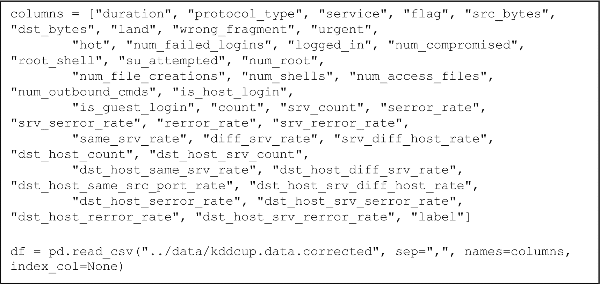

一组 Python 程序代码。它定义了所有列，以从 K D D C U P 数据文件加载数据框。

图 4-54

定义 KDDCUP 数据集的列，以便我们可以正确导入和引用它们

接下来的几个步骤很简单，重复我们在“隔离森林”部分所做的工作。执行图 4-55 中的代码。

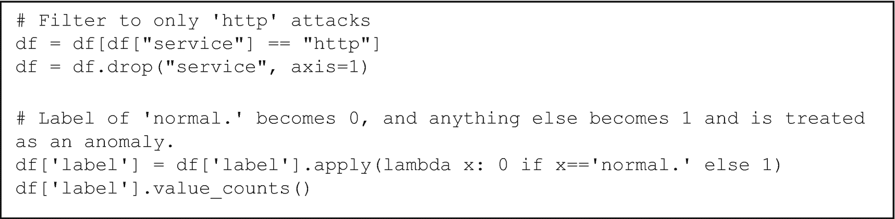

一组 Python 程序代码。它过滤了 http 攻击，并将正常情况标记为 0，其他情况标记为 1，并被视为异常。

图 4-55

仅选择 HTTP 数据并对标签列进行数值编码

接下来，我们将对分类列进行编码。我们还将对数值列进行归一化。这对于 SVM 来说是一个*非常重要的步骤*，因为它们对数据规模非常敏感！请执行图 4-56 中所示的代码。

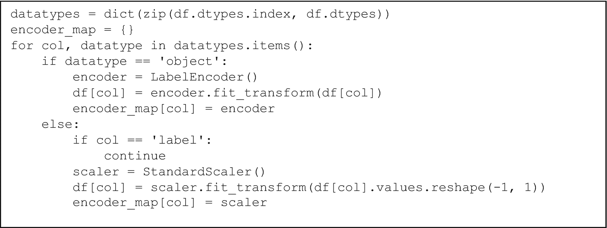

一组 Python 程序代码。它调用列的数据类型，如果数据类型与对象相同，则进行编码，否则列与标签相同，并编码映射。

图 4-56

在适当的位置应用 LabelEncoder 和 StandardScalar

接下来，执行图 4-57 中的代码以推导出训练列并创建我们的训练、测试和验证分割。

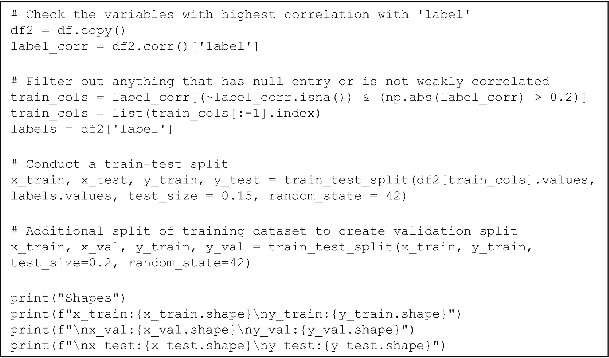

一组 Python 程序代码。它检查最高相关性的变量，即标签，过滤掉空值或不是弱相关性的，进行训练测试分割，对训练数据集进行额外的分割以创建验证分割，并打印形状。

图 4-57

创建训练-测试-验证分割并打印输出形状

执行图 4-57 后，你应该会看到图 4-18 中之前显示的输出。

#### 训练

由于我们的示例中的 OC-SVM 将仅对正常数据进行训练（由于部分标记，这是一个半监督设置），我们需要将训练数据分成两部分：一部分仅包含正常数据，用于训练；另一部分包含正常和异常数据，用于测试。

为了做到这一点，我们将定义一个函数，其代码如图 4-58 所示，以帮助我们完成这项工作。

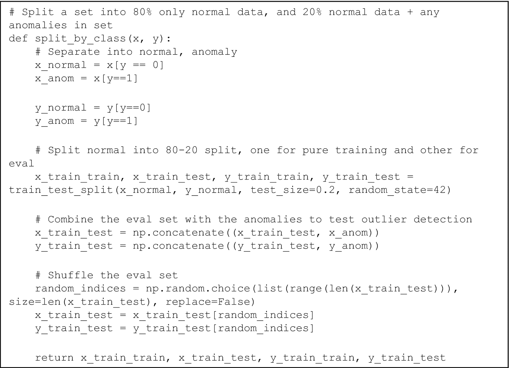

一组 Python 程序代码。它将数据分为正常和异常，将正常数据分为 80 到 20 的分割，一个用于纯训练，另一个用于评估，将评估集与异常值结合以测试异常检测，并对评估集进行洗牌。

图 4-58

一个帮助将数据分割成仅正常和正常 + 异常部分的功能

现在，通过执行图 4-59 中的代码，以这种方式分割我们的训练数据。

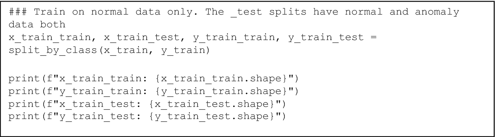

一组 Python 程序代码。它仅对正常数据进行训练。测试分割包含正常和异常数据，并打印 x 训练和 y 训练的训练和测试值的形状。

图 4-59

将我们的训练集分割成 _train 和 _test 子集

你应该会看到图 4-60 中所示的输出。

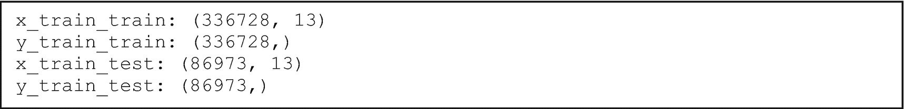

一组 Python 程序代码显示了 x 训练和 y 训练的以下训练和测试输出。

图 4-60

新的训练和测试子集大小。注意，这些训练数据将仅用于训练目的

在我们开始训练 OC-SVM 之前，应该知道它并不很好地扩展到数据样本的数量。因此，为了加快速度，我们将使用训练分割的一部分。执行图 4-61。

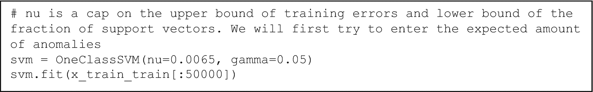

一组 Python 程序代码。它使用 SVM 算法通过使用 nu 和 gamma 值来拟合 x 训练，以输入预期的异常数量。

图 4-61

在具有一些特定超参数设置（`gamma` 被任意选择）的训练子集中进行训练

现在，让我们进行预测并评估它。注意，OC-SVM 预测

+   **1** 如果数据点是正常的（内点）

+   **-1** 如果数据点是异常的（异常点）

因此，我们需要将预测值从 -1 和 1 映射到 0 或 1。为此，执行图 4-62 中所示的代码。

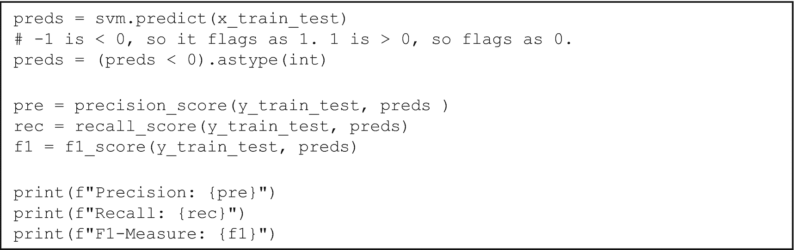

一组 Python 程序代码。它使用 SVM 算法将预测值从 -1 和 1 映射到 0 或 1，并估计精度、召回率和 f 1 测度，并将它们打印出来。

图 4-62

获取预测并将它们转换，使得 0 表示正常，1 表示异常

你应该看到图 4-63 中所示的输出。


一组 Python 程序代码显示以下输出。行 1\. 精确度：0.8310991957104558。行 2\. 召回率：1.0。行 3\. F1 度量：0.9077598828696924。

图 4-63

执行图 4-62 中代码的输出

这个分数看起来很好，但让我们通过执行图 4-64 中的代码来看看这个分数在测试数据上的表现。根据隔离森林的表现，这很可能无法正确泛化。

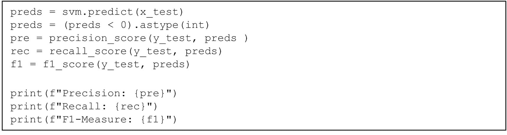

一组 Python 程序代码。它使用 SVM 算法来估计 y 测试的精确度、召回率和 F1 度量，并将它们打印出来。

图 4-64

用于在测试集上进行预测并评估指标的代码

图 4-65 展示了运行图 4-64 中代码的输出。

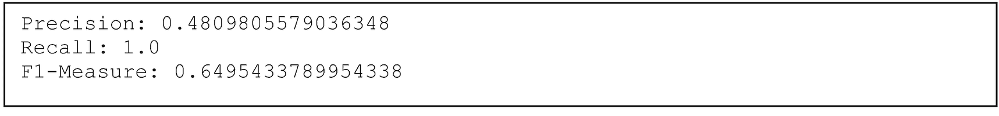

一组 Python 程序代码显示以下输出。行 1\. 精确度：0.4809805579036348。行 2\. 召回率：1.0。行 3\. F1 度量：0.6495433789954338。

图 4-65

在测试分割上 F1 分数大幅下降

如图 4-65 所示，模型明显过度拟合了训练数据。尽管其召回率完美，但精确度极差，表明模型采取了极端策略，决策边界不是最优的。更具体地说，决策边界允许太多正常数据点穿过边界到错误的一侧。这个问题在训练集中并不明显，但在测试集中却很突出。

这很正常，也是可以预料的。我们还没有使用超参数调整。特别是，需要调整的最重要超参数如下：

+   `gamma`：此参数用于径向基函数（RBF）核函数。它决定了点对点之间的影响半径，较小的 gamma 对应较大的半径。我们希望影响半径足够大，以便不过度拟合，同时足够泛化，以便可靠地在新数据中检测到异常。这需要对 gamma 参数进行仔细调整。如果 gamma 太大，那么支持向量机（SVM）将尝试更紧密地拟合训练数据，这可能导致过度拟合。这使得`gamma`成为一个重要的调整参数。

+   `nu`：这是允许的训练错误的分数上限和支撑向量的分数下限。它是一个比 `gamma` 更敏感的超参数，可以相当大地影响模型的输出行为，因此根据你的数据集调整这个值非常重要。即使你的训练数据大小发生变化，你也可能需要重新调整这个值。一个非常小的 `nu` 值对允许的训练错误数量提出了更严格的要求，而较大的 `nu` 值在训练模型时允许更多的训练错误通过。

#### 超参数调整

让我们定义一些用于实验运行的代码，这些代码在图 4-66 中捕捉到。

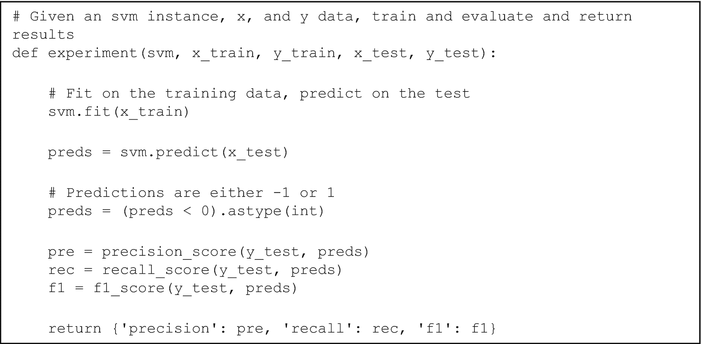

一组 Python 程序代码。它评估并返回 SVM 实例 x 和 y 数据的结果，训练并拟合训练数据，预测测试数据为 -1 或 1，并返回精确度、召回率和 f 1 分数。

图 4-66

给定 SVM 模型实例的一个实验运行

我们将要调整的第一个参数是 `gamma`。我们首先从一个广泛的范围内开始，只是任意选择的。参见图 4-67。

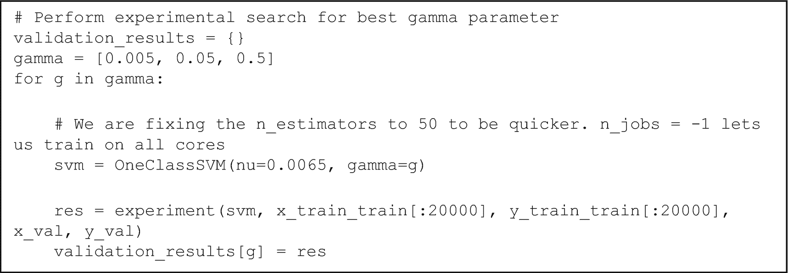

一组 Python 程序代码。它从验证结果中进行实验性搜索以找到最佳的 gamma 参数，将 n 估计器固定以加快速度，训练所有核心，并使用 SVM 算法返回验证结果。

图 4-67

优化 gamma 参数的网格搜索

一旦完成这些，如果我们运行图 4-68 中的代码，我们将看到显示的结果。

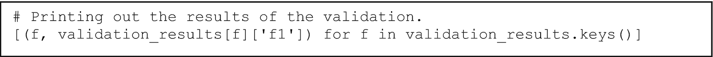

一组 Python 程序代码。它打印出验证结果并返回 f 1 分数。

图 4-68

打印验证结果代码

从结果来看，`gamma` = 0.005 应该给出了最佳的 0.639 F1 衡量值。让我们通过执行图 4-69 中的代码进一步缩小搜索范围。

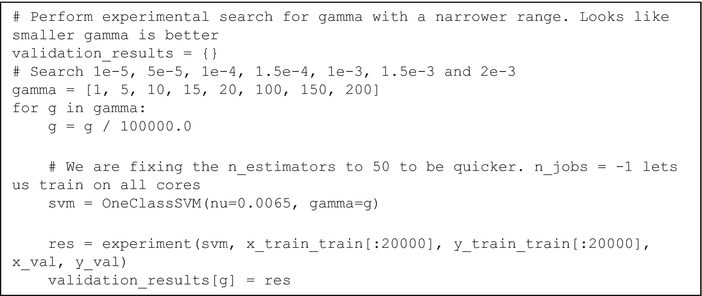

一组 Python 程序代码。它以更窄的范围进行 gamma 的实验性搜索，搜索 gamma 范围，将 n 估计器固定以训练所有核心，并返回验证结果。

图 4-69

对 `gamma` 进行更精细的网格搜索代码

重新运行图 4-68 中的代码，你应该会发现 `gamma` = 1e-5 产生了最佳的 0.6605 F1 分数。

将此值设置为 `gamma`，现在通过执行图 4-70 中的代码来调整 `nu`。

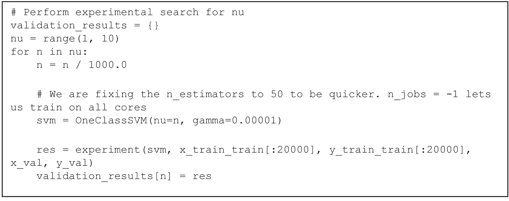

一组 Python 程序代码。它进行 nu 值的实验性搜索，使用 SVM 算法将 n 估计器固定以训练所有核心，并返回 x 训练和 y 训练的验证结果。

图 4-70

在 0.001 到 0.009 的参数 `nu` 上进行广泛搜索

重新运行图 4-68。你会发现 `nu` = 0.001 在 F1 分数上给出了最佳结果。让我们进一步缩小 `nu` 的范围，进行更精细的网格搜索，看看我们是否能进一步提高性能。运行图 4-71 中的代码。

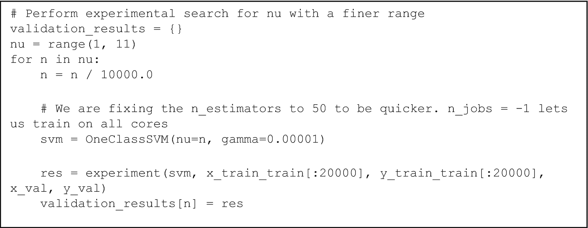

一组 Python 程序代码。它在更精细的范围内对 nu 值进行实验搜索，将 n 估计器固定为使用 S V M 算法训练所有核心，并返回 x 训练和 y 训练的验证结果。

图 4-71

对 `nu` 进行更精细的网格搜索

一旦完成，重新运行图 4-68 中的代码。这次，最佳结果是 `nu` = 0.0002，F1 分数为 0.9607。现在我们已经找到了最佳的 `nu` 设置（任何更多的网格搜索都会产生递减的结果），让我们坚持这些设置并训练模型。

#### 评估和总结

现在我们来看看我们的模型在测试集上的表现。在此之前，我们必须通过执行图 4-72 中的代码来用我们的完整训练集对其进行训练。请注意，当你增加或更改数据量时，你可能需要重新调整你的超参数。在我们的例子中，我们必须将 `gamma` 从 0.00001 增加到 0.005。

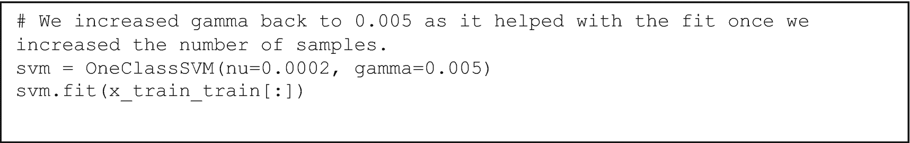

一组 Python 程序代码。它将 gamma 的值恢复到 0.005，并使用 S V M 算法拟合增加的样本数量。

图 4-72

使用最佳超参数设置，在训练子集上训练

现在我们可以对我们的测试数据进行评估。执行图 4-73。

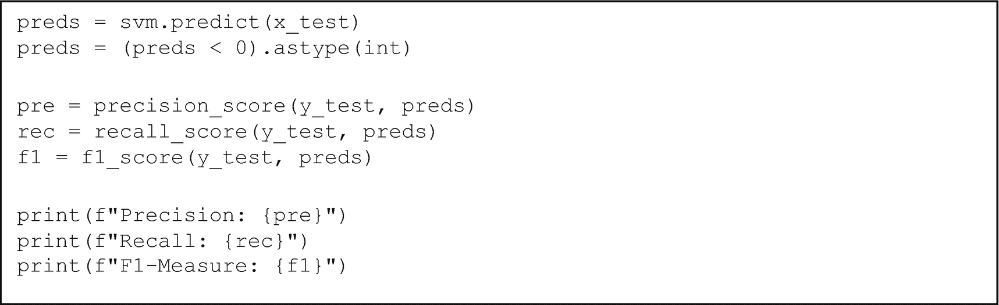

一组 Python 程序代码。它使用 S V M 算法评估代码，并打印出 y 测试值和预测值的精确度、召回率和 f 1 分数。

图 4-73

评估测试分割的预测

输出应该类似于图 4-74。

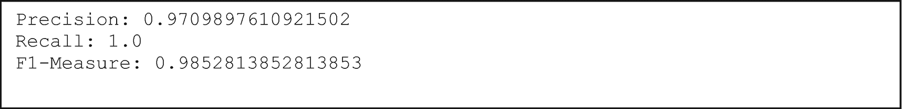

一组 Python 程序代码显示以下输出。行 1\. 精确度：0.9709897610921502。行 2\. 召回率：1.0。行 3\. F 1-Measure：0.9852813852813853。

图 4-74

基于测试分割预测计算出的指标

如图 4-74 所示，性能比未调整的模型有了很大提高。此外，F1 测量值非常好，达到了 0.985！这是一个非常强大的预测器，因为它不仅正确地识别了每个异常，而且其阳性预测力（精确度）为 0.971，所以假阳性并不多。让我们评估混淆矩阵。参见图 4-75。


一组 Python 程序代码显示以下内容。混淆矩阵显示，开括号，混淆下划线矩阵，开括号，y 测试下划线，preds，双闭括号，点，plot，开括号，闭括号。

图 4-75

绘制和可视化混淆矩阵的代码

图 4-76 展示了输出结果。

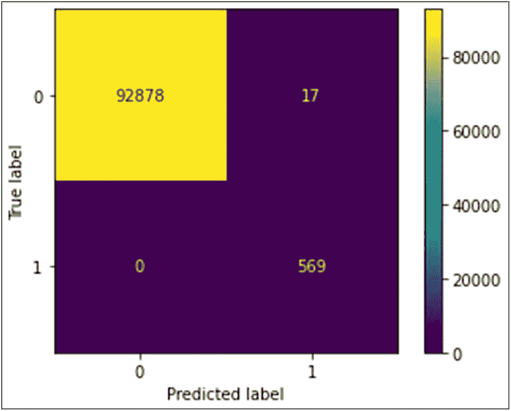

真实标签与预测标签的 2-交叉-2 混淆矩阵。颜色渐变的比例从 0 到 80000。第一行读作 92878 和 17。第二行读作 0 和 569。元素 92878 轻微着色，而其他元素则色彩鲜明。

图 4-76

在测试集上的预测结果所得到的混淆矩阵。没有假阴性，并且假阳性非常少。这是一个非常强的结果。

您现在应该很好地理解了如何使用 scikit-learn 实现自己的 OC-SVM 算法，使用保留验证和网格搜索策略进行调整，并使用发现的超参数设置来创建一个强大的异常检测器。

与隔离森林模型类似，OC-SVM 模型在使用前确实有一些优缺点需要您考虑。

**优点：**

+   **高维数据**：由于使用了核技巧，OC-SVM 能够处理高维数据，因为数据无论如何都会被映射到更高维。但话虽如此，它并不是对“维度诅咒”免疫的，在更高维中，您需要更多的数据来充分填充空间，以便模型能够正确地捕捉到一个好的决策边界。

+   **无监督学习**：OC-SVM 可以以无监督的方式进行训练。然而，如果您确实有部分标签，您可以使用半监督方式，就像我们在本节中所做的那样。

+   **非线性决策边界**：多亏了像 RBF 这样的核函数，OC-SVM 可以建模非线性决策边界，因为数据首先被映射到一个非线性、高维空间，然后再进行线性分离。在原始空间中，得到的决策边界就变成了非线性。

**缺点：**

+   **对超参数敏感**：正如我们所经历的，OC-SVM 非常依赖于超参数，对这些设置的敏感度很高。当您增加训练样本的数量时，可能需要重新调整超参数设置。然而，一旦它开始运行，它就非常好。

+   **噪声数据**：当数据有噪声时，导致正常（但噪声）数据点和异常之间有重叠，决策边界就难以建模。在这些情况下，模型将被迫隔离噪声的正常实例，以针对异常。

+   **扩展性差**：随着数据量的增加，OC-SVM 的扩展性相当差。有一些方法可以绕过这个问题，例如通过使用核映射器使用 RBF 内核分别转换数据，然后使用基于线性、随机梯度下降求解器的 SVM（在 sklearn 中可用）来更快地得到一个近似解。

话虽如此，OC-SVM 仍然是一个非常强大的算法，是你工具箱中的一大法宝。OC-SVM 的版本，如 SGD OC-SVM，可以提供近似类似解决方案的替代方案，如果你在扩展性方面遇到困难，但最终你仍然有一个上限，即你可以训练多少数据。因此，只要你能正确调整你的模型，并遵循数据以及任何可能帮助调整超参数的领域知识，OC-SVM 可以根据数据的具体性质实现出色的结果。

## 摘要

完成这一章后，你现在已经练习了基本机器学习工作流程，包括数据加载、处理、拆分、训练、超参数调整和评估。这个相同的流程几乎适用于任何类型的机器学习或深度学习建模任务。除此之外，希望你已经看到了隔离森林和 OC-SVM 模型在异常检测方面的强大功能，因为只要设置正确的超参数，它们可以取得令人印象深刻的成果。

在第五章，你将正式了解深度学习的概念，并探索一系列技术来帮助调整模型，以最大化对新数据的泛化。
