# 5. 深度学习简介

本章向您介绍了深度学习以及您需要了解的所有基本和高级概念，以实现强大的神经网络模型。这些概念将适用于本书的其余部分以及更广泛的应用。在这个过程中，您还将使用 TensorFlow/Keras 和 PyTorch 实现一个简单的神经网络模型，以执行监督异常检测，并作为学习如何在这些框架中建模的入门。

简而言之，本章涵盖了以下主题：

+   深度学习是什么？

+   神经元

+   激活函数

+   神经网络

+   损失函数

+   梯度下降和反向传播

+   损失曲线

+   正则化

+   优化器

+   多层感知器监督异常检测

+   简单神经网络：Keras

+   简单神经网络：PyTorch

备注

代码示例提供在 Python 3.8 中。本书的代码仓库可在 [`github.com/apress/beginning-anomaly-detection-python-deep-learning-2e/tree/master`](https://github.com/apress/beginning-anomaly-detection-python-deep-learning-2e/tree/master) 找到。

仓库还包括一个 requirements.txt 文件，用于检查您的包及其版本。

本章剩余的所有笔记本如下：

+   **激活函数**: [`github.com/apress/beginning-anomaly-detection-python-deep-learning-2e/blob/master/Chapter%205%20Introduction%20to%20Deep%20Learning/chapter5_activation_functions.ipynb`](https://github.com/apress/beginning-anomaly-detection-python-deep-learning-2e/blob/master/Chapter%205%20Introduction%20to%20Deep%20Learning/chapter5_activation_functions.ipynb)

+   **使用 Keras 的 ReLU 非线性**: [`github.com/apress/beginning-anomaly-detection-python-deep-learning-2e/blob/master/Chapter%205%20Introduction%20to%20Deep%20Learning/chapter5_relu_keras.ipynb`](https://github.com/apress/beginning-anomaly-detection-python-deep-learning-2e/blob/master/Chapter%205%20Introduction%20to%20Deep%20Learning/chapter5_relu_keras.ipynb)

+   **梯度下降法**: [`github.com/apress/beginning-anomaly-detection-python-deep-learning-2e/blob/master/Chapter%205%20Introduction%20to%20Deep%20Learning/chapter5_gradient_descent.ipynb`](https://github.com/apress/beginning-anomaly-detection-python-deep-learning-2e/blob/master/Chapter%205%20Introduction%20to%20Deep%20Learning/chapter5_gradient_descent.ipynb)

+   **过拟合**: [`github.com/apress/beginning-anomaly-detection-python-deep-learning-2e/blob/master/Chapter%205%20Introduction%20to%20Deep%20Learning/chapter5_overfitting.ipynb`](https://github.com/apress/beginning-anomaly-detection-python-deep-learning-2e/blob/master/Chapter%205%20Introduction%20to%20Deep%20Learning/chapter5_overfitting.ipynb)

+   **优化器**: [`github.com/apress/beginning-anomaly-detection-python-deep-learning-2e/blob/master/Chapter%205%20Introduction%20to%20Deep%20Learning/chapter5_optimizers.ipynb`](https://github.com/apress/beginning-anomaly-detection-python-deep-learning-2e/blob/master/Chapter%205%20Introduction%20to%20Deep%20Learning/chapter5_optimizers.ipynb)

+   **优化器比较**: [`github.com/apress/beginning-anomaly-detection-python-deep-learning-2e/blob/master/Chapter%205%20Introduction%20to%20Deep%20Learning/chapter5_optimizer_comparison.ipynb`](https://github.com/apress/beginning-anomaly-detection-python-deep-learning-2e/blob/master/Chapter%205%20Introduction%20to%20Deep%20Learning/chapter5_optimizer_comparison.ipynb)

+   **MLP Keras**: [`github.com/apress/beginning-anomaly-detection-python-deep-learning-2e/blob/master/Chapter%205%20Introduction%20to%20Deep%20Learning/chapter5_mlp_keras.ipynb`](https://github.com/apress/beginning-anomaly-detection-python-deep-learning-2e/blob/master/Chapter%205%20Introduction%20to%20Deep%20Learning/chapter5_mlp_keras.ipynb)

+   **MLP PyTorch**: [`github.com/apress/beginning-anomaly-detection-python-deep-learning-2e/blob/master/Chapter%205%20Introduction%20to%20Deep%20Learning/chapter5_mlp_pytorch.ipynb`](https://github.com/apress/beginning-anomaly-detection-python-deep-learning-2e/blob/master/Chapter%205%20Introduction%20to%20Deep%20Learning/chapter5_mlp_pytorch.ipynb)

这些链接也提供在每个相应的部分中，你将需要笔记本。导航到“第五章 深度学习简介”然后点击你想要尝试的任何笔记本。代码也以 .py 文件的形式提供，尽管它是笔记本的导出版本。

我们将使用 JupyterLab 来展示所有的代码示例。

## 深度学习简介

深度学习是机器学习的一个子集，它涉及使用神经网络来执行建模任务。神经网络可以由成百上千层相互连接的神经元组成，形成一个“深度”架构，因此得名“深度学习”。

如第四章所述，“传统”机器学习算法是非神经网络架构，如 k-最近邻、支持向量机、随机森林、决策树等。这些模型仍然相当流行，尤其是在 XGBoost（梯度提升树）等形式中，它们在结构化、表格数据上与神经网络保持相当竞争力。其他仍在使用的流行算法包括聚类算法和树。尽管深度学习模型可能受到关注，但传统机器学习算法并未过时，仍然有很好的用途，尤其是在第三章讨论的案例中。

### 什么是深度学习？

深度学习是机器学习的一个子领域，它结合了人工神经元的概念。深度学习与传统机器学习在一般意义上的区别在于，它使用许多相互连接的人工神经元层来构成一个“深度”网络，而不是只有一层或两层的“浅层”网络。层数可以从几个到几百个不等。深度与非线性（本章后面将介绍）的结合使得深度学习模型能够学习执行高度复杂的任务，这些任务直到最近只有人类能够完成，例如高级聊天机器人、生成极其令人印象深刻的艺术作品和自动驾驶。近年来，媒体广泛报道的许多令人印象深刻的突破性技术，如 ChatGPT、深度伪造、语音合成和 AI 艺术，都是由深度学习驱动的。尽管深度学习与机器学习略有不同，本质上更复杂，但机器学习的基本原理仍然适用。

在 Python 中，深度学习主要通过两个流行的框架实现：PyTorch 和 TensorFlow。Keras 也很受欢迎，但自 2.0 版本以来已集成到 TensorFlow 中。从初学者的角度来看，TensorFlow 2.0+ Keras 模块是一个很好的起点。它从你那里抽象掉了深度学习建模工作流程的许多复杂性，让你只需几行代码就能定义模型，并通过一个函数进行训练和推理。这一特性也使得 Keras 成为快速原型设计的优秀工具，允许你进行快速实验，或者在你只需要一个标准的深度学习模型来完成某个任务时，转向一个更容易使用的 API。

如果你需要深入挖掘并定义诸如自定义神经网络层、损失函数和神经网络架构等事物，或者只是需要在低级别上实现工作流程，你可以使用 TensorFlow API 的完整功能，而不仅仅是 Keras。

相比之下，PyTorch 比 Keras 更少抽象化，需要你从头开始定义模型、训练循环和推理循环。你不需要重新实现常用的层，但 PyTorch 不像 Keras 那样“手把手”地引导你。然而，由于 PyTorch 的 Pythonic API 和比 TensorFlow API 更简单的语法，它仍然直观且相对容易使用。由于其灵活性和易用性，PyTorch 也受到研究人员的喜爱。

从历史上看，在 TensorFlow 2.0 集成 Keras 并简化其语法之前，TensorFlow 的语法相当复杂，难以理解。这对初学者来说是一个障碍，因为他们需要克服陡峭的学习曲线才能开始，对研究人员来说也是如此，因为他们必须处理所有的语法，以及一个更难以调试模型的运行环境。当 PyTorch 可用时，它迅速获得了人气。尽管如此，这两个框架至今仍然非常受欢迎，尽管 TensorFlow 在使用历史和社区支持方面占有优势。

这两个框架都适合在工业环境中使用，尽管 TensorFlow 可能由于能够部署到浏览器（通过 TensorFlow.js）和移动设备（TensorFlow Lite）而略占优势。PyTorch 通过其自身的部署能力，如 PyTorch Mobile，正在迅速缩小差距。

在本章中，我们将介绍 PyTorch 和 Keras，并在后续章节的 GitHub 仓库中提供任一框架的代码。然而，由于简洁性，我们将转向 Keras（TensorFlow 2.0+）。

### 神经元

人工神经元是整个深度学习子领域的骨架。它究竟是什么，为什么被称为神经元？人工神经元是从大脑中的生物对应物中松散地派生出来的。生物神经元的结构如图 5-1 所示。

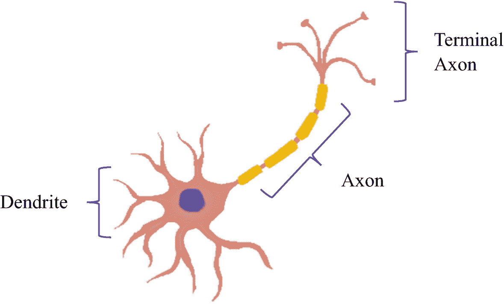

神经元。有主要的短分支，标记为树突。单个长分支标记为轴突。轴突的最终分支标记为末梢轴突。

图 5-1

生物神经元的表示。树突连接到其他末梢轴突，通过神经元之间的连接形成信号可能传递的通道

这些神经元之间形成连接，其中树突寻求与末梢轴突的连接。一旦这些连接，称为 *突触*，建立起来，信号就可以根据它从连接的其他神经元接收到的输入信号在单个神经元中传递。图 5-2 展示了两个神经元之间的连接。

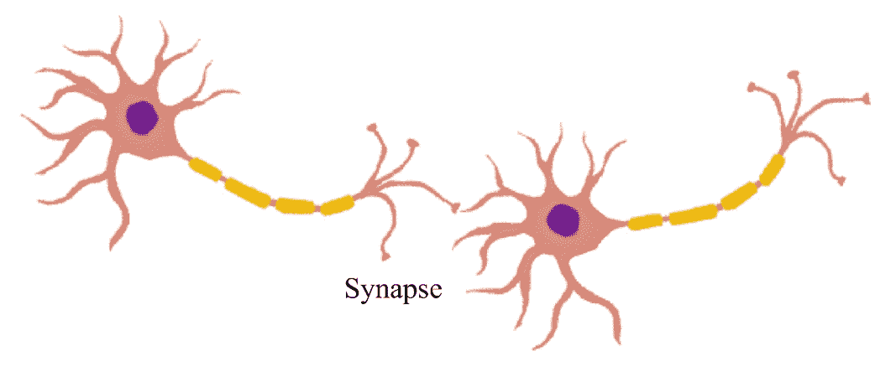

两个神经元的插图。第一个轴突的末梢分支与第二个神经元的树突相连接。

图 5-2

两个神经元之间的连接，称为突触

突触是两个神经元之间的特殊连接，允许信号从一个神经元传递到另一个神经元。参见图 5-2，当突触前神经元（左侧）放电时，它将信号向外发送到末梢轴突，这个信号被与突触前神经元形成突触的突触后神经元的树突（右侧）拾取。什么决定了神经元是否放电？突触后神经元树突收集的信号输入必须集体通过这个神经元特有的激活阈值，以允许信号传递到其他神经元。

这是对微观层面上真正发生的事情的简化，尽管这足以启发人工神经元背后的原理以及它建立的结构。图 5-3 展示了人工神经元的外观。

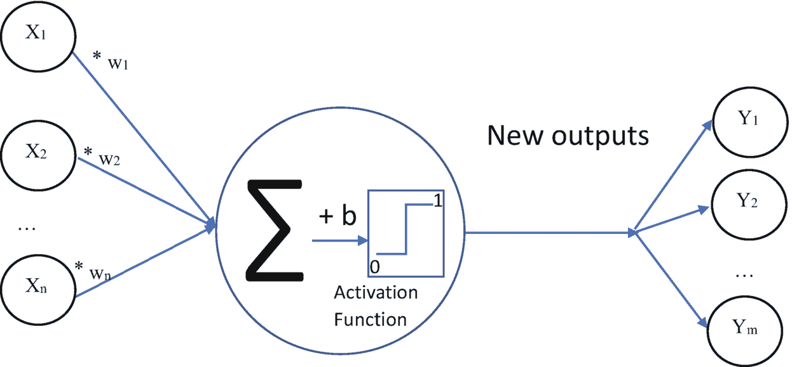

一个示意图说明了人工神经元。在左侧是代表从 x 1 到 x n 的输入的 3 个节点。这些节点根据 0 和 1 处理输入到激活函数中。在右侧是代表新输出的 3 个节点，标记为 y 1, y 2，直到 y m。

图 5-3

人工神经元结构。输入，从 x[1] 到 x[n] 的向量，与权重向量 w[1] 到 w[n] 元素相乘，然后相加。然后将偏置项 b 偏移，结果通过一个“激活函数”，这是一个基于输入的幅度和符号的数学函数，它根据输入的幅度和符号产生输出信号。一个例子是简单的阶跃函数，如果组合输入超过阈值，则输出 1，否则输出 0。这些现在形成了输出，y[1] 到 y[m]。这个 y 向量现在可以作为另一个神经元的输入

如图 5-3 所示，人工神经元接收一个长度为 n 的向量 X，将其与一个长度为 n 的向量 W 元素相乘，将偏置常数 b 加到每个元素上，然后通过激活函数。在这种情况下，激活函数是简单的 1，如果组合输入 X•W+b 超过阈值，否则为 0。这里的 • 代表 *点积*。简写形式是 Wx + b，也称为 *仿射变换*（它是一般形式 Ax + b）。

从数学的角度来看，作为复习，图 5-4 展示了点积是什么。

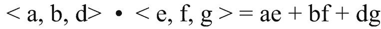

点积的表达式如下。向量 a, b, d 与向量 e, f, g 相乘等于 a e 加上 b f 加上 d g。

图 5-4

向量 < a, b, d> 与向量 < e, f, g> 的点积

图 5-5 以矩阵形式展示了这一点。

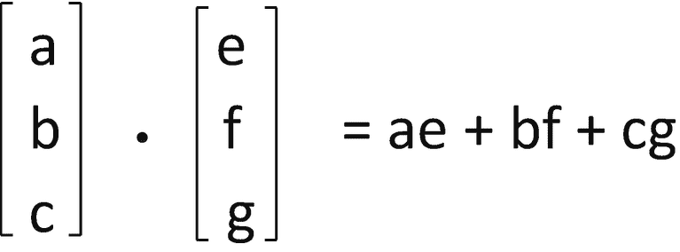

点积乘法的矩阵形式。一个由 a, b, c 组成的单列矩阵与一个由 e, f, g 组成的单列矩阵相乘，得到 a e 加上 b f 加上 c g。

图 5-5

图 5-4 以不同的格式显示，以类似于矩阵的形式。

从数学上讲，整个操作可以总结为如图 5-1 所示。

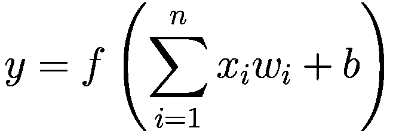

***方程 5-1.*** 表示人工神经元结构的公式**。在这里，f()是激活函数的抽象**

现在你已经知道了人工神经元的样子以及它是如何工作的，让我们深入探讨激活函数是什么以及为什么使用它们。

### 激活函数

激活函数是将输入信号映射到某种形式的输出信号，以便后续神经元进行解释的一种方式。如果你不使用激活函数（有时称为“线性激活函数”），那么仿射变换的输出只是神经元的最终输出。

然而，我们想要模拟超出线性建模范围的复杂函数，因此我们想要使用一个将输入映射到某些非线性空间的非线性激活函数。此外，大多数任务和数据都是非线性的，所以如果我们将这些输入映射到线性空间，我们将会严重欠拟合。此类非线性激活函数的例子包括 sigmoid 和双曲正切。

使用非线性激活函数的另一个原因是，如果我们只使用线性激活函数，即使我们有一个深度神经网络，它实际上也只会变成单层。神经网络是一系列线性变换。这个线性变换的序列本身可以用原始输入重写，只进行一次线性变换。

让我们从**sigmoid**激活函数开始，这是一种简单引入非线性方法。如果你想知道如何生成本节中展示的图表，请跟随本节中的笔记本[`https://github.com/apress/beginning-anomaly-detection-python-deep-learning-2e/blob/master/Chapter%205%20Introduction%20to%20Deep%20Learning/chapter5_activation_functions.ipynb`](https://github.com/apress/beginning-anomaly-detection-python-deep-learning-2e/blob/master/Chapter%205%20Introduction%20to%20Deep%20Learning/chapter5_activation_functions.ipynb)。

Sigmoid 函数的公式显示在方程 5-2 中。

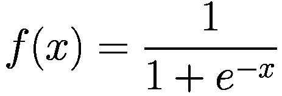

***方程 5-2.*** Sigmoid 函数的公式*

这是一个非线性函数，这意味着它不能通过尝试画线来击中所有点来充分建模。图 5-6 显示了 sigmoid 图形的样子。

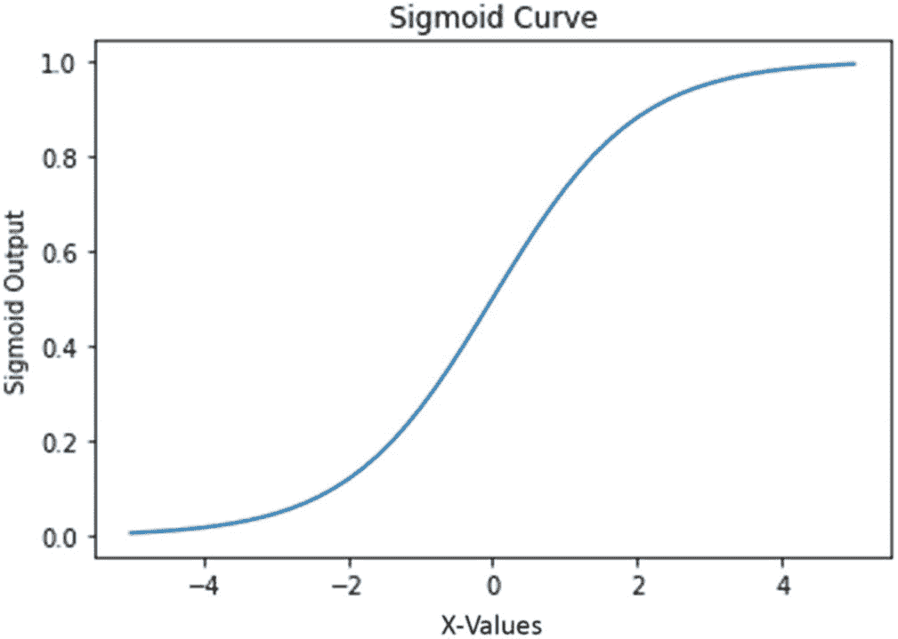

线图绘制 sigmoid 输出与 x 值的关系。曲线通过以下点：（负 4，0），（负 2，0.1），（0，0.5），（2，0.9），（4，1）。数值为估算值。

图 5-6

Sigmoid 函数的图像。输入值被映射到范围 (0, 1) 内。输入域接受任何和所有的 x 值，但非常大或非常小的 x 值分别趋近于 1 或 0。

如图 5-6 所示，sigmoid 激活函数将其输入映射到范围从 (0, 1) 的曲线输出，函数在其中心附近变化最快。正因为如此，sigmoid 激活函数非常适合用于建模概率分数；例如，“这张图片是狗的概率是多少？”

因此，sigmoid 适合在神经网络的最末端使用，将最后一层的原始输出映射到概率分数。sigmoid 也可以用作中间激活函数，用于网络的不同非输出层。

话虽如此，使用 sigmoid 也有一些问题：

+   **梯度消失**：图像两端的梯度将非常小。神经网络使用梯度来更新其参数，因此微小的梯度会导致微小的更新，从而减慢学习过程，甚至在极端情况下停止。

+   **非零中心**：输出空间本身不是零中心。这对神经网络总体上有几个影响：

    +   **关闭“神经元”**需要负权重且幅度大，以输出接近零。权重通常应该幅度较小，以便模型稳定。否则，神经元输入幅度较大时，可能会过度激活或过度失活神经元，而它本不应该这样做。

    +   **接近零的输入仍然传递信号**，因为如果 x 为零，输出仍然会是 0.5。如果激活函数以零为中心，那么零输入也会产生零输出。结合前一点，如果关闭一个神经元需要权重的大小很小且输入本身接近零，这对模型来说既高效又稳定。

    +   **神经元输出将有自己的分布**，这意味着后续层将不得不在整个训练过程中不断学习前一层的激活输出分布，因为权重在更新。这被称为 **内部协变量偏移**，这无疑是 sigmoid 激活函数的一个潜在问题。

    +   **Zig-zag 梯度更新**。我们通过找到损失函数相对于同一权重的梯度来更新一个权重。在一个具有后续 sigmoid 层的神经网络中，每一层的输入将始终为正，包括梯度。因此，最终梯度步骤的方向完全取决于损失函数相对于输出的梯度。这导致梯度步骤倾向于呈之字形，导致优化效率低下，以及可能收敛性较差。

        由于输出空间以零为中心，这个问题在很大程度上得到了解决，因为激活输出现在可以是正的或负的。由于最终梯度的符号不再仅取决于相对于输出的损失梯度，梯度步可以更加直接，不会像以前那样振荡。

+   **计算成本高**：由于指数运算，sigmoid 函数本身可能有点计算成本高。与简单的激活函数（如我们很快将要介绍的 ReLU）相比，它可能会稍微减慢训练速度。

在实践中，sigmoid 并不是在神经网络层中使用的好激活函数，尽管它作为最终层激活函数来预测概率分数是有用的。你可以有一个单一输出（异常的概率）或者有多个输出类别，每个类别都携带一个概率分数（例如，给定健康指标，疾病 X 的概率，疾病 Y 的概率）。

然而，由于不是以零为中心，这导致了许多问题，因此让我们看看一个类似的以零为中心的函数：双曲正切（**tanh**）函数。其公式由方程 5-3 给出。

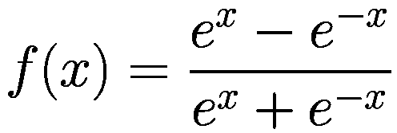

**方程 5-3.** 双曲正切函数的公式

tanh 图像与 sigmoid 图像非常相似，但有一些不同，如图 5-7 所示。

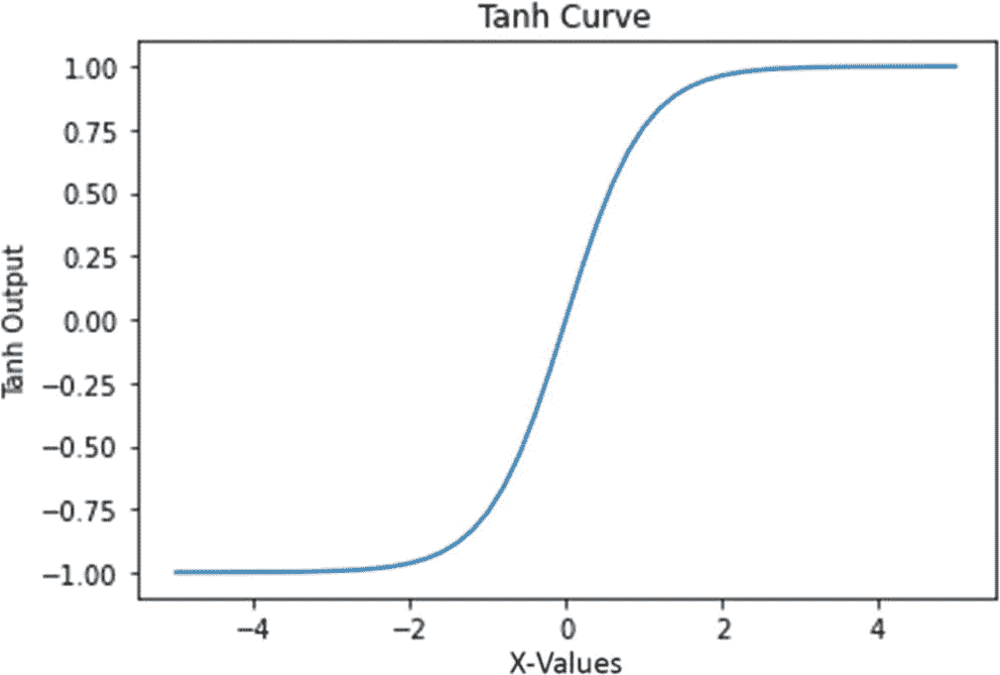

一条线图绘制了 tanh 输出与 x 值的关系。曲线通过以下点：（负 4，0），（负 2，0），（0，0.5），（0，0），（2，1），（4，1）。值是估计的。

图 5-7

双曲正切函数的图像。输入值被映射到输出范围（-1, 1）。当 x 值非常大或非常小时，分别接近 1 或-1。

如图 5-7 所示，tanh 图像以零为中心，并且关于原点对称。由于以零为中心，tanh 相对于 sigmoid 具有以下优势：

+   **没有锯齿形更新**：由于激活输出现在可以是正的或负的，梯度更新不会锯齿形。后续层现在有正负输入，因此层内梯度不再仅是正的。

+   **更好的分布**：以零为中心意味着神经元输出的分布更接近于零的均值，与 sigmoid 不同。与 sigmoid 相比，输出现在在一个更一致的尺度上，尽管内部协变量偏移仍然是潜在问题。均值可能接近零意味着后续层不需要持续学习偏移，因此学习变得更加稳定。

+   **接近零的输入具有接近零的输出**：由于 tanh 的这一特性，关闭神经元变得非常简单，无需使用非常大的权重将输入 x 值转换为非常负的值，以便输出接近零的值，就像 sigmoid 的情况一样。

虽然 tanh 并不完美，但从实际应用的角度来看，将其用作隐藏层激活函数比使用 sigmoid 更可取。然而，tanh 仍然存在梯度消失的问题，因为如果 x 输入的幅度非常大，那么相应的梯度将几乎为零，这可能会阻碍学习。有一些处理这种问题的策略，但在实践中，有更多更适合的激活函数被更频繁地使用。其中一个例子是修正线性单元，或称为**ReLU**。

ReLU 激活函数非常简单且计算高效。其公式在公式 5-4 中给出。

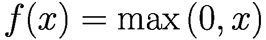

***公式 5-4.*** ReLU 激活函数。由于没有涉及指数函数，它非常计算简单，只需直接比较 x 和 0*

ReLU 的结果图如图 5-8 所示。

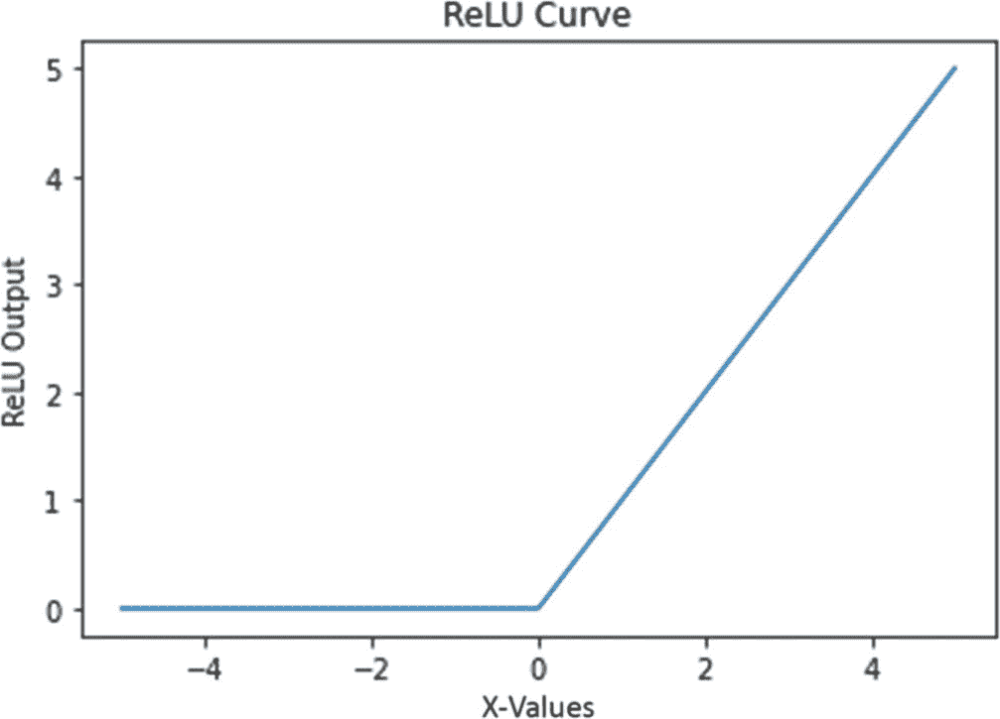

线性图绘制了 ReLU 输出与 x 值曲线的关系。曲线通过以下点：(负 4, 0)，(负 2, 0)，(0, 0)，(2, 2) 和 (4, 4)。

图 5-8

ReLU 激活函数的结果图。对于 x 值大于 0 的情况，结果是线性函数，但低于零时，输出被映射到零。ReLU 裁剪了负的输出

虽然这可能看起来有些反直觉，ReLU 也引入了非线性。这与它截断低于某个阈值以下的输入有关，创建了可以组合成复杂非线性输出的线性部分。当与许多其他 ReLU 激活函数一起使用时，无论是从网络的宽度（层中的神经元数量）还是深度（层数）来看，神经网络都能以比 tanh 更计算高效的方式学习近似非线性函数。

为了演示这一点，我们将通过一个具有手动设置权重的神经网络进行正向传递计算，以展示网络最终如何组合成一个复杂、非线性的函数。这个函数可以用作分类任务的决策边界，或者回归任务的回归。如果您想跟随代码，可以在[`github.com/apress/beginning-anomaly-detection-python-deep-learning-2e/blob/master/Chapter%205%20Introduction%20to%20Deep%20Learning/chapter5_relu_keras.ipynb`](https://github.com/apress/beginning-anomaly-detection-python-deep-learning-2e/blob/master/Chapter%205%20Introduction%20to%20Deep%20Learning/chapter5_relu_keras.ipynb)找到笔记本。您将遇到尚未正式介绍过的代码，例如 Keras 神经网络代码——Keras 建模将在本章后面介绍。

让我们探索一个有两个隐藏层（位于输入层之后，最终输出层之前）的神经网络。总共，网络有四层深度。

为了证明 ReLU 可以产生非线性输出，我们将手动计算数据通过网络中每一层的正向传递，并观察相应的输出。然而，图 5-9 也显示了训练好的网络在输入数据上的结果。

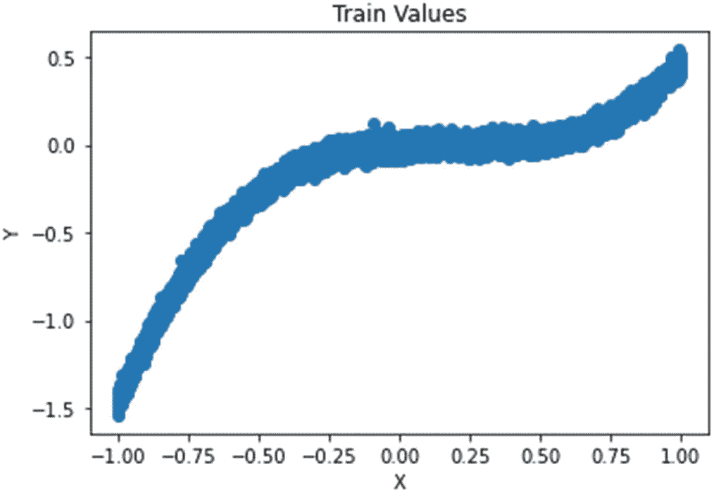

一个标题为“训练值”的图表，绘制了噪声数据中 y 与 x 的关系。曲线穿过以下点：（负 1，负 1.5），（负 0.75，负 0.75），（负 0.5，负 0.25），（负 0.25，0），（0，0），（0.25，0），（0.5，0），（1，0.5）。数值为估算值。

图 5-9

表示任意选择的多项式 0.9x³ – 0.5x² + 0.07x 的噪声数据。我们添加噪声是为了使网络逼近这个函数的任务更加困难，因为它被迫进行泛化而不是拟合噪声

在第一次传递之后，由公式 5-5 中的计算总结，我们看到如图 5-10 所示的输出。

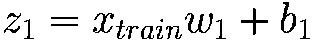

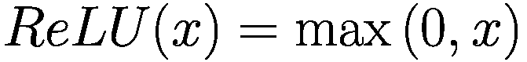

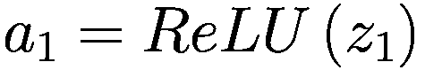

***公式 5-5.*** 一组代表第一次传递计算的方程。在这里，z*[*1*] 代表第一层的原始输出，而 a*[*1*] 代表经过 ReLU 激活函数后的输出

图 5-10 显示了激活输出以及原始输出。

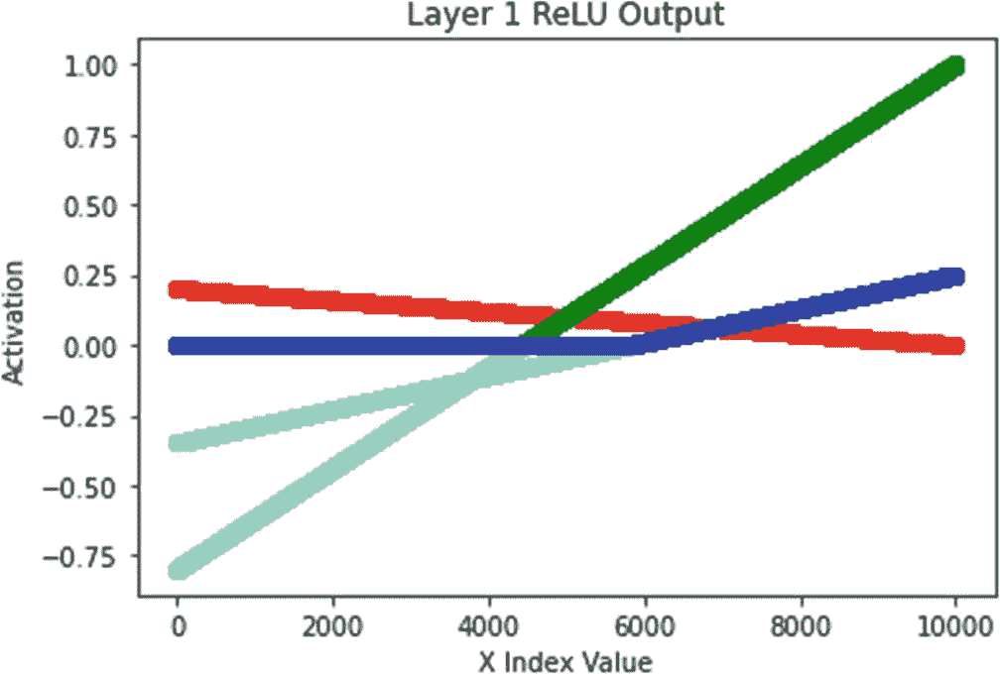

标题名为“层 1 ReLU 输出”的折线图显示了激活值与 x 索引值的对应关系。它绘制了 3 条线。第 1 条线（4000, 0），（6000, 0.25），（8000, 0.75），（10000, 1）。第 2 条线（6000, 0），（8000, 0.15），（10000, 0.25）。第 3 条线（0, 0.25），（4000, 0.2），（8000, 0.05），（10000, 0）。数值为估算值。

图 5-10

这里展示了原始层输出和 ReLU 输出。ReLU 输出以较深的颜色显示。原始输出也以较浅的颜色绘制，以显示它们被 ReLU 截断的情况。任何小于零的值都被设置为零。

如你所见，最初，所有原始输出都是线性的。ReLU 操作将任何小于零的值设置为零，留下较暗的部分。这些是剩余的线性片段，它们将成为下一层的输入。

方程式 5-6 展示了下一层的计算过程。

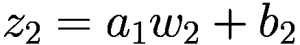

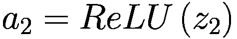

***方程式 5-6.***下一层的计算过程。它取前一层激活后的输出，并将其作为输入。

回想一下，一个神经元通过其输入的加权和并偏移一个偏置向量来工作。这意味着下一层神经元的原始输出应该是前一层 ReLU 输出的某种组合。图 5-11 说明了这一点。

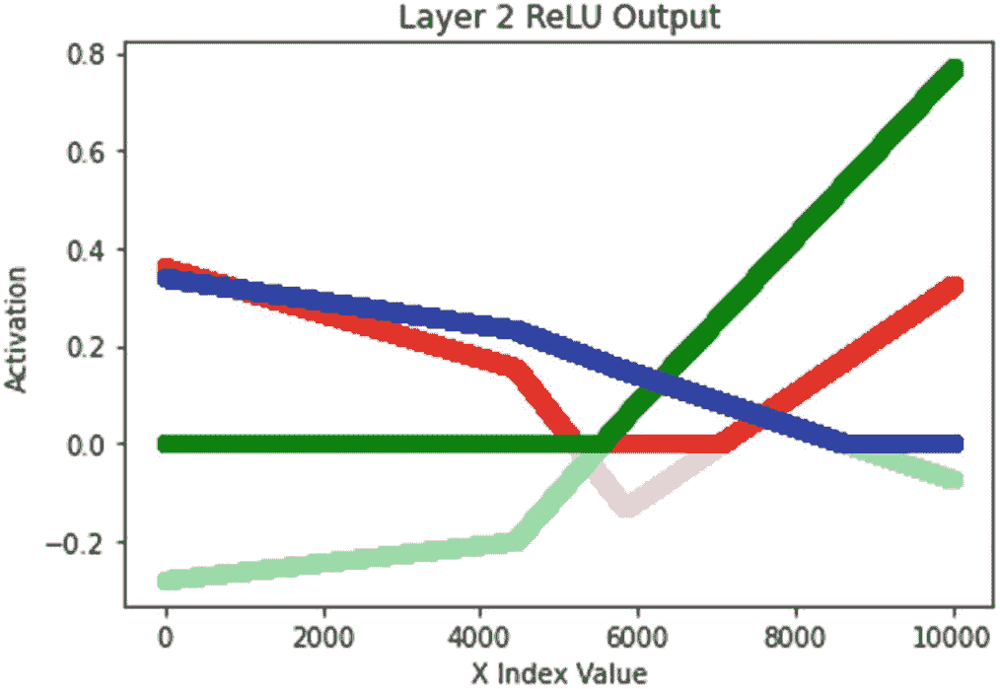

标题名为“层 2 ReLU 输出”的折线图显示了激活值与 x 索引值的对应关系。第 1 条线（0, 0.4），（4000, 0.3），（9000, 0）。第 2 条线（10000, 0.8），（8000, 0.6），（2000, 0）。第 3 条线（0, 0.4），（4000, 0.2），（8000, 0.1）。数值为估算值。

图 5-11

网络中第二层的 ReLU 输出和原始输出。注意它不再呈现线性。如果你跟随笔记本中的代码，你可以看到层 2 的红色输出是层 1 红色输出的 2.3 倍，绿色输出的-0.9 倍，蓝色输出的 5.3 倍，并且整体偏移量为-0.1。

输出不再呈现线性。图 5-12 展示了第三层的输出情况。提醒一下，所有权重都是手动设置的，只是为了说明 ReLU 函数如何组合以创建非线性输出。

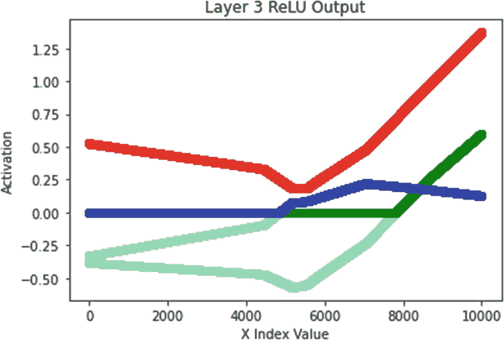

标题名为“层 3 ReLU 输出”的折线图显示了激活值与 x 索引值的对应关系，如下所示。第 1 条线（0, 0.5），（2000, 0.45），（6000, 0.25）。第 2 条线（0, 0），（4000, 0），（7000, 0.25），（10000, 0.15）。第 3 条线（5000, 0），（8000, 0），（10000, 0.6）。数值为估算值。

图 5-12

第三层的原始输出和激活输出

最后，图 5-13 展示了输出层的原始输出。在这种情况下，输出层没有激活函数。

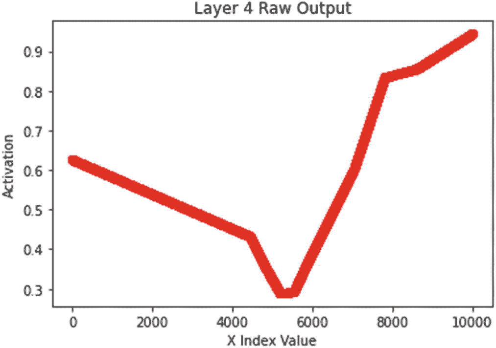

一条线图，标题为“第 4 层原始输出图”，显示激活值与 x 索引值的对应关系。曲线经过以下点：(0, 0.64)，(2000, 0.52)，(4000, 0.45)，(6000, 0.35)，(8000, 0.85)，(10000, 0.9)。数值为估算值。

图 5-13

最终层的输出，它将三个神经元输出合并成一个单一输出

在回归背景下，网络的任务是根据输入数据近似一个函数，图 5-13 展示了它如何学习一个非线性函数。图 5-13 并非旨在近似图 5-9，而是作为示例的一部分被创建，以展示 ReLU 在保持与 tanh 相比非常高的计算效率的同时，其灵活性。

这就是 ReLU 为什么是一个如此好的激活函数的原因。不仅 ReLU 操作以及求导的计算效率更高，而且它还能作为非线性函数，使网络能够学习复杂函数。因此，ReLU 在实际情况中经常被使用也就不足为奇了。ReLU 有一些变体，如 LeakyReLU，它们不是将负值裁剪为零，而是允许一个非常小的信号通过。无论如何，ReLU 都是训练网络时的一个很好的起点。

与 tanh 相比，使用 ReLU 有以下优点：

+   **没有梯度陷阱**。在图形的任何极端处，梯度不再变得非常小，就像在 tanh 中那样。ReLU 中，梯度在 ReLU 为正的地方是 1，否则为 0。

+   **计算效率高**。没有指数需要计算。它是一个简单的掩码，将任何非正值设置为零。

然而，也有一些可能的缺点：

+   **爆炸输出**. ReLU 在其正上界没有上限。这意味着激活输出可以非常大，并可能导致整个网络不稳定，从而引起发散。这可以通过适当的初始化技术（如 Kaiming He 初始化）在一定程度上得到缓解，以保持学习更加稳定，但仍然存在可能性。

+   **死亡 ReLU**。由于输入小于零的梯度仅仅是零，产生这种输出的神经元不会得到更新。这可能导致许多“死亡”的神经元不再更新，从而导致网络效率低下。He 初始化可以帮助稳定网络以对抗死亡 ReLU，但它并不能完全解决这个问题。

+   **非零中心**。与 sigmoid 类似，值和梯度始终为正，这意味着可能会采取锯齿形的优化步骤。

然而，ReLU 的修改版本，如 LeakyReLU，可以帮助缓解，因为它们允许一些负输入通过（通过 max(0.01x, x)而不是像常规 ReLU 中的 max(0, x)），有助于缓解锯齿形梯度步骤以及死亡 ReLU 问题。

话虽如此，图 5-14 展示了一个简单的神经网络使用 tanh 激活函数近似图 5-9 真实函数的例子。

每个网络都使用 128 个批次的 50 个时期进行训练。如果你不知道这些参数的含义，不必担心；你只需要知道这两个网络具有相同的架构，并且在相同的设置下进行了训练。唯一的区别是，一个网络使用 tanh 作为其激活函数，而另一个网络使用 ReLU。

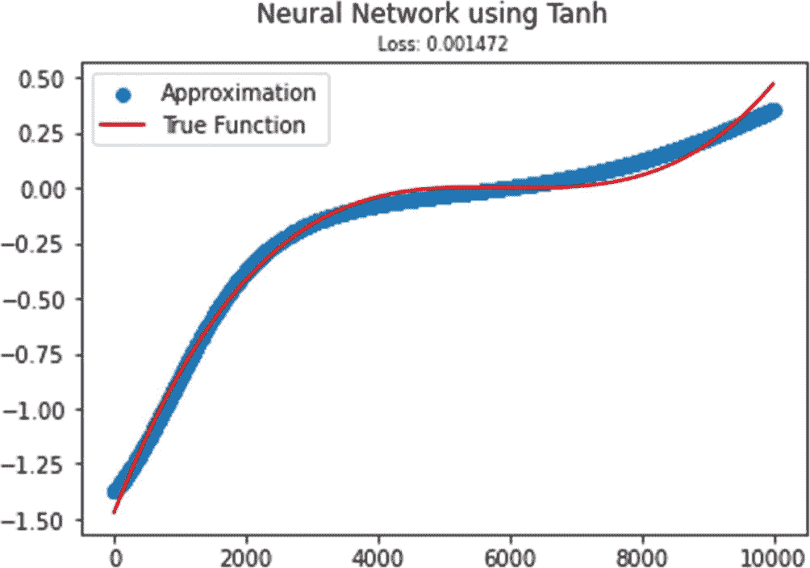

一条名为“使用 tanh 的神经网络”的线形图显示了近似函数曲线和真实函数曲线。曲线通过以下估计点。近似值（0，-1.25），（2000，-0.25），（6000，0）。真实函数（0，-1.5），（2000，-0.25），（8000，0），（10000，0.5）。

图 5-14

使用 tanh 作为激活函数的 Figure 5-9 数据的输出近似。

虽然它不是完美的拟合，但已经很接近了。让我们将这个输出与使用 ReLU 训练的神经网络进行比较，如图 5-15 所示。

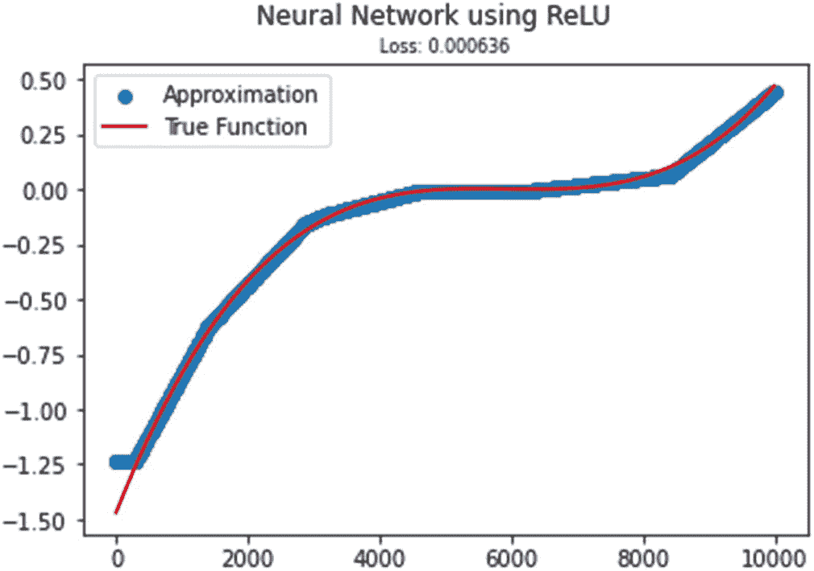

一条名为“使用 ReLU 的神经网络”的线形图显示了近似函数曲线和真实函数曲线。曲线通过以下点。近似值（0，-1.25），（2000，-0.5），（4000，0）。真实函数（0，-1.5），（2000，-0.5），（8000，0），（10000，0.5）。

图 5-15

使用 ReLU 作为激活函数的 Figure 5-9 数据的输出近似。注意你可以看到由线性部分组成的部分。它比图 5-14 中显示的平滑 tanh 曲线要粗糙得多，但这个输出在计算上更高效，计算速度更快。

最后，还有一个名为 `softmax()` 的激活函数，这是需要了解的重要函数。`softmax()` 的公式在公式 5-7 中展示。

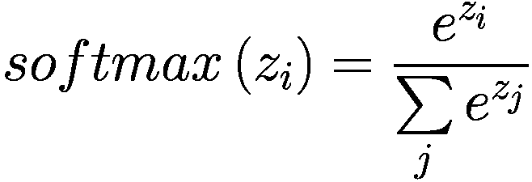

***公式 5-7.*** `softmax()` 的公式。它将某个实数值向量转换为实数值向量，其和为 1。这使得它非常适合创建一个概率分布，该分布表示由向量表示的特定输出空间。

公式 5-7 展示了如何为向量 z 的第 i 个元素获得一个 `softmax()` 分数。

`Softmax()` 具有将输入向量（其和为某个任意数）转换为输出向量的特性，该输出向量的条目之和为 1。这使得输出向量非常适合表示概率分布。

在分类任务中，神经网络有一个具有多个神经元的输出层，每个神经元对应一个特定的类别。第一个节点对应类别 0，第 n 个神经元对应 n-1 类。回想一下我们在第二章节中如何对字符串进行分类编码——这正是同一件事。输出神经元对应于某些分类编码的类别。

为了检查 `softmax()` 的工作原理，让我们手动定义一个向量来表示输出层的原始输出。你可能会遇到术语 **logits**，它指的是输出层的原始输出。请参阅图 5-16 以运行 `softmax()` 的示例代码。

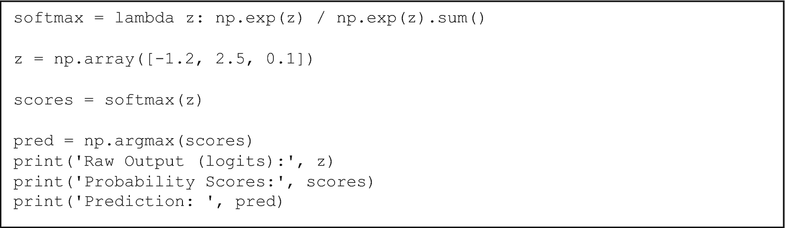

一个代码片段使用 lambda 表达式来初始化变量 z 并计算概率得分和最大概率得分的索引。它打印出原始输出、概率得分和预测值。

图 5-16

模拟 logits（用 z 表示）的代码，`softmax()` 操作以获取概率得分，以及进行预测的逻辑（简单地选择概率最高的类别）

如图 5-16 所示，操作 `argmax()` 返回包含该向量中最高值的索引。在 `softmax()` 输出的术语中，它应该返回包含最高概率得分的索引。你现在应该看到类似于图 5-17 中所示的输出。

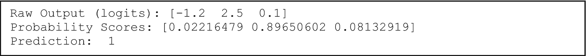

一个代码片段如下所示。原始输出（logits）: 左大括号 -1.2 2.5 0.1 右大括号。概率得分: 左大括号 0.02216479 0.89650602 0.08132919 右大括号。预测: 1。

图 5-17

执行图 5-16 中的代码的输出。预测指的是概率向量中概率值最高的索引。这个索引恰好是索引 1，对应于类别 1，无论它是什么。

`Softmax()` 在任何涉及根据某些输入预测特定类别的分类任务中都非常常用。如果你想为每个类别都有自己的概率分布，这意味着输入可以是多个类别的示例，那么你想要在输出层使用 sigmoid。这是一个称为 *多标签分类* 的任务。在这种情况下，任何概率超过某个阈值的类别都将被视为预测。

现在我们已经涵盖了各种激活函数，让我们直接深入探讨神经网络及其架构。

### 神经网络

现在你已经熟悉了神经元和激活函数，是时候深入挖掘前一部分提到的神经元层了。

神经网络中的一个 **层** 是由一些神经元组成的集合，每个神经元使用整个输入计算某个输出值。一个层的输出由该层中所有神经元的输出值组成。神经网络是一系列神经元层，其中一层的输出是下一层的输入。

如前所述，在 ReLU 的上下文中，神经网络的第 1 层是**输入层**，它接收训练数据作为输入。网络的最后一层是**输出层**，它输出用于预测网络被训练执行的任务的值。所有介于输入层和输出层之间的层被称为**隐藏层**。

图 5-18 显示了从层的角度看神经网络的外观。

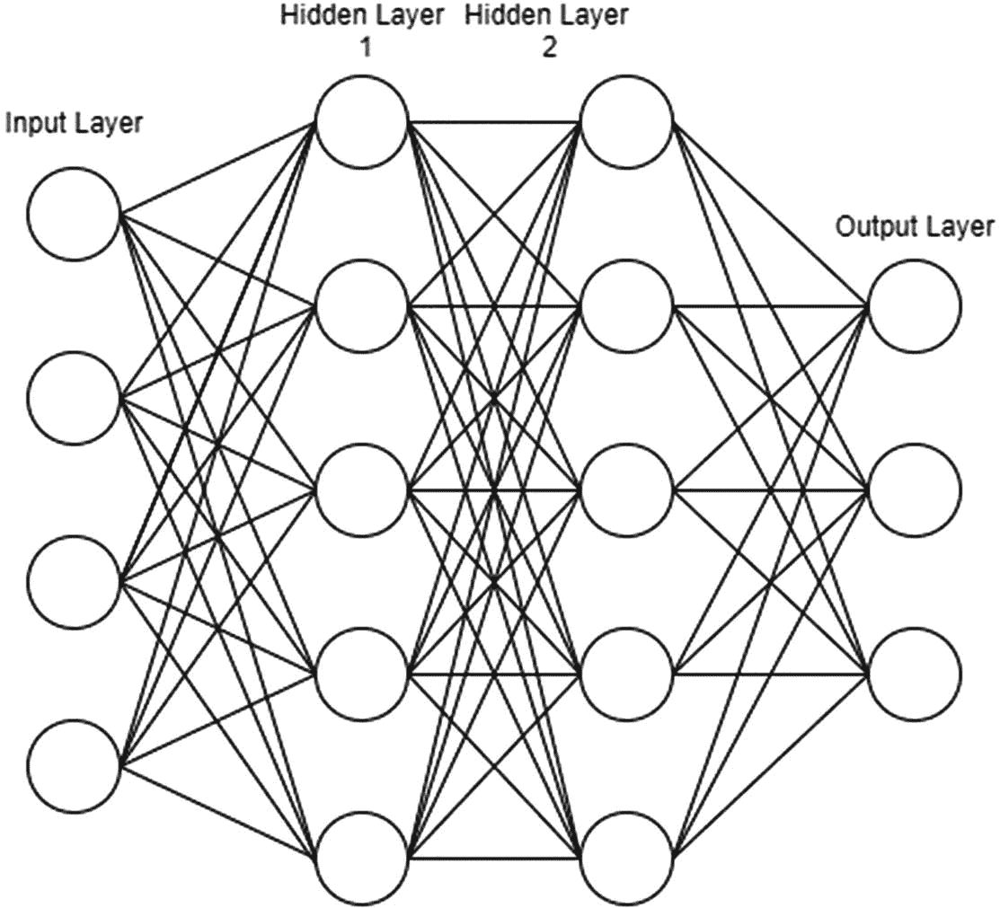

一个示意图表示了神经网络架构。它有相互连接的节点，从左到右分别代表输入层、隐藏层 1、隐藏层 2 和输出层。

图 5-18

具有两个隐藏层的神经网络架构。每个神经元都与前一层的神经元以及后一层的神经元完全连接。

从数学意义上讲，整个网络是一系列链式矩阵乘法操作，并对它们应用激活函数。参考方程 5-5 和 5-6 来了解层计算是如何从数学上计算的。我们使用符号 z[L]表示层 L 的仿射变换输出，a[l]表示使用 z[L]作为输入的激活函数输出。现在 a[L]是层 L+1 的输入，成为 z[L+1]，然后是 a[L+1]。

当数据从最左侧层流向最右侧层时，这被称为**正向传播**。换句话说，正向传播是从某个给定输入计算最终输出的过程。

**反向传播**涉及从最右侧层逐层移动到最左侧层，使用反向传播算法来计算梯度。**反向传播**，简称“误差反向传播”，通过使用链式法则来避免重新计算所有中间项，从而计算每个层的可学习参数的梯度。由于这些过程相互关联，这两个术语有时可以互换使用。然而，区别在于反向传播严格上是逐层反向通过网络的过程，而反向传播（在反向传播中使用）是计算梯度的过程。

一旦计算完所有梯度，就会进行更新可学习参数的优化步骤。我们将在本章的“梯度下降和反向传播”部分中稍后讨论这一点。

现在我们来看数据在正向传播过程中如何通过网络，通过回顾图 5-18 在分类的上下文中的内容，从而产生输出预测。三个输出节点分别对应输出类别 0、1 和 2，分别代表“狗”、“猫”和“鸟”。假设输入数据，尽管在这种情况下只有四个节点宽，是狗、猫或鸟的图像的高度压缩表示。

为了说明，以下图示中假设使用的激活函数是 Sigmoid 函数，激活强度最大的神经元用黑色表示（激活输出接近 1），而激活强度最小的神经元用白色表示（激活输出接近 0）。激活强度更强的神经元会将信号传递到下一层，而激活强度很弱的神经元则不会将信号传递到下一层。

至于权重本身（由连接两个层之间神经元的线条[边]表示），与非常强的权重对应的边用粗线表示，而与较小权重对应的边用细线表示。边上的权重“强度”是以幅度来衡量的。粗线边上的权重可以是强烈负的或强烈正的。

记住，一个神经元与前一层的每个神经元都是全连接的，并且将为这些连接中的每一个分配不同的权重。如果前一个神经元的激活很可能激活后一个神经元，这两个神经元被认为有强烈的连接，这通过连接这两个神经元的边上的较高权重来表示。相反的情况也是真实的，你会在连接两个神经元的边上看到较低的权重，其中前一个神经元的激活很少导致后一个神经元的激活。

假设某个任意神经元很少激活，除非输入数据代表狗。在这种情况下，我们还假设该神经元激活得很强。那么，连接这个神经元到下一层的权重可能因为该神经元激活对输出预测的显著影响而具有较大的幅度。

不幸的是，神经网络如何“理解”输入数据并对其进行解释，在不同架构之间甚至相同架构的不同实例之间都可能有所不同。由于连接数量众多，神经网络的可解释性极差，因此它们通常被视为一个黑盒。当网络做出决策时，我们不知道确切的原因，只知道经过一个包含多达数百万个精心调整的参数的网络的前向传递后，我们得到了一个特定的预测。这与可以告诉我们为什么做出决策的决策树形成对比。此外，重要的是不要将神经网络拟人化，因为它们基本上是大型数学函数，将输入映射到输出。

话虽如此，以下图示仅供参考——它们旨在对神经网络中真正发生的事情进行粗略简化。理解神经网络如何做出决策的现实远比这复杂得多，并且是一个活跃的研究领域。

图 5-19 显示了第 1 层，即输入层的初始数据转换。

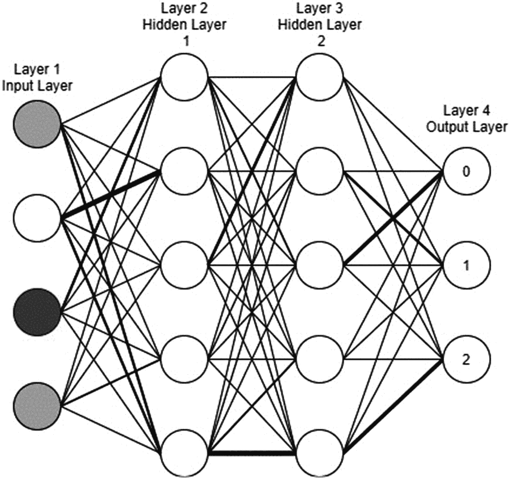

一张示意图展示了神经网络架构。网络由 4 层组成。从左到右，这些是输入层、隐藏层 1、隐藏层 2 和输出层。输入层有 1 个非阴影节点和 3 个阴影节点，代表 4 个输入。输出层产生 3 个输出，0、1 和 2。

图 5-19

输入数据刚刚被第 1 层，即输入层处理，信号尚未传播到第 2 层。表示为粗线的边表示在训练这个网络的过程中，这些连接被加强以具有更高的权重，因为前一个神经元的激活对于正确确定输出类别很重要。

参考图 5-19，我们可以看到在输入层中，一个神经元激活不多，而两个神经元轻微激活（激活值约为 0.5）。一个神经元的激活更高，约为 0.8。这些信号将传播到下一层，后续的神经元将根据输入的加权组合以及后 Sigmoid 输出而触发。

如图 5-20 所示，下一层的神经元根据它们各自的权重和后 Sigmoid 激活而激活。第 2 层的输出现在将成为第 3 层的输入，第 3 层将根据它们各自的权重和偏差触发，如图 5-21 所示。

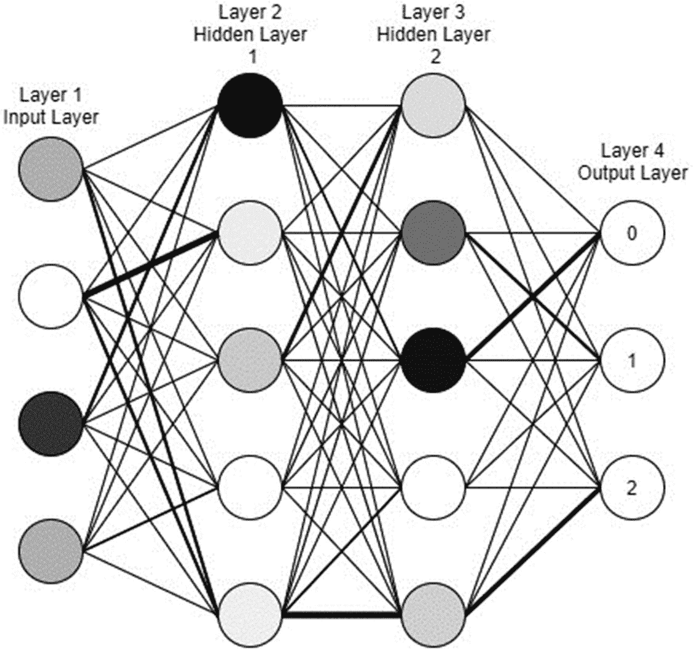

一张示意图展示了神经网络中相互连接的 4 层。输入层 1、隐藏层 1 和隐藏层 2 正在处理输入。产生的输出是 0、1 和 2。

图 5-21

第 3 层的神经元根据它们的加权和和 Sigmoid 激活而触发。这些信号现在将由输出层解释以生成概率分数。

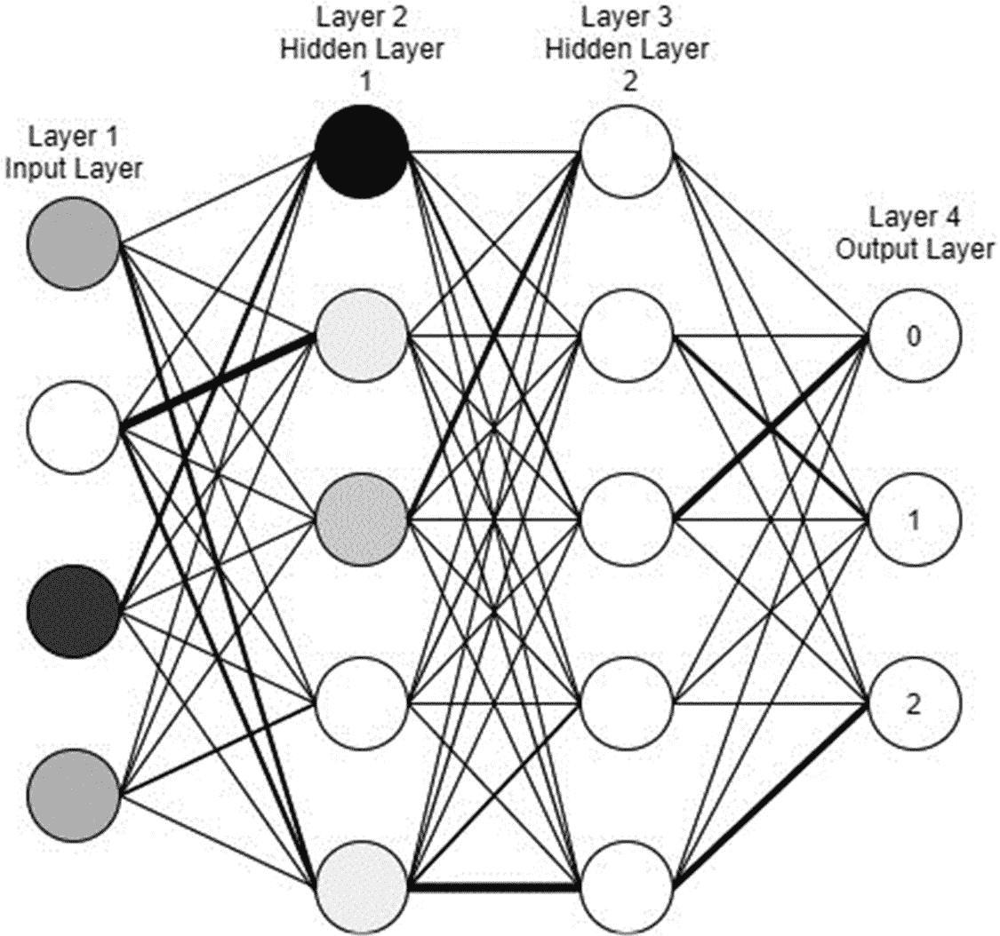

一张示意图展示了神经网络中相互连接的 4 层。第 1 层和隐藏层 1 正在处理输入，而隐藏层 2 没有。产生的输出是 0、1 和 2。

图 5-20

信号已经传播到下一层，即第 2 层，并且根据输入的加权和（权重可以是正的或负的，因此粗边可以是一个强烈的负连接）以及后 Sigmoid 激活输出而触发。

如图 5-21 所示，输入信号已经传播到输出层之前。输出层具有`softmax()`激活函数，因此其激活值之和应该为 1，因为`softmax()`使得输出层成为一个概率分布。参考图 5-22 以了解网络如何做出最终预测。

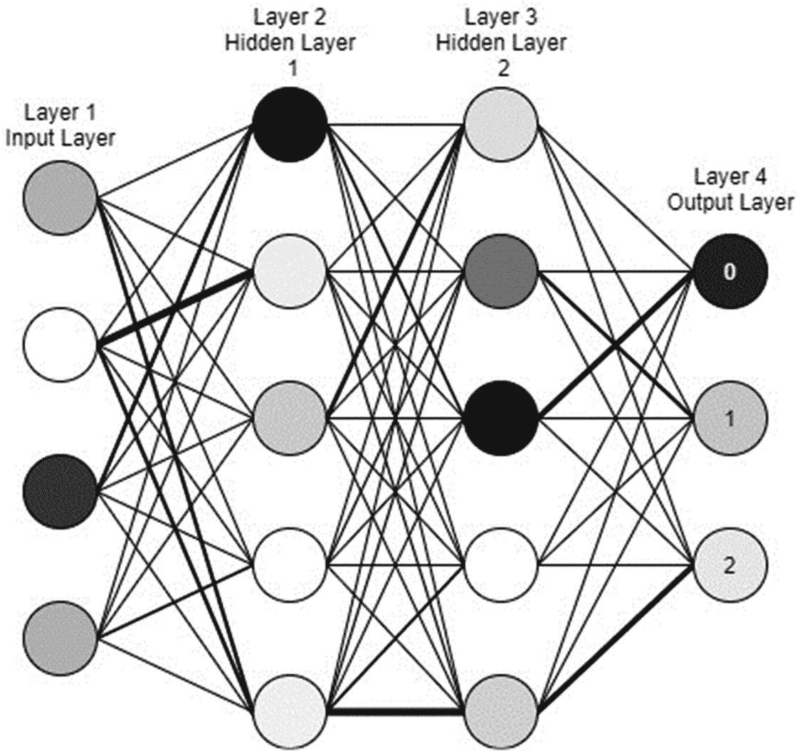

一张示意图展示了神经网络中相互连接的 4 层。输入层、隐藏层 1、隐藏层 2 和输出层中的节点都被阴影覆盖。输出层有 3 个阴影节点，分别标记为 0、1 和 2。

图 5-22

最终预测被做出，输出层为每个类别输出概率分数。代表类别零的神经元具有大约 0.75 的最高概率。其他两个神经元的概率要低得多，两者相加总和为 0.25。解释网络做出的预测的方法是取具有最高概率的神经元的索引（使用 `argmax()`）。在这种情况下，索引为零的输出神经元具有最高的概率，因此模型对输入的预测将是类别零。

如图 5-22 所示，这是给定输入导致输出预测为零的激活序列。在反转分类编码后，我们发现与编码值为零的关联标签是“狗”。

现在你已经对神经网络的工作方式有了更好的了解，让我们来介绍损失函数的概念，它决定了神经网络的预测与我们所希望网络预测的真实正确值之间的偏差程度。

### 损失函数

损失函数是一种衡量模型预测与模型应该预测的内容之间偏差的方法。你也许还会看到损失函数被称为**代价函数**。在监督学习设置中，这意味着在回归任务中（预测实值输出与目标实值输出之间的损失）或分类任务中（预测整数输出与目标整数输出之间的损失）测量损失。

预测值与目标值之间的差异可以称为“误差”，任何建模任务的目标是尽可能减少这个误差，使得目标值和预测值在数值上尽可能接近。

让我们从回归损失函数开始。

#### 回归

在回归任务中使用的简单损失函数是**均方误差 (MSE)**。回想一下第三章节中提到的，MSE 损失可以用于机器学习中的回归任务。同样的损失也可以用于深度学习任务。作为提醒，MSE 损失方程在方程 5-8 中展示。


***方程 5-8.*** *是对第 *i* 个数据样本 x[*i*] 的预测，y[*i*] 是我们希望模型要达到的相应真实输出。如果模型做出了完美的预测，MSE 将为 0*

还记得从第三章中提到的其他回归损失函数，例如**平均绝对误差（MAE）**（方程 5-9）、**平均绝对百分比误差（MAPE）**（方程 5-10）等，尽管你选择使用哪种损失函数可能取决于任务的性质和对真实输出偏差容忍度的阈值。

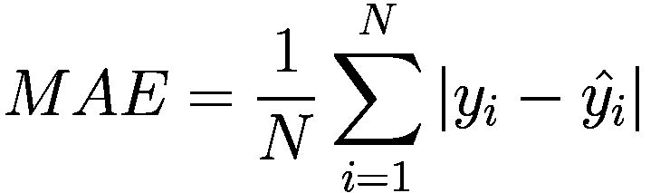

***方程 5-9.***平均绝对误差* *找到预测与真实值之间偏差的平均幅度*


***方程 5-10.***平均绝对百分比误差* *以百分比的形式找到预测与真实值之间的偏差，并取平均值*

你应该使用哪种损失/代价函数取决于任务的精确性质。如果你想更严厉地惩罚预测错误，那么由于损失中的平方成分，MSE 损失函数是一个不错的选择。如果你不希望损失对异常值过于敏感，那么 MAE 损失可能是一个好的误差度量，因为它只测量误差的直接幅度。

如果你只想以相对术语查看错误，那么 MAPE 可能是一个不错的选择，因为它以目标值来衡量误差。这可以更适用于时间序列预测任务，例如，其中幅度误差或平方误差差异可能比百分比误差产生更高的损失。例如，如果你预测股票价格将是 10,100，但实际上是 10,000，你的绝对误差将是 100，你的平方误差将是 10,000。然而，你的百分比误差将是 0.01（1%误差）。

#### 分类

在处理分类任务时，你正在处理离散整数标签，所以这并不像寻找目标和预测之间的数值偏差那样简单。此外，模型输出的是输入示例属于某个类别的实值概率。我们希望将这个概率预测纳入损失中，因为它提供了预测强度的指示。尽管 0.71 和 0.99 四舍五入后都是 1，但后者比前者是一个更强的预测。

再次强调，我们可以从第三章中恢复**交叉熵损失/对数损失**函数。对于一个二元分类任务（只有两个可能的标签，要么是 0 要么是 1），我们可以引入一个类似于方程 5-11 的方程。由于这个损失函数只处理两个类别，它也可以被称为**二元交叉熵损失**。

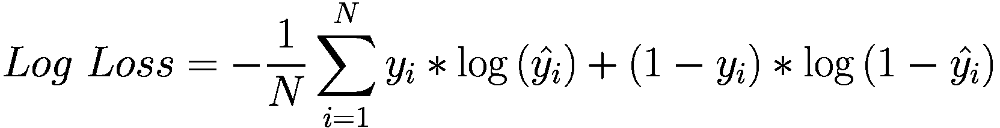

***方程 5-11.*** 在这个损失函数中，y*[*i*] 代表与 x*[*i*]* 对应的第 i 个真实标签（一个离散值，要么是 0 要么是 1），而 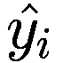 代表模型对输入 x*[*i*]* 输出的概率分数（一个介于 0 和 1 之间的实数值）

然而，我们不仅仅只有两个类别。对于多个类别，我们希望将二元交叉熵损失扩展到一种通用的 **分类交叉熵损失** 函数，该函数能够处理多个类别。

回想一下第二章的内容，**one-hot 编码** 创建了一个除了特定索引处有一个 1 以外其余都是 0 的向量。这个编码中保持 1 的索引值就是整数类别标签。

例如，如果在一个分类任务中有三个类别，那么类别 0 的 one-hot 编码是 [1, 0, 0]，类别 1 的 one-hot 编码是 [0, 1, 0]，类别 2 的 one-hot 编码是 [0, 0, 1]。

在这个背景下，让我们来看一下分类交叉熵的公式。这里将有两个求和：外层求和遍历每个单独的 logits（z）和真实值（y）对。logits 的维度与 one-hot 编码的 y 向量相同。logits 最大值的索引是模型的类别预测。现在参考方程 5-12。

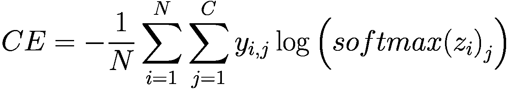

***方程 5-12.*** **分类交叉熵损失**。在这里，y*[*i*] 是与 x*[*i*]* 对应的第 i 个真实值/目标值，即传递进来的第 i 个输入值。z*[*i*] 指的是神经网络在给定 x*[*i*]* 时产生的模型输出 logits（未应用 `softmax()`）。C 代表类的总数，也是每个 y*[*i*] 向量的长度

方程 5-13 展示了没有 one-hot 编码真实标签的分类交叉熵损失。在这种情况下，真实标签只是一个整数标签的数组。这是方程 5-12 的一个简化版本，不需要对真实值进行额外的 one-hot 编码处理。

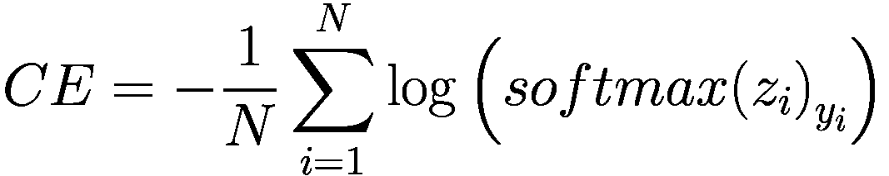

***方程 5-13.*** 方程 *5-12* 的一个更简单、等效的版本。所需的一切只是 logits 在 `softmax()` 后 y 标签索引处的分数

这与方程 5-12 等价，因为仔细观察，y 向量的独热编码将除包含 1 的索引外的求和项设置为 0，因此这些项无论如何都不会对损失函数做出贡献。

现在你已经了解了一些我们将用于回归和分类任务的基本损失函数，让我们深入了解神经网络如何使用损失和计算出的梯度来更新权重和偏差。

### 梯度下降和反向传播

回想一下，神经网络使用梯度更新它们的权重，这些梯度是通过反向传播在反向传递期间计算的。那么，这些梯度是什么，它们是如何精确计算的？要了解本节中生成图形所使用的代码，请参阅笔记本[`github.com/apress/beginning-anomaly-detection-python-deep-learning-2e/blob/master/Chapter%205%20Introduction%20to%20Deep%20Learning/chapter5_gradient_descent.ipynb`](https://github.com/apress/beginning-anomaly-detection-python-deep-learning-2e/blob/master/Chapter%205%20Introduction%20to%20Deep%20Learning/chapter5_gradient_descent.ipynb)。

如果你记得微积分课程，**导数**是函数在特定点相对于单个变量的瞬时变化率。以一个简单的抛物线图形为例，其方程为 y=x²。其导数仅仅是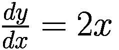。参见图 5-23 以图形方式查看。

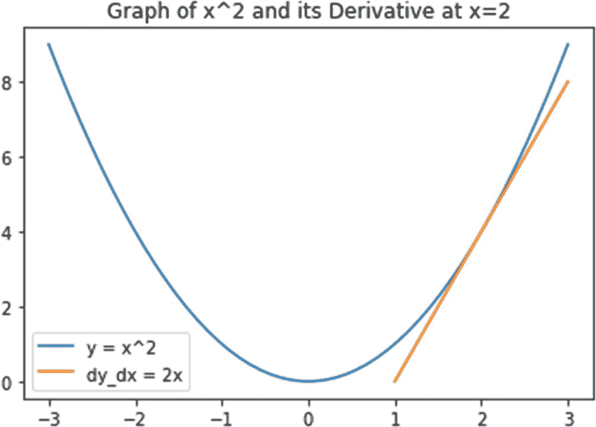

一条线图，标题为“x 平方及其导数在 x 等于 2 时的图形”。该图形绘制了一条曲线，标记为 y 等于 x 平方，以及一条线，标记为 dy/dx 等于 2x，如下所示。曲线（-2.75，8），（-2，4），（0，0），（2，3.5），（2.5，6）。线（1，0），（2，4），（3，8）。值估算。

图 5-23

y=x²的图形及其导数函数，。在 x=y 处的瞬时斜率指向最大值方向，因为斜率是 4。因此，如果我们想找到最小值，我们只需简单地朝相反方向前进，即-4。这将带我们到 x=0 处的最小值。

斜率有一个有趣的性质，它始终指向原始图形上会增加 y 值的方向。例如，在 x=2 处，瞬时斜率（导数的值）是 4。这意味着在 x=2 处，在那个瞬间，y 值随着 x 的 1 个单位增加而增加 4。当我们继续增加 x 时，我们会发现 y 也持续增加。

如果我们观察另一个图形，y = x³ – 5x²，如图 5-24 所示，我们可以看到另一个例子，说明导数指向一个最大化 y 值的方向。

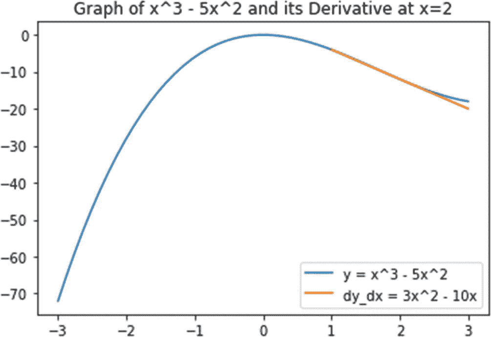

一条线图，标题为“x 的三次方减去 5x 的平方及其在 x 等于 2 时的导数图”，分别绘制了以下曲线。y 等于 x 的三次方减去 5x 的平方曲线（负 3，负 70），（0，0），（1，负 5）。dy/dx 曲线（1，负 5），（2，负 10），（3，负 20）。

图 5-24

方程 y = x³ – 5x²及其在 x=2 处的导数，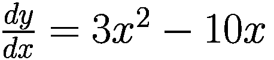。正如我们所见，这一刻的导数是-8。如果我们朝这个方向（左边）移动，我们会看到 y 值的增加，直到它达到 x=0 处的局部最大值。

这次，我们在 x=2 处的导数是-8。这可以解释为 y 的瞬时变化率随着 x 每增加 1 而减少 8，或者 y 随着 x 每减少 1 而增加 8。记住，斜率是 y 的变化量除以 x 的变化量，所以负号可以应用于分子或分母。

在这种情况下，导数“指向”了 x=0 处的图形的局部最大值。这也恰好是图形的全局最大值。

这个定义在二维设置中效果很好，但机器学习问题往往处理的是可以高达数百维的变量。在三维设置以及更高维的情况下，我们可以扩展导数的概念，称之为**梯度**，它现在是一个向量，而不是一个标量值。对于 y = x² + z²，梯度将是 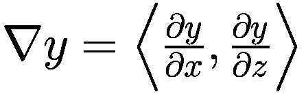，其中*∂*符号表示偏导数。偏导数仅仅是 y 的导数，它是多元的，但只相对于一个变量。现在，正如我们在图 5-25（y = x² + z²的 3D 示例）中看到的那样，同样的原则适用于我们在二维示例中看到的导数。

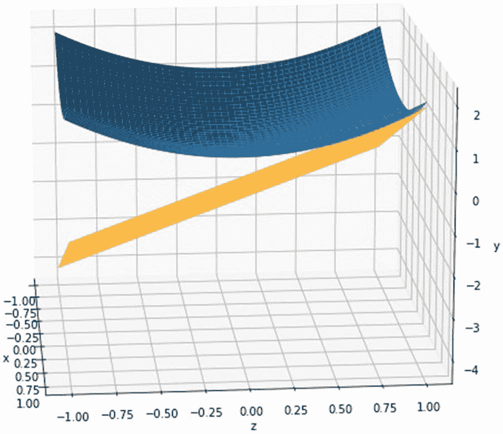

一个 3-D 图表示 y 函数作为一个抛物面区域。切平面表示为一个对角平面。在 x-z 平面上标记了一个点。

图 5-25

一个三维图，描述了 y 函数以及 x=0.75，z=0.75 处的点以及切平面

由于梯度只是导数在更高维度的扩展，因此可以合理地推断，梯度的反方向应该指向最小值。假设我们已经将 x 和 z 的值初始化为 0.75（如图 5-25 中的红色点所示）。假设我们想要找到导致此图中 y 值最小的 x 和 z 值（x=0，z=0），那么从 x=0.75 和 z=0.75 开始，我们应该沿着梯度的反方向迈出一步。步子不要太大，但要小一些，以免超过最小值。我们可以重复这个过程多次，多次采取小步，直到接近最小值，找到使 y 值有效“最小化”的 x 和 z 的值。

我们可以将这个通用的“优化步骤”表述如下，其中梯度是相对于 x 的：

x = x – 步长 * 梯度

**步长**参数控制每次迭代中更新步的大小。在这种情况下，这个步长也可以称为**学习率**。我们将在“优化器”部分详细介绍学习率。

在讨论了基础理论之后，让我们看看我们是否可以将这些应用到简单的 y=mx+b 直线上，并给定一些数据迭代求解 m 和 b。

首先，让我们设置问题。我们想要使用近似  = mx+b（其中 m = 1 和 b = 0 作为初始起始值）来逼近直线 y = 4x + 3。我们将使用的损失是均方误差（MSE）。我们需要找到 MSE 损失函数相对于 m 和 b 的导数。

让我们来看看如何计算这个。首先，我们必须从 MSE 损失函数的定义开始。我们将损失函数推广到 L(y, )，如方程 5-14 所示。

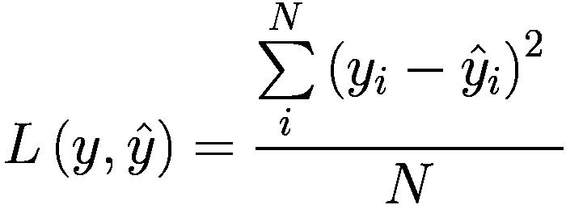

***方程 5-14.*** MSE 损失函数的公式，称为 L(y, * *)*

方程 5-14 中的损失函数将作为使用 m 和 b 来衡量我们预测“好坏”的反馈机制。为了实现完美的预测，我们需要最小化损失函数，使其在最佳情况下等于零。直观地说，这究竟意味着什么呢？我们可以通过取一个 m、b 值的网格，计算相应的损失，并将其绘制出来来可视化损失曲线。请参阅图 5-26。

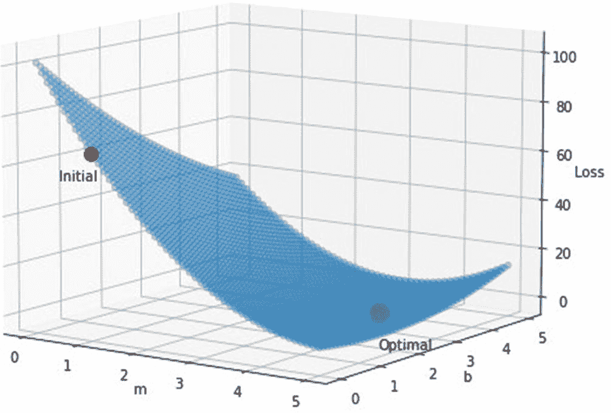

一个三维图由标记为 m、b 和损失的轴组成。一个通过初始点（m = 1，b = 0）和最佳点（m = 4，b = 3）的抛物面被绘制在其上。

图 5-26

我们的问题设置中的损失曲面通过初始起点在这个曲面上的 m = 1 和 b = 0 以及最优目标点 m = 4 和 b = 3 进行可视化

如我们在图 5-26 中所见，m 和 b 的参数设置与最优值相去甚远。如果我们取损失相对于 m 和 b 的梯度，并朝梯度的反方向迈出一步，m 和 b 将被更新，使其更接近最优的 m 和 b。

现在梯度究竟会是什么样子呢？我们该如何找到损失函数相对于我们的变量的梯度呢？首先，让我们使用链式法则来帮助我们。损失函数相对于 m 和 b 的梯度在方程 5-15 和方程 5-16 中给出。

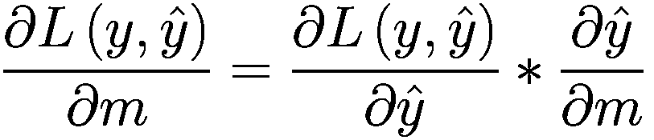

***方程 5-15.*** 损失函数相对于 m 的导数可以通过链式法则获得。我们首先找到损失相对于预测的导数，然后得到预测函数相对于 m 的导数

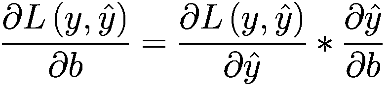

***方程 5-16.*** 方程 *5-15* 中的相同逻辑也适用于此处，除了我们取预测函数相对于 b 的导数

让我们推导出这些导数。损失函数相对于预测函数的导数公式在方程 5-17 中给出。


***方程 5-17.*** 损失相对于预测函数的导数

接下来，让我们推导预测函数相对于 m 和 b 的导数。参考方程 5-18 和 5-19。

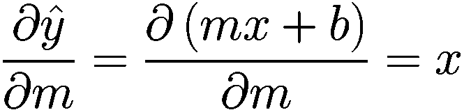

***方程 5-18.*** 当你有几个变量但只需要对其中一个变量求导时，将其他变量视为常数。这让我们得到了一个简单的结果，即仅仅是 x*

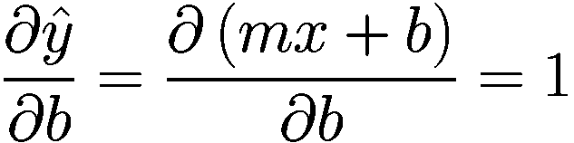

***方程 5-19。***同样，我们通过遵循方程 *5-18* 中的逻辑，但这次对 b 求导，得到了一个简单的结果 1

将所有这些放在一起，我们得到了方程 5-20 和 5-21。

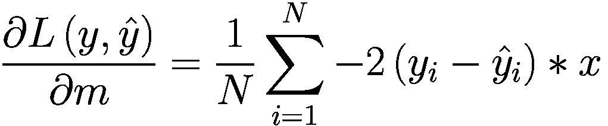

***方程 5-20。***将前面的推导结果代入，我们得到了损失函数对 m 的导数的最终导数方程

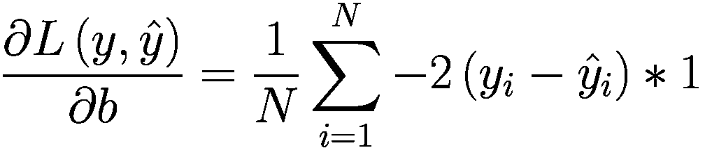

***方程 5-21。***同样，我们得到了损失函数对 b 的导数

这种推导方法与驱动神经网络的原理相同。如果你有很多嵌套层，你只需应用链式法则，直到你得到所需的导数。这就是我们如何获得所有所需的梯度。考虑到这一点，让我们使用简单的**梯度下降**来最小化损失曲线。梯度下降是通过迭代更新一些可学习参数，通过相对于这些参数的梯度方向取小步来实现的。m 和 b 的更新步骤分别显示在方程 5-22 和 5-23 中。

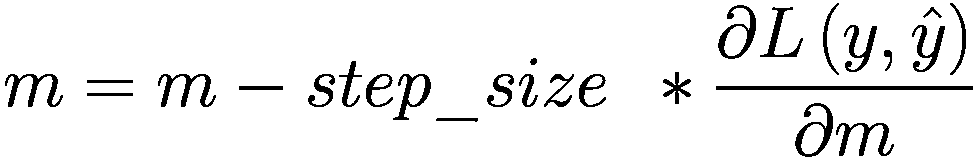

***方程 5-22。***更新 m 以向最优 m 更新的步骤

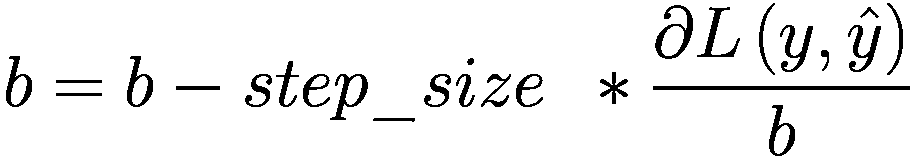

***方程 5-23。***更新 b 以向最优 b 更新的步骤

使用我们的起始值 m=1 和 b=0，我们的初始预测看起来像图 5-27。

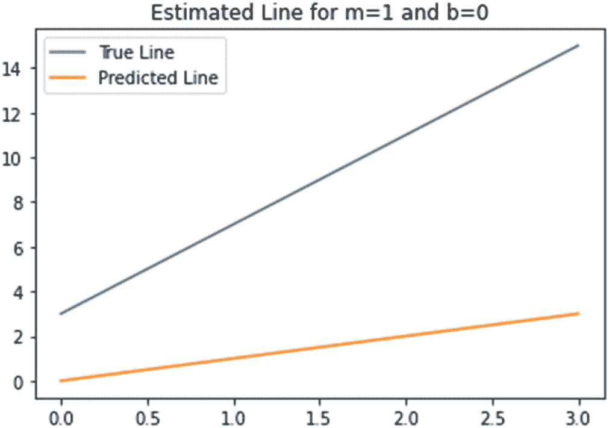

标题为“m = 1 和 b = 0 的估计线”的线图。它绘制了两条线，标记为真实线和预测线，它们通过以下点。真实线 (0, 3), (1, 7), (2, 11), (2.5, 13)。预测线 (0, 0), (1, 1), (2.5, 2), (3, 3)。值是估计的。

图 5-27

真实线与使用 m=1 和 b=0 预测的线的比较

使用步长大小为 0.001 和 1,000 次迭代（两者均为任意选择），我们将运行梯度下降并绘制结果。务必跟随代码了解如何从头实现梯度下降以及可视化所有这些图表。运行后，我们获得了 m 和 b 的值，经过四舍五入后约为 m=4.34 和 b=2.28。请参阅图 5-28 以查看这次预测的线。

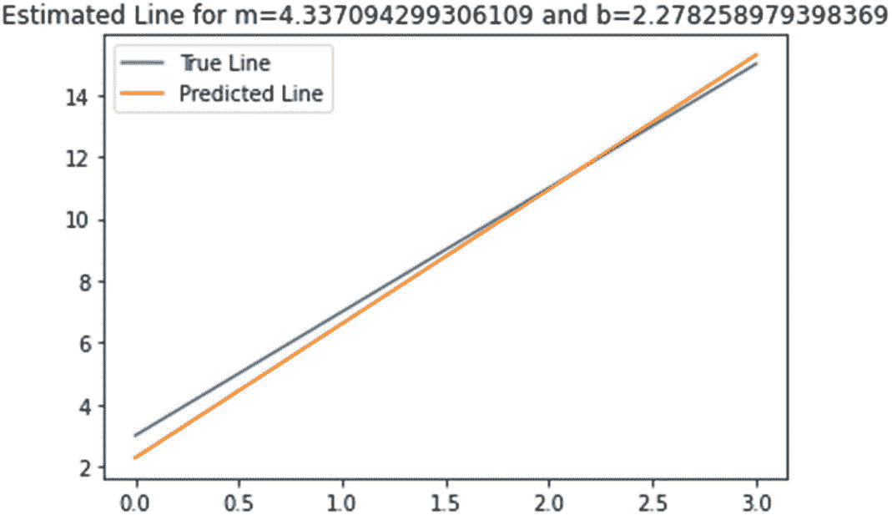

一条名为“m = 4.337094299306109 和 b = 2.278258979398369 的估计线”的折线图。它绘制了两条线，分别标记为真实线和预测线，它们通过以下点。真实线：(0, 3)，(1, 7)，(2, 11)，(2.5, 13)。预测线：(0, 2)，(0.5, 4)，(2.5, 13)。数值为估计值。

图 5-28

绘制运行梯度下降后真实线的逼近。很明显，虽然它不是最理想的，但学习的参数非常接近 m=4 和 b=3 的真实值。

现在我们来看看学习的 m 和 b 参数如何在损失曲线上出现。参见图 5-29。

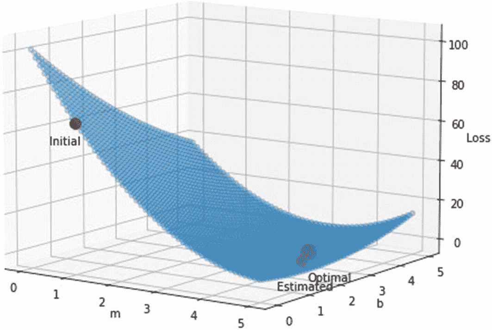

一个三维图绘制了一个通过三个点的下降抛物面，这三个点分别标记为初始点、估计点和最优点。估计点和最优点彼此很接近。

图 5-29

m 和 b 的估计参数导致损失非常接近最优损失。梯度下降有效，即使得到的参数不是完全最优的。

从图 5-29 中，我们可以得出结论，梯度下降是一种简单而强大的机制，使我们能够学习参数来逼近各种函数。正是这个相同的原理推动了深度学习模型，甚至像 ChatGPT 这样极其强大的模型。

有一些梯度下降的变体需要了解：

+   **随机梯度下降法**：在计算每个单独数据样本的梯度后执行梯度更新

+   **小批量梯度下降法**：在计算 N 个数据样本的小批量平均梯度后执行梯度更新

+   **批量梯度下降法**：在计算整个数据批次平均梯度后执行梯度更新

对于每个变体都有一些观察结果。

**随机梯度下降法（SGD）可以被视为具有 1 个样本大小的小批量梯度下降，尽管有时将小批量梯度下降称为 SGD。随机梯度下降法的优缺点如下所述。

优点：

+   **计算效率高**：你只需要一个样本大小，因此在资源和计算时间方面，它确实很快，并且不太苛刻。如果你有一个非常大的、计算密集型的模型，有时 SGD 是你在机器上运行它的唯一方式。

+   **逃离局部最小值**：在非常复杂的损失曲线上，可能会有局部最小值（局部山谷），这些最小值不如其他最小值（具有更低损失的其他局部最小值或全局最小值）。有时，梯度可能指向这些次优最小值，学习过程可能会陷入一个不良的解决方案。

    由于 SGD 更新的潜在噪声，我们可能会达到一个参数设置，使其逃离这个山谷，让新的梯度指向更深/更优的最低点。这样，学习过程最终会学习到一组更好的参数，导致比在较早的较浅的最低点停止学习时的损失更低。

缺点：

+   **不稳定**：仅基于一个样本的反馈更新变量可能会引入大量噪声，并导致次优的优化步骤。

    假设你在一瞬间成为意大利的游客，需要找到比萨斜塔。真实的位置在你西北方向某处。你计划在走过一些任意距离（进行梯度下降步骤）后向游客询问。你问了四个人：三个人指向北方（正确的方向），而另一个人指向东南方向。从这些人那里得到的方向代表了指向最小值的单个梯度方向。如果你使用 SGD，你会先向北走三个“步骤”，然后向南东方向走一步。然而，如果你使用小批量或批量梯度下降，你会考虑平均方向，即北方。

+   **收敛性较差**：由于 SGD 优化的潜在噪声和不稳定性质，你可能会发现难以更接近最优解；参数值可能会在损失曲线的最低点附近由于噪声更新而持续振荡。

**小批量梯度下降**在执行梯度更新时，一次考虑 N 个数据样本的小批量（通常简称为具有 N 个批量大小的批量）。这有助于平均噪声，并允许更准确地更新步骤以接近最小值。

优点：

+   **更稳定**：平均噪声有助于采取更准确的更新步骤，并可能避免由于噪声引起的意外振荡。

+   **计算效率高**：由于神经网络的结构，我们可以轻松利用矩阵形式对批量数据进行一次计算，提高吞吐量并利用 GPU 的并行计算架构。如果你有合适的硬件，小批量梯度下降可以高效且快速。

缺点：

+   **批量大小超参数**：小批量大小成为一个需要调整的超参数。太小，可能会使优化更容易受到数据噪声的影响。太大，可能会过度平均梯度，可能导致参数陷入某些局部最小值。

小批量梯度下降通常是在结合梯度下降学习时最优的学习策略，并且在实践中也是最普遍的。它能够导致更优解的更好收敛，因为随机梯度下降（SGD）对噪声过于敏感，容易产生过多的振荡，而批量梯度下降则过度削弱了信号，可能导致无法逃离局部最小值的次优解。

在对梯度下降和训练过程背后的机制有了更好的、更深入的理解之后，让我们继续探讨如何解释神经网络的损失曲线。

### 损失曲线

损失曲线可以告诉我们很多关于模型训练过程以及其对新数据的泛化能力的信息。回想一下，我们可以将数据分为训练集、验证集和测试集。训练集显然是我们训练模型所用的。更具体地说，它是我们通过网络传递的，计算损失并执行梯度下降的。

一个**epoch**代表整个训练数据集通过网络的完整遍历。无论你使用什么批大小（1 代表随机梯度下降，即训练样本的总数，N 代表批量梯度下降，使用小批量梯度下降时批大小介于两者之间），一旦模型看到了训练集中所有样本的数据，你就完成了一个 epoch 的训练。

验证集可以在训练后一个 epoch 后作为盲目的“测试”集来评估你的神经网络。实际上，验证集的使用取决于实现方式，但理想情况下，它将为你提供关于训练过程以及模型泛化能力的良好指示。

测试集是在训练过程完成后用于模型评估的东西。

损失曲线显示了当前训练损失随迭代次数、优化步骤或 epoch 的变化。目标是简单地显示随着训练的进行损失如何变化。

对于本节中生成图表所使用的代码，请参阅随附的笔记本，网址为[`https://github.com/apress/beginning-anomaly-detection-python-deep-learning-2e/blob/master/Chapter%205%20Introduction%20to%20Deep%20Learning/chapter5_overfitting.ipynb`](https://github.com/apress/beginning-anomaly-detection-python-deep-learning-2e/blob/master/Chapter%205%20Introduction%20to%20Deep%20Learning/chapter5_overfitting.ipynb)。

图 5-30 显示了在训练过程中获得的一个示例训练和验证损失曲线。在 MNIST 数据集上训练了一个卷积神经网络，共 64 个 epoch（为了使过拟合更可能发生，选择了更高的 epoch 数）。

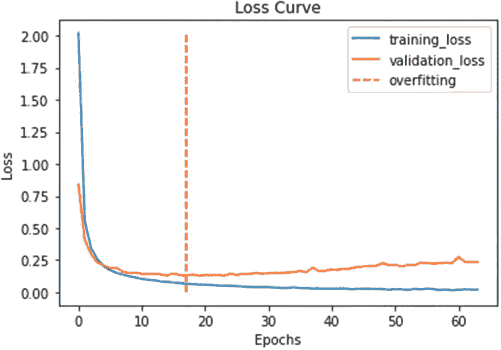

一条名为“损失曲线”的折线图，绘制了损失与 epoch 的关系，如下所示。训练损失（0, 2），（2, 0.25），（10, 0.125），（20, 0.1），（60, 0）。验证损失（0, 0.75），（10, 0.13），（60, 0.25）。过拟合用 epoch = 16 处的虚线垂直线表示。

图 5-30

一个显示训练损失和验证损失的神经网络损失曲线的示例。当验证损失达到最低点并再次开始上升时，你就越过了过拟合的界限，这在第 17 个 epoch 的红色虚线垂直线上表示。

正如你在图 5-30 中可以看到的，训练和验证损失一开始都很高，然后随着时间的推移而下降。在某个点上，训练损失和验证损失都处于最低点，这是停止网络训练的最佳时机，以确保模型不会继续过拟合，而是尽可能地进行泛化。

训练过程中训练准确率和验证准确率的准确率曲线如图 5-31 所示。

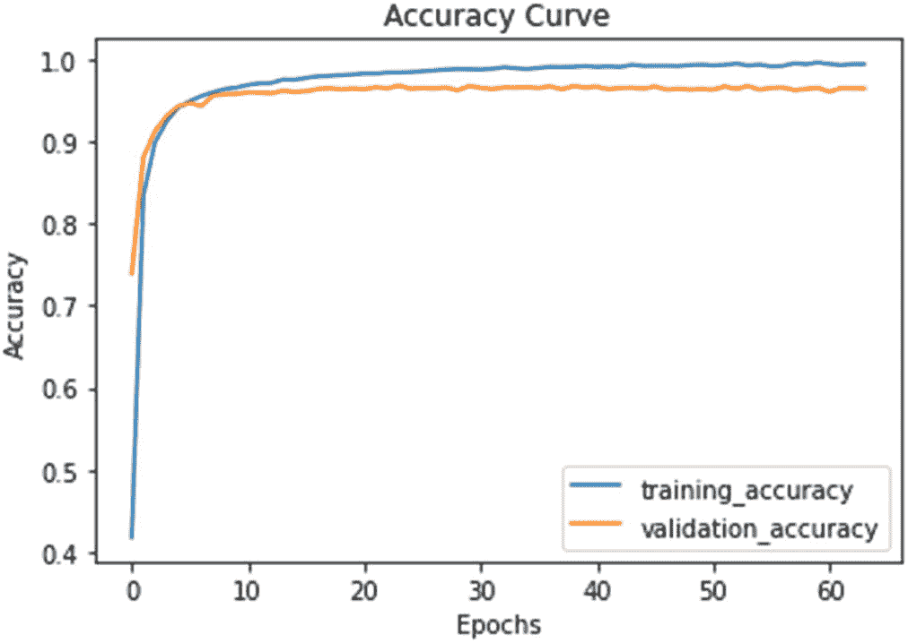

一条名为准确率曲线的线图，如下所示绘制训练准确率和验证准确率曲线。训练准确率（0，0.4），（2，0.95），（30，0.975），（40，0.98），（60，1）。验证准确率（0，0.74），（10，0.96），（30，0.965），（50，0.97）。数值为估算值。

图 5-31

展示训练准确率与验证准确率对比的图表。验证准确率的提升在某一点后停止，而训练准确率持续提高。这是过拟合的另一个迹象。

如果允许训练继续进行，训练损失会降低，但验证损失开始增加。这是模型过拟合的明显迹象。如果我们选择一个时间点停止，我们可以简单地选择具有最低验证损失的 epoch，在这个特定的训练运行中恰好是第 17 个 epoch。

如果你重新运行本节中的代码，你的过拟合开始的时间点可能会有所不同，但你应该会看到与这里显示的图表相似的结果。图 5-30 中的图表显示了验证损失开始再次上升的大致点。图 5-30 中的图表显示了类似的趋势，当我们持续训练模型时，训练准确率和验证准确率之间会出现差异，因为训练准确率持续提高，而验证准确率要么停滞不前，要么非常轻微地开始下降。

那么，我们如何对抗过拟合呢？我们可以采用一系列正则化技术，并结合提前停止，以确保模型尽可能地进行泛化。

### 正则化

我们可以使用各种技术来对抗过拟合：

+   **L1/L2 惩罚**：我们可以通过使用 L1 范数（权重绝对值的和）或 L2 范数（权重的平方和）来应用惩罚，激励它们减小幅度以最小化惩罚。

+   **Dropout**：给定保留节点的概率 p，我们随机关闭层内的某些节点，并阻止它们向下一层传递信号。这个过程在每个前向传递中重复，因此没有神经元保证在连续的前向传递中保持活跃。

    这些被激活的神经元也不会对反向传播做出贡献，因此如果它们被删除，它们根本不会参与训练过程。由于后续层不能再依赖于正向传播期间任何单个神经元的存在，它必须学会与尽可能多的其他神经元建立连接。这有助于避免过拟合并促进泛化，因为单个神经元将不再主导与后续层的连接，并且这种连接不能轻易发生。

+   **提前停止**：如前一小节所述，提前停止在最佳泛化性能点（使用模型从未训练过的盲验证数据）停止训练，这样模型就不会在数据上过拟合。在过拟合刚开始发生时简单地停止过拟合是一种正则化形式，以确保你的模型泛化。

+   **更多训练数据**：有时，与测试数据或任何其他新数据相比，你的训练数据无法充分捕捉可能的输入空间。在这些情况下，添加更多、多样化的训练样本可以帮助模型正确学习任务并更好地泛化。

    例如，如果你只在一个模型上训练了清晰的照片，但然后在包含部分遮挡图像的测试数据集上评估该模型，该模型将无法很好地泛化，并且会过拟合到训练数据。在训练数据中添加遮挡图像可以帮助模型正确学习任务并更好地泛化到新数据。

你可以使用这些技术的任何组合来帮助你的模型对新数据有很好的泛化，尽管你不必过度强调正则化，因为这实际上可能导致整体性能更差。

过度正则化的模型（如过于严厉的 L1/L2 惩罚结合过高的 dropout 率）可能无法正确学习训练任务，因此由于训练不佳，在测试集上的表现会更差。

Keras 和 PyTorch 都允许你实现这些技术。参数正则化器是框架本身支持的，当你构建神经网络架构时。我们将在本章后面的监督神经网络示例中介绍这一点。

Dropout 也由这两个框架支持。提前停止在 Keras 中很容易实现，但在 PyTorch 中，你必须手动编码它作为训练循环的一部分。我们将在我们的 PyTorch 示例中实现这一点。

### 优化器

有许多优化器技术超越了简单的梯度下降。我们之前介绍了随机梯度下降，但我们可以对 SGD 进行许多修改来改进优化过程并帮助神经网络收敛到更好的解决方案。

在优化的背景下，**收敛**意味着迭代地到达一个最优的权重集，该权重集在一定范围内最小化损失。我们无法找到全局最优的权重集来找到全局最优的最小值，因为迭代技术永远不会精确地到达最佳解决方案，但它们可以非常接近它。

因此，当模型收敛到解决方案时，它已经在损失曲线上达到某个局部最小值，但不一定是最好的全局最小值。相反的情况是，当模型**发散**或开始增加损失而不是最小化它时。发散的模型是网络或训练设置不稳定的一个迹象，可能表明超参数设置不佳（学习率过高可能导致大的优化步长）。

讨论优化方法会很快变得非常数学化，所以我们只概述每个优化器背后的直觉以及其优缺点。如果您对生成本节可视化效果的代码感兴趣，请参阅笔记本[`github.com/apress/beginning-anomaly-detection-python-deep-learning-2e/blob/master/Chapter%205%20Introduction%20to%20Deep%20Learning/chapter5_optimizers.ipynb`](https://github.com/apress/beginning-anomaly-detection-python-deep-learning-2e/blob/master/Chapter%205%20Introduction%20to%20Deep%20Learning/chapter5_optimizers.ipynb)。

让我们正式回顾一下广义 SGD 算法。在我们深入代码本身之前，让我们回顾一下变量和函数：

+   `compute_gradient()`: 一个抽象函数，它接受损失、数据和模型的可学习参数，并返回相应的梯度。

+   `parameters`: 一些任意神经网络的权重和偏置列表。

+   `gradients`: 变量 `parameters` 中权重和偏置的梯度列表。梯度与参数一一对应，因为顺序被保留。

+   `lr`: 梯度更新中使用的步长。

图 5-24 展示了 SGD 算法在方程 5-24 中所示函数上的变化。

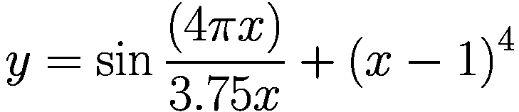

***方程 5-24.*** 这是 Gramacy & Lee (2012) 函数的变体（来源：[`www.sfu.ca/~ssurjano/grlee12.xhtml`](https://www.sfu.ca/%7Essurjano/grlee12.xhtml)）*

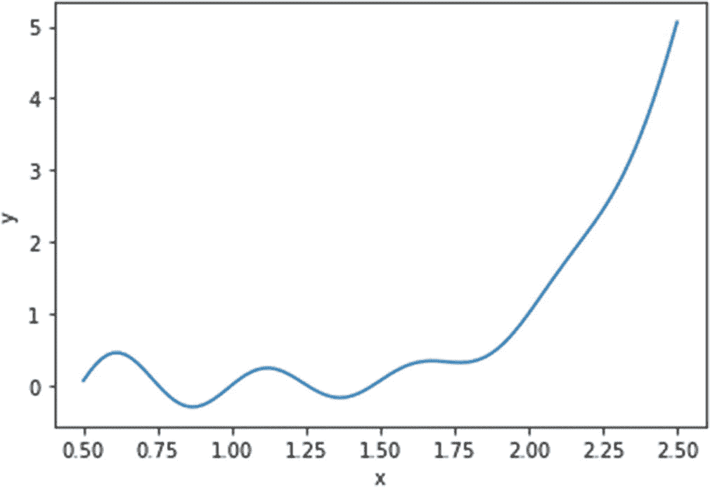

线形图绘制了通过以下点的 y 与 x 曲线。 (0.5, 0), (0.625, 0.5), (1.125, 0.5), (1.5, 0.4), (2, 1), (2.25, 2.5), (2.5, 5)。数值是估算的。

图 5-32

我们将应用 SGD 及其变体的函数。这个函数可以被视为我们试图通过找到最优 x 来最小化的损失函数。图中有几个局部最小值必须克服才能达到全局最小值（图上的最低点）。一个差的优化器会陷入一个次优的局部最小值，这会导致模型性能不佳，因为它不会像可能的那样最小化损失。

参考图 5-33 以查看 SGD 更新算法的模板代码。

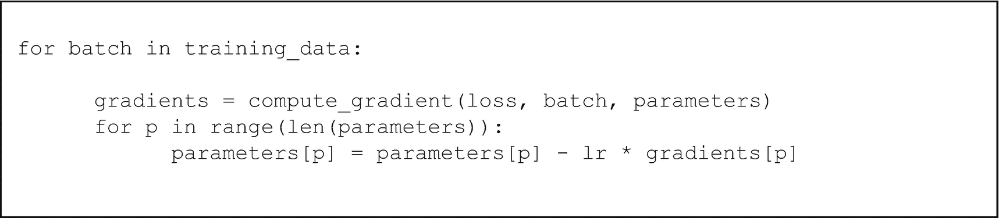

以下是一个代码片段。对于训练数据下的批次。梯度等于计算梯度 _ 左括号 _ 损失，批次，参数 _ 右括号。对于 p 在范围 _ 左括号 _ 参数长度 _ 右括号 _ 和进一步。

图 5-33

包含梯度更新步骤的 SGD 训练循环。计算梯度并执行更新步骤。基本 SGD 算法非常简单

利用 PyTorch 和起始 x 值为 2.25，我们迭代地使用基本 SGD 进行 1000 次迭代，以查看我们是否可以收敛到一个好的解。优化历史结果如图 5-34 所示。

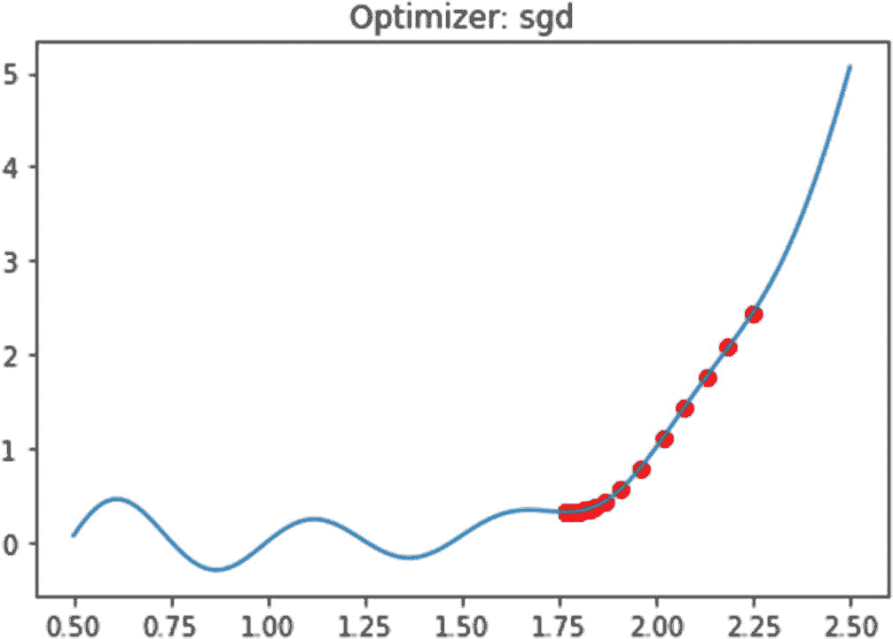

一条线图，标题为“优化器 SGD”。它绘制了一条通过以下点的曲线。(0.5, 0)，(1.25, 0)，(1.75, 0.5)，(2.5, 5)。在以下点的曲线上标记了粗实心点(1.75, 0.5)，(2, 1.4)，(2.25, 2.5)。值是估计的。

图 5-34

基本 SGD 在 1000 次迭代中的优化性能。优化器陷入了局部最小值

正如我们在图 5-34 中看到的，SGD 陷入了一个非常浅的局部最小值，在第 52 次迭代时达到了最小损失。我们如何改进并保持优化器向更好的最小值前进？这就是**动量**概念出现的地方。想象一下红色点像是一个滚下山的球。如果球积累了一些使其继续前进的动量，它就能克服那个小山，继续前进，直到它落入一个更深的最低点？

为了实现这一点，我们可以使用**速度**的概念，它是累积梯度的衰减平均值，并添加到梯度更新中。这给优化器提供了一些惯性，有助于克服曲率中的浅谷，并抑制任何振荡行为。

图 5-35 显示了带有动量的 SGD 训练循环算法。还有两个额外的变量需要考虑：

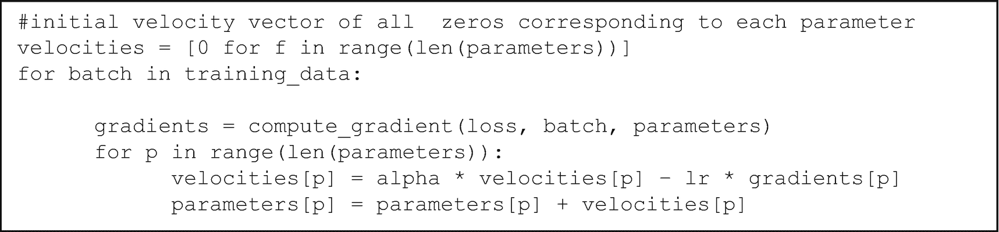

一个代码片段将带有动量的梯度下降应用于迭代更新模型参数，以在训练过程中最小化损失函数。它使用动量项 alpha 和计算的梯度更新每个参数的速度。

图 5-35

将速度的概念添加到基本 SGD 算法中，并通过 alpha 控制累积梯度更新的衰减

+   `velocities`：一个所有元素均为零的初始向量，就像变量`gradients`一样，通过索引一对一地与每个参数对应。这个变量持有累积梯度更新的衰减平均值，以添加到新的梯度更新中，以增加优化过程中的惯性。

+   `alpha`：当将旧速度加到更新步骤中时应用的一个系数。它控制累积速度的衰减速率。高的`alpha`值会给过去的梯度赋予更多的权重，并增加更多的惯性。`alpha`值接近零时，带有动量的 SGD 表现得更像普通的 SGD，当`alpha`等于零时，正好是普通的 SGD。

回顾图 5-34 中的先前函数，图 5-36 显示了这种简单的修改如何使优化器克服了最小值。

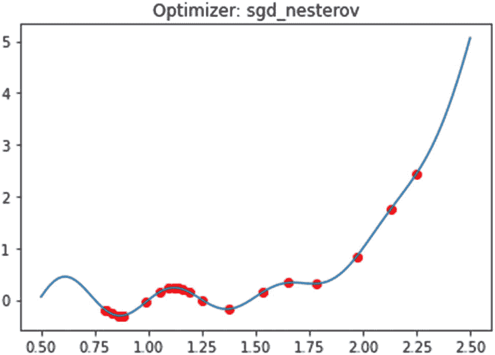

一条名为“优化器曲线图”的折线图显示了以下点：(0, 0.5), (1, 0), (1.65, 0.5), (2, 1), (2.25, 2.5)。数值是估算的。

图 5-36

带有动量优化器的 SGD 性能。动量系数 alpha 设置为 0.9

优化器在第 190 次迭代时达到了最低损失，并达到了全局最小值。然而，正如我们所看到的，仍然存在相当多的振荡，这很可能是由于保留了大量的惯性需要消散。我们还可以在这里进行另一种修改。如果红色球能够看到它要去哪里，并在需要时减速，那不是很好吗？这样它就可以在达到某些最小值之前开始“刹车”，从而更快地收敛。

这就是**Nesterov 动量**发挥作用的地方。Nesterov 动量的想法是，在计算梯度时，我们不会使用当前迭代的活跃参数，而是使用这些参数的梯度更新的“未来”版本。从某种意义上说，优化器“展望”未来，允许它根据这个“未来”结果计算不同的、最终的梯度更新。这将导致加速/减速以及更准确的梯度更新。现在，优化器不会像以前那样振荡，因为不需要消除的累积速度会少很多——例如，优化器会在触到底部之前提前减速。

图 5-37 显示了带有 Nesterov（也称为 Nesterov 加速梯度，或 NAG）的 SGD 的代码。

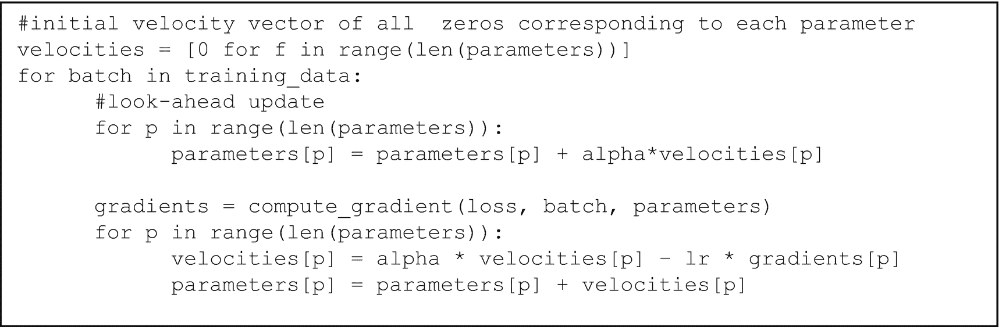

一个代码片段实现了具有前瞻更新机制的梯度下降的变体。代码为每个参数初始化一个速度向量= 0，然后计算损失函数相对于每个参数的梯度。

图 5-37

在我们计算梯度之前，我们使用现有的累积速度更新参数。从这个意义上说，优化器“向前看”以查看动量会将其带到哪里，并且有了新的梯度，它可以应用任何校正，如加速/减速，从而实现更精确的参数更新。

图 5-38 展示了这种对带有动量的 SGD 的修改结果。

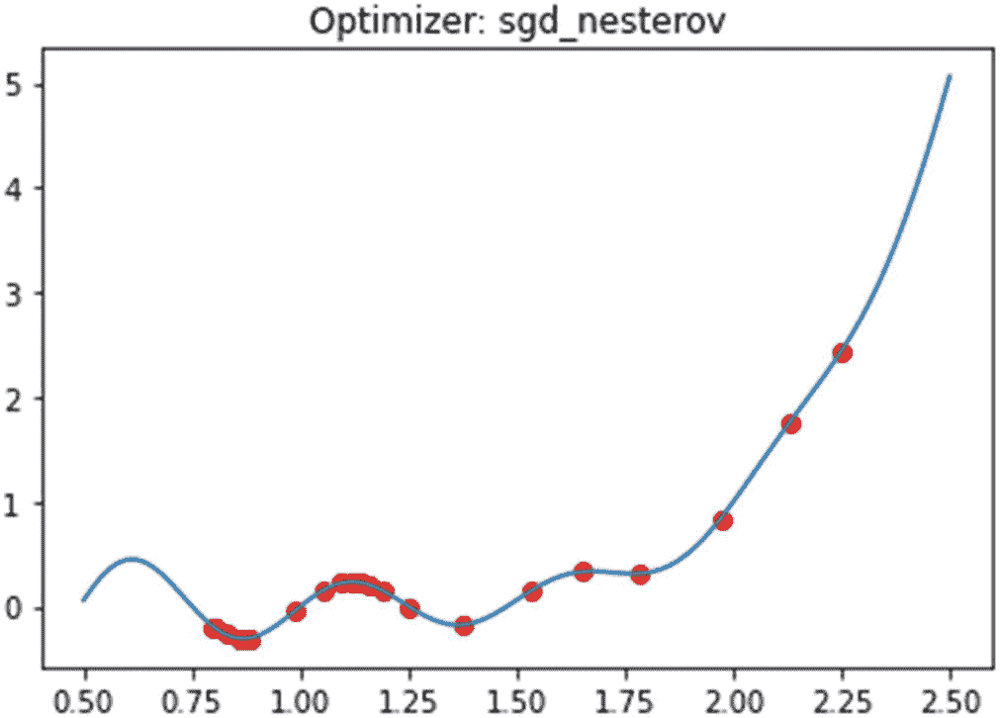

一条名为“优化器 SGD Nesterov”的折线图绘制了一条通过以下点的曲线：(0.5, 0)，(1.125, 0.4)，(1.5, 0.35)，(2, 1)，(2.25, 2.5)，(2.5, 5)。数值是估计的。曲线上的点是实心球。

图 5-38

与图 5-36 相比，带有 Nesterov 动量的 SGD 看起来振荡要少得多。在全局最小值处，看起来“红色球”能够减速。在全局最小值之前的峰值上，它看起来在峰值时减速，但一旦越过峰值就加速向山谷移动。使用“山上的球”的类比，这比之前的 SGD 版本看起来更现实、更直接、迭代效率更高。

如图 5-38 所示，优化器看起来收敛得更快，振荡更少。事实上，最低损失是在 42 次迭代中实现的。

虽然这看起来比 SGD 和带有动量的 SGD 有很大的改进，并且是一个相当好的优化器，但它并不完美。一个问题就是学习率保持不变。我们可以手动调整这个值或者使用一个学习率调度器，它会自动随时间改变学习率，但这样学习率就又变成了另一个需要调整的超参数。

有一个动态更新学习率的优化器会很好，不是吗？有一些优化器，如 RMSProp 和 Adadelta，处理一些累积梯度的平方的衰减平均值，以动态调整每个参数的学习率并更好地跟随损失曲线的拓扑结构。它们也非常适合高维问题以及一般稀疏数据，使得 RMSProp 优化器成为训练长短期记忆 (LSTM) 模型（例如自然语言处理 (NLP) 问题中的情感分析或文本生成）的理想选择。

图 5-39 展示了 RMSProp 代码。有几个新的变量需要考虑：

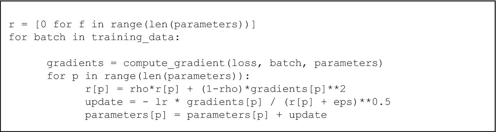

一个代码片段实现了 R M S prop 更新方程。它初始化一个与参数长度相同的向量 r，并初始化为零。然后，它计算每个参数的损失函数的梯度。算法使用平方梯度的指数衰减平均值。

图 5-39

RMSProp 的更新方程。梯度的更新步长系数将在迭代中有所不同，从而有效地使步长（学习率）动态变化。你可以设置一个初始学习率，但整个训练过程中，它将发生变化

+   `r`：平方梯度累积变量。类似于速度，它保存平方梯度的指数衰减平均。

+   `rho`：衰减系数。

+   `eps`：一个非常小的数，如 1e-6 或 1e-7，用于数值稳定性。

我们用来展示 SGD 及其变体的函数太简单，无法正确展示 RMSProp 的优势，因此我们将对所讨论的所有优化器以及 Adam 优化器进行全面的比较。

Adam 优化器可以被视为一种“两全其美”类型的优化器，它结合了动量以及像 RMSProp 和 Adadelta 那样的累积平方梯度。

尽管 RMSProp 可以被修改以包含动量（甚至 Nesterov 动量），但 Adam 优化器结合了偏差校正（允许更稳定的训练，尤其是在训练的早期阶段）。Adam 优化器对超参数选择也更加鲁棒，使其成为各种不同训练任务中一个很好的首选优化器。Adam 优化器也被发现通常优于 RMSProp。有了这些优势，Adam 优化器在实践中得到了相当广泛的应用。

然而，没有最好的整体优化器，并且哪个优化器表现最佳可能会根据训练任务而变化。每个优化器都有自己的优缺点。例如，Adam 优化器由于使用了大量变量，因此对内存的需求更大。相比之下，SGD 在内存效率上更高，计算上更轻量，尽管它可能不是表现最佳的优化器。如果你有额外的计算能力，并且性能是一个非常高优先级，那么尝试不同超参数设置的不同优化器可能是有价值的。

Adam 优化器的代码如图 5-40 所示。它引入了几个需要考虑的新参数：

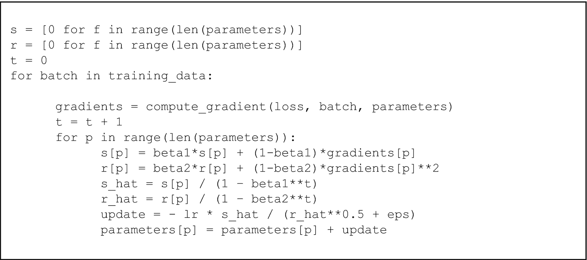

一个代码片段实现了 Adam 优化器。它初始化变量`s`和`r`，并在训练数据批次上迭代，计算每个参数的损失函数梯度。

图 5-40

Adam 优化器的伪代码。由于需要存储一阶动量和平方梯度，它更占用资源。我们还必须跟踪迭代次数

+   `s`：一阶矩数组。类似于`velocities`向量，`s`存储速度，可以被认为是动量的类似物。

+   `r`：二阶矩数组。类似于 RMSProp，它保存平方梯度，并对其计算指数衰减平均。

+   `beta1`：用于一阶矩`s`向量的指数衰减平均系数。

+   `beta2`: 用于二阶矩 `r` 向量的指数衰减平均系数。

+   `eps`: 为数值稳定性添加的一个非常小的数，通常为 1e-6 或 1e-7。

+   `t`: 迭代计数器。记录正向传递的迭代次数。

如您在图 5-40 中所见，Adam 优化器比之前介绍的其它优化器算法在计算上更为复杂。它跟踪一阶矩（动量）和二阶矩（我们在 RMSProp 中看到的平方梯度的累积）。Adam 优化器还可以修改以包含 Nesterov 动量。

在介绍了 SGD、SGD + 动量、NAG、RMSProp 和 Adam 优化器之后，让我们看看这些优化器在训练 MNIST 数据集上的简单神经网络中的表现。所有优化器都将具有 1e-3 的学习率，以 256 的批量大小进行训练，并训练 64 个周期。

如需了解实验设置的更多细节，请务必参考 GitHub 上提供的配套 Jupyter 笔记本，网址为[`https://github.com/apress/beginning-anomaly-detection-python-deep-learning-2e/blob/master/Chapter%205%20Introduction%20to%20Deep%20Learning/chapter5_optimizer_comparison.ipynb`](https://github.com/apress/beginning-anomaly-detection-python-deep-learning-2e/blob/master/Chapter%205%20Introduction%20to%20Deep%20Learning/chapter5_optimizer_comparison.ipynb)。

请参考图 5-41 查看结果。

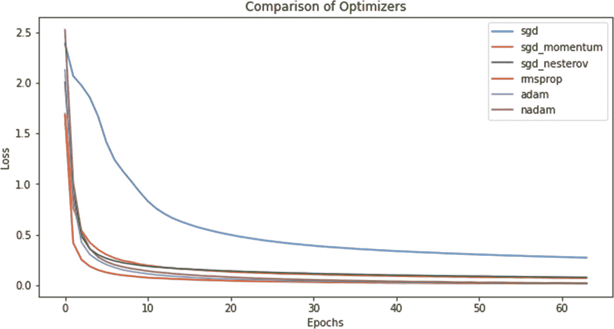

一条名为“优化器比较”的折线图，显示了 s g d、s g d 动量、s g d Nesterov、r m s prop、adam 和 nadam 的损失与周期曲线。曲线具有矩形双曲下降趋势。

图 5-41

所有优化器设置的训练结果。这次，RMSProp 在所有优化器中表现最佳，收敛得最快，并达到了最佳解决方案。SGD 表现最差，而 Adam 和 Nadam 最终达到了与 RMSProp 相似的最优解决方案。

重要的是要记住，这是一个简单的玩具示例，并不一定在所有情况下都代表实际应用中的性能。这些问题非常复杂，但一般来说，Adam 优化器由于其对抗初始学习率的鲁棒性以及相对较快的收敛速度，是一个相对较好的实验选择。

在这种情况下，RMSProp 收敛得最快，并且达到了最佳解决方案。再次强调，这并不总是意味着实际应用中的性能，因此如果您能承担计算成本，尝试多种优化器是一个好策略（例如通过交叉验证，以确保实验结果的可靠性）以进一步提高模型性能。

现在我们已经讨论了深度学习建模的所有主要组成部分，让我们开始创建我们的第一个用于异常检测的监督多层感知器模型。

### 多层感知器监督异常检测

让我们通过在 Keras 和 PyTorch 中实现多层感知器来运行我们自己的监督异常检测模型。我们将在此任务上使用的数据集是 KDDCUP 1999 数据集，就像在第四章中一样。

大部分数据准备代码将与第四章中的代码完全相同。此外，这段数据准备代码将在 Keras 模型和 PyTorch 模型之间共享，因此请确保在此部分中首先执行这些代码块，然后再继续到 Keras 和/或 PyTorch 部分。我们还将在此部分中介绍这两个模型共享的神经网络架构。

本节中的代码与 Keras 和 PyTorch 笔记本中使用的代码相同，因此您可以参考以下任一：

+   **Keras 笔记本**：[`https://github.com/apress/beginning-anomaly-detection-python-deep-learning-2e/blob/master/Chapter%205%20Introduction%20to%20Deep%20Learning/chapter5_mlp_keras.ipynb`](https://github.com/apress/beginning-anomaly-detection-python-deep-learning-2e/blob/master/Chapter%205%20Introduction%20to%20Deep%20Learning/chapter5_mlp_keras.ipynb)

+   **PyTorch 笔记本**：[`https://github.com/apress/beginning-anomaly-detection-python-deep-learning-2e/blob/master/Chapter%205%20Introduction%20to%20Deep%20Learning/chapter5_mlp_pytorch.ipynb`](https://github.com/apress/beginning-anomaly-detection-python-deep-learning-2e/blob/master/Chapter%205%20Introduction%20to%20Deep%20Learning/chapter5_mlp_pytorch.ipynb)

让我们从图 5-42 开始，看看导入部分。

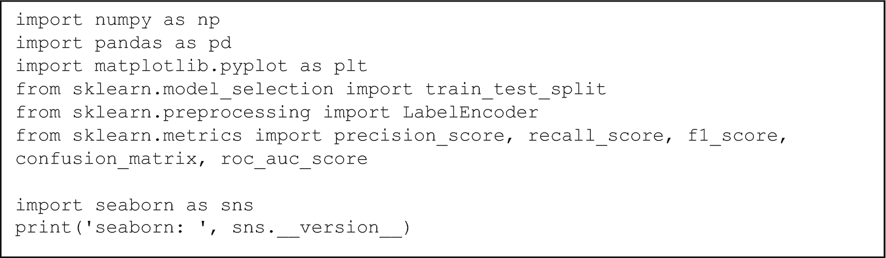

一段代码片段导入了 numpy 库为 n p，pandas 库为 p d，以及 matplotlib 库的 pyplot 模块，命名为 p l t。它从 s k learn 的模型选择中导入了 train test split，从 s k learn 的预处理中导入了标签编码器。它还导入了精确度得分、召回率得分、F1 得分、混淆矩阵和 ROC AUC 得分。

图 5-42

必要的`import`语句。您应该至少有 seaborn 版本 0.12.2

示例中使用的 seaborn 版本是 0.12.2。Seaborn 是一个绘图库，它建立在 matplotlib 之上，以提供更高级的功能。

我们将再次定义所有列并加载数据框。请参阅图 5-43。

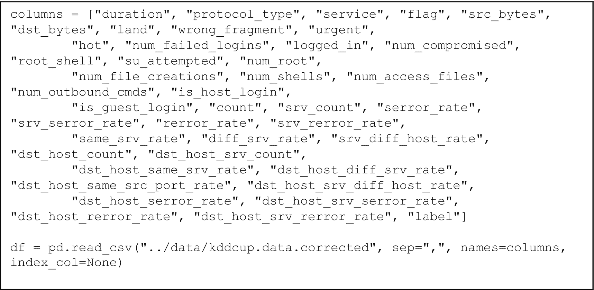

一段代码片段定义了列标题并在相应的列中输入数据。它使用一个名为 k d d cup dot data dot corrected 的 CSV 文件，该文件位于./data 目录中，并将其加载到 Pandas 数据框中。

图 5-43

定义列并将 KDDCUP 1999 数据作为数据框加载

确保数据在正确的路径上，就像在第四章中一样。接下来，我们将过滤数据框，只包括 HTTP 攻击。请参阅图 5-44。

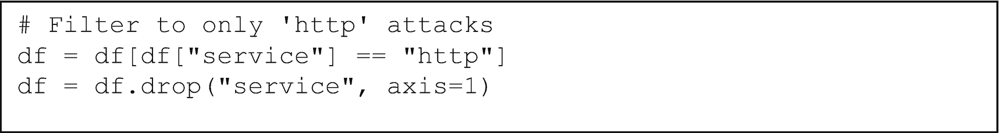

以下是一个代码片段。过滤出仅包含 h t t p 攻击的代码。Df 等于 df 左方括号 df 左方括号服务右方括号双等号 h t t p 右方括号。Df 等于 df 点 drop left parenthesis 服务，axis 等于 1 right parenthesis。

图 5-44

以下代码用于过滤数据框，仅包含 HTTP 攻击。行数应为 623,091 行，包含 41 列

完成此操作后，我们必须应用我们的标签映射，以便任何标记为“normal.”的内容将被计为正常数据点，而其他标记的内容将被视为异常。运行图 5-45 中的代码。

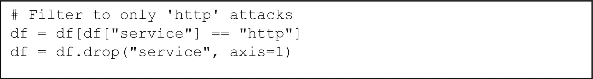

以下是一个代码片段。过滤出仅包含 HTTP 攻击的代码。Df 等于 df 左方括号 df 左方括号服务右方括号双等号 h t t p 右方括号。Df 等于 df 点 drop left parenthesis 服务，axis 等于 1 right parenthesis。

图 5-45

应用数值编码并检查值计数

接下来，我们必须对所有其他分类列进行编码。运行图 5-46 中的代码。

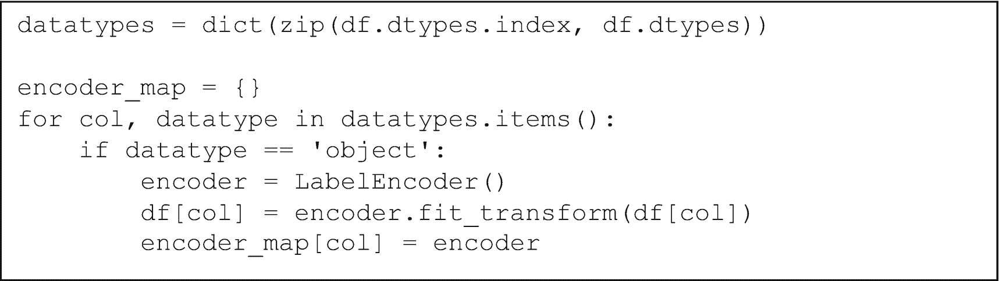

一个代码片段，创建一个名为 datatypes 的字典，将列名映射到数据框中相应的数据类型，并应用标签编码器将分类值转换为数值标签。


将非数值列编码为数值等效

就像之前一样，我们将仅包括与标签列相关性最高的列。运行图 5-47 中的代码。

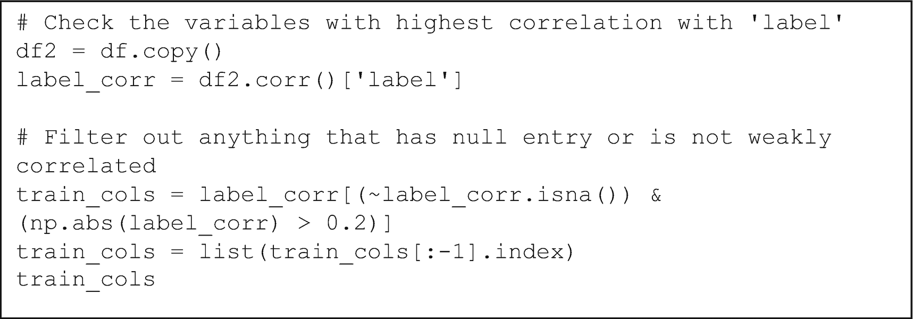

一个代码，用于识别和选择与标签列具有显著相关性的变量，相关系数大于 0.2，排除包含空值的变量。所选列的结果列表存储在 train underscore cols 中。

图 5-47

过滤掉包含空值或无线性相关性的列，同时保留至少弱相关的列。我们还索引 `train_cols[:-1]` 以移除标签作为其自身的相关性

通过这种方式，我们可以创建我们的训练-测试-验证分割。参考图 5-48 创建测试分割和初始训练分割。

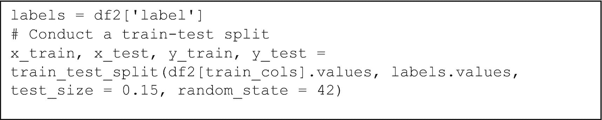

一个代码片段，从数据框 df 2 中提取标签列并将其分配给变量 labels。使用 train underscore test underscore split 函数，将数据集分为训练集和测试集。测试集大小定义为 0.15。


创建测试分割和初始训练分割。`random_state` 已设置为 42 以确保可重复性

最后，我们可以创建我们的验证集。参考图 5-49。

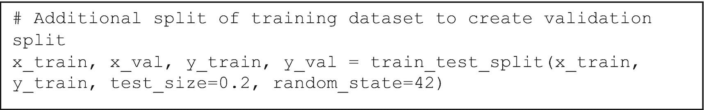

一段代码片段，执行额外的训练数据集拆分以创建验证拆分。测试大小等于 0.2。

图 5-49

创建验证拆分和最终的训练拆分。

我们可以打印出形状，以确保处理是正确的。参见图 5-50。

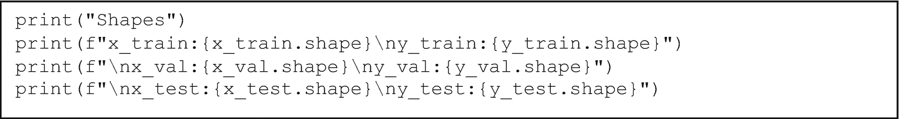

一段代码片段，打印出训练特征和标签、测试特征和标签以及验证特征和标签的形状。

图 5-50

打印出我们创建的所有数据拆分的形状的代码。

如果一切顺利，我们应该会看到图 5-51 中所示的那种输出。

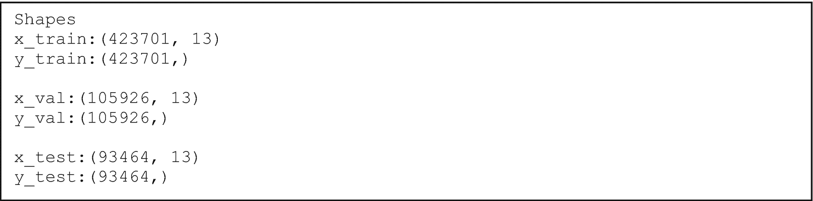

一段代码片段显示了以下形状：训练集特征 x underscore train 形状：(423701, 13)和标签 y underscore train 形状：(423701 逗号)。验证集：特征 x underscore val 形状：(105926, 13)，标签 y underscore val 形状：(105926 逗号)，等等。

图 5-51

训练集、验证集和测试集的输出形状

有了这些，我们现在已经为使用 PyTorch 或 Keras 进行进一步建模准备了数据集。在我们继续之前，让我们回顾一下我们将要实现的神经网络架构。参见图 5-52。

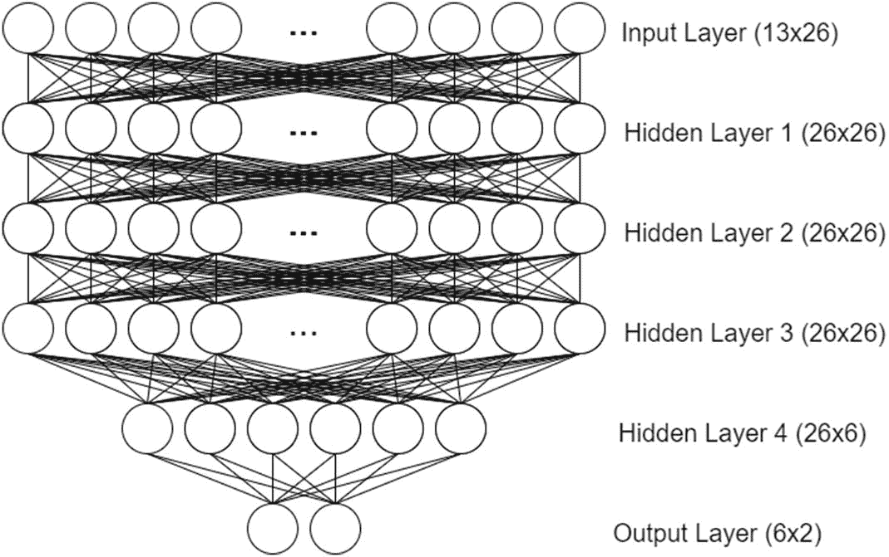

一张示意图展示了神经网络的结构如下。从上到下，输入层 13 乘以 26，隐藏层 1 26 乘以 26，隐藏层 2 26 乘以 26，隐藏层 3 26 乘以 26，隐藏层 4 26 乘以 6，以及输出层 6 乘以 2。

图 5-52

我们将要实现的神经网络架构。层数和单元数是任意选择的——请随意尝试更少或更多的层和/或神经元计数。每个隐藏层，包括输入层，都有 ReLU 激活函数。输出层有`softmax()`激活函数。

在您实现神经网络时，请随意尝试不同的激活函数、隐藏层的数量以及每层的神经元数量，以了解哪些有效，哪些无效。图 5-52 中显示的架构是任意选择的，所以不要将其视为每个任务的模型示例。适合每个任务的架构会有所不同，包括它实际上需要有多深以及每层应该有多少神经元。

在考虑到这些信息后，让我们从 TensorFlow 和 Keras 开始。

### 简单神经网络：Keras

请确保跟随本节中的 Jupyter 笔记本进行操作，该笔记本可在以下链接找到[`https://github.com/apress/beginning-anomaly-detection-python-deep-learning-2e/blob/master/Chapter%205%20Introduction%20to%20Deep%20Learning/chapter5_mlp_keras.ipynb`](https://github.com/apress/beginning-anomaly-detection-python-deep-learning-2e/blob/master/Chapter%205%20Introduction%20to%20Deep%20Learning/chapter5_mlp_keras.ipynb)。笔记本中的示例是在 TensorFlow 2.7.0 上运行的。

在我们开始建模之前，我们需要将 y 集转换为 one-hot 格式。这是必要的，因为 Keras 期望输出预测是经过`softmax()`后的分数。为此，Keras 提供了一个名为`to_categorical()`的实用函数，我们可以使用它将整数数组转换为 one-hot 输出。参见图 5-53。

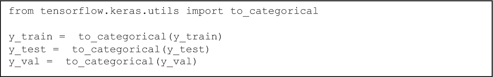

一段代码片段，从 tensor flow dot keras dot utils 导入 to categorical。它定义 y 集如下。Y train 等于 categorical y train。Y test 等于 categorical y test。Y val 等于 categorical y val。

图 5-53

使用 Keras 的`to_categorical()`函数将 y 集转换为 one-hot 编码的等效值

在运行图 5-53 之后，让我们通过重新运行图 5-51 再次检查形状。你应该会看到图 5-54 中所示的那种输出。

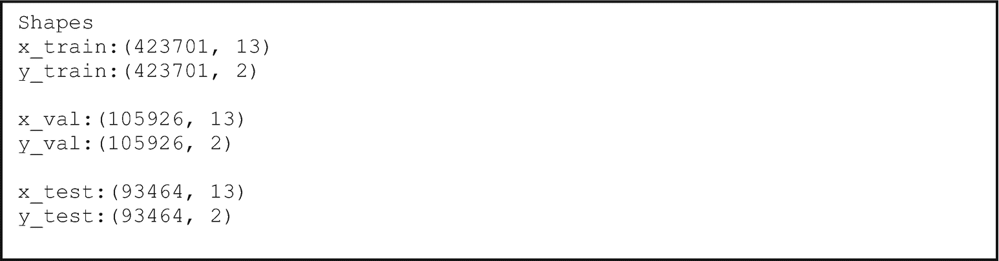

一段代码片段，定义了 x 和 y 训练、验证和测试集的形状。

图 5-54

查看应用`to_categorical()`后的 y 集的形状。它们是在两个可能的输出类别上进行了 one-hot 编码

接下来，让我们导入我们将使用的所有 Keras 组件。参见图 5-55。

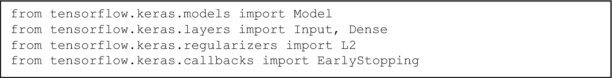

一段代码，如下所示导入。从 tensor flow dot keras dot models 导入 model。从 tensor flow dot keras dot layers 导入 Input, dense。从 tensor flow dot keras dot regularizers 导入 L 2。从 tensor flow dot keras dot call backs 导入 early stopping。

图 5-55

需要的`import`语句

现在，让我们定义我们的神经网络结构，并解释每个层类型的意义。参见图 5-56。

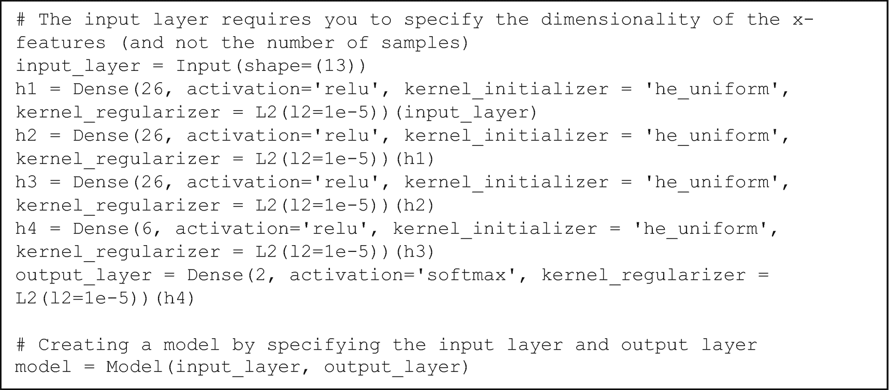

一段代码片段设置了一个前馈神经网络模型，该模型具有一个包含 13 个特征的输入层，几个具有 R e L U 激活和 L 2 正则化的隐藏层，以及一个具有 softmax 激活函数的输出层，用于二分类。

图 5-56

实现图 5-52 中描述的神经网络结构

让我们现在来了解一下每种层类型的意义：

+   **输入**：输入层指定 x 特征的维度。也就是说，每个单独的 x 数据点的维度是多少？在这种情况下，我们选择了 13 个特征传入，所以这将是一个 13。然而，也可能有多维的 x 数据点，例如具有长度、宽度和颜色通道数据的图像。

    你可以在[这里](https://www.tensorflow.org/versions/r2.7/api_docs/python/tf/keras/layers/InputLayer)找到更多关于这个层的详细信息。

+   **密集层**：这是一个由许多神经元组成的神经网络层，是本章前面讨论的基本层。这个类有许多可能的参数，但最重要的和最常用的参数是这两个：

    +   `units`：此层的神经元数量

    +   `activation`：要使用的激活函数

许多其他可能的参数，如图 5-56 中的`kernel_regularizer`，让你可以自定义`Dense`层的行为。如果你想指定如何初始化权重和偏置，你也可以这样做，以及确定是否使用偏置。有关可能参数的更多信息，请参阅[这里](https://www.tensorflow.org/versions/r2.7/api_docs/python/tf/keras/layers/Dense)。

图 5-56 中的代码还指定了`kernel_initializer`参数为`he_uniform`。这个参数用于初始化权重，并且可以显著影响模型的结果稳定性和性能。默认情况下，Keras 使用一种称为`'glorot_uniform'`的方法，这种方法更适合使用 sigmoid 或 tanh 函数的网络稳定性。（它是以 Xavier Glorot 的名字命名的。你可能看到这种方法被称为 Glorot 初始化或 Xavier 初始化。）

对于 ReLU 网络，一种称为 Kaiming Normal 或 He Normal（以 Kaiming He 的名字命名）的初始化方法对于模型稳定性和适当学习更为优化。在 PyTorch 中，默认是 Kaiming Uniform。

最后，我们通过使用`Model()`类并传入输入层和输出层来创建模型。这就是所谓的**功能 API**，当我们像图 5-56 中那样分别定义每个层，每个层都调用前一个层，然后使用输入层和输出层创建一个模型。还有一种创建模型的方法叫做**顺序 API**，我们将一系列层传递给名为`Sequential()`的类。

你可以选择哪种方法。你可以在[这里](https://www.tensorflow.org/guide/keras/functional_api)找到更多关于功能 API 的信息，以及[这里](https://www.tensorflow.org/guide/keras/sequential_model)找到更多关于顺序 API 的信息。

现在我们已经定义了我们的模型，让我们定义我们的早期停止机制并编译我们的模型。参见图 5-57。

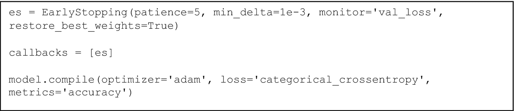

以下是一个配置早期停止、创建包含早期停止对象的回调列表的代码片段。它还使用 Adam 优化器、分类交叉熵损失函数和准确率作为评估指标来编译神经网络模型。

图 5-57

定义早期停止回调并将其添加到训练过程中要使用的回调列表中。然后，我们使用 Adam 优化器（默认参数设置）和分类交叉熵损失来编译模型。

在 Keras 中，回调是一组可以在训练过程中调用的函数。图 5-57 展示了 `EarlyStopping()` 回调函数。如果目标指标，如验证损失，在一定的 epoch 数内没有下降或保持在某个阈值内，`EarlyStopping` 将停止训练，并且可以选择恢复表现最佳的 epoch 的权重。这回到了本章前面关于损失曲线和训练过程中的最佳停止点的讨论。

以下列表解释了 `EarlyStopping` 的参数：

+   `patience`: 在没有改进后停止训练的 epoch 数。只要监控指标持续改进，即使改进很小，模型也会继续训练。如果指标在 `patience` 指定的 epoch 数内停止改进，则训练过程将提前停止。

+   `min_delta`: 考虑改进是否显著的阈值。如果监控指标在 epoch 之间的绝对变化小于 `min_delta`，则不认为是改进。如果指标在经过 `patience` 个 epoch 后未能显著改进，则训练将提前停止。

+   `monitor`: 用于早期停止的指标。将其设置为 `'val_loss'` 以监控验证损失可以帮助防止过拟合，因为如果在经过 `patience` 个 epoch 后验证损失停止下降，我们将提前停止。

+   `restore_best_weights`: 如果设置为 `True`，模型的权重将恢复到监控指标最佳值的 epoch 状态。这意味着即使模型在后续 epoch 由于过拟合而性能下降，你仍然会保留最佳模型状态。

Keras 中的其他回调函数包括 `ReduceLROnPlateau`，如果目标指标没有真正改进，它会降低学习率。这可以解决由于步长过大而引起的振荡行为，允许优化器采取更小、更精确的步骤，从而实现更好的收敛。

现在你已经熟悉了早期停止机制，你就可以开始训练模型了。参见图 5-58。

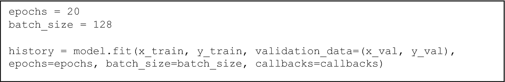

以下是一个代码片段。Epochs = 20 batch underscore size = 128\. History = model dot fit left parenthesis x underscore train, y underscore train, validation underscore data equals left parenthesis x underscore val, y underscore val right parenthesis.

图 5-58

训练模型并将训练历史保存到名为 history 的变量中。这一步是我们可以指定 epoch 数量、minibatch 大小、验证数据和训练期间使用的回调函数的地方。epoch 的数量被任意设置为 20，这比实际需要的数量要高，目的是为了演示如何通过提前停止在 20 个 epoch 之前终止训练。

由于权重是随机初始化的，您的训练可能结束在不同的 epoch 上，与示例不同。无论如何，您应该看到如图 5-59 所示的训练输出。

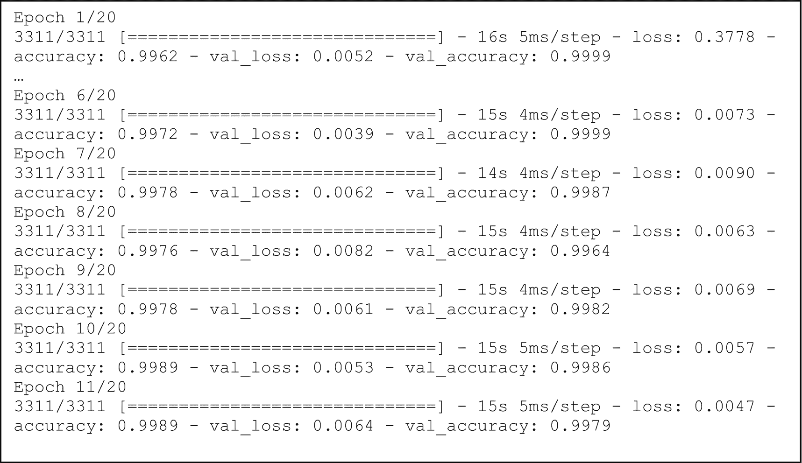

以下是一个代码片段，显示了神经网络训练过程中的 epoch 训练和验证指标。它定义了 20 个 epoch 中的 11 个及其相应的训练损失、训练准确率、验证损失和验证准确率值。

图 5-59

图 5-58 中代码的训练输出。注意，提前停止在 epoch 11 时启动并终止了训练。这是因为最佳验证损失是在 epoch 6 时实现的，但在随后的三个 epoch 中验证损失并没有“提高”，因此训练被停止，并将权重恢复到 epoch 6，因为它实现了最佳的验证损失（损失最低表示性能最佳）。

请记住，由于权重是随机初始化的，您可能看到模型实现了不同的准确率。您可以自由地从图 5-56 开始重新定义模型，并使用不同的一组初始化权重重新运行代码，因为性能可能会有波动。不过，使用`'he_uniform'`初始化时，训练性能应该是稳定的。

让我们在测试集上评估这个训练好的模型，看看我们达到了多少准确率。参见图 5-60。


以下是一行代码。Model dot evaluate left parenthesis x underscore test comma y underscore test right parenthesis.

图 5-60

模型内置的`evaluate`方法。传入测试集以自动评分模型的预测并输出损失和准确率。

评估后，您应该看到如图 5-61 所示的输出。

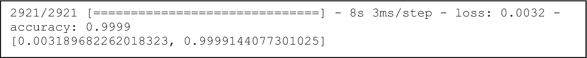

以下是一行代码。2921 slash 2921 left square bracket a string of equal signs right square bracket hyphen 8 s 3 m s slash step hyphen loss colon 0.0032 hyphen accuracy colon 0.9999 left square bracket 0.003189682262018323 comma 0.9999144077301025 right square bracket.

图 5-61

我们实现了 0.0032 的损失和 0.9999 的准确率。下面方法返回的列表给出了损失和准确率的完整、精确值。测试集上的准确率实际上是 99.9914%。

记住，如果你的类别不平衡，准确率并不是评估性能的最佳指标。让我们获取测试集的模型预测并计算精确度、召回率和 F1 分数指标。请参考图 5-62。

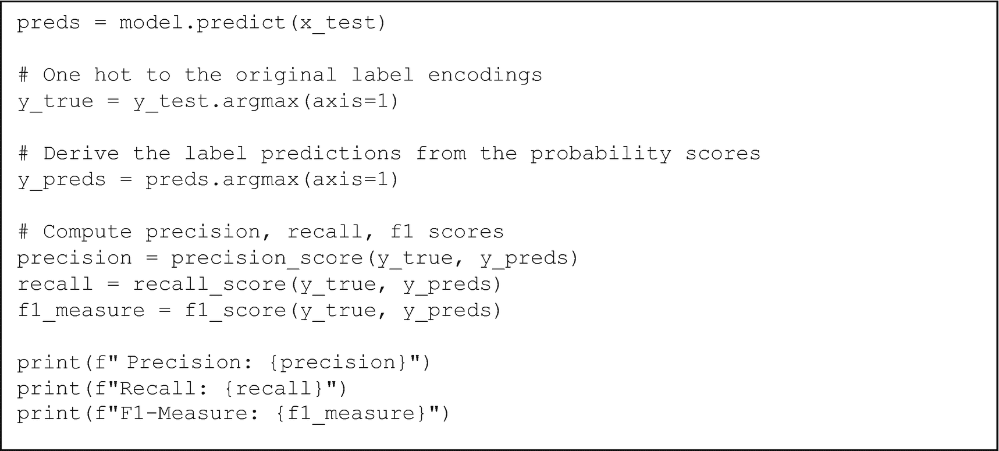

一个代码片段，使用训练好的模型预测测试特征的标签，并得到一个预测概率矩阵。它评估了训练好的神经网络模型在测试集上的性能，并打印出精确度、召回率和 F1 测量值。

图 5-62

进行预测并计算精确度、召回率和 f1 分数

如果训练过程一切顺利，你应该会看到类似于图 5-63 的输出。

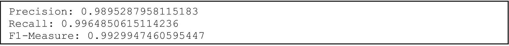

以下是一个代码片段。精确度：0.9895287958115183。召回率：0.9964850615114236。F 1 测量值：0.9929947460595447。

图 5-63

精确度、召回率和 F1 分数的输出。该模型具有非常高的精确度（几乎完美的异常预测）和非常高的召回率（捕获了测试集中的几乎所有异常）。

在此同时，让我们也计算 AUC 分数，它由以下公式给出：

```py
roc_auc_score(y_true, y_preds)
```

输出结果应该类似于 0.9982102362296339，这是一个非常强大的异常检测器。为了结束这个建模实验，让我们计算并可视化混淆矩阵。请参考图 5-64 中的代码。

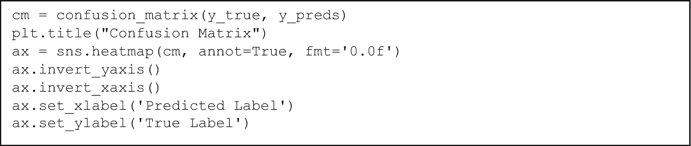

一个代码片段，使用 y 真实标签和 y 预测标签生成混淆矩阵。它反转了轴以匹配混淆矩阵的传统表示，并在相应的轴上添加了预测和真实类别的标签。

图 5-64

计算并绘制测试集预测和真实 y 标签的混淆矩阵的代码。

混淆矩阵结果应类似于图 5-65。

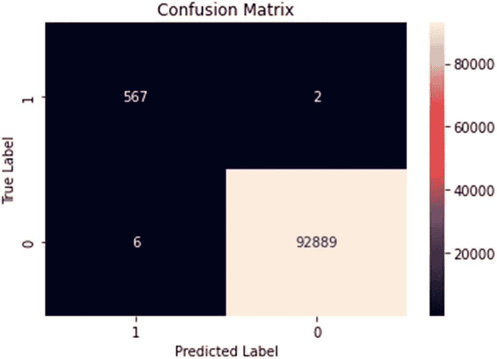

这是一个 2x2 的混淆矩阵。数值如下。567 (1, 1)，2 (1, 0)，6 (0, 1)，92889 (0, 0)。

图 5-65

模型在测试集上的预测性能的混淆矩阵结果。有 6 个假阳性（预测为 1，但实际为 0）和 2 个假阴性（预测为 0，但实际为 1）。

这样，你现在就知道了如何从头开始实现神经网络，使用 TensorFlow 和 Keras 训练它，并评估它。现在让我们用 PyTorch 做同样的事情。

### 简单神经网络：PyTorch

请确保跟随笔记本[`github.com/apress/beginning-anomaly-detection-python-deep-learning-2e/blob/master/Chapter%205%20Introduction%20to%20Deep%20Learning/chapter5_mlp_pytorch.ipynb`](https://github.com/apress/beginning-anomaly-detection-python-deep-learning-2e/blob/master/Chapter%205%20Introduction%20to%20Deep%20Learning/chapter5_mlp_pytorch.ipynb)。我们正在运行 torch 版本 1.9.0+cu111。

我们不需要使用 PyTorch 进行任何 one-hot 编码。然而，我们将使用 PyTorch 的 API 构建数据加载器，这样我们就可以轻松地将数据集分批，并在训练期间采样小批量。请参考图 5-66 以查看导入所有必要组件的代码。

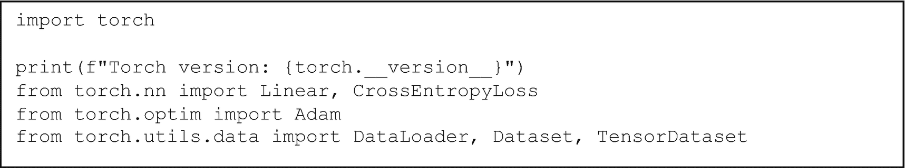

一个代码片段导入 torch 类并打印 torch 版本。从 torch.dot.nn 导入 linear 和交叉熵损失。从 torch.dot.optim 导入 Adam。从 torch.dot.utils.dot.data 导入数据加载器、数据集和 tensor 数据集。

图 5-66

从 PyTorch 导入所需的类和实用工具。

让我们创建我们的数据加载器。这是一个三步过程：

1.  将我们的数据集转换为张量。

1.  从张量创建 TensorDataset。

1.  使用 TensorDataset 创建数据加载器。

请参考图 5-67 以查看此代码。

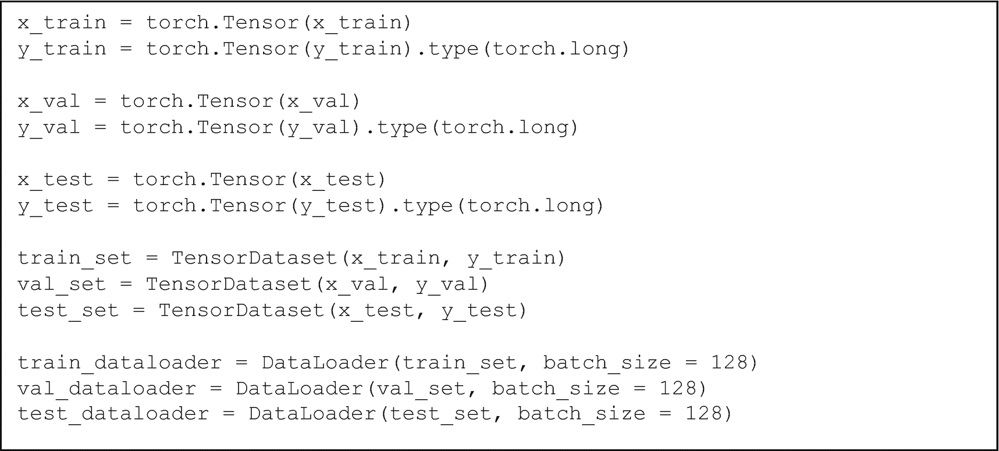

一个代码片段涉及将训练、验证和测试数据转换为 PyTorch 张量，根据需要指定数据类型。它使用张量化数据创建了 PyTorch 数据集 train_set、val_set 和 test_set。

图 5-67

创建用于训练和评估过程的数据加载器对象。

现在我们已经准备好了数据集，让我们看看如何在 PyTorch 中构建模型，这相对简单。我们将为我们的自定义模型构造一个类，并在其中定义所有层。请参考图 5-68。

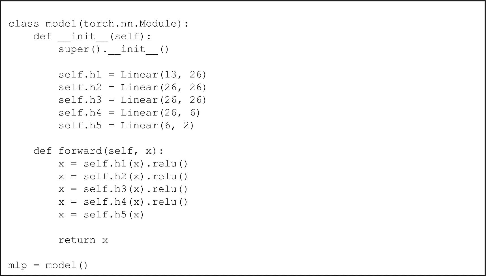

一个由五个全连接线性层组成的代码片段，每个层后面都跟着一个 R e L U 激活函数。它输入一个变量 x，并通过前向方法将 x 传递到每一层。

图 5-68

在 PyTorch 中构建模型。我们首先可以将层定义为私有变量（不是必需的，但这是一个标准的做法），然后在 `forward()` 函数中确定输入数据是如何通过所有层的。

PyTorch 中的层在参数方面更为直接。对于 `Linear` 层的文档，请参考[`pytorch.org/docs/stable/generated/torch.nn.Linear.xhtml`](https://pytorch.org/docs/stable/generated/torch.nn.Linear.xhtml)。

在此之后，我们必须定义我们的优化器是什么以及我们的损失函数是什么。我们将选择 Adam 优化器和分类交叉熵损失（在 PyTorch 中简称为 `CrossEntropyLoss`）。参见图 5-69。

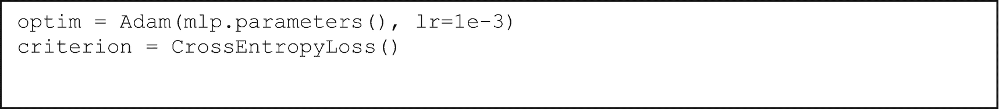

以下是一个代码片段。Optim 等于 Adam 左括号 m l p 点 parameters 空括号，l r 等于 1 e minus 3 右括号 criterion 等于交叉熵损失 空括号。

图 5-69

定义优化器和损失函数。优化器作为第一个参数接受模型的可学习参数，我们可以通过使用 `model_name.parameters()` 获取这些参数。我们传入的学习率是 1e-3

现在我们可以定义我们的训练循环，其中包含了早期停止功能。参数 `patience` 在 Keras `EarlyStopping` 回调函数中的作用与此相同，而 `tolerance` 变量相当于 `EarlyStopping` 中的 `min_delta`。我们使用 PyTorch 的保存/加载功能手动保存最佳路径，以便我们可以保留表现最佳模型的权重。

这是一个很长的训练循环，所以我们将其分成两个图：图 5-70 和图 5-71。注意缩进——验证循环应该与实际的训练 `for` 循环处于相同的缩进级别。为了最佳一致性，请参考 GitHub 笔记本。

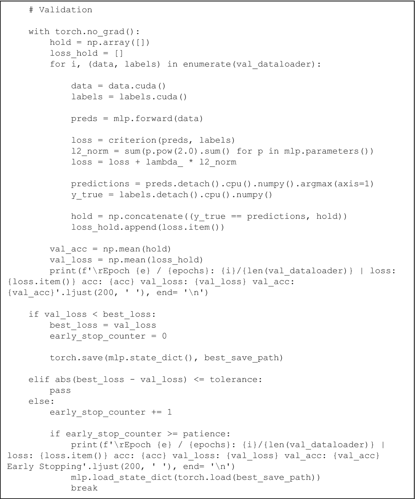

一个代码片段，实现了基于验证损失的早期停止的验证循环。如果验证损失在指定的轮数内没有改善，这些轮数由耐心方法定义，则停止训练，并加载最佳模型。

图 5-71

训练循环的第二部分，包含验证逻辑以及早期停止器的逻辑。想法是验证损失要么是最佳的，要么在最佳验证损失阈值内的绝对偏差内。如果不是，我们增加计数器，直到达到 `patience` 限制，然后进行早期停止

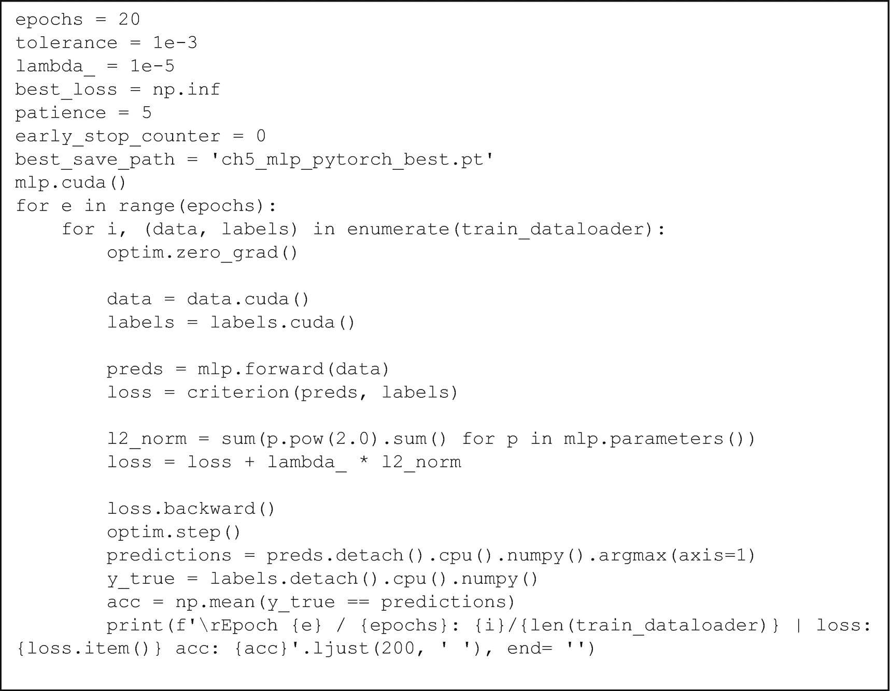

一个运行 20 轮的代码片段。它使用了梯度下降、前向传递、L 2 正则化、早期停止计数器和反向传递以及准确度预测。

图 5-70

训练脚本的第一个部分。这包含了早期停止算法的所有超参数设置以及训练循环本身，例如训练轮数

图 5-70 和 5-71 包含了整个训练循环。执行代码应启动训练过程和训练输出。完成后，你应该会看到类似于图 5-72 的输出。

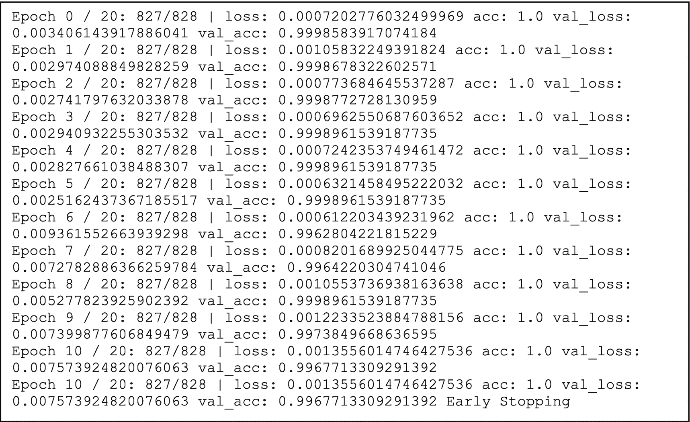

一个代码，表示每个 epoch 的训练进度。从 epoch 0 到 5，训练损失持续下降。在 epoch 6 中，验证损失略有提高。从 epoch 7 开始，验证损失继续增加，验证准确度下降。

图 5-72

图 5-70 和 5-71 中代码的训练输出，即训练脚本。我们提前停止了训练，因为验证损失在达到最低点后不再提高，这表明过拟合。我们恢复了最佳权重，因此我们不保留过拟合的权重。

一旦我们有了训练好的模型，我们就可以开始评估循环，以类似 Keras 模型的`evaluate`函数的方式获取损失和准确度。请参考图 5-73 查看代码。

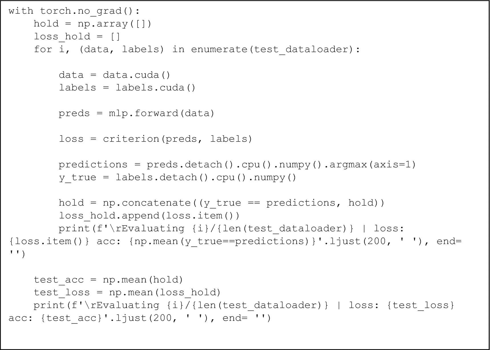

一个代码片段提供了对训练模型在测试集上的评估，包括每个批次的损失和准确度指标以及整个测试集的整体指标。

图 5-73

评估代码，与验证循环相同。

执行图 5-73 中代码的输出应该看起来类似于图 5-74。

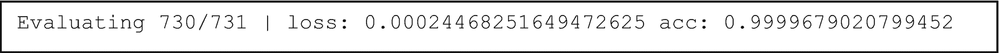

一行代码的读法如下。评估 730/731 管道符号损失：0.00024468251649472625 准确度：0.9999679020799452。

图 5-74

执行图 5-73 中评估代码的输出。模型实现了非常接近的收敛——比这个案例中的 Keras 模型更接近。

现在，让我们看看精确度、召回率和相关指标。执行图 5-75 中的代码。

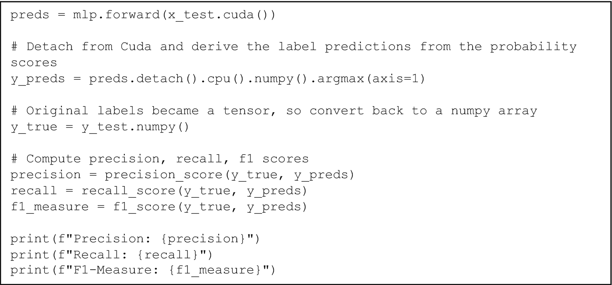

一个代码块，使用训练好的模型 m l p 在测试集上进行推理，并计算分类任务的精确度、召回率和 F1 度量分数。它打印出计算出的精确度、召回率和 F1 度量分数。

图 5-75

计算精确度、召回率和 F1 度量分数

你应该看到图 5-76 中所示的输出。

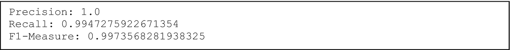

一个输出如下所示。精确度 1.0。召回率 0.9947275922671354。F1 度量 0.9973568281938325。

图 5-76

模型实现了完美的精确度，这意味着其所有异常预测都是正确的。其召回率几乎完美，这意味着在所有真实异常中，模型几乎都得到了它们。

要计算 AUC 分数，执行

```py
roc_auc_score(y_true, y_preds)
```

你应该看到一个结果，类似于 0.9973637961335677，这表明一个非常强大的预测器。

最后，让我们观察混淆矩阵。请参考图 5-77 中的代码。

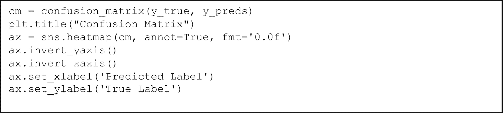

一段代码定义了一个使用真实标签 y 和预测标签 y 的混淆矩阵。它创建了一个热图。坐标轴被反转以设置标签。x 标签设置为预测标签，y 标签设置为真实标签。

图 5-77

计算并绘制混淆矩阵的代码

结果如图 5-78 所示。


混淆矩阵绘制以下数据。右侧的热图范围从 0 到 80000。数据如下：566 (1, 1)，3 (1, 0)，0 (0, 1)，92895 (0, 0)。

图 5-78

图 5-77 中的代码生成的混淆矩阵。模型几乎完美地执行，除了三个错误的负例。

如我们从图 5-78 所见，这是一个非常强大的异常检测模型。现在您知道了如何在 PyTorch 中实现、训练和评估神经网络。

## 摘要

本章为您提供了对深度学习的坚实基础理解，包括它是如何工作的，以及如何在 TensorFlow/Keras 和 PyTorch 中实现神经网络。利用这些知识，您应该能够跟随本书的其余部分，深入了解各种深度学习架构的实现，以执行异常检测。

在第六章中，您将了解到自动编码器的概念，自动编码器的不同变体，以及它们如何应用于异常检测任务。
